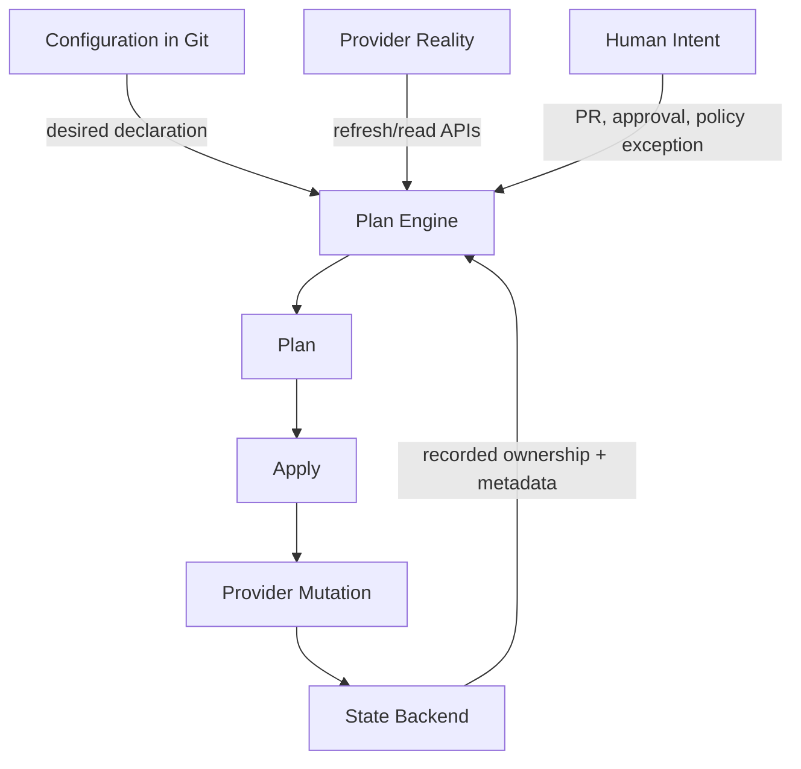
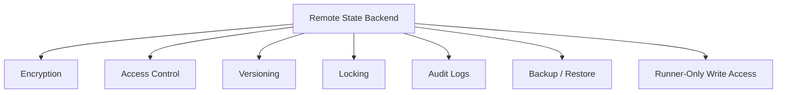
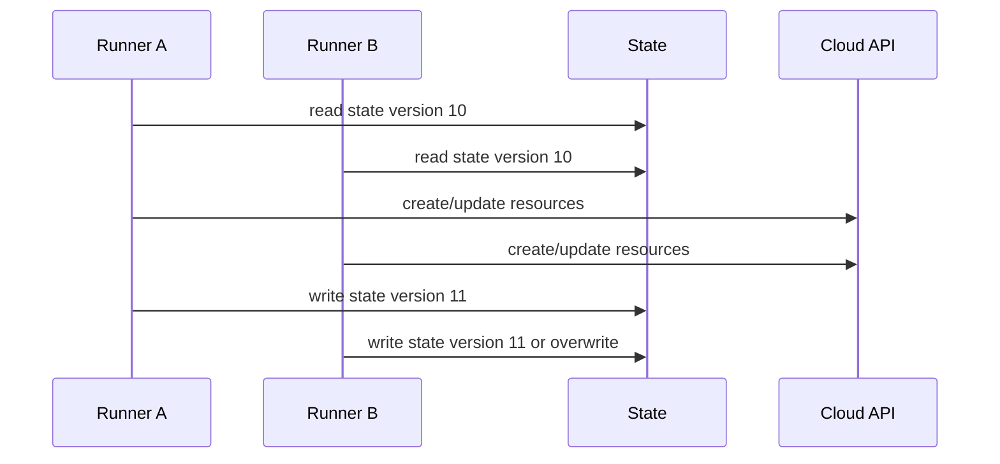
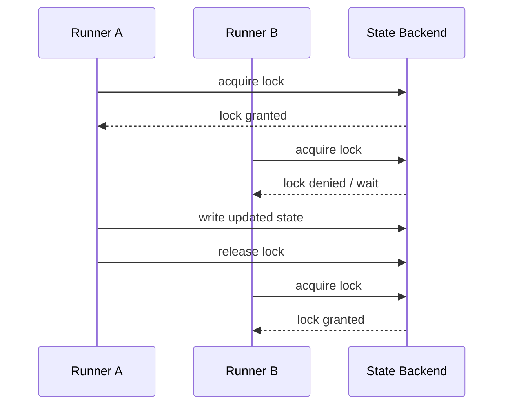
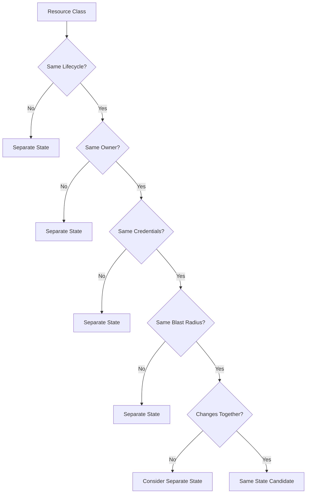
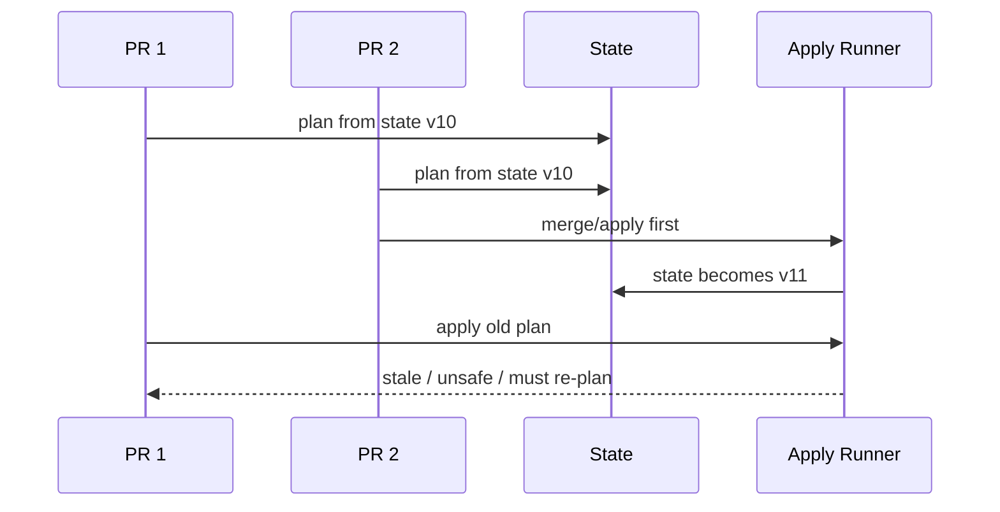
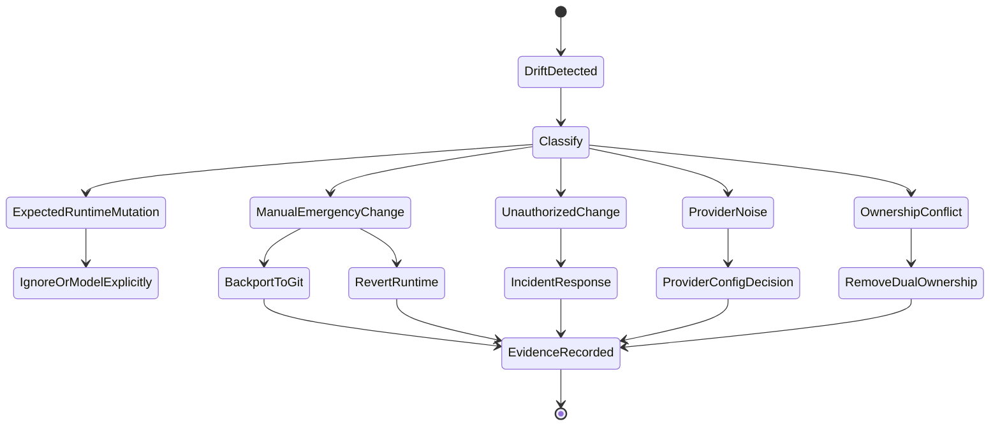
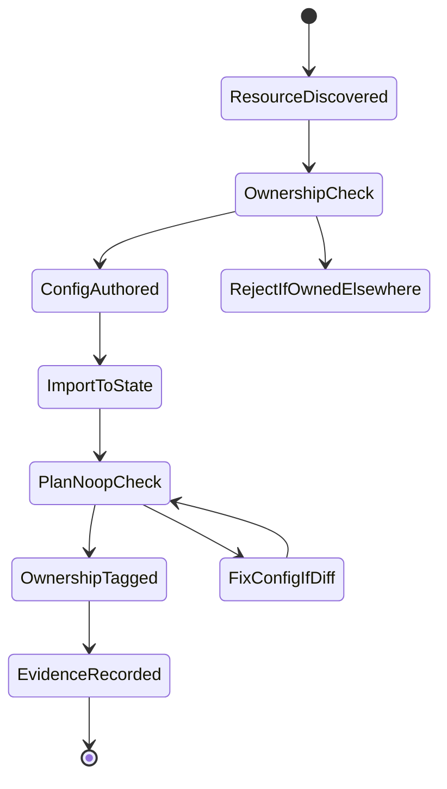
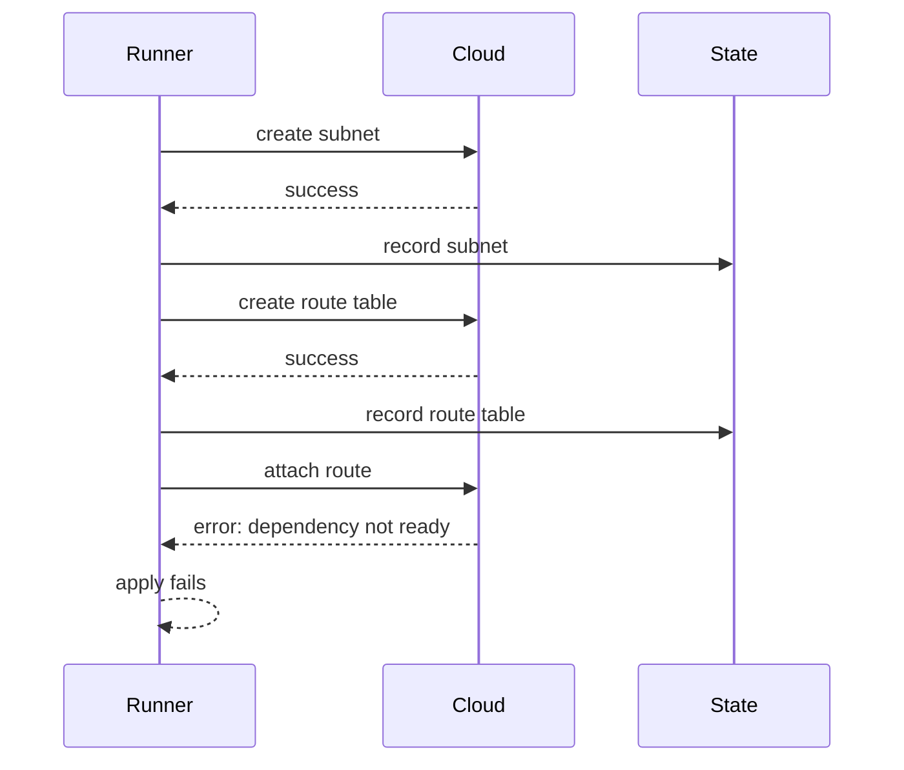
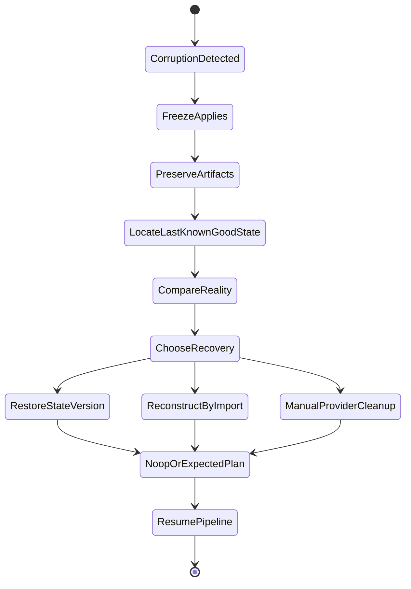

# Part 008 — Terraform/OpenTofu State Model and Failure Modes

Terraform/OpenTofu state is often introduced casually:

> “It stores what Terraform manages.”

That explanation is not wrong, but it is dangerously incomplete.

In production, state is not a cache. It is not an implementation detail. It is not a file you can casually edit because a blog post said so.

State is the engine's **memory of ownership**.

It maps configuration addresses to real-world resources. It tracks metadata. It helps the engine compute changes. It carries dependencies and provider-specific values. It may contain sensitive data. It is used to decide whether a future apply creates, updates, replaces, or deletes infrastructure.

If state is wrong, the engine's decisions can be wrong.

A production-grade GitOps/IaC pipeline is only as safe as its state model.

---

## 1. The Four Worlds: Config, State, Reality, Intent

To reason about Terraform/OpenTofu, separate four worlds.



The four worlds are:

| World | Meaning | Typical Failure |
|---|---|---|
| Configuration | What Git says should exist | wrong module input, bad refactor, unsafe delete |
| State | What the engine remembers it owns | stale state, corrupt state, wrong import, lock failure |
| Reality | What cloud/provider APIs actually contain | manual drift, provider eventual consistency, external mutation |
| Intent | What humans meant and approved | approval mismatch, stale plan, unclear risk |

A plan is computed from the interaction of these worlds.

The pipeline must keep them aligned enough to mutate safely.

---

## 2. What State Actually Does

State exists because providers and real infrastructure do not behave like pure functions.

Terraform/OpenTofu needs state to:

- map a resource address to a real provider object ID;
- remember metadata not present in configuration;
- store dependency information;
- improve performance for large infrastructures;
- detect drift during refresh;
- know whether a resource was renamed, moved, imported, or deleted;
- decide whether an operation is create, update, replace, or delete;
- store output values;
- preserve provider-specific attributes;
- coordinate future operations.

Example:

```hcl
resource "aws_s3_bucket" "audit" {
  bucket = "prod-audit-log-123"
}
```

The configuration says there should be a bucket. The state records that `aws_s3_bucket.audit` corresponds to a specific real bucket object in the provider.

If you rename the resource address without telling the engine, it may think the old resource was removed and a new one was added.

Configuration changed from:

```hcl
resource "aws_s3_bucket" "audit" {
  bucket = "prod-audit-log-123"
}
```

to:

```hcl
resource "aws_s3_bucket" "audit_logs" {
  bucket = "prod-audit-log-123"
}
```

A human sees a rename.

The engine may see:

- destroy `aws_s3_bucket.audit`;
- create `aws_s3_bucket.audit_logs`.

Unless you use a safe state move/refactor procedure, a harmless-looking rename can become a destructive change.

---

## 3. State Is a Database, Not a File

The filename may be `terraform.tfstate`, but the operational reality is database-like.

It has:

- schema;
- records;
- ownership mappings;
- version history;
- access control requirements;
- consistency needs;
- backup and restore requirements;
- mutation procedures;
- corruption failure modes.

Treating state as a simple file creates bad practices:

- local applies from laptops;
- copying state files between directories;
- manual edits without backup;
- storing state in unencrypted buckets;
- sharing broad read access;
- using one giant state for everything;
- disabling locks;
- applying from multiple runners at once;
- deleting state to “fix” errors;
- ignoring secrets inside state.

Production principle:

> State is a critical production datastore. Design it with the same seriousness as any control-plane database.

---

## 4. Backend Design

A backend decides where state is stored and whether locking is available.

Production-grade backend design should provide:

- remote shared storage;
- encryption at rest;
- encryption in transit;
- access control;
- versioning/history;
- locking;
- audit logs;
- backup/restore path;
- separation by environment and state boundary;
- operational ownership.

### 4.1 Local Backend Is Not for Shared Production

Local state is acceptable for experiments, isolated learning, or disposable prototypes.

It is not acceptable for shared production infrastructure.

Why?

- no shared locking;
- no team visibility;
- easy loss/corruption;
- hard to audit;
- high chance of drift from laptop-specific operations;
- secrets may land on developer machines;
- state may not be backed up.

### 4.2 Remote Backend Is the Minimum

Remote backend centralizes state.

Examples:

- object storage backend;
- Terraform Cloud/Enterprise-like backend;
- OpenTofu-compatible remote backend;
- cloud storage plus lock table depending on provider/backend;
- managed IaC execution platform backend.

Remote backend is not automatically safe. It must still be configured correctly.

Minimum requirements:



### 4.3 Access Control Model

A safe state backend usually has three access tiers.

| Actor | Read State | Write State | Lock State | Notes |
|---|---:|---:|---:|---|
| Plan runner | yes | no or limited | no or backend-dependent | can produce speculative plan |
| Apply runner | yes | yes | yes | only controlled pipeline role |
| Human break-glass | temporary | temporary | temporary | approval + audit required |

For sensitive environments, developers should not have direct write access to production state.

In many cases, they should not have direct read access either because state may contain secrets or sensitive topology data.

---

## 5. State Locking

Locking prevents concurrent writers from mutating the same state at the same time.

The risk is simple:



Without locking, both runners can make decisions based on stale assumptions.

With locking:



Production rule:

> Apply must be serialized per state boundary.

Parallel applies are acceptable only when they target different independent states.

---

## 6. The State Boundary Problem

The most important design question is not “where do we store state?”

It is:

> “What belongs in the same state?”

A state boundary defines the unit of:

- planning;
- locking;
- applying;
- blast radius;
- ownership;
- credentials;
- rollback;
- drift detection;
- evidence;
- failure recovery.

Bad state boundary:

```text
prod-all-infra.tfstate
```

Everything is in one state:

- network;
- IAM;
- databases;
- queues;
- clusters;
- monitoring;
- app-specific resources.

Consequences:

- every plan is large;
- lock contention increases;
- unrelated changes block each other;
- provider refresh is slow;
- blast radius is unclear;
- permissions are too broad;
- recovery is harder;
- small refactors are scary.

Better boundary:

```text
prod/network/core.tfstate
prod/iam/baseline.tfstate
prod/eks/platform-cluster.tfstate
prod/data/payments-postgres.tfstate
prod/messaging/payments-kafka.tfstate
prod/observability/baseline.tfstate
```

But splitting too much also has cost.

If every resource has its own state, orchestration becomes painful.

### 6.1 Boundary Heuristics

Put resources in the same state when they:

- have the same lifecycle;
- have the same owner;
- require the same credentials;
- change together;
- have similar blast radius;
- can be recovered together;
- are reviewed by the same team;
- do not need independent locking.

Split resources into different states when they:

- have different owners;
- have different approval requirements;
- create high lock contention;
- have different sensitivity;
- change at very different frequencies;
- have different recovery procedures;
- should not share credentials;
- are in different accounts/regions/environments;
- create too-large plans.

### 6.2 Boundary as Architecture

A state boundary is an architecture boundary.

Do not let directory convenience decide it.

Use this model:



---

## 7. Workspaces Are Not a Universal Environment Model

Terraform/OpenTofu workspaces can separate state for the same configuration.

They are useful in some cases, but dangerous when used as the only environment modeling strategy.

Bad assumption:

> “We can use one codebase and workspaces for dev, staging, and prod, so environments are solved.”

The problem is that environments often differ in more than variable values:

- account/project IDs;
- region topology;
- network constraints;
- approval policy;
- provider credentials;
- data retention;
- scaling limits;
- deletion rules;
- compliance controls;
- disaster recovery posture.

If the difference is only small parameter values, workspaces may be acceptable.

If the difference is governance and topology, explicit environment directories/stacks are usually clearer.

### 7.1 Workspace Risk Table

| Usage | Risk | Recommendation |
|---|---|---|
| ephemeral preview envs | low/medium | acceptable with automation |
| identical dev/test stacks | medium | acceptable if credentials are scoped |
| prod vs non-prod | high | prefer explicit state/config boundary |
| multiple tenants | high | prefer explicit tenant boundary |
| regulated prod | high | avoid relying only on workspace name |

The workspace name should not be the only thing preventing a dev apply from touching prod.

---

## 8. Plan, Saved Plan, and Stale Plan

A plan is a snapshot of intended operations based on configuration, state, provider reality, variables, and provider behavior at a point in time.

Between plan and apply, things can change:

- Git branch changes;
- state changes;
- provider reality changes;
- credentials change;
- module/provider versions change;
- policy changes;
- environment variables change.

Therefore:

> A plan is not timeless truth. It is evidence captured at a moment.

### 8.1 Speculative Plan

A speculative plan is produced for review.

It answers:

> “If applied now, what would probably change?”

It should be posted to the PR.

It should not automatically mutate production.

### 8.2 Apply Plan

For high-risk changes, the apply should either:

- apply a saved reviewed plan artifact under strict immutability rules; or
- re-plan after merge and require policy/approval rules that account for differences.

The key invariant is:

> The mutation must be bound to the reviewed change.

If the plan reviewed by humans differs materially from the plan applied by the runner, approval is weak.

### 8.3 Stale Plan Failure



Safe behavior:

- detect stale state;
- fail apply;
- re-plan;
- re-evaluate policy;
- require re-approval if material difference exists.

---

## 9. Drift

Drift means actual provider reality differs from expected state/configuration.

Not all drift is equal.

### 9.1 Drift Taxonomy

| Drift Type | Example | Risk | Response |
|---|---|---|---|
| Manual emergency drift | SRE opens firewall during incident | medium/high | record, backport or revert |
| Unauthorized drift | console user changes IAM policy | high | investigate, revert, rotate if needed |
| Provider-side drift | cloud service changes default attr | low/medium | update config/provider or ignore explicitly |
| External controller drift | another system mutates resource | high | fix ownership conflict |
| Ephemeral drift | autoscaling adjusts replicas | low if expected | do not manage with wrong engine |
| Security drift | encryption disabled, public access enabled | critical | alert and remediate |
| Cost drift | instance size changed | medium/high | detect and review |

### 9.2 Drift Response State Machine



Drift detection is not enough. You need classification and response.

### 9.3 Auto-Remediation Is Not Always Safe

For Kubernetes app resources, auto-healing drift is often good.

For cloud IAM, network, or databases, automatic remediation may be dangerous.

A production drift policy should specify:

- detect only;
- detect and notify;
- detect and open PR;
- detect and auto-revert;
- detect and page;
- detect and require incident review.

Do not apply one drift policy to all resources.

---

## 10. Importing Existing Resources

Many production systems start before IaC. Eventually, you need to import existing resources into state.

Import is dangerous because it creates ownership.

Before import:

- identify real resource ID;
- confirm no other engine owns it;
- create matching configuration;
- run plan after import;
- verify no unexpected changes;
- tag ownership;
- document recovery path;
- get approval for production ownership adoption.

Import state machine:



The target after import is usually a no-op plan.

If import produces a large unexpected diff, do not apply blindly. Fix configuration until the engine's desired view matches reality, or make a deliberate migration plan.

---

## 11. Refactoring State Safely

Refactoring IaC is not the same as refactoring application code.

Changing resource addresses can imply destruction unless state is moved or moved blocks are used correctly.

Common refactors:

- rename resource;
- move resource into module;
- split module;
- split state;
- merge state;
- replace provider alias;
- change count/for_each keys;
- rename workspace/stack boundary.

Safe refactor procedure:

1. freeze unrelated changes;
2. backup state;
3. produce current no-op plan;
4. make minimal refactor;
5. use supported move/import/state operations;
6. run plan;
7. verify no unintended creates/deletes;
8. get review from state owner;
9. apply if needed;
10. record evidence.

Production rule:

> Refactors that change state addresses are state migrations, not simple code cleanup.

---

## 12. Partial Apply Failure

An apply can fail after mutating some resources.

Example:



Now the system is not unchanged.

Some resources exist. State may or may not contain all of them depending on when failure occurred.

Response:

- do not panic-delete randomly;
- inspect state;
- inspect provider reality;
- re-run plan;
- classify whether retry is safe;
- import orphaned resources if necessary;
- manually clean up only with evidence;
- record incident if production-impacting.

### 12.1 Partial Failure Playbook

```md
# Partial Apply Failure Playbook

1. Stop concurrent applies for the state boundary.
2. Preserve logs, plan artifact, commit, and state version.
3. Confirm whether state lock is still held.
4. Inspect state version after failure.
5. Inspect provider reality for resources created during the failed apply.
6. Run a fresh plan without applying.
7. Classify result:
   - safe retry;
   - requires import;
   - requires manual cleanup;
   - requires rollforward PR;
   - requires rollback PR;
   - requires incident response.
8. Execute chosen path with approval.
9. Record evidence and update runbook if new failure mode was found.
```

---

## 13. Lock Stuck Failure

A lock can remain stuck if a runner crashes or loses connectivity.

Do not force-unlock casually.

A lock means:

> “The system believes another operation may be writing state.”

Before force unlock:

- confirm no runner is still active;
- check CI job status;
- check apply logs;
- check backend lock metadata;
- check cloud/provider activity;
- notify state owner;
- record reason;
- require approval for production;
- preserve evidence.

Force unlock is a break-glass operation.

It should have a runbook and audit trail.

---

## 14. State Corruption

State corruption can mean:

- invalid JSON/state format;
- missing resources;
- wrong resource IDs;
- conflicting provider metadata;
- state overwritten by stale run;
- accidental deletion;
- manual bad edit;
- backend version loss;
- partial migration failure.

Recovery depends on backend versioning and evidence.

### 14.1 State Corruption Recovery



Minimum recovery capability requires:

- backend versioning;
- state backups;
- plan/apply logs;
- provider audit logs;
- resource tagging;
- import procedure;
- owner knowledge.

If you do not have these, recovery becomes archaeology.

---

## 15. Secrets in State

State may contain sensitive values.

Even if an attribute is marked sensitive in CLI output, it can still be stored in state depending on provider behavior.

Examples:

- generated passwords;
- connection strings;
- access keys;
- tokens;
- private endpoints;
- secret ARNs/paths;
- database usernames;
- internal hostnames;
- IAM policy details.

Production rules:

- restrict state read access;
- encrypt backend storage;
- avoid storing raw secret values where possible;
- prefer references to secret managers;
- rotate secrets if state exposure occurs;
- audit who accessed state;
- do not upload state to tickets or chat;
- treat state snapshots as sensitive artifacts.

Bad pattern:

```hcl
output "db_password" {
  value = random_password.db.result
}
```

Better pattern:

- write generated secret to secret manager;
- output only secret reference/path if needed;
- ensure state access remains restricted anyway.

Sensitive marking improves output hygiene. It is not a complete state security boundary.

---

## 16. Provider Version and State Schema

Providers evolve. State schemas evolve.

A provider upgrade can change:

- attribute names;
- defaults;
- computed values;
- diff behavior;
- validation rules;
- import behavior;
- replacement behavior;
- refresh behavior.

Production rules:

- pin provider versions;
- upgrade providers deliberately;
- run plans in lower environments first;
- inspect large diffs after provider upgrades;
- avoid combining provider upgrade with unrelated infra change;
- preserve state backup before major upgrades;
- document provider-specific breaking changes.

Bad PR:

> upgrade AWS provider + rename modules + change prod networking + modify IAM

Good PR sequence:

1. provider upgrade only in dev;
2. provider upgrade only in staging;
3. provider upgrade only in prod;
4. module refactor separately;
5. behavior change separately.

---

## 17. Count and For_Each Address Stability

Resource addresses matter.

Using `count` with ordered lists can create unstable addresses.

Example:

```hcl
resource "example_user" "user" {
  count = length(var.users)
  name  = var.users[count.index]
}
```

If `var.users` changes from:

```hcl
["alice", "bob", "carol"]
```

to:

```hcl
["alice", "carol"]
```

then indexes shift. The engine may interpret `bob` removal as changes to later indexed resources.

Prefer stable keys for long-lived resources:

```hcl
resource "example_user" "user" {
  for_each = toset(var.users)
  name     = each.key
}
```

For production resources, address stability is not cosmetic. It is safety.

---

## 18. Lifecycle Controls

Lifecycle controls can protect against dangerous operations, but they can also hide bad design.

Common controls:

- prevent destroy;
- create before destroy;
- ignore changes;
- replace triggered by;
- explicit dependencies.

### 18.1 Prevent Destroy

Useful for:

- databases;
- buckets with retained data;
- production DNS zones;
- encryption keys;
- identity roots.

Risk:

- can block legitimate decommissioning;
- may create false sense of safety if state operations bypass normal apply.

### 18.2 Ignore Changes

Useful when:

- external controller legitimately changes a field;
- provider reports noisy computed values;
- runtime-managed values should not be forced back.

Risk:

- can hide real drift;
- can mask unauthorized changes;
- can create unclear ownership.

Production rule:

> Every ignored field should have a reason and owner.

---

## 19. Plan Noise

A noisy plan is dangerous because reviewers stop reading.

Sources of noise:

- provider computed values;
- unstable ordering;
- timestamp fields;
- generated names;
- template formatting differences;
- broad module refactor;
- provider version change;
- data sources that change frequently;
- environment-specific defaults.

Plan noise turns review into theater.

Reduce noise by:

- pinning provider versions;
- stabilizing keys;
- avoiding unstable data sources;
- separating refactor from behavior change;
- using explicit defaults;
- modeling external mutations deliberately;
- splitting large states;
- improving module output clarity.

A good plan should make risk visible.

---

## 20. State and Credentials

State operations require credentials to provider APIs and backend.

Separate these:

| Credential Type | Purpose | Risk |
|---|---|---|
| backend read | read state | exposes sensitive topology/secrets |
| backend write | update state | corrupt or hijack ownership |
| backend lock | serialize operation | block or bypass safe apply |
| provider read | refresh reality | enumerate infrastructure |
| provider write | mutate infrastructure | create/update/delete resources |

Production runners should use short-lived credentials, ideally through OIDC/workload identity.

Avoid long-lived static cloud keys in CI.

Credential scope should match state boundary.

A runner applying `prod/network/core` should not have permissions to mutate every production resource unless genuinely required.

---

## 21. State Boundary Naming Convention

Use names that encode ownership and blast radius.

Example:

```text
env=<prod>
account=<payments-prod>
region=<ap-southeast-1>
domain=<network>
component=<core>
owner=<platform-network>
```

Possible backend key:

```text
prod/payments-prod/ap-southeast-1/network/core.tfstate
```

Good state names answer:

- which environment?
- which account/project?
- which region?
- which domain?
- which owner?
- which component?

Bad state names:

```text
terraform.tfstate
main.tfstate
prod.tfstate
infra.tfstate
new.tfstate
```

A vague state name is an incident waiting to happen.

---

## 22. Evidence Model for State Mutations

Every apply should produce evidence.

Minimum evidence:

```yaml
change_id: CHG-2026-07-03-00123
repository: platform/infra-live
commit: 9f4c2ab
state_boundary: prod/payments-prod/ap-southeast-1/network/core
engine: opentofu
engine_version: 1.x
provider_versions:
  aws: 5.x
actor: ci-apply-runner
requested_by: alice@example.com
approved_by:
  - platform-network-lead@example.com
  - security-reviewer@example.com
plan_artifact: s3://evidence/plans/...
policy_result: pass
risk_class: high
started_at: 2026-07-03T09:00:00Z
finished_at: 2026-07-03T09:08:00Z
result: success
state_version_before: v103
state_version_after: v104
destructive_changes: false
```

This is not bureaucracy. It is what lets you answer:

- who changed prod?
- what changed?
- what plan was approved?
- which state was touched?
- did policy pass?
- what version did state move from/to?
- how do we recover?

---

## 23. State Operation Authorization

State operations are special.

Examples:

- state list;
- state show;
- state mv;
- state rm;
- import;
- force unlock;
- backend migration;
- manual state edit.

These are not normal code changes.

They can change ownership without changing provider reality.

Production rule:

> State operations require a stricter workflow than normal config changes.

Recommended controls:

- separate state-admin role;
- approval required for prod;
- read-only dry run where possible;
- state backup before operation;
- paired review;
- command transcript stored as evidence;
- fresh plan after operation;
- no-op or expected-diff verification;
- incident/change record update.

---

## 24. Monolithic State Failure Scenario

Imagine one `prod.tfstate` owns:

- VPC;
- IAM;
- EKS;
- RDS;
- Kafka;
- Route53;
- observability;
- app queues.

A developer changes one queue.

The plan refreshes everything.

The provider returns a changed default for a database parameter.

The plan now contains queue change plus database noise.

A reviewer misses that a replacement is planned for a subnet.

The apply locks all prod infra.

Another urgent network fix waits.

Apply fails halfway because IAM propagation is delayed.

Now the entire prod state is in recovery mode.

This is not a tool failure. It is a state boundary failure.

---

## 25. Too Many States Failure Scenario

The opposite failure exists.

Every small resource has its own state:

```text
prod/iam/role-a.tfstate
prod/iam/policy-a.tfstate
prod/iam/attachment-a.tfstate
prod/network/subnet-a.tfstate
prod/network/route-a.tfstate
```

Problems:

- dependency orchestration becomes complex;
- output wiring becomes fragile;
- plans are too fragmented;
- promotion requires many tiny operations;
- evidence is scattered;
- humans cannot see whole change context;
- partial upgrades leave inconsistent stacks.

This is also bad design.

The goal is not maximum splitting. The goal is coherent lifecycle boundaries.

---

## 26. State Boundary Design Checklist

For each proposed state, answer:

```md
## State Boundary: <name>

### Ownership
- Owning team:
- On-call team:
- Business/system domain:

### Scope
- Resource classes included:
- Resource classes excluded:
- Environments:
- Accounts/projects:
- Regions:

### Credentials
- Provider read role:
- Provider write role:
- Backend read role:
- Backend write role:

### Change Model
- Expected change frequency:
- Approval requirement:
- Destructive change rule:
- Emergency path:

### Locking
- Backend supports lock: yes/no
- Apply serialization mechanism:
- Force unlock approval:

### Drift
- Detection cadence:
- Auto-remediation: yes/no/conditional
- Drift owner:

### Recovery
- State versioning enabled:
- Backup location:
- Import procedure:
- Last-known-good restore path:

### Evidence
- Plan artifact location:
- Apply logs:
- Policy result:
- State version before/after:
```

If the team cannot fill this out, the boundary is not production-ready.

---

## 27. GitOps/IaC Pipeline Requirements for State Safety

A safe pipeline enforces:

1. no direct prod apply from laptops;
2. remote backend only;
3. apply serialization per state;
4. state write access only from controlled runner;
5. speculative plan posted to PR;
6. policy checks on plan;
7. destructive changes highlighted;
8. approval bound to material plan;
9. state version recorded before and after apply;
10. state operations require break-glass workflow;
11. drift detection scheduled;
12. state backups tested;
13. provider/module versions pinned;
14. secrets not exposed through outputs;
15. state read access restricted.

These are not optional maturity extras. They are baseline production controls.

---

## 28. Practical Exercise: Design State for a Platform

Given:

- environments: dev, staging, prod;
- accounts: shared-services, payments, customer-ops;
- regions: ap-southeast-1 and eu-west-1;
- resources: VPC, IAM baseline, EKS cluster, RDS, Kafka, DNS, observability;
- teams: platform-network, platform-runtime, payments, customer-ops;
- prod requires approval and audit evidence.

Design state boundaries.

Fill this table:

| State Boundary | Env | Account | Region | Resource Classes | Owner | Approval | Lock Scope | Drift Policy |
|---|---|---|---|---|---|---|---|---|
|  |  |  |  |  |  |  |  |  |

Then answer:

- Which state has the highest blast radius?
- Which state changes most frequently?
- Which states can apply in parallel?
- Which states must never share credentials?
- Which states contain sensitive outputs?
- Which states need prevent-destroy controls?
- Which state operation would require break-glass approval?

---

## 29. Summary

Terraform/OpenTofu state is the memory of infrastructure ownership.

A production GitOps/IaC platform must treat state as a critical control-plane datastore.

The important concepts are:

- config, state, reality, and intent are separate worlds;
- state maps configuration addresses to real resources;
- remote backend is mandatory for shared production;
- locking protects against concurrent state mutation;
- state boundaries define blast radius and ownership;
- workspaces are not a complete environment model;
- plans can become stale;
- drift must be classified, not blindly remediated;
- imports and refactors are state migrations;
- partial applies require disciplined recovery;
- state may contain secrets;
- provider upgrades can change state behavior;
- state operations need stronger controls than normal PRs.

The next part builds on this by designing **production-grade IaC modules**: boundaries, inputs, outputs, versioning, compatibility, composition, and how to avoid module systems that become distributed spaghetti.

---

## References

- Terraform Documentation — State: https://developer.hashicorp.com/terraform/language/state
- Terraform Documentation — State Locking: https://developer.hashicorp.com/terraform/language/state/locking
- Terraform Documentation — State Storage and Locking: https://developer.hashicorp.com/terraform/language/state/backends
- Terraform Documentation — Remote State: https://developer.hashicorp.com/terraform/language/state/remote
- OpenTofu Documentation — State Storage and Locking: https://opentofu.org/docs/language/state/backends/
- OpenTofu Documentation — State Locking: https://opentofu.org/docs/language/state/locking/
- OpenTofu Documentation — Remote State: https://opentofu.org/docs/language/state/remote/
- Pulumi Documentation — State and Backends: https://www.pulumi.com/docs/iac/concepts/state-and-backends/
