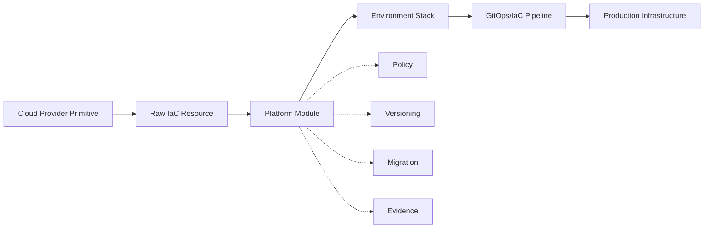
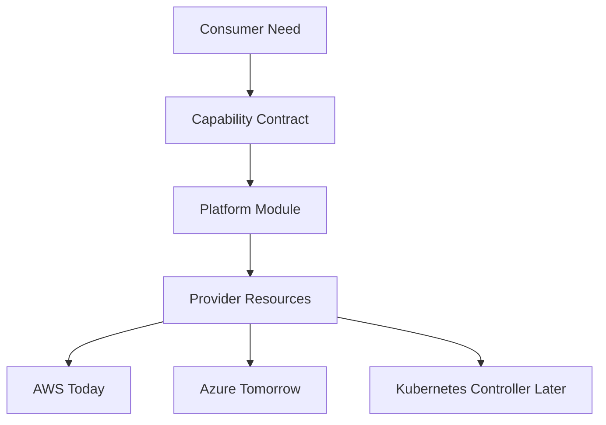
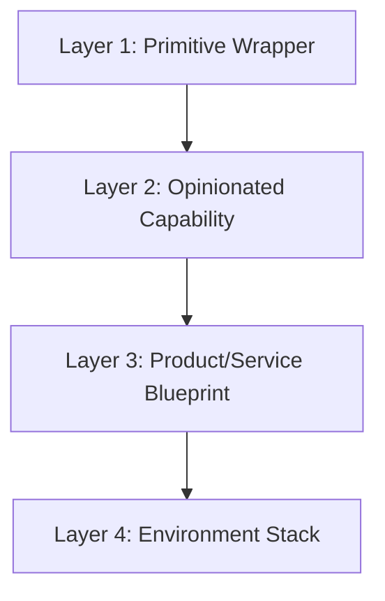
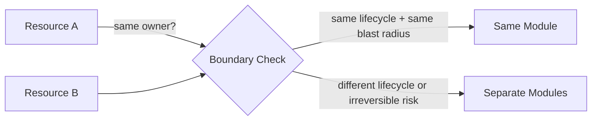
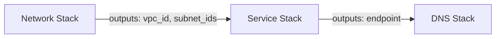
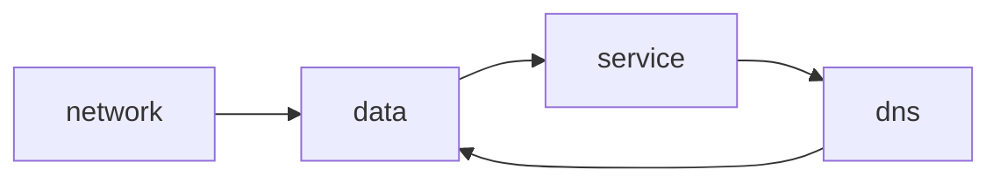
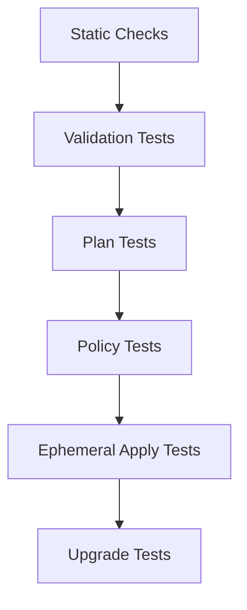
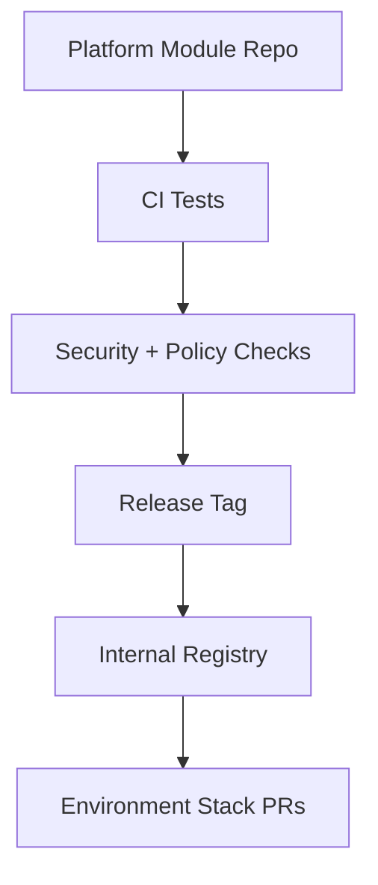
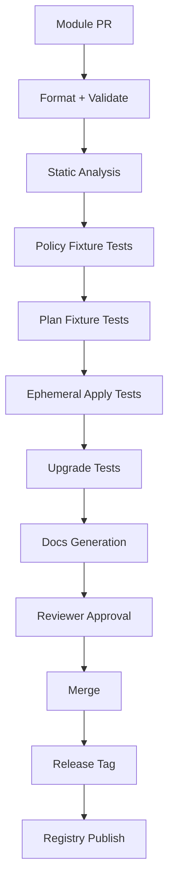

# Part 009 — Production-Grade IaC Module System Design

A weak IaC module system looks productive for the first six months.

Then every team wants a special case.

One module grows thirty boolean flags. Another module leaks provider details through outputs. Another has a `create_everything = true` mode. Nobody knows whether changing a variable replaces production infrastructure. A module upgrade looks small in Git but recreates a database. Teams pin random commits. Security asks whether all buckets are encrypted, but the answer requires reading fifty modules and three hundred environment overlays.

That is not a tooling problem.

It is a module system design problem.

A production-grade IaC module is not just reusable configuration. It is a **stable infrastructure API** over unsafe provider primitives.

That one sentence should change how you design it.

A provider resource exposes what the cloud can do. A module should expose what your platform allows, supports, audits, and can safely evolve.



This part builds the mental model and design rules for modules that survive real production pressure.

We are not learning module syntax from zero. You already know how to write a `module` block. We are learning how to decide what a module **is allowed to mean**.

---

## 1. The Core Idea: A Module Is an API, Not a Folder

A beginner sees a module as a folder with variables and outputs.

A production engineer sees a module as a contract.

That contract says:

| Contract Area | Question |
|---|---|
| Intent | What infrastructure capability does this represent? |
| Ownership | Who owns the lifecycle of resources created by this module? |
| Inputs | What decisions may consumers make? |
| Defaults | What does the platform decide on behalf of consumers? |
| Outputs | What stable facts may other stacks depend on? |
| Security | Which controls are enforced internally? |
| Policy | Which organizational rules are encoded or exposed for validation? |
| State | Which resources share fate and state boundary? |
| Upgrade | What can change without breaking consumers? |
| Migration | How do consumers move between versions safely? |
| Evidence | What can auditors and operators prove from usage? |

A module is therefore closer to a library API than a code snippet.

The worst module design mistake is to expose every underlying provider option because “flexibility is good.”

Flexibility at the wrong abstraction layer is not power. It is an unreviewed escape hatch.

A platform module should make the safe path short and the dangerous path explicit.

---

## 2. Module Design Starts from Capability Boundaries

Before writing variables, ask:

> What capability is this module responsible for?

Do not start from provider resources.

Start from domain capability.

Weak module names:

- `aws_s3_bucket_wrapper`
- `eks_all`
- `networking`
- `rds_stuff`
- `common_resources`

Stronger module names:

- `object_storage_bucket`
- `private_service_network`
- `postgres_database_instance`
- `workload_identity_binding`
- `http_service_deployment`
- `tenant_runtime_namespace`

The stronger names describe what the consumer receives, not which provider resources happen to implement it.

That matters because provider resources change, but platform capabilities should remain stable.



A module boundary is strong when the consumer can explain why they need it without knowing the internal provider resources.

---

## 3. Four Module Layers

Most teams mix different abstraction levels in one module system. That is why the system becomes inconsistent.

Use four layers.



### 3.1 Layer 1 — Primitive Wrapper

A primitive wrapper is a thin wrapper around provider resources.

Example:

- `aws_s3_bucket_secure_base`
- `aws_iam_role_base`
- `kubernetes_namespace_base`

Use sparingly.

Primitive wrappers are useful when you need standard tags, encryption defaults, provider quirks, naming normalization, or repeated safety settings.

They are dangerous when they pretend to be high-level platform APIs.

Good primitive wrapper:

```hcl
module "bucket_base" {
  source = "git::ssh://git.example.com/platform/iac-modules.git//aws/s3-bucket-base?ref=v1.4.2"

  name              = local.bucket_name
  kms_key_arn       = var.kms_key_arn
  force_destroy     = false
  block_public_acls = true
  tags              = local.tags
}
```

Bad primitive wrapper:

```hcl
module "bucket" {
  source = "./bucket"

  enable_public_access       = var.enable_public_access
  enable_private_access      = var.enable_private_access
  enable_logging             = var.enable_logging
  enable_replication         = var.enable_replication
  enable_website_hosting     = var.enable_website_hosting
  enable_random_special_case = var.enable_random_special_case
}
```

The bad one is not a capability. It is a provider resource wearing a costume.

### 3.2 Layer 2 — Opinionated Capability Module

This is the most important layer for platform engineering.

It represents a supported infrastructure capability:

- encrypted object bucket;
- private Postgres instance;
- service account with cloud identity binding;
- event topic with dead-letter queue;
- namespace with quotas and default policies;
- service ingress with TLS and WAF posture.

This module hides unsafe provider detail and exposes business-relevant choices.

Example consumer interface:

```hcl
module "orders_events" {
  source  = "app.terraform.io/acme/event-topic/platform"
  version = "~> 3.2"

  name             = "orders-events"
  owner_team       = "order-platform"
  data_class       = "internal"
  retention_days   = 14
  consumer_groups  = ["billing", "fulfillment"]
  environment      = var.environment
}
```

Notice what is missing:

- no raw encryption toggle;
- no arbitrary IAM JSON;
- no random provider-specific internal ID;
- no `allow_unencrypted = true`;
- no `skip_policy = true`.

The module decides the baseline. The consumer chooses within the supported envelope.

### 3.3 Layer 3 — Product or Service Blueprint

A blueprint composes capabilities for a common product shape.

Example:

```hcl
module "service_runtime" {
  source  = "git::ssh://git.example.com/platform/blueprints.git//http-service?ref=v2.6.0"

  service_name       = "quote-api"
  owner_team         = "cpq-platform"
  runtime_tier       = "standard"
  database_profile   = "postgres-small"
  eventing_profile   = "kafka-standard"
  expose_publicly    = false
  environment        = var.environment
}
```

A blueprint may create:

- namespace;
- service account;
- workload identity binding;
- default network policy;
- secrets references;
- database claim;
- event topic claim;
- observability dashboard registration;
- deployment manifests.

Blueprints are powerful, but risky.

If too broad, they couple unrelated lifecycles. A deployment namespace may be safe to recreate. A database is not. A topic may have retention semantics. A workload identity may be reused by multiple deploys.

A good blueprint composes stable capabilities but does not hide irreversible lifecycle risks.

### 3.4 Layer 4 — Environment Stack

The environment stack is not a reusable module. It is the composition root.

It binds:

- exact module versions;
- exact provider versions;
- account/project/subscription;
- region;
- environment;
- remote state dependencies;
- policy context;
- credentials and runner identity.

Example:

```hcl
module "orders_events" {
  source  = "git::ssh://git.example.com/platform/iac-modules.git//event-topic?ref=v3.2.4"

  name           = "orders-events"
  owner_team     = "order-platform"
  data_class     = "internal"
  retention_days = 14
  environment    = local.environment
}
```

The stack is where you should be explicit.

Reusable modules should reduce accidental complexity. Environment stacks should preserve operational clarity.

---

## 4. The Most Important Rule: Module Boundary Must Match Lifecycle Boundary

A module should group resources that usually change together, fail together, and are owned together.

If two resources have different lifecycles, they probably should not be hidden behind one atomic module interface.



Ask these questions:

1. Can this resource be replaced safely together with the others?
2. Does the same team own its lifecycle?
3. Does it require the same approval level?
4. Does it share the same state backend?
5. Does it have the same rollback strategy?
6. Does it have the same data durability requirement?
7. Would consumers expect it to exist independently?

Examples:

| Module Idea | Usually Good? | Reason |
|---|---:|---|
| Bucket + bucket encryption + bucket policy | Yes | Same capability and lifecycle |
| Kubernetes namespace + default quota + baseline network policy | Yes | Same tenancy boundary |
| App deployment + database | Usually no | Different lifecycle and rollback semantics |
| VPC + all databases + all services | No | Massive blast radius |
| Topic + dead-letter queue | Often yes | Same messaging capability |
| IAM role + every permission the app might ever need | No | Unbounded privilege growth |

The production module designer is allergic to lifecycle ambiguity.

---

## 5. Inputs: Expose Decisions, Not Implementation Details

A module input should represent a decision the consumer is allowed to make.

Do not expose an input just because the provider has a parameter.

Classify every input.

| Input Type | Example | Should Consumer Control It? |
|---|---|---|
| Identity | `name`, `owner_team`, `service_id` | Usually yes |
| Classification | `data_class`, `criticality`, `internet_facing` | Yes, because policy depends on it |
| Capacity | `size`, `retention_days`, `replica_count` | Yes, within bounds |
| Environment Context | `environment`, `region`, `account_id` | Often passed by stack, not app team |
| Security Baseline | encryption, TLS, public ACL block | Usually no; enforce internally |
| Escape Hatch | raw IAM JSON, custom security group rules | Dangerous; require explicit exception model |
| Provider Internals | resource IDs, API quirks | Usually no |

Bad input:

```hcl
variable "enable_encryption" {
  type    = bool
  default = true
}
```

Why is this bad?

Because it suggests encryption is optional.

Better:

```hcl
variable "kms_key_policy" {
  type        = string
  description = "Controls which managed encryption key class is used. Allowed: platform, team-managed, regulated."
  validation {
    condition     = contains(["platform", "team-managed", "regulated"], var.kms_key_policy)
    error_message = "kms_key_policy must be platform, team-managed, or regulated."
  }
}
```

Even better for most teams:

```hcl
variable "data_class" {
  type        = string
  description = "Data classification used to select encryption, retention, logging, and access policy."
  validation {
    condition     = contains(["public", "internal", "confidential", "regulated"], var.data_class)
    error_message = "Unsupported data_class."
  }
}
```

The consumer describes the risk. The module chooses the controls.

That is a platform API.

---

## 6. Defaults Are Policy Decisions

A default is not merely convenience.

A default is a decision that applies when the consumer does not think.

That makes defaults one of the most important control surfaces in IaC.

Bad defaults:

```hcl
variable "publicly_accessible" {
  type    = bool
  default = true
}

variable "deletion_protection" {
  type    = bool
  default = false
}
```

These defaults optimize for demo success and production incidents.

Good defaults:

```hcl
variable "public_exposure" {
  type    = string
  default = "private"

  validation {
    condition     = contains(["private", "internal", "public-approved"], var.public_exposure)
    error_message = "public_exposure must be private, internal, or public-approved."
  }
}

variable "deletion_protection" {
  type    = bool
  default = true
}
```

Even better: for regulated resources, do not expose deletion protection at all. Encode it based on classification.

```hcl
locals {
  deletion_protection = contains(["confidential", "regulated"], var.data_class) ? true : var.allow_delete_for_non_prod
}
```

A strong module makes safe behavior the path of least resistance.

---

## 7. Outputs: Export Stable Facts, Not Internals

Outputs are not harmless.

An output becomes another stack's dependency.

Once consumers depend on it, removing or changing it is a breaking API change.

Output only facts that are stable and meaningful at the capability boundary.

Good outputs:

```hcl
output "bucket_name" {
  value       = aws_s3_bucket.this.bucket
  description = "Stable bucket name for application configuration."
}

output "write_policy_arn" {
  value       = aws_iam_policy.write.arn
  description = "Policy ARN granting write access to this bucket."
}

output "audit_resource_id" {
  value       = local.audit_resource_id
  description = "Stable ID used in audit evidence and ownership inventory."
}
```

Risky outputs:

```hcl
output "everything" {
  value = aws_s3_bucket.this
}
```

Why risky?

Because it leaks provider internals and gives consumers accidental dependencies on implementation details.

The moment another stack reads `module.bucket.everything.id`, your module internals are no longer private.

Use outputs as a published API.

---

## 8. Versioning: Pin the Contract, Not the Mood

Terraform and OpenTofu support version constraints for providers and registry modules. OpenTofu documentation describes version constraint strings as ranges of acceptable versions for modules, providers, and OpenTofu itself. Terraform module documentation recommends explicitly constraining acceptable module versions to avoid unexpected or unwanted changes.

In production, versioning should answer three questions:

1. Which module version does this stack use?
2. Which provider version was used to compute and apply the plan?
3. Which engine version was used?

A professional environment stack pins all three.

```hcl
terraform {
  required_version = "~> 1.8.0"

  required_providers {
    aws = {
      source  = "hashicorp/aws"
      version = "~> 5.70"
    }
  }
}

module "orders_bucket" {
  source  = "app.terraform.io/acme/object-storage/platform"
  version = "~> 2.4"

  name       = "orders-archive"
  data_class = "confidential"
}
```

For Git-sourced modules, pin tags or immutable references.

```hcl
module "orders_bucket" {
  source = "git::ssh://git.example.com/platform/iac-modules.git//object-storage?ref=v2.4.3"
}
```

Avoid branch refs in production:

```hcl
# Avoid for production
source = "git::ssh://git.example.com/platform/iac-modules.git//object-storage?ref=main"
```

A branch ref makes the same Git commit in the environment repo mean different infrastructure behavior depending on when the pipeline runs.

That violates reproducibility.

### 8.1 Semantic Versioning for Modules

Use semantic versioning as a communication protocol:

| Change Type | Example | Version Impact |
|---|---|---|
| Add optional input with safe default | `enable_access_logs` default true | Minor |
| Add output | `audit_resource_id` | Minor |
| Change default behavior | default retention from 7 to 30 days | Major or explicit migration |
| Rename input | `team` → `owner_team` | Major unless alias preserved |
| Remove output | remove `bucket_arn` | Major |
| Replace resource implementation | S3 bucket → provider abstraction | Major if state migration needed |
| Tighten validation | reject previously accepted value | Major if existing users break |
| Internal refactor no plan diff | locals cleanup | Patch |

The version number should tell consumers how much thinking is required.

If every release is `v1.0.0`, you have no contract.

### 8.2 Compatibility Matrix

Every serious module should declare compatibility.

Example:

```md
# Compatibility

| Module Version | OpenTofu/Terraform | AWS Provider | Notes |
|---|---|---|---|
| 2.x | >=1.7, <1.10 | >=5.60, <6.0 | Current production line |
| 1.x | >=1.4, <1.8 | >=4.50, <5.0 | Security fixes only |
```

This avoids hidden upgrade traps.

---

## 9. Provider Handling: Declare Requirements, Do Not Secretly Configure Providers

A reusable module should declare provider requirements. The root module should configure provider instances.

Terraform documentation explains that each module must declare its own provider requirements so the engine can select a single compatible provider version across the configuration. Provider configurations themselves are shared from the root unless passed explicitly.

Good reusable module:

```hcl
terraform {
  required_providers {
    aws = {
      source  = "hashicorp/aws"
      version = ">= 5.60, < 6.0"
    }
  }
}
```

Bad reusable module:

```hcl
provider "aws" {
  region = "us-east-1"
}
```

Why bad?

Because the reusable module silently decides where resources are created. That belongs to the root stack.

### 9.1 Provider Aliases

For multi-region or cross-account modules, provider aliases are legitimate.

Example root stack:

```hcl
provider "aws" {
  alias  = "primary"
  region = "us-east-1"

  assume_role {
    role_arn = local.primary_role_arn
  }
}

provider "aws" {
  alias  = "replica"
  region = "us-west-2"

  assume_role {
    role_arn = local.replica_role_arn
  }
}

module "replicated_bucket" {
  source = "git::ssh://git.example.com/platform/iac-modules.git//replicated-object-storage?ref=v1.8.0"

  providers = {
    aws.primary = aws.primary
    aws.replica = aws.replica
  }

  name       = "orders-archive"
  data_class = "confidential"
}
```

The stack controls identity and location. The module controls capability implementation.

That separation is non-negotiable.

---

## 10. Composition Root: Keep Environment Stacks Boring

A good module system makes environment stacks boring.

Boring does not mean tiny. It means predictable.

A stack should mostly contain:

- provider configuration;
- backend configuration;
- locals for environment context;
- module calls;
- explicit dependencies;
- outputs needed by adjacent stacks.

Example layout:

```txt
infra-live/
  prod/
    aws/
      us-east-1/
        network/
          backend.tf
          providers.tf
          main.tf
          outputs.tf
        data/
          backend.tf
          providers.tf
          main.tf
          outputs.tf
        services/
          quote-api/
            backend.tf
            providers.tf
            main.tf
            outputs.tf
```

The stack is the integration point.

Do not hide too much composition inside high-level modules. If a module creates network, databases, secrets, IAM, application deployment, and dashboards, then a plan diff becomes impossible to reason about.

The root stack should show the major lifecycle components.

---

## 11. Avoid Boolean-Driven Design

Boolean flags multiply state space.

A module with eight booleans has 256 theoretical combinations.

Most combinations are untested.

```hcl
variable "enable_logs" { type = bool }
variable "enable_metrics" { type = bool }
variable "enable_backup" { type = bool }
variable "enable_replica" { type = bool }
variable "enable_public" { type = bool }
variable "enable_private" { type = bool }
variable "enable_iam" { type = bool }
variable "enable_policy" { type = bool }
```

This is not flexibility. This is unbounded product surface.

Prefer named profiles.

```hcl
variable "runtime_profile" {
  type = string

  validation {
    condition = contains([
      "sandbox",
      "standard",
      "regulated",
      "high-availability"
    ], var.runtime_profile)
    error_message = "Unsupported runtime_profile."
  }
}

locals {
  profile = {
    sandbox = {
      backup_enabled  = false
      replica_enabled = false
      log_retention   = 7
    }
    standard = {
      backup_enabled  = true
      replica_enabled = false
      log_retention   = 30
    }
    regulated = {
      backup_enabled  = true
      replica_enabled = true
      log_retention   = 365
    }
    high-availability = {
      backup_enabled  = true
      replica_enabled = true
      log_retention   = 90
    }
  }[var.runtime_profile]
}
```

Profiles reduce invalid combinations and communicate intent.

---

## 12. Escape Hatches Must Be Explicit Products

Every platform module eventually meets a real edge case.

The wrong response is to add generic escape hatches everywhere.

```hcl
variable "extra_policy_json" {
  type    = string
  default = null
}

variable "custom_security_group_rules" {
  type    = any
  default = []
}
```

That approach moves risk from the platform team to consumers without a review model.

A better escape hatch has:

- a name;
- a reason;
- a reviewer;
- a policy check;
- an expiration date if possible;
- evidence.

Example:

```hcl
variable "approved_exceptions" {
  type = list(object({
    id          = string
    reason      = string
    expires_on  = string
    approved_by = string
  }))
  default = []
}
```

Then policy can validate it.

```rego
package iac.exceptions

deny[msg] {
  input.module.name == "object_storage_bucket"
  input.change.public_exposure == "public-approved"
  count(input.module.approved_exceptions) == 0
  msg := "public-approved exposure requires an approved exception"
}
```

The goal is not to ban exceptions.

The goal is to make exceptions visible, reviewable, and temporary.

---

## 13. Naming Is a Stability Problem

Naming looks cosmetic until replacement happens.

Many cloud resources cannot be renamed in place. A name change may force replacement, DNS changes, IAM policy updates, or consumer outages.

Module naming rules should be deterministic.

```hcl
locals {
  resource_name = join("-", compact([
    var.org_prefix,
    var.environment,
    var.region_code,
    var.service_name,
    var.capability
  ]))
}
```

But deterministic does not mean opaque.

Bad:

```hcl
name = "x9a-prod-ue1-qapi-obs-7f4"
```

Better:

```hcl
name = "acme-prod-use1-quote-api-events"
```

A good naming scheme supports:

- ownership discovery;
- incident response;
- cost allocation;
- policy matching;
- audit evidence;
- stable imports;
- provider length constraints.

For resources with globally unique names, use deterministic suffixes based on stable identity, not random values that change during refactors.

---

## 14. Tags and Labels Are Part of the Module Contract

Tags are not decoration.

They are control-plane metadata.

A production module should enforce a minimum metadata contract:

```hcl
variable "owner_team" {
  type = string
}

variable "service_name" {
  type = string
}

variable "environment" {
  type = string
}

variable "data_class" {
  type = string
}

locals {
  mandatory_tags = {
    owner_team  = var.owner_team
    service     = var.service_name
    environment = var.environment
    data_class  = var.data_class
    managed_by  = "opentofu"
    module      = "object-storage-bucket"
  }

  tags = merge(local.mandatory_tags, var.extra_tags)
}
```

The policy engine can then reason about resources consistently.

Without metadata, later automation becomes guesswork.

---

## 15. Data Sources: Use Carefully

Data sources are reads from reality.

They are useful, but they can make plans less deterministic.

Examples:

```hcl
data "aws_ami" "latest" {
  most_recent = true
  owners      = ["amazon"]

  filter {
    name   = "name"
    values = ["al2023-ami-*"]
  }
}
```

This looks convenient, but it means the same Git commit may plan differently tomorrow.

That may be acceptable in a dev stack. It is usually risky in production.

Prefer explicit version inputs for critical artifacts:

```hcl
variable "machine_image_id" {
  type        = string
  description = "Approved immutable image ID selected by the release pipeline."
}
```

Use data sources for stable discovery:

- account identity;
- current region;
- existing platform-managed network ID;
- approved parameter path;
- remote state output from a stable stack.

Avoid data sources for mutable “latest” selection in production unless the selection itself is governed and recorded.

---

## 16. Remote State Dependencies: Treat as API Calls

Remote state output is a cross-stack API call.

If stack B reads outputs from stack A, then stack A has published an API.



This creates ordering constraints.

Design rules:

1. Only export stable outputs.
2. Avoid exporting entire resource objects.
3. Version output contracts when possible.
4. Keep dependency direction acyclic.
5. Document downstream consumers.
6. Avoid long chains of remote state dependency.

Bad dependency graph:



The cycle means your pipeline no longer has a clear apply order.

Cross-stack dependencies should form a directed acyclic graph.

---

## 17. Lifecycle Meta-Arguments Are Sharp Tools

Terraform/OpenTofu lifecycle controls can protect resources or hide dangerous behavior.

Example:

```hcl
resource "aws_db_instance" "this" {
  # ...

  lifecycle {
    prevent_destroy = true
  }
}
```

`prevent_destroy` is useful for databases and critical stateful resources. But if every resource has it, routine cleanup becomes impossible.

`ignore_changes` is even sharper.

```hcl
lifecycle {
  ignore_changes = [desired_count]
}
```

This can be valid when another controller owns the field. But it can also hide drift.

Classify ignored fields:

| Ignore Reason | Acceptable? | Example |
|---|---:|---|
| Owned by autoscaler | Yes | replica count |
| Owned by external controller | Yes, documented | generated annotation |
| Provider read noise | Sometimes | unstable timestamp |
| Manual production patch | Dangerous | security group rules |
| Avoiding a planned diff without understanding it | No | anything |

Every `ignore_changes` should have a comment explaining owner and reason.

---

## 18. Module Testing Is Contract Testing

Testing modules is not only “does plan succeed.”

Test the contract.



### 18.1 Static Checks

Run:

- formatting;
- validation;
- linting;
- provider lock consistency;
- documentation generation checks;
- module metadata checks.

### 18.2 Input Validation Tests

Verify invalid combinations fail early.

Examples:

- public exposure without exception;
- regulated data without backup;
- retention below minimum;
- invalid owner team;
- unsupported region.

### 18.3 Plan Snapshot Tests

For known fixture inputs, generate plans and compare expected structural behavior.

Do not snapshot every provider-computed value. Snapshot meaningful decisions:

- number of resources;
- resource types;
- encryption enabled;
- public access blocked;
- tags present;
- deletion protection enabled;
- IAM policy shape.

### 18.4 Ephemeral Apply Tests

For critical modules, run short-lived apply tests in sandbox accounts or projects.

The test should create, verify, and destroy.

This catches provider behavior that static validation cannot catch.

### 18.5 Upgrade Tests

For each supported previous version, test upgrade to current.

This is what separates a real module product from a folder of HCL.

Upgrade test matrix:

| From | To | Expected |
|---|---|---|
| v2.3.0 | v2.4.0 | no replacement |
| v2.4.0 | v3.0.0 | migration required |
| v1.9.5 | v2.0.0 | output rename compatibility verified |

---

## 19. Documentation: Write the Operational Contract

Module docs should not merely list variables.

They should answer operational questions.

Minimum module README:

```md
# object-storage-bucket

## Capability
Creates a private, encrypted, tagged object storage bucket with access logging and policy-managed exposure.

## When to Use
Use for application-owned object data that must be accessed by workloads through platform-managed IAM.

## When Not to Use
Do not use for public website hosting, cross-organization sharing, or ungoverned data lake storage.

## Security Controls
- Public access blocked by default.
- Encryption enforced.
- Mandatory ownership tags.
- Access policy generated by module.

## Inputs
...

## Outputs
...

## Upgrade Notes
...

## Known Replacement Risks
Changing `name` forces replacement.
Changing `data_class` from internal to regulated may add replication and logging resources.

## Examples
...
```

The best module docs explain consequences.

A variable table without consequences is not enough.

---

## 20. Deprecation and Migration Strategy

Modules evolve.

Production systems need a migration path.

A breaking module change should include:

- release notes;
- migration guide;
- state move/import commands if needed;
- expected plan diff;
- rollback/rollforward guidance;
- support window;
- owner contact;
- sample PR.

Example release note:

```md
# v3.0.0 Migration Notes

## Breaking Change
The module now creates a separate access log bucket instead of reusing the data bucket prefix.

## Why
Required for regulated audit retention and lifecycle isolation.

## Expected Plan
- Creates one new log bucket.
- Adds bucket policy to allow log delivery.
- No replacement of existing data bucket.

## Required Action
Add `log_retention_days` explicitly if your workload is regulated.

## Rollback
Safe before apply. After apply, downgrade requires manual cleanup of the log bucket.
```

Do not ship breaking changes as mysteries.

---

## 21. State Refactor: Move Blocks and Import Blocks

Resource address changes are dangerous because state maps addresses to real objects.

Renaming a resource without state movement may cause the engine to plan delete/create.

Use explicit state migration features where supported.

Example conceptual refactor:

```hcl
moved {
  from = aws_s3_bucket.main
  to   = aws_s3_bucket.this
}
```

This tells the engine that the address changed but the object identity remains.

For existing resources not yet managed, use import workflows carefully and review the first plan after import.

State migration should be treated like database migration:

- reviewed;
- tested;
- reversible if possible;
- documented;
- tied to a module version.

---

## 22. Policy-Compatible Module Design

A module should make policy easy.

Policy engines inspect planned resources and configuration. If module design hides intent or produces inconsistent metadata, policy becomes brittle.

Good module input:

```hcl
variable "data_class" {
  type = string
}
```

Good tags:

```hcl
locals {
  tags = {
    data_class = var.data_class
    owner_team = var.owner_team
    managed_by = "opentofu"
  }
}
```

Good policy:

```rego
package iac.storage

deny[msg] {
  resource := input.resource_changes[_]
  resource.type == "aws_s3_bucket"
  not resource.change.after.tags.data_class
  msg := sprintf("%s is missing data_class tag", [resource.address])
}
```

If every module invents different tag keys, policy must encode a dictionary of exceptions.

A strong module system creates uniform policy shape.

---

## 23. Module Registry as a Product Surface

A module registry is not only a download mechanism.

It is a product catalog.

A good internal registry shows:

- module name;
- capability description;
- owner;
- support status;
- latest version;
- compatibility matrix;
- security posture;
- examples;
- migration notes;
- deprecation status;
- known replacement risks.



Do not let random modules become production dependencies without ownership.

Every production module needs a maintainer and support policy.

---

## 24. Review Heuristics for Module PRs

When reviewing a module PR, do not only read the diff.

Ask these questions:

### 24.1 API Surface

- Is a new input truly a consumer decision?
- Is the type specific enough?
- Are invalid combinations rejected?
- Is the default safe?
- Is this adding a long-term support burden?

### 24.2 Lifecycle

- Could this change force replacement?
- Which resource address changes?
- Is state migration needed?
- Does this affect existing consumers?
- Does rollback work after apply?

### 24.3 Security

- Does the module weaken baseline controls?
- Does it add an escape hatch?
- Are exceptions explicit and auditable?
- Are tags/labels preserved?

### 24.4 Compatibility

- Is this patch/minor/major?
- Are release notes updated?
- Are examples updated?
- Are previous-version upgrade tests included?

### 24.5 Operations

- Are outputs stable?
- Are logs/metrics/audit metadata present?
- Is ownership visible?
- Are failure modes documented?

A senior reviewer protects future operators from today's convenience.

---

## 25. Example: Designing an Object Storage Module

Let us design a production module from scratch.

### 25.1 Capability Statement

```md
Creates a private, encrypted object storage bucket for application-owned data.
The module enforces public access blocking, ownership tags, managed encryption, access logging, and lifecycle rules based on data classification.
```

### 25.2 Allowed Consumer Decisions

| Decision | Input |
|---|---|
| What is the bucket for? | `purpose` |
| Who owns it? | `owner_team` |
| What data class? | `data_class` |
| How long retain objects? | `retention_days` |
| Which workloads need access? | `readers`, `writers` |
| Is public exposure required? | `public_exposure`, exception only |

### 25.3 Disallowed Consumer Decisions

| Disallowed | Why |
|---|---|
| Disable encryption | Violates baseline |
| Disable public access block | Requires exception process |
| Arbitrary bucket policy JSON | Hard to validate and audit |
| Untagged resource creation | Breaks inventory and cost controls |
| Random name override | Breaks naming and import conventions |

### 25.4 Interface Sketch

```hcl
variable "name" {
  type        = string
  description = "Stable logical bucket name. Changing this may force replacement."
}

variable "owner_team" {
  type        = string
  description = "Team accountable for lifecycle, cost, and incidents."
}

variable "data_class" {
  type        = string
  description = "Data classification used to derive security controls."

  validation {
    condition     = contains(["internal", "confidential", "regulated"], var.data_class)
    error_message = "data_class must be internal, confidential, or regulated."
  }
}

variable "retention_days" {
  type        = number
  description = "Minimum object retention period."

  validation {
    condition     = var.retention_days >= 7
    error_message = "retention_days must be at least 7."
  }
}

variable "public_exposure" {
  type        = string
  default     = "private"
  description = "Exposure class. public-approved requires approved exception."

  validation {
    condition     = contains(["private", "public-approved"], var.public_exposure)
    error_message = "Unsupported public_exposure."
  }
}
```

### 25.5 Derived Controls

```hcl
locals {
  regulated = var.data_class == "regulated"

  access_log_retention_days = local.regulated ? 365 : 90
  versioning_enabled        = contains(["confidential", "regulated"], var.data_class)
  deletion_protection       = local.regulated

  tags = {
    owner_team = var.owner_team
    data_class = var.data_class
    managed_by = "opentofu"
    module     = "object-storage-bucket"
  }
}
```

The consumer states the classification. The module derives controls.

That is the point.

---

## 26. Example: Module Release Pipeline

A production module repo should have its own pipeline.



Do not release module changes directly from untested local machines.

Module release is part of the platform supply chain.

---

## 27. Anti-Patterns

### 27.1 The God Module

One module creates everything.

```txt
platform-service/
  creates network
  creates database
  creates iam
  creates kubernetes namespace
  creates helm release
  creates dashboards
  creates alerts
```

The plan is unreadable. The blast radius is unclear. Upgrade is terrifying.

### 27.2 The Transparent Wrapper

The module exposes every provider option.

It creates no policy value.

### 27.3 The Boolean Matrix

Thirty flags define hundreds of untested combinations.

### 27.4 The Unowned Module

Everyone uses it. Nobody owns it. No one knows whether it is safe to upgrade.

### 27.5 The Hidden Provider

The module configures providers internally and silently creates resources in unexpected accounts or regions.

### 27.6 The Output Leak

The module exports entire provider objects and accidentally freezes implementation details.

### 27.7 The Branch-Pinned Production Module

Production points at `main`. The same environment commit can mean different infrastructure tomorrow.

### 27.8 The Escape Hatch Platform

Every module has `custom_json`, `extra_rules`, `skip_policy`, and `allow_anything`.

This is not a platform. It is a liability generator.

---

## 28. Failure Model

| Failure | Cause | Prevention | Recovery |
|---|---|---|---|
| Module upgrade replaces critical resource | Breaking change shipped as minor | upgrade tests, release notes, replacement detection | stop apply, state review, restore previous version, migrate carefully |
| Consumer depends on internal output | output leaked provider object | export stable outputs only | add compatibility output, deprecate slowly |
| Policy cannot classify resource | inconsistent tags/labels | mandatory metadata contract | fix module, backfill tags |
| Stack plans differently tomorrow | unpinned module/provider/latest data source | pin versions, lock dependencies | reproduce with lock file, pin artifact |
| Provider configured inside module | hidden region/account | root-only provider config | refactor provider passing, state migration if needed |
| Boolean combination untested | flag explosion | profile-based API | introduce profiles, deprecate flags |
| State refactor causes recreate | address renamed without move | moved/import blocks, upgrade tests | stop apply, move state, re-plan |
| Exception becomes permanent | ungoverned escape hatch | exception object with expiry | audit exceptions, remove or formalize |

Failure modeling should happen during module design, not after the incident.

---

## 29. Production Checklist

Before publishing a module, verify:

- [ ] The capability is clearly named.
- [ ] The lifecycle boundary is coherent.
- [ ] Inputs expose consumer decisions, not provider internals.
- [ ] Defaults are safe.
- [ ] Invalid combinations are rejected.
- [ ] Provider requirements are declared.
- [ ] Provider configuration is not hidden inside the reusable module.
- [ ] Outputs are stable and minimal.
- [ ] Tags/labels follow platform metadata contract.
- [ ] Module versioning follows semantic rules.
- [ ] Upgrade notes exist for behavioral changes.
- [ ] Replacement risks are documented.
- [ ] Tests cover static validation, plan fixtures, policy fixtures, and important applies.
- [ ] Escape hatches are explicit, reviewable, and auditable.
- [ ] The module has an owner and support policy.

---

## 30. Practice: Redesign a Weak Module

Take this weak interface:

```hcl
module "database" {
  source = "./modules/db"

  name                       = "orders"
  engine                     = "postgres"
  version                    = "16"
  public                     = false
  encrypted                  = true
  backup                     = true
  backup_days                = 7
  deletion_protection        = false
  allow_major_version_upgrade = true
  custom_parameter_group     = var.custom_parameter_group
  custom_security_group_ids  = var.custom_security_group_ids
  tags                       = var.tags
}
```

Redesign it as a platform module.

A stronger interface might be:

```hcl
module "orders_database" {
  source  = "app.terraform.io/acme/postgres-database/platform"
  version = "~> 4.1"

  name              = "orders"
  owner_team        = "order-platform"
  environment       = "prod"
  data_class        = "confidential"
  availability_tier = "standard-ha"
  capacity_profile  = "medium"
  maintenance_window = "sun:03:00-sun:04:00"
}
```

The module derives:

- encryption;
- backup retention;
- deletion protection;
- network placement;
- monitoring;
- tags;
- allowed upgrade behavior;
- audit metadata.

The consumer should not need to know every provider knob to request a safe database.

---

## 31. What You Should Internalize

A production IaC module is a product boundary.

It is not a convenience folder.

Strong module systems have clear capability names, safe defaults, narrow inputs, stable outputs, explicit versioning, visible ownership, migration paths, and tests that verify behavior across upgrades.

Weak module systems expose provider chaos and call it flexibility.

The top-level skill is judgment:

> expose what consumers should decide; hide what the platform must guarantee; document what may break; test what must not break.

If you master that sentence, your IaC starts looking less like scripts and more like a real infrastructure platform.

---

## References

- OpenTofu Modules: https://opentofu.org/docs/language/modules/
- OpenTofu Version Constraints: https://opentofu.org/docs/language/expressions/version-constraints/
- OpenTofu Provider Configuration: https://opentofu.org/docs/language/providers/configuration/
- OpenTofu State: https://opentofu.org/docs/language/state/
- OpenTofu Workspaces: https://opentofu.org/docs/language/state/workspaces/
- Terraform Module Block Reference: https://developer.hashicorp.com/terraform/language/block/module
- Terraform Provider Requirements: https://developer.hashicorp.com/terraform/language/providers/requirements
- Terraform Providers Within Modules: https://developer.hashicorp.com/terraform/language/modules/develop/providers
- Terraform Version Constraints: https://developer.hashicorp.com/terraform/language/expressions/version-constraints
