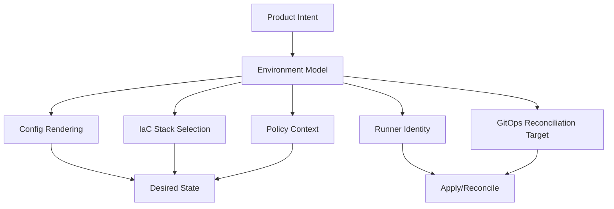
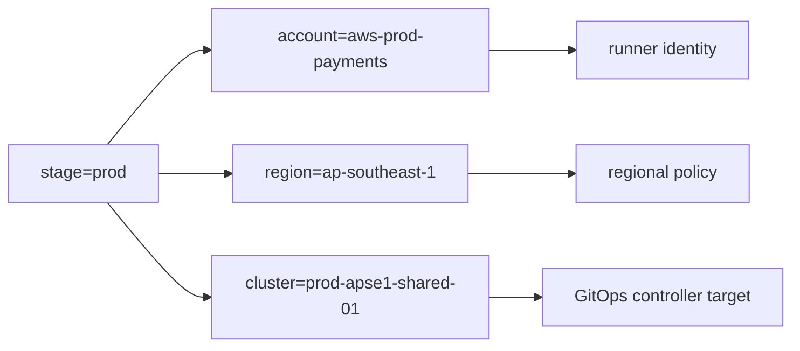
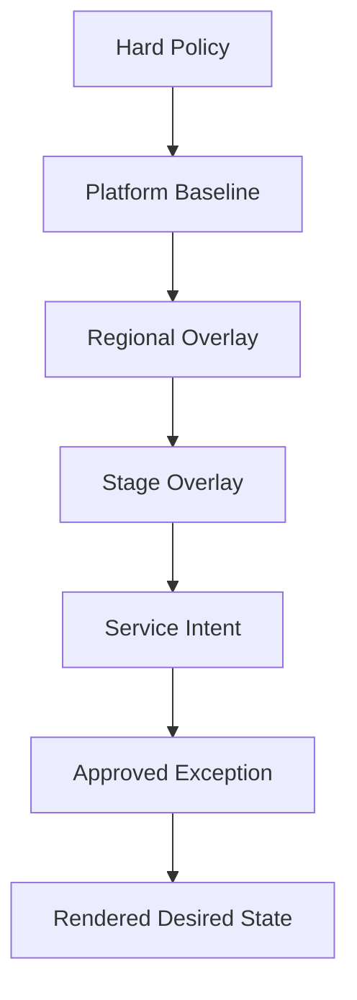
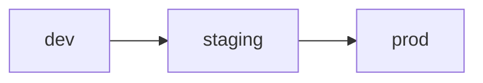
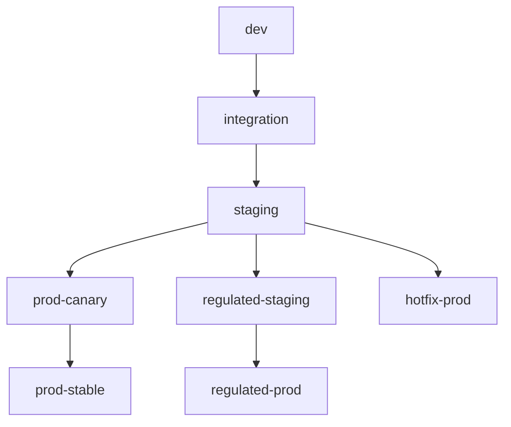
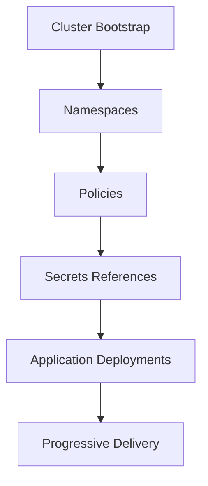
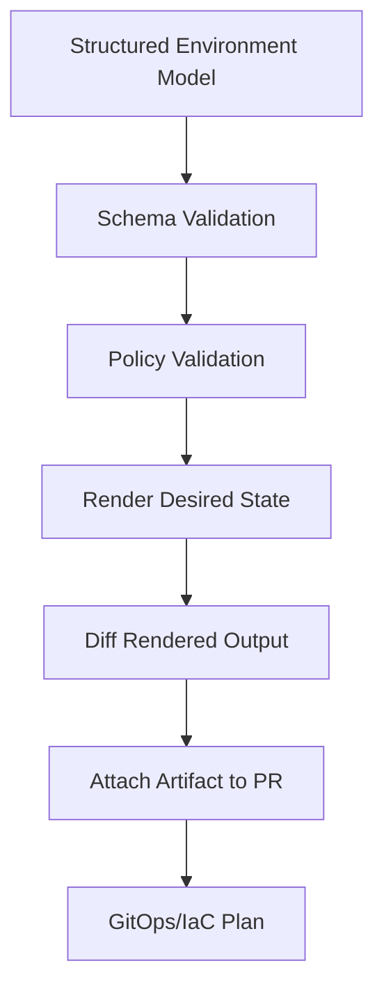
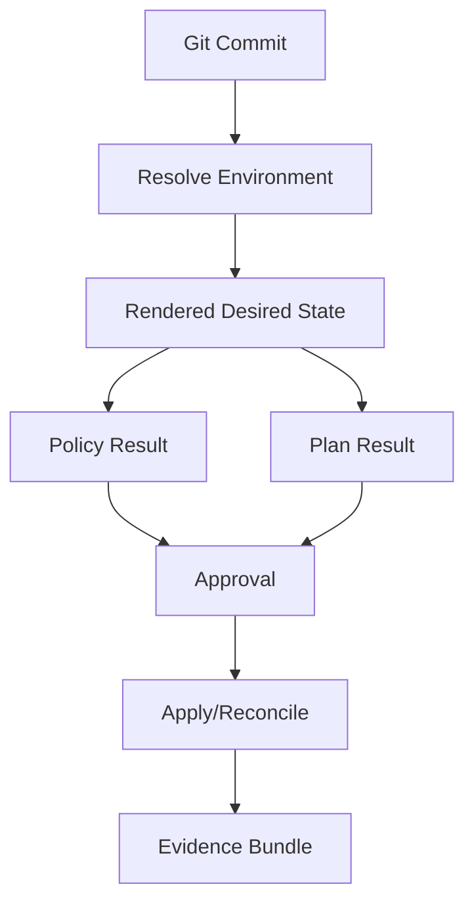

# Part 010 — Environment Modeling Without YAML Hell

Most GitOps/IaC platforms do not collapse because engineers cannot write Terraform, Helm, Kustomize, or YAML.

They collapse because environment modeling becomes accidental.

At first there is `dev`, `staging`, and `prod`.

Then there is `prod-us-east-1`, `prod-eu-west-1`, `prod-blue`, `prod-dr`, `prod-regulated`, `prod-tenant-a`, `prod-tenant-b`, `prod-new-network`, `prod-experimental`, and `prod-but-do-not-touch-this-one`.

Overrides pile up. Branches represent environments. Workspaces hide real state boundaries. Helm values inherit from four places. Kustomize overlays patch patches. Nobody knows whether a value came from the service team, platform team, security baseline, regional compliance rule, or emergency incident patch.

That is YAML hell.

Environment modeling is the discipline of representing deployment context without losing control of ownership, state, policy, and promotion.

An environment is not just a folder.

An environment is a **bounded execution context** with its own risk, identity, state, approval model, and runtime reality.



This part is about designing that model so it scales.

---

## 1. The Core Question

Every environment model must answer:

> Given a change, where does it apply, under which identity, with which policy, against which state, and with what blast radius?

If your folder structure cannot answer that, it is not an environment model. It is file organization.

A production environment model binds five things:

| Dimension | Meaning |
|---|---|
| Desired state | What should exist? |
| Runtime target | Where should it exist? |
| Execution identity | Who/what may mutate it? |
| State boundary | Which state file/controller owns it? |
| Governance | What approval, policy, and evidence are required? |

A serious model makes these explicit.

---

## 2. Environment Is Not One Dimension

The word “environment” is overloaded.

It can mean maturity stage, account, region, tenant, cluster, risk tier, data classification, or release channel.

Flattening all of that into `dev/stage/prod` is how platforms rot.

Model the dimensions separately.

| Dimension | Examples | Common Owner |
|---|---|---|
| Lifecycle stage | dev, test, staging, prod | platform/product |
| Cloud account/project/subscription | aws-prod-core, azure-dev-apps | platform/cloud team |
| Region | us-east-1, eu-west-1, ap-southeast-1 | platform/regulatory |
| Cluster | prod-use1-shared-01 | platform/SRE |
| Tenant | tenant-a, tenant-b | product/platform |
| Service | quote-api, order-worker | service team |
| Data classification | public, internal, confidential, regulated | security/governance |
| Release channel | canary, stable, hotfix | service/platform |
| Criticality | tier-0, tier-1, tier-2 | business/SRE |

A good model avoids encoding all of these in one giant environment string.

Bad:

```txt
prod-us-east-1-regulated-tenant-a-blue-v2
```

Better:

```yaml
stage: prod
region: us-east-1
dataClass: regulated
tenant: tenant-a
releaseChannel: blue
runtimeGeneration: v2
```

Names are useful for humans. Structured fields are useful for machines.

---

## 3. Separate Identity, Location, and Maturity

A common mistake is to treat environment as maturity only.

```txt
dev
stage
prod
```

But mutation authority usually follows cloud account or project, not maturity name.



If you hide account and region under a folder called `prod`, you will eventually grant the wrong runner the wrong authority.

Keep these separate:

| Concept | Question |
|---|---|
| Stage | How mature/risky is this deployment? |
| Account/project | Which security boundary contains it? |
| Region | Which geography/latency/compliance boundary contains it? |
| Cluster | Which Kubernetes reconciliation target owns it? |
| Namespace/tenant | Which workload isolation boundary contains it? |

A pipeline should not infer execution identity from a vague environment label.

---

## 4. Desired State Has Precedence Rules

When multiple layers can set a value, precedence must be explicit.

Example value: database backup retention.

It could come from:

- module default;
- organization baseline;
- data classification policy;
- environment-specific override;
- service-specific override;
- emergency patch.

Without precedence, review becomes guesswork.

A strong configuration model defines a precedence order.

Example:

```txt
1. Hard policy constraints
2. Platform baseline
3. Regional/compliance overlay
4. Environment stage overlay
5. Service intent
6. Approved exception
7. Emergency override with expiration
```

Policy constraints should not be overrideable by normal service config.



The ordering matters.

If service intent can override encryption, the model is broken.

If emergency override has no expiration, the model becomes permanent drift.

---

## 5. The Three Sources of Environment Complexity

Environment modeling becomes hard because of three forces.

### 5.1 Variation

Different environments need different settings.

Examples:

- smaller dev database;
- stricter prod IAM;
- different regional endpoints;
- regulated data logging;
- canary traffic split.

Variation is legitimate.

The problem is unmanaged variation.

### 5.2 Promotion

Changes need to move through environments.

Promotion asks:

- Does staging match production?
- What exactly was promoted?
- Is promotion a copy of config or a version reference update?
- Can promotion skip environments?
- Is production config hand-edited?

### 5.3 Ownership

Different teams own different layers.

Service teams own service intent. Platform owns baseline. Security owns constraints. SRE owns runtime reliability. Compliance owns evidence.

If all of them edit the same YAML file, conflict is inevitable.

---

## 6. Anti-Pattern: Branch per Environment

Branch-per-environment is seductive.

```txt
main
staging
prod
```

It feels simple: merge to `prod` to deploy prod.

It fails because branches are mutable timelines, not environment records.

Problems:

| Problem | Consequence |
|---|---|
| Divergence | prod and staging stop sharing history |
| Cherry-pick culture | unclear what actually differs |
| Hidden config drift | branch diff is noisy and semantic intent is unclear |
| Hard rollback | rollback becomes Git archaeology |
| Poor audit | approval is tied to merge mechanics, not desired-state transition |

Use directories, files, or version references to represent environments. Use branches for change review, not long-lived environment state.

A production environment should be visible in the default branch.

---

## 7. Anti-Pattern: Workspace per Environment Without Boundary Discipline

Terraform/OpenTofu CLI workspaces isolate multiple state files for the same working directory. Documentation for both Terraform and OpenTofu describes workspaces as a way to manage multiple state instances associated with a configuration.

This can be useful.

It can also hide too much.

Example:

```bash
tofu workspace select prod
tofu apply
```

What changed?

You cannot tell from the file path alone.

Workspaces are risky when:

- different environments require different provider identities;
- resource names are not safely parameterized;
- reviewers cannot see which state is affected;
- pipeline logs are the only evidence of target selection;
- local execution is allowed;
- state boundaries need different approval rules.

A safer pattern is explicit directory-per-state-boundary for production-critical stacks.

```txt
infra-live/
  prod/
    aws/
      us-east-1/
        network/
        data/
        services/
  staging/
    aws/
      us-east-1/
        network/
        data/
        services/
```

Workspaces can still be useful for ephemeral preview environments or replicated non-critical stacks, but they should not obscure governance boundaries.

---

## 8. Environment Modeling Patterns

There is no universal layout. There are trade-offs.

### 8.1 Directory per Environment

```txt
environments/
  dev/
  staging/
  prod/
```

Good for:

- small systems;
- clear review paths;
- simple approval mapping;
- low-dimensional deployments.

Bad when:

- region/account/tenant dimensions explode;
- common config is copy-pasted;
- every value is duplicated.

### 8.2 Directory per State Boundary

```txt
infra-live/
  prod/aws/us-east-1/network/
  prod/aws/us-east-1/data/
  prod/aws/us-east-1/services/quote-api/
```

Good for:

- clear blast radius;
- state isolation;
- path-based policy;
- path-based runner identity;
- CODEOWNERS.

Bad when:

- too many tiny stacks cause orchestration overhead;
- dependencies become hard to manage;
- teams create inconsistent folder conventions.

### 8.3 Base + Overlay

```txt
apps/quote-api/
  base/
    deployment.yaml
    service.yaml
  overlays/
    dev/
      kustomization.yaml
    prod/
      kustomization.yaml
```

Good for Kubernetes manifests and GitOps controllers.

Bad when overlays become patch chains that only one person understands.

### 8.4 Values per Environment

```txt
helm/
  quote-api/
    Chart.yaml
    values.yaml
    values-dev.yaml
    values-prod.yaml
```

Good for packaged applications.

Bad when values files become untyped dumping grounds.

### 8.5 Generated Configuration

Tools like Jsonnet, CUE, Dhall, or custom generators can represent structured configuration and produce YAML/HCL.

Good for:

- high-dimensional matrices;
- strong validation;
- reusable object models;
- fleet configuration.

Bad when:

- generation hides rendered output;
- engineers cannot reason about final desired state;
- custom language knowledge becomes a bottleneck.

Rule:

> Generation is acceptable only if rendered output is reviewable, deterministic, and validated.

---

## 9. The Environment Matrix

At scale, environments are a matrix.

Example:

| Stage | Account | Region | Cluster | Data Class | Service |
|---|---|---|---|---|---|
| dev | aws-dev-apps | us-east-1 | dev-use1-01 | internal | quote-api |
| staging | aws-stage-apps | us-east-1 | stg-use1-01 | internal | quote-api |
| prod | aws-prod-apps | us-east-1 | prod-use1-01 | confidential | quote-api |
| prod | aws-prod-apps | eu-west-1 | prod-euw1-01 | confidential | quote-api |
| prod | aws-prod-reg | us-east-1 | prod-reg-use1-01 | regulated | billing-api |

Do not let this matrix live only in tribal knowledge.

Represent it explicitly.

Example:

```yaml
service: quote-api
ownerTeam: cpq-platform

targets:
  - stage: dev
    account: aws-dev-apps
    region: us-east-1
    cluster: dev-use1-01
    dataClass: internal
    releaseChannel: fast

  - stage: staging
    account: aws-stage-apps
    region: us-east-1
    cluster: stg-use1-01
    dataClass: internal
    releaseChannel: candidate

  - stage: prod
    account: aws-prod-apps
    region: us-east-1
    cluster: prod-use1-01
    dataClass: confidential
    releaseChannel: stable
```

This model can drive:

- rendered manifests;
- Terraform stacks;
- Argo CD Applications;
- Flux Kustomizations;
- policy context;
- promotion rules;
- approval routing.

---

## 10. Configuration Hierarchy

A scalable model separates layers.

```txt
config/
  org.yaml
  platforms/
    aws.yaml
    kubernetes.yaml
  regions/
    us-east-1.yaml
    eu-west-1.yaml
  stages/
    dev.yaml
    staging.yaml
    prod.yaml
  data-classes/
    internal.yaml
    confidential.yaml
    regulated.yaml
  services/
    quote-api.yaml
  targets/
    quote-api-prod-use1.yaml
```

Each layer has a purpose.

| Layer | Owns |
|---|---|
| org | naming, tags, global policy defaults |
| platform | cloud/provider-specific baseline |
| region | regional endpoints, compliance, latency topology |
| stage | maturity, approval level, SLO defaults |
| data class | retention, encryption, logging, backup rules |
| service | service intent and resource requests |
| target | final binding to account, region, cluster, namespace |

The final rendered target is an object.

```yaml
service: quote-api
stage: prod
region: us-east-1
account: aws-prod-apps
cluster: prod-use1-01
namespace: quote-api
ownerTeam: cpq-platform
dataClass: confidential
runtime:
  replicas: 6
  cpu: "1000m"
  memory: "2Gi"
database:
  profile: postgres-medium-ha
  retentionDays: 35
policy:
  approval: production-change
  publicExposure: false
```

The rendered target should be stored or attached as evidence in the pipeline.

---

## 11. Configuration Must Be Typed or Validated

YAML without schema is a slow-motion incident.

If environment config controls production, validate it.

Validation can happen via:

- JSON Schema;
- CUE;
- OpenAPI schema;
- Rego policy;
- custom type checks;
- Helm schema files;
- Kustomize build validation;
- Kubernetes server-side dry-run.

Example JSON Schema idea:

```json
{
  "type": "object",
  "required": ["service", "stage", "region", "account", "ownerTeam", "dataClass"],
  "properties": {
    "stage": {
      "enum": ["dev", "staging", "prod"]
    },
    "dataClass": {
      "enum": ["internal", "confidential", "regulated"]
    },
    "replicas": {
      "type": "integer",
      "minimum": 1
    }
  }
}
```

A schema catches structural errors. Policy catches contextual errors.

Example policy:

```rego
package env.targets

deny[msg] {
  input.stage == "prod"
  input.dataClass == "regulated"
  not startswith(input.account, "aws-prod-reg")
  msg := "regulated prod targets must deploy into regulated production accounts"
}
```

Use both.

---

## 12. How to Avoid Overlay Explosion

Overlay explosion happens when every difference gets a patch.

```txt
overlays/
  prod/
    patch-replicas.yaml
    patch-env.yaml
    patch-security.yaml
    patch-ingress.yaml
    patch-resources.yaml
    patch-special-case.yaml
    patch-really-special-case.yaml
```

The reader must mentally execute patches to know the final state.

Avoid this by classifying differences.

| Difference Type | Better Model |
|---|---|
| Stage capacity | profile or stage baseline |
| Region endpoint | region config |
| Secret reference | external secret mapping |
| Canary setting | release channel config |
| One-off exception | explicit exception object |
| Security baseline | policy/module default, not overlay patch |
| App version | image tag/version reference |

A patch should represent a real localized difference, not a substitute for a configuration model.

---

## 13. Promotion: Copy Config or Promote Versions?

There are two broad promotion models.

### 13.1 Copy-Based Promotion

A change is copied from one environment folder to another.

```txt
apps/quote-api/overlays/staging/deployment.yaml
apps/quote-api/overlays/prod/deployment.yaml
```

Promotion means copying the same image tag, values, or patch.

This is simple but error-prone.

### 13.2 Version-Reference Promotion

Each environment points to an immutable version.

```yaml
service: quote-api
image:
  repository: registry.example.com/quote-api
  tag: 1.42.7
configVersion: 2026.07.03-001
```

Promotion changes a reference.

```diff
- tag: 1.42.6
+ tag: 1.42.7
```

This is better for auditability.

For IaC modules, promotion may mean bumping a module version:

```diff
 module "orders_database" {
   source  = "app.terraform.io/acme/postgres-database/platform"
-  version = "4.1.2"
+  version = "4.1.3"
 }
```

Production promotion should be reviewable as a small, explicit desired-state transition.

---

## 14. Promotion Is Not Always Linear

Basic flow:



Real flow:



Some changes should not pass through the same path:

| Change Type | Promotion Path |
|---|---|
| App image | dev → staging → prod-canary → prod-stable |
| IAM permission | dev → staging → prod with security approval |
| Network route | non-prod validation → prod change window |
| Database schema | expand → deploy → migrate → contract |
| Emergency config | hotfix path with post-review |
| Policy baseline | policy staging → dry-run → enforce |

Do not force all changes through one simplistic pipeline.

Classify change types.

---

## 15. Environment-Specific Values Should Be Boring

A production environment file should not contain surprises.

Good environment file:

```yaml
stage: prod
account: aws-prod-apps
region: us-east-1
cluster: prod-use1-01
namespace: quote-api
approvalClass: production-change
capacityProfile: standard-ha
dataClass: confidential
releaseChannel: stable
```

Bad environment file:

```yaml
disableSecurity: true
customIamPolicy: |
  { "Action": "*", "Resource": "*" }
randomHotfix: true
skipValidation: true
useOldNetworkBecauseProdBrokeOnce: true
```

Special cases must be named, justified, and governed.

---

## 16. State Boundary and Environment Boundary Are Related but Not Identical

One environment may contain many state boundaries.

Example production environment:

```txt
prod/us-east-1/
  network state
  identity state
  cluster state
  database state
  service quote-api state
  service billing-api state
```

Do not put all production resources in one state file.

But do not split every resource into its own state either.

Good state boundary criteria:

| Criterion | Question |
|---|---|
| Lifecycle | Do these resources change together? |
| Ownership | Does one team own them? |
| Approval | Do they require same approval class? |
| Blast radius | Is failure acceptable within same boundary? |
| Dependency | Are dependencies mostly internal? |
| Recovery | Can this boundary be restored independently? |

Environment folders should reveal state boundaries.

```txt
infra-live/prod/aws/us-east-1/network
infra-live/prod/aws/us-east-1/cluster
infra-live/prod/aws/us-east-1/services/quote-api
```

This gives code reviewers and policy engines a clear target.

---

## 17. GitOps Controller Boundaries

For Kubernetes GitOps, environment modeling must align with controller boundaries.

Argo CD uses Applications and Projects to define reconciliation units and policy boundaries. Flux uses source and reconciliation custom resources such as Kustomizations and HelmReleases to continuously apply desired state.

Design questions:

- Is one controller managing many clusters or one cluster?
- Does each team get its own Argo CD Project or Flux namespace?
- Are production applications separated from non-production?
- Are cluster-level resources separated from namespace-level resources?
- Can an app team accidentally sync cluster-admin resources?
- How is ordering represented?

Example Argo-style structure:

```txt
gitops/
  clusters/
    prod-use1-01/
      platform/
        namespaces/
        policies/
        ingress/
      apps/
        quote-api/
        billing-api/
```

Example reconciliation graph:



Keep cluster baseline and app desired state separate.

If app teams can modify cluster baseline accidentally, your environment model is unsafe.

---

## 18. App Config vs Infra Config

App config and infra config overlap, but they are not the same thing.

| Config Type | Examples | Owner |
|---|---|---|
| App release config | image tag, feature flag reference, rollout strategy | service team |
| Runtime config | env vars, resource requests, replicas | service + platform guardrails |
| Infra capability config | database profile, topic retention, bucket data class | service intent + platform module |
| Platform baseline | network policy, sidecars, admission policy | platform/security |
| Secret values | credentials, tokens | secret manager, not Git plaintext |

Do not store secret values in Git. Store secret references or encrypted secrets depending on your chosen pattern.

Environment modeling should show which config class is being changed.

A replica change is not the same governance event as opening public ingress.

---

## 19. Generated Desired State and Reviewability

For high-dimensional environments, generation may be the only sane option.

But generation must preserve reviewability.

A safe generation pipeline:



Rules:

1. The generator must be deterministic.
2. Inputs must be versioned.
3. Output must be inspectable.
4. Rendered diff must be part of review.
5. Policy should run on rendered output, not only source model.
6. The generated output should not require manual edits.

Generated config without rendered diffs is an opaque compiler in your deployment path.

That may be acceptable for a programming language compiler because its semantics are stable and well tested. Your internal YAML generator is probably not there yet.

---

## 20. Example: Environment Model for a Java Service

Suppose we deploy `quote-api`.

### 20.1 Service Intent

```yaml
service: quote-api
ownerTeam: cpq-platform
runtime:
  type: java-http-service
  port: 8080
  healthPath: /health
capabilities:
  database:
    type: postgres
    profile: standard
  messaging:
    topics:
      - quote-events
```

### 20.2 Stage Baseline

```yaml
stage: prod
approvalClass: production-change
minReplicas: 3
requireCanary: true
requireDeletionProtection: true
```

### 20.3 Region Binding

```yaml
region: ap-southeast-1
account: aws-prod-apps-apse1
cluster: prod-apse1-01
networkTier: private-shared
```

### 20.4 Data Classification

```yaml
dataClass: confidential
logging:
  retentionDays: 90
backup:
  retentionDays: 35
encryption:
  keyClass: team-managed
```

### 20.5 Rendered Target

```yaml
service: quote-api
ownerTeam: cpq-platform
stage: prod
region: ap-southeast-1
account: aws-prod-apps-apse1
cluster: prod-apse1-01
namespace: quote-api
approvalClass: production-change
runtime:
  type: java-http-service
  replicas: 3
  port: 8080
  healthPath: /health
rollout:
  strategy: canary
  requireMetricAnalysis: true
database:
  type: postgres
  profile: standard
  deletionProtection: true
  backupRetentionDays: 35
messaging:
  topics:
    - name: quote-events
      retentionDays: 14
security:
  dataClass: confidential
  encryptionKeyClass: team-managed
observability:
  logRetentionDays: 90
```

This rendered target can generate:

- Terraform/OpenTofu module calls;
- Kubernetes manifests;
- Argo CD Application definitions;
- policy inputs;
- audit evidence.

---

## 21. Example: Directory Layout for Scalable Environments

One practical layout:

```txt
platform-live/
  org/
    policies/
    identity/
  accounts/
    aws-dev-apps/
    aws-stage-apps/
    aws-prod-apps/
  regions/
    us-east-1/
    ap-southeast-1/
  clusters/
    prod-use1-01/
      bootstrap/
      platform-addons/
      namespace-baselines/
  services/
    quote-api/
      targets/
        dev-use1.yaml
        staging-use1.yaml
        prod-use1.yaml
      iac/
        database/
        messaging/
      gitops/
        base/
        overlays/
          dev-use1/
          staging-use1/
          prod-use1/
```

This separates:

- organization-wide platform state;
- cloud account state;
- cluster baseline;
- service targets;
- service infra capabilities;
- service runtime manifests.

You may choose a different layout, but the boundaries must still be explicit.

---

## 22. Approval Mapping by Environment Context

Approval should not be hardcoded only by branch.

It should depend on target context and change type.

Example approval matrix:

| Stage | Change Type | Required Approval |
|---|---|---|
| dev | app image | service team |
| staging | app image | service team |
| prod | app image | service owner + automated checks |
| prod | IAM | service owner + security |
| prod | network ingress | service owner + platform + security |
| prod | database destructive change | service owner + DBA/SRE + change window |
| regulated prod | any data path change | compliance/security approval |

This matrix can be encoded in CODEOWNERS, policy checks, and pipeline rules.

But CODEOWNERS alone is not enough. CODEOWNERS sees file paths. Policy sees semantic change.

Use both.

---

## 23. Preview Environments

Preview environments are useful but often dangerous.

They create dynamic environment instances per PR, branch, or ticket.

Good use cases:

- app runtime testing;
- integration testing;
- short-lived review environments;
- contract testing;
- UI review.

Risks:

- leaked resources;
- excessive cost;
- weak isolation;
- credentials sprawl;
- production-like data misuse;
- state garbage.

Preview environment rules:

1. TTL required.
2. Separate account/project or namespace boundary.
3. No production secrets.
4. No production data unless sanitized and approved.
5. Automated cleanup.
6. Cost tagging.
7. Limited IAM.
8. State naming includes PR/run ID.

Example:

```yaml
stage: preview
ephemeral: true
ttlHours: 24
sourcePullRequest: 1842
account: aws-preview-apps
region: us-east-1
dataClass: synthetic
```

Preview should be a controlled environment class, not a random script.

---

## 24. Environment Model and Drift

Drift is easier to detect when the environment model is explicit.

Drift types:

| Drift Type | Example | Response |
|---|---|---|
| Desired-state drift | Git differs from rendered output | fix generator or commit rendered update |
| Runtime drift | cloud resource manually changed | reconcile or import intentional change |
| Policy drift | resource no longer satisfies current policy | remediation plan |
| Environment matrix drift | target exists but not registered | register or delete |
| Secret reference drift | external secret path changed | update reference and rotate |

If environments are just folders, drift detection is shallow.

If environments are modeled objects, drift detection can be semantic.

---

## 25. Environment Model and Observability

Your environment model should feed observability labels.

Every deployment, stack, and reconciliation unit should expose:

- service;
- owner team;
- stage;
- region;
- cluster;
- account;
- data class;
- release channel;
- managed-by;
- change ID.

That enables queries like:

```txt
show failed reconciliations for prod services in ap-southeast-1 owned by cpq-platform
```

Or:

```txt
show all regulated resources changed in the last 7 days
```

Metadata is not paperwork. It is operational indexing.

---

## 26. Environment Model and Cost

Cost allocation depends on environment metadata.

If every resource has consistent tags, cost reporting can answer:

- cost by service;
- cost by environment;
- cost by team;
- cost by tenant;
- cost by region;
- preview environment waste;
- idle non-production spend.

Environment model should define mandatory cost dimensions.

```yaml
cost:
  ownerTeam: cpq-platform
  service: quote-api
  stage: prod
  costCenter: cc-1042
```

Do not rely on humans to remember tags in every module. Make modules derive tags from environment context.

---

## 27. Environment Model and Secrets

Secrets are especially sensitive to environment modeling.

A secret reference should encode context.

Bad:

```yaml
DATABASE_PASSWORD: prod-db-password
```

Better:

```yaml
secrets:
  databasePassword:
    provider: aws-secrets-manager
    path: /prod/us-east-1/quote-api/database/password
    rotationPolicy: managed
```

Rules:

1. Secret values do not belong in plaintext Git.
2. Secret references should be environment-specific.
3. Cross-environment secret reuse should be forbidden by policy.
4. Production secrets should not be readable by non-production runners.
5. Rotation metadata should be visible.

Environment modeling controls secret blast radius.

---

## 28. Environment Model and Multi-Tenancy

Tenancy adds another dimension.

There are three common models.

### 28.1 Shared Environment, Shared Runtime

Many tenants share the same cluster/database/application instance.

Pros:

- efficient;
- easier operations;
- lower cost.

Cons:

- isolation must be enforced in app/data layer;
- noisy neighbor risk;
- tenant-specific config becomes complex.

### 28.2 Shared Platform, Dedicated Namespace/Database per Tenant

Tenants share platform but have isolated runtime boundaries.

Pros:

- better isolation;
- manageable cost;
- tenant-specific lifecycle possible.

Cons:

- more config objects;
- more reconciliation units;
- migration orchestration required.

### 28.3 Dedicated Account/Cluster per Tenant

Strong isolation.

Pros:

- clean blast radius;
- strong compliance boundary;
- tenant-specific controls.

Cons:

- higher cost;
- fleet management complexity;
- account/cluster vending required.

Environment model must make tenancy explicit.

```yaml
tenant:
  id: tenant-a
  isolation: dedicated-namespace
  dataClass: regulated
```

Do not hide tenant identity inside names only.

---

## 29. Environment Model and Regional Compliance

Regions are not just latency choices.

They may imply:

- data residency;
- encryption key residency;
- log retention rules;
- backup location;
- disaster recovery topology;
- allowed cloud services;
- cross-border replication constraints.

Example:

```yaml
region: eu-west-1
compliance:
  dataResidency: eu
  allowCrossRegionReplication: false
  logExportRegion: eu-west-1
```

Policy can enforce:

```rego
package env.region

deny[msg] {
  input.compliance.dataResidency == "eu"
  input.backup.targetRegion != input.region
  not input.compliance.allowCrossRegionReplication
  msg := "EU residency target cannot replicate backups outside its region without exception"
}
```

A serious environment model carries regulatory facts, not just deployment coordinates.

---

## 30. Rendered Output Should Be Immutable per Run

A pipeline run should record exactly what it rendered.

Store as artifact:

- environment input model;
- resolved configuration;
- rendered manifests;
- Terraform/OpenTofu plan;
- policy decision output;
- approval identity;
- apply result;
- Git commit SHA;
- module/provider versions.

This creates evidence.



If a production incident happens, you should be able to answer:

> What exact environment model produced this runtime state?

Not approximately. Exactly.

---

## 31. Failure Model

| Failure | Cause | Prevention | Recovery |
|---|---|---|---|
| YAML override changes security posture | ungoverned overlay | policy on rendered output | revert, patch baseline, add validation |
| Production differs from staging unexpectedly | copy-based config drift | version-reference promotion | compare target models, promote immutable versions |
| Wrong account mutated | environment string inferred identity | explicit account + runner binding | stop pipeline, revoke identity, audit mutations |
| Workspace apply hits wrong state | hidden workspace selection | directory-per-state for critical envs | lock down local apply, inspect state, recover |
| Overlay chain unreadable | patch explosion | structured config + rendered diff | flatten overlays, introduce schema |
| Secret reused across envs | shared secret path | environment-scoped secret references | rotate secret, update references |
| Preview resources leak | no TTL/cleanup | TTL controller, cost tags | cleanup job, budget alert |
| Region violates residency | region lacks compliance metadata | regional policy layer | stop promotion, move data, compliance incident process |
| App team edits platform baseline | weak repo/controller boundary | separate ownership and RBAC | revert, tighten CODEOWNERS/RBAC |
| Generated output not reviewed | opaque generator | attach rendered diff | block pipeline until reviewable |

Environment failures are rarely isolated. They usually combine bad modeling with weak governance.

---

## 32. Decision Framework

When choosing an environment model, evaluate:

### 32.1 Number of Dimensions

If you only have stage and service, simple directories may work.

If you have stage, region, account, tenant, data class, and release channel, use structured configuration.

### 32.2 Governance Requirements

If production approval depends on semantic change type, use policy on rendered output.

### 32.3 Team Boundaries

If app teams and platform teams own different layers, separate files/repos/controllers accordingly.

### 32.4 State Boundaries

If stacks need different locking, approval, or recovery, separate them physically.

### 32.5 Reviewability

If reviewers cannot see final desired state, the model is too indirect.

### 32.6 Promotion Semantics

If promotion means “copy whatever changed,” audit is weak.

Prefer immutable version references.

---

## 33. A Practical Recommendation

For a serious GitOps/IaC platform, use this baseline:

1. Default branch contains all long-lived environment desired state.
2. Use directories for major state and reconciliation boundaries.
3. Use structured target files for high-dimensional environment context.
4. Use modules/blueprints for safe infrastructure capabilities.
5. Use overlays only for localized manifest differences.
6. Validate source config with schema.
7. Validate rendered output with policy.
8. Promote immutable versions, not hand-copied config.
9. Record rendered output and plan artifacts as evidence.
10. Bind runner identity explicitly to account/region/state path.

This is not the only model.

But it has the properties production systems need: explicitness, reviewability, auditability, and bounded blast radius.

---

## 34. Practice: Refactor an Environment Layout

Given this layout:

```txt
repo/
  dev-values.yaml
  staging-values.yaml
  prod-values.yaml
  prod-values-special.yaml
  prod-values-special-new.yaml
  terraform/
    main.tf
```

Problems:

- environment dimensions are flattened;
- Terraform state boundary is unclear;
- special cases are unnamed;
- app and infra config are mixed;
- production target identity is not visible;
- promotion is likely copy-based.

Refactor toward:

```txt
repo/
  config/
    org.yaml
    stages/
      dev.yaml
      staging.yaml
      prod.yaml
    regions/
      us-east-1.yaml
    services/
      quote-api.yaml
    targets/
      quote-api-dev-use1.yaml
      quote-api-staging-use1.yaml
      quote-api-prod-use1.yaml
  infra-live/
    dev/aws/us-east-1/services/quote-api/
    staging/aws/us-east-1/services/quote-api/
    prod/aws/us-east-1/services/quote-api/
  gitops/
    apps/quote-api/base/
    apps/quote-api/overlays/dev-use1/
    apps/quote-api/overlays/staging-use1/
    apps/quote-api/overlays/prod-use1/
```

Then add:

- schema validation for `config/targets/*.yaml`;
- policy validation for rendered output;
- CODEOWNERS by path;
- runner identity binding by `infra-live/<stage>/<cloud>/<region>/...`;
- promotion PR template;
- evidence artifact bundle.

That is the difference between files and an environment model.

---

## 35. What You Should Internalize

Environment modeling is about controlling variation.

You are not trying to eliminate differences between environments. You are trying to make differences intentional, typed, reviewable, governed, and recoverable.

A strong model separates dimensions: stage, account, region, cluster, tenant, service, data class, release channel, and criticality.

A weak model compresses all of that into filenames, branches, or random overlays.

The core invariant is:

> The pipeline must always know exactly what target is being changed, under what identity, with what policy, and from what desired-state input.

If you preserve that invariant, environment complexity becomes manageable.

If you lose it, every production deploy becomes interpretation.

---

## References

- OpenTofu Workspaces: https://opentofu.org/docs/language/state/workspaces/
- Terraform State Workspaces: https://developer.hashicorp.com/terraform/language/state/workspaces
- Argo CD Documentation: https://argo-cd.readthedocs.io/en/stable/
- Flux Documentation: https://fluxcd.io/flux/
- Kustomize Documentation: https://kubectl.docs.kubernetes.io/references/kustomize/
- Helm Values Files: https://helm.sh/docs/chart_template_guide/values_files/
- Helm Chart Schema Files: https://helm.sh/docs/topics/charts/#schema-files
- Open Policy Agent Documentation: https://www.openpolicyagent.org/docs/latest/
