# Part 011 — Terragrunt and Stack Orchestration Patterns

At small scale, an IaC repository looks simple.

You have one root module. You run `plan`. You run `apply`. Life is good.

Then production arrives.

Now you have networking, IAM, DNS, KMS, clusters, databases, queues, observability, service accounts, secret stores, policy bindings, and application platform primitives. Some stacks depend on outputs from other stacks. Some stacks must be applied in strict order. Some can run concurrently. Some must never be destroyed by an ordinary pipeline. Some are owned by security, some by platform, some by service teams, and some by a bootstrap process that nobody wants to touch.

This is where engineers usually make one of two mistakes.

They either build a giant root module and pretend dependency management is solved because everything is in one state file, or they split everything into many root modules and pretend orchestration is solved because folder names look organized.

Both are weak models.

The real problem is not folder layout.

The real problem is **stack orchestration**.

Stack orchestration answers:

> Given many independently stateful IaC units, how do we order, scope, run, approve, observe, and recover infrastructure changes without merging all risk into one state file?

Terragrunt is one common answer to that problem in Terraform/OpenTofu ecosystems. It is not the only answer, and it is not automatically the right answer. But understanding the problem Terragrunt solves will make you better even if you never use it.

This part is about the mental model.

Not "how to install Terragrunt".

Not "copy this folder structure".

The goal is to understand when orchestration is necessary, where it creates leverage, and where it can accidentally hide risk.

---

## 1. The Problem Terragrunt Tries to Solve

Terraform/OpenTofu root modules are excellent at describing one desired state boundary.

But a serious platform has many boundaries.

Example:

```text
prod/us-east-1/network/vpc
prod/us-east-1/security/kms
prod/us-east-1/platform/eks
prod/us-east-1/platform/external-dns
prod/us-east-1/platform/argocd
prod/us-east-1/data/postgres-orders
prod/us-east-1/apps/order-api-runtime
```

Each unit may have its own state file, backend key, credentials, owner, approval rule, and blast radius.

That separation is healthy.

But separation creates coordination problems:

| Problem | Example |
|---|---|
| Dependency order | EKS needs VPC outputs before it can be created. |
| Output wiring | The database stack needs subnet IDs and KMS key IDs. |
| Shared configuration | Every unit needs account ID, region, backend, tags, provider versions. |
| Safe parallelism | IAM and DNS may run independently; cluster add-ons must wait for cluster. |
| Promotion | New region should instantiate the same stack topology with different values. |
| Drift visibility | A changed VPC output can affect downstream units even if their code did not change. |
| Recovery | A failed upstream apply can leave downstream units blocked. |

A naive solution is to create one root module.

That gives easy wiring but terrible blast radius.

A better solution is many root modules with a deliberate orchestration layer.

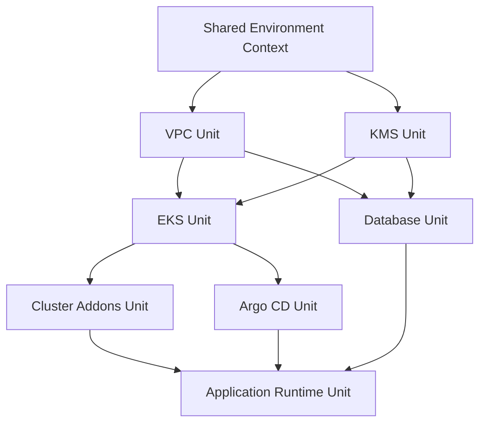

The graph is the platform.

The files are only one representation of it.

---

## 2. Unit, Stack, Root Module, Component

Different tools use different names. The concepts matter more than the labels.

| Concept | Practical Meaning |
|---|---|
| Root module | A Terraform/OpenTofu working directory that can be planned/applied independently. |
| Unit | A Terragrunt-managed root module instance, usually represented by a `terragrunt.hcl`. |
| Component | A reusable capability such as VPC, EKS, RDS, Redis, DNS, IAM role, or service runtime. |
| Stack | A collection of related units deployed together for an environment, account, region, tenant, or platform slice. |
| Dependency | A relationship where one unit needs another unit's outputs or existence. |
| Run queue | Ordered execution of units based on dependency graph and concurrency rules. |

A root module is about **state ownership**.

A stack is about **operational composition**.

A dependency graph is about **safe ordering**.

A run queue is about **execution control**.

Keep these separate.

When engineers blur them, they start using the wrong abstraction for the wrong problem.

For example, using one state file to solve orchestration is like putting every table in one database transaction because you do not want to design a workflow. It works until it does not.

---

## 3. The Central Design Trade-Off

Stack orchestration sits between two bad extremes.

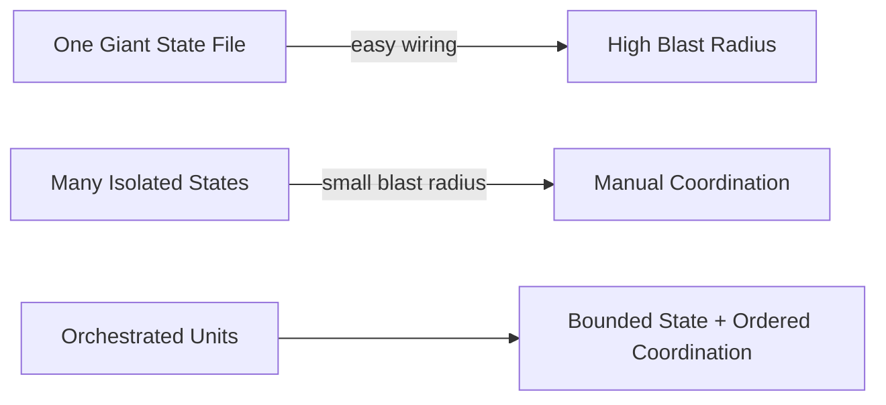

### Extreme 1: One giant root module

Benefits:

- Simple output references.
- One `plan` shows the whole world.
- No explicit cross-stack dependency tooling.

Costs:

- Very large plans.
- Slow refresh.
- High lock contention.
- Broad permissions.
- Dangerous applies.
- Hard ownership separation.
- Difficult partial recovery.
- Poor fit for multi-team platforms.

### Extreme 2: Fully isolated root modules

Benefits:

- Small state files.
- Clear ownership.
- Narrow permissions.
- Better blast-radius control.
- Easier migration per capability.

Costs:

- Output wiring becomes manual.
- Ordering becomes tribal knowledge.
- Pipelines duplicate configuration.
- Teams apply downstream units before upstream changes settle.
- Drift can propagate silently.

### The orchestration middle

An orchestrated stack tries to preserve small state boundaries while making dependency order explicit.

The invariant is:

> State should be split by ownership and blast radius. Execution should be coordinated by a dependency graph.

That is the core idea.

---

## 4. Terragrunt's Useful Mental Model

Terragrunt wraps Terraform/OpenTofu execution.

The useful model is:

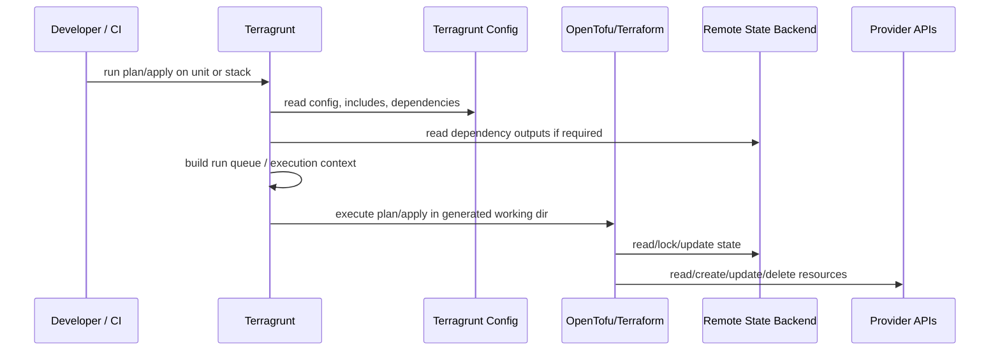

Terragrunt does not eliminate Terraform/OpenTofu state.

It does not make provider operations magically transactional.

It does not make plans safe by default.

It helps with:

- shared configuration;
- dependency output retrieval;
- execution ordering;
- reducing repetition;
- running many units with some concurrency control;
- keeping live infrastructure composition separate from reusable modules.

That is powerful.

But power is not safety.

Safety comes from boundaries, policies, identities, approvals, and recovery design.

---

## 5. The Production Folder Model

A common production shape separates reusable modules from live environment composition.

```text
infra-modules/
  vpc/
  eks-cluster/
  rds-postgres/
  iam-role/
  argocd-bootstrap/

infra-live/
  root.hcl
  account.hcl
  region.hcl
  prod/
    us-east-1/
      network/
        vpc/terragrunt.hcl
      security/
        kms/terragrunt.hcl
      platform/
        eks/terragrunt.hcl
        argocd/terragrunt.hcl
      data/
        orders-db/terragrunt.hcl
```

The reusable module says:

> Here is how to create a VPC capability.

The live unit says:

> Create this VPC capability in this account, region, environment, under this state key, with these values.

That distinction matters.

Reusable modules should be versioned as products.

Live units should be controlled as environment desired state.

Do not mix them casually.

If your module code and live environment values are tightly coupled in one repo, you can still make it work, but versioning, testing, and rollback become harder. A module change may accidentally become a production change because there is no version pin between implementation and instantiation.

---

## 6. Include Hierarchies: Useful, Dangerous, Necessary

Terragrunt's include mechanism is often used to share configuration across units.

Example conceptual hierarchy:

```text
root.hcl             -> backend, provider generation, global tags
account.hcl          -> account ID, account alias, compliance tier
region.hcl           -> region, regional defaults
environment.hcl      -> prod/stage/dev policy context
unit terragrunt.hcl  -> component-specific inputs and dependencies
```

This can remove thousands of lines of duplication.

But it can also create invisible behavior.

The production rule is:

> Shared configuration must reduce repetition without hiding operationally significant values.

Operationally significant values include:

- backend state key;
- provider identity;
- target account;
- target region;
- production flag;
- deletion protection;
- network exposure;
- encryption mode;
- data classification;
- owner;
- approval tier.

If these are inherited, the unit should still make them inspectable.

Good orchestration platforms generate a resolved configuration view in CI so reviewers can see the effective context.

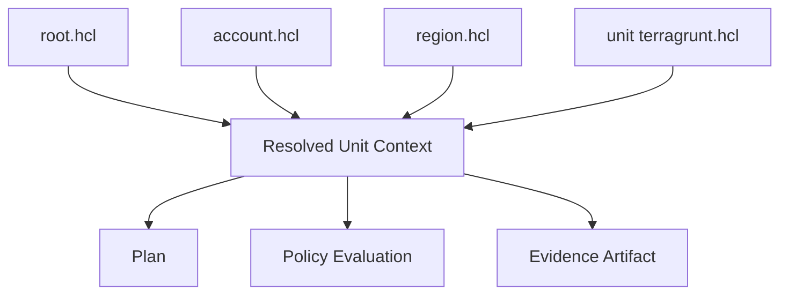

The question is not "can we DRY this?"

The question is "can a reviewer understand the resulting execution?"

---

## 7. Dependency Outputs Are an API Boundary

When one stack consumes another stack's outputs, it is consuming an API.

Example:

```text
eks depends on vpc outputs:
- vpc_id
- private_subnet_ids
- control_plane_subnet_ids

rds depends on kms outputs:
- database_kms_key_arn

argocd depends on eks outputs:
- cluster_name
- oidc_provider_arn
```

These outputs are not implementation details.

They are contracts.

A downstream unit should not need to know how the upstream VPC module internally names route tables or NAT gateways unless those are part of the supported platform contract.

### Output contract design

A strong output contract has:

| Property | Why It Matters |
|---|---|
| Stable names | Downstream units should not break because upstream refactored internals. |
| Minimal surface | Every exposed output becomes coupling. |
| Typed meaning | Output names should describe capability, not implementation accident. |
| Version awareness | Breaking output changes require migration path. |
| Sensitivity control | Secrets must not leak through casual outputs. |
| Ownership clarity | The producing team owns output compatibility. |

Bad output:

```hcl
output "subnet_1" { value = aws_subnet.private_a.id }
output "subnet_2" { value = aws_subnet.private_b.id }
```

Better output:

```hcl
output "private_subnet_ids" {
  description = "Subnets approved for private workload placement in this region."
  value       = local.private_workload_subnet_ids
}
```

The second output describes a platform capability.

The first leaks implementation shape.

---

## 8. Dependency Graphs and Run Queues

The important orchestration structure is the DAG: Directed Acyclic Graph.

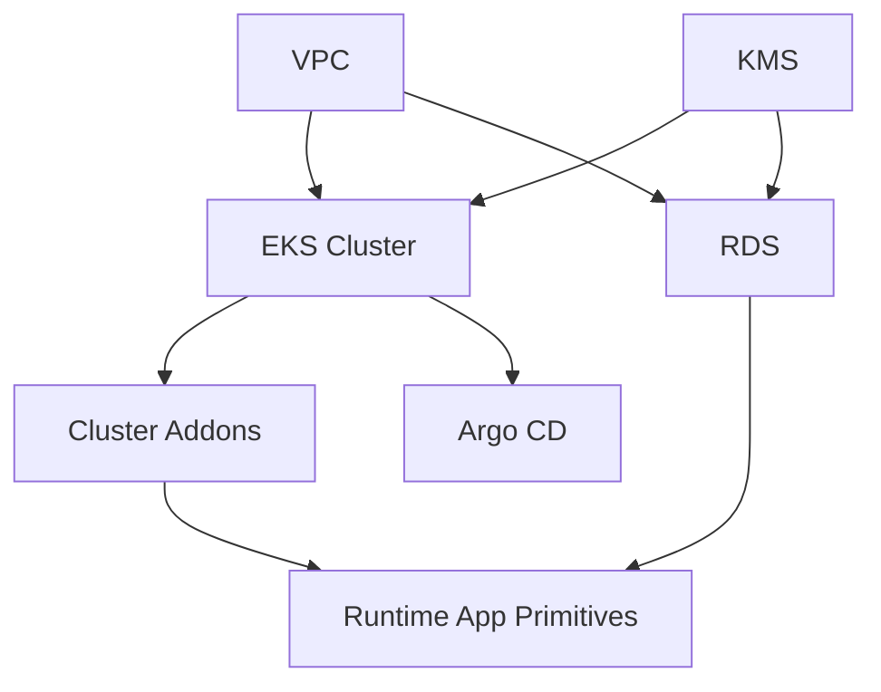

For create/update operations, dependencies must usually run before dependents.

For destroy operations, dependents must usually be destroyed before dependencies.

This matches the operational reality:

- create VPC before cluster;
- create cluster before cluster add-ons;
- remove add-ons before destroying cluster;
- destroy cluster before destroying VPC.

Terragrunt's documented run queue is based on a dependency DAG and is relevant when running across multiple units with commands such as `run --all` or `run --graph`. It runs dependencies before dependents for `plan`/`apply`, and reverses the order for `destroy`.

That is necessary but not sufficient.

A production platform still needs to decide:

- whether a graph-wide apply is allowed in production;
- whether external dependencies may be included;
- whether destructive actions require extra approval;
- whether the graph should be split by risk tier;
- whether dependencies should be read-only or actively applied;
- whether a failed unit should halt the entire queue;
- how results are reported back to PR review.

The tool gives mechanics.

The platform must define semantics.

---

## 9. The Difference Between Dependency Ordering and Change Authorization

This is a common senior-level trap.

A dependency graph can answer:

> What should run before what?

It cannot answer:

> Who is allowed to change what?

Example:

A service team changes an application runtime unit. That unit depends on shared EKS and shared VPC outputs.

Should the service team's pipeline be allowed to apply the EKS unit if Terragrunt graph traversal sees it as a dependency?

Usually no.

Dependencies are not permissions.

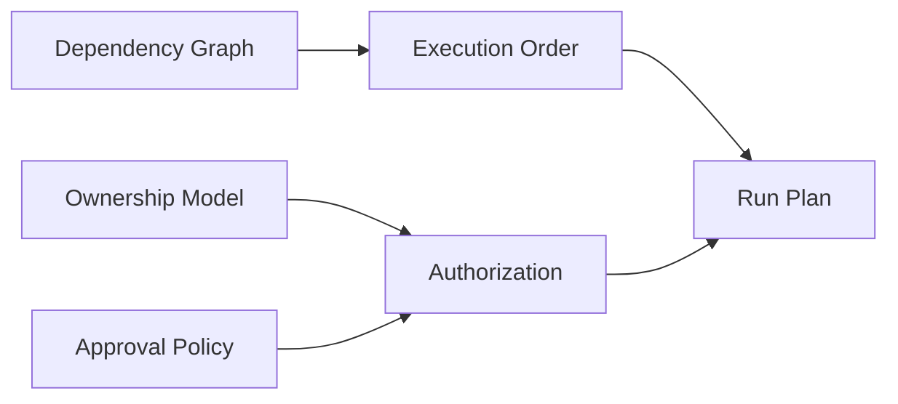

A platform should separate:

| Concern | Owned By |
|---|---|
| Dependency graph | IaC configuration and orchestration engine |
| Apply permission | IAM/OIDC/workload identity model |
| Approval requirement | Policy engine and CODEOWNERS |
| Production exception | Change governance process |
| Evidence | CI/GitOps audit system |

A unit can be a dependency without being mutable by the current actor.

The safe pattern is:

- allow reading dependency outputs where needed;
- restrict applying upstream dependencies unless the actor owns them;
- surface blocked dependencies in the plan result;
- require platform/security approval for shared foundational units.

---

## 10. Stack Boundary Design

A stack is not "everything in a folder".

A stack is a set of units that should be reasoned about together.

Good stack boundaries follow one or more of these axes:

| Boundary Type | Example |
|---|---|
| Environment | `prod`, `stage`, `dev` |
| Account/subscription/project | AWS account, Azure subscription, GCP project |
| Region | `us-east-1`, `ap-southeast-1` |
| Platform layer | network, security, compute, data, app-runtime |
| Tenant | customer-specific or regulated tenant slice |
| Lifecycle | bootstrap, long-lived foundation, ephemeral preview |
| Ownership | security-owned, platform-owned, app-team-owned |

A dangerous stack boundary is based only on convenience:

```text
everything-that-was-annoying-to-apply-together/
```

That boundary will eventually create hidden coupling.

A useful production hierarchy often looks like:

```text
live/
  prod/
    us-east-1/
      00-bootstrap/
      10-network/
      20-security/
      30-platform-control-plane/
      40-data-foundation/
      50-app-runtime/
```

The numbers are not magic.

They encode dependency layers.

But do not overfit folder names. The DAG must remain the source of execution ordering. Numeric prefixes are only a human reading aid.

---

## 11. Layered Stack Model

For enterprise platforms, it helps to think in layers.

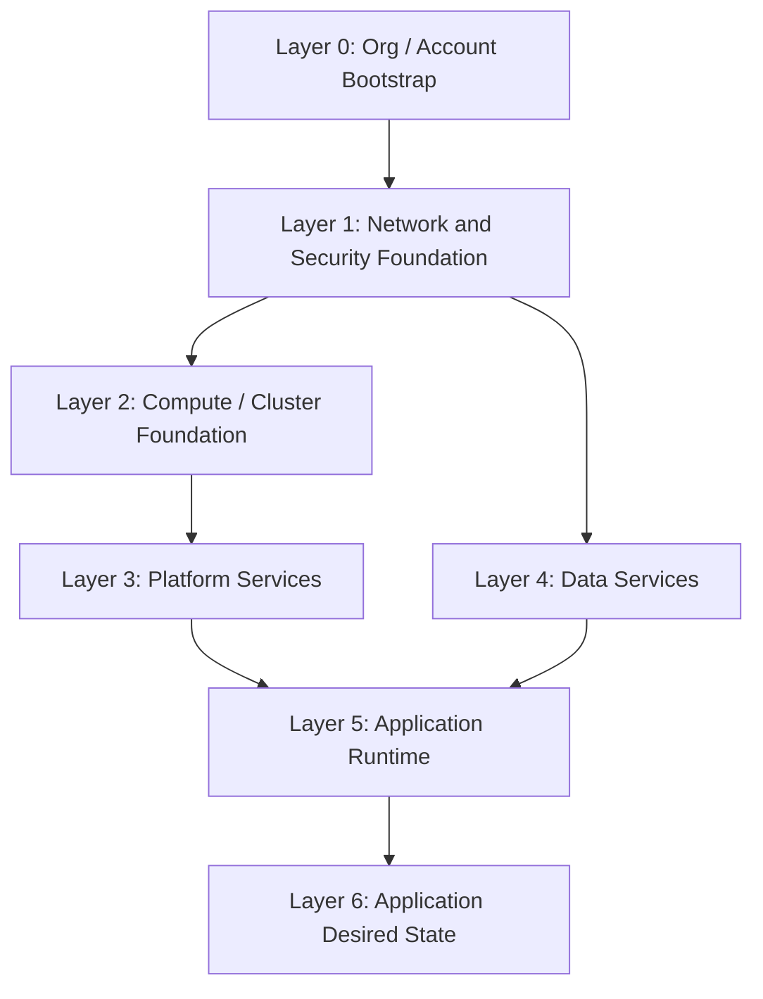

### Layer 0: organization/bootstrap

Examples:

- cloud accounts/subscriptions/projects;
- root IAM roles;
- state buckets;
- KMS keys for state;
- identity federation trust;
- baseline audit logging.

This layer is highly privileged.

It should rarely change.

### Layer 1: network/security foundation

Examples:

- VPC/VNet;
- subnets;
- route tables;
- firewall/security group baselines;
- DNS zones;
- KMS keys;
- certificate authorities.

This layer has huge blast radius.

### Layer 2: compute/cluster foundation

Examples:

- Kubernetes clusters;
- node pools;
- cluster IAM/OIDC;
- core ingress primitives.

This layer connects cloud infrastructure with GitOps reconciliation.

### Layer 3: platform services

Examples:

- Argo CD/Flux bootstrap;
- external secrets controller;
- policy controllers;
- observability agents;
- ingress controllers;
- service mesh.

This layer is often partly IaC and partly GitOps.

### Layer 4: data services

Examples:

- managed PostgreSQL;
- Redis;
- Kafka;
- object storage buckets;
- backup policies.

This layer is sensitive because data durability and schema compatibility matter.

### Layer 5: application runtime

Examples:

- namespaces;
- service accounts;
- workload IAM;
- network policies;
- secret bindings;
- app-specific queues/buckets.

### Layer 6: application desired state

Examples:

- deployment manifests;
- Helm releases;
- Kustomize overlays;
- Argo CD applications;
- Flux kustomizations.

The important decision is not whether these layers are exactly right.

The important decision is to avoid treating every unit as equivalent.

Changing a namespace label is not the same kind of event as changing organization-wide identity federation.

---

## 12. Orchestrating IaC and GitOps Together

A state-of-the-art platform usually has two reconciliation systems:

1. IaC engine for cloud/external infrastructure.
2. GitOps controller for Kubernetes/application desired state.

The boundary between them must be explicit.

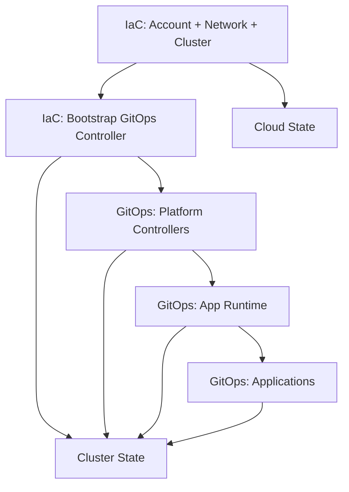

The bootstrap problem is subtle:

- GitOps controller needs a cluster to run in.
- The cluster may be created by IaC.
- The GitOps controller may need secrets/identity created by IaC.
- The IaC pipeline may want GitOps health before declaring success.

This creates a lifecycle chain:

```text
IaC creates cluster
IaC installs or points to GitOps controller
GitOps installs platform services
GitOps reports sync/health
IaC evidence links to GitOps evidence
```

Do not let IaC and GitOps both own the same resource.

Examples of dangerous dual ownership:

- Terraform creates a Kubernetes namespace, Argo CD also manages it.
- Terraform manages Helm release, Flux also manages Helm release.
- Terraform patches a Kubernetes service account, Kyverno mutates it differently.
- Crossplane creates cloud resource while Terraform also owns it.

The invariant:

> One resource, one desired-state owner.

You may have multiple observers.

You should not have multiple reconcilers fighting over the same field unless server-side apply ownership is intentionally designed and tested.

---

## 13. `run --all` Is Not a Governance Model

Multi-unit execution is tempting.

One command. Many stacks. A clean story.

But production governance should not be "we ran everything".

A graph-wide run can be useful for:

- new environment bootstrap;
- ephemeral preview environments;
- non-production validation;
- disaster recovery rehearsal;
- dependency graph smoke testing;
- planned coordinated migrations.

A graph-wide run is dangerous for:

- routine production changes;
- shared foundation layers;
- units with different owners;
- units with different approval tiers;
- stacks with irreversible operations;
- stacks requiring different credentials.

The production rule:

> The wider the execution scope, the stronger the authorization, approval, observability, and rollback story must be.

A safe platform may allow:

| Scope | Example | Allowed Automatically? |
|---|---|---|
| Single unit plan | One RDS parameter group | Yes, if actor can read state. |
| Single unit apply | One app runtime stack | Yes, if approved and owned. |
| Layer plan | All cluster add-ons | Usually yes in non-prod; controlled in prod. |
| Layer apply | All platform services | Requires platform approval. |
| Whole region apply | Everything in `prod/us-east-1` | Rare; change event with explicit approval. |
| Destroy graph | Production foundation | Almost never through ordinary pipeline. |

Do not confuse operational convenience with acceptable risk.

---

## 14. Affected-Unit Detection

At scale, planning every unit on every PR is too slow.

Planning only changed files is too naive.

A change to a shared module may affect many live units.

A change to an upstream output may affect downstream units.

A change to policy may affect all units.

A change to CI pipeline may affect no infrastructure directly but changes trust.

A robust affected-unit system considers:

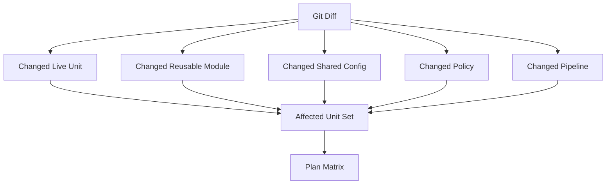

### Simple affected-set rules

| Change Type | Affected Plans |
|---|---|
| Unit config changed | That unit. |
| Shared environment config changed | All units inheriting that config. |
| Reusable module changed without version bump | All units sourcing local module. |
| Reusable module version bump in one unit | That unit and possibly dependents. |
| Policy changed | All units in policy scope, or policy test matrix. |
| Backend config changed | Manual review; plan may be unsafe. |
| State migration file changed | Manual review and migration workflow. |

Terragrunt provides filtering features, but the platform must still define what "affected" means for your repository and governance model.

Especially watch for local modules.

If live units reference modules by relative path, a module code change can affect every unit that uses it immediately.

If live units reference versioned module sources, a module code change affects only units that upgrade the version.

That is the difference between module development and production rollout.

---

## 15. Dependency Plans: How Much Should You Plan?

Suppose a service unit depends on `vpc`, `kms`, and `eks`.

A PR changes only the service unit.

Should the pipeline plan the dependencies?

There are several models.

### Model A: Plan only changed unit

Fast, cheap, but can miss upstream drift that affects outputs.

Good for low-risk, high-frequency units.

### Model B: Plan changed unit plus direct dependencies in read-only mode

Better evidence, but more expensive.

Useful when dependency outputs are critical.

### Model C: Plan changed unit plus dependents

Useful when changing a shared upstream unit.

Example: if VPC output changes, plan downstream EKS, RDS, and app runtime units.

### Model D: Full graph plan

Highest confidence, slowest, noisiest.

Useful for environment bootstrap or major migrations.

A mature pipeline supports multiple plan scopes and chooses based on change type.

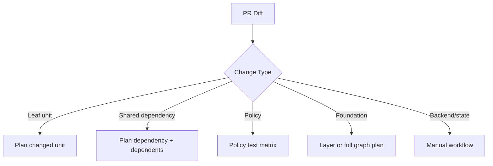

The plan scope is a risk decision.

It should not be an accidental command default.

---

## 16. Orchestration and State Locking

OpenTofu/Terraform state locking prevents concurrent writes to the same state backend key when supported by the backend.

That solves one class of corruption.

It does not solve cross-state race conditions.

Example:

- Unit A updates VPC outputs.
- Unit B reads old VPC outputs and starts planning.
- Unit A applies and changes remote reality.
- Unit B applies based on a stale view.

The state lock of Unit A does not lock Unit B.

Cross-state orchestration must account for this.

Useful controls:

- dependency-ordered execution;
- re-plan before apply;
- serialize dependent applies;
- immutable plan artifact binding;
- state output versioning;
- dependency health checks;
- explicit promotion between layers.

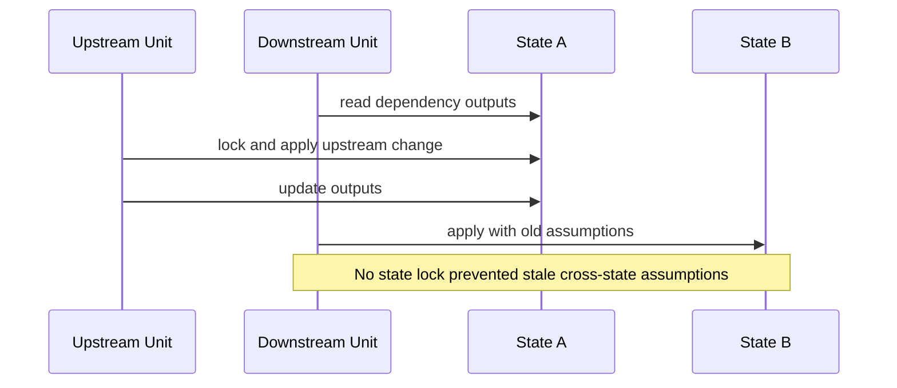

This is why orchestration matters beyond backend locking.

---

## 17. The Hidden Cost of Output Fetching

Dependency outputs are convenient.

But at scale, output fetching can be expensive and fragile.

Risks include:

- slow CI because every dependency fetch hits remote state;
- credentials needed to read many state backends;
- accidental exposure of sensitive outputs;
- hidden coupling to remote state structure;
- failures when upstream state is unavailable;
- dependency cycles caused by poorly designed outputs.

A production platform should classify outputs:

| Output Type | Example | Handling |
|---|---|---|
| Public topology | VPC ID, subnet IDs | Safe for dependency outputs. |
| Capability endpoint | cluster name, DNS zone ID | Safe if stable. |
| Sensitive secret | password, token | Avoid; use secret manager reference instead. |
| Internal implementation | route table IDs, random suffix | Avoid unless explicitly supported. |
| Migration marker | schema version, rollout phase | Use carefully with strong contract. |

Never use state outputs as an informal service discovery system for everything.

If many teams need to discover platform capabilities, consider publishing a platform catalog or environment contract artifact instead of forcing everyone to read remote state.

---

## 18. Stack Orchestration Anti-Patterns

### Anti-pattern 1: Dependency graph as ownership graph

A downstream app team can depend on VPC outputs.

That does not mean they own VPC.

### Anti-pattern 2: Global `run --all apply` as normal workflow

This makes small changes operationally broad.

Use graph-wide applies as explicit events, not default daily behavior.

### Anti-pattern 3: Copy-paste environment trees

Copy-paste starts simple, then diverges silently.

Better: environment contracts, stack definitions, generated scaffolding, or versioned stack composition.

### Anti-pattern 4: Unversioned local module everywhere

A module change instantly affects all units that reference it.

That may be acceptable for internal development but dangerous for production.

### Anti-pattern 5: Output everything

Every output is coupling.

Expose capabilities, not internals.

### Anti-pattern 6: Hidden include hierarchy

If reviewers cannot tell the effective backend, provider identity, account, region, and policy context, the DRY model is too opaque.

### Anti-pattern 7: Destructive operations through ordinary path

Destroy deserves separate flow, separate approval, separate evidence, and often separate credentials.

### Anti-pattern 8: Orchestration without observability

If a multi-unit run fails, you need to know:

- which unit failed;
- what dependency group it was in;
- what was skipped;
- what was already applied;
- whether downstream units are stale;
- whether manual recovery is required.

---

## 19. Production Pipeline Pattern for Terragrunt-Like Orchestration

A strong PR pipeline can be shaped like this:

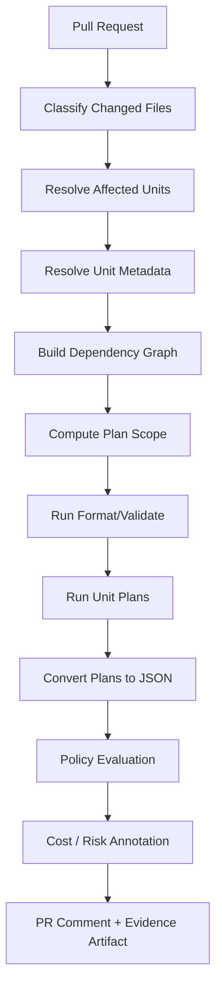

An apply pipeline can be shaped like this:

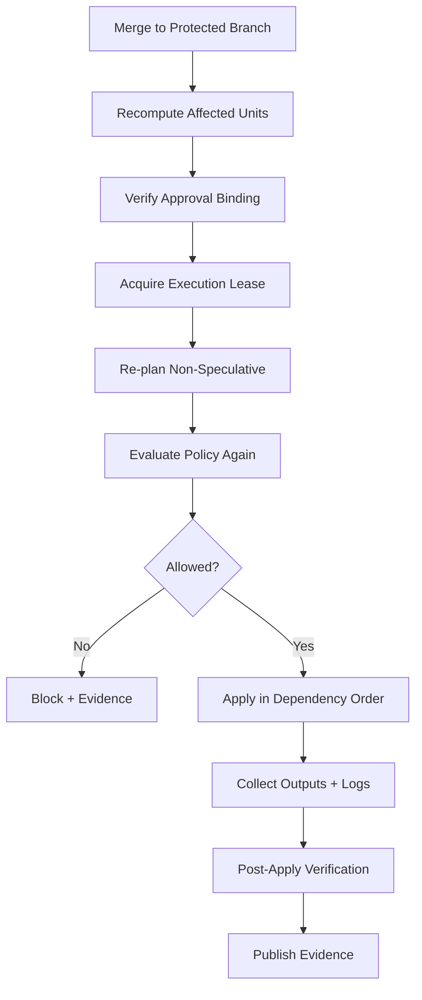

Important: the apply pipeline does not blindly trust the PR plan.

It recomputes.

Why?

Because the target state may have changed after PR review.

OpenTofu/Terraform documentation explicitly distinguishes speculative plans from saved plans intended for automation. A speculative plan is useful for review, but final apply should re-check the actual plan before making changes.

---

## 20. Saved Plan Files in an Orchestrated World

For a single root module, saved plan mode is straightforward:

```text
plan -out=tfplan
show tfplan
apply tfplan
```

In a multi-unit stack, saved plan files become more complex.

You now need to bind:

- unit identity;
- commit SHA;
- module versions;
- provider lock file;
- backend address;
- workspace/state key;
- variable values;
- environment context;
- credential scope;
- policy result;
- approval record;
- plan file checksum.

A saved plan is not just a file.

It is an **evidence-bearing artifact**.

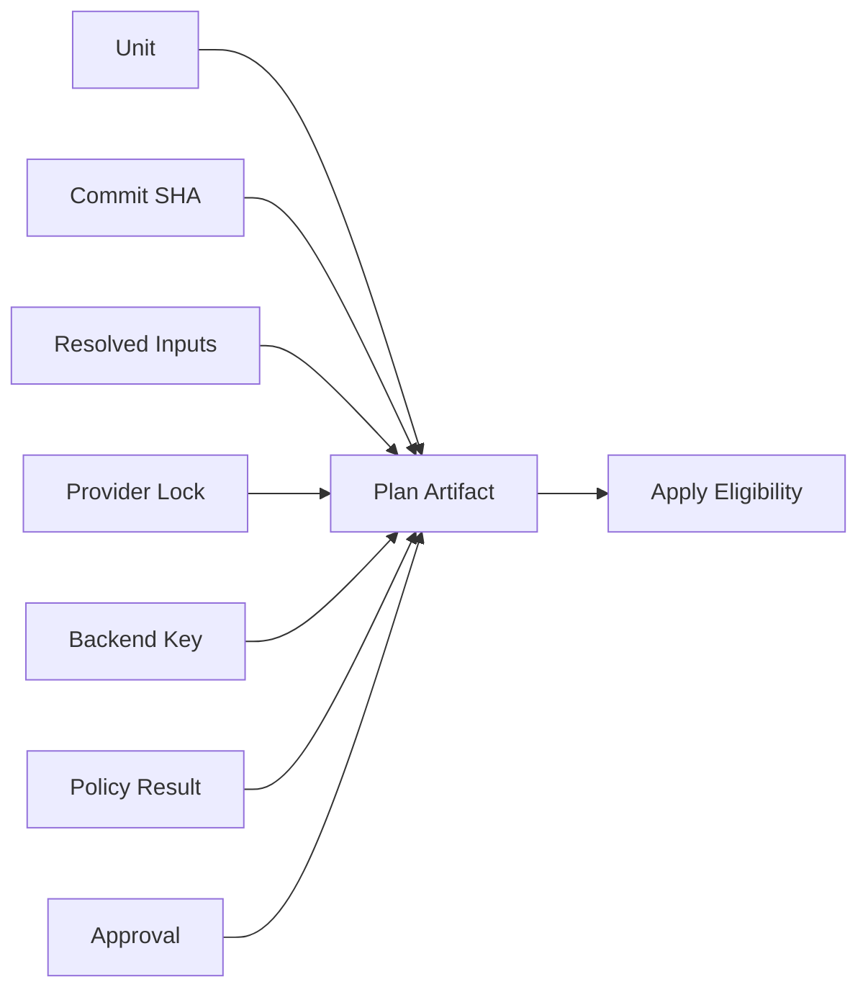

At scale, many teams choose to use speculative PR plans for review and recompute non-speculative plans in the protected apply pipeline. That is often simpler than storing and applying PR-generated plan files across long review windows.

But for high-risk changes, saved plan artifacts can be valuable if tightly bound and short-lived.

The principle:

> A plan that is not bound to identity, commit, inputs, backend, and approval is not a safe automation artifact.

---

## 21. When Terragrunt Is a Good Fit

Terragrunt-like orchestration is a good fit when:

- you have many Terraform/OpenTofu root modules;
- shared backend/provider/environment configuration is duplicated;
- dependencies between units are real and recurring;
- you need dependency-ordered planning/applying;
- you operate many environments/accounts/regions;
- you want live environment composition separate from reusable modules;
- you prefer Terraform/OpenTofu as the resource engine;
- you need something lighter than building a full platform control plane.

It is especially useful in organizations that are past "single root module" maturity but not ready to model all infrastructure through Crossplane or a custom platform API.

---

## 22. When Terragrunt May Be the Wrong Fit

It may be the wrong fit when:

- you only have a few root modules;
- dependencies are minimal;
- your team does not understand Terraform/OpenTofu state well;
- reviewers cannot reason through include/dependency behavior;
- you need strong multi-tenant self-service APIs rather than file-level orchestration;
- you already use a managed IaC runner with native stack dependency features;
- you want a Kubernetes-native reconciliation model for infrastructure;
- your organization treats every abstraction as a place to hide exceptions.

Terragrunt can reduce repetition.

But if your underlying platform model is messy, Terragrunt can make the mess more scalable.

That is not a win.

---

## 23. Designing a Unit Metadata Contract

A production orchestration platform should not infer everything from paths.

Each unit should expose metadata.

Example conceptual metadata:

```yaml
unit: platform/eks
owner: platform-foundation
riskTier: high
environment: prod
region: us-east-1
account: prod-platform
stateBoundary: prod/us-east-1/platform/eks
layer: compute-foundation
requiresApprovalFrom:
  - platform-foundation
  - security-for-network-change
allowedActors:
  - ci-role-platform-prod-iac
supportsDestroy: false
policyProfile: prod-foundation
```

This metadata can live in HCL locals, YAML sidecars, generated inventory, or platform catalog.

The exact format matters less than the presence of explicit metadata.

Why?

Because pipeline behavior should be driven by declared risk and ownership, not by fragile path regexes alone.

A path can help.

A path is not governance.

---

## 24. Orchestration Risk Matrix

Before allowing a stack run, classify it.

| Dimension | Low Risk | Medium Risk | High Risk |
|---|---|---|---|
| Scope | Single leaf unit | Several app units | Foundation graph |
| Environment | Dev | Stage | Production |
| Operation | Add/update | Replace | Destroy |
| State | Isolated | Shared dependency | Bootstrap/state backend |
| Data | Stateless | Cached/derived | Durable regulated data |
| Identity | Narrow scoped | Shared runner | Privileged bootstrap |
| Rollback | Easy | Manual | Irreversible/complex |

Pipeline behavior should change with risk.

For high-risk stack runs:

- require explicit change ticket or approved exception;
- require human-readable plan summary;
- block broad destroys;
- require platform/security CODEOWNERS;
- serialize applies;
- capture evidence artifacts;
- require post-apply verification;
- notify affected teams.

---

## 25. Failure Modeling for Stack Runs

A multi-unit run can fail in more interesting ways than a single apply.

### Failure: dependency unit fails

Downstream units should not run unless explicitly allowed.

Evidence should show skipped units.

### Failure: dependency output missing

This can indicate:

- upstream not applied;
- output renamed;
- wrong state key;
- wrong workspace;
- credential cannot read state;
- corrupted or unavailable state.

Do not patch downstream config blindly.

Fix the contract.

### Failure: one parallel group partially succeeds

If three independent units run concurrently and one fails, you now have a partially advanced environment.

Recovery requires knowing exactly which units applied.

### Failure: stale dependency output

Re-run plan after upstream apply.

Do not assume previous downstream plans are still valid.

### Failure: graph cycle

A cycle usually means the architecture is wrong.

Common cause:

- cluster needs DNS;
- DNS controller needs cluster;
- certificate needs ingress;
- ingress needs certificate.

Break cycles by introducing explicit bootstrap phases or external primitives.

### Failure: destroy order wrong

Destroying dependencies before dependents can strand resources.

Destructive graph execution must be reviewed separately.

---

## 26. Practical Design: The `live` Repository Contract

A strong `infra-live` repository should make these things obvious:

1. Which environment/account/region a unit targets.
2. Which state backend key it owns.
3. Which module version it instantiates.
4. Which dependencies it consumes.
5. Which team owns it.
6. Which policy profile applies.
7. Whether it can be destroyed.
8. Whether it participates in graph-wide applies.
9. Which identity can apply it.
10. Which evidence must be produced.

A reviewer should be able to answer:

> If this PR merges, which real-world systems may change?

If the repository cannot answer that quickly, your orchestration model is not production-grade yet.

---

## 27. Example: Network-to-Cluster-to-GitOps Bootstrap

A realistic bootstrap chain:

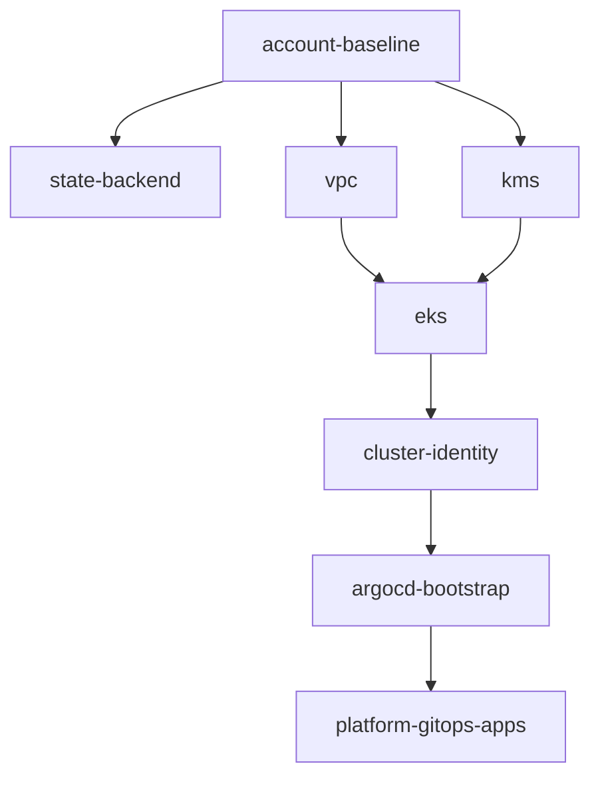

### Important ownership choices

| Unit | Owner | Destroy Allowed? | Notes |
|---|---|---:|---|
| account-baseline | cloud platform/security | No | Bootstrap identity and audit. |
| state-backend | platform | No | State durability, locking, encryption. |
| vpc | network/platform | Rarely | Broad blast radius. |
| kms | security/platform | Rarely | Data access and encryption boundary. |
| eks | platform | Controlled | Compute foundation. |
| cluster-identity | platform/security | Controlled | OIDC and workload identity. |
| argocd-bootstrap | platform | Controlled | Starts GitOps reconciliation. |
| platform-gitops-apps | platform | Yes, via GitOps rules | Controllers and baseline apps. |

The graph alone does not encode these governance rules.

Your platform must.

---

## 28. Example: Service Runtime Stack

A service team may receive a runtime stack:

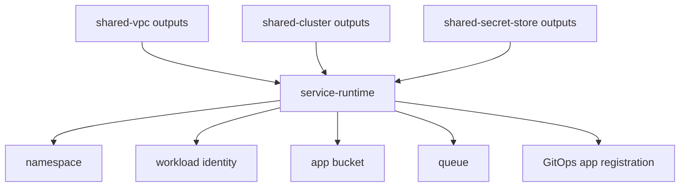

The service team owns `service-runtime`.

They do not own `shared-vpc`, `shared-cluster`, or `shared-secret-store`.

Their pipeline may read those outputs, but it should not apply those foundational units.

This is the difference between dependency and authority.

---

## 29. Testing Stack Orchestration

You need tests at several layers.

| Test Type | Purpose |
|---|---|
| HCL parse/format | Catch syntax and formatting issues. |
| Unit config validation | Ensure required metadata and inputs exist. |
| Dependency graph validation | Detect cycles and forbidden dependencies. |
| Policy tests | Validate unit against environment/risk policy. |
| Plan tests | Generate actual plans for affected units. |
| Contract tests | Verify outputs consumed by downstream units exist and remain compatible. |
| Pipeline tests | Simulate changed files and expected affected units. |
| Disaster tests | Validate failure and recovery playbooks. |

A very valuable test is:

> Given a diff, does the pipeline select the correct units to plan?

Many outages start because the pipeline planned too little.

---

## 30. Review Checklist

Use this checklist before approving a Terragrunt-like orchestration design.

### State and boundaries

- Does each unit own exactly one clear state boundary?
- Is the state backend key deterministic and reviewable?
- Are workspaces avoided for materially different production targets?
- Is each unit's blast radius understandable?

### Dependencies

- Are dependencies explicit?
- Are outputs minimal and stable?
- Are sensitive values excluded from outputs?
- Are dependency cycles impossible or tested?
- Are upstream ownership boundaries respected?

### Execution

- Is plan scope determined by diff and risk?
- Is apply scope narrower than plan scope when appropriate?
- Are production graph-wide applies exceptional?
- Is destroy separated from normal apply?
- Is concurrency bounded?

### Governance

- Are owner, risk tier, policy profile, and allowed identity explicit?
- Does CODEOWNERS match unit ownership?
- Are approval rules tied to actual affected units?
- Are exceptions auditable?

### Evidence

- Is resolved config captured?
- Are plan summaries captured?
- Are policy results captured?
- Are applied unit results captured?
- Can auditors reconstruct who approved and what changed?

---

## 31. Mental Model Summary

Terragrunt is best understood as an orchestration layer around Terraform/OpenTofu root modules.

It helps you compose many state boundaries without collapsing them into one giant root module.

But it does not replace architecture.

The core invariants are:

1. Split state by ownership, lifecycle, and blast radius.
2. Express dependencies as contracts, not as tribal knowledge.
3. Treat dependency outputs as APIs.
4. Separate dependency order from authorization.
5. Make plan/apply scope explicit.
6. Avoid graph-wide production applies as normal workflow.
7. Bind orchestration to evidence.
8. Model failure before automating broadly.

A good orchestration layer makes the platform easier to reason about.

A bad orchestration layer only makes accidental complexity run faster.

---

## 32. Practice Work

Design a stack orchestration model for this scenario:

- 3 environments: `dev`, `stage`, `prod`.
- 2 regions: `ap-southeast-1`, `us-east-1`.
- 5 platform units: VPC, KMS, EKS, Argo CD, External Secrets.
- 3 data units: orders DB, customer DB, Redis.
- 10 service runtime units.
- Security owns KMS and identity.
- Platform owns VPC, EKS, Argo CD, External Secrets.
- Service teams own runtime units.

Produce:

1. Repository layout.
2. Unit metadata contract.
3. Dependency graph.
4. Allowed plan scopes.
5. Allowed apply scopes.
6. Destroy policy.
7. Failure recovery playbook for failed EKS apply.
8. Evidence artifact list.

Do not start with folders.

Start with ownership and state boundaries.

---

## References

- Terragrunt Run Queue documentation: dependency DAG, `run --all`, `run --graph`, ordering, concurrency, and destroy ordering.
- Terragrunt `run` command documentation: multi-unit execution, filtering, affected components, graph mode, and external dependency behavior.
- Gruntwork Terragrunt Stacks announcement: stack abstraction above units using `terragrunt.stack.hcl`.
- OpenTofu state locking documentation: state lock behavior for write operations.
- OpenTofu and Terraform plan/apply documentation: speculative plans, saved plans, and automation-oriented two-step workflows.
