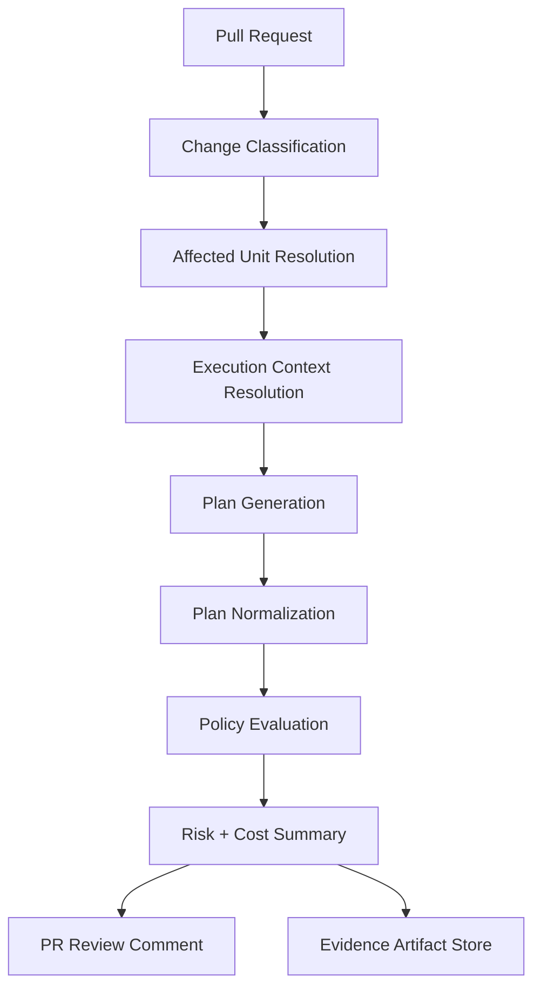
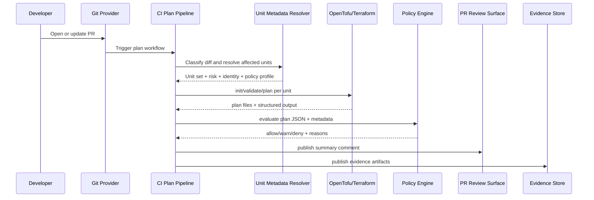
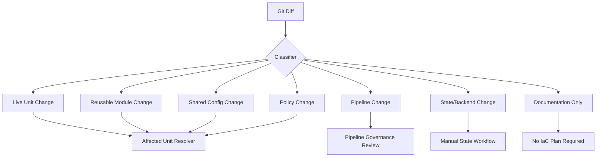
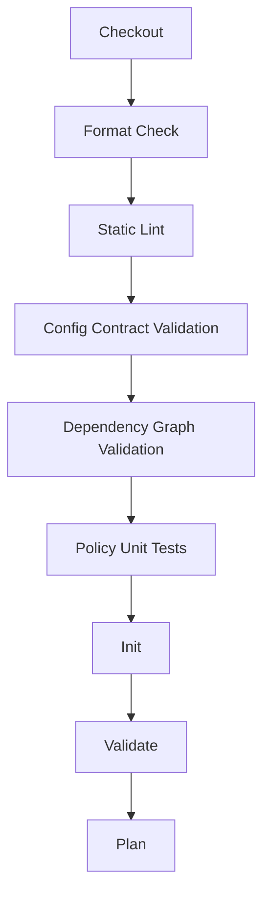
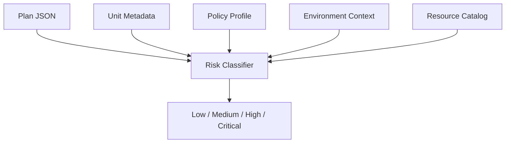
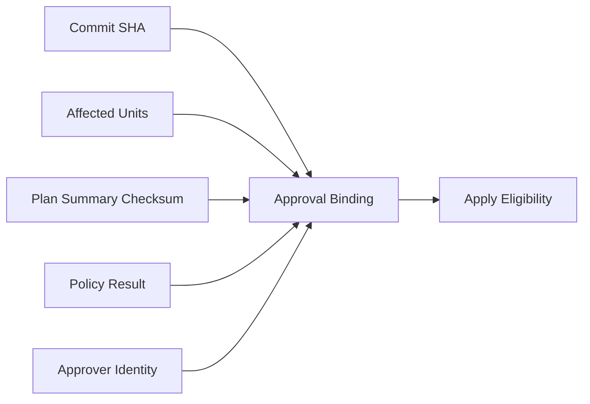
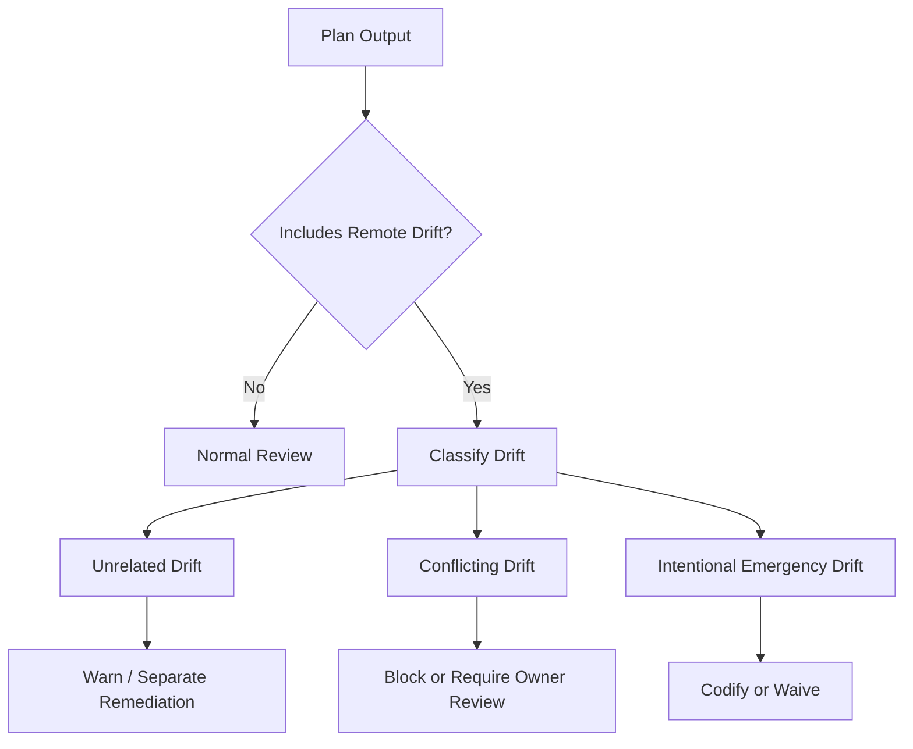
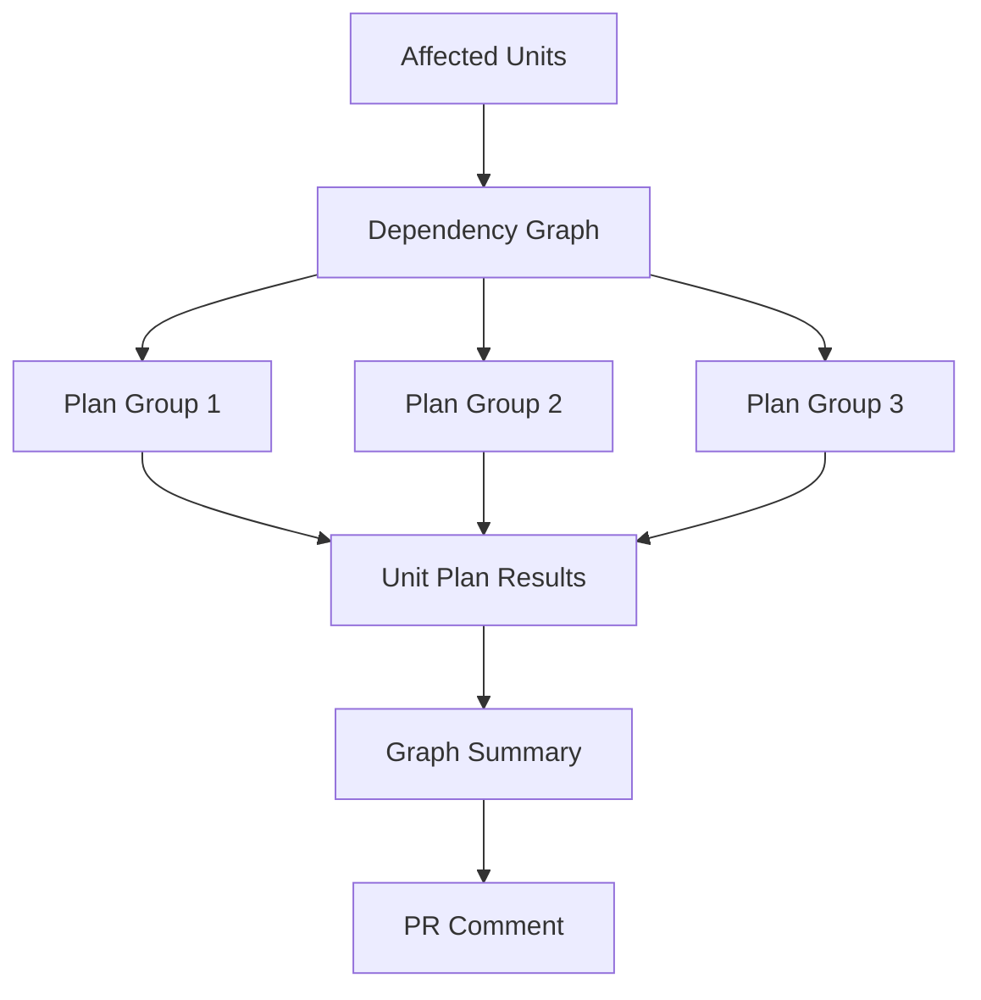

# Part 012 — Designing the Plan Pipeline

The plan pipeline is where infrastructure changes become visible before they become real.

That sentence sounds simple.

It is not.

A weak plan pipeline only runs `terraform plan` or `tofu plan` and posts a wall of text into a pull request.

A production-grade plan pipeline answers a richer set of questions:

- What changed?
- Which state boundaries are affected?
- Which dependencies are affected?
- Which credentials were used?
- Which policy profile applies?
- Is the plan speculative or apply-bound?
- Which resources will be created, updated, replaced, or destroyed?
- Is the change consistent with environment, ownership, and approval rules?
- What evidence was produced?
- What must be rechecked before apply?

A plan pipeline is not a preview command.

It is a **risk classification and evidence-generation system**.



This part designs that system.

---

## 1. The Plan Pipeline Contract

The plan pipeline must produce a reviewable, auditable answer to this question:

> If this change were applied to the target system, what would likely happen, and is that acceptable under our policy?

The word "likely" matters.

A speculative plan is not a guarantee.

OpenTofu and Terraform both describe `plan` as creating an execution plan that previews proposed changes, and both distinguish speculative plans from saved plans intended for later apply. A speculative plan is useful for review, but the target system may change between review and apply.

Therefore, a production plan pipeline must be honest:

- PR plans are evidence for review.
- Apply-time plans are evidence for execution.
- A stale PR plan must not be treated as eternal truth.

The plan pipeline should produce artifacts that are useful but not overclaim what they prove.

---

## 2. Plan Pipeline Invariants

A serious plan pipeline follows these invariants.

### Invariant 1: Every plan has a target

A plan without a clear state boundary is noise.

The pipeline must identify:

- environment;
- account/subscription/project;
- region;
- root module/unit;
- backend address;
- state key/workspace;
- runner identity;
- policy profile.

### Invariant 2: Every plan is tied to a source revision

The plan must be linked to:

- repository;
- commit SHA;
- pull request number;
- module version or source reference;
- lock files;
- rendered/generated config checksum.

### Invariant 3: Every plan has an execution identity

Reviewers must know whether the plan was generated with:

- read-only credentials;
- plan-only role;
- production apply-capable role;
- service-team role;
- platform role;
- security role.

A plan generated with insufficient permissions may be incomplete.

A plan generated with overly broad permissions is a security risk.

### Invariant 4: Every plan is machine-readable

Human text is not enough.

The pipeline should produce machine-readable plan output so policies, summaries, and risk classification can operate reliably.

For Terraform/OpenTofu, that commonly means saving a plan and converting it to JSON using `show -json`, with careful handling of sensitive values.

### Invariant 5: Every plan is policy-evaluated

A plan without policy is only information.

Policy turns it into a decision.

### Invariant 6: Every plan result is durable evidence

A PR comment is not enough.

Evidence should be stored as artifacts with identity, timestamp, checksum, and retention.

---

## 3. Why `plan` Is Not Just `plan`

There are multiple plan types.

| Plan Type | Purpose | Apply-Bound? | Risk |
|---|---|---:|---|
| Local developer plan | Fast feedback before PR | No | May use wrong credentials/context. |
| CI speculative plan | PR review evidence | No | Can go stale before merge. |
| Apply-time plan | Final pre-apply check | Usually yes or immediately followed by apply | Must be policy checked. |
| Saved plan artifact | Apply exactly planned actions | Yes | Must be tightly bound and protected. |
| Drift plan | Detect remote changes | No, unless remediation flow | Can confuse intentional vs accidental drift. |
| Refresh-only plan | Update/inspect state vs remote | Not normal change | Can hide or reveal drift depending on workflow. |
| Destroy plan | Deletion preview | Maybe | Requires special governance. |
| Replace-target plan | Force replacement | Maybe | High risk; easy to misuse. |

A state-of-the-art pipeline treats these as different events.

Do not let all of them use the same CI job with different flags and no policy distinction.

---

## 4. High-Level Architecture



The key is not the CI tool.

GitHub Actions, GitLab CI, Buildkite, Jenkins, CircleCI, Azure DevOps, or a managed IaC runner can all implement this.

The key is the contract.

---

## 5. Phase 1 — Trigger Discipline

A plan pipeline should run when the desired state may have changed.

Common triggers:

- pull request opened;
- pull request synchronized;
- pull request reopened;
- label added for special plan scope;
- manual dispatch by authorized user;
- scheduled drift scan;
- policy repository update;
- module version update;
- upstream dependency output change.

But not all triggers should have equal privilege.

### Fork PRs

Fork PRs are dangerous for IaC planning because plan steps may execute code-like provider/module behavior and may require access to state or credentials.

For public repositories, never give untrusted fork PRs production credentials.

Safer patterns:

- run static validation only;
- run module unit tests without cloud credentials;
- require maintainer approval before credentialed plan;
- use isolated ephemeral accounts;
- use read-only state credentials;
- prevent secrets exposure in logs.

### Label-triggered elevated plans

A useful pattern:

```text
normal PR update       -> static checks + low-privilege speculative plan
label: plan-prod       -> production speculative plan with read-only/plan role
label: full-graph-plan -> expanded scope, restricted to platform maintainers
```

Labels should not be magic strings anyone can apply.

They are governance events.

---

## 6. Phase 2 — Change Classification

Before planning, classify the change.

A pipeline that blindly plans changed folders misses risk.



### Classification table

| Change | Pipeline Response |
|---|---|
| `infra-live/prod/us-east-1/platform/eks` | Plan that unit; maybe dependents. |
| `infra-modules/vpc` with local source usage | Plan all live units using that module. |
| Module version bump in one live unit | Plan that unit and direct dependents if outputs may change. |
| `root.hcl` or shared provider config | Plan all inheriting units or block for manual scope. |
| Backend config | Block normal plan; require state migration workflow. |
| Policy rule | Run policy tests and evaluate representative affected units. |
| CI workflow | Require platform approval; plan pipeline behavior changed. |
| README | No plan, unless docs generate config. |

The classifier is part of your safety system.

Treat it like production code.

---

## 7. Phase 3 — Affected Unit Resolution

Affected unit resolution maps a diff to real state boundaries.

Input:

```text
changed files
repository metadata
module source graph
dependency graph
unit metadata
policy scopes
```

Output:

```text
unit set to plan
plan scope
risk tier
required identity
required policy profile
required reviewers
```

A good resolver does not only answer "what folder changed?"

It answers:

> Which real state boundaries could produce a different plan because of this change?

### Example: service runtime change

```text
changed:
  infra-live/prod/us-east-1/apps/order-api/terragrunt.hcl

affected:
  prod/us-east-1/apps/order-api

plan scope:
  single unit
```

### Example: shared region config change

```text
changed:
  infra-live/prod/us-east-1/region.hcl

affected:
  every unit under prod/us-east-1 inheriting region.hcl

plan scope:
  regional layer or full region depending on policy
```

### Example: module implementation change

```text
changed:
  infra-modules/rds-postgres/**

affected:
  all live units sourcing that module by local path

plan scope:
  all consumers, maybe grouped by environment risk
```

### Example: versioned module release

```text
changed:
  infra-live/stage/us-east-1/data/orders-db/terragrunt.hcl
  source ref: rds-postgres v1.4.2 -> v1.5.0

affected:
  only orders-db stage unit unless outputs affect dependents
```

Versioned modules make affected analysis easier.

Unversioned local modules make it harder.

---

## 8. Phase 4 — Execution Context Resolution

Before running plan, resolve the context.

A unit context should include:

```yaml
unit: prod/us-east-1/platform/eks
environment: prod
region: us-east-1
account: prod-platform
stateKey: prod/us-east-1/platform/eks.tfstate
engine: opentofu
engineVersion: 1.x
moduleSource: git::ssh://example/infra-modules.git//eks?ref=v2.3.1
runnerIdentity: oidc:ci-prod-platform-plan
policyProfile: prod-foundation
riskTier: high
allowDestroy: false
owners:
  - platform-foundation
  - security
```

This context drives:

- credentials;
- backend access;
- policy rules;
- plan command flags;
- PR summary grouping;
- approval requirements;
- artifact naming;
- retention rules.

If your pipeline cannot produce this context, it is not ready for production-grade automation.

---

## 9. Phase 5 — Workspace and Dependency Preparation

For each affected unit:

1. Check out exact PR commit.
2. Install pinned engine version.
3. Install or verify wrapper version if using Terragrunt.
4. Restore plugin cache carefully.
5. Initialize backend.
6. Verify backend target.
7. Verify provider lock file.
8. Resolve dependencies.
9. Validate configuration.
10. Generate plan.

### Backend target verification

This is critical.

Before plan, print and store:

- backend type;
- backend key/path;
- workspace name if used;
- target account/project/subscription;
- target region;
- assumed identity ARN/principal;
- commit SHA.

Many real incidents come from running a correct plan against the wrong state or account.

The plan pipeline should make the target impossible to miss.

---

## 10. Phase 6 — Validation Before Plan

Do not run plan as the first check.

Run cheaper checks first.

Typical sequence:



### Why this matters

- Format catches noise early.
- Static lint catches obvious mistakes without cloud credentials.
- Contract validation catches missing metadata.
- Graph validation catches cycles before hitting providers.
- Policy tests catch rule syntax and expectation changes.
- Init/validate catches provider/module resolution issues.
- Plan catches real target diff.

A mature pipeline fails early and clearly.

---

## 11. Phase 7 — Plan Generation

The plan command should be boring.

The context around it should be strong.

Conceptual command:

```bash
tofu plan \
  -input=false \
  -lock=true \
  -out=plan.bin
```

Then:

```bash
tofu show -json plan.bin > plan.json
tofu show plan.bin > plan.txt
```

For Terraform, the shape is similar.

The exact flags vary by workflow, but the discipline stays the same:

- non-interactive;
- explicit backend;
- explicit variables;
- lock enabled unless there is a documented exception;
- saved plan if you need JSON from exact planned actions;
- sensitive output handling;
- artifact checksum.

### Speculative PR plan vs apply-bound plan

PR plan:

- generated for review;
- may not be applied;
- can become stale;
- should be policy checked;
- should not grant unnecessary write privileges.

Apply-bound plan:

- generated after merge or approval;
- uses final target context;
- is policy checked again;
- may be saved and applied immediately;
- must be tightly bound to commit, inputs, and identity.

Do not skip apply-time planning simply because PR had a green plan.

---

## 12. Saved Plan Artifact Design

If you store plan artifacts, treat them as sensitive.

A plan file can contain information about infrastructure topology and may include sensitive values depending on configuration and provider behavior.

A saved plan artifact should have metadata:

```json
{
  "unit": "prod/us-east-1/platform/eks",
  "commit": "abc123",
  "pullRequest": 481,
  "engine": "opentofu",
  "engineVersion": "1.x",
  "stateKey": "prod/us-east-1/platform/eks.tfstate",
  "runnerIdentity": "ci-prod-platform-plan",
  "policyProfile": "prod-foundation",
  "planSha256": "...",
  "createdAt": "2026-07-03T10:15:00Z",
  "expiresAt": "2026-07-03T12:15:00Z"
}
```

Controls:

- short retention for high-risk plans;
- encrypted artifact storage;
- access limited to platform reviewers/runners;
- checksum verification before apply;
- no plan reuse across commits;
- no plan reuse across changed variables;
- no plan reuse after dependency apply;
- no plan reuse after drift detection changes target assumptions.

A saved plan can improve determinism.

It can also become a dangerous stale artifact.

Use it deliberately.

---

## 13. Plan Normalization

Raw plan output is too noisy for reviewers.

Normalize it.

Useful normalized fields:

```json
{
  "unit": "prod/us-east-1/data/orders-db",
  "summary": {
    "create": 1,
    "update": 2,
    "replace": 0,
    "delete": 0
  },
  "resources": [
    {
      "address": "module.db.aws_db_parameter_group.this",
      "type": "aws_db_parameter_group",
      "action": "update",
      "risk": "medium"
    }
  ],
  "warnings": [],
  "sensitiveChanges": false,
  "policyDecision": "allow_with_review"
}
```

The PR summary should group by:

- environment;
- risk tier;
- unit;
- action type;
- policy decision;
- required reviewers.

Do not force humans to read raw provider diff for routine review.

Do expose raw diff for deep inspection.

---

## 14. Resource Action Semantics

Reviewers should understand action classes.

| Action | Meaning | Review Concern |
|---|---|---|
| Create | New object will be created | Cost, exposure, ownership, tags. |
| Update in-place | Existing object modified | Runtime impact, downtime, policy drift. |
| Replace | Destroy then recreate or recreate then destroy | Data loss, outage, identity changes. |
| Delete | Object removed | Availability, data loss, dependencies. |
| No-op | No changes | May still matter if policy changed. |
| Read | Data source read | Credential scope, external dependency. |

Replacement is especially important.

A plan that says "1 to replace" can be much more dangerous than "20 to update".

Risk should be semantic, not numeric.

---

## 15. Risk Classification

A production plan pipeline should classify risk.

Example rules:

```text
if environment == prod and action includes delete:
  risk = critical

if resource type is database and action includes replace:
  risk = critical

if IAM policy grants wildcard actions:
  risk = high

if public network exposure changes:
  risk = high

if only tags change on non-prod resource:
  risk = low
```

Risk inputs:

- action type;
- resource type;
- environment;
- data classification;
- owner;
- state boundary;
- operation mode;
- policy result;
- previous incidents;
- rollback difficulty.



Risk classification should be explainable.

A reviewer should see not only "high risk" but why.

---

## 16. Policy Evaluation

Policy gates should evaluate both configuration and plan.

### Configuration policy

Checks source/config before provider interaction.

Examples:

- required tags exist;
- deletion protection enabled for production databases;
- module source must be pinned;
- backend must be remote;
- provider version constraints exist;
- public ingress requires exception label.

### Plan policy

Checks proposed changes.

Examples:

- block production database replacement;
- block IAM wildcard expansion;
- block public S3/object storage;
- require approval for network route changes;
- require encryption for data resources;
- require cost approval above threshold;
- block destroy unless destroy workflow.

### Metadata policy

Checks unit context.

Examples:

- production unit must have owner;
- risk tier must match layer;
- allowed runner identity must match environment;
- CODEOWNERS must include owner group;
- service team cannot apply platform foundation unit.

Policy should return structured decisions:

```json
{
  "decision": "deny",
  "rule": "prod_database_replace_blocked",
  "message": "Production database replacement is not allowed through normal apply workflow.",
  "resource": "module.db.aws_db_instance.this",
  "requiredPath": "manual-migration-workflow"
}
```

A policy engine should not merely fail the build.

It should tell the engineer the correct path.

---

## 17. Cost Estimation

Cost estimation is not a perfect control.

But it is useful review context.

A plan pipeline can estimate:

- monthly cost delta;
- new high-cost resources;
- instance size changes;
- storage growth;
- data transfer risk;
- NAT gateway count;
- managed database class changes;
- logging/retention cost impact.

Cost should be treated as a policy input, not only a comment.

Example:

| Cost Delta | Policy |
|---:|---|
| < $100/month | Informational. |
| $100–$1,000/month | Owner approval. |
| $1,000–$10,000/month | Platform/finance approval. |
| > $10,000/month | Change review required. |

Do not overtrust cost estimation.

Use it to catch obvious surprises.

---

## 18. Security of the Plan Pipeline

The plan pipeline is a privileged surface.

Even if it does not apply changes, it may:

- read remote state;
- access cloud APIs;
- fetch private modules;
- expose topology;
- run provider/plugin code;
- access variables;
- produce artifacts containing sensitive values.

Security controls:

### Use short-lived identity

Prefer OIDC-based workload federation over long-lived static credentials.

### Separate plan and apply roles

Plan role should not automatically be able to mutate production.

Some providers need read permissions that are broad. Keep write permissions separate when possible.

### Lock down PR contexts

Do not run credentialed plans for untrusted forks without explicit approval and sandboxing.

### Sanitize logs

Do not print environment variables, backend secrets, or provider credentials.

### Protect plan artifacts

Treat plan binary and JSON as sensitive unless proven otherwise.

### Pin tools and providers

Unpinned tools make reproducibility and evidence weak.

---

## 19. Concurrency and Queuing

Plan operations can often run concurrently.

But not always.

Concurrency risks:

- state backend throttling;
- provider API rate limits;
- dependency outputs changing mid-run;
- lock contention;
- noisy PR comments;
- cost explosion in CI minutes;
- partial evidence failure.

A useful concurrency model:

| Unit Relationship | Plan Concurrency |
|---|---|
| Independent dev units | Parallel. |
| Independent prod leaf units | Parallel with limit. |
| Shared foundation units | Serialized or low parallelism. |
| Upstream + downstream affected units | Ordered or staged. |
| Same state key | Never parallel. |

Use a queue key such as:

```text
iac-plan:<environment>:<account>:<region>:<state-key>
```

And for broader locks:

```text
iac-plan-prod-foundation:<account>:<region>
```

Do not let every PR stampede production state refresh at once.

---

## 20. PR Comment Design

A good PR comment is an interface.

It should not be a log dump.

Example structure:

```markdown
## IaC Plan Summary

Commit: abc123
Plan type: speculative PR plan
Scope: 3 units
Environment: prod/us-east-1
Overall decision: requires review

### Unit: prod/us-east-1/data/orders-db
Risk: high
Policy: requires database owner approval
Actions: 0 create, 2 update, 0 replace, 0 delete
Notable changes:
- DB parameter group update: `max_connections`
- Backup retention: 14 -> 30 days

### Unit: prod/us-east-1/apps/order-api
Risk: low
Policy: allow
Actions: 1 create, 1 update, 0 replace, 0 delete

Artifacts:
- plan.json
- plan.txt
- policy-result.json
- resolved-context.json
```

A reviewer should quickly answer:

- What changed?
- Where?
- How risky?
- Which policy fired?
- What approvals are required?
- Where is the raw evidence?

---

## 21. Evidence Artifact Model

The plan pipeline should store evidence.

Minimum artifacts per unit:

| Artifact | Purpose |
|---|---|
| `resolved-context.json` | Target, identity, policy profile, owner, state key. |
| `plan.bin` or equivalent | Saved plan if used. |
| `plan.json` | Machine-readable plan. |
| `plan.txt` | Human-readable raw plan. |
| `plan-summary.json` | Normalized summary. |
| `policy-result.json` | Structured policy decisions. |
| `tool-versions.json` | Engine, provider, wrapper versions. |
| `checksums.txt` | Integrity binding. |
| `dependency-graph.json` | Unit dependencies and plan scope. |

Artifact retention should vary by risk:

| Risk | Suggested Retention |
|---|---|
| Dev low-risk | Short. |
| Stage medium-risk | Medium. |
| Prod high-risk | Long enough for audit/compliance. |
| Regulated systems | Aligned to regulatory evidence policy. |

Evidence is not bureaucracy.

It is how you debug incidents and prove control later.

---

## 22. Approval Binding

Approval should bind to the thing being approved.

Weak approval:

> Someone clicked approve on the PR.

Strong approval:

> Authorized owner approved the plan summary for commit `abc123`, affecting units X/Y/Z, with policy decisions A/B/C, before apply pipeline executed.

Approval binding should consider:

- commit SHA;
- affected unit set;
- plan summary checksum;
- policy result checksum;
- approving identity;
- CODEOWNERS/team membership at approval time;
- approval expiration;
- whether new commits invalidate approval.



A plan pipeline does not usually enforce final apply eligibility alone.

But it must produce the data needed for apply eligibility.

---

## 23. Handling No-Change Plans

A no-change plan is still useful.

It proves:

- config is syntactically valid;
- backend can be initialized;
- credentials can read target;
- current state matches desired config for that unit at that time;
- policies did not reject metadata/config.

But a no-change plan can also hide issues:

- wrong target selected;
- policy did not evaluate relevant rules;
- provider ignored unmanaged drift;
- remote APIs returned incomplete data;
- generated config did not include expected change.

So the PR summary should say:

```text
No changes detected for prod/us-east-1/platform/eks.
Target verified: account=prod-platform, region=us-east-1, stateKey=...
```

No-change without target verification is not reassuring.

---

## 24. Handling Plan Failures

Plan failures are not all equal.

| Failure Type | Meaning | Response |
|---|---|---|
| Syntax error | Broken config | Fail PR; fix code. |
| Provider auth error | Bad credentials or permission | Route to platform/identity owner. |
| Backend init error | State backend issue | Block; investigate state access. |
| Lock error | Another operation active | Retry or queue; do not force unlock casually. |
| Dependency output missing | Contract break or unapplied upstream | Block; fix dependency. |
| Provider API error | Remote API issue or rate limit | Retry with backoff or report transient failure. |
| Policy deny | Unsafe proposed change | Follow required path. |
| Tool version mismatch | Reproducibility problem | Fix version pinning. |

A mature pipeline classifies failures so users know whether to fix code, wait, ask platform, or use a special workflow.

---

## 25. Drift-Aware Planning

Normal PR planning assumes the remote state and real infrastructure are in acceptable sync.

But drift changes the interpretation.

Scenarios:

### Scenario A: PR introduces change, no drift

Easy. Review proposed change.

### Scenario B: Drift exists unrelated to PR

The plan may show changes not authored by the PR.

The pipeline should flag drift separately.

### Scenario C: Drift conflicts with PR

The PR may accidentally overwrite emergency/manual changes.

Require review.

### Scenario D: Drift is intentional but not codified

The correct fix is to codify or explicitly waive it.



A plan pipeline should avoid mixing authored changes and drift remediation invisibly.

---

## 26. Targeted Plans and Their Risks

Terraform/OpenTofu support targeting specific resources for exceptional cases.

Targeted plans can be useful during recovery.

They are dangerous as normal workflow.

Why?

Because targeting can produce a partial view of dependencies and may hide changes that a full plan would reveal.

Production rule:

> Targeted plans are break-glass or migration tools, not routine review tools.

Require:

- explicit reason;
- elevated approval;
- evidence annotation;
- follow-up full plan;
- time-bound exception.

---

## 27. Destroy Plans

Destroy plans are a separate class.

Never treat destroy as just another plan action.

Controls:

- separate workflow;
- explicit resource scope;
- production deletion protection;
- data backup verification;
- dependency impact analysis;
- owner approval;
- platform/security approval for shared resources;
- retention/legal hold checks;
- dry-run evidence;
- post-destroy verification.

The PR comment should scream when deletes are present.

Not visually, but semantically.

Example:

```text
Decision: DENY normal workflow
Reason: production delete detected for durable data resource
Required path: database-decommission workflow
```

---

## 28. Plan Pipeline for Multi-Unit Orchestration

When multiple units are planned, produce both unit-level and graph-level evidence.



Graph summary should include:

- planned units;
- skipped units;
- failed units;
- dependency order;
- external dependencies;
- changed upstream outputs;
- downstream units requiring re-plan;
- graph cycles if detected.

For large graphs, summarize aggressively and link artifacts.

---

## 29. Implementation Blueprint

A simple production-grade plan pipeline can be implemented as stages.

```yaml
stages:
  - classify
  - resolve-context
  - static-checks
  - graph-checks
  - plan
  - normalize
  - policy
  - summarize
  - publish-evidence
```

### Stage: classify

Inputs:

- base SHA;
- head SHA;
- changed files.

Outputs:

- change categories;
- initial affected units;
- required plan scope.

### Stage: resolve-context

Inputs:

- affected units;
- unit metadata;
- environment registry.

Outputs:

- execution matrix;
- credentials mapping;
- policy profile.

### Stage: static-checks

Run:

- format;
- lint;
- module contract checks;
- backend config checks;
- version pin checks.

### Stage: graph-checks

Run:

- dependency graph build;
- cycle detection;
- forbidden dependency checks;
- owner boundary checks.

### Stage: plan

Run per unit:

- init;
- validate;
- plan;
- show JSON/text;
- checksum artifacts.

### Stage: normalize

Convert raw output to:

- action counts;
- resource list;
- high-risk changes;
- sensitive change markers;
- replacement/delete highlights.

### Stage: policy

Evaluate:

- config policy;
- metadata policy;
- plan policy;
- exception policy.

### Stage: summarize

Generate:

- PR comment;
- commit status/check summary;
- required reviewers.

### Stage: publish-evidence

Store:

- plan artifacts;
- policy results;
- context;
- tool versions;
- logs;
- checksums.

---

## 30. Minimal Plan Summary Schema

A useful internal schema:

```json
{
  "schemaVersion": "iac.plan.summary.v1",
  "repository": "infra-live",
  "pullRequest": 481,
  "commit": "abc123",
  "planType": "speculative-pr",
  "createdAt": "2026-07-03T10:15:00Z",
  "overallDecision": "requires_review",
  "units": [
    {
      "unit": "prod/us-east-1/data/orders-db",
      "owner": "data-platform",
      "environment": "prod",
      "account": "prod-data",
      "region": "us-east-1",
      "stateKey": "prod/us-east-1/data/orders-db.tfstate",
      "riskTier": "high",
      "actions": {
        "create": 0,
        "update": 2,
        "replace": 0,
        "delete": 0
      },
      "policy": {
        "decision": "allow_with_review",
        "requiredReviewers": ["data-platform"]
      },
      "artifacts": {
        "planJson": "artifact://...",
        "planText": "artifact://...",
        "policyResult": "artifact://..."
      }
    }
  ]
}
```

Schemas matter.

Without schemas, every downstream automation scrapes logs.

Log scraping is not a platform architecture.

---

## 31. Common Mistakes

### Mistake 1: Planning too little

Only changed folder is planned, but shared module change affects many units.

### Mistake 2: Planning too much

Every PR plans the world, causing slow feedback and reviewer fatigue.

### Mistake 3: Treating PR plan as apply truth

Remote state changed after PR plan.

Apply must re-check.

### Mistake 4: Hiding target context

Reviewer sees resource diff but not account/region/state key.

### Mistake 5: No machine-readable output

Policies rely on brittle text parsing.

### Mistake 6: No failure classification

Users cannot tell whether failure is their code or platform issue.

### Mistake 7: Plan artifacts leak secrets

Logs/artifacts are readable by too many people.

### Mistake 8: No approval binding

Approval is not tied to plan, commit, or affected units.

### Mistake 9: Targeted plan as default

Partial plans become normal and hide real changes.

### Mistake 10: Policy after summary only

Policy should influence decision, not merely annotate after the fact.

---

## 32. Review Checklist

Before calling a plan pipeline production-grade, verify:

### Target and context

- Does every plan show environment, account, region, state key, and runner identity?
- Are tool and provider versions pinned?
- Are module versions pinned for production?
- Is backend initialization verified?

### Scope

- Does the pipeline classify change type?
- Does it resolve affected units beyond changed folders?
- Does it handle shared config and module changes?
- Does it separate normal, graph-wide, drift, destroy, and targeted plans?

### Security

- Are fork PRs safe?
- Are credentials short-lived?
- Are plan and apply roles separated?
- Are artifacts protected?
- Are logs sanitized?

### Policy

- Are config, metadata, and plan policies evaluated?
- Are policy decisions structured?
- Are deny messages actionable?
- Are exceptions auditable?

### Evidence

- Are plan JSON/text artifacts stored?
- Are resolved contexts stored?
- Are checksums stored?
- Are summaries schema-based?
- Is approval binding possible?

### Usability

- Is the PR comment readable?
- Are high-risk changes highlighted?
- Are no-change plans target-verified?
- Are failures classified?
- Is reviewer fatigue controlled?

---

## 33. Mental Model Summary

The plan pipeline is not a command runner.

It is the first serious control point in the GitOps/IaC lifecycle.

It transforms a proposed source change into:

- affected state boundaries;
- target execution context;
- proposed infrastructure changes;
- risk classification;
- policy decision;
- human-readable review summary;
- machine-readable evidence.

The core invariants are:

1. Plan the right units, not merely changed folders.
2. Always expose target context.
3. Treat speculative plans as review evidence, not final apply truth.
4. Convert plans into structured data.
5. Evaluate policy before approval.
6. Protect credentials and artifacts.
7. Bind evidence to commit, context, and identity.
8. Re-check before apply.

A weak plan pipeline says:

> Here is a diff. Good luck.

A strong plan pipeline says:

> Here is what would change, where, why it matters, what policy says, who must approve, and what evidence proves this review happened.

That is the level required for serious infrastructure engineering.

---

## 34. Practice Work

Design a plan pipeline for this repository shape:

```text
infra-live/
  prod/us-east-1/network/vpc
  prod/us-east-1/platform/eks
  prod/us-east-1/data/orders-db
  prod/us-east-1/apps/order-api
infra-modules/
  vpc
  eks
  rds-postgres
  service-runtime
policy/
  terraform/
  metadata/
  cost/
```

Your design must specify:

1. Change classifier rules.
2. Affected unit resolver rules.
3. Unit context schema.
4. Plan command sequence.
5. JSON summary schema.
6. Policy evaluation stages.
7. PR comment format.
8. Artifact retention policy.
9. Fork PR security behavior.
10. Apply-time re-plan rule.

Then test it against these changes:

- service runtime input update;
- VPC module change;
- production database replacement;
- policy rule update;
- backend key change;
- documentation-only change.

For each case, decide:

- which units are planned;
- which policies run;
- whether the PR can proceed;
- what approvals are required;
- what evidence is stored.

---

## References

- OpenTofu `plan` command documentation: execution plan behavior, speculative plans, saved plans, and automation guidance.
- OpenTofu `apply` command documentation: automatic plan mode, saved plan mode, and `-auto-approve` warning.
- Terraform `plan` command documentation: saved plan files, speculative plans, and automation-oriented two-step workflows.
- OpenTofu state locking documentation: locking behavior for state write operations.
- Terragrunt run and run queue documentation: multi-unit execution, affected filtering, dependency graph ordering, and graph mode behavior.
