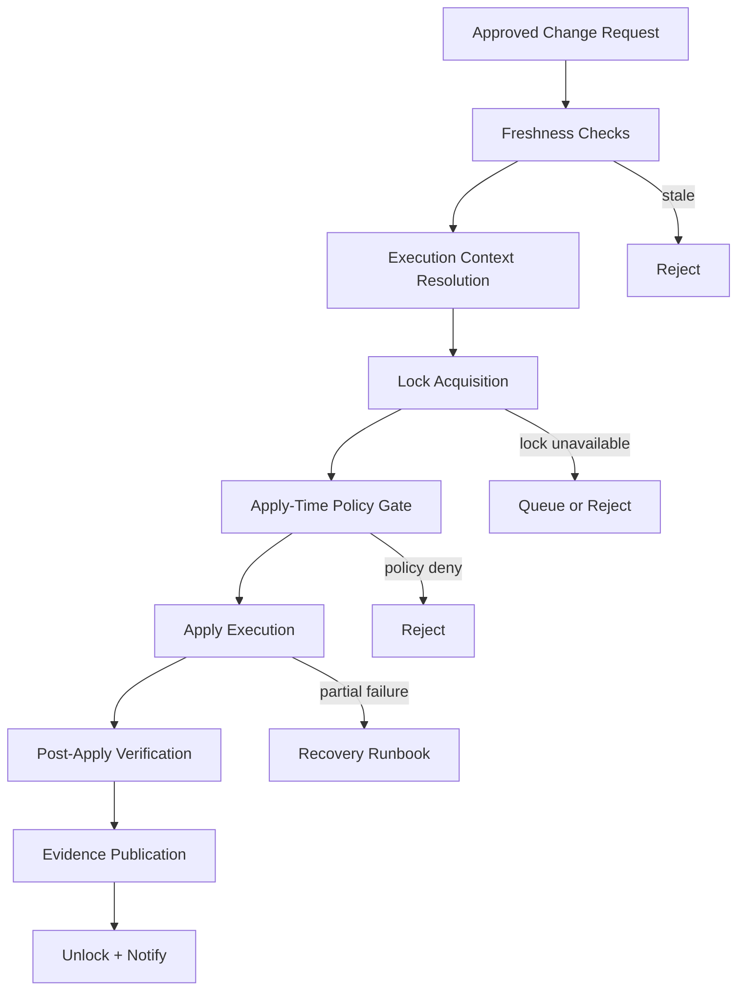
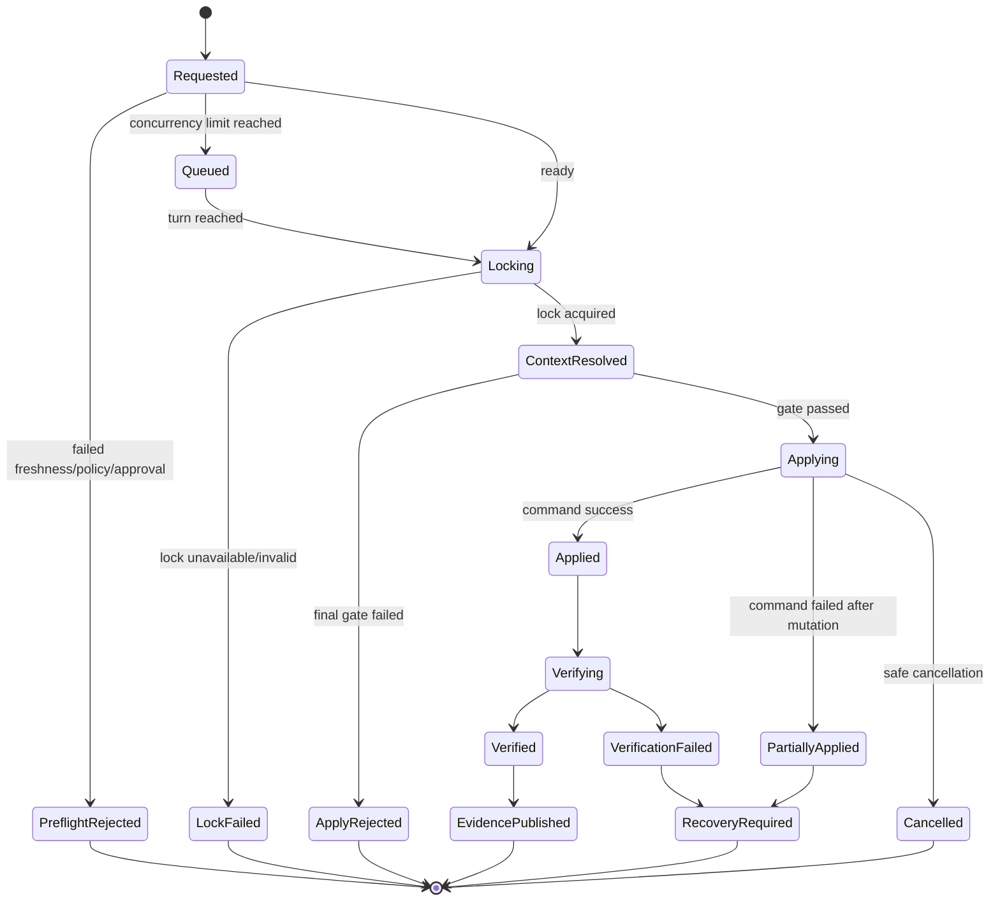
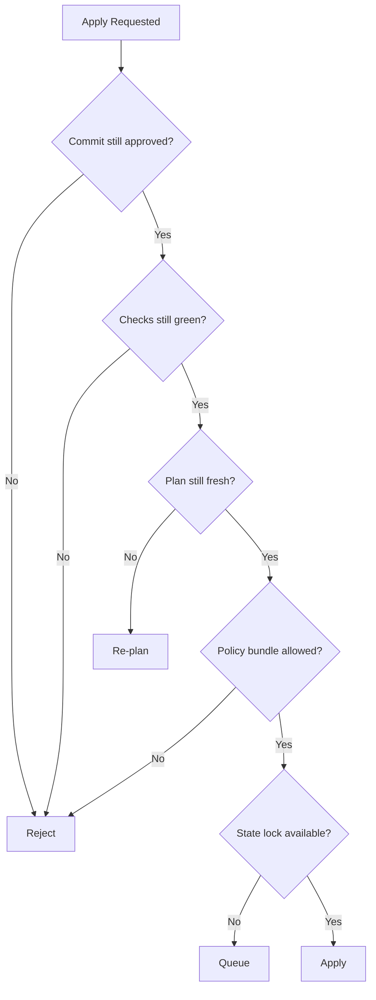
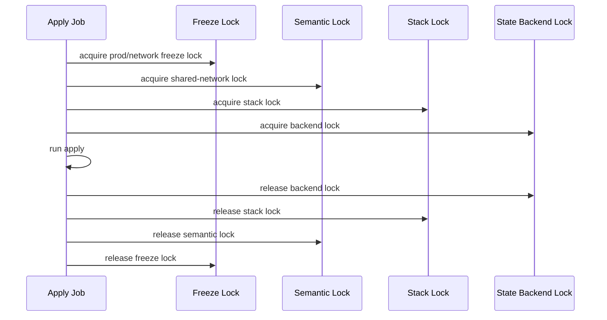
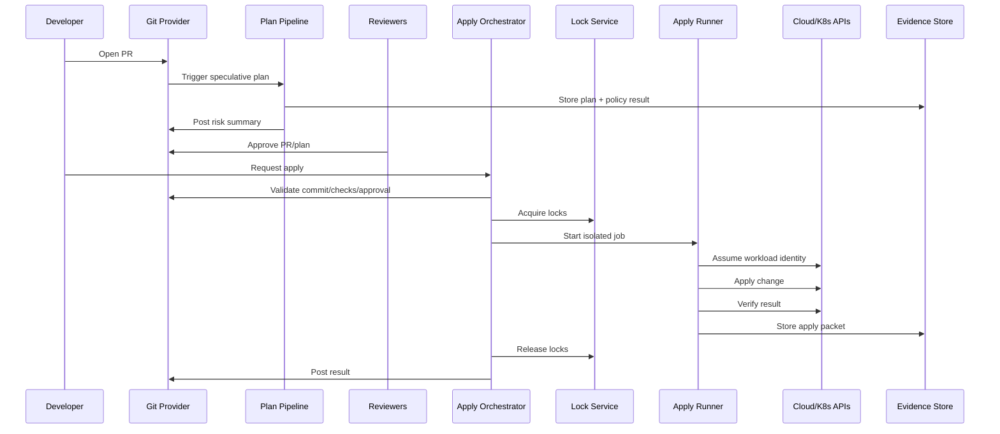

# Part 013 — Designing the Apply Pipeline

A plan pipeline answers:

> What would happen if this change were applied?

An apply pipeline answers a harder question:

> Is this exact change allowed to mutate this exact target system now, under this identity, with this evidence, and with a recoverable failure path?

That is the boundary between visibility and authority.

A weak apply pipeline is just `terraform apply -auto-approve` or `tofu apply -auto-approve` in CI.

A production-grade apply pipeline is a **controlled state transition system**.

It turns a reviewed proposal into a real mutation while preserving:

- state integrity,
- execution identity,
- approval binding,
- policy consistency,
- audit evidence,
- operational safety,
- recovery paths,
- and blast-radius control.



The apply pipeline is where the platform proves that infrastructure changes are not merely automated, but governed.

---

## 1. Apply Is Not Deployment

Application deployment often means replacing a running version with another version.

IaC apply is more dangerous.

It can:

- create a database,
- delete a subnet,
- rotate an IAM role,
- replace a load balancer,
- detach a disk,
- update a security group,
- recreate a Kubernetes cluster,
- change a route table,
- invalidate a certificate,
- mutate state that other stacks depend on.

The unit of risk is not only code.

The unit of risk is **external reality**.

Terraform/OpenTofu apply reconciles configuration, prior state, provider behavior, and remote APIs into mutations against real infrastructure. That means the apply pipeline must protect more than the repository.

It must protect:

- the remote state backend,
- provider credentials,
- provider APIs,
- dependent systems,
- business-critical environments,
- and the evidence trail.

The apply pipeline is therefore closer to a database migration engine than to a build job.

A good mental model:

> `plan` is a transaction proposal. `apply` is transaction execution against distributed external systems.

The dangerous part is that most cloud APIs are not transactional across resources.

A failed apply can leave a partially changed world.

---

## 2. The Apply Pipeline Contract

A production apply pipeline should have an explicit contract.

For each apply, it must know:

| Question | Why It Matters |
|---|---|
| What change is being applied? | Prevents arbitrary mutation. |
| Which commit produced it? | Binds execution to reviewed code. |
| Which state boundary is affected? | Controls blast radius and concurrency. |
| Which environment is targeted? | Separates dev/stage/prod governance. |
| Which identity is executing? | Enables least privilege and audit. |
| Which approval authorized it? | Prevents unreviewed changes. |
| Which policy bundle evaluated it? | Prevents policy drift. |
| Which credentials were used? | Proves execution context. |
| Which plan was applied? | Prevents plan/apply mismatch. |
| What happened after apply? | Supports verification and incident response. |

The contract can be expressed as an apply manifest.

Example:

```yaml
apply_request:
  id: apply-2026-07-03-prod-network-1427
  source:
    repository: infra-live
    pull_request: 4821
    commit_sha: 8fa23c7d...
    base_branch: main
  target:
    stack: network/prod/ap-southeast-1
    environment: prod
    account: prod-network-001
    region: ap-southeast-1
    state_backend: s3://iac-state/prod/network.tfstate
  authorization:
    requested_by: alice@example.com
    approved_by:
      - platform-owner@example.com
      - security-owner@example.com
    approval_policy: prod-network-two-person-rule@v6
    approved_at: 2026-07-03T09:42:11Z
  execution:
    runner_id: iac-runner-prod-17
    workload_identity: arn:aws:iam::123456789012:role/iac-prod-network-apply
    policy_bundle_digest: sha256:7d91...
    plan_digest: sha256:8cc2...
  risk:
    destroys: 0
    replacements: 1
    iam_privilege_expansion: false
    public_exposure: false
```

The apply job should not discover these facts casually during execution.

It should be given a resolved execution context and validate it again before mutation.

---

## 3. Apply as a State Machine

Do not model apply as a shell command.

Model it as a state machine.



Each transition should emit an event.

That event stream is useful for:

- audit,
- incident review,
- SLOs,
- compliance evidence,
- flaky provider diagnosis,
- and learning where the pipeline is too permissive or too slow.

A mature platform eventually treats infrastructure apply events the way a payment system treats transaction events.

Not because infrastructure is money, but because both systems mutate valuable external state.

---

## 4. Apply Modes: Automatic Plan vs Saved Plan

OpenTofu and Terraform both support two broad apply modes:

1. **Automatic plan mode**: `apply` computes a fresh plan and then applies it.
2. **Saved plan mode**: `plan -out=<file>` creates a plan file, and `apply <file>` executes that saved plan.

The difference matters deeply for automation.

### 4.1 Automatic Plan Mode

In automatic plan mode, apply produces a plan at execution time.

Conceptually:

```bash
tofu apply
```

or in non-interactive automation:

```bash
tofu apply -auto-approve
```

This is convenient but risky if the approval was based on an earlier speculative plan.

A reviewer may have approved Plan A, but apply-time automatic planning may compute Plan B because:

- remote infrastructure changed,
- state changed,
- data sources changed,
- provider behavior changed,
- module versions changed,
- environment variables changed,
- credentials changed,
- or the base branch moved.

Automatic plan mode is acceptable only if the pipeline treats the apply-time plan as the authoritative reviewed object.

That usually means:

- generate apply-time plan,
- compare it with the approved speculative plan,
- fail if materially different,
- require re-approval for risky deltas,
- then apply.

### 4.2 Saved Plan Mode

In saved plan mode, the plan file is generated first and applied later.

Conceptually:

```bash
tofu plan -out=tfplan
# review, hash, store evidence
tofu apply tfplan
```

The benefit is stronger binding between review and execution.

The risk is freshness.

A saved plan can become stale if the state or world changes. It can also embed backend configuration, and backend credentials or other time-sensitive assumptions may expire between planning and applying.

Therefore, saved plan mode is not automatically safer.

It is safer only if the pipeline controls:

- artifact integrity,
- artifact confidentiality,
- state freshness,
- credential lifetime,
- backend configuration,
- plan expiration,
- and target lock semantics.

### 4.3 Decision Rule

Use this rule:

| Scenario | Recommended Pattern |
|---|---|
| Low-risk dev stack | Automatic apply-time plan with policy gate. |
| Production stack | Saved plan or apply-time re-plan with strict diff comparison. |
| Highly dynamic data sources | Prefer apply-time re-plan and require approval on material delta. |
| Long approval windows | Avoid long-lived saved plans; expire them aggressively. |
| Regulated environment | Persist speculative plan, apply-time plan, policy result, approval, and apply logs. |
| Emergency fix | Allow break-glass, but capture stronger evidence and post-approval review. |

The invariant is:

> The change applied must be equivalent to the change authorized.

The implementation can vary.

---

## 5. Freshness Checks Before Apply

The most common apply pipeline bug is applying an old idea to a new world.

Freshness checks prevent that.

Before apply, verify:

1. The PR is still open or has merged according to your workflow.
2. The commit SHA matches the approved SHA.
3. The base branch has not invalidated the review.
4. Required checks are still green.
5. Required approvals still exist and have not been dismissed.
6. The target state lock can be acquired.
7. The plan is not expired.
8. The policy bundle digest is acceptable.
9. The module/provider lock files have not changed unexpectedly.
10. There is no unmanaged drift requiring re-plan.

Example preflight gate:



Freshness is not a feeling.

It should be encoded.

Example:

```yaml
freshness_policy:
  dev:
    max_plan_age_minutes: 240
    require_base_branch_current: false
    allow_policy_minor_version_change: true
  stage:
    max_plan_age_minutes: 120
    require_base_branch_current: true
    allow_policy_minor_version_change: false
  prod:
    max_plan_age_minutes: 30
    require_base_branch_current: true
    require_no_material_drift: true
    allow_policy_minor_version_change: false
```

---

## 6. Approval Binding

Approval binding is the rule that prevents this failure:

> A human approved one thing, but the pipeline applied another thing.

An approval should bind to:

- repository,
- pull request,
- commit SHA,
- target stack,
- environment,
- plan digest or material plan summary,
- policy result digest,
- approval policy version,
- and time window.

Weak approval:

```text
Bob approved the PR.
```

Strong approval:

```text
Bob approved commit 8fa23c7 for prod/network/ap-southeast-1, after reviewing plan digest sha256:8cc2, under policy prod-network-two-person-rule@v6, valid for 30 minutes unless the plan changes materially.
```

That sounds bureaucratic.

It is not.

It is just making implicit assumptions explicit.

### 6.1 What Invalidates Approval?

Approval should be invalidated when:

- the commit changes,
- the affected stack changes,
- destroy count increases,
- replacement count increases,
- IAM permissions expand,
- public exposure appears,
- target account/region changes,
- provider lock changes,
- module version changes,
- plan crosses risk threshold,
- required reviewer leaves CODEOWNERS scope,
- policy version changes from allow to deny,
- or the approval window expires.

Approval does not need to be invalidated for every small diff.

But the rules must be deterministic.

Example materiality function:

```yaml
material_plan_delta:
  always_material:
    - resource_destroy_added
    - resource_replacement_added
    - iam_privilege_expansion_added
    - public_ingress_added
    - encryption_disabled
    - backup_disabled
    - production_target_changed
  usually_material:
    - cost_increase_above_threshold
    - instance_class_upgrade
    - autoscaling_max_increase
  non_material:
    - tag_only_change
    - description_change
    - output_only_change
```

---

## 7. Locking: One Lock Is Not Enough

Most engineers think of locking as Terraform state locking.

That is only one layer.

A production apply pipeline often needs several locks:

| Lock Layer | Protects | Example |
|---|---|---|
| CI concurrency lock | Runner-level overlap | One apply job per stack. |
| Automation lock | PR/project overlap | Atlantis directory/workspace lock. |
| State backend lock | State integrity | S3+DynamoDB, cloud backend lock, etc. |
| Provider/API lock | External API safety | Serializing account vending. |
| Business-domain lock | Semantic dependency | Do not update shared network during DB failover. |
| Deployment freeze lock | Governance | Release freeze or incident freeze. |

The state lock protects the state file.

It does not always protect the external system from semantic conflict.

Example:

- Stack A updates a VPC route table.
- Stack B updates a firewall dependency.
- They use separate state files.
- Both state locks succeed.
- Together they create a transient outage.

The backend lock cannot see that.

The platform must model higher-level conflict domains.

### 7.1 Lock Key Design

Do not lock the entire repo unless the repo is tiny.

Do not lock only a folder if the folder does not match the state boundary.

Good lock keys often include:

```text
<org>/<platform>/<environment>/<account>/<region>/<stack>/<workspace-or-state-key>
```

Example:

```text
acme/iac/prod/123456789012/ap-southeast-1/network/vpc
```

For semantic locks:

```text
freeze/prod/network-core
account-vending/prod
shared-ingress/prod/ap-southeast-1
```

### 7.2 Lock Acquisition Order

If multiple locks are required, acquire them in a deterministic order.

Otherwise, two apply jobs can deadlock.

Example order:

1. environment freeze lock,
2. semantic dependency lock,
3. stack concurrency lock,
4. state backend lock.

Release in reverse order.



---

## 8. Execution Identity

The identity that runs plan should not always be the identity that runs apply.

Plan may need read-heavy permissions.

Apply needs mutation permissions.

Production apply should use:

- short-lived credentials,
- workload identity federation,
- environment-scoped roles,
- stack-scoped permission boundaries,
- no long-lived cloud keys in CI,
- no developer personal credentials,
- and no shared admin role.

A useful identity hierarchy:

```text
iac-plan-dev
iac-apply-dev
iac-plan-stage
iac-apply-stage
iac-plan-prod-network
iac-apply-prod-network
iac-plan-prod-data
iac-apply-prod-data
```

Do not create one universal `terraform-admin` role.

That role becomes the real production control plane.

If compromised, every policy document becomes decoration.

### 8.1 Identity Must Be Part of Evidence

Each apply should record:

- cloud principal,
- token issuer,
- token audience,
- token subject,
- session duration,
- assumed role,
- external ID or workload identity subject,
- repository and workflow claims,
- commit SHA claim,
- and environment claim.

The identity should be constrained so that only the approved workflow can assume it.

Example conceptual trust policy:

```json
{
  "allow": "sts:AssumeRoleWithWebIdentity",
  "conditions": {
    "repository": "acme/infra-live",
    "branch": "main",
    "environment": "prod",
    "workflow": "iac-apply",
    "audience": "sts.cloud-provider.example"
  }
}
```

The exact syntax varies by cloud and CI system.

The invariant does not:

> Apply identity must be bound to pipeline context, not just to a human or static secret.

---

## 9. Runner Design

The apply runner is a privileged execution environment.

Treat it like a production control-plane component.

### 9.1 Runner Requirements

A production apply runner should be:

- ephemeral or strongly isolated,
- patched,
- minimal,
- non-interactive,
- network-restricted,
- credential-scoped,
- log-scrubbed,
- artifact-producing,
- deterministic in tool versions,
- and unable to receive arbitrary untrusted commands from PRs.

If the runner executes code from a pull request with production credentials, the platform is broken.

The runner must distinguish:

- untrusted PR validation,
- trusted merged-code apply,
- privileged production apply,
- and break-glass operation.

### 9.2 Tool Version Pinning

Pin:

- OpenTofu/Terraform version,
- provider versions,
- module versions,
- policy engine versions,
- cost estimator versions,
- wrapper script versions,
- and container image digest.

Do not run production apply with `latest`.

Example execution image reference:

```yaml
runner_image:
  repository: registry.example.com/platform/iac-runner
  digest: sha256:4b71d...
  tools:
    opentofu: 1.10.3
    conftest: 0.61.0
    cosign: 2.5.0
```

Version pinning is not just reproducibility.

It is auditability.

---

## 10. Apply-Time Policy Gates

Policy at plan time is necessary.

Policy at apply time is also necessary.

Why?

Because conditions may change.

Examples:

- A freeze window starts after PR approval.
- A CVE policy changes.
- A production incident begins.
- A cost threshold changes.
- A required control is updated.
- A plan is older than allowed.
- A dependency stack is no longer healthy.

Apply-time policy gates should evaluate:

| Gate | Example |
|---|---|
| Change policy | No unapproved destroy in prod. |
| Time policy | No production apply during freeze. |
| Actor policy | Requester cannot self-approve. |
| Environment policy | Prod requires two approvals. |
| Dependency policy | Shared network must be healthy. |
| Incident policy | Block non-emergency changes during SEV1. |
| Drift policy | Block apply if material drift exists. |
| Credential policy | Only workload identity, no static key. |
| Tool policy | Approved runner image digest only. |

The gate should produce a machine-readable result.

Example:

```json
{
  "decision": "allow",
  "policy_bundle": "prod-iac-apply@2026.07.03",
  "inputs": {
    "environment": "prod",
    "stack": "network/vpc",
    "destroy_count": 0,
    "replacement_count": 1,
    "approval_count": 2,
    "plan_age_minutes": 12,
    "incident_freeze": false
  },
  "rules": [
    { "id": "prod_requires_two_approvals", "result": "pass" },
    { "id": "no_destroy_without_exception", "result": "pass" },
    { "id": "plan_age_limit", "result": "pass" }
  ]
}
```

---

## 11. The Apply Execution Algorithm

A robust apply pipeline follows a predictable algorithm.

### 11.1 High-Level Algorithm

```text
1. Receive apply request.
2. Resolve target stack and execution context.
3. Validate commit, approvals, checks, and policy freshness.
4. Acquire pipeline/semantic/state locks.
5. Prepare isolated runner workspace.
6. Fetch exact source revision.
7. Verify tool and provider lock versions.
8. Resolve credentials using workload identity.
9. Re-run final plan or verify saved plan.
10. Evaluate apply-time policy.
11. Execute apply.
12. Capture logs, exit code, state metadata, and resource summary.
13. Run post-apply verification.
14. Publish evidence.
15. Release locks.
16. Notify humans/systems.
17. If failed, classify failure and trigger runbook.
```

### 11.2 Pseudocode

```pseudo
function apply_stack(request):
    context = resolve_context(request)

    assert_commit_is_approved(context)
    assert_required_checks_green(context)
    assert_approval_still_valid(context)
    assert_no_freeze_violation(context)

    locks = acquire_locks(context.lock_keys)
    try:
        workspace = create_ephemeral_workspace(context)
        checkout_exact_commit(workspace, context.commit_sha)
        verify_runner_image(context.runner_digest)
        verify_tool_versions(workspace)
        identity = assume_workload_identity(context.identity_profile)

        if context.plan_mode == "saved_plan":
            plan = fetch_saved_plan(context.plan_digest)
            verify_plan_integrity(plan)
            verify_plan_not_expired(plan)
            verify_plan_matches_target(plan, context)
        else:
            plan = create_apply_time_plan(workspace, identity)
            compare_with_approved_plan(plan, context.approved_plan)

        policy_result = evaluate_apply_policy(plan, context, identity)
        assert policy_result.allowed

        result = execute_apply(plan, workspace, identity)
        verification = verify_post_apply_state(context)
        evidence = publish_evidence(context, plan, policy_result, result, verification)

        return evidence
    catch error:
        classification = classify_apply_failure(error)
        publish_failure_evidence(context, error, classification)
        route_to_recovery_runbook(classification)
        raise
    finally:
        release_locks(locks)
```

The actual implementation can be GitHub Actions, GitLab CI, Jenkins, Buildkite, Atlantis, Spacelift, Terraform Cloud, or a custom orchestrator.

The algorithm is more important than the CI product.

---

## 12. Saved Plan Integrity

If you use saved plans, the plan artifact becomes sensitive.

A saved plan may contain:

- resource addresses,
- computed values,
- provider configuration,
- sensitive values in some contexts,
- backend assumptions,
- and exact actions to execute.

Therefore:

- store it in a restricted artifact store,
- encrypt it at rest,
- restrict read access,
- hash it,
- sign or attest it,
- expire it,
- bind it to target stack,
- and never treat it as a harmless text report.

### 12.1 Plan Artifact Metadata

```yaml
plan_artifact:
  digest: sha256:8cc2d...
  created_at: 2026-07-03T09:33:10Z
  expires_at: 2026-07-03T10:03:10Z
  source_commit: 8fa23c7d...
  target_stack: network/prod/ap-southeast-1
  state_serial: 6421
  opentofu_version: 1.10.3
  provider_lock_digest: sha256:77ad...
  policy_result_digest: sha256:b31c...
  encrypted: true
  access:
    read:
      - iac-apply-orchestrator
    write:
      - iac-plan-orchestrator
```

### 12.2 Plan Expiration

Use aggressive expiration for production.

Suggested defaults:

| Environment | Max Saved Plan Age |
|---|---:|
| Dev | 4 hours |
| Stage | 2 hours |
| Prod | 15–30 minutes |
| Regulated prod | 10–30 minutes plus explicit revalidation |

Expiration is not about paranoia.

It acknowledges that cloud state changes.

---

## 13. Re-Plan Before Apply

An alternative to saved plan mode is apply-time re-planning.

The pattern:

1. PR pipeline produces speculative plan.
2. Reviewers approve the speculative plan summary.
3. Apply pipeline generates a fresh apply-time plan.
4. Pipeline compares fresh plan with approved plan.
5. If materially equivalent, apply.
6. If materially different, stop and require re-review.

This pattern handles dynamic worlds better than long-lived saved plans.

### 13.1 Material Equivalence

Do not compare raw plan text.

Normalize into a semantic summary.

Example:

```json
{
  "create": ["aws_security_group_rule.app_egress"],
  "update": ["aws_lb_listener.app"],
  "replace": [],
  "delete": [],
  "iam": {
    "privilege_expansion": false
  },
  "network": {
    "public_ingress_added": false
  },
  "cost": {
    "monthly_delta_usd": 42.80
  }
}
```

Then compare:

```pseudo
function materially_equivalent(approved, fresh):
    if fresh.delete_count > approved.delete_count:
        return false
    if fresh.replace_count > approved.replace_count:
        return false
    if fresh.iam.privilege_expansion and not approved.iam.privilege_expansion:
        return false
    if fresh.network.public_ingress_added and not approved.network.public_ingress_added:
        return false
    if fresh.cost.monthly_delta_usd > approved.cost.monthly_delta_usd + threshold:
        return false
    return true
```

This makes the platform strict about danger, not noise.

---

## 14. Partial Failure Model

Apply failures are not binary.

The command can fail after creating or modifying some resources.

Common causes:

- provider API timeout,
- quota exceeded after partial creation,
- invalid dependency discovered late,
- eventual consistency delay,
- permission denied on a later resource,
- resource already exists,
- network interruption,
- runner crash,
- state lock timeout,
- provider bug,
- cloud service incident,
- manual intervention during apply.

The pipeline must classify failures.

| Failure Class | Meaning | Default Action |
|---|---|---|
| Pre-mutation failure | Nothing changed externally. | Fix and retry after re-plan. |
| State lock failure | Could not safely operate state. | Do not retry blindly; inspect lock. |
| Provider auth failure | Credentials invalid/insufficient. | Fix identity; re-plan if time passed. |
| Partial mutation | Some resources changed. | Inspect state and remote reality. |
| State write failure | Remote changed but state not updated. | High severity; recover state carefully. |
| Verification failure | Apply succeeded but health failed. | Trigger rollback/rollforward runbook. |
| Runner failure | Unknown whether mutation completed. | Reconcile state before retry. |

The pipeline should never say only:

```text
Apply failed.
```

It should say:

```text
Apply failed after mutation. 3 resources created, 1 update failed, state serial advanced from 6421 to 6422. Recovery runbook: partial-apply-provider-timeout.
```

---

## 15. Retry Policy

Blind retries are dangerous.

A retry can:

- create duplicate resources,
- race with provider eventual consistency,
- repeat a destructive action,
- mask a permission issue,
- or amplify an outage.

Use classified retries.

| Error Type | Retry? | Rule |
|---|---|---|
| Provider 429 / throttling | Yes | Bounded exponential backoff. |
| Temporary network failure before mutation | Yes | Retry with same context. |
| Temporary network failure after mutation | Maybe | Refresh/re-plan first. |
| Permission denied | No | Fix identity/policy. |
| Policy deny | No | Change request or exception. |
| State lock unavailable | Queue | Do not force unlock automatically. |
| Provider validation error | No | Fix code. |
| Drift detected | No | Re-plan or remediation flow. |
| Destroy guard triggered | No | Explicit approval required. |

Example retry policy:

```yaml
retry_policy:
  max_attempts: 2
  retryable_errors:
    - provider_rate_limit
    - transient_network_before_mutation
    - backend_read_timeout
  non_retryable_errors:
    - policy_denied
    - permission_denied
    - destroy_guard_failed
    - state_write_failure
    - partial_apply_unknown_state
```

Retries should preserve evidence.

Attempt 2 should not overwrite attempt 1.

---

## 16. Cancellation and Timeouts

Cancellation is a subtle failure mode.

If a human cancels a CI job while OpenTofu/Terraform is applying, the process may be interrupted while holding a lock or while provider operations are in-flight.

The platform should define cancellation semantics:

- Can this job be cancelled by normal users?
- Does cancellation send a graceful interrupt?
- How long does the process have to exit cleanly?
- What happens to locks?
- How is unknown mutation state classified?
- Who is paged for stuck production applies?

For production apply, prefer:

- no casual cancellation,
- graceful termination first,
- hard kill only after timeout,
- automatic failure evidence,
- stuck-lock runbook,
- and re-plan before retry.

Example timeout model:

```yaml
timeouts:
  dev:
    apply_timeout_minutes: 30
    cancellation: allowed
  stage:
    apply_timeout_minutes: 45
    cancellation: restricted
  prod:
    apply_timeout_minutes: 60
    cancellation: platform_oncall_only
    graceful_shutdown_seconds: 120
```

---

## 17. Destructive Operation Guardrails

Destroy is not just another action.

In production, destructive operations require special handling.

Guardrails should detect:

- delete actions,
- replace actions,
- storage detach/delete,
- database deletion,
- backup policy removal,
- encryption disablement,
- IAM principal removal,
- network route deletion,
- DNS record deletion,
- Kubernetes namespace deletion,
- security group egress/ingress removal if critical,
- and managed service recreation.

### 17.1 Destroy Approval Matrix

| Target | Normal Approval | Destroy Approval |
|---|---|---|
| Dev stateless resource | Team owner | Team owner |
| Prod stateless compute | Service owner | Service + platform owner |
| Prod database | Service owner | Service + data + platform + incident window |
| Shared network | Platform owner | Platform + security + change manager |
| IAM boundary | Security owner | Security + platform + break-glass if urgent |

Destroy guard example:

```yaml
destroy_policy:
  prod:
    default: deny
    allow_if:
      - explicit_destroy_approval: true
      - resource_class_not_in:
          - database
          - persistent_volume
          - kms_key
          - root_dns_zone
      - maintenance_window: true
```

### 17.2 Replace Is Often Destroy

A replacement is a delete plus create.

Reviewers often miss this because plan output may show replacement as an update-like action.

The pipeline should surface replacements separately:

```text
Replacement detected:
- aws_db_instance.orders_primary
Reason:
- storage_encrypted changed from false to true
Impact:
- destructive replacement of persistent database
Decision:
- blocked without data migration plan
```

---

## 18. Post-Apply Verification

A successful command is not a successful change.

Post-apply verification asks:

> Did the target system reach the expected safe state?

Verification should be stack-specific.

Examples:

| Stack Type | Verification |
|---|---|
| VPC/network | Route tables, NAT reachability, flow logs, DNS resolution. |
| IAM | Expected roles exist, no forbidden permissions, trust policy correct. |
| Kubernetes cluster | Nodes ready, core add-ons healthy, admission controllers active. |
| Database | Instance available, backups enabled, replicas healthy. |
| App deployment | Pods ready, rollout successful, service endpoints healthy. |
| Secrets | Secret synced, not exposed in logs, rotation metadata updated. |

Post-apply verification can be implemented with:

- provider reads,
- cloud API checks,
- Kubernetes health checks,
- synthetic probes,
- policy re-evaluation,
- drift check,
- service-level checks,
- and observability queries.

The key is not to verify everything.

The key is to verify the failure modes that matter for that stack.

---

## 19. Evidence Model

Every apply should produce evidence.

Evidence is not just logs.

A strong evidence packet includes:

```yaml
evidence:
  apply_id: apply-2026-07-03-prod-network-1427
  source:
    repo: infra-live
    commit_sha: 8fa23c7d...
    pull_request: 4821
  approvals:
    approvers:
      - platform-owner@example.com
      - security-owner@example.com
    approval_policy: prod-network-two-person-rule@v6
  execution:
    runner_image_digest: sha256:4b71d...
    runner_id: iac-runner-prod-17
    workload_identity: arn:aws:iam::123456789012:role/iac-prod-network-apply
    started_at: 2026-07-03T09:46:00Z
    ended_at: 2026-07-03T09:51:33Z
  plan:
    mode: saved_plan
    digest: sha256:8cc2d...
    resource_summary:
      create: 2
      update: 4
      replace: 0
      delete: 0
  policy:
    bundle_digest: sha256:7d91...
    decision: allow
  state:
    backend: s3://iac-state/prod/network.tfstate
    serial_before: 6421
    serial_after: 6422
  result:
    exit_code: 0
    status: verified
  artifacts:
    - plan.json
    - policy-result.json
    - apply.log.redacted
    - verification.json
```

This packet should be immutable.

It should be queryable.

It should outlive CI log retention.

For regulated systems, evidence is part of the product.

---

## 20. Merge-Before-Apply vs Apply-Before-Merge

There are two common models.

### 20.1 Apply Before Merge

In this model, a PR is applied before merge.

Benefits:

- reviewers see actual apply result before merge,
- failed apply blocks merge,
- PR becomes the operational control surface.

Risks:

- unmerged branch code mutates real infrastructure,
- production credentials may touch PR-sourced code,
- branch state can diverge,
- merge after apply may fail,
- multiple PRs are harder to coordinate.

This is common in Atlantis-style workflows.

It can work well with strong locking and repository trust boundaries.

### 20.2 Merge Before Apply

In this model, PR approval and merge update the canonical branch, then apply runs from the canonical branch.

Benefits:

- only merged code mutates infrastructure,
- stronger GitOps source-of-truth semantics,
- easier audit around main branch,
- less exposure to untrusted branch execution.

Risks:

- failed apply means main contains unapplied desired state,
- rollback may require revert PR,
- engineers may assume merge equals deployed,
- apply queue must be observable.

This often fits regulated production better.

### 20.3 Decision Rule

| Context | Prefer |
|---|---|
| Small team, trusted repo, fast infra changes | Apply before merge can be fine. |
| Regulated prod | Merge before apply is often cleaner. |
| Untrusted contributors/forks | Never apply PR branch with privileged credentials. |
| GitOps app reconciliation | Merge before reconcile is the natural model. |
| Terraform PR automation | Atlantis-style apply before merge is common but must be guarded. |

The invariant:

> The platform must make clear whether merge means “desired state accepted” or “real world changed.”

Ambiguity here causes outages.

---

## 21. Apply Queue Design

Production apply should often be queued.

Not because automation is slow.

Because external state is shared.

Apply queue design decisions:

- FIFO vs priority,
- per-stack queue vs per-environment queue,
- emergency bypass,
- max concurrency,
- dependency ordering,
- freeze handling,
- queue cancellation,
- stale plan expiration while queued,
- and visibility to engineers.

Example:

```yaml
apply_queues:
  prod-network:
    concurrency: 1
    priority_classes:
      - emergency
      - standard
    stale_plan_action: replan
  prod-apps:
    concurrency: 5
    key: service_name
  dev:
    concurrency: 20
```

A queue without visibility becomes a black hole.

Expose:

- current item,
- waiting items,
- target stack,
- requester,
- age,
- blocked reason,
- lock holder,
- and estimated blocker, not fake ETA.

---

## 22. Break-Glass Apply

Break-glass is not “skip controls.”

Break-glass is a separate controlled path for exceptional situations.

It should require:

- explicit emergency reason,
- incident or ticket reference,
- elevated approver or on-call role,
- short-lived credential elevation,
- stronger logging,
- post-incident review,
- automatic expiration,
- and retrospective evidence.

Example break-glass manifest:

```yaml
break_glass:
  enabled: true
  incident_id: SEV1-2026-07-03-004
  reason: Restore production ingress after failed cloud route propagation.
  requested_by: oncall@example.com
  approved_by: incident-commander@example.com
  expires_at: 2026-07-03T11:00:00Z
  bypassed_controls:
    - normal_change_window
  non_bypassable_controls:
    - identity_binding
    - audit_logging
    - state_locking
    - destructive_operation_guard
```

Some controls should remain non-bypassable.

For example:

- no static cloud keys,
- no unlogged apply,
- no force unlock without evidence,
- no deletion of critical data without explicit confirmation.

---

## 23. Apply Pipeline Anti-Patterns

### Anti-Pattern 1: `apply -auto-approve` on Every Merge

This is not automatically wrong in dev.

It is dangerous in production if there are no apply-time gates.

### Anti-Pattern 2: One Admin Role for All Applies

This destroys blast-radius control.

### Anti-Pattern 3: Approving the PR, Not the Plan

A PR may contain many changes.

The plan is the operational effect.

### Anti-Pattern 4: Treating State Lock as Full Safety

State locks prevent state corruption.

They do not prevent semantic conflicts.

### Anti-Pattern 5: No Partial Failure Runbook

Eventually, apply will fail halfway.

If the team has no runbook, the recovery is improvised in production.

### Anti-Pattern 6: Long-Lived Plan Artifacts

A two-day-old production plan is not evidence.

It is a stale prediction.

### Anti-Pattern 7: CI Logs as Evidence Store

CI logs expire, are noisy, and may contain secrets.

Evidence needs its own lifecycle.

### Anti-Pattern 8: Applying PR Code from Forks

Never run untrusted code with privileged infrastructure credentials.

---

## 24. Implementation Blueprint

This is a concrete blueprint independent of CI vendor.

### 24.1 Components

```text
infra-live repo
  └── desired infrastructure code

plan pipeline
  └── creates speculative plan, policy result, risk summary

approval service / VCS approvals
  └── binds approval to commit + target + plan digest

apply orchestrator
  └── validates request and coordinates locks

lock service
  └── stack, semantic, and environment locks

runner pool
  └── ephemeral isolated workers

identity broker
  └── short-lived workload credentials

artifact/evidence store
  └── immutable plans, logs, policy results, verification output

notification layer
  └── PR comments, chat, incident, dashboards
```

### 24.2 End-to-End Sequence



---

## 25. Production Checklist

Before calling an apply pipeline production-grade, verify these statements are true.

### Authorization

- [ ] Apply requires explicit authorization.
- [ ] Authorization is bound to commit, target, and plan/risk summary.
- [ ] Requester cannot bypass required reviewer rules.
- [ ] Production has stronger approval than dev.
- [ ] Break-glass is separate, logged, and time-limited.

### Freshness

- [ ] Plans expire.
- [ ] Apply validates commit SHA.
- [ ] Apply validates required checks.
- [ ] Apply validates approval freshness.
- [ ] Apply detects material drift or requires re-plan.

### Identity

- [ ] Apply uses short-lived credentials.
- [ ] Plan and apply identities are separated where appropriate.
- [ ] Credentials are environment-scoped.
- [ ] No developer personal credentials are used.
- [ ] No static production cloud keys are stored in CI.

### Locking

- [ ] State locking is enabled.
- [ ] CI concurrency is configured per state boundary.
- [ ] Semantic locks exist for shared critical dependencies.
- [ ] Force unlock requires human runbook.
- [ ] Lock holder is visible.

### Execution

- [ ] Runner image is pinned by digest.
- [ ] Tool versions are pinned.
- [ ] Workspace is isolated.
- [ ] PR code from untrusted forks cannot access production credentials.
- [ ] Logs are redacted.

### Failure Recovery

- [ ] Partial apply is classified.
- [ ] State write failure has a special runbook.
- [ ] Retry policy is explicit.
- [ ] Cancellation behavior is defined.
- [ ] Post-apply verification exists for critical stacks.

### Evidence

- [ ] Plan, policy result, approval, apply log, and verification output are stored.
- [ ] Evidence is immutable or tamper-evident.
- [ ] Evidence retention exceeds CI log retention.
- [ ] Evidence can answer who/what/when/where/why/how.

---

## 26. Practical Exercise

Design an apply pipeline for one production stack.

Choose a real or hypothetical target:

```text
prod / ap-southeast-1 / shared-network / vpc
```

Write:

1. The lock key.
2. The apply identity.
3. The required approvals.
4. The maximum plan age.
5. The destructive operation policy.
6. The retry policy.
7. The post-apply verification checks.
8. The evidence packet schema.
9. The break-glass path.
10. The partial failure runbook owner.

Then ask:

> If apply fails after modifying half the resources, can the next engineer understand exactly what happened without asking the original author?

If the answer is no, the apply pipeline is not production-grade yet.

---

## 27. Key Takeaways

- Apply is not a command; it is a controlled state transition.
- The applied change must be equivalent to the authorized change.
- Freshness checks prevent old plans from mutating new reality.
- Approval must bind to commit, target, plan/risk summary, policy, and time window.
- State locking is necessary but insufficient.
- Execution identity is part of the security boundary.
- Saved plans improve binding but introduce artifact and freshness risks.
- Apply-time re-planning can be safer in dynamic environments if material deltas are detected.
- Partial failure is normal enough to deserve a first-class runbook.
- Evidence is not logging; evidence is a durable audit object.

In the next part, we move from generic apply pipeline design into a concrete PR-driven automation model: Atlantis-style Terraform/OpenTofu workflows.

---

## References

- OpenTofu documentation — `apply` command, automatic plan mode, saved plan mode, and locking behavior.
- OpenTofu documentation — `plan` command and saved plan artifact behavior.
- OpenTofu documentation — backend configuration considerations for saved plan application.
- Terraform CLI documentation — `apply` saved plan mode.
- Terraform CLI documentation — `plan` execution plan behavior.
- OpenGitOps principles — declarative desired state, versioned immutable state, pull-based agents, continuous reconciliation.
