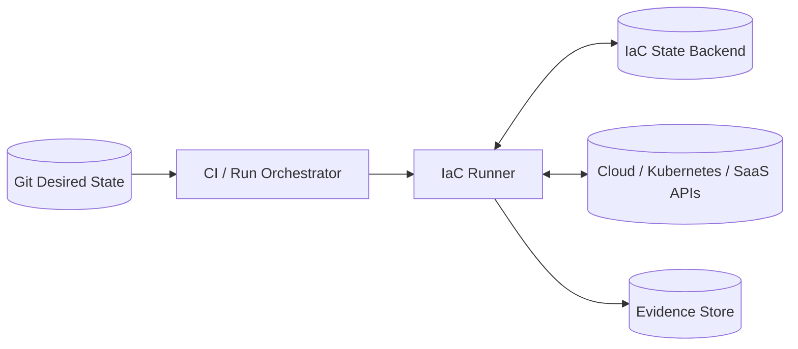
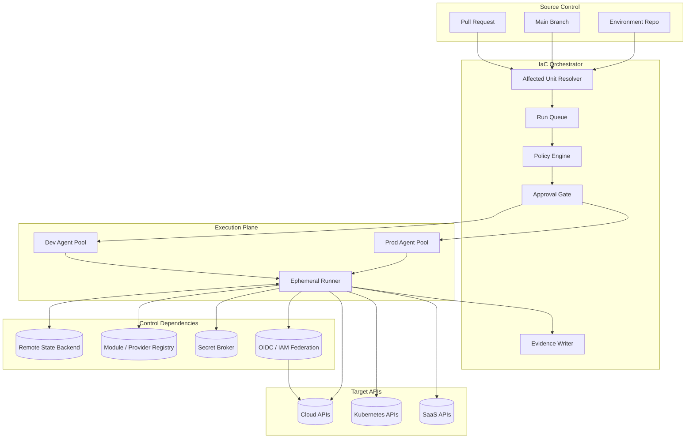
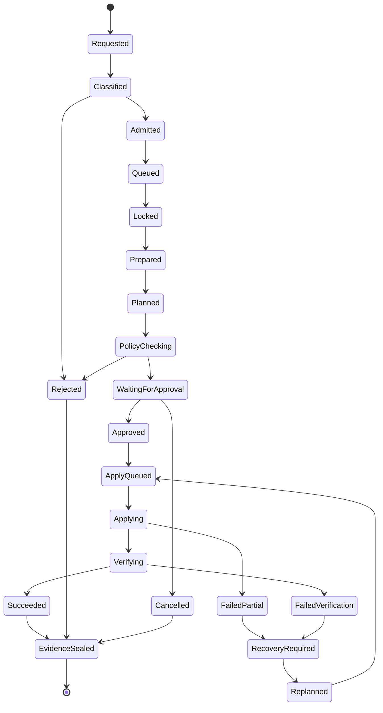
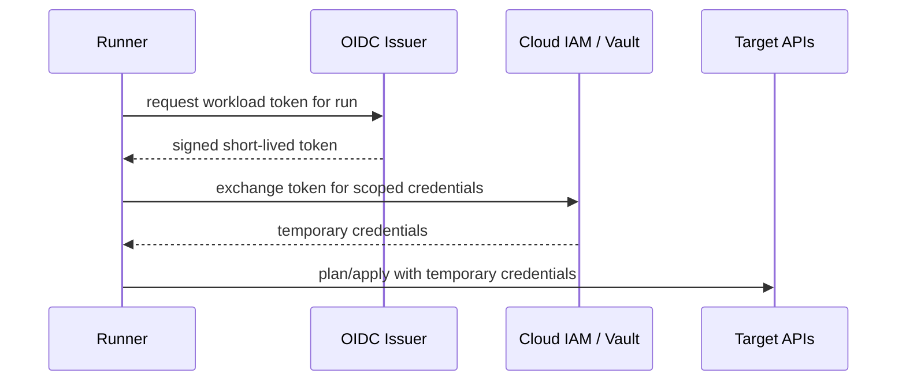
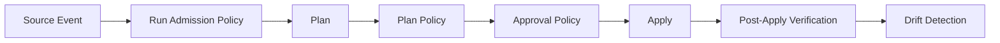

# Part 015 — Managed IaC Runners and Remote Execution

An IaC runner is not just a CI worker.

An IaC runner is a privileged mutation engine.

It can create networks, databases, keys, firewalls, IAM roles, Kubernetes clusters, DNS records, storage buckets, and production dependencies. If the runner is compromised, misconfigured, over-permissioned, or allowed to execute untrusted code, the blast radius is not limited to a failed build. It can become a production control-plane breach.

This part explains how to design managed IaC execution.

The goal is not to memorize vendor features.

The goal is to understand the execution model deeply enough that you can evaluate, build, operate, or govern any of these systems:

- HCP Terraform / Terraform Enterprise-style remote operations,
- OpenTofu/Terraform runners inside CI,
- Atlantis-style PR automation,
- Spacelift-style stack orchestration,
- Scalr/env0-style remote execution,
- self-hosted runner fleets,
- private worker pools,
- and platform-managed ephemeral runners.

The core question is simple:

> Where should privileged infrastructure code run, under what identity, with what network access, with what policy gates, with what audit evidence, and with what recovery model?

If you can answer that question precisely, you can design a production-grade IaC pipeline.

---

## 1. The Problem With Treating IaC as Normal CI

A normal CI job usually transforms code into an artifact.

```text
source code -> test/build -> artifact
```

An IaC job transforms the world.

```text
source of intent -> plan/apply -> external infrastructure state
```

That difference changes everything.

A failed Java build usually produces no deployed side effect.

A failed Terraform/OpenTofu apply may leave:

- half-created resources,
- changed IAM policies,
- rotated secrets,
- partially migrated network routes,
- modified Kubernetes cluster objects,
- updated state files,
- changed cloud-side reality but failed local completion,
- or a locked state that blocks further recovery.

So an IaC runner must be designed like a transaction participant in a distributed system, not like an ordinary shell executor.

---

## 2. Mental Model: The Runner Is a Transaction Coordinator

A production IaC runner coordinates a state transition across at least five systems.



The runner is responsible for more than executing `terraform apply`.

It must coordinate:

1. **Code input** — which commit, branch, module, stack, and environment is being executed.
2. **State input** — which state backend and lock is authoritative.
3. **Identity input** — which principal is allowed to mutate which boundary.
4. **Policy input** — which policy checks must pass before mutation.
5. **Network input** — which endpoints and private resources are reachable.
6. **Execution input** — which tool versions, provider versions, plugins, and environment variables are used.
7. **Evidence output** — which artifacts prove what happened.

A runner that does not bind these dimensions together creates ambiguity.

Ambiguity is where production incidents hide.

---

## 3. Local Execution, CI Execution, Remote Execution, and Agent Execution

Before choosing a platform, understand the execution modes.

### 3.1 Developer Local Execution

```text
Developer laptop -> IaC CLI -> cloud API
```

This is acceptable for learning and sometimes for sandbox environments.

It is dangerous for shared production infrastructure.

Problems:

- local credentials are hard to govern,
- tool versions drift,
- audit evidence is incomplete,
- plans may not match what reviewers saw,
- approval cannot be reliably enforced,
- network reachability depends on laptops/VPN,
- and state operations are exposed to human mistakes.

Production rule:

> Local execution may inspect, validate, and test. Production mutation should happen from controlled runners.

### 3.2 Generic CI Execution

```text
Git PR / merge -> CI worker -> IaC CLI -> cloud API
```

This is common and can work well if carefully designed.

Strengths:

- easy integration with code review,
- familiar pipeline UI,
- good for simple stacks,
- cheap to start,
- and flexible.

Risks:

- CI workers often execute arbitrary code,
- branch workflows can expose credentials,
- runner isolation may be weak,
- state locks may not map to CI concurrency groups,
- policy and evidence are often bolted on later,
- and CI permissions may become broader than intended.

Generic CI is not wrong.

But it must be hardened as an infrastructure mutation plane.

### 3.3 Managed Remote Execution

```text
Git / CLI / API -> IaC Platform -> remote run environment -> cloud API
```

Managed remote execution means the IaC platform owns the run lifecycle.

Examples of this pattern include HCP Terraform/Terraform Enterprise-style remote runs, Scalr-style remote backend execution, env0-style environment runs, and Spacelift-style stack runs.

Common primitives:

- workspace or stack,
- remote state,
- run queue,
- policy gates,
- variable/context management,
- run logs,
- RBAC,
- drift detection,
- cloud credential integration,
- and approval controls.

Managed remote execution reduces custom glue, but it does not remove design responsibility.

You still own:

- state boundaries,
- identity scopes,
- policy semantics,
- network placement,
- repository topology,
- runner trust,
- and failure playbooks.

### 3.4 Agent-Based Private Execution

```text
SaaS control plane -> private agent pool -> private network -> cloud/private APIs
```

In this model, the vendor or central platform coordinates runs, but actual execution happens on agents you host.

This is useful when the runner needs access to private resources:

- private Terraform modules,
- private package registries,
- internal APIs,
- private Kubernetes API servers,
- database endpoints,
- on-prem networks,
- or restricted cloud control planes.

The private agent becomes a sensitive boundary.

It must be scoped, monitored, patched, isolated, and treated like a production workload.

---

## 4. The Core Abstraction: Workspace, Stack, Project, Unit

Different tools use different words:

| Term | Common Meaning |
|---|---|
| Workspace | A stateful execution boundary, often tied to one Terraform/OpenTofu state |
| Stack | A deployable infrastructure unit, often with dependencies and policies |
| Project | A directory/workspace mapping or collection of IaC configuration |
| Environment | A target context such as prod, stage, account, region, tenant |
| Run | One execution attempt: plan, apply, destroy, refresh, import, test |
| Agent pool | A set of runners allowed to execute certain workspaces/stacks |
| Context / variable set | Shared runtime configuration attached to runs |

Do not argue about names.

Ask what the object owns.

A serious execution unit should have clear answers to these questions:

```text
What state does it own?
What cloud/account/cluster does it target?
What identity does it use?
What repository paths feed it?
What policy applies to it?
Who can approve it?
Which runner pool executes it?
Which network does it need?
What is the maximum acceptable blast radius?
```

If these answers are unclear, the unit is not production-grade.

---

## 5. Remote Execution Reference Architecture



This diagram shows the most important separation:

- **orchestration plane** decides what should run,
- **execution plane** runs the privileged tool,
- **state backend** stores infrastructure memory,
- **identity broker** grants temporary authority,
- **policy engine** constrains mutation,
- **evidence store** preserves what happened.

Do not collapse all of this into a single generic CI job unless you are prepared to rebuild these controls yourself.

---

## 6. The Seven Boundaries of Managed Execution

A top-tier platform engineer thinks in boundaries.

### 6.1 Source Boundary

Which Git references may trigger runs?

Bad:

```text
any branch from any fork can trigger plan with credentials
```

Better:

```text
fork PRs run syntax checks only
internal branches run speculative plan with read-only identity
main branch or approved PR runs apply with write identity
```

### 6.2 State Boundary

Which state can this run read or mutate?

The state boundary should usually map to:

- environment,
- account/subscription/project,
- region,
- lifecycle domain,
- and ownership team.

Bad:

```text
prod-network and prod-database share one state because both are in prod
```

Better:

```text
network foundation state exposes explicit outputs consumed by database state
```

### 6.3 Identity Boundary

Which principal is assumed during execution?

Bad:

```text
one CI_PROD_ADMIN key for all production Terraform
```

Better:

```text
repo + environment + stack + operation -> short-lived role
```

### 6.4 Network Boundary

Which network can the runner reach?

Bad:

```text
runner can reach every internal endpoint because it is convenient
```

Better:

```text
prod runner pool can reach only required provider APIs, internal control APIs, state backend, registry, and target endpoints
```

### 6.5 Policy Boundary

Which rules must pass before execution?

Bad:

```text
policy is only a linter in CI
```

Better:

```text
policy gates are enforced at plan admission, pre-apply, admission control, and post-apply drift detection
```

### 6.6 Approval Boundary

Who can approve this mutation?

Bad:

```text
any repo maintainer can apply production IAM changes
```

Better:

```text
approval depends on risk category, ownership, environment, and resource class
```

### 6.7 Evidence Boundary

What survives after the run?

Bad:

```text
logs disappear after CI retention expires
```

Better:

```text
every privileged run stores commit, plan summary, policy result, approvers, identity, lock, artifact digest, apply result, and post-apply verification
```

---

## 7. Execution Mode Decision Matrix

| Scenario | Recommended Mode | Reason |
|---|---|---|
| Sandbox infrastructure | Generic CI or local with guardrails | Low blast radius |
| Shared dev infra | CI or managed remote | Needs state locking and repeatability |
| Production cloud infra | Managed remote or hardened self-hosted runners | Needs identity isolation, audit, approval, policy |
| Private network targets | Agent-based private execution | SaaS runner may not reach private endpoints |
| Highly regulated environment | Self-hosted/private agents or enterprise remote execution | Data residency, evidence, network, control |
| Many teams/stacks | Managed orchestration platform | Queueing, RBAC, drift, policies, dependencies |
| Crossplane platform API | Kubernetes reconciliation + policy | External resources managed through K8s control plane |
| Emergency recovery | Dedicated break-glass runner path | Must bypass broken normal path safely |

The important point:

> The more privileged and shared the target, the more controlled the runner must be.

---

## 8. HCP Terraform / Terraform Enterprise-Style Remote Runs

HCP Terraform-style execution organizes infrastructure into workspaces and remote runs.

A workspace commonly owns:

- state,
- variables,
- run history,
- execution mode,
- policy attachments,
- VCS trigger configuration,
- permissions,
- and sometimes remote state sharing.

Remote execution provides a centralized run lifecycle.

Typical flow:

```text
VCS change / CLI trigger / API trigger
  -> queue run
  -> plan
  -> policy checks
  -> cost / run tasks / integrations
  -> manual approval when required
  -> apply
  -> store logs and state
```

This model is valuable because the run is not just a shell script.

It is a first-class object with lifecycle, state, policy, and evidence.

### 8.1 Workspace Execution Modes

A workspace can often use one of these broad modes:

| Mode | Meaning |
|---|---|
| Remote execution | Platform executes plan/apply in managed workers |
| Local execution with remote backend | CLI executes locally, platform stores state |
| Agent execution | Platform coordinates run but private agent executes |

Production insight:

> Remote state without remote execution is not the same as controlled execution.

If local execution remains allowed for production, anyone with workspace access and credentials may bypass your intended runner controls unless permission and workflow rules prevent it.

### 8.2 Run Tasks and External Gates

Run tasks are extension points around the run lifecycle.

They can integrate:

- security scanners,
- cost estimation,
- compliance checks,
- ticketing systems,
- custom approval services,
- vulnerability databases,
- and internal policy engines.

The key design principle:

> External run tasks should produce machine-readable decisions, not just comments.

A comment is advisory.

A blocking run task is a gate.

### 8.3 Agent Pools

Agent pools let you execute runs inside your own network.

Use separate pools for separate trust boundaries.

Example:

```text
agent-pool-dev-shared
agent-pool-stage-shared
agent-pool-prod-network
agent-pool-prod-data
agent-pool-prod-breakglass
```

Do not use one agent pool for every workspace.

That destroys network and identity isolation.

### 8.4 HCP-Style Strengths

- centralized run lifecycle,
- remote state integration,
- workspace permissions,
- policy/run task integration,
- private agents,
- API automation,
- and durable run history.

### 8.5 HCP-Style Risks

- workspace sprawl,
- variable set over-sharing,
- agent pool over-sharing,
- remote state coupling,
- implicit environment modeling,
- and over-reliance on UI configuration.

The UI should not become the hidden source of truth.

Platform configuration itself should be managed as code where possible.

---

## 9. Spacelift-Style Stack Orchestration

A Spacelift-style platform treats each infrastructure unit as a stack with policies, contexts, dependencies, worker pools, drift detection, and cloud integrations.

This pattern is useful when a company has many teams and wants infrastructure orchestration rather than raw CI jobs.

Core concepts usually include:

- stack,
- worker pool,
- context,
- policy,
- module registry,
- drift detection,
- stack dependencies,
- cloud integration,
- and run triggers.

### 9.1 Stack as an Operational Unit

A stack should not be “one random folder”.

It should represent a meaningful operational boundary.

Good stack examples:

```text
prod/eu-west-1/network-foundation
prod/eu-west-1/eks-platform
prod/eu-west-1/payments-database
stage/us-east-1/recommendation-cache
```

Bad stack examples:

```text
all-prod
misc
shared
terraform
team-a-everything
```

A stack must have clear ownership, state, identity, policies, and runner assignment.

### 9.2 Contexts and Variable Sharing

Contexts are convenient but dangerous.

If a context contains credentials, provider config, or environment values, attaching it broadly can silently expand privilege.

Rule:

> Shared context must be treated like shared library code plus shared secret material.

A context should be:

- versioned,
- reviewed,
- scoped,
- owned,
- audited,
- and tested.

### 9.3 Worker Pools

Worker pools are execution trust zones.

A worker pool should be selected based on:

- environment,
- network reachability,
- data sensitivity,
- cloud account,
- compliance boundary,
- and operational team.

A stack in production should not be able to run on a lower-trust development worker pool.

### 9.4 Policy as First-Class Control

A stack orchestration platform is powerful when it can enforce policy at multiple points:

- who can trigger runs,
- which changes need approval,
- which resources are forbidden,
- which drift is tolerated,
- which dependencies may run,
- which worker pools are allowed,
- and which variables/contexts may attach.

Policy should not only inspect Terraform JSON.

Policy should inspect the whole run context.

```text
repo + branch + author + approver + stack + env + resource diff + identity + worker pool
```

That is where serious governance happens.

---

## 10. Scalr/env0-Style Remote Backend and Environment Runs

Scalr/env0-style systems commonly provide remote execution, state management, workspace/environment grouping, policy, RBAC, VCS integration, and cloud credential integrations.

The shape varies by vendor, but the core problem is the same:

> Convert IaC execution from ad hoc scripts into controlled infrastructure runs.

Important capabilities to evaluate:

| Capability | Why It Matters |
|---|---|
| Remote backend/state | Prevents local state chaos |
| State locking | Prevents concurrent mutation |
| VCS-triggered runs | Aligns Git review with execution |
| RBAC | Separates submitter, reviewer, approver, operator |
| Policy engine | Enforces guardrails before mutation |
| OIDC/dynamic credentials | Removes long-lived cloud secrets |
| Private runners/agents | Reaches private targets safely |
| Drift detection | Finds out-of-band changes |
| Environment hierarchy | Reduces duplicate configuration |
| API | Allows platform-as-code management |

Vendor names matter less than these primitives.

If a platform lacks one of them, you must provide it elsewhere.

---

## 11. Self-Hosted Runner Fleets

Sometimes you build the runner system yourself.

Common reasons:

- data residency,
- air-gapped environments,
- strict network control,
- cost constraints,
- existing CI standardization,
- internal platform requirements,
- or custom approval/evidence systems.

Self-hosted runner design has two paths.

### 11.1 Persistent Runners

```text
long-lived VM/container -> executes many runs
```

Strengths:

- simple,
- can keep caches,
- easier network setup,
- less startup overhead.

Risks:

- state leakage between jobs,
- credential residue,
- compromised runner persists,
- tool pollution,
- difficult tenant isolation,
- and patching burden.

Persistent runners require strict cleanup and monitoring.

### 11.2 Ephemeral Runners

```text
run requested -> fresh runner created -> job executes -> runner destroyed
```

Strengths:

- strong isolation,
- minimal residue,
- easier forensic boundary,
- safer for multi-team execution,
- good fit for privileged workloads.

Risks:

- startup latency,
- image management,
- cache strategy,
- cloud quota consumption,
- bootstrap complexity,
- and failure during runner provisioning.

For production IaC, ephemeral runners are usually preferable when feasible.

### 11.3 Runner Image as a Supply Chain Artifact

The runner image should be treated like production software.

It should include pinned versions of:

- Terraform/OpenTofu,
- providers or provider cache strategy,
- Terragrunt if used,
- policy tools,
- cloud CLIs,
- signing tools,
- secret decryption tools,
- and observability agents.

The image should be:

- built from source-controlled Dockerfile or VM image definition,
- scanned,
- signed,
- versioned,
- promoted across environments,
- and retired when vulnerable.

Do not install critical tools dynamically from the internet during production apply unless the risk is explicitly accepted.

---

## 12. Runner Pool Design

A runner pool is a security boundary.

Design pools by blast radius, not convenience.

### 12.1 Bad Pool Design

```text
pool-default
  - dev stacks
  - stage stacks
  - prod stacks
  - network foundation
  - database foundation
  - security tooling
```

This means every stack shares the same execution trust boundary.

A compromise in a low-risk stack may expose high-risk credentials or network access.

### 12.2 Better Pool Design

```text
pool-dev-general
pool-stage-general
pool-prod-app
pool-prod-network
pool-prod-data
pool-prod-security
pool-prod-breakglass
```

Each pool should define:

- allowed stacks,
- allowed repositories,
- allowed environments,
- allowed operations,
- cloud identity mapping,
- network reachability,
- and monitoring controls.

### 12.3 Pool Assignment Rules

A stack may run on a pool only if all are true:

```text
stack.environment is allowed by pool
stack.owner is allowed by pool
stack.resource_class is allowed by pool
stack.operation is allowed by pool
stack.identity is available from pool
stack.network targets are reachable from pool
```

Do not let users freely choose runner pools for production.

Runner pool selection is an authorization decision.

---

## 13. Run Lifecycle State Machine

A managed IaC run should have explicit states.



If your platform only has `running`, `passed`, and `failed`, you will struggle to reason about production changes.

Real infrastructure mutation needs richer state.

---

## 14. Run Admission Control

A run should not start just because a webhook fired.

It should pass admission.

Admission answers:

```text
Is the source trusted?
Is the target stack known?
Is the operation allowed from this event type?
Is the runner pool allowed?
Is the identity available?
Are required policies attached?
Is there already an active lock?
Is the stack frozen?
Is this a high-risk window?
Is the change request linked when required?
```

Example admission rules:

```yaml
rules:
  - name: block-prod-apply-from-unprotected-branch
    when:
      environment: prod
      operation: apply
    require:
      branch_protection: true
      source_ref: main
      signed_commit: true

  - name: require-ticket-for-network-foundation
    when:
      resource_class: network-foundation
      environment: prod
    require:
      change_ticket: true
      owner_approval: platform-network

  - name: deny-fork-credentials
    when:
      source: fork_pull_request
    allow:
      operations:
        - fmt
        - validate
        - static_policy_without_credentials
```

The runner should execute only after admission succeeds.

---

## 15. Execution Context Immutability

A production run should be reproducible.

At minimum, record:

- repository URL,
- commit SHA,
- branch/ref,
- PR number,
- triggering actor,
- approved actor,
- stack/workspace ID,
- runner image digest,
- IaC CLI version,
- provider lock file checksum,
- module versions,
- backend address,
- state lock ID,
- policy bundle version,
- identity role ARN/client ID/service account,
- and environment variables allowed into the run.

The execution context must not be silently mutable between plan and apply.

If the runner re-plans at apply time, record that fact clearly.

If the runner applies a saved plan, bind the saved plan to the exact commit and state lineage.

---

## 16. Tool Version Management

IaC is sensitive to tool versions.

A provider upgrade can change resource behavior.

A Terraform/OpenTofu upgrade can change planning semantics.

A cloud CLI upgrade can change authentication behavior.

Treat tool versions as part of the run contract.

### 16.1 Bad Pattern

```yaml
steps:
  - run: curl -s https://example.com/install.sh | bash
  - run: terraform apply
```

This is convenient but weak.

Problems:

- non-repeatable,
- supply-chain exposure,
- unpinned version,
- no artifact provenance,
- and surprise behavior changes.

### 16.2 Better Pattern

```text
runner image: iac-runner@sha256:...
terraform/opentofu: pinned
providers: lockfile checked
policy bundle: versioned
cloud CLIs: pinned
```

For regulated or high-risk environments, the runner image should move through promotion like application artifacts.

---

## 17. Provider and Module Caching

IaC providers can be large.

Caching improves speed but creates risk.

Cache design options:

| Strategy | Pros | Risks |
|---|---|---|
| Download every run | Simple, fresh | Slow, external dependency |
| Shared persistent cache | Fast | Cross-job contamination |
| Ephemeral cache per run | Isolated | Slower startup |
| Internal provider mirror | Controlled, auditable | Operational overhead |

For production:

- use provider lock files,
- prefer trusted registries or internal mirrors,
- validate checksums,
- avoid unreviewed provider upgrades,
- and monitor provider download failures.

---

## 18. Credential Injection Model

The runner should not start with broad credentials.

It should acquire credentials just in time.



The credential should be scoped by:

- environment,
- stack,
- operation,
- repository,
- branch/ref,
- runner pool,
- and approval state where possible.

Part 016 goes much deeper into this.

For now, remember:

> A runner with static production credentials is a latent incident.

---

## 19. Network Access Model

Runners need network access to several systems.

Common dependencies:

- Git provider,
- state backend,
- provider registry,
- module registry,
- cloud APIs,
- Kubernetes APIs,
- secret broker,
- artifact/evidence store,
- policy bundle store,
- package mirrors,
- internal APIs,
- DNS,
- logging/metrics endpoints.

A production runner should not have unrestricted egress by default.

### 19.1 Egress Allowlist

Example:

```text
allow:
  - git.company.internal:443
  - registry.terraform.io:443 or internal mirror
  - s3-state-prod.company.internal:443
  - sts.amazonaws.com:443
  - cloud control-plane APIs required for target
  - vault.company.internal:8200
  - logs.company.internal:443

deny:
  - public internet except approved endpoints
  - unrelated internal networks
  - metadata service unless explicitly required
```

### 19.2 Private Target Access

If a runner needs to reach a private Kubernetes API or internal database management endpoint, use a private agent pool.

Do not punch broad inbound holes from the internet to production control planes.

### 19.3 Metadata Service Risk

Cloud-hosted runners can sometimes reach instance metadata services.

Protect against credential exfiltration:

- use IMDSv2 where applicable,
- block metadata endpoint unless needed,
- use pod identity restrictions,
- avoid node instance profiles with broad permissions,
- and prefer explicit workload identity.

---

## 20. Variable and Secret Boundary

Variables are not harmless.

They can change behavior as much as code.

Examples:

```text
region = "us-east-1"
enable_public_access = true
db_deletion_protection = false
assume_role_arn = "prod-admin"
```

A production run must treat variables as part of desired state.

### 20.1 Variable Classes

| Class | Example | Control |
|---|---|---|
| Static non-secret | region, environment | Version in Git |
| Sensitive secret | API token | Secret manager |
| Sensitive non-secret | account ID, role ARN | Version or controlled context |
| Runtime-derived | run ID, commit SHA | Inject by platform |
| Emergency override | skip approval | Break-glass only |

### 20.2 Variable Set Risk

Shared variable sets are convenient.

They are also a common cause of invisible coupling.

If many stacks consume the same variable set, changing it becomes a multi-stack release.

Treat shared variable sets like shared libraries.

They require versioning, review, blast-radius analysis, and rollback.

---

## 21. Artifact Model

Every run should produce artifacts.

Minimum artifacts:

- normalized plan summary,
- raw plan where safe,
- plan JSON where safe,
- policy result,
- cost estimate if used,
- approval record,
- apply log,
- post-apply verification result,
- identity/role/session record,
- lock acquisition/release record,
- and final state version pointer.

### 21.1 Artifact Sensitivity

Plan artifacts may contain secrets or sensitive values.

Do not blindly publish plan JSON in PR comments.

Use redaction.

Store sensitive artifacts in protected storage.

Expose summaries to reviewers.

### 21.2 Evidence Sealing

For high-compliance systems, evidence should be immutable or append-only.

Good evidence record:

```yaml
run_id: run-20260703-00183
stack: prod/eu-west-1/network-foundation
commit: 8d89e7...
operation: apply
requested_by: alice
approved_by:
  - bob
  - platform-network-oncall
identity: arn:aws:iam::123456789012:role/iac-prod-network-apply
runner_image: registry/iac-runner@sha256:...
policy_bundle: policy-bundle@sha256:...
plan_digest: sha256:...
apply_started_at: 2026-07-03T09:31:22Z
apply_finished_at: 2026-07-03T09:36:01Z
result: succeeded
state_version: sv-abc123
```

This is what lets you answer:

> Who changed production, from what commit, under what approval, with what identity, and what exactly happened?

---

## 22. Concurrency and Run Queues

IaC concurrency is hard because state is shared.

A platform must coordinate:

- state locks,
- stack dependencies,
- CI concurrency groups,
- cloud API rate limits,
- environment freezes,
- approval windows,
- and destructive operations.

### 22.1 Lock Hierarchy

Use a hierarchy:

```text
global emergency freeze
  -> environment lock
    -> stack/workspace lock
      -> state backend lock
```

The state backend lock prevents simultaneous state mutation.

The platform lock prevents semantically conflicting changes even before the backend is touched.

### 22.2 Dependency-Aware Queues

If stack B depends on stack A, do not apply them in arbitrary parallel order.

Example:

```text
network-foundation -> eks-platform -> app-namespace -> app-release
```

A dependency-aware queue can allow safe parallelism where independent stacks exist, while serializing dependent stacks.

### 22.3 Starvation and Priority

Production systems need priority rules.

Emergency fixes should not wait behind low-risk dev applies.

But priority must not bypass approval and policy.

Separate:

```text
priority = scheduling preference
approval = authorization decision
policy = safety decision
```

Do not mix them.

---

## 23. Drift Detection in Managed Execution

Managed runners often support scheduled drift detection.

Drift detection is usually a plan-like operation against current remote state.

Risks:

- it can be expensive,
- it can hit cloud API rate limits,
- it can produce noisy diffs,
- it may require credentials,
- it may expose sensitive values,
- and it can be misinterpreted as safe-to-auto-apply.

Drift detection should classify results:

| Drift Type | Response |
|---|---|
| Cosmetic/provider noise | Suppress or provider fix |
| Expected manual emergency change | Reconcile into Git or revert |
| Unauthorized mutation | Incident process |
| Cloud-side default change | Update module/provider expectation |
| Deleted resource | Decide recreate vs accept deletion |
| Security-sensitive drift | Alert immediately |

Do not auto-apply all drift.

Auto-heal is powerful in Kubernetes object reconciliation.

It is more dangerous for external infrastructure with irreversible side effects.

---

## 24. Destroy and High-Risk Operations

Destroy is not just another apply.

High-risk operations include:

- destroy,
- replacement of stateful resources,
- IAM privilege expansion,
- public exposure,
- disabling encryption,
- deleting backups,
- changing DNS for production,
- modifying network routes,
- rotating root credentials,
- and changing organization-level policies.

A managed execution platform should identify these operations and require stronger gates.

### 24.1 Destroy Admission Example

```yaml
destroy_policy:
  prod:
    allowed: true
    require:
      - explicit_destroy_ticket
      - resource_owner_approval
      - platform_approval
      - backup_verification
      - maintenance_window
      - second_operator_confirmation
  dev:
    allowed: true
    require:
      - owner_approval
```

### 24.2 Destructive Plan Summary

A reviewer should not need to read 5,000 lines of plan output to find critical deletes.

Provide a summary:

```text
Destructive changes:
- aws_db_instance.orders_prod will be replaced
  reason: engine_version forces replacement
  data_class: customer_transactional
  backup_status: latest snapshot 2026-07-03T01:00Z
  required approvals: data-platform, service-owner, sre-oncall
```

---

## 25. Managed Execution and Policy Hooks

A strong platform evaluates policy at several points.



Each policy point answers a different question.

| Stage | Question |
|---|---|
| Admission | Should this run be allowed to start? |
| Plan policy | Is the proposed diff acceptable? |
| Approval policy | Who must approve this risk? |
| Apply policy | Is the approved plan still fresh and valid? |
| Verification | Did the target reach expected state? |
| Drift | Did reality diverge later? |

Do not rely on one policy gate.

Infrastructure changes need layered controls.

---

## 26. Managed Execution vs GitOps Reconciliation

Remote IaC execution and GitOps reconciliation are related but not identical.

### 26.1 IaC Remote Execution

```text
run starts -> plan/apply -> external APIs mutated -> run ends
```

This is job-oriented.

The runner acts during an execution window.

### 26.2 GitOps Reconciliation

```text
controller watches desired state -> continuously reconciles cluster state
```

This is controller-oriented.

The agent runs continuously.

### 26.3 Combining Them

Typical platform:

```text
Terraform/OpenTofu remote execution creates cluster, IAM, network, databases
Argo CD/Flux reconciles workloads and Kubernetes configuration inside cluster
```

Avoid using both systems to own the same object.

Bad:

```text
Terraform manages Kubernetes Deployment
Argo CD manages same Kubernetes Deployment
```

Better:

```text
Terraform manages cluster and cluster-level primitives
GitOps controller manages application desired state
```

Ownership must be explicit.

---

## 27. Security Threat Model for Runners

Threats:

1. Malicious PR tries to exfiltrate cloud credentials.
2. Compromised dependency runs during plan/apply.
3. Runner executes untrusted fork code with secrets.
4. Shared runner leaks artifacts between jobs.
5. Broad identity allows lateral movement.
6. Network access allows internal scanning.
7. State file exposes secrets.
8. Policy is advisory, not blocking.
9. Approval is not bound to executed plan.
10. Break-glass path becomes normal path.

Controls:

| Threat | Control |
|---|---|
| Fork PR exfiltration | no secrets for fork events; static checks only |
| Dependency compromise | pinned tools, signed runner images, internal mirrors |
| Credential theft | OIDC short-lived credentials, narrow trust policy |
| Runner residue | ephemeral runners, cleanup, no shared writable cache |
| Lateral movement | separate pools, network segmentation |
| State leakage | encrypted state, least privilege state access |
| Policy bypass | server-side enforced gates |
| Approval mismatch | plan digest binding |
| Break-glass abuse | dual approval, expiry, alerting, retrospective review |

---

## 28. Runner Hardening Checklist

### 28.1 Base Runtime

- minimal OS image,
- no unnecessary packages,
- pinned tool versions,
- read-only filesystem where possible,
- non-root execution where possible,
- hardened shell options,
- restricted process privileges,
- and regular patching.

### 28.2 Secrets

- no static cloud keys baked into image,
- no secrets in environment unless required,
- short-lived credentials,
- redacted logs,
- secret scanning on artifacts,
- no persistent home directory with credentials,
- and secure cleanup after run.

### 28.3 Network

- egress allowlist,
- private endpoint access only when required,
- block metadata service where possible,
- no broad internal network access,
- DNS logging,
- proxy inspection if appropriate,
- and separate pools for prod/non-prod.

### 28.4 Filesystem

- clean workspace per run,
- no cross-job writable cache unless controlled,
- restricted artifact paths,
- no untrusted path execution,
- and checksum verification for downloaded tools.

### 28.5 Observability

- structured logs,
- run ID on every log line,
- metrics for queue time and apply duration,
- credential issuance logs,
- network access logs,
- state lock logs,
- and policy decision logs.

---

## 29. Production Run Metrics

Measure the runner platform itself.

Useful metrics:

| Metric | Why It Matters |
|---|---|
| queue duration | capacity and bottlenecks |
| plan duration | provider/API performance |
| apply duration | change complexity |
| lock wait time | state contention |
| failure rate by stack | unstable module or target |
| policy rejection rate | training or bad defaults |
| manual approval latency | process bottleneck |
| drift detection count | runtime discipline |
| credential issuance count | unusual activity detection |
| runner startup latency | ephemeral runner overhead |
| runner image age | patching risk |

SLO examples:

```text
95% of dev plans complete within 10 minutes.
95% of prod plans complete within 20 minutes.
99% of prod applies emit complete evidence records.
0 production applies run from unapproved runner pools.
0 production runs use long-lived cloud credentials.
```

---

## 30. Failure Modes and Recovery

### 30.1 Runner Fails Before Lock

Symptoms:

- run never starts,
- no state lock,
- no cloud mutation.

Recovery:

- retry safely,
- check queue/orchestrator,
- inspect runner provisioning,
- no state recovery required.

### 30.2 Runner Fails After Lock Before Apply

Symptoms:

- state lock may remain,
- no cloud mutation,
- plan may exist.

Recovery:

- verify no active process,
- release lock through controlled process,
- re-run plan,
- do not blindly apply stale plan.

### 30.3 Runner Fails During Apply

Symptoms:

- partial resource mutation,
- state may or may not be updated for all operations,
- provider may have returned ambiguous errors.

Recovery:

1. freeze related stack,
2. inspect state lock and logs,
3. inspect target cloud reality,
4. run refresh/plan from controlled runner,
5. classify drift,
6. choose repair, import, re-apply, or manual revert,
7. preserve incident evidence.

### 30.4 Credential Failure

Symptoms:

- assume role denied,
- token expired,
- trust policy mismatch,
- wrong audience/subject claim,
- unauthorized provider call.

Recovery:

- do not broaden role immediately,
- inspect OIDC claims,
- inspect environment/stack mapping,
- fix trust policy or role scope,
- add tests to prevent regression.

### 30.5 Network Failure

Symptoms:

- provider cannot reach API,
- private endpoint unavailable,
- DNS failure,
- proxy failure,
- registry download failure.

Recovery:

- distinguish provider API outage from runner network bug,
- test from same pool,
- check allowlist/proxy/DNS,
- avoid switching to a broader runner pool without risk review.

### 30.6 Policy Engine Failure

Symptoms:

- plans blocked due to policy service outage,
- policies cannot be loaded,
- false positive rejection,
- false negative discovered after apply.

Recovery:

- fail closed for prod mutation,
- allow limited degraded mode for low-risk validation,
- version and test policy bundles,
- define emergency override with audit.

---

## 31. Anti-Patterns

### 31.1 The Universal Admin Runner

One runner pool.

One cloud admin credential.

Every stack uses it.

This is simple until it becomes the most dangerous system in the company.

### 31.2 UI-Only Platform Configuration

If workspaces, policies, contexts, and runner assignments exist only in a UI, they become invisible infrastructure.

Manage platform configuration as code where practical.

### 31.3 Plan in One Environment, Apply in Another

If plan runs in one context and apply in another, reviewers are approving a fiction.

Bind execution context.

### 31.4 Secrets in Plan Comments

Plan output can contain sensitive values.

Never assume it is safe to dump into PR comments.

### 31.5 Fork PRs With Credentials

Never run untrusted PR code with production or shared cloud credentials.

### 31.6 One Workspace Per Micro-Resource

Too many tiny states create orchestration overhead and output dependency sprawl.

Choose boundaries by lifecycle and ownership, not by resource count alone.

### 31.7 One Giant Workspace

One giant state maximizes blast radius, lock contention, and review difficulty.

Split by lifecycle and ownership.

---

## 32. Reference Design: Production Remote Execution Platform

A strong baseline design:

```text
Source control:
  - protected main branch
  - CODEOWNERS
  - signed commits for platform repos
  - PR templates with risk fields

Plan pipeline:
  - affected unit resolver
  - static validation
  - speculative plan with limited identity
  - normalized plan summary
  - policy checks
  - cost/risk summary

Apply pipeline:
  - apply only after merge or explicit approved command
  - plan digest/freshness check
  - server-side approval verification
  - environment freeze check
  - state lock acquisition

Execution plane:
  - ephemeral runners for prod
  - separate pools per environment/resource class
  - pinned signed runner images
  - OIDC short-lived credentials
  - restricted egress

State:
  - remote encrypted state
  - locking enabled
  - state access scoped per stack
  - state versioning enabled where backend supports it

Policy:
  - admission policy
  - plan policy
  - approval policy
  - post-apply verification

Evidence:
  - immutable run record
  - plan summary
  - policy decisions
  - approvals
  - identity/session
  - logs
  - state version pointer
```

---

## 33. Implementation Sketch: Runner Contract

A runner should receive a contract, not a vague shell environment.

Example:

```yaml
run_contract:
  run_id: run-20260703-1472
  operation: apply
  source:
    repo: git@github.com:company/infra-live.git
    commit: 8d89e7f6
    branch: main
    pull_request: 431
  stack:
    id: prod/eu-west-1/payments-db
    state_backend: s3://company-prod-tfstate/payments-db.tfstate
    lock_table: company-prod-tf-locks
  execution:
    runner_pool: pool-prod-data
    runner_image: registry.company/iac-runner@sha256:1234
    opentofu_version: 1.10.0
    policy_bundle: policy@sha256:abcd
  identity:
    issuer: https://token.actions.githubusercontent.com
    role: arn:aws:iam::123456789012:role/iac-prod-payments-db-apply
    session_name: run-20260703-1472
  approvals:
    required:
      - payments-service-owner
      - data-platform
    received:
      - alice
      - bob
  constraints:
    allow_destroy: false
    max_replacements: 0
    require_backup_verified: true
```

The runner should validate the contract before execution.

---

## 34. Practice Lab

Design a remote execution model for this fictional company:

```text
Company: Northstar Commerce
Teams: platform, payments, catalog, fulfillment, data
Cloud: AWS and Azure
Regions: us-east-1, eu-west-1
Environments: dev, stage, prod
IaC: OpenTofu + Terragrunt
GitOps: Argo CD for Kubernetes apps
Compliance: payment workloads require stronger audit
```

Tasks:

1. Define runner pools.
2. Define stack boundaries.
3. Define which pools can reach which networks.
4. Define which identities each pool can assume.
5. Define admission rules for fork PR, internal PR, merge to main, and emergency change.
6. Define evidence artifacts for production applies.
7. Define failure recovery for partial apply in `prod/eu-west-1/payments-db`.

Expected direction:

```text
pool-dev-general
pool-stage-general
pool-prod-app
pool-prod-data
pool-prod-network
pool-prod-breakglass
```

Payment data stacks should not run on general app runners.

Production data applies require stronger approvals, backup verification, and append-only evidence.

---

## 35. Mastery Checklist

You understand managed IaC runners when you can answer these without hand-waving:

- What exactly is a runner allowed to mutate?
- Which state backend does it use?
- Who can trigger a run?
- Who can approve a run?
- Can a fork PR access credentials?
- What happens if the runner dies during apply?
- How is the state lock released safely?
- Which network endpoints are reachable?
- Are credentials static or short-lived?
- Is runner pool assignment an authorization decision?
- Can production run from development runners?
- Is the runner image pinned and signed?
- Are policy gates blocking or advisory?
- Are plan artifacts safe to expose?
- Can you reconstruct who changed production and why?
- Can you prove the applied plan matched the approved plan?

---

## 36. Key Takeaways

Managed IaC execution is not about outsourcing CI.

It is about controlling privileged state transitions.

A good runner platform provides:

- clear execution boundaries,
- state locking,
- short-lived identity,
- network isolation,
- policy gates,
- approval binding,
- artifact durability,
- run queue semantics,
- and recovery playbooks.

A bad runner platform is just a shell with cloud admin credentials.

The difference is architectural discipline.

In the next part, we go deeper into the most important boundary of all: credentials and identity.

---

## References

- OpenGitOps — Principles: https://opengitops.dev/
- HCP Terraform — Remote operations: https://developer.hashicorp.com/terraform/cloud-docs/workspaces/run/remote-operations
- HCP Terraform — Agent pools: https://developer.hashicorp.com/terraform/cloud-docs/agents/agent-pools
- HCP Terraform — Run tasks: https://developer.hashicorp.com/terraform/cloud-docs/workspaces/settings/run-tasks
- OpenTofu — CLI plan: https://opentofu.org/docs/cli/commands/plan/
- OpenTofu — CLI apply: https://opentofu.org/docs/cli/commands/apply/
- Spacelift — OIDC integrations: https://docs.spacelift.io/integrations/cloud-providers/oidc
- Scalr — Remote backends: https://docs.scalr.io/docs/remote-backends
- env0 — OIDC integrations: https://docs.envzero.com/guides/integrations/oidc-integrations
