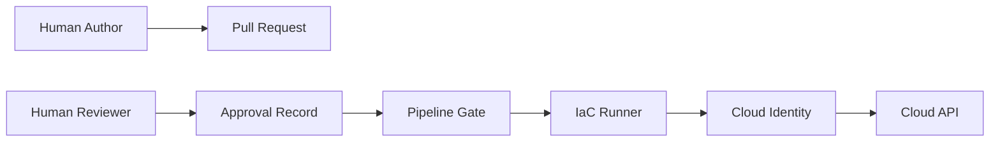
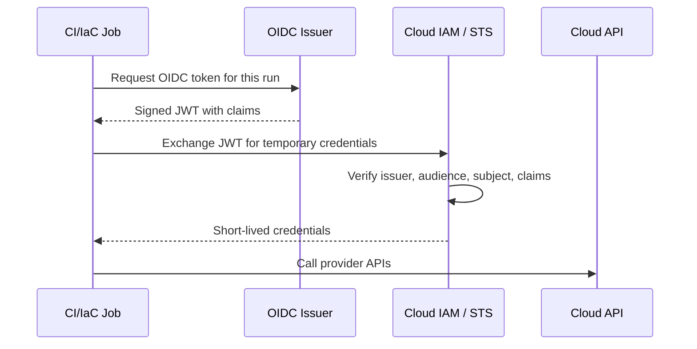
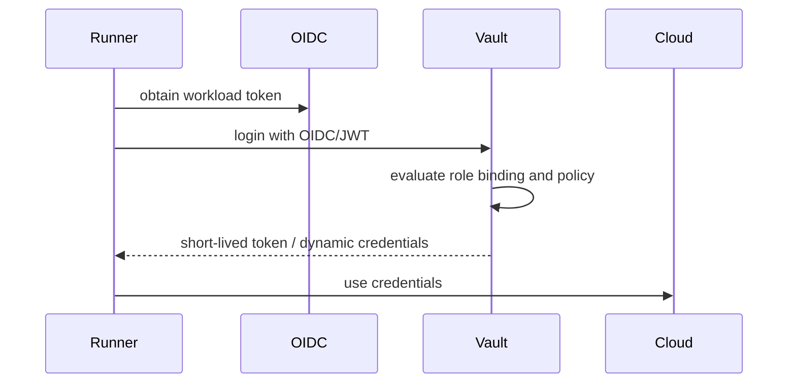
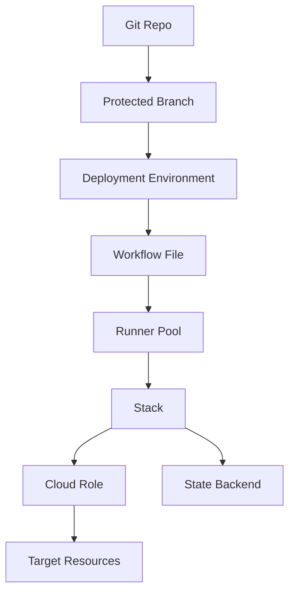
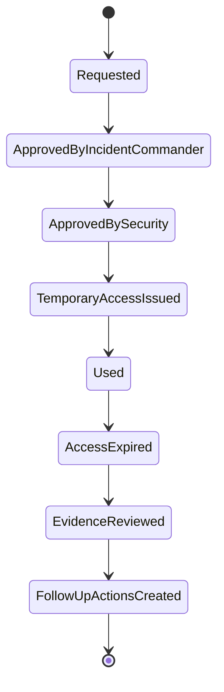
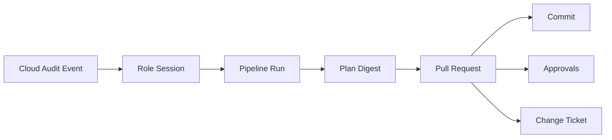
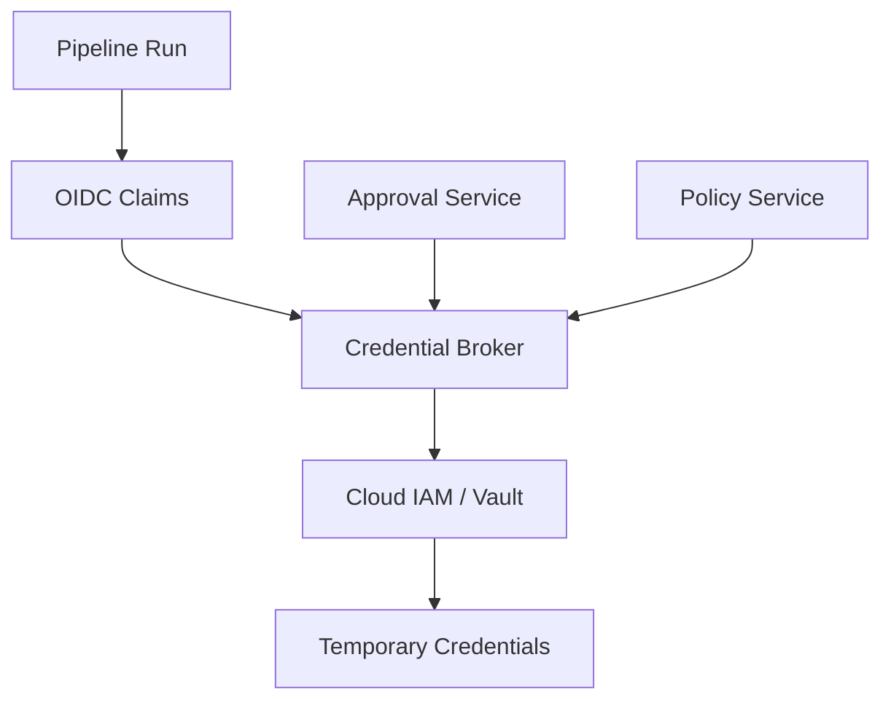

# Part 016 — Credentials, Identity, and Least-Privilege Execution

Credentials are the sharpest edge of a GitOps/IaC pipeline.

A beautiful repository structure cannot save a platform where every runner has admin credentials.

A perfect approval workflow cannot save a platform where an untrusted pull request can read cloud keys.

A mature policy system cannot save a platform where the apply identity is so broad that policy bypass becomes trivial.

This part builds the credential and identity model for production IaC.

We will reason from first principles:

> Every infrastructure mutation must be performed by a known workload identity, under a scoped authorization boundary, for a specific operation, from a trusted source, with durable evidence.

That sentence is dense.

This entire part unpacks it.

---

## 1. Identity Is the Real Control Plane

A pipeline does not mutate infrastructure.

An identity does.

```text
pipeline job -> credentials -> cloud API -> infrastructure mutation
```

The cloud provider does not care that your pull request had approvals.

The cloud provider sees an authenticated principal.

Examples:

- AWS IAM role session,
- Azure service principal / managed identity / federated credential,
- Google Cloud service account via Workload Identity Federation,
- Kubernetes service account,
- Vault token,
- SaaS API token,
- database admin credential,
- DNS provider token.

So the core security question is not:

> Is the pipeline configured nicely?

It is:

> Which principal can perform which action against which target under which conditions?

---

## 2. The Credential Threat Model

Assume attackers want one of these outcomes:

1. Exfiltrate cloud credentials from CI logs or environment variables.
2. Modify IaC code to create a backdoor resource.
3. Change pipeline code to bypass policy.
4. Use a fork PR to run credentialed code.
5. Abuse broad runner credentials to mutate unrelated infrastructure.
6. Replay a token outside the intended run.
7. Use stale long-lived credentials after access should have expired.
8. Trick reviewers into approving a safe-looking plan while applying a different plan.
9. Use break-glass access as a normal operational path.
10. Compromise a GitOps controller to mutate cluster or cloud resources.

A production credential model must address all ten.

---

## 3. Principal Types in GitOps/IaC

Do not use the word “the pipeline” as if it were one actor.

There are many actors.

| Principal | Example | Should It Mutate Infra? |
|---|---|---|
| Human author | Developer opening PR | Usually no direct production mutation |
| Human reviewer | CODEOWNER approving PR | Approves intent, not direct cloud action |
| CI validation job | PR lint/plan job | Read-only or no-cloud access |
| IaC apply runner | Controlled production runner | Yes, scoped mutation |
| GitOps controller | Argo CD/Flux controller | Yes, scoped cluster reconciliation |
| Secret operator | External Secrets/Vault agent | Reads/writes secrets by scope |
| Cloud service account | AWS/Azure/GCP role | Performs provider API calls |
| Break-glass operator | Emergency human/admin | Rare, time-bound, heavily audited |
| Platform bootstrap identity | Creates initial roles/controllers | Very high privilege, rarely used |

Security improves when these identities are separate.

It collapses when they share credentials.

---

## 4. Human Approval Is Not Machine Authorization

This is a common mistake.

A PR approval says:

```text
A human accepted this proposed change.
```

A cloud IAM policy says:

```text
This principal may call this API.
```

They are different controls.

A production pipeline needs both.



The runner should not obtain production credentials merely because a workflow file says so.

It should obtain production credentials only when:

- source is trusted,
- branch/ref is allowed,
- stack is known,
- policy passed,
- approval requirements passed,
- runner pool is allowed,
- and operation is authorized.

---

## 5. Static Credentials vs Dynamic Credentials

### 5.1 Static Credentials

Static credentials are long-lived secrets stored somewhere:

```text
AWS_ACCESS_KEY_ID
AWS_SECRET_ACCESS_KEY
AZURE_CLIENT_SECRET
GOOGLE_APPLICATION_CREDENTIALS JSON key
SaaS API token
```

They are simple.

They are also dangerous.

Problems:

- theft impact is high,
- rotation is operationally painful,
- usage attribution is weak,
- scope tends to grow,
- secrets spread into CI systems,
- credentials may outlive the workload,
- and revocation is reactive.

Static credentials should be avoided for production IaC wherever workload federation is available.

### 5.2 Dynamic Credentials

Dynamic credentials are issued at runtime.

Examples:

- OIDC token exchanged for AWS STS role credentials,
- GitHub Actions OIDC to Azure federated credential,
- Workload Identity Federation to Google service account,
- Vault dynamic cloud credentials,
- Kubernetes projected service account token,
- SPIFFE/SPIRE SVID for workload identity.

Advantages:

- short-lived,
- scoped,
- auditable,
- no secret stored in CI,
- easier revocation through trust policy,
- and stronger binding to run context.

Dynamic credentials are not magic.

Bad trust policy can still grant too much.

---

## 6. OIDC Federation Mental Model

OpenID Connect federation lets a workload prove who it is to another system.

The pattern:



The token contains claims.

Important claims often include:

- issuer (`iss`),
- audience (`aud`),
- subject (`sub`),
- repository,
- organization,
- branch/ref,
- workflow,
- job/run ID,
- environment,
- actor,
- and token expiry.

The cloud trust policy decides which claims are acceptable.

### 6.1 Issuer

The issuer is who created the token.

Example:

```text
https://token.actions.githubusercontent.com
```

A cloud provider should trust only known issuers.

### 6.2 Audience

The audience is who the token is intended for.

A token intended for one provider should not be reusable elsewhere.

Audience binding reduces replay risk.

### 6.3 Subject

The subject identifies the workload context.

For CI systems, it may encode repository, branch, environment, or workflow.

Subject design is critical.

Too broad:

```text
repo:company/infra:* 
```

Better:

```text
repo:company/infra:environment:prod
```

or provider-specific equivalent.

The exact claim format depends on the issuer and provider.

---

## 7. GitHub Actions OIDC Pattern

GitHub Actions supports OIDC tokens that workflows can exchange with cloud providers instead of storing long-lived secrets.

Conceptual flow:

```text
GitHub workflow job
  -> requests OIDC token
  -> cloud validates GitHub issuer and claims
  -> cloud returns temporary credentials
  -> job runs IaC operation
```

GitHub's official security guidance describes using OIDC so workflows can access cloud resources without storing cloud credentials as long-lived GitHub secrets.

### 7.1 Safe GitHub OIDC Conditions

A trust policy should consider:

- organization,
- repository,
- branch/ref,
- environment,
- workflow path,
- pull request source,
- and audience.

For production, avoid trusting every workflow in a repo.

Bad idea:

```text
any workflow in company/infra can assume prod admin
```

Better:

```text
only protected environment prod,
from protected branch main,
from approved workflow path,
using production runner pool,
can assume specific prod stack role
```

### 7.2 Fork Pull Request Rule

Fork PRs are untrusted.

Do not expose cloud credentials to them.

Run only:

- formatting,
- static validation,
- documentation checks,
- policy tests without secrets,
- and possibly plan using mocked or read-only isolated credentials if safe.

Never allow fork PR code to execute with production cloud permissions.

### 7.3 GitHub Environments

GitHub environments can provide deployment protection rules and secret scoping.

They are useful, but they are not enough by themselves.

Cloud trust policy should still restrict claims.

Do not rely only on UI environment protection while allowing broad cloud trust.

---

## 8. AWS OIDC Role Assumption Pattern

AWS commonly uses an IAM OIDC identity provider plus IAM role trust policy.

Conceptual objects:

```text
GitHub OIDC issuer -> AWS IAM OIDC provider -> IAM role trust policy -> STS AssumeRoleWithWebIdentity -> temporary credentials
```

### 8.1 Example Trust Policy Shape

This is illustrative. Exact claim keys and values depend on your issuer and environment.

```json
{
  "Version": "2012-10-17",
  "Statement": [
    {
      "Effect": "Allow",
      "Principal": {
        "Federated": "arn:aws:iam::123456789012:oidc-provider/token.actions.githubusercontent.com"
      },
      "Action": "sts:AssumeRoleWithWebIdentity",
      "Condition": {
        "StringEquals": {
          "token.actions.githubusercontent.com:aud": "sts.amazonaws.com"
        },
        "StringLike": {
          "token.actions.githubusercontent.com:sub": "repo:company/infra-live:environment:prod"
        }
      }
    }
  ]
}
```

The important idea:

> The role should trust a narrow workload identity, not the entire CI platform.

### 8.2 AWS Role Design

Do not create one `terraform-admin` role.

Create roles by boundary.

Example:

```text
iac-dev-general-plan
iac-dev-general-apply
iac-prod-network-plan
iac-prod-network-apply
iac-prod-data-plan
iac-prod-data-apply
iac-prod-security-breakglass
```

Plan and apply may require different privileges.

For some providers, plan needs read-only permissions.

For other resources, plan may need broader access to read computed attributes.

Do not assume plan is always harmless.

### 8.3 AWS Session Tagging and Audit

Where possible, include session context:

- run ID,
- repository,
- commit,
- stack,
- actor,
- PR number,
- environment.

This improves CloudTrail investigation.

The audit goal:

```text
Cloud API call -> role session -> CI run -> commit -> approval -> plan
```

If you cannot trace that chain, your evidence model is incomplete.

---

## 9. Azure Workload Identity Federation Pattern

Azure / Microsoft Entra workload identity federation lets external workloads exchange tokens from a trusted identity provider for Azure access tokens.

Conceptual objects:

```text
external OIDC issuer
  -> federated identity credential on app/service principal or managed identity
  -> token exchange
  -> Azure Resource Manager API access
```

Key design points:

- use federated credentials instead of client secrets where possible,
- bind issuer/audience/subject narrowly,
- separate app registrations or managed identities by environment and stack,
- assign least-privilege Azure RBAC roles,
- avoid subscription-wide Owner unless absolutely required,
- and log run context.

### 9.1 Azure Role Design

Bad:

```text
one service principal with Owner on all subscriptions
```

Better:

```text
sp-iac-dev-network-apply -> Network Contributor on dev network RG
sp-iac-prod-app-plan -> Reader on prod app RG
sp-iac-prod-app-apply -> scoped Contributor on prod app RG
sp-iac-prod-policy-apply -> Policy Contributor only where needed
```

Azure RBAC assignment scope matters:

- management group,
- subscription,
- resource group,
- resource.

Use the narrowest practical scope.

---

## 10. Google Cloud Workload Identity Federation Pattern

Google Cloud Workload Identity Federation lets external workloads authenticate without service account keys.

Conceptual objects:

```text
external OIDC issuer
  -> workload identity pool
  -> workload identity provider
  -> attribute mapping / conditions
  -> service account impersonation
  -> Google Cloud API access
```

Key design points:

- avoid long-lived service account JSON keys,
- map external claims to attributes,
- use attribute conditions to restrict repo/branch/environment,
- use separate service accounts by environment/stack,
- bind IAM roles narrowly,
- and monitor impersonation events.

### 10.1 Google Role Design

Bad:

```text
one service account with Project Editor for all Terraform
```

Better:

```text
sa-iac-dev-general-plan@project.iam.gserviceaccount.com
sa-iac-prod-network-apply@project.iam.gserviceaccount.com
sa-iac-prod-data-apply@project.iam.gserviceaccount.com
```

Google Cloud IAM can be very granular, but custom roles require maintenance.

Use custom roles for stable, high-value boundaries.

Use predefined roles carefully.

---

## 11. Vault and Secret Broker Pattern

OIDC does not only apply to cloud providers.

A runner can authenticate to a broker such as Vault and receive dynamic credentials.



Use this when:

- the cloud provider integration is complex,
- credentials span multiple SaaS systems,
- database dynamic credentials are needed,
- centralized secret policy is required,
- or you need consistent brokering across clouds.

But do not turn Vault into a universal admin credential dispenser.

Vault roles must be as scoped as cloud roles.

---

## 12. Secret Zero

Secret zero is the first credential needed to obtain other credentials.

In old pipelines, secret zero was often a static CI secret.

In modern pipelines, secret zero should be workload identity.

```text
bad: CI_SECRET_KEY -> Vault -> cloud admin credentials
better: OIDC token -> Vault role -> scoped dynamic credentials
```

The first trust should be based on a verifiable workload identity, not a copied secret.

---

## 13. Least Privilege by Operation

The same stack may need different permissions for different operations.

| Operation | Typical Permission Shape |
|---|---|
| fmt/validate | no cloud access |
| plan speculative | read-only or limited read access |
| plan authoritative | read access to target and state |
| apply | write access to target boundary |
| destroy | stronger write/delete access, extra approval |
| import | read target + state write, high caution |
| state mv/rm | state admin, very high caution |
| drift detection | read access, no write |
| policy test | no target access |

Avoid giving apply permissions to validation jobs.

Avoid giving destroy permissions by default.

Avoid giving state admin permissions to normal applies.

---

## 14. Least Privilege by Resource Class

Infrastructure has different risk classes.

| Resource Class | Risk |
|---|---|
| tags/labels | low but compliance-relevant |
| app compute | medium |
| DNS | high blast radius |
| IAM | high privilege risk |
| network routes/firewalls | high availability/security risk |
| databases | high data loss risk |
| encryption keys | very high irreversible risk |
| organization policy | very high systemic risk |

Role design should reflect this.

Do not let an app team runner modify organization-wide IAM unless that is explicitly part of its ownership.

---

## 15. Least Privilege by Environment

The same module in dev and prod should not necessarily use the same identity.

```text
dev/app/payment-api -> iac-dev-app-apply
stage/app/payment-api -> iac-stage-app-apply
prod/app/payment-api -> iac-prod-app-payment-api-apply
```

Environment should affect:

- role scope,
- approval requirements,
- runner pool,
- allowed operations,
- evidence retention,
- and break-glass process.

Production identity should be deliberately boring and narrow.

---

## 16. Least Privilege by Stack Boundary

A stack boundary should map to an identity boundary.

If one stack identity can modify everything, stack boundaries are mostly cosmetic.

Example mapping:

```text
prod/eu-west-1/network-foundation
  -> role: iac-prod-euw1-network-foundation-apply
  -> scope: VPC, subnets, route tables, NAT, network ACLs

prod/eu-west-1/payments-db
  -> role: iac-prod-euw1-payments-db-apply
  -> scope: database resources, parameter groups, subnet groups, secrets path

prod/eu-west-1/app-payment-api
  -> role: iac-prod-euw1-app-payment-api-apply
  -> scope: app compute, app IAM, app queues, app alarms
```

This mapping reduces blast radius and improves audit.

---

## 17. Identity Graph

A production platform should maintain an identity graph.



For any production role, you should know:

```text
Which repo can assume it?
Which branch/ref can assume it?
Which workflow can assume it?
Which runner pool can use it?
Which stack maps to it?
Which resources can it mutate?
Which state can it read/write?
Which approvals are required?
```

If the answer is “we think only the infra repo”, the model is not precise enough.

---

## 18. Trust Policy Design

A trust policy decides who may obtain credentials.

A permission policy decides what those credentials can do.

Both matter.

### 18.1 Trust Policy

Answers:

```text
Who can become this role?
Under what claims?
From what issuer?
For what audience?
From what repo/ref/environment?
```

### 18.2 Permission Policy

Answers:

```text
Once this role is assumed, what APIs and resources are allowed?
```

### 18.3 Common Failure

Strong permission policy, weak trust policy:

```text
role has narrow permissions, but every workflow in the org can assume it
```

Weak permission policy, strong trust policy:

```text
only one workflow can assume it, but role is admin
```

You need both.

---

## 19. Claim Binding Strategy

Use claims that are stable, meaningful, and difficult to spoof.

Potential bindings:

| Claim | Use |
|---|---|
| issuer | trust only expected OIDC provider |
| audience | prevent token replay to wrong service |
| organization | restrict company boundary |
| repository | restrict source repo |
| ref/branch | restrict production to protected branch |
| environment | restrict production to protected environment |
| workflow path | restrict which workflow can request credential |
| run ID | audit, sometimes session naming |
| actor | audit, rarely sole authorization |

Avoid relying only on actor.

A trusted actor can make mistakes.

Authorization should bind workload context, not just user identity.

---

## 20. Branch and Environment Binding

Production credentials should not be available from arbitrary branches.

Bad:

```text
repo:company/infra-live:*
```

Better:

```text
repo:company/infra-live:environment:prod
```

or:

```text
repo:company/infra-live:ref:refs/heads/main
```

The right expression depends on the CI provider and cloud provider.

Also remember:

- branch protection must be enforced,
- environment protection must be enforced,
- workflow file changes must be reviewed,
- and CODEOWNERS must cover pipeline definitions.

OIDC trust is only as good as the source governance behind it.

---

## 21. Workflow File Governance

If a workflow can request credentials, changing that workflow is equivalent to changing the security boundary.

Protect workflow files.

Example CODEOWNERS:

```text
.github/workflows/** @platform-security @platform-engineering
infra/**             @platform-engineering
policies/**          @platform-security
```

Rules:

- workflow changes require platform/security review,
- production credential jobs use pinned actions,
- third-party actions are allowlisted,
- script steps are reviewed carefully,
- and production workflows cannot be modified by application teams without platform review.

---

## 22. Third-Party Action and Plugin Risk

A CI job with cloud credentials runs code.

Every action, plugin, script, provider, and module in that execution path may become part of your trust boundary.

Controls:

- pin actions by SHA,
- use verified publishers where possible,
- restrict allowed actions,
- mirror critical tools,
- validate provider checksums,
- review provider upgrades,
- sign runner images,
- and run policy before credentialed execution where possible.

Do not give production credentials to a workflow full of mutable third-party references.

---

## 23. Plan Identity vs Apply Identity

Plan and apply should often use different identities.

```text
plan identity:
  - read current resources
  - read remote state
  - no create/update/delete

apply identity:
  - create/update/delete within target boundary
  - no unrelated resource class
  - no state admin unless needed
```

Caveat:

Some providers require permissions during plan that look broader than expected because they read resource details, validate data sources, or inspect dependencies.

Do not blindly deny plan access and then grant admin to “fix the pipeline”.

Study provider behavior and build read roles intentionally.

---

## 24. State Backend Access

State is sensitive.

It may contain:

- resource IDs,
- endpoint names,
- generated passwords,
- secret references,
- private IPs,
- IAM role names,
- and topology information.

State permissions should be scoped separately from cloud mutation permissions.

For each stack:

```text
plan role: read state, read target
apply role: read/write state, mutate target
state-admin role: lock repair, state mv/rm/import recovery
```

State admin should not be part of normal apply.

---

## 25. GitOps Controller Identity

Argo CD, Flux, and similar controllers are continuously running identities.

They need access to:

- read Git or artifact sources,
- write Kubernetes resources,
- sync namespaces,
- manage Helm releases or Kustomizations,
- and sometimes decrypt or reference secrets.

Do not run GitOps controllers as cluster-admin for everything unless you intentionally accept that blast radius.

### 25.1 Namespace-Scoped Identity

For multi-tenant clusters:

```text
team-a controller/project -> namespace team-a-* only
team-b controller/project -> namespace team-b-* only
platform controller -> cluster-level resources only
```

### 25.2 Argo CD Project Boundary

Argo CD Projects can restrict:

- source repositories,
- destination clusters/namespaces,
- allowed resource kinds,
- denied resource kinds,
- and roles.

Use them as authorization boundaries, not organizational decoration.

### 25.3 Flux Controller Boundary

Flux controllers reconcile sources and Kustomizations/HelmReleases.

Use service account impersonation and namespace scoping where appropriate.

Do not let one tenant's Kustomization modify cluster-wide resources unless explicitly intended.

---

## 26. Kubernetes Workload Identity for Controllers

When controllers need cloud access, avoid static cloud keys in Kubernetes secrets.

Use workload identity patterns:

- AWS IAM Roles for Service Accounts / EKS Pod Identity,
- Azure Workload Identity,
- Google Workload Identity,
- Vault Kubernetes auth,
- or SPIFFE/SPIRE where appropriate.

Pattern:

```text
Kubernetes service account
  -> projected token / workload identity
  -> cloud role/service account
  -> scoped cloud API access
```

This makes controller identity auditable and revocable.

---

## 27. Secrets Operators and Identity

External Secrets Operator, Vault operators, CSI secret drivers, and similar tools bridge secret managers into Kubernetes.

They are sensitive.

Design them with:

- namespace scoping,
- secret path restrictions,
- service account identity,
- read-only where possible,
- audit logs,
- and separate identities per tenant/environment.

Bad:

```text
one external-secrets controller can read every secret path in Vault
```

Better:

```text
team-a namespace -> team-a Vault path only
payments namespace -> payments prod secret path only
platform namespace -> platform paths only
```

---

## 28. Break-Glass Identity

Break-glass access is necessary.

It is also dangerous.

A break-glass identity should be:

- disabled or inaccessible by default,
- time-bound,
- approval-bound,
- strongly authenticated,
- logged loudly,
- scoped where possible,
- reviewed after use,
- and tested periodically.

### 28.1 Break-Glass Flow



Break-glass should not be a secret admin key in a password manager that everyone hopes nobody uses.

### 28.2 Break-Glass Evidence

Record:

- who requested,
- who approved,
- incident ID,
- reason,
- scope,
- time window,
- commands/run IDs,
- resources touched,
- and cleanup actions.

---

## 29. Segregation of Duties

For regulated systems, separate roles:

```text
author != sole approver
reviewer != policy author for the same bypass
runner operator != uncontrolled cloud admin
security approver != normal service owner approver
```

Segregation does not mean slow bureaucracy.

It means one actor cannot silently introduce and execute a risky production change without independent control.

Automate the boring parts.

Preserve independence for the dangerous parts.

---

## 30. Approval Binding to Identity

A pipeline should bind approval to credential issuance.

Bad:

```text
approval happens in PR comments
workflow independently assumes prod role
```

Better:

```text
approval record -> apply gate -> credential broker permits role assumption
```

Ideal:

```text
credential broker checks claims:
  commit = approved commit
  plan_digest = approved plan
  environment = prod
  operation = apply
  approvers satisfy policy
```

Cloud IAM systems do not always support all of this natively.

When they do not, enforce it in the orchestrator or secret broker before credentials are issued.

---

## 31. Time-Bound and Operation-Bound Credentials

Credential lifetime should be short.

But not so short that long applies fail mid-run without recovery planning.

Design by operation:

| Operation | Typical Lifetime |
|---|---|
| fmt/validate | none |
| plan | short |
| drift detection | short |
| apply small stack | short to moderate |
| apply database/network foundation | moderate, monitored |
| break-glass | explicit time window |

Do not use 12-hour credentials for a 5-minute plan just because it is easier.

Also consider:

- token refresh behavior,
- provider credential caching,
- long-running applies,
- and cancellation semantics.

---

## 32. Permission Boundaries and Guardrails

Cloud IAM can enforce technical guardrails that policy-as-code may miss.

Examples:

- deny deleting production KMS keys,
- deny disabling object versioning on state buckets,
- deny creating public storage buckets,
- deny IAM privilege escalation actions,
- deny unapproved regions,
- require tags/labels,
- restrict network CIDR changes,
- restrict role assumption paths.

Use defense in depth.

```text
policy-as-code catches proposed bad changes before apply
cloud IAM denies impossible operations during apply
cloud audit detects unexpected attempts after apply
```

Do not make policy-as-code the only thing preventing catastrophe.

---

## 33. Cloud IAM Anti-Patterns

### 33.1 Wildcard Actions

```json
{
  "Action": "*",
  "Resource": "*",
  "Effect": "Allow"
}
```

This is not an IaC role.

It is a breach amplifier.

### 33.2 Broad Trust

```text
any repo in organization can assume production role
```

This turns every repository into a production control plane.

### 33.3 Shared Credentials Across Teams

When everyone uses the same role, audit becomes weak.

You cannot easily know which service caused which mutation.

### 33.4 Static Cloud Keys in CI Secrets

These often outlive employees, repos, and workflow assumptions.

### 33.5 App Runtime Role Reused for IaC

The role used by an application at runtime should not be the same role used by IaC to provision infrastructure.

Runtime identity and provisioning identity have different risk profiles.

---

## 34. Designing an IaC Role Taxonomy

A practical taxonomy:

```text
<platform>-<environment>-<region>-<domain>-<operation>
```

Examples:

```text
iac-prod-euw1-network-plan
iac-prod-euw1-network-apply
iac-prod-euw1-payments-db-plan
iac-prod-euw1-payments-db-apply
iac-stage-use1-app-general-apply
iac-prod-global-dns-apply
iac-prod-org-policy-breakglass
```

The naming convention should encode blast radius.

If a role name does not tell you what it can affect, the taxonomy is weak.

---

## 35. Role Lifecycle Management

Roles are infrastructure too.

Manage them as code.

For each role:

- owner,
- purpose,
- trusted issuer,
- allowed subjects,
- permission scope,
- environment,
- expiration/review date,
- linked stack(s),
- evidence/logging requirements,
- and emergency contact.

Review roles periodically.

Delete unused roles.

Detect roles that have not been assumed for a long time.

Detect roles that are assumed from unexpected sources.

---

## 36. Audit Chain

A good audit chain links cloud activity back to engineering intent.



Minimum fields:

- run ID,
- role/session ID,
- stack ID,
- commit SHA,
- PR number,
- author,
- approvers,
- environment,
- operation,
- policy bundle version,
- and plan digest.

Without this, incident response becomes archaeology.

---

## 37. Credential Revocation

Credential systems need revocation paths.

Revocation levers:

- disable trust policy,
- remove federated credential,
- revoke CI environment access,
- disable runner pool,
- disable secret broker role,
- rotate static fallback credential,
- revoke cloud role/session where supported,
- disable GitOps controller service account,
- block network egress,
- freeze stack/environment.

For production, document which lever to pull for which incident.

Example:

| Incident | First Response |
|---|---|
| CI token compromise suspected | disable OIDC trust for affected roles |
| runner pool compromised | disable pool and freeze stacks |
| GitOps controller compromised | suspend controller/service account and reconcile manually |
| static secret leaked | revoke secret immediately, rotate, inspect usage |
| overbroad role discovered | freeze role assumption, replace with scoped role |

---

## 38. Identity Testing

Test credentials like code.

### 38.1 Positive Tests

Verify intended access works:

```text
prod app apply role can update app autoscaling policy
prod network plan role can read VPC and route tables
stage database apply role can modify stage DB parameter group
```

### 38.2 Negative Tests

Verify forbidden access fails:

```text
prod app apply role cannot modify IAM organization policy
prod app apply role cannot delete prod database
stage role cannot access prod state
fork PR cannot obtain cloud credentials
feature branch cannot assume prod role
```

Negative tests are where least privilege becomes real.

### 38.3 Policy Simulation

Use provider-native IAM simulation where available.

Also test with real controlled calls in sandbox accounts.

Do not rely only on code review for IAM correctness.

---

## 39. Identity Failure Modes

### 39.1 Trust Policy Too Broad

Symptom:

```text
unexpected repo/workflow can assume production role
```

Fix:

- narrow subject/audience/repository/ref conditions,
- protect workflow files,
- add assumption detection,
- add negative tests.

### 39.2 Permission Policy Too Broad

Symptom:

```text
runner can mutate resources outside stack boundary
```

Fix:

- split role,
- scope resources,
- use permission boundaries/deny policies,
- add resource tag conditions where appropriate,
- add policy-as-code checks.

### 39.3 Token Expiry During Apply

Symptom:

```text
long-running apply fails mid-operation
```

Fix:

- understand provider credential refresh,
- set appropriate lifetime,
- split large stacks,
- improve apply duration,
- add recovery playbook.

### 39.4 Plan Fails With Read Denied

Symptom:

```text
plan cannot read resource/data source
```

Bad fix:

```text
grant admin
```

Good fix:

- inspect exact missing read action,
- update read role narrowly,
- consider provider behavior,
- add test.

### 39.5 Break-Glass Drift

Symptom:

```text
emergency manual change remains outside Git
```

Fix:

- reconcile into Git or revert,
- document incident,
- run drift plan,
- review why normal pipeline was bypassed.

---

## 40. Implementation Pattern: Credential Broker

For high-maturity platforms, put a broker between pipeline and cloud credentials.



The broker checks:

- run source,
- stack mapping,
- environment,
- operation,
- approval status,
- policy status,
- change freeze,
- runner pool,
- and requested role.

Only then does it allow credential exchange.

This reduces the gap between human governance and machine authorization.

---

## 41. Practical Baseline for Production

A strong baseline:

```text
1. No long-lived cloud keys for production IaC.
2. OIDC/workload federation for CI and runners.
3. Separate plan/apply identities where practical.
4. Separate roles by environment and stack/domain.
5. Production roles trust only protected branch/environment/workflow.
6. Fork PRs receive no production/shared credentials.
7. Runner pools are authorization boundaries.
8. State access is scoped separately from cloud mutation access.
9. GitOps controllers are namespace/project scoped where possible.
10. Break-glass is time-bound, approved, logged, and reviewed.
11. Cloud audit events can be traced to run, commit, plan, and approval.
12. IAM policies have positive and negative tests.
```

This is not theoretical purity.

It is the minimum practical discipline for a privileged automation plane.

---

## 42. Practice Lab

Use the same fictional company from Part 015:

```text
Company: Northstar Commerce
Teams: platform, payments, catalog, fulfillment, data
Cloud: AWS and Azure
Regions: us-east-1, eu-west-1
Environments: dev, stage, prod
IaC: OpenTofu + Terragrunt
GitOps: Argo CD
Compliance: payment workloads require stronger audit
```

Design:

1. Role taxonomy.
2. OIDC trust policy strategy.
3. Plan/apply role separation.
4. Fork PR credential rule.
5. GitOps controller identity boundary.
6. Secrets operator identity boundary.
7. Break-glass role and flow.
8. Audit chain fields.
9. Negative IAM tests.
10. Revocation playbook.

Expected direction:

```text
iac-prod-euw1-payments-db-plan
iac-prod-euw1-payments-db-apply
iac-prod-euw1-payments-db-state-admin
iac-prod-euw1-payments-db-breakglass
```

Payments production identities should be narrower and more audited than catalog development identities.

---

## 43. Mastery Checklist

You understand IaC credentials and identity when you can answer:

- Which identity performs production apply?
- Which identity performs production plan?
- Can a fork PR obtain credentials?
- Can a feature branch assume production role?
- Which trust policy condition prevents that?
- Which workflow files can request credentials?
- Who owns those workflow files?
- Can the app runtime role mutate infrastructure?
- Can the IaC role access unrelated state?
- Can the GitOps controller modify cluster-wide resources?
- Can one tenant read another tenant's secrets?
- Are credentials static or short-lived?
- What is the token lifetime?
- What happens if credentials expire mid-apply?
- Can cloud audit events be linked to PR and commit?
- What is the first revocation step during compromise?
- Are least-privilege claims tested negatively?

---

## 44. Key Takeaways

The credential model is the security core of GitOps/IaC.

Do not think in terms of “the pipeline has access”.

Think in terms of:

```text
workload identity + trust policy + permission policy + operation + stack + environment + evidence
```

A mature platform avoids long-lived credentials, scopes identity by boundary, binds production access to trusted source and approval, and preserves an audit chain from cloud event back to engineering intent.

In the next part, we will build on this foundation and go into secrets management: SOPS, External Secrets, Vault/cloud secret managers, secret zero, rotation, and GitOps-safe secret delivery.

---

## References

- GitHub Actions — OpenID Connect concepts: https://docs.github.com/en/actions/concepts/security/openid-connect
- GitHub Actions — Configuring OIDC in AWS: https://docs.github.com/actions/security-for-github-actions/security-hardening-your-deployments/configuring-openid-connect-in-amazon-web-services
- GitHub Actions — Configuring OIDC in Azure: https://docs.github.com/actions/deployment/security-hardening-your-deployments/configuring-openid-connect-in-azure
- GitHub Actions — Configuring OIDC in Google Cloud: https://docs.github.com/actions/deployment/security-hardening-your-deployments/configuring-openid-connect-in-google-cloud-platform
- Microsoft Entra — Workload identity federation: https://learn.microsoft.com/en-us/entra/workload-id/workload-identity-federation
- Google Cloud — Workload Identity Federation with deployment pipelines: https://docs.cloud.google.com/iam/docs/workload-identity-federation-with-deployment-pipelines
- Spacelift — OIDC integrations: https://docs.spacelift.io/integrations/cloud-providers/oidc
- env0 — OIDC integrations: https://docs.envzero.com/guides/integrations/oidc-integrations
