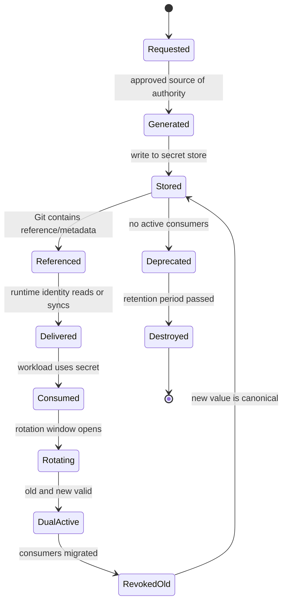
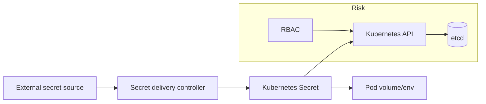
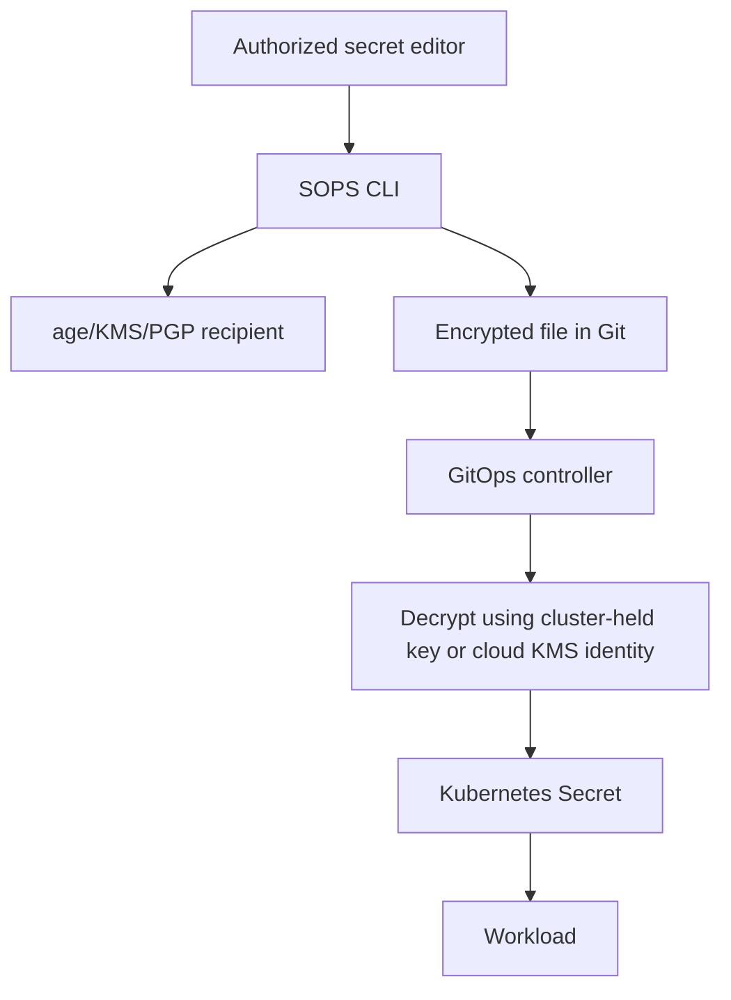
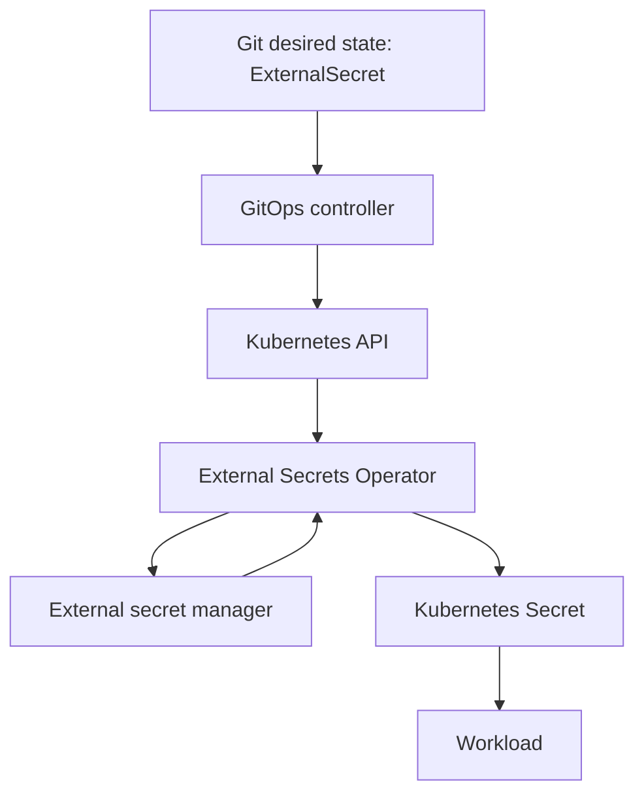
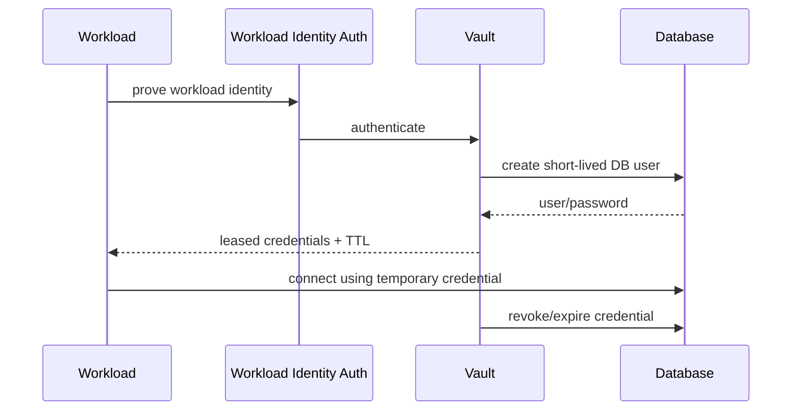
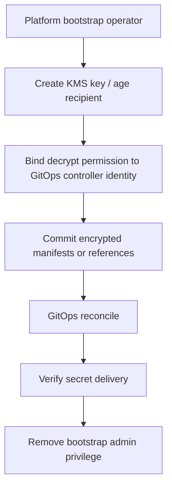
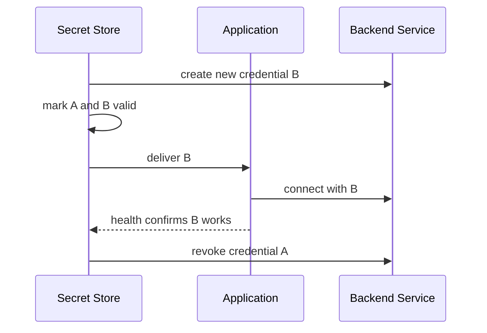
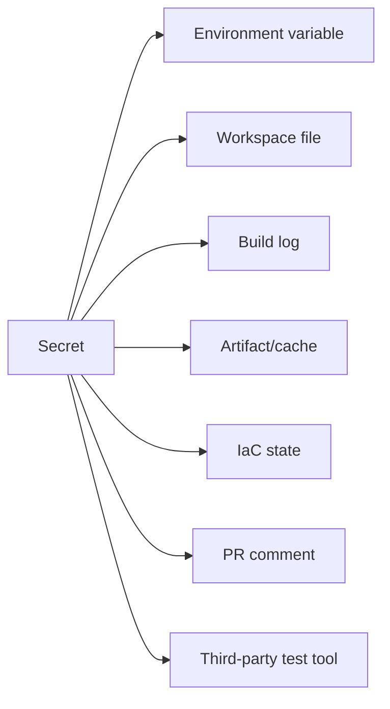

# Part 017 — Secrets Management in GitOps/IaC

A GitOps/IaC platform becomes dangerous when it treats secrets as a side problem.

Secrets are not just strings.

Secrets are authority.

A database password is authority to read or mutate data. A cloud access key is authority to create infrastructure. A private signing key is authority to publish trusted artifacts. A webhook token is authority to trigger automation. A Kubernetes service account token is authority inside the cluster.

So a production GitOps/IaC secret system is not merely about hiding values.

It is about controlling authority across time.

The core question is:

> How can the platform let machines obtain the minimum authority they need, at the last responsible moment, without storing long-lived plaintext authority in Git, CI, logs, state, or human laptops?

This part builds that model.

We will cover:

- what a secret is and is not,
- where secrets are allowed to exist,
- why Kubernetes Secret objects are not enough by themselves,
- encrypted-in-Git with SOPS,
- external-store synchronization with External Secrets Operator,
- dynamic secrets with Vault-style systems,
- cloud secret managers,
- secret zero,
- rotation,
- disaster recovery,
- policy gates,
- auditability,
- and failure playbooks.

This part intentionally does not repeat Kubernetes basics or Terraform syntax.

We are designing a system.

---

## 1. The Secret Management Mental Model

A secret system has five distinct objects.

| Object | Meaning | Common mistake |
|---|---|---|
| Secret value | The sensitive material itself | Putting it in Git, logs, Terraform state, or CI output |
| Secret reference | A stable name/path pointing to the value | Treating the reference as sufficient authorization |
| Secret reader identity | The identity allowed to read the value | Sharing one reader identity across many apps |
| Secret writer identity | The identity allowed to create/rotate the value | Letting deployment controllers mutate production secrets |
| Secret delivery path | How the value reaches the workload | Forgetting that every hop becomes part of the trust boundary |

Do not collapse these concepts.

A good platform may commit a secret reference to Git.

A bad platform commits the secret value.

A good platform lets a workload identity read exactly the secret it needs.

A bad platform lets the CI runner read every production secret because that was convenient during bootstrap.

A good platform rotates secrets as part of normal operations.

A bad platform treats rotation as an incident response activity.

---

## 2. Secret Lifecycle as a State Machine

Secrets are not static configuration.

They have lifecycle.



Every transition needs an owner.

| Transition | Owner | Evidence |
|---|---|---|
| Requested → Generated | app/platform/security owner | request ticket, PR, service catalog request |
| Generated → Stored | secret writer automation | audit log from secret store |
| Stored → Referenced | app/platform repository owner | Git commit and review |
| Referenced → Delivered | GitOps controller / external secret controller / workload identity | reconciliation event, Kubernetes event, cloud audit log |
| Delivered → Consumed | workload runtime | app startup log without value disclosure |
| Consumed → Rotating | security/platform/app owner | rotation schedule or incident record |
| DualActive → RevokedOld | app owner + platform | rollout evidence and revocation log |
| Deprecated → Destroyed | secret owner | retention evidence |

A secret without lifecycle ownership is a future incident.

---

## 3. The Non-Negotiable Invariants

These are the rules I would enforce before calling a GitOps/IaC secret system production-grade.

### 3.1 Plaintext Secret Values Must Not Be Stored in Git

Git is excellent for desired state.

Git is terrible as a plaintext secret store.

Even private repositories have too many replication paths:

- developer clones,
- forks,
- CI checkout directories,
- code search indexes,
- backup systems,
- local IDE caches,
- pull request diffs,
- chat screenshots,
- accidental logs.

Encrypted secret manifests may live in Git if the decryption boundary is controlled.

Secret references may live in Git.

Plaintext secret values should not.

### 3.2 Secrets Must Not Be Exposed by Terraform/OpenTofu State

Terraform/OpenTofu state is a control-plane database.

If a provider stores generated passwords, private keys, rendered templates, or secret values in state, then everyone who can read state can read the secret.

`sensitive = true` protects CLI display.

It does not magically remove the value from state.

Design rule:

> Do not use IaC state as a secret distribution mechanism.

IaC may provision the secret store, IAM policy, secret path, rotation schedule, and consumer permissions.

IaC should not be the place where application secret values are casually generated and exposed to broad state readers.

### 3.3 Decrypt at the Last Responsible Moment

Do not decrypt secrets early.

Bad path:

```text
Git encrypted secret -> CI decrypts -> logs/env/workspace -> kubectl apply
```

Better path:

```text
Git encrypted secret -> GitOps controller decrypts in cluster -> Kubernetes Secret
```

Or:

```text
Git secret reference -> external secret controller reads cloud secret manager -> Kubernetes Secret
```

Best for high-value workloads:

```text
workload identity -> runtime fetch from secret manager/Vault -> memory-only use
```

The later the decryption happens, the smaller the exposure window.

### 3.4 Writer and Reader Identities Must Be Separate

The identity that rotates or creates a secret should not usually be the same identity that consumes it.

Example:

```text
secret-writer-prod-payments
  can: putSecretValue, updateSecretVersionStage
  cannot: run application pods

payment-api-runtime
  can: getSecretValue payments/prod/db/main
  cannot: putSecretValue
```

This separation supports:

- least privilege,
- incident containment,
- audit clarity,
- rotation safety,
- and compliance evidence.

### 3.5 Secret Access Must Be Observable

A production secret system should answer:

- Who read this secret?
- Which workload identity read it?
- From which cluster/account/namespace?
- When was it last read?
- Who changed it?
- Which version is active?
- Which workloads still depend on the old version?
- Was the read expected?

If the platform cannot answer these questions, it is not operating secrets; it is hoping.

---

## 4. Kubernetes Secrets Are a Delivery Object, Not a Complete Secret System

Kubernetes Secrets are useful.

They are also widely misunderstood.

A Kubernetes Secret is an API object for storing sensitive data separately from Pod specs and ConfigMaps. But by default, Kubernetes Secrets are stored unencrypted in the API server backing store unless encryption at rest is configured, and anyone with sufficient API or namespace-level capability may retrieve or indirectly consume them.

That means a Kubernetes Secret should be treated as a delivery object inside the cluster, not as the only source of truth for high-value secrets.



Production implications:

- enable encryption at rest for Kubernetes Secrets,
- restrict RBAC for `get`, `list`, `watch` on Secrets,
- avoid broad namespace admin access,
- avoid injecting high-value secrets as environment variables when file mount or runtime fetch is safer,
- avoid logging environment or full process config,
- separate namespaces by trust boundary,
- monitor Secret reads where supported,
- ensure GitOps controller cannot read every secret unless explicitly required.

A developer who can create Pods in a namespace may be able to cause a Pod to mount Secrets in that namespace. So access to create workloads can become indirect access to secrets.

This matters for multi-tenant clusters.

---

## 5. Pattern 1 — Encrypted Secrets in Git with SOPS

SOPS is a common GitOps-friendly approach for encrypted configuration files. It supports structured files such as YAML, JSON, ENV, INI, and binary formats, and can encrypt using systems such as AWS KMS, GCP KMS, Azure Key Vault, age, and PGP.

The important property is that SOPS can preserve the file structure while encrypting values.

That gives GitOps a workable compromise:

```yaml
apiVersion: v1
kind: Secret
metadata:
  name: payment-db
type: Opaque
stringData:
  username: ENC[AES256_GCM,data:...]
  password: ENC[AES256_GCM,data:...]
sops:
  kms: ...
  age: ...
  mac: ENC[AES256_GCM,data:...]
```

Reviewers can see:

- which Kubernetes object is changing,
- which keys exist,
- which namespace is affected,
- metadata and labels,
- but not the secret value.

### 5.1 SOPS Architecture



The real security boundary is not “SOPS exists”.

The real boundary is:

> Who can decrypt, where, and under what identity?

### 5.2 Good Fit for SOPS

SOPS works well when:

- the number of secrets is moderate,
- secrets are part of deployment manifests,
- Git review of secret shape is valuable,
- the organization can manage decryption identities correctly,
- rotation frequency is manageable,
- the cluster GitOps controller is trusted to decrypt.

### 5.3 Poor Fit for SOPS

SOPS is a poor fit when:

- secrets rotate very frequently,
- secrets are generated dynamically per session,
- many teams need delegated write access without Git access,
- the same secret must be consumed by many non-Kubernetes systems,
- central audit and version-stage management are required,
- secret values should never be materialized as Kubernetes Secret objects.

### 5.4 SOPS Operational Rules

Use a `.sops.yaml` file to define encryption rules by path.

Example:

```yaml
creation_rules:
  - path_regex: clusters/prod/.*/secrets/.*\.yaml$
    encrypted_regex: '^(data|stringData)$'
    age: age1xxxxxxxxxxxxxxxxxxxxxxxxxxxxxxxxxxxxxxxxxxxxxxxxxxxxxxxxxx

  - path_regex: clusters/dev/.*/secrets/.*\.yaml$
    encrypted_regex: '^(data|stringData)$'
    age: age1yyyyyyyyyyyyyyyyyyyyyyyyyyyyyyyyyyyyyyyyyyyyyyyyyyyyyy
```

Production rules:

- dev and prod use different recipients,
- each environment has distinct decryption authority,
- key rotation is rehearsed,
- CI can validate encryption but cannot decrypt production unless explicitly required,
- GitOps controller decryption secret is RBAC-restricted,
- encrypted files are scanned to ensure no plaintext remains,
- reviewers know how to inspect encrypted diffs safely.

### 5.5 The SOPS Trap

SOPS protects Git.

It does not automatically protect the cluster.

After decryption, the secret may become a normal Kubernetes Secret. If cluster RBAC, etcd encryption, namespace isolation, and workload security are weak, SOPS only moved the exposure point.

Correct mental model:

```text
SOPS reduces Git exposure.
It does not eliminate runtime exposure.
```

---

## 6. Pattern 2 — External Secrets Operator

External Secrets Operator synchronizes secrets from external APIs into Kubernetes.

The external API may be AWS Secrets Manager, AWS Systems Manager Parameter Store, GCP Secret Manager, Azure Key Vault, HashiCorp Vault, 1Password, Doppler, or another provider.

The GitOps repository stores the reference, not the value.

Example:

```yaml
apiVersion: external-secrets.io/v1
kind: ExternalSecret
metadata:
  name: payment-db
  namespace: payment-prod
spec:
  refreshInterval: 1h
  secretStoreRef:
    name: prod-secrets
    kind: SecretStore
  target:
    name: payment-db
    creationPolicy: Owner
  data:
    - secretKey: username
      remoteRef:
        key: prod/payment/db
        property: username
    - secretKey: password
      remoteRef:
        key: prod/payment/db
        property: password
```

### 6.1 ESO Architecture



This is powerful because Git contains:

- which workload needs which secret,
- where the secret should be delivered,
- what key names the workload expects,
- refresh interval,
- target Secret name,
- ownership behavior.

Git does not contain:

- the secret value.

### 6.2 Store Boundary

ESO has two important abstractions:

- `SecretStore`: usually namespace-scoped,
- `ClusterSecretStore`: cluster-scoped.

Prefer `SecretStore` when team/namespace isolation matters.

Use `ClusterSecretStore` only when there is a strong platform reason and the authentication boundary is still tight.

Bad pattern:

```text
one ClusterSecretStore with access to every production secret
```

Better pattern:

```text
namespace/team SecretStore -> scoped cloud role -> limited secret path prefix
```

### 6.3 ESO Fit

ESO works well when:

- cloud secret manager is the canonical source,
- secrets are used by Kubernetes workloads,
- teams should not commit encrypted values,
- central audit/versioning is needed,
- secret rotation happens outside Git,
- workloads can consume Kubernetes Secrets.

### 6.4 ESO Risk

ESO can become a privilege escalation path if not isolated.

Risk examples:

- a namespace can reference a store that has broader access than intended,
- a team can create an `ExternalSecret` pointing to another team's secret,
- a `ClusterSecretStore` credential can read all production secrets,
- the operator service account can write Secrets into namespaces it should not manage,
- a compromised operator becomes a cross-namespace secret exfiltration point.

Policy must restrict:

- which `SecretStore` a namespace can use,
- which remote secret path prefixes are allowed,
- whether `ClusterSecretStore` is permitted,
- which target Secret names are allowed,
- whether refresh intervals are reasonable,
- whether high-value secrets require direct runtime fetch instead of sync.

---

## 7. Pattern 3 — Vault and Dynamic Secrets

For some credentials, static secrets are the wrong abstraction.

A static database password that lives for six months creates a large exposure window.

Dynamic secrets reduce this risk by generating credentials on demand with leases and TTLs.

Vault's database secrets engine is a common example: it can generate database credentials dynamically based on configured roles and leasing behavior.



### 7.1 Dynamic Secret Fit

Use dynamic secrets when:

- the backend supports temporary credentials,
- credential abuse risk is high,
- rotation must be frequent,
- audit of secret issuance matters,
- workloads can refresh credentials safely,
- operational maturity exists to run the secret system.

### 7.2 Dynamic Secret Cost

Dynamic secrets increase system complexity.

You must operate:

- high availability for the secret system,
- authentication methods,
- lease renewal,
- revocation,
- app behavior on credential expiration,
- failure fallback,
- audit storage,
- break-glass path.

Dynamic secrets are excellent for high-value systems.

They are not automatically simpler.

---

## 8. Pattern 4 — Cloud Secret Manager as Canonical Store

Most mature cloud platforms provide managed secret storage.

Examples:

- AWS Secrets Manager,
- AWS Systems Manager Parameter Store,
- Azure Key Vault,
- Google Cloud Secret Manager.

In a GitOps/IaC platform, IaC typically owns:

- secret container/path creation,
- access policies,
- KMS/encryption configuration,
- rotation configuration,
- resource tags/labels,
- audit settings,
- references in environment metadata.

But the secret value may be written by:

- a dedicated rotation Lambda/function/job,
- a DBA-controlled workflow,
- a platform secret writer service,
- Vault,
- a secure bootstrap process,
- or a human break-glass operation.

Do not assume IaC must own the value.

A useful split:

| Concern | Owner |
|---|---|
| Secret path exists | IaC |
| Secret value | secret writer workflow |
| Read permission | IaC/IAM |
| Rotation schedule | IaC + secret owner |
| Consumer reference | GitOps repo |
| Runtime consumption | workload identity / ESO |
| Audit evidence | secret manager + platform observability |

---

## 9. The Secret Zero Problem

Every secret system has a bootstrap question:

> What initial authority lets the system read or decrypt other secrets?

This is secret zero.

Examples:

- SOPS age private key stored in cluster,
- cloud KMS decrypt permission assigned to controller,
- Vault token used by CI,
- ESO cloud role credential,
- Kubernetes bootstrap kubeconfig,
- root password for first database secret rotation.

You cannot eliminate secret zero completely.

You can make it narrow, observable, and replaceable.

### 9.1 Good Secret Zero Properties

A good secret zero is:

- scoped to one environment or tenant,
- not shared across dev/stage/prod,
- stored in a managed identity or hardware-backed KMS when possible,
- rotated or replaceable,
- monitored,
- not readable by normal CI jobs,
- not embedded in Git,
- documented in a bootstrap runbook.

### 9.2 Bootstrap Flow Example



The last step is important.

Bootstrap privilege must not become permanent privilege.

---

## 10. Secret Rotation Engineering

Rotation is not a button.

Rotation is a protocol.

The ideal rotation is boring because it has been designed into the system before the incident.

### 10.1 Dual Credential Rotation

For database and API credentials, prefer dual credential rotation when supported.



This avoids forcing all consumers to switch at the exact same second.

### 10.2 Rotation Invariants

Every rotation should define:

- old version,
- new version,
- consumer list,
- compatibility period,
- rollout order,
- health signal,
- rollback condition,
- revocation condition,
- evidence.

### 10.3 App Readiness for Rotation

An application is secret-rotation-ready when:

- it can reload secrets without full redeploy, or redeploy is automated,
- it does not cache credentials forever,
- connection pools recover cleanly,
- it exposes health checks that detect auth failure,
- old and new credentials can overlap,
- failed rotation has a rollback path.

If the application cannot rotate credentials safely, the secret system alone cannot solve the problem.

---

## 11. Secrets and GitOps Reconciliation

GitOps creates an interesting tension.

Git wants desired state to be versioned.

Secrets want values to rotate outside Git.

Solve this by separating **secret delivery declaration** from **secret material**.

Good GitOps objects:

```text
this workload needs secret path prod/payment/db/main
this key should be mounted as DB_PASSWORD
this namespace may use this SecretStore
this secret refreshes every 1h
this app restarts when the Secret changes
```

Bad GitOps objects:

```text
DB_PASSWORD=plaintext-production-password
```

### 11.1 Reconciliation Boundary

A GitOps controller may reconcile:

- `ExternalSecret`,
- `SecretStore`,
- encrypted SOPS Secret,
- RBAC rules,
- deployment references,
- restart annotations,
- policy objects.

A secret controller may reconcile:

- `ExternalSecret` → Kubernetes `Secret`,
- refresh intervals,
- missing values,
- target Secret metadata.

A workload controller may reconcile:

- Pod rollout,
- secret volume projection,
- app restart.

Each controller has a different failure mode.

Do not debug them as one black box.

---

## 12. Secrets in CI/CD and IaC Runners

CI/CD should not be a general-purpose secret vending machine.

Acceptable uses:

- obtaining short-lived cloud credentials via OIDC,
- calling plan/apply with scoped identity,
- reading non-production secrets for integration tests where approved,
- using signing keys through keyless signing or KMS-backed signing,
- accessing temporary test resources.

Dangerous uses:

- storing production cloud keys as CI variables,
- letting fork PRs access secrets,
- printing environment variables on failure,
- decrypting production SOPS files in normal pull request jobs,
- passing secrets through Terraform variables that get persisted in state,
- using one CI secret for all environments.

### 12.1 CI Secret Exposure Paths



Every arrow is a leak path.

Masking helps.

Masking is not a security boundary.

---

## 13. Policy Gates for Secrets

Secret management needs policy at multiple layers.

### 13.1 Git Policy

Reject commits containing:

- plaintext secret patterns,
- unencrypted Kubernetes Secret manifests,
- private keys,
- `.env` files in production paths,
- Terraform variables containing suspicious names and literal values,
- committed kubeconfigs,
- committed cloud credential files.

### 13.2 IaC Policy

Reject infrastructure that:

- creates secret stores without encryption,
- allows wildcard secret read permissions,
- gives CI broad production secret access,
- exposes secret values as outputs,
- stores generated passwords in shared state,
- lacks rotation metadata for high-value secrets.

### 13.3 Kubernetes Policy

Reject manifests that:

- create plaintext Secrets in Git-managed repos,
- allow pods to run with service accounts that can read all Secrets,
- mount secrets from unauthorized namespaces,
- use `ClusterSecretStore` from application namespaces without approval,
- create `ExternalSecret` remote references outside allowed path prefixes.

### 13.4 Runtime Policy

Alert when:

- a secret is read by a new identity,
- a secret is read from an unusual region/account,
- a secret version is older than rotation policy,
- a disabled identity tries to read a secret,
- a secret is accessed during incident freeze,
- read volume spikes unexpectedly.

---

## 14. Repository Layout Example

```text
platform-gitops/
  clusters/
    prod-ap-southeast-1/
      platform/
        external-secrets-operator/
        secret-stores/
          payment-secretstore.yaml
      apps/
        payment/
          deployment.yaml
          external-secret.yaml
          serviceaccount.yaml
          networkpolicy.yaml
  policies/
    kyverno/
      restrict-external-secret-paths.yaml
      forbid-plain-k8s-secrets.yaml
    conftest/
      secrets.rego
```

The repository contains references and policy.

The secret values live elsewhere.

---

## 15. Failure Modes and Playbooks

### 15.1 Secret Accidentally Committed to Git

Immediate response:

1. revoke the secret,
2. rotate downstream credentials,
3. remove secret from current branch,
4. invalidate GitHub/GitLab tokens if needed,
5. treat history as compromised,
6. run repository secret scanning,
7. identify clones/forks/CI logs/artifacts,
8. add detection rule preventing recurrence.

Do not waste time pretending a Git history rewrite makes the secret safe.

Rewrite history for hygiene.

Rotate for security.

### 15.2 GitOps Controller Cannot Decrypt SOPS File

Check:

- was recipient changed?
- did controller lose access to KMS/age key?
- did `.sops.yaml` path rule change?
- is the encrypted file malformed?
- is controller service account allowed to read the decryption key?
- did KMS policy change?
- are controller logs leaking metadata?

Recovery:

- restore previous encrypted file,
- restore decrypt permission,
- rotate decrypt key only if compromise is suspected,
- add CI validation for SOPS decryptability in a safe environment.

### 15.3 ExternalSecret Is Not Syncing

Check:

- `ExternalSecret` status,
- `SecretStore` status,
- provider authentication,
- remote key path,
- namespace RBAC,
- operator logs,
- provider audit logs,
- quota/rate limit,
- target Secret ownership conflict.

Do not immediately restart everything.

Follow the reconciliation chain.

### 15.4 Application Fails After Rotation

Check:

- did new secret version reach Kubernetes Secret?
- did the Pod reload it?
- did the app read from file or env?
- are old connections still using revoked credential?
- is backend accepting the new credential?
- was the rotation order wrong?
- can old version be temporarily restored?

The failure may be in app reload, not secret distribution.

### 15.5 Secret Store Outage

Decide in advance:

- can existing Pods continue with mounted secrets?
- can new Pods start?
- can ESO refresh failures be tolerated?
- what is the max stale-secret window?
- should deployments freeze during outage?
- is there a cached emergency path?

Secret store availability is part of platform availability.

---

## 16. Secrets Maturity Model

| Level | Behavior |
|---|---|
| 0 | Plaintext secrets in repos, tickets, chat, CI variables |
| 1 | Some secret scanning; manual rotation after incidents |
| 2 | Encrypted Git secrets with SOPS; basic RBAC; separate env keys |
| 3 | External secret manager; references in Git; scoped identities; audit logs |
| 4 | Automated rotation; dynamic credentials for high-value systems; policy enforcement |
| 5 | Secret access analytics, anomaly detection, full evidence trail, practiced recovery |

Do not skip levels blindly.

Moving from level 1 to level 4 without operational readiness creates a fragile platform.

---

## 17. Production Checklist

Before enabling GitOps-managed secrets in production, verify:

- [ ] Plaintext secret values are blocked in Git.
- [ ] SOPS or external secret references are validated in CI.
- [ ] Decryption happens only in trusted runtime boundaries.
- [ ] Dev/stage/prod use separate secret authority.
- [ ] CI cannot decrypt production secrets from untrusted PRs.
- [ ] IaC state does not expose application secret values.
- [ ] Kubernetes Secrets are encrypted at rest where supported.
- [ ] RBAC restricts Secret `get/list/watch`.
- [ ] ExternalSecret remote paths are policy-constrained.
- [ ] Secret writer and reader identities are separated.
- [ ] Rotation runbooks exist for critical secrets.
- [ ] Break-glass access is narrow and audited.
- [ ] Secret store audit logs are retained.
- [ ] App teams know how their apps reload rotated secrets.
- [ ] Secret leakage incident drill has been practiced.

---

## 18. The Design Rule

A production GitOps/IaC secret system is not defined by which tool it uses.

It is defined by the invariants it preserves:

- no plaintext secret values in Git,
- no broad secret-reading CI runners,
- no unowned secret lifecycle,
- no static credentials where dynamic credentials are required,
- no shared authority across unrelated tenants,
- no unaudited reads,
- no unrehearsed rotation.

Use SOPS when encrypted desired state is the right compromise.

Use External Secrets Operator when an external secret manager should remain canonical.

Use Vault-style dynamic secrets when lease-based credentials reduce real risk.

Use cloud secret managers when you need managed durability, IAM integration, versioning, and auditability.

But never confuse a tool with a secret management system.

A secret management system is a lifecycle, authority, and evidence system.

---

## References

- SOPS documentation: https://getsops.io/
- SOPS GitHub repository: https://github.com/getsops/sops
- Flux guide for SOPS: https://fluxcd.io/flux/guides/mozilla-sops/
- External Secrets Operator documentation: https://external-secrets.io/
- Kubernetes Secrets documentation: https://kubernetes.io/docs/concepts/configuration/secret/
- HashiCorp Vault database secrets engine: https://developer.hashicorp.com/vault/docs/secrets/databases
