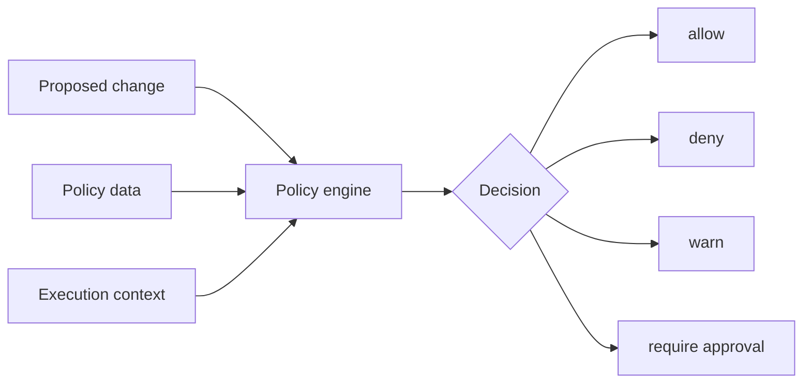
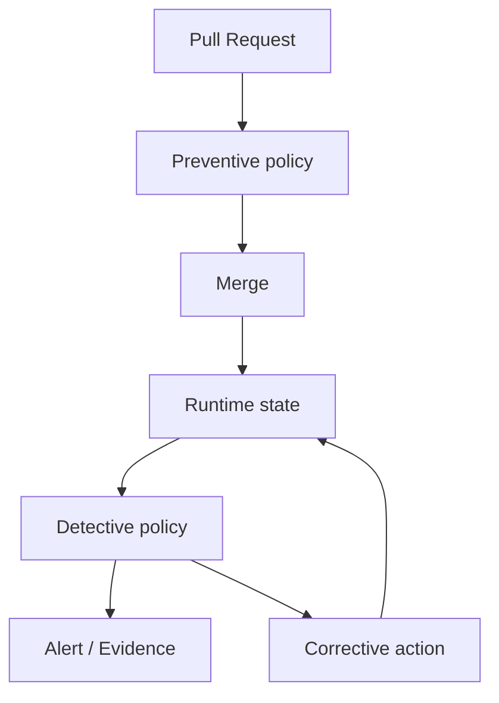
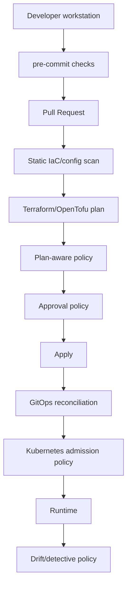
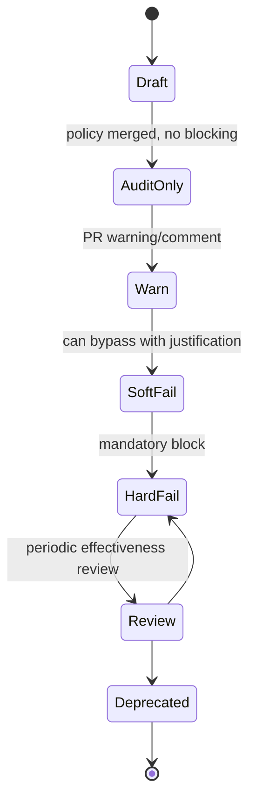

# Part 018 — Policy as Code Foundation

Policy as code is not “security linting”.

Security linting is one enforcement point.

Policy as code is the practice of turning organizational rules into executable, versioned, testable, reviewable, and observable decision logic.

In a GitOps/IaC platform, policy determines which desired states are allowed to become real states.

That sentence is the whole game.

```text
proposed desired state -> policy decision -> allowed state transition
```

Without policy, the pipeline becomes a fast path to production mistakes.

With badly designed policy, the platform becomes a bureaucracy machine that teams bypass.

The goal is not maximum blocking.

The goal is precise control.

A production policy system should answer:

- What is allowed?
- What is denied?
- Who can override?
- Under what conditions?
- Where is the evidence?
- Is the policy tested?
- Is the policy still correct?

This part builds the foundation.

---

## 1. Policy as Code Mental Model

Policy is a decision function.

```text
decision = policy(input, data, context)
```

Where:

- `input` is the proposed change or runtime request,
- `data` is supporting information such as ownership, environment, risk classification, approved regions, or service catalog metadata,
- `context` is the execution context such as actor, branch, repo, environment, time, approval state, and identity.

A policy engine should not guess.

It should evaluate explicit facts.



A weak policy system only scans files.

A strong policy system evaluates change intent, environment, ownership, identity, and risk.

---

## 2. The Four Policy Questions

Every policy should be traceable to one of four questions.

### 2.1 Is This Desired State Structurally Valid?

Examples:

- required labels exist,
- naming follows conventions,
- resource requests are present,
- Kubernetes API version is allowed,
- Terraform module input contract is valid.

This is quality control.

### 2.2 Is This Desired State Secure?

Examples:

- no public S3 bucket unless explicitly approved,
- no `0.0.0.0/0` admin port exposure,
- no wildcard IAM actions in production,
- no privileged container,
- no plaintext secrets.

This is risk prevention.

### 2.3 Is This Desired State Compliant With Organizational Rules?

Examples:

- production resources must be tagged with owner and data classification,
- regulated workloads must use approved regions,
- encryption at rest is required,
- production changes require segregation of duties,
- audit retention must meet policy.

This is governance.

### 2.4 Is This Change Authorized?

Examples:

- service team can change its own namespace,
- platform team can change cluster-level controllers,
- security team must approve IAM privilege expansion,
- database team must approve production schema migration,
- emergency path requires incident ID.

This is access control over change.

Many platforms confuse these categories.

Do not.

A valid change may be unauthorized.

An authorized change may still be insecure.

A secure change may still violate compliance because it lacks evidence.

---

## 3. Policy Taxonomy: Preventive, Detective, Corrective

Policy is not always a blocking gate.

| Type | Timing | Example | Failure mode |
|---|---|---|---|
| Preventive | Before change lands | deny public database in PR | too noisy, blocks delivery |
| Detective | After change exists | alert on drifted security group | alerts ignored |
| Corrective | Automatically remediates | remove forbidden label, auto-add default deny policy | unsafe mutation if too broad |

A mature platform uses all three.



Do not force every policy to be preventive.

Some rules are better introduced as warnings, reports, or dashboards first.

---

## 4. Enforcement Points in a GitOps/IaC Platform

A state-of-the-art platform has multiple enforcement points.



Each point sees different information.

| Enforcement point | What it sees | What it misses |
|---|---|---|
| Pre-commit | local files | cloud context, approvals |
| PR static scan | proposed source config | provider-computed plan values |
| Plan policy | actual planned changes | runtime admission behavior |
| Apply policy | actor, approval, plan freshness | future drift |
| GitOps diff | rendered desired state vs cluster state | cloud resources outside cluster |
| Admission policy | Kubernetes API request | IaC plan intent |
| Runtime detection | actual state | who intended the original change |

A single policy gate is never enough.

But too many gates with duplicated rules create confusion.

The design task is to put each rule at the enforcement point where it has the best information and lowest false-positive rate.

---

## 5. Policy Engines and Their Roles

### 5.1 OPA and Rego

Open Policy Agent is a general-purpose policy engine. It provides a declarative language, Rego, and APIs that let systems offload policy decision-making.

OPA is commonly used for:

- CI/CD policy checks,
- Kubernetes admission control through Gatekeeper-style integrations,
- service authorization,
- Terraform plan evaluation,
- custom platform APIs,
- configuration testing.

Mental model:

```text
OPA does not know your organization.
You teach it your organization through policy and data.
```

### 5.2 Conftest

Conftest uses OPA/Rego to test structured configuration files.

It is useful for:

- Terraform/OpenTofu HCL rendered to JSON,
- Terraform plan JSON,
- Kubernetes YAML,
- Helm output,
- Dockerfiles converted to structured input,
- CI pipeline definitions,
- arbitrary JSON/YAML config.

Conftest is a good bridge between local development and CI.

### 5.3 Checkov and Static IaC Scanners

Checkov scans infrastructure-as-code configuration to find misconfigurations before deployment and supports platforms such as Terraform, CloudFormation, Kubernetes, Helm, ARM templates, and Serverless Framework.

Static scanners are valuable because they ship many built-in checks.

But they are not enough for organization-specific governance.

Example:

```text
Built-in scanner can know “S3 bucket encryption should be enabled”.
It cannot automatically know “payment-prod buckets require retention policy X unless exception Y exists”.
```

Use scanners for broad known misconfiguration coverage.

Use custom policy for organization-specific invariants.

### 5.4 Sentinel

Sentinel is HashiCorp's policy-as-code framework used with HashiCorp products. HCP Terraform and Terraform Enterprise can enforce Sentinel policies in the Terraform run workflow between plan and apply.

The design question is not “Sentinel or OPA?” in the abstract.

The design question is:

> Which policy engine is closest to the enforcement point and evidence model you need?

If your run platform natively enforces Sentinel or OPA over Terraform plans, use that capability deliberately.

### 5.5 Kyverno

Kyverno is Kubernetes-native policy tooling. It can validate, mutate, generate, and verify Kubernetes resources.

Kyverno is strong when platform teams want Kubernetes-shaped policies that cluster operators and app teams can read without writing Rego.

It is especially useful for:

- admission validation,
- defaulting/mutation,
- namespace guardrails,
- image verification,
- generated resources,
- policy reports.

We will deep-dive Kubernetes admission policy in Part 020.

For now, understand the role:

```text
OPA/Rego: general-purpose policy language and engine.
Kyverno: Kubernetes-native policy model.
Checkov: broad static IaC misconfiguration scanning.
Sentinel: HashiCorp-run integrated policy framework.
Conftest: OPA-based configuration testing utility.
```

---

## 6. Policy Decision Contract

A production policy should return more than `true` or `false`.

A useful decision has structure.

```json
{
  "result": "deny",
  "severity": "high",
  "policy_id": "iac.aws.iam.no_admin_wildcard.prod",
  "message": "Production IAM policy grants wildcard admin access.",
  "resource": "aws_iam_policy.payment_api",
  "owner": "platform-security",
  "remediation": "Replace Action:* Resource:* with least-privilege actions or attach approved exception.",
  "exception_allowed": true,
  "evidence_required": ["security_approval", "expiry_date", "incident_or_risk_id"]
}
```

This matters because policy is a user experience.

Bad policy output:

```text
denied
```

Good policy output:

```text
Denied: payment-api production IAM policy grants Action:* Resource:*.
Reason: production privilege expansion requires explicit least-privilege policy or security exception.
Fix: use module iam_policy_v3 with approved action set, or attach exception EXP-123 expiring within 14 days.
```

A policy that does not explain itself creates bypass pressure.

---

## 7. Policy Data Model

Hardcoding everything in policy code creates brittle policies.

Separate policy logic from policy data.

Example data:

```yaml
approved_regions:
  regulated:
    - ap-southeast-1
    - eu-west-1
  public:
    - ap-southeast-1
    - us-east-1

service_owners:
  payment-api:
    team: payments-platform
    data_classification: regulated
    production_approvers:
      - group: security-prod-approvers
      - group: payments-tech-leads

allowed_external_secret_prefixes:
  payment-prod:
    - prod/payment/
```

Policy then asks:

```text
Is this resource in an allowed region for its data classification?
Is this approver valid for this service and environment?
Is this ExternalSecret path within the namespace prefix?
```

This lets governance evolve without rewriting every rule.

---

## 8. Example OPA/Rego Policy Shape

The purpose here is not to teach every Rego feature.

The purpose is to see how policy logic maps to platform invariants.

Example: deny public ingress to admin ports in production.

```rego
package iac.network

import rego.v1

default allow := true

deny contains msg if {
  input.environment == "prod"
  some rc in input.resource_changes
  rc.type == "aws_security_group_rule"
  rc.change.actions[_] != "delete"
  after := rc.change.after
  after.type == "ingress"
  after.cidr_blocks[_] == "0.0.0.0/0"
  after.from_port <= 22
  after.to_port >= 22
  msg := sprintf("%s exposes SSH to the internet in production", [rc.address])
}
```

Policy inputs need normalization.

Terraform plan JSON, Kubernetes manifests, and cloud configs all have different shapes.

A mature platform creates stable intermediate inputs so policies do not become tightly coupled to every provider schema change.

---

## 9. Plan-Aware Policy vs Static Policy

Static policy evaluates source configuration.

Plan-aware policy evaluates intended resource changes.

Static policy asks:

```text
What did the developer write?
```

Plan policy asks:

```text
What will the platform actually change?
```

Example:

A Terraform module may hide an IAM policy inside a generated document.

Static scanning the module call may not see the final policy.

Plan JSON can reveal the computed change.

Use plan-aware policy for:

- IAM privilege expansion,
- public network exposure,
- destructive changes,
- encryption changes,
- database replacement,
- region/account creation,
- policy exceptions,
- expensive resources,
- generated resources from modules.

Use static policy for:

- file layout,
- module source/version constraints,
- forbidden syntax,
- required metadata,
- secrets scanning,
- local developer feedback.

---

## 10. Policy Rollout Strategy

The fastest way to make teams hate policy is to turn on hundreds of blocking rules at once.

Use staged rollout.



### 10.1 Rollout Phases

| Phase | Behavior | Goal |
|---|---|---|
| Draft | policy has tests, not active | validate logic |
| Audit-only | collect violations silently/dashboard | understand blast radius |
| Warn | comment in PR, no block | educate teams |
| Soft fail | block unless exception/approval | enforce with escape hatch |
| Hard fail | no exception except break-glass | protect critical invariant |

Critical invariants can start as hard fail.

Examples:

- plaintext production secret in Git,
- production admin port open to the internet,
- unapproved deletion of production database,
- CI job exposing production credentials to fork PR.

Everything else should usually be staged.

---

## 11. Exceptions Are Part of the System

A policy platform without exceptions will be bypassed.

A policy platform with weak exceptions will become theater.

Design exceptions as first-class objects.

Example exception metadata:

```yaml
apiVersion: platform.example.com/v1
kind: PolicyException
metadata:
  name: exp-2026-0712-payment-temp-public-ip
spec:
  policyId: iac.network.no_public_ingress_prod
  resource: aws_security_group_rule.payment_debug
  environment: prod
  reason: "Temporary vendor migration window"
  approvedBy:
    - security-prod-approvers
  expiresAt: "2026-07-19T00:00:00+07:00"
  ticket: "RISK-1842"
```

Exception rules:

- every exception has owner,
- every exception has expiry,
- every exception has scope,
- every exception has reason,
- high-risk exceptions require stronger approval,
- expired exceptions fail closed,
- exceptions are reported weekly.

A permanent exception is not an exception.

It is a policy change request.

---

## 12. Policy Testing

Policy code is production code.

It needs tests.

OPA supports testing Rego policies with test rules.

Example:

```rego
package iac.network_test

import data.iac.network


test_deny_public_ssh_in_prod if {
  input := {
    "environment": "prod",
    "resource_changes": [{
      "address": "aws_security_group_rule.bad",
      "type": "aws_security_group_rule",
      "change": {
        "actions": ["create"],
        "after": {
          "type": "ingress",
          "cidr_blocks": ["0.0.0.0/0"],
          "from_port": 22,
          "to_port": 22
        }
      }
    }]
  }

  count(network.deny) == 1 with input as input
}
```

Test cases should include:

- obvious deny,
- obvious allow,
- edge conditions,
- missing fields,
- malformed inputs,
- exception present,
- exception expired,
- dev vs prod behavior,
- destructive action behavior,
- multi-resource change.

Policy bugs can block production or allow incidents.

Treat them accordingly.

---

## 13. Policy Repository Design

A policy repo should be engineered like a shared library.

```text
policy-repo/
  policies/
    iac/
      aws/
        iam.rego
        network.rego
        encryption.rego
      kubernetes/
        workloads.rego
        secrets.rego
    admission/
      kyverno/
        require-labels.yaml
        restrict-external-secrets.yaml
  data/
    environments.yaml
    services.yaml
    approved-regions.yaml
    exception-schema.yaml
  tests/
    iac/
      network_test.rego
      iam_test.rego
    fixtures/
      terraform-plans/
      kubernetes-manifests/
  docs/
    policy-catalog.md
    exception-process.md
  ci/
    conftest.sh
    opa-test.sh
```

Ownership matters.

Policy changes should require review from:

- platform engineering,
- security engineering,
- affected domain owners,
- compliance/risk owners when relevant.

Do not allow policy updates to be merged by the same person trying to bypass the policy.

---

## 14. Policy Severity Model

Not every violation has the same consequence.

| Severity | Example | Default action |
|---|---|---|
| Info | missing optional cost label | comment/report |
| Low | non-standard naming | warn |
| Medium | missing owner tag in non-prod | soft fail |
| High | public admin ingress in prod | hard fail |
| Critical | plaintext production secret or database deletion | hard fail + security notification |

Severity should consider:

- environment,
- data classification,
- blast radius,
- reversibility,
- exposure duration,
- actor identity,
- compensating controls.

A missing tag in dev is not the same as a missing tag on a regulated production database.

---

## 15. Policy and Approval Binding

Policy should not only inspect resources.

It should inspect approvals.

Example:

```text
If planned change expands IAM privilege in prod:
  require code owner approval from service owner
  require security approval
  require plan freshness <= 30 minutes
  require no new commits after approval
```

This combines technical and human control.

A production platform should model approval as data.

```json
{
  "pull_request": 4812,
  "actor": "alice",
  "environment": "prod",
  "approvals": [
    {"user": "bob", "group": "payments-tech-leads", "time": "2026-07-03T09:21:00+07:00"},
    {"user": "citra", "group": "security-prod-approvers", "time": "2026-07-03T09:25:00+07:00"}
  ],
  "plan_sha": "sha256:...",
  "head_sha": "abc123"
}
```

Then policy evaluates:

- Are approvers valid?
- Are they independent from author?
- Did approval happen after plan generation?
- Did the commit change after approval?
- Is the approval still fresh?
- Is the approver allowed for this service/environment?

This is where many IaC pipelines are weak.

They have approval UI.

They do not cryptographically or logically bind approval to the exact plan that gets applied.

---

## 16. Policy Observability

A policy system needs metrics.

Track:

- total evaluations,
- deny count by policy,
- warning count by policy,
- false-positive reports,
- exception count,
- exception expiry breaches,
- average remediation time,
- most violated policies,
- policies never triggered,
- policy engine latency,
- policy bundle version used in each run.

Without observability, policy quality cannot improve.

### 16.1 Useful Dashboard

```text
Policy ID                         Deny   Warn   Exceptions   Median fix time
iac.aws.iam.no_admin_wildcard     14     33     2            2.1 days
iac.aws.s3.require_encryption     5      21     0            0.8 days
k8s.workload.no_privileged        2      6      1            1.5 days
secrets.no_plaintext_git          1      0      0            immediate
```

High-deny policy with long remediation may mean:

- teams are careless,
- policy message is unclear,
- platform lacks a safe abstraction,
- module defaults are wrong,
- policy is too broad.

Do not assume all violations are user failure.

Policy feedback is product feedback.

---

## 17. Failure Modes

### 17.1 False Positive Blocks Production

Cause:

- policy too broad,
- bad input normalization,
- provider schema changed,
- exception logic broken,
- environment metadata wrong.

Mitigation:

- policy tests,
- staged rollout,
- emergency exception path,
- policy version pinning,
- policy owner on-call.

### 17.2 False Negative Allows Risky Change

Cause:

- policy evaluated source, not plan,
- module generated hidden resource,
- missing data classification,
- untested edge case,
- admission policy not installed in one cluster,
- manual cloud change bypassed GitOps.

Mitigation:

- plan-aware checks,
- runtime drift detection,
- admission enforcement,
- evidence review,
- periodic red-team policy tests.

### 17.3 Policy Engine Outage

Decide fail-open or fail-closed per enforcement point.

For high-risk production apply, fail closed.

For developer local warnings, fail open with telemetry.

For Kubernetes admission, the failure policy must match risk appetite and availability requirements.

Document this explicitly.

### 17.4 Policy Bypass Through Permissions

If a user can bypass the pipeline and mutate cloud resources directly, policy is advisory.

Preventive policy requires:

- cloud IAM restricting direct mutation,
- GitOps controller ownership,
- break-glass audit,
- drift detection,
- separate human read and machine write privileges.

Policy as code cannot compensate for broken IAM.

---

## 18. Production Implementation Sequence

A practical sequence:

1. Create policy taxonomy and severity model.
2. Establish policy repository and ownership.
3. Add secret scanning and basic static checks.
4. Add policy tests in CI for policy repo itself.
5. Add Conftest/OPA checks for rendered manifests and plan JSON.
6. Start with audit-only for non-critical rules.
7. Add hard-fail rules for critical invariants.
8. Add exception workflow with expiry.
9. Add approval-binding policy for high-risk production changes.
10. Add Kubernetes admission policy for runtime protection.
11. Add policy observability and monthly review.
12. Remove or refine noisy policies.
13. Tie policy outputs to platform golden paths.

The last step is important.

Policy should not only say “no”.

Policy should guide teams toward the safe path.

---

## 19. The Design Rule

Policy as code is not about writing clever Rego.

It is about preserving platform invariants at the correct transition points.

A good policy platform is:

- explicit,
- tested,
- versioned,
- explainable,
- observable,
- exception-aware,
- close to the right enforcement point,
- and connected to ownership metadata.

Bad policy says:

```text
Denied.
```

Good policy says:

```text
This change would violate production network exposure invariant X.
Here is the exact resource.
Here is why it matters.
Here is the safe module or configuration.
Here is the exception process if this is intentional.
```

That difference is the difference between governance and friction.

---

## References

- Open Policy Agent documentation: https://openpolicyagent.org/docs
- OPA policy language documentation: https://openpolicyagent.org/docs/policy-language
- OPA policy testing documentation: https://openpolicyagent.org/docs/policy-testing
- Conftest documentation: https://www.conftest.dev/
- Checkov documentation: https://www.checkov.io/
- HashiCorp Sentinel overview: https://www.hashicorp.com/en/sentinel
- HCP Terraform policy sets: https://developer.hashicorp.com/terraform/cloud-docs/workspaces/policy-enforcement/manage-policy-sets
- Kyverno documentation: https://kyverno.io/docs/
