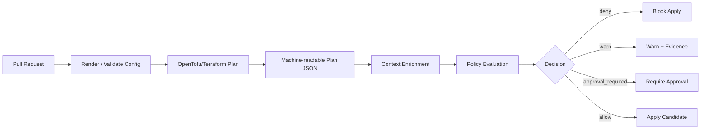
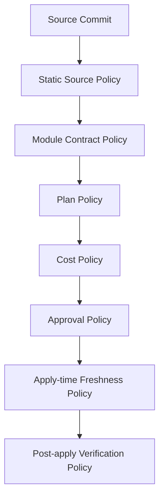
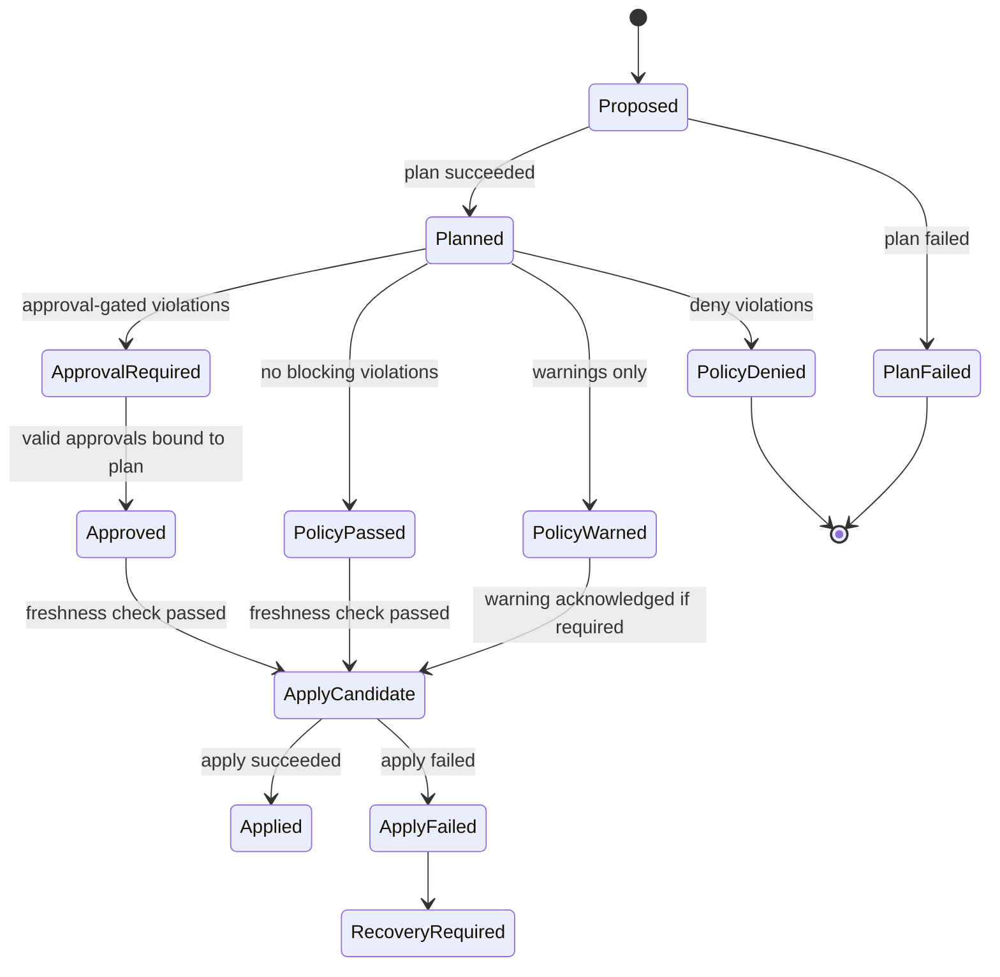
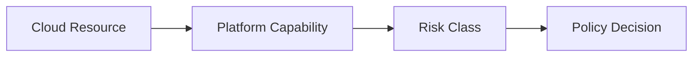
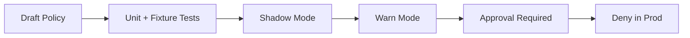
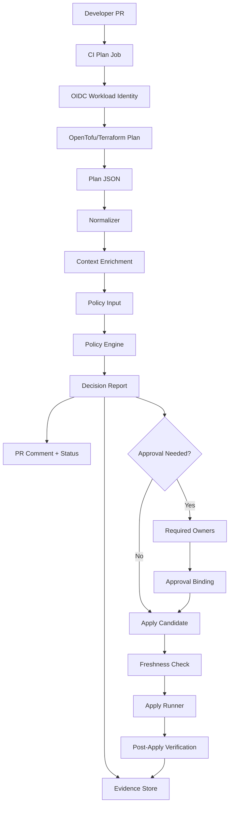

# Part 019 — IaC Policy Gates Before Apply

A policy gate before apply is the last programmable checkpoint before a desired infrastructure state becomes real infrastructure.

It is not a linter.

It is not a security team's wish list.

It is a **state transition firewall**.

```text
proposed infrastructure transition -> policy decision -> allowed / blocked / escalated
```

A strong IaC policy gate answers one question:

> Is this exact infrastructure transition allowed to execute, under this identity, from this repository, against this environment, at this time, with this approval evidence?

That wording matters.

A weak gate checks files.

A strong gate checks the proposed transition.

A weak gate says, "this HCL looks suspicious".

A strong gate says, "this plan will create an internet-facing database in production, using an unapproved region, without customer-data classification, and the change was not approved by the required data owner; deny apply."

This part designs that strong gate.

We will focus on Terraform/OpenTofu-style IaC because it is the dominant model for external infrastructure mutation. The same mental model applies to Pulumi, Crossplane compositions, cloud-native templates, and custom provisioning controllers.

---

## 1. The Gate Exists Because `plan` Is a Promise, Not a Guarantee

A plan is a proposed execution graph.

It is not production safety by itself.

A plan can say:

- create this resource,
- update that resource,
- delete these objects,
- replace this database,
- modify this IAM role,
- open this security group,
- change this retention policy,
- move this workload to a different region.

The plan is information.

Policy turns information into a decision.



The policy gate should never rely only on a human reading a textual plan.

Human review is still valuable, but it is not enough.

Text plans are optimized for humans. Policy gates need structured data.

OpenTofu supports machine-readable JSON output for plans, and `tofu show -json <FILE>` can produce a JSON representation of a plan file's changes. Terraform has the same general operating pattern. That JSON representation is the safest input shape for automated policy evaluation because it reflects the planned resource changes rather than only the source configuration.

---

## 2. The Policy Gate Has Five Inputs

A production gate needs more than the plan.

It needs five classes of facts.

```text
policy_decision = f(plan, config, state_context, change_context, organization_data)
```

| Input | Example | Why It Matters |
|---|---|---|
| Plan | resource actions, before/after values, replace/delete/create | Tells what will actually change |
| Config | module source, variables, provider config, metadata files | Tells design intent and declared ownership |
| State context | workspace, backend, environment, account, region, current drift | Tells what boundary is being mutated |
| Change context | PR actor, branch, approval, issue link, emergency flag | Tells who is requesting the transition and why |
| Organization data | service catalog, data classification, region allowlist, owner map | Tells what the organization allows |

A gate that only evaluates plan JSON is incomplete.

A gate that only evaluates source config is also incomplete.

A gate that does not know the environment cannot distinguish a safe dev experiment from an unacceptable production change.

Example:

```text
Create aws_security_group_rule ingress 0.0.0.0/0 tcp/443
```

This could be acceptable for a public API load balancer.

It is unacceptable for a database security group.

The policy engine needs context.

---

## 3. A Policy Gate Is Not One Gate

In real systems, policy is a pipeline of gates.

Each gate sees a different representation of the change.



Do not collapse all policy into one step.

Different checks belong at different stages.

| Gate | Runs On | Catches | Cannot Reliably Catch |
|---|---|---|---|
| Static source policy | HCL/YAML/JSON files | banned module sources, missing metadata, unsafe patterns | provider-computed changes |
| Module contract policy | module call structure | interface misuse, version rules, missing tags | runtime drift |
| Plan policy | plan JSON | actual create/update/delete/replace actions | values unknown until apply |
| Cost policy | plan + pricing model | expensive resources, scaling spikes | exact future utilization |
| Approval policy | risk decision + PR metadata | missing owner/security approvals | technical correctness |
| Apply-time freshness policy | saved plan + latest base | stale approval, changed state | risks outside encoded policy |
| Post-apply verification | live state / cloud APIs | mutation failed, provider lied, defaults changed | preventing the first bad write |

The strongest pattern is layered:

```text
cheap checks early, authoritative checks late
```

Run static checks early because they are fast.

Run plan checks after a real plan because they are authoritative.

Run freshness checks immediately before apply because approvals can go stale.

Run post-apply verification because providers, controllers, cloud APIs, and eventual consistency can surprise you.

---

## 4. The Decision Contract

A policy engine should return a structured decision, not just exit code 1.

A binary pass/fail model is too crude for enterprise GitOps/IaC.

Recommended decision shape:

```json
{
  "decision": "approval_required",
  "severity": "high",
  "policy_id": "iac.network.public-ingress.production",
  "message": "Production ingress from 0.0.0.0/0 requires security approval.",
  "resource_address": "module.api.aws_security_group_rule.https_public",
  "environment": "prod",
  "required_approvers": ["security", "service-owner"],
  "evidence": {
    "plan_sha256": "...",
    "policy_bundle_version": "2026.07.03-1",
    "input_sha256": "..."
  }
}
```

At minimum, every policy result should include:

- `policy_id`,
- `severity`,
- `decision`,
- `resource_address`, when applicable,
- human-readable message,
- remediation hint,
- environment,
- evidence pointers,
- policy bundle version.

The exact schema is less important than consistency.

A decision that cannot be audited is not production-grade.

---

## 5. Severity Is Not the Same as Decision

Do not model policy as only `allow` or `deny`.

Severity and decision are different dimensions.

| Severity | Meaning | Typical Decision |
|---|---|---|
| Info | Useful metadata or improvement | allow |
| Warning | Risk exists but not blocking yet | warn |
| Medium | Violation needs owner awareness | approval_required or deny in prod |
| High | Material security/compliance risk | approval_required or deny |
| Critical | Unsafe transition | deny |

The same rule can produce different decisions depending on environment.

Example:

| Violation | Dev | Stage | Prod |
|---|---:|---:|---:|
| Missing non-critical tag | warn | warn | approval_required |
| Public S3 bucket | deny | deny | deny |
| Oversized instance | warn | approval_required | approval_required |
| IAM `*:*` permission | approval_required | deny | deny |
| Database replacement | approval_required | approval_required | deny unless migration window exists |

This is why policy needs context.

Without context, teams either block too much or too little.

---

## 6. The Pre-Apply Gate State Machine

A mature policy gate behaves like a state machine.



Important invariant:

```text
Approval is bound to the evaluated transition, not merely to the PR.
```

If the plan changes after approval, approval must be invalidated or revalidated.

Otherwise, someone can approve one transition and apply another.

---

## 7. Plan JSON as Policy Input

A plan JSON typically contains resource changes with action lists such as:

```text
["create"]
["update"]
["delete"]
["delete", "create"]  # replacement
["no-op"]
```

A policy gate should normalize this into a simpler intermediate representation.

Example normalized resource change:

```json
{
  "address": "module.db.aws_db_instance.main",
  "type": "aws_db_instance",
  "provider": "aws",
  "module": "module.db",
  "actions": ["delete", "create"],
  "change_kind": "replace",
  "before": {
    "engine": "postgres",
    "storage_encrypted": true
  },
  "after": {
    "engine": "postgres",
    "storage_encrypted": true
  },
  "environment": "prod",
  "account": "prod-core",
  "region": "ap-southeast-3",
  "data_classification": "restricted"
}
```

Why normalize?

Because raw plan JSON is too provider-shaped.

Policy authors need a stable domain-shaped view.

Recommended pipeline:

```text
raw plan JSON -> normalizer -> enriched policy input -> OPA/Kyverno/Sentinel/custom policy -> decision report
```

The normalizer is a platform component.

It should be versioned and tested like production code.

---

## 8. Minimal Rego Example: Deny Public Database Ingress

This example is intentionally small.

The real value is not the syntax.

The real value is the shape of reasoning.

```rego
package iac.network

import rego.v1

deny contains result if {
  rc := input.resource_changes[_]
  rc.type == "aws_security_group_rule"
  rc.change_kind in {"create", "update", "replace"}
  rc.after.type == "ingress"
  rc.after.cidr_blocks[_] == "0.0.0.0/0"
  lower(rc.tags.data_classification) in {"restricted", "confidential"}

  result := {
    "policy_id": "iac.network.no-public-ingress-to-sensitive-resource",
    "severity": "critical",
    "resource_address": rc.address,
    "message": sprintf("Public ingress is not allowed for sensitive resource %s", [rc.address]),
    "remediation": "Restrict ingress to approved CIDR ranges or attach the resource behind an approved public endpoint pattern."
  }
}
```

This is not sufficient for all AWS security groups.

For example, AWS has separate `aws_security_group` inline rules and standalone rule resources.

A production policy needs provider-specific adapters.

Do not pretend a simple rule covers every shape.

---

## 9. Policy Should Prefer Capabilities Over Resources

Bad policy:

```text
No aws_security_group_rule may use 0.0.0.0/0.
```

This blocks legitimate public HTTPS entrypoints.

Better policy:

```text
Only resources classified as approved public entrypoints may expose internet ingress.
```

The policy should ask:

- Is this a public entrypoint capability?
- Is it attached to an approved ingress tier?
- Is TLS terminated according to platform standard?
- Is WAF required?
- Is the backend private?
- Is the data classification compatible?
- Is ownership declared?

Resource-level policy is easy to write but often wrong.

Capability-level policy is harder but safer.



Examples:

| Capability | Allowed Public Exposure? | Extra Conditions |
|---|---:|---|
| Public API gateway | Yes | WAF, TLS, owner, logging, rate limit |
| Internal service load balancer | No | private subnet only |
| Database | No | private network, encryption, backups |
| Object storage static website | Sometimes | content classification, CDN, approval |
| Bastion / jump host | Rarely | security exception, time-bound access |

Top-tier teams encode platform capability semantics, not only raw provider names.

---

## 10. Policy Categories Before Apply

A good IaC policy suite usually covers at least these categories.

### 10.1 Ownership and Metadata

Rules:

- every stack has owner,
- every resource has cost center or inherited cost center,
- every production service has on-call escalation,
- every data resource has classification,
- every exception has expiry.

Why this matters:

```text
unowned infrastructure = future incident with no accountable resolver
```

Example checks:

- `tags.owner` exists,
- owner exists in service catalog,
- service tier is valid,
- production stack has support group,
- repo path maps to declared ownership.

### 10.2 Region and Residency

Rules:

- production resources only in approved regions,
- restricted data only in allowed jurisdictions,
- multi-region deployment must declare replication model,
- failover region must satisfy same classification rules.

Bad region policy only checks provider region.

Good region policy checks:

- provider region,
- resource region,
- replication target,
- backup region,
- log export destination,
- third-party managed service region.

### 10.3 Network Exposure

Rules:

- no public database ingress,
- no unrestricted administrative ports,
- public ingress only via approved ingress patterns,
- private workloads stay in private subnets,
- egress to internet requires explicit classification.

High-signal checks:

- `0.0.0.0/0` and `::/0`,
- ports `22`, `3389`, database ports,
- public IP assignment,
- public load balancer scheme,
- open firewall rule without owner,
- internet gateway route on sensitive subnet.

### 10.4 IAM and Authorization

Rules:

- no wildcard admin permission in production,
- no long-lived access keys unless exception exists,
- no cross-account trust without external ID or approved principal,
- no role assumption from unapproved identity provider,
- no privilege escalation primitives.

IAM policy is difficult because semantics are provider-specific and sometimes subtle.

Avoid only string scanning.

You need structured IAM analysis.

At minimum, classify:

- wildcard action,
- wildcard resource,
- `iam:PassRole`,
- policy attachment to broad principal,
- trust relationship expansion,
- permission boundary removal,
- service-linked role mutation,
- key management permission change.

### 10.5 Encryption and Key Management

Rules:

- sensitive storage must be encrypted,
- production encryption must use approved customer-managed keys when required,
- key rotation must be enabled where applicable,
- broad KMS decrypt is denied,
- deletion of encryption keys is gated.

Check both resource and key policy.

An encrypted database with an unsafe key policy is still unsafe.

### 10.6 Logging, Audit, and Retention

Rules:

- production entrypoints must emit access logs,
- audit logs must be immutable or protected,
- retention must meet service classification,
- restricted data logs must not go to unapproved sinks,
- disabling logging is high-risk.

A strong policy detects deletion or reduction of logging, not just missing logging on create.

```text
retention_days: 365 -> 7 is a risky update
```

### 10.7 Backup and Recovery

Rules:

- production stateful resources require backup,
- backup retention matches recovery objective,
- point-in-time recovery is required for critical databases,
- deleting backup policies requires approval,
- cross-region backup must respect residency constraints.

Do not only check that backup exists.

Check if the proposed transition reduces recoverability.

### 10.8 Destructive Changes

Rules:

- production delete/replace is gated,
- stateful replacement requires migration plan,
- irreversible deletion is denied unless break-glass,
- deletion of final snapshot protection is denied,
- retention reduction requires owner approval.

Destructive changes are not only `delete`.

Examples:

- shrinking disk,
- changing database engine version,
- replacing subnet,
- deleting IAM role used by workloads,
- reducing replica count below policy threshold,
- disabling deletion protection.

### 10.9 Cost and Capacity

Rules:

- resource class above threshold requires approval,
- large autoscaling max requires cost owner approval,
- expensive managed service tiers require budget tag,
- non-prod environments require TTL or schedule,
- large egress or NAT topology requires review.

Cost policy should not become arbitrary bureaucracy.

Use thresholds and owner-visible trade-offs.

### 10.10 Supply Chain

Rules:

- module source must be approved,
- module version must be pinned,
- provider version must be constrained,
- lockfile must be updated through controlled process,
- remote module source must not point to unreviewed branch.

Supply-chain IaC policy prevents someone from smuggling infrastructure behavior through an unpinned module update.

---

## 11. The Difference Between `deny`, `approval_required`, and `warn`

A common mistake is making everything a deny.

That trains teams to bypass the platform.

Use three broad responses.

### 11.1 Deny

Use deny when the transition is never acceptable in that context.

Examples:

- public database ingress in production,
- unencrypted restricted-data storage,
- provider credentials committed to repo,
- deleting the production audit log bucket,
- using unapproved region for regulated data.

### 11.2 Approval Required

Use approval when the transition might be valid but requires accountable review.

Examples:

- increasing production database instance size above budget threshold,
- creating public ingress for a new public API,
- replacing a production cache cluster during maintenance window,
- expanding cross-account IAM trust to a new account.

### 11.3 Warn

Use warning when the rule is advisory, transitional, or low risk.

Examples:

- missing optional tag in dev,
- module version is one minor version behind,
- non-prod resource lacks TTL during early rollout,
- deprecated variable still used.

Warnings must have owners.

A warning that nobody watches is noise.

---

## 12. Approval Binding

Approval must be bound to the actual policy findings.

Bad model:

```text
PR has approval -> apply allowed
```

Good model:

```text
plan digest + policy digest + risk decision + required approvers + approval timestamp -> apply allowed
```

Recommended evidence fields:

```yaml
approval_binding:
  pr: 1842
  commit: 9bc1a1e
  plan_sha256: 4c51...
  policy_bundle_sha256: d7aa...
  policy_decision_sha256: 891b...
  required_approver_groups:
    - service-owner
    - security
  approvals:
    - actor: alice
      group: service-owner
      time: 2026-07-03T10:22:12Z
    - actor: bob
      group: security
      time: 2026-07-03T10:37:01Z
  expires_at: 2026-07-03T14:37:01Z
```

Invalidate approval when:

- commit changes,
- plan changes,
- policy bundle changes materially,
- target environment changes,
- risk severity increases,
- required approver mapping changes,
- approval expires.

This prevents approval laundering.

---

## 13. Exception Design

Policy exceptions are inevitable.

Unstructured exceptions destroy governance.

A production exception must be:

- explicit,
- scoped,
- justified,
- approved,
- time-bound,
- visible,
- automatically expired.

Example exception file:

```yaml
apiVersion: platform.example.com/v1
kind: PolicyException
metadata:
  name: allow-temporary-public-ingress-for-migration
spec:
  policyId: iac.network.no-public-ingress-to-sensitive-resource
  scope:
    repo: infra-live
    environment: prod
    resourceAddress: module.partner_migration.aws_security_group_rule.temporary_https
  reason: "Partner migration requires temporary allowlist while private connectivity is provisioned."
  approvedBy:
    - security
    - service-owner
  expiresAt: "2026-07-10T00:00:00Z"
  ticket: "SEC-4921"
```

A bad exception says:

```yaml
ignore: true
```

A good exception says:

```text
ignore exactly this policy, for exactly this resource, in exactly this environment, until exactly this date, because of exactly this approved reason
```

If exceptions do not expire, they become hidden policy rewrites.

---

## 14. Context Enrichment

Policy needs data.

Do not hardcode everything in Rego or Sentinel.

Use external data sources such as:

- service catalog,
- team ownership registry,
- approved region list,
- data classification registry,
- account metadata,
- cloud organization metadata,
- cost center map,
- public endpoint registry,
- exception registry,
- maintenance window calendar.

Example enriched input:

```json
{
  "change": {
    "repo": "infra-live",
    "pr": 1842,
    "actor": "jdoe",
    "branch": "feature/add-reporting-db",
    "commit": "9bc1a1e"
  },
  "target": {
    "environment": "prod",
    "account": "regulated-prod-001",
    "region": "ap-southeast-3",
    "data_classification": "restricted"
  },
  "catalog": {
    "service": "reporting",
    "owner": "data-platform",
    "tier": "critical",
    "public_endpoint_allowed": false
  },
  "resource_changes": []
}
```

Treat enrichment as part of the policy input contract.

Version it.

Test it.

Audit it.

---

## 15. Policy Bundle Versioning

Policy changes can block production.

They need release discipline.

Recommended policy repo structure:

```text
policy/
  bundles/
    iac/
      network/
      iam/
      data/
      cost/
      ownership/
  data/
    regions.yaml
    service-tiers.yaml
    approved-modules.yaml
  tests/
    fixtures/
      plans/
      contexts/
    iac_network_test.rego
  docs/
    policy-catalog.md
```

Version policy bundles with immutable identifiers.

```text
policy_bundle = iac-policy-2026.07.03-1
```

Every decision should record the policy bundle version.

When a production apply is blocked, the platform team must know which policy version produced the decision.

---

## 16. Testing Policy Like Code

Policy without tests becomes folklore.

Test at four levels.

### 16.1 Unit Tests

Given small input, assert decision.

```rego
package iac.network_test

import data.iac.network

test_denies_public_sensitive_ingress if {
  input := {
    "resource_changes": [{
      "address": "aws_security_group_rule.db",
      "type": "aws_security_group_rule",
      "change_kind": "create",
      "after": {
        "type": "ingress",
        "cidr_blocks": ["0.0.0.0/0"]
      },
      "tags": {
        "data_classification": "restricted"
      }
    }]
  }

  count(network.deny) == 1 with input as input
}
```

### 16.2 Fixture Tests

Use real historical plan JSON with sensitive values redacted.

Fixtures catch provider shape changes.

### 16.3 Regression Tests

Every production incident should create a policy regression fixture.

```text
incident -> policy fixture -> test -> future prevention
```

### 16.4 Shadow Tests

Run new policy in non-blocking mode across real plans before enforcing.

This prevents surprise outages caused by overbroad rules.

---

## 17. Policy Rollout Strategy

Do not deploy a new blocking policy directly to all production stacks.

Use staged rollout.



Recommended phases:

| Phase | Behavior | Purpose |
|---|---|---|
| Draft | tests only | policy correctness |
| Shadow | evaluate silently | measure blast radius |
| Warn | PR comment only | educate teams |
| Approval required | human gate | transition period |
| Deny | hard block | enforce invariant |

Promotion criteria:

- false positives below threshold,
- remediation docs exist,
- owners notified,
- exception path exists,
- policy metrics visible,
- rollback plan ready.

Policy rollout is a change-management problem.

Treat it like production software rollout.

---

## 18. Applying Policy to Saved Plans

For high-risk environments, prefer:

```text
tofu plan -out=tfplan
tofu show -json tfplan > tfplan.json
policy evaluate tfplan.json
approval bind to tfplan digest
tofu apply tfplan
```

This ensures that the applied transition is the evaluated transition.

But saved plans have trade-offs:

- plan may go stale,
- secrets may be embedded in artifacts depending on provider and values,
- storage must be protected,
- artifact retention must be controlled,
- plan files may not be portable across provider/plugin changes.

If your platform uses apply-time re-plan instead of saved plan apply, then the pipeline must re-run policy immediately before apply and bind approval to the new plan.

Do not evaluate one plan and apply another.

That is the core invariant.

---

## 19. Destroy and Replace Governance

Destroy operations deserve separate treatment.

A delete is not just another action.

A replacement is often a delete plus create.

```text
["delete", "create"] == replacement == possible outage/data loss
```

Recommended destructive-change classifier:

| Change | Risk |
|---|---|
| Delete stateless dev resource | low |
| Delete non-prod ephemeral resource | low/medium |
| Replace production compute node group | medium/high |
| Replace production load balancer | high |
| Replace production database | critical |
| Delete KMS key | critical |
| Delete audit log bucket | critical |
| Disable backup / retention | critical |

Gate destructive changes with:

- resource criticality,
- environment,
- data classification,
- deletion protection state,
- backup status,
- migration ticket,
- maintenance window,
- owner approval,
- SRE approval,
- rollback/restore evidence.

Example decision:

```json
{
  "decision": "deny",
  "policy_id": "iac.destructive.no-prod-db-replace-without-migration-plan",
  "severity": "critical",
  "resource_address": "module.orders.aws_db_instance.primary",
  "message": "Production database replacement requires an approved migration plan and maintenance window."
}
```

---

## 20. IAM Policy Gate Details

IAM is where naive policy fails fastest.

Bad check:

```text
Deny if action contains "*".
```

This is useful but insufficient.

A better IAM gate classifies risk primitives.

| Primitive | Why Risky |
|---|---|
| `*:*` | full administrative power |
| `iam:PassRole` | can enable privilege escalation |
| `iam:CreatePolicyVersion` | can alter permissions |
| `sts:AssumeRole` broad trust | cross-principal escalation |
| wildcard principal in trust policy | unauthorized role assumption |
| removing permissions boundary | privilege expansion |
| KMS decrypt wildcard | data exposure |
| secrets read wildcard | credential exposure |

A production IAM policy engine should parse policy documents structurally.

It should understand:

- `Action`, `NotAction`,
- `Resource`, `NotResource`,
- `Principal`, `NotPrincipal`,
- `Condition`,
- trust policy vs permission policy,
- attachment target,
- managed policy reuse,
- permission boundary.

Do not rely only on string matching.

---

## 21. Cost Policy Details

Cost policy should protect owners from accidental spend without blocking justified scale.

Useful patterns:

### 21.1 Cost Delta Gate

```text
estimated_monthly_delta > threshold -> approval_required
```

### 21.2 Expensive Class Gate

```text
resource instance class in expensive_classes and env != prod -> approval_required
```

### 21.3 Non-Prod TTL Gate

```text
non-prod resource has no ttl tag -> warn or approval_required
```

### 21.4 Autoscaling Max Gate

```text
max_capacity > approved_capacity -> approval_required
```

### 21.5 Egress Risk Gate

```text
new NAT gateway / cross-region replication / CDN egress path -> cost owner approval
```

The goal is not to make every cost a security incident.

The goal is to surface expensive decisions before they silently become monthly bills.

---

## 22. Policy UX in Pull Requests

Policy output must be readable.

Bad PR comment:

```text
Policy failed.
```

Good PR comment:

```md
## IaC Policy Result: Approval Required

Target: prod / account regulated-prod-001 / ap-southeast-3
Plan: 17 create, 4 update, 1 replace, 0 delete
Policy bundle: iac-policy-2026.07.03-1

### High Risk Findings

1. `module.db.aws_db_instance.primary`
   - Policy: `iac.destructive.no-prod-db-replace-without-migration-plan`
   - Decision: `approval_required`
   - Reason: Production database replacement requires migration approval.
   - Required approvers: `service-owner`, `sre`
   - Remediation: Attach approved migration ticket with maintenance window.

### Warnings

1. `module.api.aws_lb.main`
   - Missing optional tag: `runbook_url`
```

Make it easy for the engineer to fix the issue.

A policy comment should be a remediation interface, not a wall of shame.

---

## 23. Evidence Model

Every gate run should produce evidence.

Evidence artifacts:

- raw plan JSON,
- normalized policy input,
- policy decision report,
- policy bundle digest,
- tool versions,
- actor identity,
- target environment,
- approval binding,
- exception references,
- apply result,
- post-apply verification result.

Store evidence in immutable or tamper-resistant storage when compliance matters.

At minimum, store enough to answer:

```text
Who requested what change?
Who approved it?
Which policy version evaluated it?
What was the plan digest?
What was applied?
What changed afterward?
```

Compliance is not a screenshot of a green check.

Compliance is reconstructability.

---

## 24. Performance and Scale

Policy gates can become slow.

Common causes:

- large plan JSON,
- too many resource changes,
- expensive Rego logic,
- repeated external data loading,
- unbounded loops,
- policy engine cold start,
- remote service calls inside evaluation.

Rules for scale:

1. Preload data.
2. Avoid network calls inside policy evaluation.
3. Normalize input once.
4. Evaluate only changed resources when possible.
5. Cache policy bundles.
6. Put expensive semantic analysis behind clear thresholds.
7. Emit timing metrics per policy.

Policy evaluation should be deterministic.

If it depends on live network calls, failures become confusing.

Prefer:

```text
fetch data before evaluation -> include data in input -> evaluate pure policy function
```

---

## 25. Handling Unknown Values

Plans often contain values known only after apply.

A policy engine must handle unknowns explicitly.

Bad behavior:

```text
unknown == safe
```

Better behavior:

```text
unknown safety-critical value -> approval_required or deny depending on context
```

Examples:

| Unknown | Decision |
|---|---|
| generated resource ID | usually allow |
| public IP association | approval_required in prod |
| encryption key ARN | approval_required if sensitive storage |
| IAM trust principal | deny or approval_required |
| database endpoint | usually allow |

Policy should classify unknown values by risk.

If the platform cannot prove safety, it should not silently assume safety for critical controls.

---

## 26. Drift-Aware Policy

Policy gates evaluate proposed changes.

Drift means the actual infrastructure may already differ from state or code.

Two cases matter.

### 26.1 Plan Includes Drift Correction

The plan may show changes caused by drift.

Policy should classify whether it is:

- restoring desired state,
- accepting drift into desired state,
- worsening drift,
- deleting manually created resources.

### 26.2 Policy Itself Detects Drift Risk

Example:

```text
production bucket currently has public access block disabled outside code
```

The next plan may not fix it if the property is not managed.

This belongs to detective policy and drift scanning, not only pre-apply policy.

Pre-apply gates are necessary but not sufficient.

---

## 27. Failure Modes

### 27.1 False Positive Blocks Production

Symptoms:

- urgent fix blocked by policy,
- policy author unavailable,
- exception process unclear.

Countermeasures:

- dry-run phase before deny,
- break-glass path,
- policy owner rotation,
- fast exception review,
- policy rollback.

### 27.2 False Negative Allows Unsafe Change

Symptoms:

- incident occurs despite policy pass,
- policy did not cover provider shape,
- context enrichment missing.

Countermeasures:

- incident-to-policy regression tests,
- fixture from real plan,
- provider schema coverage,
- defense in depth with admission/runtime controls.

### 27.3 Policy Data Stale

Symptoms:

- owner changed but policy uses old owner,
- approved region list outdated,
- cost center deactivated.

Countermeasures:

- data freshness checks,
- source-of-truth integration,
- versioned data bundles,
- stale-data deny for high-risk gates.

### 27.4 Plan Evaluated, Different Plan Applied

Symptoms:

- approval did not match final change,
- commit changed after approval,
- re-plan occurred silently.

Countermeasures:

- bind approval to plan digest,
- revalidate before apply,
- use saved plan apply for high-risk stacks,
- invalidate approvals on commit change.

### 27.5 Policy Engine Outage

Symptoms:

- no plans can be evaluated,
- production changes blocked.

Countermeasures:

- local policy bundle execution,
- fail-closed for high risk,
- fail-open only for low-risk dev with audit,
- break-glass procedure,
- policy engine SLO.

---

## 28. Integration Patterns

### 28.1 CI-Native Gate

The CI pipeline runs:

```text
init -> validate -> plan -> show json -> normalize -> policy evaluate -> comment -> status check
```

Good for:

- GitHub Actions,
- GitLab CI,
- Jenkins,
- Buildkite,
- self-hosted pipelines.

Risk:

- runner credentials,
- fork PR exposure,
- artifact leakage,
- status check spoofing if not protected.

### 28.2 Atlantis-Style Gate

Atlantis or similar tool handles PR commands and locks.

Policy runs after plan and before apply.

Good for:

- PR-driven infra teams,
- plan/apply comment workflow,
- stack-specific locking.

Risk:

- command authorization,
- server credential boundary,
- project detection correctness.

### 28.3 Managed Runner Gate

HCP Terraform, Spacelift, Scalr, env0-like platforms provide policy hooks.

Good for:

- centralized execution,
- evidence,
- remote state,
- policy integration.

Risk:

- vendor-specific workflow,
- data residency,
- policy portability,
- runner networking.

### 28.4 Custom Platform Gate

A custom platform service handles:

- plan queue,
- policy evaluation,
- approval binding,
- apply orchestration,
- evidence storage.

Good for:

- high-regulation orgs,
- multi-cloud platform teams,
- complex approval rules.

Risk:

- building a product, not a script,
- on-call responsibility,
- upgrade burden.

---

## 29. Example Pipeline Pseudocode

```yaml
name: iac-plan-policy

on:
  pull_request:
    paths:
      - "infra/**"
      - "modules/**"
      - "policy/**"

jobs:
  plan-policy:
    permissions:
      id-token: write
      contents: read
      pull-requests: write
    steps:
      - checkout
      - authenticate-with-oidc
      - detect-affected-stacks
      - for-each-stack:
          - tofu init
          - tofu validate
          - tofu plan -out=tfplan
          - tofu show -json tfplan > tfplan.json
          - normalize-plan tfplan.json --context context.yaml > policy-input.json
          - opa eval --bundle policy-bundle.tar.gz --input policy-input.json data.iac.decision
          - upload-artifacts:
              - tfplan.json
              - policy-input.json
              - policy-result.json
          - comment-pr-with-policy-summary
          - set-required-status-check
```

This is not meant to be copied blindly.

It shows the control flow.

The important parts are:

- use short-lived identity,
- evaluate actual plan,
- enrich context,
- store evidence,
- publish decision,
- prevent apply if decision is not satisfied.

---

## 30. Reference Architecture



The key separation:

- CI produces evidence,
- policy produces decision,
- approval satisfies decision,
- apply executes only a fresh approved transition.

---

## 31. Anti-Patterns

### 31.1 Policy Only in Documentation

If it is not executable, it is advice.

Advice does not stop bad transitions.

### 31.2 Policy Only After Apply

Post-apply scanning is useful, but it is late.

The safest bad infrastructure is the infrastructure never created.

### 31.3 Unscoped Exceptions

Global ignores create hidden governance holes.

### 31.4 Deny Everything New

Overbroad blocking creates shadow infrastructure.

### 31.5 No Owner for Policy

Every policy must have an owner.

Otherwise nobody fixes false positives.

### 31.6 Policy Without Tests

Untested policy is production code without tests.

### 31.7 Policy Without Evidence

If you cannot reconstruct the decision, you cannot defend it.

### 31.8 Evaluating One Plan and Applying Another

This breaks the core safety invariant.

---

## 32. Implementation Checklist

Use this checklist before enabling deny mode for production.

```text
[ ] Plan JSON is generated from saved plan or immediate pre-apply plan.
[ ] Policy input includes environment, account, region, repo, actor, commit, and service owner.
[ ] Resource changes are normalized into stable platform schema.
[ ] Policies have stable IDs and owners.
[ ] Policy decisions include severity, decision, message, remediation, and evidence.
[ ] Approval requirements are derived from policy result, not static PR rules only.
[ ] Approval is bound to plan digest and policy bundle digest.
[ ] Exceptions are scoped, time-bound, and audited.
[ ] Policy bundle is versioned.
[ ] Policy tests include unit, fixture, regression, and shadow coverage.
[ ] Destructive changes are separately classified.
[ ] Unknown values are handled explicitly.
[ ] Evidence artifacts are stored securely.
[ ] Apply job verifies freshness before mutation.
[ ] Break-glass path exists and is audited.
[ ] Policy metrics are observable.
```

---

## 33. Exercises

### Exercise 1 — Build a Policy Input Contract

Create a JSON schema for your normalized policy input.

Include:

- repo,
- PR,
- actor,
- commit,
- environment,
- account,
- region,
- service owner,
- data classification,
- resource changes,
- exceptions,
- approvals.

The goal is not perfect schema design.

The goal is to make policy facts explicit.

### Exercise 2 — Write Three High-Signal Policies

Implement policies for:

1. no public database ingress,
2. no production database replacement without approval,
3. no wildcard admin IAM policy in production.

For each policy, define:

- policy ID,
- severity,
- decision by environment,
- remediation,
- required approvers,
- exception scope.

### Exercise 3 — Approval Binding Simulation

Simulate:

1. PR opened,
2. plan generated,
3. policy requires security approval,
4. approval given,
5. commit changes,
6. plan changes.

Expected result:

```text
approval invalidated
```

### Exercise 4 — Policy Rollout

Take one future deny policy and design rollout phases:

- shadow,
- warn,
- approval required,
- deny.

Define metrics that decide when to advance.

---

## 34. Mental Model Summary

A pre-apply IaC policy gate is not a checkbox.

It is a programmable control layer over infrastructure state transitions.

The strongest form has these properties:

- evaluates actual planned changes,
- uses enriched organizational context,
- returns structured decisions,
- separates severity from decision,
- binds approvals to plan and policy digest,
- treats destructive changes separately,
- handles exceptions explicitly,
- emits evidence,
- is tested and versioned,
- is rechecked before apply.

The core invariant:

```text
Only an evaluated, fresh, authorized, policy-compliant transition may mutate real infrastructure.
```

If you internalize that sentence, you understand the purpose of IaC policy gates.

---

## References

- OpenTofu CLI `plan` command and JSON flag: https://opentofu.org/docs/cli/commands/plan/
- OpenTofu JSON output format: https://opentofu.org/docs/internals/json-format/
- Open Policy Agent documentation: https://www.openpolicyagent.org/docs/
- Conftest documentation: https://www.conftest.dev/
- OPA Terraform ecosystem: https://www.openpolicyagent.org/ecosystem/by-feature/terraform/
