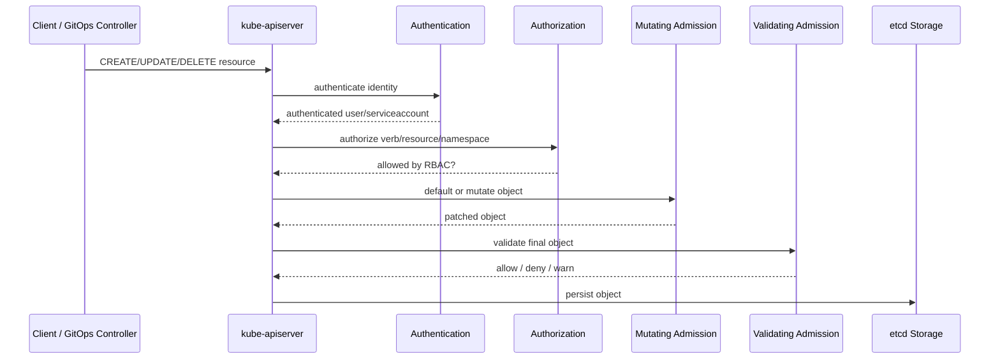
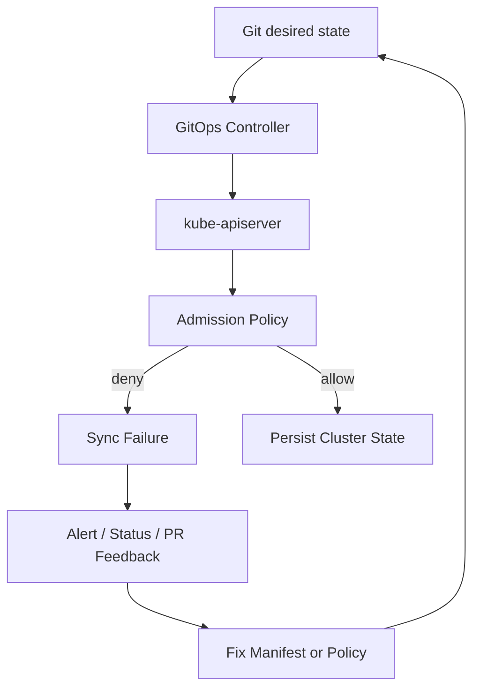
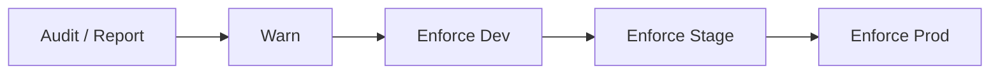
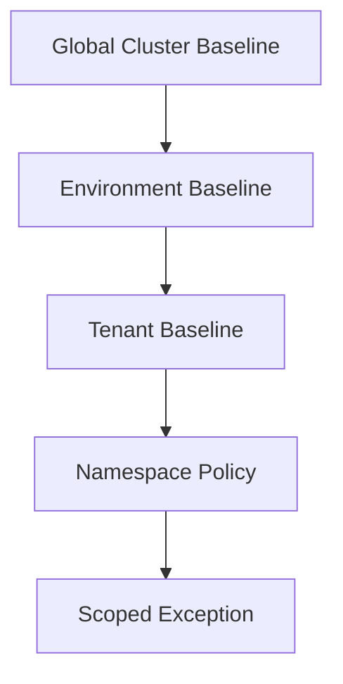
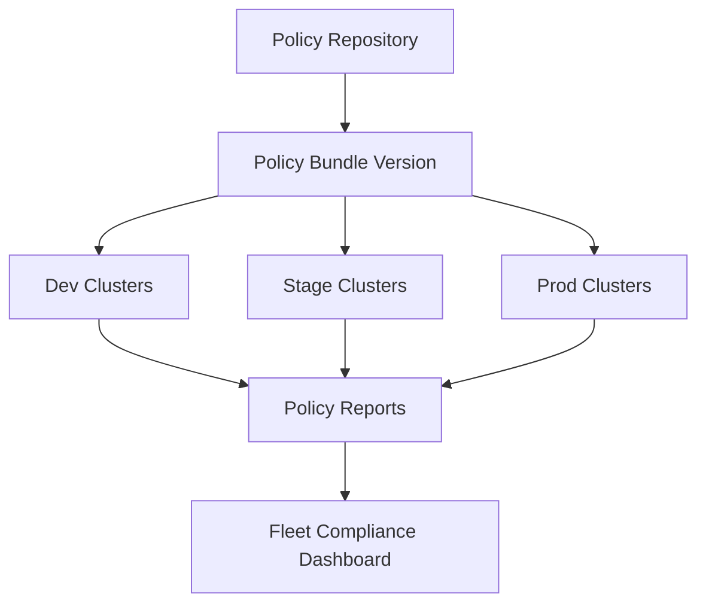

# Part 020 — Kubernetes Admission Policy in GitOps

GitOps makes Git the desired-state interface.

Kubernetes admission control decides whether an API request is allowed to become cluster state.

These are related, but not the same.

```text
GitOps controls what should be submitted.
Admission controls what may be persisted.
```

That distinction matters.

If you only enforce policy in Git, a user or controller with direct cluster access may bypass the rule.

If you only enforce policy at admission, engineers discover violations too late, after the GitOps controller tries to sync and fails.

A mature platform uses both:

```text
pre-merge policy for fast feedback
runtime admission policy for hard enforcement
```

This part explains how to design Kubernetes admission policy as part of a state-of-the-art GitOps/IaC pipeline.

---

## 1. Admission Control Mental Model

Kubernetes API writes pass through several control points.

Simplified path:



RBAC answers:

```text
Can this subject perform this verb on this resource?
```

Admission answers:

```text
Is this object/request acceptable?
```

RBAC can say a service account may create Pods.

Admission can still reject a Pod that runs privileged, uses an unsigned image, lacks resource limits, mounts the host filesystem, or violates namespace policy.

---

## 2. Why GitOps Needs Admission Policy

A GitOps controller is a powerful client.

It often has permission to create many Kubernetes objects.

That means GitOps shifts the security problem:

```text
Who can merge to Git? -> What can the GitOps controller create?
```

Admission policy protects the cluster even when:

- a bad manifest reaches Git,
- a controller renders unexpected output,
- Helm/Kustomize defaults produce unsafe objects,
- a privileged human applies YAML manually,
- a compromised CI job submits objects,
- a namespace owner misconfigures workloads,
- a policy was missing in pre-merge checks.

The cluster must defend itself.

GitOps is not a reason to weaken runtime enforcement.

It is a reason to make runtime enforcement observable and developer-friendly.

---

## 3. Pre-Merge Policy vs Admission Policy

Use both.

| Dimension | Pre-Merge Policy | Admission Policy |
|---|---|---|
| Runs before merge | Yes | No |
| Sees rendered manifests | Usually yes if pipeline renders | Sometimes no; sees API request |
| Blocks direct cluster mutation | No | Yes |
| Gives early developer feedback | Yes | Late unless surfaced in PR |
| Protects actual cluster state | Indirectly | Directly |
| Can use repo metadata | Yes | Only if injected/available |
| Can see live namespace labels | Only if queried | Yes, depending on policy engine/data |

Recommended pattern:

```text
same rule intent, two enforcement points
```

Example:

- PR policy checks rendered manifests for missing resource limits.
- Admission policy denies Pods without resource limits.

Do not assume one replaces the other.

---

## 4. Admission Policy Tooling Landscape

There are four major patterns.

### 4.1 Built-In Admission Controllers

Kubernetes ships built-in admission controllers compiled into the API server. Cluster administrators configure them at the API server level.

Examples include admission mechanisms for namespace lifecycle, resource quota, service account behavior, pod security admission, and others depending on Kubernetes version and cluster distribution.

Built-ins are important, but they are not enough for organization-specific governance.

### 4.2 ValidatingAdmissionPolicy

`ValidatingAdmissionPolicy` is a Kubernetes-native policy mechanism based on CEL expressions. As of Kubernetes v1.30, it is stable.

It accepts or rejects objects without changing them.

It is useful for simpler validation policies where an in-process, webhook-free model is preferred.

Good fit:

- simple object validation,
- parameterized rules,
- reduced webhook operational overhead,
- rules that can be expressed clearly in CEL.

Not ideal for:

- complex cross-resource policy,
- mutation,
- generation,
- image verification workflows,
- rich reporting/exceptions beyond native capability.

### 4.3 Kyverno

Kyverno is a Kubernetes-native policy engine. It can validate, mutate, generate, clean up resources, verify image signatures, and run background scans.

It uses Kubernetes-style YAML policies, which often makes it approachable for platform teams that want policy definitions to feel like Kubernetes resources.

Good fit:

- Kubernetes-native authoring,
- validate/mutate/generate workflows,
- image verification,
- namespace defaults,
- policy reports,
- platform teams that prefer YAML over Rego.

### 4.4 OPA Gatekeeper

Gatekeeper integrates Open Policy Agent with Kubernetes admission. It uses ConstraintTemplates and Constraints to enforce policies.

Good fit:

- Rego-based policy reuse,
- complex validation logic,
- organization already using OPA elsewhere,
- strong separation between policy template and constraint parameters,
- audit of existing resources.

### 4.5 Custom Admission Webhooks

A custom webhook is sometimes justified.

Use it when:

- policy requires complex domain logic,
- policy depends on internal systems,
- mutation is highly specific,
- performance and failure behavior are understood,
- the platform team accepts on-call ownership.

Do not build a custom webhook because you do not want to learn existing tools.

Custom admission webhooks become production control-plane components.

---

## 5. Decision Framework: Which Policy Mechanism?

| Need | Prefer |
|---|---|
| Simple validation, no webhook dependency | ValidatingAdmissionPolicy |
| Kubernetes-native YAML policy, mutate/generate/verify images | Kyverno |
| Rego policy reuse and complex validation | OPA Gatekeeper |
| Highly custom business logic | Custom webhook |
| Pod baseline security | Pod Security Admission plus policy engine |
| Pre-merge config tests | Conftest/Kyverno CLI/kubeconform/custom render checks |

The wrong question:

```text
Which tool is best?
```

The better question:

```text
Which enforcement model matches this rule's complexity, operational risk, authoring model, and evidence requirements?
```

---

## 6. Admission Policy as a State Transition Guard

Admission policy does not validate YAML files.

It validates API requests.

Request dimensions:

- operation: `CREATE`, `UPDATE`, `DELETE`, `CONNECT`,
- resource kind,
- namespace,
- user/service account,
- object before update,
- object after update,
- admission context,
- namespace labels,
- external data depending on engine.

The same object may be acceptable on create but unacceptable on update.

Example:

```text
Creating a Deployment with 3 replicas is allowed.
Updating it to 0 replicas in production during business hours may require approval.
```

Admission policy must reason about transitions, not only final object shape.

---

## 7. The GitOps Admission Failure Loop

If admission denies a GitOps controller, the controller keeps trying until the desired state changes or policy changes.



This is good because the cluster is protected.

It is bad if the feedback loop is invisible.

A production GitOps platform must surface admission denial back to:

- PR status,
- deployment dashboard,
- service owner,
- platform alerts,
- policy owner.

A denial that only appears in a controller log is not enough.

---

## 8. Policy Classes for Kubernetes

### 8.1 Workload Security

Rules:

- no privileged containers,
- no host network unless exception,
- no hostPath mounts unless exception,
- no privilege escalation,
- must run as non-root where feasible,
- allowed capabilities only,
- read-only root filesystem for selected workloads.

Many of these overlap with Kubernetes Pod Security Standards. Use built-in Pod Security Admission where appropriate, then add organization-specific policy on top.

### 8.2 Resource Management

Rules:

- CPU/memory requests required,
- limits required or explicitly waived,
- namespace ResourceQuota exists,
- LimitRange exists,
- production HPA has sane min/max,
- no accidental 0 replicas for critical services.

### 8.3 Image and Supply Chain

Rules:

- image registry allowlist,
- no `latest` tag in production,
- image digest required for prod,
- image signature verification,
- SBOM/provenance attestation required for selected workloads,
- no untrusted base images.

### 8.4 Network and Exposure

Rules:

- public ingress requires approved class,
- Ingress host must match owned domain,
- TLS required,
- no NodePort in production unless exception,
- namespace must have default-deny NetworkPolicy,
- egress restrictions for sensitive namespaces.

### 8.5 Multi-Tenancy

Rules:

- namespace labels required,
- tenant cannot use another tenant's service account,
- tenant cannot create cluster-scoped resources,
- tenant cannot bind cluster-admin,
- workload identity mapping must match namespace ownership.

### 8.6 Operational Reliability

Rules:

- readiness probes required for production services,
- liveness probes required when appropriate,
- PodDisruptionBudget required for critical workloads,
- topology spread constraints for high-tier services,
- deployment strategy must avoid full outage.

### 8.7 Data and Secret Handling

Rules:

- no inline secret values in manifests,
- Secrets must be generated by approved mechanism,
- workloads consuming restricted secrets require namespace classification,
- secret volumes mounted read-only,
- no environment variables for selected high-risk secrets if policy requires volume-based delivery.

### 8.8 Ownership and Metadata

Rules:

- namespace has owner/team/tier labels,
- workload has service name,
- production workload has runbook URL,
- critical workload has on-call escalation,
- policy exceptions are tied to owner and expiry.

---

## 9. Mutate, Validate, Generate, Cleanup

Admission policy engines differ, but these concepts are common.

### 9.1 Validate

Reject or warn on invalid resources.

Example intent:

```text
Production Pods must not use latest image tag.
```

Validation is the safest first policy category.

### 9.2 Mutate

Modify the object before persistence.

Example intent:

```text
Add default labels or inject safe defaults.
```

Mutation is powerful but risky.

Rules for mutation:

- mutations must be idempotent,
- mutations should be predictable,
- do not hide important behavior from developers,
- validate final object after mutation,
- avoid dependency on webhook ordering.

### 9.3 Generate

Create related resources based on policy.

Example intent:

```text
When a namespace is created, generate default NetworkPolicy and ResourceQuota.
```

Generation is useful for platform defaults.

It is also a source of ownership confusion if not documented.

### 9.4 Cleanup

Remove resources that match policy-defined cleanup rules.

Example intent:

```text
Delete expired preview environment resources.
```

Cleanup needs strict guardrails.

Deleting production resources by policy is high risk.

---

## 10. Admission Policy Rollout

Never start with hard deny across all clusters.

Use progressive enforcement.



Recommended stages:

| Stage | Behavior | Purpose |
|---|---|---|
| Audit | record violations only | measure existing drift |
| Warn | allow but warn users | educate and test signal |
| Enforce dev | block in low-risk env | catch false positives |
| Enforce stage | block realistic workloads | validate rollout |
| Enforce prod | enforce invariant | protect production |

Promotion criteria:

- policy has tests,
- violation volume understood,
- remediation guide exists,
- exception process exists,
- owners notified,
- metrics visible,
- rollback path tested.

Admission policy is production software.

Roll it out like production software.

---

## 11. Namespace as Policy Boundary

Namespace is usually the most important Kubernetes policy boundary.

Do not treat it as just a folder.

A production namespace should carry metadata:

```yaml
apiVersion: v1
kind: Namespace
metadata:
  name: payments-prod
  labels:
    platform.example.com/team: payments
    platform.example.com/environment: prod
    platform.example.com/tier: critical
    platform.example.com/data-classification: restricted
    platform.example.com/tenant: payments
```

Admission policies can then use namespace labels to decide:

- which controls apply,
- which image registries are allowed,
- whether public ingress is allowed,
- whether restricted secrets can be mounted,
- which workload identity is valid,
- which resource quota class applies.

Without namespace metadata, policies become brittle.

---

## 12. Policy Inheritance

Teams need local autonomy, but platform invariants must hold.

Recommended model:

```text
global baseline -> environment baseline -> tenant baseline -> namespace exceptions
```



Examples:

| Layer | Example |
|---|---|
| Global | no privileged Pods |
| Environment | prod requires image signatures |
| Tenant | payments namespace requires restricted data controls |
| Namespace | payments-worker allows specific sidecar |
| Exception | temporary allow hostPath for migration tool until expiry |

The lower layer should not be able to weaken critical global invariants without explicit exception.

---

## 13. Kyverno Example: Require Resource Requests

Example intent:

```text
All production Pods must declare CPU and memory requests.
```

Illustrative Kyverno policy:

```yaml
apiVersion: kyverno.io/v1
kind: ClusterPolicy
metadata:
  name: require-prod-resource-requests
spec:
  validationFailureAction: Enforce
  background: true
  rules:
    - name: containers-must-have-requests
      match:
        any:
          - resources:
              kinds:
                - Pod
              namespaceSelector:
                matchLabels:
                  platform.example.com/environment: prod
      validate:
        message: "Production containers must define CPU and memory requests."
        pattern:
          spec:
            containers:
              - resources:
                  requests:
                    cpu: "?*"
                    memory: "?*"
```

This is intentionally simple.

A real policy must also consider:

- init containers,
- ephemeral containers,
- generated Pods from controllers,
- namespace exemptions,
- sidecar injection,
- rollout mode.

Policy examples are starting points, not complete governance.

---

## 14. Gatekeeper Example: Required Labels

Gatekeeper separates policy logic from parameterized constraints.

A ConstraintTemplate defines a reusable policy shape.

A Constraint applies it with parameters.

Conceptual shape:

```yaml
apiVersion: templates.gatekeeper.sh/v1
kind: ConstraintTemplate
metadata:
  name: k8srequiredlabels
spec:
  crd:
    spec:
      names:
        kind: K8sRequiredLabels
      validation:
        openAPIV3Schema:
          type: object
          properties:
            labels:
              type: array
              items:
                type: string
  targets:
    - target: admission.k8s.gatekeeper.sh
      rego: |
        package k8srequiredlabels

        violation[{"msg": msg}] {
          required := input.parameters.labels[_]
          not input.review.object.metadata.labels[required]
          msg := sprintf("missing required label: %v", [required])
        }
```

Then apply a constraint:

```yaml
apiVersion: constraints.gatekeeper.sh/v1beta1
kind: K8sRequiredLabels
metadata:
  name: namespace-required-labels
spec:
  match:
    kinds:
      - apiGroups: [""]
        kinds: ["Namespace"]
  parameters:
    labels:
      - platform.example.com/team
      - platform.example.com/environment
      - platform.example.com/tier
```

Again, this is a teaching example.

Production policies need tests, rollout mode, ownership, exception model, and observability.

---

## 15. ValidatingAdmissionPolicy Example

`ValidatingAdmissionPolicy` uses CEL expressions.

Example intent:

```text
Pods must not use hostNetwork in production namespaces.
```

Illustrative shape:

```yaml
apiVersion: admissionregistration.k8s.io/v1
kind: ValidatingAdmissionPolicy
metadata:
  name: disallow-hostnetwork
spec:
  failurePolicy: Fail
  matchConstraints:
    resourceRules:
      - apiGroups: [""]
        apiVersions: ["v1"]
        operations: ["CREATE", "UPDATE"]
        resources: ["pods"]
  validations:
    - expression: "!has(object.spec.hostNetwork) || object.spec.hostNetwork == false"
      message: "hostNetwork is not allowed."
```

A `ValidatingAdmissionPolicyBinding` scopes the policy.

Use this path for simple validation where CEL is clear and maintainable.

Do not force complex policy into CEL if it becomes unreadable.

---

## 16. GitOps-Specific Admission Concerns

### 16.1 The GitOps Controller Identity

Admission policies should know the GitOps controller service account.

Why?

Because it is the main writer to the cluster.

Rules may differ for:

- GitOps controller,
- human admin,
- CI deployer,
- operator controller,
- namespace tenant.

But be careful.

Do not create a giant bypass for the GitOps controller.

Bad:

```text
if user == argocd-controller then allow everything
```

Good:

```text
if user == argocd-controller then require GitOps-managed namespace and enforce normal workload policies
```

### 16.2 Sync Failures Must Be Actionable

When admission denies a GitOps sync, the service owner needs a clear message.

The platform should surface:

- policy ID,
- rejected object,
- reason,
- remediation,
- exception process,
- link to policy docs.

### 16.3 Policy Resources Are Also GitOps Resources

Kyverno policies, Gatekeeper constraints, and ValidatingAdmissionPolicies are themselves Kubernetes resources.

Manage them through GitOps.

But bootstrap carefully.

If policy denies the GitOps controller from updating policy, you can lock yourself out.

Use phased rollout and break-glass access.

---

## 17. Bootstrap Order

Policy bootstrap ordering matters.

Recommended order:

```text
1. cluster baseline installed
2. GitOps controller installed
3. namespaces and metadata installed
4. policy engine installed in audit/warn mode
5. baseline policies installed
6. policy reports observed
7. enforcement gradually enabled
8. app workloads onboarded
```

Bad order:

```text
install strict deny policies before namespaces/controllers are labeled correctly
```

This causes self-inflicted sync failures.

---

## 18. Policy Exception Design

Admission exceptions should be explicit and narrow.

Dimensions:

- policy ID,
- namespace,
- resource kind,
- resource name or selector,
- operation,
- requester or service account,
- reason,
- approver,
- expiry.

Example conceptual exception:

```yaml
apiVersion: platform.example.com/v1
kind: AdmissionPolicyException
metadata:
  name: allow-temporary-hostpath-for-backup-agent
  namespace: backup-prod
spec:
  policyId: k8s.workload.no-hostpath
  match:
    kinds:
      - Pod
    names:
      - backup-agent-*
  reason: "Temporary migration from legacy node backup agent."
  approvedBy:
    - sre
    - security
  expiresAt: "2026-07-20T00:00:00Z"
```

Avoid label-only exceptions such as:

```yaml
policy.example.com/ignore: "true"
```

That is too broad unless heavily constrained by another policy.

---

## 19. Admission Policy and Progressive Delivery

Admission policy can accidentally break progressive delivery tools.

Examples:

- Rollout controller creates analysis jobs that violate resource policy.
- Service mesh sidecar injection changes container list.
- Mutating webhook injects fields that validation did not expect.
- HPA modifies replica behavior.
- Canary resources use temporary labels/selectors.

Design policies against the final admitted object where possible.

Test policies with rendered output from:

- Helm,
- Kustomize,
- Argo CD,
- Flux,
- service mesh injector,
- progressive delivery controller,
- secrets operator.

Policy must understand the platform ecosystem.

---

## 20. Multi-Cluster Policy Architecture

At scale, one cluster is not the problem.

Fleet consistency is the problem.



A mature fleet policy system tracks:

- which policy bundle version is installed per cluster,
- which policies are in audit/warn/enforce,
- violation count by namespace/team,
- enforcement errors,
- webhook latency,
- policy exceptions,
- stale clusters,
- drift from desired policy configuration.

Policy itself is desired state.

Manage it with GitOps.

Observe it like production software.

---

## 21. Failure Policy: Fail Open or Fail Closed?

Admission webhooks can fail.

Then Kubernetes needs to know whether to reject or allow the request.

This is a dangerous design choice.

| Mode | Meaning | Risk |
|---|---|---|
| Fail closed | reject if policy engine unavailable | safer security, possible outage |
| Fail open | allow if policy engine unavailable | higher availability, possible unsafe writes |

Recommended approach:

- critical production security policies fail closed,
- advisory/non-critical policies fail open or warn,
- policy engine must be highly available,
- monitor webhook latency and errors,
- test outage behavior,
- document break-glass.

Do not set fail closed casually.

A broken webhook can block cluster operations.

Do not set fail open casually either.

A broken webhook can become a silent security bypass.

---

## 22. Webhook Ordering and Mutation Risk

Mutation ordering is a common trap.

Multiple mutating webhooks may modify the same object.

Do not rely on a fragile ordering assumption unless Kubernetes and your configuration explicitly guarantee it.

Best practices:

- mutations are idempotent,
- validation checks final object shape,
- policies tolerate injected sidecars,
- policies ignore irrelevant generated fields,
- platform documents mutation ownership,
- mutation conflicts are tested.

Example problem:

```text
Policy validates container count == 1.
Service mesh injects sidecar.
Now valid app is denied.
```

Better policy:

```text
Validate each application container against rules, while allowing approved sidecars by identity or annotation.
```

---

## 23. Observability for Admission Policy

Admission policy needs SLOs.

Metrics to track:

- admission request count,
- allowed/denied/warned count,
- denial count by policy ID,
- denial count by namespace/team,
- webhook latency,
- webhook error rate,
- policy evaluation latency,
- policy engine availability,
- background scan violation count,
- exception count and expiry,
- top noisy policies,
- sync failures caused by policy.

Dashboards should answer:

```text
Are policies protecting us, blocking us, or failing invisibly?
```

Alert on:

- admission webhook high error rate,
- policy engine unavailable,
- sudden spike in denials,
- production GitOps sync failures caused by policy,
- policy report controller failure,
- expired exceptions still active.

---

## 24. Policy Reports and Evidence

Runtime policy must produce evidence.

Evidence includes:

- policy version,
- rejected object metadata,
- operation,
- user/service account,
- namespace,
- decision,
- reason,
- timestamp,
- exception reference if allowed,
- Git commit if available,
- GitOps application if available.

For GitOps, connect admission findings back to Git.

Useful correlation labels/annotations:

```yaml
metadata:
  labels:
    app.kubernetes.io/name: payments-api
    app.kubernetes.io/part-of: payments
    platform.example.com/team: payments
  annotations:
    platform.example.com/git-repo: git@example.com/org/payments-deploy.git
    platform.example.com/git-commit: 9bc1a1e
    platform.example.com/service-id: svc-payments-api
```

The cluster often does not naturally know the PR that produced an object.

You may need to inject metadata during rendering.

---

## 25. Admission Policy Testing

Test policies before cluster enforcement.

### 25.1 Unit Tests

Test policy logic with minimal objects.

### 25.2 Rendered Manifest Tests

Render Helm/Kustomize/Jsonnet/CUE output and evaluate policy locally.

### 25.3 Cluster Dry-Run Tests

Use server-side dry-run where appropriate to exercise admission chain without persisting objects.

### 25.4 Replay Tests

Replay historical manifests or API requests against candidate policy.

### 25.5 Chaos Tests

Test policy engine outage:

- what fails,
- what is allowed,
- which alerts fire,
- how break-glass works.

Policy that has never been tested under failure will fail at the worst time.

---

## 26. Policy Authoring Standards

Every policy should include:

- stable ID,
- owner,
- purpose,
- risk category,
- enforcement mode,
- scope,
- examples of allowed objects,
- examples of denied objects,
- remediation text,
- exception process,
- rollout phase,
- tests,
- dashboard link.

Example header in policy docs:

```yaml
policyId: k8s.workload.no-privileged-containers
owner: platform-security
enforcement: enforce-prod-warn-nonprod
riskCategory: workload-security
remediation: "Remove privileged=true or request scoped exception."
exceptionAllowed: true
exceptionMaxDuration: 14d
```

Policy is an API.

Document it like one.

---

## 27. Admission Policy for Deletes

Most teams focus on create/update.

Delete also matters.

Examples:

- deleting a production Namespace,
- deleting NetworkPolicy from restricted namespace,
- deleting ResourceQuota,
- deleting Secret used by a critical workload,
- deleting PodDisruptionBudget,
- deleting admission policy resources.

Policy should distinguish:

```text
tenant deletes own dev ConfigMap -> likely allow
tenant deletes production namespace -> deny
GitOps controller prunes generated resource -> maybe allow if owned
human deletes policy engine deployment -> deny or break-glass only
```

Delete policy is especially important in GitOps because pruning is normal.

The policy must understand owner references, GitOps application ownership, and resource criticality.

---

## 28. Admission Policy and CRDs

Modern platforms use many CRDs:

- Argo CD Applications,
- Flux Kustomizations,
- ExternalSecret,
- Rollout,
- Certificate,
- Crossplane claims,
- service mesh objects,
- custom platform resources.

Admission policy should validate CRDs too.

Examples:

- `ExternalSecret` may only reference approved secret stores,
- `Application` may only sync from approved repos,
- `Kustomization` may not disable pruning in protected namespaces,
- `Certificate` must use approved issuer,
- `Rollout` must define analysis for prod,
- Crossplane claim must use approved composition.

Do not limit admission governance to Pods.

The control plane is bigger than workloads.

---

## 29. Policy and RBAC Work Together

RBAC and admission are complementary.

RBAC should prevent broad action.

Admission should constrain allowed action.

Example:

```text
RBAC: team can create Deployments in its namespace.
Admission: those Deployments must satisfy platform policy.
```

Another example:

```text
RBAC: tenant cannot create ClusterRoleBinding.
Admission: even if a privileged controller can create it, cluster-admin binding requires platform-owned label and approval annotation.
```

Do not use admission policy to compensate for reckless RBAC if you can fix RBAC.

Defense in depth does not mean ignoring the first layer.

---

## 30. Admission Policy and GitOps Drift

Admission policy can prevent unsafe drift.

But it can also reveal drift.

Example:

1. A cluster has old non-compliant workloads.
2. New policy is installed in enforce mode.
3. Existing workloads remain until updated.
4. Next rollout fails because the object is now denied.

This is why background scanning/audit matters.

Before enforcing, ask:

```text
How many existing objects violate this policy?
Who owns them?
What is the remediation plan?
```

Never confuse "policy installed" with "cluster compliant".

---

## 31. Runbook: Admission Denial During GitOps Sync

When a GitOps sync fails because of admission policy:

1. Identify rejected object.
2. Identify policy ID.
3. Identify operation: create, update, or delete.
4. Determine if manifest is wrong or policy is wrong.
5. Check if policy is in intended enforcement mode.
6. Check namespace labels and ownership metadata.
7. Check whether mutation from another webhook changed the final object.
8. If manifest is wrong, fix Git.
9. If policy is wrong, roll out policy fix or temporary scoped exception.
10. Record evidence and create regression test.

Do not manually patch the cluster as the first response.

That creates drift and hides the actual failure.

---

## 32. Runbook: Policy Engine Outage

When policy engine is unavailable:

1. Check webhook service endpoints.
2. Check API server admission webhook errors.
3. Check policy engine pods and leader election.
4. Check certificate expiration.
5. Check network policy blocking API server to webhook.
6. Check recent GitOps changes to policy engine.
7. Decide fail-open/fail-closed impact.
8. Use break-glass only if production recovery requires it.
9. Restore policy engine.
10. Audit any writes admitted during degraded state.

Admission engines are part of the control plane.

Treat their outage as a platform incident.

---

## 33. Anti-Patterns

### 33.1 Bypassing GitOps Controller Completely

If humans regularly apply manifests directly, GitOps is not the only desired-state path.

Admission policy helps, but the operating model is broken.

### 33.2 Allowlisting the GitOps Controller for Everything

This converts Git merge into cluster-admin without object-level guardrails.

### 33.3 Mutating Too Much

Excessive mutation makes Git differ from live state and confuses debugging.

Prefer explicit configuration for important behavior.

### 33.4 Deny Without Remediation

A denial without a fix path creates platform hostility.

### 33.5 No Audit Before Enforce

Enforcing policy without knowing current violations causes rollout surprises.

### 33.6 Ignoring CRDs

Most dangerous platform behavior now lives in CRDs, not only Pods.

### 33.7 Policy Owned by Security Alone

Runtime policy affects developer experience, reliability, cost, and platform operations.

Ownership must include platform engineering.

---

## 34. Production Checklist

```text
[ ] Admission policy engine selected per rule complexity.
[ ] Pre-merge policy mirrors high-risk admission rules.
[ ] Policy resources are managed by GitOps.
[ ] Bootstrap order prevents self-lockout.
[ ] Namespaces carry ownership/environment/tier/data labels.
[ ] Global, environment, tenant, and namespace policy layers are defined.
[ ] Policy rollout supports audit, warn, and enforce phases.
[ ] Exceptions are scoped and time-bound.
[ ] GitOps sync failures surface policy ID and remediation.
[ ] Webhook failure policy is intentional.
[ ] Policy engine is highly available for production clusters.
[ ] Webhook latency and error metrics are monitored.
[ ] Existing cluster violations are scanned before enforcement.
[ ] CRDs are included in policy coverage.
[ ] Delete operations are considered.
[ ] Policy tests include rendered manifests and dry-run tests.
[ ] Break-glass procedure exists and is audited.
```

---

## 35. Exercises

### Exercise 1 — Design Namespace Policy Metadata

Create a namespace label contract for your platform.

Include:

- team,
- environment,
- tenant,
- service tier,
- data classification,
- cost center,
- exception eligibility.

Then write three policies that use these labels.

### Exercise 2 — Pre-Merge and Admission Pair

Pick one rule:

```text
Production workloads must not use latest image tag.
```

Implement the design twice:

1. pre-merge rendered manifest check,
2. admission policy check.

Compare what each can see.

### Exercise 3 — Admission Failure Runbook

Simulate an Argo CD or Flux sync failure caused by policy denial.

Write:

- what the service owner sees,
- what the platform team sees,
- where policy evidence is stored,
- how the fix flows through Git.

### Exercise 4 — Policy Rollout Plan

Take a new policy:

```text
All production namespaces must have default-deny NetworkPolicy.
```

Design rollout from audit to enforce.

Define promotion criteria and exception rules.

---

## 36. Mental Model Summary

Admission policy is the cluster's runtime state-transition guard.

GitOps decides desired state.

Admission decides whether that desired state is acceptable to persist.

The strongest design uses both pre-merge and runtime enforcement:

```text
PR policy gives early feedback.
Admission policy protects the cluster.
GitOps reconciles desired state.
Observability closes the loop.
```

Do not treat admission policy as a security-only feature.

It is part of the platform control plane.

It protects workload security, multi-tenancy, cost, reliability, supply chain, compliance, and operational correctness.

The core invariant:

```text
No Kubernetes object may become cluster state unless it satisfies the policy contract for its namespace, environment, owner, and risk class.
```

That is the role of admission policy in a state-of-the-art GitOps/IaC pipeline.

---

## References

- Kubernetes admission control documentation: https://kubernetes.io/docs/reference/access-authn-authz/admission-controllers/
- Kubernetes ValidatingAdmissionPolicy documentation: https://kubernetes.io/docs/reference/access-authn-authz/validating-admission-policy/
- Kyverno documentation: https://kyverno.io/docs/
- Kyverno how it works: https://kyverno.io/docs/introduction/how-kyverno-works/
- OPA Gatekeeper documentation: https://open-policy-agent.github.io/gatekeeper/website/docs/
- Gatekeeper ConstraintTemplates documentation: https://open-policy-agent.github.io/gatekeeper/website/docs/constrainttemplates/
