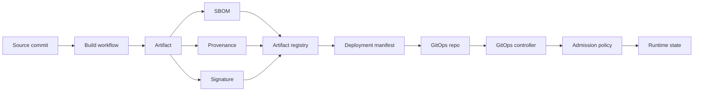
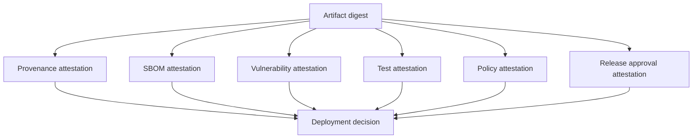
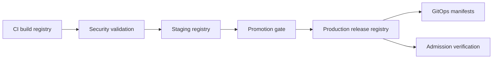
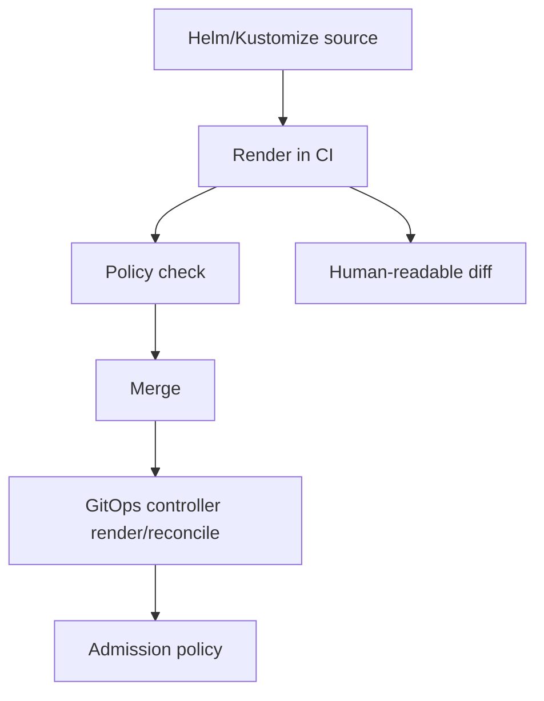
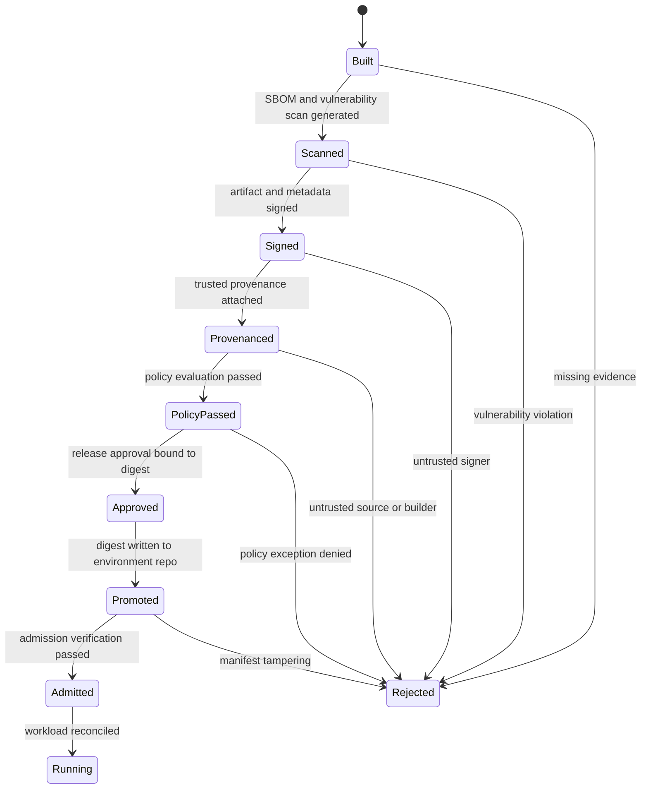
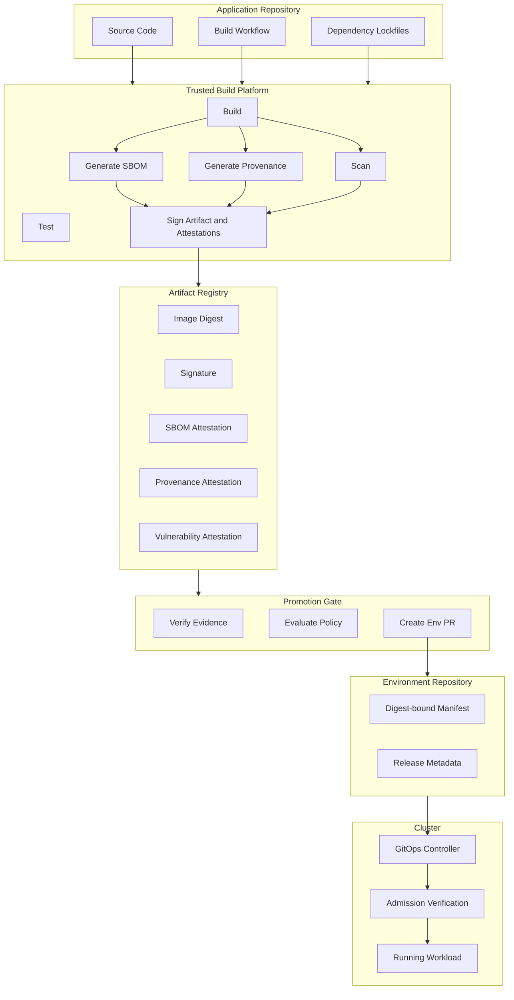

# Part 021 — Supply Chain Security for GitOps/IaC

A GitOps/IaC pipeline is a system that turns text into production state.

That text may describe:

- cloud infrastructure,
- Kubernetes workloads,
- IAM policies,
- network boundaries,
- database instances,
- controller configuration,
- policy rules,
- container images,
- Helm charts,
- Terraform/OpenTofu modules,
- provider plugins,
- and sometimes the platform that deploys itself.

This is why supply chain security is not an optional security add-on.

It is part of the pipeline's correctness model.

If a pipeline can prove only that `main` changed, but cannot prove what artifact was built, by whom, from which commit, using which builder, with which dependencies, and under which policy, the pipeline is not production-grade. It is merely automated.

The goal of this part is to build the mental model and control architecture for supply chain security in GitOps/IaC.

Part 022 will go deep into Sigstore, Cosign, keyless signing, attestations, and admission verification.

This part answers a broader question:

```text
How do we know the thing being deployed is the thing we intended to deploy?
```

---

## 1. The Core Mental Model

A normal delivery pipeline asks:

```text
Did CI pass?
```

A production-grade supply chain asks:

```text
Can we verify the complete chain from source to running state?
```

That chain has several transitions.



Each arrow is a trust transition.

A trust transition is a place where an attacker, misconfiguration, compromised credential, or careless automation may replace the intended state with a different state.

The mistake many teams make is securing only the first and last steps:

```text
Protected branch + Kubernetes admission = secure pipeline
```

That is not enough.

Between branch protection and admission, many things can go wrong:

- CI workflow can be modified.
- Build runner can be compromised.
- Build can use unpinned dependencies.
- Container image tag can be overwritten.
- Terraform provider version can be changed.
- Module source can point to a branch instead of a versioned release.
- Helm chart can change without manifest diff clarity.
- Image scanner can scan one digest while deployment uses another.
- SBOM can be generated after the fact by an untrusted process.
- Signature can exist but not be bound to the expected identity.
- Admission policy can verify a signature but not verify provenance.

A supply chain control is useful only when it binds **identity**, **artifact**, **source**, **process**, and **policy decision** together.

---

## 2. The Important Distinction: Artifact Trust vs Deployment Trust

GitOps introduces a subtle trap.

Because desired state is stored in Git, teams often assume Git is the only source of truth.

That is true for **deployment intent**.

It is not true for **artifact integrity**.

A deployment manifest may say:

```yaml
image: registry.example.com/billing-api:1.8.3
```

But `1.8.3` is a mutable name unless the registry enforces immutability and the deployment is bound to a digest.

A stronger deployment manifest says:

```yaml
image: registry.example.com/billing-api@sha256:...
```

The digest binds the manifest to a specific artifact content.

Even that is not enough.

The digest tells us **what bytes** are deployed.

It does not tell us:

- who built those bytes,
- from what source commit,
- using what build workflow,
- with what dependency graph,
- whether a scanner saw the same bytes,
- whether a release approver approved those bytes,
- whether those bytes satisfy environment policy.

That missing context comes from SBOM, provenance, signature, attestation, and policy.

A mature platform treats a deployment candidate as a tuple:

```text
DeploymentCandidate = {
  artifactDigest,
  sourceRepository,
  sourceCommit,
  builderIdentity,
  buildWorkflow,
  buildParameters,
  sbomDigest,
  vulnerabilityReportDigest,
  signatureIdentity,
  provenancePredicate,
  approvalRecord,
  targetEnvironment,
  policyDecision
}
```

If your pipeline only has `image tag`, it has weak deployment identity.

If your pipeline has `image digest + signed provenance + signed SBOM + admission verification`, it has much stronger deployment identity.

---

## 3. What Counts as Supply Chain in GitOps/IaC?

Do not limit the term "supply chain" to container images.

For a GitOps/IaC platform, the supply chain includes at least these artifact classes.

| Artifact class | Examples | Main risk |
|---|---|---|
| Application artifact | Container image, JAR, npm package, binary | Compromised build or dependency injection |
| Deployment artifact | Helm chart, Kustomize output, rendered YAML | Unreviewed generated state or template injection |
| IaC module | Terraform/OpenTofu module, Pulumi package, Crossplane composition | Hidden privilege, network exposure, provider abuse |
| IaC provider/plugin | Terraform/OpenTofu provider binary | Malicious or compromised provider execution |
| Policy bundle | OPA/Rego bundle, Kyverno policy, Sentinel policy | Policy weakening, bypass, exception abuse |
| Controller image | Argo CD, Flux, External Secrets, Crossplane, runner image | Control-plane compromise |
| Build image | CI container, buildpack, compiler image | Build-time tampering |
| Scanner image | vulnerability scanner, IaC scanner, SBOM generator | False evidence or missed risk |
| Pipeline definition | GitHub Actions, GitLab CI, Tekton, Jenkinsfile | Workflow injection |
| Runtime dependency | base image, OS package, language dependency | Known vulnerability, dependency confusion |
| Secret material | signing keys, registry credentials, cloud credentials | Direct compromise of signing or deployment authority |

The key point:

```text
Everything that can influence production state is part of the supply chain.
```

That includes tools used to check production state.

A vulnerability scanner does not become trustworthy merely because it is called from CI. The scanner itself has a supply chain.

---

## 4. Threat Model

Supply chain security should begin with concrete attacks.

| Attack | Example | Control |
|---|---|---|
| Source tampering | Attacker pushes malicious code to branch | branch protection, mandatory review, signed commits where useful |
| Workflow tampering | PR modifies CI to skip scanner | workflow path ownership, reusable trusted workflows, protected CI definitions |
| Dependency confusion | Build resolves private package from public registry | scoped registries, lockfiles, dependency allowlists |
| Build runner compromise | Runner leaks token or modifies artifact | ephemeral isolated runners, short-lived credentials, SLSA-style builder trust |
| Artifact substitution | Image tag overwritten after scan | digest pinning, registry immutability, admission digest verification |
| Fake provenance | Build job creates misleading provenance | builder-generated provenance, attestation signing, SLSA controls |
| Weak signing | Any developer can sign production image | keyless identity constraints, signing identity policy |
| Registry compromise | Malicious artifact uploaded under valid name | signature/provenance verification, immutable tags, registry audit |
| Manifest tampering | GitOps repo points prod to untrusted digest | CODEOWNERS, promotion checks, environment policy |
| Admission bypass | Controller deploys without verification | enforce admission policy, restrict direct cluster write privileges |
| Policy weakening | PR relaxes signature verification policy | separate policy repo ownership, policy tests, approval binding |
| IaC provider injection | Provider source/version changed | lockfiles, private mirror, provider allowlist, checksum verification |
| Module substitution | Module source points to branch or fork | version pinning, registry, module signing or source allowlist |

The threat model must include both malicious and accidental cases.

Many real incidents are not sophisticated attacks. They are uncontrolled transitions:

- wrong image tag,
- wrong account,
- wrong workspace,
- wrong runner,
- wrong credential,
- wrong module version,
- wrong policy mode,
- wrong exception scope.

A mature pipeline makes the wrong transition difficult, visible, and recoverable.

---

## 5. Security Invariants

A supply-chain-aware GitOps/IaC platform should maintain these invariants.

### Invariant 1 — Artifact identity is digest-based

Tags, branches, and floating versions are names.

Digests and immutable versions identify content.

For runtime deployment, prefer digest-bound images:

```yaml
image: registry.example.com/payment-api@sha256:abc...
```

For Terraform/OpenTofu providers, commit and review lockfiles.

For modules, prefer immutable semantic versions or commit SHAs over branches.

```hcl
module "vpc" {
  source  = "app.terraform.io/example/network/vpc/aws"
  version = "3.4.1"
}
```

Do not let production consume moving targets unless the moving target is itself controlled by a promotion process.

### Invariant 2 — Build identity is not developer identity

A developer approves code.

A build platform produces artifact provenance.

A release approver approves deployment.

Those are different identities.

Do not collapse them into one token.

```text
Developer identity != Builder identity != Deployer identity != Break-glass identity
```

### Invariant 3 — Provenance is generated inside the trusted build boundary

If a build step can freely write its own provenance, provenance becomes a self-attestation.

That is weak.

Stronger provenance is generated or verified by the build platform/control plane, not by arbitrary tenant code.

This is a central idea in SLSA-style build integrity.

### Invariant 4 — Verification happens at consumption time

Signing is not enough.

A signed artifact can still be inappropriate for production.

Verification must happen when the artifact is consumed:

- when a manifest is promoted,
- when a controller reconciles,
- when Kubernetes admission evaluates a Pod,
- when an IaC runner downloads a provider or module,
- when a policy engine loads a bundle.

### Invariant 5 — Evidence is immutable and replayable

A production change should be reconstructable after the fact.

You should be able to answer:

```text
What exact artifact entered prod?
Who approved it?
Which commit produced it?
Which workflow built it?
Which SBOM was attached?
Which scanner results were used?
Which policy decisions allowed it?
Which identity applied it?
What changed after reconciliation?
```

If you cannot answer those questions without scraping logs manually, the platform is not audit-ready.

### Invariant 6 — Exceptions are signed state transitions

Exceptions are inevitable.

Silent exceptions are dangerous.

A production-grade exception has:

- explicit owner,
- reason,
- affected artifact or policy,
- scope,
- expiry,
- approval,
- evidence link,
- revocation path.

An exception should be modeled as data, not tribal knowledge.

---

## 6. SLSA as a Build Integrity Framework

SLSA, short for Supply-chain Levels for Software Artifacts, is a security framework for improving artifact integrity across the software supply chain.

For GitOps/IaC, the most useful SLSA lesson is not the level number.

The most useful lesson is this:

```text
The build platform must produce trustworthy provenance, and consumers must verify it before trusting artifacts.
```

SLSA-style thinking pushes the team to define:

- what the build platform is,
- what is inside its trust boundary,
- whether builds are isolated,
- whether provenance is generated,
- whether provenance is authentic,
- whether tenants can forge provenance,
- whether artifacts are identified by digest,
- whether consumers verify provenance.

A simplified maturity model:

| Maturity | Behavior | Problem solved |
|---|---|---|
| Basic | CI builds images and pushes tags | automation only |
| Better | CI pushes digest and SBOM | artifact transparency |
| Strong | CI signs image and provenance | tamper evidence |
| Stronger | provenance generated by trusted build platform | weaker self-attestation |
| Production-grade | deployment verifies digest, signature, provenance, policy | consumption-time trust |

Do not chase maturity labels before implementing the controls that matter.

The practical first milestone is:

```text
Every production artifact has a digest, signed provenance, signed SBOM, and deploy-time verification.
```

---

## 7. SBOM: Inventory Is Not Trust

An SBOM is a bill of materials.

It describes what is inside an artifact or product.

It may include components, versions, relationships, licenses, suppliers, hashes, and sometimes provenance-related metadata.

The two dominant SBOM formats are SPDX and CycloneDX.

A simple decision framework:

| Format | Common strength | Good fit |
|---|---|---|
| SPDX | licensing, package metadata, compliance, broad ecosystem | legal/compliance-heavy programs |
| CycloneDX | security-oriented component/service/dependency modeling | vulnerability management, AppSec, operational security |

Do not treat this as a religious choice.

A mature organization may support both because external consumers, regulators, vendors, and scanners may prefer different formats.

The more important question is:

```text
Is the SBOM generated at the right time by the right identity for the right artifact digest?
```

Bad SBOM pattern:

```text
Build image: registry/app:1.2.0
Push image: registry/app:1.2.0
Later: pull registry/app:1.2.0 and generate SBOM
```

This can generate an SBOM for the wrong bytes if the tag moves.

Better pattern:

```text
Build image -> get digest -> generate SBOM for digest -> sign SBOM attestation -> attach to digest
```

A production SBOM record should bind at least:

```text
SBOMRecord = {
  artifactDigest,
  sbomFormat,
  sbomDigest,
  generatorIdentity,
  generatorVersion,
  sourceCommit,
  buildRunId,
  createdAt,
  signature,
  storageLocation
}
```

### SBOM failure modes

| Failure | Impact | Control |
|---|---|---|
| SBOM generated from tag | inventory may not match deployed artifact | generate against digest |
| SBOM unsigned | attacker can replace evidence | sign or attest SBOM |
| SBOM stored only in CI logs | not durable evidence | store in registry/artifact store |
| SBOM missing transitive deps | false confidence | generator selection and validation |
| SBOM not linked to release | useless during incident | attach to artifact and release record |
| SBOM not queryable | slow vulnerability response | index in dependency/security platform |

SBOM is not a gate by itself.

It is input to gates.

Example gates:

- no critical vulnerability without exception,
- no forbidden license,
- no dependency from unapproved ecosystem,
- no component with missing version,
- no base image outside allowlist,
- no unmaintained package over threshold,
- no deploy without SBOM attached.

---

## 8. Provenance: How the Artifact Was Produced

Provenance answers:

```text
Where did this artifact come from?
```

A useful provenance record includes:

- subject artifact digest,
- source repository,
- source commit,
- builder identity,
- workflow identity,
- build trigger,
- build parameters,
- materials/dependencies,
- build environment,
- timestamp,
- signature.

Provenance is especially important because signatures alone can be misleading.

A signature says:

```text
Some trusted identity signed this artifact.
```

Provenance says:

```text
This trusted builder produced this artifact from this source under this workflow.
```

The policy engine can then ask:

```text
Is the artifact signed by the expected builder?
Was it built from the expected repository?
Was it built from a protected branch or reviewed tag?
Was the build workflow allowed for production?
Was the source commit the one promoted through GitOps?
```

### Minimum useful provenance checks

For production admission, start with these:

| Check | Why it matters |
|---|---|
| artifact digest matches subject | prevents attaching valid provenance to wrong artifact |
| source repository matches allowed repo | prevents artifact from untrusted project |
| source ref is protected branch/tag | prevents random branch deployment |
| builder identity matches trusted builder | prevents developer laptop builds |
| workflow path matches trusted workflow | prevents rogue workflow signing |
| commit SHA matches promotion metadata | prevents source/deployment mismatch |
| signature identity is valid | prevents forged provenance |

Provenance without verification is documentation.

Provenance with verification is a control.

---

## 9. In-Toto Attestations

An attestation is signed metadata about an artifact.

The common shape is:

```text
Attestation = Signature(Predicate about Subject)
```

The subject is usually an artifact digest.

The predicate can be:

- provenance,
- SBOM,
- vulnerability scan result,
- test result,
- policy result,
- license review,
- manual approval,
- deployment verification.

This gives us a powerful model:



The platform can decide production eligibility by evaluating attestations.

Example policy:

```text
Allow deployment to production only if:
  image digest is immutable
  AND signature identity is trusted
  AND provenance source repo is allowed
  AND provenance builder is trusted
  AND SBOM exists
  AND vulnerability scan exists for the same digest
  AND no critical vulnerability exists without non-expired exception
  AND release approval exists for this digest and environment
```

That is much stronger than:

```text
Allow deployment if image has a signature.
```

---

## 10. Registry Trust and Digest Discipline

The artifact registry is not just storage.

It is a production dependency.

A registry security design should cover:

- immutable tags for release repositories,
- retention policy,
- access control,
- audit logs,
- vulnerability scanning integration,
- signature/attestation storage,
- cross-region replication,
- deletion protection for release artifacts,
- promotion from build registry to release registry,
- emergency revocation or denylist.

### Registry topology

A useful topology separates build, staging, and release trust.



Not every organization needs separate physical registries.

But every production-grade platform needs separate **trust states**.

An artifact should not become production-eligible merely because it was pushed.

It becomes production-eligible after it passes promotion controls.

### Tag policy

Tags are useful for humans.

Digests are useful for machines.

Recommended pattern:

```text
Human-facing release:
  billing-api:1.8.3

Machine-facing deployment:
  billing-api@sha256:...
```

The promotion system may maintain a mapping:

```yaml
release: 1.8.3
imageDigest: sha256:...
sourceCommit: 6f3a...
provenanceDigest: sha256:...
sbomDigest: sha256:...
```

The GitOps repo should consume the digest, not only the tag.

---

## 11. Terraform/OpenTofu Supply Chain

Supply chain security for IaC is different from container supply chain security because the IaC engine executes plugins and modules that can influence privileged cloud API calls.

Terraform/OpenTofu supply chain includes:

- provider binaries,
- provider versions,
- provider source addresses,
- provider lock file,
- module source locations,
- module versions,
- downloaded child modules,
- external data sources,
- provisioners,
- local-exec scripts,
- backend configuration,
- state migration commands,
- runner image,
- credentials used during plan/apply.

### Provider controls

Use explicit provider source and version constraints.

```hcl
terraform {
  required_providers {
    aws = {
      source  = "hashicorp/aws"
      version = "~> 5.0"
    }
  }
}
```

Commit and review the dependency lock file.

Use a provider mirror or private registry when needed for controlled environments.

Policy gate examples:

```text
Deny if provider source is not allowlisted.
Deny if provider version is unconstrained.
Deny if lock file changed without platform-owner approval.
Deny if provider mirror is bypassed in production.
Deny if provider checksum is missing.
```

### Module controls

Bad module source patterns:

```hcl
source = "git::https://github.com/example/vpc.git//modules/vpc?ref=main"
source = "../some/local/path"
source = "git::ssh://git@github.com/random/fork.git"
```

Better production patterns:

```hcl
source  = "app.terraform.io/org/vpc/aws"
version = "3.4.1"
```

or, when Git source is unavoidable:

```hcl
source = "git::https://github.com/org/terraform-modules.git//vpc?ref=v3.4.1"
```

Module policy examples:

```text
Deny if module source is outside approved namespace.
Deny if module ref is branch name for production.
Deny if module version is not pinned.
Require security review if module source changes.
Require migration guide if major module version changes.
```

### Provisioner and external execution controls

Provisioners and local-exec are supply chain escape hatches.

They can run arbitrary code inside the privileged IaC runner.

Policy should detect and restrict:

- `local-exec`,
- `remote-exec`,
- `external` data sources,
- shell scripts downloaded at runtime,
- curl-to-shell patterns,
- dynamically generated providers or modules.

Do not ban all escape hatches blindly.

Some migrations require controlled imperative steps.

But production-grade usage requires:

- explicit approval,
- limited runner identity,
- script source review,
- deterministic inputs,
- audit logs,
- rollback plan.

---

## 12. Helm, Kustomize, and Rendered Manifests

Helm charts and Kustomize overlays introduce a second supply chain problem:

```text
The reviewed source is not always the applied object.
```

A Helm values change can produce many runtime objects.

A Kustomize overlay can patch security-sensitive fields.

A chart dependency can change rendered output.

A production-grade GitOps pipeline should make rendered state inspectable.

Recommended controls:

- render manifests in CI,
- validate rendered manifests with policy,
- diff rendered output against previous release,
- lock chart dependencies,
- pin chart versions,
- avoid floating chart repos for production,
- store rendered manifest artifact for evidence,
- require admission policy at cluster boundary.

The GitOps controller may render at reconciliation time, but security review often needs a pre-merge rendered view.



This avoids a class of incidents where reviewers approve a small values file without realizing it changes privileged runtime state.

---

## 13. CI Workflow Supply Chain

The CI workflow is part of the supply chain because it defines how artifacts and evidence are produced.

Dangerous pattern:

```yaml
pull_request:
  paths:
    - '**'
```

and the PR can modify:

```text
.github/workflows/release.yml
```

If the same PR can alter the release workflow and use it to produce a production artifact, the artifact provenance may become meaningless.

Controls:

- protect workflow files with CODEOWNERS,
- use reusable workflows from trusted repositories,
- pin third-party actions by SHA,
- restrict secrets on fork PRs,
- separate build and release workflows,
- require environment protection for release jobs,
- use OIDC with tight claims,
- avoid long-lived registry credentials,
- prevent untrusted PR code from running in privileged contexts.

### Workflow identity model

A signed artifact should not simply say:

```text
signed by GitHub Actions
```

It should be constrained to something like:

```text
issuer: https://token.actions.githubusercontent.com
repository: org/billing-api
workflow: .github/workflows/release.yml
ref: refs/tags/v1.8.3
```

This distinction matters.

If policy trusts all artifacts signed by any CI job in the organization, one weak repository can become a signing oracle for production.

---

## 14. Deployment Eligibility as a State Machine

Supply chain security becomes clearer when modeled as state.



This state machine avoids a common mistake:

```text
Artifact exists => artifact can be deployed
```

A stronger model:

```text
Artifact can be deployed only after it reaches an environment-specific eligibility state.
```

For example, staging may require:

- digest,
- signature,
- SBOM,
- scanner result.

Production may additionally require:

- trusted builder provenance,
- release approval,
- no critical vulnerability,
- admission verification,
- change ticket or evidence link,
- environment-specific policy exception approval.

---

## 15. Policy Gate Placement

Supply chain controls should not live in one place.

Use layered enforcement.

| Stage | Gate | Purpose |
|---|---|---|
| PR to app repo | source/workflow policy | prevent malicious pipeline changes |
| build | builder isolation and provenance | produce trustworthy artifact metadata |
| registry push | signing and attestation | bind metadata to artifact digest |
| promotion PR | release eligibility policy | prevent untrusted digest entering env repo |
| GitOps reconcile | manifest and diff policy | prevent unsafe desired state |
| Kubernetes admission | signature/provenance verification | prevent untrusted workload from persisting |
| runtime | detection and response | catch drift, CVEs, compromised artifacts |

A gate should be placed where it has enough context to make a good decision.

Examples:

- license policy needs SBOM context,
- image signature policy needs registry/signature context,
- source repo policy needs provenance context,
- environment policy needs target environment context,
- runtime policy needs Kubernetes object context.

Do not force all policy into admission.

Admission is a strong backstop, but it is late in the flow.

---

## 16. Evidence Store Design

A mature platform needs durable evidence.

CI logs alone are not evidence architecture.

An evidence record should be queryable by:

- artifact digest,
- source commit,
- release version,
- environment,
- deployment timestamp,
- policy decision,
- vulnerability ID,
- approver,
- builder identity.

Example evidence schema:

```yaml
artifactDigest: sha256:abc...
source:
  repository: github.com/org/billing-api
  commit: 6f3a...
  ref: refs/tags/v1.8.3
build:
  platform: github-actions
  workflow: .github/workflows/release.yml
  runId: "712345678"
  builderIdentity: repo:org/billing-api:ref:refs/tags/v1.8.3
metadata:
  sbom:
    format: cyclonedx
    digest: sha256:def...
  provenance:
    format: slsa
    digest: sha256:123...
  vulnerabilityScan:
    scanner: trivy
    digest: sha256:456...
signature:
  mechanism: sigstore-keyless
  identity: repo:org/billing-api:workflow:.github/workflows/release.yml
release:
  environment: prod
  approval: change-88421
  approvedBy: sre-platform@example.com
policy:
  decision: allow
  policyBundleDigest: sha256:789...
```

Store this in a system that has:

- immutable write or append-only behavior,
- retention policy,
- access controls,
- export path for audits,
- links back to Git commits and registry artifacts.

---

## 17. Supply Chain Controls for Platform Components

GitOps controllers, IaC runners, admission controllers, secret operators, and policy engines are not just workloads.

They are platform control-plane components.

A compromised GitOps controller can change cluster state.

A compromised IaC runner can change cloud state.

A compromised secret operator can leak secrets.

A compromised admission controller can deny all workloads or silently allow unsafe ones.

Controls for platform components should be stricter than application controls:

- pin controller images by digest,
- verify signatures for controller images,
- restrict who can update controller manifests,
- separate controller namespaces,
- use minimal RBAC,
- monitor controller deployment drift,
- pin Helm chart versions,
- render and review chart output,
- test upgrades in staging clusters,
- maintain rollback manifests,
- isolate credentials per controller.

Platform controller upgrades should be treated as production control-plane changes.

They should not be casual dependency bumps.

---

## 18. Supply Chain Security for Policy Bundles

Policy is also code.

A policy bundle can weaken the whole platform.

Risk examples:

- change `enforce` to `audit`,
- add broad exception,
- remove trusted builder constraint,
- allow wildcard image registry,
- disable digest verification,
- skip namespace pattern,
- weaken IAM deny rule,
- add default allow branch.

Controls:

- policy repo separate ownership,
- policy tests required,
- policy bundle signing,
- policy bundle digest in evidence,
- staged rollout of policy changes,
- emergency revert path,
- audit for policy mode changes,
- exception expiry and owner.

A production deployment decision should record the policy bundle digest used at decision time.

Otherwise you cannot reconstruct why a deployment was allowed.

---

## 19. Practical Reference Architecture



The important architectural property is that the production manifest is not merely a text update.

It is a reference to a verified artifact and its evidence.

---

## 20. Concrete Pipeline Contract

A production-grade platform should define a contract like this.

### Build contract

A build job must produce:

```text
artifact digest
SBOM for artifact digest
provenance for artifact digest
vulnerability report for artifact digest
signature or attestation for metadata
build run identifier
source commit
builder identity
```

### Promotion contract

A promotion job must verify:

```text
artifact exists
artifact digest is immutable
signature is valid
signing identity is trusted
provenance source is allowed
builder identity is allowed
SBOM exists for same digest
scan result exists for same digest
policy decision is allow or approved exception
release approval is bound to digest and environment
```

### Runtime contract

Admission must verify:

```text
image uses digest
signature is valid
identity matches trusted issuer and subject
required attestations exist
attestation predicates satisfy environment policy
```

### Evidence contract

The platform must retain:

```text
source commit
workflow identity
artifact digest
metadata digests
policy decisions
approvals
deployment event
runtime object identity
```

---

## 21. Failure Modes and Recovery

### Failure: artifact has no SBOM

Do not silently allow production.

Response:

1. block promotion,
2. check whether SBOM generation failed or artifact is old,
3. regenerate only if the artifact digest is available and generation is trusted,
4. attach signed SBOM,
5. rerun policy.

### Failure: image signature exists but identity is wrong

A signature from an unexpected identity is not enough.

Response:

1. block deployment,
2. inspect signing certificate identity,
3. compare against allowed workflow/repository/ref,
4. check whether a rogue workflow or repo signed it,
5. rotate or tighten identity policy if needed.

### Failure: registry tag was overwritten

Response:

1. stop using tag for deployment,
2. compare old and new digest,
3. check audit logs,
4. freeze affected releases,
5. enforce immutable tags for release repos,
6. migrate GitOps manifests to digest references.

### Failure: provenance source does not match GitOps metadata

Response:

1. block promotion,
2. compare release PR source commit with provenance source commit,
3. determine if stale metadata, wrong image, or malicious substitution,
4. regenerate release metadata from trusted artifact record,
5. require approval if intentional.

### Failure: critical CVE appears after deployment

Supply chain security is not only pre-deploy.

Response:

1. query artifact inventory by package/component,
2. identify running workloads using affected digest,
3. classify exploitability and exposure,
4. create remediation PRs,
5. apply exception only with expiry if needed,
6. update runtime detection.

---

## 22. Anti-Patterns

### Anti-pattern: "We sign images, so we are secure"

Signing proves integrity from signer to consumer.

It does not prove the signer should be trusted for that environment.

Always verify identity and provenance.

### Anti-pattern: "Latest tag in staging is fine"

Maybe.

But if staging validates a tag and production deploys the same tag later, the digest may have changed.

Promotion should move digests, not tags.

### Anti-pattern: "SBOM is generated by a nightly scanner"

Nightly scanner inventory is useful for vulnerability management.

It is not enough for release evidence unless it binds to the exact artifact digest deployed.

### Anti-pattern: "Admission will catch everything"

Admission does not understand all pipeline context unless you provide it through attestations, metadata, or policy data.

Shift-left checks still matter.

### Anti-pattern: "Only app images need signing"

Controllers, runners, policy bundles, IaC modules, providers, scanner images, and build images also influence production state.

### Anti-pattern: "The registry is internal, so it is trusted"

Internal systems can be misconfigured or compromised.

Trust should be cryptographic and policy-bound, not only network-bound.

---

## 23. Implementation Roadmap

### Phase 1 — Inventory and digest discipline

- Deploy by digest for production workloads.
- Pin provider and module versions.
- Commit Terraform/OpenTofu lockfiles.
- Pin Helm chart versions.
- Identify all artifact classes that influence production.

### Phase 2 — SBOM and scan evidence

- Generate SBOM at build time.
- Attach SBOM to artifact digest.
- Store vulnerability scan result by digest.
- Add promotion policy requiring SBOM and scan.

### Phase 3 — Signing

- Sign artifacts.
- Sign or attest SBOM/provenance.
- Use keyless signing where possible.
- Restrict trusted signing identities.

### Phase 4 — Provenance

- Generate provenance from trusted build platform.
- Verify source repo, ref, workflow, and builder.
- Bind provenance to promotion metadata.

### Phase 5 — Admission enforcement

- Enforce digest usage.
- Verify image signatures.
- Verify required attestations.
- Start in audit mode, then enforce per namespace/environment.

### Phase 6 — Evidence and response

- Build evidence store.
- Query by digest, commit, environment, vulnerability.
- Add incident response playbooks.
- Continuously test policy bypass attempts.

---

## 24. Exercises

### Exercise 1 — Artifact eligibility contract

Write a production eligibility contract for one service.

Include:

- artifact digest,
- source repository,
- builder identity,
- SBOM requirement,
- vulnerability threshold,
- signature identity,
- provenance fields,
- approval rule,
- admission rule.

### Exercise 2 — Identify mutable references

Search one GitOps repository for mutable references:

- image tags without digest,
- Helm chart versions not pinned,
- Terraform modules using branch refs,
- provider versions without constraints,
- third-party CI actions without SHA pinning.

Classify each as:

```text
acceptable for dev
acceptable for staging
not acceptable for production
```

### Exercise 3 — Build a supply chain threat model

Choose one production path:

```text
source repo -> CI -> registry -> environment repo -> cluster
```

For each transition, write:

- attacker capability,
- accidental failure mode,
- current control,
- missing control,
- evidence produced.

### Exercise 4 — Define evidence schema

Design an evidence record for one production deployment.

It must answer:

```text
What digest is running?
What source produced it?
Which builder produced it?
Which SBOM describes it?
Which scanner evaluated it?
Which policy allowed it?
Who approved it?
When was it admitted?
```

---

## 25. Final Mental Model

Supply chain security is not a scanner.

It is not a signature.

It is not an SBOM.

It is not admission policy.

It is the end-to-end ability to verify that every production state transition consumed the intended artifact, built by the intended process, from the intended source, with the intended evidence, under the intended policy.

```text
Source is reviewed.
Build is trusted.
Artifact is immutable.
Metadata is attached.
Evidence is signed.
Policy is enforced.
Runtime verifies before accepting state.
Audit can replay the decision.
```

That is the supply chain foundation required for a state-of-the-art GitOps/IaC pipeline.

Part 022 will implement the most important cryptographic mechanism behind this model: Sigstore, Cosign, keyless signing, attestations, and deploy-time verification.

---

## References

- OpenSSF SLSA Specification: https://slsa.dev/spec/
- SLSA Build Requirements: https://slsa.dev/spec/v1.2/build-requirements
- Sigstore Documentation: https://docs.sigstore.dev/
- Cosign Repository: https://github.com/sigstore/cosign
- SPDX Specification: https://spdx.github.io/spdx-spec/
- CycloneDX Specification: https://cyclonedx.org/specification/overview/
- in-toto Attestation Framework: https://in-toto.io/
- Kyverno Verify Images: https://kyverno.io/docs/policy-types/cluster-policy/verify-images/overview/
