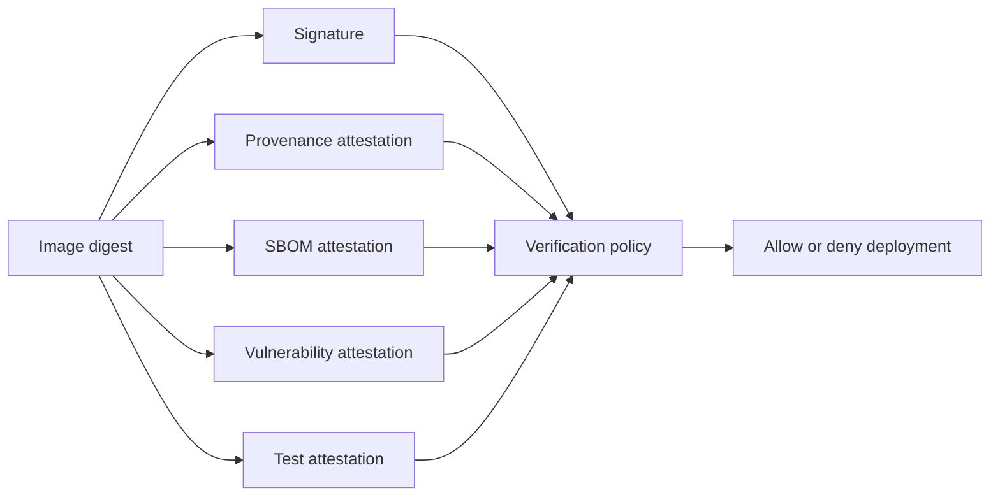
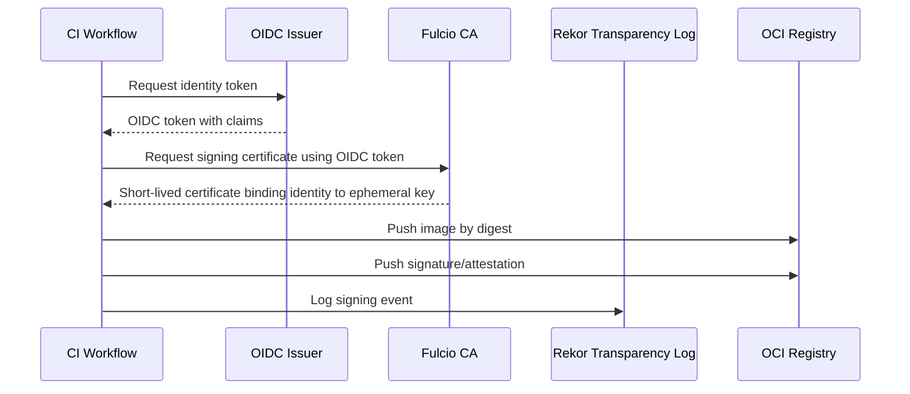
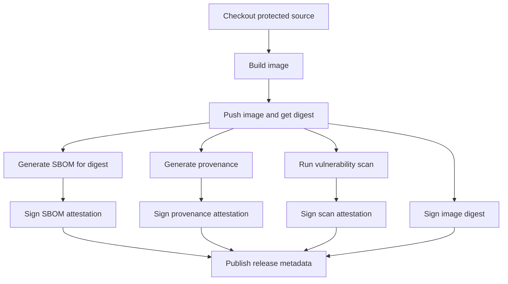
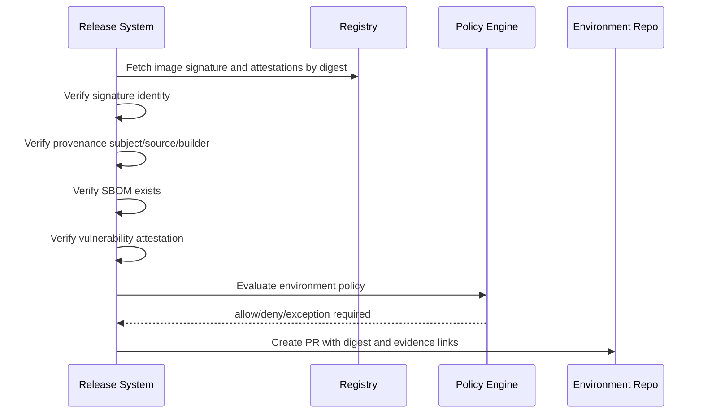
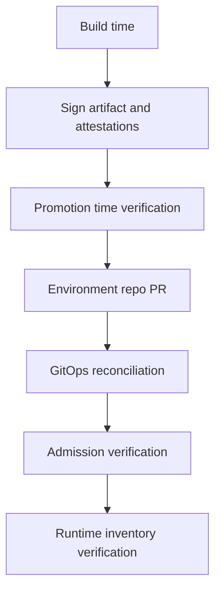
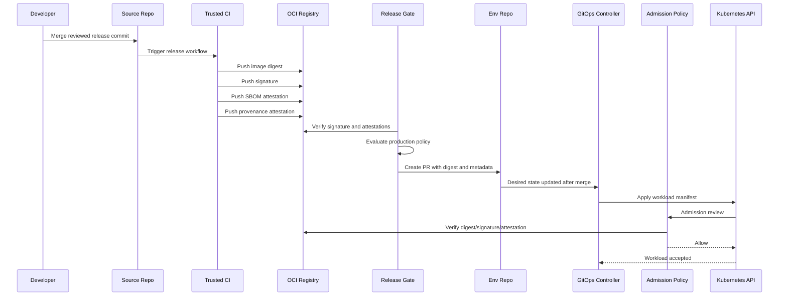

# Part 022 — Sigstore, Cosign, and Keyless Attestation

Part 021 built the supply chain security model.

Now we go deeper into the mechanism most commonly used to make that model practical for containerized GitOps platforms: Sigstore and Cosign.

The core idea is simple:

```text
Artifacts should carry verifiable evidence about who created them, how they were created, and whether they satisfy policy.
```

Cosign signs artifacts and attestations.

Sigstore provides the ecosystem for keyless signing, certificate issuance, transparency logging, and root distribution.

But the implementation details matter.

A weak Sigstore rollout can create false confidence.

A strong rollout can make artifact substitution, unauthorized release, and provenance forgery materially harder.

---

## 1. The Problem Cosign Solves

A container registry can answer:

```text
Does this image digest exist?
```

It usually cannot answer, by itself:

```text
Who built it?
Was it built from the approved repository?
Was it built by the approved workflow?
Was the source commit reviewed?
Does it have an SBOM?
Was it scanned?
Was it approved for prod?
```

Cosign and Sigstore help attach cryptographically verifiable metadata to the artifact digest.

The artifact becomes more than bytes.

It becomes a verified release candidate.



The key design point:

```text
Cosign gives you cryptographic evidence.
Policy decides whether the evidence is acceptable.
```

Do not confuse the two.

---

## 2. Sigstore Components

Sigstore is an ecosystem, not one binary.

The main components you need to understand are:

| Component | Role |
|---|---|
| Cosign | CLI/tooling for signing and verifying container images and other OCI artifacts |
| Fulcio | Certificate authority that issues short-lived certificates tied to OIDC identities |
| Rekor | Transparency log for signed metadata and signing events |
| TUF root | Mechanism for distributing trusted Sigstore root metadata |
| OIDC issuer | Identity provider used to prove who/what is signing |

In keyless mode, the simplified flow is:



The trust model changes from:

```text
Trust whoever holds this long-lived private key.
```

to:

```text
Trust signatures created by this identity, under this issuer, from this workflow/repository/ref, with transparency log evidence.
```

That is a major operational improvement.

---

## 3. Keyless Signing Mental Model

Traditional signing depends on key custody.

```text
private key -> signature -> verification with public key
```

This works, but it creates operational problems:

- private keys must be stored,
- keys must be rotated,
- keys can leak,
- many teams share keys incorrectly,
- it is hard to tell which workflow actually signed,
- emergency revocation can be messy.

Keyless signing replaces long-lived application-managed signing keys with short-lived certificates bound to identity.

```text
OIDC identity -> short-lived certificate -> ephemeral signing key -> signature
```

In CI, the identity is usually derived from the workflow context.

Example identity dimensions:

```text
issuer: https://token.actions.githubusercontent.com
repository: org/billing-api
workflow: .github/workflows/release.yml
ref: refs/tags/v1.8.3
sha: 6f3a...
```

This lets verification policy be more precise.

Bad verification policy:

```text
allow if image is signed by Sigstore
```

Better verification policy:

```text
allow if image is signed by GitHub OIDC identity
AND repository is org/billing-api
AND workflow is .github/workflows/release.yml
AND ref matches refs/tags/v*
AND provenance subject matches image digest
```

The signature proves integrity.

The identity policy defines trust.

---

## 4. What Actually Gets Signed?

You can sign multiple things.

### Image signature

This signs the image digest.

```text
cosign sign registry.example.com/billing-api@sha256:...
```

Use this to prove that a trusted identity signed a specific image digest.

### Attestation

This signs a predicate about the image digest.

```text
cosign attest --predicate provenance.json --type slsaprovenance registry.example.com/billing-api@sha256:...
```

Use this to prove metadata about the artifact.

### SBOM attestation

This attaches an SBOM as signed metadata.

```text
cosign attest --predicate sbom.cdx.json --type cyclonedx registry.example.com/billing-api@sha256:...
```

### Vulnerability attestation

This attaches scan results.

```text
cosign attest --predicate vuln.json --type vuln registry.example.com/billing-api@sha256:...
```

### Policy attestation

This records a policy decision.

```text
cosign attest --predicate policy-result.json --type policy-result registry.example.com/billing-api@sha256:...
```

The important design rule:

```text
Sign the digest, not the mutable tag.
```

---

## 5. The Subject-Predicate Model

Attestations follow a subject-predicate mental model.

```text
Subject: the artifact digest
Predicate: a claim about the subject
Signature: proof of who made the claim
```

Example:

```json
{
  "subject": [
    {
      "name": "registry.example.com/billing-api",
      "digest": {
        "sha256": "abc..."
      }
    }
  ],
  "predicateType": "https://slsa.dev/provenance/v1",
  "predicate": {
    "buildDefinition": {
      "buildType": "https://github.com/actions/workflow/v1",
      "externalParameters": {
        "workflow": ".github/workflows/release.yml"
      }
    },
    "runDetails": {
      "builder": {
        "id": "https://github.com/org/billing-api/.github/workflows/release.yml"
      }
    }
  }
}
```

The exact schema depends on the predicate type.

The security requirement is consistent:

```text
The attestation subject must match the artifact being deployed.
```

If subject mismatch is allowed, an attacker may attach valid metadata from one artifact to another artifact.

---

## 6. Verification Must Be Identity-Aware

Verifying that a signature is cryptographically valid is necessary.

It is not sufficient.

You must verify **who** signed and **under what identity constraints**.

Example verification dimensions:

| Dimension | Example policy |
|---|---|
| OIDC issuer | must be GitHub Actions issuer |
| repository | must be `org/billing-api` |
| workflow | must be release workflow |
| ref | must be protected tag or branch |
| subject digest | must match deployment image digest |
| certificate timestamp | must be valid during signing event |
| transparency log | must have inclusion proof where required |
| builder id | must match trusted builder |
| source commit | must match release metadata |

This gives us a verification contract.

```text
Verified(image) =
  valid_signature(image.digest)
  AND trusted_oidc_issuer(signature.cert.issuer)
  AND trusted_subject(signature.cert.subject)
  AND trusted_workflow(signature.identity.workflow)
  AND trusted_ref(signature.identity.ref)
  AND required_attestations_exist(image.digest)
  AND attestation_subjects_match(image.digest)
  AND predicates_satisfy_environment_policy
```

---

## 7. CI Implementation Pattern

A production signing workflow should separate build, evidence generation, signing, and publication clearly.



Pseudo workflow:

```yaml
name: release

on:
  push:
    tags:
      - 'v*'

permissions:
  contents: read
  id-token: write
  packages: write

jobs:
  build-sign:
    runs-on: ubuntu-latest
    steps:
      - uses: actions/checkout@<pinned-sha>
      - name: Build image
        run: |
          docker build -t registry.example.com/billing-api:${GITHUB_REF_NAME} .
      - name: Push image and capture digest
        run: |
          docker push registry.example.com/billing-api:${GITHUB_REF_NAME}
          # resolve digest and export IMAGE_DIGEST
      - name: Generate SBOM
        run: |
          # generate SBOM for IMAGE_DIGEST, not for floating tag
      - name: Sign image
        run: |
          cosign sign --yes registry.example.com/billing-api@${IMAGE_DIGEST}
      - name: Attest SBOM
        run: |
          cosign attest --yes \
            --predicate sbom.cdx.json \
            --type cyclonedx \
            registry.example.com/billing-api@${IMAGE_DIGEST}
```

Important details:

- `id-token: write` enables OIDC token issuance in GitHub Actions.
- third-party actions should be pinned by SHA in high-assurance pipelines,
- secrets should not be available to untrusted PR workflows,
- signing should happen only from protected release refs,
- workflow files should be protected by CODEOWNERS,
- the digest should be captured from registry response or resolved reliably after push.

---

## 8. Promotion-Time Verification

Do not wait until cluster admission to discover a bad artifact.

Promotion should verify evidence before writing a digest to the environment repo.



Promotion output should not be:

```yaml
image: billing-api:1.8.3
```

It should be closer to:

```yaml
image:
  repository: registry.example.com/billing-api
  digest: sha256:abc...
release:
  version: 1.8.3
  sourceCommit: 6f3a...
  provenanceDigest: sha256:def...
  sbomDigest: sha256:123...
  signatureIdentity: repo:org/billing-api:workflow:.github/workflows/release.yml
```

The GitOps repo becomes a record of the exact artifact and its verification context.

---

## 9. Admission-Time Verification

Admission-time verification is the runtime backstop.

It prevents a workload from entering cluster state unless it satisfies trust policy.

Kyverno's image verification supports signature verification, digest enforcement, mutation from tags to digests, and attestation conditions. OPA Gatekeeper can also be integrated with external verification workflows, but Kyverno has especially direct support for image verification use cases.

A conceptual Kyverno policy:

```yaml
apiVersion: kyverno.io/v1
kind: ClusterPolicy
metadata:
  name: verify-production-images
spec:
  validationFailureAction: Enforce
  rules:
    - name: require-trusted-signature
      match:
        any:
          - resources:
              kinds:
                - Pod
              namespaces:
                - prod-*
      verifyImages:
        - imageReferences:
            - "registry.example.com/*"
          required: true
          verifyDigest: true
          mutateDigest: true
          attestors:
            - entries:
                - keyless:
                    issuer: "https://token.actions.githubusercontent.com"
                    subject: "https://github.com/org/*/.github/workflows/release.yml@refs/tags/*"
```

Exact syntax evolves by Kyverno version, so treat this as design-level pseudo-config unless you validate it against the installed version.

The policy intent is stable:

```text
Only allow production images from trusted registry,
with immutable digest,
signed by trusted keyless identity,
from approved CI release workflow.
```

### Admission should not be the only gate

Admission is late.

If a deployment PR references an invalid image, GitOps sync will fail.

That is better than admitting an unsafe image, but still operationally noisy.

Therefore use both:

```text
Promotion-time verification for fast feedback.
Admission-time verification for hard enforcement.
```

---

## 10. Keyless Identity Policy Design

The most important Sigstore design work is not writing `cosign sign`.

It is designing identity policy.

### Bad policy

```text
Trust any signature from GitHub Actions.
```

This means any repository with a GitHub Actions workflow may sign an image that your cluster accepts.

### Better policy

```text
Trust signatures where:
  issuer = GitHub Actions OIDC
  repository owner = org
  repository in approved list
  workflow path = .github/workflows/release.yml
  ref matches protected tag pattern
```

### Stronger policy

```text
Trust signatures where:
  issuer = GitHub Actions OIDC
  repository = org/billing-api
  workflow path digest or reusable workflow identity is approved
  ref = refs/tags/vX.Y.Z
  source commit has required review status
  provenance builder id matches workflow
  artifact digest matches release metadata
```

You may not be able to enforce every dimension inside admission alone.

That is fine.

Split checks:

- admission checks signature and basic identity,
- promotion policy checks provenance/source/workflow/release metadata,
- evidence store records the full decision.

---

## 11. Signing Strategy: Keyless, Key-Based, or KMS?

Cosign supports multiple signing modes.

| Mode | Strength | Operational concern | Good fit |
|---|---|---|---|
| Keyless | no long-lived key, identity-bound, strong CI fit | requires OIDC and Sigstore trust model | CI/CD, GitOps platforms |
| KMS-backed key | centralized key custody | key permission design and rotation | regulated environments needing key control |
| Local key pair | simple | key storage/rotation/leak risk | local dev, bootstrap, low maturity |
| Hardware key | strong physical custody | operational friction | high-assurance manual signing |

For modern CI/CD, keyless is often the default best starting point.

But some organizations require KMS/HSM-controlled signing keys.

That is acceptable if:

- key access is tightly scoped,
- signing events are auditable,
- key rotation is tested,
- policy still verifies identity/context,
- one broad key is not shared across unrelated trust domains.

The anti-pattern is not key-based signing itself.

The anti-pattern is a single long-lived signing key that any pipeline can use.

---

## 12. Attestation Types You Actually Need

Start with a small required set.

### 1. Image signature

Purpose:

```text
Prove trusted identity signed artifact digest.
```

### 2. Provenance attestation

Purpose:

```text
Prove source, builder, workflow, and build parameters.
```

### 3. SBOM attestation

Purpose:

```text
Prove component inventory for artifact digest.
```

### 4. Vulnerability scan attestation

Purpose:

```text
Prove scanner result for artifact digest at release time.
```

### 5. Policy decision attestation

Purpose:

```text
Prove policy engine allowed promotion under a specific policy bundle.
```

Optional later:

- test result attestation,
- license review attestation,
- manual approval attestation,
- runtime verification attestation,
- deployment attestation.

Do not create twenty attestations on day one.

Start with the ones your policy will actually evaluate.

---

## 13. Example Provenance Policy

A production artifact should satisfy constraints like:

```rego
package supplychain.production

default allow := false

allow if {
  input.artifact.registry == "registry.example.com"
  input.signature.issuer == "https://token.actions.githubusercontent.com"
  input.signature.repository == "org/billing-api"
  input.signature.workflow == ".github/workflows/release.yml"
  startswith(input.signature.ref, "refs/tags/v")
  input.provenance.subject.digest == input.artifact.digest
  input.provenance.source.repository == "github.com/org/billing-api"
  input.provenance.builder.id == "github-actions-release"
  input.sbom.exists == true
  input.vulnerability.critical_count == 0
}
```

This is simplified, but the structure is the point.

The policy combines:

- artifact identity,
- signature identity,
- provenance subject,
- source repo,
- builder,
- SBOM,
- vulnerability result.

That is stronger than validating any one evidence type alone.

---

## 14. GitOps Integration Pattern

There are two common ways to integrate signed artifacts into GitOps.

### Pattern A — GitOps repo stores digest only

```yaml
image: registry.example.com/billing-api@sha256:abc...
```

Admission verifies signature and attestations by digest.

Pros:

- simple manifests,
- strong runtime enforcement,
- no extra metadata in Git.

Cons:

- reviewers may need external tools to inspect evidence,
- promotion PR is less self-explanatory.

### Pattern B — GitOps repo stores digest plus release metadata

```yaml
image: registry.example.com/billing-api@sha256:abc...
metadata:
  sourceCommit: 6f3a...
  release: 1.8.3
  provenance: sha256:def...
  sbom: sha256:123...
  signedBy: repo:org/billing-api:workflow:.github/workflows/release.yml
```

Pros:

- PR review has context,
- audit is easier,
- promotion policy can validate metadata.

Cons:

- more generated data,
- risk of metadata drift if not controlled,
- requires schema discipline.

For enterprise platforms, Pattern B is usually better.

But do not hand-edit release metadata.

Generate it from the verified artifact record.

---

## 15. Verification Layers

A robust design uses at least three verification layers.



### Build time

Produce signed evidence.

### Promotion time

Verify evidence before changing desired state.

### Admission time

Verify evidence before object becomes cluster state.

### Runtime

Continuously inventory running digests and compare them with allowed release records.

This layered model is important because each layer catches different failures.

| Failure | Best layer to catch |
|---|---|
| missing SBOM | promotion |
| wrong signature identity | promotion and admission |
| mutable tag | promotion and admission |
| direct kubectl bypass | admission |
| registry artifact replaced | admission/runtime |
| new CVE after deployment | runtime inventory |
| GitOps repo tampering | promotion/GitOps review/admission |

---

## 16. Handling Private Registries

Private registries add operational concerns:

- verification controller needs registry access,
- signatures/attestations may be stored in the registry,
- network policies must allow admission controller to query registry,
- outages can affect admission,
- registry credentials must be scoped.

Design decisions:

### Fail closed or fail open?

For production namespaces, signature verification should generally fail closed.

For development, audit mode or fail-open may be acceptable during rollout.

### Cache verification results?

Caching improves availability and latency.

But cache policy must respect revocation/denylist decisions.

### Mirror signatures?

If production clusters cannot reach public registries, mirror images, signatures, and attestations together.

Do not mirror image bytes without mirroring verification metadata.

---

## 17. Rollout Strategy

Do not deploy strict verification to all clusters at once.

Use staged rollout.

### Stage 1 — Observe

- sign one service,
- generate SBOM attestation,
- verify manually in CI,
- publish release metadata.

### Stage 2 — Warn

- admission policy in audit mode,
- report unsigned images,
- identify namespaces and controllers that break assumptions.

### Stage 3 — Enforce for platform components

- pin and verify GitOps controllers,
- verify admission controller images,
- verify secret operator images,
- verify IaC runner images.

### Stage 4 — Enforce for selected production services

- require digest,
- require trusted signature,
- require provenance,
- require SBOM.

### Stage 5 — Enforce by default

- all prod namespaces enforce,
- exceptions require expiry,
- runtime inventory continuously checks compliance.

---

## 18. Exceptions

Exceptions should not bypass the whole verification system.

Model exceptions as narrow policy data.

Example:

```yaml
exception:
  id: sc-exc-2026-0712
  artifactDigest: sha256:abc...
  environment: prod
  reason: emergency vendor patch without SBOM
  allowedMissing:
    - sbom
  approvedBy:
    - security@example.com
    - sre-lead@example.com
  expiresAt: 2026-07-15T00:00:00Z
```

Bad exception:

```text
Disable image verification in prod namespace.
```

Better exception:

```text
Allow this exact digest to miss SBOM until this date, with approval.
```

Exceptions should be visible in:

- PR review,
- policy decision logs,
- audit reports,
- runtime compliance dashboards.

---

## 19. Common Failure Modes

### Failure: signature verifies, but from wrong workflow

Cause:

- policy trusts issuer too broadly.

Fix:

- constrain repository, workflow, ref, and builder identity.

### Failure: attestation subject mismatch

Cause:

- metadata generated for tag or old digest.

Fix:

- always generate and verify against digest.

### Failure: admission controller cannot reach registry

Cause:

- network policy, credentials, registry outage.

Fix:

- define fail mode per environment,
- configure registry credentials,
- consider cache/mirror,
- monitor verification latency/errors.

### Failure: development images are blocked

Cause:

- policy applied too broadly.

Fix:

- namespace-based rollout,
- separate dev and prod policy,
- audit mode first.

### Failure: any repo can sign deployable images

Cause:

- trust policy only checks OIDC issuer.

Fix:

- restrict repository/workflow/ref claims.

### Failure: old valid vulnerable image still deploys

Cause:

- signature policy does not include vulnerability policy.

Fix:

- require fresh scan attestation or runtime vulnerability policy.

---

## 20. Operating Metrics

Measure supply chain controls like production systems.

Useful metrics:

| Metric | Meaning |
|---|---|
| unsigned artifact count | adoption gap |
| deployments by digest percentage | immutability maturity |
| missing SBOM percentage | evidence gap |
| missing provenance percentage | build trust gap |
| signature verification failures | policy or attack signal |
| attestation subject mismatch count | pipeline correctness issue |
| admission verification latency | runtime risk to availability |
| exceptions by age | governance health |
| exception expiry violations | control failure |
| untrusted workflow signing attempts | possible abuse |
| running images without release record | drift or bypass |

Do not only count policy failures.

Count policy bypass attempts and evidence gaps.

---

## 21. Production Checklist

Before enforcing Sigstore/Cosign in production, confirm:

```text
[ ] images are deployed by digest
[ ] release workflow has OIDC permissions only where needed
[ ] workflow files are protected by CODEOWNERS
[ ] third-party CI actions are pinned or controlled
[ ] artifact signatures are generated for release digests
[ ] SBOM attestations are generated for release digests
[ ] provenance attestations are generated by trusted builder
[ ] promotion verifies signature and attestations
[ ] admission verifies digest and trusted identity
[ ] policy does not trust broad issuer alone
[ ] registry credentials for verification are scoped
[ ] registry/signature outage behavior is defined
[ ] exceptions are scoped and expiring
[ ] evidence records are durable and queryable
[ ] platform controller images are also verified
[ ] rollback procedure works with signed historical digests
```

---

## 22. Example End-to-End Flow



The same digest is carried through the whole path.

That is the core invariant.

---

## 23. Advanced Pattern: Signed Policy Decisions

After promotion policy verifies an artifact, it can produce a policy decision attestation.

Example predicate:

```json
{
  "artifactDigest": "sha256:abc...",
  "environment": "prod",
  "decision": "allow",
  "policyBundleDigest": "sha256:policy...",
  "evaluatedAt": "2026-07-03T10:00:00Z",
  "inputs": {
    "provenanceDigest": "sha256:prov...",
    "sbomDigest": "sha256:sbom...",
    "scanDigest": "sha256:scan..."
  }
}
```

This is useful because admission may not repeat every expensive policy check.

Admission can verify:

```text
artifact has signed production policy decision attestation
AND the decision is for this environment
AND the policy bundle digest is currently trusted
AND the decision has not expired
```

This pattern separates expensive release evaluation from lightweight runtime enforcement.

Use carefully.

If admission trusts policy decision attestations, then the system that creates those attestations becomes highly privileged.

---

## 24. Advanced Pattern: Trust Domains

Do not use one global signing policy for everything.

Define trust domains.

Examples:

| Trust domain | Artifact | Trusted identity |
|---|---|---|
| app-prod | application images | app repo release workflows |
| platform-prod | GitOps/admission/secret controllers | platform repo release workflows |
| security-tools | scanners and policy bundles | security platform workflows |
| iac-runners | runner images | platform infra workflows |
| vendor | third-party images | vendor signature plus internal approval |

Each trust domain should have:

- allowed issuers,
- allowed subjects,
- required attestations,
- exception process,
- owners,
- rollout policy.

This avoids a weak app workflow becoming trusted to sign platform controller images.

---

## 25. Relationship to IaC

Cosign is mostly associated with container images, but the same mental model applies to IaC artifacts.

Examples:

- sign runner images,
- sign policy bundles,
- sign rendered Terraform/OpenTofu plan artifacts,
- sign module release packages,
- sign provider mirror metadata,
- attest IaC policy decisions,
- attest cloud account bootstrap templates.

A high-assurance IaC apply may require:

```text
saved plan digest
policy result digest
approval record
runner image digest
runner image signature
module version lock
provider lock file
execution identity
```

You can model the apply as a signed state transition.

```text
CloudStateTransition = Signature({
  planDigest,
  sourceCommit,
  stateBackend,
  workspaceOrStack,
  targetAccount,
  runnerIdentity,
  policyDecision,
  approvalRecord
})
```

This is not always necessary on day one.

But it is the direction mature regulated platforms move toward.

---

## 26. Hands-On Lab

### Goal

Build a minimal signed release path.

### Step 1 — Build and push image

```bash
docker build -t registry.example.com/demo-api:1.0.0 .
docker push registry.example.com/demo-api:1.0.0
```

Resolve digest:

```bash
IMAGE="registry.example.com/demo-api@sha256:..."
```

### Step 2 — Sign image with keyless identity

```bash
cosign sign "$IMAGE"
```

In CI, use non-interactive OIDC-supported signing.

### Step 3 — Generate SBOM

```bash
syft "$IMAGE" -o cyclonedx-json > sbom.cdx.json
```

### Step 4 — Attach SBOM attestation

```bash
cosign attest \
  --predicate sbom.cdx.json \
  --type cyclonedx \
  "$IMAGE"
```

### Step 5 — Verify signature

```bash
cosign verify \
  --certificate-identity "https://github.com/org/demo-api/.github/workflows/release.yml@refs/tags/v1.0.0" \
  --certificate-oidc-issuer "https://token.actions.githubusercontent.com" \
  "$IMAGE"
```

### Step 6 — Verify attestation

```bash
cosign verify-attestation \
  --type cyclonedx \
  --certificate-identity "https://github.com/org/demo-api/.github/workflows/release.yml@refs/tags/v1.0.0" \
  --certificate-oidc-issuer "https://token.actions.githubusercontent.com" \
  "$IMAGE"
```

Exact command flags may vary by Cosign version and environment. Validate with the installed `cosign help` and your registry/OIDC provider.

The important lesson is the contract:

```text
verify identity + issuer + digest + attestation type + subject match
```

---

## 27. Exercises

### Exercise 1 — Define signing identities

For three services, define:

- allowed OIDC issuer,
- allowed repository,
- allowed workflow,
- allowed ref pattern,
- required attestations,
- target environments.

### Exercise 2 — Design Kyverno rollout

Create a rollout plan:

```text
audit mode -> enforce platform namespace -> enforce selected prod namespace -> enforce all prod
```

Include metrics and rollback condition.

### Exercise 3 — Find overly broad trust

Review one existing verification policy and identify if it trusts:

- any GitHub Actions workflow,
- any repo in the org,
- any ref,
- any registry path,
- any signature without provenance.

Tighten it.

### Exercise 4 — Build a release evidence object

Create a YAML evidence object containing:

- image digest,
- signature identity,
- provenance reference,
- SBOM reference,
- scan reference,
- policy decision,
- approval,
- target environment.

Then write what policy should validate.

---

## 28. Final Mental Model

Cosign does not make an artifact safe.

Sigstore does not magically approve deployment.

A signature is a cryptographic fact.

An attestation is a signed claim.

A policy is the decision logic that determines whether those facts and claims are acceptable for a target environment.

The mature model is:

```text
Artifact digest is immutable.
Signature proves who signed it.
Provenance proves how it was built.
SBOM describes what is inside it.
Scan attestation records what was found.
Policy decides whether this evidence is enough.
Admission enforces the decision before runtime state changes.
Audit can replay the full chain.
```

That is the practical role of Sigstore and Cosign in a state-of-the-art GitOps/IaC pipeline.

---

## References

- Sigstore Documentation: https://docs.sigstore.dev/
- Cosign Signing Overview: https://docs.sigstore.dev/cosign/signing/overview/
- Cosign Repository: https://github.com/sigstore/cosign
- Rekor Repository: https://github.com/sigstore/rekor
- Fulcio Repository: https://github.com/sigstore/fulcio
- SLSA Specification: https://slsa.dev/spec/
- SLSA Build Requirements: https://slsa.dev/spec/v1.2/build-requirements
- Kyverno Verify Images: https://kyverno.io/docs/policy-types/cluster-policy/verify-images/overview/
- CycloneDX Specification: https://cyclonedx.org/specification/overview/
- SPDX Specification: https://spdx.github.io/spdx-spec/
