# Part 023 — Argo CD Core Model

Argo CD is often introduced as a GitOps deployment tool for Kubernetes. That description is correct, but not deep enough for production engineering.

A better model is this:

> **Argo CD is a Kubernetes-native reconciliation control plane that continuously compares declared application state with live cluster state, then drives the cluster toward the declared state subject to policy, authorization, sync configuration, health rules, and operational constraints.**

That definition matters because it changes how we design around it.

We do not treat Argo CD as a fancy `kubectl apply` wrapper. We treat it as a long-running controller that owns part of the system's state transition logic.

That means we need to understand:

- what state Argo CD believes it owns;
- how it detects drift;
- what it is allowed to change;
- how it evaluates health;
- how sync decisions are made;
- how multi-tenancy is constrained;
- how failure is surfaced and recovered;
- how it should interact with CI, IaC, policy, secrets, and release governance.

This part is not a beginner tutorial. It is the operating model you need before using Argo CD as a serious production delivery plane.

---

## 1. The Smallest Useful Mental Model

At its core, Argo CD runs this loop:

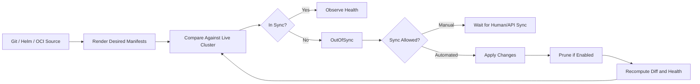

The loop has four major phases:

1. **Source acquisition** — fetch the declared state from Git, Helm repository, OCI registry, or another supported source.
2. **Manifest generation** — render Helm, Kustomize, Jsonnet, plain YAML, or plugin-generated manifests.
3. **Diff and comparison** — compare rendered desired state with live Kubernetes resources.
4. **Sync and health management** — apply/prune resources and compute health using built-in or custom health rules.

The important part is not the happy path. The important part is the **control boundary**.

Argo CD does not own your entire platform. It owns the declared Kubernetes resources represented by one or more `Application` objects, bounded by Projects, RBAC, destination rules, cluster credentials, and sync policy.

---

## 2. Argo CD Objects as a Control System

A production Argo CD installation has several layers:

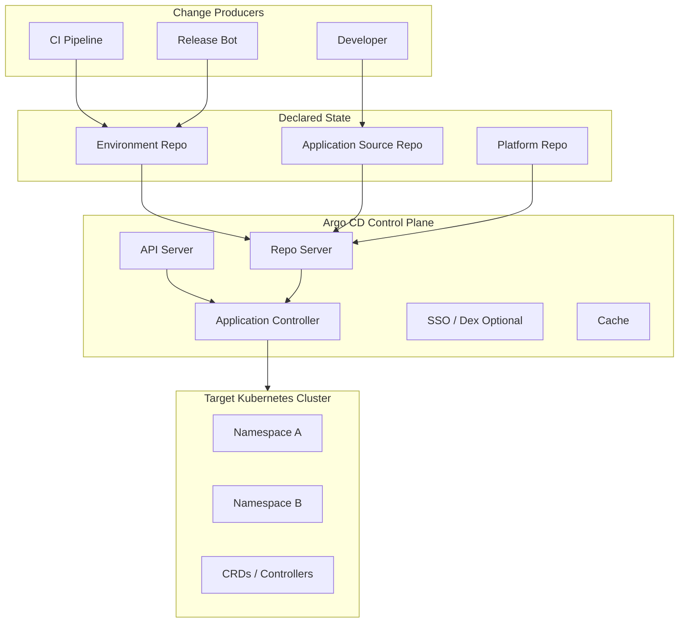

The user-facing CRDs and concepts that matter most:

| Concept | Production meaning |
|---|---|
| `Application` | Unit of desired-state reconciliation. Usually maps to one deployable app, platform component, tenant slice, or environment slice. |
| `AppProject` | Security and tenancy boundary: allowed sources, destinations, resource kinds, roles, and sync windows. |
| Source | Git path, Helm chart, Kustomize overlay, Jsonnet, OCI, or plugin-generated config. |
| Destination | Cluster + namespace where resources may be applied. |
| Sync policy | Determines whether reconciliation is manual or automated, whether prune/self-heal is enabled, and which sync options apply. |
| Health | Argo CD's interpretation of whether live resources are functioning, not merely whether YAML matches. |
| Diff | The semantic comparison between desired manifests and live objects after Kubernetes/defaulting/controllers mutate them. |
| Resource tracking | The mechanism Argo CD uses to know which live resources belong to which Application. |

The mental model:

> **An Argo CD Application is not an application in the business sense. It is a reconciliation boundary.**

Sometimes a business application has one Argo Application. Sometimes it has many: base infra, namespace bootstrap, database operator resources, deployment resources, ingress resources, observability rules, and rollout objects.

The correct split is determined by ownership, blast radius, sync ordering, failure isolation, and rollback semantics.

---

## 3. The `Application` CRD

A simplified Argo CD Application looks like this:

```yaml
apiVersion: argoproj.io/v1alpha1
kind: Application
metadata:
  name: payments-api-prod
  namespace: argocd
spec:
  project: payments
  source:
    repoURL: https://github.com/example/platform-live.git
    targetRevision: main
    path: apps/payments-api/overlays/prod
  destination:
    server: https://kubernetes.default.svc
    namespace: payments-prod
  syncPolicy:
    automated:
      prune: true
      selfHeal: true
    syncOptions:
      - CreateNamespace=true
```

This object answers five questions:

1. **What should exist?** `spec.source`
2. **Where should it exist?** `spec.destination`
3. **Who may own it?** `spec.project`
4. **How should differences be handled?** `spec.syncPolicy`
5. **How should application status be interpreted?** built-in/custom health logic

A senior engineer reviews an `Application` spec like an access-control and state-management artifact, not as a deployment config only.

### 3.1 Source Contract

The source tells Argo CD where to obtain desired state.

Common source forms:

```yaml
source:
  repoURL: https://github.com/example/platform-live.git
  targetRevision: main
  path: clusters/prod/apps/payments-api
```

```yaml
source:
  repoURL: https://charts.example.com
  chart: payments-api
  targetRevision: 1.4.2
  helm:
    valueFiles:
      - values-prod.yaml
```

```yaml
source:
  repoURL: oci://registry.example.com/platform/charts
  chart: payments-api
  targetRevision: 1.4.2
```

The key production rule:

> **Pin the thing that represents the intended release. Do not let production silently float unless that is an explicitly governed automation policy.**

`targetRevision: main` can be acceptable when the environment repo is itself the promotion boundary. In that model, production changes only when the production branch/path changes.

`targetRevision: HEAD` or broad chart ranges are riskier when they allow changes to enter without an explicit environment commit.

### 3.2 Destination Contract

The destination defines where resources are applied:

```yaml
destination:
  server: https://kubernetes.default.svc
  namespace: payments-prod
```

or:

```yaml
destination:
  name: prod-us-east-1
  namespace: payments-prod
```

Production rule:

> **Destination is an authorization boundary, not just an address.**

If an Application can point to any cluster or namespace, it can escape tenancy. This is why `AppProject` matters.

### 3.3 Sync Policy Contract

Manual sync means humans or automation explicitly trigger sync.

Automated sync means Argo CD can sync when it detects desired/live divergence.

Typical automated policy:

```yaml
syncPolicy:
  automated:
    prune: true
    selfHeal: true
  syncOptions:
    - CreateNamespace=true
    - PrunePropagationPolicy=foreground
```

`prune: true` allows Argo CD to delete resources that were previously managed but no longer appear in desired state.

`selfHeal: true` allows Argo CD to correct live drift when someone or something mutates the cluster directly.

These options are powerful. They should be enabled intentionally, not by copy-paste.

---

## 4. Application Is a Reconciliation Boundary

The most common mistake is to map Applications one-to-one with microservices because it feels intuitive.

That is sometimes correct, but not always.

Use this decision table:

| Boundary question | Split Applications when... | Keep together when... |
|---|---|---|
| Ownership | Different teams own different resources. | One team owns lifecycle end-to-end. |
| Sync ordering | One group must converge before another. | Resources can be applied as one unit. |
| Blast radius | Failure should not block unrelated components. | Failure is naturally coupled. |
| Rollback | Rollback semantics differ. | Rollback/release unit is identical. |
| Policy | Different policies apply. | Same policy envelope applies. |
| Frequency | One part changes often, another rarely. | Change frequency is similar. |
| Privilege | Some resources need cluster-level permissions. | All resources fit same privilege profile. |

Bad split:

```text
one-application-per-yaml-file
```

This creates thousands of tiny control loops with no meaningful ownership boundary.

Bad merge:

```text
one-application-for-entire-prod-cluster
```

This creates a giant blast radius where one invalid object can block unrelated platform changes.

Good split examples:

```text
platform-crds-prod
platform-controllers-prod
team-a-namespace-bootstrap-prod
payments-api-prod
payments-worker-prod
payments-observability-prod
payments-network-policy-prod
```

The shape is not about aesthetics. It is about state transition safety.

---

## 5. `AppProject` as the Security Boundary

`AppProject` is one of the most important Argo CD concepts for production.

A simplified Project:

```yaml
apiVersion: argoproj.io/v1alpha1
kind: AppProject
metadata:
  name: payments
  namespace: argocd
spec:
  description: Payments team deployment boundary
  sourceRepos:
    - https://github.com/example/platform-live.git
    - https://github.com/example/payments-api.git
  destinations:
    - server: https://kubernetes.default.svc
      namespace: payments-*
  clusterResourceWhitelist:
    - group: ""
      kind: Namespace
  namespaceResourceWhitelist:
    - group: apps
      kind: Deployment
    - group: ""
      kind: Service
    - group: networking.k8s.io
      kind: Ingress
  roles:
    - name: deployer
      policies:
        - p, proj:payments:deployer, applications, sync, payments/*, allow
      groups:
        - payments-platform-deployers
```

A Project constrains:

- which repositories can be used;
- which clusters/namespaces can be targeted;
- which cluster-scoped and namespace-scoped resource kinds can be deployed;
- which users/groups can perform actions;
- optional sync windows and role policies.

Production rule:

> **Never rely on repository layout alone for tenancy. Enforce tenancy in Argo CD Projects.**

Git path conventions can be bypassed by mistake. Project constraints are a runtime control.

### 5.1 Source Repository Allowlist

If a Project allows arbitrary source repos, a user can point Argo CD at unreviewed manifests.

Good:

```yaml
sourceRepos:
  - https://github.com/example/platform-live.git
```

Risky:

```yaml
sourceRepos:
  - '*'
```

Wildcard source repos may be acceptable for a sandbox Project, but they are not a sane default for production.

### 5.2 Destination Allowlist

Good:

```yaml
destinations:
  - server: https://kubernetes.default.svc
    namespace: payments-prod
```

Flexible but bounded:

```yaml
destinations:
  - server: https://kubernetes.default.svc
    namespace: payments-*
```

Risky:

```yaml
destinations:
  - server: '*'
    namespace: '*'
```

The wildcard version effectively says: this Project may deploy anywhere Argo CD can reach.

### 5.3 Resource Kind Allowlist

Cluster-scoped resources are dangerous because they often escape team namespaces.

Examples:

- `ClusterRole`
- `ClusterRoleBinding`
- `CustomResourceDefinition`
- `ValidatingWebhookConfiguration`
- `MutatingWebhookConfiguration`
- `Namespace`
- `StorageClass`

Production rule:

> **Separate cluster-level platform Applications from team-level workload Applications.**

Do not let normal app teams deploy arbitrary cluster-scoped resources through their workload Project.

---

## 6. Sync Status vs Health Status

Argo CD has two different questions:

1. **Sync status:** does live state match desired state?
2. **Health status:** are the live resources functioning according to health logic?

These are not the same.

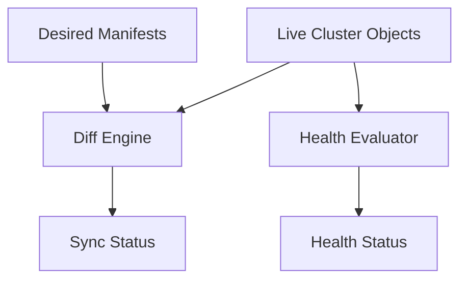

Examples:

| Sync | Health | Meaning |
|---|---|---|
| Synced | Healthy | Desired objects match live objects and appear operational. |
| Synced | Degraded | Desired objects were applied, but runtime health is bad. |
| OutOfSync | Healthy | Live app may be running, but cluster differs from Git. |
| OutOfSync | Degraded | Desired/live divergence plus unhealthy resources. |
| Unknown | Unknown | Argo cannot evaluate source, live state, or health reliably. |

This distinction prevents bad decisions.

A Synced app can still be broken.

An OutOfSync app can still be serving traffic.

### 6.1 Sync Is About Configuration Convergence

Sync status answers:

> “Do the live Kubernetes objects match the rendered desired manifests?”

Reasons for OutOfSync:

- Git changed but cluster has not been synced.
- Someone changed live resources manually.
- A controller added or changed fields that Argo CD does not ignore.
- Kubernetes defaulted fields differently from rendered manifests.
- Generated manifests are non-deterministic.
- Resource tracking lost association.
- A resource was deleted outside Argo CD.

### 6.2 Health Is About Runtime Semantics

Health status answers:

> “Given the current live resource state, does this object appear operational?”

For a `Deployment`, health may depend on available replicas.

For an `Ingress`, it may depend on load balancer status.

For a custom resource, Argo CD may need custom health rules.

Production rule:

> **Never use Sync=Synced alone as release success. Combine sync, health, rollout status, metrics, and business-level smoke checks where needed.**

---

## 7. Diff Is a Product Surface

Diff looks simple until production reality appears.

Kubernetes mutates objects. Controllers mutate objects. Admission webhooks mutate objects. Operators mutate objects. Defaulting mutates objects.

If Argo CD compares desired and live naively, it may produce endless noisy drift.

Common diff noise sources:

- injected sidecars;
- defaulted `securityContext` fields;
- reordered lists;
- generated certificates;
- webhook-injected labels/annotations;
- HPA changing replica counts;
- service mesh mutations;
- CRDs with status or controller-managed spec fields;
- Helm chart non-determinism.

A production platform must design a diff strategy.

### 7.1 Diff Noise Classification

| Noise type | Example | Treatment |
|---|---|---|
| Kubernetes defaulting | Default `protocol: TCP` | Usually ignore or normalize. |
| Controller-managed field | HPA changes `replicas` | Ignore field when intentional. |
| Admission mutation | Sidecar injection | Prefer render-time inclusion if possible; otherwise ignore known fields. |
| Non-deterministic rendering | Random suffix in Helm template | Fix template; do not ignore. |
| Unauthorized mutation | Manual image change | Do not ignore; self-heal or alert. |
| Operator-owned spec | Some CRDs modify parts of spec | Understand operator contract before ignoring. |

The dangerous mistake is to add broad ignore rules to silence drift without understanding who owns the field.

### 7.2 Field Ownership Rule

Before ignoring a diff, answer:

1. Who writes this field?
2. Who is allowed to write it?
3. Is the mutation deterministic?
4. Is the mutation required for runtime correctness?
5. Would ignoring it hide a security or availability issue?
6. Can the field be represented in desired state instead?

Only ignore fields that are intentionally owned by another trusted controller.

### 7.3 Example Ignore Difference

Example for ignoring HPA-controlled replicas:

```yaml
apiVersion: argoproj.io/v1alpha1
kind: Application
metadata:
  name: payments-api-prod
spec:
  ignoreDifferences:
    - group: apps
      kind: Deployment
      jsonPointers:
        - /spec/replicas
```

This is acceptable if HPA is truly the owner of replica count.

It is not acceptable if teams manually scale prod deployments and you merely want Argo CD to stop complaining.

---

## 8. Manual Sync vs Automated Sync

A manual sync workflow:

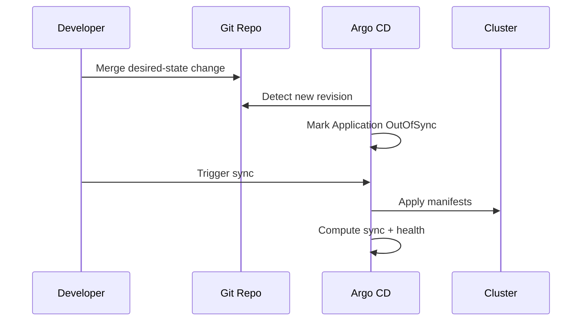

An automated sync workflow:

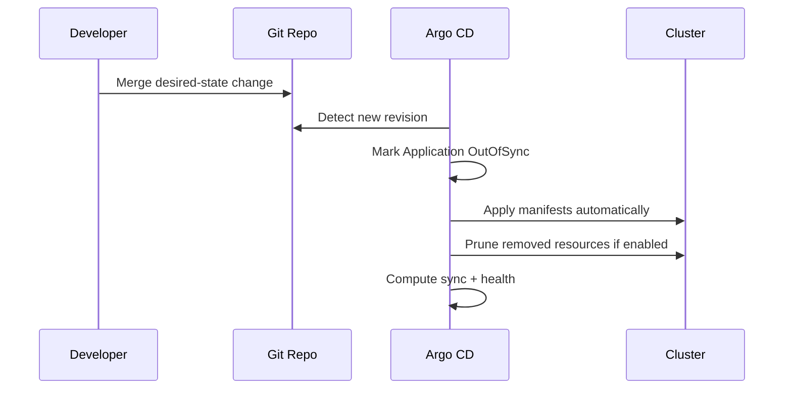

Manual sync is not automatically safer. It can create stale, human-dependent environments.

Automated sync is not automatically reckless. It can be very safe when Git merge is the governed approval point.

The decision depends on where the control gate lives.

### 8.1 Control Gate Location

| Gate location | Typical model | Risk |
|---|---|---|
| PR approval before merge | Automated sync after merge | Requires strong branch protection and policy checks. |
| Argo CD manual sync | Human sync after merge | Git can contain desired state not yet deployed. |
| Release bot promotion | Bot commits to env repo, Argo auto-syncs | Requires bot identity and approval binding. |
| Change-management ticket | Sync only after external approval | Can become disconnected from actual Git diff. |

Best production pattern:

> **Make Git merge into an environment branch/path the audited approval boundary, then let Argo CD reconcile automatically.**

Manual sync can still be useful for:

- sandbox environments;
- high-risk platform bootstrap;
- initial rollout of Argo CD itself;
- emergency windows;
- legacy change-management constraints.

### 8.2 `prune` and `selfHeal`

`prune` and `selfHeal` are two separate powers.

| Option | What it does | Main risk |
|---|---|---|
| `prune` | Deletes managed resources removed from desired state. | Accidental deletion due to bad commit/path/rendering issue. |
| `selfHeal` | Reverts live drift back to desired state. | Fighting emergency manual changes or another controller. |

Use `prune` with:

- strong review;
- clear resource tracking;
- orphan monitoring;
- protected production paths;
- diff preview in PR;
- rollback plan.

Use `selfHeal` with:

- clear field ownership;
- minimal manual production access;
- break-glass process;
- diff ignore rules for legitimate controller-owned fields.

---

## 9. Sync Options as Semantics, Not Tweaks

Argo CD sync options change behavior. Treat them as part of the deployment contract.

Common options:

```yaml
syncPolicy:
  syncOptions:
    - CreateNamespace=true
    - PrunePropagationPolicy=foreground
    - PruneLast=true
    - ServerSideApply=true
    - ApplyOutOfSyncOnly=true
```

Do not cargo-cult them.

### 9.1 `CreateNamespace=true`

Useful when the Application owns namespace creation.

Risk: if many Applications can create namespaces, namespace governance becomes decentralized.

Production rule:

> Workload Applications should usually target pre-provisioned namespaces. Namespace bootstrap should be a separate platform-owned Application unless self-service namespace creation is intentionally designed.

### 9.2 `PruneLast=true`

Useful when replacement ordering matters. It allows new resources to be applied before old resources are pruned.

Example: replacing an Ingress or service object where immediate prune could cause downtime.

### 9.3 `ServerSideApply=true`

Server-side apply can improve field ownership semantics but also introduces managed-field complexity. It is useful when resources are large or multiple actors intentionally own different fields.

Do not enable it globally without testing CRDs and controllers.

### 9.4 `ApplyOutOfSyncOnly=true`

Can reduce needless apply operations in large clusters.

Risk: it may hide side effects if a resource appears in sync but needs re-apply due to external behavior. This is less common but matters with poorly behaved CRDs/controllers.

---

## 10. Hooks and Sync Waves

Argo CD can order resources using hooks and sync waves.

Mental model:

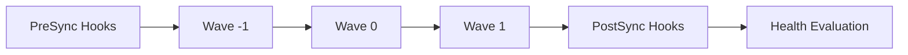

Use cases:

- apply CRDs before custom resources;
- run migration job before deployment;
- run smoke tests after deployment;
- order platform components;
- delay prune until replacement resources are ready.

Example wave annotations:

```yaml
metadata:
  annotations:
    argocd.argoproj.io/sync-wave: "10"
```

Example hook:

```yaml
apiVersion: batch/v1
kind: Job
metadata:
  name: payments-db-migration
  annotations:
    argocd.argoproj.io/hook: PreSync
    argocd.argoproj.io/hook-delete-policy: HookSucceeded
spec:
  template:
    spec:
      restartPolicy: Never
      containers:
        - name: migrate
          image: registry.example.com/payments/migrator@sha256:...
```

### 10.1 Hooks Are Not a Workflow Engine

Do not abuse Argo CD hooks to implement complex business deployment workflows.

Hooks are useful for Kubernetes-adjacent orchestration. They are poor at:

- long-running approval workflows;
- multi-system transactions;
- complex rollback logic;
- cross-environment promotion;
- compensating actions across cloud providers;
- human-in-the-loop workflows.

If the deployment has many external steps, model those in CI/release orchestration and let Argo CD reconcile the resulting desired state.

### 10.2 Migration Hooks Are Dangerous

Database migration hooks are common but easy to misuse.

Risks:

- repeated execution after sync retry;
- destructive migration tied to app rollout;
- migration succeeds but deployment fails;
- deployment succeeds but migration is incompatible;
- rollback cannot reverse schema change.

Production rule:

> **Use Argo CD hooks for safe, idempotent, bounded operations. Treat irreversible stateful changes as a separate release concern.**

We will go deeper in Part 033.

---

## 11. Resource Tracking and Orphans

Argo CD must know which live resources belong to which Application.

If tracking is wrong, Argo CD may fail to prune resources, mark false drift, or fight with another Application.

Production issues:

- two Applications manage the same resource;
- labels are overwritten by Helm/templates;
- resources are moved between Applications without migration;
- generated names change;
- resources remain orphaned after path changes;
- multiple Argo CD instances target the same cluster.

### 11.1 Ownership Rule

> **Exactly one Argo CD Application should own a given Kubernetes resource, unless the field-level ownership model is explicitly designed and tested.**

Kubernetes does not protect you from two GitOps controllers fighting over the same object.

Example conflict:

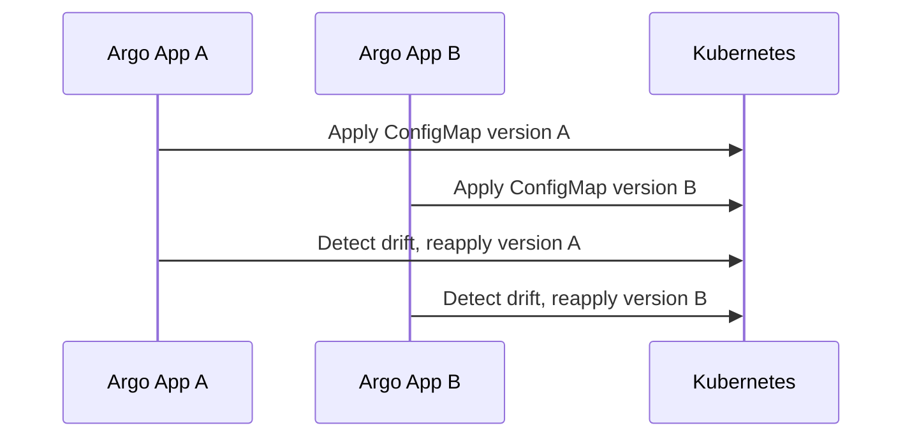

This is not reconciliation. This is a distributed conflict loop.

### 11.2 Moving Resources Between Applications

Do not simply move YAML from one Application path to another in production without a plan.

Safe migration approach:

1. Disable prune temporarily or use an explicit migration window.
2. Ensure the destination Application can adopt or apply the resource without destructive replacement.
3. Sync destination.
4. Verify ownership/tracking.
5. Remove from source.
6. Re-enable prune.
7. Confirm no orphaned resources remain.

---

## 12. App-of-Apps Pattern

The app-of-apps pattern uses one parent Application to manage child Application resources.

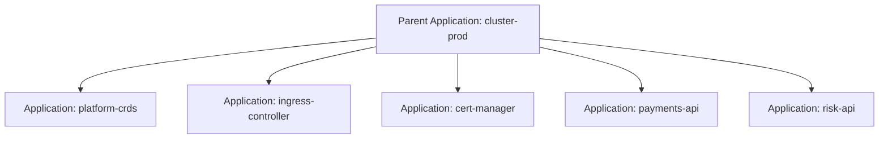

Parent desired state contains child `Application` manifests.

Example:

```yaml
apiVersion: argoproj.io/v1alpha1
kind: Application
metadata:
  name: cluster-prod-root
  namespace: argocd
spec:
  project: platform
  source:
    repoURL: https://github.com/example/platform-live.git
    targetRevision: main
    path: clusters/prod/apps
  destination:
    server: https://kubernetes.default.svc
    namespace: argocd
```

Child Application:

```yaml
apiVersion: argoproj.io/v1alpha1
kind: Application
metadata:
  name: payments-api-prod
  namespace: argocd
spec:
  project: payments
  source:
    repoURL: https://github.com/example/platform-live.git
    targetRevision: main
    path: clusters/prod/payments/api
  destination:
    server: https://kubernetes.default.svc
    namespace: payments-prod
```

### 12.1 When App-of-Apps Works Well

It works well for:

- cluster bootstrapping;
- explicit inventory of cluster Applications;
- platform-owned dependency ordering;
- keeping all app registrations in Git;
- avoiding manual Application creation.

### 12.2 Where App-of-Apps Can Hurt

It can hurt when:

- the parent becomes a giant monolithic control point;
- all child app changes require platform repo ownership;
- tenant teams cannot safely manage their own Application specs;
- sync ordering is assumed but not enforced correctly;
- deleting a child Application unexpectedly cascades.

Production rule:

> **Use app-of-apps to declare the control-plane inventory, not to hide release complexity.**

For large fleets, ApplicationSet is often a better generator model.

---

## 13. ApplicationSet as Fleet Generation

ApplicationSet generates many Applications from templates and generators.

Use cases:

- same app across many clusters;
- same baseline across many environments;
- tenant-specific Applications;
- pull request preview environments;
- cluster fleet bootstrap.

Mental model:

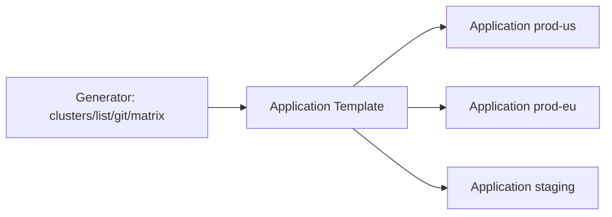

Example list generator:

```yaml
apiVersion: argoproj.io/v1alpha1
kind: ApplicationSet
metadata:
  name: payments-api
  namespace: argocd
spec:
  generators:
    - list:
        elements:
          - cluster: prod-us
            url: https://prod-us.example
            namespace: payments-prod
          - cluster: prod-eu
            url: https://prod-eu.example
            namespace: payments-prod
  template:
    metadata:
      name: 'payments-api-{{cluster}}'
    spec:
      project: payments
      source:
        repoURL: https://github.com/example/platform-live.git
        targetRevision: main
        path: 'apps/payments-api/overlays/{{cluster}}'
      destination:
        server: '{{url}}'
        namespace: '{{namespace}}'
```

### 13.1 Generator Risk

ApplicationSet multiplies changes. A bad template can break many environments.

Guardrails:

- use small rollout batches;
- require code review for generator templates;
- avoid broad wildcard cluster selectors in production;
- use Projects to constrain generated Applications;
- monitor generated Application count;
- test generated manifests in staging.

### 13.2 Matrix Explosion

Matrix generators are powerful but can accidentally produce huge fleets.

Before using a matrix, define:

- expected number of Applications;
- maximum allowed number;
- naming convention;
- destination constraints;
- owner mapping;
- deletion behavior.

---

## 14. Multi-Tenancy Model

Argo CD multi-tenancy is not automatic. You design it.

There are two common models.

### 14.1 Shared Argo CD Instance

One Argo CD control plane manages many teams and clusters.

Pros:

- centralized operations;
- consistent policy;
- easier observability;
- lower operational overhead;
- shared SSO/RBAC.

Cons:

- stronger isolation design needed;
- blast radius of Argo CD outage is larger;
- Project/RBAC mistakes affect many teams;
- repository credential management is more sensitive.

### 14.2 Argo CD Per Tenant or Per Cluster

Each tenant/cluster has its own Argo CD.

Pros:

- strong blast-radius isolation;
- simpler local permissions;
- fewer cross-team conflicts;
- easier ownership for autonomous teams.

Cons:

- duplicated operations;
- inconsistent policy risk;
- harder fleet visibility;
- more upgrades and secrets to manage.

### 14.3 Recommended Boundary

For many enterprises:

```text
shared Argo CD per platform domain or environment class,
not necessarily one global instance for everything.
```

Example:

```text
argocd-platform-prod
argocd-workloads-prod
argocd-nonprod
argocd-sandbox
```

This separates high-privilege platform control from lower-privilege workload control.

---

## 15. RBAC and SSO Design

Argo CD RBAC must align with Git ownership and Kubernetes tenancy.

A dangerous design:

```text
Git allows team A to modify payments manifests,
but Argo CD allows team A to sync/delete any application.
```

Another dangerous design:

```text
Argo CD Project restricts destination,
but Git repository allows team A to edit another team's path.
```

RBAC must be end-to-end:

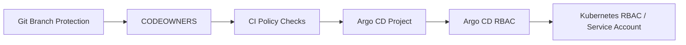

### 15.1 Roles You Actually Need

| Role | Capability |
|---|---|
| Viewer | View Applications and status. |
| Developer | View app, inspect diff/logs, maybe sync non-prod. |
| Release manager | Sync/promote prod apps where manual sync is used. |
| Platform operator | Manage Projects, clusters, repo credentials, Argo CD config. |
| Break-glass operator | Temporary emergency power with strong audit. |
| Automation bot | Narrow API permissions for controlled operations. |

Do not give teams admin because it is easier.

### 15.2 Sync Permission Is Production Power

The ability to sync can deploy whatever is currently declared in Git for that Application.

If Git already has a dangerous change merged, sync permission is effectively apply permission.

Therefore:

- protect production branches/paths;
- bind sync permission to the right Project;
- audit manual syncs;
- prefer Git merge as the main production gate;
- restrict delete/action permissions.

---

## 16. Repository Credentials and Cluster Credentials

Argo CD stores credentials to read sources and mutate clusters.

These credentials are highly sensitive.

### 16.1 Repository Access

Principles:

- prefer read-only deploy keys or app credentials;
- scope credentials to required repos;
- avoid broad personal access tokens;
- rotate credentials;
- separate tenant credentials when necessary;
- audit repo access failures.

### 16.2 Cluster Access

Cluster credentials determine what Argo CD can mutate.

Dangerous:

```text
one cluster-admin credential for all Applications and all teams
```

Better:

```text
separate Argo CD instances or destination permissions by privilege domain
```

In some setups, Argo CD still needs broad cluster permissions to manage many resources. If so, Project restrictions, admission policy, and Git controls become even more important.

Production rule:

> **Treat Argo CD as a privileged production actor. Harden it like you would harden a CI runner with production cloud credentials.**

---

## 17. CI and Argo CD Responsibilities

A clean design separates CI and GitOps responsibilities.

| Concern | CI | Argo CD |
|---|---|---|
| Compile/test application | Yes | No |
| Build image | Yes | No |
| Generate SBOM/provenance | Yes | No, may verify indirectly |
| Sign image | Yes | No, may enforce via admission |
| Update desired state | Yes, via PR/bot | Reads result |
| Render manifests for validation | Yes | Yes for reconciliation |
| Apply to cluster | Usually no | Yes |
| Observe sync/health | May query | Yes |
| Rollout analysis | CI/release tool or Argo Rollouts | Basic health; advanced via integrations |

Bad pattern:

```text
CI builds image, then directly kubectl applies production manifests,
while Argo CD later tries to reconcile from Git.
```

This creates two deployment authorities.

Good pattern:

```text
CI builds and signs image,
updates environment Git with immutable digest,
Argo CD reconciles cluster from Git.
```

---

## 18. Image Updates and Digest Discipline

Avoid deploying floating image tags in production.

Risky:

```yaml
image: registry.example.com/payments-api:latest
```

Better:

```yaml
image: registry.example.com/payments-api@sha256:2f8c...
```

Or tag plus digest:

```yaml
image: registry.example.com/payments-api:1.42.0@sha256:2f8c...
```

Argo CD sees manifests. If the manifest points to a mutable tag and the registry changes behind that tag, Git no longer fully describes what is running.

Production rule:

> **GitOps desired state should identify immutable artifacts.**

This connects directly to Part 021 and Part 022: SBOM, provenance, image signing, and attestation are only meaningful when the deployed artifact identity is stable.

---

## 19. Argo CD and Secrets

Argo CD should not become your secret management system.

Common patterns:

1. Store encrypted secrets in Git using SOPS or Sealed Secrets.
2. Store only secret references in Git and let External Secrets Operator materialize Kubernetes Secrets.
3. Use Vault/cloud secret managers and inject at runtime.
4. Use Argo CD plugin integration to decrypt/render manifests.

Preferred production model for many teams:

```text
Git stores secret references and metadata.
External secret controller fetches actual value from a secret manager.
Argo CD reconciles the reference object, not the raw secret value.
```

Example:

```yaml
apiVersion: external-secrets.io/v1beta1
kind: ExternalSecret
metadata:
  name: payments-api-db
  namespace: payments-prod
spec:
  refreshInterval: 1h
  secretStoreRef:
    name: prod-secrets
    kind: ClusterSecretStore
  target:
    name: payments-api-db
  data:
    - secretKey: password
      remoteRef:
        key: prod/payments/db
        property: password
```

Argo CD owns the `ExternalSecret`, not necessarily the resulting `Secret` value lifecycle.

---

## 20. Argo CD and Policy

Policy should appear at multiple points:

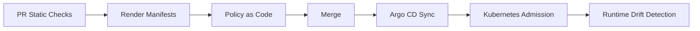

Argo CD itself is not a complete policy engine. It provides Projects, RBAC, sync windows, diffing, and reconciliation. For richer policy, use:

- CI checks against rendered manifests;
- OPA/Conftest/Kyverno CLI in PR;
- Kubernetes admission policy;
- image verification policy;
- cloud/IaC policy gates before infra apply.

Production rule:

> **Do not wait until admission to discover obvious deployment violations. Catch them in PR, enforce them at admission, and observe them after deployment.**

---

## 21. Sync Windows and Change Freeze

Sync windows constrain when Applications may sync.

Use cases:

- freeze production during business-critical periods;
- allow only certain Projects to sync during maintenance;
- block automated sync but allow manual override by privileged operator;
- enforce deployment windows for regulated systems.

Be careful: sync windows do not replace approval and release governance. They are a time-based guardrail.

Bad:

```text
No PR approval, but production is safe because sync window is narrow.
```

Good:

```text
PR approval + policy checks + automated sync,
with sync windows for exceptional freeze periods.
```

---

## 22. Argo CD Observability

Useful signals:

| Signal | Why it matters |
|---|---|
| Application sync status | Detect desired/live divergence. |
| Application health | Detect runtime degradation. |
| Reconciliation latency | Detect controller lag. |
| Repo server errors | Detect source/render failures. |
| Sync failures | Detect apply/admission/resource errors. |
| Orphaned resources | Detect ownership leaks. |
| API latency | Detect control-plane health. |
| Redis/cache issues | Detect degraded Argo CD internals. |
| Controller queue depth | Detect scale bottlenecks. |
| Auth/RBAC failures | Detect misconfiguration or misuse. |

Production dashboards should answer:

1. Which Applications are OutOfSync?
2. Which Applications are Degraded?
3. Which Applications have not reconciled recently?
4. Which syncs failed and why?
5. Which Projects/clusters are affected?
6. Is Argo CD itself healthy?
7. Are failures source/render/admission/Kubernetes/runtime failures?

### 22.1 Status Is Not Enough

A beautiful Argo CD dashboard can still hide customer impact.

Connect Argo CD state to:

- service-level indicators;
- rollout metrics;
- logs and traces;
- incident management;
- audit evidence;
- deployment frequency and change failure rate.

---

## 23. Failure Model

Argo CD failure modes fall into categories.

### 23.1 Source Failures

Examples:

- repository unreachable;
- credentials expired;
- branch/path missing;
- Helm repo unavailable;
- OCI registry unavailable;
- Git commit deleted/rebased unexpectedly.

Symptoms:

- Application status Unknown;
- manifest generation error;
- repo server errors;
- no new revisions detected.

Response:

1. Check repo credential and network path.
2. Confirm source revision exists.
3. Re-render locally if possible.
4. Avoid force-pushing production desired state branches.
5. Restore source availability before manual cluster mutation.

### 23.2 Render Failures

Examples:

- invalid Helm values;
- Kustomize patch fails;
- missing CRD schema;
- plugin error;
- non-deterministic generator;
- dependency chart unavailable.

Response:

1. Reproduce render in CI.
2. Fail PR if render is invalid.
3. Pin chart/dependency versions.
4. Avoid environment-specific implicit dependencies.

### 23.3 Diff Failures

Examples:

- CRD not installed;
- object too large;
- permission denied reading resource;
- malformed live object;
- API server issue.

Response:

1. Verify Argo CD service account permissions.
2. Check CRD lifecycle ordering.
3. Inspect API server errors.
4. Check resource tracking labels/annotations.

### 23.4 Sync Failures

Examples:

- admission policy rejects resource;
- immutable field change requires replacement;
- namespace missing;
- CRD not established;
- RBAC denied;
- quota exceeded;
- image pull secret missing;
- webhook timeout.

Response:

1. Read sync operation details.
2. Classify as config error, policy error, platform dependency, or cluster capacity.
3. Fix desired state unless emergency live mitigation is required.
4. Avoid repeated blind retries.

### 23.5 Health Failures

Examples:

- Deployment cannot progress;
- Pod crash loop;
- Service has no endpoints;
- Ingress has no address;
- custom resource reports degraded;
- rollout analysis fails.

Response:

1. Inspect Kubernetes events.
2. Check application logs/metrics.
3. Confirm image digest and config.
4. Roll forward or revert desired state.
5. Avoid treating health failure as Argo CD failure unless Argo health logic is wrong.

---

## 24. Production Runbooks

### 24.1 Application OutOfSync

Checklist:

1. Is Git ahead of live cluster?
2. Was sync expected to be automated?
3. Is automated sync disabled or blocked by sync window?
4. Is there a diff ignore issue?
5. Did someone mutate live state?
6. Is Argo CD unable to fetch/render?
7. Is another controller fighting Argo CD?

Decision:

- If Git change is approved and safe: sync.
- If live drift is unauthorized: restore from Git or investigate incident.
- If diff is legitimate controller-owned mutation: add precise ignore rule.
- If desired state is wrong: revert/fix Git.

### 24.2 Application Degraded but Synced

Checklist:

1. Which resource is degraded?
2. Is this app config, cluster capacity, image, secret, dependency, or policy?
3. Did the problem start after a revision change?
4. Is the image digest correct?
5. Are secrets/config maps present?
6. Did admission mutate the resource?
7. Are rollout conditions progressing?

Decision:

- If bad release: roll forward/revert desired state.
- If missing dependency: restore dependency.
- If health rule is wrong: fix custom health logic.
- If cluster issue: escalate platform incident.

### 24.3 Sync Fails Due to Immutable Field

Example: changing a Service cluster IP or certain StatefulSet fields.

Response:

1. Determine if replacement is safe.
2. Use blue-green resource replacement if downtime matters.
3. Avoid forcing delete in production without dependency analysis.
4. Encode migration in Git, not manual one-off steps.

### 24.4 Bad Commit Auto-Synced to Production

Response:

1. Revert or fix commit in environment repo.
2. Let Argo CD reconcile to the corrected desired state.
3. Do not manually patch unless immediate mitigation is required.
4. Capture incident evidence: revision, sync time, actor, policy checks, impact.
5. Add missing pre-merge control if the bad commit should have been blocked.

---

## 25. Scaling Argo CD

Scaling issues appear as your number of Applications, clusters, repos, and manifests grows.

Common pressure points:

- repo server manifest generation CPU/memory;
- controller reconciliation queue;
- Kubernetes API throttling;
- large Applications with many resources;
- too many frequent refreshes;
- expensive Helm/Kustomize rendering;
- network latency to remote clusters;
- Redis/cache performance;
- high cardinality metrics.

Design tactics:

- split giant Applications by ownership/blast radius;
- tune reconciliation intervals thoughtfully;
- avoid unnecessary webhook storms;
- cache dependencies where possible;
- use multiple Argo CD instances for isolation;
- monitor controller queues and repo server latency;
- avoid pathological generator templates;
- keep rendered manifests deterministic and compact.

Production rule:

> **Scale Argo CD by reducing unnecessary control-loop work, not only by adding replicas.**

---

## 26. Argo CD Hardening Checklist

Minimum production checklist:

- SSO enabled.
- Admin account disabled or tightly controlled.
- RBAC least privilege.
- Projects restrict source repos and destinations.
- Cluster-scoped resources restricted.
- Repository credentials scoped and rotated.
- Production branches protected.
- CODEOWNERS aligned with Application ownership.
- Automated sync policy intentionally chosen.
- Prune/self-heal enabled only where appropriate.
- Diff ignore rules reviewed and specific.
- Admission policy protects cluster runtime.
- Image digest/signature policy enforced where required.
- Argo CD components monitored.
- Backup/restore plan for Argo CD config.
- Upgrade process tested in non-prod.
- Break-glass process documented.
- App-of-apps/ApplicationSet deletion behavior understood.
- Multi-tenancy model reviewed.

---

## 27. Anti-Patterns

### 27.1 Argo CD as CI

Do not use Argo CD to build/test artifacts. It reconciles Kubernetes state.

### 27.2 CI and Argo CD Both Deploy

Do not let CI directly apply the same resources Argo CD manages.

### 27.3 Wildcard Project Everything

A Project with `sourceRepos: ['*']` and `destinations: ['*']` is not tenancy. It is a shared admin tunnel.

### 27.4 One Application for the Whole Cluster

This creates massive blast radius and noisy diffs.

### 27.5 Thousands of Meaningless Applications

This creates operational overhead without better ownership.

### 27.6 Ignoring Diff Instead of Fixing Ownership

Diff ignores are sharp tools. Use them after field ownership analysis.

### 27.7 Floating Production Artifacts

Mutable tags undermine GitOps evidence.

### 27.8 Manual Dashboard Changes as Normal Process

The UI is useful for observation and controlled operations. It should not become the primary release workflow.

---

## 28. Design Review Questions

Use these in architecture reviews:

1. What is the Application boundary and why?
2. Which team owns this Application?
3. Which Project constrains it?
4. Which source repos are allowed?
5. Which destinations are allowed?
6. Are cluster-scoped resources allowed? Why?
7. Is sync manual or automated?
8. Is prune enabled? What protects against accidental deletion?
9. Is self-heal enabled? What protects emergency operations?
10. Are image references immutable?
11. How are secrets represented?
12. What policy gates run before merge?
13. What admission policy runs at apply time?
14. What is the rollback path?
15. What happens if Argo CD is unavailable?
16. What happens if the Git repo is unavailable?
17. What happens if sync partially fails?
18. Which metrics page this team during incidents?
19. How is evidence captured for production changes?
20. Can another Application or controller mutate the same resources?

---

## 29. Practical Exercise

Design an Argo CD deployment model for this scenario:

```text
Company: regulated fintech
Clusters: staging, prod-us, prod-eu
Teams: platform, payments, risk, customer-identity
Apps: APIs, workers, scheduled jobs
Constraints:
- prod changes require PR approval and policy checks
- teams cannot deploy cluster-scoped resources
- images must be pinned by digest
- external secrets are pulled from cloud secret manager
- emergency break-glass is allowed but must be audited
- prod-us and prod-eu must be promoted independently
```

Deliverables:

1. Project model.
2. Application boundary model.
3. Repo path model.
4. Sync policy model.
5. Secret model.
6. RBAC model.
7. Rollback model.
8. Failure runbook for bad production sync.

A strong answer separates platform Applications from workload Applications, uses Projects for tenancy, uses automated sync after governed merge, pins image digests, and treats external secrets as references.

---

## 30. Summary

Argo CD is powerful because it turns Kubernetes deployment into a continuous reconciliation problem.

That power is dangerous if you only understand the UI.

The production mental model is:

- `Application` is a reconciliation boundary.
- `AppProject` is a tenancy and security boundary.
- Sync status is not health status.
- Diff rules encode field ownership.
- Automated sync is safe only when Git merge is governed.
- Prune and self-heal are production powers.
- App-of-apps and ApplicationSet are inventory/generation tools, not magic architecture.
- Argo CD should not compete with CI, policy engines, or secret managers.
- The cluster must have one clear deployment authority per resource.

In Part 024 we move to Flux. Flux solves the same GitOps problem with a different architecture: composable controllers, source artifacts, explicit dependency graph, and Kubernetes-native reconciliation primitives.

---

## References

- Argo CD Documentation — https://argo-cd.readthedocs.io/en/stable/
- Argo CD Automated Sync — https://argo-cd.readthedocs.io/en/stable/user-guide/auto_sync/
- Argo CD Sync Options — https://argo-cd.readthedocs.io/en/latest/user-guide/sync-options/
- Argo CD AppProject Specification — https://argo-cd.readthedocs.io/en/stable/operator-manual/project-specification/
- Argo CD ApplicationSet — https://argo-cd.readthedocs.io/en/stable/operator-manual/applicationset/
- OpenGitOps Principles — https://opengitops.dev/
