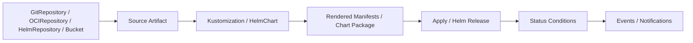
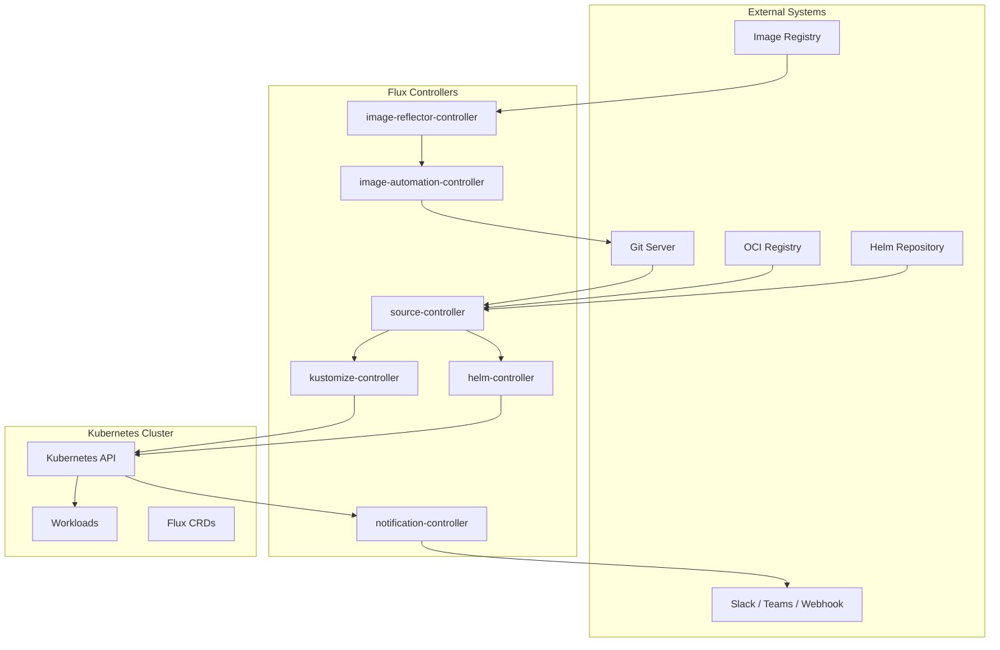
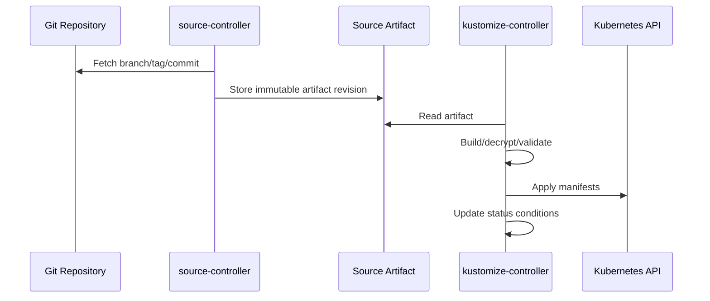
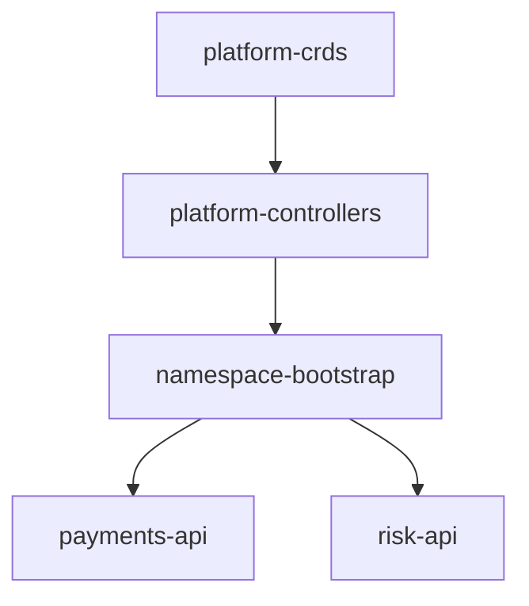
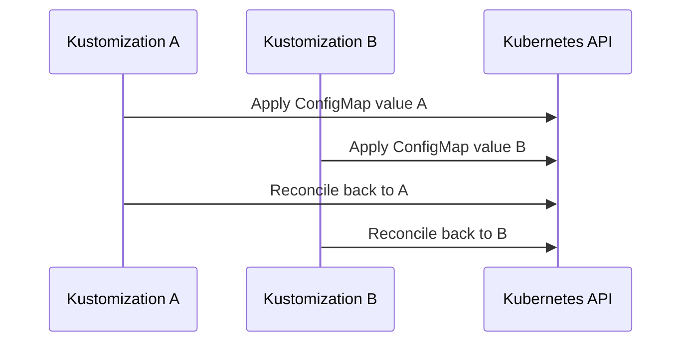
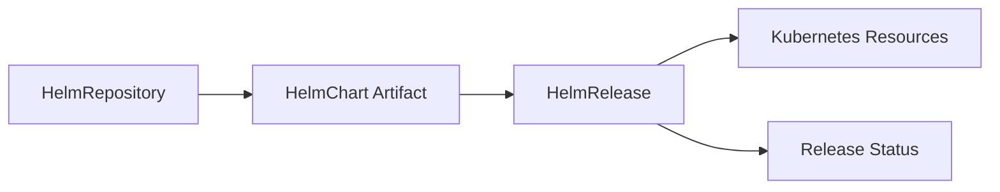
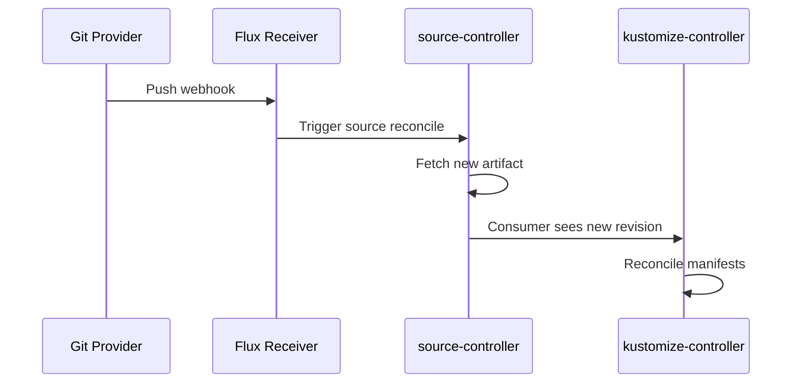
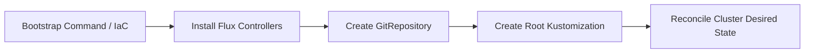
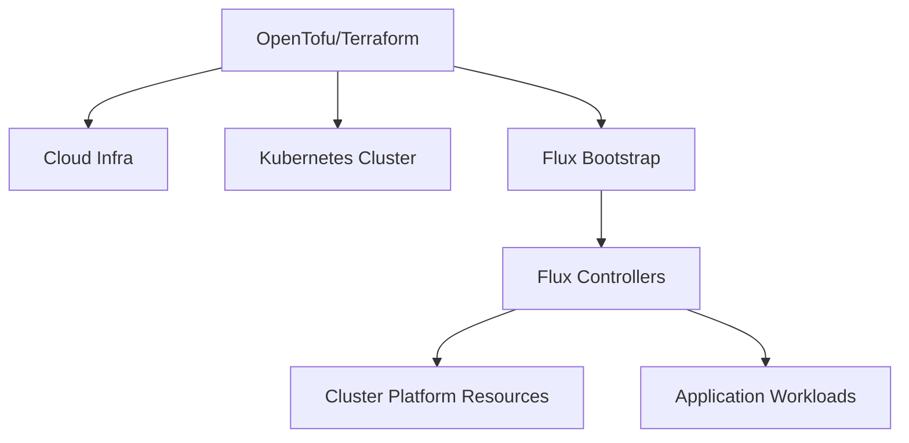
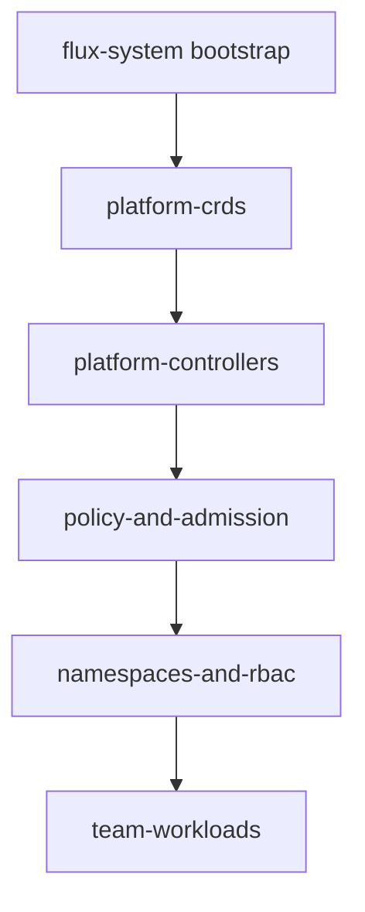

# Part 024 — Flux Core Model

Flux is often compared directly with Argo CD. That comparison is useful, but it can hide the most important difference.

A practical mental model:

> **Flux is a Kubernetes-native GitOps toolkit made of composable controllers. Each controller reconciles a narrow resource type, writes status back to Kubernetes, and composes with other controllers through artifacts, references, conditions, and dependency edges.**

Where Argo CD often feels like an application-centric deployment control plane, Flux feels like a set of Kubernetes controllers that turn sources into artifacts, artifacts into rendered manifests, rendered manifests into applied resources, Helm definitions into releases, notifications into events, and image policies into Git changes.

This part explains Flux as an operating model.

We care about:

- source artifacts;
- controller responsibilities;
- Kustomization reconciliation;
- HelmRelease reconciliation;
- dependency ordering;
- health and status conditions;
- suspend/resume behavior;
- image automation;
- receiver/webhook-triggered reconciliation;
- multi-tenancy;
- security boundaries;
- failure recovery.

Flux is not “Argo CD without a UI.” It has a different control shape.

---

## 1. The Smallest Useful Mental Model

Flux reconciliation can be simplified like this:



Flux separates source fetching from apply logic.

That separation is important.

In Flux, a `GitRepository` does not deploy anything by itself. It produces an artifact. A `Kustomization` consumes that artifact and applies manifests. A `HelmRelease` describes desired Helm release state and depends on Helm/source controllers to obtain chart artifacts.

This creates explicit boundaries:

| Boundary | Flux object | Responsibility |
|---|---|---|
| Source acquisition | `GitRepository`, `OCIRepository`, `HelmRepository`, `Bucket` | Fetch external source and produce artifact. |
| Manifest reconciliation | `Kustomization` | Decrypt/build/validate/apply manifests. |
| Helm release reconciliation | `HelmRelease`, `HelmChart` | Install/upgrade/test/rollback Helm releases. |
| Event routing | `Provider`, `Alert`, `Receiver` | Send notifications and trigger reconciliations. |
| Image automation | `ImageRepository`, `ImagePolicy`, `ImageUpdateAutomation` | Track images and update Git according to policy. |

The key idea:

> **Flux composes reconciliation primitives instead of hiding everything behind one Application abstraction.**

---

## 2. GitOps Toolkit Architecture

A typical Flux installation includes several controllers.



Controller responsibilities:

| Controller | What it does |
|---|---|
| `source-controller` | Fetches Git, OCI, Helm repositories, buckets; creates artifacts consumed by other controllers. |
| `kustomize-controller` | Reconciles `Kustomization` objects by fetching source artifacts, decrypting, building, validating, applying, pruning, and checking health. |
| `helm-controller` | Reconciles `HelmRelease` objects by installing/upgrading/uninstalling Helm releases. |
| `notification-controller` | Handles alerts, providers, and receivers for events/webhooks. |
| `image-reflector-controller` | Scans image repositories and reflects available tags in Kubernetes resources. |
| `image-automation-controller` | Writes image updates back to Git based on image policies. |

This is more modular than a single deployment server.

The trade-off: you must understand the graph.

---

## 3. Source Artifact Model

Flux source resources fetch external content and publish artifacts.

Example `GitRepository`:

```yaml
apiVersion: source.toolkit.fluxcd.io/v1
kind: GitRepository
metadata:
  name: platform-live
  namespace: flux-system
spec:
  interval: 1m
  url: https://github.com/example/platform-live.git
  ref:
    branch: main
```

This tells Flux:

- where to fetch from;
- how often to check;
- which ref to track;
- where to expose the resulting artifact internally.

A `Kustomization` can then consume it:

```yaml
apiVersion: kustomize.toolkit.fluxcd.io/v1
kind: Kustomization
metadata:
  name: payments-api-prod
  namespace: flux-system
spec:
  interval: 5m
  sourceRef:
    kind: GitRepository
    name: platform-live
  path: ./clusters/prod/payments/api
  prune: true
  wait: true
  timeout: 3m
```

The mental model:



### 3.1 Why Artifacts Matter

Artifacts give Flux a stable internal unit of reconciliation.

Benefits:

- decouples source polling from apply;
- allows multiple consumers of the same source;
- records observed revision/digest;
- makes controller status easier to reason about;
- supports Git, OCI, Helm, bucket-like sources through a similar pattern.

Production rule:

> **Debug Flux by following the artifact chain: source object → artifact revision → consumer object → applied resources → status condition.**

---

## 4. Source Types

Flux supports multiple source types.

### 4.1 `GitRepository`

Use for Git-based desired state.

```yaml
apiVersion: source.toolkit.fluxcd.io/v1
kind: GitRepository
metadata:
  name: apps
  namespace: flux-system
spec:
  interval: 1m
  url: ssh://git@github.com/example/platform-live.git
  ref:
    branch: main
  secretRef:
    name: github-deploy-key
```

Production considerations:

- prefer deploy keys or narrowly scoped app credentials;
- avoid personal tokens;
- protect production branches;
- avoid force-push on environment branches;
- pin tags/commits when required for release evidence;
- consider webhook receivers for faster reconciliation.

### 4.2 `OCIRepository`

Use for OCI-packaged manifests or artifacts.

This is useful when platform teams want immutable, registry-hosted deployment artifacts.

Benefits:

- digest-addressable artifacts;
- registry access controls;
- artifact signing/provenance integration;
- promotion by digest.

Risk:

- hides human readability if Git no longer directly contains final desired state;
- requires strong artifact build/provenance controls.

### 4.3 `HelmRepository`

Use for index-based Helm repositories.

```yaml
apiVersion: source.toolkit.fluxcd.io/v1
kind: HelmRepository
metadata:
  name: ingress-nginx
  namespace: flux-system
spec:
  interval: 1h
  url: https://kubernetes.github.io/ingress-nginx
```

### 4.4 `Bucket`

Use when desired state is stored in object storage.

Less common for standard app delivery, but useful in specialized platform setups.

---

## 5. `Kustomization` Is the Core Apply Unit

Flux `Kustomization` is not the same thing as a `kustomization.yaml` file.

Flux `Kustomization` is a CRD that defines a reconciliation pipeline:

```text
fetch artifact → decrypt → build → validate → apply → prune → wait/health-check → update status
```

Example:

```yaml
apiVersion: kustomize.toolkit.fluxcd.io/v1
kind: Kustomization
metadata:
  name: payments-api-prod
  namespace: flux-system
spec:
  interval: 5m
  retryInterval: 1m
  timeout: 3m
  sourceRef:
    kind: GitRepository
    name: platform-live
  path: ./clusters/prod/apps/payments-api
  prune: true
  wait: true
  targetNamespace: payments-prod
  dependsOn:
    - name: payments-namespace
  healthChecks:
    - apiVersion: apps/v1
      kind: Deployment
      name: payments-api
      namespace: payments-prod
```

This object defines:

- source artifact;
- path inside artifact;
- reconciliation interval;
- retry interval;
- target namespace;
- pruning behavior;
- dependency edges;
- health/wait behavior;
- timeout;
- optional decryption;
- optional service account impersonation.

Production mental model:

> **Flux Kustomization is the reconciliation boundary equivalent you review for ownership, blast radius, ordering, and recovery.**

---

## 6. Kustomization Dependency Graph

Flux supports explicit dependencies between Kustomizations.

```yaml
spec:
  dependsOn:
    - name: platform-crds
    - name: platform-controllers
```

Graph:



This is one of Flux's strongest production features: dependency ordering is expressed as CRD relationships rather than hidden CI script order.

### 6.1 Good Dependency Edges

Good dependencies represent true readiness requirements:

- CRDs before custom resources;
- namespace/RBAC before workloads;
- external-secrets operator before ExternalSecret objects;
- cert-manager before Certificate resources;
- ingress controller before Ingress resources if health depends on it;
- policy CRDs before policy objects.

### 6.2 Bad Dependency Edges

Bad dependencies create unnecessary coupling:

- every app depends on every other app;
- all workloads depend on observability being fully healthy;
- dependency edges used as release sequencing instead of resource readiness;
- cyclic dependencies;
- dependencies across unrelated tenancy boundaries.

Production rule:

> **Use dependency edges for infrastructure readiness, not as a replacement for release orchestration.**

---

## 7. `wait`, `healthChecks`, and Readiness

Flux can wait for resources to become ready.

```yaml
spec:
  wait: true
  timeout: 5m
```

or explicit health checks:

```yaml
spec:
  healthChecks:
    - apiVersion: apps/v1
      kind: Deployment
      name: payments-api
      namespace: payments-prod
```

The important distinction:

- apply success means Kubernetes accepted the desired resources;
- readiness means resources reached acceptable status;
- business success requires application-level validation beyond Kubernetes readiness.

Production rule:

> **Use Flux readiness as an infrastructure convergence signal, not as complete release validation.**

For critical services, combine Flux status with:

- rollout metrics;
- synthetic checks;
- service-level indicators;
- error budget impact;
- canary analysis.

---

## 8. Pruning and Ownership

`prune: true` tells Flux to delete objects that were previously applied by the Kustomization but are no longer present in desired state.

```yaml
spec:
  prune: true
```

This is powerful and dangerous.

Use prune when:

- source path is stable;
- ownership boundary is clear;
- review catches deletions;
- generated output is deterministic;
- resources are not shared across Kustomizations;
- deletion ordering is understood.

Avoid or delay prune when:

- migrating resources between Kustomizations;
- bootstrapping a fragile cluster;
- converting legacy manually managed resources;
- CRDs and custom resources have deletion-order risk;
- operators create child resources you do not want Flux to own.

### 8.1 Moving Resources Safely

Resource movement requires care.

Process:

1. Identify current owner Kustomization.
2. Add resource to new Kustomization without pruning old one yet.
3. Reconcile new owner.
4. Confirm inventory/ownership behavior.
5. Remove from old owner.
6. Reconcile old owner with prune only when safe.
7. Verify no orphan or duplicate ownership remains.

Bad move:

```text
move YAML path + merge + hope prune/adoption works
```

Good move:

```text
planned ownership migration with temporary prune controls and verification
```

---

## 9. Flux Inventory

Flux tracks what a Kustomization applied so it can prune and report status.

Production implication:

> **Kustomization boundaries are ownership boundaries.**

Do not let two Kustomizations apply the same resource unless you have a deliberate field-ownership model and have tested it. Most teams should avoid shared ownership.

Conflict loop:



This is not resilience. It is controller conflict.

---

## 10. Reconciliation Timing

Flux objects have intervals.

Example:

```yaml
spec:
  interval: 5m
  retryInterval: 1m
```

`interval` controls regular reconciliation.

`retryInterval` controls retry cadence after failure.

Webhook receivers can trigger reconciliation faster than polling.

### 10.1 Interval Design

Do not set every interval to 10 seconds because you want fast deployment.

Costs:

- more Git/API calls;
- more controller work;
- more noise;
- rate limiting;
- harder debugging;
- wasted reconciliation if sources rarely change.

Common production strategy:

| Object type | Interval tendency |
|---|---|
| Source for active app repo | 1m–5m, or webhook-triggered. |
| Platform baseline | 5m–15m. |
| Helm repo indexes | 10m–1h depending on update needs. |
| Image scanning | Depends on release velocity and registry limits. |
| Sandbox | Faster if needed. |
| Regulated prod | Often webhook-triggered plus moderate interval. |

The actual values depend on system scale and operational constraints.

### 10.2 Manual Reconcile

Flux supports explicit reconciliation via CLI/annotations.

Use manual reconcile for:

- debugging;
- emergency acceleration;
- after fixing source credentials;
- after dependency recovery;
- during controlled rollout.

Do not use manual reconcile as the normal deployment process if the goal is Git-driven automation.

---

## 11. Suspend and Resume

Flux resources can be suspended.

Example:

```yaml
spec:
  suspend: true
```

Use cases:

- freeze reconciliation during incident mitigation;
- pause a broken Kustomization;
- stop image automation temporarily;
- migrate ownership;
- avoid repeated failed Helm upgrades while debugging.

Risk:

A suspended object stops converging. Drift can accumulate.

Production rule:

> **Suspension is an incident or migration tool. It must have an owner, reason, timestamp, and resume condition.**

A suspended production reconciler without tracking is operational debt.

---

## 12. HelmRelease Core Model

Flux Helm support is centered on `HelmRelease`.

Example:

```yaml
apiVersion: helm.toolkit.fluxcd.io/v2
kind: HelmRelease
metadata:
  name: ingress-nginx
  namespace: platform-ingress
spec:
  interval: 10m
  chart:
    spec:
      chart: ingress-nginx
      version: 4.10.0
      sourceRef:
        kind: HelmRepository
        name: ingress-nginx
        namespace: flux-system
  values:
    controller:
      replicaCount: 3
```

Mental model:



The Helm controller reconciles actual Helm release state with the `HelmRelease` spec.

### 12.1 HelmRelease Is Not Just `helm upgrade` in YAML

A `HelmRelease` includes operational semantics:

- interval;
- chart source;
- chart version;
- values;
- install strategy;
- upgrade strategy;
- rollback/remediation behavior;
- test behavior;
- dependency references;
- target namespace;
- service account;
- status conditions.

Production rule:

> **Review HelmRelease specs like deployment controllers, not like static chart config.**

### 12.2 Helm Chart Versioning

Avoid unbounded chart updates in production unless there is explicit automation governance.

Risky:

```yaml
version: "*"
```

Better:

```yaml
version: "4.10.0"
```

or controlled semver range for non-prod:

```yaml
version: "4.x"
```

For critical platform components, pin versions and promote them intentionally.

### 12.3 Helm Values as API

Helm values are a public API between chart author and platform consumer.

Problems:

- values schema missing;
- chart behavior changes under same value key;
- defaults change between versions;
- values create invalid manifests;
- secrets placed directly in values;
- production overrides drift from staging.

Mitigation:

- pin chart versions;
- validate rendered manifests in CI;
- use chart schemas where available;
- keep environment deltas small;
- store secret references, not raw secret values;
- test upgrades in staging.

---

## 13. Helm Remediation and Failure Semantics

Helm upgrades can fail after partial resource changes.

Flux HelmRelease can define remediation behavior. You need to understand what is safe for your workload.

Failure scenarios:

- chart renders invalid manifests;
- admission rejects resource;
- immutable field change fails;
- Deployment does not become ready;
- hook job fails;
- CRD upgrade breaks custom resources;
- rollback fails because previous version is incompatible.

Production rules:

1. Do not rely on automatic rollback for irreversible migrations.
2. Test chart upgrades against realistic cluster policy.
3. Separate CRD lifecycle from controller Helm release when required.
4. Use explicit remediation strategy for critical releases.
5. Monitor HelmRelease conditions.

---

## 14. Flux and Kustomize Overlays

Flux works naturally with Kustomize overlays.

Example repo:

```text
clusters/
  prod-us/
    infrastructure/
      kustomization.yaml
    apps/
      payments-api/
        kustomization.yaml
  prod-eu/
    infrastructure/
    apps/
apps/
  payments-api/
    base/
      deployment.yaml
      service.yaml
    overlays/
      prod-us/
        kustomization.yaml
      prod-eu/
        kustomization.yaml
```

Flux Kustomization points at a path:

```yaml
spec:
  path: ./clusters/prod-us/apps/payments-api
```

This path may reference other Kustomize bases.

Production concerns:

- path must be deterministic;
- overlay depth should remain understandable;
- patches should be specific;
- generated names should be stable;
- environment deltas should be visible;
- rendered manifests should be validated before merge.

---

## 15. Decryption and Secret Handling

Flux `Kustomization` can integrate with SOPS decryption.

Example:

```yaml
apiVersion: kustomize.toolkit.fluxcd.io/v1
kind: Kustomization
metadata:
  name: payments-api-prod
  namespace: flux-system
spec:
  interval: 5m
  sourceRef:
    kind: GitRepository
    name: platform-live
  path: ./clusters/prod/payments-api
  decryption:
    provider: sops
    secretRef:
      name: sops-age
```

Patterns:

1. Encrypted secrets in Git, decrypted by Flux.
2. ExternalSecret references in Git, materialized by External Secrets Operator.
3. HelmRelease values from Kubernetes Secrets/ConfigMaps.
4. Runtime secret injection outside Flux.

Production preference often mirrors Part 017:

> **Use Git for secret metadata and references. Keep high-value secret values in a dedicated secret manager unless encrypted Git is explicitly accepted by your risk model.**

If Flux can decrypt secrets, Flux becomes a high-value secret actor. Harden its namespace, service account, and decryption key.

---

## 16. Notification Controller

Flux notification-controller provides two important capabilities:

1. Send events to external systems.
2. Receive webhooks that trigger reconciliation.

Typical objects:

- `Provider`
- `Alert`
- `Receiver`

Example alert concept:

```yaml
apiVersion: notification.toolkit.fluxcd.io/v1beta3
kind: Alert
metadata:
  name: platform-alerts
  namespace: flux-system
spec:
  providerRef:
    name: slack
  eventSeverity: error
  eventSources:
    - kind: Kustomization
      name: '*'
```

Use notifications for:

- failed reconciliations;
- source fetch errors;
- Helm upgrade failures;
- image automation commits;
- production sync visibility.

Do not spam every successful reconcile into chat. Route high-signal events.

### 16.1 Receiver Webhooks

Receivers can trigger reconciliation from external webhook events, such as Git push events.

Mental model:



This reduces delay versus pure polling.

Security considerations:

- validate webhook secret/token;
- restrict exposed endpoint;
- monitor failed webhook attempts;
- do not treat webhooks as authorization;
- Git branch protection remains the change gate.

---

## 17. Image Automation

Flux image automation can scan registries, select tags based on policy, and commit updates back to Git.

Components:

| Object | Purpose |
|---|---|
| `ImageRepository` | Scans image tags from a registry. |
| `ImagePolicy` | Selects a tag according to semver, numerical, alphabetical, or digest policy. |
| `ImageUpdateAutomation` | Writes selected image updates to Git. |

Flow:


### 17.1 Why Image Automation Is Risky

Image automation can turn registry events into production Git changes.

That is powerful but dangerous.

Risks:

- bad image tag automatically promoted;
- mutable tags hide real artifact identity;
- automation commits bypass human review;
- production update happens without release approval;
- tag policy selects unintended version;
- generated commit lacks evidence or provenance.

Production rule:

> **Image automation should update a controlled branch/path and still pass policy, provenance, and environment promotion rules.**

For production, prefer digest-aware updates and PR-based promotion unless your organization has intentionally accepted direct automation commits.

### 17.2 Good Image Automation Pattern

```text
CI builds image by digest
CI signs image and publishes provenance
Flux image automation detects candidate in dev/staging
Automation opens PR or commits to non-prod path
Promotion to prod requires release approval
Admission verifies signature/provenance
```

---

## 18. Multi-Tenancy in Flux

Flux multi-tenancy is designed through namespaces, RBAC, service accounts, source permissions, and Kustomization boundaries.

Unlike Argo CD Projects, Flux relies more directly on Kubernetes-native authorization and controller scoping patterns.

### 18.1 Namespace-Based Tenancy

Example:

```text
flux-system        platform-owned controllers and cluster sources
team-payments      team-owned Flux objects and workload resources
team-risk          team-owned Flux objects and workload resources
```

Teams may have permission to create/update Kustomizations in their namespace but not cluster-wide resources.

### 18.2 Service Account Impersonation

Flux Kustomizations can apply resources using a specified service account.

Example:

```yaml
spec:
  serviceAccountName: payments-reconciler
```

This is a powerful isolation mechanism.

The controller reconciles the object, but the apply operation can be constrained by the service account's Kubernetes RBAC.

Production rule:

> **Use service account impersonation to make Kubernetes RBAC part of the GitOps boundary.**

This gives you defense-in-depth: even if a team commits a forbidden resource, the apply should fail unless the reconciler service account has permission.

### 18.3 Source Access

Source references can create cross-tenant leaks if not controlled.

Risks:

- tenant Kustomization references platform source unexpectedly;
- tenant source contains cluster-scoped resources;
- shared GitRepository credential reads more repos than intended;
- malicious path points to unauthorized config.

Mitigations:

- namespace-scoped sources;
- scoped credentials;
- admission policies for Flux CRDs;
- repository path conventions;
- CODEOWNERS;
- service account RBAC;
- policy checks on rendered manifests.

---

## 19. Flux Bootstrap Model

Flux bootstrap installs Flux components and connects a cluster to a Git repository.

Conceptually:



Production bootstrap concerns:

- who can bootstrap clusters;
- how bootstrap credentials are generated;
- where controller manifests live;
- how Flux upgrades are managed;
- how cluster identity is represented in Git;
- how root Kustomization is protected;
- how disaster recovery works if Flux namespace is deleted.

Do not let bootstrap remain a one-off laptop command with no audit.

Production rule:

> **Cluster bootstrap should be an auditable platform workflow, preferably driven by IaC and recorded in the environment repository.**

---

## 20. Flux With Terraform/OpenTofu

Flux and Terraform/OpenTofu solve different layers.

| Concern | Terraform/OpenTofu | Flux |
|---|---|---|
| Cloud infrastructure | Strong fit | Usually not direct fit unless via controllers/CRDs. |
| Kubernetes app resources | Possible, but often not ideal for continuous drift reconciliation | Strong fit. |
| State backend | Explicit state file | Kubernetes API/status/inventory. |
| Reconciliation | Plan/apply lifecycle | Continuous controller loop. |
| Drift correction | Explicit plan/apply | Continuous reconcile. |
| Secrets | Provider/state risk | Manifest/secret-controller risk. |

Common production pattern:

```text
Terraform/OpenTofu provisions cloud accounts, clusters, IAM, networking, and base controllers.
Flux reconciles cluster platform components and workloads.
```

Boundary:



Avoid managing the same Kubernetes resources with both Terraform and Flux.

---

## 21. Flux and Policy

Flux does not remove the need for policy.

Policy points:

1. PR checks on rendered manifests.
2. Admission policy against Flux CRDs and workload resources.
3. RBAC for Flux service accounts.
4. Image verification at admission.
5. Source reference restrictions.
6. Notification of policy failures.

Example policies:

- Kustomizations in team namespaces must set `serviceAccountName`.
- Production Kustomizations must set `prune: true` only with approved annotation.
- Tenant Kustomizations cannot reference `flux-system` sources unless allowed.
- HelmRelease chart versions must be pinned in production.
- Image automation cannot commit directly to production branch.
- Kustomization path must stay under approved prefix.

Production rule:

> **Treat Flux CRDs as privileged deployment APIs. Protect them with RBAC and admission policy.**

---

## 22. Flux Status and Conditions

Flux resources report status conditions.

You should read them like controller truth, not like logs.

Common ideas:

- `Ready=True` means the reconciler believes the object is currently healthy/converged.
- `Ready=False` means reconciliation failed or readiness condition was not met.
- status often includes observed revision/artifact information.
- events provide recent reconciliation details.

Debug flow:

```text
GitRepository Ready?
  if no: source/credential/network/ref problem
Kustomization Ready?
  if no: path/render/decrypt/apply/health problem
HelmRelease Ready?
  if no: chart/fetch/render/install/upgrade/readiness problem
Workload Ready?
  if no: Kubernetes/app runtime problem
```

---

## 23. Observability

Useful Flux signals:

| Signal | Why it matters |
|---|---|
| Source reconcile success/failure | Detect Git/registry/credential issues. |
| Artifact revision | Know what desired state is being consumed. |
| Kustomization readiness | Detect apply/health failures. |
| HelmRelease readiness | Detect chart/release failures. |
| Reconcile duration | Detect slow render/apply. |
| Reconcile interval vs lag | Detect controller backlog. |
| Suspended resources | Detect paused convergence. |
| Image automation commits | Track automated release changes. |
| Notification errors | Detect alerting blind spots. |
| Kubernetes API errors | Detect RBAC/admission/capacity problems. |

Dashboards should answer:

1. Are all sources ready?
2. Are all production Kustomizations ready?
3. Which artifact revision is deployed?
4. Which Helm releases failed upgrades?
5. Which resources are suspended?
6. Is reconciliation lag increasing?
7. Are controllers healthy?
8. Are alerts firing for the right failures?

---

## 24. Failure Model

### 24.1 Source Fetch Failure

Examples:

- Git server unreachable;
- invalid deploy key;
- branch missing;
- webhook triggers but fetch fails;
- registry authentication error;
- Helm index unavailable.

Runbook:

1. Inspect source object status.
2. Verify credentials secret.
3. Verify network/DNS/proxy.
4. Verify branch/tag/ref exists.
5. Trigger manual reconcile after fix.
6. Confirm consumers observe new artifact.

### 24.2 Kustomization Render Failure

Examples:

- invalid Kustomize patch;
- missing base path;
- SOPS decryption failure;
- malformed YAML;
- invalid substitution;
- duplicate resources.

Runbook:

1. Reproduce render locally or in CI.
2. Fix path/patch/secret key.
3. Add PR validation to prevent recurrence.
4. Confirm Kustomization Ready becomes true.

### 24.3 Apply Failure

Examples:

- RBAC denied for service account;
- admission policy rejection;
- quota exceeded;
- CRD missing;
- immutable field change;
- namespace missing.

Runbook:

1. Inspect Kustomization events/status.
2. Identify exact resource and API error.
3. Classify as desired-state error, policy error, RBAC error, or dependency error.
4. Fix Git or platform dependency.
5. Avoid manually patching unless emergency.

### 24.4 Health Failure

Examples:

- Deployment unavailable;
- Job failed;
- Helm release timeout;
- dependency Kustomization not ready;
- custom resource not ready.

Runbook:

1. Inspect workload events.
2. Check image pull, secrets, config, scheduling, readiness probes.
3. Check recent artifact revision.
4. Revert/roll forward Git if release is bad.
5. Escalate cluster issue if unrelated to app config.

### 24.5 Image Automation Failure

Examples:

- registry auth fails;
- ImagePolicy selects wrong tag;
- Git commit fails;
- automation loops on formatting;
- update bypasses review.

Runbook:

1. Suspend automation if needed.
2. Check ImageRepository/ImagePolicy status.
3. Verify policy selection logic.
4. Review Git commit behavior.
5. Add branch protection/PR mode where required.

---

## 25. Argo CD vs Flux Mental Difference

Do not reduce the choice to UI preference.

| Dimension | Argo CD tendency | Flux tendency |
|---|---|---|
| Primary abstraction | Application | Controller resources / Kustomization / HelmRelease |
| UX | Strong web UI and app-centric view | CLI/Kubernetes-native; UIs often external/add-on |
| Composition | App-of-apps, ApplicationSet | Source artifacts, dependsOn graph, toolkit controllers |
| Multi-tenancy | AppProject and RBAC | Kubernetes RBAC, namespaces, service accounts, policy |
| Source/app separation | Application combines source + destination | Source objects separate from consumers |
| Debug style | Inspect Application sync/health/diff | Follow source → artifact → consumer conditions |
| Git updates | Usually external CI/release automation | Built-in image automation can update Git |
| Platform feel | Deployment control plane | GitOps controller toolkit |

Flux is especially attractive when you want:

- fully Kubernetes-native primitives;
- explicit dependency graph;
- controller composition;
- no central application UI dependency;
- image automation integrated into GitOps;
- strong namespace/RBAC-based tenancy.

Argo CD is especially attractive when you want:

- rich operator UI;
- app-centric experience;
- centralized deployment visibility;
- built-in diff/sync workflows;
- strong Project-based logical tenancy;
- ApplicationSet fleet generation.

We will compare them more directly in Part 025.

---

## 26. Production Design Patterns

### 26.1 Platform Root Kustomization

```yaml
apiVersion: kustomize.toolkit.fluxcd.io/v1
kind: Kustomization
metadata:
  name: platform-root
  namespace: flux-system
spec:
  interval: 10m
  sourceRef:
    kind: GitRepository
    name: platform-live
  path: ./clusters/prod/platform
  prune: true
  wait: true
```

This root applies platform Kustomizations, not every workload object directly.

### 26.2 Layered Cluster Model



Each layer is its own Kustomization with explicit dependencies.

### 26.3 Tenant Reconciler Service Accounts

```yaml
apiVersion: kustomize.toolkit.fluxcd.io/v1
kind: Kustomization
metadata:
  name: payments-workloads
  namespace: team-payments
spec:
  serviceAccountName: payments-reconciler
  sourceRef:
    kind: GitRepository
    name: payments-live
  path: ./prod
  prune: true
```

Kubernetes RBAC constrains what `payments-reconciler` can apply.

### 26.4 Source Per Trust Boundary

Do not let every tenant use a shared broad Git credential.

```text
platform-live source: platform-owned credential
payments-live source: payments-owned credential
risk-live source: risk-owned credential
```

---

## 27. Anti-Patterns

### 27.1 One Giant Root Kustomization Applies Everything

This creates huge blast radius and poor failure isolation.

### 27.2 All Kustomizations Use `flux-system` Admin Power

This defeats Kubernetes-native tenancy.

### 27.3 Every Interval Set to 1 Second

This overloads controllers and external systems.

### 27.4 Image Automation Directly Updates Production Without Governance

This turns registry tags into production deployments.

### 27.5 HelmRelease With Floating Versions in Production

This lets upstream chart changes enter production unexpectedly.

### 27.6 Suspended Resources Forgotten

Suspension stops convergence. Forgotten suspension is hidden drift.

### 27.7 Two Controllers Own Same Resource

Flux vs Flux, Flux vs Argo, Flux vs Terraform, or Flux vs manual operations can all create conflict loops.

### 27.8 Treating Flux as a Black Box

Flux is controller-driven. Debug status conditions and events systematically.

---

## 28. Design Review Questions

Use these for production Flux reviews:

1. What is the source object and who owns its credentials?
2. What artifact revision is deployed?
3. What is the Kustomization boundary?
4. What resources can this Kustomization prune?
5. Does it use a constrained service account?
6. Are dependencies explicit and acyclic?
7. Are CRDs applied before custom resources?
8. Are Helm chart versions pinned?
9. What happens if Helm upgrade fails?
10. Are secrets encrypted or externally referenced?
11. Are source refs allowed by policy?
12. Can tenant resources reference platform sources?
13. Are production resources protected by branch rules?
14. Are image automation updates reviewed?
15. What notification path catches failures?
16. Which resources are suspended?
17. Does any other system own the same resources?
18. How is rollback performed?
19. How is cluster bootstrap recovered?
20. What evidence proves what revision was reconciled?

---

## 29. Practical Exercise

Design a Flux model for this platform:

```text
Clusters:
- prod-us
- prod-eu
- staging

Teams:
- platform
- payments
- risk

Requirements:
- platform owns CRDs, ingress, cert-manager, external-secrets, policy engine
- teams own workload manifests
- teams cannot apply cluster-scoped resources
- secrets come from cloud secret manager through External Secrets Operator
- prod Helm chart versions must be pinned
- image automation allowed in staging, PR-only for production
- every production reconcile failure must alert Slack/PagerDuty
```

Deliverables:

1. Source object layout.
2. Kustomization dependency graph.
3. Namespace/RBAC model.
4. Service account impersonation design.
5. HelmRelease policy.
6. Image automation design.
7. Notification design.
8. Failure runbook for source failure, apply failure, and bad image update.

A strong answer uses layered Kustomizations, separate platform and tenant sources, constrained service accounts, explicit `dependsOn`, pinned production chart versions, and PR-based production image promotion.

---

## 30. Summary

Flux is a GitOps toolkit, not just a deployment product.

The production mental model:

- source controllers turn external desired state into artifacts;
- Kustomizations consume artifacts and reconcile manifests;
- HelmReleases reconcile Helm release state;
- dependency edges make readiness order explicit;
- status conditions are the primary debugging interface;
- pruning defines ownership and deletion power;
- service account impersonation makes Kubernetes RBAC part of the deployment boundary;
- image automation is powerful but must be governed;
- notification and receiver objects connect Flux to external workflows;
- Flux CRDs are privileged deployment APIs and need policy protection.

Argo CD and Flux both implement GitOps reconciliation, but their operating shapes differ. Argo CD is more application/control-plane oriented. Flux is more composable/controller-native.

Part 025 will compare them directly and build a decision framework for choosing Argo CD, Flux, both, or neither in specific platform contexts.

---

## References

- Flux Documentation — https://fluxcd.io/flux/
- Flux Concepts — https://fluxcd.io/flux/concepts/
- Flux Kustomization API — https://fluxcd.io/flux/components/kustomize/kustomizations/
- Flux HelmRelease API — https://fluxcd.io/flux/components/helm/helmreleases/
- Flux Source Controller — https://fluxcd.io/flux/components/source/
- Flux Image Automation — https://fluxcd.io/flux/guides/image-update/
- OpenGitOps Principles — https://opengitops.dev/
