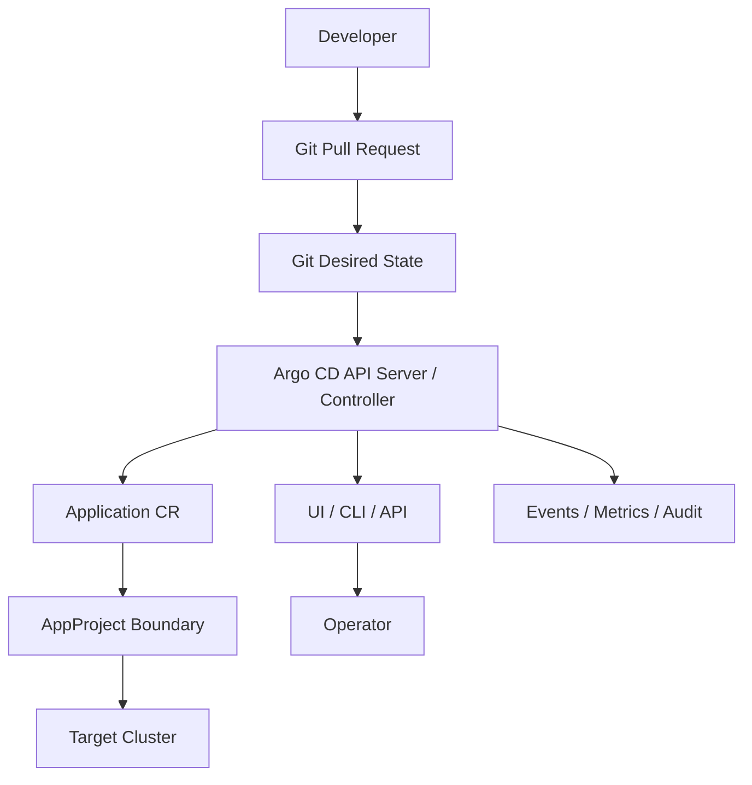
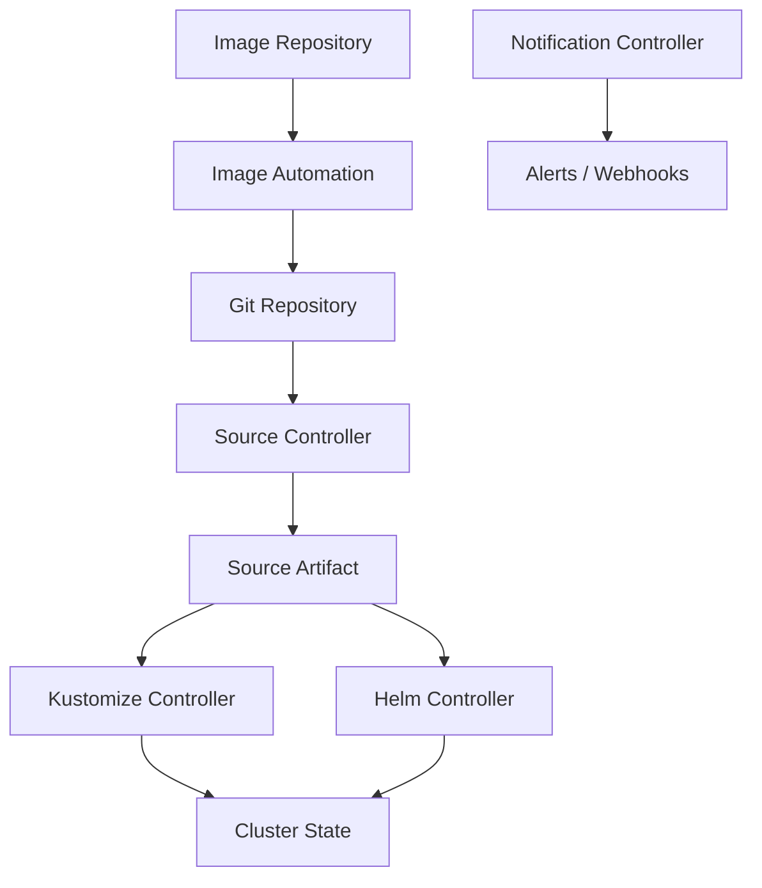
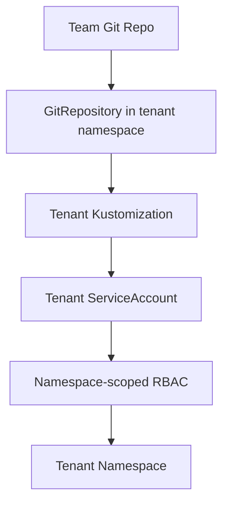
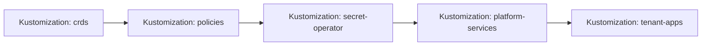
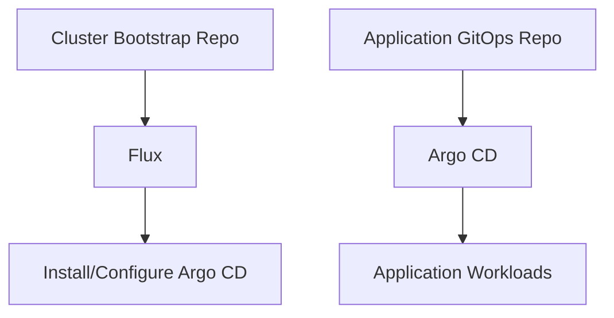

# Part 025 — Argo CD vs Flux: Architecture Decision Framework

## Tujuan Part Ini

Part sebelumnya membahas **Argo CD core model** dan **Flux core model** secara terpisah. Sekarang kita harus menjawab pertanyaan yang lebih sulit:

> Dalam organisasi nyata, kapan kita memilih Argo CD, kapan memilih Flux, kapan menggunakan keduanya, dan kapan justru keduanya bukan masalah utama?

Engineer biasa memilih tool dari popularitas, UI, tutorial, atau preferensi pribadi. Engineer platform senior memilih berdasarkan **operating model**.

GitOps engine bukan sekadar alat deploy Kubernetes. Ia adalah **state reconciliation control plane**. Ia menerima desired state, membandingkannya dengan live state, menjalankan apply, mendeteksi drift, mengatur authorization, dan menghasilkan evidence operasional.

Jadi pertanyaan sebenarnya bukan:

> Mana yang lebih bagus, Argo CD atau Flux?

Pertanyaan yang benar:

> Control plane seperti apa yang dibutuhkan organisasi ini, dan failure mode apa yang sanggup kita operasikan?

Part ini akan membangun decision framework yang bisa dipakai dalam architecture review, platform RFC, atau production readiness review.

---

## 1. Mental Model: Jangan Bandingkan Fitur, Bandingkan Control Plane

Argo CD dan Flux sama-sama implementasi GitOps untuk Kubernetes. Keduanya sama-sama bisa mengambil manifests dari Git, melakukan reconciliation, mendukung Kustomize/Helm, dan berjalan secara pull-based di dalam cluster.

Tetapi keduanya punya bentuk control plane yang berbeda.

Secara kasar:

- **Argo CD** terasa seperti centralized GitOps application control plane dengan UI, RBAC, AppProject, Application, sync operation, diff view, dan operator experience yang kuat.
- **Flux** terasa seperti composable Kubernetes-native reconciliation toolkit dengan controller-controller kecil, CRD granular, source artifacts, dependency graph, dan declarative automation yang sangat natural untuk platform-as-code.

Perbedaan ini penting karena platform yang baik bukan hanya menjawab “bisa deploy atau tidak”, tetapi juga:

- siapa boleh melihat apa,
- siapa boleh sync apa,
- siapa boleh override reconciliation,
- bagaimana tenant diisolasi,
- bagaimana dependency antar komponen dimodelkan,
- bagaimana incident didiagnosis,
- bagaimana evidence dikumpulkan,
- bagaimana controller di-upgrade,
- bagaimana bootstrap cluster dilakukan,
- bagaimana privilege GitOps engine dibatasi.

Tooling hanya kulit. Yang kita desain adalah **operating envelope**.

---

## 2. Baseline: Kapan Keduanya Sama-Sama Valid

Dalam banyak kasus, baik Argo CD maupun Flux dapat dipakai dengan aman.

Keduanya valid bila kebutuhan Anda adalah:

- Kubernetes manifests dikelola declaratively dari Git.
- Reconciliation berjalan otomatis di cluster.
- Drift terhadap desired state perlu dideteksi.
- Helm dan Kustomize perlu didukung.
- Environment dikelola lewat branch, path, atau repo.
- Audit perubahan mengikuti Git history dan controller events.
- Multi-cluster delivery diperlukan.

Jika organisasi masih berada di fase awal, perbedaan tool mungkin tidak langsung terasa. Tetapi pada skala besar, perbedaan muncul di area berikut:

1. **Operator experience**
2. **Tenancy model**
3. **RBAC dan authorization**
4. **Reconciliation granularity**
5. **Dependency modeling**
6. **Bootstrap strategy**
7. **Extensibility**
8. **Failure diagnosis**
9. **Automation maturity**
10. **Platform team operating model**

Ini adalah area yang akan kita bedah.

---

## 3. Decision Axis Utama

Gunakan axis berikut sebagai frame awal.

| Axis | Argo CD Cenderung Kuat Saat | Flux Cenderung Kuat Saat |
|---|---|---|
| Operator UI | Tim membutuhkan UI kuat untuk diff, sync, health, visibility | Tim nyaman dengan kubectl, events, CLI, dan dashboards sendiri |
| Central control plane | Platform ingin satu GitOps console lintas cluster/app | Platform ingin controller toolkit yang tersebar dan Kubernetes-native |
| Tenancy | AppProject/RBAC menjadi boundary utama | Namespace, service account impersonation, dan controller-level isolation menjadi boundary utama |
| App modeling | Unit deployment alami disebut Application | Unit deployment alami disebut Kustomization/HelmRelease/source artifact |
| Dependency | Sync waves/hooks dan app-of-apps cukup | DAG dependency antar Kustomization/HelmRelease lebih natural |
| Bootstrap | UI/central management penting setelah bootstrap | Bootstrap GitOps minimal dan deklaratif sangat penting |
| Automation | Manusia sering perlu inspect/sync/rollback via UI | Automation lebih dominan daripada interaksi manual |
| GitOps-as-platform | Platform ingin portal-like deployment control | Platform ingin CRD-native building blocks |
| Multi-tenancy strict | Perlu desain ekstra agar AppProject/RBAC benar-benar ketat | Namespace/RBAC/service account impersonation model sangat natural |
| Cognitive style | Application-centric | Controller/resource-centric |

Jangan treat tabel ini sebagai dogma. Treat sebagai **initial hypothesis** yang harus diuji terhadap constraint organisasi Anda.

---

## 4. Architecture View

### 4.1 Argo CD as Application Control Plane



Argo CD menonjol ketika deployment dipahami sebagai kumpulan **Applications** yang perlu dilihat, dibandingkan, disinkronkan, dan dioperasikan oleh manusia maupun automation.

Argo CD sangat berguna ketika platform team ingin:

- satu console untuk status banyak aplikasi,
- diff yang mudah dibaca,
- manual sync dengan kontrol ketat,
- RBAC berbasis project,
- emergency rollback lewat UI/CLI,
- ApplicationSet untuk generate banyak Application,
- AppProject untuk membatasi destination, source repo, dan resource.

Konsekuensinya: Anda sedang mengoperasikan **central GitOps application control plane**. Ia powerful, tetapi juga harus diamankan seperti production control plane.

### 4.2 Flux as Composable Reconciliation Toolkit



Flux menonjol ketika GitOps dipahami sebagai kumpulan controller kecil yang saling berkomposisi.

Flux sangat berguna ketika platform team ingin:

- everything as Kubernetes resources,
- source artifact explicit,
- dependency graph antar reconciler,
- multi-tenancy berbasis namespace/RBAC/service account,
- GitOps bootstrap yang minimal,
- image automation sebagai bagian dari GitOps flow,
- controller-level composability,
- integrasi kuat dengan Kubernetes-native workflows.

Konsekuensinya: Anda sedang membangun **GitOps toolkit**, bukan hanya deployment console. Observability dan operator experience perlu dirancang secara eksplisit.

---

## 5. The Wrong Question: “Mana yang Lebih Enterprise?”

Istilah “enterprise” sering menyesatkan. Argo CD bisa sangat enterprise. Flux juga bisa sangat enterprise.

Yang membedakan bukan label, tetapi jawaban terhadap pertanyaan berikut:

1. Apakah deployment akan sering dioperasikan manual oleh platform/application operator?
2. Apakah developer perlu visibility self-service lewat UI?
3. Apakah cluster akan multi-tenant secara ketat?
4. Apakah setiap tenant punya namespace, repo, dan service account sendiri?
5. Apakah dependency antar komponen perlu dimodelkan sebagai DAG eksplisit?
6. Apakah image automation perlu commit balik ke Git?
7. Apakah bootstrap cluster harus sangat minimal dan reproducible?
8. Apakah organization punya standard observability stack yang bisa menggantikan UI bawaan?
9. Apakah platform team nyaman mengoperasikan CRD/controller sebagai API publik internal?
10. Apakah audit evidence lebih banyak diambil dari Git/CI atau dari GitOps UI/API?

Jawaban atas pertanyaan ini lebih penting daripada benchmark fitur.

---

## 6. Operator Experience

### 6.1 Argo CD: Human-Readable Control Surface

Argo CD biasanya lebih unggul ketika operator manusia perlu memahami banyak deployment dengan cepat.

Contoh situasi:

- Incident di production: aplikasi OutOfSync atau Degraded.
- Engineer on-call ingin melihat resource tree.
- Release manager ingin melihat aplikasi mana yang belum sync.
- Security ingin melihat resource drift.
- Developer ingin tahu manifest final yang diterapkan.

Argo CD UI memberi value karena ia mengubah state Kubernetes yang kompleks menjadi model aplikasi yang relatif mudah dibaca.

Namun UI juga membawa risiko:

- orang bisa tergoda sync manual tanpa memahami Git flow,
- privilege UI menjadi target security,
- audit harus jelas membedakan action manusia vs automation,
- UI menjadi crutch jika automation dan observability lemah.

Rule of thumb:

> Jika UI menjadi primary operating surface, RBAC, SSO, project boundaries, dan audit trail harus diperlakukan sebagai tier-0 controls.

### 6.2 Flux: CLI/Event/Dashboard by Design

Flux lebih natural untuk tim yang mengoperasikan Kubernetes lewat:

- `kubectl`,
- Kubernetes events,
- Prometheus metrics,
- logs,
- alerts,
- Git history,
- custom dashboards,
- platform portal buatan sendiri.

Flux tidak berpusat pada UI bawaan sebagai experience utama. Ini bukan kelemahan mutlak. Untuk platform engineering mature, ini bisa menjadi kekuatan karena control plane tidak bergantung pada satu console.

Tetapi konsekuensinya:

- tim harus mendesain observability lebih serius,
- developer self-service perlu portal/dokumentasi tambahan,
- debugging perlu mental model controller yang lebih kuat,
- status tersebar di beberapa CRD.

Rule of thumb:

> Jika organisasi belum punya observability dan platform UX yang baik, Flux bisa terasa “tersembunyi” bagi developer. Jika organisasi sudah mature, Flux bisa terasa bersih dan composable.

---

## 7. Tenancy and Isolation

Tenancy adalah axis paling penting untuk production.

GitOps controller sering punya privilege besar. Bila boundary salah, satu tenant dapat mengubah resource tenant lain, mengakses secret yang tidak boleh, atau deploy ke cluster/environment yang tidak valid.

### 7.1 Argo CD Tenancy Model

Argo CD biasanya memakai kombinasi:

- `AppProject`,
- RBAC,
- allowed source repositories,
- allowed destinations,
- cluster/resource allowlist/denylist,
- namespace restrictions,
- SSO group mapping,
- repository credentials,
- cluster credentials.

`AppProject` adalah boundary penting. Ia membatasi aplikasi dalam project agar hanya boleh deploy dari source tertentu ke destination tertentu dan dengan resource tertentu.

Model ini cocok ketika platform team ingin tenant dikelola sebagai “application groups”.

Contoh:

```yaml
apiVersion: argoproj.io/v1alpha1
kind: AppProject
metadata:
  name: payments
spec:
  sourceRepos:
    - https://github.com/example/payments-gitops.git
  destinations:
    - namespace: payments-*
      server: https://kubernetes.default.svc
  clusterResourceWhitelist:
    - group: ''
      kind: Namespace
  namespaceResourceWhitelist:
    - group: apps
      kind: Deployment
    - group: ''
      kind: Service
```

Risiko Argo tenancy biasanya muncul dari:

- wildcard source repo terlalu luas,
- wildcard destination terlalu luas,
- project default terlalu powerful,
- cluster credentials shared tanpa pembatasan,
- ApplicationSet generator terlalu bebas,
- resource allowlist longgar,
- repo credential bisa digunakan lintas tenant,
- manual sync privilege tidak dibatasi.

Production invariant:

> Tenant tidak boleh dapat memperluas deployment destination, source repo, resource kind, atau cluster credential hanya dengan mengubah Git repo miliknya.

### 7.2 Flux Tenancy Model

Flux biasanya mengandalkan Kubernetes-native isolation:

- namespace per tenant,
- RBAC per namespace,
- service account impersonation,
- source references yang dibatasi,
- controller lockdown,
- `Kustomization.spec.serviceAccountName`,
- `HelmRelease.spec.serviceAccountName`,
- network policy,
- admission policy.

Flux cocok ketika tenant memang sudah dimodelkan sebagai Kubernetes tenants.

Contoh mental model:



Dengan model ini, Flux controller bisa melakukan impersonation ke service account tenant. Jadi izin apply tidak berasal dari superuser global, tetapi dari service account yang dibatasi.

Risiko Flux tenancy biasanya muncul dari:

- controller berjalan dengan privilege terlalu besar,
- tenant boleh membuat `Kustomization` yang menunjuk source/destination liar,
- service account impersonation tidak diwajibkan,
- CRD cluster-scoped tidak dibatasi admission policy,
- tenant bisa membuat `HelmRelease` dengan chart berbahaya,
- namespace boundary dianggap cukup padahal ada cluster-scoped resources.

Production invariant:

> Reconciliation identity harus sama sempitnya dengan privilege tenant yang diizinkan, bukan privilege controller global.

---

## 8. Dependency Modeling

GitOps bukan hanya apply YAML. Production platform punya dependency:

- CRD harus ada sebelum custom resources.
- Namespace harus ada sebelum workload.
- Secret operator harus ada sebelum ExternalSecret.
- Ingress controller harus ada sebelum Ingress production.
- Policy engine harus ada sebelum tenant workload.
- Database migration harus selesai sebelum aplikasi versi baru.

### 8.1 Argo CD Dependency Patterns

Argo CD umum memakai:

- sync waves,
- resource hooks,
- app-of-apps,
- ApplicationSet,
- manual ordering,
- health checks,
- progressive syncs untuk ApplicationSet.

Sync waves memberi urutan apply antar resources dalam satu sync. Hooks memberi lifecycle phases seperti PreSync, Sync, PostSync.

Contoh:

```yaml
metadata:
  annotations:
    argocd.argoproj.io/sync-wave: "-1"
```

Argo cocok bila dependency bisa dimodelkan sebagai urutan deployment dan health check.

Tetapi hati-hati: sync wave bukan general-purpose workflow engine. Ia bukan replacement untuk orchestration kompleks, migration engine, atau distributed transaction.

Gunakan Argo dependency untuk:

- CRD before CR,
- namespace before workload,
- config before deployment,
- policy before tenant resources,
- bootstrap stage ordering.

Jangan gunakan Argo hooks untuk:

- business workflow,
- long-running orchestration,
- fragile manual approval,
- database migration irreversible tanpa compatibility contract,
- cross-system transaction.

### 8.2 Flux Dependency Patterns

Flux memiliki dependency yang lebih explicit di CRD tertentu, misalnya `Kustomization.dependsOn` dan HelmRelease dependency patterns.

Mental model-nya lebih dekat ke DAG:



Flux cocok bila platform ingin dependencies menjadi bagian dari declarative graph.

Keuntungannya:

- dependency lebih eksplisit,
- status per node terlihat di CRD,
- reconciliation bisa dipisah per layer,
- failure lebih mudah diisolasi per Kustomization/HelmRelease,
- tenant dapat diberi graph sendiri.

Risikonya:

- terlalu banyak Kustomization kecil membuat graph sulit dipahami,
- dependency chain panjang memperlambat recovery,
- cyclic dependency bisa muncul secara desain,
- health check salah dapat menahan graph.

Production invariant:

> Dependency graph harus pendek, eksplisit, dan punya owner. Jika dependency tidak bisa dijelaskan dalam satu diagram, desainnya sudah terlalu rumit.

---

## 9. Reconciliation Granularity

Granularity menentukan unit drift, unit failure, unit observability, dan unit rollback.

### 9.1 Argo CD Granularity

Argo CD unit utamanya adalah `Application`.

Satu Application bisa merepresentasikan:

- satu service,
- satu namespace,
- satu platform component,
- satu environment,
- satu Helm release,
- satu Kustomize overlay,
- satu cluster bootstrap layer.

Jika Application terlalu besar:

- diff terlalu bising,
- sync failure berdampak luas,
- ownership kabur,
- rollback sulit,
- RBAC sulit.

Jika Application terlalu kecil:

- UI penuh noise,
- dependency banyak,
- ApplicationSet wajib,
- operating overhead naik.

Rule:

> Argo Application sebaiknya merepresentasikan satu ownership boundary dan satu deployment lifecycle yang masuk akal.

### 9.2 Flux Granularity

Flux unit utamanya lebih tersebar:

- `GitRepository`, `OCIRepository`, `HelmRepository`, `Bucket`,
- `Kustomization`,
- `HelmRelease`,
- image automation resources,
- notifications.

Granularity bisa sangat presisi.

Misalnya:

- satu `GitRepository` per tenant repo,
- satu `Kustomization` per environment overlay,
- satu `HelmRelease` per platform component,
- satu image automation set per application.

Keuntungannya: composable.

Risikonya: cognitive load.

Rule:

> Flux resource granularity harus mengikuti reconciliation lifecycle, bukan mengikuti setiap folder yang kebetulan ada.

---

## 10. Git Repository Strategy

Argo dan Flux sama-sama mendukung banyak pola repo, tetapi ergonominya berbeda.

### 10.1 Argo CD Repo Patterns

Argo cocok dengan:

- app-of-apps repo,
- environment repo,
- ApplicationSet generator repo,
- centralized deployment repo,
- project-based repo ownership,
- UI-visible application inventory.

Contoh pattern:

```text
gitops-live/
  clusters/
    prod-eu/
      apps/
        payments.yaml       # Argo Application
        orders.yaml
      platform/
        ingress.yaml
        cert-manager.yaml
  applicationsets/
    services.yaml
  projects/
    payments-project.yaml
```

Kelebihan:

- application inventory jelas,
- UI mapping mudah,
- platform team dapat mengontrol AppProject,
- ApplicationSet dapat generate banyak Application.

Risiko:

- repo dapat menjadi “God deployment repo”,
- ApplicationSet generator bisa terlalu magical,
- tenant autonomy terbatas jika semua lewat repo pusat,
- review bottleneck di platform team.

### 10.2 Flux Repo Patterns

Flux cocok dengan:

- cluster bootstrap repo,
- tenant repo per namespace/team,
- source-per-tenant,
- layered Kustomization,
- platform components as CRDs,
- image automation commit-back.

Contoh pattern:

```text
clusters/
  prod-eu/
    flux-system/
    infrastructure/
      sources/
      controllers/
      policies/
    tenants/
      payments/
        source.yaml
        kustomization.yaml
      orders/
        source.yaml
        kustomization.yaml
```

Kelebihan:

- Kubernetes-native boundary,
- tenant repo lebih mudah,
- source artifact explicit,
- bootstrap minimal,
- automation natural.

Risiko:

- status tersebar,
- inventory aplikasi perlu dibangun,
- developer UX bisa kurang visual,
- policy perlu lebih eksplisit.

---

## 11. Security Model Comparison

### 11.1 Control Plane Attack Surface

Argo CD attack surface biasanya mencakup:

- API server,
- UI,
- repo server,
- application controller,
- dex/SSO integration,
- cluster credentials,
- repo credentials,
- ApplicationSet controller,
- webhooks,
- plugins/custom tools.

Flux attack surface biasanya mencakup:

- source-controller,
- kustomize-controller,
- helm-controller,
- notification-controller,
- image automation controllers,
- Git credentials,
- source artifacts,
- impersonated service accounts,
- CRD permissions,
- webhooks/receivers bila digunakan.

Keduanya harus di-hardening.

Tetapi failure shape berbeda:

- Argo compromise sering terasa seperti compromise terhadap centralized deployment control surface.
- Flux compromise sering terasa seperti compromise terhadap controller set dan Kubernetes CRD API surface.

### 11.2 Security Questions for Argo CD

Gunakan checklist ini:

- Apakah admin user dinonaktifkan atau sangat dibatasi?
- Apakah SSO group mapping jelas?
- Apakah RBAC membedakan view, sync, override, delete, action?
- Apakah AppProject default tidak dipakai untuk production?
- Apakah sourceRepos tidak wildcard global?
- Apakah destinations tidak wildcard global?
- Apakah cluster credentials dipisah per environment/tenant?
- Apakah repo credentials tidak shared lintas tenant?
- Apakah ApplicationSet generator dibatasi?
- Apakah resource exclusions/inclusions dievaluasi?
- Apakah exec plugins/custom tooling dikontrol?
- Apakah audit event dikirim ke SIEM/log store?

### 11.3 Security Questions for Flux

Gunakan checklist ini:

- Apakah controllers memakai least privilege?
- Apakah tenant reconciliation memakai service account impersonation?
- Apakah tenant namespace tidak bisa membuat cluster-scoped resources?
- Apakah Source CR dibatasi oleh admission policy?
- Apakah `Kustomization.spec.path` dan `sourceRef` tidak bisa escape boundary?
- Apakah HelmRelease chart sources dibatasi?
- Apakah decryption secret scoped benar?
- Apakah image automation commit identity dibatasi?
- Apakah notification receivers aman?
- Apakah controller logs tidak bocor secret?
- Apakah CRD permissions dipisah antara platform dan tenant?

---

## 12. Scaling Model

Scaling GitOps bukan hanya jumlah cluster. Scaling berarti:

- jumlah Applications/Kustomizations/HelmReleases,
- jumlah repos,
- jumlah teams,
- jumlah clusters,
- jumlah manifests,
- reconciliation frequency,
- diff cost,
- Helm rendering cost,
- API server pressure,
- event volume,
- alert noise.

### 12.1 Argo CD Scaling Considerations

Argo CD scaling perlu memperhatikan:

- application controller sharding,
- repo server capacity,
- manifest generation caching,
- Redis sizing,
- API server/UI load,
- ApplicationSet generation volume,
- reconciliation interval,
- cluster credential scaling,
- diff customization,
- large app resource trees.

Argo cocok jika Anda ingin centralized visibility, tetapi centralized visibility juga menghasilkan centralized scaling problem.

Pattern yang sehat:

- pisahkan Argo instances per domain/environment bila blast radius perlu rendah,
- gunakan projects untuk boundaries,
- hindari single Application berisi ribuan resource tanpa alasan,
- gunakan ApplicationSet hati-hati,
- instrument metrics sejak awal,
- buat SLO reconciliation.

### 12.2 Flux Scaling Considerations

Flux scaling perlu memperhatikan:

- jumlah source artifacts,
- interval fetch,
- controller concurrency,
- Helm rendering volume,
- Kustomization graph depth,
- CRD status volume,
- artifact storage,
- event/notification noise,
- namespace tenancy count,
- image automation volume.

Flux cocok jika scaling ingin disebar melalui controller primitives. Tetapi distributed primitives juga berarti distributed diagnosis.

Pattern yang sehat:

- hindari terlalu banyak tiny Kustomization tanpa ownership jelas,
- gunakan dependency graph pendek,
- standardisasi intervals,
- pisahkan platform/tenant controllers bila perlu,
- buat dashboards untuk reconciler health,
- enforce service account impersonation untuk tenant.

---

## 13. Extensibility and Integration

### 13.1 Argo CD Extensibility

Argo CD dapat diperluas melalui:

- custom config management plugins,
- resource health customizations,
- Lua health checks,
- sync hooks,
- notifications,
- ApplicationSet generators,
- Argo ecosystem integration,
- API/CLI automation.

Kekuatan Argo adalah application-centric extensibility.

Risiko:

- plugin dapat memperbesar attack surface,
- hook dapat berubah menjadi workflow engine palsu,
- custom health check dapat menyembunyikan masalah,
- generator dapat menghasilkan application sprawl.

### 13.2 Flux Extensibility

Flux dapat diperluas melalui:

- Kubernetes CRD composition,
- source-controller integrations,
- Kustomize post-build substitutions,
- HelmRelease values sources,
- notification provider,
- image automation,
- controller composition,
- admission/policy integrations.

Kekuatan Flux adalah Kubernetes-native composition.

Risiko:

- terlalu banyak CRD membuat mental model berat,
- platform API tidak sengaja bocor ke tenant,
- image automation commit-back perlu governance,
- status debugging tersebar.

---

## 14. Choosing by Organizational Shape

### 14.1 Small Product Team

Context:

- 1–5 teams,
- sedikit cluster,
- developer perlu visibility,
- platform team kecil,
- incident handling masih manual.

Rekomendasi cenderung:

- Argo CD jika UI dan simple operating surface penting.
- Flux jika tim sudah Kubernetes-native dan ingin bootstrap ringan.

Anti-pattern:

- membangun multi-tenant GitOps platform terlalu dini,
- mengadopsi dua tool sekaligus tanpa alasan kuat.

### 14.2 Platform Team with Many Application Teams

Context:

- banyak service,
- banyak team,
- production governance,
- self-service penting,
- audit penting.

Rekomendasi cenderung:

- Argo CD bila platform ingin centralized application inventory dan operator UX.
- Flux bila platform ingin namespace/team isolation yang sangat Kubernetes-native.
- Kombinasi mungkin bila Argo dipakai untuk app delivery visibility dan Flux untuk platform bootstrap/tenant automation, tetapi perlu boundary tegas.

Anti-pattern:

- semua team punya admin sync,
- AppProject wildcard,
- Flux controller superuser tanpa impersonation,
- tidak ada policy admission.

### 14.3 Regulated Enterprise

Context:

- approval ketat,
- segregation of duties,
- evidence retention,
- audit trail,
- exception flow,
- production change window.

Rekomendasi:

- pilih tool yang paling mudah dibuktikan secara audit dalam organisasi Anda.
- Argo CD kuat untuk visual evidence dan application status.
- Flux kuat untuk declarative Kubernetes-native evidence bila observability/logging matang.

Yang lebih penting daripada tool:

- Git PR approval evidence,
- signed commits/tags,
- immutable artifacts,
- policy decision logs,
- reconciliation events,
- admission decisions,
- incident/change linkage,
- production override trail.

### 14.4 Highly Automated Platform

Context:

- everything generated,
- platform API internal,
- Backstage/service catalog,
- Crossplane/operator-heavy,
- tenant self-service,
- humans jarang sync manual.

Rekomendasi cenderung:

- Flux sangat natural sebagai toolkit.
- Argo CD tetap berguna sebagai visibility layer jika UI dibutuhkan.

Anti-pattern:

- UI manual menjadi required step dalam automation,
- dependency hanya di dokumentasi,
- generated manifests tidak divalidasi sebelum commit.

---

## 15. Hybrid Architecture: Kapan Menggunakan Keduanya

Menggunakan keduanya bukan dosa. Tetapi tanpa boundary, Anda akan membuat dua control plane yang saling berebut state.

Hybrid valid bila masing-masing punya ownership berbeda.

### 15.1 Pattern A: Flux for Cluster Bootstrap, Argo CD for App Delivery



Flux bertugas:

- bootstrap cluster,
- install controllers,
- install Argo CD,
- manage platform base components.

Argo CD bertugas:

- application delivery,
- app visibility,
- sync/diff UI,
- app team self-service.

Invariant:

> Flux tidak boleh mengelola Application workloads yang sama dengan Argo. Argo tidak boleh mengelola Flux bootstrap resources kecuali sangat eksplisit.

### 15.2 Pattern B: Argo CD for Platform Inventory, Flux for Tenant Autonomy

Argo dipakai oleh platform team untuk central visibility atas platform layer. Flux dipakai tenant untuk namespace-scoped delivery.

Ini hanya sehat bila:

- cluster-scoped resources dikelola platform,
- tenant namespace-scoped resources dikelola tenant,
- admission policy mencegah tenant escape,
- ownership labels jelas,
- drift alert menyebut owner.

### 15.3 Pattern C: Separate Clusters, Separate GitOps Engines

Misalnya:

- platform clusters memakai Flux,
- product clusters memakai Argo,
- regulated clusters memakai Argo dengan strict manual sync,
- edge clusters memakai Flux karena ringan dan bootstrapable.

Ini valid bila operational burden diterima.

Risk:

- skill fragmentation,
- duplicated policies,
- inconsistent evidence,
- inconsistent rollback model,
- duplicated dashboards.

---

## 16. “One Engine to Rule Them All” Anti-Pattern

Satu engine untuk semua hal terdengar sederhana, tetapi bisa buruk bila organisasi punya domain berbeda.

Contoh salah:

- Argo dipaksa menjadi workflow engine untuk database migration kompleks.
- Flux dipaksa menyediakan UI self-service tanpa platform portal.
- Satu Argo instance mengelola semua cluster semua tenant semua environment.
- Satu Flux bootstrap repo menjadi tempat semua team mengubah semuanya.

Prinsip:

> Standardisasi itu baik untuk invariant, bukan untuk menolak perbedaan domain yang nyata.

Standardisasikan:

- policy,
- identity,
- evidence,
- repository contract,
- promotion model,
- observability,
- rollback semantics.

Boleh berbeda pada:

- engine per domain,
- repo topology,
- rendering tool,
- sync strategy,
- tenancy implementation.

---

## 17. Decision Matrix Praktis

Gunakan skor 1–5. Skor tinggi berarti kebutuhan kuat.

| Question | Weight | Argo Fit | Flux Fit |
|---|---:|---:|---:|
| Butuh UI kuat untuk developer/operator? | 5 | 5 | 2 |
| Butuh Kubernetes-native composable CRD model? | 4 | 3 | 5 |
| Tenant isolation berbasis namespace/RBAC/SA? | 5 | 3 | 5 |
| Central application inventory penting? | 5 | 5 | 3 |
| Dependency DAG explicit antar reconciliation unit? | 4 | 3 | 5 |
| Manual sync/rollback workflow penting? | 4 | 5 | 3 |
| Bootstrap minimal dan reproducible penting? | 4 | 3 | 5 |
| Image automation commit-back penting? | 3 | 2 | 5 |
| Platform portal sudah tersedia? | 3 | 3 | 5 |
| Tim butuh fast onboarding visual? | 4 | 5 | 3 |
| Tim kuat di Kubernetes controller debugging? | 4 | 3 | 5 |
| Butuh AppProject-style source/destination guardrail? | 4 | 5 | 3 |

Cara membaca:

- Jika UI, centralized inventory, manual operation, dan AppProject governance dominan: Argo CD cenderung kuat.
- Jika namespace tenancy, CRD composition, bootstrap, dependency graph, dan automation dominan: Flux cenderung kuat.
- Jika kedua sisi kuat, pertimbangkan hybrid dengan boundary eksplisit.

---

## 18. Architecture Decision Record Template

Gunakan template ini saat membuat keputusan resmi.

```md
# ADR: GitOps Engine Selection for <Domain>

## Status
Proposed | Accepted | Superseded

## Context
- Cluster/domain:
- Number of teams:
- Number of clusters:
- Tenancy model:
- Compliance requirements:
- Current deployment model:
- Required developer UX:
- Required operator UX:

## Decision
We will use <Argo CD | Flux | Hybrid> for <scope>.

## Scope Ownership
- Managed by engine:
- Explicitly not managed by engine:
- State source of truth:
- Reconciliation identity:

## Rationale
- Why this engine fits:
- Why alternatives were rejected:
- Key constraints:

## Security Model
- Authentication:
- Authorization:
- Tenant boundary:
- Source repo boundary:
- Destination boundary:
- Secret handling:

## Operational Model
- Bootstrap:
- Upgrade:
- Monitoring:
- Alerting:
- Incident response:
- Break-glass:

## Evidence Model
- Git evidence:
- Controller evidence:
- Admission/policy evidence:
- Audit storage:

## Consequences
- Positive consequences:
- Negative consequences:
- Required mitigations:

## Revisit Trigger
- Team count exceeds:
- Cluster count exceeds:
- Reconciliation latency exceeds:
- Audit requirement changes:
- Security incident:
```

Good ADR bukan hanya memilih tool. Good ADR menjelaskan **ownership dan consequence**.

---

## 19. Failure Mode Comparison

| Failure | Argo CD Failure Shape | Flux Failure Shape | Mitigation |
|---|---|---|---|
| Bad manifest committed | Application OutOfSync/Degraded | Kustomization/HelmRelease failed | Pre-merge render/validate/policy |
| Controller down | Apps stop reconciling | Relevant reconciler stops | Controller SLO, alerts, HA |
| Repo credentials broken | Repo server/source access fails | Source artifact fetch fails | Credential rotation runbook |
| Tenant escapes boundary | AppProject/RBAC misconfig | SA/RBAC/admission misconfig | Negative authorization tests |
| Dependency missing | Sync wave/hook/app health stuck | dependsOn graph stuck | Explicit bootstrap graph |
| Manual override | UI/CLI sync/action risk | kubectl/flux CLI/direct Git risk | Break-glass audit |
| Diff noise | Application noisy diff | Kustomization noisy drift | Diff customization/ignore rules carefully |
| Secret decryption fails | Manifest generation/sync fail | Kustomization fail | SOPS/ESO runbook |
| CRD upgrade failure | App sync degraded | Kustomization/HelmRelease fail | CRD lifecycle policy |
| API server pressure | Central controller/diff load | Multiple controllers/API calls | Rate/concurrency tuning |

Failure mode harus menjadi bahan keputusan, bukan baru dipikirkan saat incident.

---

## 20. Production Readiness Checklist

### 20.1 Argo CD Checklist

- [ ] SSO configured.
- [ ] Admin account disabled or tightly controlled.
- [ ] AppProject per domain/team/environment.
- [ ] No broad wildcard sourceRepos for production.
- [ ] No broad wildcard destinations for production.
- [ ] RBAC separates view, sync, override, delete, admin.
- [ ] ApplicationSet permissions reviewed.
- [ ] Repo credentials scoped.
- [ ] Cluster credentials scoped.
- [ ] Sync windows configured where required.
- [ ] Resource exclusions understood.
- [ ] Diff customizations reviewed.
- [ ] Metrics and alerts configured.
- [ ] Audit events exported.
- [ ] Break-glass process documented.
- [ ] Upgrade plan tested.

### 20.2 Flux Checklist

- [ ] Flux controllers installed with controlled permissions.
- [ ] Tenant reconciliation uses serviceAccountName.
- [ ] Tenant service accounts are namespace-scoped unless explicitly approved.
- [ ] Source objects are restricted.
- [ ] Helm repositories/charts are allowlisted where needed.
- [ ] SOPS/secret decryption scoped.
- [ ] Kustomization dependency graph documented.
- [ ] Notification provider configured.
- [ ] Metrics and alerts configured.
- [ ] Image automation identity controlled.
- [ ] Admission policy prevents cluster-scoped tenant escape.
- [ ] Bootstrap repo protected.
- [ ] Controller upgrade plan tested.
- [ ] Break-glass process documented.

---

## 21. Recommendation Patterns

### Choose Argo CD When

Choose Argo CD when:

- application visibility is a primary requirement,
- platform wants a central GitOps console,
- operators need diff/sync/health UI,
- AppProject-style governance maps well to teams,
- manual sync/rollback must be controlled,
- ApplicationSet generation is valuable,
- developer onboarding speed matters,
- organization needs clear app inventory.

### Choose Flux When

Choose Flux when:

- Kubernetes-native CRD composition is preferred,
- tenant isolation is namespace/RBAC/service-account centric,
- bootstrap simplicity is important,
- dependency graph should be declarative,
- automation dominates manual operation,
- platform portal already exists or will exist,
- image automation is important,
- source artifact model is useful,
- team is comfortable debugging controllers.

### Choose Hybrid When

Choose hybrid when:

- bootstrap/platform layer and app delivery layer have different needs,
- one engine clearly owns cluster base and the other owns applications,
- boundaries can be enforced by policy,
- team accepts dual operational burden,
- evidence model remains consistent.

Do not choose hybrid just to avoid a decision.

---

## 22. Deep Design Principle: Reconciliation Ownership Must Be Singular

This is the most important invariant in this part.

> One live resource should have one intended reconciler owner.

Bad:

- Flux applies a Deployment.
- Argo CD also applies the same Deployment.
- A CI job patches it.
- An operator manually edits it.
- HPA or another controller mutates fields.
- Policy mutates fields.
- Nobody knows which drift is valid.

Good:

- Argo owns application resources.
- Flux owns platform bootstrap resources.
- HPA owns replica count field.
- Admission policy owns default labels/security context.
- Secret operator owns generated Secret.
- Human manual edits are forbidden or time-bound break-glass.

Ownership can be shared only at **field level** if field managers and reconciliation semantics are understood.

This is not tool-specific. This is control-plane law.

---

## 23. Practical Example: Payments Platform

Imagine a regulated payments platform:

- 12 microservices,
- 4 environments,
- 3 clusters,
- strict audit,
- application teams need visibility,
- platform team owns ingress, cert-manager, policy, external-secrets,
- security requires production sync controls.

A reasonable design:

- Flux bootstraps clusters and platform base.
- Flux manages cluster-level infrastructure controllers.
- Argo CD manages application deployments.
- AppProject per product domain.
- Production Argo sync requires approved PR and no policy violation.
- Admission policy validates runtime constraints.
- External Secrets handles runtime secrets.
- Evidence store collects PR, policy, Argo sync, admission events.

Diagram:

```mermaid
flowchart TD
  BootstrapRepo[Cluster Bootstrap Repo] --> Flux[Flux Platform Reconciler]
  Flux --> Platform[Ingress / Cert / Policy / Secrets Operators]

  AppRepo[App GitOps Repo] --> Argo[Argo CD App Reconciler]
  Argo --> Payments[Payments Workloads]

  Policy[Admission Policy] --> Payments
  Secrets[External Secrets Operator] --> Payments
  Evidence[Evidence Store] <-- Flux
  Evidence <-- Argo
  Evidence <-- Policy
```

This design is not automatically better than single-engine. It is better only if ownership is enforced:

- Flux never manages app Deployments.
- Argo never manages Flux controllers.
- Admission policy blocks tenant cluster-scoped escape.
- Repo CODEOWNERS and RBAC mirror runtime ownership.

---

## 24. Common Bad Decisions

### Bad Decision 1: Picking Argo CD Because It Has UI

UI is useful. UI is not architecture.

If you pick Argo for UI but ignore RBAC/AppProject boundaries, you create an attractive production footgun.

### Bad Decision 2: Picking Flux Because It Is “More Kubernetes Native”

Kubernetes-native is useful. It is not automatically easier.

If your developers cannot inspect failed reconciliations, Flux may become invisible infrastructure magic.

### Bad Decision 3: Mixing Engines Without Ownership

Two reconcilers on the same resource is not redundancy. It is conflict.

### Bad Decision 4: Treating GitOps as Deployment Only

GitOps engine is part of authorization, evidence, recovery, and compliance.

### Bad Decision 5: Letting Tenants Define Their Own Boundaries

Tenant should define desired workload, not their own privilege boundary.

---

## 25. Final Decision Heuristic

Use this heuristic:

1. Start from **tenancy and security**.
2. Then evaluate **operator experience**.
3. Then evaluate **dependency model**.
4. Then evaluate **scale and observability**.
5. Then evaluate **team skill and support burden**.
6. Only then compare feature lists.

If two tools seem equivalent, choose the one your team can operate under stress at 03:00.

The best GitOps engine is not the one with the most features. It is the one whose failure modes your organization can understand, detect, contain, and recover from.

---

## 26. What You Should Be Able to Do Now

After this part, you should be able to:

- explain Argo CD vs Flux without shallow feature comparison,
- map GitOps engine choice to operating model,
- identify tenancy risks in both engines,
- design safe hybrid boundaries,
- write an ADR for GitOps engine selection,
- reason about reconciliation ownership,
- challenge “we chose X because everyone uses it” reasoning,
- ask the right security and scaling questions before production adoption.

---

## References

- OpenGitOps Principles — https://opengitops.dev/
- Argo CD Documentation — https://argo-cd.readthedocs.io/
- Argo CD RBAC — https://argo-cd.readthedocs.io/en/stable/operator-manual/rbac/
- Argo CD Sync Phases and Waves — https://argo-cd.readthedocs.io/en/stable/user-guide/sync-waves/
- Argo CD ApplicationSet Progressive Syncs — https://argo-cd.readthedocs.io/en/latest/operator-manual/applicationset/Progressive-Syncs/
- Flux Documentation — https://fluxcd.io/flux/
- Flux Kustomization — https://fluxcd.io/flux/components/kustomize/kustomizations/
- Flux Multi-Tenancy — https://fluxcd.io/flux/installation/configuration/multitenancy/
