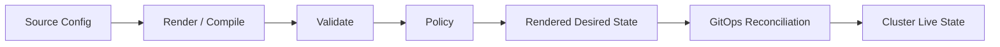
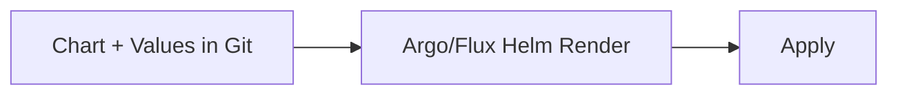
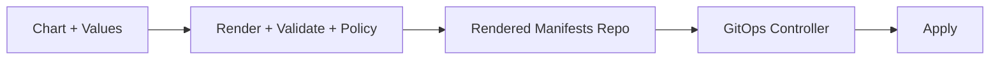
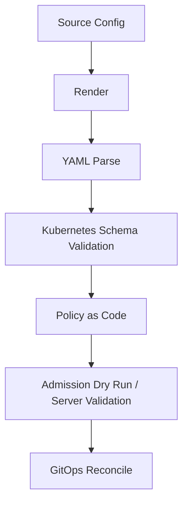
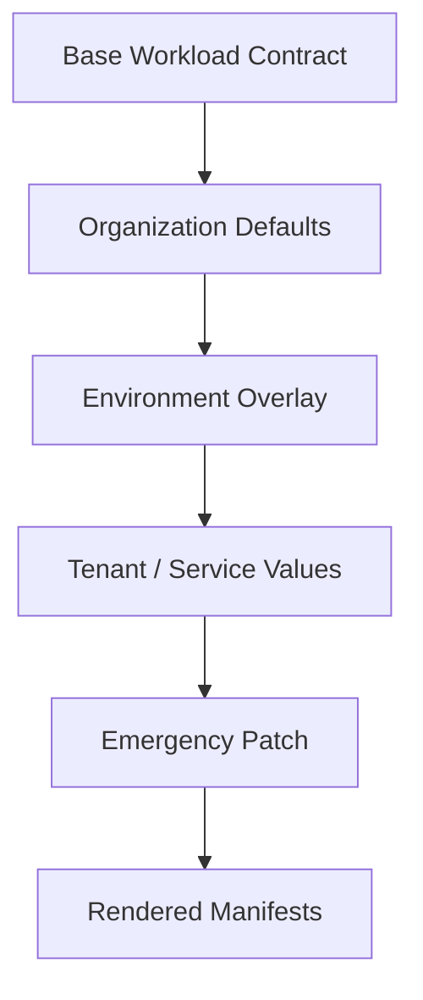
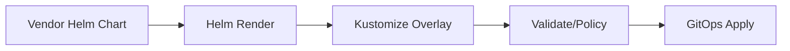
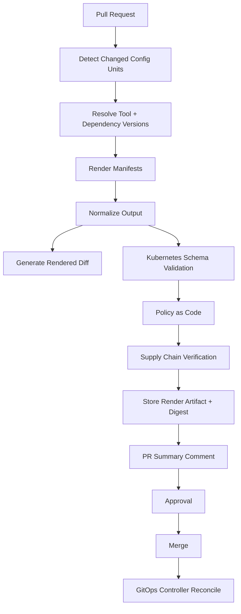
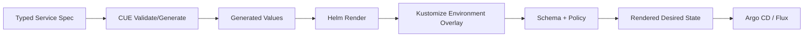

# Part 026 — Configuration Rendering: Helm, Kustomize, Jsonnet, CUE, Carvel

## Tujuan Part Ini

GitOps sering dijelaskan sederhana:

> Simpan manifest Kubernetes di Git, lalu controller akan menyamakan cluster dengan Git.

Itu benar, tetapi belum cukup untuk production.

Dalam sistem nyata, file yang ada di Git sering bukan manifest final. Ia bisa berupa:

- Helm chart + values,
- Kustomize base + overlay,
- Jsonnet program,
- CUE schema + data,
- Carvel ytt templates,
- generated YAML dari platform API,
- output CI sebelum masuk GitOps repo,
- kombinasi beberapa pendekatan.

Jadi ada tahap penting sebelum apply:

> desired state harus **dirender** menjadi Kubernetes objects final.

Part ini membahas configuration rendering sebagai bagian dari control plane, bukan sekadar templating.

Pertanyaan utama:

- Bagaimana memilih Helm vs Kustomize vs Jsonnet vs CUE vs ytt?
- Bagaimana mencegah YAML hell?
- Bagaimana menjaga output deterministic?
- Bagaimana membuat diff tetap bisa dipercaya?
- Bagaimana memvalidasi rendered manifests sebelum reconcile?
- Bagaimana membatasi blast radius config generation?
- Bagaimana menghindari template yang terlalu pintar?

---

## 1. Mental Model: Rendering Is Compilation

Jangan anggap rendering sebagai “generate YAML”. Anggap sebagai **compilation step**.



Dalam compiler biasa:

- source code harus deterministic,
- compiler version harus jelas,
- dependency harus pinned,
- output harus bisa diuji,
- error harus bisa dibaca,
- artifact harus reproducible.

Dalam GitOps rendering juga sama:

- source config harus deterministic,
- render tool version harus pinned,
- chart/library dependency harus pinned,
- output manifest harus bisa diuji,
- render error harus actionable,
- rendered artifact harus reproducible.

Jika rendering tidak deterministic, GitOps kehilangan makna. Controller tidak bisa dipercaya karena desired state berubah tanpa perubahan source yang jelas.

Production invariant:

> Rendered desired state harus reproducible dari source, dependency, tool version, dan environment input yang eksplisit.

---

## 2. Why Raw YAML Fails at Scale

Raw YAML cocok untuk awal. Tetapi saat sistem membesar, muncul masalah:

- duplikasi antar environment,
- label/annotation tidak konsisten,
- image tag tersebar,
- resource requests tidak standar,
- security context copy-paste,
- patch manual sulit dilacak,
- perubahan global butuh edit banyak file,
- review diff terlalu besar,
- validation bergantung pada mata manusia.

Namun raw YAML juga punya kekuatan:

- paling eksplisit,
- paling mudah dibaca,
- diff langsung terlihat,
- tidak ada render magic,
- failure mode sederhana.

Kesimpulan:

> Raw YAML bukan salah. Raw YAML menjadi masalah ketika dipakai untuk menyelesaikan variability yang seharusnya dimodelkan.

Rendering tool dibutuhkan saat ada variability yang legitimate:

- environment differences,
- tenant differences,
- region differences,
- common defaults,
- optional components,
- generated names,
- reusable workload patterns,
- policy-bound configuration,
- versioned packaging.

---

## 3. Rendering Taxonomy

Ada beberapa tipe rendering.

### 3.1 Template-Based Rendering

Source berisi template dengan placeholders, conditionals, loops.

Contoh:

- Helm,
- ytt,
- Go templates,
- Jinja-like tools.

Kelebihan:

- ekspresif,
- cocok untuk packaging,
- bisa mengurangi duplikasi,
- values dapat dipisah.

Risiko:

- logic tersembunyi,
- output sulit ditebak,
- conditionals terlalu banyak,
- invalid YAML baru ketahuan saat render,
- diff source tidak sama dengan diff output.

### 3.2 Patch/Overlay Rendering

Source punya base manifest lalu overlay/patch untuk variasi.

Contoh:

- Kustomize.

Kelebihan:

- template-free,
- output lebih mudah diprediksi,
- cocok untuk environment overlays,
- base tetap valid YAML.

Risiko:

- patch chain bisa rumit,
- overlay nesting berlebihan,
- strategic merge/JSON patch error sulit dibaca,
- base bisa menjadi dumping ground.

### 3.3 Data-Programming Rendering

Source adalah program/data language yang menghasilkan JSON/YAML.

Contoh:

- Jsonnet.

Kelebihan:

- powerful abstraction,
- composition kuat,
- cocok untuk large config systems,
- reusable libraries.

Risiko:

- learning curve,
- debugging lebih sulit,
- logic bisa terlalu clever,
- review output wajib.

### 3.4 Constraint/Schema-First Rendering

Source menggabungkan data, schema, validation, constraints, dan generation.

Contoh:

- CUE.

Kelebihan:

- validation kuat,
- constraints first,
- cocok untuk platform APIs,
- dapat menghasilkan config dari model yang divalidasi.

Risiko:

- mental model berbeda,
- skill langka,
- integrasi workflow perlu maturity,
- overkill untuk config sederhana.

### 3.5 Structure-Aware YAML Rendering

Template memahami struktur YAML, bukan sekadar string.

Contoh:

- Carvel ytt.

Kelebihan:

- menghindari text templating pitfall,
- values/schema/overlays rapi,
- cocok untuk Kubernetes package customization,
- YAML tetap first-class.

Risiko:

- ekosistem lebih kecil dibanding Helm,
- perlu standardisasi internal,
- tidak semua team familiar.

---

## 4. Tool Comparison Summary

| Tool | Best For | Avoid When | Primary Risk |
|---|---|---|---|
| Raw YAML | Small explicit resources, platform base, low variability | Banyak environment/tenant variations | Duplication and inconsistency |
| Helm | Packaging reusable apps/charts, third-party apps, parameterized releases | Butuh transparent patch-only changes | Template complexity |
| Kustomize | Environment overlays, patching vendor/base manifests | Butuh complex generation logic | Overlay sprawl |
| Jsonnet | Large generated config systems, libraries, programmable manifests | Team tidak siap code-like config | Clever abstraction |
| CUE | Schema/constraint-first platform config | Butuh simple app packaging only | Adoption complexity |
| ytt | Structure-aware YAML templating with schema/overlays | Ekosistem wajib Helm-only | Tool familiarity |

The top 1% skill is not memorizing syntax. It is choosing the **minimum expressive power** needed.

Rule:

> Use the least powerful rendering model that can represent the variability safely.

---

## 5. Helm Deep Model

Helm is often described as “package manager for Kubernetes”. More precisely, Helm lets you define, install, and upgrade Kubernetes applications through charts.

A Helm chart normally contains:

- templates,
- values,
- chart metadata,
- dependencies,
- helper templates,
- optional schemas,
- packaged versions.

### 5.1 When Helm Is Good

Helm is strong when:

- application is distributed as package,
- third-party software already ships chart,
- install/upgrade lifecycle matters,
- values are natural API,
- chart versioning matters,
- dependencies/subcharts are useful,
- release metadata is useful,
- GitOps controller supports HelmRelease or Helm source.

Typical examples:

- ingress-nginx,
- cert-manager,
- prometheus stack,
- external-dns,
- external-secrets,
- internal service chart,
- platform component package.

### 5.2 Helm Values as API

The biggest Helm mistake is treating `values.yaml` as a dumping ground.

Values are an API contract.

Bad values:

```yaml
foo: true
bar: prod
stuff:
  x: 1
  y: 2
```

Better values:

```yaml
workload:
  image:
    repository: registry.example.com/payments-api
    tag: 1.42.0
  resources:
    requests:
      cpu: 500m
      memory: 512Mi
  exposure:
    enabled: true
    host: payments.example.com
  security:
    runAsNonRoot: true
```

Good values:

- represent domain intent,
- have stable names,
- avoid leaking template internals,
- include schema validation,
- have backward compatibility rules,
- avoid booleans that create surprising resource sets.

### 5.3 Helm Anti-Patterns

#### Anti-Pattern: Boolean Explosion

```yaml
enableDeployment: true
enableService: true
enableIngress: false
enableHpa: true
enablePdb: true
enableFoo: false
enableBar: true
```

This turns chart into conditional soup.

Better:

- define workload archetypes,
- split chart responsibilities,
- use library chart carefully,
- keep optional features limited.

#### Anti-Pattern: Environment Logic Inside Chart

Bad:

```gotemplate
{{ if eq .Values.environment "prod" }}
replicas: 5
{{ else }}
replicas: 1
{{ end }}
```

Chart now knows environment policy.

Better:

```yaml
# prod values
replicaCount: 5
```

Environment differences should usually live in values or overlay, not hidden in template logic.

#### Anti-Pattern: Unpinned Chart Dependencies

If chart dependency versions float, rendered output can change without source change.

Production invariant:

> Chart version and dependency versions must be pinned and reviewed.

### 5.4 Helm in GitOps

There are two common patterns.

#### Pattern A: Commit Chart + Values, Render in Controller



Pros:

- simple,
- controller handles render,
- common pattern.

Cons:

- render happens inside cluster/control plane,
- source diff may not show output diff,
- controller version matters,
- plugin/dependency behavior needs control.

#### Pattern B: Render in CI, Commit Rendered Manifests



Pros:

- rendered output reviewable,
- policy gates easier,
- deterministic artifact can be stored,
- controller simpler.

Cons:

- more repo/artifact complexity,
- generated YAML noise,
- promotion workflow more involved.

Use Pattern B when audit, policy, and reproducibility are strict.

---

## 6. Kustomize Deep Model

Kustomize customizes Kubernetes objects through a `kustomization.yaml`. It is template-free: base manifests are valid YAML, overlays modify them.

### 6.1 When Kustomize Is Good

Kustomize is strong when:

- base manifests are already valid,
- environment differences are patches,
- you want transparent overlays,
- generated names/configmaps are needed,
- vendor manifests need controlled customization,
- Kubernetes-native simplicity matters.

Typical examples:

- base service manifests with dev/stage/prod overlays,
- patching ingress host per environment,
- adding labels/annotations,
- changing replica count,
- namespace overlays,
- applying organization defaults.

### 6.2 Base and Overlay Design

Good structure:

```text
apps/payments-api/
  base/
    deployment.yaml
    service.yaml
    kustomization.yaml
  overlays/
    dev/
      kustomization.yaml
      patch-resources.yaml
    prod/
      kustomization.yaml
      patch-resources.yaml
      patch-hpa.yaml
```

Good base:

- valid standalone manifests,
- no environment-specific secrets,
- no production-only assumptions,
- stable labels/selectors,
- minimal defaults.

Good overlay:

- only meaningful differences,
- small patches,
- environment intent obvious,
- no deep nesting beyond necessity.

### 6.3 Overlay Sprawl

Kustomize fails when overlays become a maze.

Bad:

```text
overlays/
  prod/
    eu/
      pci/
        blue/
          customer-a/
            patch-1.yaml
            patch-2.yaml
            patch-3.yaml
```

This hides the config model in directory hierarchy.

Better:

- split dimensions intentionally,
- generate overlays from a typed environment model,
- use components carefully,
- keep final rendered output validated,
- document overlay ownership.

### 6.4 Patch Discipline

Patches should be:

- small,
- named by intent,
- close to owner,
- easy to diff,
- validated after render.

Bad patch filename:

```text
patch.yaml
```

Better:

```text
patch-prod-resource-requests.yaml
patch-enable-public-ingress.yaml
patch-add-pci-node-selector.yaml
```

Reviewers should understand why patch exists before opening it.

---

## 7. Jsonnet Deep Model

Jsonnet is a configuration language for app and tool developers. It generates config data and is side-effect free.

Think of Jsonnet as **programmable data composition**.

### 7.1 When Jsonnet Is Good

Jsonnet is strong when:

- configuration is large,
- repeated patterns need libraries,
- generated object graphs are complex,
- plain templates are too weak,
- you need functions/composition,
- config is treated like code,
- teams are comfortable reviewing generated output.

Typical examples:

- large monitoring config,
- multi-service Kubernetes manifests,
- reusable platform libraries,
- complex policy/test data,
- generated dashboards/alerts.

### 7.2 Jsonnet Risk: Too Much Power

Jsonnet lets you build elegant abstractions. It also lets you build a configuration framework nobody understands.

Bad signs:

- reviewers cannot predict output,
- only one engineer understands library internals,
- simple changes require learning hidden abstractions,
- rendered diff is mandatory but not shown,
- generated objects have surprising names,
- code-style cleverness leaks into config.

Rule:

> Jsonnet is best when abstraction reduces complexity for many users, not when it entertains the library author.

### 7.3 Jsonnet Production Guardrails

If using Jsonnet:

- pin Jsonnet tool version,
- pin library versions,
- render in CI,
- show rendered diff,
- validate Kubernetes schema,
- run policy against output,
- test library functions,
- publish examples,
- keep APIs small,
- avoid environment-specific logic hidden deep in functions.

---

## 8. CUE Deep Model

CUE is an open source language and tooling for defining, generating, and validating data. Its key power is unification of data and constraints.

Think of CUE as **configuration with a type/constraint system**.

### 8.1 When CUE Is Good

CUE is strong when:

- platform exposes configuration API,
- validation is as important as generation,
- config must follow constraints,
- schema and values should live together,
- invalid states should be impossible or hard,
- configuration is generated for multiple targets,
- you need strong defaults plus constraints.

Typical examples:

- internal platform service definition,
- environment model,
- tenant request model,
- Kubernetes workload generation,
- OpenAPI/Terraform/Kubernetes config validation,
- golden path APIs.

### 8.2 CUE Mental Model

Instead of writing “generate this YAML”, you define constraints:

```cue
#Workload: {
  name: string
  image: string
  replicas: int & >=1 & <=20
  exposure: {
    public: bool
    host?: string
  }
}

paymentApi: #Workload & {
  name: "payments-api"
  image: "registry.example.com/payments-api:1.42.0"
  replicas: 5
  exposure: {
    public: true
    host: "payments.example.com"
  }
}
```

The value is valid only if it satisfies constraints.

This is powerful for platform engineering because many incidents are invalid configuration states:

- production workload with no resource limits,
- public ingress without approved hostname,
- PCI workload in non-PCI node pool,
- service missing owner label,
- replica count outside allowed range,
- region not allowed for data class.

### 8.3 CUE Risk: Adoption Cost

CUE is not just “another template language”. It requires a different way of thinking.

Risks:

- fewer engineers know it,
- integration patterns need design,
- debugging constraints can be unfamiliar,
- too much schema can slow iteration,
- platform team may over-model everything.

Rule:

> Use CUE when invalid configuration is expensive enough that schema-first design pays for itself.

---

## 9. Carvel ytt Deep Model

Carvel ytt is a YAML templating tool that understands YAML structure. Instead of treating YAML as text, it works with maps, arrays, and nodes.

### 9.1 When ytt Is Good

Ytt is strong when:

- you want YAML-native templating,
- structure-aware overlays matter,
- values and schema should be first-class,
- Helm text templating feels too fragile,
- Kubernetes package customization is complex,
- platform team can standardize on Carvel.

Typical examples:

- platform component packaging,
- vendor YAML customization,
- structured overlays,
- controlled values API,
- internal package distribution.

### 9.2 ytt vs Helm

Helm is widely adopted and chart ecosystem is massive. ytt is more structure-oriented.

Helm risk:

- text template indentation issues,
- complex Go template logic,
- values API sprawl.

Ytt advantage:

- YAML nodes are first-class,
- overlays understand structure,
- data values can be schema-backed,
- less string manipulation.

Ytt risk:

- smaller ecosystem,
- team familiarity,
- less universal controller support than Helm.

Rule:

> Prefer Helm when ecosystem/package compatibility dominates. Consider ytt when structure-aware customization and internal platform packaging dominate.

---

## 10. Determinism

Determinism means same input produces same output.

A rendered manifest should be a pure function of:

- source config,
- tool version,
- dependencies,
- explicit values,
- explicit environment inputs.

Bad sources of nondeterminism:

- current timestamp,
- random strings,
- live cluster reads during render,
- unpinned chart dependencies,
- floating image tags,
- environment variables not declared,
- network downloads without lock,
- tool version drift,
- generated names without stable seeds.

Production rule:

> Rendering must not depend on hidden machine state.

### 10.1 Rendering Contract

Define this contract for every rendering pipeline:

```yaml
renderContract:
  tool: helm
  toolVersion: 3.x.y
  sourceRevision: git-sha
  dependencies:
    lockFile: Chart.lock
  values:
    - values/base.yaml
    - values/prod.yaml
  output:
    format: kubernetes-yaml
  validation:
    - kubeconform
    - policy
  artifact:
    digest: sha256:...
```

If you cannot describe the render contract, you cannot defend the rendered output.

---

## 11. Diffability

GitOps relies on diff. But diff of source config is not always diff of rendered output.

Example:

Changing one Helm helper template can modify 50 resources.

Reviewers need both:

1. source diff,
2. rendered diff.

### 11.1 Source Diff

Shows intent:

```diff
- tag: 1.41.0
+ tag: 1.42.0
```

### 11.2 Rendered Diff

Shows effect:

```diff
- image: registry.example.com/payments-api:1.41.0
+ image: registry.example.com/payments-api:1.42.0
```

For complex rendering, source diff alone is insufficient.

Production invariant:

> Any non-trivial rendering change must expose rendered output diff before merge.

---

## 12. Validation Layers

Rendered manifests should pass multiple layers.



### 12.1 Parse Validation

Checks:

- YAML is valid,
- JSON is valid,
- no duplicate keys if tool supports detecting,
- documents are separated correctly.

### 12.2 Kubernetes Schema Validation

Checks:

- apiVersion/kind valid,
- required fields present,
- field types valid,
- unknown fields detected where possible,
- CRD schemas considered.

Tools commonly used:

- kubeconform,
- kubeval-like tools,
- kubectl server-side dry-run,
- controller-specific validation.

### 12.3 Policy Validation

Checks organization rules:

- required labels,
- no privileged containers,
- resource requests/limits,
- allowed registries,
- digest pinning,
- namespace boundary,
- ingress restrictions,
- storage class restrictions,
- secret references,
- compliance tags.

### 12.4 Admission Dry Run

Server-side dry-run can catch admission behavior closer to real cluster.

But be careful:

- it depends on cluster availability,
- admission webhooks may have side effects if poorly written,
- CRD version must match target cluster,
- environment-specific policy matters.

Use it as additional confidence, not as the only validation.

---

## 13. Rendering in CI vs Rendering in Controller

### 13.1 Render in Controller

Argo CD and Flux can render Helm/Kustomize/Jsonnet-like sources depending on configuration.

Pros:

- less CI complexity,
- common GitOps workflow,
- direct from Git to cluster,
- fewer generated files.

Cons:

- rendered diff may be less visible pre-merge,
- controller tool version matters,
- plugin security matters,
- render failure happens near deployment,
- CI may not catch all errors.

Use when:

- config is simple,
- team accepts controller render,
- pre-merge validation reproduces same render,
- tool versions are controlled.

### 13.2 Render in CI and Commit/Publish Artifact

Pros:

- output is reviewable,
- policy evaluates final desired state,
- artifact digest can be stored,
- deployment controller can be simpler,
- audit story is stronger.

Cons:

- generated YAML can be noisy,
- repo can bloat,
- promotion workflow more complex,
- generated output must not be manually edited.

Use when:

- regulated environment,
- complex templates,
- policy/evidence strict,
- diffability critical,
- renderer requires plugins not allowed in controller.

### 13.3 Hybrid: Render Preview in CI, Render Again in Controller

This is common but dangerous unless versions match.

Invariant:

> CI render and controller render must use same source, same dependency lock, same values, and compatible tool version.

If not, CI validates one thing and controller applies another.

---

## 14. Configuration API Design

Every rendering approach exposes an API.

- Helm exposes `values.yaml`.
- Kustomize exposes patch points and overlays.
- Jsonnet exposes library functions/objects.
- CUE exposes schemas/constraints.
- ytt exposes data values/schema/overlays.

Design it like a real API.

### 14.1 Good Configuration API

A good config API is:

- small,
- stable,
- documented,
- validated,
- versioned,
- domain-oriented,
- hard to misuse,
- explicit about defaults,
- explicit about unsupported overrides.

### 14.2 Bad Configuration API

Bad config API exposes implementation details:

```yaml
podSpecExtraYaml: |
  securityContext:
    privileged: true
```

Escape hatches are sometimes needed, but they must be controlled.

Better:

```yaml
security:
  profile: restricted
```

Then policy decides what `restricted` means.

---

## 15. Layering Model

Rendering should follow layers.



Suggested layers:

1. **Base**: workload pattern or upstream manifest.
2. **Organization defaults**: labels, security, resources, observability.
3. **Environment**: region, namespace, endpoints, replica sizing.
4. **Tenant/service**: service-specific settings.
5. **Temporary exception**: time-bound emergency override.

Anti-pattern:

- prod settings embedded in base,
- tenant patches modifying organization defaults silently,
- emergency patches with no expiry,
- secrets embedded in values,
- policy bypass encoded as config.

---

## 16. Ownership Model

Configuration rendering has owners.

| Layer | Owner | Example |
|---|---|---|
| Renderer toolchain | Platform team | Helm/Kustomize version |
| Base chart/template | Platform or app team | service chart |
| Org defaults | Platform/security | labels, securityContext |
| Environment values | Platform/SRE | region, replicas baseline |
| Service values | App team | image, feature flags |
| Policy | Security/platform | allowed registries |
| Rendered artifact | Pipeline | generated manifests |

Do not let ownership blur.

If app team can override every platform default, platform defaults are not controls. They are suggestions.

---

## 17. Secrets in Rendering

Never treat rendering as a secret-safe zone automatically.

Risks:

- secret values appear in rendered output,
- CI logs print values,
- Helm values contain secrets,
- generated manifests commit Kubernetes Secret data,
- SOPS decryption happens in too many places,
- controller has broad decryption keys,
- diff tools expose secret content.

Safe patterns:

- render secret references, not secret values,
- use External Secrets Operator/Vault/cloud secret managers,
- use SOPS only with scoped decryption identity,
- redact rendered diff for Secret resources,
- forbid plaintext secret values in values files,
- policy-check secret-like keys.

Bad:

```yaml
database:
  password: super-secret
```

Better:

```yaml
database:
  secretRef:
    name: payments-db
    key: password
```

Or:

```yaml
apiVersion: external-secrets.io/v1beta1
kind: ExternalSecret
metadata:
  name: payments-db
spec:
  secretStoreRef:
    name: prod-vault
    kind: ClusterSecretStore
  target:
    name: payments-db
  data:
    - secretKey: password
      remoteRef:
        key: prod/payments/db
        property: password
```

---

## 18. Image Tags and Digests

Rendering often sets image versions.

Bad:

```yaml
image:
  tag: latest
```

Better:

```yaml
image:
  repository: registry.example.com/payments-api
  tag: 1.42.0
```

Best for high assurance:

```yaml
image:
  repository: registry.example.com/payments-api
  digest: sha256:abc123...
```

Why digest matters:

- tag can be moved,
- digest is immutable content identity,
- signature/attestation usually binds to digest,
- admission verification is stronger.

Rendering pipeline should support digest-based deployment if supply chain policy requires it.

---

## 19. CRDs and Rendering

CRDs create special problems:

- CRD schema may be needed for validation,
- CRD must exist before CRs,
- Helm charts sometimes include CRDs with special behavior,
- CRD upgrades can be irreversible,
- GitOps controller may not handle CRD lifecycle as expected.

Production rules:

- manage CRDs explicitly,
- separate CRD installation from CR instances when needed,
- validate CRs against correct CRD version,
- avoid accidental CRD deletion/prune,
- review CRD upgrade notes,
- test conversion/webhook behavior.

Rendering CRDs and CRs together is convenient, but convenience can hide lifecycle coupling.

---

## 20. Tool Selection Framework

Ask these questions.

### 20.1 Is This Third-Party Software?

If yes:

- prefer Helm if official chart is good and widely maintained,
- use Kustomize patches for light customization,
- use ytt/Carvel if organization standardizes on Carvel packages,
- avoid rewriting vendor chart unless necessary.

### 20.2 Is This Internal Service with Simple Variability?

If yes:

- raw YAML + Kustomize may be enough,
- Helm service chart can work if standardization desired,
- avoid Jsonnet/CUE unless complexity justifies.

### 20.3 Is This Platform Golden Path?

If yes:

- Helm chart with schema can work,
- CUE can model typed service contract,
- ytt can provide structured values/overlays,
- rendered diff and policy are mandatory.

### 20.4 Is Configuration Highly Generated?

If yes:

- Jsonnet or CUE may be appropriate,
- generated output must be reviewed/tested,
- library API must be stable,
- avoid hidden environment logic.

### 20.5 Is Validation More Important Than Templating?

If yes:

- CUE becomes attractive,
- policy-as-code is still needed,
- schema-first config may reduce incidents.

---

## 21. Recommended Patterns

### Pattern A: Helm for Vendor, Kustomize for Local Overlay



Use when:

- vendor chart is maintained,
- local changes are small,
- overlay is transparent.

Risk:

- double rendering complexity,
- patch can break on chart upgrade.

### Pattern B: Internal Service Chart

Use one internal Helm chart for standard service pattern.

Good when:

- many services share same deployment shape,
- platform wants standard resources,
- values API is carefully designed.

Risk:

- chart becomes universal monster,
- service-specific escape hatches grow.

Mitigation:

- split archetypes,
- enforce schema,
- version chart,
- test rendering examples.

### Pattern C: Kustomize Base/Overlay Per Service

Good when:

- each service owns manifests,
- environment differences are small,
- transparency matters.

Risk:

- duplicated patterns,
- inconsistent platform controls.

Mitigation:

- policy gates,
- common components,
- generator/scaffold for new services.

### Pattern D: CUE Platform Contract Generates Manifests

Good when:

- platform wants typed service spec,
- invalid config is expensive,
- service teams should not write raw Kubernetes.

Example intent:

```yaml
service: payments-api
tier: critical
dataClass: pci
exposure: internal
runtime: java17
replicas: 5
```

Platform generates Kubernetes resources with constraints.

Risk:

- platform becomes compiler owner,
- escape hatches difficult,
- adoption requires training.

### Pattern E: Jsonnet Library for Large Config Estate

Good when:

- many objects generated from reusable libraries,
- config resembles code,
- team can maintain library quality.

Risk:

- abstraction debt.

Mitigation:

- golden examples,
- rendered diffs,
- library tests,
- strict code review.

---

## 22. Rendering Pipeline Reference Architecture



Important outputs:

- rendered manifests,
- render digest,
- tool version,
- dependency lock,
- source revision,
- validation result,
- policy decision,
- rendered diff summary,
- evidence link.

---

## 23. Normalization

Rendered YAML can be noisy.

Normalization can help:

- stable document ordering,
- stable key ordering where possible,
- remove irrelevant comments,
- ensure namespace/name labels,
- split multi-doc YAML consistently,
- convert to canonical JSON for policy.

But normalization must not hide meaningful changes.

Bad normalization:

- removes fields that matter,
- sorts arrays where order matters,
- strips annotations used by controllers,
- masks policy-relevant metadata.

Production rule:

> Normalize for deterministic comparison, not for making risky diffs look clean.

---

## 24. Rendered Artifact Storage

For high assurance, store rendered artifacts.

Storage options:

- CI artifact store,
- Git generated-manifests repo,
- OCI artifact,
- object storage,
- evidence database.

Include metadata:

```yaml
sourceRevision: abc123
renderer: helm
rendererVersion: 3.x.y
chartVersion: 1.2.3
valuesDigest: sha256:...
outputDigest: sha256:...
policyDecision: pass
approvedBy:
  - alice@example.com
```

This allows answer to audit question:

> What exact desired state was approved and reconciled?

---

## 25. Failure Modes

| Failure | Cause | Detection | Recovery |
|---|---|---|---|
| Render fails | invalid template/values | CI render step | fix source or rollback |
| Output nondeterministic | random/time/env input | repeated render digest mismatch | remove nondeterminism |
| Render differs in CI/controller | version mismatch | digest mismatch/live diff | pin versions/use same image |
| Invalid Kubernetes schema | bad fields/API version | schema validation | update manifest/tool/CRD |
| Policy violation | forbidden config | policy gate | change config or request exception |
| Secret leak | secret in values/rendered output | secret scanner/diff review | rotate secret, purge logs |
| Overlay patch misses target | resource renamed/upstream changed | render warning/schema diff | update patch/test vendor upgrade |
| Chart upgrade breaks local patches | chart structure changed | rendered diff/test | revise overlay/hold upgrade |
| Generated output too large | abstraction too broad | PR review pain | split units/reduce generation |
| Debugging impossible | tool too clever | incident postmortem | simplify API/add examples |

---

## 26. Production Checklist

For every rendering system:

- [ ] Tool version pinned.
- [ ] Dependencies pinned/locked.
- [ ] Rendering is deterministic.
- [ ] Hidden environment variables are forbidden or declared.
- [ ] Rendered diff is visible in PR.
- [ ] Rendered output passes schema validation.
- [ ] Rendered output passes policy-as-code.
- [ ] Secrets are not exposed in rendered diff/logs.
- [ ] Values/config API is documented.
- [ ] Ownership of base/overlay/values is clear.
- [ ] Generated artifacts are stored when audit requires.
- [ ] Upgrade path for chart/libraries is tested.
- [ ] CRD lifecycle is explicit.
- [ ] Escape hatches are controlled.
- [ ] Rendering failure has a runbook.

---

## 27. Review Checklist for Pull Requests

When reviewing rendering changes, ask:

1. What source changed?
2. What rendered output changed?
3. Is output deterministic?
4. Are dependencies pinned?
5. Did resource ownership change?
6. Did security context change?
7. Did image identity change?
8. Did service exposure change?
9. Did RBAC/IAM-like permission change?
10. Did namespace/cluster destination change?
11. Did CRD/schema version change?
12. Did secrets appear in output?
13. Did policy pass?
14. Is rollback possible?
15. Is the config API still backward compatible?

This review is more useful than “YAML looks fine”.

---

## 28. Practical Design Example

Suppose we have internal Java microservices.

Requirements:

- every service has Deployment, Service, HPA, PDB,
- prod needs strict resources,
- PCI services need node selector and network policy,
- image must use digest,
- service teams should not edit raw security context,
- platform wants rendered diff.

A good design might be:

- CUE defines service contract,
- generator emits Helm values or raw Kubernetes,
- Kustomize applies environment overlays,
- CI renders final manifests,
- policy validates final manifests,
- GitOps controller reconciles rendered manifests.

Diagram:



This is more complex than raw YAML, so it is justified only if it reduces risk and toil at scale.

If you have only three services, this may be over-engineering.

---

## 29. Simplicity Rule

Rendering tools are abstraction tools. Abstraction has cost.

Use this rule:

> Do not introduce a more powerful rendering system until you can name the duplication, invalid states, or lifecycle complexity it removes.

Examples:

- Helm because we package reusable software: good.
- Kustomize because we need transparent environment overlays: good.
- CUE because we need schema-first service contracts: good.
- Jsonnet because we generate thousands of related config objects: good.
- ytt because we need structure-aware YAML overlays: good.
- Jsonnet because YAML is boring: bad.
- Helm because everyone uses Helm: incomplete.
- CUE because it sounds advanced: bad.

---

## 30. Final Mental Model

Configuration rendering has four jobs:

1. **Represent variability** without uncontrolled duplication.
2. **Constrain invalid states** before they reach the cluster.
3. **Produce deterministic desired state** for GitOps reconciliation.
4. **Expose effect** clearly enough for human and machine review.

If a rendering system does not satisfy those jobs, it is not helping GitOps. It is adding fog.

---

## 31. What You Should Be Able to Do Now

After this part, you should be able to:

- choose Helm/Kustomize/Jsonnet/CUE/ytt based on variability model,
- treat rendering as compilation,
- design deterministic render contracts,
- expose rendered diffs in PR,
- validate rendered manifests before reconciliation,
- control secret leakage during render,
- design config APIs as stable contracts,
- identify over-templating and overlay sprawl,
- decide when generated manifests should be stored as evidence.

---

## References

- Helm Documentation — https://helm.sh/docs/
- Helm Charts — https://helm.sh/docs/topics/charts/
- Kubernetes Kustomize Documentation — https://kubernetes.io/docs/tasks/manage-kubernetes-objects/kustomization/
- Kustomize — https://kustomize.io/
- Jsonnet — https://jsonnet.org/
- CUE Documentation — https://cuelang.org/docs/
- Carvel ytt — https://carvel.dev/ytt/
- Argo CD Documentation — https://argo-cd.readthedocs.io/
- Flux Documentation — https://fluxcd.io/flux/
