# Part 027 — Progressive Delivery in GitOps

## Tujuan Part Ini

Di part sebelumnya kita sudah membahas GitOps engine dan configuration rendering. Sekarang kita masuk ke area yang sering salah dipahami:

> GitOps memastikan cluster bergerak menuju desired state. Progressive delivery memastikan perubahan menuju desired state itu **tidak langsung menghantam seluruh traffic production**.

Keduanya berbeda.

GitOps menjawab:

- apa state yang diinginkan?
- dari mana state itu berasal?
- agent mana yang merekonsiliasi?
- apakah live state sudah sama dengan Git?

Progressive delivery menjawab:

- apakah versi baru aman untuk menerima lebih banyak traffic?
- seberapa cepat traffic dinaikkan?
- metric apa yang menjadi bukti aman?
- kapan rollout harus pause, abort, rollback, atau promote?
- siapa boleh override?

Kalau GitOps adalah **desired-state reconciliation**, progressive delivery adalah **risk-controlled rollout state machine**.

Tool seperti Argo Rollouts dan Flagger membuat progressive delivery menjadi Kubernetes-native. Argo Rollouts menyediakan CRD/controller untuk blue-green, canary, canary analysis, experiment, dan progressive delivery di Kubernetes. Flagger mengotomasi canary, A/B testing, blue/green, traffic shifting, analysis, promotion, dan rollback dengan integrasi service mesh/ingress/metrics.

Namun part ini bukan tutorial tool. Kita akan membangun mental model production-grade: bagaimana progressive delivery dirancang, dioperasikan, dibatasi, dan dibuktikan.

---

## 1. Masalah yang Diselesaikan Progressive Delivery

Deployment tradisional sering punya model seperti ini:

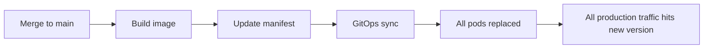

Masalahnya sederhana:

> perubahan kecil di Git bisa langsung menjadi perubahan besar di production traffic.

GitOps membuat perubahan lebih auditable, tetapi tidak otomatis membuat rollout aman. Bahkan GitOps yang sangat rapi masih bisa menyebarkan bug ke seluruh user jika manifest final mengatakan `image: new-version` dan Deployment mengganti pods secara biasa.

Progressive delivery menambahkan satu lapisan kontrol:

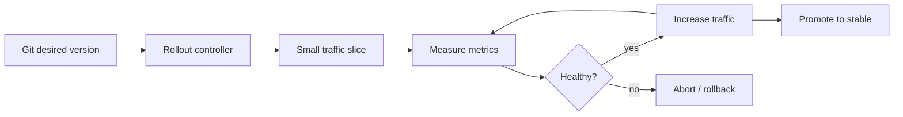

Perubahan tidak dianggap selesai hanya karena objek Kubernetes berhasil di-apply. Perubahan dianggap selesai ketika versi baru melewati **evidence loop**.

---

## 2. Core Mental Model: Rollout as a State Machine

Jangan pikirkan rollout sebagai `kubectl apply`.

Pikirkan rollout sebagai state machine:

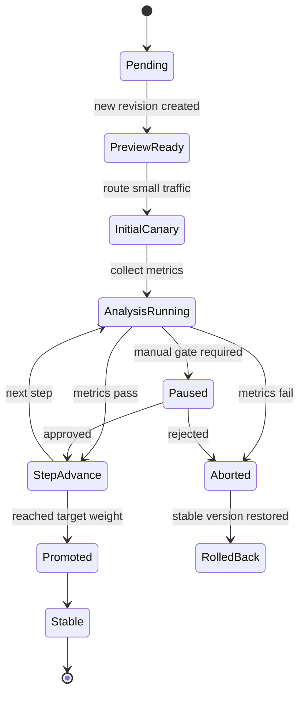

Setiap transisi harus punya:

- precondition,
- action,
- timeout,
- observable evidence,
- failure behavior,
- audit event.

Contoh:

| Transition | Preconditions | Action | Evidence | Failure Behavior |
|---|---|---|---|---|
| `Pending → InitialCanary` | image signed, manifest valid, policy pass | create canary replica set | rollout event, pod readiness | abort before traffic |
| `InitialCanary → AnalysisRunning` | route 1–5% traffic | query metrics | Prometheus/Datadog query result | pause/abort |
| `AnalysisRunning → StepAdvance` | error rate within threshold | increase traffic weight | analysis run success | keep current weight |
| `AnalysisRunning → Aborted` | metric failed or timeout | stop rollout | failed metric evidence | rollback traffic |
| `StepAdvance → Promoted` | all steps passed | stable service points to new version | final promotion event | rollback if final health fails |

Top engineer tidak hanya bertanya “canary-nya bisa?”. Mereka bertanya:

> state transition mana yang tidak aman, tidak observable, atau tidak punya recovery path?

---

## 3. GitOps vs Progressive Delivery: Boundary yang Harus Jelas

Salah satu desain buruk adalah mencampur tanggung jawab GitOps controller dan rollout controller.

GitOps controller bertugas:

- membaca desired state dari Git,
- merender/mengevaluasi manifest,
- apply object ke cluster,
- mendeteksi drift antara Git dan live state,
- melakukan sync/prune/self-heal sesuai konfigurasi.

Rollout controller bertugas:

- mengontrol replica set versi lama/baru,
- mengatur traffic routing,
- menjalankan analysis,
- pause/promote/abort rollout,
- menjaga stable version sampai versi baru terbukti sehat.

Boundary-nya:

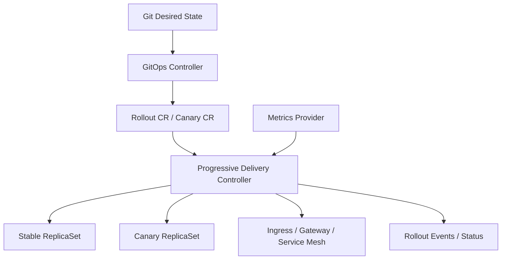

GitOps tidak seharusnya terus-menerus melawan perubahan runtime yang memang dimiliki rollout controller. Misalnya traffic weight bisa berubah selama rollout. Kalau traffic weight adalah field yang dikelola controller, jangan membuat GitOps memaksanya kembali ke nilai awal setiap sync.

Rule praktis:

> Git owns desired rollout configuration. Rollout controller owns rollout runtime progression.

Git berisi policy dan strategi:

```yaml
strategy:
  canary:
    steps:
      - setWeight: 5
      - pause: {duration: 10m}
      - setWeight: 25
      - analysis:
          templates:
            - templateName: success-rate
      - setWeight: 50
      - pause: {}
      - setWeight: 100
```

Controller menjalankan progression aktual.

---

## 4. Deployment Strategy Taxonomy

Progressive delivery bukan hanya canary. Ada beberapa strategi dengan trade-off berbeda.

### 4.1 Rolling Update

Rolling update adalah default Kubernetes Deployment strategy. Pods lama diganti bertahap dengan pods baru.

Kelebihan:

- sederhana,
- built-in,
- tidak butuh service mesh/ingress routing khusus,
- cukup untuk workload internal low-risk.

Kekurangan:

- traffic split tidak eksplisit,
- rollback sering bergantung pada Deployment revision,
- analysis otomatis terbatas,
- sulit melakukan traffic-based verification,
- tidak ideal untuk high-risk customer-facing service.

Rolling update cocok ketika:

- service stateless,
- blast radius kecil,
- SLO tidak terlalu ketat,
- observability sudah cukup,
- rollback cepat.

Tidak cocok ketika:

- butuh cohort-based rollout,
- butuh A/B testing,
- butuh metric gate otomatis,
- versi baru punya risiko behavior besar,
- perubahan menyentuh protocol/API/data semantics.

### 4.2 Blue-Green

Blue-green menjaga dua versi environment/workload: stable dan preview. Traffic dipindahkan dari blue ke green setelah green siap.

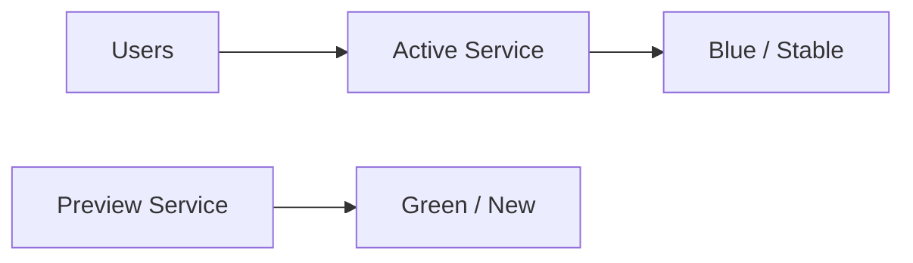

Kelebihan:

- cutover cepat,
- mudah validasi preview sebelum production traffic,
- rollback traffic relatif cepat jika stable masih dipertahankan,
- cocok untuk release yang butuh final switch jelas.

Kekurangan:

- butuh resource lebih besar,
- tidak selalu menangkap bug yang hanya muncul di real traffic,
- cutover tetap bisa tajam,
- stateful dependency tetap sulit.

Cocok untuk:

- UI/backend stateless,
- release dengan smoke test kuat,
- sistem yang butuh cutover eksplisit,
- perubahan yang tidak cocok traffic ramp bertahap.

### 4.3 Canary

Canary mengalirkan sebagian kecil traffic ke versi baru, mengukur dampak, lalu menaikkan traffic secara bertahap.

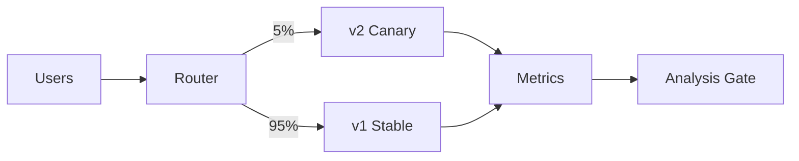

Kelebihan:

- mengurangi blast radius,
- memakai real traffic,
- bisa otomatis abort,
- bagus untuk service critical,
- cocok dengan SLO-driven delivery.

Kekurangan:

- butuh metrics yang benar,
- traffic routing lebih kompleks,
- masalah sticky session/cohort perlu dipikirkan,
- stateful/data changes tetap berbahaya,
- false positive/false negative analysis bisa terjadi.

Canary cocok untuk:

- customer-facing APIs,
- service dengan traffic cukup untuk analisis statistik,
- perubahan behavior yang bisa diuji pada sebagian traffic,
- organisasi dengan observability matang.

### 4.4 A/B Testing

A/B testing mengalirkan traffic berdasarkan header, cookie, user segment, geo, tenant, atau experiment cohort.

Kelebihan:

- cocok untuk feature/product experiment,
- bisa membandingkan behavior cohort,
- bisa mengisolasi beta users/internal users.

Kekurangan:

- bukan pengganti release safety,
- membutuhkan identity/cohort discipline,
- analisis metrik product dan reliability bisa bercampur,
- data consistency antar cohort bisa kompleks.

A/B testing harus dipisahkan dari canary reliability gate. Canary bertanya “apakah aman?”. A/B testing bertanya “apakah lebih baik?”.

### 4.5 Feature Flags

Feature flag memisahkan deployment dari release.

Deployment:

> binary/config baru tersedia di production.

Release:

> capability baru diaktifkan untuk user/tenant/cohort tertentu.

Kelebihan:

- rollback behavior bisa cepat tanpa redeploy,
- cocok untuk product rollout,
- bisa mengaktifkan fitur per tenant/cohort,
- membantu dark launch.

Kekurangan:

- flag debt,
- kombinasi state meledak,
- audit sulit jika flag changes tidak versioned,
- flag bisa menjadi shadow control plane.

Rule:

> Feature flags adalah runtime control. GitOps tetap harus menjadi control plane untuk baseline deployment dan platform state. Untuk regulated/high-risk system, perubahan flag production juga harus punya audit, approval, dan rollback semantics.

---

## 5. Progressive Delivery Is Not a Substitute for Compatibility

Canary bukan sihir.

Canary tidak menyelamatkan sistem dari perubahan yang tidak kompatibel secara struktural.

Contoh perubahan berbahaya:

- menghapus kolom database yang masih dibaca versi lama,
- mengubah format event tanpa backward compatibility,
- mengubah API response contract tanpa versioning,
- mengubah consumer group semantics,
- mengubah encryption key handling,
- mengubah idempotency key behavior,
- mengubah authorization semantics.

Canary hanya membatasi traffic ke versi baru. Tetapi stable dan canary sering berbagi:

- database,
- queue,
- cache,
- external API,
- auth system,
- object storage,
- schema registry,
- feature flag store.

Karena itu progressive delivery harus dikombinasikan dengan compatibility pattern:

| Change Type | Safe Pattern |
|---|---|
| DB schema addition | expand → deploy → migrate → contract |
| Event schema change | backward/forward compatible schema evolution |
| API change | additive fields, versioning, tolerant reader |
| Cache key change | dual-read/dual-write, namespace versioning |
| Auth policy change | shadow evaluate before enforce |
| External integration | circuit breaker, fallback, staged credential scope |

Mental model:

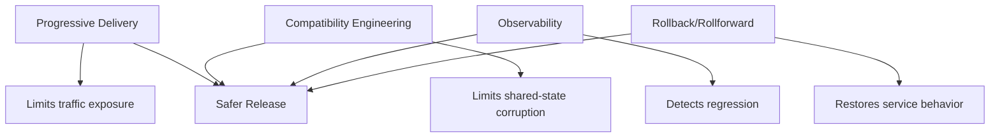

Progressive delivery mengurangi **blast radius traffic**. Compatibility engineering mengurangi **blast radius state**.

---

## 6. The Production Rollout Contract

Sebelum menggunakan canary/blue-green, definisikan rollout contract.

Contoh kontrak:

```yaml
rolloutContract:
  service: payment-api
  environment: prod-id
  releaseClass: customer-facing-critical
  maxInitialTraffic: 1
  maxStepTrafficIncrease: 10
  minAnalysisWindow: 10m
  maxRolloutDuration: 2h
  requiredMetrics:
    - availability
    - http_5xx_rate
    - p95_latency
    - business_error_rate
    - saturation
  rollbackTriggers:
    - availability_below_slo
    - 5xx_rate_above_threshold
    - p95_latency_regression
    - payment_authorization_failure_spike
  manualGates:
    - before_50_percent
    - before_100_percent
  requiredEvidence:
    - image_digest
    - signature_verification
    - sbom_reference
    - analysis_run_results
    - approval_record
```

Kontrak ini menjawab:

- release ini boleh mulai dari berapa persen traffic?
- seberapa cepat traffic boleh naik?
- metric apa yang wajib pass?
- durasi observasi minimum berapa?
- failure apa yang harus auto-abort?
- transisi mana yang butuh manusia?
- bukti apa yang harus tersimpan?

Tanpa kontrak ini, progressive delivery hanya menjadi “traffic shifting dengan harapan baik”.

---

## 7. Metrics: The Hard Part

Canary hanya sebagus metric gate-nya.

Metric buruk menghasilkan dua risiko:

1. **false positive**: rollout dianggap sehat padahal rusak.
2. **false negative**: rollout dianggap rusak padahal sehat.

### 7.1 Golden Signals

Untuk service online, metric dasar biasanya:

- request rate,
- error rate,
- latency,
- saturation.

Namun production-grade rollout butuh lebih dari itu.

| Metric Layer | Examples | Why It Matters |
|---|---|---|
| Infrastructure | CPU, memory, pod restarts, OOMKill | mendeteksi runtime instability |
| Network | connection errors, timeout, retry | mendeteksi routing/dependency issue |
| HTTP/gRPC | 5xx, 4xx anomaly, p95/p99 latency | mendeteksi API regression |
| Business | failed payment, failed quote, failed order | mendeteksi semantic failure |
| Dependency | DB latency, Kafka lag, external API error | mendeteksi collateral damage |
| User experience | page load, synthetic checks, RUM | mendeteksi dampak end-user |

Top engineer selalu memasukkan **business metric** untuk sistem penting. Banyak bug production tidak terlihat sebagai 5xx.

Contoh:

- API tetap 200, tetapi harga salah.
- Order tetap dibuat, tetapi status lifecycle salah.
- Login berhasil, tetapi role resolution salah.
- Payment authorized, tetapi settlement metadata hilang.

Metric teknis perlu dilengkapi semantic metric.

### 7.2 Compare Canary Against Baseline

Threshold statis sering misleading.

Contoh:

```text
5xx_rate < 1%
```

Ini bisa gagal jika baseline production sedang 0.05%. Canary 0.9% memang di bawah 1%, tetapi 18x lebih buruk dari stable.

Lebih baik:

```text
canary_5xx_rate <= stable_5xx_rate + tolerated_delta
```

atau:

```text
canary_error_rate_ratio <= 1.2x stable_error_rate
```

Namun ratio juga bisa noisy saat traffic kecil.

Prinsip:

- untuk low traffic, gunakan synthetic checks + longer window,
- untuk high traffic, gunakan canary-vs-stable comparison,
- untuk critical business flows, gunakan domain metrics,
- untuk latency, gunakan percentile dan histogram dengan hati-hati,
- untuk rare events, jangan membuat keputusan dari sample terlalu kecil.

### 7.3 Minimum Sample Size

Canary 1% pada service dengan traffic rendah bisa tidak punya sample cukup.

Contoh:

- service menerima 100 request/jam,
- canary 1% = 1 request/jam,
- analysis window 10 menit = mungkin 0 request.

Metric akan pass karena tidak ada data. Ini berbahaya.

Kontrak rollout harus punya rule:

```yaml
analysis:
  minRequests: 1000
  minDuration: 10m
  maxDuration: 1h
  noDataPolicy: fail_or_pause
```

`no data` bukan otomatis success. Untuk service critical, `no data` sebaiknya pause atau fail.

### 7.4 Metric Windows and Delay

Observability punya delay:

- log ingestion delay,
- metric scrape interval,
- aggregation delay,
- dashboard query delay,
- alert evaluation window,
- business event processing delay.

Jangan menaikkan traffic lebih cepat daripada metric bisa memberi sinyal.

Bad pattern:

```yaml
steps:
  - setWeight: 10
  - pause: 30s
  - setWeight: 50
  - pause: 30s
  - setWeight: 100
```

Untuk banyak sistem, 30 detik belum cukup untuk melihat regression.

Better pattern:

```yaml
steps:
  - setWeight: 1
  - analysis: {duration: 10m}
  - setWeight: 5
  - analysis: {duration: 15m}
  - setWeight: 25
  - analysis: {duration: 20m}
  - pause: {}
  - setWeight: 50
  - analysis: {duration: 30m}
  - setWeight: 100
```

Durasi bukan angka universal. Ia harus mengikuti traffic volume, criticality, observability delay, dan rollback cost.

---

## 8. Traffic Routing Models

Canary membutuhkan router yang bisa membagi traffic.

Beberapa pilihan:

| Routing Layer | Examples | Strength | Risk |
|---|---|---|---|
| Kubernetes Service only | basic selector switch | simple | traffic split terbatas |
| Ingress controller | NGINX, ALB, Traefik | common, edge-level | feature berbeda per ingress |
| Service mesh | Istio, Linkerd, App Mesh, Kuma | fine-grained traffic control | operational complexity |
| Gateway API | Kubernetes Gateway API implementations | standardizing API | maturity varies by implementation |
| App-level routing | feature flag/router in app | domain-aware | app complexity, audit risk |

Untuk production-grade platform, routing harus punya ownership jelas.

Pertanyaan desain:

- siapa mengubah traffic weight?
- apakah perubahan weight ada di Git atau status runtime?
- apakah GitOps akan mengembalikan weight?
- apakah weight change diaudit?
- apakah traffic routing mendukung sticky session?
- apakah canary menerima traffic internal dan external?
- apakah background jobs ikut canary?
- apakah gRPC/WebSocket behavior aman?

### 8.1 Sticky Sessions and User Cohorts

Random per-request split bisa berbahaya untuk stateful user journey.

Misalnya user melakukan:

1. create quote di v2,
2. update quote di v1,
3. submit quote di v2.

Jika v1/v2 tidak 100% compatible, user journey rusak.

Solusi:

- sticky session by cookie/header,
- tenant-based canary,
- user cohort routing,
- internal beta cohort,
- request-level idempotency,
- compatibility guarantee antar versi.

Canary strategy harus mengikuti domain transaction boundary.

### 8.2 Background Workers Are Traffic Too

Banyak tim hanya canary HTTP traffic, tetapi lupa background workers.

Workload yang juga perlu progressive delivery:

- Kafka consumers,
- scheduled jobs,
- batch processors,
- CDC processors,
- queue workers,
- workflow workers,
- async notification workers.

Untuk worker, traffic weight bukan HTTP percentage. Modelnya bisa berupa:

- subset consumer group,
- separate canary queue,
- partition-based routing,
- tenant-based worker assignment,
- job label selector,
- workflow task queue versioning.

Contoh state machine worker canary:

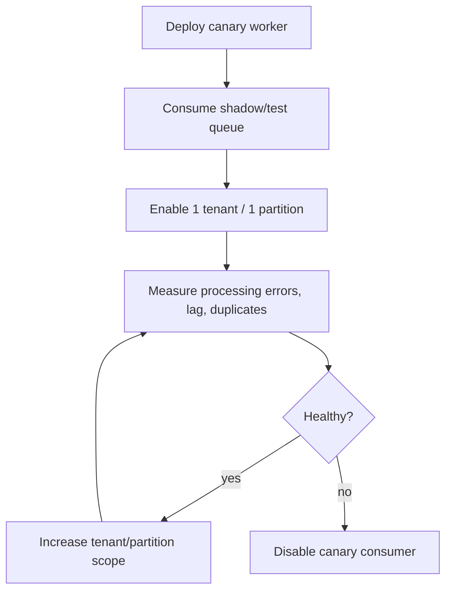

---

## 9. Argo Rollouts Mental Model

Argo Rollouts menggantikan Kubernetes Deployment dengan `Rollout` resource yang mendukung strategy seperti canary dan blue-green. Ia dapat membuat `AnalysisRun` dan `Experiment` selama update untuk menentukan apakah rollout lanjut atau abort.

Konsep utamanya:

| Concept | Meaning |
|---|---|
| `Rollout` | workload controller mirip Deployment dengan strategy lanjutan |
| `ReplicaSet` | stable/canary versions yang dikontrol rollout |
| `Service` | stable/canary service selector untuk routing |
| `AnalysisTemplate` | definisi metric query dan success/failure condition |
| `AnalysisRun` | instance evaluasi metric untuk rollout tertentu |
| `Experiment` | menjalankan beberapa template/replicaSet untuk eksperimen |
| `pause` | manual atau timed gate antar step |
| `abort` | menghentikan rollout dan kembali ke stable behavior |

Mental model:

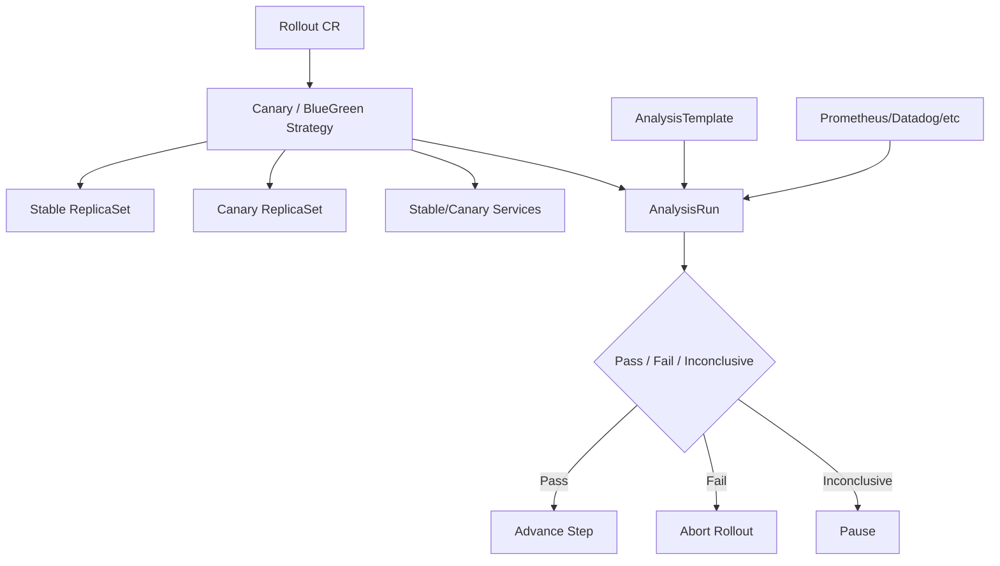

### 9.1 Good Argo Rollouts Practice

- Gunakan image digest, bukan mutable tag.
- Pisahkan `AnalysisTemplate` reusable dari service-specific thresholds.
- Jangan memakai metric yang tidak punya signal pada traffic kecil.
- Gunakan manual pause sebelum 50%/100% untuk service critical.
- Pastikan rollback path tidak bergantung pada image tag mutable.
- Simpan rollout status dan analysis result sebagai evidence.
- Definisikan siapa boleh promote/abort manually.
- Jangan memaksa GitOps sync terhadap field runtime yang dikelola controller.

### 9.2 Common Argo Rollouts Failure Modes

| Failure | Cause | Mitigation |
|---|---|---|
| rollout stuck paused | manual gate tidak jelas owner-nya | define on-call/release captain |
| analysis always success | query salah/no data dianggap success | no-data fail/pause policy |
| abort tidak restore traffic | service/traffic manager misconfigured | preflight routing test |
| canary pod healthy but traffic failing | readiness bukan end-to-end health | add synthetic/business metrics |
| GitOps keeps fighting rollout | managed fields overlap | ignore runtime fields / correct ownership |
| unstable thresholds | low sample size/noisy metrics | longer window, baseline comparison |

---

## 10. Flagger Mental Model

Flagger adalah operator progressive delivery yang mengotomasi promotion/rollback menggunakan metrics dan traffic routing. Ia dapat bekerja dengan berbagai service mesh, ingress controller, Gateway API, dan metric providers.

Konsep umum:

| Concept | Meaning |
|---|---|
| Canary resource | resource yang mendefinisikan target workload, analysis, traffic steps |
| TargetRef | Deployment/DaemonSet yang di-canary-kan |
| Primary | stable version yang menerima traffic utama |
| Canary | candidate version yang diuji |
| Metrics | success rate, latency, custom metrics |
| Webhooks | pre-rollout, rollout, confirm-promotion, rollback hooks |
| Traffic provider | Istio/Linkerd/NGINX/Traefik/Gateway API/etc |

Mental model:

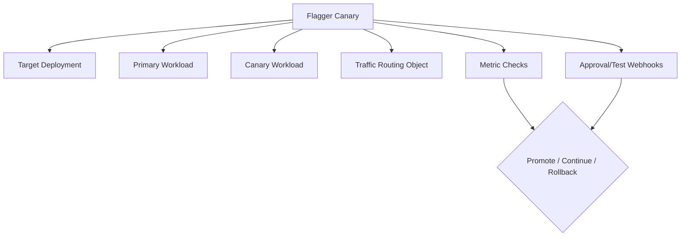

Flagger cocok ketika organisasi ingin controller yang lebih opinionated untuk progressive delivery dengan dukungan luas untuk routing provider.

Good practice:

- versioned canary policies per service class,
- clear custom metrics,
- pre-rollout smoke test webhooks,
- promotion confirmation untuk high-risk systems,
- event sink ke notification/audit system,
- test traffic generator untuk service low traffic,
- explicit rollback hooks bila perlu cleanup.

---

## 11. Rollout Policy by Service Criticality

Tidak semua service perlu strategi sama.

Buat release class.

| Release Class | Example | Strategy | Gates |
|---|---|---|---|
| C0 experimental/internal | internal dashboard | rolling update | basic health |
| C1 low-risk stateless | internal API | rolling/blue-green | smoke + error rate |
| C2 customer-facing normal | catalog API | canary 5→25→50→100 | technical metrics |
| C3 revenue/security critical | payment, auth, order | canary 1→5→10→25→50→100 | business + technical + manual gate |
| C4 stateful/irreversible | DB migration, ledger logic | special release plan | manual sequence, compatibility proof |

Jangan memaksa semua service memakai canary kompleks. Itu membuat platform berat dan tim menghindari aturan.

Sebaliknya, jangan membiarkan service critical memakai rolling update hanya karena “lebih simple”.

Rule:

> Release strategy harus mengikuti blast radius, reversibility, traffic volume, state coupling, dan business criticality.

---

## 12. Rollout Step Design

Rollout step bukan dekorasi YAML. Ia adalah risk budget.

Contoh untuk service normal:

```yaml
steps:
  - setWeight: 5
  - analysis: 10m
  - setWeight: 25
  - analysis: 15m
  - setWeight: 50
  - analysis: 20m
  - setWeight: 100
```

Contoh untuk service critical:

```yaml
steps:
  - setWeight: 1
  - analysis: 15m
  - setWeight: 5
  - analysis: 20m
  - setWeight: 10
  - analysis: 30m
  - pause: {}
  - setWeight: 25
  - analysis: 30m
  - setWeight: 50
  - analysis: 45m
  - pause: {}
  - setWeight: 100
```

Pertimbangan:

- initial weight harus cukup kecil untuk membatasi dampak,
- tetapi cukup besar untuk menghasilkan signal,
- step besar meningkatkan risiko,
- step kecil memperlama rollout,
- manual pause mengurangi automation speed tetapi meningkatkan control,
- analysis window harus mengikuti metric delay,
- rollout duration tidak boleh tak terbatas.

### 12.1 Traffic Weight Is Not Risk Weight

10% traffic tidak selalu berarti 10% risiko.

Risiko bisa lebih tinggi jika:

- traffic canary berisi tenant besar,
- canary menangani request high-value,
- cache/shared state tercemar,
- downstream dependency menerima efek global,
- message/event dari canary dibaca stable consumers,
- data mutation tidak reversible.

Karena itu, canary untuk sistem stateful harus mempertimbangkan **data blast radius**, bukan hanya traffic percentage.

---

## 13. Pre-Rollout Gates

Sebelum traffic pertama masuk, harus ada gate.

Pre-rollout checklist:

- manifest rendered deterministic,
- image digest pinned,
- image signature verified,
- SBOM/provenance tersedia,
- admission policy pass,
- schema compatibility pass,
- feature flag default safe,
- database migration stage compatible,
- dependency config valid,
- synthetic smoke test pass,
- rollback image tersedia,
- on-call aware untuk C3/C4 release.

State transition:

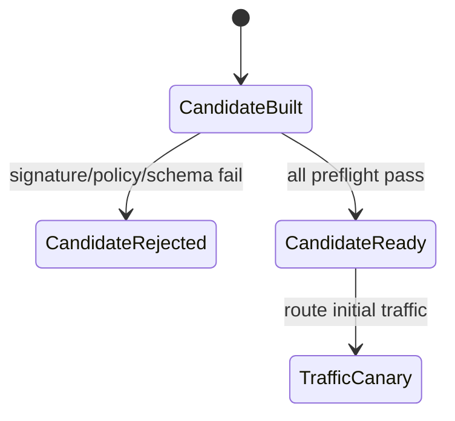

Pre-rollout gate mengurangi kemungkinan canary langsung gagal karena hal yang seharusnya diketahui sebelum production traffic.

---

## 14. Analysis Gate Design

Analysis gate harus eksplisit:

```yaml
analysisGate:
  metrics:
    - name: success-rate
      query: rate(http_requests_total{status!~"5.."}[5m]) / rate(http_requests_total[5m])
      successCondition: result >= 0.995
      failureLimit: 2
    - name: p95-latency
      query: histogram_quantile(0.95, rate(http_request_duration_seconds_bucket[5m]))
      successCondition: result < baseline * 1.2
    - name: business-failure-rate
      query: rate(payment_authorization_failed_total[5m])
      successCondition: result < threshold
  noDataPolicy: pause
  inconclusivePolicy: pause
```

Key design points:

- query harus version-aware jika membandingkan stable vs canary,
- threshold harus punya owner,
- no-data behavior harus jelas,
- inconclusive result bukan otomatis promote,
- failure limit harus mencegah abort karena satu spike kecil,
- tetapi jangan terlalu toleran sampai bug lolos.

### 14.1 Technical Metrics vs Business Metrics

Contoh technical-only gate:

```text
5xx < 1%
p95 < 500ms
pod restarts = 0
```

Ini belum cukup untuk payment/order/authorization.

Tambahkan business gate:

```text
quote_price_mismatch = 0
payment_authorization_decline_anomaly < threshold
order_state_transition_error = 0
policy_decision_disagreement < threshold
```

Business metrics harus dirancang bersama domain owner. Jika tidak, metric akan menjadi vanity metric.

---

## 15. Manual Gates Without Destroying Automation

Manual gate sering dianggap anti-GitOps. Itu keliru.

Manual gate bukan masalah jika:

- gate-nya explicit,
- owner-nya jelas,
- decision-nya audited,
- duration/timeouts jelas,
- override policy jelas,
- tidak dilakukan dengan mutation liar di cluster.

Manual gate yang buruk:

```text
Seseorang masuk dashboard, klik sesuatu, tidak ada audit, tidak tahu metric apa yang dilihat.
```

Manual gate yang baik:

```yaml
manualGate:
  name: before-prod-50-percent
  requiredApprovers:
    - release-captain
    - service-owner
  requiredEvidence:
    - analysis-run-success
    - no-active-sev1
    - business-metric-review
  timeout: 2h
  timeoutAction: abort
```

Manual gate harus menjadi bagian state machine, bukan side-channel.

---

## 16. Rollback vs Abort vs Rollforward

Bedakan tiga istilah.

### Abort

Abort menghentikan rollout sebelum versi baru dipromosikan penuh.

Biasanya:

- traffic dikembalikan ke stable,
- canary replica dikurangi/dihentikan,
- rollout status gagal,
- evidence disimpan.

Abort bagus karena stable masih ada.

### Rollback

Rollback mengembalikan sistem ke versi sebelumnya setelah versi baru sudah menjadi stable.

Risiko lebih tinggi karena:

- stable lama mungkin sudah tidak compatible dengan data baru,
- migration mungkin sudah berjalan,
- cache/event/state mungkin berubah,
- rollback image mungkin tidak tersedia.

### Rollforward

Rollforward memperbaiki bug dengan versi baru berikutnya.

Cocok ketika:

- data sudah berubah dan tidak bisa dikembalikan,
- bug bisa diperbaiki cepat,
- rollback lebih berbahaya daripada patch forward,
- compatibility window mendukung.

Decision matrix:

| Situation | Preferred Response |
|---|---|
| canary fails before promotion | abort |
| full release fails with reversible change | rollback |
| DB/data already migrated irreversibly | rollforward |
| security exploit in new version | abort/rollback immediately + incident path |
| metric false positive | pause, inspect, resume with evidence |

---

## 17. GitOps Integration Patterns

### Pattern A: GitOps Applies Rollout CR Only

Git contains `Rollout` or `Canary` spec. Controller manages runtime status.

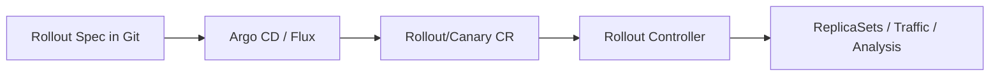

Good default.

Pros:

- Git remains desired strategy source,
- runtime progression owned by rollout controller,
- less Git churn,
- audit through controller events/status.

Cons:

- traffic progression not represented as Git commits,
- need status/evidence collection outside Git,
- GitOps diff ignore may need tuning.

### Pattern B: Promotion by Git Commit

Each traffic increase is represented by Git change.

Pros:

- every step fully versioned in Git,
- approval via PR,
- strong audit trail.

Cons:

- slow,
- noisy,
- hard to automate fine-grained traffic shifts,
- high operational overhead,
- Git commit becomes runtime control channel.

Cocok untuk:

- regulated systems,
- low-frequency high-risk release,
- environment promotion,
- manual production gates.

Tidak cocok untuk:

- frequent microservice rollout,
- high-volume canary steps,
- automated metric-driven progression.

### Pattern C: Hybrid

Git defines rollout strategy and release version. Controller handles automated low-risk steps. Manual high-risk steps require approval recorded in release system/evidence store.

Ini biasanya paling practical.

---

## 18. Evidence Model

Progressive delivery harus meninggalkan bukti.

Evidence minimal:

```yaml
releaseEvidence:
  service: payment-api
  version: sha256:...
  gitCommit: abc123
  rolloutId: payment-api-2026-07-03-001
  strategy: canary
  steps:
    - weight: 1
      startedAt: ...
      endedAt: ...
      analysis: pass
      metricsRef: ...
    - weight: 5
      startedAt: ...
      endedAt: ...
      analysis: pass
      metricsRef: ...
  approvals:
    - gate: before-50
      approver: service-owner
      time: ...
      evidenceReviewed:
        - success-rate
        - p95-latency
        - payment-failure-rate
  finalStatus: promoted
```

Evidence tidak harus selalu disimpan di Git. Bisa di:

- CI artifact store,
- Argo/Flux events exported to log system,
- rollout controller metrics/events,
- audit database,
- release management system,
- incident/change management system.

Yang penting:

- immutable enough,
- searchable,
- correlated dengan Git commit/image digest,
- retained sesuai compliance need,
- bisa menjawab “kenapa versi ini dipromosikan?”.

---

## 19. Progressive Delivery for IaC Changes

Progressive delivery tidak hanya untuk aplikasi.

IaC juga butuh staged rollout.

Contoh:

- roll out new IAM policy to one account first,
- enable new WAF rule in count/detect mode before block,
- deploy network route change in one region first,
- enable autoscaling policy in one cluster first,
- upgrade Kubernetes add-on in canary cluster,
- apply database parameter group in staging/read-replica first,
- migrate Terraform module version per stack wave.

IaC progressive rollout model:

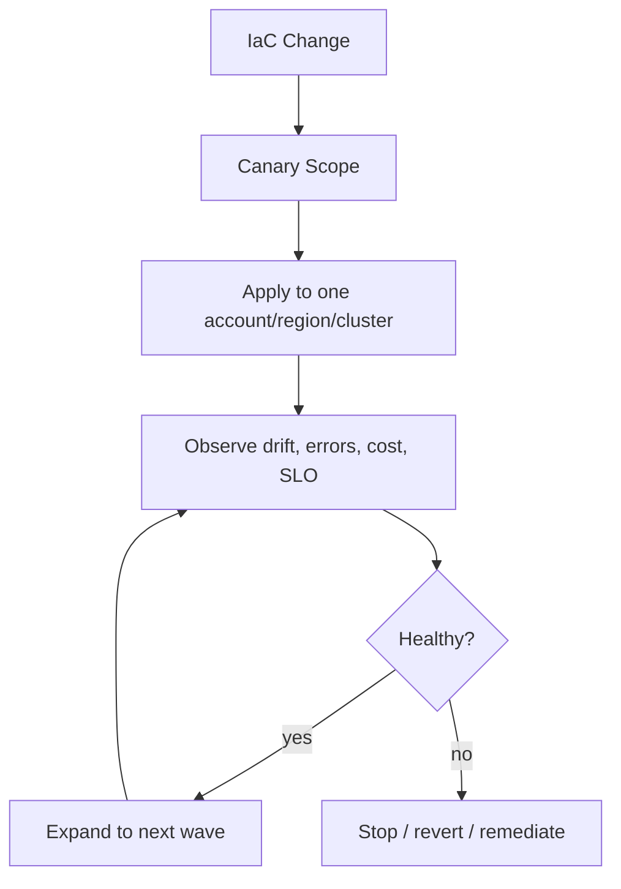

Wave design:

| Wave | Scope | Goal |
|---|---|---|
| wave 0 | sandbox/nonprod | syntax/provider/basic validation |
| wave 1 | low-risk prod account/cluster | production environment validation |
| wave 2 | one region/tenant group | limited blast radius |
| wave 3 | all standard environments | broad rollout |
| wave 4 | critical environments | explicit approval |

Do not apply global infrastructure changes everywhere at once unless blast radius is acceptable.

---

## 20. Rollout Anti-Patterns

### 20.1 Canary with No Real Metrics

Canary without analysis is just delayed deployment.

Symptom:

```yaml
steps:
  - setWeight: 10
  - pause: 5m
  - setWeight: 100
```

If no one checks meaningful metrics, pause is theater.

### 20.2 Auto-Promote on Pod Readiness Only

Pod readiness means container is ready to receive traffic, not business behavior is correct.

Readiness can pass while:

- authorization broken,
- pricing wrong,
- Kafka publish failing,
- external API returns degraded response,
- data mutation is semantically wrong.

### 20.3 One Strategy for All Services

A single canary template for all services is usually wrong.

Different services have different:

- traffic volume,
- criticality,
- state coupling,
- rollback risk,
- domain metrics,
- dependency profile.

Use service classes.

### 20.4 GitOps Fighting Runtime Progression

If GitOps keeps resetting rollout runtime fields, the system becomes unstable.

Fix ownership.

### 20.5 Ignoring Low-Traffic Services

Low traffic makes canary analysis hard, not unnecessary.

Use:

- synthetic traffic,
- longer windows,
- shadow traffic,
- internal cohort,
- manual gates,
- blue-green with smoke tests.

### 20.6 Rollback Without Compatibility

Rollback is not safe if data/schema changed irreversibly.

Canary strategy must be paired with migration strategy.

---

## 21. Production Implementation Blueprint

A production-grade progressive delivery setup usually has these components:

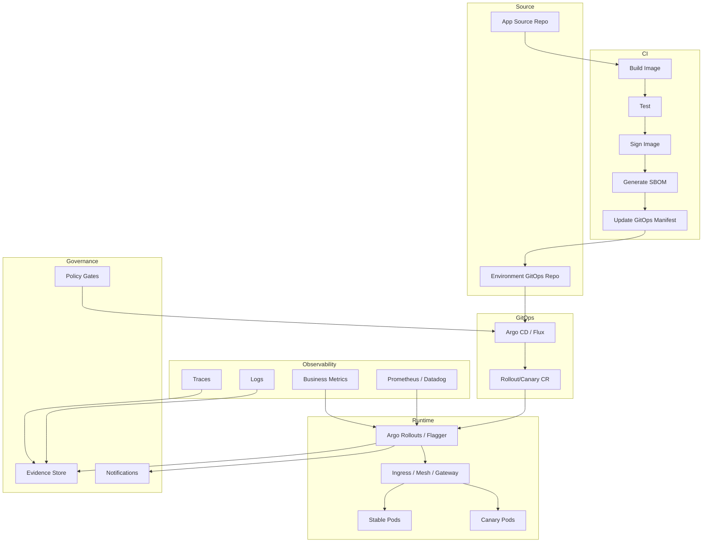

Minimal production checklist:

- [ ] image digest pinned,
- [ ] signature verified before admission,
- [ ] rollout CR managed by GitOps,
- [ ] runtime progression owned by rollout controller,
- [ ] strategy selected by service class,
- [ ] metrics include technical and domain signals,
- [ ] no-data behavior defined,
- [ ] manual gates audited,
- [ ] abort/rollback runbook tested,
- [ ] rollout events exported,
- [ ] final evidence retained.

---

## 22. Worked Example: Payment API Canary

Scenario:

- service: `payment-api`,
- release class: C3 revenue critical,
- risk: payment authorization semantics,
- database: shared,
- feature flag: new fraud scoring integration,
- release target: production.

### 22.1 Desired Rollout Contract

```yaml
service: payment-api
releaseClass: C3
strategy: canary
trafficSteps: [1, 5, 10, 25, 50, 100]
manualGates:
  - before: 25
  - before: 100
analysis:
  minWindow: 15m
  noDataPolicy: pause
  metrics:
    - http_5xx_rate
    - p95_latency
    - payment_authorization_success_rate
    - fraud_provider_timeout_rate
    - duplicate_authorization_attempts
rollback:
  abortBeforePromotion: true
  rollbackAfterPromotion: requires_compatibility_check
```

### 22.2 Why 1% First?

Payment API is high impact. A 5% initial canary might still represent thousands of transactions. Initial 1% gives early signal while limiting exposure.

But 1% must still have sample. If production traffic is too low, use:

- internal synthetic transactions,
- lower-risk tenant cohort,
- controlled partner traffic,
- shadow fraud scoring before enforce.

### 22.3 Required Domain Metrics

Technical metrics:

- 5xx rate,
- latency,
- pod restarts,
- dependency timeout.

Domain metrics:

- authorization approval rate compared with stable,
- fraud scoring timeout,
- duplicate payment attempt,
- settlement metadata completeness,
- idempotency conflict rate.

A successful HTTP response is not enough. Payment logic can fail semantically while API returns 200.

### 22.4 Rollout Sequence

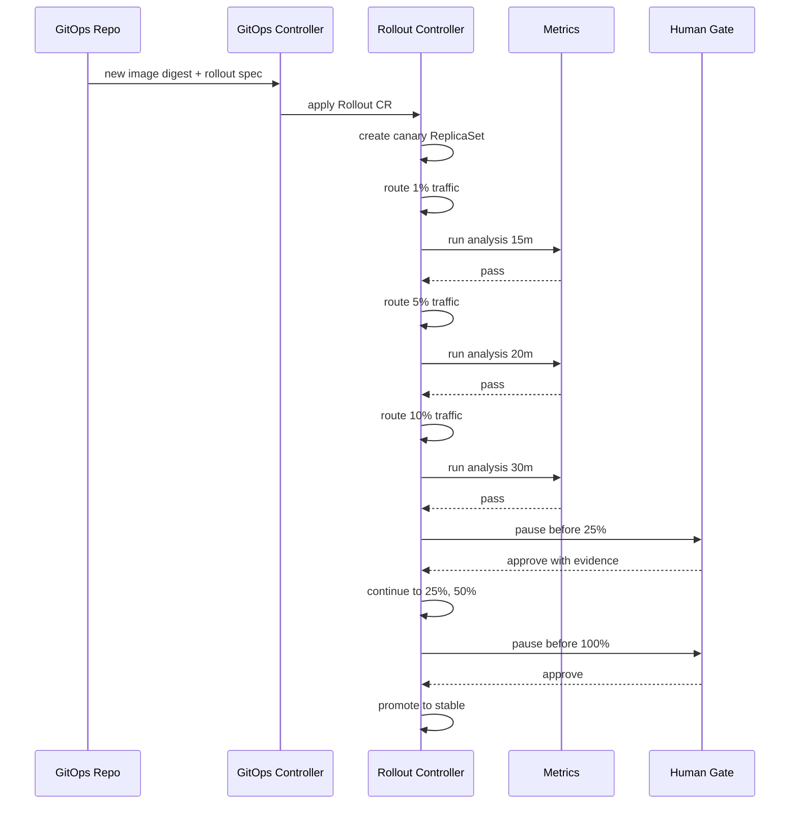

---

## 23. Failure Playbooks

### 23.1 Metric Fails at 5%

Expected response:

1. rollout controller aborts,
2. traffic returns to stable,
3. canary replica scaled down,
4. evidence saved,
5. release issue created,
6. GitOps desired version either reverted or marked blocked,
7. root cause analysis links metrics/logs/traces.

Do not:

- force promote,
- rerun blindly,
- change threshold without approval,
- delete evidence,
- manually patch cluster outside controlled workflow.

### 23.2 No Data During Analysis

Response depends on policy.

For low-risk service:

- extend analysis window,
- use synthetic traffic,
- require manual approval.

For critical service:

- pause,
- require release captain review,
- do not auto-promote.

### 23.3 Controller Down Mid-Rollout

Questions:

- what is current traffic split?
- is stable still serving?
- can controller recover from CR status?
- can operator manually abort safely?
- does GitOps keep applying CR?

Runbook should include:

- inspect rollout status,
- inspect routing object,
- inspect stable/canary services,
- restore controller,
- avoid conflicting manual changes,
- record intervention.

### 23.4 Metric Provider Down

Metric provider outage should not become auto-success.

Policy:

- fail closed or pause for critical services,
- optionally fail open for low-risk internal services,
- alert platform team,
- preserve traffic at current safe weight,
- require manual decision for promotion.

---

## 24. Design Review Questions

Use these questions in architecture review.

### Strategy

- Why this rollout strategy?
- What is release class?
- What is maximum blast radius per step?
- What is rollback/abort path?
- What changes are irreversible?

### Metrics

- What metrics prove user-visible safety?
- What metrics prove domain correctness?
- What happens on no data?
- What is minimum sample size?
- Are canary metrics compared to stable baseline?

### Routing

- Who owns traffic weight?
- Does routing support sticky sessions/cohorts?
- Are async workers covered?
- Are internal/external traffic paths both tested?

### GitOps

- What does Git own?
- What does rollout controller own?
- Does GitOps ignore correct runtime fields?
- Are rollout events captured?

### Governance

- Which steps are automatic?
- Which steps require manual approval?
- Where is evidence stored?
- How are exceptions approved?
- Who can abort/promote?

---

## 25. Minimal Hands-On Practice

Build a small but realistic exercise.

### Exercise A — Define Service Release Classes

Create `release-classes.yaml`:

```yaml
classes:
  C1:
    strategy: rolling
    requiredMetrics: [availability, error_rate]
    manualGates: []
  C2:
    strategy: canary
    steps: [5, 25, 50, 100]
    requiredMetrics: [availability, error_rate, p95_latency]
  C3:
    strategy: canary
    steps: [1, 5, 10, 25, 50, 100]
    requiredMetrics: [availability, error_rate, p95_latency, business_error_rate]
    manualGates: [before_25, before_100]
```

Then classify five services:

- auth API,
- order API,
- admin dashboard,
- recommendation API,
- notification worker.

Explain why.

### Exercise B — Write Analysis Decision Contract

For one service, write:

```yaml
analysis:
  metrics:
    - name:
      source:
      query:
      successCondition:
      failureCondition:
      noDataPolicy:
      owner:
```

Do not use generic metrics only. Add one domain metric.

### Exercise C — Model Failure Transitions

Draw state transitions for:

- analysis fail,
- no data,
- metric provider down,
- manual gate timeout,
- rollback not compatible.

If a transition has no safe action, your rollout design is incomplete.

---

## 26. Production Checklist

Before enabling progressive delivery org-wide:

- [ ] service criticality classes defined,
- [ ] rollout strategies mapped to classes,
- [ ] metric ownership defined,
- [ ] no-data/inconclusive policies defined,
- [ ] routing provider chosen and tested,
- [ ] GitOps field ownership documented,
- [ ] controller HA/backup runbook available,
- [ ] manual gates audited,
- [ ] abort/rollback tested in staging,
- [ ] business metrics available for C3/C4 systems,
- [ ] async worker rollout pattern defined,
- [ ] evidence retention implemented,
- [ ] release dashboards exist,
- [ ] exception process exists.

---

## 27. Key Takeaways

Progressive delivery bukan sekadar canary YAML.

Ia adalah cara membuat release menjadi **measured state transition**.

Prinsip utama:

1. GitOps mengelola desired rollout spec; rollout controller mengelola runtime progression.
2. Canary membatasi traffic blast radius, bukan state blast radius.
3. Metric gate harus mencakup technical dan domain correctness.
4. No data bukan success.
5. Manual gate boleh ada selama explicit, audited, dan menjadi bagian state machine.
6. IaC changes juga perlu staged rollout/waves.
7. Evidence adalah bagian dari release, bukan afterthought.

Top 1% engineer tidak hanya bisa mengaktifkan Argo Rollouts atau Flagger. Mereka bisa menjawab:

> Untuk perubahan ini, apa bukti bahwa versi baru aman dinaikkan dari 5% ke 25%, dan apa yang terjadi jika bukti itu tidak muncul?

---

## References

- OpenGitOps Principles — https://opengitops.dev/
- Argo Rollouts Documentation — https://argoproj.github.io/rollouts/
- Argo Rollouts Canary Strategy — https://argo-rollouts.readthedocs.io/en/stable/features/canary/
- Argo Rollouts Analysis — https://argo-rollouts.readthedocs.io/en/stable/features/analysis/
- Flagger Documentation — https://flagger.app/
- Flagger Deployment Strategies — https://docs.flagger.app/usage/deployment-strategies
- Kubernetes Rollout Commands — https://kubernetes.io/docs/reference/kubectl/generated/kubectl_rollout/
