# Part 028 — Promotion and Release Governance

## Tujuan Part Ini

Di part sebelumnya kita membahas progressive delivery: bagaimana versi baru naik traffic secara bertahap dan berbasis bukti.

Sekarang kita naik satu lapisan:

> bagaimana perubahan dipromosikan antar environment, region, account, cluster, tenant, dan release channel secara governable?

Ini bukan sekadar “deploy dev → staging → prod”.

Untuk pipeline GitOps/IaC production-grade, promotion adalah proses state transition lintas boundary:

- artifact boundary,
- environment boundary,
- account/subscription boundary,
- cluster boundary,
- data classification boundary,
- approval boundary,
- compliance boundary,
- business risk boundary.

Release governance menjawab:

- artifact mana yang boleh dipromosikan?
- environment mana yang harus dilewati?
- bukti apa yang harus ada sebelum production?
- siapa boleh approve?
- apa yang terjadi saat freeze?
- bagaimana emergency fix masuk tanpa menghancurkan audit?
- kapan rollback boleh dilakukan, dan kapan harus rollforward?
- bagaimana membedakan application release, infrastructure release, platform release, policy release, dan data release?

Part ini akan membangun operating model untuk promotion dan release governance yang cocok untuk engineering organization skala besar.

---

## 1. Promotion Is Not Rebuild

Prinsip pertama:

> Build once, promote the same artifact.

Jika build diulang per environment, maka environment tidak menerima artifact yang sama.

Bad pattern:

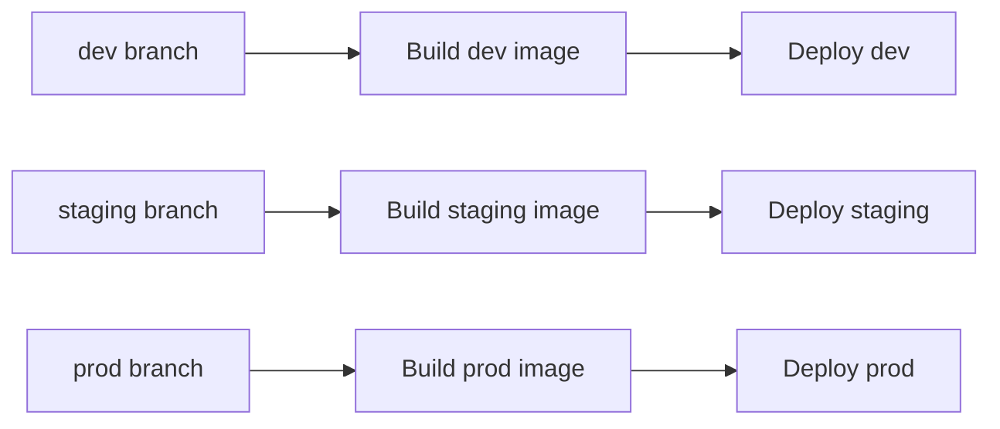

Masalah:

- dev/staging/prod bisa berbeda binary,
- hasil test staging tidak membuktikan binary prod,
- provenance chain terputus,
- signature/SBOM berbeda,
- sulit audit,
- reproducibility menjadi asumsi.

Good pattern:

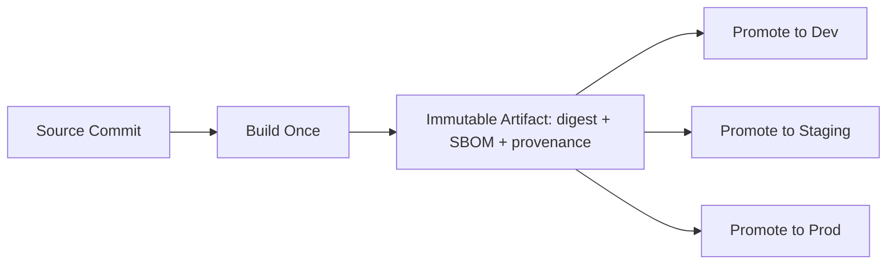

Environment boleh punya config berbeda, tetapi artifact harus sama.

Rule:

> Promotion moves immutable artifacts and desired-state references. It must not rebuild the artifact.

---

## 2. What Exactly Is Promoted?

Promotion sering kabur. Ada beberapa hal yang bisa dipromosikan:

| Item | Example | Promotion Meaning |
|---|---|---|
| Container image | `payment-api@sha256:...` | environment uses exact image digest |
| Helm chart | `payment-api-chart-1.4.2.tgz` | chart package promoted |
| Rendered manifest | signed YAML bundle | final desired state promoted |
| Terraform module | `vpc-module v3.2.0` | stack moves to module version |
| IaC plan | saved plan artifact | exact infrastructure transition approved |
| Policy bundle | OPA/Kyverno policy version | enforcement rules promoted |
| Database migration | migration version `20260703_01` | schema/data change staged |
| Platform component | Argo CD/Flux/controller version | control plane upgraded |
| Feature flag config | flag rule version | runtime behavior changed |

Top engineer bertanya:

> unit of promotion-nya apa, dan apakah unit itu immutable?

Jika unit promosi mutable, audit melemah.

Contoh buruk:

```yaml
image: payment-api:prod
```

Contoh baik:

```yaml
image: registry.example.com/payment-api@sha256:6f1...
metadata:
  annotations:
    build.git.sha: abc123
    build.slsa.provenance: https://evidence.example.com/prov/abc123
    build.sbom: https://evidence.example.com/sbom/abc123
```

---

## 3. Promotion as State Transition

Promotion harus dimodelkan sebagai state machine.

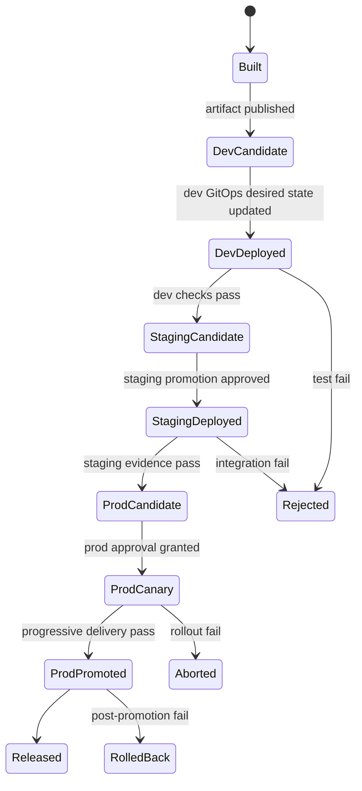

Setiap state harus punya:

- entry criteria,
- exit criteria,
- evidence,
- owner,
- timeout,
- exception path.

Contoh:

| State | Entry | Exit | Evidence |
|---|---|---|---|
| Built | CI produced artifact | signature/SBOM/provenance verified | build record |
| DevDeployed | dev GitOps commit merged | tests pass | test reports |
| StagingDeployed | staging config promoted | integration/perf/security checks pass | CI evidence |
| ProdCandidate | production PR opened | approvals complete | approvals + risk classification |
| ProdCanary | prod rollout started | metric gates pass | rollout analysis |
| Released | 100% promoted | post-release checks pass | release record |

---

## 4. Environment Ordering Is a Risk Model

Urutan environment bukan ritual.

Urutan environment harus mengikuti kenaikan risiko.

Common flow:

```text
dev → integration → staging → production
```

Tetapi di organisasi besar, environment dimension lebih kompleks:

```text
sandbox → dev → shared integration → performance → preprod → prod-canary-region → prod-primary → prod-secondary
```

atau untuk multi-tenant SaaS:

```text
internal tenant → beta tenants → low-risk tenants → standard tenants → strategic tenants
```

atau untuk IaC multi-account:

```text
sandbox account → nonprod account → low-risk prod account → prod wave 1 → prod wave 2 → regulated account
```

Environment ordering harus mempertimbangkan:

- data classification,
- customer impact,
- traffic volume,
- dependency coupling,
- reversibility,
- compliance requirement,
- recovery time,
- blast radius.

### 4.1 Environment Is Not Just `dev/staging/prod`

Environment adalah tuple:

```text
environment = stage + region + account + cluster + tenant + data-class + release-channel
```

Contoh:

```yaml
environment:
  stage: prod
  region: ap-southeast-3
  account: prod-id-payments
  cluster: eks-prod-id-01
  tenantTier: strategic
  dataClass: pci
  releaseChannel: stable
```

Promotion rule harus bisa membaca tuple ini.

---

## 5. Promotion Models

### 5.1 Branch-Based Promotion

Setiap environment punya branch.

```text
main → staging branch → prod branch
```

Kelebihan:

- familiar,
- approval via PR antar branch,
- mudah dipahami.

Kekurangan:

- merge conflicts,
- branch drift,
- cherry-pick complexity,
- sulit untuk banyak environment,
- history bisa misleading,
- rollback antar branch bisa rumit.

Branch-based promotion cocok untuk setup sederhana, tetapi sering melemah di platform besar.

### 5.2 Directory-Based Promotion

Satu repo, directory per environment.

```text
environments/
  dev/payment-api.yaml
  staging/payment-api.yaml
  prod/payment-api.yaml
```

Promotion adalah PR yang mengubah file environment berikutnya.

Kelebihan:

- diff jelas,
- environment state terlihat berdampingan,
- CODEOWNERS per directory,
- cocok untuk GitOps repo.

Kekurangan:

- duplication risk,
- YAML sprawl,
- promotion automation perlu hati-hati,
- banyak environment membuat repo besar.

### 5.3 Artifact Registry Promotion

Artifact diberi promotion metadata di registry/release system.

Contoh:

```text
image digest sha256:abc
  channel: dev-passed
  channel: staging-approved
  channel: prod-approved
```

Kelebihan:

- artifact-centric,
- environment config bisa tetap stabil,
- mudah audit artifact lifecycle,
- cocok dengan signing/provenance.

Kekurangan:

- Git desired state harus tetap eksplisit,
- registry metadata bisa menjadi shadow source of truth,
- perlu integrasi policy kuat.

### 5.4 Pull Request Promotion

Promotion dilakukan lewat PR yang mengubah desired state environment target.

Ini paling cocok dengan GitOps.

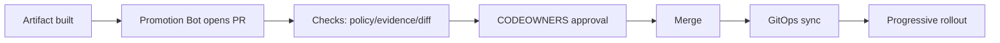

Kelebihan:

- approval natural,
- evidence attached ke PR,
- Git tetap source of truth,
- mudah audit,
- compatible dengan CODEOWNERS.

Kekurangan:

- PR noise jika terlalu granular,
- promotion queue perlu dikelola,
- automation harus menghindari accidental bundle changes.

### 5.5 Release Train

Release train mengelompokkan perubahan ke jadwal rilis.

Cocok untuk:

- organisasi besar,
- banyak service dependent,
- regulated release windows,
- enterprise customer communication.

Kelemahan:

- lead time lebih panjang,
- batch size besar,
- rollback lebih kompleks,
- konflik antar tim.

Release train bisa dikombinasikan dengan GitOps, tetapi jangan sampai GitOps kehilangan small-batch advantage.

---

## 6. The Promotion Contract

Setiap promotion harus punya contract.

Contoh:

```yaml
promotionContract:
  artifact:
    type: container-image
    digest: sha256:...
    sourceCommit: abc123
    provenance: required
    sbom: required
    signature: required
  from:
    environment: staging
  to:
    environment: prod-ap-southeast-3
  requiredEvidence:
    - unit_tests_passed
    - integration_tests_passed
    - vulnerability_policy_passed
    - image_signature_verified
    - staging_rollout_success
    - no_open_blocker_incident
  approvals:
    required:
      - service-owner
      - platform-owner-if-infra-change
      - security-owner-if-policy-or-iam-change
  rollout:
    class: C3
    strategy: canary
    manualGates:
      - before_50_percent
      - before_100_percent
  rollback:
    mode: abort_before_promotion
    afterPromotion: rollforward_preferred_if_schema_migrated
```

Promotion contract membuat release bukan opini, tetapi transisi yang bisa dievaluasi.

---

## 7. Evidence-Driven Promotion

Promotion tidak boleh hanya berdasarkan “tests passed”.

Evidence minimal untuk application promotion:

- source commit,
- build ID,
- image digest,
- SBOM reference,
- provenance/attestation,
- vulnerability scan result,
- unit/integration test result,
- policy gate result,
- staging deployment status,
- staging rollout analysis,
- approval record,
- production rollout result.

Evidence untuk IaC promotion:

- changed stack list,
- plan output/reference,
- policy result,
- cost/risk summary,
- approval record,
- apply result,
- drift check after apply,
- state version reference,
- rollback/remediation note if partial failure.

Evidence untuk policy promotion:

- policy diff,
- affected resources estimate,
- dry-run/audit mode result,
- violation count before enforce,
- exception list,
- enforcement plan,
- rollback plan.

Evidence untuk database promotion:

- migration diff,
- compatibility proof,
- backup/snapshot reference,
- dry run result,
- migration duration estimate,
- rollback/rollforward plan,
- post-migration verification.

Mental model:

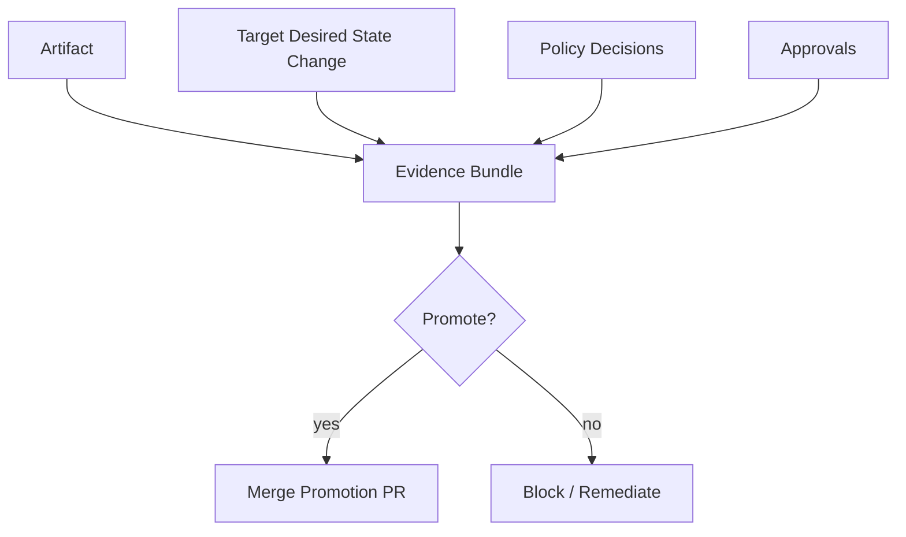

---

## 8. Approval Design

Approval bukan sekadar klik.

Approval adalah claim:

> orang/role tertentu menyetujui transisi state tertentu berdasarkan evidence tertentu pada waktu tertentu.

Approval harus mengikat:

- artifact digest,
- target environment,
- diff,
- plan/result,
- policy result,
- approver identity,
- timestamp,
- approval scope.

Bad approval:

```text
LGTM
```

Better approval metadata:

```yaml
approval:
  approver: service-owner@example.com
  role: service-owner
  approvedAt: 2026-07-03T10:00:00Z
  scope:
    artifactDigest: sha256:abc
    environment: prod-id
    gitCommit: def456
    planHash: plan789
  evidenceReviewed:
    - staging_rollout_success
    - policy_pass
    - vulnerability_scan_pass
  expiresAt: 2026-07-03T18:00:00Z
```

### 8.1 Approval Expiry

Approval harus expire.

Kenapa?

- environment bisa berubah,
- drift bisa muncul,
- vulnerability baru bisa ditemukan,
- incident bisa terjadi,
- plan bisa stale,
- approver menyetujui context lama.

Contoh rule:

| Change Type | Approval TTL |
|---|---:|
| low-risk app deploy | 24h |
| production infra apply | 4h |
| IAM/network destructive change | 1h |
| emergency fix | immediate + post-review |

### 8.2 Segregation of Duties

Untuk high-risk environment, orang yang membuat perubahan tidak selalu boleh menjadi satu-satunya approver.

Rule contoh:

```yaml
approvalPolicy:
  prod:
    requireDifferentActorFromAuthor: true
    requiredRoles:
      - service-owner
  prod-infra-network:
    requiredRoles:
      - platform-owner
      - security-owner
    requireDifferentActorFromAuthor: true
```

Segregation of duties bukan birokrasi kosong. Ia mencegah single actor mengubah production tanpa independent review.

---

## 9. CODEOWNERS as Governance Primitive

CODEOWNERS bisa menjadi governance primitive yang sederhana tapi kuat.

Contoh:

```text
/environments/prod/** @platform-prod-approvers
/environments/prod/payments/** @payments-service-owners @security-reviewers
/policies/** @platform-security
/infra-live/prod/network/** @network-platform-team @security-reviewers
/infra-live/prod/iam/** @cloud-platform-team @security-reviewers
```

Namun CODEOWNERS tidak cukup sendiri.

Butuh:

- branch protection,
- required status checks,
- signed commits/tags jika diperlukan,
- policy check,
- evidence check,
- stale approval dismissal,
- merge queue untuk menghindari race.

CODEOWNERS menjawab siapa reviewer. Ia tidak otomatis membuktikan perubahan aman.

---

## 10. Release Freeze

Release freeze bukan berarti semua perubahan berhenti. Freeze berarti aturan promotion berubah.

Jenis freeze:

| Freeze Type | Meaning |
|---|---|
| soft freeze | hanya low-risk changes allowed |
| hard freeze | hanya emergency/security fixes |
| regional freeze | environment/region tertentu dibatasi |
| business freeze | terkait event bisnis seperti peak season |
| compliance freeze | audit/regulatory window |

Freeze policy harus machine-readable.

Contoh:

```yaml
freezeWindow:
  name: year-end-payment-freeze
  environments:
    - prod-payments-*
  startsAt: 2026-12-20T00:00:00Z
  endsAt: 2027-01-05T23:59:59Z
  allowedChangeClasses:
    - emergency-security-fix
    - sev1-remediation
  additionalApprovals:
    - head-of-engineering
    - incident-commander-if-active-incident
```

Pipeline harus bisa mengevaluasi freeze:

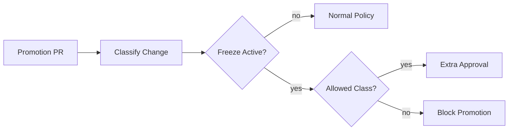

Freeze yang hanya diumumkan di chat akan dilanggar oleh automation.

---

## 11. Emergency Path Without Audit Destruction

Emergency path diperlukan.

Tetapi emergency path tidak boleh menjadi backdoor permanen.

Bad emergency path:

- SSH ke node,
- patch cluster manual,
- disable GitOps tanpa record,
- apply Terraform lokal dengan admin credential,
- push langsung ke prod branch,
- skip policy tanpa reason.

Good emergency path:

```yaml
emergencyChange:
  allowedWhen:
    - active_sev1
    - active_security_incident
  required:
    - incident_id
    - commander_approval
    - narrowed_scope
    - post_change_review_within_24h
    - reconciliation_commit_after_manual_action
  forbidden:
    - permanent_policy_disable
    - unbounded_admin_credentials
    - undocumented_state_mutation
```

Emergency path harus menjawab:

- siapa boleh menjalankan?
- credential apa yang dipakai?
- berapa lama akses berlaku?
- environment mana yang boleh disentuh?
- evidence apa yang tetap diambil?
- bagaimana kembali ke Git desired state?
- kapan post-incident review dilakukan?

### 11.1 Break-Glass State Machine

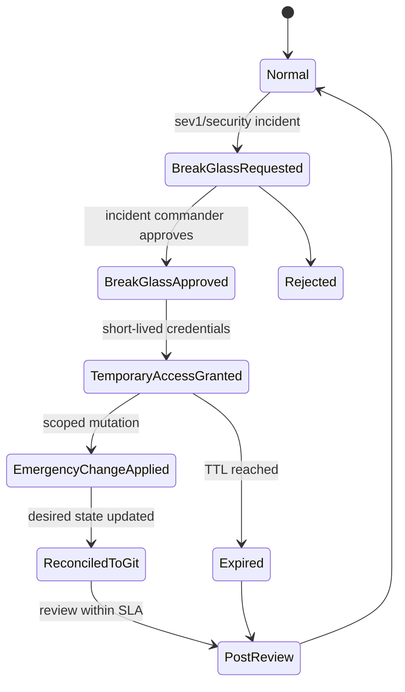

Break-glass yang baik tetap punya state machine.

---

## 12. Rollback Semantics in Governance

Governance harus membedakan rollback type.

| Rollback Type | Meaning | Risk |
|---|---|---|
| Git revert | mengembalikan desired state commit | tidak selalu mengembalikan live state aman |
| Kubernetes rollout undo | kembali ke previous replica set | bisa gagal jika config/data berubah |
| Artifact rollback | deploy image digest lama | butuh compatibility |
| IaC revert | apply config lama | bisa destroy/replace resource |
| State rollback | mengubah Terraform/OpenTofu state | sangat berbahaya |
| DB rollback | revert schema/data | sering tidak feasible |
| Feature flag rollback | matikan behavior | cepat, tetapi perlu audit |

Prinsip:

> Rollback adalah perubahan baru. Ia perlu policy, evidence, dan compatibility reasoning.

Jangan menganggap rollback selalu aman.

Contoh:

- rollback aplikasi setelah schema contract drop bisa membuat aplikasi lama crash,
- rollback IAM policy bisa memutus service account yang sudah bergantung,
- rollback network route bisa membuat traffic asimetris,
- rollback Terraform config bisa replace resource,
- rollback policy bisa membuka violation lama.

Governance harus meminta rollback plan sebelum release high-risk.

---

## 13. Rollforward Governance

Dalam sistem modern, rollforward sering lebih realistis.

Rollforward cocok jika:

- data already migrated,
- bug localized,
- patch kecil dan cepat,
- old version incompatible,
- rollback memicu risiko lebih besar.

Namun rollforward bukan alasan untuk skip governance.

Rollforward fast path:

```yaml
rollforwardPolicy:
  allowedFor:
    - production_regression
    - irreversible_data_change
  requiredEvidence:
    - incident_id
    - root_cause_summary
    - patch_diff_small
    - affected_scope
    - test_result
  approvals:
    - incident_commander
    - service_owner
  postChecks:
    - canary_metrics
    - business_metric_recovery
```

---

## 14. Change Classification

Pipeline harus mengklasifikasikan perubahan.

Classification dimensions:

| Dimension | Examples |
|---|---|
| artifact | app image, chart, IaC module, policy, DB migration |
| target | dev, staging, prod, regulated prod |
| blast radius | single service, namespace, cluster, region, account, global |
| reversibility | reversible, partially reversible, irreversible |
| risk class | low, normal, high, critical |
| data impact | none, read-only, write path, schema/data mutation |
| security impact | none, IAM, network exposure, secret, policy |
| user impact | internal, beta, public, strategic customer |

Example classifier output:

```yaml
changeClassification:
  kind: application_release
  target: prod
  blastRadius: service
  reversibility: reversible_if_db_not_migrated
  riskClass: high
  dataImpact: write_path
  securityImpact: none
  requiredApprovals:
    - service-owner
  requiredGates:
    - staging_success
    - canary
    - business_metrics
```

Classifier can be implemented using:

- path rules,
- manifest diff analysis,
- IaC plan analysis,
- labels in PR,
- service catalog metadata,
- policy engine evaluation,
- manual override with approval.

---

## 15. Promotion Queue and Concurrency

Multiple changes can target same environment.

Risks:

- stale approvals,
- conflicting config changes,
- plan invalidation,
- environment changes between test and deploy,
- two rollouts affecting same dependency,
- overloaded on-call/observability capacity.

Use promotion queue.

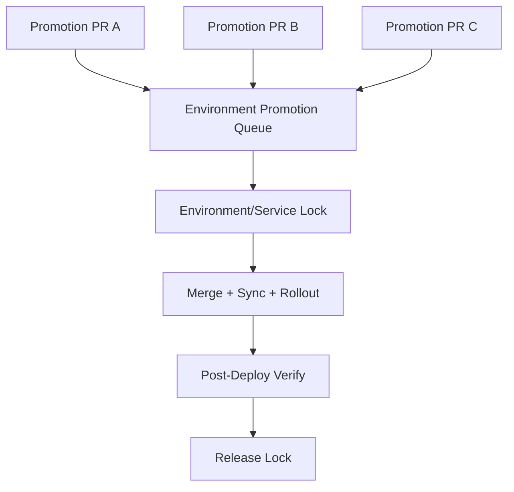

Lock granularity:

| Lock | Use Case |
|---|---|
| service lock | app release per service |
| environment lock | infra/platform-wide change |
| stack lock | Terraform/OpenTofu state boundary |
| cluster lock | cluster add-on upgrades |
| policy lock | admission policy enforcement rollout |
| data migration lock | DB/schema migration window |

Avoid global locks unless necessary. They kill delivery throughput.

---

## 16. Environment Promotion and Drift

Promotion assumes target environment state is known.

If prod drifted, promotion evidence from staging might be less valid.

Before promotion:

- check GitOps sync status,
- check drift for IaC stack,
- check admission/policy status,
- check active incidents,
- check dependency health,
- check feature flag state,
- check freeze windows.

Promotion gate:

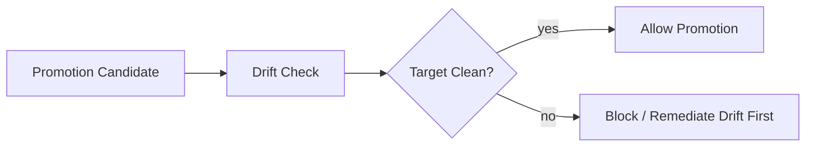

For critical systems:

> do not promote into unknown state unless emergency policy explicitly allows it.

---

## 17. Governance for Different Release Types

### 17.1 Application Release

Default evidence:

- image digest,
- build/test result,
- signature/SBOM/provenance,
- vulnerability policy,
- environment config diff,
- rollout strategy,
- progressive delivery result.

Approval:

- service owner for prod,
- security owner if auth/security-sensitive,
- product/business owner if user-visible high-risk.

### 17.2 Infrastructure Release

Default evidence:

- plan output,
- affected resources,
- replacement/destroy list,
- cost estimate,
- policy result,
- lock/state boundary,
- rollback/remediation plan,
- post-apply drift check.

Approval:

- platform owner,
- service owner if service-impacting,
- security/network owner for IAM/network,
- data owner for storage/database.

### 17.3 Policy Release

Default evidence:

- policy diff,
- dry-run violation count,
- exceptions,
- rollout mode: audit → warn → enforce,
- affected namespaces/accounts,
- rollback policy.

Approval:

- platform security,
- affected platform/app owners,
- compliance owner if regulated.

### 17.4 Database Release

Default evidence:

- migration plan,
- compatibility analysis,
- backup reference,
- lock/timeout plan,
- rollback/rollforward plan,
- performance impact estimate,
- post-migration verification.

Approval:

- service owner,
- database owner,
- incident/on-call if risky,
- business owner for critical windows.

### 17.5 Platform Control Plane Release

Examples:

- Argo CD upgrade,
- Flux upgrade,
- ingress controller upgrade,
- cert-manager upgrade,
- external-secrets upgrade,
- policy controller upgrade,
- CSI/CNI add-on upgrade.

Evidence:

- compatibility matrix,
- CRD conversion risk,
- backup of controller config,
- canary cluster result,
- rollback plan,
- platform SLO impact.

Approval:

- platform owner,
- cluster owner,
- security owner if policy/secrets/admission.

---

## 18. Release Governance Architecture

A practical architecture:

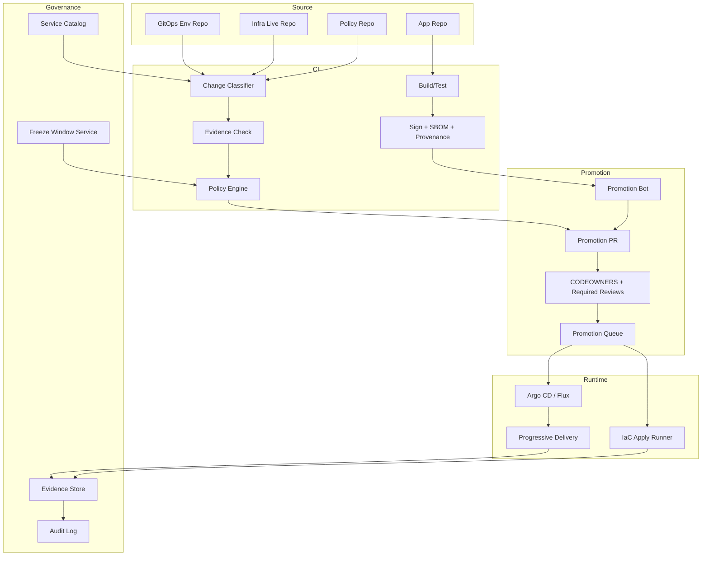

Key idea:

> promotion is not a CI job; promotion is a governed workflow around immutable artifacts, target environments, approvals, and evidence.

---

## 19. Promotion Bot Design

Promotion bot harus deterministik dan auditable.

Responsibilities:

- detect promotable artifact,
- verify evidence,
- calculate target environment diff,
- open PR with structured summary,
- attach risk classification,
- request correct reviewers,
- block if freeze/policy fails,
- update PR when new evidence arrives,
- avoid bundling unrelated changes,
- record promotion decision.

PR body example:

```markdown
## Promotion Request

Service: payment-api
Artifact: registry.example.com/payment-api@sha256:abc...
Source commit: abc123
From: staging
To: prod-id
Release class: C3

## Evidence

- Build: passed
- Unit tests: passed
- Integration tests: passed
- SBOM: available
- Provenance: verified
- Image signature: verified
- Vulnerability policy: passed
- Staging rollout: passed

## Risk

- Data impact: write path
- Security impact: none
- Rollback: abort before promotion, rollforward after schema migration
- Progressive delivery: 1 → 5 → 10 → 25 → 50 → 100

## Required Approval

- @payment-service-owners
- @platform-prod-approvers
```

Bad promotion bot:

- opens huge PR changing many services,
- hides artifact digest,
- uses mutable tags,
- does not attach evidence,
- auto-merges into production without target-specific policy,
- reruns build during promotion.

---

## 20. Release Dashboard

A release dashboard should show state, not vanity.

Minimum fields:

| Field | Purpose |
|---|---|
| release ID | correlation |
| service | ownership |
| artifact digest | immutability |
| source commit | traceability |
| target environment | blast radius |
| current state | lifecycle |
| pending gate | next action |
| approvers | accountability |
| rollout progress | traffic/scope |
| metrics status | evidence |
| freeze status | governance |
| incident link | context |

State examples:

- built,
- dev deployed,
- staging verified,
- prod PR open,
- waiting approval,
- waiting freeze exception,
- queued,
- syncing,
- canary 5%,
- paused before 50%,
- aborted,
- promoted,
- post-release verification,
- released.

Dashboard should answer:

> what is blocking this release, and who owns the next transition?

---

## 21. Governance Without Killing Flow

Governance can become harmful if it increases batch size and bypass incentives.

Bad governance symptoms:

- too many manual approvals for low-risk changes,
- no fast path for safe changes,
- unclear approvers,
- approvals without evidence,
- emergency path used for normal work,
- teams avoid platform because it is slow,
- release train accumulates massive batches,
- policy exceptions never expire.

Good governance:

- risk-based,
- automated where possible,
- explicit where manual is necessary,
- evidence-driven,
- fast for low-risk,
- strict for high-risk,
- auditable by default,
- reversible or recoverable.

Rule:

> The goal is not maximum approval. The goal is controlled, observable, recoverable change flow.

---

## 22. Worked Example: Application Promotion

Scenario:

- service: `order-api`,
- artifact: image digest `sha256:abc`,
- source commit: `c0ffee`,
- target: production Indonesia region,
- release class: C3,
- DB change: additive column already deployed,
- feature flag: off by default.

### 22.1 Promotion Flow

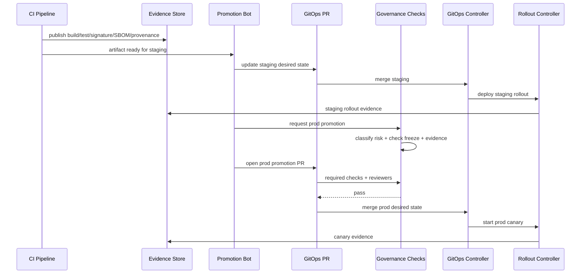

### 22.2 Promotion PR Diff

```diff
 environments/prod-id/order-api/release.yaml
-image: registry.example.com/order-api@sha256:old
+image: registry.example.com/order-api@sha256:abc
 metadata:
-  sourceCommit: oldsha
+  sourceCommit: c0ffee
+  evidence: https://evidence.example.com/releases/order-api/c0ffee
```

A good promotion PR changes the smallest possible desired state needed to promote one artifact.

---

## 23. Worked Example: IaC Module Promotion

Scenario:

- module: `network-edge` v2.4.0 → v2.5.0,
- change: add WAF managed rule in detect mode,
- target: production accounts,
- risk: false positives if enforce mode accidentally enabled.

Promotion waves:

```yaml
waves:
  - name: sandbox
    accounts: [sandbox-01]
    requiredEvidence: [plan_pass, apply_pass]
  - name: low-risk-prod
    accounts: [prod-noncritical-01]
    requiredEvidence: [plan_pass, policy_pass, waf_count_metrics]
  - name: prod-standard
    accounts: [prod-standard-*]
    requiredEvidence: [no_false_positive_spike]
  - name: regulated-prod
    accounts: [prod-regulated-*]
    requiredApprovals: [security-owner, compliance-owner]
```

Policy rules:

- WAF rule must start in count/detect mode,
- no global blocking without security approval,
- all affected load balancers listed,
- cost impact below threshold,
- rollback plan documented.

This is progressive delivery for infrastructure.

---

## 24. Anti-Patterns

### 24.1 Rebuilding Per Environment

This destroys artifact traceability.

Fix:

- build once,
- sign once,
- promote digest.

### 24.2 Promotion by Mutable Tags

`image: app:prod` is not a reliable promotion unit.

Fix:

- use digest,
- keep tag as metadata only if needed.

### 24.3 Environment Branch Drift

Branches diverge and no one knows what production really contains.

Fix:

- prefer directory-based desired state or generated promotion PRs,
- use drift detection,
- use environment diff dashboards.

### 24.4 Approval Without Evidence

Reviewer approves blindly.

Fix:

- block until evidence exists,
- summarize evidence in PR,
- bind approval to artifact/diff/plan hash.

### 24.5 Emergency Path as Normal Path

Teams use break-glass because normal path is slow.

Fix:

- create fast safe path for low-risk changes,
- monitor emergency usage,
- require post-review,
- reduce friction where governance is not adding value.

### 24.6 Rollback Assumed Safe

Rollback is treated as undo button.

Fix:

- classify reversibility,
- require rollback/rollforward plan,
- test rollback in lower env,
- apply expand/contract data migration.

---

## 25. Implementation Checklist

For a production GitOps/IaC platform:

- [ ] define promotion unit per artifact type,
- [ ] enforce build-once-promote-same-artifact,
- [ ] pin container image by digest,
- [ ] capture SBOM/provenance/signature,
- [ ] define environment tuple model,
- [ ] implement promotion contracts,
- [ ] implement risk-based change classifier,
- [ ] integrate CODEOWNERS and required checks,
- [ ] implement approval expiry,
- [ ] implement freeze window policy,
- [ ] implement emergency path with short-lived credentials,
- [ ] implement promotion queue/locks,
- [ ] block promotion into drifted critical environments,
- [ ] store evidence for app/IaC/policy/database releases,
- [ ] expose release dashboard,
- [ ] track bypass/emergency usage,
- [ ] run regular rollback/rollforward drills.

---

## 26. Design Review Questions

Ask these before approving a promotion system.

### Artifact

- Is the promoted unit immutable?
- Is the same artifact used across environments?
- Is digest/provenance/SBOM linked?
- Can we prove what code is running?

### Environment

- What is the target environment tuple?
- What is the blast radius?
- Is target environment drift-free?
- Is there an active freeze or incident?

### Approval

- Who approves and why?
- Is approval bound to exact diff/artifact/plan?
- Does approval expire?
- Is author different from approver where required?

### Rollout

- Is progressive delivery required?
- What metrics gate promotion?
- What happens on no data?
- Is rollback/rollforward plan feasible?

### Governance

- Is emergency path defined?
- Are exceptions time-bound?
- Is evidence retained?
- Can audit reconstruct the release?

---

## 27. Key Takeaways

Promotion is not deployment. Promotion is a governed transition of immutable desired-state references across risk boundaries.

Prinsip utama:

1. Build once, promote the same artifact.
2. Promotion unit must be immutable and traceable.
3. Environment is a tuple, not just dev/staging/prod.
4. Approval must bind to evidence, artifact, diff, target, and time.
5. Release freeze must be machine-readable.
6. Emergency path must preserve audit and reconciliation.
7. Rollback is a new change, not a magic undo.
8. Governance must be risk-based or teams will bypass it.

Top 1% engineer tidak hanya membuat pipeline yang bisa deploy. Mereka membuat release system yang bisa menjawab:

> Apa yang berubah, dari mana asalnya, siapa menyetujui, evidence apa yang dipakai, environment mana yang terdampak, bagaimana rollout berjalan, dan bagaimana kita recover jika salah?

---

## References

- OpenGitOps Principles — https://opengitops.dev/
- Argo CD Documentation — https://argo-cd.readthedocs.io/
- Flux Documentation — https://fluxcd.io/flux/
- Argo Rollouts Documentation — https://argoproj.github.io/rollouts/
- Flagger Documentation — https://flagger.app/
- SLSA Build Requirements — https://slsa.dev/spec/v1.2/build-requirements
- Kubernetes Rollout Commands — https://kubernetes.io/docs/reference/kubectl/generated/kubectl_rollout/
