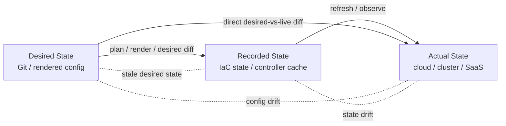
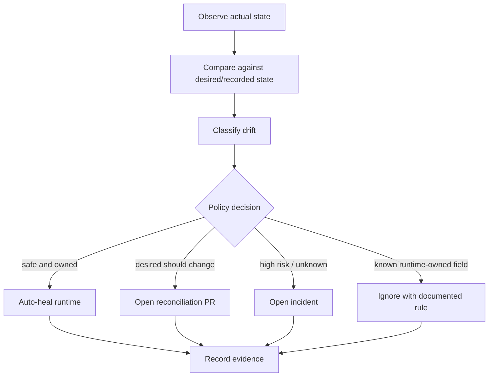
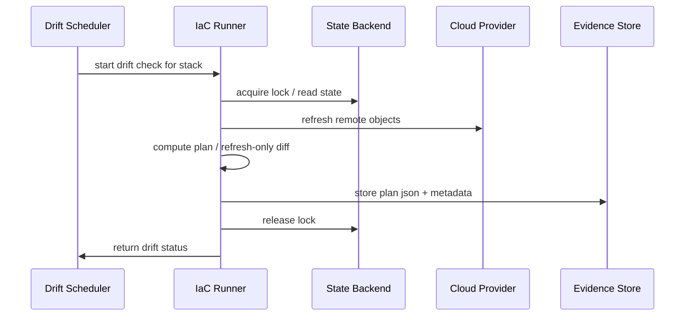
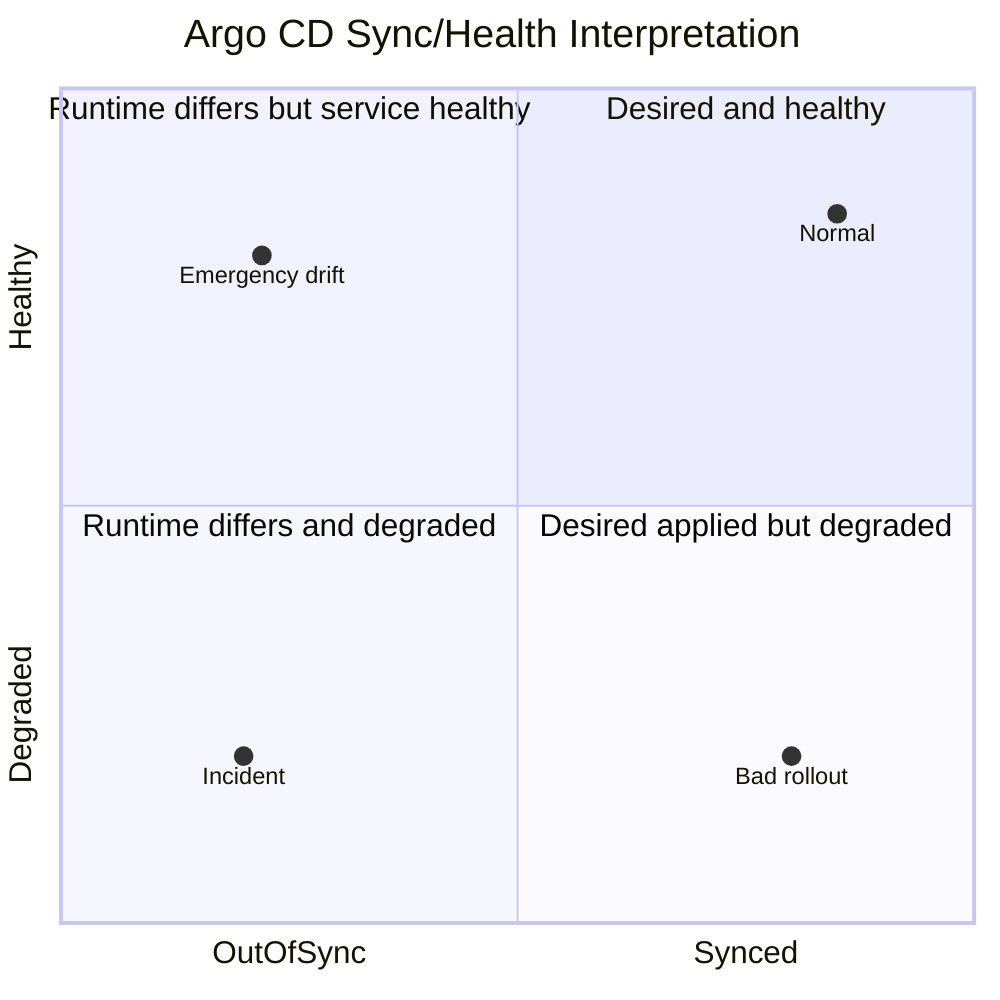
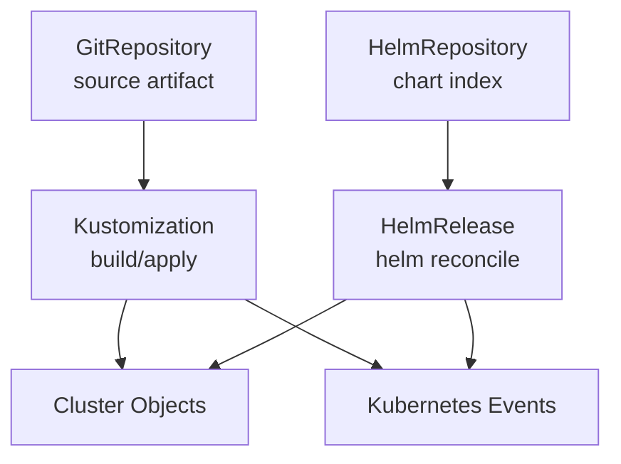
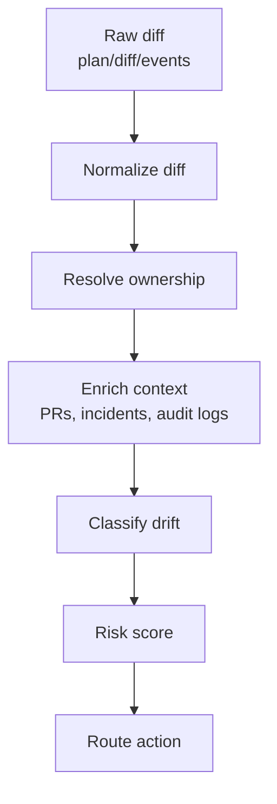
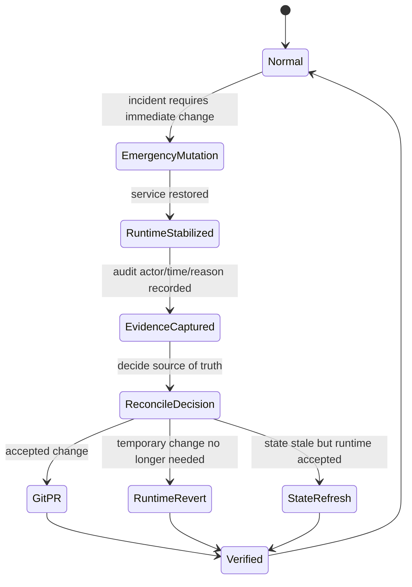
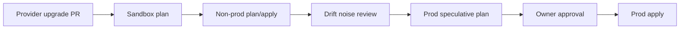

# Part 029 — Drift Detection and Reconciliation

Drift is not merely "someone changed production manually".

That is the childish definition.

In a real GitOps/IaC platform, drift is any meaningful divergence between the system state you **intend**, the state your control plane **remembers**, and the state the runtime **actually has**.

The practical problem is not only detecting drift. The harder problem is deciding:

1. whether the drift is real;
2. whether it is harmful;
3. who owns it;
4. whether the system may self-heal it;
5. whether the drift should update Git, update state, trigger incident response, or be ignored;
6. how to produce evidence that the decision was correct.

A top-tier engineer does not treat drift as a binary alert. They treat drift as a **state classification and reconciliation problem**.

This part builds that model.

---

## 1. The Skill You Are Building

After this part, you should be able to design a drift system that can answer these questions without guesswork:

- What is the source of truth for this resource?
- Which controller owns this field?
- Is this drift caused by manual mutation, provider read behavior, runtime controller mutation, emergency response, failed reconciliation, or stale desired state?
- Is it safe to auto-reconcile?
- Should reconciliation happen by reverting runtime, updating Git, importing state, refreshing state, or opening a PR?
- Which team must approve the reconciliation?
- Which evidence proves what happened?

That is the real capability.

Not "run `terraform plan` on a schedule".

---

## 2. Drift Is a Three-Plane Problem

Most engineers model drift as:

```text
Git != Production
```

That is incomplete.

For IaC/GitOps, there are usually three important state planes:

```text
Desired State     = what Git/config declares
Recorded State    = what the IaC engine/controller believes exists
Actual State      = what the external system currently contains
```

For Terraform/OpenTofu-style IaC:

- desired state is configuration;
- recorded state is the state file;
- actual state is the cloud/provider resource inventory.

For Kubernetes GitOps:

- desired state is rendered manifests from Git/Helm/Kustomize/etc.;
- recorded state is controller cache/status/last applied metadata/managed fields;
- actual state is live Kubernetes objects and their observed runtime status.

The moment you add these three planes, drift becomes much more precise.



A mature drift system asks which relationship is broken.

| Broken relationship | Meaning | Example |
|---|---|---|
| Desired != Actual | Runtime does not match Git/config | Replica count manually changed from 3 to 5 |
| Recorded != Actual | IaC state/controller cache is stale | Security group was changed outside OpenTofu |
| Desired != Recorded | Config changed but not applied, or state still tracks old model | Module refactor not migrated |
| Desired == Recorded but Actual differs | State is lying or refresh has not observed change | Provider state stale |
| Desired differs by generated output only | Render noise or nondeterminism | Helm template emits timestamp |

This is why blind auto-heal is dangerous.

You cannot fix a three-plane problem with a two-plane mental model.

---

## 3. Drift Is Not Always Bad

Drift is often bad, but not always.

A healthy production platform must classify drift before reacting.

| Drift class | Meaning | Default response |
|---|---|---|
| Unauthorized drift | Mutation outside approved flow | Alert, classify severity, reconcile or incident |
| Emergency drift | Manual change during incident | Preserve evidence, reconcile intentionally after incident |
| Controller-owned drift | Runtime controller mutates fields legitimately | Ignore or model ownership boundary |
| Provider-read drift | Provider reports equivalent data differently | Normalize, pin provider, suppress noisy fields carefully |
| Dependency drift | External dependency changed its observable state | Re-plan, validate compatibility, update state/config |
| Stale desired state | Git no longer represents reality because manual change became accepted | Open PR to Git, not blind revert |
| Failed reconciliation drift | Controller attempted but could not converge | Treat as control-loop failure |
| Policy drift | Runtime violates current policy, but was created before policy existed | Remediate through migration plan |

The important distinction:

> Drift is a signal. It is not automatically an incident.

A production drift program needs **classification**, not only detection.

---

## 4. The Reconciliation Contract

Before designing detection, define the contract.

A reconciliation system must specify:

1. **Owner** — which system owns the resource or field?
2. **Source of truth** — which artifact is authoritative?
3. **Observation method** — how is actual state observed?
4. **Diff method** — how is drift computed?
5. **Decision policy** — which drift can self-heal?
6. **Action** — revert runtime, update Git, refresh state, import, ignore, or escalate?
7. **Evidence** — what is recorded for audit?

Without this contract, drift detection becomes an alert factory.



A simple rule:

> Never build drift detection without a reconciliation decision table.

Detection without response design creates fatigue.

---

## 5. Drift Taxonomy for GitOps/IaC

Use this taxonomy when designing your own platform.

### 5.1 Configuration Drift

Configuration drift happens when runtime configuration differs from the declared desired state.

Examples:

- Kubernetes `Deployment` image changed manually;
- replica count patched with `kubectl scale`;
- cloud security group ingress rule added from console;
- database parameter group changed manually;
- CDN cache rule changed in UI.

This is the classic drift class.

The main question:

```text
Should runtime be reverted to Git, or should Git be updated to represent the accepted runtime state?
```

You cannot answer that from the diff alone. You need context.

### 5.2 State Drift

State drift happens when IaC state no longer represents the external system correctly.

Examples:

- resource deleted manually but still exists in state;
- resource imported incorrectly;
- state moved during refactor without `moved` block or state migration;
- provider read behavior changed after provider upgrade;
- state backend restored from old snapshot.

State drift is especially dangerous because the next plan may propose a misleading action.

A common failure pattern:

```text
Manual cloud change -> state not refreshed -> stale plan -> approval based on wrong diff -> destructive apply
```

### 5.3 Runtime Controller Drift

In Kubernetes, many controllers mutate objects after they are applied.

Examples:

- defaulting webhooks add fields;
- service mesh injects sidecars;
- HPA changes replica counts;
- cert-manager writes certificate status;
- Kubernetes controllers update status fields;
- admission controllers mutate labels, annotations, tolerations, or security context.

This is not always a violation.

The solution is not "turn off drift detection".

The solution is field ownership.

```text
Git owns desired spec fields.
Runtime controllers own status and selected generated fields.
Policy owns mandatory safety fields.
Humans own neither directly in production.
```

### 5.4 Dependency Drift

Dependency drift happens when an external resource changes in a way your configuration did not directly control.

Examples:

- AMI image behind a data source changes;
- cloud provider default TLS policy changes;
- managed Kubernetes version auto-upgrades;
- SaaS provider changes default behavior;
- Helm chart dependency version resolves differently;
- container tag moves because tag was mutable.

This is why production systems should prefer immutable references:

- image digests instead of mutable tags;
- pinned provider versions;
- pinned module versions;
- pinned chart versions;
- explicit region/account/cluster targets.

### 5.5 Identity and Access Drift

Identity drift is one of the highest-risk drift classes.

Examples:

- runner role gains extra permissions;
- GitHub OIDC trust policy becomes too broad;
- Kubernetes service account receives new cluster role binding;
- cloud admin manually grants user access;
- break-glass role is not revoked after incident;
- external secret operator gains access to wider path.

Identity drift should rarely auto-heal silently. It should usually trigger high-severity review.

### 5.6 Policy Drift

Policy drift means runtime was once allowed but is no longer allowed by current policy.

Examples:

- old resources lack mandatory tags;
- old buckets are not encrypted with current standard;
- old workloads run without current Pod Security settings;
- old IAM policies violate new least-privilege model.

This is not the same as unauthorized drift.

Policy drift often requires migration, not immediate deletion.

### 5.7 Secret Drift

Secret drift happens when declared references, external secret values, Kubernetes Secret objects, and consuming workloads are inconsistent.

Examples:

- secret rotated in Vault but Kubernetes Secret not refreshed;
- SOPS-encrypted file changed but controller failed to decrypt;
- External Secrets Operator lost permission;
- workload still uses old mounted secret until restart;
- secret key renamed in external backend.

Secret drift requires extra care because logging diffs may expose sensitive values.

### 5.8 Cost and Capacity Drift

Cost drift is runtime cost or capacity deviating from expected model.

Examples:

- instance type manually upgraded;
- autoscaler expands beyond budget;
- logging retention changed;
- expensive managed database feature enabled;
- unused resources remain after failed destroy.

Cost drift is often detected outside GitOps tooling through billing, inventory, or cloud asset systems.

---

## 6. Drift Detection Points

Do not rely on one detection mechanism.

A serious platform has multiple observation points.

| Detection point | Detects | Weakness |
|---|---|---|
| PR plan | Proposed desired-state changes | Does not detect runtime changes after merge |
| Scheduled IaC drift plan | Cloud/resource drift | Can be expensive and noisy |
| GitOps diff/sync status | Cluster desired-vs-live drift | Limited to resources managed by controller |
| Admission audit | Runtime mutation attempts | Does not detect old resources by itself |
| Cloud config/inventory scan | Broad cloud posture drift | May not know Git ownership |
| Kubernetes audit logs | Manual patch/apply events | Requires event correlation |
| Policy scanner | Compliance drift | May lack safe remediation path |
| Secret sync status | Secret delivery drift | Must avoid secret disclosure |
| Runtime synthetic probe | Behavioral drift | Does not map directly to config field |

The best systems correlate them.

For example:

```text
Argo app OutOfSync + Kubernetes audit patch by human + no matching PR = likely unauthorized runtime drift
```

Or:

```text
OpenTofu refresh-only plan detects changed security group + cloud audit log actor is break-glass role + incident ticket exists = emergency drift
```

The detection is stronger when signals are joined.

---

## 7. IaC Drift Detection with Terraform/OpenTofu

Terraform/OpenTofu-style IaC is stateful. Drift detection must consider both config and state.

OpenTofu `plan` can be used to compare configuration with real infrastructure, and refresh-only mode is specifically used to update state and root outputs to match remote objects changed outside the normal workflow.

The simplified model:



### 7.1 Normal Plan vs Refresh-Only Plan

Use the distinction carefully.

| Mode | Purpose | Typical use |
|---|---|---|
| Normal plan | Compare config + state + remote and propose changes to make remote match config | PR validation, pre-apply diff |
| Refresh-only plan | Update state to match remote changes without proposing config-driven infrastructure mutation | Reconciling known out-of-band changes into state |

A dangerous mistake is using refresh-only as if it were remediation.

Refresh-only does not make remote match Git. It makes recorded state match remote.

That can be correct after an approved emergency change. It can be wrong if the runtime drift should be reverted.

Decision rule:

```text
If runtime is wrong -> do not refresh state as acceptance.
If state is stale but runtime is accepted -> refresh/import/migrate state intentionally.
```

### 7.2 Scheduled Drift Plan Pattern

A production drift job should not be a blind cron that runs every stack with admin credentials.

It needs:

- stack registry;
- ownership metadata;
- risk tier;
- credential boundary;
- lock discipline;
- rate limit;
- evidence store;
- alert routing;
- suppression and exception policy;
- stale result detection.

Example conceptual workflow:

```yaml
name: iac-drift-detection

on:
  schedule:
    - cron: "17 * * * *"
  workflow_dispatch: {}

jobs:
  discover-stacks:
    runs-on: platform-runner
    outputs:
      matrix: ${{ steps.registry.outputs.matrix }}
    steps:
      - uses: actions/checkout@v4
      - id: registry
        run: ./platform/scripts/list-drift-eligible-stacks.sh

  drift:
    needs: discover-stacks
    strategy:
      fail-fast: false
      max-parallel: 4
      matrix: ${{ fromJson(needs.discover-stacks.outputs.matrix) }}
    runs-on: iac-runner-${{ matrix.riskTier }}
    permissions:
      id-token: write
      contents: read
    steps:
      - uses: actions/checkout@v4
      - name: Assume stack identity
        run: ./platform/scripts/assume-stack-role.sh "${{ matrix.stack }}"
      - name: Run drift plan
        run: |
          tofu init -input=false
          tofu plan -input=false -detailed-exitcode -out=drift.tfplan
      - name: Export evidence
        if: always()
        run: |
          tofu show -json drift.tfplan > drift-plan.json || true
          ./platform/scripts/publish-drift-evidence.sh
```

This is not copy-paste production code. It is a shape.

In a real implementation, you need careful exit-code handling, secrets masking, backend locking, log scrubbing, and stack-specific credentials.

### 7.3 Drift Exit Codes

Terraform/OpenTofu-style tools commonly support detailed exit codes for plan-like operations:

- no changes;
- changes present;
- error.

Your pipeline must not collapse these into pass/fail only.

A drift result should become a structured object:

```json
{
  "stack": "prod/eu-west-1/payments/network",
  "result": "DRIFT_DETECTED",
  "severity": "HIGH",
  "owner": "platform-network",
  "resourceChanges": 3,
  "destructiveChanges": 0,
  "identityChanges": 1,
  "actorCorrelation": "cloudtrail:found-human-change",
  "recommendedAction": "OPEN_RECONCILIATION_PR",
  "evidenceUri": "s3://evidence/iac-drift/2026-07-03/..."
}
```

The exit code is not the product.

The drift decision is the product.

---

## 8. GitOps Drift Detection in Kubernetes

GitOps controllers continuously compare desired and actual state.

OpenGitOps describes GitOps-managed systems as declarative, versioned/immutable, automatically pulled, and continuously reconciled. In practice, that means a controller like Argo CD or Flux observes actual cluster state and tries to converge it to the desired state from source.

### 8.1 Argo CD Drift Model

Argo CD exposes two concepts that are often confused:

| Concept | Meaning |
|---|---|
| Sync status | Whether live resources match desired manifests |
| Health status | Whether the application appears operational according to health checks |

An application can be:

- `Synced` but unhealthy;
- `OutOfSync` but still serving traffic;
- `Synced` and healthy;
- `OutOfSync` and degraded.

Do not treat sync status as availability.



Auto-sync and self-heal should be enabled intentionally, not globally by ideology.

For low-risk stateless app resources, self-heal may be appropriate.

For CRDs, database operators, external secrets, admission controllers, or cluster-critical networking, self-heal may need staged rollout or manual gates.

### 8.2 Flux Drift Model

Flux uses composable controllers. A `Kustomization` or `HelmRelease` has status, conditions, reconciliation intervals, dependencies, and applied revision information.

This means drift detection may be spread across:

- `GitRepository`/`OCIRepository`/`HelmRepository` source status;
- `Kustomization` status;
- `HelmRelease` status;
- Kubernetes events;
- notification-controller events;
- controller metrics.

Flux encourages thinking in controller graph terms:



A Flux drift alert without source status is often incomplete.

You need to know whether the controller could fetch source, render manifests, decrypt secrets, apply objects, and observe readiness.

### 8.3 Desired-vs-Live Diff Is Not Enough

Kubernetes object diffs can be noisy.

Sources of noise include:

- defaulted fields;
- status fields;
- managed fields;
- admission mutation;
- generated labels/annotations;
- controller-injected sidecars;
- unordered lists if tooling normalizes poorly;
- timestamps and generated names;
- server-side apply ownership differences.

A platform must define field ownership rules.

Example:

```yaml
apiVersion: platform.example.com/v1
kind: DriftOwnershipRule
metadata:
  name: deployment-runtime-owned-fields
spec:
  resource:
    group: apps
    kind: Deployment
  gitOwned:
    - /spec/template/spec/containers
    - /spec/template/spec/securityContext
    - /spec/selector
  runtimeOwned:
    - /status
    - /metadata/managedFields
  controllerOwned:
    - path: /spec/replicas
      owner: horizontal-pod-autoscaler
      condition: hpa-enabled
```

This is a conceptual policy object. Your implementation may use Argo CD ignore differences, Kyverno policies, Gatekeeper constraints, server-side apply ownership, custom diff normalization, or controller-specific settings.

The key is explicitness.

---

## 9. Auto-Heal Is a Privilege

Auto-heal sounds attractive:

```text
If runtime differs from Git, revert it automatically.
```

That is sometimes correct.

It is also sometimes how you turn a live incident into a bigger incident.

Use this rule:

> Auto-heal is safe only when ownership is unambiguous, the desired state is fresh, the action is reversible, and the blast radius is bounded.

### 9.1 Auto-Heal Decision Matrix

| Drift type | Auto-heal? | Reason |
|---|---:|---|
| Manual label change on stateless app | Usually yes | Low blast radius, Git owns field |
| Manual image patch in prod | Usually yes, plus alert | High integrity concern |
| HPA replica change | Usually no | HPA may own replica count |
| Deleted ConfigMap used by app | Maybe | Depends on rollout impact |
| Security group port opened manually | Usually no silent auto-heal; alert first | Potential incident/evidence concern |
| IAM policy widened manually | No silent auto-heal | Security-critical; preserve forensic context |
| Emergency database parameter change | No | May be intentionally stabilizing production |
| Sidecar injected by mesh | No | Controller-owned mutation |
| Provider default read noise | No | Normalize/suppress, do not churn |

Silent auto-heal should be rare for security-critical infra.

The more important the resource, the more you should prefer:

```text
detect -> classify -> route -> approve -> reconcile -> verify
```

### 9.2 Bounded Auto-Heal

A mature platform often supports bounded auto-heal policies:

```yaml
apiVersion: platform.example.com/v1
kind: AutoHealPolicy
metadata:
  name: stateless-app-safe-fields
spec:
  appliesTo:
    resourceKinds:
      - Deployment
      - Service
      - ConfigMap
    namespaces:
      matchLabels:
        platform.example.com/tier: standard
  allowedPaths:
    - /metadata/labels
    - /metadata/annotations
    - /spec/template/spec/containers/*/resources
  deniedPaths:
    - /spec/template/spec/containers/*/image
    - /spec/template/spec/securityContext
  maxObjectsPerReconcile: 5
  requireHealthyBeforeHeal: true
  evidenceRequired: true
```

Again, the object is conceptual. The principle is concrete.

Auto-heal must have scope.

---

## 10. Drift Budgets

A drift budget is the maximum tolerated amount or age of drift for a domain.

It works like an error budget, but for state consistency.

Examples:

| Domain | Drift budget |
|---|---|
| Production IAM | 0 unclassified high-risk drifts; detection under 15 minutes |
| Public network ingress | 0 unauthorized drifts; immediate alert |
| Stateless app metadata | Auto-heal within 10 minutes |
| Non-prod cost resources | Detect daily, remediate weekly |
| Legacy policy compliance | 30-day migration window |
| Kubernetes workload image digest | 0 mutable tag drift in production |
| Secret sync freshness | External secret reflected within 5 minutes |

Drift budgets force you to state what matters.

Without them, every drift alert appears equally urgent.

### 10.1 Drift SLO Examples

```text
SLO: 99% of production GitOps applications reconcile desired state within 5 minutes of Git revision availability.

SLO: 100% of critical IAM drift findings are classified within 30 minutes.

SLO: 95% of non-critical IaC drift findings are either remediated or explicitly accepted within 7 days.

SLO: 0 production workloads run container images without digest pinning after promotion.
```

These SLOs are more useful than "we run drift detection hourly".

Frequency is an implementation detail.

Business risk is the target.

---

## 11. Drift Classification Engine

A practical platform should convert raw diffs into classified drift findings.



### 11.1 Required Context

Useful context includes:

- resource owner;
- environment;
- data classification;
- service criticality;
- change freeze status;
- matching PR/merge event;
- matching incident ticket;
- audit log actor;
- controller ownership metadata;
- policy version;
- last successful reconciliation;
- last successful apply;
- last provider/controller upgrade;
- known exception windows.

A raw diff without context cannot support good decisions.

### 11.2 Drift Finding Schema

A drift finding should be structured.

```json
{
  "findingId": "drift-20260703-000184",
  "detectedAt": "2026-07-03T10:22:31Z",
  "domain": "cloud-network",
  "resourceRef": "aws_security_group.app_public",
  "environment": "prod",
  "owner": "platform-network",
  "sourceOfTruth": "git://org/infra-live/prod/eu-west-1/network",
  "stateBackend": "s3://tfstate-prod/network",
  "driftClass": "UNAUTHORIZED_RUNTIME_DRIFT",
  "risk": "CRITICAL",
  "changedFields": [
    "/ingress/0/cidr_blocks",
    "/ingress/0/from_port"
  ],
  "auditCorrelation": {
    "actor": "alice@example.com",
    "source": "cloudtrail",
    "eventTime": "2026-07-03T10:11:02Z"
  },
  "recommendedAction": "INCIDENT_AND_REVERT",
  "autoHealAllowed": false,
  "evidenceUri": "s3://platform-evidence/drift/2026/07/03/drift-20260703-000184"
}
```

This schema becomes the interface between drift detection, alerting, incident response, and audit.

---

## 12. Reconciliation Actions

There are several possible reconciliation actions. Choosing the wrong one can be worse than doing nothing.

| Action | What it means | Use when |
|---|---|---|
| Runtime revert | Apply desired state to runtime | Runtime is wrong and Git is authoritative |
| Git update PR | Change desired state to match accepted reality | Runtime change was approved or should become standard |
| State refresh | Update recorded state to match accepted runtime | State is stale and runtime is accepted |
| Import | Bring existing resource under IaC control | Resource exists but not tracked |
| State move | Preserve identity across refactor | Module/resource address changed |
| Ignore/suppress | Declare field outside Git ownership | Runtime/controller legitimately owns field |
| Incident | Preserve forensic trail and coordinate response | Drift is security-critical or unknown |
| Destroy/recreate | Replace invalid resource | Safe only with strong blast-radius control |

The key rule:

> Reconciliation should restore the correct control relationship, not merely remove the alert.

---

## 13. Manual Hotfix Reconciliation

Manual hotfixes happen.

Pretending they never happen is immature.

The mature question is: how does the system return to a governed state?

### 13.1 Hotfix Lifecycle



### 13.2 Hotfix Rules

A production-ready rule set:

1. Hotfix must be tied to an incident or emergency change record.
2. Break-glass identity must be time-bound.
3. Drift detector must classify hotfix drift differently from unknown drift.
4. A reconciliation PR or state action must follow within a defined window.
5. Git must return to being the source of truth.
6. Evidence must preserve who changed what, when, and why.

Manual change is not the real problem.

Unreconciled manual change is the problem.

---

## 14. Ignore Rules Are Dangerous

Every GitOps/IaC platform eventually needs ignore rules.

Examples:

- ignore Kubernetes `status`;
- ignore HPA-controlled replica count;
- ignore service mesh injected annotations;
- ignore provider-computed values;
- ignore cert-manager generated fields.

But ignore rules are a risk surface.

Bad ignore rule:

```yaml
ignoreDifferences:
  - group: apps
    kind: Deployment
    jsonPointers:
      - /spec/template/spec/containers
```

This may hide image drift, resource drift, securityContext drift, and command drift.

Better rule:

```yaml
ignoreDifferences:
  - group: apps
    kind: Deployment
    jsonPointers:
      - /status
      - /metadata/managedFields
```

And if HPA owns replicas:

```yaml
ignoreDifferences:
  - group: apps
    kind: Deployment
    jsonPointers:
      - /spec/replicas
```

Even then, document why.

### 14.1 Ignore Rule Review Checklist

Before accepting an ignore rule, ask:

- Which controller owns the ignored field?
- Can an attacker abuse this ignored field?
- Would the ignored field affect identity, image, network, privilege, persistence, or command execution?
- Is the rule scoped by kind, name, namespace, or label?
- Does the rule expire?
- Is there another detector covering this field?
- Is the exception visible in evidence?

Ignore rules must be governed like code.

---

## 15. Drift and Provider Upgrades

Provider upgrades are a major source of drift noise.

A provider may change:

- default value interpretation;
- computed field representation;
- diff suppression logic;
- resource schema;
- read behavior;
- replacement conditions;
- import behavior.

A serious platform does not upgrade providers directly in production stacks.

Recommended flow:



Provider upgrade drift must be separated from unauthorized runtime drift.

If you do not separate them, engineers will learn to distrust drift alerts.

---

## 16. Drift and Immutable Artifacts

Mutable references cause dependency drift.

Bad:

```yaml
image: ghcr.io/acme/payments:latest
```

Better:

```yaml
image: ghcr.io/acme/payments@sha256:4f3c...
```

Bad:

```hcl
module "vpc" {
  source = "git::https://github.com/acme/terraform-vpc.git"
}
```

Better:

```hcl
module "vpc" {
  source = "git::https://github.com/acme/terraform-vpc.git?ref=v3.4.1"
}
```

Bad:

```hcl
provider "aws" {
  region = var.region
}
```

Without version constraint, provider resolution becomes an implicit dependency.

Better:

```hcl
terraform {
  required_providers {
    aws = {
      source  = "hashicorp/aws"
      version = "~> 5.0"
    }
  }
}
```

Immutable references reduce drift surface.

They do not eliminate drift, but they make it explainable.

---

## 17. Drift Detection for Secrets

Secret drift is not like normal diff.

You usually cannot print the value.

You need metadata-based detection:

- secret version;
- checksum/hash, if safe and non-reversible;
- last refresh time;
- external secret backend version;
- controller condition;
- workload restart status;
- consuming pod generation;
- expiration timestamp;
- certificate not-before/not-after;
- rotation policy compliance.

Example finding:

```json
{
  "resource": "ExternalSecret/prod/payments/db-credentials",
  "driftClass": "SECRET_DELIVERY_DRIFT",
  "externalVersion": "vault:v42",
  "kubernetesSecretVersion": "vault:v40",
  "lastRefreshAgeMinutes": 37,
  "consumerRolloutGeneration": "stale",
  "risk": "HIGH",
  "recommendedAction": "RESTART_CONSUMERS_AFTER_SECRET_SYNC"
}
```

Do not log secret values to prove drift.

Prove freshness and lineage instead.

---

## 18. Drift Detection for Databases

Database drift is hard because schema and data have different semantics.

Examples:

- table created manually;
- index added manually;
- column type changed outside migration;
- extension enabled manually;
- sequence altered;
- privileged user granted access;
- data migration partially completed.

Unlike stateless config, blind rollback can destroy data.

Database drift response should be migration-driven.

```text
Detect -> classify -> generate migration PR -> verify backward compatibility -> apply through database change pipeline
```

Do not let a generic GitOps controller auto-heal database schema drift unless you deeply understand the blast radius.

---

## 19. Drift Alert Routing

Alerts should go to owners, not to a generic platform channel forever.

Routing dimensions:

- service owner;
- platform domain owner;
- environment;
- severity;
- data classification;
- resource kind;
- drift class;
- affected customer tier;
- compliance scope;
- incident correlation.

Example routing policy:

```yaml
routes:
  - match:
      driftClass: UNAUTHORIZED_RUNTIME_DRIFT
      domain: iam
      environment: prod
    severity: critical
    notify:
      - security-oncall
      - platform-identity-oncall
    createIncident: true

  - match:
      driftClass: CONTROLLER_OWNED_DRIFT
    severity: info
    notify: []
    createIncident: false

  - match:
      driftClass: PROVIDER_READ_NOISE
    severity: low
    notify:
      - iac-platform-team
    createIssue: true
```

Alert routing is part of the drift product.

---

## 20. Drift Evidence

For regulated or high-trust systems, drift handling must produce evidence.

Evidence should answer:

- What resource drifted?
- What was the desired state?
- What was the observed actual state?
- When was drift detected?
- How long did it exist?
- Who/what caused it, if known?
- Which policy classified it?
- Who approved remediation?
- What action was taken?
- What verified closure?

Evidence artifacts may include:

- plan JSON;
- normalized diff;
- rendered manifests;
- controller status;
- cloud audit log event reference;
- Kubernetes audit event reference;
- PR link;
- incident/change ticket;
- approval record;
- post-reconciliation verification result.

A good evidence record is machine-readable and human-auditable.

---

## 21. Drift Dashboard Design

A drift dashboard should not be a wall of red.

Useful dashboard sections:

### 21.1 Executive View

- open critical drift count;
- mean time to classify drift;
- mean time to reconcile drift;
- drift by environment;
- drift by domain;
- drift budget burn;
- recurring drift sources.

### 21.2 Platform View

- stacks with stale drift checks;
- failed drift jobs;
- noisy provider versions;
- lock contention;
- longest-running unresolved drift;
- top ignored fields;
- auto-heal success/failure.

### 21.3 Service Owner View

- drift affecting my services;
- required actions;
- reconciliation PRs waiting for review;
- exceptions expiring soon;
- last successful reconciliation.

### 21.4 Security View

- identity drift;
- network exposure drift;
- secret freshness drift;
- unsigned/unverified artifact drift;
- break-glass changes not reconciled.

A dashboard is useful only if it drives decisions.

---

## 22. Implementation Pattern: Drift Registry

Create a registry of drift-managed units.

```yaml
apiVersion: platform.example.com/v1
kind: DriftManagedUnit
metadata:
  name: payments-prod-network
spec:
  type: opentofu-stack
  owner: platform-network
  environment: prod
  riskTier: critical
  source:
    repo: github.com/acme/infra-live
    path: prod/eu-west-1/payments/network
  state:
    backend: s3
    key: prod/eu-west-1/payments/network.tfstate
  credentials:
    oidcRole: arn:aws:iam::123456789012:role/iac-drift-payments-network
  schedule:
    frequency: hourly
  policies:
    autoHeal: false
    requireIncidentForManualChange: true
  evidence:
    retention: 7y
```

This registry lets you reason about drift as a platform capability.

It also avoids scanning everything with one overpowered role.

---

## 23. Implementation Pattern: Reconciliation PR

When runtime drift should become desired state, generate a PR.

PR content should include:

- drift finding ID;
- resource reference;
- detected fields;
- audit correlation;
- reason for accepting runtime as desired;
- generated config changes;
- policy evaluation;
- risk assessment;
- rollback plan;
- reviewers.

Example PR body:

```md
## Drift Reconciliation

Finding: drift-20260703-000184
Environment: prod
Owner: platform-network
Resource: aws_security_group.app_public

### Classification
Accepted emergency drift from INC-9127.
Runtime change restored customer traffic during regional LB incident.

### Proposed Desired-State Update
This PR updates the declared ingress rule to match the approved temporary production state.

### Expiration
This rule expires on 2026-07-10 and must be removed after vendor remediation.

### Evidence
- Cloud audit event: cloudtrail://event/...
- Incident: INC-9127
- Drift plan: s3://platform-evidence/...
```

This is much better than telling engineers to "fix drift".

---

## 24. Failure Playbooks

### 24.1 Drift Detector Fails

Symptoms:

- scheduled drift jobs fail;
- no drift results for stack;
- backend lock timeout;
- provider authentication failure;
- controller metrics missing.

Response:

1. Mark drift result as stale, not green.
2. Alert platform owner if staleness exceeds SLO.
3. Check runner identity and credential federation.
4. Check backend lock and state access.
5. Check provider API quota/throttling.
6. Re-run with bounded scope.
7. Store failure evidence.

No result is not no drift.

### 24.2 Drift Detected on Critical IAM

Response:

1. Preserve evidence before mutation.
2. Correlate with audit logs.
3. Identify actor and change path.
4. Check incident/change ticket.
5. Temporarily freeze related applies if necessary.
6. Decide revert vs accept vs incident.
7. Reconcile through approved path.
8. Verify role/policy effective permissions.
9. Review trust policy and runner permissions.

### 24.3 GitOps Auto-Heal Loop

Symptoms:

- controller repeatedly applies;
- runtime controller repeatedly mutates back;
- app remains OutOfSync;
- API server load increases;
- alerts flap.

Response:

1. Identify field causing diff.
2. Determine field owner.
3. Pause/suspend auto-sync if blast radius exists.
4. Add scoped ignore/ownership rule if runtime-owned.
5. Move desired ownership to correct controller.
6. Remove broad ignores.
7. Re-enable reconciliation.

### 24.4 State Corruption Suspected

Response:

1. Stop applies for affected stack.
2. Snapshot current state backend.
3. Export provider inventory.
4. Compare desired, state, and actual resources.
5. Decide import/move/remove-state path.
6. Perform state surgery with peer review.
7. Run plan and policy checks.
8. Store evidence.
9. Re-enable apply.

State surgery is production surgery.

Treat it accordingly.

### 24.5 Provider Upgrade Causes Massive Drift

Response:

1. Stop production rollout of provider upgrade.
2. Classify diffs into real vs representation changes.
3. Pin previous provider version if needed.
4. Add migration notes.
5. Update normalization/suppression only when safe.
6. Re-test non-prod.
7. Communicate expected diff changes to reviewers.

---

## 25. Anti-Patterns

### 25.1 Auto-Heal Everything

This hides incidents and can revert emergency stabilization.

### 25.2 Ignore Everything Noisy

This eliminates the value of GitOps.

### 25.3 One Global Drift Role

This violates least privilege and creates a catastrophic credential.

### 25.4 No Drift Ownership

Findings without owners become platform-team garbage collection.

### 25.5 Treating Stale Detection as Healthy

If drift detection fails, the resource is unknown, not clean.

### 25.6 Refreshing State to Silence Drift

This accepts runtime as truth without review.

### 25.7 Detecting Drift Without Reconciliation Path

This creates alerts that no one can close correctly.

### 25.8 Broad GitOps Ignore Rules

This can hide security-critical mutations.

### 25.9 Mutable Artifact References

Mutable tags/modules/charts make drift hard to explain.

### 25.10 No Evidence Store

Without evidence, drift response becomes a story, not an audit trail.

---

## 26. Production Design Checklist

Use this checklist when reviewing a drift program.

### State Model

- [ ] Desired, recorded, and actual state are separately understood.
- [ ] Each resource has an explicit source of truth.
- [ ] State ownership is documented by domain and field where needed.
- [ ] State backend access is least-privilege and auditable.

### Detection

- [ ] IaC drift checks run with stack-scoped credentials.
- [ ] GitOps controller drift is monitored by sync and health signals.
- [ ] Detection failures are treated as stale/unknown, not clean.
- [ ] Drift checks produce machine-readable findings.
- [ ] Detection frequency maps to risk tier.

### Classification

- [ ] Drift classes are defined.
- [ ] Findings are enriched with owner, environment, audit, PR, and incident context.
- [ ] Policy decides severity and action.
- [ ] Known controller-owned fields are explicitly modeled.
- [ ] Provider/read noise is tracked separately.

### Reconciliation

- [ ] Runtime revert, Git PR, state refresh, import, ignore, and incident paths are distinct.
- [ ] Auto-heal is scoped and bounded.
- [ ] Security-critical drift is not silently auto-healed.
- [ ] Emergency drift has a reconciliation window.
- [ ] State surgery requires peer review.

### Evidence

- [ ] Raw diff/plan is stored.
- [ ] Normalized diff is stored.
- [ ] Audit correlation is stored when available.
- [ ] Approval and remediation action are recorded.
- [ ] Closure verification is recorded.
- [ ] Retention meets compliance needs.

### Operations

- [ ] Drift dashboards are owner-oriented.
- [ ] Alerts route to accountable teams.
- [ ] Drift budgets exist for critical domains.
- [ ] Recurring drift sources are reviewed.
- [ ] Ignore rules expire or are periodically reviewed.

---

## 27. Mental Model Summary

The mature model is this:

```text
Drift detection is not a tool.
It is a control-loop assurance system.
```

You are not only asking:

```text
Does production match Git?
```

You are asking:

```text
Is the correct controller owning the correct state through the correct path with the correct evidence?
```

That question is what separates a toy GitOps installation from a production-grade GitOps/IaC platform.

---

## 28. Practical Exercise

Design a drift program for this scenario:

```text
Company: multi-region SaaS
Cloud: AWS
Kubernetes: 12 clusters
IaC: OpenTofu + Terragrunt
GitOps: Argo CD
Secrets: External Secrets Operator + AWS Secrets Manager
Compliance: SOC2 + internal production change controls
```

Produce:

1. drift taxonomy;
2. drift-managed unit registry schema;
3. risk-tiered detection schedule;
4. auto-heal policy for Kubernetes apps;
5. no-auto-heal policy for IAM/network/database;
6. reconciliation PR template;
7. critical IAM drift runbook;
8. dashboard sections;
9. evidence schema;
10. drift SLOs.

Do not write tool-specific commands first.

Write the operating model first.

---

## 29. References

- OpenGitOps Principles — declarative desired state, versioned and immutable desired state, automatic pull, continuous reconciliation.
- OpenTofu CLI `plan` documentation — normal planning and refresh-only mode.
- Argo CD documentation — sync status, automated sync, diffing, metrics, and application reconciliation.
- Flux documentation — Kustomization reconciliation, controller events, notification-controller, and Prometheus metrics.
- Kubernetes documentation — object status, admission, managed fields, and controller reconciliation model.
- Terraform/OpenTofu state documentation — state as resource mapping and source of recorded infrastructure knowledge.
