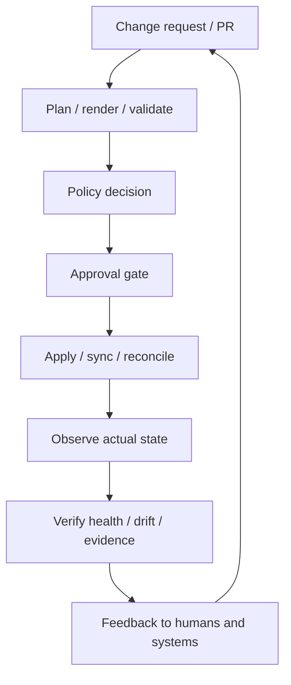
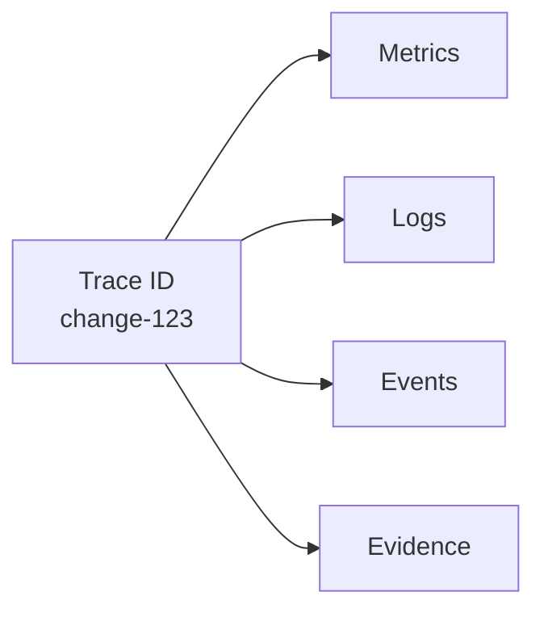
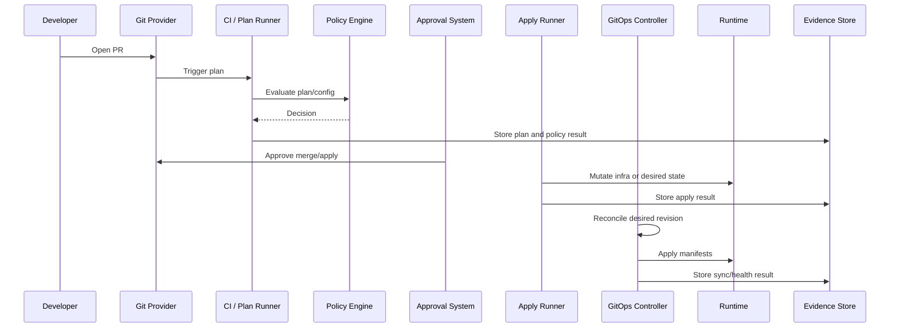
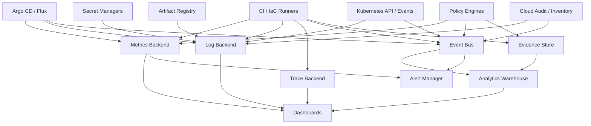

# Part 030 — Observability for GitOps/IaC Pipelines

A GitOps/IaC platform is not healthy because CI is green.

It is healthy when changes move through the control system predictably, safely, audibly, and within risk budgets.

That means observability must answer questions like:

- Which change is stuck?
- Which environment is diverging from desired state?
- Which controller cannot reconcile?
- Which stack is blocked by a state lock?
- Which policy is denying too many changes?
- Which runner is failing credential federation?
- Which approval queue is delaying production?
- Which service has the highest drift recurrence?
- Which deployment was promoted without required evidence?
- Which cluster is no longer pulling desired state?

This part designs observability for GitOps/IaC as a **control-plane observability problem**.

Not as a dashboard decoration problem.

---

## 1. The Skill You Are Building

After this part, you should be able to design observability for a GitOps/IaC platform that covers:

- PR-to-production change lifecycle;
- plan/apply execution;
- remote runners;
- policy decisions;
- GitOps controller reconciliation;
- drift detection;
- secret delivery;
- progressive rollout;
- evidence generation;
- approval queues;
- reliability SLOs;
- audit and compliance reporting.

The goal is not "collect more metrics".

The goal is to make the platform explain itself.

---

## 2. Observability Starts with the Control Loop

A GitOps/IaC platform is a set of control loops.



Observability should follow the loop.

If your metrics only tell you runner CPU or CI job duration, you are watching the machine, not the system.

The important question is:

```text
Can the platform safely move desired state into actual state, and can it prove what happened?
```

---

## 3. The Five Signal Types

For GitOps/IaC, standard logs/metrics/traces are not enough. You also need events and evidence.

| Signal | Purpose | Example |
|---|---|---|
| Metrics | Quantitative health and SLO tracking | reconciliation latency, apply duration, failed sync count |
| Logs | Detailed execution narrative | runner logs, controller logs, policy evaluation logs |
| Traces | Cross-system lifecycle correlation | PR -> plan -> approval -> apply -> sync -> verification |
| Events | State transitions and decisions | plan created, policy denied, app OutOfSync, drift detected |
| Evidence | Durable audit artifacts | plan JSON, rendered manifests, signatures, approvals, attestations |

A high-quality platform correlates all five.



Without correlation, operators must reconstruct causality manually.

That is slow and error-prone.

---

## 4. The Core Entity Model

Before metrics, define entities.

Observability breaks down when everything is just a CI job.

Core entities:

| Entity | Meaning |
|---|---|
| Change | A proposed desired-state modification, usually PR/commit |
| Plan | Computed intended mutation before apply |
| Policy decision | Allow/deny/warn/require-approval result |
| Approval | Human or automated authorization for mutation |
| Run | Execution of plan/apply/render/sync job |
| Stack | IaC unit with state boundary |
| Application | GitOps-managed deployment unit |
| Environment | Bounded execution target |
| Artifact | Image/chart/module/manifest/plan/evidence object |
| Drift finding | Divergence from desired/recorded state |
| Reconciliation | Controller attempt to converge actual state |
| Rollout | Progressive delivery state machine |

Every signal should attach to these entities.

Example labels:

```text
change_id
commit_sha
pull_request
repository
environment
stack_id
application
cluster
region
account
runner_pool
policy_pack
controller
risk_tier
owner_team
```

The labels become your query surface.

---

## 5. Change Lifecycle Observability

A platform should expose the full change path.



For each transition, capture:

- start time;
- end time;
- actor;
- input artifact;
- output artifact;
- decision;
- failure reason;
- correlation ID.

This lets you answer:

```text
Where did the change spend time?
Where did risk checks happen?
What exactly reached production?
```

---

## 6. Metrics That Matter

Do not begin with tool-native metrics. Begin with platform questions.

### 6.1 Change Flow Metrics

| Metric | Meaning |
|---|---|
| `change_lead_time_seconds` | PR open to production verified |
| `plan_latency_seconds` | Time to produce plan after PR update |
| `policy_decision_latency_seconds` | Time spent evaluating policies |
| `approval_wait_seconds` | Time waiting for required approval |
| `apply_queue_age_seconds` | Time apply waits before execution |
| `apply_duration_seconds` | Time apply takes per stack/environment |
| `promotion_latency_seconds` | Time from artifact build to environment promotion |
| `rollback_latency_seconds` | Time from rollback request to verified stable state |

These metrics tell you whether the platform is usable.

A secure platform that takes two days to produce a plan will be bypassed.

### 6.2 Reliability Metrics

| Metric | Meaning |
|---|---|
| `plan_failure_rate` | Percentage of plans failing due to tooling/config/provider errors |
| `apply_failure_rate` | Percentage of applies failing |
| `reconciliation_failure_rate` | Percentage of controller reconciliations failing |
| `sync_failure_count` | Failed GitOps sync attempts |
| `controller_error_rate` | Controller runtime errors |
| `runner_failure_rate` | Runner infrastructure/auth failures |
| `state_lock_contention_count` | Stack lock conflicts |
| `drift_detection_staleness_seconds` | Age since last successful drift check |

These metrics tell you whether the platform works.

### 6.3 Safety Metrics

| Metric | Meaning |
|---|---|
| `policy_denial_count` | Number of blocked changes |
| `policy_warning_count` | Number of risky but allowed changes |
| `exception_count` | Active exceptions |
| `exception_age_seconds` | Age of exceptions |
| `break_glass_usage_count` | Emergency access events |
| `unsigned_artifact_block_count` | Supply chain enforcement blocks |
| `secret_freshness_seconds` | Secret delivery lag |
| `unreviewed_destructive_plan_count` | Destructive plans awaiting approval |

These metrics tell you whether the platform preserves guardrails.

### 6.4 Drift Metrics

| Metric | Meaning |
|---|---|
| `open_drift_findings` | Current unresolved drift findings |
| `critical_drift_count` | High-risk drift findings |
| `drift_classification_latency_seconds` | Time from detection to classification |
| `drift_reconciliation_latency_seconds` | Time from detection to verified closure |
| `auto_heal_success_count` | Successful bounded auto-heals |
| `auto_heal_failure_count` | Failed or reverted auto-heals |
| `ignored_field_count` | Number of ignored diff fields |
| `recurring_drift_source_count` | Repeated drift by same actor/controller/provider |

These metrics tell you whether desired state remains credible.

### 6.5 GitOps Controller Metrics

Argo CD exposes Prometheus metrics from components such as the application controller, API server, and repo server. Flux controllers also expose Prometheus metrics and emit Kubernetes events that can be forwarded through notification-controller.

Useful GitOps metrics include:

- application sync status;
- application health status;
- reconciliation duration;
- reconciliation count;
- failed reconciliation count;
- source fetch failures;
- manifest generation failures;
- cluster cache age;
- API request failures;
- queue depth;
- controller workqueue latency;
- Git request latency;
- Helm reconciliation failures.

Tool-native names vary. The platform-level semantics should not.

---

## 7. Logs: What to Log and What Not to Log

Pipeline logs are often either too verbose or dangerously sensitive.

A good log line for platform execution should include:

- timestamp;
- trace/change ID;
- stack/application;
- environment;
- action;
- actor or workload identity;
- decision;
- duration;
- error category;
- evidence reference.

Example structured log:

```json
{
  "timestamp": "2026-07-03T11:20:14Z",
  "level": "INFO",
  "trace_id": "change-8421",
  "event": "iac_plan_completed",
  "repository": "acme/infra-live",
  "pull_request": 1842,
  "stack": "prod/eu-west-1/payments/network",
  "environment": "prod",
  "runner_pool": "iac-prod-isolated",
  "identity": "arn:aws:iam::123456789012:role/iac-plan-payments-network",
  "changes": {
    "create": 0,
    "update": 2,
    "delete": 0,
    "replace": 0
  },
  "policy_result": "pass_with_warnings",
  "duration_ms": 42031,
  "evidence_uri": "s3://platform-evidence/change-8421/plan.json"
}
```

### 7.1 Do Not Log These

Never log:

- secret values;
- raw decrypted SOPS files;
- provider credentials;
- OIDC tokens;
- cloud temporary credentials;
- private keys;
- full kubeconfigs;
- Terraform/OpenTofu state containing sensitive values;
- plan details that expose secrets;
- database connection strings;
- unmasked environment variables.

Logs are not an evidence store for secrets.

### 7.2 Error Taxonomy

Use normalized error categories.

| Error category | Example |
|---|---|
| `AUTHENTICATION_FAILURE` | OIDC token exchange failed |
| `AUTHORIZATION_FAILURE` | Runner role lacks permission |
| `BACKEND_LOCK_TIMEOUT` | State lock already held |
| `PROVIDER_API_ERROR` | Cloud API throttling or outage |
| `POLICY_DENIED` | Policy blocked plan |
| `PLAN_INCONSISTENT` | Apply plan no longer fresh |
| `RENDER_FAILURE` | Helm/Kustomize/CUE render failed |
| `ADMISSION_DENIED` | Kubernetes admission policy rejected object |
| `SYNC_TIMEOUT` | GitOps controller did not converge |
| `HEALTH_CHECK_FAILED` | Application applied but unhealthy |
| `DRIFT_DETECTED` | Drift check found divergence |
| `EVIDENCE_WRITE_FAILURE` | Artifact store unavailable |

Without normalized errors, dashboards become regex archaeology.

---

## 8. Tracing the Change

Distributed tracing is not only for microservices.

A GitOps/IaC platform has a distributed workflow.

A single change can touch:

- Git provider;
- CI runner;
- policy engine;
- artifact registry;
- evidence store;
- approval system;
- IaC backend;
- cloud provider APIs;
- GitOps controller;
- Kubernetes API;
- rollout controller;
- monitoring system.

Use a correlation ID.

```text
change_id = repository + pull_request + commit_sha + environment + stack/application
```

Example trace spans:

```text
change-8421
├── pr_received
├── affected_units_resolved
├── iac_plan
│   ├── backend_lock_acquire
│   ├── provider_refresh
│   └── plan_compute
├── policy_evaluation
│   ├── opa_network_policy
│   └── cost_policy
├── approval_wait
├── apply_run
│   ├── backend_lock_acquire
│   ├── provider_apply
│   └── post_apply_verify
├── gitops_sync
│   ├── source_fetch
│   ├── manifest_render
│   ├── kubernetes_apply
│   └── health_check
└── evidence_finalize
```

This trace makes bottlenecks obvious.

Without it, teams blame each other.

---

## 9. Events as State Transitions

Events should represent meaningful transitions.

Good events:

```text
PlanStarted
PlanCompleted
PolicyDenied
ApprovalGranted
ApplyStarted
ApplyFailed
ApplySucceeded
SyncStarted
SyncFailed
SyncHealthy
DriftDetected
DriftClassified
DriftReconciled
ExceptionCreated
ExceptionExpired
BreakGlassUsed
EvidenceFinalized
```

Bad events:

```text
Job log line printed
Script step started
Retrying command
Container created
```

Those may be logs. They are not domain events.

### 9.1 Event Envelope

Use a consistent event envelope.

```json
{
  "event_id": "evt-01J1Z...",
  "event_type": "PolicyDenied",
  "occurred_at": "2026-07-03T11:24:10Z",
  "trace_id": "change-8421",
  "entity_type": "iac_plan",
  "entity_id": "plan-8421-prod-payments-network",
  "environment": "prod",
  "owner": "platform-network",
  "severity": "high",
  "payload": {
    "policy_pack": "cloud-network-v7",
    "policy": "no-public-db-ingress",
    "decision": "deny"
  },
  "evidence_uri": "s3://platform-evidence/change-8421/policy.json"
}
```

Events are the backbone of operational analytics.

---

## 10. Evidence Is Not Logging

Evidence is durable, queryable proof.

Logs are often ephemeral execution detail.

A production GitOps/IaC platform should preserve evidence for important transitions:

- rendered manifests;
- plan output and normalized summary;
- policy inputs and decisions;
- approval record;
- apply result;
- Git commit and PR metadata;
- artifact digest/signature/attestation;
- GitOps sync result;
- health verification;
- drift finding and resolution;
- exception grant/expiry;
- break-glass usage.

Evidence has stronger requirements than logs:

| Property | Requirement |
|---|---|
| Integrity | Cannot be silently modified |
| Retention | Meets audit/compliance period |
| Access control | Least-privilege, sensitive data protected |
| Queryability | Search by change, service, environment, owner |
| Linkability | Connects PR, commit, plan, approval, apply, runtime |
| Redaction | Secrets and sensitive values masked |

A strong platform can reconstruct any production change from evidence alone.

---

## 11. SLOs for GitOps/IaC

Observability without SLOs becomes dashboard theater.

### 11.1 Platform Usability SLOs

```text
99% of PR plan results for standard stacks are posted within 10 minutes.
95% of production apply runs start within 15 minutes after approval.
99% of GitOps application syncs begin within 5 minutes of desired-state commit availability.
```

These SLOs protect developer experience.

### 11.2 Platform Reliability SLOs

```text
99.5% of scheduled drift checks complete successfully within their risk-tier interval.
99% of GitOps controller reconciliations complete without controller-side error.
99% of apply runs either succeed or fail with classified error category.
```

These SLOs protect the platform itself.

### 11.3 Platform Safety SLOs

```text
100% of production destructive plans require explicit owner approval.
100% of production applies store plan, policy, approval, and result evidence.
0 production image promotions without verified immutable digest.
0 critical IAM drift findings remain unclassified beyond 30 minutes.
```

These SLOs protect trust.

### 11.4 Reconciliation SLOs

```text
99% of production applications reach Synced+Healthy within 10 minutes after promotion.
95% of non-critical drift findings are reconciled or accepted within 7 days.
100% of critical network exposure drift is routed to security on-call immediately.
```

These SLOs protect desired-state credibility.

---

## 12. Alert Design

Most platform alerts are too low-level.

Alert on user-impacting or control-loop-impacting symptoms.

### 12.1 Good Alerts

| Alert | Why it matters |
|---|---|
| Production apply queue age above SLO | Changes cannot reach production |
| Critical drift unclassified | Desired state no longer trusted |
| GitOps controller unable to fetch source | Reconciliation broken |
| App OutOfSync beyond budget | Runtime no longer matches desired state |
| App Synced but Degraded | Desired state applied but service unhealthy |
| State lock held too long | Applies blocked, possible failed run |
| Evidence write failed for production apply | Audit chain broken |
| OIDC federation failing for runner pool | Execution identity broken |
| Secret freshness exceeds threshold | Workloads may use stale credentials |
| Policy engine unavailable | Guardrails degraded |

### 12.2 Bad Alerts

| Alert | Problem |
|---|---|
| Every failed CI step pages platform team | Too noisy |
| Every OutOfSync immediately pages | Ignores reconciliation budget |
| Every warning policy pages security | Creates fatigue |
| CPU high on runner once | Not platform-level symptom |
| Any diff detected | Drift must be classified |

Alerts should map to a human decision.

If no one knows what to do when the alert fires, the alert is not ready.

---

## 13. Dashboard Design

Design dashboards for roles.

### 13.1 Platform Operator Dashboard

Purpose: determine whether the platform is functioning.

Panels:

- plan latency by repo/risk tier;
- apply queue age;
- apply failure rate by error category;
- runner pool saturation;
- state lock contention;
- policy engine latency/error rate;
- evidence write success rate;
- drift check staleness;
- GitOps controller reconciliation failures;
- source fetch errors.

### 13.2 Service Owner Dashboard

Purpose: determine whether my service changes are safe and progressing.

Panels:

- current PR plans;
- policy denials/warnings;
- pending approvals;
- last promotion status;
- app sync and health;
- rollout status;
- service drift findings;
- exceptions expiring;
- recent failed changes.

### 13.3 Security/Compliance Dashboard

Purpose: determine whether controls are effective.

Panels:

- critical policy denials;
- exceptions by age and owner;
- break-glass usage;
- unsigned artifact attempts;
- public exposure drift;
- IAM drift;
- evidence completeness;
- production changes without required metadata;
- failed admission policy evaluations.

### 13.4 Executive/Maturity Dashboard

Purpose: track platform health at portfolio level.

Panels:

- deployment frequency;
- change lead time;
- apply success rate;
- mean time to reconcile drift;
- policy violation trend;
- exception debt;
- platform SLO compliance;
- top recurring failure domains.

Dashboards should reduce decision latency.

---

## 14. Argo CD Observability Model

Argo CD exposes Prometheus metrics for its components, including application controller metrics. Operationally, important dimensions include application, project, cluster, namespace, sync status, health status, and reconciliation performance.

Key things to observe:

### 14.1 Application State

- sync status;
- health status;
- target revision;
- observed revision;
- last sync time;
- last successful sync;
- operation phase;
- comparison result;
- resource-level health;
- resource-level sync status.

### 14.2 Controller Health

- reconciliation duration;
- queue depth;
- cluster cache age;
- Kubernetes API errors;
- Git request latency;
- manifest generation failures;
- repo-server failures;
- Redis/HA component health, if used.

### 14.3 Alert Examples

```yaml
- alert: ArgoApplicationOutOfSyncTooLong
  expr: argocd_app_info{sync_status="OutOfSync", environment="prod"} == 1
  for: 15m
  labels:
    severity: warning
  annotations:
    summary: "Production application has been OutOfSync beyond budget"

- alert: ArgoApplicationDegraded
  expr: argocd_app_info{health_status="Degraded", environment="prod"} == 1
  for: 5m
  labels:
    severity: critical
  annotations:
    summary: "Production application is degraded"
```

Metric names and label availability depend on Argo CD version/configuration. Treat this as shape, not blind copy-paste.

### 14.4 Argo CD Failure Questions

When an app is not healthy, ask:

1. Did Argo fetch the desired source?
2. Did manifest generation succeed?
3. Did diff comparison succeed?
4. Did Kubernetes apply succeed?
5. Did admission allow the object?
6. Did the workload become healthy?
7. Is the problem sync, health, or both?
8. Is the live cluster reachable?
9. Is the desired revision correct?
10. Is auto-sync enabled or suspended?

This question sequence is more useful than staring at one status label.

---

## 15. Flux Observability Model

Flux exposes metrics for controllers and emits Kubernetes events. The notification-controller can forward events to providers such as Slack, Microsoft Teams, Discord, and others.

Important Flux entities:

- `GitRepository`;
- `OCIRepository`;
- `Bucket`;
- `HelmRepository`;
- `Kustomization`;
- `HelmRelease`;
- `ImageRepository`;
- `ImagePolicy`;
- `ImageUpdateAutomation`;
- `Alert`;
- `Provider`.

### 15.1 Source Observability

Observe:

- source fetch success/failure;
- artifact revision;
- artifact age;
- authentication failures;
- signature/verification failures, if used;
- interval and timeout;
- last handled revision.

A failed `Kustomization` may be a source problem, not an apply problem.

### 15.2 Reconciliation Observability

Observe:

- ready condition;
- last applied revision;
- reconciliation duration;
- dependency readiness;
- inventory changes;
- prune events;
- health check failures;
- suspended resources;
- retries/backoff.

### 15.3 Alert Examples

Conceptual examples:

```yaml
- alert: FluxKustomizationNotReady
  expr: gotk_resource_info{customresource_kind="Kustomization",ready="False",environment="prod"} == 1
  for: 10m
  labels:
    severity: warning

- alert: FluxSourceFetchFailure
  expr: gotk_resource_info{customresource_kind="GitRepository",ready="False",environment="prod"} == 1
  for: 5m
  labels:
    severity: critical
```

Again, metric labels depend on version and setup. Use the pattern, verify actual metrics in your cluster.

---

## 16. IaC Runner Observability

IaC runners are privileged mutation agents.

You need deep visibility.

### 16.1 Runner Metrics

- job queue age;
- job duration;
- runner pool capacity;
- runner startup latency;
- OIDC token exchange success/failure;
- cloud API error rate;
- backend lock acquisition time;
- provider download time;
- module download time;
- plan/apply memory usage;
- artifact upload success;
- egress failures;
- secret access attempts.

### 16.2 Runner Security Signals

- unexpected outbound destination;
- privileged container usage;
- filesystem write outside workspace;
- credential file creation;
- long-lived token detection;
- access to unauthorized state backend;
- environment variable secret leakage;
- suspicious command execution.

Runner observability overlaps with security monitoring.

That is correct.

The runner can mutate production.

---

## 17. State Backend Observability

The state backend is the database of your IaC control plane.

Observe:

- lock acquisition latency;
- lock duration;
- lock owner;
- failed lock attempts;
- state object version changes;
- state size;
- state access actor;
- state backup success;
- encryption status;
- unusual read/write pattern;
- failed writes;
- restore events.

A stuck lock is not just an inconvenience. It may indicate a failed or abandoned mutation.

### 17.1 State Lock Alert

```yaml
- alert: IaCStateLockHeldTooLong
  expr: iac_state_lock_age_seconds{environment="prod"} > 1800
  for: 5m
  labels:
    severity: warning
  annotations:
    summary: "IaC state lock held longer than expected"
```

You may need to build custom metrics for this, depending on backend/tooling.

---

## 18. Policy Observability

Policy observability should answer:

- Which policies block the most changes?
- Which policies are noisy?
- Which teams repeatedly violate the same policies?
- Which exceptions are open too long?
- Which policies are slow?
- Which policies fail closed vs fail open?
- Which changes were allowed with warnings?
- Which denied changes were later approved as exceptions?

### 18.1 Policy Decision Event

```json
{
  "event_type": "PolicyDecision",
  "trace_id": "change-8421",
  "policy_pack": "iac-security-v12",
  "policy": "deny-public-s3-bucket",
  "decision": "deny",
  "severity": "critical",
  "resource": "aws_s3_bucket.assets",
  "environment": "prod",
  "owner": "media-platform",
  "duration_ms": 43,
  "exception_allowed": true,
  "evidence_uri": "s3://platform-evidence/change-8421/policy/deny-public-s3-bucket.json"
}
```

### 18.2 Policy Metrics

```text
policy_decision_total{decision="deny",policy="deny-public-s3-bucket"}
policy_decision_duration_seconds{policy_pack="iac-security-v12"}
policy_exception_active{policy="deny-public-s3-bucket"}
policy_exception_age_seconds{owner="media-platform"}
policy_evaluation_error_total{engine="opa"}
```

Policy engines are part of the critical path. Observe them like production services.

---

## 19. Secret Delivery Observability

Secrets must be observed without exposing values.

Observe:

- external secret sync condition;
- last refresh time;
- backend access errors;
- secret version metadata;
- certificate expiration;
- decryption failures;
- workload restart after rotation;
- stale mounted secret detection;
- secret consumer readiness.

Example metrics:

```text
secret_sync_ready{namespace="payments",secret="db-credentials"}
secret_last_refresh_age_seconds{namespace="payments",secret="db-credentials"}
certificate_not_after_timestamp{namespace="edge",secret="tls-cert"}
secret_backend_error_total{backend="vault"}
```

Never create dashboards that display secret values.

---

## 20. Progressive Delivery Observability

For canary/blue-green rollout, observe the rollout state machine.

Metrics:

- rollout phase;
- current step;
- traffic weight;
- analysis run result;
- metric query success/failure;
- abort count;
- rollback count;
- promotion count;
- time in phase;
- no-data analysis count;
- manual pause age;
- canary error rate;
- baseline/canary latency comparison.

Events:

```text
RolloutStarted
CanaryStepAdvanced
AnalysisStarted
AnalysisInconclusive
AnalysisFailed
RolloutPaused
RolloutAborted
RollbackStarted
RolloutPromoted
```

The critical principle:

> A rollout that is paused forever is not healthy just because it did not fail.

Alert on stale rollout phases.

---

## 21. Evidence Completeness Observability

For production changes, define required evidence.

Example required evidence set:

```yaml
requiredEvidence:
  productionApply:
    - pr_metadata
    - commit_sha
    - plan_summary
    - plan_json_redacted
    - policy_decisions
    - approvals
    - runner_identity
    - apply_log_summary
    - post_apply_verification
    - drift_check_after_apply
```

Then measure completeness:

```text
evidence_completeness_ratio{environment="prod",change_id="change-8421"}
evidence_missing_total{artifact="policy_decisions"}
evidence_write_failure_total{store="s3"}
```

If evidence cannot be stored, the change pipeline should decide whether to fail closed or proceed with explicit degraded-control mode.

For regulated systems, failing open silently is usually unacceptable.

---

## 22. Correlating with Audit Logs

GitOps/IaC observability should correlate with external audit sources:

- Git provider audit logs;
- cloud audit logs;
- Kubernetes audit logs;
- identity provider logs;
- secret manager access logs;
- artifact registry logs;
- CI runner logs;
- approval system logs.

Example correlation:

```text
PR merged by bob
-> apply run used role iac-prod-payments
-> CloudTrail shows AssumeRoleWithWebIdentity by GitHub OIDC subject repo:acme/infra-live:pull_request
-> EC2 security group updated
-> evidence store contains plan and approval
```

That is a healthy audit chain.

Unhealthy chain:

```text
Security group changed
-> no PR
-> actor unknown
-> no evidence
-> drift detector eventually found it
```

That is not just drift. That may be an incident.

---

## 23. Observability Data Architecture

A reference data flow:



Keep hot operational telemetry and durable audit evidence separate but linkable.

---

## 24. Data Retention Strategy

Not all observability data needs the same retention.

| Data | Suggested retention logic |
|---|---|
| High-cardinality metrics | Shorter, aggregated over time |
| Raw runner logs | Short/medium, longer for prod failures |
| Security audit logs | Long, compliance-driven |
| Evidence artifacts | Long, compliance/change-control-driven |
| Traces | Medium, sampled except critical changes |
| Events | Long enough for analytics and audit correlation |
| Drift findings | Long enough to analyze recurrence |
| Policy decisions | Long enough to prove control effectiveness |

Do not keep sensitive raw data forever because it is easier.

Retention is a risk decision.

---

## 25. Cardinality Management

Observability systems fail when labels explode.

Dangerous labels:

- full commit SHA as high-cardinality metric label;
- resource address for every IaC resource;
- raw PR title;
- user email on every metric;
- full Kubernetes object name for ephemeral jobs;
- full error message;
- generated IDs.

Use high-cardinality data in logs/events/evidence, not always in metrics.

Metric label guidance:

| Label | Usually safe? | Notes |
|---|---:|---|
| environment | Yes | small set |
| owner_team | Yes | bounded |
| risk_tier | Yes | small set |
| controller | Yes | bounded |
| stack_id | Maybe | can be large but useful |
| application | Maybe | depends on scale |
| commit_sha | No for metrics | use exemplars/logs/traces |
| resource_address | No for metrics | use events/evidence |
| user_email | Usually no | privacy/cardinality |
| error_message | No | use normalized error category |

Bad metrics cost money and make queries unusable.

---

## 26. Runbook-First Observability

Every alert should link to a runbook.

Runbook template:

```md
# Alert: Production GitOps Reconciliation Stalled

## Meaning
The GitOps controller has not successfully reconciled production applications within the SLO window.

## Impact
Desired state may not be reaching production. Drift may persist. Promotions may appear merged but not applied.

## First Checks
1. Check source fetch errors.
2. Check repo-server/manifest generation errors.
3. Check Kubernetes API connectivity.
4. Check controller queue depth.
5. Check recent CRD/admission policy changes.
6. Check cluster credentials.

## Mitigation
- Pause new promotions if many apps affected.
- Roll back recent platform controller changes if correlated.
- Escalate to platform on-call and affected service owners.

## Evidence
Attach controller logs, metrics snapshot, affected app list, last successful reconciliation time.
```

A dashboard without runbooks is documentation debt.

---

## 27. Failure Mode Observability

### 27.1 Plan Failure

Observe:

- affected stack;
- provider init failure;
- backend access failure;
- module download failure;
- syntax/validation error;
- policy input generation failure;
- secrets unavailable;
- changed files mapping error.

Classify:

```text
user_config_error | platform_tooling_error | provider_error | auth_error | backend_error
```

### 27.2 Apply Failure

Observe:

- resource where failure occurred;
- partial apply state;
- state lock status;
- provider API response category;
- retryability;
- post-failure drift status;
- rollback/rollforward recommendation.

### 27.3 GitOps Sync Failure

Observe:

- source fetch;
- render;
- admission;
- apply;
- health;
- pruning;
- dependency readiness.

### 27.4 Drift Detection Failure

Observe:

- last successful drift check;
- failure reason;
- stack risk tier;
- stale duration;
- credential status;
- provider API availability.

### 27.5 Evidence Failure

Observe:

- artifact missing;
- write failed;
- hash mismatch;
- retention policy misconfigured;
- unauthorized access attempt.

Evidence failure should not be hidden in CI logs.

---

## 28. Maturity Model

### Level 1 — Job-Centric

- CI job logs only;
- no structured events;
- no evidence store;
- GitOps status checked manually;
- drift discovered accidentally.

### Level 2 — Tool-Centric

- Argo/Flux dashboards exist;
- CI metrics exist;
- some alerting;
- plan/apply logs kept;
- limited correlation.

### Level 3 — Platform-Centric

- change lifecycle traced;
- structured events emitted;
- evidence stored;
- policy decisions observable;
- drift findings tracked;
- owner/risk labels consistent.

### Level 4 — Control-Loop-Centric

- SLOs for plan/apply/reconciliation/drift;
- alerting tied to runbooks;
- evidence completeness measured;
- drift budgets enforced;
- promotion health visible;
- security signals correlated.

### Level 5 — Audit-Ready and Self-Improving

- production change audit reconstructed automatically;
- recurring failure analytics drive platform roadmap;
- exceptions expire automatically;
- risk-tiered controls adjust by environment;
- compliance reports generated from evidence;
- platform reliability is reviewed like a product.

Aim for Level 4 before claiming maturity.

---

## 29. Anti-Patterns

### 29.1 CI Green Equals Production Healthy

CI green only means the job passed. It does not mean runtime converged or app is healthy.

### 29.2 Dashboard Without Ownership

Metrics without owners do not produce action.

### 29.3 Logs as Evidence

Logs are not sufficient evidence for governed production changes.

### 29.4 No Correlation ID

Without correlation, every incident becomes manual archaeology.

### 29.5 Alerting on Raw Drift

Alert on classified drift and budget violation, not every diff.

### 29.6 Ignoring Approval Latency

Approval queues are part of platform performance.

### 29.7 No Stale Signal

If drift detection or reconciliation stops reporting, that is not healthy.

### 29.8 High-Cardinality Metrics Everywhere

This makes observability expensive and unreliable.

### 29.9 Secret Values in Logs

This turns observability into a breach vector.

### 29.10 Tool Dashboards Only

Argo dashboard, CI dashboard, and cloud dashboard are fragments. The platform needs end-to-end observability.

---

## 30. Production Checklist

### Entity Model

- [ ] Change, plan, policy decision, approval, apply, sync, drift, rollout, and evidence entities are modeled.
- [ ] Every signal has environment, owner, risk tier, and correlation ID where appropriate.
- [ ] Stack/application identifiers are stable.

### Metrics

- [ ] Plan latency is measured.
- [ ] Apply duration and failure rate are measured.
- [ ] Approval latency is measured.
- [ ] Reconciliation latency is measured.
- [ ] Drift detection staleness is measured.
- [ ] Policy denial and exception rates are measured.
- [ ] Evidence completeness is measured.

### Logs

- [ ] Logs are structured.
- [ ] Secrets are masked.
- [ ] Error categories are normalized.
- [ ] Runner identity is logged safely.
- [ ] Evidence URI is linked.

### Traces and Events

- [ ] PR-to-production lifecycle can be reconstructed.
- [ ] Domain events represent state transitions.
- [ ] Events are queryable by owner/environment/service.
- [ ] Critical events are routed to alerts or audit pipeline.

### Evidence

- [ ] Production applies store required evidence.
- [ ] Policy input/output is stored safely.
- [ ] Rendered manifests or plan summaries are retained.
- [ ] Approval records are linked.
- [ ] Evidence retention matches compliance needs.

### Alerts

- [ ] Alerts map to runbooks.
- [ ] Alerts are based on SLO/budget violations.
- [ ] Stale/no-data conditions alert.
- [ ] Critical drift routes to correct owners.
- [ ] Evidence write failure is visible.

### Dashboards

- [ ] Platform operator dashboard exists.
- [ ] Service owner dashboard exists.
- [ ] Security/compliance dashboard exists.
- [ ] Executive/maturity dashboard exists.
- [ ] Dashboards answer decisions, not just show graphs.

---

## 31. Practical Exercise

Design observability for this platform:

```text
Git provider: GitHub Enterprise
IaC: OpenTofu + Terragrunt
Execution: self-hosted ephemeral runners
GitOps: Argo CD for application delivery, Flux for platform bootstrap
Policy: OPA + Kyverno
Secrets: SOPS + External Secrets Operator
Cloud: AWS multi-account
Compliance: SOC2 + internal change approval
```

Produce:

1. entity model;
2. required labels;
3. event types;
4. metrics list;
5. log schema;
6. trace span design;
7. evidence schema;
8. alert rules;
9. four dashboards;
10. runbook for `production reconciliation stalled`;
11. runbook for `evidence write failed`;
12. SLOs for plan, apply, reconciliation, drift, evidence.

Do not start with Grafana panels.

Start with the questions the platform must answer.

---

## 32. Mental Model Summary

Observability for GitOps/IaC is not about watching tools.

It is about watching state transitions.

The mature model:

```text
A production change is an auditable journey from proposed desired state to verified actual state.
```

Your observability must show:

- where the journey is;
- who authorized it;
- what risk gates evaluated it;
- what changed;
- whether runtime converged;
- whether health is acceptable;
- whether evidence is complete;
- whether the system remains within drift and reconciliation budgets.

That is the difference between a CI/CD dashboard and an engineering control plane.

---

## 33. References

- Argo CD documentation — Prometheus metrics for application controller, API server, repo server, sync status, health status, and reconciliation operations.
- Flux documentation — Prometheus metrics, controller events, notification-controller alerts, Kustomization and HelmRelease reconciliation conditions.
- OpenGitOps Principles — continuous reconciliation and automatic pull of desired state.
- OpenTofu/Terraform CLI and state documentation — plan/apply execution, state backend behavior, and state locking implications.
- Kubernetes documentation — events, controller reconciliation model, object status, admission, and audit logging.
- OpenTelemetry concepts — traces, metrics, logs, context propagation, and distributed workflow correlation.
