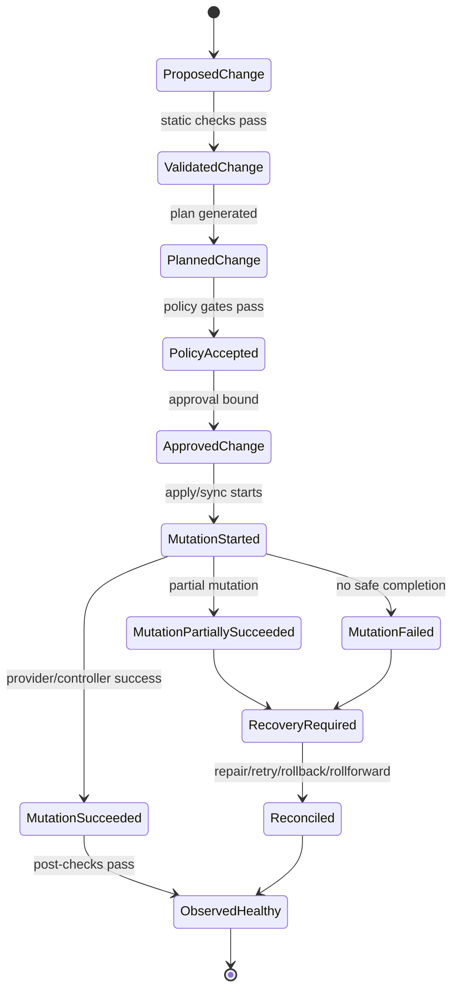
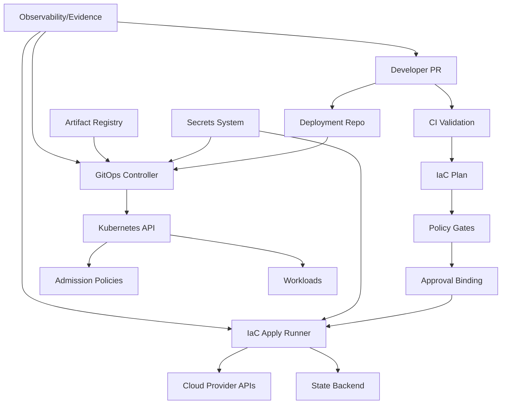
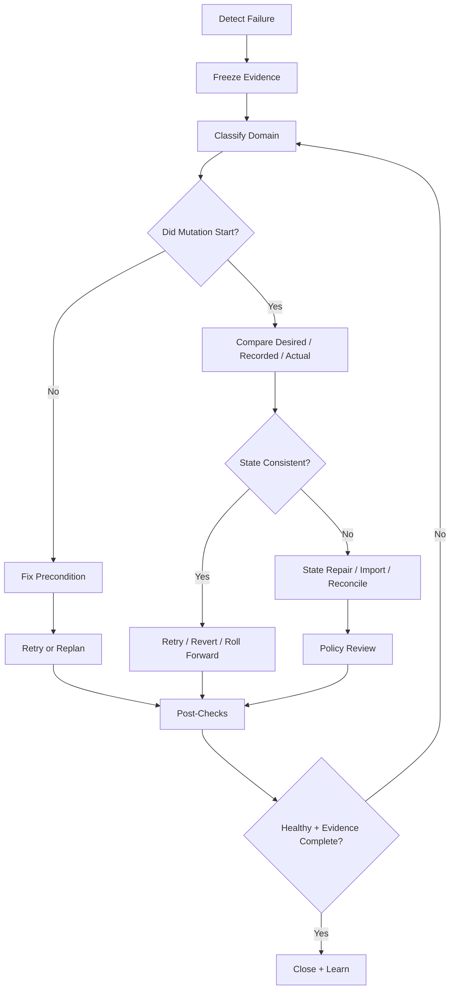
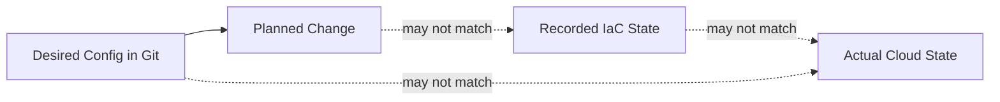
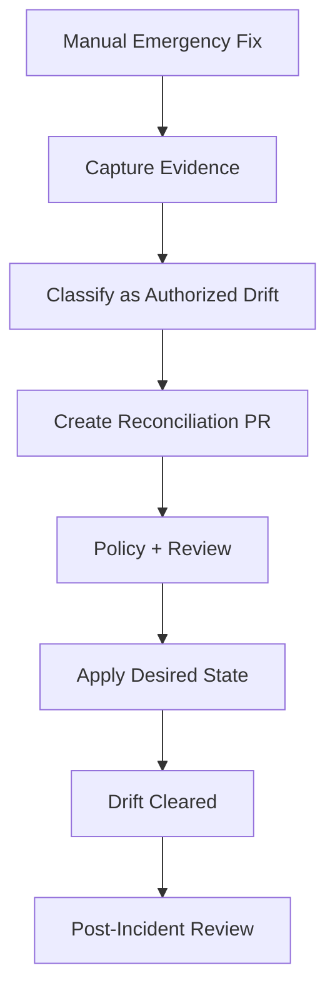

# Part 031 — Failure Modeling and Recovery Playbooks

Production-grade GitOps/IaC is not proven when everything works. It is proven when a change fails halfway, the state backend is locked, the GitOps controller refuses to sync, a cloud API throttles the runner, a policy rule blocks production, a secret is rotated incorrectly, or a human applies an emergency mutation outside Git — and the team can still recover without guessing.

This part is about that discipline.

A state-of-the-art GitOps/IaC pipeline must be designed as a **recoverable state-transition system**. Every change has a source, actor, authorization decision, plan, approval, mutation attempt, observed result, and evidence trail. Failure modeling is the practice of enumerating where that state transition can break and defining safe recovery before the failure happens.

The mindset shift is simple:

> A mature platform does not merely automate success paths. It constrains and explains failure paths.

We are not going to list generic “CI failed, retry it” advice. We will model GitOps/IaC failures the way a senior platform engineer, SRE, or regulated-systems engineer should: boundary by boundary, state by state, invariant by invariant.

---

## 1. The Skill You Are Actually Building

The visible skill is “knowing how to fix pipeline failures.”

The real skill is deeper:

You are learning to preserve **control-plane integrity** while recovering from incomplete, ambiguous, or unsafe infrastructure transitions.

That means you must be able to answer:

1. What state was intended?
2. What state was approved?
3. What state was actually attempted?
4. What state exists now?
5. Which actor or controller owns the next transition?
6. Is it safer to retry, revert, roll forward, pause reconciliation, import state, repair config, unlock state, or escalate?
7. What evidence proves the recovery was correct?

A junior engineer usually asks:

> “How do I make the pipeline green?”

A top-tier engineer asks:

> “Which invariant failed, and what is the smallest safe state transition that restores the system without hiding evidence?”

---

## 2. The Core Failure Model

Any GitOps/IaC pipeline can be modeled as a chain of state transitions.



Every failure is a transition to one of these states:

| Failure State | Meaning | Typical Example |
|---|---|---|
| `RejectedBeforePlan` | Change cannot be converted into an execution plan | invalid syntax, missing module, provider init failure |
| `PlanGeneratedButUnsafe` | Tool can produce a plan, but policy/risk rejects it | public bucket, excessive IAM, destructive replacement |
| `ApprovedButStale` | Approval no longer matches the actual plan/input | base branch changed, state changed, artifact expired |
| `MutationNotStarted` | Apply/sync never reached provider/controller mutation | runner failure, credential failure, state lock unavailable |
| `MutationPartiallySucceeded` | Some resources changed before failure | cloud API timeout after creating resource |
| `RecordedStateDiverged` | IaC state no longer correctly represents real resources | failed import, manual change, corrupted state |
| `LiveStateDiverged` | Kubernetes/cloud live state differs from desired state | manual edit, controller mutation, drift |
| `ReconciliationBlocked` | GitOps controller wants to act but cannot | admission denial, missing CRD, bad secret, RBAC |
| `ReconciliationUnsafe` | Controller can act but should be paused | bad desired state, runaway prune, broken policy |
| `EvidenceIncomplete` | The system changed but evidence is missing | manual hotfix, log retention gap, artifact deletion |

The recovery action depends on which state you are in. Treating all failures as “retry” is dangerous because retries can amplify partial failure.

---

## 3. Failure Domains in a GitOps/IaC Platform

A modern pipeline has many control surfaces. You need to know which domain failed before you choose a recovery.



The major failure domains are:

| Domain | What Can Fail | Primary Recovery Owner |
|---|---|---|
| Source control | branch protection, merge queue, CODEOWNERS, wrong commit | repo owner / platform |
| CI validation | lint/test/render/scanner failure | author / platform |
| Plan engine | init, provider, module, state read, graph construction | infra owner / platform |
| Policy engine | rule regression, false positive, unavailable policy service | platform security / policy owner |
| Approval system | stale approval, wrong approver, missing evidence | change manager / platform |
| Runner | capacity, network, credentials, filesystem, image | platform runtime owner |
| State backend | lock, corruption, versioning, access, consistency | infra platform owner |
| Cloud APIs | throttling, quota, eventual consistency, provider bug | cloud platform owner |
| GitOps controller | diff, sync, RBAC, health check, prune, CRD issue | cluster platform owner |
| Kubernetes API | admission, RBAC, CRD, webhook, API server availability | cluster platform owner |
| Secrets | decryption, sync, rotation, missing permissions | security/platform owner |
| Artifact registry | unavailable image/chart, tag drift, digest mismatch | delivery/platform owner |
| Observability | missing logs, missing metrics, broken evidence | platform/SRE |
| Human process | emergency bypass, wrong command, unapproved mutation | incident commander / governance |

Recovery starts by narrowing the domain.

A strong question is:

> “Which control surface is currently authoritative for the next safe transition?”

If the failure is in the IaC runner, the next owner may be the pipeline. If the failure is in GitOps desired state, the next owner may be Git. If the failure is a manual emergency change, the next owner may be a reconciliation PR.

---

## 4. Recovery Doctrine: The Non-Negotiable Rules

Before playbooks, define doctrine. Doctrine prevents panic.

### Rule 1 — Preserve Evidence Before Changing State

Before retrying, reverting, unlocking, importing, deleting, or manually fixing, capture:

- commit SHA
- PR number
- run ID
- plan artifact ID
- policy result
- approver identity
- runner identity
- state backend version
- lock ID
- impacted workspace/unit
- provider error
- controller event
- cluster namespace/resource
- current live state snapshot where relevant

If evidence disappears, incident analysis becomes storytelling.

### Rule 2 — Classify the Failure Before Acting

Do not run `apply` again until you know whether the previous run mutated anything.

There are two very different situations:

| Situation | Safe First Question |
|---|---|
| Apply failed before mutation | Can we fix the precondition and retry the same approved change? |
| Apply failed after partial mutation | What changed, what did state record, and what is the smallest repair? |

### Rule 3 — Do Not Hide Drift by Refreshing State Blindly

A refresh can update recorded state to match reality. That may be correct after a legitimate manual change, but it can also hide unauthorized drift.

Use refresh/import/state repair only after you answer:

- why does actual state differ?
- who authorized it?
- does Git need to change?
- does policy need to approve the new state?
- should this be recorded as exception, incident, or normal reconciliation?

### Rule 4 — Prefer Declarative Recovery

A recovery should ideally be expressed as a new desired-state transition:

- Git revert
- forward fix commit
- configuration patch
- module version pin
- policy exception PR
- environment promotion rollback
- controlled state import PR

Manual console fixes are sometimes necessary, but they should be treated as emergency mutations that require reconciliation evidence afterward.

### Rule 5 — Pause the Right Controller, Not Everything

When state is unsafe, pause the smallest responsible control loop:

| Problem | Pause Candidate |
|---|---|
| Bad Kubernetes desired state constantly re-applies | specific Argo CD Application / Flux Kustomization |
| Bad Helm release reconciliation | specific Flux HelmRelease or Argo Application |
| Bad IaC unit changing infra | specific stack/workspace/project apply |
| Secret sync producing bad secret | specific ExternalSecret / secret store binding |
| Policy controller blocking everything | specific policy/webhook only if break-glass process allows |

Do not disable an entire platform when one bounded unit is bad.

### Rule 6 — A Green Pipeline Is Not Proof of Recovery

Recovery is proven by post-conditions:

- desired state matches approved Git revision
- actual infrastructure matches desired state
- recorded state matches actual state
- workloads are healthy
- policy violations are resolved or explicitly accepted
- drift budget is back within threshold
- audit/evidence trail is complete

---

## 5. Failure Severity Model

You need a common language for severity.

| Severity | Definition | Example | Default Action |
|---|---|---|---|
| SEV-4 | Localized non-prod failure, no user impact | dev plan fails | normal queue |
| SEV-3 | Production change blocked, no active impact | prod apply denied by policy | expedite owner review |
| SEV-2 | Production degraded or platform control loop impaired | Argo cannot sync critical app | incident process |
| SEV-1 | Broad outage, security exposure, destructive infra risk | network ACL locks prod, public data exposure | incident commander + break-glass |

Severity should be based on **risk and impact**, not emotional intensity.

A failed plan for a production IAM change may be SEV-3 even if nothing is down. A successful apply that silently opens public access may be SEV-1.

---

## 6. The Universal Triage Loop

Use this loop for every failure.



The key is the `Did Mutation Start?` branch. That one question prevents many dangerous retries.

---

## 7. Playbook 1 — PR Validation Fails

### Symptoms

- linting fails
- format check fails
- static analysis fails
- config rendering fails
- schema validation fails
- plan job never starts

### Likely Causes

- invalid HCL/YAML/JSON
- wrong module input
- invalid Helm values
- Kustomize overlay references missing file
- generated config not committed
- policy schema mismatch
- tool version mismatch

### First Response

Do not bypass validation because “it is just a small fix.” Validation is a boundary that prevents unplannable desired state from entering the system.

### Diagnosis Checklist

- Is the failure deterministic locally?
- Did a tool version change?
- Did the base branch change?
- Is the error from parsing, rendering, schema validation, or policy input construction?
- Is this a repository issue or platform runner issue?

### Safe Recovery

1. Fix the source-level issue.
2. Re-run validation.
3. Confirm generated/rendered artifacts are deterministic.
4. If the failure is due to platform tooling, open a platform incident/change.
5. Do not manually skip CI unless the exception is documented and approved.

### Anti-Pattern

Adding `ignore_errors`, disabling lint, or weakening validation globally because one PR is blocked.

---

## 8. Playbook 2 — IaC Init Fails

### Symptoms

- backend init fails
- provider plugin download fails
- module source cannot be resolved
- version constraint conflict
- registry timeout
- authentication failure to backend

### Likely Causes

- backend credentials missing
- remote backend unavailable
- provider registry unavailable
- provider checksum mismatch
- module version removed
- network egress blocked
- runner image missing required tools

### Key Question

Did the failure happen before any plan or mutation?

Usually yes. That means recovery is usually precondition repair, not rollback.

### Safe Recovery

1. Capture run logs and dependency versions.
2. Confirm backend access from runner identity.
3. Confirm provider/module source integrity.
4. Check whether lock files changed.
5. Re-run init only after dependency source is trusted.
6. If provider/module supply chain is suspect, stop and escalate.

### Design Improvement

For production platforms:

- pin provider versions
- commit lock files where appropriate
- mirror providers/modules internally for critical workloads
- record runner image digest
- keep dependency download logs as evidence

---

## 9. Playbook 3 — Plan Fails Due to State Lock

### Symptoms

- plan cannot acquire lock
- apply cannot acquire lock
- lock holder looks stale
- remote backend reports concurrent operation

### Mental Model

The lock protects the state database. A stuck lock is annoying. A corrupted state file is worse.

### First Response

Do not force-unlock until you know whether another operation is still alive.

### Diagnosis Checklist

- Which workspace/unit/state file is locked?
- Who acquired the lock?
- Which run ID owns it?
- Is that run still executing?
- Did the runner crash after acquiring it?
- Did a previous apply partially mutate resources?
- Does backend versioning show a recent write?

### Safe Recovery

1. Locate owning run.
2. Stop or confirm completion of owning run.
3. Capture lock metadata.
4. Inspect state version timestamp.
5. If no active operation exists, perform documented force unlock.
6. Immediately run a refresh-only or plan diagnosis depending on platform policy.
7. Record the unlock as evidence.

### Anti-Pattern

Force-unlocking because a developer is impatient.

### Control Improvement

Your platform should expose a “lock owner dashboard” showing:

- state unit
- lock ID
- owner run
- actor
- started time
- last heartbeat if available
- current pipeline status

---

## 10. Playbook 4 — Saved Plan Is Stale

### Symptoms

- apply refuses saved plan
- plan artifact expired
- base branch changed after approval
- state changed since plan
- provider reads differ
- policy was evaluated against an old plan

### Mental Model

A saved plan is not just a suggestion. It is a binding between:

- source revision
- variables
- provider versions
- state snapshot
- planned actions
- policy decision
- approval

If any of those change, the approval may no longer authorize the mutation.

### Safe Recovery

1. Mark previous plan as invalid.
2. Generate a fresh plan from the current base and current state.
3. Re-run policy.
4. Require fresh approval if risk changed.
5. Apply only the newly approved plan.

### Anti-Pattern

Reusing approval from a stale plan because “the diff looks similar.”

---

## 11. Playbook 5 — Policy Gate Fails

### Symptoms

- OPA/Conftest/Checkov/Sentinel/Kyverno validation fails
- plan contains denied resource
- exception required
- policy engine unavailable
- false positive suspected

### Key Distinction

There are three different situations:

| Case | Meaning | Recovery |
|---|---|---|
| True violation | change is unsafe/non-compliant | fix design |
| Approved exception | violation is accepted with bounded risk | exception workflow |
| Policy defect | policy blocks valid change | policy fix with test |

### Safe Recovery

1. Capture policy input and decision output.
2. Determine whether the rule is correct.
3. If true violation, redesign the change.
4. If exception, create an exception object with owner, reason, expiry, scope, and compensating controls.
5. If policy defect, fix policy in policy repo and add regression test.
6. Re-run policy before approval.

### Anti-Pattern

Adding `skip_check` without expiry, owner, or evidence.

### Production Principle

Policy exceptions should be **data**, not comments.

Bad:

```yaml
# TODO: skip this for now
```

Better:

```yaml
exception:
  id: EXC-2026-0712
  rule: iam.no-admin-wildcard
  scope: account/prod/security-audit-role
  owner: platform-security
  expires: 2026-08-01
  reason: temporary migration bridge
  compensatingControls:
    - cloudtrail-alert-admin-wildcard-use
    - daily-access-review
```

---

## 12. Playbook 6 — Approval Binding Fails

### Symptoms

- approval missing
- approver not authorized
- approval happened before final plan
- CODEOWNERS mismatch
- approval was dismissed after rebase
- production apply blocked by change policy

### Mental Model

Approval should authorize a specific transition, not a vague intention.

A valid approval binds:

```text
approver + role + PR + commit SHA + plan digest + policy result + target environment + time window
```

### Safe Recovery

1. Identify which binding field failed.
2. Regenerate plan if commit/state changed.
3. Request approval from the correct owner.
4. Preserve the rejected approval evidence.
5. Do not manually trigger apply as admin unless break-glass is active.

### Anti-Pattern

“Approved in Slack” without linking to exact plan artifact and commit.

---

## 13. Playbook 7 — Apply Fails Before Mutation

### Symptoms

- runner cannot start
- credential exchange fails
- backend lock unavailable
- provider auth fails before creating/updating resources
- saved plan cannot be read
- policy recheck fails before apply

### Diagnosis

Confirm no provider mutation happened.

Look for:

- no provider operation logs
- no cloud audit events for the target role
- no state write after run start
- no resource events in cluster/cloud

### Safe Recovery

1. Fix the precondition.
2. If source/plan/state unchanged, retry may be safe.
3. If any input changed, regenerate plan and approval.
4. Record the failed attempt.

### Anti-Pattern

Treating every failed apply as harmless. Some tools fail after partial mutation; do not assume.

---

## 14. Playbook 8 — Apply Fails After Partial Mutation

This is one of the most important playbooks in the entire series.

### Symptoms

- some resources created, others failed
- apply output says partial completion
- cloud API timeout after resource creation
- state file contains some updates but not all expected resources
- next plan proposes confusing replacements/imports

### Mental Model

You now have three states:



Your job is to reconcile **desired**, **recorded**, and **actual** state without making the blast radius worse.

### First Response

Stop automatic retries.

### Diagnosis Checklist

- Which resources were successfully changed?
- Which resources failed?
- Did state record the successful changes?
- Did state record resources that do not exist?
- Do real resources exist that state does not know about?
- Did provider return an eventually consistent response?
- Is the failed resource safe to retry?
- Would retry cause replacement, duplicate creation, or deletion?

### Safe Recovery Options

| Situation | Recovery |
|---|---|
| Actual and state agree for completed resources | fix failed precondition and re-apply |
| Actual exists but state does not know it | import or state repair after approval |
| State says resource exists but cloud does not | remove/repair state after evidence capture |
| Provider timeout but resource eventually appears | wait, refresh/diagnose, then plan |
| Failed replacement left old and new resources | choose target, update config/state carefully |
| Failure was caused by unsafe design | roll forward with corrected design |

### Recovery Procedure

1. Freeze affected unit.
2. Capture state version before repair.
3. Capture actual resource inventory.
4. Compare desired vs recorded vs actual.
5. Choose repair strategy.
6. Run a diagnostic plan.
7. Get approval for state repair if production.
8. Repair/import/remove state as needed.
9. Run plan again.
10. Apply only after plan is understandable and policy-approved.

### Anti-Pattern

Deleting cloud resources manually until the plan “looks clean.”

---

## 15. Playbook 9 — State Corruption or State Mismatch

### Symptoms

- state JSON unreadable
- state backend version bad
- resource address mismatch
- provider cannot decode state after upgrade
- resource moved but `moved` block missing
- state contains wrong resource mapping
- plan proposes mass recreation unexpectedly

### Severity

Treat production state corruption as at least SEV-2. If destructive changes are possible, escalate to SEV-1.

### Safe Recovery

1. Disable applies for the affected state unit.
2. Snapshot current state version.
3. Retrieve previous backend versions if supported.
4. Identify the last known good state.
5. Compare with actual infrastructure inventory.
6. Avoid applying until state is repaired.
7. Use `moved` blocks for refactors when possible.
8. Use import/remove state operations only under controlled procedure.
9. Run plan and policy after repair.

### Design Principle

State repair is a production change. It needs:

- owner
- review
- evidence
- rollback option where possible
- post-repair drift check

---

## 16. Playbook 10 — Provider/API Throttling or Eventual Consistency

### Symptoms

- rate limit errors
- cloud API timeout
- resource not found immediately after creation
- dependency not ready
- repeated transient failure
- provider bug suspected

### Mental Model

Cloud APIs are not always immediately consistent. IaC engines describe desired operations, but provider implementations must translate them through APIs with throttling, retries, and eventual consistency behavior.

### Safe Recovery

1. Determine whether mutation happened.
2. Check cloud audit logs.
3. Wait if provider/API documentation suggests eventual consistency.
4. Re-plan after state refresh/diagnosis.
5. Increase provider timeout/retry settings only if understood.
6. Reduce parallelism for fragile services.
7. Split overly large stacks if throttling is structural.

### Anti-Pattern

Blindly rerunning high-parallelism applies against a throttled API.

### Design Improvement

Use stack boundaries that reflect provider/API failure domains. For example, do not combine hundreds of unrelated IAM/network/storage mutations in one giant state unit.

---

## 17. Playbook 11 — Destructive Change Detected Late

### Symptoms

- plan proposes destroy/recreate unexpectedly
- replacement appears after provider upgrade
- rename causes delete/create
- module refactor changes resource address
- production apply is about to delete critical resource

### Safe Response

Stop the line.

### Diagnosis Checklist

- Is destruction expected?
- Is it caused by resource address change?
- Is a `moved` block missing?
- Did a force-new attribute change?
- Did provider behavior change?
- Is lifecycle protection configured?
- Is state pointing to the correct object?
- Would deletion violate data retention or uptime constraints?

### Recovery

1. Do not apply.
2. Add or correct `moved` blocks for refactor cases.
3. Adjust module design to avoid forced replacement where possible.
4. Split migration into create-before-destroy phases.
5. Add policy rule if this class of destruction should be blocked.
6. Require explicit destructive approval if destruction is intentional.

### Anti-Pattern

Approving destruction because the person reviewing “trusts Terraform.”

---

## 18. Playbook 12 — GitOps Application OutOfSync

### Symptoms

- Argo CD Application `OutOfSync`
- Flux Kustomization reports changes not applied
- diff shows live state differs from Git
- auto-sync disabled or failed
- self-heal disabled

### First Question

Is the diff expected, harmful, or noise?

### Common Causes

- manual cluster mutation
- controller defaulting fields
- mutating webhook changes object
- generated fields not ignored
- Helm chart output changed
- image tag moved
- secret changed out-of-band
- CRD schema conversion
- Git revision not reachable

### Safe Recovery

1. Inspect diff.
2. Classify drift: authorized, unauthorized, controller-generated, noise, or dangerous.
3. If unauthorized, revert live state through GitOps sync or corrective PR.
4. If authorized emergency change, capture incident evidence and reconcile Git.
5. If diff noise, configure ignore rules narrowly.
6. If desired state is wrong, fix Git before syncing.

### Anti-Pattern

Adding broad ignore rules for fields you do not understand.

---

## 19. Playbook 13 — GitOps Sync Fails

### Symptoms

- Argo CD sync operation fails
- Flux reconciliation fails
- resource apply error
- health check never passes
- sync wave stuck
- post-sync hook fails
- HelmRelease not ready

### Failure Classes

| Class | Example | Recovery |
|---|---|---|
| Render failure | invalid Helm/Kustomize output | fix desired config |
| Apply failure | invalid Kubernetes object | fix schema/spec/RBAC |
| Admission failure | policy denies object | fix object or policy exception |
| Dependency failure | CRD not installed before CR | fix ordering/waves/dependencies |
| Health failure | object applied but not healthy | diagnose workload/controller |
| Prune failure | finalizer blocks delete | resolve finalizer/resource owner |
| Secret failure | missing/decryption/sync problem | repair secret path |

### Safe Recovery

1. Read controller events/logs.
2. Identify phase: render, apply, health, prune, hook, dependency.
3. Pause only the affected application/resource if repeated reconciliation is harmful.
4. Fix desired state or dependency ordering.
5. Resume reconciliation.
6. Verify health and evidence.

### Argo CD Specific Notes

Argo CD sync phases and waves allow resources to be applied in phases such as pre-sync, sync, and post-sync, and waves can order resources within a phase. Misusing hooks/waves can create stuck deployments if jobs are not idempotent or dependencies never become healthy.

### Flux Specific Notes

Flux resources can be suspended to pause reconciliation and resumed after repair. Use suspension as a scalpel, not a blanket platform shutdown.

---

## 20. Playbook 14 — Admission Policy Blocks Sync

### Symptoms

- Kubernetes API rejects object
- Kyverno/Gatekeeper/ValidatingAdmissionPolicy denial
- Argo/Flux stuck applying resource
- webhook unavailable causes fail-closed outage

### Diagnosis Checklist

- Which policy denied the object?
- Is the policy correct?
- Is the object unsafe?
- Is the policy newly deployed?
- Did namespace labels change?
- Is this a fail-closed webhook availability issue?
- Are exceptions supported and scoped?

### Safe Recovery

1. Capture admission denial message.
2. If object unsafe, fix desired state.
3. If policy defective, fix policy and add regression test.
4. If exception valid, create scoped exception with expiry.
5. If webhook outage blocks critical operations, follow break-glass process.
6. Reconcile after policy path is healthy.

### Anti-Pattern

Disabling the entire admission controller for one workload without recording affected scope.

---

## 21. Playbook 15 — Bad Secret or Secret Sync Failure

### Symptoms

- SOPS decryption fails
- ExternalSecret cannot sync
- Vault/cloud secret access denied
- workload enters crash loop after rotation
- Argo/Flux cannot render/apply secret-dependent config
- image pull secret invalid

### Key Questions

- Did the secret fail to deliver?
- Did the wrong secret deliver successfully?
- Did rotation break compatibility?
- Is the secret value itself bad, or is the identity/RBAC path bad?
- Does rollback require the previous value, and is it still recoverable?

### Safe Recovery

1. Pause rollout if bad secret is causing cascading failure.
2. Identify secret source of truth.
3. Check identity permissions from secret operator/controller.
4. Verify version/rotation timestamp.
5. Restore previous secret version if safe and permitted.
6. Reconcile Git references if path/key changed.
7. Restart/reload workloads only according to application semantics.
8. Add rotation test to prevent recurrence.

### Design Improvement

A production secret rotation should have:

- dual-read compatibility when possible
- versioned secret history
- canary workload
- explicit rollback window
- telemetry for authentication failures
- post-rotation verification

---

## 22. Playbook 16 — Artifact Registry or Signature Failure

### Symptoms

- image/chart not found
- tag points to unexpected digest
- Cosign verification fails
- SBOM/provenance missing
- registry unavailable
- admission policy rejects unsigned image

### Recovery

1. Confirm whether desired state references tag or digest.
2. Resolve the expected digest from the promotion artifact.
3. Verify signature/attestation identity.
4. If artifact is missing, stop promotion and rebuild/re-promote from trusted source.
5. If signature policy is wrong, fix policy with test.
6. If registry outage, do not bypass verification unless emergency exception exists.

### Anti-Pattern

Switching back to mutable tags during incident because digest references are “inconvenient.”

---

## 23. Playbook 17 — Broken GitOps Controller

### Symptoms

- Argo CD application controller down
- Flux controller crash looping
- controller cannot access Git/registry/Kubernetes API
- reconciliation lag grows
- no events emitted
- controller upgrade breaks behavior

### Severity

A broken controller may not immediately break applications, but it breaks your ability to change and heal them.

### Safe Recovery

1. Determine blast radius: one controller, namespace, cluster, or fleet.
2. Check controller deployment health.
3. Check credentials to Git/registry/API.
4. Check recent controller upgrade/config change.
5. Roll back controller version/config if needed.
6. Avoid manual mass applies unless controller outage affects critical incident response.
7. After recovery, check missed reconciliations and drift.

### Design Improvement

Treat GitOps controller upgrades as platform changes with:

- canary cluster
- compatibility tests
- backup of controller config
- rollback plan
- metrics for reconciliation lag and error rate

---

## 24. Playbook 18 — Emergency Manual Mutation

Sometimes production must be fixed before the pipeline can safely execute. That may be acceptable. Pretending it did not happen is not.

### Examples

- manually revoke public access
- manually scale workload during outage
- manually rotate compromised credential
- manually detach broken routing rule
- manually disable problematic admission rule

### Emergency Rules

1. Use named break-glass identity.
2. Capture exact command/console action.
3. Capture reason and incident ID.
4. Limit scope and duration.
5. Notify owner channel.
6. Create reconciliation PR immediately after stabilization.
7. Run drift detection.
8. Close break-glass access.

### Reconciliation After Manual Mutation



### Anti-Pattern

Leaving Git wrong because “production is already fixed.”

That makes the next reconciliation dangerous.

---

## 25. Designing Recovery Artifacts

A recovery-oriented platform should produce durable artifacts.

| Artifact | Purpose |
|---|---|
| Plan artifact | proves intended mutation |
| Plan digest | binds approval to plan |
| Policy result | proves rules evaluated |
| Approval record | proves authorized actor accepted risk |
| Apply log | proves mutation attempt |
| Cloud audit event correlation | proves actual API calls |
| State version | proves recorded state before/after |
| GitOps sync event | proves controller action |
| Kubernetes event snapshot | proves cluster response |
| Exception object | proves accepted deviation |
| Incident link | connects emergency action to governance |

Evidence should be queryable by:

- service
- environment
- commit
- PR
- run ID
- actor
- resource address
- cloud account
- cluster
- policy rule
- exception ID

---

## 26. Recovery Command Center View

For serious platforms, build a view that answers:

1. Which deployments are stuck?
2. Which IaC runs are locked?
3. Which applies partially failed?
4. Which GitOps apps are degraded?
5. Which policy rules are causing most denials?
6. Which secrets failed rotation?
7. Which drift findings are open?
8. Which break-glass sessions are active?
9. Which emergency manual changes are unreconciled?
10. Which state files have recent repair operations?

This is not cosmetic. It changes incident response from archaeology to control.

---

## 27. Failure Injection Exercises

You do not know if your recovery works until you test it.

Run failure drills in non-production:

| Drill | Expected Learning |
|---|---|
| Kill runner during apply | detect partial mutation and lock behavior |
| Break state backend access | validate lock/error handling |
| Introduce policy false positive | test exception and policy rollback |
| Rotate secret to wrong value | test secret rollback and workload verification |
| Make Argo app unhealthy | test diff/sync/event diagnosis |
| Suspend Flux Kustomization | test detection of paused reconciliation |
| Add manual drift | test drift classification and reconciliation PR |
| Remove CRD before CR apply | test dependency ordering failure |
| Push unsigned image | test admission enforcement |
| Simulate registry outage | test artifact availability assumptions |

A mature platform runs these as game days.

---

## 28. The Recovery Decision Matrix

Use this as a default framework.

| Failure | Mutation Started? | State Consistent? | Preferred Action |
|---|---:|---:|---|
| syntax/render failure | no | yes | fix source |
| init/provider download failure | no | yes | fix dependency/platform |
| stale plan | no | yes | replan/reapprove |
| policy denial | no | yes | fix design or exception |
| credential failure before apply | no | yes | fix identity; retry if plan fresh |
| apply timeout | maybe | unknown | inspect audit/state/actual |
| partial create | yes | maybe | reconcile state/actual, then plan |
| stuck lock after crash | maybe | maybe | verify no active run, then unlock |
| state corruption | maybe | no | freeze, restore/repair state |
| Argo OutOfSync | controller attempted maybe | live drift | classify diff, sync or reconcile Git |
| admission denial | no object persisted usually | desired invalid | fix object/policy |
| bad secret delivered | yes | live bad | restore/roll forward secret + verify |
| manual hotfix | yes | Git drift | reconciliation PR |

---

## 29. Engineering Patterns That Reduce Recovery Pain

### Pattern 1 — Small State Units

Large state units make partial failure harder to reason about. Split by lifecycle and blast radius.

### Pattern 2 — Immutable Artifacts

Use image digests, chart versions, module versions, provider locks, and plan digests. Mutable references make recovery ambiguous.

### Pattern 3 — Explicit Ownership

Every state unit, app, policy, secret, and exception needs an owner.

### Pattern 4 — Narrow Auto-Heal

Auto-heal is good for known-safe drift. It is dangerous for bad desired state.

### Pattern 5 — Reconciliation PRs

Every manual change should become a PR that either accepts, reverses, or replaces the manual state.

### Pattern 6 — Policy Regression Tests

Every policy incident should produce a test case.

### Pattern 7 — State Versioning

Use state backends with versioning and access logs for production.

### Pattern 8 — Controller Canaries

Upgrade GitOps controllers and policy controllers through canary clusters.

### Pattern 9 — Precomputed Runbooks

The middle of an incident is the worst time to invent a force-unlock procedure.

---

## 30. Failure Modeling Template

Use this template for each pipeline component.

```md
## Component

### Responsibility
What state transition does this component own?

### Inputs
What does it trust?

### Outputs
What does it produce?

### State
What persistent state does it read/write?

### Failure Modes
How can it fail before mutation, during mutation, after mutation?

### Detection
Which logs, metrics, events, and artifacts reveal failure?

### Safe Recovery
What is the smallest safe transition to recover?

### Unsafe Recovery
Which actions must be avoided?

### Evidence
What must be captured?

### Preventive Controls
How do we reduce recurrence?
```

---

## 31. Example Failure Model: IaC Apply Runner

```md
## Component
IaC apply runner

### Responsibility
Execute approved plan against cloud APIs and update state.

### Inputs
- saved plan artifact
- source commit
- variables
- short-lived credentials
- backend credentials
- provider/plugin versions

### Outputs
- apply log
- state write
- cloud resource mutations
- post-apply verification

### State
- remote backend state
- lock record
- plan artifact

### Failure Modes
- cannot acquire credentials
- cannot acquire lock
- provider auth failure
- partial resource creation
- API timeout after mutation
- state write failure
- runner crash

### Detection
- runner logs
- backend lock metadata
- cloud audit events
- state version history
- post-apply plan

### Safe Recovery
- determine whether mutation started
- compare desired/recorded/actual
- repair state if needed
- replan/reapprove before further apply

### Unsafe Recovery
- force unlock without checking active run
- rerun blindly after timeout
- manually delete created resources without state review
```

---

## 32. Example Failure Model: GitOps Controller

```md
## Component
GitOps controller

### Responsibility
Reconcile Kubernetes live state to Git desired state.

### Inputs
- Git revision
- rendered manifests
- cluster credentials
- policy/admission behavior
- registry/artifact availability

### Outputs
- applied resources
- sync status
- health status
- Kubernetes events

### State
- controller cache
- application custom resources
- cluster live objects

### Failure Modes
- cannot fetch Git
- render failure
- admission denial
- missing CRD
- unhealthy workload
- prune blocked by finalizer
- controller crash
- RBAC denied

### Detection
- Application/Kustomization status
- controller logs
- Kubernetes events
- reconciliation lag metrics

### Safe Recovery
- classify render/apply/health/prune failure
- pause affected application if repeated sync is unsafe
- fix desired state or dependency
- resume and verify

### Unsafe Recovery
- manually kubectl apply unrelated rendered output
- deleting finalizers without owner review
- broad ignore-difference rules
```

---

## 33. Production Checklist

A GitOps/IaC platform is recovery-ready when:

- [ ] every state unit has an owner
- [ ] every apply has a saved evidence trail
- [ ] plan and approval are bound to commit and plan digest
- [ ] state backend supports versioning and locking
- [ ] force-unlock procedure is documented and audited
- [ ] partial apply recovery is practiced
- [ ] GitOps controller pause/resume is scoped and authorized
- [ ] admission policy exception workflow exists
- [ ] secret rollback process exists
- [ ] manual emergency mutation requires reconciliation PR
- [ ] drift findings are classified, not ignored
- [ ] controller upgrades have rollback plans
- [ ] policy changes have tests
- [ ] incident reviews produce platform improvements

---

## 34. Common Anti-Patterns

### Anti-Pattern 1 — Retry as First Response

Retry is a recovery action only after classification.

### Anti-Pattern 2 — Manual Console Fix Without Reconciliation

This creates future drift and destroys Git as source of truth.

### Anti-Pattern 3 — Force Unlock as Routine Operation

A frequent stuck lock means runner lifecycle or state design is broken.

### Anti-Pattern 4 — Ignoring Diff Noise Globally

Diff ignore rules should be narrow, explained, and tested.

### Anti-Pattern 5 — Treating Policy as a Blocker, Not a Control

Policy failure is information. Bypassing it without evidence weakens the platform.

### Anti-Pattern 6 — Rolling Back State Without Understanding Reality

State rollback can make recorded state lie about actual infrastructure.

### Anti-Pattern 7 — Controller-Wide Pause for Local Problem

Pause the smallest control loop possible.

### Anti-Pattern 8 — Losing Evidence During Emergency

Emergency does not remove the need for auditability. It increases it.

---

## 35. The Senior Engineer’s Mental Model

When a failure happens, think in this order:

1. **Boundary** — which subsystem failed?
2. **Mutation** — did anything actually change?
3. **State** — do desired, recorded, and actual state agree?
4. **Authority** — which actor/controller owns the next transition?
5. **Safety** — can retry amplify damage?
6. **Evidence** — can we prove what happened?
7. **Recovery** — what is the smallest safe corrective transition?
8. **Learning** — what platform guardrail prevents recurrence?

That is the difference between operating a toolchain and engineering a control plane.

---

## 36. References

- OpenTofu documentation — `plan`, saved plan, and planning modes: https://opentofu.org/docs/cli/commands/plan/
- OpenTofu documentation — `apply` execution behavior: https://opentofu.org/docs/cli/commands/apply/
- OpenTofu documentation — state model: https://opentofu.org/docs/language/state/
- Argo CD documentation — sync phases and waves: https://argo-cd.readthedocs.io/en/stable/user-guide/sync-waves/
- Argo CD documentation — sync options: https://argo-cd.readthedocs.io/en/latest/user-guide/sync-options/
- Argo CD documentation — automated sync policy: https://argo-cd.readthedocs.io/en/latest/user-guide/auto_sync/
- Flux documentation — suspend command: https://fluxcd.io/flux/cmd/flux_suspend/
- Kubernetes documentation — declarative object management: https://kubernetes.io/docs/tasks/manage-kubernetes-objects/declarative-config/
