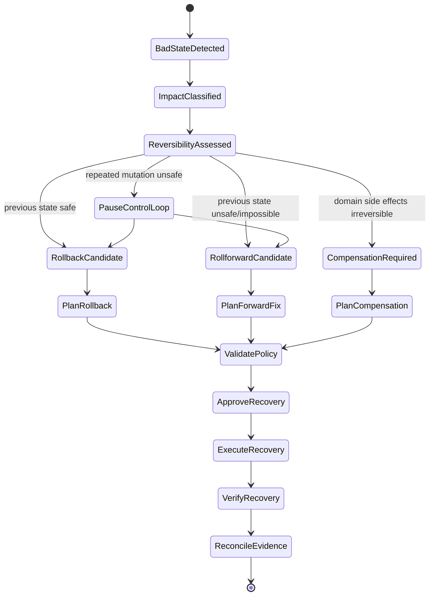
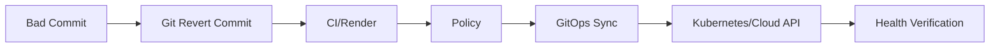
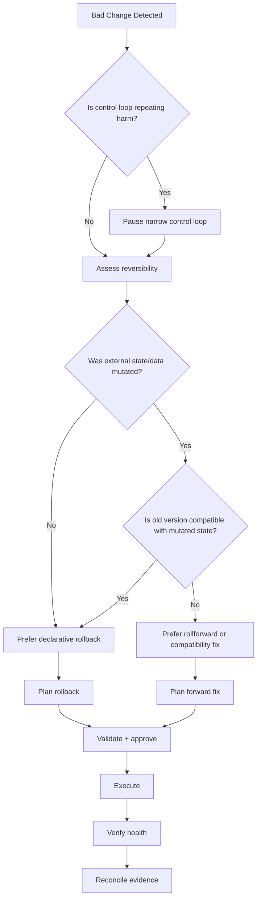
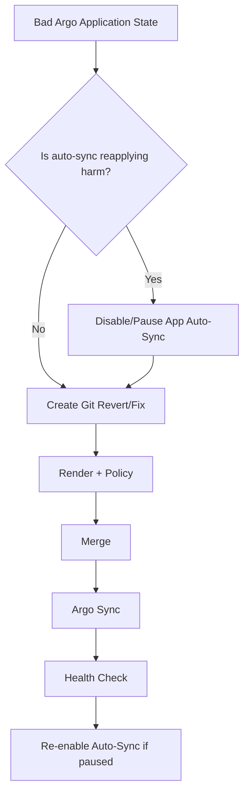
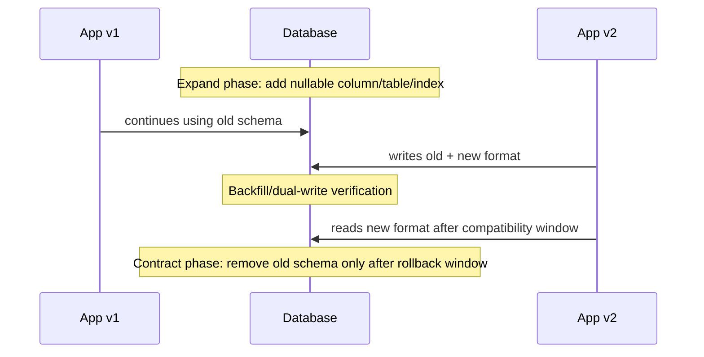
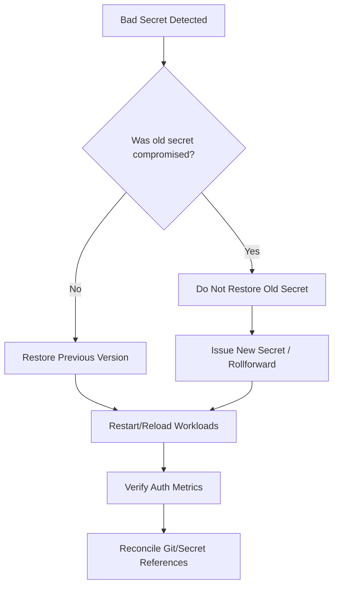

# Part 032 — Rollback and Rollforward Engineering

Rollback is one of the most misunderstood words in platform engineering.

Teams often say “just roll it back” as if every change can be undone by pressing a button. That is false. Some changes are reversible, some are only compensatable, some require forward repair, and some cannot be safely reversed without data loss or secondary impact.

In GitOps/IaC, rollback is also more subtle because there are multiple layers of state:

- Git desired state
- IaC recorded state
- actual cloud state
- Kubernetes live state
- database state
- secrets state
- artifact registry state
- policy state
- controller state
- human approval/evidence state

A mature platform does not simply support rollback. It classifies changes by reversibility and chooses between rollback, rollforward, pause, repair, import, compensation, or emergency containment.

The core idea:

> Rollback is not time travel. It is another controlled state transition.

---

## 1. Rollback vs Rollforward

### Rollback

Rollback means moving a system back toward a previously known desired state.

Examples:

- revert an app manifest commit to previous image digest
- restore previous Helm chart version
- revert a policy rule change
- re-apply previous configuration for a Deployment
- restore previous secret version
- pin a module to previous version

### Rollforward

Rollforward means introducing a new corrective state that fixes the failure without trying to recreate the past.

Examples:

- add missing IAM permission after a bad least-privilege change
- add compatibility column after a database migration issue
- patch a Helm values bug with a new commit
- update application code to tolerate new schema
- create replacement infrastructure and shift traffic
- add policy exception with expiry to unblock critical fix

### Compensation

Compensation means applying a domain-specific corrective action when true rollback is impossible.

Examples:

- issue credit after duplicate billing event
- restore data from backup into a new table
- replay events after failed consumer deployment
- rebuild search index after bad schema mapping

### Pause

Pause means temporarily stopping a control loop so it does not keep applying a bad state.

Examples:

- suspend a Flux Kustomization
- disable Argo auto-sync for one Application
- stop an IaC apply queue for one workspace
- pause image automation
- disable rollout progression

Pause is not recovery. It creates time for recovery.

---

## 2. The Rollback State Machine



The decision point is **reversibility**.

A rollback is only safe if the previous state is still valid against the current world.

---

## 3. Why “Previous Version” May Not Be Safe

A previous app binary may depend on:

- old database schema
- old secret format
- old IAM permission
- old API contract
- old feature flag default
- old CRD version
- old configuration shape
- old external dependency behavior

A previous infrastructure module may depend on:

- provider version behavior
- resource address mapping
- state layout
- cloud resource still existing
- quota still available
- name still reusable
- DNS propagation state
- peering/route state

A previous Kubernetes manifest may fail because:

- CRD version changed
- admission policy changed
- immutable fields prevent update
- old image was garbage-collected
- old secret no longer exists
- previous config violates new policy

Therefore, rollback requires validation like any other production change.

---

## 4. Git Revert Is Not Magic

In GitOps, a Git revert creates a new commit that changes desired state back toward earlier content. That new commit must still pass:

- rendering
- schema validation
- policy gates
- approval
- sync/apply
- health checks
- drift checks

The live system is not guaranteed to accept it.



A revert is desirable because it is declarative and auditable. It is not sufficient by itself.

---

## 5. Rollback Surfaces

Different layers have different rollback semantics.

| Surface | Typical Rollback | Main Risk |
|---|---|---|
| Application image | revert image digest/version | old binary incompatible with new data/schema |
| Kubernetes manifest | revert Git commit | immutable fields, policy/admission, CRD changes |
| Helm release | previous chart/values | hooks, CRDs, history/state mismatch |
| Kustomize overlay | revert patch/base ref | generated output differs due base changes |
| Argo CD Application | sync previous Git revision or revert Git | auto-sync/desired state conflict |
| Flux Kustomization | revert source revision or suspend/patch | source/controller dependency issue |
| Terraform/OpenTofu config | revert commit/module version | state/actual infra may not match old config |
| IaC state | restore/repair state | recorded state may lie about actual resources |
| Cloud resource | recreate previous shape | data loss, name reuse, dependencies |
| Database schema | down migration | data loss/irreversible DDL |
| Secret | restore previous version | credential compromise or rotation invalidation |
| Policy | revert rule | may re-allow unsafe changes |
| Controller | rollback controller version | CRD/version compatibility |
| Artifact | use previous digest/chart/module | artifact retention/signature availability |

The mistake is treating all rollback surfaces as equivalent.

---

## 6. Rollback Capability Matrix

Use this classification for every change before production.

| Capability | Meaning | Example |
|---|---|---|
| Fully reversible | previous state can be restored with low risk | stateless app image rollback |
| Reversible with compatibility window | rollback works only while old/new versions overlap | app + DB expand/contract |
| Reversible with manual repair | needs state import, data restore, or operator action | partial IaC apply |
| Forward-only | old state is unsafe or impossible | irreversible DB migration |
| Compensatable | cannot undo, but can counteract business effect | duplicate notification/billing |
| Non-recoverable without restore | requires backup/disaster recovery | destructive data deletion |

A production change should declare its rollback class.

Example:

```yaml
change:
  id: CHG-2026-0821
  environment: prod
  rollbackClass: reversible-with-compatibility-window
  rollbackWindow: 48h
  rollbackMethod: revert-image-digest-and-disable-new-feature-flag
  irreversibleEffects:
    - none expected before cleanup job
  verification:
    - error-rate < 1%
    - login-success-rate > 99.5%
```

---

## 7. The Rollback Decision Tree



The most important branch is data/external state mutation. If data changed, rollback may be dangerous.

---

## 8. Application Rollback Pattern

### Best Case

You deploy image digest `sha256:new`, errors rise, and you revert to `sha256:old`. No database or external contract changed.

### GitOps-Safe Procedure

1. Identify last known good artifact digest.
2. Confirm artifact still exists and signature/provenance remain valid.
3. Create revert or forward-fix commit changing image digest.
4. Run render/schema/policy checks.
5. Merge through protected path.
6. Let GitOps controller reconcile.
7. Verify rollout health.
8. Confirm metrics recover.
9. Record incident/evidence.

### Example Manifest Change

```yaml
apiVersion: apps/v1
kind: Deployment
metadata:
  name: billing-api
spec:
  template:
    spec:
      containers:
        - name: billing-api
          image: registry.example.com/billing-api@sha256:old-known-good
```

Use digests, not mutable tags, for deterministic rollback.

### Failure Cases

| Failure | Reason | Recovery |
|---|---|---|
| old image missing | retention too short | restore artifact or rollforward |
| signature invalid | trust policy changed | verify provenance or exception |
| old app incompatible | DB/API changed | rollforward compatibility fix |
| admission denies old manifest | new policy rejects old fields | policy exception or forward fix |

---

## 9. Kubernetes Rollback: Declarative vs Imperative

Kubernetes supports imperative rollout undo for workloads such as Deployments. That can be useful operationally, but in a GitOps system it can create a live state that differs from Git.

### Imperative Rollback

```bash
kubectl rollout undo deployment/billing-api
```

This changes cluster live state directly.

### Declarative Rollback

```bash
git revert <bad-commit>
git push
```

The GitOps controller applies the previous desired state through the normal control loop.

### Preferred GitOps Rule

Use declarative rollback by default.

Use imperative rollback only when:

- immediate containment is required
- GitOps path is unavailable or too slow for severity
- the action is logged as break-glass
- reconciliation PR follows immediately

### Why This Matters

If you run `kubectl rollout undo` while Argo/Flux still tracks the bad Git revision, the controller may re-apply the bad state. That is not recovery; it is a race against your own control loop.

---

## 10. Argo CD Rollback Considerations

Argo CD can sync applications to Git revisions and has automated sync behavior. The important operational principle is that desired state in Git remains the source of truth.

### Safe Patterns

- revert the Git commit and let Argo sync
- disable/pause automated sync only for the affected Application if needed
- use sync windows and manual sync for controlled recovery
- avoid broad controller-level shutdown
- verify health after sync

### Important Trap

If automated sync is enabled and Git still points to the bad revision, a manual rollback may be overwritten. Recovery should align Git desired state with the intended rollback state.

### Argo Rollback Flow



---

## 11. Flux Rollback Considerations

Flux is built around source reconciliation and controller-specific resources such as `Kustomization` and `HelmRelease`.

### Safe Patterns

- revert Git source revision
- suspend only affected reconciliation while preparing fix
- resume reconciliation after fix
- inspect status conditions and events
- avoid direct live patching unless break-glass

### Example Emergency Pause

```bash
flux suspend kustomization platform-prod
```

Then fix Git, verify, and resume:

```bash
flux resume kustomization platform-prod
```

### Key Principle

Suspension buys time. It does not define the correct final state.

---

## 12. Helm Rollback in GitOps

Helm has release history and rollback capabilities, but GitOps introduces another source of truth.

### Risk

If a Helm rollback is executed directly while Git still declares the bad chart/values, the GitOps controller may reconcile back to the bad release.

### Safer Pattern

- revert chart version or values in Git
- let Argo/Flux reconcile Helm release
- use direct Helm rollback only as emergency containment
- reconcile Git immediately after direct action

### Helm Rollback Failure Modes

| Failure | Cause |
|---|---|
| hook fails | non-idempotent hooks or bad job cleanup |
| CRD mismatch | chart changed CRD versions |
| values incompatible | old chart cannot parse new values |
| release secret broken | Helm release metadata corrupted |
| Git re-applies bad version | Git source not corrected |

---

## 13. Infrastructure Rollback Is Usually Not Simple

Infrastructure rollback is harder than app rollback because infrastructure changes may create, delete, rename, replace, or mutate external resources.

### Example

A module update changes an RDS instance class. Rolling back the module version may be safe.

But a module update that renames a subnet, replaces a database, or destroys a security group is not trivially reversible.

### Infrastructure Rollback Questions

- Did the apply mutate real resources?
- Did state record the mutation?
- Are resource names reusable?
- Was data destroyed?
- Did dependencies shift to the new resource?
- Did DNS/cache/clients observe the new endpoint?
- Did IAM permissions propagate?
- Would old config now propose destructive changes?
- Does rollback require import or state surgery?

### Safer Infrastructure Pattern

Prefer **rollforward through compatibility**:

1. create new resource alongside old
2. shift traffic/dependency gradually
3. validate
4. decommission old resource later

This is infrastructure blue-green.

---

## 14. OpenTofu/Terraform Rollback Patterns

### Pattern 1 — Revert Configuration

Use when the bad change is purely config and previous config is still valid.

```bash
git revert <bad-infra-commit>
# pipeline generates fresh plan
# policy + approval
# apply
```

### Pattern 2 — Pin Previous Module Version

Use when a module release is bad.

```hcl
module "network" {
  source  = "git::ssh://git.example.com/platform/network-module.git?ref=v1.8.2"
}
```

### Pattern 3 — Moved Blocks for Refactor Recovery

Use when resource addresses changed but resources should not be recreated.

```hcl
moved {
  from = aws_security_group.api
  to   = module.api_security.aws_security_group.this
}
```

### Pattern 4 — Import Existing Resource

Use when actual resource exists but state does not know it.

```bash
tofu import module.network.aws_vpc.main vpc-123456
```

Treat import as a production change with review and evidence.

### Pattern 5 — Rollforward Patch

Use when old state cannot be restored safely.

Example:

- bad IAM policy removed required permission
- rollback would reintroduce overly broad permission
- forward fix adds narrow missing permission

### Dangerous Pattern — State Restore as Rollback

Restoring an old state file does not change real infrastructure. It only changes what the IaC engine believes. If actual resources changed after that state version, old state may be dangerously wrong.

Only restore state when:

- you know actual infrastructure matches that state, or
- you have a controlled plan to reconcile mismatch, and
- production owner approves the operation.

---

## 15. Database Rollback: The Hard Boundary

Database changes are the classic rollback trap.

### Dangerous Changes

- dropping columns
- changing column type destructively
- renaming columns without compatibility
- deleting data
- rewriting semantics
- adding constraints that old code violates
- changing enum values
- changing indexes in ways that affect latency

### Safer Pattern: Expand / Contract



### Rollback-Safe Database Release

1. Expand schema in backward-compatible way.
2. Deploy app that can work with old and new schema.
3. Backfill safely.
4. Observe.
5. Switch reads/writes gradually.
6. Keep rollback window.
7. Contract only after rollback is no longer needed.

### Rule

Do not perform contract phase in the same release as app behavior change.

### Rollback Decision

| State | App Rollback Safe? |
|---|---:|
| schema expanded only | usually yes |
| app dual-writes | usually yes if old path retained |
| reads switched to new model | maybe |
| old column dropped | no, not without restore/forward fix |
| data transformed irreversibly | no, compensation/restore needed |

---

## 16. Secret Rollback

Secret rollback is not always safe.

### When Restoring Old Secret Is Safe

- rotation was accidental
- old secret not compromised
- old secret still valid
- workloads support old value
- audit confirms limited exposure

### When Restoring Old Secret Is Unsafe

- old secret was leaked
- old credential was revoked
- rotation was required by incident
- external provider invalidated old token
- clients have already migrated to new trust root

### Safer Secret Rotation Pattern

1. Introduce new secret version.
2. Allow old and new values during compatibility window.
3. Roll workloads gradually.
4. Verify authentication success.
5. Revoke old secret after success.
6. Keep rollback window where security permits.

### Emergency Secret Rollback Flow



---

## 17. Policy Rollback

Policy rollback can be as dangerous as application rollback.

### Example

A new IAM policy rule blocks production deployments. Rolling it back may unblock delivery, but may also re-allow privilege escalation.

### Policy Rollback Questions

- Did the rule block valid changes or unsafe changes?
- Was the issue rule logic, policy data, or enforcement placement?
- Can a scoped exception solve it instead of full rollback?
- What changes were blocked while the rule was active?
- Would rollback create a compliance gap?
- Is there a test case for the defect?

### Safe Policy Recovery

1. Capture denied inputs.
2. Add regression test.
3. Patch rule or data.
4. Use scoped exception if emergency.
5. Avoid disabling entire policy bundle.
6. Re-run affected changes through policy.

---

## 18. Controller Rollback

Controllers are part of the platform control plane. Rolling them back can affect reconciliation semantics.

### Controller Examples

- Argo CD application controller
- Flux controllers
- External Secrets Operator
- cert-manager
- ingress controller
- policy controllers
- Crossplane providers
- CSI drivers

### Controller Rollback Risks

- CRD version compatibility
- stored object schema changed
- leader election state
- finalizers
- webhook behavior
- controller cache assumptions
- RBAC changed
- old controller cannot read new fields

### Safe Controller Rollback

1. Test rollback in canary cluster.
2. Verify CRD compatibility.
3. Capture current controller config.
4. Pause affected reconciliation if needed.
5. Roll back controller version/config declaratively.
6. Verify controller health, queue depth, reconciliation lag.
7. Check dependent resources.

### Anti-Pattern

Downgrading a controller without checking CRD conversion and stored versions.

---

## 19. CRD and Custom Resource Rollback

CRDs are particularly risky because they define API shape.

### Risks

- removing served version too early
- conversion webhook failure
- incompatible schema tightening
- custom resources persisted in new version
- controller and CRD version mismatch

### Safer Pattern

1. Add new version while keeping old version served.
2. Upgrade controller to support both.
3. Migrate custom resources.
4. Observe.
5. Stop serving old version only after compatibility window.
6. Keep rollback path until storage migration is complete.

---

## 20. Feature Flags and Rollback

Feature flags are not a replacement for rollback, but they are excellent blast-radius controls.

### Use Feature Flags For

- behavior enablement
- gradual rollout
- kill switches
- decoupling deploy from release
- emergency disablement

### Do Not Use Feature Flags For

- hiding unsafe infrastructure changes
- bypassing schema incompatibility
- avoiding policy review
- long-lived undeleted dead code

### Rollback Pattern

If a feature causes errors:

1. disable flag first if it immediately contains impact
2. investigate whether code rollback is still needed
3. keep desired state and evidence synchronized
4. remove failed flag configuration after recovery

---

## 21. Rollback and Progressive Delivery

Progressive delivery makes rollback less binary.

Instead of:

```text
100% bad version -> full rollback
```

You can do:

```text
5% canary -> metric failure -> abort -> keep stable version
```

That is not rollback after full production blast. It is prevention through staged exposure.

### Recovery Actions

| Rollout State | Action |
|---|---|
| canary failed before promotion | abort canary |
| blue-green preview failed | keep active stable service |
| 25% traffic degraded | shift traffic back |
| post-promotion degraded | rollback image/config or rollforward fix |
| analysis metric unavailable | pause/abort according to no-data policy |

### Design Principle

A good rollback system starts before full rollout.

---

## 22. Rollback Testing

Rollback must be tested like deployment.

### Test Types

| Test | Purpose |
|---|---|
| app rollback test | verify previous image works |
| config rollback test | verify previous manifest accepted |
| DB compatibility test | verify old app works with expanded schema |
| secret rollback test | verify previous version path works |
| policy rollback test | verify rule can be reverted/patched safely |
| IaC module rollback test | verify previous module version produces expected plan |
| controller rollback test | verify downgrade path in canary cluster |
| artifact retention test | verify old digest/chart/module still available |

### Minimum Production Gate

Before production, a high-risk change should answer:

- What is the rollback method?
- What is the rollback window?
- What makes rollback unsafe?
- What metric triggers rollback?
- Who can approve rollback?
- How long should rollback take operationally?
- What evidence proves recovery?

---

## 23. Rollback Windows

Rollback windows are time-bound.

A rollback that is safe for 30 minutes may be unsafe after 2 days because:

- data has been migrated
- old artifacts expired
- old secret revoked
- clients upgraded
- external partners changed behavior
- schema contract moved forward
- cache/state warmed around new model

### Example

```yaml
rollbackWindow:
  appImage: 24h
  databaseSchema: until-contract-phase
  secretRotation: 2h unless compromise suspected
  infrastructureModule: before old resource deletion
  policyRule: 7d with regression test
```

Make rollback windows explicit.

---

## 24. Rollback Evidence

A rollback should produce evidence like any other change.

| Evidence | Why It Matters |
|---|---|
| incident/change ID | links action to reason |
| rollback commit | proves desired-state change |
| artifact digest | proves exact version |
| approval | proves authorized recovery |
| policy result | proves rollback itself was allowed |
| sync/apply logs | proves execution |
| health metrics | proves recovery worked |
| drift check | proves no hidden divergence |
| postmortem action | proves recurrence reduction |

Rollback without evidence is just another unverified production mutation.

---

## 25. Rollback Playbook: Bad App Release

### Symptoms

- increased error rate
- latency spike
- crash loop
- failed canary metrics
- user-facing regression

### Decision

If no irreversible state changed, rollback app artifact.

### Procedure

1. Confirm bad version and last known good digest.
2. Check DB/secret/API compatibility.
3. If progressive rollout is active, abort or shift traffic back.
4. Commit revert/fix to desired state.
5. Run policy/render checks.
6. Sync through GitOps.
7. Verify metrics.
8. Keep incident open until drift/evidence clear.

### Rollforward Alternative

If rollback incompatible with database or external state, ship a forward fix that restores behavior.

---

## 26. Rollback Playbook: Bad ConfigMap or Secret Reference

### Symptoms

- app starts but fails configuration
- missing environment variable
- wrong endpoint
- wrong secret key
- crash loop after config change

### Procedure

1. Identify whether value or reference is wrong.
2. Revert config reference in Git or restore secret version.
3. Confirm secret not compromised if restoring.
4. Trigger workload reload/restart according to design.
5. Verify app behavior.
6. Add config validation test.

### Design Improvement

Use startup config validation and pre-production rendered config checks.

---

## 27. Rollback Playbook: Bad IaC Module Release

### Symptoms

- many stacks start proposing unexpected changes
- provider/module upgrade causes replacements
- module output contract breaks downstream stacks
- policy begins failing due module output change

### Procedure

1. Freeze promotion of module version.
2. Identify affected stacks.
3. Pin previous module version for affected environments.
4. Run fresh plans.
5. Check whether any stacks already applied bad version.
6. For unapplied stacks, revert/pin is usually sufficient.
7. For applied stacks, compare desired/recorded/actual state.
8. Repair by rollforward or controlled config rollback.
9. Add module regression test.

### Anti-Pattern

Force-pushing module tag to point to old code. Tags used by infrastructure should be immutable.

---

## 28. Rollback Playbook: Bad IAM Change

### Symptoms

- workloads lose access
- pipeline runners cannot assume roles
- GitOps controller cannot read secrets/registry
- users receive authorization errors

### Risk

Rollback may reintroduce over-permission. Rollforward may be better.

### Procedure

1. Identify missing/incorrect permission from audit logs.
2. Determine whether previous policy was too broad.
3. If previous policy was safe, revert.
4. If previous policy was unsafe, add narrow forward fix.
5. Apply through IaC if pipeline identity still works.
6. If pipeline identity broken, use break-glass with reconciliation PR.
7. Add negative/positive IAM tests.

---

## 29. Rollback Playbook: Bad Network Change

### Symptoms

- service unreachable
- DNS failure
- route table wrong
- security group/NACL blocks traffic
- cluster loses egress
- runner loses provider access

### Procedure

1. Identify blast radius.
2. Preserve current state and audit events.
3. If pipeline can still apply, revert or forward-fix through IaC.
4. If pipeline lost access, use break-glass network repair.
5. Reconcile Git and state.
6. Add network reachability tests to plan/apply pipeline.

### Design Improvement

Network changes should have synthetic connectivity checks after apply.

---

## 30. Rollback Playbook: Bad Database Migration

### Symptoms

- app errors after schema change
- migration failed halfway
- old app cannot start
- data constraint violation
- query latency spike after index change

### Procedure

1. Stop further rollout.
2. Determine whether migration is reversible.
3. If expand-only, app rollback may be safe.
4. If data changed, prefer rollforward repair or restore strategy.
5. If destructive migration occurred, evaluate backup/point-in-time restore or compensation.
6. Keep application compatibility window.
7. Add migration test and rollout sequencing fix.

### Anti-Pattern

Running down migrations automatically in production without data-loss analysis.

---

## 31. Rollback Playbook: Bad Policy Rule

### Symptoms

- production deploys blocked
- safe resources denied
- policy engine latency spikes
- false positives after policy data update

### Procedure

1. Capture denied input.
2. Confirm whether denial is valid.
3. If invalid, patch policy with regression test.
4. If urgent, add scoped exception instead of full disablement.
5. Re-run blocked changes.
6. Review why policy test suite missed it.

---

## 32. Rollback Playbook: Bad GitOps Controller Upgrade

### Symptoms

- reconciliation failures after upgrade
- applications stuck unknown/degraded
- controller crash loop
- RBAC errors
- diff behavior changed
- health checks regress

### Procedure

1. Determine whether workloads are stable.
2. Pause risky application sync if controller behavior is harmful.
3. Roll back controller version/config declaratively.
4. Verify CRD compatibility before downgrade.
5. Check reconciliation backlog.
6. Reconcile drift created during outage.
7. Add canary upgrade test.

---

## 33. Designing for Reversibility

You cannot bolt rollback on later. You design for it.

### Reversibility Patterns

| Pattern | Purpose |
|---|---|
| immutable artifacts | exact previous version exists |
| artifact retention | old versions are recoverable |
| digest pinning | avoid tag ambiguity |
| expand/contract | database compatibility |
| create-before-destroy | infrastructure safety |
| traffic shifting | reduce blast radius |
| feature flags | instant behavior disablement |
| module versioning | safe infra release rollback |
| state unit boundaries | reduce rollback scope |
| policy tests | safe policy rollback |
| secret versioning | controlled secret rollback |
| controller canaries | safe platform rollback |

### Reversibility Smells

- mutable tags
- same release performs schema expansion and contraction
- direct console changes as normal practice
- giant shared state files
- no module version pinning
- no artifact retention guarantee
- force pushes on deployment branches
- policy exceptions in comments
- untested down migrations
- controller upgrades directly to all clusters

---

## 34. Rollback SLOs

For critical systems, define rollback objectives.

| SLO | Meaning |
|---|---|
| detection time | time from bad state to alert |
| decision time | time to classify rollback vs rollforward |
| execution time | time to apply recovery transition |
| verification time | time to prove health restored |
| evidence completion | time to attach audit trail |

Example:

```yaml
rollbackSLO:
  criticalService:
    detect: 5m
    decide: 10m
    execute: 15m
    verify: 10m
    evidence: 24h
```

This is not bureaucracy. It makes recovery measurable.

---

## 35. The Senior Engineer’s Heuristics

Use these heuristics in real incidents.

### Heuristic 1 — If Data Changed, Be Suspicious of Rollback

Prefer compatibility and rollforward unless you prove old version is safe.

### Heuristic 2 — If Git Is Wrong, Fix Git First

Manual rollback while desired state remains bad creates a controller fight.

### Heuristic 3 — If State Is Wrong, Do Not Apply Blindly

Repair/diagnose state before new mutation.

### Heuristic 4 — If Control Loop Is Repeating Damage, Pause Narrowly

Stop the smallest loop responsible for repeated mutation.

### Heuristic 5 — If Policy Blocks Rollback, Understand Why

Rollback can be unsafe. Do not assume policy is the problem.

### Heuristic 6 — If Old Artifact Is Missing, You Do Not Have Rollback

Retention is part of rollback design.

### Heuristic 7 — If Rollback Requires Tribal Knowledge, It Is Not Production-Ready

Encode it in runbooks, tests, and platform UI.

---

## 36. Final Checklist

A GitOps/IaC system has credible rollback/rollforward engineering when:

- [ ] every production change declares rollback class
- [ ] rollback method is reviewed before apply
- [ ] artifact digests are immutable and retained
- [ ] app rollback compatibility is tested
- [ ] database changes use expand/contract where needed
- [ ] secret rotation has rollback or forward-fix plan
- [ ] IaC modules are versioned and pinned
- [ ] state repair is governed
- [ ] GitOps controller pause/resume is scoped
- [ ] policy rollback/exception has test and expiry
- [ ] controller upgrades have rollback path
- [ ] direct manual rollback triggers reconciliation PR
- [ ] rollback produces evidence
- [ ] rollback SLOs exist for critical systems

---

## 37. Closing Mental Model

Rollback is not a button. It is a **state transition under uncertainty**.

The expert move is not always to go backward. The expert move is to choose the safest transition from the current actual state to a verified healthy state, while preserving the integrity of Git, IaC state, policy, audit, and business data.

Sometimes that transition is rollback.

Often it is rollforward.

Occasionally it is compensation.

In all cases, it must be deliberate, observable, authorized, and reconciled.

---

## 38. References

- OpenTofu documentation — `plan`, planning modes, saved plans: https://opentofu.org/docs/cli/commands/plan/
- OpenTofu documentation — `apply` executes proposed actions in a plan: https://opentofu.org/docs/cli/commands/apply/
- OpenTofu documentation — state model: https://opentofu.org/docs/language/state/
- Argo CD documentation — automated sync policy: https://argo-cd.readthedocs.io/en/latest/user-guide/auto_sync/
- Argo CD documentation — sync phases and waves: https://argo-cd.readthedocs.io/en/stable/user-guide/sync-waves/
- Argo CD documentation — sync options: https://argo-cd.readthedocs.io/en/latest/user-guide/sync-options/
- Flux documentation — suspend command: https://fluxcd.io/flux/cmd/flux_suspend/
- Kubernetes documentation — `kubectl rollout undo`: https://kubernetes.io/docs/reference/kubectl/generated/kubectl_rollout/kubectl_rollout_undo/
- Kubernetes documentation — declarative object management: https://kubernetes.io/docs/tasks/manage-kubernetes-objects/declarative-config/
- Kubernetes documentation — Deployments and rolling updates: https://kubernetes.io/docs/concepts/workloads/controllers/deployment/
