# Part 033 — Database and Stateful Change in GitOps

Most GitOps examples are stateless.

Change an image tag. Reconcile a Deployment. Roll back a commit. Done.

Real production platforms are not like that.

They have databases, queues, object stores, indexes, caches, volumes, identity state, encryption keys, subscriptions, workflow instances, audit trails, and long-lived domain records. A broken stateless deployment can often be rolled back by changing desired state. A broken stateful change may have already rewritten data, dropped compatibility, moved ownership, changed retention, or invalidated assumptions in downstream services.

The dangerous misunderstanding is this:

> GitOps gives you a reversible deployment history.

It does not.

Git gives you versioned desired state. It does not make external state reversible. A database migration, Kafka topic configuration change, key rotation, or storage-class change may be a one-way transition unless deliberately designed otherwise.

The real goal of this part is not “run database migrations from GitOps”. The real goal is to build a stateful-change discipline where every persistent transition is classified, gated, sequenced, observed, and recoverable enough for production.

---

## 1. The Core Mental Model

A stateless GitOps change modifies replaceable runtime shape.

A stateful GitOps change modifies durable facts.

That distinction changes everything.

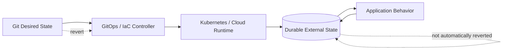

In stateless rollout:

1. Git changes.
2. Controller applies desired state.
3. Runtime converges.
4. Revert restores old runtime shape.

In stateful rollout:

1. Git changes.
2. Migration mutates durable state.
3. Applications observe new state.
4. Other systems may write data under the new shape.
5. Revert may not restore old durable facts.

This is why “rollback” is often the wrong word. For stateful systems, the safer default is:

- expand
- verify
- run compatible code
- migrate gradually
- cut over
- contract later
- keep repair path

The stateful-change rule:

> Never make the durable state incompatible with currently running or immediately rollbackable application versions.

---

## 2. What Counts as Stateful Change?

Database schema migration is only one category.

A GitOps/IaC platform must classify many durable resources.

| Change Type | Example | Primary Risk |
|---|---|---|
| Relational schema | add column, drop table, change index | lock, data loss, incompatibility |
| Data migration | backfill, deduplicate, transform values | long runtime, partial progress, semantic corruption |
| Database operational config | parameter group, extensions, replication | restart, performance regression, failover |
| Kafka or event stream | topic partitions, retention, compaction | ordering, replay, data expiry, consumer breakage |
| Object storage | bucket policy, lifecycle rule, versioning | data deletion, access breakage, compliance gap |
| Cache state | Redis persistence, eviction, key format | cache poisoning, cold start, inconsistent reads |
| Search/index state | Elasticsearch/OpenSearch mapping | reindexing, query incompatibility |
| Kubernetes volume | PVC resize, storage class, reclaim policy | stuck workload, data loss, scheduling failure |
| Identity state | IAM role, service account, key, permission | outage, privilege escalation, broken workload identity |
| Secret/key material | rotation, encryption key, certificate | unreadable data, expired trust, failed handshakes |
| Workflow/process state | Camunda/process instances, job queues | stuck state machines, invalid transitions |
| Audit/evidence state | retention, immutability, log pipeline | regulatory defensibility loss |

A mature pipeline does not treat all of these as “config”. It treats them as state transitions with different reversibility profiles.

---

## 3. The Three-State Model: Desired, Recorded, Actual

Stateful GitOps requires tracking three different states.

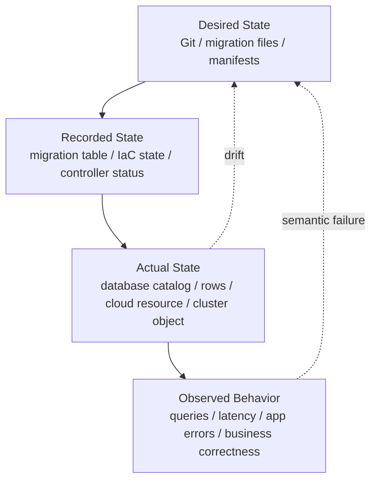

For database migration:

- desired state = migration scripts in Git
- recorded state = `schema_history` or `DATABASECHANGELOG`
- actual state = database schema and data
- observed behavior = application correctness and performance

For Kafka topic:

- desired state = topic manifest/IaC config
- recorded state = Terraform/OpenTofu state or operator status
- actual state = broker topic config
- observed behavior = producer/consumer lag, ordering, error rates

For object storage lifecycle:

- desired state = bucket lifecycle policy
- recorded state = IaC state
- actual state = effective cloud policy
- observed behavior = data retained/deleted as expected

The anti-pattern is approving stateful change based only on desired state diff.

Production approval should ask:

1. What durable facts will change?
2. What records will prove the change happened?
3. What behavior confirms correctness?
4. What is the safe repair path if behavior is wrong?

---

## 4. Reversibility Classes

Every stateful change should be assigned a reversibility class before merge.

| Class | Meaning | Example | Default Governance |
|---|---|---|---|
| R0 — No durable mutation | runtime-only change | app replica count | normal GitOps approval |
| R1 — Additive reversible | add nullable column, add index concurrently | safe but verify locks/perf | normal + database review |
| R2 — Additive but costly | large index, large backfill | reversible but expensive | planned window + SLO guard |
| R3 — Compatibility-breaking | rename column, change type, remove field | unsafe without expand-contract | require staged rollout |
| R4 — Destructive | drop table, delete objects, reduce retention | data loss risk | high approval + backup proof |
| R5 — Irreversible semantic | rewrite identifiers, merge tenants | cannot restore from Git | formal migration plan |

Do not bury this in prose. Put it in the PR.

Example PR metadata:

```yaml
stateful_change:
  class: R3
  durable_systems:
    - postgres.customer
    - service.customer-api
  compatibility:
    old_app_reads_new_schema: true
    new_app_reads_old_schema: true
    rollback_safe_until: "2026-07-17T00:00:00+07:00"
  backup:
    required: true
    restore_tested: true
  migration:
    tool: flyway
    estimated_runtime: "8m"
    lock_risk: "low"
    backfill_strategy: "batched"
  contract_step:
    expand_contract_phase: "expand"
```

This turns stateful change from an implicit risk into a visible contract.

---

## 5. Expand-Contract as the Default Pattern

The expand-contract pattern is the backbone of safe stateful delivery.

The idea:

1. Expand the database/schema/state so both old and new code can work.
2. Deploy application code that uses the new shape safely.
3. Migrate data gradually if needed.
4. Verify all readers/writers are moved.
5. Contract by removing old shape later.

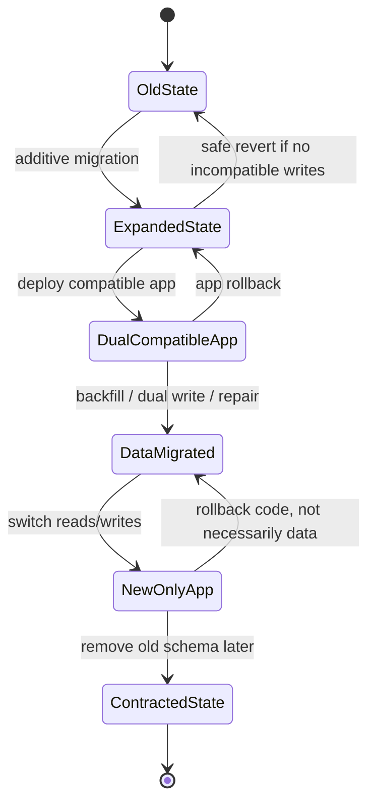

Example: rename `customer.full_name` to `customer.display_name`.

Unsafe version:

1. Rename column.
2. Deploy new app.
3. Old app rollback fails because `full_name` is gone.

Safe version:

1. Add `display_name` nullable.
2. New app writes both `full_name` and `display_name`.
3. Backfill `display_name` from `full_name`.
4. New app reads `display_name`, falls back to `full_name`.
5. Verify no old app version is running.
6. Stop writing `full_name`.
7. Drop `full_name` after retention window.

The contract phase should usually be a separate PR and a separate release window.

Why?

Because contract changes remove fallback.

---

## 6. Compatibility Matrix

For every app/database migration, build a compatibility matrix.

| App Version | DB Old | DB Expanded | DB Contracted |
|---|---:|---:|---:|
| old app | works | works | fails |
| transition app | works | works | maybe works |
| new app | maybe fails | works | works |

The migration is safe only if every state transition in the rollout path is compatible.

A better matrix includes reads/writes.

| Phase | Old App Read | Old App Write | New App Read | New App Write | Rollback Safe? |
|---|---:|---:|---:|---:|---:|
| old schema | yes | yes | no | no | yes |
| expanded schema | yes | yes | yes | yes | yes |
| dual-write active | yes | yes | yes | yes | yes |
| new-read active | maybe | maybe | yes | yes | partial |
| contracted schema | no | no | yes | yes | no |

The first time you introduce “no” for old app compatibility, you have crossed the rollback boundary.

Mark that boundary explicitly.

---

## 7. Migration Tooling: Flyway vs Liquibase vs Custom Runners

The specific tool matters less than the operating contract around it.

Still, tool semantics shape failure behavior.

### 7.1 Flyway-style migration

Flyway is simple and strong when migrations are linear, versioned, and mostly SQL-driven.

Common strengths:

- versioned SQL migrations
- repeatable migrations
- migration history table
- checksums
- callbacks
- broad database support
- low ceremony

Common risk:

- developers may put large or unsafe DDL in a single migration
- undo migration support should not be mistaken for universal safe rollback
- environment drift can appear when hotfixes or manual DB changes bypass migration history

Use Flyway-style migration when:

- the team wants plain SQL
- schema ownership is service-local
- migration order is linear
- changes are mostly relational DDL/DML
- database-specific SQL is acceptable

### 7.2 Liquibase-style migration

Liquibase is useful when teams need a more explicit changelog model.

Common strengths:

- structured changelogs
- changesets with IDs/authors
- preconditions
- rollback definitions
- labels/contexts
- database-independent abstractions where useful
- detailed changelog history

Common risk:

- rollback definitions can create false confidence
- abstraction may hide expensive database-specific behavior
- complex changelog composition can become hard to review

Use Liquibase-style migration when:

- governance wants rich metadata around change units
- multiple DB engines are relevant
- preconditions and rollback declarations are important
- database change must be reviewed as structured intent

### 7.3 Custom migration runner

A custom runner can be valid for domain data migration, not usually for schema baseline.

Use custom runners when:

- migration must be batched
- migration must be resumable
- migration must be throttled by live traffic
- migration must emit domain metrics
- migration must coordinate with external systems
- migration must be idempotent at row/entity level

The mistake is using custom migration runners for simple DDL and then losing a common migration history mechanism.

### 7.4 Operator-managed database change

Some platforms use Kubernetes Jobs, operators, or database controllers to run migrations.

This can work, but the boundary must be explicit:

- who owns the migration lock?
- how is migration result recorded?
- how does app rollout wait for migration readiness?
- what happens if GitOps retries the Job?
- can the migration be safely re-applied?
- how is partial progress detected?

A Kubernetes Job is not automatically a safe migration engine.

---

## 8. Where Should Migrations Run?

There are four common patterns.

### Pattern A — Migration inside application startup

The app starts and runs migrations before serving traffic.

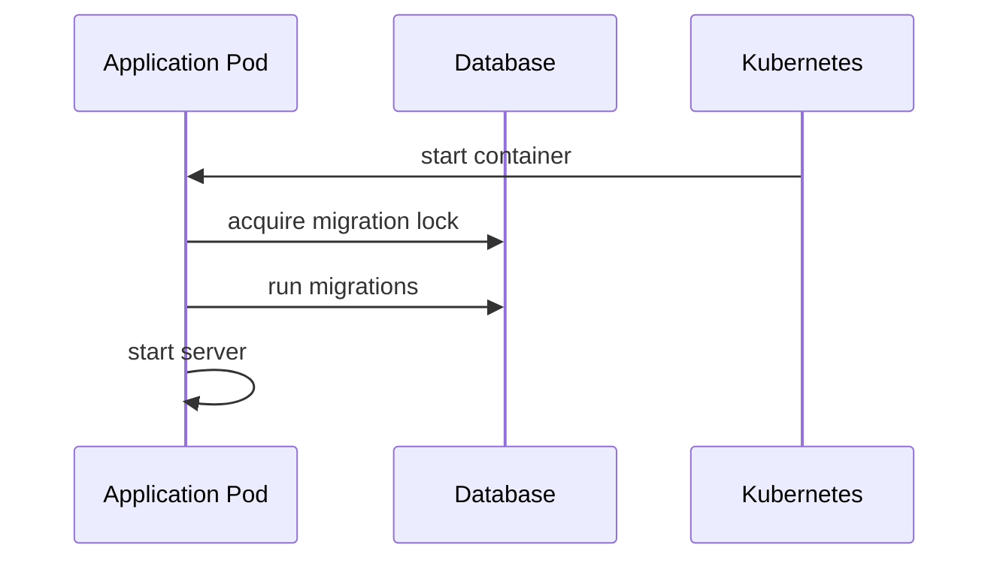

Advantages:

- simple
- migrations are version-coupled with app code
- no separate pipeline stage

Problems:

- multiple replicas can race unless lock is robust
- rollout readiness can be delayed unpredictably
- failed migration becomes failed deployment
- app runtime identity may need DDL privileges
- rollback may start old pods against new schema

Use only for small systems or strictly additive migrations.

### Pattern B — CI/CD pipeline migration before app deploy

The pipeline runs migrations before changing app desired state.

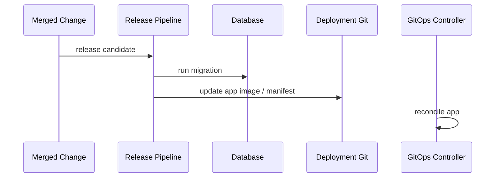

Advantages:

- clear sequencing
- migration can have separate identity
- easier approval/evidence
- app rollout starts after migration success

Problems:

- not purely pull-based
- pipeline has privileged DB access
- if migration succeeds and Git update fails, system is in intermediate phase

Good default for service-owned relational databases.

### Pattern C — GitOps hook/job migration

A GitOps sync creates a migration Job before or during app sync.

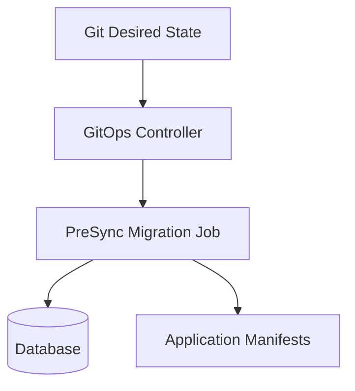

Advantages:

- migration is visible in GitOps flow
- cluster-native execution
- can be aligned with sync waves/hooks

Problems:

- hook retry semantics can be dangerous
- failed hook may block sync
- job identity may become too privileged
- reconciliation may recreate failed migration jobs if not designed carefully
- migration lifecycle is coupled to Kubernetes controller behavior

Use for additive, idempotent, short-running migrations. Be careful with destructive or long-running migrations.

### Pattern D — Dedicated migration service

A dedicated system consumes migration intent and executes with strong control.

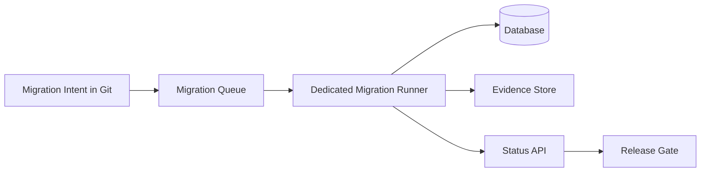

Advantages:

- best control over locks, retries, batching, evidence
- strong separation of app runtime and migration identity
- supports large data migrations
- can expose status/SLOs

Problems:

- more platform engineering
- another control plane to operate
- must avoid becoming opaque manual gate

Use for large organizations, regulated systems, and high-value databases.

---

## 9. The Stateful Change Pipeline

A production-grade stateful pipeline has more stages than stateless deployment.

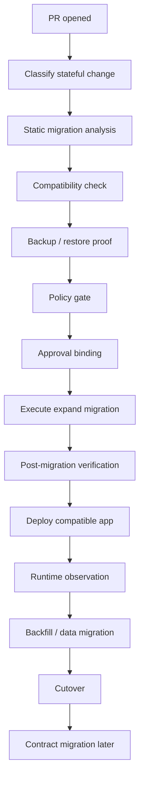

Each stage exists because stateful changes can fail in different ways.

### 9.1 PR classification

The pipeline should detect files that imply stateful change:

- `db/migration/**`
- `liquibase/**`
- `flyway/**`
- `terraform/**/rds*`
- `terraform/**/postgres*`
- `kafka-topics/**`
- `helm/**/values.yaml` when it changes persistence
- `storageclass/**`
- `external-secrets/**`
- `iam/**`

Detection should not be based only on path. Policy should inspect content too.

Examples:

- `DROP TABLE`
- `ALTER COLUMN TYPE`
- `SET NOT NULL`
- `CREATE INDEX` without concurrent/online strategy
- retention reduction
- KMS key change
- PVC storage class change
- Kafka retention decrease

### 9.2 Static migration analysis

Static checks should flag dangerous statements.

For PostgreSQL examples:

- `DROP TABLE`
- `DROP COLUMN`
- `ALTER TABLE ... ALTER COLUMN TYPE`
- `ALTER TABLE ... ADD COLUMN ... NOT NULL` without default/backfill strategy
- `CREATE INDEX` without `CONCURRENTLY` on large table
- table rewrite risk
- non-idempotent data updates
- missing `WHERE` on `UPDATE`/`DELETE`
- `LOCK TABLE`
- long transaction block around DDL

Static analysis is not enough, but it catches obvious hazards.

### 9.3 Dynamic rehearsal

For important changes, run migration against a production-like copy.

Measure:

- runtime
- locks acquired
- rows modified
- index build time
- replication lag
- query plan changes
- disk growth
- CPU/IO impact
- rollback/repair rehearsal

A migration PR that says “works on my local database” is not production evidence.

### 9.4 Backup and restore proof

Backup existence is weaker than restore proof.

For R4/R5 changes, require:

- backup identifier
- backup timestamp
- restore test result
- expected RTO
- expected RPO
- restore owner
- decision record saying whether restore is a realistic recovery path

Sometimes restore is not realistic because restoring the database would lose later writes or impact other services. In that case, the recovery path must be compensation or rollforward, not “restore backup”.

---

## 10. Database Migration State Machine

A good platform represents database migration as a state machine.

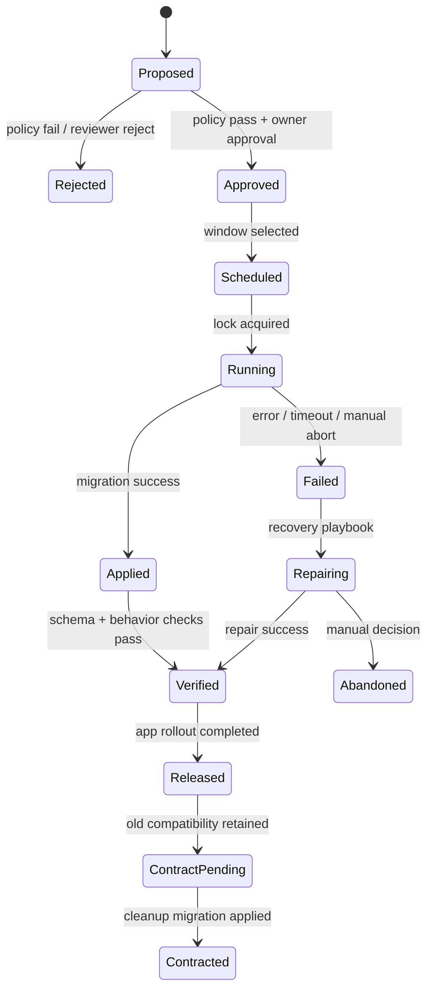

Important: `Applied` is not enough.

A migration can apply successfully and still break production behavior.

Examples:

- query plan regresses
- downstream read model fails
- app expects old enum values
- hidden consumers query old column
- replication lags under backfill
- triggers slow down writes
- connection pool saturates

The state machine must include verification after apply.

---

## 11. Schema Migration Patterns

### 11.1 Add nullable column

Usually safe.

```sql
ALTER TABLE customer ADD COLUMN display_name text;
```

But still ask:

- is the table huge?
- does the database rewrite the table?
- does the app tolerate null?
- is there a default?
- will new code assume non-null immediately?

### 11.2 Add column with default

Potentially expensive depending on database engine/version and default semantics.

Safer pattern:

1. Add nullable column without expensive default.
2. Deploy app that writes new value.
3. Backfill in batches.
4. Add `NOT NULL` constraint later after validation.

### 11.3 Add index

Index creation can lock or overload the database.

Safer pattern:

- use online/concurrent index build when supported
- avoid transaction wrappers if the database disallows concurrent index creation inside transaction
- schedule for lower-traffic window if table is large
- monitor replication lag and IO
- verify query planner actually uses index

### 11.4 Change column type

Often compatibility-breaking.

Safer pattern:

1. Add new column with target type.
2. Dual-write.
3. Backfill.
4. Switch reads.
5. Stop writing old column.
6. Drop old column later.

### 11.5 Rename column

Treat as drop + add for compatibility purposes.

Safer pattern:

1. Add new column.
2. Dual-write.
3. Backfill.
4. Switch reads.
5. Contract.

### 11.6 Drop column/table

Destructive.

Require:

- usage proof
- read/write telemetry
- dependency scan
- retention window
- backup/restore evidence
- explicit high-risk approval
- staged deprecation

A common production practice is to first make the old column inaccessible to the app without dropping it, then observe whether anything breaks.

### 11.7 Add constraint

Constraints can fail on existing data or lock tables.

Safer pattern:

1. Add validation logic in application.
2. Backfill/fix existing bad data.
3. Add constraint in non-blocking/not-valid mode if supported.
4. Validate constraint later.
5. Monitor write errors.

### 11.8 Enum changes

Enum changes are deceptively risky.

Ask:

- can old app read new enum value?
- can downstream consumers handle it?
- can reporting pipelines handle it?
- can old app write old value after new app writes new value?
- is there a fallback/unknown state?

Prefer forward-compatible enum handling in code.

---

## 12. Data Migration Patterns

Schema migration changes shape. Data migration changes facts.

That makes data migration more dangerous.

### 12.1 One-shot data migration

Example:

```sql
UPDATE invoice SET status = 'PAID' WHERE paid_at IS NOT NULL;
```

Risk:

- touches many rows
- can block writes
- cannot easily distinguish old vs newly changed rows
- may encode wrong business logic

Use only for small, well-bounded datasets.

### 12.2 Batched migration

Safer pattern:

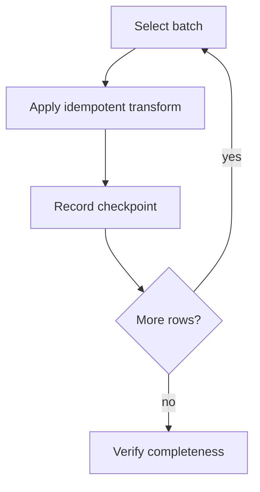

Design requirements:

- idempotent transformation
- checkpointing
- throttle controls
- pause/resume
- metrics
- dead-letter for problematic records
- ownership of business correctness

### 12.3 Dual write

New app writes old and new representation.

Risks:

- consistency drift between representations
- partial write failure
- retry semantics
- transaction boundary mismatch
- hidden consumers using old representation

Use dual write only with explicit verification and reconciliation.

### 12.4 Read fallback

New app reads new representation first, falls back to old.

This supports gradual migration.

But it can hide incomplete migration forever unless you track fallback rate.

Metric:

```text
customer_profile_read_fallback_total{from="legacy_full_name"}
```

The contract phase should not happen until fallback rate is zero for a defined window.

### 12.5 Shadow read

New app reads old and new representation and compares results, but uses only old result.

Useful before cutover.

Track:

- mismatch count
- mismatch category
- entity identifiers
- performance overhead

### 12.6 Backfill worker

For large systems, a dedicated backfill worker is safer than a migration SQL script.

It can:

- batch by primary key range
- throttle on DB load
- pause on error budget burn
- emit metrics
- skip/retry bad entities
- resume after deployment
- run under limited privileges

---

## 13. Migration Locking and Concurrency

Migration tools often use a metadata table lock or database lock to prevent concurrent migration.

That is necessary but not sufficient.

You must also coordinate:

- multiple CI runners
- multiple region pipelines
- GitOps retries
- app startup migration race
- manual DBA actions
- read replicas
- failover events
- blue/green environments pointing to same database

Locking hierarchy:

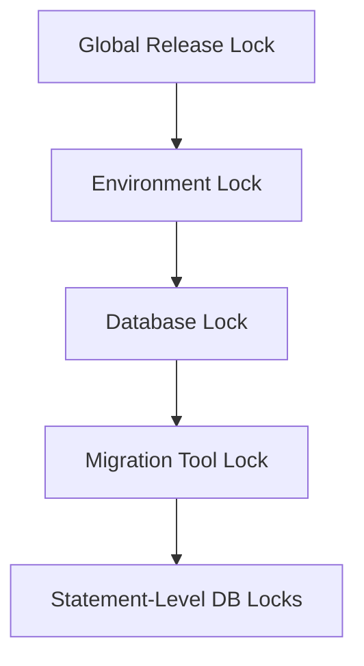

A database migration lock prevents two migrations from running. It does not prevent an application deployment from moving forward too early unless the pipeline enforces that sequence.

---

## 14. GitOps Hooks for Database Migration

GitOps hooks are attractive because they keep deployment declarative.

But hooks are not a silver bullet.

### 14.1 Safe use cases

Use hooks/jobs when:

- migration is additive
- migration is short-running
- migration is idempotent
- retry is safe
- app rollout depends on migration success
- job identity has narrow privileges
- job result is visible and retained

### 14.2 Dangerous use cases

Avoid hooks/jobs when:

- migration is destructive
- migration is long-running
- migration needs manual checkpoint decisions
- migration can overload DB
- retry can corrupt data
- rollback requires complex compensation
- migration needs production data copy rehearsal

### 14.3 Hook retry problem

If a migration Job fails after partial progress, a GitOps controller may keep trying to converge.

This is good for idempotent operations.

It is dangerous for non-idempotent operations.

Therefore every migration run must answer:

- can it be run twice?
- can it resume after partial success?
- can it detect already-applied state?
- can it safely fail closed?

---

## 15. Database Ownership Model

One of the hardest questions is: who owns the database?

Options:

### Service-owned database

Each service owns its schema and migrations.

Pros:

- clear ownership
- simpler deployment coupling
- service team owns compatibility

Cons:

- duplication of migration discipline
- cross-service reporting becomes harder
- shared data patterns may creep in

### Platform-owned database service, team-owned schema

Platform owns database infrastructure. Service team owns schema.

Pros:

- platform controls backup, security, replication
- service team controls domain model

Cons:

- requires clear boundary between infra changes and schema changes
- incident response needs joint ownership

### Shared enterprise database

Multiple applications share schemas/data.

Pros:

- legacy compatibility
- central reporting

Cons:

- weak ownership
- hidden dependencies
- migration blast radius
- hard rollback
- difficult GitOps mapping

For modern GitOps/IaC, prefer service-owned schema with platform-owned operational substrate.

---

## 16. Stateful Resource Patterns Beyond SQL

### 16.1 Kafka topics

Topic changes are stateful.

Examples:

- partitions increased
- retention reduced
- cleanup policy changed
- compaction enabled
- replication factor changed
- schema registry compatibility changed

Risks:

- increasing partitions can affect ordering guarantees
- retention reduction can delete replayable history
- compaction changes consumer assumptions
- schema compatibility break can stop consumers

GitOps policy should gate:

```yaml
kafka_policy:
  retention_decrease_requires_approval: true
  partition_increase_requires_ordering_review: true
  cleanup_policy_change_requires_consumer_review: true
  schema_compatibility_must_not_decrease: true
```

### 16.2 Object storage lifecycle

Bucket lifecycle rules can delete data.

Treat these as destructive changes if they reduce retention.

Policy checks:

- retention must not go below regulatory minimum
- delete markers/versioning changes require data-owner approval
- public access changes require security approval
- encryption key changes require restore/read proof

### 16.3 Redis/cache state

Cache changes are often considered safe because cache is “temporary”.

That assumption is often false.

Redis may hold:

- rate limit counters
- session state
- idempotency keys
- workflow locks
- distributed leases
- materialized views

Changing TTL, key format, eviction policy, persistence, or cluster mode can break behavior.

### 16.4 Search/index state

Search systems require special handling:

- create new index
- backfill/reindex
- shadow query
- atomically switch alias
- retain old index for rollback window
- delete old index later

This is expand-contract for indexes.

### 16.5 Kubernetes PVCs and storage classes

PVC changes are not like Deployment changes.

Some fields are immutable. Some resizes are one-way. StorageClass changes often require migration to new volume.

Safer pattern:

1. provision new volume
2. replicate/copy data
3. cut over workload
4. verify
5. retain old volume
6. delete after retention window

### 16.6 Workflow engine state

For BPM/workflow engines, the state is active process instances.

Migration risks:

- new process model incompatible with active instances
- job workers changed topics/variables
- compensation handlers removed
- timer jobs behave differently
- incident recovery path invalidated

GitOps must treat workflow model deployment as stateful, not just config.

---

## 17. Approval Model for Stateful Changes

The approval model should be risk-sensitive.

| Change | Required Approval |
|---|---|
| Add nullable column | service owner |
| Add large index | service owner + DB/platform owner |
| Drop column | service owner + data owner + platform owner |
| Reduce retention | data owner + compliance/security |
| Change encryption key | security + platform owner |
| Change Kafka partition count | service owner + event platform owner |
| Contract old API/schema | consumers or compatibility owner |
| Restore from backup | incident commander + data owner |

Approvals must bind to the reviewed artifact.

Do not approve “the idea”. Approve:

- commit SHA
- migration checksum
- plan output
- risk classification
- backup evidence
- expected runtime
- rollback/repair plan

---

## 18. Policy Gates for Stateful Change

Policy should detect high-risk operations.

Example Rego-style intent in plain language:

```text
Deny if SQL contains DROP TABLE unless stateful_change.class is R4 or higher.
Deny if migration changes retention below data classification minimum.
Deny if destructive migration lacks backup evidence.
Deny if contract migration happens in same PR as expand migration.
Deny if app image update depends on schema version that has not been applied.
Deny if migration uses privileged runtime identity.
Warn if migration lacks estimated runtime.
Warn if table size metadata is missing.
```

The important pattern is context enrichment.

A SQL parser alone cannot know whether a table is huge, regulated, owned by another team, or part of a rollback window.

The policy input should include:

```yaml
resource_context:
  database: customer-prod
  engine: postgres
  region: ap-southeast-1
  table_stats:
    customer:
      estimated_rows: 420000000
      size_gb: 310
      criticality: tier-0
  data_classification:
    customer: pii
  service_owner: customer-platform
  restore_test:
    latest_success: "2026-07-02T11:30:00+07:00"
```

Policy without context becomes either weak or noisy.

---

## 19. Sequencing App and DB Changes

A reliable stateful release separates changes into phases.

### Phase 1 — Expand

- additive schema
- compatible with old app
- no behavior switch yet

### Phase 2 — Deploy compatible app

- app can read/write old and new shape
- feature flag may keep old behavior
- telemetry added

### Phase 3 — Migrate data

- backfill
- compare
- observe
- repair mismatches

### Phase 4 — Cut over

- new reads/writes enabled
- fallback kept
- old app rollback may now be limited

### Phase 5 — Contract

- remove old schema/paths
- after rollback window
- separate approval

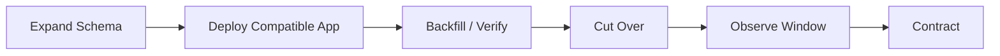

Do not merge expand, cutover, and contract into one PR because it destroys your escape routes.

---

## 20. Multi-Service Database Dependencies

Many failures happen because the team changing the database knows only its own service.

Hidden consumers include:

- reporting jobs
- ETL pipelines
- support tools
- BI dashboards
- downstream services
- read-only user scripts
- audit export jobs
- ML feature pipelines
- incident runbooks

A migration review should require consumer discovery.

Evidence sources:

- query logs
- database permissions
- service catalog ownership
- data lineage tooling
- schema registry
- code search
- BI catalog
- access logs

For high-criticality systems, do not accept “we think nobody uses it”.

Require proof or a deprecation window.

---

## 21. Observability for Stateful Change

Every stateful rollout needs telemetry.

### Migration metrics

- migration started/completed/failed
- migration duration
- migration current step
- rows processed
- rows failed
- retry count
- lock wait time
- transaction duration
- database CPU/IO
- replication lag
- connection usage

### Compatibility metrics

- fallback reads
- dual-write mismatch
- shadow-read mismatch
- old column read count
- old API path usage
- old event schema usage

### Business correctness metrics

- failed order creation
- payment reconciliation mismatch
- customer update failures
- case transition failure
- invoice generation errors

Technical success is not enough. A migration can be technically applied and semantically wrong.

---

## 22. Evidence Model

For each stateful change, store evidence.

Evidence bundle:

```yaml
stateful_change_evidence:
  change_id: CHG-2026-0712
  git_commit: abc123
  migration_tool: flyway
  migration_versions:
    - V202607031200__add_display_name.sql
  migration_checksums:
    - sha256:...
  database: customer-prod
  state_before:
    schema_version: 184
  state_after:
    schema_version: 185
  approvals:
    - service-owner
    - db-owner
  backup:
    id: backup-20260703-0100
    restore_test: restore-test-20260702
  verification:
    schema_check: passed
    app_health: passed
    fallback_rate: 0.0
  rollback_boundary:
    crossed: false
```

This evidence is valuable for:

- incident response
- audit
- compliance
- postmortems
- future migrations
- proving segregation of duties

---

## 23. Failure Modes and Recovery

### 23.1 Migration fails before any change

Action:

- keep app rollout blocked
- fix migration
- rerun plan/checks
- no restore needed

### 23.2 Migration partially applies

Action:

- stop automatic retries unless idempotent
- inspect migration history
- inspect actual schema/data
- decide resume, repair, or compensating migration
- record evidence

### 23.3 Migration succeeds but app fails

Action:

- if expanded schema is backward compatible, rollback app
- leave schema expanded
- fix app
- do not contract

### 23.4 Migration causes performance regression

Action:

- disable feature flag if possible
- stop backfill
- drop problematic new index only if safe
- tune query/plan
- scale read replicas if needed
- roll forward with targeted fix

### 23.5 Contract migration breaks hidden consumer

Action:

- restore compatibility if possible
- recreate column/view/alias if feasible
- notify consumer owner
- re-open deprecation process
- strengthen usage detection

### 23.6 Backup restore required

Action:

- declare incident
- freeze writes or define write-loss policy
- estimate RPO impact
- restore to separate environment first if possible
- reconcile post-restore state with Git/IaC
- document lost/compensated transactions

Restoring a database is not a local action. It is a business continuity decision.

---

## 24. Database Change and GitOps Controller Interaction

GitOps controllers reconcile Kubernetes resources. They do not understand relational compatibility unless you model it.

Bad design:

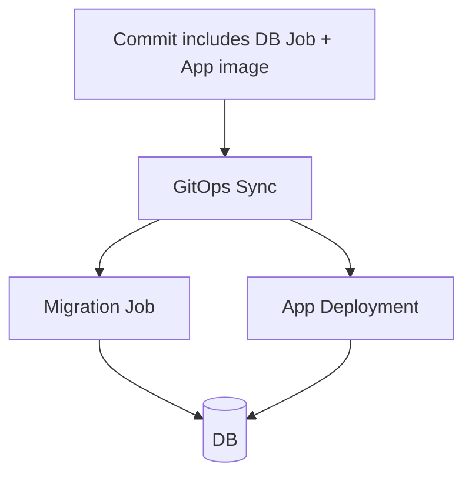

The app may start before migration is safe, unless sync waves, readiness gates, or pipeline sequencing enforce order.

Better design:

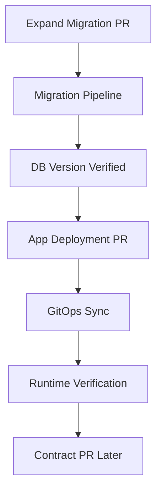

This is less “magical” but much safer.

---

## 25. Patterns for Regulated Systems

For regulated systems, stateful changes need defensibility.

Minimum control set:

- every migration linked to change request/story
- migration reviewed by service owner
- destructive migration reviewed by data owner
- production apply identity is not a human laptop
- backup and restore evidence for high-risk changes
- migration result recorded in immutable log
- old/new schema versions captured
- approval bound to commit/checksum
- emergency change path creates retroactive evidence
- data retention changes require compliance review

The pipeline should answer:

1. Who approved this durable mutation?
2. What exactly changed?
3. When did it change?
4. Which identity executed it?
5. What did the system look like before and after?
6. What verification proved it was safe?
7. What recovery path existed?

---

## 26. A Production Example

Scenario:

A `case_management` service needs to split `case.assignee` into `assignee_user_id` and `assignee_group_id`.

### Bad migration

```sql
ALTER TABLE case_file DROP COLUMN assignee;
ALTER TABLE case_file ADD COLUMN assignee_user_id uuid;
ALTER TABLE case_file ADD COLUMN assignee_group_id uuid;
```

Problems:

- drops old data
- old app cannot run
- unclear mapping
- no backfill
- no fallback
- no consumer compatibility

### Safe migration plan

Step 1 — expand:

```sql
ALTER TABLE case_file ADD COLUMN assignee_user_id uuid;
ALTER TABLE case_file ADD COLUMN assignee_group_id uuid;
```

Step 2 — deploy transition app:

- writes both old `assignee` and new columns
- reads new columns if present
- falls back to old column
- emits fallback metric

Step 3 — backfill:

- process batches by primary key
- parse old assignee value
- populate new columns
- record unknown/malformed records

Step 4 — verify:

- fallback rate zero
- mismatch count zero
- reporting consumers updated
- support tools updated

Step 5 — cutover:

- app reads only new columns
- old column remains for rollback window

Step 6 — contract:

```sql
ALTER TABLE case_file DROP COLUMN assignee;
```

Only Step 6 is destructive. It should be a separate PR.

---

## 27. Anti-Patterns

### Anti-pattern: one PR does everything

Expand, app change, backfill, and contract in one PR removes rollback paths.

### Anti-pattern: migration in app startup with broad privileges

App runtime identity should not usually own DDL privileges in production.

### Anti-pattern: “backup exists” as rollback plan

Backup restore may be too slow or may lose valid writes.

### Anti-pattern: Git revert after data mutation

Reverting Git does not revert data.

### Anti-pattern: hidden manual DBA migration

Manual changes bypass Git, migration history, and evidence.

### Anti-pattern: no compatibility telemetry

Without fallback/mismatch metrics, the team cannot know when it is safe to contract.

### Anti-pattern: contract too early

The old shape should remain through a defined rollback/deprecation window.

### Anti-pattern: treating Kafka retention as config-only

Retention decrease can delete durable replay history.

---

## 28. Implementation Blueprint

A pragmatic implementation for a platform team:

```text
repo/
  services/
    case-management/
      db/
        flyway/
          V2026070301__expand_assignee_columns.sql
          V2026071701__contract_old_assignee.sql
      release/
        migration-metadata.yaml
  policy/
    stateful-change.rego
  pipelines/
    plan-stateful-change.yaml
    apply-migration.yaml
```

`migration-metadata.yaml`:

```yaml
change_id: CHG-2026-0712
service: case-management
database: case-management-prod
classification: R3
phase: expand
expected_runtime: 3m
requires_backup: true
backup_restore_test: restore-test-20260702
compatibility:
  old_app_works_after: true
  old_app_works_after_contract: false
observability:
  required_metrics:
    - assignee_fallback_read_total
    - assignee_backfill_mismatch_total
approvals:
  required:
    - service-owner
    - db-owner
```

Pipeline gates:

1. Detect migration file.
2. Parse SQL for risky operations.
3. Load migration metadata.
4. Enrich with table size and data class.
5. Run policy.
6. Run rehearsal if required.
7. Require owner approvals.
8. Execute migration under migration identity.
9. Store evidence.
10. Unlock app rollout.

---

## 29. Mermaid: End-to-End Stateful Release

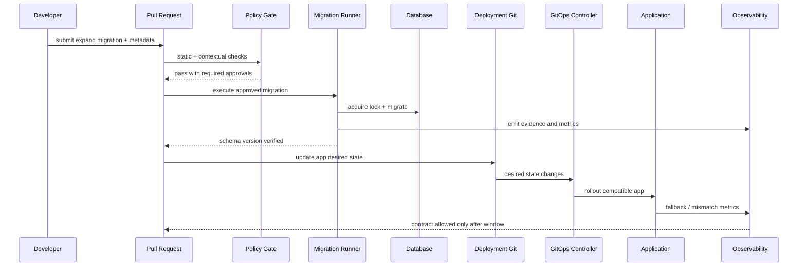

---

## 30. Practice Lab

Design a safe migration for this change:

> The `orders` service currently stores shipping address as a JSON blob in `orders.shipping_address`. The new design moves address fields to normalized table `order_shipping_address` with one row per order.

Deliverables:

1. Reversibility classification.
2. Expand migration.
3. App compatibility strategy.
4. Backfill strategy.
5. Cutover metric.
6. Contract migration.
7. Failure recovery plan.
8. Policy gates.
9. Evidence bundle.

Suggested answer shape:

```yaml
stateful_change:
  class: R3
  phase_sequence:
    - expand
    - dual-write
    - backfill
    - shadow-read
    - cutover
    - contract
  rollback_boundary: "after cutover if new writes are not mirrored back"
```

---

## 31. Production Checklist

Before merging a stateful change:

- [ ] Durable systems are listed.
- [ ] Reversibility class is declared.
- [ ] Expand/contract phase is declared.
- [ ] Compatibility matrix is present.
- [ ] Backward compatibility is proven or risk-accepted.
- [ ] Static migration checks passed.
- [ ] Table/resource size is known.
- [ ] Lock/runtime impact is estimated.
- [ ] Backup/restore evidence exists if required.
- [ ] Data owner approval exists for destructive changes.
- [ ] Migration identity is least-privileged.
- [ ] Retry behavior is safe.
- [ ] Observability metrics are defined.
- [ ] App rollout sequencing is explicit.
- [ ] Contract is separated from expand where possible.
- [ ] Evidence will be stored.

---

## 32. Key Takeaways

Stateful GitOps is not about putting database migrations in Git and hoping reconciliation solves everything.

The mature model is:

- classify durable transitions
- preserve compatibility windows
- separate expand from contract
- bind approval to exact artifacts
- run migrations through controlled identities
- observe semantic correctness
- store evidence
- design repair paths before failure

The most important rule:

> Git can revert desired state, but only your migration design can preserve a safe path through durable state.

---

## References

- Redgate Flyway documentation: migration concepts, versioned/repeatable/undo migrations, callbacks, and migration history behavior.
- Liquibase documentation: changelogs, changesets, preconditions, rollback commands, and `DATABASECHANGELOG` tracking.
- Kubernetes documentation: Jobs, rollout behavior, PersistentVolume/PersistentVolumeClaim lifecycle, and declarative resource management.
- OpenGitOps principles: declarative desired state, versioned and immutable state, automatic pull-based agents, and continuous reconciliation.
- Argo CD and Flux documentation: sync/reconciliation behavior, hooks, Kustomization/HelmRelease status, and operational observability.
