# Part 034 — Multi-Cluster, Multi-Account, Multi-Region Design

A single cluster is an environment.

A fleet is a system.

Once an organization runs many clusters, accounts, regions, tenants, and compliance zones, GitOps/IaC design becomes less about YAML and more about control-plane architecture. You are no longer asking, “How do I deploy this app?” You are asking, “How do I keep a distributed estate convergent, isolated, auditable, and recoverable without turning every cluster into a snowflake?”

This part builds the design model for multi-cluster, multi-account, and multi-region GitOps/IaC.

The key idea:

> Fleet architecture is blast-radius engineering.

A good fleet design lets teams move fast locally while preventing one mistake, one compromised credential, one bad policy, one broken controller, or one destructive IaC apply from damaging the entire platform.

---

## 1. Why Multi-Cluster/Multi-Account Is Hard

The naive view:

> “We just repeat the same pipeline for every cluster/account.”

That works for demos. It fails in enterprises.

At fleet scale, every axis multiplies complexity:

```text
services × environments × regions × accounts × clusters × tenants × policies × controllers
```

If you have:

- 80 services
- 4 environments
- 3 regions
- 5 account classes
- 20 clusters
- 12 shared platform components

You are not managing “some deployments”. You are managing thousands of state transitions.

Failure modes change:

- bad global policy blocks every cluster
- compromised CI identity reaches too many accounts
- one GitOps controller has permission over unrelated tenants
- cluster bootstrap differs by region
- production account cannot be recreated because manual steps were never encoded
- drift detection becomes noisy
- promotion order becomes unclear
- audit evidence is scattered
- platform team becomes a bottleneck

The answer is not more scripts. The answer is stronger boundaries.

---

## 2. Isolation Axes

Fleet design starts by choosing isolation boundaries.

| Boundary | What It Isolates | Cost |
|---|---|---|
| Cloud account/subscription/project | IAM, billing, quotas, blast radius, audit | more accounts and governance |
| Region | latency, residency, disaster domains | duplication and routing complexity |
| Cluster | Kubernetes API, nodes, workloads, policies | operational overhead |
| Namespace | tenants inside a cluster | weaker than cluster/account isolation |
| Git repository | change ownership and approval | repo sprawl if overused |
| IaC state file | mutation boundary | dependency complexity |
| GitOps controller | reconciliation authority | more controllers to operate |
| Identity role | permission boundary | IAM management complexity |
| Network segment | traffic and egress boundary | routing and observability complexity |

There is no universal best boundary.

The right boundary depends on:

- blast radius tolerance
- regulatory constraints
- team autonomy
- workload criticality
- data classification
- network isolation needs
- cost ownership
- operational maturity

The engineering task is to choose the cheapest boundary that still provides the required protection.

---

## 3. The Fleet Mental Model

A fleet platform has several control planes.

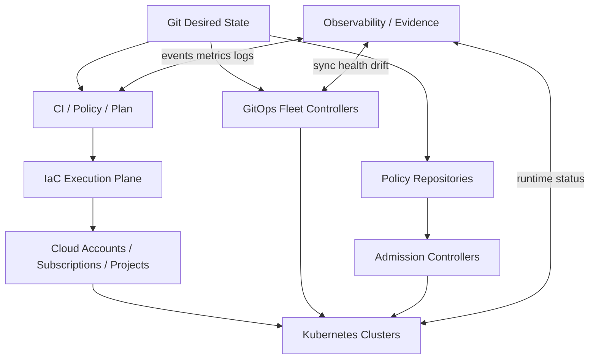

You need to know which control plane owns which state:

| State | Owner |
|---|---|
| Cloud account vending | IaC/platform control plane |
| Network baseline | IaC/platform control plane |
| Cluster lifecycle | Cluster API/IaC/managed service tooling |
| GitOps controller install | bootstrap pipeline |
| App desired state | app/platform Git repos |
| Admission policy | policy Git repo + cluster policy controller |
| Runtime objects | GitOps controllers, within boundary |
| Secrets | secret manager + external secret controller |
| Audit evidence | evidence/logging platform |

A common failure is having two controllers believe they own the same object.

Examples:

- Terraform manages a Kubernetes namespace while Argo CD also manages it.
- Helm release is managed by Flux and by Argo CD.
- Cloud IAM role is managed by Terraform and Crossplane.
- Cluster bootstrap is managed by both shell script and GitOps.

Fleet rule:

> Every resource must have exactly one authoritative mutation owner.

---

## 4. Account, Cluster, Namespace: Choosing the Boundary

### 4.1 Account-level isolation

Cloud accounts/subscriptions/projects are strong boundaries.

Use account isolation for:

- production vs non-production
- regulated data
- tenant isolation when tenants are high risk/high value
- shared security/logging accounts
- network transit accounts
- workload classes with different compliance posture
- disaster recovery environments

Benefits:

- IAM blast radius control
- billing separation
- service quota separation
- audit separation
- network segmentation
- clearer ownership

Costs:

- account vending lifecycle
- cross-account networking
- identity federation complexity
- shared service access
- more IaC state boundaries

### 4.2 Cluster-level isolation

Use cluster isolation for:

- workload criticality tiers
- noisy-neighbor control
- Kubernetes version/upgrade isolation
- different admission/security policies
- tenant isolation stronger than namespace
- regulatory zones
- regional workload placement

Benefits:

- independent Kubernetes API failure domain
- independent controller failure domain
- easier cluster-level policy variation
- safer upgrades

Costs:

- more control planes
- more observability targets
- more GitOps controller instances
- more base addons
- capacity fragmentation

### 4.3 Namespace-level isolation

Use namespace isolation for:

- lower-risk tenants
- shared internal platforms
- ephemeral environments
- team sandboxes
- cost-efficient non-production workloads

Benefits:

- efficient resource sharing
- lower operational overhead
- simple onboarding

Costs:

- weaker isolation
- policy complexity
- cluster-wide resource contention
- shared failure domain
- harder noisy-neighbor control

Namespace isolation is not a replacement for account/cluster isolation when data and trust boundaries are strong.

---

## 5. Fleet Topologies

### 5.1 Centralized hub-spoke GitOps

One central GitOps control plane manages many remote clusters.

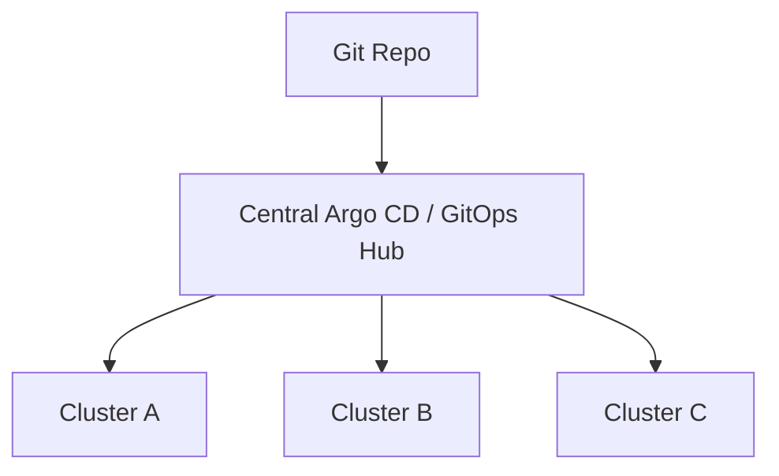

Advantages:

- central visibility
- centralized RBAC and app inventory
- easier platform governance
- fewer controller installations

Risks:

- hub becomes high-value target
- hub outage affects management plane
- cross-cluster credentials concentrated
- network connectivity required from hub to clusters
- blast radius of misconfiguration can be large

Good fit:

- centralized platform teams
- moderate fleet size
- strong hub security
- clusters reachable from management plane

### 5.2 Per-cluster pull GitOps

Each cluster runs its own GitOps controller and pulls desired state.

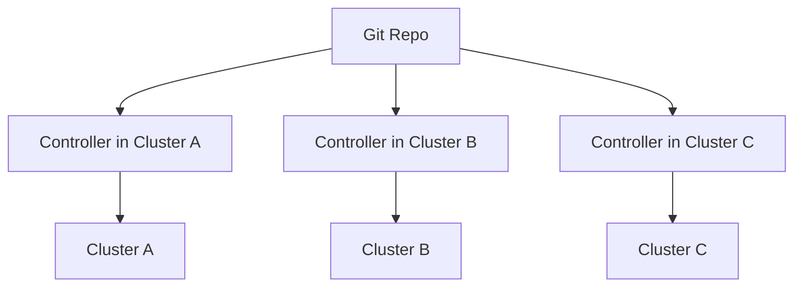

Advantages:

- strong pull model
- no central controller credential over all clusters
- cluster autonomy
- resilient to central management outage after Git is reachable
- good for edge/private networks

Risks:

- visibility is more distributed
- controller upgrades must be orchestrated
- policy drift if bootstrap is weak
- per-cluster debugging overhead

Good fit:

- large fleets
- restricted networks
- zero-trust posture
- multi-region autonomous operation

### 5.3 Hybrid topology

Central control for inventory/visibility, local controllers for apply.

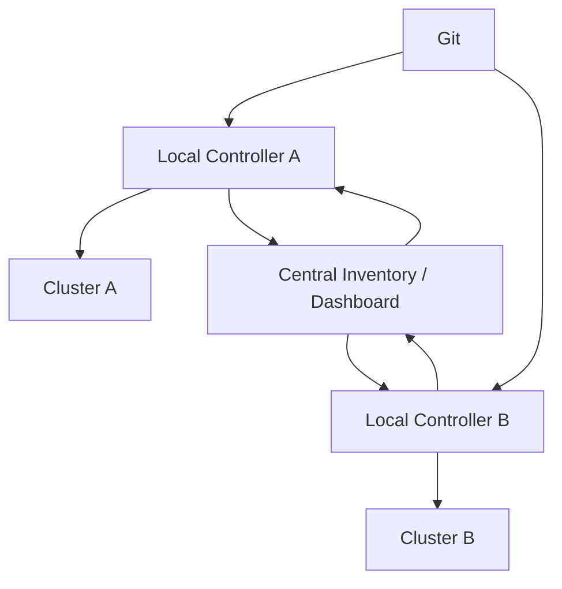

Advantages:

- local blast-radius control
- central observability
- scalable governance
- good security posture

Costs:

- more architecture
- standardization required
- inventory/evidence model must be designed

This is often the most mature pattern.

---

## 6. GitOps Fleet Generation

At fleet scale, hand-writing one application manifest per app per cluster does not scale.

You need generation with guardrails.

### Argo CD ApplicationSet-style generation

ApplicationSet can generate Argo CD `Application` resources from clusters, Git directories, lists, matrices, pull requests, and other sources.

Typical use:

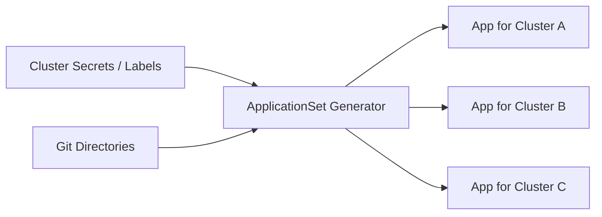

Useful when:

- one platform component must be deployed to many clusters
- cluster labels determine placement
- app/environment matrix is large
- central Argo CD is used

Guardrails:

- do not let arbitrary labels deploy privileged components
- require cluster enrollment approval
- define allowed target namespaces
- restrict generator source repos
- use AppProjects to limit destinations and sources
- review generated blast radius before merge

### Flux-style composable reconciliation

Flux uses source and reconciliation objects such as `GitRepository`, `Kustomization`, and `HelmRelease`. Multi-tenancy can be achieved with namespace/RBAC/service-account boundaries.

Useful when:

- each cluster pulls its own config
- teams own separate repos
- per-tenant service accounts restrict apply permissions
- cluster-local autonomy matters

Guardrails:

- lock down cross-namespace references
- use service account impersonation for tenant reconciliation
- restrict source repositories
- enforce namespace boundaries
- standardize bootstrap components

---

## 7. Cluster Lifecycle Management

There are several ways to manage clusters.

### 7.1 Managed service IaC

Terraform/OpenTofu manages EKS/AKS/GKE or equivalent managed clusters.

Pros:

- familiar IaC workflow
- clear cloud resource state
- good for account/network/cluster bootstrap

Cons:

- cluster upgrades can be complex
- add-on lifecycle may split between IaC and GitOps
- Kubernetes objects in Terraform can create ownership conflicts

### 7.2 Cluster API

Cluster API provides declarative APIs and tooling for provisioning, upgrading, and operating multiple Kubernetes clusters.

Pros:

- Kubernetes-native cluster lifecycle
- declarative cluster resources
- provider ecosystem
- fits control-plane pattern

Cons:

- management cluster becomes critical
- provider maturity varies
- operational complexity is non-trivial

### 7.3 Crossplane control plane

Crossplane can expose platform APIs as Kubernetes custom resources and compose managed resources across providers.

Pros:

- platform APIs via composite resources
- good self-service model
- Kubernetes-native reconciliation for cloud resources
- composition can hide infrastructure complexity

Cons:

- another control plane
- provider drift/failure modes must be understood
- not always the right fit for low-level account bootstrap

### 7.4 Cloud-native landing zone services

AWS Control Tower, Azure Landing Zones, Google Cloud organization/folder/project automation, or internal account vending systems.

Pros:

- strong governance baseline
- standardized identity/network/logging/security
- aligns with cloud provider best practices

Cons:

- can be opinionated
- still needs Git/IaC integration
- may not cover app/platform-specific resources

The mature answer may combine them:

- landing zone for account baseline
- Terraform/OpenTofu for foundational network/IAM
- Cluster API or cloud-managed IaC for cluster lifecycle
- GitOps for cluster add-ons and apps
- Crossplane for self-service platform APIs

---

## 8. Bootstrap Sequence

Bootstrap is where many fleets become snowflakes.

A cluster or account should be reproducible through staged bootstrap.

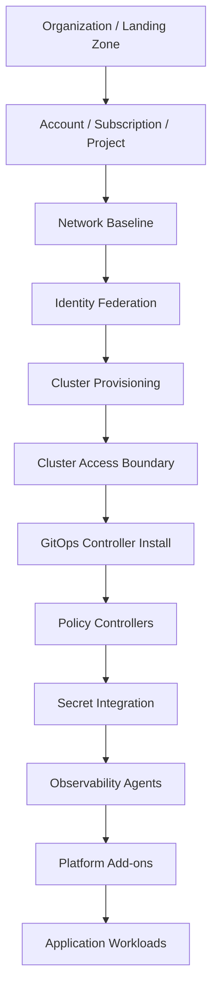

Recommended phases:

### Phase 0 — Organization baseline

- organization units/folders
- account vending
- billing/cost tags
- identity provider
- audit logging
- security baseline
- network topology

### Phase 1 — Account baseline

- account roles
- OIDC trust
- log forwarding
- KMS keys
- baseline SCP/policy
- network attachments
- state backend access

### Phase 2 — Cluster baseline

- cluster creation
- node pools
- encryption
- API access controls
- cluster admin role mapping
- private endpoint config
- baseline network policies

### Phase 3 — GitOps bootstrap

- install GitOps controller
- configure repo access
- set controller identity
- register cluster inventory
- apply AppProject/tenant boundaries

### Phase 4 — Security and observability

- admission policy
- image verification
- external secret integration
- metrics/log agents
- audit pipeline
- policy exceptions namespace

### Phase 5 — Platform add-ons

- ingress/gateway
- cert-manager
- DNS integration
- service mesh if needed
- autoscaling
- storage drivers

### Phase 6 — Tenant/app onboarding

- namespaces
- quotas
- RBAC
- service accounts
- app GitOps bindings
- secrets access
- SLO dashboard

Do not let application teams depend on undocumented bootstrap steps.

---

## 9. Cluster Inventory as a First-Class API

At fleet scale, cluster inventory is not a spreadsheet.

It is a control-plane API.

Minimum cluster metadata:

```yaml
cluster:
  name: prod-ap-southeast-1-payments-01
  environment: prod
  region: ap-southeast-1
  cloud: aws
  account: payments-prod
  data_classification: pci
  owner: payments-platform
  tier: tier-0
  kubernetes_version: "1.32"
  gitops:
    engine: argocd
    controller_mode: local
  policies:
    baseline: restricted
    image_verification: required
  networking:
    ingress_class: private-gateway
    egress_policy: restricted
  lifecycle:
    created_at: "2026-06-01"
    decommission_after: null
```

Inventory drives:

- placement
- policy selection
- promotion targeting
- observability grouping
- cost reporting
- incident impact analysis
- upgrade scheduling
- compliance evidence

If inventory is inaccurate, fleet automation becomes dangerous.

---

## 10. Repository Layout for Fleets

A workable layout:

```text
platform-live/
  accounts/
    prod-payments/
      account.yaml
      network/
      iam/
      clusters/
        prod-ap-southeast-1-payments-01/
          cluster.yaml
          bootstrap.yaml
  clusters/
    prod-ap-southeast-1-payments-01/
      base/
      policies/
      addons/
      tenants/
  apps/
    payments-api/
      overlays/
        prod-ap-southeast-1/
        prod-ap-northeast-1/
  fleet/
    inventory/
      clusters.yaml
    placement/
      platform-addons.yaml
      tier0-apps.yaml
  policy/
    baseline/
    pci/
    prod/
```

But folder layout is less important than ownership.

Recommended ownership boundaries:

| Area | Owner |
|---|---|
| account baseline | platform/cloud team |
| cluster lifecycle | platform team |
| GitOps controller config | platform team |
| cluster baseline policies | security/platform |
| app deployment config | service team within platform guardrails |
| placement policy | platform + service owner |
| tenant namespace/quota | platform + tenant owner |
| secrets access | security + service owner |

Avoid giving one team write access to every layer unless they are the platform control-plane owner.

---

## 11. Placement Model

Placement answers: where should this workload run?

Inputs:

- environment
- region
- cluster capability
- data classification
- latency requirement
- tenant/customer residency
- cost/capacity
- compliance requirement
- workload tier
- dependency locality

Placement should be declarative.

Example:

```yaml
placement:
  app: payments-api
  environment: prod
  selector:
    regions:
      - ap-southeast-1
      - ap-northeast-1
    cluster_labels:
      tier: tier-0
      pci: "true"
      ingress: private
  strategy:
    mode: active-active
    min_regions: 2
    max_clusters_per_region: 2
```

The placement controller/generator translates this into concrete GitOps targets.

Anti-pattern:

```yaml
clusters:
  - prod-01
  - prod-02
  - prod-03
```

Static lists are fine at small scale but become brittle when clusters are created, drained, upgraded, or decommissioned.

---

## 12. Promotion Across a Fleet

Promotion in a fleet is a controlled wave.

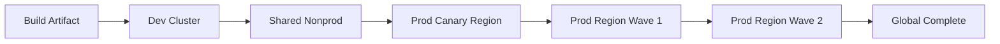

A good promotion system supports:

- environment ordering
- region waves
- canary clusters
- pause points
- automated analysis gates
- manual approval at risk boundaries
- rollback/rollforward per wave
- evidence per target

Promotion unit must be immutable:

```yaml
promotion_unit:
  app: payments-api
  image_digest: sha256:...
  helm_chart_digest: sha256:...
  config_commit: abc123
  sbom: sha256:...
  provenance: sha256:...
```

Do not rebuild per region.

Build once, promote the same artifact.

---

## 13. Multi-Region Design

Multi-region is not just “deploy to two places”.

You must define the operating mode.

| Mode | Description | Complexity |
|---|---|---|
| Backup/restore | restore in second region after disaster | low runtime, high recovery time |
| Pilot light | minimal warm infrastructure | medium |
| Warm standby | scaled-down full stack | medium-high |
| Active-passive | one region serves, one ready | high |
| Active-active | multiple regions serve traffic | very high |

GitOps/IaC must model:

- regional desired state
- global resources
- DNS/traffic routing
- data replication
- failover decision
- region evacuation
- consistency model
- secrets/key replication
- observability per region
- evidence per region

### Active-passive

Simpler than active-active but still needs rehearsal.

Questions:

- how is passive kept warm?
- what data lag is acceptable?
- who triggers failover?
- is failover automated or manual?
- how is DNS updated?
- how is split-brain prevented?
- how do you fail back?

### Active-active

Hard because writes and state coordination are distributed.

Questions:

- can the domain tolerate eventual consistency?
- where is source of truth?
- how are conflicts resolved?
- how are idempotency keys shared?
- are workflows region-pinned?
- how are global rate limits enforced?
- what happens when one region is partitioned?

GitOps can deploy the shape. It does not solve distributed data semantics.

---

## 14. Multi-Account Design

A multi-account design should separate concerns.

Common account classes:

```text
organization-root
security-audit
log-archive
network-transit
shared-services
platform-tools
nonprod-workloads
prod-workloads
regulated-prod-workloads
sandbox
breakglass
```

For workload accounts, define account vending as a product.

Account request contract:

```yaml
account_request:
  name: payments-prod
  environment: prod
  owner: payments-platform
  data_classification: pci
  region_set:
    - ap-southeast-1
    - ap-northeast-1
  network_profile: private-service
  baseline_policy: prod-restricted
  budget_owner: payments
  gitops_enabled: true
```

Account vending output:

- account ID/subscription/project ID
- baseline roles
- OIDC trust
- state backend access
- network attachments
- audit logging
- KMS keys
- default policies
- cluster provisioning permissions

The platform should make account creation boring.

---

## 15. Identity at Fleet Scale

Identity must be scoped by environment, account, cluster, and task.

Bad pattern:

```text
one-ci-role-admin-everywhere
```

Better pattern:

```text
ci-plan-nonprod
ci-apply-dev-network
ci-apply-prod-payments-cluster
gitops-prod-payments-cluster-reader
gitops-prod-payments-app-applier
external-secrets-prod-payments-reader
breakglass-prod-platform-admin
```

Identity dimensions:

- who is calling?
- from which repo/workflow/controller?
- for which environment?
- for which account/cluster?
- with what claims?
- for what action?
- with what approval?

OIDC federation is powerful because it lets the cloud provider trust specific workload identity claims rather than long-lived static secrets.

But OIDC trust policies must be narrow.

Do not trust an entire GitHub/GitLab organization if only one repo/workflow should apply production changes.

---

## 16. GitOps Controller Identity

A GitOps controller is a production actor.

It should not have unlimited cluster-admin everywhere.

Model controller identity by scope:

| Controller | Scope | Permissions |
|---|---|---|
| platform-baseline controller | cluster baseline | cluster-scoped platform resources |
| tenant controller | namespace/team | namespace-scoped resources |
| app controller | application namespace | Deployment/Service/etc. only |
| policy controller | admission policy | policy CRDs only |

Argo CD supports project-level restrictions that can constrain source repos, destinations, namespaces, and resource kinds. Flux can reconcile using service accounts and namespace/RBAC isolation.

The design goal:

> A compromised tenant repo should not be able to mutate platform-wide resources.

---

## 17. Policy Distribution Across Fleets

Policy should roll out in waves too.

Bad pattern:

```text
apply new restrictive policy globally to all clusters at once
```

Good pattern:

1. Audit mode in dev.
2. Audit mode in nonprod fleet.
3. Enforce mode in dev.
4. Enforce mode in nonprod.
5. Enforce mode in prod canary cluster.
6. Enforce mode in prod wave 1.
7. Enforce mode globally.

Policy metadata:

```yaml
policy_rollout:
  name: require-image-digest
  mode: audit
  target_selector:
    environment: nonprod
  success_criteria:
    violation_rate_below: 0.01
    no_tier0_blocking: true
```

Policy failures can become fleet outages. Treat policy as production software.

---

## 18. Secrets Across Clusters and Regions

Fleet secrets design must answer:

- where is the source of secret truth?
- how are secrets replicated across regions?
- how are KMS keys managed?
- how does a cluster read only its secrets?
- how are rotations coordinated?
- how are secret reads audited?
- what happens during regional outage?
- how are bootstrap secrets handled?

Patterns:

### Central secret manager

All clusters read from central secret manager.

Pros:

- central governance
- simple rotation
- single audit surface

Cons:

- cross-region dependency
- outage blast radius
- latency
- data residency concerns

### Regional secret managers

Secrets are replicated to regional stores.

Pros:

- regional autonomy
- better resilience
- data residency alignment

Cons:

- replication complexity
- consistency management
- more keys and policies

### Git-encrypted secrets

SOPS/age/KMS-encrypted secrets in Git.

Pros:

- Git-native
- reviewable desired state
- good for bootstrap/static secrets

Cons:

- rotation can be awkward
- decrypted secret still exists in cluster
- not ideal for dynamic credentials

Most mature platforms combine these:

- Git-encrypted bootstrap values
- external secret operator for runtime secrets
- cloud/Vault dynamic credentials where possible
- regional secret stores for resilience

---

## 19. Observability for Fleets

Single-cluster dashboards do not scale.

Fleet observability should aggregate by:

- environment
- region
- account
- cluster
- tenant
- app
- controller
- policy baseline
- release wave

Key metrics:

```text
fleet_cluster_ready_ratio
fleet_gitops_sync_lag_seconds
fleet_gitops_out_of_sync_count
fleet_policy_violation_count
fleet_controller_error_rate
fleet_cluster_upgrade_age_days
fleet_secret_sync_failure_count
fleet_image_verification_failure_count
fleet_promotion_wave_duration_seconds
fleet_drift_open_count
```

Questions a platform dashboard must answer quickly:

1. Which clusters are not converging?
2. Which apps are degraded in which regions?
3. Which policy is blocking the most workloads?
4. Which clusters are on unsupported Kubernetes versions?
5. Which accounts have drift?
6. Which release wave is paused?
7. Which controller identity produced a failed mutation?
8. Which clusters are missing baseline components?

---

## 20. Fleet Drift

There are several drift types.

| Drift Type | Example | Detection |
|---|---|---|
| Account drift | missing baseline role | IaC plan/scan |
| Network drift | route table changed manually | IaC refresh/drift detector |
| Cluster drift | addon version differs | GitOps health/diff |
| Policy drift | cluster missing admission rule | policy inventory |
| Secret drift | secret sync failed | external secret status |
| Version drift | cluster old Kubernetes version | cluster inventory |
| Placement drift | app missing from target cluster | fleet generator status |
| Runtime drift | manual kubectl patch | GitOps diff |

Fleet drift must be prioritized by risk, not volume.

A nonprod namespace label drift is not equal to a missing production audit sink.

---

## 21. Upgrade Strategy

Fleet upgrades include:

- Kubernetes version
- node image
- GitOps controller version
- policy controller version
- service mesh/gateway
- CSI/CNI drivers
- admission policies
- Terraform/OpenTofu provider versions
- Crossplane providers
- Cluster API providers

Use waves.

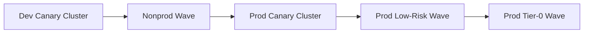

Upgrade gate checks:

- cluster health
- controller health
- policy violation rate
- workload restart/error rate
- node readiness
- admission latency
- GitOps sync lag
- SLO impact

Do not upgrade the whole fleet at once unless the blast radius is intentionally accepted.

---

## 22. Multi-Cluster Networking

GitOps can manage network intent, but networking failures are often immediate and broad.

Fleet networking concerns:

- ingress routing
- east-west service communication
- private endpoints
- DNS delegation
- service mesh federation
- egress control
- network policy
- cloud firewall/security groups
- transit gateway/VPC peering
- cross-region latency

Questions:

- does every cluster need to talk to every other cluster?
- are services globally addressable or region-local?
- where is TLS terminated?
- who owns DNS records?
- how are failover records changed?
- how are network policies tested before enforcement?

Network changes deserve the same plan/apply/policy/evidence discipline as compute changes.

---

## 23. Tenancy Model

Tenancy can mean different things.

| Tenancy Type | Meaning |
|---|---|
| Team tenancy | multiple engineering teams share platform |
| Customer tenancy | customer workloads/data separated |
| Environment tenancy | dev/stage/prod boundaries |
| Compliance tenancy | PCI/PII/regulatory zones |
| Runtime tenancy | shared cluster/namespace/node pools |
| Control-plane tenancy | who can mutate desired/live state |

The strongest warning:

> Namespace tenancy is not customer isolation unless the threat model accepts shared cluster control-plane risk.

For high-value customer or regulated isolation, account/cluster boundaries are usually more defensible.

---

## 24. Platform Add-On Deployment

Every cluster needs baseline add-ons.

Examples:

- CNI/CSI drivers
- ingress/gateway controller
- external-dns
- cert-manager
- metrics/logging agents
- policy controller
- secret operator
- autoscaler
- image verification
- runtime security agent
- service mesh components

Add-ons should be deployed in dependency order.

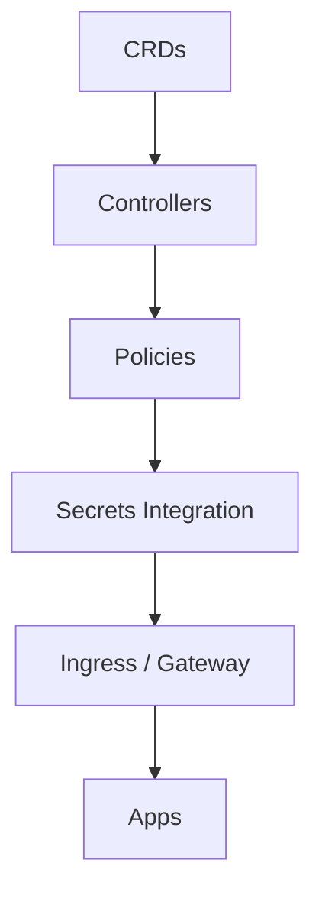

Avoid app rollout before baseline is healthy.

Add-on failure should block application onboarding in that cluster.

---

## 25. Failure Modes

### 25.1 Bad global policy blocks all clusters

Containment:

- rollout policies in waves
- start audit mode
- maintain emergency exception path
- version policy packages
- test with representative manifests

### 25.2 Central GitOps hub compromised

Containment:

- least privilege destinations
- AppProject boundaries
- cluster-scoped credentials separated
- admission policy blocks dangerous resources
- require signed manifests/artifacts
- monitor abnormal sync patterns

### 25.3 One cluster diverges from fleet baseline

Containment:

- detect baseline drift
- reconcile baseline components
- mark cluster unschedulable for new promotions
- repair or rebuild cluster

### 25.4 Account vending creates incomplete account

Containment:

- account readiness checks
- baseline conformance test
- block cluster creation until ready
- evidence store for vending output

### 25.5 Region outage during promotion

Containment:

- promotion wave can pause per region
- release state is per target
- traffic manager understands failed region
- global completion does not require unreachable region unless policy says so

### 25.6 Git provider outage

Containment:

- local controllers continue running current state
- new changes pause
- emergency procedure documented
- no hidden manual mutation without evidence

### 25.7 Controller upgrade breaks reconciliation

Containment:

- canary controller upgrade
- preserve rollback manifests
- monitor sync lag/error rate
- avoid simultaneous controller + policy + app upgrades

---

## 26. Decommissioning

Fleet design must include deletion.

Cluster/account decommissioning is dangerous because it can delete logs, backups, keys, or evidence.

Decommission state machine:

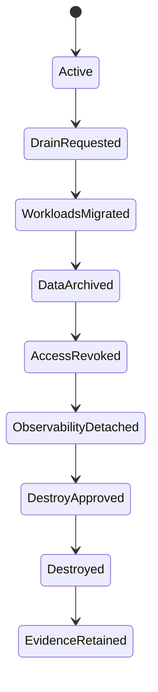

Do not let `terraform destroy` be the first decommission step.

Checklist:

- no workloads remain
- DNS/traffic removed
- backups retained or transferred
- audit logs retained
- secrets revoked
- identities disabled
- cost owner notified
- GitOps target removed
- cluster/account deleted
- evidence retained

---

## 27. Compliance and Evidence Across Fleets

For audit, you need fleet-wide evidence.

Evidence dimensions:

- account baseline applied
- cluster baseline applied
- policy version per cluster
- GitOps controller version per cluster
- image verification status
- secret sync status
- workload placement decisions
- approvals for production changes
- drift remediation history
- access and mutation logs
- backup/restore tests
- decommission records

A fleet platform should be able to answer:

> Show all production clusters in regulated environments, the policy package version running on each, and any drift exceptions active today.

If this requires manual spreadsheet assembly, the control plane is incomplete.

---

## 28. Reference Architecture

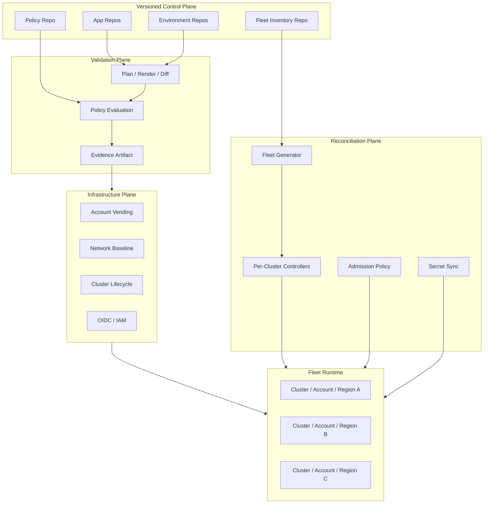

Design property:

- Git describes intent.
- CI validates and produces evidence.
- IaC provisions accounts/networks/clusters.
- GitOps reconciles cluster state.
- Policy constrains mutation.
- Inventory drives placement.
- Observability closes the loop.

---

## 29. Implementation Blueprint

A practical phased roadmap:

### Phase 1 — Standardize inventory

- define cluster/account metadata schema
- capture owner, environment, region, data class, tier
- publish inventory to Git
- validate inventory via CI

### Phase 2 — Standardize bootstrap

- one bootstrap path for accounts
- one bootstrap path for clusters
- install GitOps controller consistently
- install baseline policy/secrets/observability consistently

### Phase 3 — Standardize identity

- remove long-lived CI secrets
- adopt OIDC federation
- split plan/apply roles
- scope GitOps controller identities
- define break-glass roles

### Phase 4 — Standardize placement

- define placement selectors
- generate app targets
- support waves
- enforce allowed destinations

### Phase 5 — Standardize drift and evidence

- collect sync/drift data
- store release evidence per target
- expose fleet dashboard
- define drift SLA

### Phase 6 — Standardize failure recovery

- policy rollback procedure
- controller rollback procedure
- cluster rebuild procedure
- account repair procedure
- region evacuation drill

---

## 30. Production Checklist

Before calling your platform “fleet-ready”:

- [ ] Every account has an owner, environment, data class, and baseline policy.
- [ ] Every cluster is in inventory.
- [ ] Cluster bootstrap is reproducible.
- [ ] GitOps controller identity is scoped.
- [ ] App placement is declarative.
- [ ] Production promotion happens in waves.
- [ ] Policies roll out in audit/enforce stages.
- [ ] Secrets have regional and rotation strategy.
- [ ] Cluster upgrades are wave-based.
- [ ] Add-on dependencies are explicit.
- [ ] Drift is detected per account/cluster/app/policy.
- [ ] Evidence is collected per target, not only per PR.
- [ ] Break-glass access is audited and temporary.
- [ ] Decommissioning is a state machine.
- [ ] Multi-region failover is rehearsed.

---

## 31. Anti-Patterns

### Anti-pattern: one admin role for the whole fleet

This is convenient until one compromised workflow owns production.

### Anti-pattern: central controller with unlimited destination permissions

A central hub should not be an unbounded mutation authority.

### Anti-pattern: cluster inventory in spreadsheets

Spreadsheets do not reconcile, validate, or drive policy safely.

### Anti-pattern: global rollout without waves

Global change is global blast radius.

### Anti-pattern: app teams choose arbitrary clusters

Placement must be governed by capability, data class, policy, and ownership.

### Anti-pattern: manual account bootstrap

Manual bootstrap guarantees snowflakes.

### Anti-pattern: namespace isolation for strong tenant threat models

Namespace isolation is useful, but it is not equivalent to account/cluster isolation.

### Anti-pattern: treating decommission as destroy

Destroy is the final step after traffic, data, identity, logs, and evidence are handled.

---

## 32. Practice Lab

Design a fleet architecture for this scenario:

- 30 microservices
- 4 environments: dev, test, staging, prod
- 3 regions: Jakarta, Singapore, Tokyo
- regulated customer data in prod
- separate payments workload with higher controls
- platform team of 8
- 12 application teams
- requirement: production changes must be auditable
- requirement: regional outage should not stop all production traffic

Deliverables:

1. Account/subscription/project layout.
2. Cluster layout.
3. Git repository layout.
4. GitOps controller topology.
5. Identity model.
6. Promotion wave model.
7. Policy distribution model.
8. Secrets strategy.
9. Observability/evidence model.
10. Failure recovery model.

Suggested high-level answer:

```yaml
fleet:
  accounts:
    security: 1
    logging: 1
    network: 1
    shared-services: 1
    nonprod-workloads: 3
    prod-workloads: 3
    payments-prod: 3
  clusters:
    nonprod-shared: per-region
    prod-general: per-region
    prod-payments: per-region-dedicated
  gitops:
    topology: local-controllers-with-central-inventory
  promotion:
    prod_waves:
      - prod-canary-singapore
      - prod-general-wave-1
      - prod-payments-wave-with-manual-approval
```

---

## 33. Key Takeaways

Fleet GitOps/IaC is not repeated single-cluster deployment.

It is a distributed control-plane problem.

The mature model is:

- isolate by account, cluster, namespace, repo, state, identity, and controller
- make cluster/account inventory a first-class API
- generate placement from metadata, not manual lists
- bootstrap accounts and clusters reproducibly
- use wave-based promotion and policy rollout
- scope GitOps identities tightly
- collect evidence per target
- design decommissioning and recovery as state machines

The deepest invariant:

> At fleet scale, the main design unit is not the cluster. It is the blast-radius boundary.

---

## References

- OpenGitOps principles: declarative desired state, versioned/immutable state, automatic pull-based reconciliation, and continuous convergence.
- Argo CD documentation: ApplicationSet controller, cluster generator, AppProject restrictions, sync and multi-cluster deployment patterns.
- Flux documentation: source-controller, Kustomization, HelmRelease, multi-tenancy, namespace/RBAC/service-account isolation.
- Kubernetes Cluster API documentation: declarative APIs and tooling for provisioning, upgrading, and operating multiple Kubernetes clusters.
- Crossplane documentation: CompositeResourceDefinitions, composite resources, claims, providers, and platform control-plane composition.
- AWS Control Tower and cloud landing-zone guidance: multi-account baseline, centralized identity, security logging, and governance controls.
