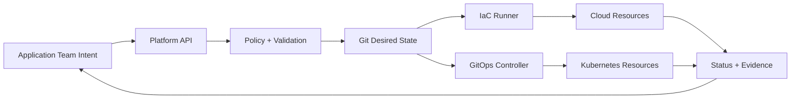
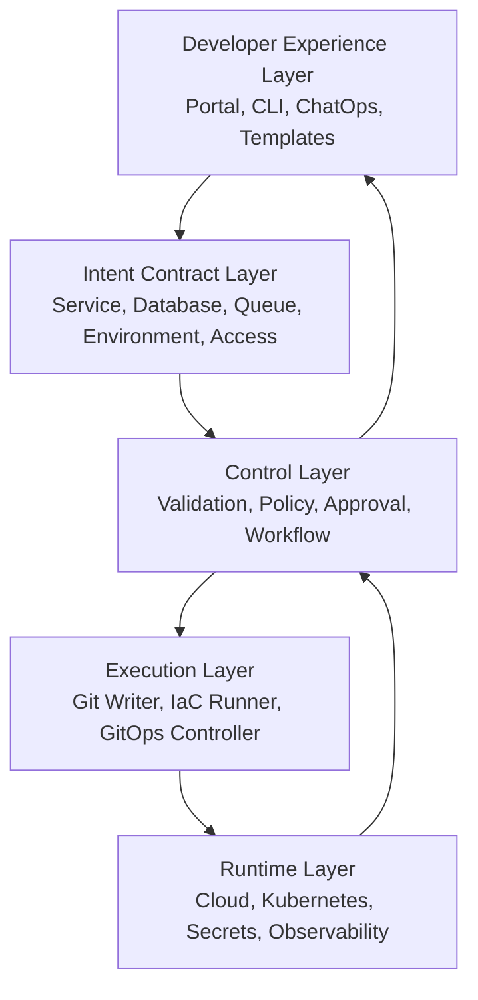
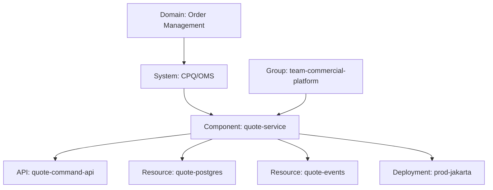
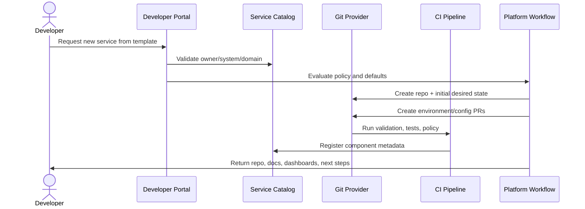
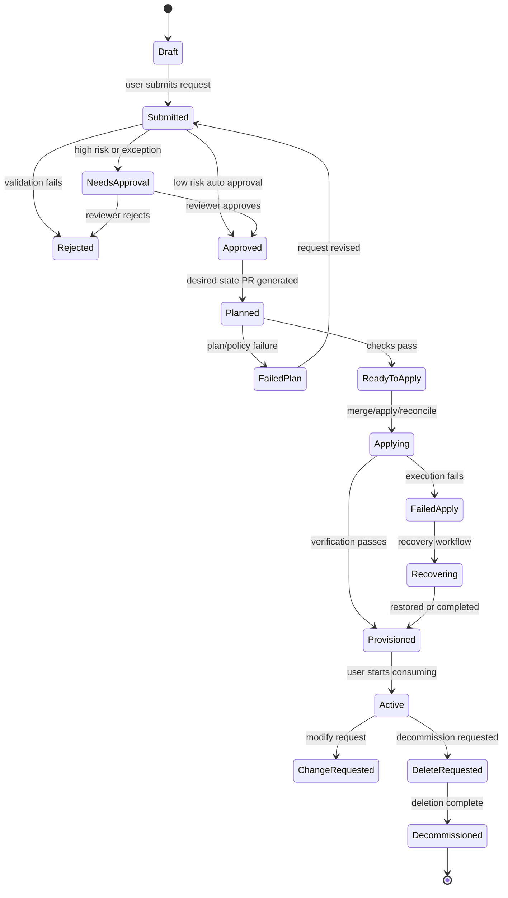
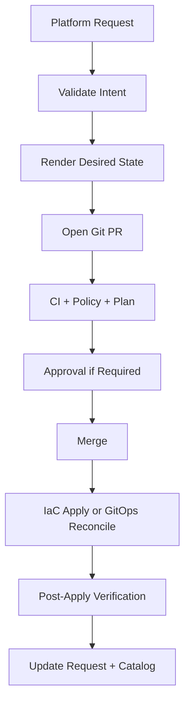
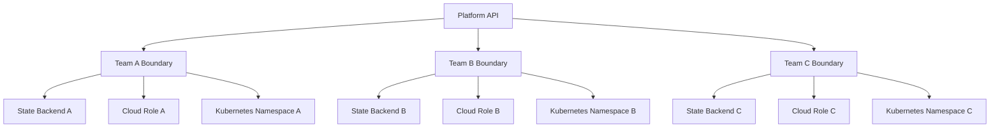

# Part 035 — Platform API and Self-Service Infrastructure

Self-service infrastructure is often misunderstood.

A button that creates a repository is not self-service infrastructure. A form that opens a ticket is not a platform API. A catalog page that links to Terraform modules is not a platform. Those can be useful pieces, but the real product is deeper:

> A platform API is a safe, versioned, observable, policy-constrained way for product teams to express intent without owning the full implementation complexity.

The previous parts built the mechanics: repositories, plans, applies, policies, secrets, GitOps controllers, drift handling, observability, and failure recovery. This part turns those mechanics into a developer-facing platform.

The goal is not to hide infrastructure. The goal is to compress the safe path.

A high-quality platform lets an application team say:

- “I need a production-ready service.”
- “I need a database with these durability and compliance properties.”
- “I need a queue for this bounded context.”
- “I need a new environment.”
- “I need this service promoted to production.”
- “I need to decommission this resource safely.”

And the platform converts that intent into governed state transitions.

---

## 1. The Real Problem

Without a platform API, teams interact directly with implementation details:

- raw Terraform modules,
- Kubernetes manifests,
- Helm values,
- cloud IAM roles,
- CI workflow YAML,
- secret stores,
- manual approval chains,
- environment naming conventions,
- Slack runbooks,
- tribal knowledge.

This creates the classic enterprise failure mode:

> Every team has “self-service” because every team is forced to serve itself.

The platform team then becomes a support queue for half-understood abstractions.

The fix is not to centralize all work back into tickets. The fix is to create a controlled interface:



The key design question is:

> What should application teams be allowed to express, and what should the platform own on their behalf?

---

## 2. Self-Service Is Not Absence of Control

Bad self-service means anyone can create anything.

Good self-service means approved patterns are easy, safe, and fast.

A mature platform does not remove governance. It moves governance earlier into API design, validation, defaults, policy, and automation.

| Weak Self-Service | Strong Self-Service |
|---|---|
| “Here is a Terraform module, good luck.” | “Here is a versioned capability with supported parameters.” |
| Teams copy/paste infra code. | Teams request capabilities through stable contracts. |
| Policy catches violations late. | Invalid requests are rejected before state mutation. |
| Ownership is unclear. | Every resource has owner, cost center, lifecycle, and evidence. |
| Success means resource exists. | Success means resource is secure, observable, recoverable, and supported. |
| Platform team reviews every detail. | Platform team reviews API evolution and exceptions. |

The platform should optimize for the common path while preserving controlled escape hatches.

---

## 3. The Platform API Mental Model

A platform API has five layers.



Each layer has a different responsibility.

| Layer | Responsibility | Failure if Missing |
|---|---|---|
| UX | Make the safe path discoverable and usable | Teams bypass the platform |
| Contract | Define what users can request | Every request becomes bespoke |
| Control | Enforce policy, approval, and lifecycle | Self-service becomes uncontrolled mutation |
| Execution | Apply changes safely and idempotently | Requests become manual operations |
| Runtime | Report actual status and evidence | Users cannot trust the abstraction |

The contract layer is the most important. Tools can change. Contracts are what teams build against.

---

## 4. Golden Path vs Paved Road vs Escape Hatch

A platform normally offers three experience levels.

### Golden Path

A strongly recommended workflow for common use cases.

Example:

- create service from approved template,
- generate repository,
- register service catalog entity,
- provision CI pipeline,
- create dev/stage/prod deployment config,
- attach observability baseline,
- create default alerts,
- configure image signing,
- create initial production-readiness checklist.

The golden path is opinionated.

### Paved Road

A supported but less prescriptive workflow.

Example:

- bring an existing service,
- onboard an existing database,
- connect a non-standard deployment strategy,
- use a custom Helm chart with policy requirements.

The paved road gives teams room without making them unsupported.

### Escape Hatch

A controlled way to leave the abstraction.

Example:

- custom IAM policy,
- custom database parameter group,
- special network exposure,
- emergency manual change,
- non-standard rollout strategy.

Escape hatches must be explicit, auditable, time-bounded when possible, and policy-visible.

A platform without escape hatches becomes a blocker. A platform with invisible escape hatches becomes insecure.

---

## 5. Capability API Design

Think of a platform capability as a productized state machine.

Examples:

- `Service`
- `PostgresDatabase`
- `ObjectBucket`
- `EventTopic`
- `Queue`
- `Environment`
- `Namespace`
- `IngressRoute`
- `ExternalAccessGrant`
- `ServiceAccount`
- `SecretBinding`
- `DeploymentPromotion`
- `ClusterOnboarding`

Each capability needs a contract.

### Capability Contract

A production-grade capability contract should define:

| Field | Example | Why It Matters |
|---|---|---|
| Intent | `database: postgres` | What the team wants |
| Owner | `team-payments` | Accountability |
| Environment | `prod-id-jakarta` | Execution boundary |
| Data classification | `restricted` | Security and compliance controls |
| SLO tier | `gold` | Availability, backup, observability defaults |
| Cost center | `FIN-OMS-01` | Financial accountability |
| Lifecycle | `active`, `deprecated`, `delete-requested` | Decommission control |
| Connectivity | allowed producers/consumers | Network and IAM design |
| Backup/retention | `35d`, `7y archive` | Recovery and compliance |
| Exposure | private/internal/public | Risk classification |
| Exception references | approval IDs | Auditability |
| Output contract | endpoint, secret ref, dashboard ref | Usability |

The API should expose intent, not provider internals.

Bad API:

```yaml
instance_class: db.r6g.2xlarge
parameter_group_name: prod-postgres-17-custom-92
subnet_group_name: shared-vpc-private-db-a
```

Better API:

```yaml
capability: postgres
sloTier: gold
storageTier: high-io
regionPlacement: primary-region
backupPolicy: regulated-35d
networkExposure: private
```

The platform implementation can map that intent to cloud-specific resources.

---

## 6. Service Catalog as Ownership Graph

A service catalog is not just an inventory page.

It is an ownership graph.

A useful catalog answers:

- Who owns this service?
- What system does it belong to?
- What APIs does it expose?
- What resources does it depend on?
- What environments does it run in?
- What SLO tier does it claim?
- What compliance classification applies?
- What repository defines desired state?
- What dashboard, runbook, and alert policy belong to it?
- Which team is on call?
- What changes affected it recently?

A common model is:



Backstage’s Software Catalog is commonly used in this space because it tracks ownership and metadata for services, systems, APIs, resources, groups, and related entities, with metadata typically stored alongside code as YAML. Backstage Software Templates can also generate components, repositories, and other standardized assets through parameterized templates.

The important design point is not “use Backstage.” The point is:

> Your platform needs an authoritative ownership graph, and every automated change should be tied to it.

---

## 7. Templates Are Product Interfaces, Not Copy/Paste Starters

A template should not merely generate files.

A template should encode a supported product path.

Weak template:

- creates repository,
- copies sample service,
- leaves team to wire CI, secrets, deployment, dashboards, and policy.

Strong template:

- creates repository,
- registers catalog entity,
- creates CODEOWNERS,
- creates CI workflow,
- configures image build/sign/SBOM,
- creates deployment manifests,
- creates environment claim,
- creates baseline alerts,
- creates runbook stub,
- opens initial platform PR,
- attaches evidence to the request.

Template output should be treated as the first committed desired state of a lifecycle, not as disposable bootstrap code.



If the generated code immediately drifts from the platform standard, the template is not a platform interface. It is a starter kit.

---

## 8. Request Lifecycle as a State Machine

A platform request must have lifecycle states.

Without explicit states, every failure becomes a Slack thread.



Each state should have:

- owner,
- allowed transitions,
- required evidence,
- timeout rules,
- rollback or recovery path,
- user-visible status.

The request object is not just a UI form. It is the audit anchor for the lifecycle.

---

## 9. Git as Transaction Log

For a GitOps/IaC platform, self-service requests should usually result in Git changes.

Why?

Because Git gives you:

- reviewable diff,
- immutable-ish history,
- CODEOWNERS,
- branch protection,
- signed commits if enforced,
- CI checks,
- rollback via revert,
- audit correlation,
- desired state source of truth.

A platform request should not secretly mutate infrastructure behind Git.

Preferred flow:



There are exceptions. For example, some actions may need to happen through a workflow engine before Git exists, such as repository creation. But the target model should still converge into Git-backed desired state.

---

## 10. Separating Intent, Implementation, and Runtime State

A clean platform separates three layers.

| Layer | Owned By | Example |
|---|---|---|
| Intent | Application team | “I need a gold-tier private Postgres database.” |
| Implementation | Platform team | Terraform module, Crossplane Composition, Helm chart, policy bundle |
| Runtime state | Controllers/providers/cloud APIs | Actual database, endpoint, credentials, Kubernetes objects |

The team should not need to know how the database is implemented. The platform should not need to manually create every database.

This separation enables platform evolution.

For example, the platform team can move from:

- raw Terraform module v1,
- to Terragrunt stack v2,
- to Crossplane composite resource v3,
- to cloud provider managed service v4,

without changing the user-facing contract, or at least with a controlled version migration.

---

## 11. Designing Self-Service Without Creating a Shadow Cloud Console

The platform should not expose every cloud knob.

Exposing every knob creates a worse cloud console:

- less complete than the real console,
- less documented than the real API,
- still dangerous,
- now owned by the platform team.

A good platform API offers bounded choices.

Example for a database capability:

```yaml
apiVersion: platform.example.com/v1
kind: DatabaseRequest
metadata:
  name: quote-db
spec:
  engine: postgres
  environment: prod
  owner: team-commercial-platform
  dataClass: restricted
  tier: gold
  size: medium
  backupPolicy: regulated-35d
  network:
    exposure: private
    consumers:
      - quote-service
```

This avoids asking the product team to select instance family, subnet group, KMS key alias, parameter group, backup window, monitoring role, and IAM policy.

The platform converts the contract into concrete resources.

---

## 12. Approval Should Be Risk-Based

Not every self-service request needs a human.

Human review should be reserved for risk.

| Request | Approval Model |
|---|---|
| New dev namespace within quota | Auto approve |
| New internal service from golden path | Auto approve |
| New production database with standard tier | Team owner approval + automated policy |
| Public ingress | Security approval |
| Custom IAM policy | Platform/security approval |
| Production destructive action | Change manager or elevated approval |
| Emergency break-glass | Post-facto review + time-bounded credential |

Approval should be bound to:

- exact request version,
- exact diff,
- exact plan where applicable,
- exact risk summary,
- reviewer identity,
- expiration time,
- policy result.

Approval should not be a vague checkbox that survives unrelated changes.

---

## 13. Platform API Versioning

Platform APIs must be versioned like product APIs.

A capability contract can change in several ways:

| Change Type | Example | Compatibility |
|---|---|---|
| Add optional field | `backupPolicy` | Usually safe |
| Add required field | `dataClass` | Breaking unless defaulted |
| Change default | default exposure private → internal | Potentially breaking |
| Remove field | remove `size` | Breaking |
| Change semantics | `gold` means different HA policy | Breaking unless migrated |
| Add enum value | new `platinum` tier | Usually safe |
| Rename capability | `DatabaseRequest` → `PostgresInstance` | Breaking without alias/migration |

Rules:

1. Never silently change semantics for existing claims.
2. Prefer additive changes.
3. Make defaults explicit in stored desired state.
4. Keep deprecated fields long enough for migration.
5. Provide conversion or migration tooling.
6. Attach version to status and evidence.

A platform API without versioning becomes a hidden breaking-change machine.

---

## 14. Status Is Part of the API

A self-service API is not complete until it reports status.

Users need to know:

- Was the request accepted?
- What policy decision was made?
- Is the PR created?
- Did the plan pass?
- Is approval required?
- Has apply started?
- What resource was created?
- Where are the connection details?
- Which dashboard shows health?
- What failed?
- What should the user do next?

A good status model separates phases and conditions.

```yaml
status:
  phase: Provisioned
  conditions:
    - type: Validated
      status: "True"
    - type: Planned
      status: "True"
    - type: PolicyApproved
      status: "True"
    - type: Applied
      status: "True"
    - type: Ready
      status: "True"
  outputs:
    endpointRef: secret://team-commercial-platform/quote-db-endpoint
    dashboard: grafana://dashboards/postgres/quote-db
    runbook: docs://services/quote-db/runbook
```

Status is not decoration. It is how users trust the platform.

---

## 15. Evidence Engineering for Self-Service

Every platform request should produce evidence.

Evidence should answer:

- who requested,
- who approved,
- what changed,
- what policy evaluated,
- what plan was applied,
- which identity executed,
- which resources were created,
- which verification passed,
- where runtime status is visible,
- what exceptions were used,
- when decommission happened.

A request without evidence may be convenient, but it is not production-grade.

Evidence should be queryable by:

- service,
- owner team,
- environment,
- resource type,
- compliance domain,
- change ID,
- incident ID,
- cost center,
- policy exception.

This becomes critical during audits, incident reviews, and regulatory investigations.

---

## 16. Tenant Isolation

Self-service does not mean every team shares one privileged platform identity.

A mature platform isolates tenants by:

- namespace,
- cloud account/project/subscription,
- IAM role,
- service account,
- network boundary,
- secret store path,
- Git repository or folder ownership,
- policy scope,
- quota,
- runner pool,
- state backend.

The platform can still provide a unified API, but execution must preserve blast-radius boundaries.



A shared portal is fine. Shared unconstrained credentials are not.

---

## 17. Implementation Patterns

There are several ways to implement a platform API.

### Pattern A — Portal Generates Git PRs

The portal collects parameters, validates them, renders files, and opens PRs.

Best for:

- service templates,
- repository creation,
- environment onboarding,
- simple infrastructure requests,
- workflows where Git review is central.

Risk:

- generated files can become stale,
- templates may become too powerful,
- portal can bypass policy if not integrated with CI.

### Pattern B — Portal Calls Workflow Engine

The portal creates a request in a workflow engine, which performs validations and creates Git PRs or calls APIs.

Best for:

- multi-step approval,
- external ticket integration,
- compliance workflows,
- human-in-the-loop operations,
- decommission workflows.

Risk:

- workflow engine becomes hidden source of truth,
- state can split between workflow DB and Git.

### Pattern C — Kubernetes Custom Resources as Platform API

Teams submit claims/resources to Kubernetes. Controllers reconcile them.

Best for:

- Crossplane,
- internal platform CRDs,
- namespace-scoped resource requests,
- continuous reconciliation.

Risk:

- Kubernetes API becomes the platform API for non-Kubernetes users,
- RBAC and status design must be excellent,
- deletion semantics must be carefully controlled.

### Pattern D — Terraform/OpenTofu Module Registry + Automation

Teams consume approved modules through PR automation and remote execution.

Best for:

- infrastructure teams already comfortable with IaC,
- capability APIs implemented as module contracts,
- environments requiring strong plan/apply evidence.

Risk:

- teams may still own too much implementation detail,
- module interfaces may leak provider internals.

### Pattern E — Hybrid

Most real platforms are hybrid:

- Backstage or portal for UX,
- Git PRs for desired state,
- Terraform/OpenTofu for foundational infrastructure,
- Argo CD/Flux for Kubernetes reconciliation,
- Crossplane for self-service managed resources,
- workflow engine for approval and lifecycle,
- service catalog for ownership graph.

Hybrid is not bad. Unclear ownership is bad.

---

## 18. Designing the First Five Capabilities

Do not start by platformizing everything.

Start with five high-value capabilities.

### 1. Service Bootstrap

Creates:

- repository,
- catalog entry,
- CI pipeline,
- baseline app structure,
- container build,
- image signing/SBOM,
- dev deployment,
- ownership metadata,
- docs/runbook skeleton.

### 2. Environment Request

Creates:

- namespace or account/project boundary,
- RBAC,
- quotas,
- network policy,
- default secrets bindings,
- deployment target,
- monitoring defaults.

### 3. Database Request

Creates:

- managed database,
- backup policy,
- encryption,
- connectivity,
- secret reference,
- dashboard,
- alerts,
- restore test expectation.

### 4. External Access Request

Creates:

- ingress/API gateway route,
- DNS entry,
- certificate,
- WAF/security policy,
- ownership record,
- exposure evidence.

### 5. Decommission Request

Performs:

- dependency checks,
- owner confirmation,
- backup/export decision,
- traffic drain,
- secret revocation,
- resource deletion,
- catalog update,
- evidence closure.

Decommission is often ignored, but it is one of the strongest signals of platform maturity.

---

## 19. Failure Modes

### Failure: Template Creates Unsupported Snowflakes

Symptom:

- generated services diverge immediately,
- every upgrade becomes manual,
- platform team cannot enforce standards.

Fix:

- make templates generate contracts and references, not copied platform logic;
- keep runtime behavior controlled by shared modules/controllers;
- add conformance checks.

### Failure: Portal Bypasses Git

Symptom:

- users click buttons;
- infrastructure changes;
- Git does not reflect reality.

Fix:

- make portal generate Git PRs or claims stored in Git;
- treat direct mutation as exception;
- reconcile portal state from Git/runtime status.

### Failure: Catalog Is Stale

Symptom:

- service owners are wrong;
- orphan resources exist;
- alerts go nowhere.

Fix:

- require catalog ownership in policy gates;
- reconcile catalog metadata from repositories;
- block production promotion without owner/on-call metadata.

### Failure: Capability Leaks Too Many Provider Details

Symptom:

- platform API becomes cloud-specific;
- migration becomes impossible;
- users need deep provider expertise.

Fix:

- expose tiered intent;
- keep provider-specific fields behind controlled escape hatch;
- version the contract.

### Failure: Self-Service Creates Cost Explosion

Symptom:

- teams provision large resources without visibility;
- idle environments remain forever.

Fix:

- quota policy;
- TTL for non-prod;
- cost estimation;
- owner/cost center required;
- idle detection;
- decommission workflow.

### Failure: Status Is Not Trustworthy

Symptom:

- portal says provisioned;
- resource is not usable;
- users open tickets.

Fix:

- status must come from actual reconciliation verification;
- expose conditions;
- include failed reason and next action.

---

## 20. Platform API Review Checklist

Before publishing a capability, ask:

- What user intent does this capability represent?
- What implementation details are deliberately hidden?
- Who owns the capability contract?
- Who owns the resources created by the capability?
- What fields are required?
- What defaults are applied?
- Which defaults are policy-sensitive?
- Which fields are escape hatches?
- How is the request validated?
- Which requests require human approval?
- What Git changes are generated?
- What plan/policy evidence is produced?
- What identity executes mutation?
- What status is returned?
- How are secrets delivered?
- How is drift detected?
- How is the resource changed later?
- How is it decommissioned?
- How is the API versioned?
- How is cost tracked?
- How does a user recover from failure?

If these questions are unanswered, the capability is not ready for production self-service.

---

## 21. Practical Exercise

Design a `PostgresDatabase` platform capability.

Define:

1. User-facing request schema.
2. Required ownership metadata.
3. Allowed tiers.
4. Backup policy mapping.
5. Network exposure model.
6. Secret delivery model.
7. Policy gates.
8. Approval rules.
9. Generated Git changes.
10. Runtime status conditions.
11. Decommission workflow.
12. Evidence fields.

Then answer:

- Which fields are intent?
- Which fields are implementation?
- Which fields are escape hatches?
- Which changes are backward compatible?
- Which changes are breaking?
- What is the blast radius of a bad request?

This exercise is more valuable than writing another Terraform module.

---

## 22. The Core Lesson

A state-of-the-art GitOps/IaC pipeline is not complete until it becomes usable as a platform.

But self-service is not a UI. It is not a template repository. It is not a form.

Self-service infrastructure is the combination of:

- stable intent contracts,
- ownership graph,
- policy gates,
- Git-backed desired state,
- safe execution identity,
- reconciliation,
- status,
- evidence,
- recovery workflows,
- lifecycle management.

The platform team’s job is not to make every infrastructure detail available.

The platform team’s job is to turn repeated operational knowledge into safe, versioned, observable capabilities.

That is how GitOps/IaC scales from expert operators to an engineering organization.

---

## References

- Backstage Software Catalog: https://backstage.io/docs/features/software-catalog/
- Backstage Software Templates: https://backstage.io/docs/features/software-templates/
- Backstage Scaffolder authorization: https://backstage.io/docs/features/software-templates/authorizing-scaffolder-template-details/
- OpenGitOps Principles: https://opengitops.dev/
