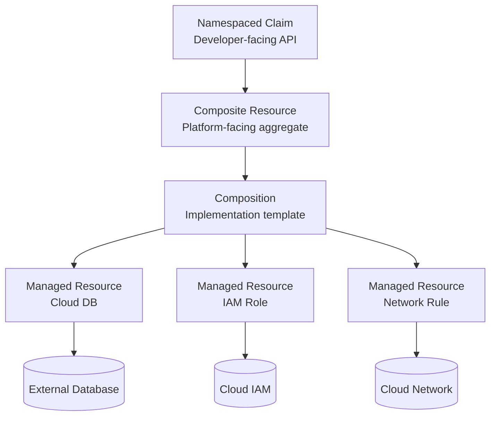
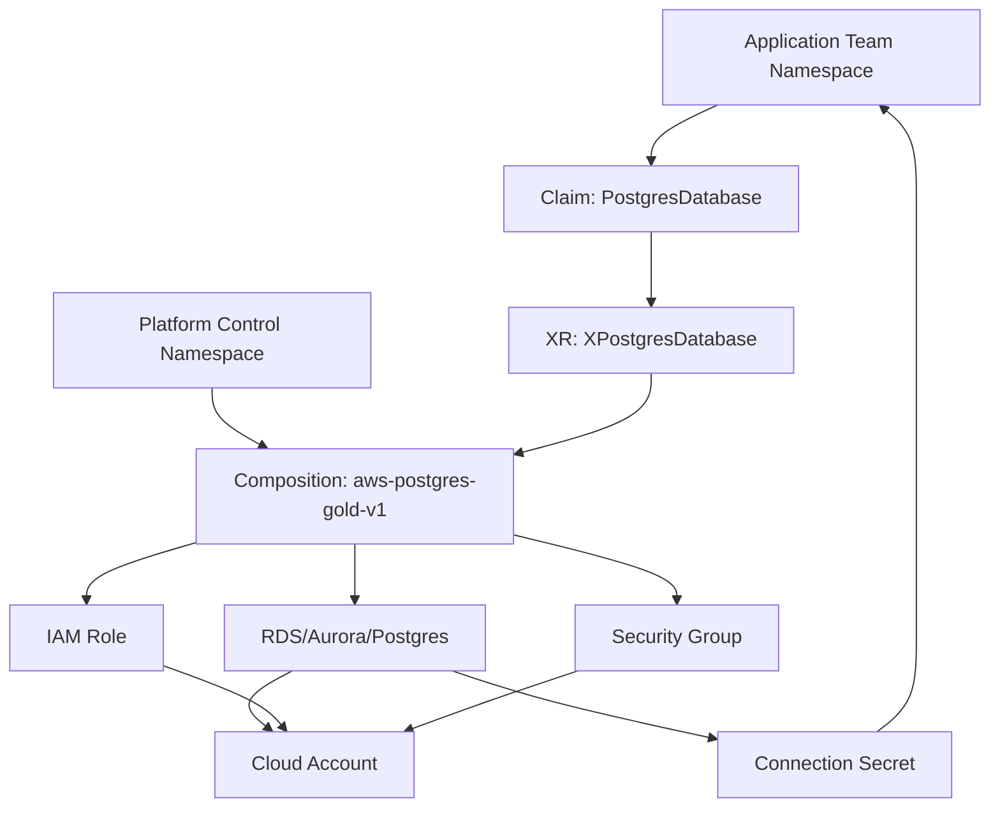
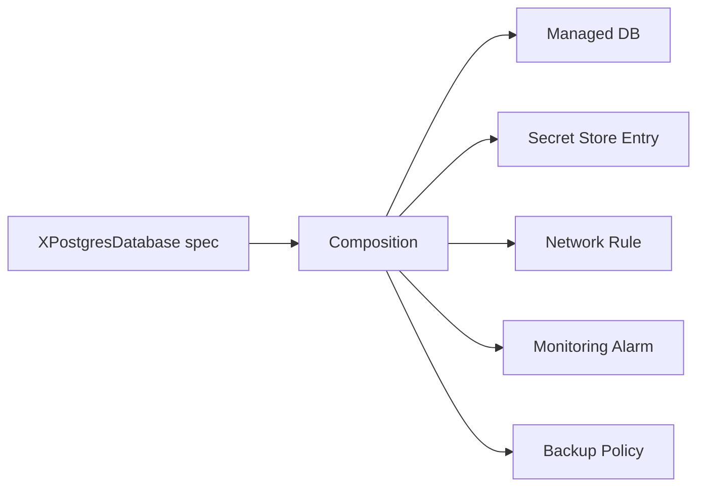
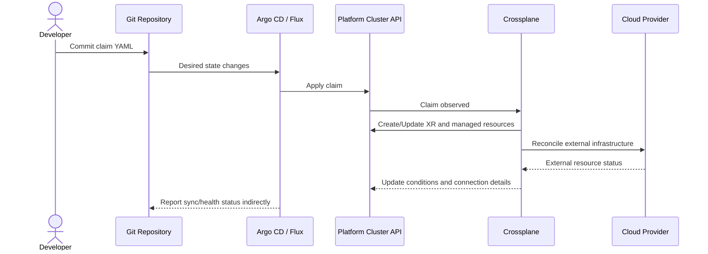
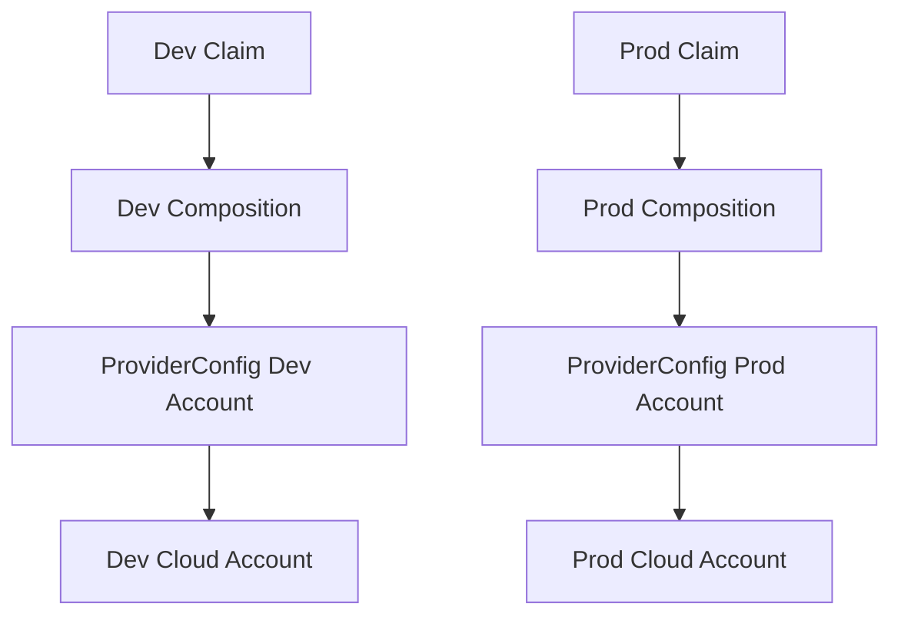
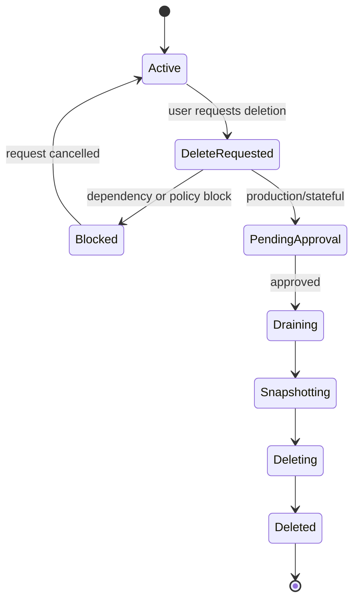
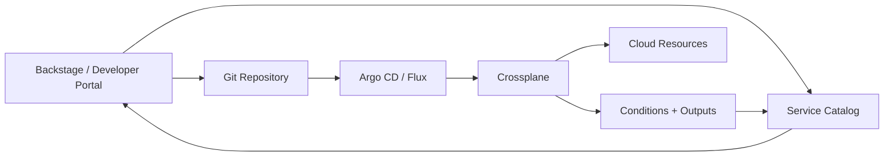

# Part 036 — Crossplane Control Plane Patterns

Crossplane changes the shape of IaC.

With Terraform/OpenTofu, the common mental model is:

> Run a plan/apply workflow that mutates external infrastructure and records state.

With Crossplane, the mental model is:

> Extend the Kubernetes API with platform-specific resource types, then let controllers continuously reconcile external infrastructure toward declared desired state.

This makes Crossplane especially interesting for GitOps/IaC platforms because it turns infrastructure capabilities into Kubernetes-native APIs.

A team does not need to run Terraform. A team can create a claim:

```yaml
apiVersion: platform.example.com/v1alpha1
kind: PostgresDatabase
metadata:
  name: quote-db
  namespace: team-commercial
spec:
  tier: gold
  dataClass: restricted
  storage: medium
```

Crossplane then reconciles the external resources needed to satisfy that claim.

The promise is powerful. The risk is also real.

If you design Crossplane badly, you create a distributed cloud console inside Kubernetes. If you design it well, you create a strong platform API layer.

---

## 1. Core Mental Model

Crossplane lets you build a control plane using Kubernetes resource types.



The key objects:

| Concept | Meaning |
|---|---|
| Managed Resource | A Kubernetes custom resource that represents and reconciles an external resource through a provider |
| Provider | Crossplane package that knows how to manage resources for a cloud/API/system |
| ProviderConfig | Credential and configuration reference used by providers |
| Composite Resource Definition | Defines a custom platform API type |
| Composite Resource | Instance of that custom API, usually cluster-level/platform-facing |
| Claim | Namespaced, tenant-facing request for a composite resource |
| Composition | Implementation recipe that turns a composite resource into one or more composed resources |
| Composition Function | Programmable step used to generate or transform composed resources |
| Connection Details | Output data such as endpoint, username, secret reference, or generated credentials |

The strongest pattern is not “let developers create raw cloud resources.”

The strongest pattern is:

> Developers create claims. Platform teams own compositions. Providers reconcile managed resources.

---

## 2. Crossplane vs Terraform/OpenTofu

Crossplane and Terraform/OpenTofu solve overlapping but different problems.

| Dimension | Terraform/OpenTofu | Crossplane |
|---|---|---|
| Execution model | Plan/apply command | Continuous reconciliation |
| State model | State file/backend | Kubernetes API + provider external state |
| User interface | HCL/module/runner | Kubernetes custom resources |
| Change preview | Strong plan workflow | Weaker native preview; rely on policy/diff/admission/testing |
| Best at | Foundational infra, explicit plan/apply governance, complex changes | Platform APIs, tenant self-service, continuous reconciliation |
| Risk | State file complexity, stale plans, module sprawl | Kubernetes API overload, controller drift, weak deletion design |
| Rollback | Git revert + apply/state handling | Git revert + reconciliation/deletion semantics |
| Policy points | CI plan policy, runner policy | Admission policy, composition validation, controller RBAC |

A mature platform can use both:

- Terraform/OpenTofu for landing zones, accounts, clusters, base networks, stateful foundational infra.
- Crossplane for tenant-facing resource claims and platform APIs.
- GitOps controllers to reconcile the claims and compositions stored in Git.

Do not turn this into tool religion. Choose based on lifecycle and operating model.

---

## 3. The Golden Crossplane Pattern

The golden pattern is a three-layer model.



Responsibilities:

| Layer | Owner | Responsibility |
|---|---|---|
| Claim | Application team | Express intent |
| XRD/schema | Platform team | Define API contract |
| Composition | Platform team | Implement the contract |
| ProviderConfig | Platform/security team | Credential and account boundary |
| Managed resources | Crossplane/provider | Reconcile external resources |
| External resources | Cloud/API | Actual infrastructure |
| Policies | Platform/security | Enforce allowed usage |

This separation is what makes Crossplane useful as a platform API.

---

## 4. Managed Resources

A managed resource is the low-level unit that maps to an external object.

Examples:

- S3 bucket,
- IAM role,
- RDS instance,
- DNS record,
- Kubernetes namespace,
- cloud SQL instance,
- message queue,
- firewall rule.

A managed resource usually contains:

- desired spec,
- provider config reference,
- external resource reference/name,
- deletion policy,
- management policies,
- observed status,
- conditions,
- connection details.

Managed resources are powerful but dangerous as a user-facing API.

Why?

Because they expose provider details.

If teams directly create raw managed resources, you have not created a platform API. You have given teams a Kubernetes-shaped cloud SDK.

Use raw managed resources for platform implementation, not for most application teams.

---

## 5. Composite Resources and Claims

A composite resource is an aggregate platform resource.

A claim is the tenant-facing request for that aggregate.

The difference matters.

A claim should expose the vocabulary of the product team:

```yaml
spec:
  tier: gold
  storage: medium
  dataClass: restricted
  allowedConsumers:
    - quote-service
```

The composite resource and composition can translate that into:

- database instance,
- subnet group,
- KMS key reference,
- IAM policy,
- security group,
- parameter group,
- monitoring alarms,
- secret output,
- backup policy.

The team does not need to know those details.

This is the same principle as Part 035:

> Expose intent. Hide implementation. Preserve status and evidence.

---

## 6. XRD Design

An XRD defines the custom platform API.

Treat it like a public API.

A good XRD schema should be:

- small,
- stable,
- validated,
- opinionated,
- explicit about ownership,
- explicit about lifecycle,
- explicit about risk fields,
- clear about defaulting,
- clear about output/status.

Bad XRD:

```yaml
spec:
  rdsInstanceClass: db.r6g.2xlarge
  subnetIds:
    - subnet-123
  kmsKeyArn: arn:aws:kms:...
  parameterGroupFamily: postgres17
```

Better XRD:

```yaml
spec:
  tier: gold
  size: medium
  dataClass: restricted
  backupPolicy: regulated-35d
  networkExposure: private
```

The second form gives the platform room to evolve.

### Schema Design Rules

1. Prefer domain vocabulary over provider vocabulary.
2. Use enums for risk-sensitive choices.
3. Do not expose raw IAM policy unless it is an explicit escape hatch.
4. Require owner/team/environment metadata.
5. Make destructive lifecycle flags explicit.
6. Make defaults visible in status.
7. Version the API before changing semantics.
8. Keep status useful for users, not only controllers.

---

## 7. Composition as Implementation Boundary

A Composition turns an XR into composed resources.

Think of it as:

> A platform-owned implementation template for a product capability.



Composition should encode platform defaults:

- encryption,
- tagging,
- backup,
- monitoring,
- network isolation,
- naming,
- provider config selection,
- deletion behavior,
- connection secret format,
- policy labels,
- cost metadata.

The platform team should be able to publish multiple compositions for the same API:

- `aws-postgres-gold-v1`,
- `aws-postgres-silver-v1`,
- `azure-postgres-gold-v1`,
- `gcp-postgres-gold-v1`,
- `postgres-dev-ephemeral-v1`.

The user-facing claim can remain stable while the implementation differs by environment, cloud, region, or tier.

---

## 8. Composition Functions

Composition Functions extend composition with programmable logic.

They are useful when static patching becomes too limited.

Use functions for:

- generating multiple resources from arrays,
- conditional resource creation,
- environment-specific transformations,
- naming logic,
- policy-aware defaults,
- complex mapping from intent to implementation,
- reusable composition logic.

But be careful.

Functions can become hidden imperative code inside a declarative platform.

Rules:

1. Keep functions deterministic.
2. Version functions.
3. Test functions separately.
4. Do not put unbounded external calls in functions.
5. Make generated resources inspectable.
6. Produce status/evidence for important decisions.
7. Keep business policy outside opaque code when possible.

If a function is impossible to reason about from Git, you have reduced GitOps transparency.

---

## 9. GitOps Integration

Crossplane works well with GitOps when desired state is stored in Git.

Typical flow:



Important implications:

- Git stores desired claims and platform APIs.
- Argo/Flux applies them.
- Crossplane reconciles them.
- Cloud provider APIs create actual resources.
- Status comes back through Kubernetes conditions.

This creates nested reconciliation loops.

Nested loops are powerful, but you must define ownership clearly:

| Object | Reconciled By |
|---|---|
| Claim YAML | GitOps controller |
| XR/composed resources | Crossplane |
| External resource | Crossplane provider + cloud API |
| Secret output | Crossplane/provider/secret operator |
| Policy admission | Kubernetes admission controller |
| Catalog status | platform integration |

A bug in ownership produces controller fights.

---

## 10. Status and Conditions

Crossplane resources expose conditions such as readiness and synchronization depending on the resource/controller.

For a platform API, raw controller status is not enough.

Users need product-level status.

Example:

```yaml
status:
  phase: Ready
  endpointRef:
    name: quote-db-connection
    namespace: team-commercial
  conditions:
    - type: Validated
      status: "True"
    - type: Provisioned
      status: "True"
    - type: ConnectionPublished
      status: "True"
    - type: BackupConfigured
      status: "True"
    - type: MonitoringConfigured
      status: "True"
```

The status should answer:

- Can I use it?
- Where is the connection information?
- What tier was actually provisioned?
- What policy profile applies?
- What failed?
- Is deletion pending?
- Is the external resource still reconciling?

A platform API with poor status will become a ticket generator.

---

## 11. Connection Details and Secrets

Connection details are a common source of bad design.

Questions to answer:

- Where are credentials generated?
- Where are they stored?
- Which namespace receives them?
- Are they encrypted at rest?
- Can they be rotated?
- Can multiple consumers receive different credentials?
- Are credentials static or dynamic?
- Does deletion revoke credentials?
- Does status expose sensitive data accidentally?

Do not blindly publish secrets into every namespace.

A safer pattern:


Crossplane may create or reference connection information, but secret delivery should align with the broader secrets strategy from Part 017.

For regulated systems, connection secret handling must be part of the capability contract.

---

## 12. ProviderConfig and Credential Boundaries

ProviderConfig is one of the most important security boundaries.

Bad pattern:

- one Crossplane provider identity,
- admin access to all accounts,
- all claims can select it,
- no tenant isolation.

Better pattern:

- provider config per account/project/subscription boundary,
- RBAC controls who can reference which provider config,
- environment-specific credentials,
- short-lived or federated credentials where supported,
- no production provider config accessible from dev namespaces,
- platform-owned mapping from claim environment to provider config.



Provider credentials should follow the same principles as IaC runner credentials:

- least privilege,
- environment isolation,
- short-lived where possible,
- audited usage,
- revocation path,
- no shared admin credential for all tenants.

---

## 13. Deletion Semantics

Deletion is one of the hardest Crossplane design problems.

If a user deletes a claim, what should happen?

Possibilities:

1. Delete the external resource immediately.
2. Orphan the external resource.
3. Require approval before deletion.
4. Block deletion if dependencies exist.
5. Snapshot/export first.
6. Retain for a grace period.
7. Mark as delete-requested and let workflow handle it.

For stateless dev resources, direct deletion may be acceptable.

For production databases, direct deletion is usually unacceptable.

Design deletion as a lifecycle transition, not a side effect.



In production, deletion should usually be mediated by a platform workflow, not only Kubernetes garbage collection.

---

## 14. Drift and Reconciliation

Crossplane continuously observes external resources and tries to reconcile them.

This changes drift handling.

In Terraform/OpenTofu, drift is usually detected during plan/refresh.

In Crossplane, drift may be corrected automatically depending on provider behavior and management settings.

That sounds good, but it has consequences.

Questions:

- Should external manual changes be auto-reverted?
- Should some externally managed fields be observed but not controlled?
- How do you distinguish provider default drift from real drift?
- How do you avoid Crossplane fighting emergency manual changes?
- How do you create evidence for auto-remediation?

A safe model:

| Drift Type | Recommended Action |
|---|---|
| Cosmetic/provider default | Ignore or normalize |
| Manual change to controlled field | Auto-correct in non-prod, alert/approve in prod |
| Emergency manual change | Annotate exception, pause/suspend if needed, reconcile through Git later |
| External deletion | Recreate or enter recovery depending on resource criticality |
| Secret rotation | Reconcile through secret lifecycle policy |

Continuous reconciliation is not a replacement for governance. It is governance automation.

---

## 15. Multi-Tenancy

Crossplane multi-tenancy should be designed deliberately.

Isolation dimensions:

- namespaces,
- RBAC,
- claims allowed per namespace,
- provider configs allowed per namespace,
- compositions allowed per environment,
- quotas,
- policy constraints,
- connection secret destinations,
- network boundaries,
- cloud account boundaries.

Weak model:

- all teams can create all claims,
- all claims can select any composition,
- all compositions can use production provider config.

Strong model:

- teams create claims only in their namespaces,
- production claims require promotion/approval,
- composition selection is controlled by policy,
- provider config selection is platform-owned,
- connection secrets cannot cross unauthorized namespaces,
- resource quotas prevent runaway provisioning.

Crossplane gives you building blocks. It does not automatically give you a secure multi-tenant platform.

---

## 16. Policy for Crossplane

Policy should exist at multiple points.

| Point | Example |
|---|---|
| Pre-merge | Validate claim YAML in CI |
| Admission | Block forbidden claims/compositions/provider configs |
| Composition | Encode secure defaults |
| Provider IAM | Limit what Crossplane can create |
| Runtime observation | Detect drift or unhealthy resources |
| Deletion workflow | Block destructive transitions |
| Evidence pipeline | Record reconciliation and approval outcomes |

Example policy questions:

- Can this namespace create production resources?
- Is the owner valid in the catalog?
- Is `networkExposure: public` allowed?
- Is the selected tier approved for this environment?
- Is the data class compatible with the region?
- Can this claim reference this provider config?
- Can this resource be deleted directly?
- Are connection details published only to allowed namespaces?

Admission policy is important, but IAM is still the final guardrail. If Crossplane credentials are overpowered, a policy bug becomes dangerous.

---

## 17. Versioning Compositions

Composition versioning is where many Crossplane platforms fail.

A composition is implementation code. It will change.

Examples:

- new provider version,
- new tagging standard,
- new backup policy,
- new naming scheme,
- new monitoring resource,
- cloud migration,
- security hardening,
- field rename,
- deletion behavior change.

Rules:

1. Version compositions explicitly.
2. Separate API version from composition version.
3. Avoid forcing all existing claims onto new implementation immediately.
4. Provide migration plan for existing XRs.
5. Record which composition version each claim uses.
6. Test new composition in dev/stage before prod.
7. Watch for replacement/destroy behavior in managed resources.
8. Create rollback path before migration.

A safe naming pattern:

- `postgres.aws.gold.v1`
- `postgres.aws.gold.v2`
- `postgres.azure.gold.v1`
- `postgres.dev.ephemeral.v1`

Do not edit a production composition in place unless the change is obviously safe and tested.

---

## 18. Testing Crossplane APIs

Testing should happen at multiple levels.

| Test Level | Purpose |
|---|---|
| Schema validation | Does the claim match the XRD? |
| Policy test | Are unsafe requests rejected? |
| Composition render test | Does the XR produce expected resources? |
| Provider dry-run/sandbox test | Can resources be created in a safe account? |
| Reconciliation test | Does status reach Ready? |
| Secret delivery test | Are connection details delivered correctly? |
| Deletion test | Does lifecycle behave safely? |
| Migration test | Can v1 claims move to v2 composition? |
| Failure test | What happens when provider API fails? |

The platform team should treat Crossplane APIs like software APIs.

That means tests, versioning, changelog, compatibility policy, and deprecation windows.

---

## 19. Failure Modes and Playbooks

### Failure: Claim Accepted but Never Ready

Symptoms:

- claim exists,
- XR exists,
- managed resources stuck,
- user sees no usable output.

Triage:

1. Inspect claim conditions.
2. Inspect XR conditions.
3. Inspect composed resource conditions.
4. Inspect provider logs.
5. Check provider credentials.
6. Check cloud API errors.
7. Check admission/policy events.
8. Check quota and region availability.

Fix:

- update composition bug,
- fix provider config,
- fix quota,
- correct claim spec,
- manually recover external resource if partial creation occurred.

### Failure: Wrong ProviderConfig Used

Symptoms:

- resource created in wrong account/region,
- environment boundary violated.

Fix:

- stop reconciliation if needed,
- assess external resource impact,
- correct composition/provider config mapping,
- rotate credentials if exposed,
- migrate or delete misplaced resource,
- create incident evidence.

Prevention:

- do not let users select arbitrary ProviderConfig;
- enforce provider config selection via composition and policy.

### Failure: Deleting Claim Deletes Production Database

Symptoms:

- user deletes YAML,
- Crossplane deletes external database,
- outage/data loss risk.

Fix:

- restore from backup if possible,
- recover from snapshot,
- review deletion policy,
- add admission block for direct delete,
- require delete-requested lifecycle.

Prevention:

- never use direct deletion semantics for critical stateful resources without approval;
- use deletion protection and lifecycle workflow.

### Failure: Composition Update Replaces Resources

Symptoms:

- platform changes composition,
- provider plans/reconciles replacement,
- existing claims affected unexpectedly.

Fix:

- rollback composition,
- pause affected resources if possible,
- inspect managed resource diffs/status,
- migrate intentionally.

Prevention:

- version compositions;
- test replacement behavior;
- canary composition updates.

### Failure: Provider Upgrade Changes Behavior

Symptoms:

- after provider upgrade, fields drift,
- reconciliation errors increase,
- resource schemas change.

Fix:

- rollback provider package if safe,
- pin versions,
- run provider upgrade tests,
- inspect release notes,
- migrate affected resources.

Prevention:

- provider version pinning,
- staging control plane,
- canary upgrade,
- compatibility tests.

---

## 20. Crossplane and Backstage Together

Crossplane is not a developer portal.

Backstage is not a reconciler.

Together they can form a strong pattern:



Typical flow:

1. User selects “Create Postgres database” in portal.
2. Portal validates owner/system from catalog.
3. Portal generates claim YAML and opens Git PR.
4. CI validates schema and policy.
5. GitOps applies claim after merge.
6. Crossplane reconciles external resources.
7. Status and connection references flow back to catalog/portal.

The portal improves usability. Crossplane provides reconciliation. Git preserves desired state. Policy preserves control.

---

## 21. When Not to Use Crossplane

Crossplane is not always the right answer.

Avoid or be cautious when:

- your organization cannot operate Kubernetes controllers reliably,
- users are not ready for Kubernetes-native APIs and there is no portal abstraction,
- preview/plan semantics are mandatory for every change,
- external resource lifecycle is highly imperative and not safely reconciled,
- provider maturity is weak for critical resources,
- deletion semantics cannot be controlled,
- the platform team cannot own API versioning,
- you would expose raw provider resources directly to all teams.

Crossplane is a control-plane framework. It requires control-plane discipline.

---

## 22. Production Readiness Checklist

Before using Crossplane for production self-service, verify:

- XRDs are versioned and schema-validated.
- Claims expose intent, not raw provider internals.
- Compositions are versioned and tested.
- Provider versions are pinned.
- ProviderConfig access is controlled.
- Production provider credentials are least privilege.
- Admission policy blocks unsafe claims.
- Deletion lifecycle is explicitly designed.
- Stateful resources have backup/restore proof.
- Connection secrets are delivered securely.
- Status conditions are user-readable.
- Drift behavior is documented.
- Composition migration strategy exists.
- Provider upgrade process exists.
- Observability exists for Crossplane controllers and providers.
- Incident playbooks exist for stuck reconciliation, wrong account creation, deletion mistakes, and provider failure.
- Claims and external resources are tied to service catalog ownership.
- Evidence is retained for request, approval, reconciliation, and deletion.

If these are missing, Crossplane may still work technically, but it is not yet a production platform API.

---

## 23. Practical Exercise

Design a Crossplane-backed `Queue` capability.

Your claim should expose:

- owner,
- environment,
- durability tier,
- message retention,
- encryption requirement,
- producer services,
- consumer services,
- dead-letter behavior,
- data classification,
- deletion policy.

Then design:

1. XRD schema.
2. Claim namespace model.
3. Composition versions.
4. ProviderConfig selection.
5. Connection detail delivery.
6. Admission policies.
7. Status conditions.
8. Deletion workflow.
9. Drift behavior.
10. Migration from `v1alpha1` to `v1beta1`.

Finally answer:

- Which fields are stable product intent?
- Which fields are cloud-specific implementation?
- Which failures could create data loss?
- Which changes require approval?
- How would you prove during audit that the queue was created by policy-compliant automation?

---

## 24. The Core Lesson

Crossplane is powerful because it lets you create platform APIs, not because it lets Kubernetes create cloud resources.

The difference is huge.

Raw Crossplane managed resources expose infrastructure implementation.

Well-designed Crossplane claims expose product intent.

A production Crossplane platform needs:

- stable XRDs,
- intent-oriented claims,
- versioned compositions,
- controlled provider configs,
- least-privilege credentials,
- safe deletion semantics,
- policy gates,
- status conditions,
- secret delivery,
- GitOps integration,
- observability,
- evidence,
- migration discipline,
- recovery playbooks.

Used well, Crossplane becomes the API layer between application teams and infrastructure complexity.

Used carelessly, it becomes another way to create ungoverned cloud resources.

The tool is not the abstraction. The contract is the abstraction.

---

## References

- Crossplane Documentation: https://docs.crossplane.io/latest/
- Crossplane Managed Resources: https://docs.crossplane.io/latest/managed-resources/managed-resources/
- Crossplane Composite Resource Definitions: https://docs.crossplane.io/latest/composition/composite-resource-definitions/
- Crossplane Compositions: https://docs.crossplane.io/latest/composition/compositions/
- Crossplane Functions: https://docs.crossplane.io/latest/packages/functions/
- Crossplane Claims: https://docs.crossplane.io/v1.20/concepts/claims/
