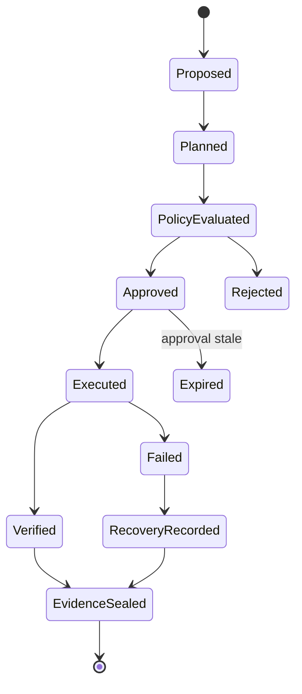
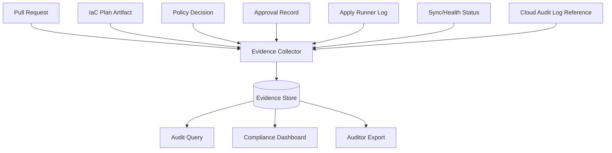
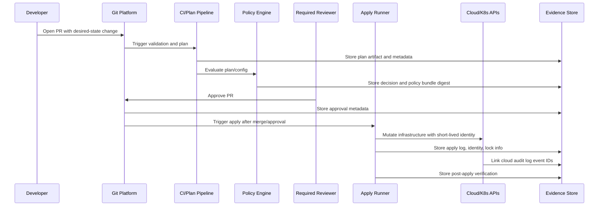
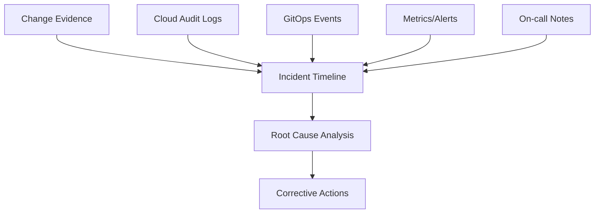

# Part 038 — Compliance, Audit, and Evidence Engineering

Compliance is not a PDF.

In a modern GitOps/IaC platform, compliance should be a property of the delivery system itself.

Every production change should answer:

- Who requested this change?
- What exactly changed?
- Why was it allowed?
- Which policies evaluated it?
- Who approved it?
- Which identity executed it?
- Which state was mutated?
- What evidence proves it?
- Was the resulting system healthy?
- Can we reconstruct the timeline later?

If the answer is scattered across Slack messages, CI logs, cloud consoles, screenshots, and human memory, the platform is not audit-ready.

The goal of evidence engineering is to make the normal delivery workflow automatically produce defensible records.

---

## 1. The Core Mental Model

Treat every GitOps/IaC change as a **regulated state transition**.



Each transition should produce evidence.

| Transition | Evidence |
|---|---|
| Proposed | PR, issue/change ticket, requester, intent |
| Planned | plan artifact, plan JSON, affected resources |
| Policy evaluated | policy version, decision, violations, exceptions |
| Approved | approver, timestamp, scope, approval basis |
| Executed | runner identity, credentials mode, state lock, apply log |
| Verified | post-apply checks, GitOps sync status, health checks |
| Evidence sealed | immutable record, retention metadata, correlation ID |

The audit record is not something you create after the change. It is the exhaust of a well-designed control loop.

---

## 2. Compliance vs Audit vs Evidence

These terms are often mixed together.

| Concept | Meaning | Pipeline interpretation |
|---|---|---|
| Compliance | Meeting required controls | The platform enforces or demonstrates controls |
| Audit | Independent examination | The platform can prove what happened |
| Evidence | Records supporting claims | Plans, approvals, logs, attestations, policy results |
| Control | Mechanism reducing risk | CODEOWNERS, policy gate, OIDC, state lock |
| Assertion | Claim made to auditor/risk owner | “Production changes require approval” |
| Test of control | Check that control operated | Sample changes and verify approval evidence |

A weak organization says:

> We have a policy that production changes require approval.

A stronger organization says:

> Here are all production changes in Q2, each with commit SHA, plan, policy decision, required reviewer approval, apply identity, and post-apply verification.

The second statement is evidence-driven.

---

## 3. Evidence as a First-Class System

Evidence should be designed like data, not collected like screenshots.



Evidence store requirements:

| Requirement | Why it matters |
|---|---|
| Append-oriented | Prevent silent rewriting of history |
| Correlated | Link PR, commit, plan, policy, apply, runtime state |
| Queryable | Auditors need samples and population reports |
| Retained | Evidence must survive CI log expiration |
| Access-controlled | Evidence may contain sensitive architecture details |
| Redacted | Avoid storing secrets in evidence |
| Timestamped | Reconstruct sequence and approval freshness |
| Tamper-evident where possible | Increase trust in records |

Do not rely on the default retention of CI logs as your only audit evidence.

---

## 4. The Change Evidence Contract

Define a standard evidence object for every change.

Example:

```json
{
  "evidence_version": "1.0",
  "change_id": "chg-2026-07-03-000184",
  "correlation_id": "gitops-iac-9c9a1c73",
  "repository": "org/infra-live",
  "pull_request": 1842,
  "commit_sha": "8f7c2a...",
  "environment": "prod",
  "scope": {
    "account": "prod-commercial",
    "region": "ap-southeast-3",
    "stack": "databases/quote-db"
  },
  "requester": "alice@example.com",
  "approvals": [
    {
      "approver": "platform-owner@example.com",
      "role": "codeowner",
      "timestamp": "2026-07-03T05:21:18Z",
      "basis": "plan reviewed; policy passed"
    }
  ],
  "plan": {
    "artifact_uri": "s3://evidence/plans/chg-1842.tfplan",
    "json_uri": "s3://evidence/plans/chg-1842.json",
    "summary": {
      "create": 2,
      "update": 1,
      "replace": 0,
      "delete": 0
    }
  },
  "policy": {
    "engine": "opa",
    "policy_bundle_digest": "sha256:...",
    "decision": "allow",
    "exceptions": []
  },
  "execution": {
    "runner_id": "iac-runner-prod-17",
    "principal": "arn:aws:sts::123456789012:assumed-role/iac-prod-apply/...",
    "state_backend": "s3://tfstate-prod-commercial/...",
    "lock_id": "lock-39d...",
    "started_at": "2026-07-03T05:28:02Z",
    "ended_at": "2026-07-03T05:31:44Z",
    "result": "success"
  },
  "verification": {
    "post_apply_checks": "passed",
    "gitops_sync": "synced",
    "health": "healthy"
  }
}
```

This object becomes the common language between engineering, security, audit, and incident response.

---

## 5. Control Mapping

A GitOps/IaC platform can support many control frameworks, but the engineering system should not be hard-coded to one auditor’s spreadsheet.

Instead, map platform controls to multiple frameworks.

| Platform control | Control intent | Evidence |
|---|---|---|
| Branch protection | Prevent unreviewed changes | repo protection config, PR approval |
| CODEOWNERS | Enforce ownership review | approval by required owner |
| Plan artifact | Show intended infrastructure mutation | saved plan, plan JSON |
| Policy gate | Prevent prohibited change | policy decision, violations |
| OIDC runner identity | Avoid long-lived static credentials | token claims, cloud audit log |
| State locking | Prevent concurrent mutation | lock record, apply log |
| GitOps reconciliation | Keep runtime aligned to desired state | sync status, health status |
| Drift detection | Detect unauthorized/manual change | drift reports, remediation PR |
| Secrets policy | Prevent secret leakage | scan results, secret manager audit |
| Break-glass workflow | Controlled emergency access | approval, time-bound access, after-action review |

For example, NIST SP 800-53 includes control families covering configuration management, audit and accountability, access control, identification and authentication, system and information integrity, contingency planning, and assessment/monitoring. A GitOps/IaC platform can generate evidence relevant to many of those families, but the exact mapping depends on the organization’s compliance scope.

---

## 6. Audit-Ready Change Flow



The important point:

> The evidence store should receive records throughout the workflow, not after everything succeeds.

Failed changes also need evidence. Failed production changes are often more important to audit and incident response than successful ones.

---

## 7. Approval Evidence

Approval is not just a green checkmark.

Approval evidence should capture:

- approver identity;
- approver role;
- approval time;
- exact commit approved;
- exact plan approved;
- policy decision visible at approval time;
- scope of approval;
- whether approval expired before apply;
- whether new commits invalidated approval;
- whether approver is independent from requester where required.

Bad approval model:

```text
Someone approved the PR.
```

Better approval model:

```text
The platform owner approved commit 8f7c2a after reviewing plan artifact sha256:abc and policy bundle sha256:def. Apply occurred 11 minutes later using runner principal iac-prod-apply. No new commit was added after approval.
```

That is defensible.

---

## 8. Segregation of Duties

Segregation of duties means one actor should not control every step of a sensitive change.

In GitOps/IaC, dangerous combinations include:

| Combination | Risk |
|---|---|
| Author can merge production change alone | Unreviewed production mutation |
| Author can edit policy and apply same change | Policy bypass |
| Runner can choose its own credentials | Privilege escalation |
| AI can write and approve its own IaC | No independent review |
| Platform admin can mutate state without evidence | Hidden infrastructure change |
| Break-glass user can avoid after-action review | Permanent emergency bypass |

Practical controls:

- CODEOWNERS for high-risk paths;
- branch protection;
- separate policy repo ownership;
- separate runner role administration;
- approval freshness checks;
- break-glass review;
- immutable audit log;
- emergency changes reconciled back to Git.

Segregation does not mean bureaucracy. It means no single compromised identity can silently rewrite production.

---

## 9. Evidence for Policy-as-Code

Policy result alone is insufficient.

Store:

- policy engine name and version;
- policy bundle version/digest;
- input artifact reference;
- decision;
- violations;
- warnings;
- exceptions;
- exception expiry;
- evaluator identity;
- timestamp.

Example:

```json
{
  "policy_engine": "opa",
  "policy_bundle_digest": "sha256:45f...",
  "input_type": "opentofu_plan_json",
  "input_digest": "sha256:a18...",
  "decision": "deny",
  "violations": [
    {
      "rule": "prod_s3_no_public_access",
      "severity": "critical",
      "resource": "aws_s3_bucket_policy.exports",
      "message": "Production bucket policy allows public principal"
    }
  ],
  "exceptions": [],
  "evaluated_at": "2026-07-03T04:10:00Z"
}
```

This lets you later prove not only that policy existed, but that the exact policy version evaluated the exact change input.

---

## 10. Evidence for Secrets

Secrets evidence must prove control operation without storing secret values.

Capture:

- secret reference path, not value;
- secret manager/provider;
- access event reference;
- rotation metadata;
- owning team;
- environment;
- consuming workload identity;
- policy validation result;
- last rotation timestamp where available.

Do not capture:

- plaintext secrets;
- decrypted SOPS content;
- token values;
- private keys;
- session credentials;
- full environment dumps.

Useful evidence statement:

```text
Deployment quote-api consumed secret reference vault://prod/quote-api/db-password through External Secrets Operator using workload identity quote-api-prod. No plaintext value was stored in Git or CI logs. Rotation metadata shows last rotation within policy.
```

The evidence should support the claim without creating a new breach surface.

---

## 11. Evidence for GitOps Reconciliation

For Kubernetes GitOps controllers, store or link:

- application/kustomization identity;
- source repo URL;
- commit or artifact revision;
- sync status;
- health status;
- diff status;
- reconciliation timestamp;
- controller identity;
- namespace/cluster;
- failure reason if not synced;
- manual override if any.

Evidence question:

> After apply/merge, did runtime converge to desired state?

This matters because a PR can be merged and still fail to deploy due to admission denial, missing CRD, invalid secret reference, webhook failure, or controller outage.

---

## 12. Evidence for Terraform/OpenTofu State

State evidence should be handled carefully because state may contain sensitive data.

Store metadata, not full state unless absolutely required and protected.

Capture:

- backend location;
- state object version if available;
- lock ID;
- workspace/state key;
- apply command mode;
- plan artifact reference;
- resource address summary;
- import/state-mv/state-rm operations;
- operator identity;
- before/after state version references.

Critical state operations require extra evidence:

| Operation | Evidence needed |
|---|---|
| `import` | source of truth for existing resource, owner approval |
| `state mv` | old/new addresses, refactor reason, plan showing no replacement |
| `state rm` | risk approval, unmanaged-resource plan |
| force unlock | reason, stale process proof, second approver |
| state restore | incident record, backup version, blast radius, validation |

State is the recorded truth of the IaC engine. Treat state operations like database administration.

---

## 13. Evidence Retention and Redaction

Retention has two competing goals:

1. keep enough records to prove control operation;
2. avoid hoarding sensitive material forever.

Classify evidence:

| Evidence type | Sensitivity | Retention idea |
|---|---:|---|
| PR metadata | Low/medium | Long-term |
| Plan summary | Medium | Long-term |
| Full plan JSON | Medium/high | Controlled retention |
| Apply logs | Medium/high | Controlled retention with redaction |
| Secret scan result | Medium | Long-term summary, limited raw logs |
| Cloud audit references | Medium | Long-term references |
| Decrypted secrets | Critical | Do not store |
| Full state file | Critical | Avoid as evidence; store protected backend version reference |

The evidence store should have its own access control model. Auditors rarely need raw secret-bearing artifacts.

---

## 14. Tamper Evidence and Integrity

Not every organization needs a blockchain-like audit system. But every serious platform needs to reduce silent tampering risk.

Practical measures:

- append-only object storage or WORM retention where available;
- signed evidence bundles;
- artifact digests;
- commit SHA references;
- policy bundle digests;
- provenance attestations;
- restricted write identities;
- separation between pipeline runner and evidence admin;
- periodic export to independent log/archive system.

Evidence integrity claim:

> This evidence bundle corresponds to commit X, plan digest Y, policy bundle digest Z, and apply run R. Altering any artifact changes its digest.

This makes records more defensible.

---

## 15. Audit Queries You Should Be Able to Answer

A mature GitOps/IaC platform can answer these quickly.

### Change population

- Show all production infrastructure changes in the last quarter.
- Show all changes affecting restricted-data systems.
- Show all changes with delete or replace actions.
- Show all emergency changes.
- Show all changes with policy exceptions.

### Control operation

- Show changes missing required approval.
- Show changes where approval occurred before final commit.
- Show changes where policy failed but apply still happened.
- Show changes where apply identity did not match environment.
- Show changes where post-apply verification failed.

### Risk and incident response

- Show who changed this IAM role.
- Show when this database backup retention changed.
- Show whether this public endpoint was approved.
- Show whether drift was reconciled back to Git.
- Show whether a break-glass change was later reviewed.

If you cannot answer these, you do not have evidence engineering yet.

---

## 16. Compliance Dashboard Design

Avoid vanity dashboards.

Useful dashboard sections:

```text
Change Control
- production changes by environment/team
- approval coverage
- stale approval blocked count
- emergency change count
- rollback/failed apply count

Policy
- deny/warn trends
- exception count by owner/rule
- expired exception violations
- policy bundle version distribution

Drift
- open drift by environment
- unauthorized drift count
- time to reconciliation

Secrets
- secret scan failures
- rotation SLA breaches
- plaintext secret incidents

GitOps Runtime
- out-of-sync apps
- unhealthy apps
- reconciliation latency
- admission denials

Evidence Completeness
- changes missing plan artifact
- changes missing policy decision
- changes missing approval metadata
- changes missing verification result
```

The most important metric is often **evidence completeness**.

If evidence is missing, the platform may be operating correctly but cannot prove it.

---

## 17. Auditor-Friendly Export

Auditors usually need samples and population reports.

Design exports around questions:

```text
For each selected production change, provide:
1. PR link and commit SHA
2. requester
3. affected environment/system
4. plan summary and full plan artifact reference
5. policy decision and policy version
6. approval record
7. execution identity
8. apply result
9. post-apply verification
10. exceptions or emergency classification
```

Avoid handing auditors raw CI logs without structure. That forces humans to reconstruct meaning manually and increases the chance of misinterpretation.

---

## 18. Regulatory Defensibility

Regulatory defensibility is not the same as perfect compliance.

It means your system can demonstrate:

- there is a defined process;
- the process is technically enforced where practical;
- exceptions are explicit and bounded;
- violations are visible;
- evidence is retained;
- responsibilities are clear;
- failures produce corrective action;
- manual actions are reconciled and reviewed.

A defensible platform can say:

> Here is the control. Here is how it is implemented. Here is evidence it operated. Here are exceptions. Here is how exceptions were approved. Here is how failures were detected and corrected.

That is far stronger than saying:

> Engineers are supposed to follow the process.

---

## 19. Evidence Anti-Patterns

### 19.1 Screenshot Compliance

Screenshots are hard to query, hard to verify, easy to omit, and often stale.

Use structured records instead.

### 19.2 Log Retention as Audit Strategy

CI logs expire, contain noise, and may expose secrets.

Extract structured evidence before logs disappear.

### 19.3 Approval Without Scope

An approval that is not bound to a commit and plan can be invalidated by later changes.

### 19.4 Policy Without Version Evidence

If you cannot prove which policy version made the decision, you cannot reliably reconstruct the control operation.

### 19.5 Manual Console Change Without Reconciliation

Emergency console changes may be necessary, but they must produce evidence and a reconciliation PR.

### 19.6 Evidence Store With No Owner

Evidence systems need ownership, retention policy, access control, monitoring, and incident response.

---

## 20. Implementation Blueprint

### Phase 1 — Minimum Evidence

Capture for every production IaC change:

- PR URL;
- commit SHA;
- requester;
- approver;
- environment;
- plan summary;
- policy result;
- apply result;
- runner identity;
- timestamp.

### Phase 2 — Artifact Retention

Store:

- saved plan or plan JSON;
- policy input/output;
- cost report;
- apply logs;
- post-apply verification;
- GitOps sync result.

### Phase 3 — Control Mapping

Map evidence fields to internal controls and external frameworks.

Create control statements such as:

```text
CTRL-CHG-001: Production infrastructure changes require approved pull requests.
Evidence: PR metadata, CODEOWNERS approval, commit SHA, branch protection result.
```

### Phase 4 — Evidence Completeness Gate

Block or alert when a production change lacks required evidence.

### Phase 5 — Auditor Self-Service

Provide query/export tooling for samples and population reports.

---

## 21. Example Control Catalog

```yaml
controls:
  - id: CTRL-CHG-001
    title: Production changes require reviewed pull request
    intent: Prevent unreviewed production infrastructure mutation
    enforcement:
      - branch_protection
      - codeowners
      - approval_binding
    evidence:
      - pull_request_url
      - commit_sha
      - approver_identity
      - approval_timestamp
      - branch_protection_status

  - id: CTRL-IAC-002
    title: Infrastructure changes require plan and policy evaluation
    intent: Detect unsafe infrastructure mutations before apply
    enforcement:
      - speculative_plan
      - plan_json_policy_gate
    evidence:
      - plan_artifact_uri
      - plan_digest
      - policy_bundle_digest
      - policy_decision

  - id: CTRL-ID-003
    title: Apply runners use short-lived environment-scoped identity
    intent: Reduce credential theft and cross-environment blast radius
    enforcement:
      - oidc_federation
      - least_privilege_role
    evidence:
      - runner_id
      - assumed_principal
      - token_claims_reference
      - cloud_audit_event_ids
```

The control catalog should live near platform policy, not in an auditor-only spreadsheet.

---

## 22. Emergency and Break-Glass Evidence

Emergency changes are not evidence-free changes.

They require more evidence, not less.

Break-glass record:

```json
{
  "break_glass_id": "bg-2026-07-03-009",
  "reason": "restore production database connectivity",
  "requested_by": "oncall@example.com",
  "approved_by": "incident-commander@example.com",
  "access_scope": "prod-commercial/networking",
  "started_at": "2026-07-03T09:02:00Z",
  "ended_at": "2026-07-03T09:31:00Z",
  "commands_or_actions": "redacted-reference://incident/bg-009-actions",
  "reconciliation_pr": "https://git.example.com/org/infra-live/pull/1888",
  "post_incident_review": "https://docs.example.com/incidents/2026-07-03"
}
```

Emergency workflow invariant:

> The emergency path may bypass normal timing, but it must not bypass accountability.

---

## 23. Evidence and Incident Response

During an incident, evidence helps answer:

- Did a recent change cause this?
- Which resources changed?
- Did policy allow something it should have denied?
- Was there a manual drift event?
- Did GitOps fail to converge?
- Which identity executed the change?
- Can we safely roll forward or roll back?

Evidence should integrate with incident timelines.



A platform without evidence turns incidents into archaeology.

---

## 24. Evidence Quality Rubric

Score each evidence type from 0 to 4.

| Score | Meaning |
|---:|---|
| 0 | No evidence |
| 1 | Manual/unstructured evidence |
| 2 | Structured but incomplete evidence |
| 3 | Structured, correlated, retained evidence |
| 4 | Structured, correlated, retained, tamper-evident, queryable evidence |

Example assessment:

| Area | Score | Gap |
|---|---:|---|
| PR approval | 3 | Approval not always bound to plan digest |
| Policy decision | 2 | Bundle digest missing |
| Apply identity | 3 | Cloud audit event link missing |
| Drift remediation | 1 | Slack-based process |
| Break-glass | 2 | After-action PR not enforced |

Use this rubric to build a roadmap.

---

## 25. Practical Exercises

### Exercise 1 — Define Your Evidence Contract

Create a JSON schema for production change evidence.

Required fields:

- change ID;
- commit SHA;
- environment;
- requester;
- approver;
- plan artifact;
- policy result;
- apply identity;
- result;
- verification status.

### Exercise 2 — Map Controls

Pick ten platform controls and map them to evidence.

Example:

| Control | Evidence | Missing? |
|---|---|---|
| Production requires approval | PR approval, CODEOWNERS | approval not bound to plan |
| No public buckets | policy result | good |
| Short-lived runner credentials | OIDC claim, audit log | audit link missing |

### Exercise 3 — Audit Simulation

Pretend an auditor asks:

> Show five production changes from last month and prove they were approved, policy-checked, and executed by authorized identity.

Try to answer using only your current systems.

Document where you fail.

### Exercise 4 — Emergency Change Drill

Run a tabletop exercise:

1. emergency manual change is made;
2. evidence is captured;
3. Git reconciliation PR is opened;
4. post-incident review is linked;
5. access is revoked.

Measure evidence completeness.

---

## 26. What “Top 1%” Looks Like Here

A strong engineer sees compliance as a system design problem.

They do not merely ask:

> What does the auditor need?

They ask:

> What claims do we make about our delivery system, and can the system automatically prove those claims under stress?

They understand that auditability is a runtime property:

- identity;
- state;
- approval;
- policy;
- logs;
- artifacts;
- reconciliation;
- retention;
- queryability.

Compliance becomes a byproduct of good platform engineering.

---

## 27. Source Notes

Useful primary sources to read alongside this part:

- NIST SP 800-53 Rev. 5: `https://csrc.nist.gov/pubs/sp/800/53/r5/upd1/final`
- SLSA provenance model: `https://slsa.dev/spec/v0.1/provenance`
- OpenTelemetry documentation: `https://opentelemetry.io/docs/`
- OpenTelemetry logs specification: `https://opentelemetry.io/docs/specs/otel/logs/`

---

## 28. Key Takeaways

- Compliance should be generated by the normal delivery workflow, not assembled manually after the fact.
- Evidence must be structured, correlated, retained, access-controlled, and redacted.
- Approval evidence must be bound to commit, plan, policy result, and time.
- Policy evidence must include the exact policy version and exact input evaluated.
- State operations, secret operations, break-glass actions, and drift remediation need extra evidence.
- The most important compliance dashboard metric is evidence completeness.
- Regulatory defensibility means you can prove the process operated, exceptions were controlled, and failures were corrected.
