# Part 039 — Production Case Study: Enterprise GitOps/IaC Platform

This part turns the whole series into a concrete production-grade implementation.

We are not building a toy pipeline. We are designing an internal platform for a multi-team engineering organization where infrastructure changes must be reviewable, policy-checked, auditable, recoverable, and continuously reconciled.

The important question is not:

> “Which CI YAML do we use?”

The important question is:

> “Can every infrastructure and deployment state transition be explained, authorized, reproduced, observed, and recovered?”

That is the bar for a state-of-the-art GitOps/IaC platform.

---

## 1. Case Study Context

Assume an engineering organization with the following characteristics:

- 80 application teams.
- 10 platform teams.
- 6 production Kubernetes clusters.
- 18 non-production clusters.
- 4 cloud accounts for shared platform services.
- 30+ application cloud accounts.
- Multiple regions.
- Compliance-sensitive workloads.
- Strict production approval requirements.
- A mix of application delivery and cloud infrastructure provisioning.

The platform must support:

- Application deployment through GitOps.
- Cloud infrastructure through Terraform/OpenTofu.
- Policy-as-code before merge, before apply, and at Kubernetes admission.
- Short-lived cloud credentials through OIDC or workload identity.
- Secrets through external secret managers, not plain Git.
- Progressive delivery for production workloads.
- Drift detection and reconciliation.
- Evidence generation for audit and incident review.
- Emergency break-glass without destroying traceability.

The platform must avoid:

- Static admin cloud keys in CI.
- Direct manual production mutations as the normal path.
- Unreviewed production apply.
- GitOps controller running with cluster-admin everywhere.
- One giant Terraform state for the company.
- One giant repository that hides ownership boundaries.
- Silent drift suppression.
- Rollback procedures that only work in happy-path demos.

---

## 2. North Star Architecture

At the highest level, the platform has two related but different loops.

The first loop is the **IaC mutation loop**. It changes cloud resources and platform infrastructure.

The second loop is the **GitOps reconciliation loop**. It continuously makes Kubernetes runtime state match Git.

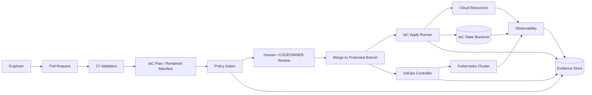

The architecture is intentionally split.

Cloud resources are usually mutated by an IaC engine with explicit plan/apply semantics. Kubernetes application state is usually reconciled by a controller such as Argo CD or Flux. Trying to force both into the same execution model often creates unclear ownership.

The platform therefore defines the following invariant:

> A change must have exactly one mutation authority for a given state boundary.

For example:

- An AWS VPC is owned by an OpenTofu stack.
- An EKS cluster add-on may be owned by either IaC or GitOps, but not both.
- An application Deployment is owned by GitOps.
- A Kubernetes Secret object may be owned by External Secrets Operator, while the secret value is owned by the external secret manager.
- A database schema version may be owned by a migration runner, not by Argo CD blindly applying SQL from Git.

---

## 3. Repository Architecture

The platform uses multiple repositories because ownership boundaries matter more than folder elegance.

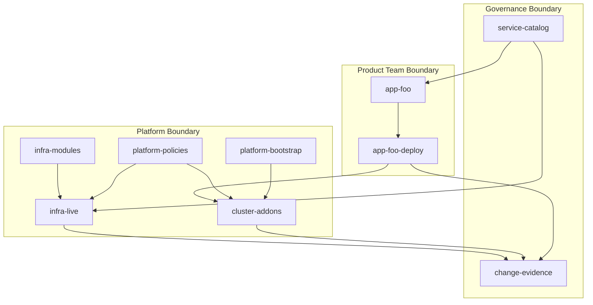

Recommended repository set:

| Repository | Primary owner | Purpose |
|---|---|---|
| `app-<name>` | Application team | Source code, tests, container build, app-level ownership metadata |
| `app-<name>-deploy` | Application team + platform guardrails | Helm/Kustomize/CUE config, image digest updates, environment desired state |
| `infra-modules` | Platform infra team | Versioned reusable infrastructure modules |
| `infra-live` | Platform infra team + service owners | Environment/account/region stack instantiation |
| `cluster-addons` | Platform Kubernetes team | Ingress, cert-manager, observability, policy engines, GitOps controllers, external-secrets |
| `platform-policies` | Security/platform governance team | OPA/Kyverno/Conftest/Checkov policies and tests |
| `platform-bootstrap` | Platform team | Bootstrap sequence for accounts, clusters, GitOps controllers, initial trust anchors |
| `service-catalog` | Platform product team | Ownership, service metadata, environment mapping, dependency metadata |
| `change-evidence` or evidence object store | Governance/platform | Immutable change evidence, run summaries, approvals, plan artifacts, attestations |

A common weak design is to put everything into one repository and call it GitOps. That often works for a small team, but it fails at scale because the repository stops expressing ownership.

The repository model must answer:

- Who can propose a change?
- Who must review it?
- Which state backend is affected?
- Which GitOps controller will reconcile it?
- Which environment is targeted?
- Which policy set applies?
- Which evidence must be stored?
- What is the blast radius if the merge is wrong?

---

## 4. Directory Layout for `infra-live`

A production-grade `infra-live` repository should make state boundaries visible.

Example:

```txt
infra-live/
  README.md
  catalog/
    accounts.yaml
    regions.yaml
    environments.yaml
  stacks/
    prod/
      aws/
        account-payments-prod/
          ap-southeast-1/
            network/
              terragrunt.hcl
              stack.yaml
              policy-context.yaml
            eks-cluster/
              terragrunt.hcl
              stack.yaml
              policy-context.yaml
            rds-orders/
              terragrunt.hcl
              stack.yaml
              policy-context.yaml
        account-shared-prod/
          ap-southeast-1/
            dns/
            observability/
    nonprod/
      aws/
        account-payments-dev/
          ap-southeast-1/
            network/
            eks-cluster/
            rds-orders/
  policies/
    bindings/
      prod.yaml
      nonprod.yaml
  .github/
    CODEOWNERS
    workflows/
      plan.yaml
      apply.yaml
```

Each stack directory is a separate unit of state. The path itself encodes environment, cloud, account, region, and capability.

A stack should be small enough that:

- Its plan can be reviewed by a human.
- Its blast radius is understandable.
- Its lock contention is acceptable.
- Its rollback/rollforward playbook is specific.
- Its owner is clear.

A stack is too large when a reviewer cannot answer: “What will this change actually do?”

---

## 5. Directory Layout for Application GitOps

Example application deployment repository:

```txt
app-payments-deploy/
  README.md
  app.yaml
  base/
    deployment.yaml
    service.yaml
    serviceaccount.yaml
    hpa.yaml
    pdb.yaml
  overlays/
    dev/
      kustomization.yaml
      values.yaml
    stage/
      kustomization.yaml
      values.yaml
    prod-ap-southeast-1/
      kustomization.yaml
      values.yaml
      rollout.yaml
      external-secret.yaml
      policy-context.yaml
  release/
    promotion.yaml
    changelog.md
  evidence/
    evidence-contract.yaml
```

The repository should not hide production changes behind generic values files. A production overlay must make these visible:

- image digest
- replica and autoscaling bounds
- resource requests/limits
- rollout strategy
- secret references
- network exposure
- service account permissions
- dependency endpoints
- policy exceptions
- migration coupling

A dangerous application repository has this shape:

```txt
values.yaml
values-prod.yaml
values-real-prod-final.yaml
values-prod-temporary.yaml
```

That is not configuration management. That is archaeological evidence of missing boundaries.

---

## 6. Change Flow: From Pull Request to Production

The platform defines a standard state machine for every production change.

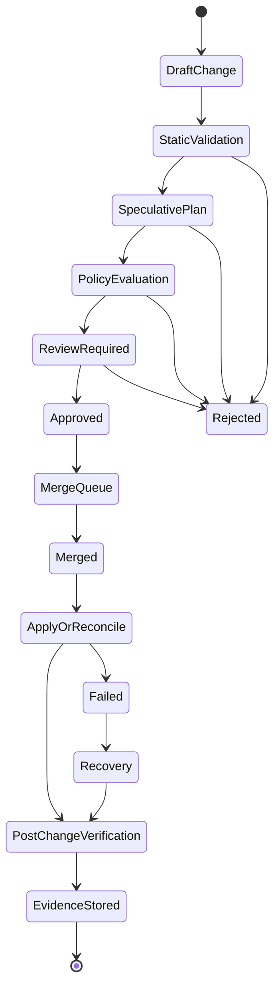

The important point: merge is not the only control. Merge is just one transition.

The platform also controls:

- who can create a PR;
- what validation must run;
- what plan must be reviewed;
- what policy decision must be accepted;
- who may approve;
- whether approval is still fresh;
- which identity can apply;
- whether the applied change matches the approved change;
- whether post-change verification passed;
- whether evidence exists.

---

## 7. Pull Request Contract

Every production-impacting PR must produce a machine-readable change contract.

Example:

```yaml
change:
  id: CHG-2026-07-03-1421
  repository: infra-live
  pullRequest: 4812
  author: alice@example.com
  targetBranch: main
  environment: prod
  cloud: aws
  account: account-payments-prod
  region: ap-southeast-1
  stack: rds-orders
  mutationType: update
  riskClass: high
  requiresApprovalFrom:
    - platform-infra
    - database-owners
    - security
  evidenceRequired:
    - plan
    - policyDecision
    - approvalSnapshot
    - applyLog
    - postApplyVerification
```

This contract can be produced by CI from repository path, catalog metadata, CODEOWNERS, policy bindings, and PR metadata.

The contract prevents a common problem: humans infer too much from context.

A reviewer should not have to guess whether `stacks/prod/aws/account-payments-prod/ap-southeast-1/rds-orders` is production. The pipeline should know.

---

## 8. CI Validation Stage

The first stage rejects malformed or obviously unsafe changes before expensive planning.

Typical checks:

- formatting;
- schema validation;
- module source allowlist;
- provider version constraints;
- lockfile validation;
- no plaintext secret patterns;
- no direct production endpoint in non-production config;
- no forbidden provider alias;
- no unpinned container image tag in production;
- no wildcard IAM action without exception metadata;
- no deleted critical policy file;
- no bypass of generated metadata;
- no direct mutation of evidence files.

Example CI stage:

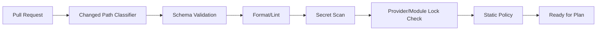

This stage should be fast and deterministic.

The goal is not to prove the change is safe. The goal is to prove the change is well-formed enough to enter deeper evaluation.

---

## 9. IaC Plan Stage

For Terraform/OpenTofu stacks, the plan stage must be treated as a privileged read operation. It may need access to state, provider schemas, and cloud APIs.

The plan stage must produce:

- human-readable plan summary;
- full machine-readable plan artifact;
- normalized risk summary;
- changed resource list;
- action counts;
- policy input document;
- evidence envelope.

Example risk summary:

```yaml
planSummary:
  stack: prod/aws/account-payments-prod/ap-southeast-1/rds-orders
  actions:
    create: 0
    update: 2
    delete: 0
    replace: 1
  highRiskResources:
    - aws_db_instance.orders
  destructive: false
  replacement:
    - aws_db_parameter_group.orders
  sensitiveChanges:
    - kms_key_id
  requiresManualApproval: true
```

The plan stage should not expose secrets in PR comments. A clean PR comment contains a summary and a link to restricted evidence artifacts.

A bad PR comment dumps raw plan output with sensitive values into a public or broadly visible repository.

---

## 10. Policy Gate Stage

Policy evaluation should run against enriched context, not raw plan alone.

Raw plan answers:

- Which resources change?
- Which fields change?
- Which actions occur?

Enriched context answers:

- Which environment is targeted?
- Which service owns this stack?
- Is this a regulated workload?
- Is this an emergency change?
- Which exception is active?
- Which approval group is required?
- Which data classification applies?

Policy input example:

```yaml
input:
  change:
    environment: prod
    account: account-payments-prod
    region: ap-southeast-1
    service: orders
    dataClass: restricted
    riskClass: high
  plan:
    actions:
      replace:
        - type: aws_db_parameter_group
          name: orders
      update:
        - type: aws_db_instance
          name: orders
  approvals:
    current: []
  exceptions:
    active: []
```

Policy decisions should be structured:

```yaml
decision:
  result: deny
  severity: high
  ruleId: iac.prod.database.replacement.requires-db-owner
  message: Production database-affecting replacement requires database owner approval.
  requiredApprovers:
    - database-owners
  evidence:
    - plan.action.replace.aws_db_parameter_group.orders
```

Do not design policy gates as arbitrary text logs. They must produce decisions that machines and auditors can understand.

---

## 11. Approval Binding

A production apply must prove that approval was granted for the same change that is being applied.

Approval binding should include:

- repository;
- PR number;
- commit SHA;
- plan hash;
- policy decision hash;
- approver identity;
- approver group membership snapshot;
- approval timestamp;
- approval freshness window;
- target environment;
- risk class.

Example:

```yaml
approvalBinding:
  pr: 4812
  commitSha: 8fb2d7e
  planSha256: 9e4a...
  policyDecisionSha256: 05cf...
  approvedBy:
    - user: bob@example.com
      groups:
        - platform-infra
      timestamp: 2026-07-03T09:14:22Z
    - user: carol@example.com
      groups:
        - database-owners
      timestamp: 2026-07-03T09:19:40Z
  expiresAt: 2026-07-03T13:19:40Z
```

Without approval binding, a pipeline can accidentally approve one plan and apply another.

That is not a process problem. That is a system design flaw.

---

## 12. Apply Stage

The apply stage is the most dangerous part of the IaC mutation loop.

It must re-check:

- branch protection state;
- commit SHA;
- plan freshness;
- approval freshness;
- policy decision freshness;
- state lock availability;
- target backend;
- execution identity;
- environment freeze status;
- break-glass flags;
- destructive-change requirements.

Apply state machine:

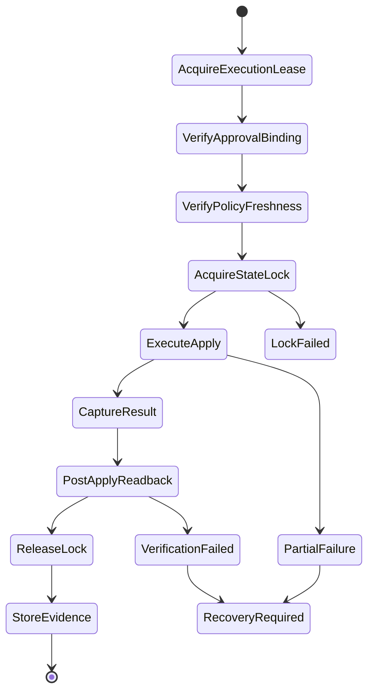

The apply runner should be isolated per trust boundary. A runner that can mutate production networking should not also execute arbitrary pull request code from forks.

Minimum runner controls:

- ephemeral runtime where possible;
- no long-lived cloud keys;
- OIDC federated identity;
- network egress restrictions;
- dependency allowlist;
- restricted state backend access;
- no interactive shell by default;
- artifact upload to immutable evidence store;
- least-privilege cloud role per stack class;
- explicit emergency mode.

---

## 13. GitOps Reconciliation Stage

For application and cluster manifests, merge to the desired-state branch triggers controller reconciliation.

Example Argo CD flow:

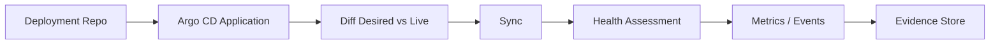

Example Flux flow:

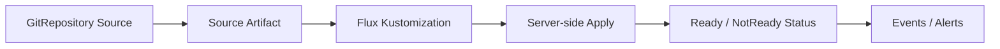

The GitOps controller should not be treated as a magical deploy button. It is a distributed control loop with permissions.

For each GitOps-managed object, define:

- source repository;
- source path;
- controller identity;
- target namespace;
- allowed resource kinds;
- allowed destination cluster;
- sync policy;
- prune policy;
- self-heal policy;
- ignored differences;
- health criteria;
- alert rules.

---

## 14. Progressive Delivery Implementation

Production application rollout should not be a binary “new version everywhere” event.

Example canary contract:

```yaml
rollout:
  strategy: canary
  artifact:
    image: registry.example.com/payments/orders@sha256:abc123
  steps:
    - setWeight: 5
    - pause: 5m
    - analysis:
        successRate: ">= 99.5"
        p95Latency: "<= 300ms"
        errorBudgetBurn: "<= 2x"
    - setWeight: 25
    - pause: 10m
    - analysis:
        successRate: ">= 99.7"
        p95Latency: "<= 280ms"
    - setWeight: 100
  abort:
    onNoData: true
    onMetricError: true
```

Progressive delivery must define no-data behavior. If metrics are missing, the safest default for production should usually be to stop or fail closed, not promote blindly.

Rollout evidence should include:

- artifact digest;
- rollout object revision;
- analysis template version;
- metric queries;
- metric results;
- promotion timestamps;
- abort reason if failed;
- final service version.

---

## 15. Secrets Flow

A production GitOps/IaC platform should avoid storing plaintext secrets in Git and avoid injecting long-lived secrets into general-purpose CI runners.

Reference pattern:

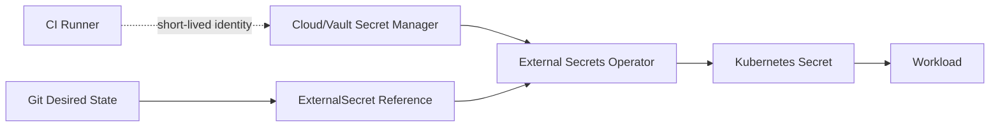

Git contains references, not secret values.

A safe `ExternalSecret` declaration describes:

- which external secret to read;
- which Kubernetes Secret to produce;
- which namespace to place it in;
- which refresh interval to use;
- which service account/identity is allowed;
- which ownership policy applies.

Secret management invariants:

- CI should not print secrets.
- Git should not contain plaintext secrets.
- Terraform/OpenTofu state must be treated as sensitive if it contains secret-derived values.
- Secret rotation must have a delivery and verification path.
- Secret deletion must account for running workloads.
- Break-glass secret access must produce audit evidence.

---

## 16. Supply Chain Gates

Before GitOps accepts a new workload version, the platform should verify artifact integrity.

Minimum production artifact contract:

```yaml
artifact:
  image: registry.example.com/payments/orders@sha256:abc123
  sourceRepository: github.com/example/orders
  sourceCommit: 9d4c...
  buildRun: 712991
  sbom: registry.example.com/attestations/orders-sbom@sha256:def456
  provenance: registry.example.com/attestations/orders-provenance@sha256:789abc
  signed: true
  signerIdentity: repo:example/orders:ref:refs/heads/main
```

Policy gates should reject:

- mutable tags in production;
- unsigned images;
- images signed by unexpected identity;
- missing provenance;
- stale vulnerability exception;
- artifact built from unprotected branch;
- artifact built by untrusted builder;
- artifact whose source commit does not match the release metadata.

This prevents GitOps from becoming a high-speed delivery mechanism for untrusted artifacts.

---

## 17. Multi-Tenancy Model

The platform supports many teams, but not by giving every team cluster-admin access.

Tenancy boundaries:

| Boundary | Mechanism |
|---|---|
| Repository write access | CODEOWNERS, branch protection, required checks |
| IaC stack mutation | stack-specific cloud role, state backend permission, apply gate |
| GitOps application scope | Argo CD Project or Flux namespace/RBAC boundary |
| Kubernetes runtime | namespace, service account, admission policy, network policy |
| Secrets | external secret manager path/role, secret operator identity |
| Observability | tenant-scoped dashboard and logs with platform-level aggregation |
| Evidence | immutable central store with tenant-specific views |

A tenant should be able to operate inside its assigned boundary without being able to escape it.

For example, an application team may change its deployment overlay but not create a cluster-wide privileged DaemonSet. That rule should be enforced by repository policy, GitOps project scope, Kubernetes RBAC, and admission policy.

Defense in depth matters because every single layer can be misconfigured.

---

## 18. Bootstrap Sequence

The hardest part of GitOps/IaC is often the beginning: who creates the thing that reconciles everything else?

A safe bootstrap sequence:

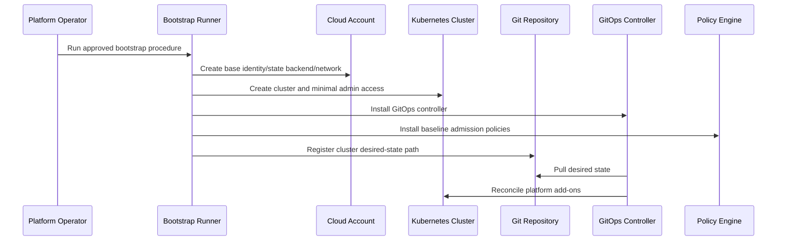

Bootstrap must be documented and evidence-producing because it has unusually high privilege.

Bootstrap artifacts should include:

- bootstrap command version;
- operator identity;
- target account/cluster;
- created roles;
- state backend location;
- GitOps controller version;
- initial admin credentials handling;
- policy baseline version;
- break-glass procedure;
- handoff record from bootstrap to GitOps.

After bootstrap, ongoing changes should flow through normal GitOps/IaC pipelines. Bootstrap should not remain the hidden alternate deployment channel.

---

## 19. Evidence Store Design

The evidence store is not a dumping ground for logs. It is a queryable record of state transitions.

Evidence object model:

```yaml
evidence:
  id: ev-2026-07-03-4812
  changeId: CHG-2026-07-03-1421
  repository: infra-live
  pullRequest: 4812
  commitSha: 8fb2d7e
  actor: alice@example.com
  target:
    environment: prod
    account: account-payments-prod
    region: ap-southeast-1
    stack: rds-orders
  artifacts:
    plan: s3://evidence/prod/4812/plan.json
    policy: s3://evidence/prod/4812/policy.json
    approval: s3://evidence/prod/4812/approval.json
    applyLog: s3://evidence/prod/4812/apply.log
    postCheck: s3://evidence/prod/4812/post-check.json
  result:
    status: success
    startedAt: 2026-07-03T09:33:00Z
    completedAt: 2026-07-03T09:37:12Z
```

Audit queries should be easy:

- “Who approved production database changes last month?”
- “Which changes modified public ingress?”
- “Which emergency changes bypassed normal review?”
- “Which policies denied production changes?”
- “Which deployments used artifacts from unprotected branches?”
- “Which stacks had drift and how was it reconciled?”

If the evidence system cannot answer these questions, the platform has observability but not governance.

---

## 20. Observability Dashboard

A platform dashboard should show the health of the delivery control plane, not just application CPU.

Recommended panels:

### IaC Pipeline

- plan success rate;
- apply success rate;
- average plan duration;
- average apply duration;
- lock wait time;
- failed policy gates;
- stale approvals;
- failed post-apply checks;
- state backend errors;
- drift count by environment;
- emergency changes.

### GitOps

- out-of-sync applications;
- reconciliation latency;
- sync failure count;
- health degraded applications;
- ignored diff count;
- prune events;
- controller queue depth;
- controller API errors;
- suspended Flux resources;
- Argo applications with auto-sync disabled.

### Security and Policy

- admission denies;
- policy exceptions by age;
- unsigned artifact denials;
- stale SBOM/provenance failures;
- secret sync failures;
- break-glass access events.

### Governance

- evidence completeness rate;
- production changes without required artifact;
- approval SLA;
- change failure rate;
- rollback/rollforward count;
- mean time to recovery for pipeline incidents.

---

## 21. Failure Scenario: Partial Apply on Production Database Stack

Scenario:

A PR updates an RDS parameter group and related monitoring alarms. The apply partially succeeds: alarms are updated, but the parameter group replacement fails due to provider/API constraint.

Bad response:

- manually edit cloud console;
- force unlock without investigation;
- rerun apply repeatedly;
- close incident without state reconciliation;
- leave evidence incomplete.

Correct response:

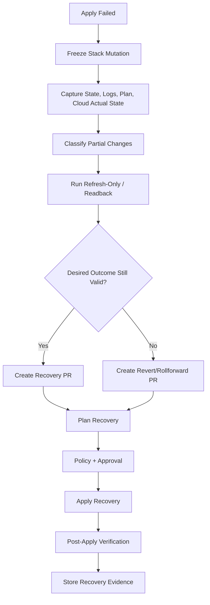

Recovery PR content:

- incident/change reference;
- observed partial state;
- chosen recovery direction;
- updated desired state;
- risk summary;
- required approvals;
- validation plan;
- evidence links.

The key idea: recovery is also a state transition. It must not bypass all controls unless break-glass is truly required.

---

## 22. Failure Scenario: GitOps Controller Applies Bad Manifest

Scenario:

A production deployment manifest passes CI but fails at runtime because a new required secret key is missing.

Correct design:

- admission policy checks secret reference shape;
- pre-sync job verifies external secret availability;
- rollout analysis catches startup failures;
- GitOps marks app degraded;
- alert fires;
- production promotion halts;
- rollback/rollforward PR is created;
- evidence captures object revision and controller events.

Important distinction:

- The Git commit is the desired state.
- The cluster live state is the attempted actual state.
- The missing secret means the desired state is incomplete.

Do not fix it by manually creating a Kubernetes Secret in production. That creates hidden drift and teaches the organization to bypass the control plane.

---

## 23. Policy Exception Workflow

Exceptions are inevitable. Unmanaged exceptions are how policy programs die.

A production exception must include:

```yaml
exception:
  id: EXC-2026-071
  ruleId: iac.aws.s3.public-access-block.required
  scope:
    repository: infra-live
    stack: prod/aws/account-shared-prod/ap-southeast-1/public-artifacts
  justification: Public artifact bucket for signed release assets.
  compensatingControls:
    - CloudFront signed URLs
    - Object-level malware scan
    - Bucket write access restricted to release role
  approvedBy:
    - security@example.com
  expiresAt: 2026-10-01T00:00:00Z
  reviewCadence: monthly
```

Exception invariants:

- every exception has an owner;
- every exception expires;
- every exception has scope;
- every exception has justification;
- every exception is visible in dashboards;
- exception use appears in evidence;
- expired exceptions fail closed.

An exception without expiry is not an exception. It is a new unmanaged standard.

---

## 24. Production Readiness Checklist

Before launching the platform to production teams, validate these controls.

### Repository Controls

- Protected branches enabled.
- CODEOWNERS mapped to real ownership.
- Required checks cannot be bypassed silently.
- Merge queue or equivalent enabled for high-risk repos.
- Production directories have stricter review rules.
- No direct push to production branch.

### IaC Controls

- Remote state backend is encrypted and access-controlled.
- State locking is enabled and monitored.
- Stack boundaries are explicit.
- Plan artifacts are stored securely.
- Apply requires approval binding.
- Destructive changes require special approval.
- Force unlock requires incident/evidence record.

### Identity Controls

- CI uses OIDC or workload identity.
- No long-lived cloud admin keys in CI.
- Runner roles are scoped by environment and stack class.
- Break-glass roles are separate and audited.
- GitOps controller identities are restricted.

### Policy Controls

- Pre-merge policy runs.
- Plan policy runs.
- Admission policy runs.
- Exceptions are scoped and expiring.
- Policy decisions are stored as evidence.
- Policy tests exist.

### GitOps Controls

- App/project boundaries configured.
- Destination clusters/namespaces restricted.
- Prune/self-heal policy intentional.
- Diff ignores reviewed and documented.
- Controller metrics and alerts enabled.
- Controller upgrades tested.

### Secrets Controls

- Plaintext secret scanning enabled.
- External secret manager integrated.
- Secret sync failures alert.
- Secret rotation has playbook.
- IaC state sensitivity reviewed.

### Evidence Controls

- Every production change has evidence ID.
- Plan, policy, approval, apply/sync, verification stored.
- Evidence retention policy defined.
- Evidence redaction policy defined.
- Audit queries tested.

### Recovery Controls

- Stuck lock runbook tested.
- Partial apply runbook tested.
- Bad manifest rollback tested.
- Secret failure runbook tested.
- Controller outage runbook tested.
- Emergency change path tested.

---

## 25. Reference Implementation Milestones

Do not attempt to implement everything at once.

### Milestone 1 — Safe Repository and Plan Foundation

Deliver:

- repo topology;
- protected branches;
- CODEOWNERS;
- stack detection;
- plan pipeline;
- basic policy gate;
- evidence envelope.

Exit criteria:

- every infra PR shows affected stacks;
- every stack can produce plan artifact;
- every production plan has evidence ID;
- direct production apply outside pipeline is documented as unsupported.

### Milestone 2 — Controlled Apply

Deliver:

- apply runner;
- remote state backend;
- locking visibility;
- approval binding;
- short-lived identity;
- post-apply verification.

Exit criteria:

- production apply cannot run without approved plan;
- stale approval blocks apply;
- apply logs and result are stored;
- failed apply creates recovery workflow.

### Milestone 3 — GitOps Runtime

Deliver:

- Argo CD or Flux bootstrap;
- app/project/tenant boundaries;
- cluster-addons GitOps;
- app deployment GitOps;
- controller observability.

Exit criteria:

- production workloads are reconciled from Git;
- manual runtime drift is detected;
- controller alerts are wired;
- sync failure runbook exists.

### Milestone 4 — Policy and Secrets Hardening

Deliver:

- OPA/Kyverno/Conftest policies;
- external secrets integration;
- policy exception workflow;
- admission enforcement;
- secret rotation runbook.

Exit criteria:

- unsafe resources denied pre-merge or admission;
- plaintext secret PR fails;
- expired exception fails;
- secret sync failure alerts.

### Milestone 5 — Progressive Delivery and Evidence Maturity

Deliver:

- canary/blue-green rollout;
- artifact signing/verification;
- SBOM/provenance evidence;
- compliance dashboard;
- audit query pack.

Exit criteria:

- production rollout can stop automatically;
- unsigned artifact cannot deploy;
- audit can answer who/what/when/why/how for changes;
- recovery drills completed.

---

## 26. Common Anti-Patterns in the Case Study

### Anti-Pattern: Git as Suggestion, Console as Reality

If engineers regularly fix production through console changes and later maybe update Git, then Git is not the source of truth. It is documentation.

### Anti-Pattern: One CI Admin Role

A single CI role with broad admin access is operationally convenient and architecturally indefensible.

### Anti-Pattern: Policy Without Context

A policy that cannot distinguish production database replacement from dev sandbox replacement will either block too much or allow too much.

### Anti-Pattern: Approval Without Binding

Human approval that is not bound to a plan hash and commit SHA is easy to invalidate accidentally.

### Anti-Pattern: Diff Ignore as Permanent Fix

Ignoring diffs may be necessary. But every ignored diff should have owner, justification, and review date.

### Anti-Pattern: Rollback Theater

A rollback document that says “revert the commit” is not enough for databases, cloud resources, external state, or irreversible migrations.

### Anti-Pattern: Self-Service as Template Dump

A template without lifecycle ownership, status, policy, and recovery is not a platform API. It is a copy-paste accelerator.

---

## 27. What Good Looks Like

A mature GitOps/IaC platform has these properties:

- Engineers propose changes through normal development workflow.
- The platform classifies risk automatically.
- Plans are reviewable and policy-checked.
- Production approvals are bound to exact artifacts.
- Apply uses short-lived least-privilege identity.
- Kubernetes desired state is continuously reconciled.
- Secrets are referenced, not leaked.
- Drift is visible and triaged.
- Rollouts are progressive for risky workloads.
- Evidence is generated without manual audit scramble.
- Recovery is practiced and encoded.
- Exceptions expire.
- The platform can explain every production state transition.

This is the difference between “we use GitOps tools” and “we operate a GitOps/IaC control plane.”

---

## 28. Mental Model Summary

Think of the production platform as five connected ledgers.

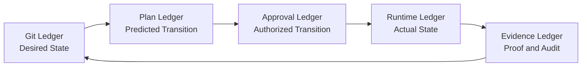

Each ledger answers a different question:

| Ledger | Question |
|---|---|
| Git | What do we want? |
| Plan | What will change? |
| Approval | Who allowed this exact change? |
| Runtime | What actually happened? |
| Evidence | Can we prove it later? |

A weak platform has gaps between these ledgers.

A strong platform makes transitions explicit.

---

## 29. Practical Exercise

Design your own production GitOps/IaC case study using this template.

### Step 1 — Choose a Realistic Domain

Pick one:

- payments platform;
- regulatory case management platform;
- marketplace platform;
- internal developer platform;
- analytics platform;
- banking integration platform.

### Step 2 — Define State Boundaries

List at least 10 state boundaries:

```yaml
stateBoundaries:
  - name: network-prod
    owner: platform-network
    mutationAuthority: opentofu
  - name: orders-api-prod
    owner: orders-team
    mutationAuthority: argocd
  - name: orders-db-schema
    owner: orders-team
    mutationAuthority: migration-runner
```

### Step 3 — Define Change Flow

Draw the state machine from PR to production.

### Step 4 — Define Evidence Contract

Specify artifacts required for:

- non-production app deployment;
- production app deployment;
- non-production infra change;
- production infra change;
- database migration;
- emergency change.

### Step 5 — Define Failure Playbooks

At minimum:

- failed plan;
- stuck lock;
- partial apply;
- failed GitOps sync;
- bad secret;
- failed canary;
- manual production drift.

The exercise is complete only when every failure has a recovery owner, decision path, and evidence record.

---

## 30. Closing

This part assembled the previous parts into a production operating model.

The main lesson is simple but strict:

> A modern GitOps/IaC platform is not a pipeline that runs commands. It is a controlled state-transition system with evidence.

In the final part, we convert this into a concise operating handbook: maturity model, checklists, review questions, anti-pattern catalog, and mastery path.
