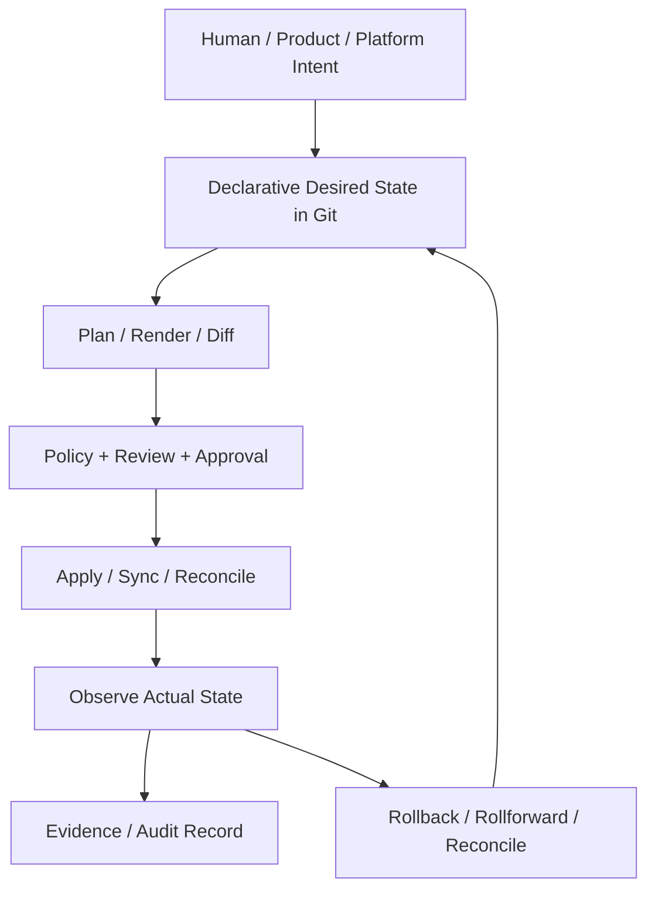

# Part 040 — Final Operating Handbook and Mastery Checklist

This is the final part of the series.

The purpose of this handbook is to compress the whole GitOps/IaC pipeline series into an operating reference you can use during architecture review, production readiness review, incident review, platform design, and team enablement.

The core model is this:

> A state-of-the-art GitOps/IaC platform is a controlled state-transition system. Git records desired state. Plan predicts transition. Policy constrains transition. Approval authorizes transition. Apply/reconcile performs transition. Observability detects result. Evidence proves what happened.

Everything else is implementation detail.

---

## 1. The One-Page Mental Model



A weak delivery system has missing edges.

Examples:

- Desired state exists, but no policy.
- Policy exists, but no approval binding.
- Approval exists, but not tied to plan hash.
- Apply exists, but no post-apply verification.
- Observability exists, but no audit evidence.
- Rollback exists, but only for stateless app deploys.

A strong platform makes the edges explicit.

---

## 2. Core Invariants

These invariants should be treated as design constraints.

### Invariant 1 — One Owner per State Boundary

Every mutable state boundary must have exactly one normal mutation authority.

Examples:

| State | Normal mutation authority |
|---|---|
| Cloud VPC | Terraform/OpenTofu stack |
| Kubernetes Deployment | GitOps controller |
| Kubernetes Secret object | External Secrets Operator |
| Secret value | External secret manager |
| Database schema | Migration runner |
| DNS zone | IaC stack or DNS automation, not both |

If two tools own the same state, reconciliation becomes conflict.

### Invariant 2 — Desired State Must Be Reviewable

A human should be able to understand the intent and risk of the change.

If desired state is generated, the rendered output or normalized diff must be reviewable.

### Invariant 3 — Plans Must Be Bound to Approvals

A production approval must refer to:

- commit SHA;
- plan artifact hash;
- policy decision hash;
- target environment;
- approver identity;
- approval timestamp.

Without binding, approval is theater.

### Invariant 4 — Apply Identity Must Be Short-Lived and Scoped

Production mutation should not depend on static admin keys in CI.

Use workload identity, OIDC federation, cloud role assumption, or similarly constrained short-lived credentials.

### Invariant 5 — Drift Is a First-Class Signal

Drift is not always bad, but hidden drift is always dangerous.

Every drift should be classified as:

- unauthorized drift;
- emergency drift;
- provider/default drift;
- controller-generated drift;
- external actor drift;
- acceptable ignored drift.

### Invariant 6 — Evidence Must Be Produced by the System

Do not rely on humans to reconstruct production changes manually after an audit request.

The system should automatically store:

- PR metadata;
- plan/diff;
- policy result;
- approval snapshot;
- apply/sync result;
- post-change verification;
- rollout analysis;
- exception usage.

### Invariant 7 — Recovery Is Also a State Transition

Recovery should normally go through Git and pipeline again.

Break-glass is allowed only when the normal control plane cannot protect the system quickly enough.

---

## 3. Maturity Model

Use this model to evaluate where an organization is.

### Level 0 — Manual Infrastructure

Characteristics:

- Cloud console changes are normal.
- No reliable source of truth.
- No state backend discipline.
- No consistent review.
- Production knowledge lives in humans.

Main risk:

- Nobody can prove what production should look like.

Next step:

- Introduce IaC for critical resources and protect state.

### Level 1 — Scripted IaC

Characteristics:

- Terraform/OpenTofu exists.
- Engineers run plan/apply locally.
- State may be remote but access is broad.
- Review is inconsistent.
- Drift is discovered accidentally.

Main risk:

- IaC exists, but execution is uncontrolled.

Next step:

- Move plan/apply into controlled pipeline.

### Level 2 — PR-Based IaC

Characteristics:

- PR creates plan.
- Humans review plan.
- Apply happens through CI or IaC automation.
- Some policy checks exist.
- State locking is enabled.

Main risk:

- Approval may not be bound to exact apply artifact.

Next step:

- Add approval binding, policy context, least-privilege identity.

### Level 3 — GitOps Runtime

Characteristics:

- Kubernetes apps reconciled from Git.
- Argo CD or Flux operates cluster state.
- App/project boundaries exist.
- Cluster drift is visible.
- Secrets are integrated with external manager.

Main risk:

- GitOps may deploy untrusted artifacts or over-permitted manifests.

Next step:

- Add admission policy, artifact verification, progressive delivery.

### Level 4 — Governed Platform

Characteristics:

- Policy-as-code covers IaC and Kubernetes.
- Approvals are risk-based.
- Short-lived credentials are standard.
- Evidence is generated automatically.
- Exceptions expire.
- Drift is measured.
- Recovery runbooks exist.

Main risk:

- Platform is safe but may be hard to use.

Next step:

- Build self-service platform APIs and golden paths.

### Level 5 — Adaptive Internal Control Plane

Characteristics:

- Teams consume platform APIs, not raw infra primitives.
- Policy and evidence are built into workflows.
- Progressive delivery is default for high-risk workloads.
- Control-plane SLOs are tracked.
- Recovery drills are practiced.
- Audit queries are self-service.
- AI assistance is sandboxed and policy-constrained.

Main risk:

- Complexity of the platform itself becomes operational burden.

Next step:

- Continuously simplify APIs, retire unused paths, and harden platform SLOs.

---

## 4. Architecture Review Checklist

Use this during design review for any GitOps/IaC platform.

### A. State Boundaries

Ask:

- What state is being managed?
- Where is desired state recorded?
- Where is actual state observed?
- Where is recorded state stored?
- Which tool owns mutation?
- What happens if another actor mutates the same state?
- How is drift classified?

Red flags:

- “Both Terraform and Argo manage this.”
- “We sometimes fix it manually.”
- “The generated YAML is not reviewed.”
- “State is shared across unrelated resources.”

### B. Repository and Ownership

Ask:

- Does repository topology match ownership?
- Are production paths protected differently?
- Are CODEOWNERS meaningful?
- Are policy files protected?
- Are generated files clearly marked?
- Are environment boundaries visible?

Red flags:

- One giant repo with unclear owners.
- Production and dev differ only by a variable named `env`.
- Anyone can approve production change.
- Policy exceptions are normal PR comments.

### C. Plan and Diff

Ask:

- Is the plan deterministic enough to review?
- Is full plan stored securely?
- Is summary useful for humans?
- Are sensitive values redacted?
- Is plan tied to commit SHA?
- Does policy evaluate the same plan humans reviewed?

Red flags:

- Raw plan dumped into public PR.
- Plan is too large to understand.
- Apply runs a different plan without disclosure.
- Destructive change is hidden in noise.

### D. Policy

Ask:

- Which policies are preventive?
- Which are detective?
- Which are corrective?
- Which policies are environment-aware?
- How are exceptions represented?
- Do exceptions expire?
- Are policies tested?

Red flags:

- Policy returns text logs only.
- Policy has no context about production.
- Exceptions never expire.
- Teams bypass policy by changing tooling path.

### E. Identity

Ask:

- Which identity runs plan?
- Which identity runs apply?
- Which identity reconciles cluster state?
- Are credentials short-lived?
- What can the identity mutate?
- Is break-glass separate?

Red flags:

- CI has permanent cloud admin keys.
- Same role applies dev and prod.
- GitOps controller has cluster-admin by default.
- No audit trail for manual access.

### F. GitOps Controller

Ask:

- Is the controller scoped by project/tenant?
- Which repositories can it read?
- Which namespaces can it mutate?
- Can it prune resources?
- Does it self-heal drift?
- Which diffs are ignored?
- Are sync failures alerted?

Red flags:

- Controller can deploy anything anywhere.
- Ignored diffs have no owner.
- Manual kubectl changes are expected.
- App health is not monitored.

### G. Secrets

Ask:

- Are secret values in Git?
- Are secret references reviewed?
- Who can read external secrets?
- Who can sync them into Kubernetes?
- How is rotation performed?
- Does state contain secret material?

Red flags:

- Encrypted secrets are copied without ownership.
- Secret manager access is broader than app access.
- Rotation requires manual redeploy guesswork.
- Pipeline logs may contain secrets.

### H. Observability and Evidence

Ask:

- What metrics show control-plane health?
- Are failed plans visible?
- Are failed syncs visible?
- Are policy denials visible?
- Can audit reconstruct a production change?
- Is evidence tamper-resistant?

Red flags:

- Observability only covers workloads, not pipeline.
- Evidence is scattered across CI logs.
- Logs expire before audit retention period.
- Approval cannot be tied to applied artifact.

### I. Recovery

Ask:

- What happens after partial apply?
- What happens after stuck lock?
- What happens after bad manifest?
- What happens after secret sync failure?
- What happens after controller outage?
- Who can invoke break-glass?

Red flags:

- Recovery plan is “rerun the job.”
- Rollback means “revert commit” for every state type.
- State restore procedure is untested.
- Emergency changes have no evidence.

---

## 5. Production Change Contract

Every production-impacting change should have this contract.

```yaml
productionChangeContract:
  identity:
    changeId: string
    repository: string
    pullRequest: number
    commitSha: string
    author: string
  target:
    environment: prod
    account: string
    region: string
    cluster: optional-string
    namespace: optional-string
    stack: optional-string
    service: string
  classification:
    changeType: app-deploy | infra-change | policy-change | database-change | secret-change | platform-change
    riskClass: low | medium | high | critical
    destructive: boolean
    regulatedData: boolean
  predictedTransition:
    planArtifact: uri
    planHash: sha256
    diffSummary: uri
  decision:
    policyDecision: allow | deny | warn | require-approval
    policyArtifact: uri
    requiredApprovers: list
    exceptionsUsed: list
  authorization:
    approvedBy: list
    approvalTimestamp: datetime
    approvalBindingHash: sha256
  execution:
    runnerIdentity: string
    startedAt: datetime
    completedAt: datetime
    result: success | failed | partial | cancelled
  verification:
    postCheckArtifact: uri
    driftAfterChange: none | expected | unexpected
  evidence:
    evidenceId: string
    retentionClass: standard | regulated | incident
```

This contract is the minimum abstraction for a defensible platform.

---

## 6. Policy Rule Catalog

A mature platform has policy rules in categories.

### Repository Policies

- Production branch must be protected.
- Production directory requires CODEOWNER approval.
- Policy files require security/platform approval.
- Generated files cannot be manually edited.
- Emergency label requires incident reference.

### IaC Policies

- Provider versions must be constrained.
- Modules must come from approved sources.
- Production resources require tags/labels.
- Public network exposure requires approval.
- Storage must be encrypted.
- IAM wildcard actions require exception.
- Critical resource deletion requires elevated approval.
- Database replacement requires data owner approval.

### Kubernetes Policies

- Production image must use digest.
- Privileged container denied by default.
- HostPath denied by default.
- Resource requests/limits required.
- Namespace labels required.
- ServiceAccount token automount disabled unless needed.
- Ingress host must match allowed domain.
- ExternalSecret references must be scoped.

### Supply Chain Policies

- Image must be signed.
- Signer identity must match repository.
- Provenance must exist for production.
- SBOM must exist for regulated workloads.
- Artifact must be built from protected branch.
- Artifact must not be older than allowed release window.

### Secrets Policies

- Plaintext secrets denied.
- Secret reference must point to approved path.
- Secret sync interval must be within allowed bounds.
- Secret rotation metadata required for regulated workloads.
- Secret manager access role must match service identity.

### Evidence Policies

- Production change requires evidence ID.
- Apply must upload result artifact.
- Rollout must upload analysis result.
- Emergency change requires incident link.
- Exception use must be recorded.

---

## 7. Runbook Index

These runbooks should exist before broad production rollout.

### IaC Runbooks

1. Failed plan.
2. Provider initialization failure.
3. State lock timeout.
4. Force unlock request.
5. Partial apply.
6. State corruption suspicion.
7. Remote backend outage.
8. Provider upgrade regression.
9. Drift detected in production.
10. Critical resource deletion prevention.

### GitOps Runbooks

1. Application out of sync.
2. Application degraded.
3. Sync blocked by admission policy.
4. Bad manifest merged.
5. Controller cannot reach repository.
6. Controller cannot reach Kubernetes API.
7. Prune deleted wrong object.
8. Diff noise causing alert fatigue.
9. Controller upgrade failure.
10. Multi-cluster rollout halt.

### Secrets Runbooks

1. External secret sync failure.
2. Secret manager access denied.
3. Secret rotation failed.
4. Secret leaked in PR.
5. Secret leaked in CI log.
6. Secret value changed without rollout.
7. Break-glass secret access.

### Policy Runbooks

1. False positive denial.
2. False negative incident.
3. Expired exception blocks production.
4. Policy engine outage.
5. Admission webhook failure.
6. Emergency policy bypass.
7. Policy rollout causing broad failure.

### Release Runbooks

1. Failed canary.
2. No telemetry during rollout.
3. Bad artifact signature.
4. SBOM/provenance missing.
5. Production freeze exception.
6. Rollback incompatible with database state.
7. Rollforward after partial deployment.

---

## 8. Standard Runbook Shape

Every runbook should follow this shape.

```md
# Runbook: <failure name>

## Trigger
What alert, symptom, or event starts this runbook?

## Impact
What users, systems, environments, or controls are affected?

## Immediate Safety Action
What must be stopped, frozen, or isolated first?

## Diagnosis
What evidence must be collected before mutation?

## Decision Tree
What options exist and when should each be chosen?

## Recovery Procedure
Step-by-step recovery path.

## Verification
How do we know the system is healthy again?

## Evidence
Which artifacts must be stored?

## Follow-Up
Which backlog, policy, or architecture changes should be considered?
```

A runbook that starts with mutation before evidence capture is dangerous.

---

## 9. Anti-Pattern Catalog

### 1. Tool-First GitOps

Symptom:

- The team installs Argo CD or Flux and declares victory.

Why it fails:

- Tooling does not define ownership, approval, policy, recovery, or evidence by itself.

Fix:

- Define state boundaries and operating model first.

### 2. Terraform State Monolith

Symptom:

- One state file owns unrelated platform and application resources.

Why it fails:

- Lock contention, review complexity, blast radius, and recovery difficulty explode.

Fix:

- Split state by lifecycle and ownership boundary.

### 3. Invisible Environment Model

Symptom:

- Production is selected by a variable hidden deep in CI or values file.

Why it fails:

- Reviewers and policy cannot reliably classify risk.

Fix:

- Encode environment/account/region/cluster in path and metadata.

### 4. Static Credentials in CI

Symptom:

- CI stores cloud access keys.

Why it fails:

- Credential leakage leads directly to infrastructure mutation.

Fix:

- Use short-lived federated identity and scoped roles.

### 5. Policy as Afterthought

Symptom:

- Policy is added after teams already rely on unsafe patterns.

Why it fails:

- Real enforcement becomes politically hard.

Fix:

- Start with warn mode, publish rules, define exceptions, then enforce progressively.

### 6. Approval Without Artifact Binding

Symptom:

- A human approves a PR, but apply re-plans later.

Why it fails:

- The approved change may not be the applied change.

Fix:

- Bind approval to commit, plan hash, policy hash, target, and freshness window.

### 7. GitOps vs Runtime Fight

Symptom:

- Engineers hotfix live objects with kubectl while GitOps reverts them.

Why it fails:

- The system has two sources of desired state.

Fix:

- Emergency runtime changes must be explicitly recorded and reconciled back to Git.

### 8. Secret Values in Delivery Layer

Symptom:

- CI, Git, or Terraform state becomes the secret manager.

Why it fails:

- Delivery systems are rarely designed for secret lifecycle management.

Fix:

- Keep secret values in dedicated secret managers and deliver references through GitOps.

### 9. Diff Ignore Abuse

Symptom:

- Teams silence every noisy diff.

Why it fails:

- Drift detection loses meaning.

Fix:

- Require owner, reason, scope, and review date for ignored diffs.

### 10. Rollback Theater

Symptom:

- Rollback plan says “revert the PR.”

Why it fails:

- Databases, queues, cloud resources, and external side effects may be irreversible.

Fix:

- Define rollback/rollforward by state type.

### 11. Portal Without Control Plane

Symptom:

- Self-service means generating YAML templates.

Why it fails:

- Users get creation convenience without lifecycle ownership.

Fix:

- Build platform APIs with status, ownership, policy, evidence, and decommissioning.

### 12. Audit by Archaeology

Symptom:

- Audit requires searching PRs, CI logs, Slack messages, and dashboards manually.

Why it fails:

- Evidence is not intentionally produced.

Fix:

- Generate change evidence automatically as part of the transition system.

---

## 10. SLOs for the Delivery Control Plane

A GitOps/IaC platform is itself a production system.

Suggested SLOs:

| Area | Example SLO |
|---|---|
| Plan pipeline availability | 99.5% successful plan job start for valid PRs |
| Plan latency | 95% of small stack plans complete within 10 minutes |
| Apply reliability | 99% of approved non-destructive applies complete without platform-caused failure |
| GitOps reconciliation | 95% of healthy apps reconciled within target interval after merge |
| Policy decision latency | 99% of policy checks complete within 60 seconds |
| Evidence completeness | 99.9% of production changes have complete evidence envelope |
| Drift detection | Production drift detected within defined interval |
| Secret sync | 99% of secret syncs converge within target interval |
| Recovery | Critical pipeline incidents have tested runbook and owner |

Do not make SLOs only about application uptime. The control plane must be reliable enough for teams to trust it during incidents.

---

## 11. Metrics Dictionary

Useful metrics:

### Change Metrics

- `gitops_iac_change_count`
- `gitops_iac_change_failure_count`
- `gitops_iac_change_lead_time_seconds`
- `gitops_iac_approval_wait_seconds`
- `gitops_iac_emergency_change_count`

### Plan/Apply Metrics

- `iac_plan_duration_seconds`
- `iac_plan_failure_count`
- `iac_apply_duration_seconds`
- `iac_apply_failure_count`
- `iac_state_lock_wait_seconds`
- `iac_drift_detected_count`

### Policy Metrics

- `policy_decision_count`
- `policy_deny_count`
- `policy_warn_count`
- `policy_exception_count`
- `policy_exception_expired_count`

### GitOps Metrics

- `gitops_reconciliation_duration_seconds`
- `gitops_sync_failure_count`
- `gitops_out_of_sync_count`
- `gitops_degraded_app_count`
- `gitops_prune_event_count`

### Evidence Metrics

- `evidence_record_created_count`
- `evidence_incomplete_count`
- `evidence_upload_failure_count`
- `evidence_query_latency_seconds`

The exact metric names will vary by implementation. The important part is the conceptual coverage.

---

## 12. ADR Template for GitOps/IaC Decisions

Use this for architectural decisions.

```md
# ADR: <decision title>

## Status
Proposed | Accepted | Deprecated | Superseded

## Context
What problem are we solving? Which state boundary is involved?

## Decision
What are we choosing?

## Alternatives Considered
What else was considered and rejected?

## Consequences
Positive and negative trade-offs.

## Invariants
Which invariants must remain true?

## Failure Modes
How can this decision fail?

## Recovery
How do we recover from those failures?

## Evidence
What evidence will prove this decision is working?

## Review Date
When should this decision be revisited?
```

Good ADRs are not essays. They are compressed decision records with consequences.

---

## 13. Review Questions by Role

### Platform Engineer

- Is the state boundary explicit?
- Is the runner identity too powerful?
- Can the pipeline recover from partial failure?
- Is the controller scoped correctly?
- Is drift visible?

### Security Engineer

- Are credentials short-lived?
- Are policies enforced at the right point?
- Can artifact provenance be verified?
- Are exceptions scoped and expiring?
- Can audit identify who approved what?

### SRE

- What alerts fire when reconciliation fails?
- What is the recovery path for controller outage?
- What happens if cloud API is degraded?
- How do we detect change-induced incidents?
- Are runbooks tested?

### Application Team Lead

- Is the golden path usable?
- Can teams understand failed policy decisions?
- Can teams safely promote releases?
- Can teams recover from bad deploys?
- Are ownership and escalation clear?

### Auditor / Governance

- Can we reconstruct production changes?
- Are approvals bound to artifacts?
- Are emergency changes distinguishable?
- Are exceptions reviewed?
- Is evidence retained and protected?

---

## 14. Skill Mastery Map

To become deeply capable, master these sub-skills.

### Foundational

- Git workflow and protected branches.
- Infrastructure as Code state model.
- Kubernetes reconciliation model.
- CI/CD security boundaries.
- Cloud IAM and workload identity.

### Intermediate

- Terraform/OpenTofu module and state design.
- GitOps controller configuration.
- Policy-as-code authoring.
- Secrets delivery patterns.
- Plan/apply automation.
- Progressive delivery.

### Advanced

- Multi-account/multi-cluster architecture.
- Platform API design.
- Crossplane composition patterns.
- Supply chain attestation.
- Audit evidence architecture.
- Failure modeling and recovery engineering.

### Expert

- Designing organizational operating models.
- Building internal developer platforms.
- Balancing self-service with governance.
- Formalizing state-transition contracts.
- Proving regulatory defensibility.
- Simplifying complex control planes without weakening controls.

The expert level is less about knowing more tools and more about seeing the system boundaries clearly.

---

## 15. Practice Plan

Follow this sequence if you want hands-on mastery.

### Week 1 — State and Repository Model

Build:

- an `infra-live` repo;
- 3 stack boundaries;
- remote state backend;
- protected branch;
- CODEOWNERS.

Practice:

- split a bad monolithic state;
- classify stack risk;
- design path-based ownership.

### Week 2 — Plan and Policy

Build:

- plan pipeline;
- plan JSON artifact;
- risk summary;
- OPA/Conftest policy;
- policy decision output.

Practice:

- detect public exposure;
- detect IAM wildcard;
- require approval for destructive changes.

### Week 3 — Controlled Apply

Build:

- approval binding;
- apply runner;
- lock monitoring;
- post-apply readback;
- evidence envelope.

Practice:

- stale approval failure;
- lock contention;
- partial apply recovery simulation.

### Week 4 — GitOps Runtime

Build:

- Argo CD or Flux bootstrap;
- app deployment repo;
- namespace-scoped tenant;
- external secret reference;
- controller metrics.

Practice:

- bad manifest recovery;
- drift detection;
- sync failure diagnosis.

### Week 5 — Progressive Delivery and Supply Chain

Build:

- image digest promotion;
- signing verification;
- SBOM/provenance check;
- canary rollout;
- metric-based promotion.

Practice:

- failed canary;
- missing signature;
- no telemetry policy.

### Week 6 — Governance and Platform API

Build:

- evidence store;
- audit query examples;
- service catalog metadata;
- self-service request flow;
- exception workflow.

Practice:

- audit reconstruction;
- expired exception denial;
- platform API version migration.

---

## 16. Final Exam: Design Challenge

Design a GitOps/IaC platform for this scenario:

- 30 services.
- 3 environments.
- 2 regions.
- 5 Kubernetes clusters.
- Production uses regulated customer data.
- Teams need self-service database provisioning.
- Security requires artifact signing.
- Audit requires proof of approval and deployment.
- Cloud credentials cannot be long-lived.
- Emergency changes are allowed but must be traceable.

Your answer should include:

1. Repository topology.
2. State boundary table.
3. Change state machine.
4. Plan/apply workflow.
5. GitOps controller model.
6. Identity model.
7. Secrets model.
8. Policy catalog.
9. Evidence schema.
10. Drift workflow.
11. Rollback/rollforward model.
12. Failure playbooks.
13. Maturity roadmap.

You have mastered the topic when you can defend every boundary and trade-off, not when you can name every tool.

---

## 17. Minimal Production Platform Blueprint

If you need a pragmatic starting point, use this blueprint.

### Core Tools

- Git provider with protected branches and CODEOWNERS.
- CI system with OIDC federation.
- OpenTofu or Terraform for cloud IaC.
- Remote state backend with locking and encryption.
- Argo CD or Flux for Kubernetes GitOps.
- OPA/Conftest or Checkov for IaC policy.
- Kyverno or Gatekeeper or ValidatingAdmissionPolicy for Kubernetes policy.
- External Secrets Operator with cloud secret manager or Vault.
- Cosign/Sigstore-style signing and verification for production images.
- Prometheus/OpenTelemetry-compatible telemetry.
- Object storage or evidence service for immutable evidence artifacts.

### Minimum Controls

- No static cloud admin keys in CI.
- No production apply without PR.
- No production apply without plan.
- No production apply without approval binding.
- No production workload without digest.
- No production secret value in Git.
- No production policy exception without expiry.
- No ignored diff without owner.
- No break-glass without evidence.

This is not the most advanced possible setup. It is a strong baseline.

---

## 18. When to Choose Argo CD, Flux, Terraform/OpenTofu, Crossplane

Use this simplified decision matrix.

| Need | Strong default |
|---|---|
| Manage cloud resources with explicit plan/apply | Terraform/OpenTofu |
| Continuously reconcile Kubernetes app manifests | Argo CD or Flux |
| Strong UI and app-centric operations | Argo CD |
| Composable controller toolkit and namespace-centric multi-tenancy | Flux |
| Build Kubernetes-native platform APIs for infrastructure | Crossplane |
| Package third-party Kubernetes apps | Helm, often rendered through GitOps |
| Patch environment overlays without templates | Kustomize |
| Strong config schema and constraints | CUE |
| Programmable config generation | Jsonnet |

Do not force one tool to own every lifecycle.

Tool selection should follow state ownership.

---

## 19. The Highest-Leverage Questions

When reviewing any GitOps/IaC design, ask these questions first:

1. What is the source of truth?
2. What is the state boundary?
3. Who owns the state?
4. What predicts the change?
5. What constrains the change?
6. Who authorizes the change?
7. What identity performs the change?
8. What observes the result?
9. What proves the change later?
10. What happens when the change partially fails?

Most bad designs fail one of these questions.

---

## 20. Final Checklist

Use this as the end-of-series checklist.

### Design

- [ ] State boundaries are explicit.
- [ ] Mutation authority is unique per state boundary.
- [ ] Repository topology follows ownership.
- [ ] Environment model is visible.
- [ ] Blast radius is understood.

### Pipeline

- [ ] Plan pipeline exists.
- [ ] Apply pipeline exists.
- [ ] Approval binding exists.
- [ ] Apply identity is least-privilege.
- [ ] Destructive changes have elevated path.

### GitOps

- [ ] Controller scope is constrained.
- [ ] App/project/tenant boundaries exist.
- [ ] Sync failures alert.
- [ ] Drift is classified.
- [ ] Diff ignores are governed.

### Policy

- [ ] Pre-merge policy exists.
- [ ] Plan policy exists.
- [ ] Admission policy exists.
- [ ] Exceptions expire.
- [ ] Policy decisions are evidence.

### Secrets

- [ ] Secret values are not stored in Git.
- [ ] Secret references are reviewed.
- [ ] Secret delivery is observable.
- [ ] Rotation runbook exists.
- [ ] State sensitivity is understood.

### Supply Chain

- [ ] Production artifacts use digest.
- [ ] Signing is verified.
- [ ] Provenance is required for high-risk workloads.
- [ ] SBOM exists where required.
- [ ] Builder identity is trusted.

### Observability

- [ ] Pipeline metrics exist.
- [ ] Controller metrics exist.
- [ ] Policy metrics exist.
- [ ] Evidence completeness metrics exist.
- [ ] SLOs exist for the delivery control plane.

### Recovery

- [ ] Failed plan runbook exists.
- [ ] Stuck lock runbook exists.
- [ ] Partial apply runbook exists.
- [ ] Bad manifest runbook exists.
- [ ] Secret failure runbook exists.
- [ ] Break-glass runbook exists.

### Governance

- [ ] Production changes are reconstructable.
- [ ] Approvals are bound to artifacts.
- [ ] Emergency changes are visible.
- [ ] Audit queries are tested.
- [ ] Retention/redaction policy exists.

---

## 21. What “Top 1%” Looks Like Here

A top-tier engineer in this domain does not merely know Argo CD, Flux, Terraform, OpenTofu, Crossplane, OPA, Kyverno, SOPS, Vault, and Cosign.

A top-tier engineer can:

- model infrastructure delivery as state transitions;
- identify hidden state ownership conflicts;
- design repository topology from ownership and blast radius;
- build reviewable plan artifacts;
- bind approval to exact changes;
- use identity as a control boundary;
- design policy with context and exception lifecycle;
- separate secrets reference from secret value;
- make drift visible without causing alert fatigue;
- distinguish rollback from rollforward by state type;
- design recovery before incidents happen;
- produce audit evidence automatically;
- simplify platform APIs for teams without weakening control.

The tools will change. These capabilities transfer.

---

## 22. Series Completion

This is the final part of `learn-gitops-iac-pipeline`.

The complete series covered:

1. Skill map and learning strategy.
2. Operating model.
3. System boundaries and invariants.
4. Reference architecture.
5. Repository topology.
6. Branching and promotion flow.
7. IaC engine selection.
8. Terraform/OpenTofu state model.
9. Module system design.
10. Environment modeling.
11. Stack orchestration.
12. Plan pipeline.
13. Apply pipeline.
14. PR-driven IaC automation.
15. Managed runners.
16. Credentials and identity.
17. Secrets management.
18. Policy-as-code foundation.
19. IaC policy gates.
20. Kubernetes admission policy.
21. Supply chain security.
22. Sigstore/Cosign/attestation.
23. Argo CD core model.
24. Flux core model.
25. Argo CD vs Flux decision framework.
26. Configuration rendering.
27. Progressive delivery.
28. Promotion and release governance.
29. Drift detection and reconciliation.
30. Observability.
31. Failure modeling.
32. Rollback and rollforward.
33. Database and stateful change.
34. Multi-cluster/multi-account design.
35. Platform API and self-service.
36. Crossplane control-plane patterns.
37. AI-assisted IaC safely.
38. Compliance, audit, and evidence.
39. Production case study.
40. Final operating handbook.

The series is complete.
