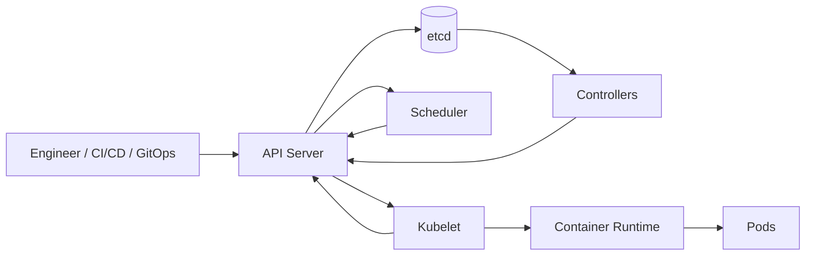
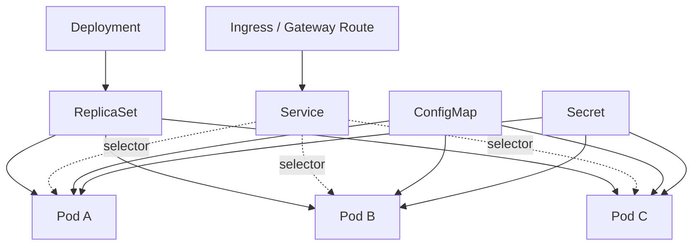
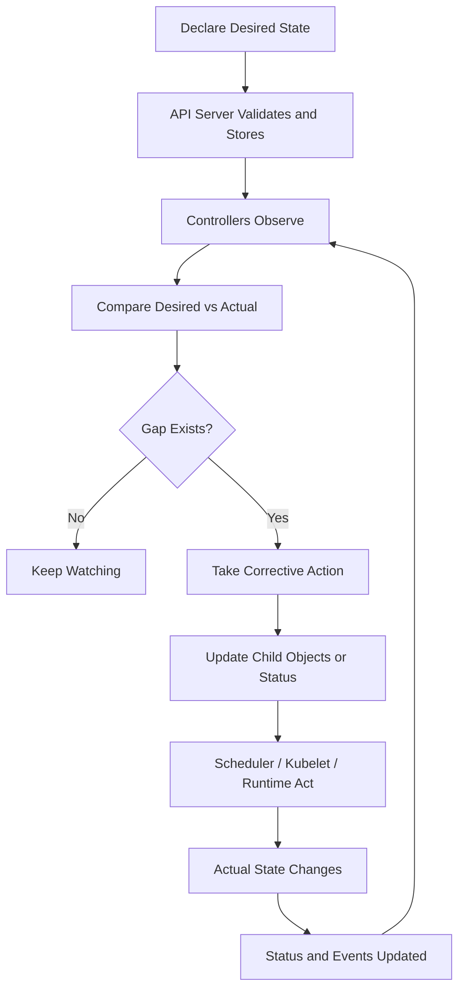
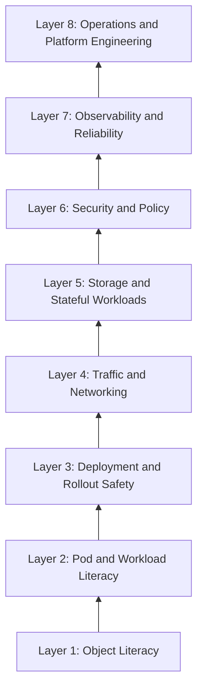

------
title: Learn Kubernetes, Deployment Model, and Cloud Native Platform Engineering - Part 001
description: Kaufman skill map untuk menguasai Kubernetes sebagai sistem deployment, operasi, reliability, security, dan platform engineering tingkat produksi.
series: learn-kubernetes-deployment-model
seriesTitle: Learn Kubernetes, Deployment Model, and Cloud Native Platform Engineering
order: 1
partTitle: Kaufman Skill Map
tags:
- kubernetes
- deployment
- platform-engineering
- cloud-native
- devops
- sre
- series
date: 2026-07-01
---

# Part 001 — Kaufman Skill Map

> Tujuan part ini bukan mengajarkan `kubectl` dulu. Tujuannya adalah membuat peta skill yang benar: apa yang perlu dikuasai, urutannya, batasannya, dan bagaimana kita tahu bahwa pemahaman kita sudah naik dari “bisa deploy YAML” menjadi “bisa merancang, mengoperasikan, dan mempertahankan platform Kubernetes production-grade”.

Kubernetes adalah platform untuk mengelola workload dan service containerized secara portabel dan extensible. Tetapi di level engineer senior/principal, Kubernetes tidak boleh dipahami sebagai “alat menjalankan container”. Kubernetes harus dipahami sebagai **control-plane untuk desired state**: kita menyatakan state yang diinginkan, lalu kumpulan controller, scheduler, kubelet, admission chain, network layer, dan storage layer mencoba membawa realitas cluster menuju state tersebut.

Karena itu, seri ini akan memperlakukan Kubernetes sebagai gabungan dari:

1. **API platform** — semua hal penting direpresentasikan sebagai resource object.
2. **State reconciliation system** — controller terus membandingkan desired state dan actual state.
3. **Distributed scheduler** — workload ditempatkan berdasarkan resource, policy, topology, dan constraint.
4. **Deployment safety engine** — rollout, rollback, canary, disruption budget, dan progressive delivery.
5. **Runtime governance layer** — identity, RBAC, admission policy, pod security, network isolation, dan supply-chain rules.
6. **Reliability substrate** — observability, self-healing, autoscaling, failure containment, and graceful degradation.
7. **Platform engineering foundation** — abstraction untuk developer self-service, environment promotion, multi-tenant governance, dan internal developer platform.

---

## 1. Cara Membaca Seri Ini

Seri ini mengikuti prinsip *rapid skill acquisition* dari Josh Kaufman: skill besar harus dipecah menjadi sub-skill kecil, kita belajar cukup untuk bisa mengoreksi diri, menghilangkan barrier latihan, lalu melatih sub-skill yang paling penting terlebih dahulu.

Dalam konteks Kubernetes, ini berarti kita tidak mulai dari daftar resource YAML secara acak. Kita mulai dari pertanyaan yang lebih fundamental:

- Apa yang Kubernetes anggap sebagai “state”?
- Siapa yang mengubah state itu?
- Bagaimana object berubah dari `spec` menjadi `status`?
- Kapan sebuah rollout dianggap sehat?
- Kenapa Pod tidak boleh dianggap sebagai server tetap?
- Kenapa Service bukan load balancer biasa?
- Kenapa debugging Kubernetes sering gagal ketika engineer berpikir secara imperative?
- Bagaimana security, network, storage, dan policy ikut mengubah deployment model?
- Apa invariant yang harus dijaga agar platform tetap aman, recoverable, dan auditable?

Materi disusun seperti internal engineering handbook: fokus pada mental model, invariant, failure mode, trade-off, dan decision framework.

---

## 2. Skill yang Sebenarnya Ingin Dikuasai

Kalimat “belajar Kubernetes” terlalu kabur. Target skill kita adalah:

> Mampu merancang, men-deploy, mengamankan, mengobservasi, men-debug, dan mengoperasikan workload production di Kubernetes dengan deployment model yang aman, repeatable, auditable, scalable, dan sesuai kebutuhan organisasi.

Skill ini mencakup kemampuan desain dan operasi sekaligus. Engineer yang hanya bisa menulis YAML belum menguasai Kubernetes. Engineer yang menguasai Kubernetes bisa menjawab pertanyaan seperti:

- Controller apa yang tepat untuk workload ini?
- Apakah workload ini stateless, stateful, singleton, batch, daemon, event-driven, atau hybrid?
- Bagaimana strategi rollout agar failure tidak langsung berdampak global?
- Apa batas blast radius jika image baru crash-loop?
- Apa yang terjadi jika node hilang ketika rollout sedang berjalan?
- Bagaimana mengatur request/limit agar cluster tidak overcommit secara berbahaya?
- Bagaimana menjamin hanya workload tertentu yang boleh mengakses secret tertentu?
- Bagaimana membaca gejala DNS failure, CNI failure, kubelet failure, image pull failure, scheduling failure, dan storage attach failure?
- Kapan Kubernetes membantu, dan kapan Kubernetes justru menambah kompleksitas?

---

## 3. Batas Seri Ini

Agar pembelajaran efisien, seri ini memiliki boundary yang jelas.

### 3.1 Yang Dibahas Mendalam

- Kubernetes API object model
- Declarative management
- Pod lifecycle
- Controller dan reconciliation
- Deployment, ReplicaSet, StatefulSet, DaemonSet, Job, CronJob
- Rollout, rollback, blue-green, canary, shadow, progressive delivery
- Scheduling, affinity, taint/toleration, topology spread
- Resource request/limit, QoS, eviction, autoscaling
- Service discovery, Service, EndpointSlice, DNS, ingress, Gateway API
- NetworkPolicy, zero-trust networking, service mesh trade-off
- Storage model: Volume, PV, PVC, StorageClass, CSI
- Stateful workload design
- RBAC, ServiceAccount, admission control, Pod Security Standards
- Supply-chain security: image, SBOM, signing, provenance
- Observability: logs, metrics, events, traces
- Production debugging
- SLO, failure modeling, disruption management
- Upgrade, deprecation, version skew
- GitOps, Helm, Kustomize
- CRD, operator pattern, platform API
- Multi-cluster, multi-tenant, internal developer platform

### 3.2 Yang Sengaja Tidak Diulang

Karena seri ini adalah lanjutan setelah basic dan tidak ingin mengulang materi containerization, kita tidak akan mengulang panjang:

- Apa itu container
- Cara menulis Dockerfile dari nol
- Docker Compose basic
- Docker network basic
- Docker volume basic
- Docker Swarm sebagai orchestrator
- Perintah Docker harian

Hal-hal Docker hanya akan disentuh sebagai **runtime contract**: image harus immutable, process harus foreground, signal harus benar, container harus ephemeral, log harus ke stdout/stderr, dan readiness harus diekspose secara eksplisit.

---

## 4. Prinsip Kaufman untuk Seri Kubernetes Ini

### 4.1 Deconstruct the Skill

Kubernetes terlihat besar karena banyak resource dan tool. Tetapi secara struktur, skill Kubernetes bisa dipecah menjadi beberapa lapisan.

```mermaid
flowchart TD
    A[Kubernetes Mastery] --> B[API & Object Model]
    A --> C[Workload Model]
    A --> D[Deployment Model]
    A --> E[Scheduling & Capacity]
    A --> F[Networking & Traffic]
    A --> G[Storage & Stateful Systems]
    A --> H[Security & Governance]
    A --> I[Observability & Reliability]
    A --> J[Operations & Upgrades]
    A --> K[Platform Engineering]

    B --> B1[spec/status]
    B --> B2[metadata]
    B --> B3[resource version]
    B --> B4[declarative apply]

    C --> C1[Pod]
    C --> C2[Deployment]
    C --> C3[StatefulSet]
    C --> C4[DaemonSet]
    C --> C5[Job/CronJob]

    D --> D1[rolling update]
    D --> D2[rollback]
    D --> D3[canary]
    D --> D4[blue-green]
    D --> D5[progressive delivery]

    H --> H1[RBAC]
    H --> H2[ServiceAccount]
    H --> H3[Pod Security]
    H --> H4[Admission Policy]
    H --> H5[Supply Chain]
```



Kita akan belajar dari lapisan yang paling fundamental dulu: API, object, desired state, dan reconciliation. Setelah itu workload, deployment, traffic, security, observability, dan platform.

### 4.2 Learn Enough to Self-Correct

Tujuan setiap part bukan menghafal command. Tujuannya adalah bisa menjawab:

- Apa yang saya kira terjadi?
- Apa yang benar-benar terjadi di cluster?
- Object mana yang menjadi sumber kebenaran?
- Controller mana yang bertanggung jawab?
- Event/status mana yang membuktikan masalah?
- Apakah masalahnya di spec, scheduler, kubelet, network, runtime, image, policy, atau aplikasi?

Kubernetes sering membingungkan karena banyak gejala terlihat mirip. Misalnya, aplikasi “tidak bisa diakses” bisa disebabkan oleh:

- Pod belum ready
- container crash-loop
- readiness probe salah
- Service selector salah
- EndpointSlice kosong
- DNS gagal resolve
- NetworkPolicy memblokir traffic
- ingress controller salah route
- TLS termination salah
- app hanya bind ke `localhost`
- port name mismatch
- targetPort salah
- node pressure menyebabkan eviction
- image pull gagal
- secret/config tidak tersedia

Engineer yang baik tidak menebak. Ia mempersempit ruang masalah dengan membaca object graph.

### 4.3 Remove Practice Barriers

Barrier terbesar dalam belajar Kubernetes bukan instalasi tool, tetapi mental model yang salah. Banyak engineer membawa model VM/server tradisional:

- “Saya login ke server dan memperbaiki proses.”
- “Instance ini harus tetap hidup.”
- “IP ini identitas aplikasi.”
- “Deploy berarti copy artifact ke server.”
- “Restart manual adalah solusi normal.”
- “Jika YAML sudah applied berarti sistem sudah benar.”

Di Kubernetes, model ini harus diganti:

- Pod ephemeral.
- IP ephemeral.
- State harus dideklarasikan.
- Controller adalah aktor utama.
- Rollout adalah perubahan state, bukan command satu kali.
- Debugging dimulai dari object dan event, bukan dari SSH.
- Recovery harus didesain sebelum failure terjadi.

Karena itu, setiap part akan memakai pola tetap:

1. Mental model
2. Object dan field penting
3. Invariant
4. Failure mode
5. Debugging path
6. Design checklist
7. Latihan presisi

### 4.4 Practice the Most Important Subskills

Tidak semua sub-skill Kubernetes sama pentingnya. Untuk menjadi produktif cepat, prioritas awal adalah:

1. Membaca object model: `metadata`, `spec`, `status`, `conditions`, `events`.
2. Memahami Pod sebagai unit scheduling, bukan unit aplikasi permanen.
3. Memahami Deployment dan ReplicaSet sebagai rollout controller.
4. Memahami Service selector dan EndpointSlice.
5. Memahami requests/limits dan scheduling.
6. Memahami probes dan readiness gate.
7. Memahami RBAC dan ServiceAccount minimal.
8. Memahami debug path untuk Pod pending, crash-loop, not ready, dan unreachable.
9. Memahami strategi deployment dan rollback.
10. Memahami kapan tidak perlu Kubernetes.

---

## 5. Kubernetes sebagai Sistem, Bukan Tool

Kubernetes sering diajarkan sebagai daftar command:

```bash
kubectl create deployment
kubectl expose deployment
kubectl get pods
kubectl logs
kubectl describe
```

Ini berguna untuk awal, tetapi tidak cukup untuk produksi. Di production, pertanyaannya bukan “command apa yang dipakai?”, melainkan:

- State apa yang kita deklarasikan?
- Siapa owner dari object ini?
- Apa reconciliation path-nya?
- Apa failure mode-nya?
- Apa blast radius-nya?
- Apa rollback path-nya?
- Apa audit trail-nya?
- Apa policy yang membatasi perubahan?
- Apa yang terjadi ketika dependency gagal?

Kubernetes harus dilihat sebagai sistem dengan beberapa loop.



Pada level tinggi:

1. Kita mengirim object ke API server.
2. API server memvalidasi, mengautentikasi, mengotorisasi, dan menyimpan object.
3. Controller membaca desired state.
4. Scheduler menempatkan Pod ke node.
5. Kubelet menjalankan Pod melalui container runtime.
6. Status dikirim kembali ke API server.
7. Controller terus melakukan rekonsiliasi.

Kubernetes bukan sekadar “menjalankan container”. Kubernetes menjaga hubungan antara **keinginan yang dideklarasikan** dan **realitas cluster**.

---

## 6. Object Graph sebagai Cara Berpikir

Di Kubernetes, resource tidak berdiri sendiri. Object membentuk graph.

Contoh sederhana aplikasi stateless:



Jika aplikasi tidak bisa diakses, jangan hanya melihat Pod. Lihat graph:

- Deployment sehat?
- ReplicaSet benar?
- Pod running?
- Pod ready?
- Service selector cocok?
- EndpointSlice berisi endpoint?
- Ingress/Gateway route benar?
- Config/Secret mounted benar?
- NetworkPolicy mengizinkan traffic?
- Probe menilai readiness secara akurat?

Top 1% engineer membaca Kubernetes sebagai graph perubahan state, bukan kumpulan YAML.

---

## 7. Tiga Level Pemahaman Kubernetes

### 7.1 Level 1 — User of Kubernetes

Ciri-ciri:

- Bisa deploy aplikasi dengan YAML.
- Bisa menjalankan `kubectl get`, `logs`, `describe`.
- Bisa expose Service sederhana.
- Bisa membuat ConfigMap/Secret.
- Bisa mengikuti tutorial.

Risiko:

- Sering copy-paste YAML.
- Tidak memahami selector dan ownership.
- Tidak paham resource pressure.
- Tidak paham status/condition.
- Tidak paham rollout failure.

### 7.2 Level 2 — Operator of Kubernetes

Ciri-ciri:

- Bisa debug Pod pending, crash-loop, image pull, not ready.
- Bisa membaca Events dan Conditions.
- Bisa mendesain request/limit.
- Bisa memahami network path dari client ke Pod.
- Bisa melakukan rollback terkontrol.
- Bisa membaca failure domain node/zone/cluster.

Risiko:

- Masih fokus pada resource built-in.
- Belum kuat di platform abstraction.
- Belum konsisten membuat policy dan guardrail.

### 7.3 Level 3 — Platform Engineer / Architect

Ciri-ciri:

- Mendesain golden path deployment.
- Membuat abstraction untuk tim aplikasi.
- Menetapkan policy-as-code.
- Mendesain multi-tenant boundary.
- Memilih trade-off GitOps, Helm, Kustomize, operators.
- Mengelola version skew dan upgrade strategy.
- Membuat failure model dan SLO.
- Mampu menentukan kapan Kubernetes bukan solusi tepat.

Target seri ini adalah membawa pembaca dari Level 1/2 menuju Level 3.

---

## 8. Taxonomy Skill Kubernetes

| Domain | Pertanyaan Utama | Skill yang Harus Dimiliki | Bukti Penguasaan |
|---|---|---|---|
| API Model | Apa sumber kebenaran state? | Membaca object, spec, status, metadata, conditions | Bisa menjelaskan perubahan object dari apply sampai running |
| Controllers | Siapa yang memperbaiki realitas? | Memahami reconciliation dan ownership | Bisa debug mengapa object tidak converge |
| Workloads | Controller apa yang tepat? | Deployment, StatefulSet, DaemonSet, Job, CronJob | Bisa memilih workload controller berdasarkan lifecycle |
| Rollout | Bagaimana perubahan dirilis aman? | Rolling, canary, blue-green, rollback | Bisa membatasi blast radius release |
| Scheduling | Di mana Pod berjalan? | Request, limit, affinity, taint, topology | Bisa menjelaskan Pod Pending secara sistematis |
| Networking | Bagaimana traffic menemukan Pod? | Service, DNS, EndpointSlice, Ingress, Gateway | Bisa debug service unreachable tanpa menebak |
| Storage | Bagaimana data bertahan? | Volume, PV, PVC, StorageClass, CSI | Bisa merancang persistence tanpa melanggar lifecycle |
| Security | Siapa boleh melakukan apa? | RBAC, ServiceAccount, SecurityContext, admission | Bisa menerapkan least privilege |
| Policy | Bagaimana guardrail ditegakkan? | Admission, OPA/Kyverno, Pod Security | Bisa mencegah konfigurasi berbahaya sebelum runtime |
| Observability | Bagaimana sistem diketahui sehat? | Logs, metrics, traces, events, SLO | Bisa korelasi sinyal aplikasi dan platform |
| Operations | Bagaimana cluster bertahan? | Upgrade, backup, node lifecycle, autoscaling | Bisa membuat runbook operasional |
| Platform | Bagaimana tim memakai Kubernetes? | GitOps, templates, platform API, golden path | Bisa mengurangi cognitive load developer |

---

## 9. Deployment Model: Istilah yang Harus Diluruskan

Dalam percakapan sehari-hari, “deployment model” sering berarti “strategi release”, misalnya rolling update atau blue-green. Di seri ini, deployment model berarti lebih luas:

> Struktur keputusan tentang bagaimana aplikasi dikemas, dikonfigurasi, dijadwalkan, diekspos, diamankan, diobservasi, diubah, dan dipulihkan di atas Kubernetes.

Jadi deployment model mencakup:

- Workload controller: Deployment, StatefulSet, DaemonSet, Job.
- Release strategy: rolling, recreate, blue-green, canary, shadow.
- Traffic model: Service, Ingress, Gateway, mesh.
- Runtime contract: probes, lifecycle hook, signal handling.
- Configuration model: ConfigMap, Secret, env, volume, external config.
- Scaling model: HPA, VPA, KEDA, cluster autoscaler.
- Security model: identity, RBAC, pod security, network policy.
- Observability model: metrics, logs, traces, events.
- Recovery model: rollback, restart, reschedule, failover.
- Governance model: admission policy, GitOps, audit.

Ini penting karena release yang aman bukan hanya rollout strategy. Misalnya canary tidak berguna jika:

- readiness probe tidak mewakili health nyata,
- metrics tidak valid,
- Service selector salah,
- traffic routing tidak deterministik,
- rollback tidak diuji,
- database migration tidak backward compatible,
- secret rotation merusak koneksi,
- autoscaling terlambat membaca pressure,
- observability tidak bisa membedakan error versi lama dan baru.

---

## 10. Kubernetes Core Mental Model dalam Satu Diagram



Invariant utama:

> Kubernetes tidak menjanjikan bahwa perubahan terjadi seketika. Kubernetes menjanjikan bahwa controller akan terus berusaha membawa actual state mendekati desired state, selama constraint dan dependency memungkinkan.

Konsekuensinya:

- Apply sukses bukan berarti aplikasi sehat.
- Object created bukan berarti Pod running.
- Pod running bukan berarti ready.
- Ready bukan berarti benar secara bisnis.
- Service exists bukan berarti endpoint tersedia.
- Rollout complete bukan berarti error rate aman.
- Cluster green bukan berarti workload cost-efficient.

---

## 11. Kubernetes Learning Stack

Untuk belajar efisien, kita akan memakai urutan stack berikut.



### Layer 1 — Object Literacy

Kita harus fasih membaca:

- `apiVersion`
- `kind`
- `metadata.name`
- `metadata.namespace`
- `metadata.labels`
- `metadata.annotations`
- `metadata.ownerReferences`
- `metadata.resourceVersion`
- `spec`
- `status`
- `conditions`
- `events`

Tanpa object literacy, semua debugging berubah menjadi trial and error.

### Layer 2 — Pod and Workload Literacy

Kita harus memahami:

- Pod bukan VM.
- Pod bukan deployment strategy.
- Pod adalah unit scheduling.
- Pod biasanya dikelola controller.
- Workload controller menentukan lifecycle.
- Restart container tidak sama dengan reschedule Pod.

### Layer 3 — Deployment and Rollout Safety

Kita harus mampu menjawab:

- Bagaimana release masuk?
- Bagaimana release gagal?
- Bagaimana release dibatalkan?
- Berapa instance yang boleh unavailable?
- Bagaimana readiness menentukan traffic?
- Bagaimana rollback aman terhadap database dan dependency?

### Layer 4 — Traffic and Networking

Kita harus paham:

- Service bukan Pod.
- Service memilih Pod lewat selector.
- DNS menunjuk Service.
- EndpointSlice merepresentasikan backend.
- Ingress/Gateway mengatur north-south traffic.
- NetworkPolicy mengatur allowed communication.

### Layer 5 — Storage and Stateful Workloads

Kita harus paham:

- Pod ephemeral, volume bisa persistent.
- PVC adalah claim, PV adalah resource storage.
- StatefulSet memberi identity stabil.
- Database bukan sekadar container plus volume.
- Quorum, backup, restore, dan failover harus didesain.

### Layer 6 — Security and Policy

Kita harus paham:

- Kubernetes API dilindungi authentication, authorization, admission.
- RBAC menentukan tindakan terhadap resource.
- ServiceAccount memberi identity workload.
- Pod security membatasi runtime behavior.
- Admission policy mencegah konfigurasi berbahaya sebelum object diterima.

### Layer 7 — Observability and Reliability

Kita harus paham:

- Logs menjelaskan event lokal.
- Metrics menjelaskan tren numerik.
- Traces menjelaskan path request.
- Kubernetes Events menjelaskan keputusan platform.
- SLO mengikat teknis dengan dampak user.

### Layer 8 — Operations and Platform Engineering

Kita harus paham:

- Cluster upgrade adalah program perubahan, bukan klik tombol.
- API deprecation bisa mematahkan manifest.
- GitOps mengubah cluster operation menjadi reconciliation dari Git.
- Platform API menyederhanakan Kubernetes untuk developer.
- Guardrail harus otomatis, bukan dokumen panjang yang mudah dilanggar.

---

## 12. Production Thinking: Invariant, Not Recipe

Top engineer berpikir dalam invariant. Recipe bisa berubah; invariant bertahan.

Contoh invariant Kubernetes production:

1. **Semua perubahan workload harus auditable.**
2. **Workload tidak boleh bergantung pada identitas Pod ephemeral.**
3. **Readiness harus merepresentasikan kemampuan menerima traffic.**
4. **Liveness tidak boleh membunuh proses yang sebenarnya hanya lambat sementara.**
5. **Request resource harus cukup untuk scheduling yang benar.**
6. **Limit resource harus dipakai dengan kesadaran risiko throttling/OOM.**
7. **Secret tidak boleh dibangun ke image.**
8. **ServiceAccount harus least privilege.**
9. **Namespace bukan boundary security absolut tanpa policy tambahan.**
10. **Rollout harus punya rollback path yang diuji.**
11. **Database migration harus kompatibel dengan multi-version rollout.**
12. **Traffic tidak boleh dikirim ke Pod yang belum ready.**
13. **Monitoring harus bisa membedakan platform failure dan application failure.**
14. **Cluster capacity harus mempertimbangkan disruption, bukan hanya steady state.**
15. **Human access ke cluster harus dibatasi dan diaudit.**

---

## 13. Failure Model Awal

Belajar Kubernetes tanpa failure model membuat kita terlalu optimis. Berikut taxonomy awal.

| Failure | Gejala | Kemungkinan Penyebab | Domain |
|---|---|---|---|
| Pod Pending | Pod tidak dijadwalkan | resource kurang, taint, affinity, PVC belum bound | scheduling/storage |
| ImagePullBackOff | image tidak bisa ditarik | registry, auth, tag salah, network | supply chain/runtime |
| CrashLoopBackOff | container terus restart | app crash, config salah, dependency gagal | app/runtime |
| Running but NotReady | Pod jalan tapi tidak menerima traffic | readiness probe gagal, app belum siap | workload/health |
| Service no endpoints | Service ada tapi backend kosong | selector salah, Pod not ready | networking/object graph |
| DNS failure | nama Service tidak resolve | CoreDNS, network, namespace salah | cluster networking |
| 503 from ingress | ingress tidak punya backend sehat | endpoint kosong, route salah, TLS, controller | traffic |
| OOMKilled | container dibunuh | memory limit terlalu rendah, leak | resource |
| Evicted | Pod dikeluarkan dari node | node pressure | capacity |
| Forbidden | API ditolak | RBAC kurang | security |
| Admission denied | manifest ditolak | policy/security constraint | governance |
| Rollout stuck | revision tidak complete | readiness gagal, unavailable budget, image crash | deployment |

Setiap part berikutnya akan memperluas failure model ini.

---

## 14. Latihan 20 Jam Versi Kubernetes

Framework Kaufman sering dipahami sebagai “cukup 20 jam lalu ahli”. Itu salah. Untuk sistem kompleks seperti Kubernetes, 20 jam pertama adalah fase membangun skill acquisition loop yang benar: cukup paham untuk tidak berlatih secara salah.

Berikut rancangan 20 jam pertama untuk engineer yang sudah punya basic container dan distributed system.

| Jam | Fokus | Output |
|---:|---|---|
| 1 | Kubernetes sebagai desired-state system | Bisa menjelaskan API, object, spec/status, controller |
| 2 | Cluster architecture | Bisa menggambar API server, etcd, scheduler, controller, kubelet |
| 3 | Object literacy | Bisa membaca YAML dan menjelaskan field penting |
| 4 | Pod lifecycle | Bisa menjelaskan Pending, Running, Ready, Succeeded, Failed |
| 5 | Probes dan container lifecycle | Bisa memilih readiness/liveness/startup probe |
| 6 | Labels/selectors | Bisa debug Service endpoint kosong |
| 7 | Deployment/ReplicaSet | Bisa menjelaskan rollout dan revision |
| 8 | Rollback | Bisa rollback dan tahu batasannya |
| 9 | Scheduling | Bisa debug Pod Pending |
| 10 | Requests/limits | Bisa menjelaskan QoS dan eviction dasar |
| 11 | Service/DNS | Bisa trace traffic dari Service ke Pod |
| 12 | Ingress/Gateway | Bisa jelaskan north-south traffic |
| 13 | Config/Secret | Bisa memilih env vs file mount |
| 14 | Storage | Bisa menjelaskan PV/PVC/StorageClass |
| 15 | RBAC/ServiceAccount | Bisa menerapkan least privilege sederhana |
| 16 | NetworkPolicy | Bisa membuat default deny dan allow rule |
| 17 | Observability | Bisa memakai logs, events, metrics secara berurutan |
| 18 | Debug drill | Bisa debug crash-loop, not ready, pending, unreachable |
| 19 | GitOps/package | Bisa menjelaskan Helm/Kustomize/GitOps boundary |
| 20 | Capstone mini | Bisa mendesain deployment model aplikasi stateless production |

Seri 35 part ini adalah ekspansi mendalam dari 20 jam tersebut.

---

## 15. Decision Framework: Kapan Menggunakan Kubernetes?

Kubernetes kuat, tetapi tidak selalu tepat.

Gunakan Kubernetes jika:

- Banyak service perlu dikelola konsisten.
- Tim membutuhkan deployment repeatable.
- Workload perlu autoscaling, self-healing, dan scheduling.
- Ada kebutuhan multi-environment/multi-team.
- Ada kebutuhan policy dan governance otomatis.
- Ada kebutuhan portability across infrastructure.
- Organisasi siap mengoperasikan kompleksitas platform.

Hati-hati menggunakan Kubernetes jika:

- Aplikasi sangat sederhana dan traffic kecil.
- Tim belum siap mengelola observability dan security.
- Tidak ada kebutuhan orchestration nyata.
- Deployment frequency rendah dan bisa dikelola PaaS sederhana.
- Database/stateful system belum punya operational maturity.
- Kubernetes dipilih hanya karena trend.

Pertanyaan yang lebih sehat:

> Apakah Kubernetes mengurangi kompleksitas total sistem, atau hanya memindahkan kompleksitas ke platform yang belum kita kuasai?

---

## 16. Anti-Pattern Pembelajaran Kubernetes

### 16.1 YAML-First Learning

Belajar dengan menghafal YAML membuat kita terlihat produktif cepat, tetapi rapuh saat gagal.

Gejala:

- Bisa copy manifest, tidak bisa debug.
- Bingung ketika field `status` tidak sesuai harapan.
- Tidak tahu controller mana yang bertanggung jawab.
- Tidak bisa menjelaskan kenapa Pod restart.

Perbaikan:

- Mulai dari object graph.
- Baca `describe`, `events`, `conditions`.
- Pahami controller sebelum field detail.

### 16.2 Kubectl-as-Magic Learning

`kubectl` bukan Kubernetes. `kubectl` hanyalah client API.

Gejala:

- Menganggap `kubectl apply` berarti deploy selesai.
- Tidak membedakan object accepted, scheduled, running, ready, serving traffic.
- Menggunakan `kubectl delete pod` sebagai solusi permanen.

Perbaikan:

- Lihat setiap command sebagai operasi terhadap API object.
- Pahami apa yang berubah di `spec`, apa yang berubah di `status`.

### 16.3 Tool-First Platform Engineering

Helm, Argo CD, Flux, Istio, Linkerd, Kyverno, OPA, Prometheus, dan tool lain penting. Tetapi tool-first learning sering membuat fondasi lemah.

Gejala:

- Memasang service mesh sebelum memahami Service dan NetworkPolicy.
- Memasang GitOps sebelum memahami server-side apply dan drift.
- Memasang policy engine tanpa model ownership.
- Memasang autoscaler tanpa requests/limits benar.

Perbaikan:

- Pahami primitive dulu.
- Tool dipakai untuk mengotomasi model yang sudah benar, bukan menutupi model yang belum dipahami.

---

## 17. Kubernetes Competency Rubric

Gunakan rubric ini untuk mengukur progres.

### Beginner

- Bisa membuat Pod/Deployment/Service sederhana.
- Bisa melihat log dan status.
- Bisa apply/delete manifest.

### Intermediate

- Bisa debug Pod pending/crash-loop/not-ready.
- Bisa membuat rollout dan rollback.
- Bisa menjelaskan Service selector.
- Bisa menggunakan ConfigMap/Secret.
- Bisa mengatur request/limit dasar.

### Advanced

- Bisa mendesain deployment model berdasarkan workload type.
- Bisa mengatur rollout safety dan progressive delivery.
- Bisa mendesain NetworkPolicy dan RBAC.
- Bisa memahami storage lifecycle.
- Bisa membuat runbook debugging.

### Expert / Top 1%

- Bisa mendesain platform Kubernetes untuk banyak tim.
- Bisa menetapkan abstraction dan policy tanpa membunuh produktivitas.
- Bisa melakukan failure modeling dan SLO-driven operation.
- Bisa memimpin upgrade, migration, dan incident response.
- Bisa membuat decision framework kapan memakai/tidak memakai Kubernetes.
- Bisa mengevaluasi CRD/operator/service mesh dengan trade-off yang matang.

---

## 18. Output Akhir dari Seri Ini

Setelah menyelesaikan 35 part, targetnya bukan hanya “tahu Kubernetes”. Targetnya adalah mampu menghasilkan artefak engineering seperti:

- Deployment model proposal
- Production readiness checklist
- Kubernetes workload design review
- Rollout and rollback plan
- Namespace and tenancy model
- RBAC model
- NetworkPolicy model
- Observability and SLO plan
- Incident runbook
- GitOps environment promotion design
- Platform API design
- Multi-cluster topology decision record
- Cluster upgrade playbook
- Kubernetes governance policy set

---

## 19. Cara Mengevaluasi Diri Saat Belajar

Untuk setiap resource Kubernetes, tanyakan 10 pertanyaan:

1. Resource ini mewakili state apa?
2. Siapa yang membuatnya?
3. Siapa yang mengubahnya?
4. Siapa controller-nya?
5. Apa `spec` yang kita deklarasikan?
6. Apa `status` yang sistem laporkan?
7. Apa condition pentingnya?
8. Apa event yang muncul saat gagal?
9. Apa owner/child object-nya?
10. Apa failure mode paling umum?

Jika belum bisa menjawab, jangan lanjut ke tool yang lebih kompleks.

---

## 20. Preview Part Berikutnya

Part 002 akan membahas mental model paling penting di Kubernetes:

- Desired state vs actual state
- `spec` vs `status`
- API server as source of truth
- etcd sebagai persistence layer control plane
- controller sebagai reconciliation loop
- scheduler sebagai placement decision-maker
- kubelet sebagai node-level reconciler
- eventual consistency
- kenapa Kubernetes debugging harus mengikuti object graph

---

## 21. Ringkasan

Kubernetes mastery bukan tentang menghafal resource. Kubernetes mastery adalah kemampuan membaca dan mengendalikan sistem deklaratif terdistribusi.

Peta besarnya:

1. Mulai dari API object model.
2. Pahami desired state dan reconciliation.
3. Pahami Pod dan workload controller.
4. Pahami deployment safety.
5. Pahami traffic path.
6. Pahami resource dan scheduling.
7. Pahami security dan policy.
8. Pahami observability dan failure model.
9. Pahami operasi cluster.
10. Bangun platform abstraction yang mengurangi cognitive load developer.

Jika seri ini berhasil, hasilnya bukan sekadar bisa menulis manifest, tetapi bisa membuat keputusan production-grade yang defensible.

---

## Referensi Resmi

- Kubernetes Documentation — Overview: https://kubernetes.io/docs/concepts/overview/
- Kubernetes Documentation — Cluster Architecture: https://kubernetes.io/docs/concepts/architecture/
- Kubernetes Documentation — Components: https://kubernetes.io/docs/concepts/overview/components/
- Kubernetes Documentation — Kubernetes API: https://kubernetes.io/docs/concepts/overview/kubernetes-api/
- Kubernetes Documentation — API Concepts: https://kubernetes.io/docs/reference/using-api/api-concepts/
- Kubernetes Documentation — Objects in Kubernetes: https://kubernetes.io/docs/concepts/overview/working-with-objects/
- Kubernetes Documentation — Deployments: https://kubernetes.io/docs/concepts/workloads/controllers/deployment/
- Kubernetes Documentation — Services: https://kubernetes.io/docs/concepts/services-networking/service/
- Kubernetes Releases — v1.36: https://kubernetes.io/releases/1.36/
- Josh Kaufman — The First 20 Hours: https://joshkaufman.net/books/
