------
title: Learn Kubernetes, Deployment Model, and Cloud Native Platform Engineering - Part 002
description: Mental model Kubernetes sebagai desired-state reconciliation system: API object, spec/status, controller loop, eventual consistency, dan cara berpikir debugging production.
series: learn-kubernetes-deployment-model
seriesTitle: Learn Kubernetes, Deployment Model, and Cloud Native Platform Engineering
order: 2
partTitle: Kubernetes Mental Model
tags:
- kubernetes
- deployment
- reconciliation
- controllers
- desired-state
- cloud-native
- series
date: 2026-07-01
---

# Part 002 — Kubernetes Mental Model: Desired State, Control Loops, and Reconciliation

> Kubernetes tidak bekerja seperti script deployment tradisional. Kubernetes bekerja seperti sistem kontrol terdistribusi: kita menyatakan state yang diinginkan, lalu komponen-komponen Kubernetes terus mencoba membuat realitas mendekati state tersebut.

Part ini adalah fondasi seluruh seri. Jika mental model ini benar, resource lain akan jauh lebih mudah dipahami. Jika mental model ini salah, engineer biasanya akan terjebak pada trial-and-error YAML, restart manual, dan debugging acak.

---

## 1. Masalah Utama yang Diselesaikan Kubernetes

Sebelum Kubernetes, deployment sering mengikuti model imperative:

1. Login ke server.
2. Pull artifact.
3. Stop process lama.
4. Start process baru.
5. Cek log.
6. Ulangi di server lain.

Model ini bisa bekerja untuk skala kecil, tetapi rapuh ketika:

- instance bertambah banyak,
- release makin sering,
- service saling bergantung,
- node bisa hilang kapan saja,
- capacity berubah dinamis,
- security harus auditable,
- rollback harus cepat,
- multi-team deployment harus konsisten.

Kubernetes mengganti model itu dengan declarative desired state:

> “Inilah state yang saya inginkan. Sistem, tolong terus usahakan agar realitas mendekati state ini.”

Contoh desired state:

- Jalankan 5 replica aplikasi `payment-api`.
- Gunakan image `payment-api:2026.07.01`.
- Setiap Pod butuh 500m CPU dan 512Mi memory.
- Pod hanya boleh menerima traffic jika readiness probe sukses.
- Expose Pod melalui Service stabil.
- Jangan jalankan dua replica di node yang sama jika memungkinkan.
- Gunakan ServiceAccount dengan izin minimal.

Kubernetes lalu melakukan banyak keputusan teknis untuk mewujudkan state itu.

---

## 2. Declarative vs Imperative

### 2.1 Imperative Model

Imperative berarti kita memberi instruksi langkah demi langkah.

```bash
start container A
start container B
if A fails, restart A
if node full, move B
```

Kelebihan:

- Mudah dipahami untuk kasus kecil.
- Efek langsung terasa.
- Cocok untuk eksperimen sederhana.

Kelemahan:

- Sulit diaudit sebagai state jangka panjang.
- Sulit mempertahankan konsistensi.
- Recovery bergantung pada script/operator.
- Tidak tahan terhadap partial failure.
- Tidak mudah menentukan drift.

### 2.2 Declarative Model

Declarative berarti kita mendeskripsikan hasil akhir.

```yaml
apiVersion: apps/v1
kind: Deployment
metadata:
  name: payment-api
spec:
  replicas: 5
  selector:
    matchLabels:
      app: payment-api
  template:
    metadata:
      labels:
        app: payment-api
    spec:
      containers:
      - name: payment-api
        image: registry.example.com/payment-api:2026.07.01
```

Kita tidak mengatakan “buat Pod A, B, C, D, E satu per satu”. Kita menyatakan bahwa `payment-api` harus memiliki 5 replica. Deployment controller, ReplicaSet controller, scheduler, kubelet, dan runtime bekerja mewujudkannya.

Kelebihan:

- State bisa disimpan di Git.
- Drift bisa dideteksi.
- Controller bisa melakukan recovery otomatis.
- Rollout bisa dikelola sebagai perubahan state.
- Audit trail lebih jelas.
- Cocok untuk sistem besar yang berubah terus.

Kelemahan:

- Butuh pemahaman eventual consistency.
- Apply sukses tidak sama dengan workload sehat.
- Debugging harus mengikuti object graph.
- Kesalahan deklarasi bisa direkonsiliasi terus-menerus menjadi kegagalan berulang.

---

## 3. Desired State dan Actual State

Kubernetes memisahkan dua hal:

- **Desired state**: apa yang kita minta melalui `spec`.
- **Actual state**: apa yang benar-benar terjadi di cluster, dilaporkan melalui `status`, `conditions`, dan `events`.

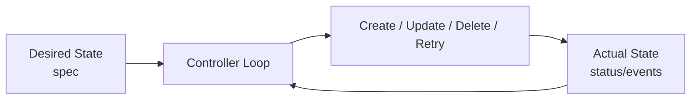

Contoh:

```yaml
spec:
  replicas: 3
status:
  replicas: 2
  readyReplicas: 1
  unavailableReplicas: 2
```

Interpretasi:

- Kita ingin 3 replica.
- Baru ada 2 replica tercatat.
- Hanya 1 yang ready.
- Ada gap antara desired dan actual state.
- Controller akan terus mencoba memperbaiki gap tersebut.

Ini adalah inti Kubernetes.

---

## 4. `spec` vs `status`

Hampir semua object Kubernetes penting memiliki pola:

```yaml
apiVersion: ...
kind: ...
metadata: ...
spec: ...
status: ...
```

### 4.1 `spec`

`spec` adalah deklarasi intent. Biasanya ditulis oleh user, CI/CD, GitOps controller, atau operator.

Contoh isi `spec`:

- jumlah replica,
- image container,
- port,
- resource request/limit,
- selector,
- volume,
- policy,
- schedule,
- template Pod.

`spec` menjawab:

> Apa yang kita inginkan?

### 4.2 `status`

`status` adalah observasi sistem. Biasanya diisi oleh controller atau komponen Kubernetes.

Contoh isi `status`:

- Pod phase,
- ready replicas,
- conditions,
- observed generation,
- last transition time,
- reason,
- message.

`status` menjawab:

> Apa yang benar-benar terjadi menurut sistem?

### 4.3 Kesalahan Umum

Banyak engineer membaca `spec` dan menganggap realitas sudah sesuai. Ini salah.

Contoh:

```yaml
spec:
  replicas: 10
```

Bukan berarti ada 10 Pod healthy. Itu hanya keinginan.

Yang harus dicek:

```yaml
status:
  readyReplicas: 10
  availableReplicas: 10
```

Bahkan setelah `availableReplicas` sesuai, kita masih perlu melihat metrics aplikasi: latency, error rate, saturation, dan business-level correctness.

---

## 5. Metadata: Identitas dan Hubungan Object

`metadata` bukan sekadar nama. Di Kubernetes, metadata menentukan identitas, grouping, selection, ownership, audit, dan behavior eksternal.

Field penting:

| Field | Fungsi |
|---|---|
| `name` | Identitas object dalam namespace atau cluster scope |
| `namespace` | Scope isolasi administratif |
| `labels` | Identitas untuk selection dan grouping |
| `annotations` | Metadata non-identifying untuk tool/controller |
| `ownerReferences` | Hubungan parent-child object |
| `generation` | Versi perubahan spec |
| `resourceVersion` | Versi storage/API untuk concurrency |
| `finalizers` | Mekanisme cleanup sebelum object benar-benar dihapus |

### 5.1 Labels

Labels digunakan untuk memilih object.

Contoh:

```yaml
metadata:
  labels:
    app: payment-api
    tier: backend
    environment: production
```

Service bisa memilih Pod berdasarkan label:

```yaml
selector:
  app: payment-api
```

Jika label Pod dan selector Service tidak cocok, Service tidak memiliki endpoint. Service tetap ada, tetapi traffic tidak akan sampai ke Pod.

### 5.2 Annotations

Annotations digunakan untuk metadata tambahan yang tidak dipakai sebagai selector utama.

Contoh:

```yaml
metadata:
  annotations:
    deployment.kubernetes.io/revision: "7"
    prometheus.io/scrape: "true"
```

Gunakan labels untuk identitas yang akan di-query/select. Gunakan annotations untuk metadata tambahan.

### 5.3 Owner References

Owner reference menjelaskan hubungan parent-child.

Contoh:

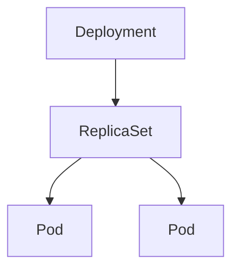

Jika Deployment dihapus, child object bisa ikut dihapus melalui garbage collection sesuai policy.

Ini penting untuk debugging. Jika ada Pod, tanyakan:

- Siapa owner-nya?
- ReplicaSet mana yang membuatnya?
- Deployment revision mana yang menaunginya?
- Apakah Pod ini orphan?

---

## 6. Kubernetes API Server sebagai Gerbang State

API server adalah pusat komunikasi control plane. Semua aktor penting berbicara melalui API server:

- `kubectl`,
- CI/CD,
- GitOps controller,
- scheduler,
- controller manager,
- kubelet,
- admission webhook,
- operator,
- dashboard,
- custom automation.

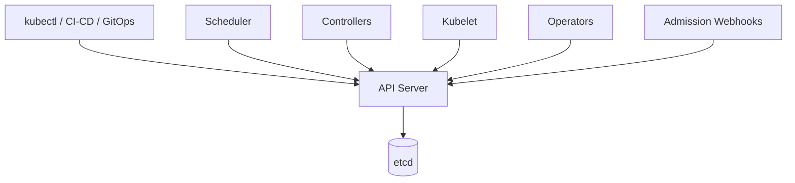

API server bertanggung jawab untuk:

1. Authentication — siapa yang memanggil API.
2. Authorization — apakah caller boleh melakukan aksi.
3. Admission — apakah request diterima, dimutasi, atau ditolak.
4. Validation — apakah object valid menurut schema/API.
5. Persistence — menyimpan state ke etcd.
6. Watch — memberi stream perubahan ke controller/client.

Konsekuensi penting:

> Kubernetes adalah API-driven system. Hampir semua operasi adalah read/write terhadap resource object.

`kubectl` bukan magic. `kubectl` hanyalah client yang mengirim request ke API server.

---

## 7. etcd sebagai Persistence Layer Control Plane

`etcd` menyimpan state cluster. API server membaca dan menulis object ke etcd.

Yang perlu dipahami:

- etcd bukan database aplikasi.
- etcd menyimpan state Kubernetes control plane.
- Kehilangan etcd berarti kehilangan source of truth cluster.
- Backup/restore etcd adalah operasi kritikal untuk cluster self-managed.
- Beban write/watch yang buruk bisa mempengaruhi control plane.

Jangan berpikir “Pod disimpan di etcd” sebagai proses runtime. Yang disimpan adalah object record dan state yang diketahui control plane. Container sebenarnya berjalan di node melalui kubelet dan container runtime.

---

## 8. Controller: Otak Reconciliation

Controller adalah loop yang terus melakukan pola:

1. Watch resource.
2. Observe desired state.
3. Observe actual state.
4. Bandingkan gap.
5. Lakukan aksi korektif.
6. Update status.
7. Ulangi.

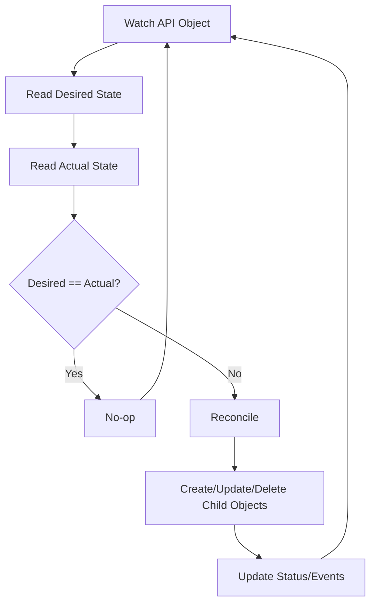

Contoh controller:

| Controller | Desired State | Aksi Reconciliation |
|---|---|---|
| Deployment controller | Deployment spec | Membuat/mengatur ReplicaSet |
| ReplicaSet controller | Jumlah Pod sesuai replica | Membuat/menghapus Pod |
| Job controller | Task selesai sesuai completions | Membuat Pod sampai sukses/gagal |
| Node controller | Node sehat dan tersedia | Update node status, handle unreachable node |
| EndpointSlice controller | Endpoint sesuai Service selector | Membuat/memperbarui EndpointSlice |
| StatefulSet controller | Replica stateful dengan identity stabil | Membuat Pod/PVC secara terurut |

Controller sebaiknya dipahami sebagai “penjaga invariant”.

Contoh invariant ReplicaSet:

> Jumlah Pod yang cocok dengan selector harus mendekati `.spec.replicas`.

Jika Pod mati, ReplicaSet membuat Pod baru. Jika terlalu banyak Pod cocok, ReplicaSet menghapus sebagian.

---

## 9. Reconciliation Bukan Satu Kali Eksekusi

Kesalahan besar: menganggap Kubernetes mengeksekusi command sekali.

Yang benar:

- Controller berjalan terus.
- Sistem eventually consistent.
- Perubahan bisa terlambat karena queue, resource pressure, policy, dependency, atau failure.
- Aksi yang gagal bisa dicoba lagi.
- State bisa berubah akibat aktor lain.

Contoh:

1. Anda membuat Deployment 3 replica.
2. Deployment controller membuat ReplicaSet.
3. ReplicaSet controller membuat 3 Pod.
4. Scheduler menempatkan Pod ke node.
5. Kubelet mencoba menjalankan container.
6. Image pull gagal untuk 1 Pod.
7. Status Pod menjadi `ImagePullBackOff`.
8. Deployment belum available penuh.
9. Controller tetap mempertahankan desired state.
10. Ketika registry credential diperbaiki, Pod bisa lanjut.

Tidak ada “deployment command” yang berjalan sekali lalu selesai. Yang ada adalah banyak controller yang berinteraksi.

---

## 10. Scheduler: Pembuat Keputusan Placement

Scheduler memilih node untuk Pod yang belum memiliki `spec.nodeName`.

Input scheduler mencakup:

- resource request,
- node capacity,
- taint/toleration,
- node selector,
- affinity/anti-affinity,
- topology spread,
- volume constraint,
- policy plugin,
- node condition.

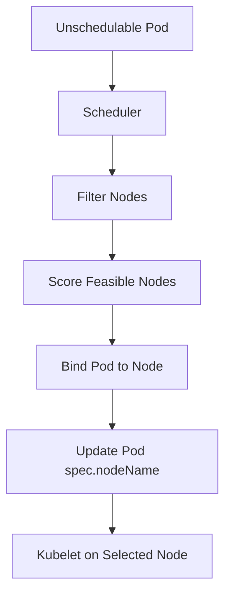

Scheduler tidak menjalankan container. Scheduler hanya memilih node dan menulis binding. Setelah Pod bound ke node, kubelet di node tersebut bertanggung jawab menjalankannya.

Gejala umum scheduling failure:

- `0/5 nodes are available: insufficient cpu`
- `node(s) had taint that the pod didn't tolerate`
- `pod has unbound immediate PersistentVolumeClaims`
- `node(s) didn't match Pod's node affinity/selector`

Debug path:

```bash
kubectl describe pod <pod-name>
```

Lihat bagian Events.

---

## 11. Kubelet: Node-Level Reconciler

Kubelet berjalan di setiap node. Tugasnya memastikan Pod yang dijadwalkan ke node tersebut berjalan sesuai spec.

Kubelet:

- watch Pod yang assigned ke node,
- membuat sandbox Pod,
- meminta container runtime menjalankan container,
- menjalankan probes,
- mount volume,
- melaporkan status Pod/container,
- menangani restart container sesuai restart policy,
- melaporkan node condition.

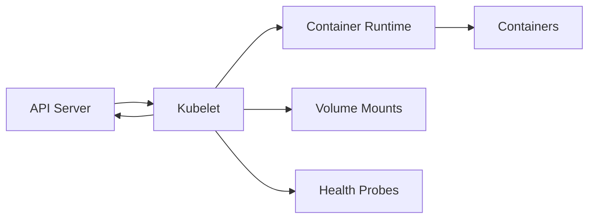

Jika Pod sudah scheduled tetapi container tidak berjalan, domain masalah sering berpindah dari scheduler ke kubelet/runtime.

Contoh failure:

- image pull gagal,
- container process exit,
- command salah,
- env var hilang,
- secret/config volume gagal mount,
- liveness probe terlalu agresif,
- memory limit menyebabkan OOMKill,
- node disk pressure.

---

## 12. Lifecycle Deployment: Dari YAML ke Pod Ready

Mari ikuti alur Deployment sederhana.

```yaml
apiVersion: apps/v1
kind: Deployment
metadata:
  name: catalog-api
spec:
  replicas: 3
  selector:
    matchLabels:
      app: catalog-api
  template:
    metadata:
      labels:
        app: catalog-api
    spec:
      containers:
      - name: catalog-api
        image: registry.example.com/catalog-api:1.0.0
        ports:
        - containerPort: 8080
```

Alurnya:

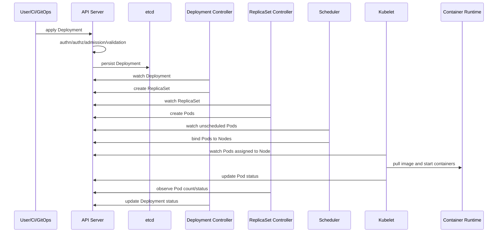

Setiap langkah bisa gagal. Karena itu debugging harus mengikuti tahapan.

---

## 13. Status Conditions

`conditions` adalah cara Kubernetes menyampaikan state yang lebih kaya dari sekadar boolean.

Condition biasanya memiliki:

- `type`
- `status`
- `reason`
- `message`
- `lastTransitionTime`
- `observedGeneration`

Contoh konsep:

```yaml
status:
  conditions:
  - type: Available
    status: "False"
    reason: MinimumReplicasUnavailable
    message: Deployment does not have minimum availability.
  - type: Progressing
    status: "True"
    reason: ReplicaSetUpdated
```

Cara membacanya:

- `type`: aspek state apa yang sedang dilaporkan.
- `status`: benar/salah/tidak diketahui.
- `reason`: kode ringkas penyebab.
- `message`: penjelasan manusia.
- `lastTransitionTime`: kapan berubah.
- `observedGeneration`: apakah controller sudah melihat spec terbaru.

`observedGeneration` penting. Jika `metadata.generation` lebih baru daripada `status.observedGeneration`, status mungkin belum mencerminkan spec terbaru.

---

## 14. Events: Jejak Keputusan dan Kegagalan

Kubernetes Events adalah sumber informasi penting saat debugging.

Contoh event:

```text
Warning  FailedScheduling  2m  default-scheduler  0/3 nodes are available: insufficient memory
Warning  FailedMount       1m  kubelet            MountVolume.SetUp failed for volume "config"
Warning  Unhealthy         30s kubelet            Readiness probe failed
Normal   Pulled            10s kubelet            Successfully pulled image
```

Events menjawab:

- Komponen mana yang melaporkan masalah?
- Apa reason-nya?
- Kapan terjadi?
- Apakah berulang?
- Apakah masalah scheduling, image, mount, probe, atau runtime?

Debugging dasar:

```bash
kubectl describe pod <pod>
kubectl get events --sort-by=.lastTimestamp
```

Dalam incident, events sering memberi petunjuk lebih cepat daripada log aplikasi, terutama untuk masalah platform.

---

## 15. Eventual Consistency

Kubernetes adalah eventually consistent. Artinya, setelah kita mengubah desired state, butuh waktu sampai actual state converge.

Contoh:

```bash
kubectl apply -f deployment.yaml
```

Apply sukses berarti API server menerima object. Itu belum berarti:

- ReplicaSet sudah dibuat,
- Pod sudah dibuat,
- Pod sudah scheduled,
- image sudah pulled,
- container sudah running,
- readiness probe sukses,
- Service endpoint tersedia,
- traffic sudah masuk,
- metrics sehat.

Ada jeda antara setiap tahap.

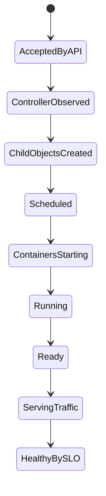

Setiap panah bisa tertunda atau gagal.

---

## 16. Level-Triggered Thinking

Controller Kubernetes umumnya harus dipahami sebagai level-triggered, bukan edge-triggered.

Edge-triggered thinking:

> “Ketika event X terjadi, lakukan Y sekali.”

Level-triggered thinking:

> “Selama actual state tidak sama dengan desired state, terus lakukan aksi korektif.”

Ini perbedaan penting.

Jika controller melewatkan event, ia tetap bisa memperbaiki state saat resync/watch berikutnya karena ia membaca level state saat ini. Ini membuat sistem lebih tahan terhadap transient event loss atau restart controller.

Bagi platform engineer, ini berarti custom controller/operator juga harus idempotent:

- Reconcile yang sama bisa dipanggil berkali-kali.
- Aksi create/update/delete harus aman diulang.
- External side effect harus dikendalikan.
- Status harus mencerminkan progress.
- Finalizer harus dipakai untuk cleanup eksternal.

---

## 17. Idempotency dalam Kubernetes Operations

Idempotent berarti operasi bisa diulang tanpa menghasilkan efek berbahaya tambahan.

Contoh baik:

```bash
kubectl apply -f deployment.yaml
```

Jika manifest sama, apply berulang tidak seharusnya menciptakan object baru yang berbeda.

Contoh buruk:

```bash
kubectl run debug-$(date +%s) ...
```

Setiap eksekusi membuat object baru. Ini mungkin berguna untuk debugging, tetapi bukan model desired state stabil.

Di GitOps, idempotency makin penting:

- Controller akan terus sync.
- Drift akan dikoreksi.
- Manual hotfix bisa tertimpa.
- Manifest harus menjadi source of truth.

---

## 18. Object Ownership dan Garbage Collection

Kubernetes memakai owner reference untuk menentukan hubungan object.

Contoh Deployment:

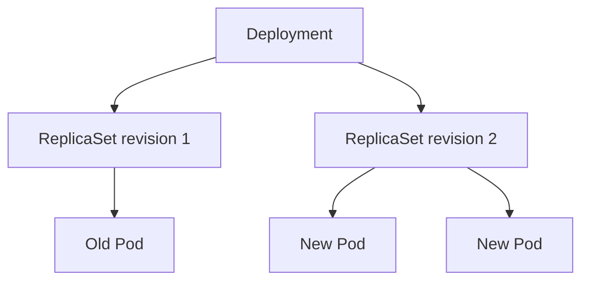

Saat rollout, Deployment bisa membuat ReplicaSet baru tanpa langsung menghapus semua ReplicaSet lama. Ini memungkinkan rollback.

Garbage collection membantu membersihkan child object ketika owner dihapus. Tetapi jangan mengandalkan garbage collection untuk memahami lifecycle tanpa membaca owner reference.

Debug question:

- Apakah Pod ini dibuat oleh ReplicaSet?
- ReplicaSet ini milik Deployment mana?
- Apakah ada ReplicaSet lama yang masih punya replica?
- Apakah ada object tanpa owner yang seharusnya dikelola controller?

---

## 19. Kubernetes Tidak Menjamin “Benar Secara Bisnis”

Kubernetes bisa memberi tahu bahwa Pod ready. Tetapi ready tidak selalu berarti aplikasi benar secara bisnis.

Contoh:

- Endpoint `/health` mengembalikan 200, tetapi payment authorization gagal.
- Pod ready, tetapi cache kosong dan latency melonjak.
- Deployment available, tetapi versi baru tidak kompatibel dengan schema database.
- Service endpoint tersedia, tetapi request tertentu gagal karena feature flag.

Kubernetes menyediakan primitive. Kita harus mendesain health semantics.

Readiness probe harus menjawab:

> Apakah instance ini siap menerima traffic sekarang?

Liveness probe harus menjawab:

> Apakah instance ini macet secara lokal sehingga restart adalah tindakan aman?

Startup probe harus menjawab:

> Apakah aplikasi masih dalam fase startup yang wajar sehingga liveness belum boleh membunuhnya?

Salah desain probe bisa menyebabkan outage.

---

## 20. Kubernetes Deployment Bukan Atomic Transaction

Deployment tidak seperti transaksi database yang commit/rollback secara atomic.

Rollout bisa berada di state campuran:

- sebagian Pod versi lama,
- sebagian Pod versi baru,
- sebagian ready,
- sebagian crash-loop,
- sebagian belum scheduled,
- Service mengirim traffic ke Pod ready dari beberapa versi.

Karena itu aplikasi harus mendukung multi-version compatibility.

Implikasi:

- Database migration harus backward/forward compatible.
- API contract harus toleran terhadap versi campuran.
- Event schema harus compatible.
- Feature flag harus aman.
- Rollback harus memperhitungkan state yang sudah berubah.

Deployment model production tidak bisa dipisahkan dari application compatibility model.

---

## 21. Debugging dengan Object Graph

Jika terjadi masalah, jangan mulai dari asumsi. Mulai dari object graph.

Contoh gejala:

> User mendapat 503 dari API.

Debug graph:

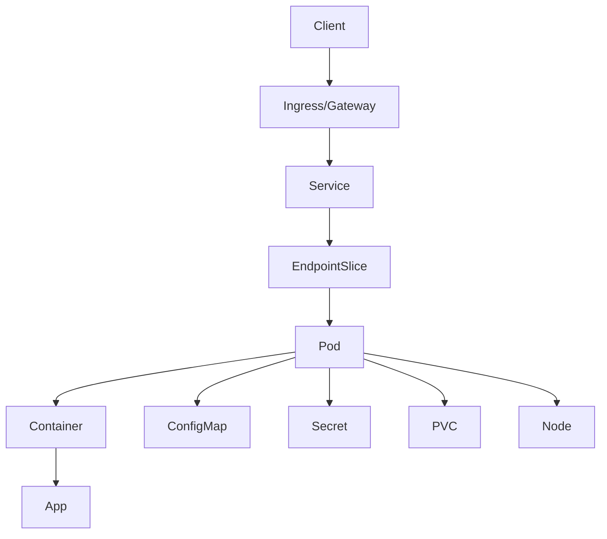

Pertanyaan berurutan:

1. Apakah Gateway/Ingress route cocok?
2. Apakah Service ada?
3. Apakah Service selector benar?
4. Apakah EndpointSlice berisi endpoint ready?
5. Apakah Pod ready?
6. Apakah container running?
7. Apakah readiness probe gagal?
8. Apakah aplikasi bind ke port yang benar?
9. Apakah NetworkPolicy memblokir?
10. Apakah dependency aplikasi gagal?

Setiap pertanyaan mempersempit domain.

---

## 22. Debugging Path: Pod Pending

Gejala:

```text
STATUS: Pending
```

Kemungkinan besar domain:

- scheduling,
- storage binding,
- image belum ditarik? Biasanya setelah scheduled,
- admission/policy,
- quota,
- resource pressure.

Langkah:

```bash
kubectl describe pod <pod>
```

Lihat Events:

- insufficient CPU/memory,
- taint tidak ditoleransi,
- node selector tidak cocok,
- PVC belum bound,
- quota exceeded,
- topology constraint tidak terpenuhi.

Mental model:

> Pod Pending berarti desired Pod object sudah ada, tetapi belum berhasil menjadi workload yang berjalan di node.

---

## 23. Debugging Path: CrashLoopBackOff

Gejala:

```text
STATUS: CrashLoopBackOff
```

Artinya container start lalu exit berulang. Kubernetes mencoba restart dengan backoff.

Langkah:

```bash
kubectl logs <pod> -c <container> --previous
kubectl describe pod <pod>
```

Cek:

- command/args salah,
- config/env hilang,
- secret salah,
- dependency tidak tersedia,
- migration gagal,
- permission filesystem,
- port conflict internal,
- app exit karena fatal error,
- liveness probe membunuh terlalu cepat.

Mental model:

> CrashLoopBackOff bukan “Kubernetes rusak”. Biasanya runtime contract atau aplikasi gagal memenuhi kondisi start.

---

## 24. Debugging Path: Running but NotReady

Gejala:

```text
STATUS: Running
READY: 0/1
```

Container berjalan, tetapi Pod belum dianggap siap menerima traffic.

Langkah:

```bash
kubectl describe pod <pod>
kubectl logs <pod>
```

Cek Events:

- readiness probe failed,
- HTTP status bukan 2xx/3xx,
- connection refused,
- timeout,
- wrong path,
- wrong port,
- app butuh warmup lebih lama,
- dependency health terlalu ketat.

Mental model:

> Running berarti proses hidup. Ready berarti Kubernetes boleh mengirim traffic melalui Service.

---

## 25. Debugging Path: Service Exists but No Traffic

Gejala:

- Service ada.
- Pod running.
- Client tidak bisa akses.

Langkah:

```bash
kubectl get svc <service>
kubectl get endpointslice -l kubernetes.io/service-name=<service>
kubectl get pods --show-labels
```

Cek:

- selector Service cocok dengan label Pod?
- Pod ready?
- targetPort benar?
- port name cocok?
- namespace benar?
- NetworkPolicy mengizinkan?
- aplikasi bind ke `0.0.0.0`, bukan hanya `127.0.0.1`?

Mental model:

> Service memilih endpoint melalui selector dan readiness. Service yang ada tidak otomatis berarti ada backend yang bisa menerima traffic.

---

## 26. Convergence dan Non-Convergence

Kubernetes selalu mencoba converge, tetapi tidak semua desired state bisa tercapai.

Contoh non-convergence:

| Desired State | Hambatan | Gejala |
|---|---|---|
| 10 replica | resource cluster hanya cukup untuk 6 | sebagian Pod Pending |
| Pod pakai image private | secret registry salah | ImagePullBackOff |
| Pod butuh PVC | storage class tidak tersedia | Pending / PVC unbound |
| Deployment rollout | readiness selalu gagal | rollout stuck |
| Service endpoint | selector salah | endpoint kosong |
| Network access | NetworkPolicy default deny | timeout |
| privileged container | admission policy melarang | rejected |

Kunci debugging:

> Jangan hanya tanya “kenapa Kubernetes tidak melakukan yang saya minta?” Tanyakan “constraint mana yang membuat desired state tidak bisa converge?”

---

## 27. The Kubernetes State Machine

Untuk production reasoning, bayangkan setiap object sebagai state machine.

Pod simplifikasi:

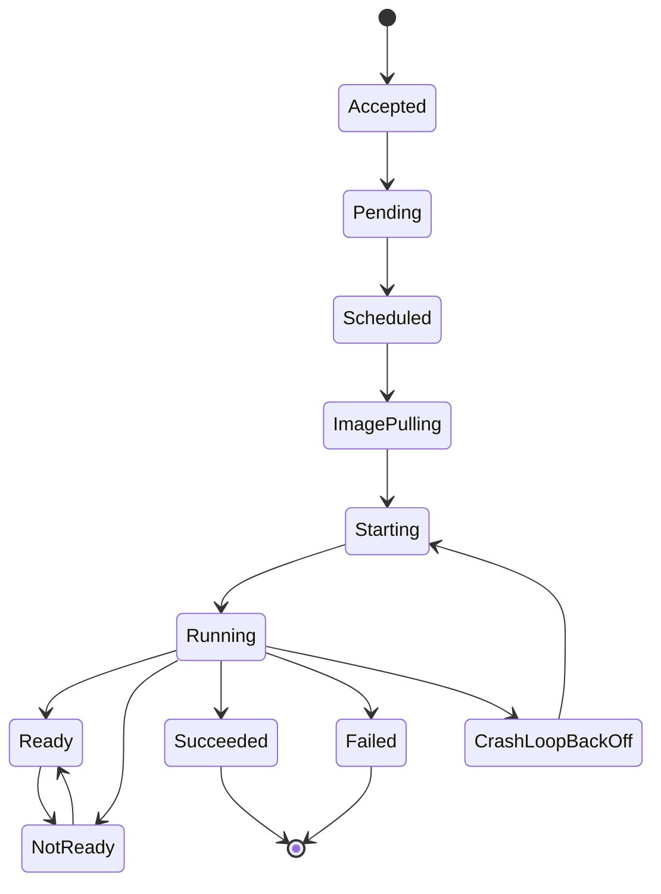

Deployment simplifikasi:

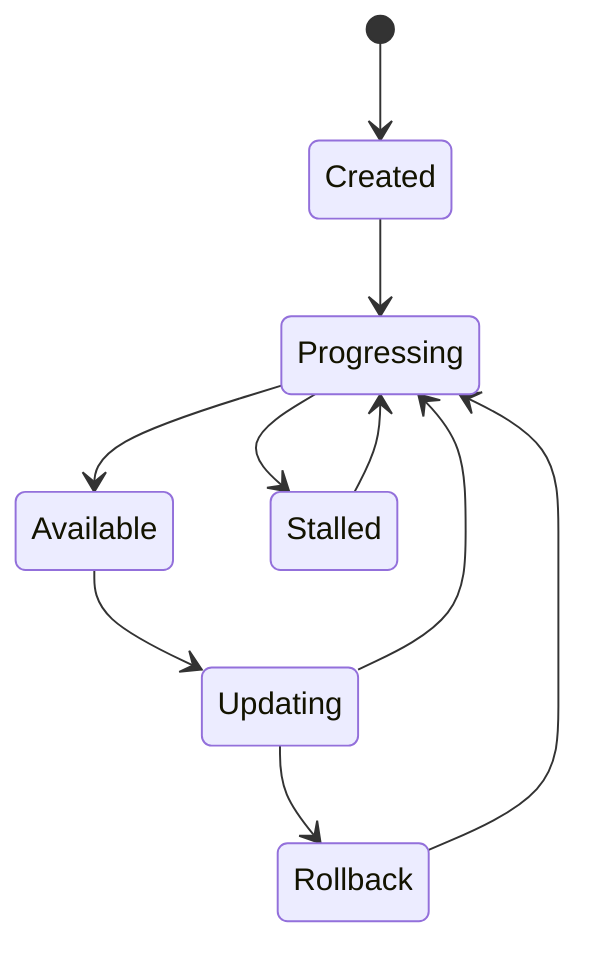

State machine ini bukan representasi lengkap API, tetapi membantu berpikir.

---

## 28. Apply, Create, Patch, Replace

Kubernetes API mendukung beberapa pola perubahan.

| Operasi | Makna | Risiko |
|---|---|---|
| create | Membuat object baru | Gagal jika sudah ada |
| apply | Declarative merge/apply desired config | Field ownership perlu dipahami |
| patch | Mengubah sebagian field | Bisa sulit diaudit jika manual |
| replace | Mengganti object spec | Bisa overwrite perubahan lain |
| delete | Menghapus object | Controller owner bisa membuat ulang child |

Untuk platform production, preferensi umum:

- Gunakan declarative apply/GitOps untuk workload state.
- Hindari patch manual tanpa audit.
- Gunakan imperative command untuk debugging terbatas, bukan source of truth.
- Pastikan perubahan bisa direview dan dirollback.

---

## 29. Field Ownership dan Drift

Dalam cluster production, banyak aktor bisa mengubah object:

- developer,
- CI/CD,
- GitOps controller,
- autoscaler,
- admission webhook,
- operator,
- human emergency patch.

Masalah muncul ketika ownership tidak jelas.

Contoh:

- GitOps mengatur Deployment replica = 3.
- HPA mengatur replica berdasarkan metrics.
- Human patch mengubah replica = 10.
- GitOps sync mengembalikan ke 3.
- HPA mengubah lagi.

Tanpa boundary field ownership, state bisa “berkelahi”.

Prinsip:

- Satu field penting harus punya owner yang jelas.
- Tooling harus tahu field mana yang boleh dikelola.
- Manual change harus dianggap exception dan diaudit.
- Drift correction harus disengaja, bukan kejutan.

---

## 30. Namespace: Scope, Bukan Isolasi Sempurna

Namespace memberi scope untuk banyak resource. Tetapi namespace bukan boundary security penuh secara otomatis.

Namespace membantu:

- pemisahan resource name,
- quota,
- RBAC scope,
- policy grouping,
- team/environment separation.

Namespace tidak otomatis:

- memblokir network antar namespace,
- mencegah privilege escalation jika RBAC buruk,
- melindungi secret dari actor yang punya izin baca,
- mengisolasi node runtime,
- menggantikan cluster-level policy.

Mental model:

> Namespace adalah administrative scope. Security boundary memerlukan RBAC, admission policy, NetworkPolicy, Pod Security, dan konfigurasi cluster yang benar.

---

## 31. Control Plane vs Data Plane

Kubernetes memisahkan control plane dan data plane.

Control plane:

- API server,
- etcd,
- scheduler,
- controller manager,
- cloud controller manager,
- admission chain.

Data plane/node plane:

- kubelet,
- container runtime,
- CNI plugin,
- kube-proxy atau dataplane alternatif,
- Pods,
- node OS,
- storage mounts.

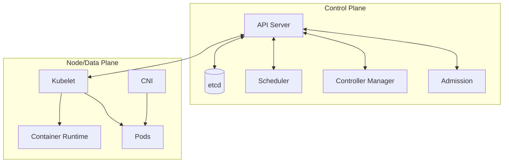

Debugging harus tahu domain:

- Jika API tidak bisa diakses: control plane/API/auth/network.
- Jika Pod tidak scheduled: scheduler/control plane constraints.
- Jika Pod scheduled tetapi tidak start: node/kubelet/runtime.
- Jika Pod start tetapi tidak reachable: service/network/policy/app.

---

## 32. Kubernetes and Time

Banyak bug Kubernetes adalah bug waktu.

Contoh:

- App butuh 90 detik startup, liveness mulai di 10 detik.
- Readiness terlalu cepat sukses sebelum cache warm.
- HPA scale up terlambat karena metrics delay.
- Rollout dianggap stuck karena progress deadline terlalu pendek.
- Job timeout lebih pendek dari proses normal.
- Pod termination grace period terlalu pendek sehingga request terputus.
- DNS cache menyebabkan perubahan endpoint terasa lambat.

Kubernetes adalah sistem asynchronous. Selalu desain dengan waktu:

- startup time,
- warmup time,
- readiness time,
- graceful shutdown time,
- autoscaling reaction time,
- rollout time,
- rollback time,
- failure detection time,
- recovery time.

---

## 33. Kubernetes and Failure Ownership

Saat failure terjadi, tanyakan siapa owner-nya.

| Failure | Owner Utama | Catatan |
|---|---|---|
| App crash | App team | Platform membantu observability/restart |
| Bad image tag | CI/CD/app team | Admission bisa mencegah tag mutable |
| Pod unschedulable | Platform/app shared | App menentukan requests; platform menyediakan capacity |
| Network denied | Platform/security/app shared | Policy harus jelas |
| RBAC forbidden | Platform/security | Bisa jadi konfigurasi least privilege benar atau salah |
| PVC pending | Platform/storage | Bisa juga app salah storageClass |
| Readiness failed | App team | Platform menyediakan mechanism, app menentukan semantics |
| Node NotReady | Platform/SRE | Workload harus tahan reschedule |
| Rollout stuck | App/platform shared | Tergantung probe, capacity, strategy |

Boundary ownership mencegah incident berubah menjadi saling menyalahkan.

---

## 34. Practical Reading Pattern untuk Setiap Object

Gunakan pola ini setiap melihat object Kubernetes.

### 34.1 Identity

- Apa `kind`-nya?
- Namespace apa?
- Nama apa?
- Label apa?
- Annotation penting apa?

### 34.2 Desired State

- Apa isi `spec`?
- Field mana yang paling menentukan behavior?
- Apakah selector benar?
- Apakah resource request/limit ada?
- Apakah security context ada?

### 34.3 Actual State

- Apa isi `status`?
- Apa conditions?
- Apa observed generation?
- Apa ready/available count?

### 34.4 Relationships

- Siapa owner?
- Child object apa yang dibuat?
- Service mana yang memilih Pod ini?
- Config/Secret/PVC apa yang dipakai?

### 34.5 Failure Evidence

- Events apa yang muncul?
- Reason apa?
- Komponen mana yang melaporkan?
- Apakah masalah berulang?

---

## 35. Worked Example: Deployment Tidak Ready

Misal:

```bash
kubectl get deploy catalog-api
```

Output:

```text
NAME          READY   UP-TO-DATE   AVAILABLE   AGE
catalog-api   1/3     3            1           10m
```

Cara membaca:

- Desired replicas kemungkinan 3.
- ReplicaSet terbaru sudah punya 3 Pod.
- Hanya 1 available.
- Deployment belum memenuhi availability.

Langkah:

```bash
kubectl describe deploy catalog-api
kubectl get rs -l app=catalog-api
kubectl get pods -l app=catalog-api -o wide
```

Kemungkinan:

1. Dua Pod Pending.
2. Dua Pod CrashLoopBackOff.
3. Dua Pod Running tapi NotReady.
4. Service selector salah bukan penyebab Deployment not ready, tetapi bisa jadi penyebab traffic failure.
5. Resource/capacity/probe/image/config perlu dicek.

Jika Pod Pending:

```bash
kubectl describe pod <pending-pod>
```

Jika CrashLoop:

```bash
kubectl logs <pod> --previous
```

Jika NotReady:

```bash
kubectl describe pod <pod>
```

Lihat readiness event.

Mental model:

> Deployment status adalah ringkasan. Root cause biasanya ada di child object: ReplicaSet, Pod, Events, container logs, atau dependency platform.

---

## 36. Worked Example: Apply Sukses tapi Service 503

Misal deployment sukses:

```bash
kubectl apply -f app.yaml
```

Tetapi user menerima 503.

Jangan berhenti di `apply`. Trace:

```bash
kubectl get deploy
kubectl get pods -l app=myapp
kubectl get svc myapp
kubectl get endpointslice -l kubernetes.io/service-name=myapp
kubectl describe ingress myapp
```

Kemungkinan path:

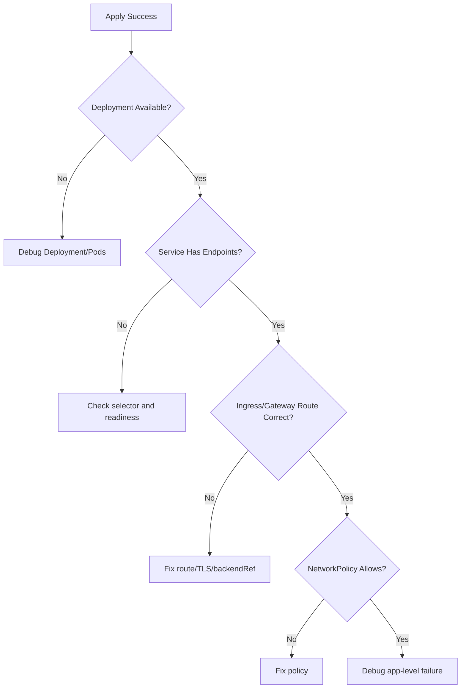

Ini adalah cara berpikir Kubernetes: bukan “coba restart”, tetapi mempersempit graph.

---

## 37. Design Implication: Aplikasi Harus Cloud-Native Compatible

Aplikasi yang berjalan di Kubernetes harus memenuhi kontrak tertentu.

Minimal:

- Bisa start tanpa manual intervention.
- Bisa stop dengan graceful shutdown.
- Menangani SIGTERM.
- Tidak menyimpan state penting di local ephemeral disk.
- Mengekspos readiness yang akurat.
- Mengekspos liveness hanya untuk deadlock/hang nyata.
- Log ke stdout/stderr.
- Config dari environment/file/secret external.
- Tidak bergantung pada hostname/IP tetap.
- Aman dijalankan lebih dari satu replica jika stateless.
- Kompatibel dengan rollout multi-version.

Tanpa ini, Kubernetes akan memperbesar masalah aplikasi.

---

## 38. Design Implication: Platform Harus Membatasi Kebebasan Berbahaya

Kubernetes memberi banyak kebebasan. Production platform harus memberi guardrail.

Contoh guardrail:

- Wajib resource requests.
- Larang privileged container kecuali namespace tertentu.
- Larang root user default.
- Wajib readiness probe untuk service-facing workload.
- Larang image tag `latest`.
- Wajib label standar.
- Wajib owner/team annotation.
- Batasi hostPath.
- Batasi wildcard RBAC.
- Enforce NetworkPolicy default deny untuk namespace sensitif.

Guardrail bukan birokrasi. Guardrail adalah cara membuat desired state tidak berbahaya.

---

## 39. Mental Checklist Sebelum Menerapkan Manifest

Sebelum apply manifest production, tanyakan:

1. Apakah object kind benar untuk lifecycle workload?
2. Apakah selector immutable sudah benar?
3. Apakah label konsisten?
4. Apakah resource request realistis?
5. Apakah limit tidak menciptakan throttling/OOM tak terduga?
6. Apakah readiness probe akurat?
7. Apakah liveness probe aman?
8. Apakah graceful shutdown cukup?
9. Apakah Service targetPort benar?
10. Apakah NetworkPolicy mengizinkan traffic yang diperlukan?
11. Apakah Secret/ConfigMap tersedia?
12. Apakah RBAC least privilege?
13. Apakah rollout strategy sesuai risiko?
14. Apakah rollback kompatibel dengan database/schema?
15. Apakah observability cukup untuk membuktikan sehat?

---

## 40. Latihan Part 002

### Latihan 1 — Baca Object

Ambil satu Deployment production atau sample. Jawab:

- Apa desired replicas?
- Apa ready replicas?
- Apa available replicas?
- Apa observed generation?
- Apa conditions?
- Apa ReplicaSet aktif?
- Apa Pod template hash?

### Latihan 2 — Trace dari Deployment ke Pod

Gunakan command:

```bash
kubectl get deploy <name> -o yaml
kubectl get rs -l app=<label>
kubectl get pods -l app=<label> -o wide
kubectl describe pod <pod>
```

Tulis object graph-nya.

### Latihan 3 — Trace dari Service ke Pod

Gunakan command:

```bash
kubectl get svc <name> -o yaml
kubectl get endpointslice -l kubernetes.io/service-name=<name>
kubectl get pods --show-labels
```

Jawab:

- Selector Service apa?
- Pod mana yang cocok?
- Endpoint ready ada berapa?
- Port dan targetPort benar?

### Latihan 4 — Failure Classification

Untuk setiap gejala berikut, tentukan domain masalah:

- Pod Pending
- ImagePullBackOff
- CrashLoopBackOff
- Running but NotReady
- Service endpoint kosong
- 403 Forbidden dari API
- Admission denied
- OOMKilled
- Evicted
- Rollout stuck

---

## 41. Ringkasan

Kubernetes adalah sistem desired-state reconciliation.

Poin utama:

1. Kita menulis desired state di `spec`.
2. Kubernetes melaporkan actual state di `status`, `conditions`, dan `events`.
3. API server adalah gerbang state.
4. etcd menyimpan state control plane.
5. Controller terus merekonsiliasi desired dan actual state.
6. Scheduler memilih node; kubelet menjalankan Pod di node.
7. `kubectl apply` sukses bukan berarti workload sehat.
8. Kubernetes eventually consistent, bukan atomic transaction.
9. Debugging harus mengikuti object graph.
10. Production deployment harus mempertimbangkan rollout, readiness, compatibility, traffic, security, observability, dan rollback.

Jika hanya mengingat satu kalimat dari part ini, ingat ini:

> Kubernetes bukan deployment script. Kubernetes adalah kumpulan control loop yang bekerja di atas API object untuk menjaga desired state tetap mendekati realitas yang sehat.

---

## 42. Preview Part Berikutnya

Part 003 akan membedah cluster architecture:

- control plane vs worker node,
- API server,
- etcd,
- scheduler,
- controller manager,
- kubelet,
- container runtime,
- CNI,
- kube-proxy/dataplane,
- cloud controller manager,
- failure domain control plane dan node plane,
- implikasi arsitektur terhadap deployment dan debugging.

---

## Referensi Resmi

- Kubernetes Documentation — Overview: https://kubernetes.io/docs/concepts/overview/
- Kubernetes Documentation — Kubernetes API: https://kubernetes.io/docs/concepts/overview/kubernetes-api/
- Kubernetes Documentation — API Concepts: https://kubernetes.io/docs/reference/using-api/api-concepts/
- Kubernetes Documentation — Objects in Kubernetes: https://kubernetes.io/docs/concepts/overview/working-with-objects/
- Kubernetes Documentation — Components: https://kubernetes.io/docs/concepts/overview/components/
- Kubernetes Documentation — Cluster Architecture: https://kubernetes.io/docs/concepts/architecture/
- Kubernetes Documentation — Controllers: https://kubernetes.io/docs/concepts/architecture/controller/
- Kubernetes Documentation — Deployments: https://kubernetes.io/docs/concepts/workloads/controllers/deployment/
- Kubernetes Documentation — Services: https://kubernetes.io/docs/concepts/services-networking/service/
- Kubernetes Releases — v1.36: https://kubernetes.io/releases/1.36/
