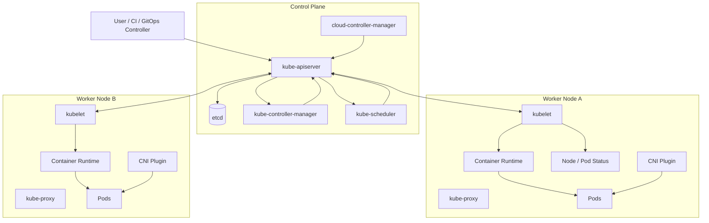
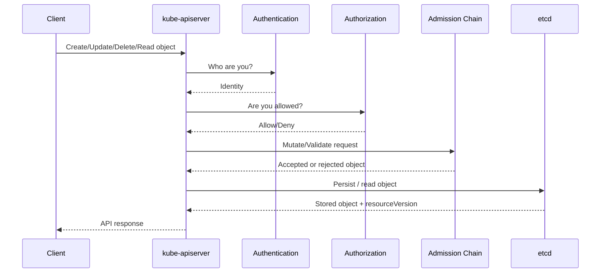
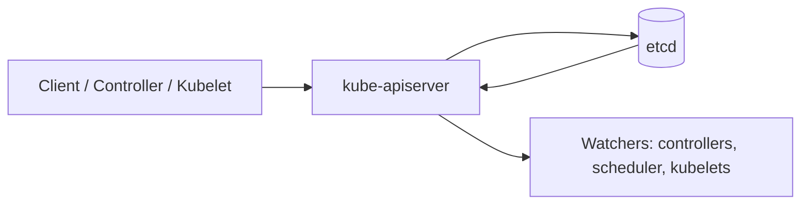
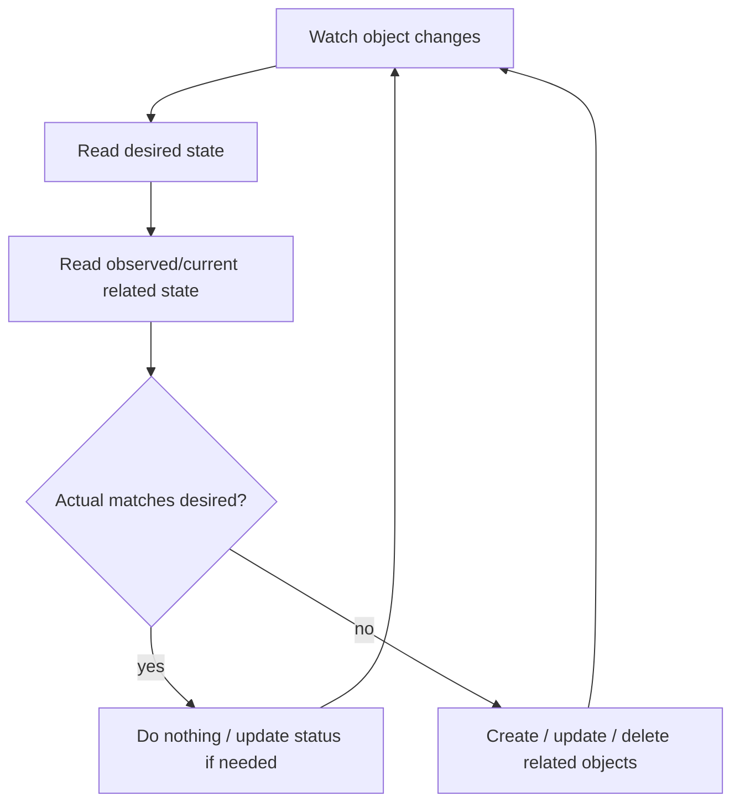
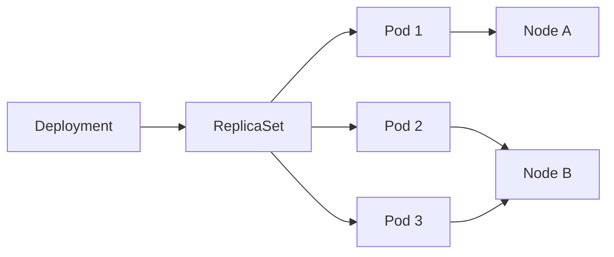
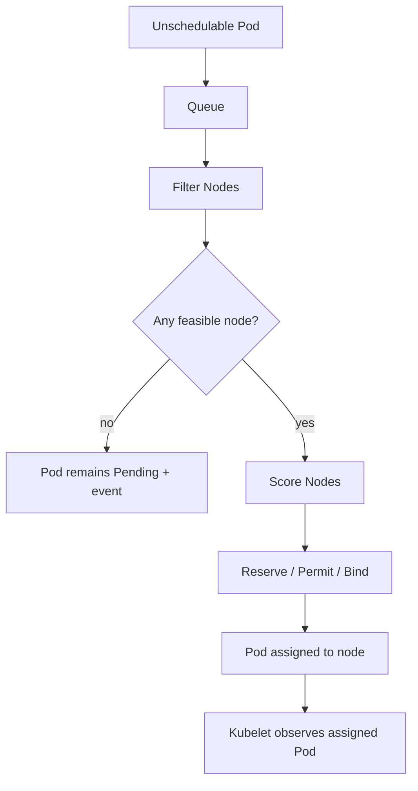
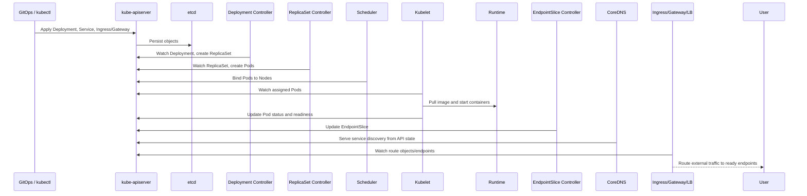
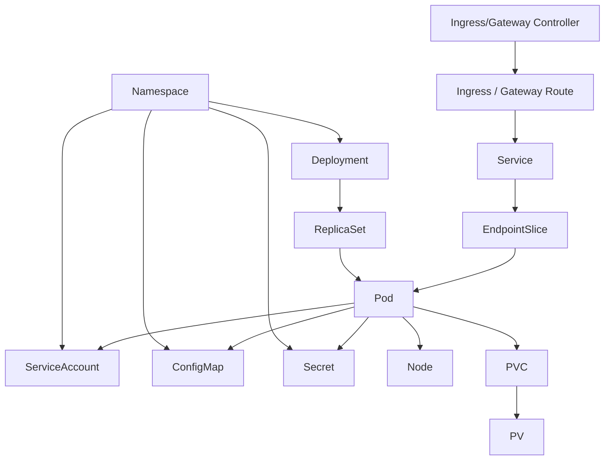

------
title: Learn Kubernetes, Deployment Model, and Cloud Native Platform Engineering - Part 003
description: Deep dive arsitektur cluster Kubernetes: control plane, worker node, API server, etcd, scheduler, controller manager, kubelet, runtime, networking, add-ons, failure domain, dan implikasinya terhadap deployment model production.
series: learn-kubernetes-deployment-model
seriesTitle: Learn Kubernetes, Deployment Model, and Cloud Native Platform Engineering
order: 3
partTitle: Cluster Architecture
tags:
- kubernetes
- cluster-architecture
- control-plane
- kubelet
- etcd
- scheduler
- deployment
- platform-engineering
- series
date: 2026-07-01
---

# Part 003 — Cluster Architecture

> Tujuan part ini adalah membangun peta arsitektur Kubernetes yang bisa dipakai untuk reasoning production: ketika deployment gagal, Pod tidak terschedule, node tidak sehat, API server lambat, DNS bermasalah, atau rollout tidak selesai, kita tahu komponen mana yang bertanggung jawab dan invariant apa yang harus diperiksa.

Pada level basic, Kubernetes sering digambarkan sebagai “master node dan worker node”. Untuk engineer senior, gambaran itu terlalu dangkal. Kubernetes lebih tepat dipahami sebagai **distributed control system**:

- control plane menerima, memvalidasi, menyimpan, dan merekonsiliasi desired state;
- worker node menjalankan workload dan melaporkan observed state;
- controller membaca object, membuat object turunan, dan mengubah status dunia;
- scheduler memilih lokasi eksekusi;
- kubelet menjembatani object Kubernetes dengan runtime container di node;
- network, storage, DNS, policy, dan cloud integration disediakan oleh komponen core dan add-on yang ikut menentukan apakah deployment benar-benar usable.

Kita tidak belajar arsitektur sebagai diagram hafalan. Kita belajar arsitektur sebagai **failure map**.

---

## 1. Kaufman Deconstruction: Apa yang Harus Bisa Kita Lakukan?

Skill “memahami cluster architecture” bisa dipecah menjadi beberapa sub-skill:

1. **Membedakan control-plane responsibility dan node responsibility.**
2. **Melacak request flow** dari `kubectl apply` sampai container berjalan.
3. **Membedakan declarative object, controller action, scheduler decision, dan node execution.**
4. **Mengidentifikasi failure domain**: API server, etcd, scheduler, controller, kubelet, runtime, CNI, DNS, CSI, cloud provider.
5. **Menilai implikasi arsitektur terhadap deployment model**: rollout, rollback, autoscaling, recovery, disruption, dan auditability.
6. **Membaca gejala operasional** tanpa langsung menyalahkan aplikasi.

Setelah part ini, target minimalnya bukan “tahu komponen Kubernetes”. Targetnya adalah bisa menjawab:

- Kalau Pod `Pending`, apakah masalahnya di scheduler, resource, taint, PVC, image, admission, atau quota?
- Kalau Deployment sudah dibuat tetapi ReplicaSet tidak muncul, controller mana yang gagal?
- Kalau Pod sudah `Running` tetapi traffic gagal, apakah itu kubelet, Service, EndpointSlice, DNS, kube-proxy, CNI, NetworkPolicy, atau ingress?
- Kalau API server lambat, apa konsekuensinya terhadap rollout dan controller loop?
- Kalau control plane down, workload existing masih berjalan atau tidak?
- Kalau etcd kehilangan quorum, apa yang masih bisa dilakukan cluster?

---

## 2. Mental Model Besar: Control Plane Records, Nodes Execute

Kubernetes cluster terdiri dari dua kelas komponen:

1. **Control plane** — membuat keputusan global, menerima API request, menyimpan state, menjalankan controller, dan menentukan placement workload.
2. **Worker nodes** — menjalankan Pod, mengelola runtime container, menghubungkan jaringan Pod, dan melaporkan status ke API server.

Diagram konseptualnya:



Kunci mental model:

> Kubernetes tidak “menjalankan Deployment”. Kubernetes menerima object Deployment, menyimpannya sebagai desired state, lalu controller, scheduler, dan kubelet secara bertahap membuat realitas cluster mendekati desired state tersebut.

Deployment bukan proses. Deployment adalah object. ReplicaSet bukan thread. ReplicaSet adalah object. Pod bukan mesin virtual kecil yang dikelola langsung oleh user. Pod adalah object yang akhirnya diterjemahkan kubelet menjadi container runtime execution di node.

---

## 3. Control Plane: Tempat State, Validasi, dan Keputusan Global

Control plane adalah bagian cluster yang mengelola state global. Dalam production, control plane biasanya dibuat high availability: beberapa API server, beberapa controller/scheduler instance dengan leader election, dan etcd cluster yang memenuhi quorum.

Komponen utama control plane:

| Komponen | Tanggung Jawab | Bukan Tanggung Jawab |
|---|---|---|
| `kube-apiserver` | Front door API, authentication, authorization, admission, validation, persistence orchestration | Menjalankan container |
| `etcd` | Penyimpanan konsisten untuk cluster state | Menjalankan controller logic |
| `kube-scheduler` | Memilih node untuk Pod yang belum punya `spec.nodeName` | Menarik image atau menjalankan container |
| `kube-controller-manager` | Menjalankan controller bawaan seperti Deployment, ReplicaSet, Node, Job | Menjadi runtime workload |
| `cloud-controller-manager` | Integrasi cloud provider: load balancer, node lifecycle, route, volume cloud-specific | Menggantikan CNI/CSI sepenuhnya |

Prinsip penting:

> Hampir semua komponen berbicara ke cluster melalui Kubernetes API, bukan dengan saling memanggil fungsi internal secara langsung.

Inilah yang membuat Kubernetes extensible: controller custom, operator, GitOps controller, admission webhook, autoscaler, dan observability tool semuanya dapat berinteraksi melalui API yang sama.

---

## 4. kube-apiserver: Front Door, Contract Boundary, dan Consistency Gate

`kube-apiserver` adalah pintu masuk utama Kubernetes API. Semua perubahan state normal melewati API server.

Contoh sumber request:

- `kubectl apply`
- GitOps controller seperti Argo CD atau Flux
- controller bawaan Kubernetes
- operator custom
- autoscaler
- admission webhook
- scheduler
- kubelet ketika melaporkan status
- cloud controller
- dashboard atau platform internal

### 4.1 Apa yang Dilakukan API Server?

Secara konseptual, pipeline request API server dapat dilihat seperti ini:



API server melakukan:

1. **Authentication** — memastikan identitas caller.
2. **Authorization** — mengecek apakah caller boleh melakukan verb tertentu pada resource tertentu.
3. **Admission control** — menjalankan mutating dan validating admission.
4. **Schema validation** — memastikan object sesuai schema API.
5. **Defaulting** — mengisi nilai default sesuai tipe resource.
6. **Persistence** — menyimpan object ke etcd.
7. **Watch delivery** — menyediakan stream perubahan object untuk controller dan client.

### 4.2 API Server sebagai Boundary Organisasi

Di platform besar, API server bukan hanya komponen teknis. Ia adalah **governance boundary**.

Contoh policy yang dieksekusi di sekitar API server:

- namespace mana yang boleh membuat LoadBalancer;
- image registry mana yang boleh digunakan;
- workload harus punya `resources.requests`;
- container tidak boleh privileged;
- Deployment harus punya label ownership;
- Secret tertentu tidak boleh di-mount di namespace lain;
- hanya GitOps controller yang boleh mengubah object production.

Jika organisasi ingin Kubernetes production yang defensible, API server dan admission chain adalah tempat enforce invariant.

### 4.3 Failure Mode API Server

| Gejala | Kemungkinan Dampak | Reasoning |
|---|---|---|
| API server unavailable | Tidak bisa apply object baru, controller sulit update status, scheduler tidak bisa bind Pod baru | Control plane kehilangan front door |
| API server latency tinggi | Rollout lambat, watch reconnect, controller lag | Controller bergantung pada list/watch API |
| Authorization salah | Deployment gagal walau YAML benar | Caller tidak punya permission |
| Admission webhook lambat | Create/update object tertahan | Admission berada di critical path write request |
| API server overload | HPA, controller, scheduler, kubelet update ikut terdampak | Banyak komponen bergantung pada API server |

Operational invariant:

> API server harus diperlakukan sebagai shared critical dependency. Jangan membuat controller, webhook, atau automation yang menghasilkan API storm tanpa rate limit dan backoff.

---

## 5. etcd: Source of Truth, Bukan Database Aplikasi

`etcd` adalah distributed key-value store yang menyimpan cluster state. Object Kubernetes yang persisted disimpan di etcd melalui API server.

Yang perlu dipahami:

- etcd menyimpan state Kubernetes, bukan data aplikasi.
- etcd harus dijaga quorum-nya.
- backup etcd adalah bagian paling penting dari disaster recovery cluster self-managed.
- write ke etcd harus melalui API server, bukan direct modification.
- data Secret di etcd perlu dilindungi dengan encryption at rest jika threat model menuntutnya.

### 5.1 etcd dalam Control Plane



Kubernetes API server adalah satu-satunya komponen yang seharusnya berbicara langsung dengan etcd untuk state Kubernetes. Ini menjaga validasi, authorization, admission, conversion, dan audit tetap konsisten.

### 5.2 Quorum dan High Availability

Dalam cluster etcd, availability bergantung pada quorum. Jika jumlah member etcd adalah `N`, quorum adalah `floor(N/2)+1`.

| Jumlah Member | Quorum | Toleransi Failure |
|---:|---:|---:|
| 1 | 1 | 0 member |
| 3 | 2 | 1 member |
| 5 | 3 | 2 member |

Catatan penting:

- Menambah member tidak selalu meningkatkan availability jika latency antar member buruk.
- etcd sangat sensitif terhadap disk latency dan network latency.
- Cluster etcd lintas region perlu dirancang sangat hati-hati karena quorum write membutuhkan komunikasi konsisten.
- Managed Kubernetes biasanya menyembunyikan etcd dari user, tetapi konsekuensi state persistence tetap sama.

### 5.3 Failure Mode etcd

| Gejala | Dampak | Implikasi Deployment |
|---|---|---|
| etcd quorum hilang | API write gagal | Rollout, scaling, dan controller update berhenti |
| Disk latency tinggi | API server latency naik | Deployment terlihat lambat atau timeout |
| etcd compaction/watch issue | Controller perlu relist | Controller lag meningkat |
| Backup tidak valid | Disaster recovery tidak defensible | Cluster rebuild tidak bisa mengembalikan state |
| Secret tidak dienkripsi | Risiko data exposure dari storage layer | Compliance dan security risk |

Invariant:

> Jika etcd tidak sehat, Kubernetes kehilangan memori kolektifnya. Workload existing mungkin tetap berjalan di node, tetapi kemampuan mengubah dan merekonsiliasi state cluster akan rusak.

---

## 6. kube-controller-manager: Pabrik Reconciliation

`kube-controller-manager` menjalankan banyak controller bawaan Kubernetes. Controller adalah loop yang membaca state melalui API server, membandingkan desired state dengan actual state, lalu membuat perubahan.

Contoh controller:

- Deployment controller
- ReplicaSet controller
- StatefulSet controller
- DaemonSet controller
- Job controller
- CronJob controller
- Node controller
- EndpointSlice controller
- ServiceAccount controller
- Namespace controller
- Garbage collector

### 6.1 Controller Loop Sederhana



Controller tidak bekerja seperti script linear. Controller bekerja seperti loop idempotent. Karena itu desain object Kubernetes harus dibuat agar perubahan bisa diulang tanpa menghasilkan efek samping berbahaya.

### 6.2 Contoh: Deployment ke ReplicaSet ke Pod

Ketika user membuat Deployment:

1. API server menyimpan Deployment.
2. Deployment controller melihat Deployment baru.
3. Deployment controller membuat ReplicaSet.
4. ReplicaSet controller melihat ReplicaSet baru.
5. ReplicaSet controller membuat Pod sesuai desired replica.
6. Scheduler melihat Pod yang belum punya node.
7. Scheduler memilih node dan membuat binding.
8. Kubelet pada node menjalankan container.
9. Kubelet update Pod status.
10. Controller membaca status dan melanjutkan reconciliation.



### 6.3 Deployment Implication

Karena controller bekerja berantai, problem sering muncul sebagai efek tidak langsung:

- Deployment ada, ReplicaSet tidak ada → cek Deployment controller dan admission/event.
- ReplicaSet ada, Pod tidak dibuat → cek selector, quota, ReplicaSet event.
- Pod ada, belum scheduled → cek scheduler, resource, taint, affinity, PVC.
- Pod scheduled, container tidak running → cek kubelet, runtime, image pull, volume mount, security context.
- Pod running, endpoint tidak muncul → cek readiness, labels, Service selector, EndpointSlice controller.

Inilah alasan debugging Kubernetes harus mengikuti object graph, bukan hanya melihat object terakhir.

---

## 7. kube-scheduler: Placement Engine, Bukan Autoscaler

`kube-scheduler` memilih node untuk Pod yang belum memiliki `spec.nodeName`. Scheduler tidak menjalankan Pod. Ia hanya membuat keputusan binding.

Scheduler mempertimbangkan banyak constraint:

- resource requests CPU/memory;
- node readiness;
- taints dan tolerations;
- node selector;
- node affinity;
- pod affinity dan anti-affinity;
- topology spread constraint;
- volume binding;
- ports;
- runtime class;
- policy/plugin scheduler;
- priority dan preemption.

### 7.1 Scheduling Pipeline



Filter menjawab “node mana yang mungkin?”. Score menjawab “node mana yang paling baik?”. Bind menulis keputusan ke API server.

### 7.2 Scheduler Failure Mode

| Gejala | Reasoning |
|---|---|
| Pod `Pending` dengan event `Insufficient cpu` | Requests melebihi allocatable resource node yang tersedia |
| Pod `Pending` karena taint | Pod tidak punya toleration yang cocok |
| Pod `Pending` karena node affinity | Constraint terlalu sempit |
| Pod `Pending` karena unbound PVC | Volume belum bisa diprovision atau belum cocok zona/topologi |
| Pod berpindah-pindah setelah eviction | Scheduler memilih node baru setelah Pod lama diganti |
| Preemption terjadi | Pod priority tinggi mengusir Pod prioritas rendah |

Hal yang sering salah dipahami:

> Scheduler hanya melihat `requests`, bukan actual memory usage runtime, untuk keputusan placement awal.

Jika workload tidak punya `requests`, scheduler kehilangan sinyal kapasitas yang penting. Ini bukan hanya masalah “best practice”; ini masalah correctness kapasitas cluster.

---

## 8. cloud-controller-manager: Boundary Kubernetes dan Cloud Provider

`cloud-controller-manager` memindahkan logic provider-specific keluar dari core Kubernetes. Ia biasanya menangani integrasi seperti:

- node lifecycle berdasarkan instance cloud;
- LoadBalancer service provisioning;
- route management;
- cloud-specific metadata;
- volume/cloud integration tertentu bersama CSI.

Dalam managed Kubernetes, banyak detail cloud controller disembunyikan, tetapi efeknya tetap terlihat.

Contoh implikasi:

- `Service type: LoadBalancer` tidak menjadi load balancer sungguhan tanpa cloud integration atau load balancer implementation.
- Node bisa ditandai tidak sehat jika instance cloud hilang.
- Volume attach bisa gagal karena constraint zona cloud.
- Security group/firewall cloud bisa menghalangi traffic meski object Kubernetes benar.

Platform engineer harus tahu mana problem Kubernetes, mana problem cloud provider.

---

## 9. Worker Node: Tempat Workload Benar-Benar Berjalan

Worker node adalah mesin tempat Pod dijalankan. Node bisa berupa VM, bare metal, atau instance cloud. Komponen utama node:

| Komponen | Tanggung Jawab |
|---|---|
| `kubelet` | Agent node yang memastikan PodSpec yang ditugaskan berjalan |
| Container runtime | Menjalankan container melalui CRI, misalnya containerd |
| `kube-proxy` | Mengelola rules network untuk Service, tergantung mode/implementasi |
| CNI plugin | Menyediakan Pod networking |
| CSI node plugin | Mount/attach volume ke node/Pod |
| Node OS | Kernel, cgroup, filesystem, network stack, security modules |

### 9.1 kubelet: Node-Level Reconciler

Kubelet membaca Pod yang ditugaskan ke node-nya melalui API server. Kubelet lalu berkomunikasi dengan container runtime, CNI, CSI, dan OS untuk membuat Pod berjalan.

Tanggung jawab kubelet:

- membuat sandbox Pod;
- menjalankan init container dan app container;
- menjalankan liveness/readiness/startup probe;
- mengelola restart policy;
- melaporkan status Pod dan Node;
- mengelola volume mount untuk Pod;
- menerapkan sebagian security context;
- menjalankan static Pod jika dikonfigurasi;
- melakukan eviction berdasarkan node pressure.

Kubelet bukan scheduler. Jika Pod belum assigned ke node, kubelet tidak akan menjalankannya.

### 9.2 Container Runtime

Runtime container bertanggung jawab menjalankan container. Kubernetes berkomunikasi dengan runtime melalui Container Runtime Interface.

Runtime umum:

- containerd;
- CRI-O;
- runtime khusus seperti Kata Containers untuk isolation tertentu.

Dalam debugging, bedakan:

- PodSpec valid;
- Pod sudah scheduled;
- kubelet menerima Pod;
- runtime berhasil pull image;
- runtime berhasil create container;
- process container benar-benar start;
- health probe berhasil.

Failure pada tahap berbeda menghasilkan gejala berbeda.

### 9.3 kube-proxy dan Service Data Plane

`kube-proxy` membantu implementasi Service networking pada node. Bergantung pada mode dan platform, traffic Service dapat diimplementasikan melalui iptables, IPVS, eBPF replacement, atau integrasi CNI tertentu.

Yang penting untuk deployment:

- Service bukan Pod.
- Service memilih endpoint berdasarkan selector dan readiness.
- Pod yang belum ready biasanya tidak masuk endpoint normal.
- Jika kube-proxy atau dataplane bermasalah, Pod bisa berjalan tetapi Service traffic gagal.

### 9.4 CNI Plugin

Kubernetes sendiri mendefinisikan model networking, tetapi implementasi Pod networking biasanya diberikan oleh CNI plugin.

CNI bertanggung jawab pada:

- IP address Pod;
- routing antar Pod;
- network policy enforcement jika plugin mendukung;
- overlay/underlay integration;
- node-to-node networking;
- sometimes eBPF dataplane.

Contoh implikasi:

- Pod `Running` tidak berarti network sehat.
- DNS failure bisa karena CoreDNS, kube-proxy, CNI, NetworkPolicy, atau node resolver.
- NetworkPolicy tidak efektif jika CNI tidak mendukung enforcement.

---

## 10. Add-ons: Komponen Bukan Core, Tetapi Production-Critical

Kubernetes core tidak otomatis menyediakan semua kebutuhan production. Banyak kemampuan datang dari add-on.

| Add-on | Fungsi | Production Impact |
|---|---|---|
| CoreDNS | DNS service discovery | Tanpa DNS, banyak aplikasi gagal menemukan dependency |
| Metrics Server | Resource metrics untuk HPA/VPA tertentu | Tanpa metrics, autoscaling CPU/memory tidak jalan |
| Ingress Controller | North-south HTTP routing | Tanpa controller, object Ingress tidak melakukan apa-apa |
| Gateway Controller | Implementasi Gateway API | Gateway resource butuh controller konkret |
| CNI Plugin | Pod networking | Tanpa CNI sehat, Pod tidak bisa komunikasi |
| CSI Driver | Storage provisioning/mount | Stateful workload gagal attach/mount volume |
| Log Agent | Mengirim log ke backend | Debugging production buta tanpa log |
| Monitoring Stack | Metrics dan alert | SLO dan incident response tidak defensible |
| Policy Engine | Admission/governance | Guardrail tidak enforceable |
| Certificate Manager | TLS certificate lifecycle | TLS manual rentan expired/misconfig |

Prinsip:

> Kubernetes resource sering hanya deklarasi. Resource itu efektif hanya jika ada controller yang mengerti dan merekonsiliasinya.

`Ingress` tanpa ingress controller hanyalah object. `Gateway` tanpa gateway controller hanyalah object. `PersistentVolumeClaim` tanpa provisioner/CSI yang sesuai bisa tetap pending. `NetworkPolicy` tanpa CNI enforcement bisa tidak memberikan isolasi yang diharapkan.

---

## 11. End-to-End Flow: Dari Deployment Sampai Traffic Masuk

Mari lihat alur production sederhana: user deploy web service.



Failure bisa muncul di setiap titik. Engineer top tidak bertanya “kenapa Kubernetes error?”. Ia bertanya:

- object mana yang sudah ada?
- controller mana yang seharusnya membuat object berikutnya?
- event apa yang ditulis?
- status condition apa yang berubah?
- apakah object punya ownerReference yang benar?
- apakah selector cocok?
- apakah scheduler sudah bind?
- apakah kubelet sudah mengeksekusi?
- apakah readiness membuat endpoint tersedia?
- apakah traffic plane melihat endpoint tersebut?

---

## 12. Managed Kubernetes vs Self-Managed Kubernetes

Kubernetes bisa dijalankan sendiri atau melalui managed service seperti EKS, GKE, AKS, dan platform lain. Perbedaan ini memengaruhi responsibility model.

| Area | Managed Kubernetes | Self-Managed Kubernetes |
|---|---|---|
| Control plane lifecycle | Banyak dikelola provider | Dikelola tim sendiri |
| etcd backup | Biasanya abstraksi provider | Harus dirancang sendiri |
| API server HA | Provider-managed | Harus dikonfigurasi sendiri |
| Node lifecycle | Sebagian dikelola via node group/autoscaler | Dikelola sendiri |
| CNI | Provider default atau plugin pilihan | Harus dipilih dan dioperasikan |
| Upgrade | Provider memberi mekanisme | Tim bertanggung jawab penuh |
| Observability | Tetap tanggung jawab user untuk workload | Tanggung jawab user penuh |
| Policy | Tetap harus didesain user | Harus didesain user |

Managed Kubernetes mengurangi beban operasi control plane, tetapi tidak menghapus tanggung jawab desain deployment, resource governance, security, observability, policy, dan reliability workload.

Kesalahan umum:

> Menganggap managed Kubernetes berarti platform production-ready secara otomatis.

Managed control plane bukan berarti workload Anda aman, observable, well-sized, isolated, atau recoverable.

---

## 13. Control Plane Failure vs Node Failure

Dampak failure berbeda tergantung lokasi.

### 13.1 Jika Control Plane Bermasalah

Workload yang sudah berjalan di node biasanya tetap berjalan. Namun:

- deployment baru tidak bisa dibuat;
- scaling tidak bisa dilakukan;
- controller tidak bisa reconcile;
- scheduler tidak bisa assign Pod baru;
- status update terganggu;
- kubectl dan automation gagal;
- HPA/operator/GitOps controller bisa terganggu.

Artinya control plane failure lebih berdampak pada **management plane** daripada langsung mematikan semua workload existing.

Tetapi jika control plane down cukup lama, kemampuan self-healing menurun. Pod yang mati mungkin tidak segera diganti. Node failure mungkin tidak cepat direkonsiliasi.

### 13.2 Jika Node Bermasalah

Dampak node failure lebih langsung ke workload:

- Pod di node tersebut hilang atau unreachable;
- kubelet berhenti melaporkan status;
- Node menjadi `NotReady`;
- controller membuat Pod pengganti setelah timeout/eviction logic;
- scheduler menempatkan Pod pengganti di node lain jika resource tersedia;
- Stateful workload mungkin butuh volume detach/attach;
- disruption budget bisa membatasi replacement/eviction.

### 13.3 Jika Network Plane Bermasalah

Network failure bisa lebih membingungkan:

- Pod `Running`, tetapi tidak bisa diakses;
- Service resolve, tetapi connection timeout;
- DNS gagal hanya di namespace tertentu;
- NetworkPolicy memblokir egress;
- kube-proxy rules stale;
- CNI overlay rusak antar node;
- ingress sehat tetapi backend endpoint kosong.

Karena itu production debugging harus memisahkan:

1. object state;
2. scheduling state;
3. runtime state;
4. readiness state;
5. endpoint state;
6. traffic/data-plane state.

---

## 14. Architecture as Object Graph

Kubernetes arsitektur paling berguna jika dilihat sebagai graph object dan controller.

Contoh graph untuk aplikasi web:



Debugging berarti menemukan edge yang putus.

Contoh:

- Service selector tidak cocok dengan Pod labels → EndpointSlice kosong.
- Deployment selector tidak cocok dengan template labels → object invalid atau rollout rusak.
- Pod memakai ServiceAccount tanpa permission → aplikasi gagal akses API.
- PVC pending → Pod tidak bisa scheduled atau mount volume gagal.
- Ingress ada tetapi controller tidak ada → traffic tidak pernah diarahkan.
- Pod ready false → Service tidak mengirim traffic ke Pod tersebut.

---

## 15. Deployment Model Implications

Arsitektur cluster menentukan deployment strategy yang aman.

### 15.1 Rollout Bergantung pada Banyak Komponen

Rolling update Deployment membutuhkan:

- API server menerima update;
- Deployment controller membuat ReplicaSet baru;
- ReplicaSet controller membuat Pod baru;
- scheduler menemukan node;
- kubelet pull image dan start container;
- CNI memberi network;
- CSI mount volume jika ada;
- readiness probe sukses;
- EndpointSlice update;
- traffic plane mengarah ke endpoint baru;
- old Pod diturunkan sesuai `maxUnavailable` dan `maxSurge`.

Jika salah satu komponen lambat, rollout bisa menggantung.

### 15.2 Stateless dan Stateful Memiliki Architecture Pressure Berbeda

Stateless workload terutama bergantung pada scheduler, runtime, readiness, dan traffic routing.

Stateful workload menambah constraint:

- persistent identity;
- stable network identity;
- volume binding;
- zone topology;
- quorum;
- ordered startup/shutdown;
- backup/restore;
- data consistency;
- failover semantics.

Cluster architecture yang cukup untuk stateless API belum tentu cukup untuk database atau streaming system.

### 15.3 Platform Topology Mengubah Blast Radius

Pertanyaan topology:

- Apakah semua environment di satu cluster?
- Apakah production dan staging dipisah cluster?
- Apakah tenant dipisah namespace atau cluster?
- Apakah region dipisah cluster?
- Apakah control plane shared?
- Apakah ingress shared?
- Apakah CNI policy enforceable?
- Apakah node pool dipisah berdasarkan workload criticality?

Tidak ada jawaban tunggal. Tetapi setiap pilihan mengubah blast radius.

---

## 16. Failure Taxonomy untuk Cluster Architecture

Gunakan tabel ini sebagai mental checklist awal.

| Layer | Komponen | Failure Mode | Gejala Umum | Pertanyaan Debug |
|---|---|---|---|---|
| API | kube-apiserver | unavailable/slow/auth error | `kubectl` timeout, controller lag | Apakah API health dan latency normal? |
| State | etcd | quorum/disk latency | write gagal, API lambat | Apakah etcd sehat dan quorum ada? |
| Control loop | controller-manager | controller tidak reconcile | object turunan tidak muncul | Controller mana yang seharusnya bertindak? |
| Placement | scheduler | tidak bisa bind Pod | Pod `Pending` | Event scheduling bilang apa? |
| Node agent | kubelet | tidak menjalankan Pod | Pod stuck, node NotReady | Kubelet sehat? Runtime sehat? |
| Runtime | containerd/CRI | image/start gagal | `ImagePullBackOff`, `CreateContainerError` | Image, registry, secret, runtime? |
| Network | CNI/kube-proxy | traffic gagal | Pod running tapi unreachable | Pod IP, route, policy, Service path? |
| DNS | CoreDNS | resolve gagal | dependency tidak ditemukan | DNS service/endpoints/log? |
| Storage | CSI/PV/PVC | volume pending/mount error | Pod pending/container creating | PVC bound? attach/mount event? |
| Policy | admission/RBAC | request ditolak | apply forbidden/denied | Policy mana yang menolak? |
| Traffic | ingress/gateway/LB | external traffic gagal | 404/503/timeout | Route, backend, endpoint, LB health? |

---

## 17. Production Architecture Invariants

Berikut invariant yang harus dijaga untuk cluster production.

### 17.1 Control Plane Invariants

- API server harus highly available untuk production critical cluster.
- etcd harus punya backup dan restore drill yang diuji.
- Admission webhook tidak boleh menjadi single point of total outage tanpa failure policy yang disadari.
- Controller custom harus punya rate limit, retry, idempotency, dan observability.
- API audit log harus tersedia untuk environment sensitif.

### 17.2 Node Invariants

- Node harus memiliki kapasitas reserved untuk system daemon.
- Workload harus punya resource requests.
- Node pool harus disegmentasi bila workload memiliki kebutuhan berbeda.
- Kubelet, runtime, CNI, CSI, dan OS patching harus masuk lifecycle operasi.
- Node pressure harus dimonitor.

### 17.3 Networking Invariants

- CNI harus jelas model routing dan policy enforcement-nya.
- DNS harus dimonitor seperti dependency critical.
- Service endpoint harus berasal dari readiness yang benar.
- Ingress/Gateway controller harus punya health check dan capacity plan.
- NetworkPolicy default deny harus dirancang bertahap agar tidak memutus production secara buta.

### 17.4 Deployment Invariants

- Rollout harus punya readiness probe yang merepresentasikan kesiapan menerima traffic.
- `maxUnavailable` dan `maxSurge` harus disesuaikan dengan capacity dan SLO.
- PodDisruptionBudget harus ada untuk workload critical, tetapi tidak boleh menghalangi semua operasi node.
- Rollback harus teruji, bukan hanya diasumsikan.
- Manifest harus dikelola declaratively dan auditable.

---

## 18. Diagnostic Command Map

Perintah tidak menggantikan reasoning, tetapi membantu observasi.

### 18.1 Cluster dan Node

```bash
kubectl cluster-info
kubectl get nodes -o wide
kubectl describe node <node-name>
kubectl top nodes
```

Gunakan untuk menjawab:

- node ready atau tidak;
- capacity vs allocatable;
- taints;
- pressure condition;
- kubelet version;
- node labels/topology.

### 18.2 Control Plane Static Pods

Pada cluster self-managed dengan control plane sebagai static Pods:

```bash
kubectl get pods -n kube-system -o wide
kubectl logs -n kube-system <kube-apiserver-pod>
kubectl logs -n kube-system <kube-controller-manager-pod>
kubectl logs -n kube-system <kube-scheduler-pod>
```

Pada managed Kubernetes, akses log control plane biasanya melalui provider-specific logging.

### 18.3 Object Chain

```bash
kubectl get deployment <name> -o wide
kubectl describe deployment <name>
kubectl get rs -l app=<label>
kubectl get pods -l app=<label> -o wide
kubectl describe pod <pod-name>
kubectl get events --sort-by=.lastTimestamp
```

Gunakan untuk mengikuti chain Deployment → ReplicaSet → Pod → Node.

### 18.4 Service Path

```bash
kubectl get svc
kubectl describe svc <service-name>
kubectl get endpointslice -l kubernetes.io/service-name=<service-name>
kubectl get pods -l app=<label> --show-labels
```

Gunakan untuk memastikan Service memilih Pod yang benar dan endpoint tersedia.

### 18.5 Storage Path

```bash
kubectl get pvc
kubectl describe pvc <pvc-name>
kubectl get pv
kubectl describe pod <pod-name>
```

Cari event volume provisioning, binding, attach, dan mount.

---

## 19. Common Anti-Patterns

### 19.1 Menganggap Pod Running Berarti Aplikasi Siap

`Running` berarti container process sudah berjalan. Itu bukan berarti aplikasi siap menerima traffic, migrasi selesai, cache warm, dependency reachable, atau endpoint masuk Service.

Gunakan readiness probe untuk traffic readiness.

### 19.2 Menganggap Ingress Object Otomatis Membuat Routing

Ingress adalah resource. Ia membutuhkan ingress controller. Gateway API juga membutuhkan gateway controller. Tanpa controller, object hanya tersimpan di API server.

### 19.3 Mengabaikan etcd karena Memakai Managed Kubernetes

Managed service menyembunyikan etcd, tetapi state model tetap ada. API object tetap menjadi source of truth. Backup/restore mungkin provider-managed, tetapi recovery workload, GitOps state, dan external dependency tetap tanggung jawab platform.

### 19.4 Menjalankan Semua Workload di Node Pool yang Sama

Node pool tunggal sederhana, tetapi blast radius besar. Workload build, batch, ingress, database, dan latency-sensitive service sering butuh isolation berbeda.

### 19.5 Men-debug dari YAML Terakhir Saja

Kubernetes adalah graph. Melihat Pod saja sering tidak cukup. Lacak owner, selector, event, status, endpoint, dan controller yang bertanggung jawab.

---

## 20. Practice: 20 Jam Pertama untuk Cluster Architecture

Berikut latihan terarah sesuai prinsip Kaufman: fokus pada sub-skill yang paling menentukan.

### Latihan 1 — Object Chain Tracing

Deploy aplikasi sederhana dengan Deployment dan Service. Lacak object chain:

```bash
kubectl get deploy,rs,pod,svc,endpointslice
kubectl describe deployment <name>
kubectl describe rs <name>
kubectl describe pod <name>
```

Tulis jawaban:

- object mana yang dibuat user;
- object mana yang dibuat controller;
- object mana yang di-update oleh kubelet;
- object mana yang dipakai Service routing.

### Latihan 2 — Scheduling Failure

Buat Pod dengan request CPU terlalu besar.

Amati:

```bash
kubectl describe pod <pod-name>
kubectl get events --sort-by=.lastTimestamp
```

Target pemahaman:

- Pod sudah persisted;
- scheduler gagal menemukan feasible node;
- kubelet belum terlibat;
- gejala muncul sebagai event scheduling.

### Latihan 3 — Readiness dan Endpoint

Buat Deployment dengan readiness probe yang sengaja gagal.

Amati:

```bash
kubectl get pods
kubectl get endpointslice
kubectl describe pod <pod-name>
```

Target pemahaman:

- Pod bisa `Running` tetapi tidak ready;
- Service tidak boleh mengirim traffic normal ke Pod yang tidak ready;
- traffic readiness adalah kontrak deployment.

### Latihan 4 — Controller Chain Failure Thinking

Tanpa menjalankan cluster pun, lakukan reasoning:

| Kondisi | Komponen yang Dicek Pertama |
|---|---|
| Deployment ada, ReplicaSet tidak ada | Deployment controller, admission, event |
| ReplicaSet ada, Pod tidak ada | ReplicaSet controller, quota, selector |
| Pod ada, Pending | Scheduler, resource, taint, affinity, PVC |
| Pod scheduled, ContainerCreating | kubelet, runtime, CNI, CSI |
| Pod Running, Service 503 | readiness, selector, EndpointSlice, ingress/gateway |

---

## 21. Mini Case Study: Rollout Lambat di Production

Gejala:

- Developer melakukan deploy versi baru.
- Deployment update berhasil.
- ReplicaSet baru muncul.
- Pod baru stuck `Pending`.
- Old Pod tidak diturunkan karena rolling update menunggu availability.

Kemungkinan root cause:

1. Resource requests terlalu tinggi untuk kapasitas node.
2. Node affinity hanya memperbolehkan zona tertentu.
3. PVC menggunakan storage class dengan topology binding yang tidak cocok.
4. Taint node pool tidak ditoleransi Pod.
5. Quota namespace membatasi jumlah Pod/resource.
6. Scheduler berjalan, tetapi tidak menemukan node feasible.

Reasoning yang benar:

- API server sehat karena update diterima.
- Deployment controller sehat karena ReplicaSet baru muncul.
- ReplicaSet controller sehat karena Pod baru dibuat.
- Kubelet belum tentu terlibat karena Pod belum assigned.
- Fokus debugging pindah ke scheduler event dan cluster capacity.

Command:

```bash
kubectl describe pod <pending-pod>
kubectl get events --sort-by=.lastTimestamp
kubectl describe node <candidate-node>
kubectl get quota -n <namespace>
kubectl get limitrange -n <namespace>
```

---

## 22. Mini Case Study: Pod Running tetapi Traffic 503

Gejala:

- Deployment sukses.
- Pod `Running`.
- Ingress mengembalikan 503.

Kemungkinan root cause:

1. Readiness probe gagal sehingga endpoint kosong.
2. Service selector tidak cocok dengan Pod label.
3. EndpointSlice controller belum update atau terganggu.
4. Ingress controller tidak bisa menjangkau backend Service.
5. NetworkPolicy memblokir ingress controller ke Pod.
6. Container listen di port berbeda dari `targetPort`.
7. Aplikasi bind ke `127.0.0.1`, bukan interface Pod.

Reasoning:

- Jangan berhenti di `kubectl get pod`.
- Periksa Service, EndpointSlice, readiness, port mapping, dan ingress controller log.

Command:

```bash
kubectl get svc <service-name> -o yaml
kubectl get endpointslice -l kubernetes.io/service-name=<service-name> -o yaml
kubectl describe pod <pod-name>
kubectl logs <pod-name>
kubectl logs -n <ingress-namespace> <ingress-controller-pod>
```

---

## 23. Architecture Review Checklist

Gunakan checklist ini ketika menilai cluster atau platform.

### Control Plane

- Apakah API server HA?
- Apakah etcd backup/restore diuji?
- Apakah audit logging tersedia?
- Apakah admission webhook punya timeout dan failure policy yang benar?
- Apakah controller custom punya retry/backoff/idempotency?

### Node

- Apakah node pool dipisah berdasarkan workload criticality?
- Apakah system reserved dikonfigurasi?
- Apakah kubelet/runtime/CNI/CSI dimonitor?
- Apakah node upgrade strategy jelas?
- Apakah workload memiliki resource requests?

### Network

- Apakah CNI mendukung kebutuhan NetworkPolicy?
- Apakah CoreDNS dimonitor?
- Apakah ingress/gateway controller HA?
- Apakah traffic path dipahami dari LB sampai Pod?
- Apakah egress control dibutuhkan?

### Deployment

- Apakah readiness probe benar?
- Apakah rollout strategy sesuai kapasitas?
- Apakah rollback diuji?
- Apakah PDB tidak terlalu ketat?
- Apakah manifest dikelola GitOps/declarative?

### Security

- Apakah RBAC least privilege?
- Apakah ServiceAccount default tidak dipakai sembarangan?
- Apakah Pod Security diterapkan?
- Apakah image policy diterapkan?
- Apakah Secret handling sesuai threat model?

---

## 24. Ringkasan Part 003

Kubernetes cluster architecture harus dipahami sebagai sistem state dan reconciliation:

- `kube-apiserver` adalah front door dan governance boundary.
- `etcd` adalah source of truth cluster state.
- `kube-controller-manager` menjalankan control loop bawaan.
- `kube-scheduler` memilih node untuk Pod.
- `kubelet` menjalankan Pod yang sudah ditugaskan di node.
- Container runtime menjalankan container.
- CNI, CSI, DNS, ingress/gateway, metrics, logging, dan policy engine adalah add-on yang sering production-critical.
- Debugging harus mengikuti object graph dan responsibility boundary.
- Deployment model production bergantung pada kesehatan banyak layer, bukan hanya kebenaran YAML.

Part berikutnya akan masuk ke **Kubernetes API, Resources, Objects, Metadata, and Versioning**. Di sana kita akan membedah object model: `apiVersion`, `kind`, `metadata`, `spec`, `status`, `resourceVersion`, `generation`, label, annotation, ownerReference, finalizer, subresource, dan server-side apply.

---

## References

- Kubernetes Documentation — Cluster Architecture: https://kubernetes.io/docs/concepts/architecture/
- Kubernetes Documentation — Kubernetes Components: https://kubernetes.io/docs/concepts/overview/components/
- Kubernetes Documentation — Kubernetes API Concepts: https://kubernetes.io/docs/reference/using-api/api-concepts/
- Kubernetes Documentation — Objects In Kubernetes: https://kubernetes.io/docs/concepts/overview/working-with-objects/
- Kubernetes Documentation — Nodes: https://kubernetes.io/docs/concepts/architecture/nodes/
- Kubernetes Documentation — Controllers: https://kubernetes.io/docs/concepts/architecture/controller/
- Kubernetes Documentation — Cloud Controller Manager: https://kubernetes.io/docs/concepts/architecture/cloud-controller/
