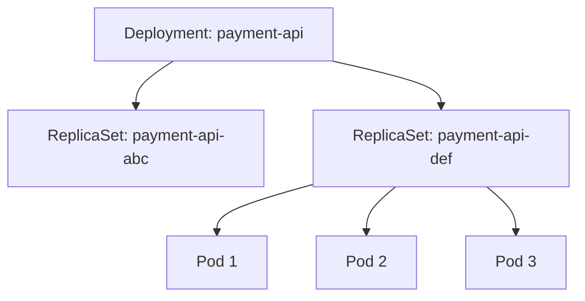
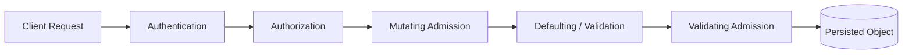
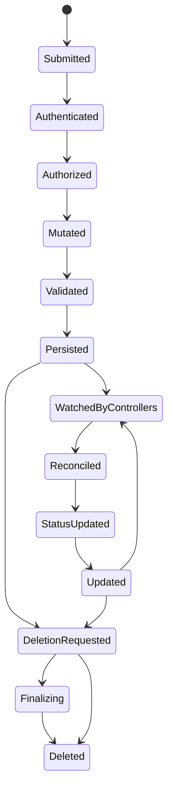

------
title: Learn Kubernetes, Deployment Model, and Cloud Native Platform Engineering - Part 004
description: Deep dive Kubernetes API resource object model: apiVersion, kind, metadata, spec, status, labels, annotations, ownerReferences, finalizers, subresources, versioning, server-side apply, dan API design invariant untuk platform engineering.
series: learn-kubernetes-deployment-model
seriesTitle: Learn Kubernetes, Deployment Model, and Cloud Native Platform Engineering
order: 4
partTitle: Kubernetes API, Resources, Objects, Metadata, and Versioning
tags:
- kubernetes
- api
- resource-model
- object-model
- metadata
- server-side-apply
- crd
- platform-engineering
- series
date: 2026-07-01
---

# Part 004 — Kubernetes API, Resources, Objects, Metadata, and Versioning

> Tujuan part ini adalah membuat kita fasih membaca dan merancang object Kubernetes. Bukan sekadar hafal `apiVersion`, `kind`, `metadata`, dan `spec`, tetapi memahami bagaimana object menjadi kontrak antara manusia, automation, controller, scheduler, admission, dan platform API.

Kubernetes adalah API platform. Semua hal penting direpresentasikan sebagai resource object:

- Deployment adalah object.
- Pod adalah object.
- Service adalah object.
- Secret adalah object.
- Node adalah object.
- Ingress/Gateway adalah object.
- Custom resource buatan platform juga object.

Jika Part 003 membahas “siapa komponen cluster”, Part 004 membahas “bahasa yang mereka pakai untuk bekerja sama”. Bahasa itu adalah Kubernetes API object model.

---

## 1. Kaufman Deconstruction: Skill API Object Model

Skill ini bisa dipecah menjadi sub-skill berikut:

1. **Membaca struktur object**: `apiVersion`, `kind`, `metadata`, `spec`, `status`.
2. **Membedakan desired state dan observed state**: `spec` vs `status`.
3. **Memahami identity object**: name, namespace, UID, resourceVersion.
4. **Menggunakan label dan selector sebagai relational model ringan.**
5. **Menggunakan annotation untuk metadata non-identifying.**
6. **Memahami ownership dan garbage collection** melalui ownerReferences.
7. **Memahami finalizer** untuk deletion workflow yang aman.
8. **Memahami subresource** seperti `/status`, `/scale`, `/eviction`.
9. **Memahami API versioning dan compatibility.**
10. **Menggunakan declarative apply dengan field ownership.**
11. **Merancang object convention untuk platform internal.**

Target akhirnya:

> Saat melihat manifest Kubernetes, kita bisa membaca bukan hanya “apa yang dideploy”, tetapi juga “siapa yang akan mengubah object ini, bagaimana object ini direkonsiliasi, apa relasinya dengan object lain, field mana yang user-owned, field mana yang controller-owned, dan failure apa yang akan muncul jika kontraknya salah”.

---

## 2. Kubernetes Object sebagai Persistent Intent

Kubernetes object adalah persistent entity yang merepresentasikan state cluster. User atau automation menulis desired state ke API server. Kubernetes menyimpan object tersebut, lalu controller dan komponen lain mencoba membawa actual state mendekati desired state.

Pola umum object:

```yaml
apiVersion: apps/v1
kind: Deployment
metadata:
  name: payment-api
  namespace: prod
  labels:
    app.kubernetes.io/name: payment-api
    app.kubernetes.io/part-of: payment-platform
spec:
  replicas: 3
  selector:
    matchLabels:
      app.kubernetes.io/name: payment-api
  template:
    metadata:
      labels:
        app.kubernetes.io/name: payment-api
    spec:
      containers:
      - name: app
        image: registry.example.com/payment-api:1.42.0
        ports:
        - containerPort: 8080
```

Field utama:

| Field | Makna |
|---|---|
| `apiVersion` | Versi API dan group resource |
| `kind` | Jenis object |
| `metadata` | Identity dan metadata object |
| `spec` | Desired state yang diminta user/controller |
| `status` | Observed state yang dilaporkan sistem/controller |

Tidak semua object mengekspos `status` secara sama, dan tidak semua manifest user menuliskan `status`. Biasanya `status` diisi oleh controller atau sistem.

---

## 3. `apiVersion`: Group dan Version

`apiVersion` bukan sekadar string. Ia menentukan group dan version schema object.

Contoh:

```yaml
apiVersion: v1
kind: Pod
```

`v1` di sini adalah core API group.

Contoh lain:

```yaml
apiVersion: apps/v1
kind: Deployment
```

`apps` adalah API group, `v1` adalah version.

Contoh CRD/platform API:

```yaml
apiVersion: platform.example.com/v1alpha1
kind: ServiceDeployment
```

Di sini:

- group: `platform.example.com`
- version: `v1alpha1`
- kind: `ServiceDeployment`

### 3.1 Kenapa Version Penting?

Version menentukan schema dan compatibility. Kubernetes API berevolusi. Resource bisa berpindah dari alpha ke beta ke stable, atau deprecated dan dihapus.

Contoh historis yang sering terjadi:

- API lama dihapus setelah beberapa release.
- Field berubah default behavior.
- Resource berpindah dari beta ke stable.
- Admission policy dan controller harus memahami versi yang benar.

Prinsip platform:

> Jangan menganggap manifest yang valid hari ini akan valid selamanya. Cluster upgrade harus mencakup API deprecation review.

### 3.2 API Version Maturity

Secara umum:

| Suffix | Makna Praktis |
|---|---|
| `v1alpha1` | Eksperimental, bisa berubah drastis |
| `v1beta1` | Lebih matang, tetapi masih bisa berubah |
| `v1` | Stable API contract |

Untuk CRD internal, jangan memberi label `v1` terlalu cepat. API internal platform juga punya lifecycle. Begitu banyak tim bergantung pada `v1`, perubahan breaking menjadi mahal.

---

## 4. `kind`: Tipe Object dan Controller Expectation

`kind` menentukan tipe object.

Contoh:

- `Pod`
- `Deployment`
- `ReplicaSet`
- `Service`
- `ConfigMap`
- `Secret`
- `StatefulSet`
- `Job`
- `CronJob`
- `Ingress`
- `Gateway`
- `HorizontalPodAutoscaler`
- custom kind seperti `KafkaCluster`, `DatabaseInstance`, `ServiceDeployment`

Tetapi `kind` hanya bermakna jika ada API server/schema yang mengenalnya dan, untuk object yang butuh aksi, ada controller yang merekonsiliasinya.

Object seperti `ConfigMap` tidak butuh controller khusus untuk “menjalankan” sesuatu. Tetapi `Deployment` butuh Deployment controller. `Ingress` butuh ingress controller. Custom resource butuh operator/controller jika ingin menghasilkan efek nyata.

Anti-pattern:

> Membuat CRD tanpa controller dan menganggap platform sudah otomatis bekerja.

CRD hanya memperluas API. Behavior tetap harus diimplementasikan.

---

## 5. Resource, Kind, Object, dan Collection

Terminologi Kubernetes sering membingungkan:

| Istilah | Contoh | Penjelasan |
|---|---|---|
| Kind | `Deployment` | Tipe object dalam API |
| Resource | `deployments` | Endpoint REST collection |
| Object | `payment-api` Deployment | Instance konkret dari kind |
| API Group | `apps` | Group resource terkait |
| Version | `v1` | Versi schema |
| GVK | `apps/v1, Kind=Deployment` | Group-Version-Kind |
| GVR | `apps/v1, Resource=deployments` | Group-Version-Resource |

Contoh:

```text
GVK: apps/v1, Kind=Deployment
GVR: apps/v1, Resource=deployments
Object: prod/payment-api
```

Kenapa ini penting?

- Manifest memakai `apiVersion` + `kind`.
- REST API memakai resource plural.
- Controller sering melakukan watch terhadap GVR.
- Scheme/conversion di client library sering berbicara dalam GVK.
- RBAC rule memakai apiGroups, resources, dan verbs.

Contoh RBAC:

```yaml
rules:
- apiGroups: ["apps"]
  resources: ["deployments"]
  verbs: ["get", "list", "watch", "create", "update", "patch"]
```

Di sini RBAC tidak menulis `kind: Deployment`, tetapi `resources: deployments`.

---

## 6. Namespaced vs Cluster-Scoped Resources

Tidak semua object hidup dalam namespace.

### 6.1 Namespaced Resources

Contoh:

- Pod
- Deployment
- Service
- ConfigMap
- Secret
- Role
- RoleBinding
- PVC
- Job

Object ini punya `metadata.namespace`.

### 6.2 Cluster-Scoped Resources

Contoh:

- Node
- Namespace
- PersistentVolume
- ClusterRole
- ClusterRoleBinding
- StorageClass
- CustomResourceDefinition

Object ini tidak berada dalam namespace tertentu.

### 6.3 Implikasi Security dan Platform

Kesalahan scope bisa berbahaya.

| Desain | Risiko |
|---|---|
| Memberi ClusterRole padahal cukup Role | Privilege terlalu luas |
| Menaruh policy cluster-wide tanpa exemption jelas | Bisa memblokir workload seluruh organisasi |
| Menggunakan namespace sebagai security boundary absolut | Namespace membantu isolasi, tetapi bukan boundary tunggal |
| Memberi akses Secret lintas namespace | Risiko lateral movement |

Prinsip:

> Default ke namespaced isolation. Gunakan cluster-scoped permission hanya jika benar-benar perlu.

---

## 7. `metadata`: Identity, Relasi, dan Lifecycle

`metadata` adalah field yang tampak sederhana tetapi sangat penting.

Contoh:

```yaml
metadata:
  name: payment-api
  namespace: prod
  labels:
    app.kubernetes.io/name: payment-api
    app.kubernetes.io/part-of: payment-platform
  annotations:
    platform.example.com/runbook: https://runbooks.example.com/payment-api
```

Field metadata penting:

| Field | Fungsi |
|---|---|
| `name` | Nama object dalam scope-nya |
| `namespace` | Namespace object, jika namespaced |
| `uid` | Identity unik yang tidak reuse walau name sama dibuat ulang |
| `resourceVersion` | Versi internal untuk concurrency/watch |
| `generation` | Naik saat desired state berubah |
| `labels` | Metadata identifying untuk selection/grouping |
| `annotations` | Metadata non-identifying |
| `ownerReferences` | Relasi ownership untuk garbage collection |
| `finalizers` | Menghambat deletion sampai cleanup selesai |
| `creationTimestamp` | Waktu object dibuat |
| `deletionTimestamp` | Waktu object mulai proses deletion |
| `managedFields` | Field ownership untuk server-side apply |

### 7.1 `name` vs `uid`

`metadata.name` bisa digunakan ulang setelah object dihapus. `metadata.uid` unik untuk instance object tersebut.

Contoh:

1. Pod `payment-api-abc` dibuat dengan UID `uid-1`.
2. Pod itu dihapus.
3. Pod baru dengan nama sama mungkin dibuat lagi, tetapi UID berbeda.

Untuk controller dan ownership, UID lebih aman daripada name saja.

### 7.2 `resourceVersion`

`resourceVersion` digunakan untuk concurrency dan watch. Ia bukan nomor versi bisnis. Jangan mendesain logic aplikasi berdasarkan asumsi bahwa `resourceVersion` monoton global dengan makna bisnis.

Gunakan untuk:

- optimistic concurrency;
- watch continuation;
- cache consistency;
- detecting update conflict.

### 7.3 `generation` dan `observedGeneration`

`metadata.generation` biasanya meningkat saat `spec` berubah. Controller dapat menulis `status.observedGeneration` untuk menyatakan bahwa ia sudah memproses generation tertentu.

Pola sehat:

```yaml
metadata:
  generation: 7
status:
  observedGeneration: 7
  conditions:
  - type: Available
    status: "True"
```

Jika `generation` lebih besar daripada `observedGeneration`, status mungkin stale.

Ini penting untuk automation:

> Jangan membaca status tanpa mengecek apakah controller sudah mengobservasi generation terbaru.

---

## 8. `spec`: Desired State

`spec` adalah state yang diinginkan. User atau higher-level controller biasanya mengelola field ini.

Contoh Deployment spec:

```yaml
spec:
  replicas: 3
  selector:
    matchLabels:
      app.kubernetes.io/name: payment-api
  template:
    metadata:
      labels:
        app.kubernetes.io/name: payment-api
    spec:
      containers:
      - name: app
        image: registry.example.com/payment-api:1.42.0
```

`spec` menjawab:

- berapa replica yang diinginkan;
- image apa yang digunakan;
- port apa yang diekspos;
- resource request/limit apa yang dibutuhkan;
- ServiceAccount apa yang dipakai;
- volume apa yang dimount;
- strategy rollout apa yang dipakai;
- constraint scheduling apa yang berlaku.

### 8.1 `spec` Harus Stabil dan Idempotent

Karena controller akan membaca `spec` berulang-ulang, `spec` harus dapat direkonsiliasi secara idempotent.

Anti-pattern:

- `spec` berisi nilai sementara yang berubah setiap render tanpa makna nyata;
- generator YAML selalu mengubah annotation checksum tanpa kebutuhan;
- timestamp build dimasukkan ke field yang memicu rollout tanpa kontrol;
- tool berbeda saling overwrite field yang sama.

---

## 9. `status`: Observed State

`status` adalah laporan dari sistem/controller tentang keadaan aktual.

Contoh status Deployment:

```yaml
status:
  observedGeneration: 7
  replicas: 3
  updatedReplicas: 3
  readyReplicas: 3
  availableReplicas: 3
  conditions:
  - type: Available
    status: "True"
    reason: MinimumReplicasAvailable
  - type: Progressing
    status: "True"
    reason: NewReplicaSetAvailable
```

User normalnya tidak menulis `status` langsung. Controller yang bertanggung jawab menulis status.

### 9.1 Status Bukan Sumber Desired State

Jangan mengubah `status` untuk mencoba memperbaiki workload. Jika Pod tidak ready, perbaiki penyebabnya di spec, dependency, runtime, atau environment. Status adalah gejala dan laporan, bukan knob utama.

### 9.2 Conditions

Banyak resource memakai `status.conditions` untuk menyatakan keadaan penting.

Pola condition:

```yaml
conditions:
- type: Ready
  status: "False"
  reason: ContainersNotReady
  message: containers with unready status: [app]
  lastTransitionTime: "2026-07-01T10:15:00Z"
```

Field condition biasanya mencakup:

| Field | Makna |
|---|---|
| `type` | Jenis kondisi, misalnya `Ready`, `Available`, `Progressing` |
| `status` | `True`, `False`, atau `Unknown` |
| `reason` | Alasan machine-readable |
| `message` | Detail human-readable |
| `lastTransitionTime` | Kapan status kondisi berubah |
| `observedGeneration` | Generation yang sudah diproses, jika tersedia |

Untuk automation, gunakan `type`, `status`, `reason`, dan `observedGeneration`. Jangan hanya parsing message human-readable.

---

## 10. Labels: Relational Model Ringan Kubernetes

Labels adalah key-value metadata yang digunakan untuk selection dan grouping.

Contoh recommended labels:

```yaml
labels:
  app.kubernetes.io/name: payment-api
  app.kubernetes.io/instance: payment-api-prod
  app.kubernetes.io/version: "1.42.0"
  app.kubernetes.io/component: api
  app.kubernetes.io/part-of: payment-platform
  app.kubernetes.io/managed-by: argocd
```

Labels digunakan oleh:

- Service selector;
- Deployment selector;
- ReplicaSet selector;
- NetworkPolicy podSelector;
- affinity/anti-affinity;
- topology spread;
- monitoring discovery;
- cost allocation;
- ownership tracking;
- bulk operations.

### 10.1 Label Design Invariant

Label harus stabil, konsisten, dan punya governance.

Bad label design:

```yaml
labels:
  app: app
  owner: team
  env: prod1
```

Masalah:

- terlalu generik;
- raw ownership tidak jelas;
- tidak ada namespace key organisasi;
- environment naming tidak standar.

Lebih baik:

```yaml
labels:
  app.kubernetes.io/name: payment-api
  app.kubernetes.io/part-of: payment-platform
  platform.example.com/team: payments
  platform.example.com/environment: production
  platform.example.com/tier: critical
```

### 10.2 Label Jangan Memuat Data Sensitif

Labels bisa terbaca oleh banyak tool dan dipakai untuk selection. Jangan menaruh token, customer identifier sensitif, atau data rahasia.

---

## 11. Selectors: Kontrak yang Bisa Memutus Object Graph

Selector menghubungkan object.

Contoh Service:

```yaml
apiVersion: v1
kind: Service
metadata:
  name: payment-api
spec:
  selector:
    app.kubernetes.io/name: payment-api
  ports:
  - port: 80
    targetPort: 8080
```

Service ini memilih Pod dengan label `app.kubernetes.io/name=payment-api`.

Jika Pod template label berbeda:

```yaml
labels:
  app.kubernetes.io/name: payment
```

maka EndpointSlice kosong dan traffic gagal.

### 11.1 Selector Deployment Harus Cocok dengan Template Label

Deployment:

```yaml
spec:
  selector:
    matchLabels:
      app.kubernetes.io/name: payment-api
  template:
    metadata:
      labels:
        app.kubernetes.io/name: payment-api
```

Selector dan template label harus cocok. Jika tidak, Deployment tidak bisa mengelola Pod dengan benar.

### 11.2 Selector Immutability

Beberapa selector bersifat immutable setelah object dibuat, terutama pada controller seperti Deployment. Ini mencegah controller tiba-tiba mengadopsi atau melepas object dengan cara berbahaya.

Konsekuensi:

- label taxonomy harus dipikirkan sejak awal;
- rename app label bisa menjadi operasi destructive;
- migration label harus dirancang hati-hati.

---

## 12. Annotations: Metadata Non-Identifying

Annotations adalah key-value metadata untuk informasi non-identifying. Annotations tidak dimaksudkan untuk selection.

Contoh:

```yaml
annotations:
  platform.example.com/runbook: https://runbooks.example.com/payment-api
  platform.example.com/oncall: payments-primary
  checksum/config: "sha256:abc123"
```

Use case annotation:

- runbook link;
- dashboard link;
- build metadata;
- checksum ConfigMap untuk trigger rollout;
- owner info tambahan;
- tool-specific metadata;
- policy exception dengan expiry;
- deployment trace ID.

Jangan gunakan annotation untuk selector. Jika field harus dipakai untuk memilih object, gunakan label.

---

## 13. OwnerReferences dan Garbage Collection

`ownerReferences` menyatakan object dimiliki oleh object lain. Ini memungkinkan Kubernetes garbage collector menghapus child object ketika owner dihapus.

Contoh relasi:

```text
Deployment owns ReplicaSet
ReplicaSet owns Pod
```

Diagram:



Jika Deployment dihapus dengan propagation policy yang sesuai, ReplicaSet dan Pod turunannya ikut dibersihkan.

### 13.1 Kenapa OwnerReferences Penting?

Tanpa ownership yang benar:

- object orphan menumpuk;
- cleanup manual sulit;
- controller tidak tahu object mana yang dikelola;
- rollback history bisa kacau;
- platform API custom bisa meninggalkan resource cloud mahal.

### 13.2 Controller Custom dan Ownership

Jika membangun operator, child resource harus diberi ownerReference ke custom resource parent bila lifecycle-nya memang tergantung parent.

Contoh:

```text
ServiceDeployment custom resource
  owns Deployment
  owns Service
  owns HorizontalPodAutoscaler
  owns PodDisruptionBudget
```

Tetapi hati-hati: tidak semua resource harus owned. Resource shared seperti Namespace, ClusterRole, atau shared Secret mungkin tidak boleh otomatis dihapus saat satu app dihapus.

---

## 14. Finalizers: Deletion sebagai Workflow

Deletion di Kubernetes bukan selalu instant. Jika object memiliki finalizer, Kubernetes akan:

1. set `metadata.deletionTimestamp`;
2. mempertahankan object;
3. menunggu controller menghapus finalizer;
4. baru menghapus object secara final.

Contoh:

```yaml
metadata:
  finalizers:
  - platform.example.com/cleanup-cloud-resource
```

Finalizer dipakai ketika perlu cleanup eksternal:

- menghapus load balancer cloud;
- revoke DNS record;
- backup sebelum delete;
- detach external database;
- release license;
- cleanup identity provider;
- archive audit metadata.

### 14.1 Finalizer Failure Mode

Finalizer yang rusak membuat object stuck terminating.

Gejala:

```bash
kubectl get <resource>
# STATUS: Terminating
```

Cek:

```bash
kubectl get <resource> <name> -o yaml
```

Lihat:

- `metadata.deletionTimestamp` ada;
- `metadata.finalizers` masih ada;
- controller yang harus cleanup sehat atau tidak.

Anti-pattern:

> Menambahkan finalizer tanpa controller yang reliably menghapus finalizer setelah cleanup.

Finalizer adalah janji operasional. Jika janji itu gagal, deletion macet.

---

## 15. Subresources: Memisahkan Concern dalam API

Kubernetes memiliki subresource untuk operasi tertentu.

Contoh:

| Subresource | Fungsi |
|---|---|
| `/status` | Update status terpisah dari spec |
| `/scale` | Interface umum untuk scaling |
| `/eviction` | API-initiated Pod eviction |
| `/binding` | Binding Pod ke Node |
| `/log` | Akses log Pod |
| `/exec` | Exec ke container |
| `/portforward` | Port forward |

### 15.1 Kenapa `/status` Penting?

Controller harus bisa update status tanpa mengambil alih spec. RBAC bisa memberi permission update `resources/status` tanpa memberi permission update resource utama.

Contoh RBAC controller:

```yaml
rules:
- apiGroups: ["platform.example.com"]
  resources: ["servicedeployments"]
  verbs: ["get", "list", "watch"]
- apiGroups: ["platform.example.com"]
  resources: ["servicedeployments/status"]
  verbs: ["update", "patch"]
```

Ini memisahkan:

- user/platform author mengelola `spec`;
- controller mengelola `status`.

### 15.2 `/scale`

`/scale` memberi interface generic untuk autoscaler. Resource yang mendukung scale bisa diskalakan tanpa autoscaler memahami seluruh schema resource.

Deployment, ReplicaSet, StatefulSet, dan beberapa custom resource bisa mendukung scale subresource.

---

## 16. Create, Update, Patch, Apply

Kubernetes API mendukung beberapa cara mengubah object.

| Operasi | Makna |
|---|---|
| Create | Membuat object baru |
| Update | Mengganti object/resource version tertentu |
| Patch | Mengubah sebagian field |
| Apply | Declarative field management |
| Delete | Menghapus object atau memulai deletion flow |

### 16.1 Imperative vs Declarative

Imperative:

```bash
kubectl scale deployment payment-api --replicas=5
```

Declarative:

```yaml
spec:
  replicas: 5
```

lalu:

```bash
kubectl apply -f deployment.yaml
```

Keduanya valid, tetapi untuk production platform, declarative management lebih audit-friendly.

### 16.2 Server-Side Apply dan Field Ownership

Server-side apply menyimpan ownership field di `metadata.managedFields`. Ini membantu beberapa manager mengelola field berbeda tanpa saling overwrite sembarangan.

Contoh manager:

- GitOps controller mengelola Deployment spec utama;
- HPA mengelola replicas melalui scale subresource;
- platform mutating webhook menambahkan default security context;
- controller mengelola status.

Masalah umum:

- dua manager mengklaim field sama;
- `kubectl apply` manual konflik dengan GitOps;
- Helm render mengubah field yang dikelola autoscaler;
- automation patch replicas tetapi GitOps mengembalikan nilai lama.

Prinsip:

> Untuk setiap field penting, harus jelas siapa owner-nya.

---

## 17. Admission, Defaulting, and Validation

Sebelum object disimpan, API request melewati defaulting, validation, dan admission chain.

Pipeline sederhana:



Catatan: urutan internal detail bisa lebih kompleks tergantung tipe request dan admission chain, tetapi mental modelnya: object bisa dimutasi dan divalidasi sebelum persisted.

### 17.1 Mutating Admission

Mutating admission bisa menambahkan atau mengubah field.

Contoh:

- inject sidecar;
- add default labels;
- set resource defaults;
- add toleration tertentu;
- rewrite image registry;
- inject certificate volume.

Risiko:

- hasil object berbeda dari manifest Git;
- debugging sulit jika mutation tidak transparan;
- mutation bisa memicu rollout tak terduga;
- webhook downtime bisa memblokir deployment.

### 17.2 Validating Admission

Validating admission menolak object yang melanggar policy.

Contoh policy:

- container harus non-root;
- image harus dari registry approved;
- Deployment harus punya readiness probe;
- resource requests wajib;
- LoadBalancer hanya boleh di namespace tertentu;
- privilege escalation dilarang.

Validating admission adalah guardrail. Tetapi guardrail harus punya error message yang jelas agar developer bisa memperbaiki request.

---

## 18. API Object Lifecycle

Lifecycle object bisa dipahami seperti ini:



Hal penting:

- Object tidak selesai saat `kubectl apply` sukses.
- `apply` sukses berarti object diterima dan disimpan.
- Efek nyata terjadi setelah controller dan node merekonsiliasi.
- Deletion bisa tertunda karena finalizer.
- Status bisa tertinggal dari spec.

---

## 19. Versioning dan API Evolution

Kubernetes API versioning penting untuk upgrade dan long-term maintainability.

### 19.1 Internal vs External Version

Kubernetes dapat menerima beberapa versi eksternal dan mengonversinya ke representasi internal. User melihat versi API eksternal seperti `apps/v1`.

Bagi platform engineer, yang penting:

- manifest harus memakai API yang supported;
- CRD harus punya conversion strategy jika banyak versi;
- breaking change harus direncanakan;
- deprecation harus dilacak sebelum upgrade cluster.

### 19.2 CRD Versioning

Untuk custom platform API:

```yaml
apiVersion: apiextensions.k8s.io/v1
kind: CustomResourceDefinition
spec:
  group: platform.example.com
  names:
    kind: ServiceDeployment
    plural: servicedeployments
  versions:
  - name: v1alpha1
    served: true
    storage: true
```

Ketika API matang:

- `v1alpha1` mungkin tetap served untuk compatibility;
- `v1beta1` atau `v1` ditambahkan;
- storage version dipilih;
- conversion webhook mungkin diperlukan;
- migration plan dibutuhkan.

Anti-pattern:

> Membuat CRD `v1` sejak hari pertama tanpa memahami field mana yang stabil.

---

## 20. Designing Platform Resource APIs

Jika kita membangun internal developer platform, sering kali kita membuat API lebih tinggi dari Kubernetes native.

Contoh custom resource:

```yaml
apiVersion: platform.example.com/v1alpha1
kind: ServiceDeployment
metadata:
  name: payment-api
  namespace: prod
spec:
  image: registry.example.com/payment-api:1.42.0
  replicas:
    min: 3
    max: 10
  traffic:
    public: true
    port: 8080
  reliability:
    tier: critical
    rollout: canary
  ownership:
    team: payments
```

Controller platform menerjemahkan object ini menjadi:

- Deployment;
- Service;
- HPA;
- PodDisruptionBudget;
- NetworkPolicy;
- ServiceMonitor;
- Ingress/Gateway route;
- default labels/annotations;
- policy-compliant security context.

### 20.1 API Design Invariant

Platform API yang baik harus:

- menyembunyikan detail yang tidak perlu diketahui developer;
- tetap memberi escape hatch yang dikontrol;
- punya status yang jelas;
- punya condition yang machine-readable;
- punya defaults yang aman;
- tidak mencampur desired state dan observed state;
- punya versioning strategy;
- punya migration path;
- tidak terlalu early mengunci abstraction yang salah.

### 20.2 Spec Design Smell

| Smell | Masalah |
|---|---|
| `spec.rawYaml` terlalu besar | Platform API hanya wrapper tipis tanpa governance |
| Semua field optional tanpa default jelas | Controller behavior tidak predictable |
| Field boolean terlalu banyak | Kombinasi state sulit divalidasi |
| `spec.status` atau `spec.phase` | Desired dan observed state tercampur |
| Tidak ada `status.conditions` | Automation sulit membaca health |
| Tidak ada ownership labels | Operasi fleet sulit |
| Tidak ada versioning plan | Breaking change pasti menyakitkan |

---

## 21. Field Ownership dan Multi-Actor Conflict

Kubernetes object jarang dikelola satu aktor saja.

Contoh Deployment production:

| Field | Manager |
|---|---|
| `spec.template.spec.containers[].image` | GitOps/release pipeline |
| `spec.replicas` | HPA melalui `/scale`, atau GitOps jika fixed |
| `metadata.labels` | Platform template/GitOps |
| `metadata.annotations.checksum/config` | Config render tool |
| `status` | Deployment controller |
| injected sidecar | Mutating webhook/service mesh |
| security defaults | Admission/platform policy |

Konflik umum:

- Developer scale manual, GitOps revert.
- HPA mengubah replicas, Helm chart tetap set replicas statis.
- Mutating webhook inject sidecar, diff GitOps selalu out-of-sync.
- Policy engine menolak field yang template lama masih hasilkan.

Prinsip:

> Object harus punya ownership contract. Tanpa itu, Kubernetes menjadi arena saling overwrite antar automation.

---

## 22. Object Diff dan Drift

Drift adalah perbedaan antara desired state source-of-truth dan state di cluster.

Sumber drift:

- manual `kubectl edit`;
- autoscaler;
- mutating admission;
- controller update;
- Helm hook;
- emergency patch;
- defaulting API server;
- operator mengubah child resource;
- GitOps ignore rule tidak tepat.

Tidak semua drift buruk. Status drift dari spec adalah normal. Field yang dimiliki controller juga normal berubah. Yang berbahaya adalah drift pada field yang seharusnya dikelola declaratively.

### 22.1 Drift Classification

| Drift Type | Contoh | Harus Dihapus? |
|---|---|---|
| Expected system drift | `status`, `resourceVersion` | Tidak |
| Expected controller drift | HPA replicas | Tergantung ownership |
| Admission mutation | default label/security context | Tergantung policy |
| Manual emergency patch | image diganti langsung | Harus direkonsiliasi ke Git |
| Unauthorized drift | privilege ditambahkan manual | Harus ditolak/diperbaiki |

---

## 23. API Error Reading

Kubernetes error sering memberi petunjuk layer yang gagal.

### 23.1 Forbidden

```text
Error from server (Forbidden): deployments.apps is forbidden
```

Layer: authorization/RBAC.

Pertanyaan:

- caller identity siapa?
- verb apa yang diminta?
- resource apa?
- namespace mana?
- rolebinding/clusterrolebinding mana yang berlaku?

### 23.2 Invalid

```text
The Deployment "payment-api" is invalid: spec.selector: Invalid value
```

Layer: schema/validation.

Pertanyaan:

- field mana invalid?
- apakah selector cocok dengan template label?
- apakah field immutable diubah?

### 23.3 Conflict

```text
Operation cannot be fulfilled: the object has been modified
```

Layer: optimistic concurrency/resourceVersion.

Pertanyaan:

- ada actor lain mengubah object?
- client perlu re-read dan retry?
- controller loop sudah idempotent?

### 23.4 Admission Denied

```text
admission webhook denied the request
```

Layer: validating admission/policy.

Pertanyaan:

- webhook mana?
- policy mana?
- error message actionable atau tidak?
- ada exemption/namespace policy?

---

## 24. Object Model Failure Modes

| Failure | Root Cause Umum | Gejala |
|---|---|---|
| Service endpoint kosong | selector tidak match atau readiness false | Service 503/timeout |
| Deployment update ditolak | selector immutable diubah | API validation error |
| Object stuck terminating | finalizer tidak dibersihkan | status `Terminating` lama |
| GitOps selalu out-of-sync | mutation/defaulting/managedFields conflict | sync loop berulang |
| HPA tidak efektif | replicas dikelola GitOps statis | scale naik lalu revert |
| Controller custom overwrite user field | ownership tidak jelas | perubahan user hilang |
| Status misleading | observedGeneration stale | automation salah membaca health |
| CRD breaking change | versioning buruk | upgrade operator merusak resource lama |
| Orphan resource | ownerReferences tidak diset | resource bocor setelah parent delete |
| Policy sulit enforce | label taxonomy kacau | selector policy tidak akurat |

---

## 25. API Conventions untuk Enterprise Kubernetes

Untuk platform besar, object convention harus distandarkan.

### 25.1 Required Labels

Contoh baseline:

```yaml
app.kubernetes.io/name: payment-api
app.kubernetes.io/instance: payment-api-prod
app.kubernetes.io/version: "1.42.0"
app.kubernetes.io/component: api
app.kubernetes.io/part-of: payment-platform
app.kubernetes.io/managed-by: argocd
platform.example.com/team: payments
platform.example.com/environment: production
platform.example.com/tier: critical
```

### 25.2 Required Annotations

Contoh:

```yaml
platform.example.com/runbook: https://runbooks.example.com/payment-api
platform.example.com/repository: https://github.example.com/payments/payment-api
platform.example.com/pager: payments-primary
platform.example.com/data-classification: internal
```

### 25.3 Naming Convention

Nama object harus:

- stabil;
- human-readable;
- environment-aware bila perlu;
- tidak mengandung data sensitif;
- tidak terlalu panjang;
- konsisten dengan DNS/resource constraints;
- tidak berubah setiap deploy kecuali memang object immutable.

### 25.4 Status Convention untuk Custom Resource

Custom resource sebaiknya punya:

```yaml
status:
  observedGeneration: 4
  phase: Ready
  conditions:
  - type: Ready
    status: "True"
    reason: AllComponentsAvailable
    message: Deployment, Service, and Route are healthy
  resources:
    deploymentName: payment-api
    serviceName: payment-api
```

`phase` boleh membantu human reading, tetapi automation sebaiknya mengandalkan conditions yang lebih detail.

---

## 26. Object Graph Debugging Method

Gunakan metode ini saat debugging.

### Step 1 — Identify the Root Object

Contoh:

```bash
kubectl get deployment payment-api -n prod -o yaml
```

Tanyakan:

- API version benar?
- generation berapa?
- condition apa?
- observedGeneration sama atau tertinggal?

### Step 2 — Follow Ownership

```bash
kubectl get rs -n prod -l app.kubernetes.io/name=payment-api
kubectl get pods -n prod -l app.kubernetes.io/name=payment-api
```

Tanyakan:

- ReplicaSet baru muncul?
- Pod dibuat?
- ownerReference benar?

### Step 3 — Inspect Events

```bash
kubectl describe deployment payment-api -n prod
kubectl describe pod <pod> -n prod
kubectl get events -n prod --sort-by=.lastTimestamp
```

Events sering menunjukkan scheduling, pull image, mount volume, dan probe failure.

### Step 4 — Validate Selectors

```bash
kubectl get svc payment-api -n prod -o yaml
kubectl get pods -n prod --show-labels
kubectl get endpointslice -n prod -l kubernetes.io/service-name=payment-api
```

Tanyakan:

- selector Service cocok dengan Pod label?
- Pod ready?
- EndpointSlice berisi endpoint?

### Step 5 — Check Field Ownership

```bash
kubectl get deployment payment-api -n prod -o yaml --show-managed-fields
```

Tanyakan:

- siapa mengelola field yang berubah?
- ada konflik GitOps/HPA/manual patch?

---

## 27. Practice: 20 Jam Pertama untuk API Object Model

### Latihan 1 — Read Object Like a Controller

Ambil Deployment production-like. Tulis:

- GVK;
- namespace;
- labels utama;
- selector;
- owner child object;
- desired replicas;
- observed replicas;
- condition;
- generation vs observedGeneration.

Tujuan: membiasakan membaca object sebagai state contract.

### Latihan 2 — Break Service Selector

Buat Deployment dan Service. Ubah label Pod template agar Service selector tidak cocok.

Amati:

```bash
kubectl get svc
kubectl get endpointslice
kubectl get pods --show-labels
```

Target: memahami bahwa traffic path bergantung pada label/selector contract.

### Latihan 3 — Finalizer Simulation

Buat custom object atau ConfigMap dengan finalizer dummy.

```bash
kubectl patch configmap test-finalizer \
  --type merge \
  -p '{"metadata":{"finalizers":["example.com/finalizer"]}}'
```

Delete object, lalu amati stuck terminating.

Target: memahami deletion workflow.

### Latihan 4 — Server-Side Apply Conflict

Gunakan dua field manager untuk mengubah field yang sama.

```bash
kubectl apply --server-side --field-manager=manager-a -f deploy.yaml
kubectl apply --server-side --field-manager=manager-b -f deploy-modified.yaml
```

Target: memahami field ownership dan konflik multi-actor.

### Latihan 5 — observedGeneration

Update Deployment image, lalu perhatikan generation dan status.

```bash
kubectl get deployment payment-api -o jsonpath='{.metadata.generation}'
kubectl get deployment payment-api -o jsonpath='{.status.observedGeneration}'
```

Target: memahami status freshness.

---

## 28. Mini Case Study: GitOps Melawan HPA

Gejala:

- HPA menaikkan replica dari 3 ke 8.
- Beberapa menit kemudian replica kembali 3.
- Traffic spike menyebabkan latency naik.

Kemungkinan penyebab:

- GitOps/Helm terus menerapkan `spec.replicas: 3`.
- HPA mengubah scale subresource, tetapi source-of-truth mengembalikannya.

Solusi desain:

- Jika HPA aktif, jangan kelola `spec.replicas` secara statis dengan GitOps kecuali ada convention khusus.
- Gunakan field ignore/diff customization dengan sangat hati-hati.
- Tetapkan ownership: HPA owner untuk replicas, GitOps owner untuk template/spec lain.

Lesson:

> Kubernetes object bisa dimodifikasi banyak aktor. Tanpa field ownership contract, automation saling membatalkan.

---

## 29. Mini Case Study: Resource Stuck Terminating

Gejala:

```bash
kubectl get namespace old-env
# old-env Terminating
```

Kemungkinan root cause:

- finalizer namespace belum selesai;
- ada resource dalam namespace yang tidak bisa dihapus;
- APIService untuk custom resource tidak available;
- controller finalizer custom mati;
- CRD dihapus sebelum custom resource dibersihkan.

Reasoning:

Deletion di Kubernetes adalah workflow. `delete` bukan selalu immediate removal.

Langkah:

```bash
kubectl get namespace old-env -o yaml
kubectl api-resources --verbs=list --namespaced -o name \
  | xargs -n 1 kubectl get -n old-env --ignore-not-found
```

Hati-hati menghapus finalizer manual. Itu bisa meninggalkan resource eksternal orphan.

---

## 30. Ringkasan Part 004

Kubernetes API object model adalah fondasi semua deployment model:

- `apiVersion` dan `kind` menentukan schema object.
- `metadata` menyimpan identity, lifecycle, ownership, labels, annotations, dan managed fields.
- `spec` adalah desired state.
- `status` adalah observed state.
- `generation` dan `observedGeneration` membantu membaca freshness status.
- Labels dan selectors adalah relational model ringan Kubernetes.
- Annotations adalah metadata non-identifying.
- OwnerReferences mengaktifkan garbage collection.
- Finalizers membuat deletion menjadi workflow yang aman.
- Subresources memisahkan concern seperti status, scale, eviction, log, dan exec.
- Server-side apply memperkenalkan field ownership, tetapi tetap butuh convention.
- Platform API yang baik harus punya versioning, status conditions, safe defaults, dan ownership contract.

Part berikutnya akan masuk ke **Pods and the Container Runtime Contract**: Pod lifecycle, restart semantics, init container, sidecar, probes, signal handling, graceful shutdown, container contract, dan kenapa Pod adalah unit deployment terkecil tetapi bukan boundary aplikasi terbesar.

---

## References

- Kubernetes Documentation — Objects In Kubernetes: https://kubernetes.io/docs/concepts/overview/working-with-objects/
- Kubernetes Documentation — Kubernetes API Concepts: https://kubernetes.io/docs/reference/using-api/api-concepts/
- Kubernetes Documentation — API Overview: https://kubernetes.io/docs/reference/generated/kubernetes-api/
- Kubernetes Documentation — Labels and Selectors: https://kubernetes.io/docs/concepts/overview/working-with-objects/labels/
- Kubernetes Documentation — Annotations: https://kubernetes.io/docs/concepts/overview/working-with-objects/annotations/
- Kubernetes Documentation — Owners and Dependents: https://kubernetes.io/docs/concepts/overview/working-with-objects/owners-dependents/
- Kubernetes Documentation — Finalizers: https://kubernetes.io/docs/concepts/overview/working-with-objects/finalizers/
- Kubernetes Documentation — Server-Side Apply: https://kubernetes.io/docs/reference/using-api/server-side-apply/
- Kubernetes Documentation — CustomResourceDefinitions: https://kubernetes.io/docs/tasks/extend-kubernetes/custom-resources/custom-resource-definitions/
