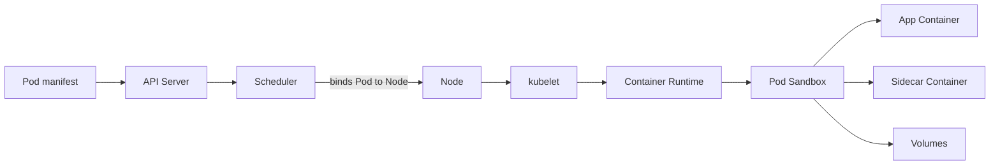
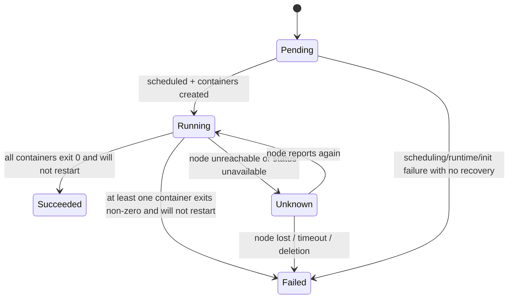
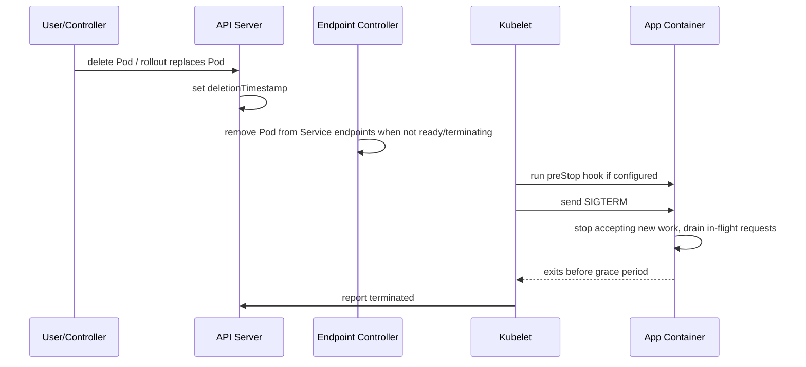
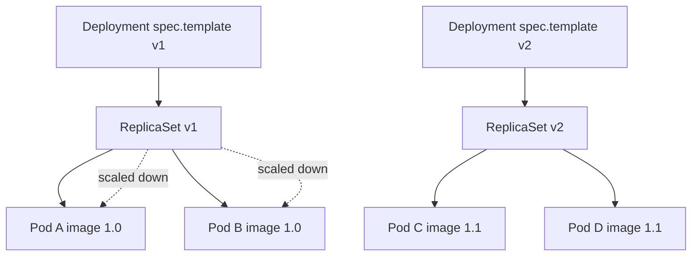
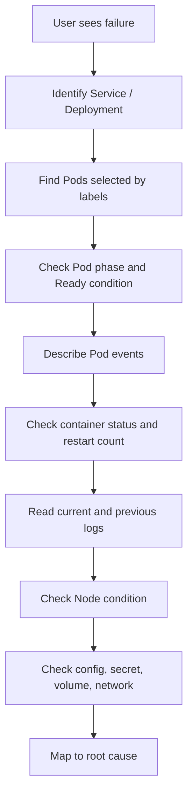

------
title: Learn Kubernetes, Deployment Model, and Cloud Native Platform Engineering - Part 005
description: Deep dive Pod sebagai unit eksekusi Kubernetes, container runtime contract, lifecycle, probes, sidecars, termination, debugging, dan failure modelling.
series: learn-kubernetes-deployment-model
seriesTitle: Learn Kubernetes, Deployment Model, and Cloud Native Platform Engineering
order: 5
partTitle: Pods and the Container Runtime Contract
tags:
- kubernetes
- pods
- container-runtime
- workload
- deployment
- reliability
- sre
- series
date: 2026-07-01
---

# Part 005 — Pods and the Container Runtime Contract

> Tujuan part ini adalah membuat kita melihat Pod bukan sebagai “container yang dijalankan Kubernetes”, tetapi sebagai **unit scheduling, lifecycle, network identity, resource accounting, dan failure isolation terkecil** dalam Kubernetes.

Di Docker, kita sering berpikir dalam bentuk container individual. Di Kubernetes, unit dasar bukan container, melainkan **Pod**. Sebuah Pod dapat berisi satu atau lebih container yang berbagi konteks eksekusi tertentu: network namespace, IP address, volume, dan lifecycle scheduling. Kubernetes men-schedule Pod ke Node, kubelet menjaga Pod tersebut di Node, dan controller seperti Deployment/ReplicaSet/StatefulSet/Job menciptakan atau mengganti Pod berdasarkan desired state.

Mental model terpenting:

```text
Pod is not a durable server.
Pod is an ephemeral execution cell produced by a higher-level controller.
```

Kalau kita memperlakukan Pod seperti VM kecil yang stabil, desain kita akan rapuh. Kalau kita memperlakukan Pod sebagai **cell sementara** yang bisa mati, diganti, dipindah, atau dibuat ulang kapan saja, desain kita akan lebih dekat dengan cara Kubernetes benar-benar bekerja.

---

## 1. Kaufman Deconstruction: Skill yang Harus Dikuasai

Menguasai Pod berarti menguasai beberapa sub-skill kecil:

| Sub-skill | Pertanyaan yang Harus Bisa Dijawab |
|---|---|
| Pod identity | Apa yang stabil dan tidak stabil dari sebuah Pod? |
| Pod lifecycle | Apa arti `Pending`, `Running`, `Succeeded`, `Failed`, `Unknown`? |
| Container lifecycle | Apa beda waiting, running, terminated, restart count, dan last state? |
| Init container | Kapan kita butuh initialization yang harus selesai sebelum app start? |
| Sidecar container | Kapan supporting process harus hidup bersama app container? |
| Probe design | Kapan pakai startup, readiness, dan liveness probe? |
| Shutdown design | Bagaimana proses menerima traffic stop, SIGTERM, drain, dan exit? |
| Resource boundary | Bagaimana Pod meminta CPU/memory dan bagaimana Node melakukan eviction? |
| Debugging | Bagaimana membaca Pod yang `Pending`, `CrashLoopBackOff`, `ImagePullBackOff`, `OOMKilled`, atau stuck `Terminating`? |
| Deployment implication | Kenapa update Pod template menghasilkan Pod baru, bukan patch container lama? |

Sub-skill di atas lebih penting daripada hafal field YAML. YAML hanya manifestasi dari contract. Yang harus dikuasai adalah **contract dan failure semantics**.

---

## 2. Pod sebagai Scheduling Atom

Pod adalah unit yang Kubernetes jadwalkan ke Node. Scheduler tidak menempatkan container satu per satu; scheduler memilih Node untuk Pod. Setelah Pod terikat ke Node, kubelet di Node tersebut bertanggung jawab membuat Pod sandbox, menarik image, menjalankan container, memantau status, menjalankan probe, dan melaporkan status kembali ke API server.



Implikasinya besar:

1. **Semua container dalam Pod colocated** pada Node yang sama.
2. **Semua container dalam Pod berbagi lifecycle scheduling**.
3. **Resource request Pod adalah agregasi resource container** dengan aturan tertentu untuk init container.
4. **Pod IP diberikan ke Pod**, bukan ke container individual.
5. **Jika Pod diganti, identitas runtime berubah**: UID, IP, restart count, status, event history.

Rule of thumb:

```text
Masukkan container ke Pod yang sama hanya jika mereka harus hidup, mati, diskalakan, dan ditempatkan bersama.
```

Kalau dua proses bisa diskalakan berbeda, rollout berbeda, atau gagal secara independen, biasanya mereka tidak seharusnya berada dalam Pod yang sama.

---

## 3. Apa yang Dibagi oleh Container dalam Pod?

Container dalam Pod bukan container yang sepenuhnya independen. Mereka berbagi beberapa namespace dan resource.

| Area | Shared? | Implikasi |
|---|---:|---|
| Network namespace | Ya | Semua container dalam Pod berbagi IP dan port space. `localhost` antar container mengarah ke Pod yang sama. |
| Pod IP | Ya | Service memilih Pod, bukan container. |
| Volumes | Bisa | Container dapat berbagi file melalui volume yang sama. |
| Lifecycle placement | Ya | Semua container ditempatkan di Node yang sama. |
| CPU/memory limits | Per container, dihitung pada level Pod juga | Resource pressure dapat mempengaruhi semua container di Pod. |
| Process namespace | Default tidak, bisa dikonfigurasi | Dengan `shareProcessNamespace`, container dapat melihat proses satu sama lain. |
| Filesystem root | Tidak | Tiap container punya filesystem image masing-masing. |
| Environment variables | Tidak otomatis | Harus didefinisikan per container. |

Contoh praktis:

```yaml
apiVersion: v1
kind: Pod
metadata:
  name: payments-api-demo
  labels:
    app.kubernetes.io/name: payments-api
    app.kubernetes.io/component: api
spec:
  containers:
    - name: app
      image: registry.example.com/payments-api:1.8.3
      ports:
        - containerPort: 8080
      volumeMounts:
        - name: shared-logs
          mountPath: /var/log/app
    - name: log-shipper
      image: registry.example.com/log-shipper:2.1.0
      volumeMounts:
        - name: shared-logs
          mountPath: /var/log/app
  volumes:
    - name: shared-logs
      emptyDir: {}
```

Di sini `app` dan `log-shipper` berbagi volume. Tetapi mereka juga berbagi fate: jika Pod dihapus, keduanya hilang. Jika traffic diarahkan ke Pod, readiness Pod dipengaruhi oleh readiness container sesuai konfigurasi.

---

## 4. Anatomy Pod: `metadata`, `spec`, `status`

Pod tetap mengikuti object model Kubernetes:

```yaml
apiVersion: v1
kind: Pod
metadata:
  name: inventory-api-abc123
  namespace: production
  labels:
    app.kubernetes.io/name: inventory-api
    app.kubernetes.io/instance: inventory-api-prod
    app.kubernetes.io/version: "2.4.1"
spec:
  serviceAccountName: inventory-api
  restartPolicy: Always
  containers:
    - name: app
      image: registry.example.com/inventory-api:2.4.1
      resources:
        requests:
          cpu: "250m"
          memory: "512Mi"
        limits:
          memory: "1Gi"
      readinessProbe:
        httpGet:
          path: /ready
          port: 8080
      livenessProbe:
        httpGet:
          path: /live
          port: 8080
status:
  phase: Running
  podIP: 10.42.3.17
  conditions:
    - type: Ready
      status: "True"
  containerStatuses:
    - name: app
      ready: true
      restartCount: 0
```

Bagian penting:

| Field | Siapa yang Menulis | Makna |
|---|---|---|
| `metadata` | user/controller/API server | Identitas object, label, annotation, owner reference, UID. |
| `spec` | user/controller/platform tool | Desired state: container apa, image apa, resource apa, probe apa. |
| `status` | kubelet/controller | Actual observed state: phase, condition, IP, container status. |

Jangan menulis automation yang mengambil keputusan hanya dari `spec`. Dalam operasi production, keputusan harus membaca kombinasi:

```text
metadata + spec + status + events + controller state + node state
```

---

## 5. Pod Bukan Deployment Unit yang Ideal

Kita bisa membuat Pod langsung, tetapi dalam production biasanya tidak. Alasannya: Pod langsung tidak punya controller yang mengganti Pod saat hilang, melakukan rollout, menjaga replica count, atau menyimpan revision history.

| Cara Membuat | Cocok Untuk | Tidak Cocok Untuk |
|---|---|---|
| Direct Pod | Debugging, eksperimen, static Pod, low-level testing | Production stateless service |
| Deployment | Stateless replicated service | Stateful identity, ordered rollout |
| StatefulSet | Stateful workload dengan identity stabil | Stateless API sederhana |
| DaemonSet | Agent per Node | Service biasa yang perlu horizontal scaling |
| Job | Work selesai lalu exit | Long-running service |
| CronJob | Scheduled execution | Always-on API |

Invariant:

```text
Production workload should usually be managed by a controller, not by bare Pods.
```

Bare Pod tidak berarti salah. Tetapi bare Pod memindahkan tanggung jawab healing dan replacement ke operator manusia atau automation eksternal.

---

## 6. Pod Lifecycle

Pod memiliki phase sederhana, tetapi detail container status di dalamnya jauh lebih kaya.



Pod phase umum:

| Phase | Arti Operasional |
|---|---|
| `Pending` | Pod diterima API server, tetapi belum semua container berjalan. Bisa karena belum scheduled, image pulling, volume attach, init container, atau constraint. |
| `Running` | Pod sudah bound ke Node dan minimal satu container utama berjalan atau sedang restart. |
| `Succeeded` | Semua container selesai sukses dan tidak akan restart. Umum untuk Job. |
| `Failed` | Semua container selesai, minimal satu gagal, dan tidak akan restart. |
| `Unknown` | Control plane tidak bisa mendapatkan status Pod, sering karena Node unreachable. |

Jangan overinterpret `Running`. Pod `Running` belum tentu siap menerima traffic. Untuk traffic, lihat `Ready` condition dan readiness probe.

---

## 7. Container State di Dalam Pod

Container status biasanya berada di salah satu state:

| State | Contoh Reason | Makna |
|---|---|---|
| `Waiting` | `ContainerCreating`, `ImagePullBackOff`, `CrashLoopBackOff` | Container belum berjalan atau sedang menunggu retry. |
| `Running` | - | Process container sedang berjalan. |
| `Terminated` | `Completed`, `Error`, `OOMKilled` | Process sudah selesai atau dibunuh. |

Command diagnosis:

```bash
kubectl get pod inventory-api-abc123 -n production -o wide
kubectl describe pod inventory-api-abc123 -n production
kubectl get pod inventory-api-abc123 -n production -o yaml
kubectl logs inventory-api-abc123 -n production -c app
kubectl logs inventory-api-abc123 -n production -c app --previous
```

`--previous` penting untuk `CrashLoopBackOff`, karena log container saat ini mungkin kosong sementara container sebelumnya sudah crash.

---

## 8. Restart Policy: Pod-Level dan Container-Level Behavior

Field `restartPolicy` pada Pod menentukan kapan kubelet akan restart container. Nilai umumnya:

| Policy | Makna | Umum Untuk |
|---|---|---|
| `Always` | Restart container jika berhenti | Deployment, StatefulSet, DaemonSet |
| `OnFailure` | Restart hanya jika exit non-zero | Job |
| `Never` | Jangan restart container | Debugging, one-shot execution |

Untuk workload long-running yang dibuat oleh Deployment, `restartPolicy` harus `Always`. Job biasanya memakai `OnFailure` atau `Never` tergantung semantik retry.

Perlu dibedakan:

```text
kubelet restarts containers inside the same Pod.
controller replaces Pods when the Pod no longer satisfies desired state.
```

Dua mekanisme ini berbeda. `CrashLoopBackOff` adalah kubelet mencoba restart container dalam Pod yang sama dengan backoff. ReplicaSet replacement adalah controller membuat Pod baru ketika Pod lama hilang atau tidak lagi dimiliki.

---

## 9. Init Containers

Init container berjalan sebelum app container. Mereka harus selesai sukses sebelum container utama dimulai.

Kegunaan umum:

1. Menunggu dependency internal tersedia.
2. Menjalankan migration ringan yang aman dan idempotent.
3. Menyiapkan file konfigurasi dari template.
4. Mengambil metadata yang diperlukan sebelum app start.
5. Melakukan permission setup pada mounted volume.

Contoh:

```yaml
apiVersion: v1
kind: Pod
metadata:
  name: report-worker
spec:
  initContainers:
    - name: wait-for-schema
      image: registry.example.com/db-checker:1.0.0
      command: ["sh", "-c"]
      args:
        - |
          until ./check-schema --version 42; do
            echo "schema not ready"
            sleep 5
          done
  containers:
    - name: worker
      image: registry.example.com/report-worker:4.2.0
```

Anti-pattern:

```text
Init container that performs non-idempotent migration across many replicas.
```

Jika 20 Pod start bersamaan dan semua menjalankan migration yang sama tanpa lock, kita membuat distributed race condition. Untuk migration serius, gunakan pipeline step, Job terpisah, atau mekanisme lock yang jelas.

---

## 10. Native Sidecar Containers

Sidecar adalah container pendukung yang berjalan bersama app container. Kubernetes modern mendukung sidecar sebagai restartable init container dengan `restartPolicy: Always` pada init container. Dengan model ini, sidecar dapat start sebelum container utama dan tetap berjalan sepanjang lifetime Pod.

Contoh use case:

| Sidecar | Fungsi |
|---|---|
| log shipper | Mengirim log file dari shared volume. |
| proxy | Menangani traffic policy, mTLS, atau routing lokal. |
| config reloader | Memantau config dan memicu reload aman. |
| data syncer | Sinkronisasi file sebelum dan selama app berjalan. |

Contoh konseptual:

```yaml
apiVersion: v1
kind: Pod
metadata:
  name: catalog-api
spec:
  initContainers:
    - name: config-sidecar
      image: registry.example.com/config-syncer:2.0.0
      restartPolicy: Always
      volumeMounts:
        - name: runtime-config
          mountPath: /runtime-config
  containers:
    - name: app
      image: registry.example.com/catalog-api:3.1.0
      volumeMounts:
        - name: runtime-config
          mountPath: /app/config
  volumes:
    - name: runtime-config
      emptyDir: {}
```

Design rule:

```text
Use sidecars for tightly coupled supporting behavior, not as a dumping ground for unrelated platform concerns.
```

Sidecar menambah resource usage, startup ordering, termination ordering, observability complexity, dan failure coupling. Jika sidecar gagal, Pod behavior dapat terpengaruh.

---

## 11. Ephemeral Containers untuk Debugging

Ephemeral container adalah container temporer yang ditambahkan ke Pod yang sudah ada untuk debugging. Ini berguna ketika image aplikasi minimal tidak memiliki shell, package manager, curl, dig, netstat, atau tool observability lain.

Contoh:

```bash
kubectl debug -it inventory-api-abc123 \
  -n production \
  --image=busybox:1.36 \
  --target=app
```

Gunakan ephemeral container untuk inspeksi, bukan untuk memperbaiki production state secara manual. Begitu debugging selesai, solusi harus kembali ke manifest, image, pipeline, policy, atau runtime configuration yang repeatable.

Invariant:

```text
Manual mutation inside a running Pod is not a fix. It is an investigation step.
```

---

## 12. Probes: Startup, Readiness, Liveness

Probe adalah salah satu area Kubernetes yang paling sering disalahgunakan. Banyak outage terjadi bukan karena Kubernetes gagal, tetapi karena probe salah mendefinisikan kesehatan aplikasi.

Tiga tipe utama:

| Probe | Pertanyaan | Efek Jika Gagal |
|---|---|---|
| `startupProbe` | Apakah aplikasi sudah selesai startup? | Container dibunuh dan mengikuti restart policy. Selama startup probe belum sukses, liveness/readiness normal belum mengambil alih. |
| `readinessProbe` | Apakah aplikasi siap menerima traffic? | Pod dikeluarkan dari endpoint Service yang matching. Container tidak dibunuh. |
| `livenessProbe` | Apakah aplikasi deadlocked atau tidak bisa recover tanpa restart? | Container dibunuh dan direstart oleh kubelet. |

Decision rule:

```text
Readiness protects users.
Liveness protects the process.
Startup protects slow initialization.
```

### 12.1 Readiness Probe

Readiness harus menjawab: “Apakah instance ini boleh menerima request baru sekarang?”

Contoh:

```yaml
readinessProbe:
  httpGet:
    path: /ready
    port: 8080
  initialDelaySeconds: 5
  periodSeconds: 5
  timeoutSeconds: 2
  failureThreshold: 3
```

Readiness boleh gagal sementara. Misalnya:

- dependency lokal belum warm.
- cache belum loaded.
- queue worker sedang drain.
- app sedang overload dan ingin stop menerima traffic baru.

Tetapi hati-hati: readiness yang terlalu sensitif terhadap dependency eksternal dapat menyebabkan cascading failure. Jika semua Pod menandai diri not ready karena database lambat, Service kehilangan semua endpoint dan user melihat hard outage. Terkadang lebih baik degraded response daripada menghilang dari load balancer.

### 12.2 Liveness Probe

Liveness harus menjawab: “Apakah process ini sudah tidak mungkin pulih tanpa restart?”

Liveness bukan health check dependency. Jangan membuat liveness gagal hanya karena database, cache, atau downstream lambat. Jika dependency down, restart app tidak memperbaiki dependency dan malah memperparah outage.

Anti-pattern:

```yaml
livenessProbe:
  httpGet:
    path: /health-that-checks-database
    port: 8080
```

Lebih baik:

```yaml
livenessProbe:
  httpGet:
    path: /live
    port: 8080
```

`/live` sebaiknya hanya mengecek kondisi lokal fatal: event loop stuck, thread pool mati total, corrupt internal state, atau deadlock indicator.

### 12.3 Startup Probe

Startup probe berguna untuk aplikasi yang lambat start: JVM besar, warmup cache, schema validation, model loading, atau legacy app.

Tanpa startup probe, liveness bisa membunuh app sebelum sempat siap.

```yaml
startupProbe:
  httpGet:
    path: /startup
    port: 8080
  periodSeconds: 5
  failureThreshold: 60
```

Contoh di atas memberi jendela startup sampai 5 menit.

---

## 13. Probe Failure Modes

| Gejala | Kemungkinan Penyebab | Dampak |
|---|---|---|
| Pod `Running` tapi tidak menerima traffic | Readiness gagal | Service endpoint tidak memasukkan Pod. |
| Pod restart terus setelah beberapa detik | Liveness terlalu agresif atau app deadlock | `CrashLoopBackOff`. |
| Slow-start app tidak pernah stabil | Tidak ada startup probe | Liveness membunuh sebelum app siap. |
| Semua Pod not ready saat dependency down | Readiness terlalu coupling ke dependency global | Cascading outage. |
| Rollout stuck | Pod baru tidak pernah ready | Deployment tidak mencapai progress. |

Prinsip senior:

```text
Probe is part of the deployment contract, not an afterthought.
```

Probe yang salah dapat mengubah partial degradation menjadi total outage.

---

## 14. Graceful Termination

Kubernetes tidak langsung mematikan container ketika Pod dihapus. Secara umum, kubelet mengirim signal terminasi, menjalankan lifecycle hook jika ada, menunggu `terminationGracePeriodSeconds`, lalu memaksa kill jika process belum keluar.



Aplikasi production harus menangani SIGTERM dengan benar:

1. Stop menerima request baru.
2. Selesaikan in-flight request jika aman.
3. Flush metrics/logs/traces.
4. Commit atau rollback work unit.
5. Release lock/lease.
6. Exit sebelum grace period habis.

Contoh:

```yaml
spec:
  terminationGracePeriodSeconds: 45
  containers:
    - name: app
      image: registry.example.com/orders-api:2.8.0
      lifecycle:
        preStop:
          httpGet:
            path: /shutdown/drain
            port: 8080
```

`preStop` bukan pengganti SIGTERM handler. Hook dapat gagal, timeout, atau tidak cukup cepat. Aplikasi tetap harus menangani signal.

---

## 15. Pod Readiness Gates

Readiness biasanya dihitung dari readiness probe container dan kondisi internal kubelet. Untuk integrasi lebih advanced, Kubernetes mendukung readiness gates: Pod dianggap ready hanya jika condition tambahan juga true.

Use case:

- Load balancer eksternal belum selesai register target.
- Service mesh belum selesai inject/configure proxy.
- Custom controller ingin menahan readiness sampai dependency platform siap.

Gunakan readiness gates dengan hati-hati. Mereka menambah dependency antara workload dan controller eksternal. Jika controller eksternal rusak, Pod bisa tidak pernah ready.

---

## 16. Resource Contract di Pod

Setiap container dapat mendefinisikan `requests` dan `limits`.

```yaml
resources:
  requests:
    cpu: "250m"
    memory: "512Mi"
  limits:
    memory: "1Gi"
```

Kita akan bahas resource governance secara detail di Part 013. Untuk sekarang, cukup pahami bahwa Pod placement dan eviction sangat dipengaruhi oleh resource declaration.

| Field | Makna |
|---|---|
| CPU request | Kapasitas CPU yang digunakan scheduler untuk placement. |
| Memory request | Kapasitas memory yang digunakan scheduler untuk placement. |
| CPU limit | Batas throttling CPU. Tidak selalu direkomendasikan untuk semua workload latency-sensitive. |
| Memory limit | Batas memory keras; melewati ini biasanya menyebabkan OOM kill. |

Pod tanpa request membuat scheduler buta terhadap kebutuhan workload. Pod tanpa limit memory bisa membahayakan Node. Pod dengan limit terlalu kecil akan sering `OOMKilled`.

---

## 17. Volume dalam Pod

Volume adalah cara container dalam Pod mengakses storage selain filesystem image.

Jenis umum:

| Volume | Use Case |
|---|---|
| `emptyDir` | Scratch space selama Pod hidup. Hilang saat Pod dihapus. |
| `configMap` | Konfigurasi non-secret. |
| `secret` | Secret material. |
| `projected` | Gabungan Secret, ConfigMap, Downward API, ServiceAccount token. |
| `persistentVolumeClaim` | Storage persisten melalui PV/PVC. |

Contoh `emptyDir`:

```yaml
volumes:
  - name: scratch
    emptyDir: {}
```

Ingat:

```text
Pod deletion deletes ephemeral Pod-local state.
```

Jangan simpan state penting di filesystem container atau `emptyDir` kecuali data tersebut dapat hilang kapan saja.

---

## 18. Downward API

Downward API memungkinkan container membaca informasi tentang dirinya tanpa memanggil Kubernetes API server.

Contoh:

```yaml
env:
  - name: POD_NAME
    valueFrom:
      fieldRef:
        fieldPath: metadata.name
  - name: POD_NAMESPACE
    valueFrom:
      fieldRef:
        fieldPath: metadata.namespace
  - name: POD_IP
    valueFrom:
      fieldRef:
        fieldPath: status.podIP
```

Gunakan untuk:

- log correlation.
- metrics labels.
- tracing metadata.
- runtime diagnostics.

Jangan gunakan Pod name sebagai durable identity untuk stateful logic. Untuk identity stabil, gunakan StatefulSet atau identity eksternal yang eksplisit.

---

## 19. Security Context di Level Pod dan Container

Pod dapat memiliki security context. Container juga bisa override beberapa field.

Contoh minimal:

```yaml
spec:
  securityContext:
    runAsNonRoot: true
    seccompProfile:
      type: RuntimeDefault
  containers:
    - name: app
      image: registry.example.com/billing-api:1.5.0
      securityContext:
        allowPrivilegeEscalation: false
        capabilities:
          drop:
            - ALL
```

Kita akan membahas hardening secara detail di Part 023. Untuk saat ini, pahami bahwa Pod adalah boundary penting untuk runtime security: service account, token mount, Linux capabilities, user, group, seccomp, AppArmor, privileged mode, host namespace, dan volume access.

---

## 20. Common Pod Failure Modes

### 20.1 `Pending`

Pod `Pending` berarti belum benar-benar berjalan.

Diagnosis:

```bash
kubectl describe pod <pod> -n <ns>
kubectl get events -n <ns> --sort-by=.lastTimestamp
```

Kemungkinan:

| Penyebab | Indikasi |
|---|---|
| Resource tidak cukup | `Insufficient cpu`, `Insufficient memory` |
| Node selector/affinity tidak cocok | `node(s) didn't match Pod's node affinity/selector` |
| Taint tidak ditoleransi | `had untolerated taint` |
| PVC belum bound | `pod has unbound immediate PersistentVolumeClaims` |
| Image masih pulling | `ContainerCreating`, event image pull |
| CNI lambat/gagal | sandbox/network setup error |

### 20.2 `ImagePullBackOff`

Kemungkinan:

- image tag salah.
- registry down.
- credential imagePullSecret salah.
- network egress ke registry gagal.
- rate limit registry.
- image architecture tidak cocok.

Diagnosis:

```bash
kubectl describe pod <pod> -n <ns>
kubectl get secret -n <ns>
```

### 20.3 `CrashLoopBackOff`

Artinya container start, crash, lalu kubelet retry dengan backoff.

Diagnosis:

```bash
kubectl logs <pod> -n <ns> -c <container> --previous
kubectl describe pod <pod> -n <ns>
```

Kemungkinan:

- config invalid.
- secret missing.
- command/args salah.
- dependency required saat startup tidak tersedia.
- liveness probe membunuh terlalu cepat.
- permission filesystem.
- application panic.

### 20.4 `OOMKilled`

Container melewati memory limit dan dibunuh.

Diagnosis:

```bash
kubectl get pod <pod> -n <ns> -o jsonpath='{.status.containerStatuses[*].lastState}'
kubectl describe pod <pod> -n <ns>
```

Kemungkinan:

- memory limit terlalu rendah.
- leak.
- traffic spike.
- JVM/container memory tidak dikonfigurasi.
- sidecar juga memakai memory signifikan.

### 20.5 `Evicted`

Kubelet mengusir Pod karena Node pressure: memory, disk, inode, atau resource lain.

Diagnosis:

```bash
kubectl describe node <node>
kubectl describe pod <pod> -n <ns>
```

`Evicted` adalah sinyal bahwa problem bukan hanya app; bisa jadi capacity planning, QoS, request/limit, log volume, ephemeral storage, atau node health.

### 20.6 Stuck `Terminating`

Kemungkinan:

- finalizer belum selesai.
- volume detach lambat.
- kubelet/node unreachable.
- process tidak exit dalam grace period.
- controller external tidak membersihkan resource.

Jangan langsung `--force --grace-period=0` kecuali memahami konsekuensi. Force delete dapat meninggalkan process atau resource eksternal dalam state tidak konsisten.

---

## 21. Pod Design Patterns

### 21.1 Single Main Container

Pola default untuk microservice/API/worker.

```text
one Pod = one primary application process
```

Ini paling mudah di-scale, di-rollout, di-debug, dan di-observe.

### 21.2 Sidecar

Gunakan ketika supporting process harus berbagi lifecycle, network, atau volume dengan app.

Contoh:

- service mesh proxy.
- log shipper per Pod.
- local auth proxy.
- config syncer.

### 21.3 Adapter

Adapter mengubah output app ke format standar. Misalnya mengubah metrics format legacy menjadi Prometheus-compatible.

### 21.4 Ambassador

Ambassador menjadi proxy lokal untuk komunikasi keluar. Pola ini berkurang relevansinya di cluster modern dengan service mesh/gateway yang matang, tetapi masih berguna untuk beberapa workload legacy.

### 21.5 Init-Then-App

Gunakan init container untuk setup yang harus selesai sebelum app start.

### 21.6 Debug Ephemeral

Gunakan ephemeral container untuk investigasi tanpa mengubah image app.

---

## 22. Pod Anti-Patterns

| Anti-pattern | Masalah |
|---|---|
| Banyak aplikasi tidak terkait dalam satu Pod | Scaling, rollout, failure, dan ownership bercampur. |
| Liveness mengecek database | Dependency outage berubah menjadi restart storm. |
| Tidak ada readiness probe | Traffic masuk sebelum app siap. |
| Tidak ada startup probe untuk slow-start app | App dibunuh sebelum selesai startup. |
| Menyimpan state penting di filesystem container | Data hilang saat Pod diganti. |
| Bare Pod untuk production service | Tidak ada healing/rollout controller. |
| Sidecar untuk semua hal | Resource overhead dan failure coupling. |
| Pod tanpa resource request | Scheduler tidak bisa membuat placement yang sehat. |
| Pod privileged tanpa alasan eksplisit | Risiko node compromise. |
| Debugging dengan edit manual di container | Tidak repeatable dan tidak auditable. |

---

## 23. Deployment Implications

Controller seperti Deployment tidak mengubah container di dalam Pod yang sedang berjalan untuk mengganti image. Deployment membuat ReplicaSet baru, lalu ReplicaSet membuat Pod baru dari Pod template baru.



Implikasi:

1. Perubahan pada Pod template adalah perubahan deployment identity.
2. Label selector menentukan Pod mana yang dihitung oleh controller.
3. Pod lama dan baru bisa hidup bersamaan selama rolling update.
4. Readiness Pod baru menentukan kecepatan rollout.
5. Liveness salah dapat membuat rollout gagal karena Pod baru restart terus.
6. Graceful shutdown Pod lama menentukan apakah request terputus saat rollout.

---

## 24. Debugging Workflow: Dari Gejala ke Penyebab

Jangan mulai dari `kubectl exec`. Mulai dari object graph.



Command sequence:

```bash
# 1. Identify pods behind an app
kubectl get pods -n production -l app.kubernetes.io/name=payments-api -o wide

# 2. Inspect one failing pod
kubectl describe pod <pod> -n production

# 3. Read status in structured form
kubectl get pod <pod> -n production -o yaml

# 4. Logs
kubectl logs <pod> -n production -c app
kubectl logs <pod> -n production -c app --previous

# 5. Events
kubectl get events -n production --sort-by=.lastTimestamp

# 6. Node context
kubectl describe node <node>
```

Diagnosis harus menjawab:

- Apakah Pod gagal sebelum scheduling?
- Apakah gagal saat image pull?
- Apakah gagal saat volume mount?
- Apakah app start lalu crash?
- Apakah probe membunuh container?
- Apakah Pod tidak ready karena dependency?
- Apakah Node mengalami pressure?
- Apakah controller mengganti Pod terus-menerus?

---

## 25. Production Checklist untuk Pod Template

Gunakan checklist ini sebelum Pod template dipromosikan ke production.

### Identity and Ownership

- Pod dibuat oleh controller, bukan bare Pod.
- Labels mengikuti schema organisasi.
- OwnerReferences dihasilkan controller dengan benar.
- Service selector cocok dengan label Pod yang dimaksud.

### Runtime

- Image immutable atau digest-based untuk environment kritikal.
- Command/args jelas dan tidak bergantung pada shell magic yang rapuh.
- Environment variable dan mounted config terdokumentasi.
- Secret tidak diprint di log.

### Probes

- Readiness probe ada untuk service yang menerima traffic.
- Liveness probe hanya mengecek fatal local unrecoverable state.
- Startup probe ada untuk aplikasi slow-start.
- Timeout dan threshold realistis.

### Shutdown

- App menangani SIGTERM.
- `terminationGracePeriodSeconds` sesuai durasi in-flight work.
- Worker melakukan drain/ack/nack dengan benar.
- Tidak ada lock yang tertinggal saat Pod mati.

### Resources

- CPU/memory requests ditentukan.
- Memory limit realistis.
- Ephemeral storage dipertimbangkan jika app menulis file/log besar.
- Sidecar overhead dihitung.

### Security

- `runAsNonRoot` jika memungkinkan.
- `allowPrivilegeEscalation: false`.
- Linux capabilities tidak perlu di-drop semua jika app butuh capability tertentu, tetapi default harus minimal.
- ServiceAccount spesifik, bukan default account dengan privilege luas.

### Observability

- Logs ke stdout/stderr atau dikirim dengan pola yang jelas.
- Metrics endpoint tersedia jika diperlukan.
- Pod metadata masuk ke log/trace/metrics.
- Container name konsisten.

---

## 26. Deliberate Practice

Latihan berikut dirancang agar kita bisa mengoreksi diri.

### Exercise 1 — Diagnose Pending Pod

Buat Pod dengan request CPU terlalu besar sehingga tidak bisa dijadwalkan. Lalu jawab:

- Event apa yang muncul?
- Apakah Pod punya Node?
- Apakah container pernah dibuat?
- Apa perbedaan `kubectl get pod` dan `kubectl describe pod`?

### Exercise 2 — Break Readiness

Buat Deployment dengan readiness endpoint salah. Lalu jawab:

- Apakah Pod `Running`?
- Apakah Pod `Ready`?
- Apakah Service punya endpoint?
- Apakah rollout selesai?

### Exercise 3 — Liveness Restart Storm

Buat liveness probe terlalu agresif. Lalu jawab:

- Apa restart count-nya?
- Apa isi `--previous` logs?
- Apa event yang dicatat kubelet?
- Bagaimana memperbaiki tanpa menghapus liveness sepenuhnya?

### Exercise 4 — Graceful Shutdown

Deploy service yang sleep 20 detik sebelum exit saat SIGTERM. Atur grace period 5 detik lalu 30 detik. Amati:

- Apakah request terputus?
- Apakah app exit sendiri atau di-kill?
- Bagaimana event dan log berubah?

---

## 27. Summary

Kubernetes Pod adalah fondasi runtime, tetapi bukan abstraksi deployment paling tinggi. Pod adalah cell eksekusi ephemeral yang dibuat, diamati, dan diganti oleh controller.

Hal yang harus melekat:

1. Pod adalah scheduling atom, bukan durable server.
2. Container dalam Pod berbagi network identity dan placement.
3. `spec` adalah desired state; `status` adalah observed state.
4. `Running` tidak sama dengan `Ready`.
5. Probe adalah bagian dari deployment safety contract.
6. Init container menyelesaikan precondition; sidecar mendampingi lifecycle app; ephemeral container membantu debugging.
7. Graceful termination harus didesain di aplikasi, bukan diasumsikan otomatis.
8. Bare Pod jarang cocok untuk production service.
9. Debugging Pod harus membaca object graph, events, status, logs, dan node context.

Di part berikutnya, kita akan membahas label, selector, ownership, dan garbage collection. Ini adalah mekanisme yang menentukan bagaimana controller menemukan Pod, bagaimana Service memilih endpoint, bagaimana object saling memiliki, dan bagaimana Kubernetes membersihkan dependensi.

---

## References

- Kubernetes Documentation — Pods: https://kubernetes.io/docs/concepts/workloads/pods/
- Kubernetes Documentation — Pod Lifecycle: https://kubernetes.io/docs/concepts/workloads/pods/pod-lifecycle/
- Kubernetes Documentation — Init Containers: https://kubernetes.io/docs/concepts/workloads/pods/init-containers/
- Kubernetes Documentation — Sidecar Containers: https://kubernetes.io/docs/concepts/workloads/pods/sidecar-containers/
- Kubernetes Documentation — Liveness, Readiness, and Startup Probes: https://kubernetes.io/docs/concepts/workloads/pods/probes/
- Kubernetes Documentation — Ephemeral Containers: https://kubernetes.io/docs/concepts/workloads/pods/ephemeral-containers/
- Kubernetes Documentation — Downward API: https://kubernetes.io/docs/concepts/workloads/pods/downward-api/
- Kubernetes API Reference — Pod v1: https://kubernetes.io/docs/reference/kubernetes-api/core/pod-v1/
