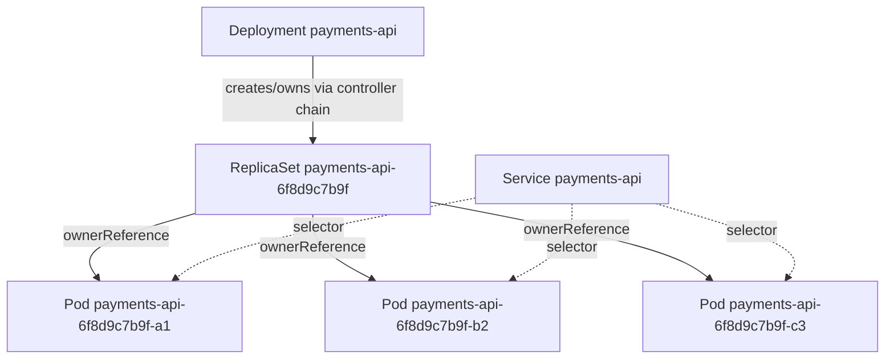
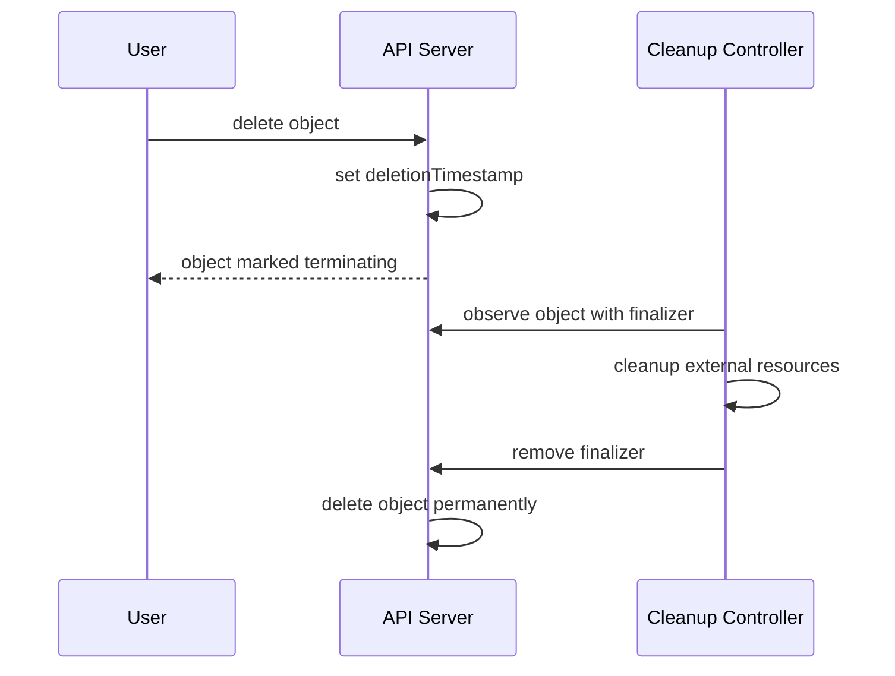
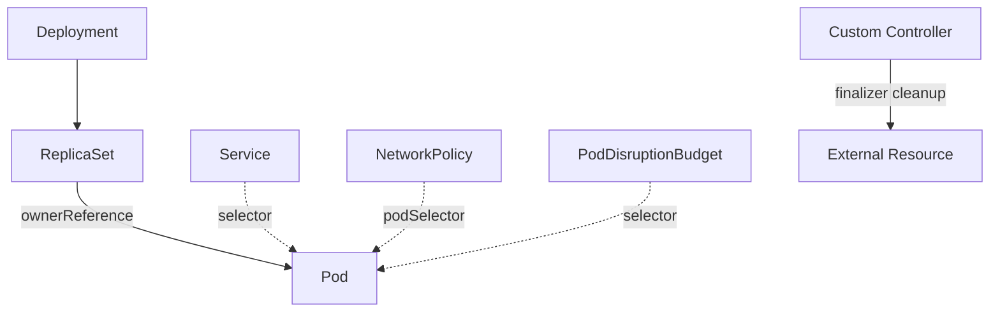
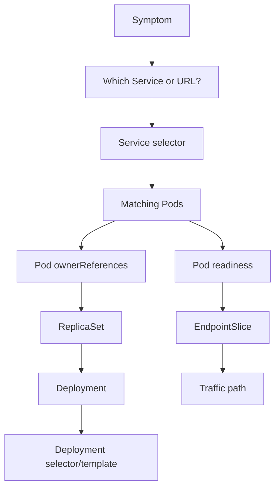

------
title: Learn Kubernetes, Deployment Model, and Cloud Native Platform Engineering - Part 006
description: Deep dive labels, selectors, annotations, ownerReferences, finalizers, garbage collection, controller ownership, dan object graph design di Kubernetes.
series: learn-kubernetes-deployment-model
seriesTitle: Learn Kubernetes, Deployment Model, and Cloud Native Platform Engineering
order: 6
partTitle: Labels, Selectors, Ownership, and Controller Relationships
tags:
- kubernetes
- labels
- selectors
- ownership
- controllers
- garbage-collection
- platform-engineering
- series
date: 2026-07-01
---

# Part 006 — Labels, Selectors, Ownership, and Controller Relationships

> Tujuan part ini adalah memahami bagaimana Kubernetes menghubungkan object. Banyak outage Kubernetes tidak berasal dari container crash, tetapi dari label, selector, owner reference, finalizer, atau ownership graph yang salah.

Di Kubernetes, object tidak hidup sendirian. Deployment membuat ReplicaSet. ReplicaSet membuat Pod. Service memilih Pod melalui selector. Job membuat Pod. CronJob membuat Job. HorizontalPodAutoscaler menunjuk target workload. NetworkPolicy memilih Pod berdasarkan label. Policy engine membaca label dan annotation untuk mengambil keputusan.

Karena itu, label dan ownership bukan detail kosmetik. Mereka adalah **control-plane binding contract**.

```text
Wrong label = wrong selection.
Wrong selector = wrong controller behavior.
Wrong ownerReference = wrong lifecycle cleanup.
Wrong finalizer = stuck deletion.
```

Part ini membangun mental model object graph yang diperlukan sebelum kita membahas Deployment controller secara mendalam.

---

## 1. Kaufman Deconstruction: Skill yang Harus Dikuasai

Skill ini bisa dipecah menjadi beberapa sub-skill:

| Sub-skill | Pertanyaan yang Harus Bisa Dijawab |
|---|---|
| Label model | Metadata apa yang boleh dipakai untuk selection? |
| Annotation model | Metadata apa yang tidak boleh dipakai untuk selection? |
| Selector semantics | Bagaimana equality-based dan set-based selector bekerja? |
| Controller binding | Bagaimana ReplicaSet tahu Pod mana yang dihitung? |
| Service binding | Bagaimana Service tahu Pod mana yang jadi endpoint? |
| Ownership | Apa beda selector dan ownerReference? |
| Garbage collection | Bagaimana dependent object dibersihkan? |
| Finalizer | Kenapa object bisa stuck terminating? |
| Label taxonomy | Bagaimana mendesain label lintas tim, environment, cost, dan compliance? |
| Failure debugging | Bagaimana mendeteksi selector mismatch, orphan Pod, overlapping selector, dan accidental adoption? |

Target akhirnya: kita bisa merancang label/selector/ownership model yang aman untuk organisasi besar, bukan sekadar menyalin label `app: foo`.

---

## 2. Four Kinds of Identity

Kubernetes memiliki beberapa jenis identitas object. Jangan dicampur.

| Identity | Contoh | Fungsi | Stabil? |
|---|---|---|---:|
| Name | `payments-api-6f8d9c7b9f-x2p4m` | Human/API address dalam namespace dan kind tertentu | Tidak untuk Pod replacement |
| UID | `9b1c...` | Identitas unik object di cluster | Stabil selama object hidup |
| Label | `app.kubernetes.io/name=payments-api` | Grouping dan selection | Stabil jika governance benar |
| OwnerReference | ReplicaSet owns Pod | Lifecycle dependency | Dibuat controller |
| Annotation | `checksum/config=abc123` | Metadata non-selection | Tergantung tujuan |

Rule:

```text
Use names for addressing, UIDs for exact object identity, labels for grouping, ownerReferences for lifecycle ownership, annotations for non-identifying metadata.
```

---

## 3. Labels: Queryable Metadata

Label adalah key-value metadata yang dipakai untuk memilih sekumpulan object. Banyak object bisa memiliki label yang sama. Itu memang tujuannya.

Contoh:

```yaml
metadata:
  labels:
    app.kubernetes.io/name: payments-api
    app.kubernetes.io/instance: payments-api-prod
    app.kubernetes.io/version: "1.8.3"
    app.kubernetes.io/component: api
    app.kubernetes.io/part-of: payments-platform
    app.kubernetes.io/managed-by: argocd
    environment: production
    team: payments
```

Label yang baik memiliki ciri:

1. **Low cardinality** — jumlah value terkendali.
2. **Stable enough for selection** — tidak berubah sembarangan.
3. **Meaningful across tools** — dipakai Service, policy, observability, cost, GitOps.
4. **Governed** — ada schema organisasi.
5. **Not secret** — label terlihat di API dan banyak tool.

Jangan menaruh data sensitif di label.

---

## 4. Labels vs Annotations

Labels dan annotations sama-sama metadata, tetapi beda fungsi.

| Aspek | Labels | Annotations |
|---|---|---|
| Untuk selection | Ya | Tidak |
| Untuk grouping | Ya | Tidak langsung |
| Untuk data besar/kompleks | Tidak ideal | Lebih cocok |
| Untuk automation trigger | Bisa, jika low-cardinality | Bisa, untuk metadata tambahan |
| Contoh | `team=payments` | `checksum/config=9d82a...` |

Gunakan label jika metadata akan dipakai untuk:

- Service selector.
- Deployment/ReplicaSet selector.
- NetworkPolicy selection.
- PodDisruptionBudget selection.
- Monitoring aggregation.
- Cost allocation.
- Policy grouping.

Gunakan annotation jika metadata berupa:

- checksum config.
- build URL.
- Git commit SHA.
- rollout note.
- external controller metadata.
- long structured JSON.
- last-applied configuration.

Anti-pattern:

```yaml
metadata:
  labels:
    git-sha: 8f5a3a7db798b912e9b7e6d54b7...
    request-id: req-20260701-abcdef
```

High-cardinality label merusak query ergonomics, policy governance, dan observability cost. Untuk Git SHA, gunakan annotation kecuali ada alasan selection yang sangat spesifik.

---

## 5. Recommended Labels

Kubernetes merekomendasikan label umum dengan prefix `app.kubernetes.io`. Label ini membantu tool bekerja lebih interoperable.

| Label | Makna | Contoh |
|---|---|---|
| `app.kubernetes.io/name` | Nama aplikasi | `payments-api` |
| `app.kubernetes.io/instance` | Instance aplikasi | `payments-api-prod` |
| `app.kubernetes.io/version` | Versi aplikasi | `1.8.3` |
| `app.kubernetes.io/component` | Komponen dalam arsitektur | `api`, `worker`, `db-migrator` |
| `app.kubernetes.io/part-of` | Sistem lebih besar | `payments-platform` |
| `app.kubernetes.io/managed-by` | Tool pengelola | `helm`, `argocd`, `flux` |

Contoh minimal yang bagus:

```yaml
metadata:
  labels:
    app.kubernetes.io/name: payments-api
    app.kubernetes.io/instance: payments-api-prod
    app.kubernetes.io/component: api
    app.kubernetes.io/part-of: payments-platform
    app.kubernetes.io/managed-by: argocd
    environment: production
    team: payments
```

Label `app: payments-api` masih sering ditemukan, tetapi terlalu miskin untuk organisasi besar. Ia tidak membedakan app name, instance, component, environment, ownership team, dan management tool.

---

## 6. Selector Semantics

Selector adalah query terhadap label.

Kubernetes mendukung dua bentuk utama:

1. Equality-based selector.
2. Set-based selector.

### 6.1 Equality-Based Selector

Contoh:

```text
app.kubernetes.io/name=payments-api
environment!=staging
```

Di kubectl:

```bash
kubectl get pods -l app.kubernetes.io/name=payments-api
kubectl get pods -l environment!=staging
```

### 6.2 Set-Based Selector

Contoh:

```text
environment in (production,staging)
tier notin (experimental,deprecated)
team
!debug
```

Di kubectl:

```bash
kubectl get pods -l 'environment in (production,staging)'
kubectl get pods -l 'tier notin (experimental,deprecated)'
```

### 6.3 AND, Not OR

Multiple selector requirement digabung dengan AND.

```text
app.kubernetes.io/name=payments-api,environment=production,team=payments
```

Artinya:

```text
name is payments-api AND environment is production AND team is payments
```

Kubernetes label selector tidak memiliki logical OR langsung dalam satu selector. Jika butuh OR, desain label perlu dipikir ulang atau query dilakukan terpisah oleh client/tool.

---

## 7. Selector sebagai Contract, Bukan Filter Sementara

Untuk object seperti Service, ReplicaSet, Deployment, NetworkPolicy, dan PodDisruptionBudget, selector bukan sekadar filter. Selector menentukan object mana yang akan dipengaruhi.

Contoh Service:

```yaml
apiVersion: v1
kind: Service
metadata:
  name: payments-api
spec:
  selector:
    app.kubernetes.io/name: payments-api
    app.kubernetes.io/component: api
  ports:
    - port: 80
      targetPort: 8080
```

Service ini akan memilih semua Pod yang punya label tersebut di namespace yang sama.

Jika Pod baru lupa label `app.kubernetes.io/component=api`, Pod itu bisa Running dan Ready tetapi tidak menerima traffic.

Jika Pod lain tidak sengaja punya label yang sama, Service bisa mengirim traffic ke workload yang salah.

---

## 8. Controller Selector

Controller seperti ReplicaSet menghitung Pod berdasarkan selector. Deployment memiliki `.spec.selector` yang harus cocok dengan `.spec.template.metadata.labels`.

Contoh:

```yaml
apiVersion: apps/v1
kind: Deployment
metadata:
  name: payments-api
spec:
  replicas: 3
  selector:
    matchLabels:
      app.kubernetes.io/name: payments-api
      app.kubernetes.io/instance: payments-api-prod
  template:
    metadata:
      labels:
        app.kubernetes.io/name: payments-api
        app.kubernetes.io/instance: payments-api-prod
        app.kubernetes.io/component: api
    spec:
      containers:
        - name: app
          image: registry.example.com/payments-api:1.8.3
```

Invariant:

```text
Controller selector must match Pod template labels.
```

Kalau tidak, controller tidak dapat mengelola Pod yang dibuat dari template secara benar. Untuk Deployment `apps/v1`, selector bersifat eksplisit dan tidak boleh asal berubah setelah dibuat.

---

## 9. Selector Immutability dan Deployment Safety

Pada Deployment, `.spec.selector` immutable setelah object dibuat. Ini disengaja untuk mencegah controller tiba-tiba mengadopsi atau melepaskan Pod secara berbahaya.

Kenapa berbahaya?

Bayangkan Deployment production awalnya memilih:

```yaml
selector:
  matchLabels:
    app: payments
```

Lalu seseorang mengubah menjadi:

```yaml
selector:
  matchLabels:
    app: orders
```

Jika ini diizinkan bebas, controller bisa mulai menghitung Pod dari aplikasi lain, melakukan scale down, atau membuat Pod baru dengan asumsi yang salah. Kubernetes membatasi perubahan selector agar ownership model tetap aman.

Design implication:

```text
Choose selector labels carefully before creating long-lived controllers.
```

Jangan jadikan selector berisi label yang sering berubah seperti version, release timestamp, commit SHA, atau feature flag.

---

## 10. Overlapping Selectors

Overlapping selector terjadi ketika dua controller memilih Pod set yang sama atau beririsan secara tidak sengaja.

Contoh buruk:

```yaml
# Deployment A
selector:
  matchLabels:
    app: backend

# Deployment B
selector:
  matchLabels:
    app: backend
```

Jika keduanya di namespace yang sama dan Pod labels overlap, controller bisa berebut interpretasi. Kubernetes docs memperingatkan bahwa untuk beberapa API type seperti ReplicaSet, selector yang overlap dalam namespace dapat menyebabkan controller sulit menentukan jumlah replica yang benar.

Lebih baik:

```yaml
# Deployment A
selector:
  matchLabels:
    app.kubernetes.io/name: payments-api
    app.kubernetes.io/instance: payments-api-prod

# Deployment B
selector:
  matchLabels:
    app.kubernetes.io/name: orders-api
    app.kubernetes.io/instance: orders-api-prod
```

Atau jika satu aplikasi memiliki beberapa component:

```yaml
selector:
  matchLabels:
    app.kubernetes.io/name: payments
    app.kubernetes.io/component: api
```

---

## 11. OwnerReferences: Lifecycle Ownership

Ownership berbeda dari selector.

Selector menjawab:

```text
Which objects match this query?
```

OwnerReference menjawab:

```text
Which object owns this object's lifecycle?
```

Contoh graph:



Service memilih Pod dengan selector, tetapi Service tidak memiliki Pod tersebut. ReplicaSet memiliki Pod melalui ownerReference. Ini perbedaan besar.

Jika Service dihapus, Pod tidak ikut terhapus.

Jika ReplicaSet dihapus dengan cascading deletion, Pod dependennya dapat ikut terhapus sesuai propagation policy.

---

## 12. Anatomy `ownerReferences`

Pod yang dibuat ReplicaSet memiliki metadata seperti:

```yaml
metadata:
  ownerReferences:
    - apiVersion: apps/v1
      kind: ReplicaSet
      name: payments-api-6f8d9c7b9f
      uid: 0f1e2d3c-1111-2222-3333-444455556666
      controller: true
      blockOwnerDeletion: true
```

Field penting:

| Field | Makna |
|---|---|
| `apiVersion` | API version owner. |
| `kind` | Kind owner. |
| `name` | Nama owner. |
| `uid` | UID owner; lebih aman dari name reuse. |
| `controller` | Menandakan owner ini adalah managing controller. Biasanya hanya satu controller owner. |
| `blockOwnerDeletion` | Dapat memblokir deletion owner sampai dependent dibersihkan, tergantung permission dan propagation. |

OwnerReference memakai UID agar aman terhadap name reuse. Object baru dengan nama sama bukan owner yang sama jika UID berbeda.

---

## 13. Ownership Rules dan Namespace Boundary

Kubernetes memiliki aturan untuk owner/dependent relationship:

1. Dependent namespaced object biasanya harus memiliki owner di namespace yang sama atau owner cluster-scoped.
2. Cross-namespace owner reference tidak valid untuk namespaced dependents.
3. Cluster-scoped dependent tidak bisa dimiliki namespaced owner.
4. OwnerReference harus menunjuk object yang benar-benar ada untuk garbage collection yang valid.

Design implication:

```text
Do not model cross-namespace lifecycle ownership with ownerReferences.
```

Jika butuh relasi lintas namespace, gunakan controller custom yang eksplisit, label/annotation reference, atau higher-level inventory model. Jangan memaksa ownerReference lintas namespace.

---

## 14. Adoption dan Orphaning

Controller dapat mengadopsi Pod yang cocok dengan selector dan belum memiliki controller owner yang bertentangan. Ini bisa berguna, tetapi juga berbahaya jika label terlalu luas.

Skenario:

1. Ada Pod manual dengan label `app=payments`.
2. Deployment baru dibuat dengan selector `app=payments`.
3. Controller dapat menganggap Pod tersebut bagian dari desired set jika sesuai aturan adoption.

Risiko:

- Pod manual dihitung sebagai replica.
- Controller dapat menghapus atau mengganti Pod yang tidak dimaksud.
- Debug Pod tidak sengaja masuk ke Service traffic.

Rule:

```text
Never use broad production selectors that can accidentally match manually created Pods.
```

Gunakan label instance/component/environment yang cukup spesifik.

---

## 15. Garbage Collection

Garbage collection membersihkan dependent object berdasarkan ownerReference.

Mode cascading deletion umum:

| Mode | Makna |
|---|---|
| Background | Owner dihapus, dependent dibersihkan background. |
| Foreground | Owner deletion menunggu dependent dihapus lebih dulu. |
| Orphan | Owner dihapus, dependent ditinggalkan tanpa owner. |

Contoh command:

```bash
kubectl delete deployment payments-api -n production --cascade=background
kubectl delete deployment payments-api -n production --cascade=foreground
kubectl delete deployment payments-api -n production --cascade=orphan
```

Gunakan orphan dengan hati-hati. Orphan Pod/ReplicaSet dapat membuat object hidup tanpa controller yang jelas.

Diagnosis orphan:

```bash
kubectl get pods -n production -o custom-columns=NAME:.metadata.name,OWNER:.metadata.ownerReferences[0].name
```

---

## 16. Finalizers

Finalizer adalah mekanisme yang membuat Kubernetes menunda deletion object sampai cleanup tertentu selesai.

Ketika object dengan finalizer dihapus:

1. Kubernetes tidak langsung menghapus object.
2. API server mengisi `metadata.deletionTimestamp`.
3. Controller yang bertanggung jawab melihat object sedang dihapus.
4. Controller menjalankan cleanup.
5. Controller menghapus finalizer.
6. API server akhirnya menghapus object.



Finalizer umum dipakai oleh:

- storage controller.
- cloud load balancer controller.
- custom operator.
- namespace cleanup.
- external resource provisioning.

Stuck finalizer berarti cleanup controller tidak berhasil atau tidak berjalan.

Diagnosis:

```bash
kubectl get <kind> <name> -n <ns> -o yaml
```

Lihat:

```yaml
metadata:
  deletionTimestamp: "2026-07-01T10:15:00Z"
  finalizers:
    - example.com/finalizer
```

Jangan hapus finalizer manual kecuali memahami resource eksternal yang mungkin tertinggal. Menghapus finalizer secara paksa dapat menyebabkan leak: disk, load balancer, DNS record, firewall rule, atau cloud resource lain.

---

## 17. Selector vs OwnerReference vs Finalizer

Tiga mekanisme ini sering tertukar.

| Mekanisme | Fungsi | Contoh |
|---|---|---|
| Selector | Memilih object berdasarkan label | Service memilih Pod endpoint. |
| OwnerReference | Menentukan lifecycle parent-child | ReplicaSet memiliki Pod. |
| Finalizer | Menunda deletion sampai cleanup selesai | PVC protection, external resource cleanup. |

Contoh lengkap:



Service, NetworkPolicy, dan PDB dapat memilih Pod yang sama tanpa memilikinya. ReplicaSet memiliki Pod untuk lifecycle. Finalizer menjaga cleanup object tertentu.

---

## 18. Label Taxonomy untuk Enterprise Platform

Untuk organisasi besar, label schema harus diperlakukan seperti API contract. Jangan biarkan tiap tim membuat label random tanpa governance.

Recommended baseline:

```yaml
metadata:
  labels:
    app.kubernetes.io/name: payments-api
    app.kubernetes.io/instance: payments-api-prod
    app.kubernetes.io/component: api
    app.kubernetes.io/part-of: payments-platform
    app.kubernetes.io/managed-by: argocd
    platform.example.com/environment: production
    platform.example.com/team: payments
    platform.example.com/tier: critical
    platform.example.com/data-classification: restricted
    platform.example.com/cost-center: fin-ops-042
```

Kategori label:

| Category | Examples | Dipakai Oleh |
|---|---|---|
| Application identity | `name`, `instance`, `component`, `part-of` | Service, dashboards, GitOps, search |
| Ownership | `team`, `cost-center` | On-call, cost allocation, audit |
| Environment | `environment`, `region`, `cluster-class` | Policy, promotion, observability |
| Reliability | `tier`, `slo-class`, `criticality` | PDB, alert routing, incident response |
| Security/compliance | `data-classification`, `internet-facing` | Admission policy, NetworkPolicy, audit |
| Operations | `managed-by`, `release-channel` | GitOps, automation, rollout tools |

Rule:

```text
Every label that drives policy must have controlled vocabulary.
```

Jika `environment` bisa bernilai `prod`, `production`, `prd`, dan `live`, policy akan bocor.

---

## 19. Label Stability Classes

Tidak semua label boleh berubah dengan frekuensi sama.

| Stability | Contoh | Boleh untuk Selector Controller? |
|---|---|---:|
| Permanent identity | app name, component | Ya |
| Instance identity | environment instance | Ya, jika stabil |
| Operational ownership | team, cost center | Biasanya tidak untuk controller selector, tapi bagus untuk policy/reporting |
| Release metadata | version, release channel | Hati-hati |
| Build metadata | commit SHA, build ID | Tidak |
| Runtime state | canary active, debug session | Biasanya tidak; gunakan annotation atau dedicated rollout controller |

Selector controller sebaiknya memakai label yang stabil sepanjang lifecycle controller.

Contoh buruk:

```yaml
selector:
  matchLabels:
    app.kubernetes.io/name: payments-api
    app.kubernetes.io/version: "1.8.3"
```

Saat version berubah, selector controller tidak boleh berubah. Version lebih cocok berada di Pod template label untuk observability, bukan di Deployment selector.

Contoh baik:

```yaml
selector:
  matchLabels:
    app.kubernetes.io/name: payments-api
    app.kubernetes.io/instance: payments-api-prod
```

Dan template boleh punya:

```yaml
template:
  metadata:
    labels:
      app.kubernetes.io/version: "1.8.3"
```

---

## 20. Label Cardinality dan Observability Cost

Label sering diserap oleh metrics systems, log pipelines, tracing systems, cost tools, dan dashboards. High-cardinality label bisa membuat storage metrics meledak.

High-cardinality examples:

- request ID.
- user ID.
- session ID.
- full Git SHA jika dipakai sebagai metrics label luas.
- timestamp.
- random suffix.
- Pod UID di metric app-level.

Tidak semua high-cardinality metadata dilarang. Pod name dan UID memang ada di Kubernetes metadata. Masalah muncul ketika kita memasukkannya ke metrics labels yang diekspor massal atau policy selectors yang tidak perlu.

Rule:

```text
Labels used for selection should be low-cardinality and semantically stable.
Labels used for observability aggregation should be bounded and intentionally chosen.
```

---

## 21. Label Governance dengan Admission Policy

Dalam platform mature, label schema tidak hanya ditulis di wiki. Ia ditegakkan oleh admission policy.

Policy examples:

- Semua Pod harus punya `platform.example.com/team`.
- Semua workload production harus punya `platform.example.com/tier`.
- `environment` hanya boleh salah satu dari `dev`, `staging`, `production`.
- Workload dengan `data-classification=restricted` harus punya NetworkPolicy.
- Workload `internet-facing=true` harus memenuhi security baseline lebih ketat.

Part 024 akan membahas admission policy lebih detail. Untuk sekarang, pahami bahwa label adalah input penting untuk policy decision.

---

## 22. Service Selector Failure Modes

### 22.1 Pod Running, Service No Endpoints

Gejala:

```bash
kubectl get pods -n production
kubectl get endpointslice -n production -l kubernetes.io/service-name=payments-api
```

Kemungkinan:

- Pod label tidak cocok dengan Service selector.
- Pod belum Ready.
- Service berada di namespace berbeda.
- Port target salah.

Diagnosis:

```bash
kubectl get svc payments-api -n production -o yaml
kubectl get pods -n production --show-labels
kubectl get pods -n production -l app.kubernetes.io/name=payments-api
```

### 22.2 Service Mengirim Traffic ke Pod Salah

Kemungkinan:

- Selector terlalu luas.
- Debug Pod memakai label production.
- Blue/green/canary label tidak dipisahkan dengan benar.
- Dua app berbagi label `app=backend`.

Mitigasi:

- Gunakan `app.kubernetes.io/name` + `instance` + `component`.
- Jangan gunakan label umum seperti `tier=backend` sebagai selector tunggal.
- Validasi selector di CI/GitOps.

---

## 23. Controller Selector Failure Modes

### 23.1 Deployment Tidak Bisa Dibuat

Jika selector tidak match template labels, API server menolak atau controller tidak bisa bekerja sesuai harapan.

Bad:

```yaml
spec:
  selector:
    matchLabels:
      app: payments
  template:
    metadata:
      labels:
        app: orders
```

Good:

```yaml
spec:
  selector:
    matchLabels:
      app.kubernetes.io/name: payments-api
      app.kubernetes.io/instance: payments-api-prod
  template:
    metadata:
      labels:
        app.kubernetes.io/name: payments-api
        app.kubernetes.io/instance: payments-api-prod
        app.kubernetes.io/component: api
```

### 23.2 Replica Count Aneh

Gejala:

- Deployment replicas 3, tetapi Pod yang terlihat 4.
- Pod manual dihitung controller.
- Pod lama tidak terhapus.

Diagnosis:

```bash
kubectl get rs -n production --show-labels
kubectl get pods -n production --show-labels
kubectl describe rs <replicaset> -n production
```

Periksa:

- selector ReplicaSet.
- labels Pod.
- ownerReferences Pod.
- event adoption/orphan.

---

## 24. NetworkPolicy dan Label Semantics

NetworkPolicy sangat bergantung pada label. Kesalahan label bisa menjadi security incident.

Contoh:

```yaml
apiVersion: networking.k8s.io/v1
kind: NetworkPolicy
metadata:
  name: allow-api-from-gateway
spec:
  podSelector:
    matchLabels:
      app.kubernetes.io/name: payments-api
      app.kubernetes.io/component: api
  ingress:
    - from:
        - podSelector:
            matchLabels:
              app.kubernetes.io/component: gateway
```

Jika label `component=gateway` dipakai sembarang, workload tidak sah bisa mendapat akses.

Rule:

```text
Security-sensitive labels require governance and admission control.
```

Jangan desain NetworkPolicy berdasarkan label yang bisa dipasang bebas oleh semua tim tanpa validasi.

---

## 25. PodDisruptionBudget dan Label Semantics

PodDisruptionBudget juga memilih Pod via selector. Jika selector salah, PDB bisa tidak melindungi workload yang benar atau melindungi workload yang salah.

Contoh:

```yaml
apiVersion: policy/v1
kind: PodDisruptionBudget
metadata:
  name: payments-api-pdb
spec:
  minAvailable: 2
  selector:
    matchLabels:
      app.kubernetes.io/name: payments-api
      app.kubernetes.io/component: api
```

Failure mode:

- Selector terlalu sempit: beberapa Pod tidak dilindungi.
- Selector terlalu luas: drain node terhambat karena PDB menghitung terlalu banyak Pod.
- Selector pakai version: saat rollout, PDB behavior berubah tidak intuitif.

---

## 26. GitOps dan Managed-By Labels

Dalam GitOps, labels membantu menjawab:

- Tool apa yang mengelola object ini?
- Application mana yang memilikinya?
- Environment mana yang sedang dipromosikan?
- Apakah object ini drift dari desired state?

Contoh:

```yaml
metadata:
  labels:
    app.kubernetes.io/managed-by: argocd
    app.kubernetes.io/part-of: payments-platform
  annotations:
    argocd.argoproj.io/sync-wave: "2"
```

Jangan membuat dua tool berbeda merasa memiliki object yang sama tanpa ownership boundary. Misalnya Helm dan Argo CD bisa bekerja bersama, tetapi harus jelas siapa yang render, siapa yang apply, dan siapa yang melakukan drift correction.

---

## 27. Cost Allocation dan Compliance

Label sering dipakai untuk FinOps dan audit.

Contoh:

```yaml
metadata:
  labels:
    platform.example.com/team: payments
    platform.example.com/cost-center: cc-042
    platform.example.com/environment: production
    platform.example.com/data-classification: restricted
```

Tanpa label cost center, resource shared cluster sulit dialokasikan. Tanpa label data classification, policy sulit membedakan workload publik, internal, confidential, dan regulated.

Tetapi label compliance tidak cukup hanya ada. Ia harus:

1. Valid secara vocabulary.
2. Ditegakkan di admission.
3. Dipakai oleh policy.
4. Diaudit secara periodik.
5. Tidak bisa dimanipulasi sembarang oleh workload owner jika konsekuensinya security-sensitive.

---

## 28. Object Graph Debugging

Saat terjadi failure, jangan hanya lihat Pod. Lihat graph.



Command useful:

```bash
# Show labels
kubectl get pods -n production --show-labels

# Query exact selector
kubectl get pods -n production -l 'app.kubernetes.io/name=payments-api,app.kubernetes.io/component=api'

# See Service selector
kubectl get svc payments-api -n production -o jsonpath='{.spec.selector}'

# See owner refs
kubectl get pod <pod> -n production -o jsonpath='{.metadata.ownerReferences}'

# Show ReplicaSets and labels
kubectl get rs -n production --show-labels

# EndpointSlices for Service
kubectl get endpointslice -n production -l kubernetes.io/service-name=payments-api -o wide
```

Debug questions:

- Pod mana yang dipilih Service?
- Pod mana yang dimiliki ReplicaSet?
- Apakah Service selector sama dengan Deployment selector?
- Apakah Pod baru punya label yang sama dengan Pod lama?
- Apakah rollout menambahkan label version yang memengaruhi selector?
- Apakah ada Pod manual yang masuk selector?
- Apakah object stuck karena finalizer?

---

## 29. Designing Label Schema: A Practical Template

Untuk platform internal, gunakan schema seperti ini sebagai baseline.

```yaml
metadata:
  labels:
    app.kubernetes.io/name: <stable-app-name>
    app.kubernetes.io/instance: <app-env-instance>
    app.kubernetes.io/component: <api|worker|scheduler|gateway|db-migrator>
    app.kubernetes.io/part-of: <business-system>
    app.kubernetes.io/managed-by: <argocd|flux|helm|terraform|operator>
    platform.example.com/environment: <dev|staging|production>
    platform.example.com/team: <owning-team>
    platform.example.com/tier: <critical|standard|experimental>
    platform.example.com/data-classification: <public|internal|confidential|restricted>
  annotations:
    platform.example.com/git-revision: <sha>
    platform.example.com/source-repo: <repo-url-or-id>
    platform.example.com/runbook: <runbook-url>
```

Selector untuk Deployment:

```yaml
selector:
  matchLabels:
    app.kubernetes.io/name: payments-api
    app.kubernetes.io/instance: payments-api-prod
```

Selector untuk Service:

```yaml
selector:
  app.kubernetes.io/name: payments-api
  app.kubernetes.io/instance: payments-api-prod
  app.kubernetes.io/component: api
```

Selector untuk observability grouping dapat lebih luas:

```text
app.kubernetes.io/part-of=payments-platform,platform.example.com/environment=production
```

Selector untuk policy harus eksplisit:

```text
platform.example.com/data-classification=restricted,platform.example.com/environment=production
```

---

## 30. Version Labels: Useful but Dangerous

Version label sangat berguna untuk observability:

```yaml
app.kubernetes.io/version: "1.8.3"
```

Gunakan untuk:

- dashboard per version.
- log filtering.
- trace correlation.
- canary comparison.
- incident blast radius analysis.

Jangan gunakan sebagai stable controller selector.

Kenapa?

Rolling update membutuhkan Pod versi lama dan baru hidup bersamaan. Jika Service selector memilih satu version secara statis, traffic shifting menjadi manual dan mudah salah. Untuk canary/blue-green, gunakan deployment model eksplisit dengan selector dan traffic routing yang memang dirancang untuk itu. Kita akan bahas di Part 010 dan Part 011.

---

## 31. Namespace dan Label

Namespace adalah boundary administratif. Label adalah grouping. Keduanya berbeda.

Satu app bisa punya namespace per environment:

```text
payments-dev
payments-staging
payments-production
```

Atau shared namespace dengan label environment:

```yaml
platform.example.com/environment: production
```

Trade-off:

| Model | Kelebihan | Risiko |
|---|---|---|
| Namespace per team | Ownership jelas | Environment separation perlu label tambahan |
| Namespace per environment | Policy environment mudah | Team ownership lintas namespace |
| Namespace per app | Isolation kuat | Banyak namespace dan governance overhead |
| Shared namespace | Sederhana awal | Selector collision dan policy leakage lebih mudah |

Label tidak menggantikan namespace untuk isolation. Namespace tidak menggantikan label untuk grouping.

---

## 32. Common Anti-Patterns

| Anti-pattern | Dampak |
|---|---|
| `app: backend` sebagai selector utama | Terlalu luas; rawan traffic salah. |
| Selector memakai version | Rollout dan upgrade sulit. |
| Debug Pod memakai label production | Bisa menerima traffic nyata. |
| Label vocabulary bebas | Policy dan reporting bocor. |
| High-cardinality labels | Observability cost meledak. |
| Menghapus finalizer manual tanpa analisis | Resource eksternal leak. |
| Cross-namespace ownerReference | Ownership invalid dan GC tidak sesuai harapan. |
| Dua tool mengelola object yang sama | Drift fight dan reconciliation loop konflik. |
| PDB selector terlalu luas | Node drain/upgrade terganggu. |
| NetworkPolicy bergantung label yang tidak dikontrol | Security boundary lemah. |

---

## 33. Production Review Checklist

### Label Schema

- Semua workload punya label recommended `app.kubernetes.io/*` minimal.
- Label ownership: team, cost center, environment tersedia.
- Label security/compliance punya vocabulary terkendali.
- Tidak ada secret dalam label/annotation.
- High-cardinality metadata masuk annotation, bukan label selection.

### Selector Safety

- Deployment selector cocok dengan Pod template labels.
- Selector tidak memakai version/build ID.
- Service selector cukup spesifik.
- Tidak ada overlap selector antar controller yang tidak disengaja.
- Debug/manual Pod tidak bisa masuk selector production.

### Ownership

- Pod production dimiliki ReplicaSet/StatefulSet/DaemonSet/Job yang benar.
- Tidak ada orphan object kecuali disengaja.
- OwnerReference tidak dipakai lintas namespace.
- Deletion propagation dipahami untuk operasi cleanup.

### Finalizers

- Finalizer external resource punya controller yang sehat.
- Stuck deletion dimonitor.
- Manual finalizer removal memiliki runbook.
- Cloud resource leak dicek setelah forced cleanup.

### Platform Governance

- Label schema ditegakkan di admission atau CI.
- Policy menggunakan label yang stabil dan controlled.
- Observability dashboard memakai label konsisten.
- GitOps tool ownership jelas.

---

## 34. Deliberate Practice

### Exercise 1 — Service Selector Mismatch

Buat Deployment dengan label:

```yaml
app.kubernetes.io/name: payments-api
app.kubernetes.io/component: api
```

Lalu buat Service dengan selector salah:

```yaml
app.kubernetes.io/name: payment-api
```

Jawab:

- Apakah Pod Running?
- Apakah Pod Ready?
- Apakah Service punya EndpointSlice?
- Command apa yang paling cepat menunjukkan mismatch?

### Exercise 2 — Accidental Traffic Capture

Buat Pod debug manual dengan label sama seperti app production. Amati apakah Service memasukkannya sebagai endpoint jika readiness terpenuhi.

Jawab:

- Label mana yang membuat Pod debug terpilih?
- Bagaimana schema label mencegah ini?
- Apakah namespace terpisah lebih aman?

### Exercise 3 — Orphan ReplicaSet

Hapus Deployment dengan cascade orphan.

```bash
kubectl delete deployment payments-api --cascade=orphan
```

Jawab:

- ReplicaSet masih ada?
- Pod masih ada?
- OwnerReferences berubah?
- Siapa yang sekarang bertanggung jawab atas cleanup?

### Exercise 4 — Finalizer Stuck

Buat custom resource atau object test dengan finalizer dummy. Hapus object dan amati `deletionTimestamp`.

Jawab:

- Kenapa object belum hilang?
- Apa risiko menghapus finalizer manual?
- Bagaimana controller seharusnya membersihkan finalizer?

---

## 35. Summary

Label, selector, ownerReference, dan finalizer membentuk object graph Kubernetes.

Hal yang harus melekat:

1. Label adalah queryable metadata untuk grouping dan selection.
2. Annotation adalah metadata non-selection.
3. Selector adalah contract yang menentukan object mana yang dipengaruhi controller, Service, policy, atau disruption budget.
4. Multiple selector requirement adalah AND, bukan OR.
5. Selector controller harus stabil dan tidak memakai metadata yang sering berubah.
6. OwnerReference menentukan lifecycle ownership, bukan traffic selection.
7. Service memilih Pod via selector tetapi tidak memiliki Pod.
8. Garbage collection memakai ownerReference.
9. Finalizer menunda deletion sampai cleanup selesai.
10. Label schema di platform besar harus governed, validated, dan auditable.

Di part berikutnya, kita akan membahas scheduling dan placement: bagaimana scheduler memilih Node untuk Pod, bagaimana resource request, affinity, taints, tolerations, dan topology memengaruhi keputusan deployment.

---

## References

- Kubernetes Documentation — Labels and Selectors: https://kubernetes.io/docs/concepts/overview/working-with-objects/labels/
- Kubernetes Documentation — Annotations: https://kubernetes.io/docs/concepts/overview/working-with-objects/annotations/
- Kubernetes Documentation — Owners and Dependents: https://kubernetes.io/docs/concepts/overview/working-with-objects/owners-dependents/
- Kubernetes Documentation — Finalizers: https://kubernetes.io/docs/concepts/overview/working-with-objects/finalizers/
- Kubernetes Documentation — Object Names and IDs: https://kubernetes.io/docs/concepts/overview/working-with-objects/names/
- Kubernetes Documentation — Recommended Labels: https://kubernetes.io/docs/concepts/overview/working-with-objects/common-labels/
- Kubernetes Documentation — Field Selectors: https://kubernetes.io/docs/concepts/overview/working-with-objects/field-selectors/
- Kubernetes Documentation — Garbage Collection: https://kubernetes.io/docs/concepts/architecture/garbage-collection/
