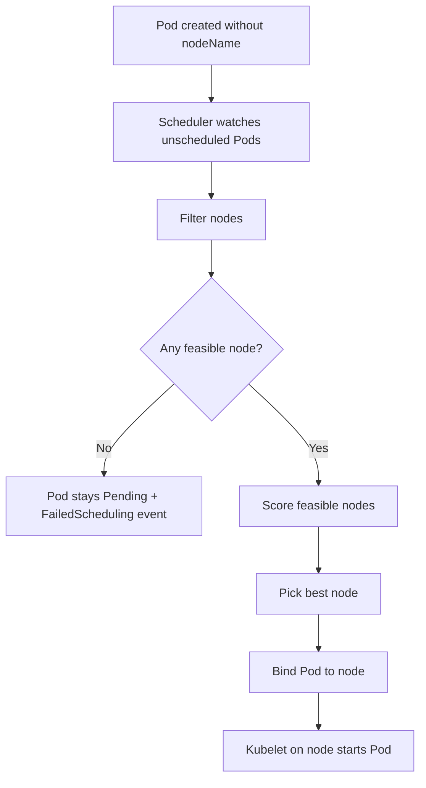
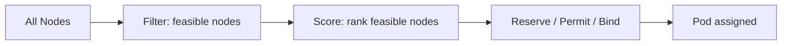
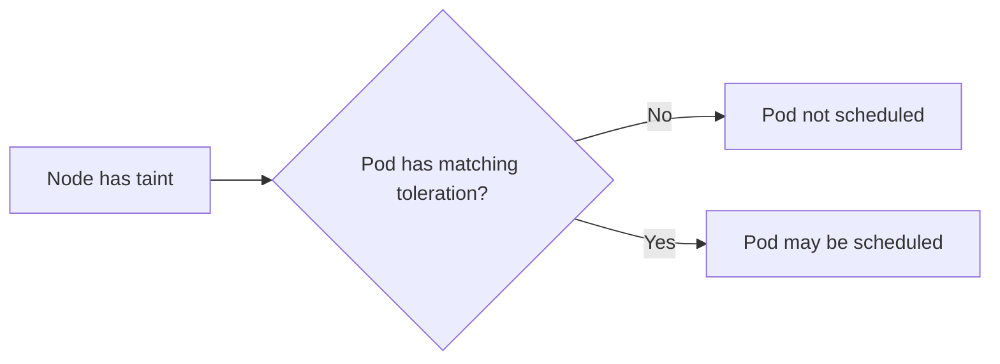
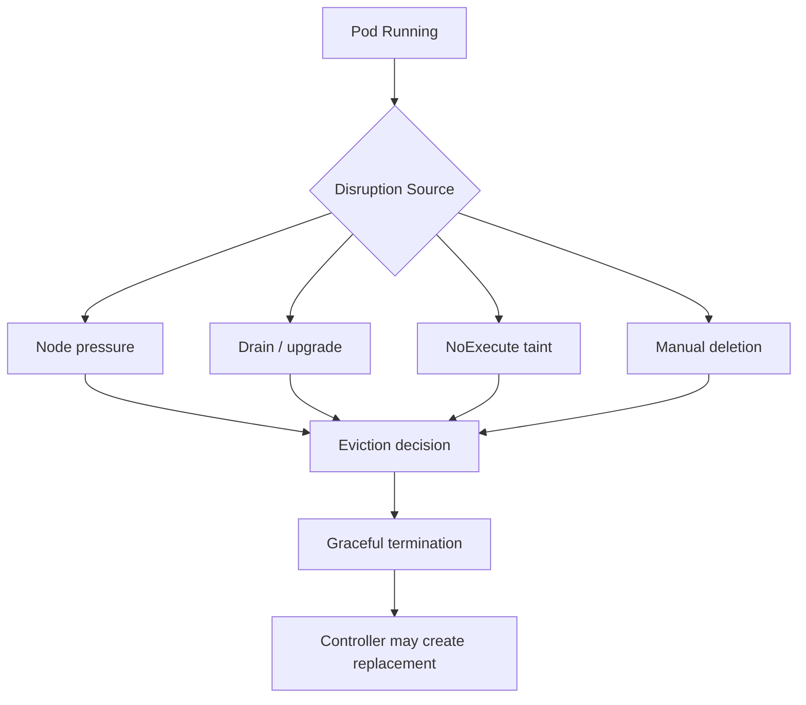

------
title: Learn Kubernetes, Deployment Model, and Cloud Native Platform Engineering - Part 007
description: Deep dive Kubernetes scheduling, placement, affinity, taints, tolerations, topology spread, priority, preemption, eviction, dan failure modelling untuk workload production.
series: learn-kubernetes-deployment-model
seriesTitle: Learn Kubernetes, Deployment Model, and Cloud Native Platform Engineering
order: 7
partTitle: Scheduling, Placement, Affinity, Taints, and Topology
tags:
- kubernetes
- scheduling
- placement
- affinity
- taints
- tolerations
- topology-spread
- production-engineering
- platform-engineering
- series
date: 2026-07-01
---

# Part 007 — Scheduling, Placement, Affinity, Taints, and Topology

> Tujuan part ini adalah memahami bagaimana Kubernetes memutuskan **Pod berjalan di node mana**, bagaimana kita memengaruhi keputusan itu secara aman, dan bagaimana membaca failure ketika Pod tidak bisa dijadwalkan atau dipindahkan.

Di Part 005 kita sudah melihat Pod sebagai unit eksekusi. Di Part 006 kita melihat label, selector, dan ownership graph. Sekarang kita masuk ke pertanyaan yang lebih operasional:

```text
Given this PodSpec, in this cluster, at this time,
which node should run it, and what can go wrong?
```

Kubernetes scheduling bukan sekadar “cari node kosong”. Scheduler melakukan matching antara kebutuhan Pod dan kemampuan node, lalu memilih node paling sesuai berdasarkan constraint, preference, resource, topology, taint, priority, dan policy.

Dalam production, scheduling menentukan:

- availability across zones;
- cost efficiency;
- latency;
- GPU / high-memory placement;
- noisy-neighbor risk;
- blast radius;
- upgrade safety;
- cluster autoscaler behavior;
- regulatory isolation;
- incident recovery.

Engineer yang hanya paham `kubectl apply` akan melihat Pod `Pending` sebagai error misterius. Engineer yang matang akan membaca scheduling sebagai **constraint solving problem**.

---

## 1. Kaufman Deconstruction: Sub-Skill Scheduling

Skill scheduling bisa dipecah menjadi beberapa kemampuan kecil:

| Sub-skill | Pertanyaan yang Harus Bisa Dijawab |
|---|---|
| Scheduling lifecycle | Kapan Pod dianggap perlu scheduling? |
| Node feasibility | Kenapa sebuah node dianggap tidak cocok? |
| Scoring | Jika banyak node cocok, kenapa satu node dipilih? |
| Resource requests | Bagaimana CPU/memory request memengaruhi placement? |
| Node labels | Metadata node apa yang boleh dipakai sebagai placement contract? |
| `nodeSelector` | Kapan cukup memakai exact match sederhana? |
| Node affinity | Kapan butuh expressive rule? |
| Inter-pod affinity | Kapan workload perlu dekat dengan workload lain? |
| Anti-affinity | Kapan replica harus dipisahkan? |
| Taints/tolerations | Bagaimana node menolak workload yang tidak cocok? |
| Topology spread | Bagaimana menyebar replica lintas failure domain? |
| Priority/preemption | Workload mana yang boleh mengorbankan workload lain? |
| Eviction | Kapan Pod dipaksa keluar dari node? |
| Debugging | Bagaimana membaca `FailedScheduling`, node condition, dan event? |

Target akhir part ini: kita bisa mendesain placement policy untuk sistem production yang punya constraint nyata, bukan sekadar menambahkan `nodeSelector` karena “jalan di cluster saya”.

---

## 2. Mental Model: Scheduling Sebagai Constraint Solving

Saat Pod baru dibuat dan belum punya `.spec.nodeName`, scheduler akan mencoba memilih node.

Secara konseptual:



Poin penting:

```text
Scheduler decides placement.
Kubelet executes placement.
Controller creates Pod.
API server stores decision.
```

Scheduler tidak menjalankan container. Scheduler hanya menulis binding bahwa Pod ini ditugaskan ke node tertentu. Kubelet pada node tersebut kemudian membaca Pod yang assigned kepadanya dan menjalankan container melalui runtime.

---

## 3. The Scheduling Contract

Pod membawa requirement. Node membawa capacity dan attributes.

| Sisi | Contoh | Makna |
|---|---|---|
| Pod | `resources.requests.cpu: 500m` | Saya butuh minimal CPU accounting sebesar ini |
| Pod | `nodeSelector` | Saya hanya boleh jalan di node dengan label tertentu |
| Pod | `nodeAffinity` | Saya butuh atau lebih suka node tertentu |
| Pod | `podAffinity` | Saya butuh atau lebih suka dekat dengan Pod tertentu |
| Pod | `podAntiAffinity` | Saya harus atau lebih baik jauh dari Pod tertentu |
| Pod | `tolerations` | Saya bisa menerima node dengan taint tertentu |
| Pod | `topologySpreadConstraints` | Sebarkan saya lintas domain tertentu |
| Node | allocatable CPU/memory | Resource yang dapat dipakai Pod |
| Node | labels | Metadata topology, hardware, lifecycle, pool |
| Node | taints | “Jangan schedule kecuali Pod tolerate” |
| Node | conditions | Ready, memory pressure, disk pressure, network availability |

Scheduling adalah evaluasi semua informasi itu.

---

## 4. Scheduling Lifecycle: From Pending to Running

Pod biasanya melewati fase ini:

```text
Created -> Pending -> Scheduled -> ContainerCreating -> Running
```

Tetapi ada dua jenis `Pending` yang sering dicampur:

| Kondisi | Penyebab | Siapa yang Relevan? |
|---|---|---|
| Pending karena belum scheduled | Tidak ada node cocok | Scheduler |
| Pending setelah scheduled | Image pull, volume attach, CNI, runtime issue | Kubelet / runtime / node |

Cara membedakannya:

```bash
kubectl get pod <pod> -o wide
kubectl describe pod <pod>
```

Jika kolom `NODE` kosong dan event berisi `FailedScheduling`, masalahnya scheduling. Jika `NODE` sudah ada tetapi container belum jalan, masalahnya setelah scheduling.

Rule:

```text
Empty NODE + FailedScheduling = placement problem.
Assigned NODE + ContainerCreating/ImagePullBackOff/etc = node/runtime problem.
```

---

## 5. Scheduler Filter and Score

Walaupun implementasi internal scheduler punya plugin dan extension point, mental model praktisnya adalah **filter lalu score**.



Filter menjawab:

```text
Can this Pod run here?
```

Score menjawab:

```text
Among nodes where it can run, which is best?
```

Contoh filter failure:

- insufficient CPU;
- insufficient memory;
- node taint not tolerated;
- node affinity mismatch;
- volume zone conflict;
- node not ready;
- pod topology spread cannot be satisfied;
- max pods per node reached.

Contoh scoring preference:

- lebih cocok untuk spreading;
- lebih cocok untuk bin packing;
- preferred affinity;
- image locality;
- resource balance;
- topology preference.

Jangan menyimpulkan scheduler “random”. Jika terlihat random, biasanya kita belum membaca constraint dan scoring signal yang relevan.

---

## 6. Resource Requests: Placement Starts Here

Scheduler memakai **requests**, bukan actual usage, untuk resource fit.

Contoh:

```yaml
apiVersion: v1
kind: Pod
metadata:
  name: payments-api
spec:
  containers:
    - name: app
      image: registry.example.com/payments-api:1.4.2
      resources:
        requests:
          cpu: "500m"
          memory: "512Mi"
        limits:
          cpu: "1"
          memory: "1Gi"
```

Scheduler membaca request:

```text
This Pod reserves 0.5 CPU and 512Mi memory for placement accounting.
```

Limit memengaruhi runtime enforcement, tetapi request adalah input utama scheduling.

### 6.1 Common Production Failure

```yaml
resources: {}
```

Tanpa request:

- scheduler bisa memadatkan terlalu banyak Pod ke node;
- workload critical bisa bersaing dengan workload noisy;
- eviction menjadi lebih mungkin;
- autoscaler sulit menghitung kebutuhan;
- cost model tidak akurat;
- platform team tidak bisa menerapkan governance.

Rule:

```text
No requests = no honest scheduling contract.
```

Kita akan membahas resource governance lebih detail di Part 013, tetapi placement tidak bisa dipisahkan dari requests.

---

## 7. Node Capacity vs Allocatable

Node punya beberapa angka resource:

| Field | Makna |
|---|---|
| Capacity | Resource total node |
| Allocatable | Resource yang tersedia untuk Pod setelah system/kube reserved |
| Requested | Total request Pod yang sudah dijadwalkan |
| Actual usage | Pemakaian runtime saat ini |

Scheduler menggunakan allocatable dan requested accounting, bukan hanya actual usage.

Misalnya:

```text
Node allocatable memory: 16Gi
Already requested: 14Gi
New Pod request: 4Gi
Actual usage now: 8Gi
```

Pod tetap tidak feasible karena request total akan menjadi 18Gi.

Ini benar. Scheduler bukan melihat snapshot usage yang bisa berubah cepat. Scheduler menjaga kontrak kapasitas.

---

## 8. Node Labels: The Foundation of Placement

Node label adalah metadata yang bisa dipakai untuk placement.

Contoh:

```bash
kubectl label node ip-10-0-1-12 nodepool=general
kubectl label node ip-10-0-1-13 workload-tier=regulated
kubectl label node ip-10-0-1-14 accelerator=nvidia-a10
kubectl label node ip-10-0-1-15 topology.kubernetes.io/zone=ap-southeast-1a
```

Namun label node adalah contract. Jangan sembarangan.

| Label | Aman? | Catatan |
|---|---:|---|
| `topology.kubernetes.io/zone` | Ya | Well-known topology label |
| `kubernetes.io/arch` | Ya | Architecture node |
| `nodepool=general` | Ya jika governed | Pool internal organisasi |
| `team=payments` | Hati-hati | Bisa menimbulkan coupling team ke node |
| `temporary=true` | Buruk | Tidak stabil sebagai scheduling contract |
| `hostname=foo` | Biasanya buruk | Coupling ke node spesifik |

Rule:

```text
Use node labels for stable infrastructure properties, not ad-hoc operational intent.
```

---

## 9. `nodeSelector`: Simple Hard Requirement

`nodeSelector` adalah cara paling sederhana untuk menyatakan Pod hanya boleh jalan di node dengan label tertentu.

```yaml
apiVersion: apps/v1
kind: Deployment
metadata:
  name: reporting-api
spec:
  replicas: 3
  selector:
    matchLabels:
      app.kubernetes.io/name: reporting-api
  template:
    metadata:
      labels:
        app.kubernetes.io/name: reporting-api
    spec:
      nodeSelector:
        nodepool: analytics
      containers:
        - name: app
          image: registry.example.com/reporting-api:2.1.0
```

Semantik:

```text
Schedule only on nodes where nodepool=analytics.
```

Kapan cocok:

- requirement sederhana;
- hardware pool khusus;
- environment kecil;
- rule tidak perlu operator kompleks;
- tidak butuh soft preference.

Kapan tidak cukup:

- butuh OR condition;
- butuh preferred rule;
- butuh kombinasi zone dan node pool;
- butuh anti-affinity;
- butuh topology-aware spreading.

---

## 10. Node Affinity: Expressive Node Selection

Node affinity lebih ekspresif daripada `nodeSelector`.

Ada dua mode utama:

| Mode | Makna |
|---|---|
| `requiredDuringSchedulingIgnoredDuringExecution` | Hard requirement saat scheduling |
| `preferredDuringSchedulingIgnoredDuringExecution` | Soft preference saat scheduling |

Contoh hard requirement:

```yaml
spec:
  affinity:
    nodeAffinity:
      requiredDuringSchedulingIgnoredDuringExecution:
        nodeSelectorTerms:
          - matchExpressions:
              - key: nodepool
                operator: In
                values:
                  - regulated
                  - secure
```

Artinya:

```text
Pod hanya boleh dijadwalkan ke node dengan nodepool regulated atau secure.
```

Contoh preference:

```yaml
spec:
  affinity:
    nodeAffinity:
      preferredDuringSchedulingIgnoredDuringExecution:
        - weight: 80
          preference:
            matchExpressions:
              - key: topology.kubernetes.io/zone
                operator: In
                values:
                  - ap-southeast-1a
```

Artinya:

```text
Lebih suka zone ap-southeast-1a, tapi boleh di tempat lain jika perlu.
```

### 10.1 Meaning of `IgnoredDuringExecution`

Nama field ini penting.

```text
requiredDuringSchedulingIgnoredDuringExecution
```

Artinya requirement dievaluasi saat scheduling. Jika label node berubah setelah Pod berjalan, Pod tidak otomatis dikeluarkan hanya karena affinity tidak lagi cocok.

Ini mencegah sistem terlalu reaktif, tetapi juga berarti perubahan label node tidak otomatis “memperbaiki” placement existing Pod.

Jika kita ingin rebalancing, kita perlu:

- rollout workload;
- drain node;
- recreate Pod;
- gunakan descheduler jika organisasi mengadopsinya;
- desain automation yang eksplisit.

---

## 11. Inter-Pod Affinity: Place Near Another Pod

Pod affinity memilih node berdasarkan keberadaan Pod lain.

Contoh kasus:

- app harus dekat dengan cache local;
- workload perlu co-located dengan agent tertentu;
- latency-sensitive pair;
- data locality dalam cluster tertentu.

Contoh:

```yaml
spec:
  affinity:
    podAffinity:
      requiredDuringSchedulingIgnoredDuringExecution:
        - labelSelector:
            matchLabels:
              app.kubernetes.io/name: local-cache
          topologyKey: kubernetes.io/hostname
```

Artinya:

```text
Schedule Pod ini di node yang sudah memiliki Pod berlabel local-cache.
```

Hati-hati: inter-pod affinity bisa mahal secara scheduling dan bisa membuat dependency placement yang sulit dipenuhi.

Anti-pattern:

```text
Every service requires affinity to every dependency.
```

Ini mengubah cluster menjadi puzzle constraint yang rapuh.

---

## 12. Pod Anti-Affinity: Keep Replicas Apart

Anti-affinity menyatakan Pod sebaiknya atau harus tidak ditempatkan bersama Pod tertentu.

Contoh hard anti-affinity per hostname:

```yaml
spec:
  affinity:
    podAntiAffinity:
      requiredDuringSchedulingIgnoredDuringExecution:
        - labelSelector:
            matchLabels:
              app.kubernetes.io/name: payments-api
          topologyKey: kubernetes.io/hostname
```

Artinya:

```text
Jangan tempatkan dua Pod payments-api di node yang sama.
```

Masalahnya: jika replica lebih banyak dari jumlah node feasible, scheduling akan gagal.

Untuk banyak kasus, gunakan preference atau topology spread.

```yaml
spec:
  affinity:
    podAntiAffinity:
      preferredDuringSchedulingIgnoredDuringExecution:
        - weight: 100
          podAffinityTerm:
            labelSelector:
              matchLabels:
                app.kubernetes.io/name: payments-api
            topologyKey: kubernetes.io/hostname
```

Rule:

```text
Hard anti-affinity protects availability but can block deployment.
Soft anti-affinity improves distribution but allows recovery under pressure.
```

---

## 13. Topology Spread Constraints: Distribution as a First-Class Rule

Topology spread constraints mengontrol distribusi Pod lintas domain topology seperti node, zone, rack, atau domain custom.

Contoh:

```yaml
spec:
  topologySpreadConstraints:
    - maxSkew: 1
      topologyKey: topology.kubernetes.io/zone
      whenUnsatisfiable: DoNotSchedule
      labelSelector:
        matchLabels:
          app.kubernetes.io/name: payments-api
```

Makna:

```text
Sebarkan Pod payments-api antar zone dengan skew maksimal 1.
Jika tidak bisa menjaga aturan ini, jangan schedule.
```

### 13.1 Core Fields

| Field | Makna |
|---|---|
| `maxSkew` | Selisih maksimum jumlah Pod antar domain |
| `topologyKey` | Label node yang membentuk domain spread |
| `whenUnsatisfiable` | `DoNotSchedule` atau `ScheduleAnyway` |
| `labelSelector` | Pod mana yang dihitung dalam spread |
| `minDomains` | Minimal domain eligible agar global minimum dihitung dengan benar |
| `nodeAffinityPolicy` | Apakah nodeAffinity dihormati saat menghitung domain |
| `nodeTaintsPolicy` | Apakah taint dihormati saat menghitung domain |
| `matchLabelKeys` | Menggunakan label dari incoming Pod untuk selection tambahan |

### 13.2 `DoNotSchedule` vs `ScheduleAnyway`

| Mode | Makna | Cocok Untuk |
|---|---|---|
| `DoNotSchedule` | Hard rule | Critical HA, regulated placement |
| `ScheduleAnyway` | Soft rule | Workload biasa yang tetap harus jalan |

Production rule:

```text
Use hard topology spread only when failing to spread is worse than failing to schedule.
```

Untuk API critical lintas zone, hard spread masuk akal. Untuk worker non-critical, soft spread mungkin lebih baik.

---

## 14. Topology Spread vs Pod Anti-Affinity

Keduanya bisa dipakai untuk distribusi, tetapi mental modelnya berbeda.

| Mechanism | Model | Best For |
|---|---|---|
| Pod anti-affinity | Jangan co-locate dengan Pod tertentu | Simple separation |
| Topology spread | Jaga distribusi seimbang antar domain | HA dan fairness |

Contoh anti-affinity:

```text
No two replicas on same node.
```

Contoh topology spread:

```text
Keep replicas balanced across zones with max skew 1.
```

Untuk aplikasi production multi-replica, topology spread sering lebih jelas daripada anti-affinity yang terlalu rigid.

---

## 15. Taints and Tolerations: Node Repels, Pod Tolerates

Affinity adalah “Pod tertarik ke node”. Taint adalah “node menolak Pod”.



Contoh taint node:

```bash
kubectl taint nodes node-1 dedicated=payments:NoSchedule
```

Artinya:

```text
Node ini tidak menerima Pod kecuali Pod punya toleration untuk dedicated=payments:NoSchedule.
```

Contoh toleration Pod:

```yaml
spec:
  tolerations:
    - key: "dedicated"
      operator: "Equal"
      value: "payments"
      effect: "NoSchedule"
```

Toleration bukan berarti Pod pasti schedule ke node tersebut. Toleration hanya berarti Pod boleh melewati penolakan.

Rule:

```text
Toleration permits. It does not attract.
Affinity attracts. It does not repel other Pods.
```

Biasanya node dedicated memakai kombinasi:

```text
node taint + Pod toleration + Pod nodeAffinity/nodeSelector
```

---

## 16. Taint Effects

Taint punya effect.

| Effect | Makna |
|---|---|
| `NoSchedule` | Pod baru tidak dijadwalkan jika tidak tolerate |
| `PreferNoSchedule` | Hindari scheduling jika mungkin |
| `NoExecute` | Pod existing yang tidak tolerate bisa dikeluarkan |

Contoh `NoExecute` dengan toleration sementara:

```yaml
spec:
  tolerations:
    - key: "node.kubernetes.io/not-ready"
      operator: "Exists"
      effect: "NoExecute"
      tolerationSeconds: 300
```

Artinya:

```text
Pod boleh tetap di node not-ready selama 300 detik sebelum dievacuasi.
```

`NoExecute` lebih agresif karena berlaku pada Pod yang sudah berjalan.

---

## 17. Dedicated Node Pool Pattern

Misalnya kita punya workload regulated yang harus berjalan di node pool khusus.

Node:

```bash
kubectl label node node-a nodepool=regulated
kubectl taint node node-a workload=regulated:NoSchedule
```

Pod:

```yaml
spec:
  nodeSelector:
    nodepool: regulated
  tolerations:
    - key: "workload"
      operator: "Equal"
      value: "regulated"
      effect: "NoSchedule"
```

Kenapa perlu dua-duanya?

| Mechanism | Fungsi |
|---|---|
| Taint | Mencegah workload biasa masuk ke node regulated |
| Toleration | Mengizinkan workload regulated masuk |
| Node selector | Mengarahkan workload regulated ke node regulated |

Tanpa selector, Pod regulated bisa saja schedule ke node lain jika tidak ada constraint lain. Tanpa taint, Pod biasa bisa masuk ke node regulated.

Rule:

```text
Dedicated pool = repel everyone else + attract intended workloads.
```

---

## 18. Priority and Preemption

Priority menentukan kepentingan relatif Pod. Jika Pod ber-priority tinggi tidak bisa dijadwalkan, scheduler dapat melakukan preemption terhadap Pod priority lebih rendah agar Pod penting bisa masuk.

Contoh PriorityClass:

```yaml
apiVersion: scheduling.k8s.io/v1
kind: PriorityClass
metadata:
  name: critical-api
value: 100000
preemptionPolicy: PreemptLowerPriority
globalDefault: false
description: "Critical API workloads that may preempt lower priority workloads."
```

Pod:

```yaml
spec:
  priorityClassName: critical-api
```

Preemption bukan scaling strategy. Preemption adalah emergency mechanism.

Risiko:

- workload rendah diputus;
- cascading failure jika dependency ikut terganggu;
- queue worker kehilangan progress jika tidak idempotent;
- noisy priority escalation antar tim;
- cluster terlihat “sembuh” tapi sebenarnya mengorbankan workload lain.

Governance rule:

```text
PriorityClass is an organizational policy, not a team-level convenience flag.
```

---

## 19. Eviction: Scheduling Is Not the End

Pod bisa berhasil scheduled tetapi kemudian dikeluarkan.

Eviction bisa terjadi karena:

- node pressure;
- node drain;
- taint `NoExecute`;
- resource starvation;
- PDB constraints during voluntary disruption;
- kubelet reclaiming memory/disk/inodes.



Scheduling answers where Pod starts. Reliability requires understanding when Pod can disappear.

---

## 20. Node Pressure and QoS Preview

Saat node mengalami pressure, kubelet bisa melakukan eviction untuk melindungi node.

QoS class memengaruhi eviction order:

| QoS | Biasanya Terjadi Ketika | Eviction Risk |
|---|---|---:|
| `Guaranteed` | request = limit untuk semua container CPU/memory | Terendah |
| `Burstable` | sebagian request/limit diset | Medium |
| `BestEffort` | tidak ada request/limit | Tertinggi |

Kita akan membahas detailnya di Part 013. Untuk part ini, cukup pegang rule:

```text
Bad resource contracts become bad scheduling and eviction behavior.
```

---

## 21. PodDisruptionBudget and Scheduling Adjacent Concerns

PodDisruptionBudget bukan scheduler primitive, tetapi sangat terkait placement dan operasi.

PDB membatasi berapa banyak Pod dari aplikasi yang boleh unavailable saat voluntary disruption seperti node drain.

Contoh:

```yaml
apiVersion: policy/v1
kind: PodDisruptionBudget
metadata:
  name: payments-api-pdb
spec:
  minAvailable: 2
  selector:
    matchLabels:
      app.kubernetes.io/name: payments-api
```

Jika Deployment punya 3 replica, PDB ini meminta minimal 2 tetap available.

PDB tidak mencegah semua outage:

- tidak mencegah container crash;
- tidak mencegah node hard failure;
- tidak mencegah bad rollout;
- tidak menjamin traffic tetap sehat;
- tidak menggantikan readiness probe.

Tetapi PDB penting untuk cluster upgrade dan node maintenance.

---

## 22. Scheduling Patterns by Workload Type

### 22.1 Stateless Critical API

Goal:

- high availability;
- multi-zone spread;
- avoid co-location;
- graceful drain;
- predictable resources.

Pattern:

```yaml
spec:
  replicas: 6
  template:
    spec:
      topologySpreadConstraints:
        - maxSkew: 1
          topologyKey: topology.kubernetes.io/zone
          whenUnsatisfiable: DoNotSchedule
          labelSelector:
            matchLabels:
              app.kubernetes.io/name: payments-api
        - maxSkew: 1
          topologyKey: kubernetes.io/hostname
          whenUnsatisfiable: ScheduleAnyway
          labelSelector:
            matchLabels:
              app.kubernetes.io/name: payments-api
```

Interpretasi:

- hard spread lintas zone;
- soft spread lintas node;
- tetap bisa recover jika node capacity terbatas.

### 22.2 Batch Worker

Goal:

- cost efficiency;
- tolerate interruption;
- scalable;
- tidak mengganggu API critical.

Pattern:

```yaml
spec:
  priorityClassName: batch-low
  tolerations:
    - key: "workload"
      operator: "Equal"
      value: "batch"
      effect: "NoSchedule"
  nodeSelector:
    nodepool: batch
```

Batch worker biasanya cocok di node pool murah atau interruptible, dengan idempotency dan retry yang baik.

### 22.3 GPU Workload

Goal:

- schedule hanya ke node GPU;
- hindari non-GPU workload memakai node mahal;
- kontrol resource khusus.

Pattern:

```yaml
spec:
  nodeSelector:
    accelerator: nvidia
  tolerations:
    - key: "accelerator"
      operator: "Equal"
      value: "nvidia"
      effect: "NoSchedule"
  containers:
    - name: trainer
      resources:
        limits:
          nvidia.com/gpu: 1
```

Node GPU sebaiknya diberi taint agar workload biasa tidak ikut schedule.

### 22.4 Regulated Workload

Goal:

- workload khusus compliance;
- node hardened;
- restricted egress;
- audit-friendly placement.

Pattern:

```yaml
spec:
  nodeSelector:
    compliance.example.com/tier: regulated
  tolerations:
    - key: "compliance.example.com/regulated"
      operator: "Equal"
      value: "true"
      effect: "NoSchedule"
```

Tambahkan policy-as-code untuk enforce bahwa workload regulated harus memakai selector/toleration ini.

---

## 23. Failure Model: Why Pods Stay Pending

Pod `Pending` dengan `FailedScheduling` biasanya karena salah satu dari ini:

| Symptom | Kemungkinan Penyebab | Pemeriksaan |
|---|---|---|
| `Insufficient cpu` | Request terlalu besar atau cluster penuh | `kubectl describe pod`, `kubectl describe node` |
| `Insufficient memory` | Memory request tidak muat | Lihat allocatable/requested |
| `had untolerated taint` | Pod tidak punya toleration | Cek node taints |
| `node(s) didn't match Pod's node affinity/selector` | Label mismatch | Cek node labels dan PodSpec |
| `didn't match pod anti-affinity rules` | Rule terlalu ketat | Cek replica vs node/domain |
| `max volume count exceeded` | Batas attach volume provider | Cek storage/provider limit |
| `node(s) had volume node affinity conflict` | PV terikat zone lain | Cek PV node affinity dan Pod zone |
| `Too many pods` | Node sudah mencapai max Pod | Cek node capacity |
| topology spread unsatisfied | Domain kurang atau skew rule terlalu ketat | Cek topology labels dan selector |

Debugging command:

```bash
kubectl describe pod <pod>
kubectl get events --sort-by=.lastTimestamp
kubectl get nodes --show-labels
kubectl describe node <node>
kubectl get pod -o wide -A
```

---

## 24. Debugging Workflow: From Symptom to Root Cause

Gunakan urutan ini.

### Step 1: Confirm Scheduling State

```bash
kubectl get pod <pod> -o wide
```

Jika `NODE` kosong, lanjut scheduling diagnosis.

### Step 2: Read Events

```bash
kubectl describe pod <pod>
```

Cari event seperti:

```text
Warning  FailedScheduling  default-scheduler  0/6 nodes are available: ...
```

Event scheduler biasanya sudah menyebut alasan paling kuat.

### Step 3: Inspect Pod Placement Contract

```bash
kubectl get pod <pod> -o yaml
```

Periksa:

- `resources.requests`;
- `nodeSelector`;
- `affinity`;
- `tolerations`;
- `topologySpreadConstraints`;
- `priorityClassName`;
- volumes.

### Step 4: Inspect Node Supply

```bash
kubectl get nodes -o wide
kubectl get nodes --show-labels
kubectl describe node <node>
```

Periksa:

- Ready condition;
- taints;
- labels;
- allocatable;
- allocated resources;
- pressure conditions;
- max pods.

### Step 5: Decide Fix Type

| Root Cause | Fix Type |
|---|---|
| Request terlalu besar | Ubah request atau tambah node |
| Node selector salah | Perbaiki label atau PodSpec |
| Taint mismatch | Tambah toleration jika legitimate |
| Affinity terlalu ketat | Longgarkan rule atau tambah kapasitas domain |
| Topology domain kurang | Tambah node/domain atau ubah `whenUnsatisfiable` |
| Volume zone conflict | Align storage dan compute topology |
| Cluster penuh | Scale node pool atau reduce workload |

Jangan langsung “scale cluster” tanpa membaca constraint. Banyak scheduling failure tidak selesai dengan menambah node jika node baru tidak punya label/zone/taint yang benar.

---

## 25. Placement Governance for Enterprise Platforms

Dalam organisasi besar, placement tidak boleh diserahkan ke tiap tim tanpa guardrail.

Platform harus menyediakan:

| Concern | Platform Contract |
|---|---|
| Node pool taxonomy | `general`, `batch`, `gpu`, `regulated`, `system` |
| Label ownership | Siapa boleh menambah/mengubah label node |
| Taint convention | Taint standar untuk dedicated pools |
| Workload classes | API, worker, batch, ML, regulated |
| Default resource policy | Request/limit default dan validation |
| Topology policy | Default spread lintas zone untuk workload critical |
| Priority governance | PriorityClass diset platform, bukan app team bebas |
| Admission enforcement | Reject manifest yang melanggar invariant |
| Observability | Dashboard pending, unschedulable, preemption, eviction |

Contoh placement class internal:

```yaml
platform.example.com/workload-class: critical-api
platform.example.com/placement: multi-zone
platform.example.com/node-pool: general
```

Kemudian policy engine bisa memastikan workload class tertentu memiliki:

- minimum replicas;
- topology spread;
- PDB;
- resource requests;
- non-root runtime;
- allowed node pool.

---

## 26. Anti-Patterns

### 26.1 Pinning to Hostname

```yaml
nodeSelector:
  kubernetes.io/hostname: ip-10-0-1-123
```

Ini biasanya buruk.

Masalah:

- node replacement memutus workload;
- cluster autoscaler tidak bisa membantu;
- maintenance sulit;
- state disembunyikan di placement;
- manifest tidak portable.

Gunakan label capability atau StatefulSet/storage design jika butuh locality.

### 26.2 Hard Anti-Affinity Everywhere

```yaml
podAntiAffinity:
  requiredDuringSchedulingIgnoredDuringExecution: ...
```

Untuk semua workload, ini bisa membuat cluster underutilized dan rollout gagal.

Gunakan hard rule hanya untuk workload yang benar-benar membutuhkan.

### 26.3 Toleration Without Attraction

```yaml
tolerations:
  - key: workload
    value: regulated
    effect: NoSchedule
```

Tanpa nodeSelector/nodeAffinity, toleration hanya mengizinkan masuk ke node regulated, bukan mengharuskan.

### 26.4 Overusing Inter-Pod Affinity

Setiap service tidak perlu co-located dengan dependency. Kubernetes networking dan Service abstraction ada untuk menghindari placement coupling berlebihan.

### 26.5 Missing Requests

Tanpa request, scheduling tidak punya kontrak kapasitas yang jujur.

### 26.6 Using Placement to Solve Application Design

Misalnya database hanya aman jika semua Pod selalu berada di node tertentu. Itu biasanya tanda desain stateful belum benar.

---

## 27. Scheduling Decision Matrix

| Kebutuhan | Primitive yang Cocok | Catatan |
|---|---|---|
| Jalankan hanya di node GPU | nodeSelector/nodeAffinity + taint/toleration | Tambahkan extended resource GPU |
| Pisahkan replica lintas zone | topologySpreadConstraints | Biasanya lebih baik dari anti-affinity zone |
| Hindari dua replica di node sama | topology spread by hostname atau pod anti-affinity | Soft vs hard sesuai risk |
| Dedicated node pool | taint/toleration + node affinity | Repel + attract |
| Prefer zone dekat dependency | preferred node affinity | Jangan hard-code jika tidak wajib |
| Co-locate dengan daemon/cache | podAffinity | Gunakan hati-hati |
| Critical workload menang saat resource pressure | PriorityClass | Butuh governance |
| Workload batch murah | node pool batch + low priority | Pastikan idempotent |
| Regulated isolation | node pool + taint + policy-as-code | Tambahkan audit label |

---

## 28. Production Checklist

Sebelum workload masuk production, jawab ini:

```text
1. Apakah semua container punya resource requests?
2. Apakah workload perlu node pool khusus?
3. Jika ya, apakah sudah ada repel + attract? Taint + toleration + affinity?
4. Apakah replica disebar lintas zone?
5. Apakah hard constraint bisa membuat rollout gagal?
6. Apakah PDB sesuai replica dan availability target?
7. Apakah PriorityClass diperlukan dan diset oleh platform?
8. Apakah topology label tersedia di semua node target?
9. Apakah volume topology compatible dengan placement?
10. Apakah ada dashboard untuk Pending, FailedScheduling, dan Evicted?
```

---

## 29. Hands-On Lab: Diagnose Unschedulable Pod

Buat Pod dengan node selector yang tidak ada:

```yaml
apiVersion: v1
kind: Pod
metadata:
  name: impossible-pod
spec:
  nodeSelector:
    nodepool: does-not-exist
  containers:
    - name: nginx
      image: nginx:1.27
      resources:
        requests:
          cpu: "100m"
          memory: "128Mi"
```

Apply:

```bash
kubectl apply -f impossible-pod.yaml
kubectl get pod impossible-pod -o wide
kubectl describe pod impossible-pod
```

Expected:

```text
Pod remains Pending.
Events mention node selector / affinity mismatch.
```

Fix dengan menambahkan label ke salah satu node lab:

```bash
kubectl label node <node-name> nodepool=does-not-exist
```

Lalu lihat Pod scheduled.

Cleanup:

```bash
kubectl delete pod impossible-pod
kubectl label node <node-name> nodepool-
```

Lesson:

```text
Scheduling failure is often a contract mismatch, not an application failure.
```

---

## 30. Hands-On Lab: Dedicated Pool Simulation

Taint node:

```bash
kubectl taint node <node-name> workload=dedicated:NoSchedule
kubectl label node <node-name> nodepool=dedicated
```

Pod tanpa toleration:

```yaml
apiVersion: v1
kind: Pod
metadata:
  name: no-toleration
spec:
  nodeSelector:
    nodepool: dedicated
  containers:
    - name: nginx
      image: nginx:1.27
```

Pod akan Pending karena taint tidak ditoleransi.

Pod dengan toleration:

```yaml
apiVersion: v1
kind: Pod
metadata:
  name: with-toleration
spec:
  nodeSelector:
    nodepool: dedicated
  tolerations:
    - key: "workload"
      operator: "Equal"
      value: "dedicated"
      effect: "NoSchedule"
  containers:
    - name: nginx
      image: nginx:1.27
```

Lesson:

```text
nodeSelector attracts, taint repels, toleration permits.
```

Cleanup:

```bash
kubectl delete pod no-toleration with-toleration --ignore-not-found
kubectl taint node <node-name> workload=dedicated:NoSchedule-
kubectl label node <node-name> nodepool-
```

---

## 31. Advanced Mental Model: Scheduling Is a Policy Surface

Di organisasi kecil, scheduling terasa seperti detail Kubernetes. Di organisasi besar, scheduling adalah policy surface.

Ia menentukan:

- siapa memakai hardware mahal;
- service mana mendapat prioritas;
- data workload mana boleh jalan di node mana;
- bagaimana failure domain dibatasi;
- bagaimana tim berbagi cluster;
- bagaimana compliance dibuktikan;
- bagaimana cost dikontrol;
- bagaimana upgrade dilakukan tanpa outage.

Karena itu, jangan biarkan placement berkembang secara organik tanpa taxonomy.

Minimal taxonomy:

```text
nodepool: general | batch | gpu | regulated | system
workload-class: critical-api | standard-api | worker | batch | platform
availability-class: single-zone-ok | multi-zone-required
compliance-tier: public | internal | regulated
cost-class: standard | interruptible | high-cost
```

Lalu enforce dengan admission policy.

---

## 32. What Top 1% Engineers Notice

Engineer matang melihat scheduling dari sisi invariant:

```text
A workload should only express constraints that are true requirements.
A platform should encode defaults for common safety properties.
Hard placement constraints must be rare and justified.
Every dedicated pool needs both exclusion and attraction.
Every critical replica set needs topology intent.
Every unschedulable Pod is a debuggable constraint mismatch.
```

Mereka juga membedakan:

| Weak Thinking | Strong Thinking |
|---|---|
| “Pod Pending, tambah node.” | “Constraint apa yang membuat semua node infeasible?” |
| “Pakai anti-affinity biar HA.” | “Domain apa yang harus diseimbangkan dan apa trade-off unschedulable?” |
| “Toleration agar masuk node itu.” | “Toleration hanya izin; butuh affinity untuk attraction.” |
| “Priority bikin service aman.” | “Priority memindahkan risiko ke workload lain.” |
| “Pin ke node ini.” | “Apa property node yang sebenarnya dibutuhkan?” |

---

## 33. Summary

Scheduling adalah proses mencocokkan Pod dengan node berdasarkan resource, label, affinity, taint, topology, priority, dan kondisi cluster.

Key takeaways:

- scheduler memilih node; kubelet menjalankan Pod;
- request adalah kontrak resource utama untuk placement;
- `nodeSelector` cocok untuk hard selection sederhana;
- node affinity lebih ekspresif dan bisa hard/soft;
- pod affinity/anti-affinity harus digunakan hati-hati;
- topology spread adalah alat utama untuk distribusi replica lintas failure domain;
- taint menolak, toleration mengizinkan, affinity menarik;
- priority/preemption adalah policy organisasi;
- eviction bisa terjadi setelah scheduling;
- Pending Pod harus dibaca sebagai constraint mismatch;
- placement policy adalah bagian dari platform engineering.

Part berikutnya akan membahas workload taxonomy: bagaimana memilih antara Deployment, StatefulSet, DaemonSet, Job, CronJob, dan controller lain berdasarkan lifecycle, identity, replacement semantics, dan state model.

---

## References

- Kubernetes Documentation — Scheduling, Preemption and Eviction: https://kubernetes.io/docs/concepts/scheduling-eviction/
- Kubernetes Documentation — Kubernetes Scheduler: https://kubernetes.io/docs/concepts/scheduling-eviction/kube-scheduler/
- Kubernetes Documentation — Assigning Pods to Nodes: https://kubernetes.io/docs/concepts/scheduling-eviction/assign-pod-node/
- Kubernetes Documentation — Taints and Tolerations: https://kubernetes.io/docs/concepts/scheduling-eviction/taint-and-toleration/
- Kubernetes Documentation — Pod Topology Spread Constraints: https://kubernetes.io/docs/concepts/scheduling-eviction/topology-spread-constraints/
- Kubernetes Documentation — Pod Priority and Preemption: https://kubernetes.io/docs/concepts/scheduling-eviction/pod-priority-preemption/
- Kubernetes Documentation — Node-pressure Eviction: https://kubernetes.io/docs/concepts/scheduling-eviction/node-pressure-eviction/
- Kubernetes Documentation — Pod QoS Classes: https://kubernetes.io/docs/concepts/workloads/pods/pod-qos/
