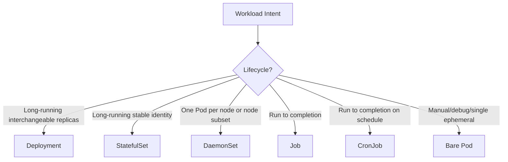
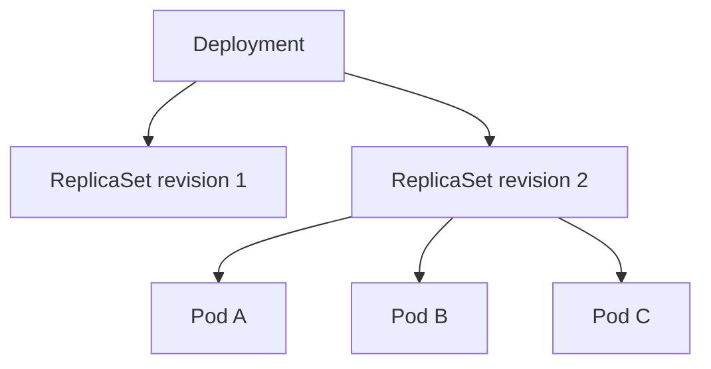
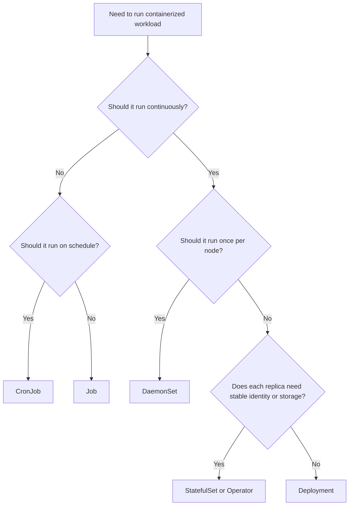
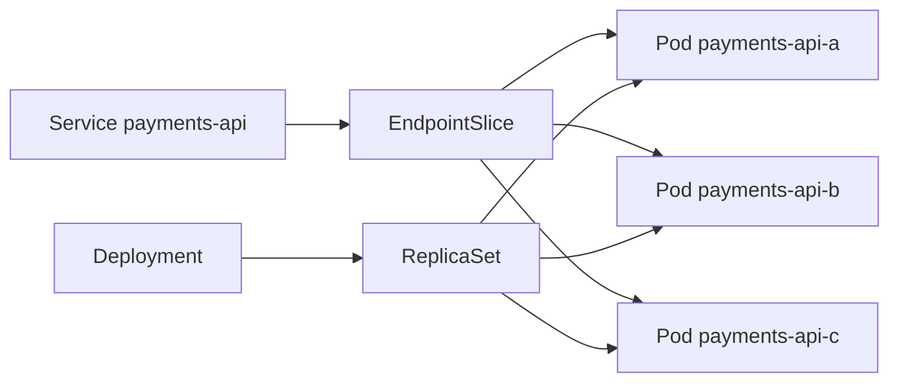

------
title: Learn Kubernetes, Deployment Model, and Cloud Native Platform Engineering - Part 008
description: Deep dive workload taxonomy Kubernetes: Deployment, ReplicaSet, StatefulSet, DaemonSet, Job, CronJob, bare Pod, dan decision framework untuk memilih controller yang benar.
series: learn-kubernetes-deployment-model
seriesTitle: Learn Kubernetes, Deployment Model, and Cloud Native Platform Engineering
order: 8
partTitle: Workload Taxonomy: Deployment, StatefulSet, DaemonSet, Job, CronJob
tags:
- kubernetes
- workloads
- deployment
- statefulset
- daemonset
- job
- cronjob
- controllers
- platform-engineering
- series
date: 2026-07-01
---

# Part 008 — Workload Taxonomy: Deployment, StatefulSet, DaemonSet, Job, CronJob

> Tujuan part ini adalah membangun kemampuan memilih **workload controller yang benar** berdasarkan lifecycle, identity, state, replacement semantics, scheduling model, failure behavior, dan operational intent.

Salah satu kesalahan paling umum di Kubernetes adalah memperlakukan semua aplikasi sebagai `Deployment`.

Deployment memang workhorse utama untuk stateless service. Tetapi Kubernetes menyediakan beberapa workload controller karena tidak semua workload punya lifecycle yang sama.

Pertanyaan sebenarnya bukan:

```text
Bagaimana saya deploy container ini?
```

Pertanyaan yang lebih benar:

```text
Apa lifecycle workload ini, siapa yang mengganti Pod ketika hilang,
apakah identitas Pod penting, apakah workload harus selesai,
apakah harus berjalan di setiap node, dan apa arti successful execution?
```

Part ini adalah jembatan antara Pod-level runtime contract dan Deployment-controller deep dive di Part 009.

---

## 1. Kaufman Deconstruction: Sub-Skill Workload Selection

Skill memilih workload controller bisa dipecah seperti ini:

| Sub-skill | Pertanyaan yang Harus Bisa Dijawab |
|---|---|
| Lifecycle classification | Workload long-running, finite, scheduled, atau node-local? |
| Replacement semantics | Jika Pod hilang, apakah harus diganti? |
| Identity semantics | Apakah Pod interchangeable atau punya identity stabil? |
| Ordering semantics | Apakah startup/termination harus berurutan? |
| State ownership | State ada di luar Pod, di volume, atau di external system? |
| Scaling model | Scale by replicas, queue depth, node count, atau schedule? |
| Completion model | Apakah “sukses” berarti running terus atau selesai? |
| Failure model | Restart, retry, backoff, rollback, atau reschedule? |
| Network identity | Apakah butuh stable DNS per replica? |
| Storage binding | Apakah butuh PersistentVolume per identity? |
| Operational fit | Bagaimana upgrade, drain, rollback, dan observability bekerja? |

Target akhir: kita bisa membaca requirement aplikasi dan memilih controller tanpa trial-and-error.

---

## 2. Kubernetes Workload Controllers: The Big Picture

Kubernetes workload controller adalah controller yang menjaga set Pod sesuai desired state.



Setiap controller menjawab pertanyaan berbeda:

| Controller | Pertanyaan yang Dijawab |
|---|---|
| Deployment | Bagaimana menjaga N replica stateless selalu tersedia dan bisa rollout? |
| ReplicaSet | Bagaimana menjaga N Pod matching selector? |
| StatefulSet | Bagaimana menjaga N replica yang punya identity stabil dan storage stabil? |
| DaemonSet | Bagaimana memastikan setiap node tertentu menjalankan satu Pod? |
| Job | Bagaimana menjalankan task sampai berhasil selesai? |
| CronJob | Bagaimana menjalankan Job berdasarkan schedule? |
| Bare Pod | Bagaimana menjalankan satu Pod tanpa controller? Biasanya untuk debug/lab. |

---

## 3. Why Controllers Exist

Bare Pod bisa dibuat langsung:

```yaml
apiVersion: v1
kind: Pod
metadata:
  name: nginx
spec:
  containers:
    - name: nginx
      image: nginx:1.27
```

Tetapi bare Pod punya kelemahan besar:

- tidak ada rollout strategy;
- tidak ada replica management;
- jika Pod dihapus, tidak ada controller yang membuat replacement;
- tidak ada history revision;
- tidak cocok untuk production service;
- lifecycle harus dikelola manual.

Controller memberi reconciliation:

```text
Desired: 3 replicas of payments-api.
Actual: 2 replicas running.
Controller action: create 1 more Pod.
```

Kubernetes production engineering adalah seni memilih controller yang paling sesuai dengan desired state.

---

## 4. Workload Taxonomy by Lifecycle

| Lifecycle | Controller | Contoh |
|---|---|---|
| Long-running stateless | Deployment | REST API, web app, frontend, stateless worker |
| Long-running stateful identity | StatefulSet | Kafka broker, database replica, ZooKeeper-like system |
| Node-local long-running | DaemonSet | log agent, CNI agent, node exporter, storage daemon |
| Finite task | Job | migration, batch import, one-time computation |
| Scheduled finite task | CronJob | backup, report generation, periodic cleanup |
| Manual ephemeral | Bare Pod | debug, temporary test, reproduction |

Rule:

```text
Start from lifecycle, not from YAML familiarity.
```

---

## 5. Workload Taxonomy by Identity

Pod identity bisa interchangeable atau stable.

| Identity Need | Controller | Meaning |
|---|---|---|
| Interchangeable | Deployment | Pod mana pun bisa menerima traffic yang sama |
| Stable ordinal identity | StatefulSet | `app-0`, `app-1`, `app-2` punya makna |
| Node identity | DaemonSet | Pod melekat ke node tertentu |
| Execution identity | Job | Pod adalah attempt dari task |
| Schedule identity | CronJob | Job adalah instance dari jadwal tertentu |

Deployment cocok jika replica fungible:

```text
payments-api-abcde and payments-api-fghij are equivalent.
```

StatefulSet cocok jika identity bermakna:

```text
kafka-0 and kafka-1 are not semantically identical.
```

DaemonSet cocok jika node adalah bagian dari identity:

```text
node-exporter on node-a observes node-a.
```

Job cocok jika Pod adalah attempt:

```text
attempt 1 failed, attempt 2 completed.
```

---

## 6. Deployment: Stateless Long-Running Workloads

Deployment adalah pilihan default untuk aplikasi stateless long-running.

Contoh:

```yaml
apiVersion: apps/v1
kind: Deployment
metadata:
  name: payments-api
spec:
  replicas: 3
  selector:
    matchLabels:
      app.kubernetes.io/name: payments-api
  template:
    metadata:
      labels:
        app.kubernetes.io/name: payments-api
    spec:
      containers:
        - name: app
          image: registry.example.com/payments-api:1.4.2
          ports:
            - containerPort: 8080
```

Deployment mengelola ReplicaSet. ReplicaSet mengelola Pod.



Deployment cocok ketika:

- aplikasi harus berjalan terus;
- replica bisa diganti kapan saja;
- identity Pod tidak penting;
- traffic masuk melalui Service;
- state disimpan di database/cache/external system;
- rollout dan rollback diperlukan.

Deployment tidak cocok ketika:

- setiap replica butuh identity stabil;
- setiap replica punya volume unik yang mengikuti identity;
- startup/termination ordering penting;
- harus menjalankan task sampai selesai lalu berhenti;
- harus ada satu Pod per node.

---

## 7. ReplicaSet: Usually Not Authored Directly

ReplicaSet menjaga jumlah Pod matching selector.

Contoh minimal:

```yaml
apiVersion: apps/v1
kind: ReplicaSet
metadata:
  name: payments-api
spec:
  replicas: 3
  selector:
    matchLabels:
      app.kubernetes.io/name: payments-api
  template:
    metadata:
      labels:
        app.kubernetes.io/name: payments-api
    spec:
      containers:
        - name: app
          image: registry.example.com/payments-api:1.4.2
```

Tetapi dalam praktik, kita hampir selalu membuat Deployment, bukan ReplicaSet langsung.

Kenapa?

Deployment menambahkan:

- rollout strategy;
- revision history;
- rollback;
- declarative update;
- progressive replacement ReplicaSet lama ke baru.

ReplicaSet adalah building block internal Deployment.

Rule:

```text
Author Deployment, inspect ReplicaSet.
```

Gunakan ReplicaSet langsung hanya untuk kasus sangat khusus dan sadar trade-off.

---

## 8. StatefulSet: Stable Identity and Storage

StatefulSet mengelola Pod yang tidak sepenuhnya interchangeable.

Karakteristik utama:

- stable Pod name berbasis ordinal: `app-0`, `app-1`, `app-2`;
- stable network identity jika memakai headless Service;
- stable storage via `volumeClaimTemplates`;
- ordered deployment dan scaling semantics;
- cocok untuk distributed stateful systems.

Contoh:

```yaml
apiVersion: apps/v1
kind: StatefulSet
metadata:
  name: ledger-db
spec:
  serviceName: ledger-db
  replicas: 3
  selector:
    matchLabels:
      app.kubernetes.io/name: ledger-db
  template:
    metadata:
      labels:
        app.kubernetes.io/name: ledger-db
    spec:
      containers:
        - name: db
          image: registry.example.com/ledger-db:5.2
          volumeMounts:
            - name: data
              mountPath: /var/lib/ledger
  volumeClaimTemplates:
    - metadata:
        name: data
      spec:
        accessModes: ["ReadWriteOnce"]
        resources:
          requests:
            storage: 100Gi
```

StatefulSet cocok ketika:

- replica punya identity stabil;
- storage mengikuti identity;
- aplikasi butuh ordinal identity;
- cluster membership dikaitkan dengan node logical;
- startup/termination order penting.

StatefulSet bukan “Deployment dengan volume”. Banyak aplikasi dengan volume tetap tidak butuh StatefulSet jika identity tidak penting.

Rule:

```text
Use StatefulSet when identity is part of correctness, not merely because data exists.
```

---

## 9. StatefulSet vs Deployment

| Concern | Deployment | StatefulSet |
|---|---|---|
| Pod identity | Ephemeral/random | Stable ordinal |
| Pod replacement | Any replacement is equivalent | Replacement preserves identity |
| Network identity | Service-level stable | Per-Pod stable DNS possible |
| Storage | Shared/external or generic PVC | Per-replica PVC via templates |
| Scaling | Any order | Ordered by default semantics |
| Rollout | Rolling via ReplicaSet | Ordered rolling update semantics |
| Use case | API/web/stateless worker | DB, broker, quorum systems |

Misleading framing:

```text
Stateful app = StatefulSet
```

Better framing:

```text
Stable identity required for correctness = StatefulSet
```

Contoh:

| Application | Better Fit | Why |
|---|---|---|
| REST API writing to PostgreSQL | Deployment | App Pod identity irrelevant |
| PostgreSQL primary/replica cluster | StatefulSet/operator | Data identity matters |
| Kafka broker | StatefulSet/operator | Broker identity and storage matter |
| Redis cache without persistence | Deployment maybe | Identity may not matter |
| Redis cluster with shards | StatefulSet/operator | Shard identity matters |

---

## 10. DaemonSet: One Pod Per Node

DaemonSet memastikan semua node atau subset node menjalankan Pod tertentu.

Contoh:

```yaml
apiVersion: apps/v1
kind: DaemonSet
metadata:
  name: node-log-agent
spec:
  selector:
    matchLabels:
      app.kubernetes.io/name: node-log-agent
  template:
    metadata:
      labels:
        app.kubernetes.io/name: node-log-agent
    spec:
      tolerations:
        - operator: Exists
      containers:
        - name: agent
          image: registry.example.com/log-agent:3.1
          volumeMounts:
            - name: varlog
              mountPath: /var/log
      volumes:
        - name: varlog
          hostPath:
            path: /var/log
```

DaemonSet cocok untuk:

- log collection;
- metrics node exporter;
- CNI plugin agent;
- storage node agent;
- security agent;
- node-local DNS/cache;
- hardware monitoring.

DaemonSet tidak cocok untuk:

- normal business API;
- workload yang scale berdasarkan traffic;
- batch jobs;
- stateful distributed database hanya karena “per node”.

Rule:

```text
Use DaemonSet when the node itself is the unit of work.
```

---

## 11. DaemonSet and Tolerations

DaemonSet sering perlu berjalan di node yang punya taint, termasuk node system atau specialized.

Contoh observability agent:

```yaml
spec:
  template:
    spec:
      tolerations:
        - operator: Exists
```

Ini berarti Pod tolerate semua taint.

Hati-hati: terlalu luas untuk workload bisnis. Tetapi untuk platform daemon seperti node exporter atau log agent, kadang diperlukan agar agent berjalan di semua node.

Better governance:

- DaemonSet platform disimpan di namespace platform;
- image diverifikasi;
- privilege dibatasi;
- hostPath dikontrol;
- toleration luas hanya untuk komponen yang disetujui;
- admission policy mencegah tim aplikasi membuat DaemonSet privileged sembarangan.

---

## 12. Job: Run to Completion

Job menjalankan Pod sampai sejumlah completion berhasil.

Contoh:

```yaml
apiVersion: batch/v1
kind: Job
metadata:
  name: ledger-migration-20260701
spec:
  backoffLimit: 3
  template:
    spec:
      restartPolicy: Never
      containers:
        - name: migrate
          image: registry.example.com/ledger-migrator:2026.07.01
          args:
            - "migrate"
            - "--target=20260701"
```

Job cocok ketika:

- task harus selesai;
- ada success/failure terminal state;
- retry diperlukan;
- tidak perlu running selamanya;
- work bisa idempotent atau recoverable.

Contoh:

- database migration;
- data import;
- report generation;
- one-time cleanup;
- ML batch processing;
- queue-draining controlled task.

Job tidak cocok untuk long-running service. Jika container dalam Job berjalan selamanya, Job tidak pernah complete.

Rule:

```text
Use Job when completion is the desired state.
```

---

## 13. Job Restart and Retry Semantics

Job memiliki dua layer failure:

| Layer | Controlled By | Meaning |
|---|---|---|
| Container restart | Pod `restartPolicy` | Restart container in same Pod? |
| Job retry | Job controller | Create replacement Pod attempt? |

Untuk Job, `restartPolicy` biasanya `Never` atau `OnFailure`.

| Policy | Behavior |
|---|---|
| `Never` | Failed Pod remains; Job creates new Pod attempt |
| `OnFailure` | Container may restart within same Pod |

`backoffLimit` mengontrol berapa kali Job retry sebelum dianggap failed.

Production concern:

```text
Job code must be idempotent or have transactional guardrails.
```

Jika Job melakukan payment settlement, retry tanpa idempotency bisa fatal.

---

## 14. Job Parallelism and Completion

Job bisa menjalankan beberapa Pod paralel.

```yaml
apiVersion: batch/v1
kind: Job
metadata:
  name: image-processing
spec:
  completions: 100
  parallelism: 10
  template:
    spec:
      restartPolicy: Never
      containers:
        - name: worker
          image: registry.example.com/image-processor:2.0
```

Makna:

```text
Need 100 successful completions, run up to 10 Pods concurrently.
```

Gunakan untuk workload yang bisa dipartisi.

Hindari jika task mengambil item dari queue tanpa concurrency control. Pastikan ada locking, lease, deduplication, atau idempotency.

---

## 15. CronJob: Scheduled Jobs

CronJob membuat Job berdasarkan schedule.

Contoh:

```yaml
apiVersion: batch/v1
kind: CronJob
metadata:
  name: daily-ledger-report
spec:
  schedule: "0 2 * * *"
  concurrencyPolicy: Forbid
  successfulJobsHistoryLimit: 3
  failedJobsHistoryLimit: 3
  jobTemplate:
    spec:
      backoffLimit: 2
      template:
        spec:
          restartPolicy: Never
          containers:
            - name: report
              image: registry.example.com/ledger-report:1.8
```

CronJob cocok untuk:

- periodic backup;
- scheduled report;
- cleanup;
- reconciliation;
- sync task;
- housekeeping.

CronJob tidak cocok untuk:

- always-on scheduler service;
- exact-once financial operation tanpa idempotency;
- sub-minute high precision timing;
- workflow orchestration kompleks.

Rule:

```text
CronJob gives scheduled attempts, not exact-once business semantics.
```

---

## 16. CronJob Concurrency Policy

`concurrencyPolicy` penting.

| Policy | Meaning | Use Case |
|---|---|---|
| `Allow` | Job baru boleh overlap dengan Job lama | Independent periodic tasks |
| `Forbid` | Skip run jika previous masih running | Backup/report yang tidak boleh overlap |
| `Replace` | Stop previous and start new | Latest-only sync/refresh |

Contoh masalah:

```text
Report harian biasanya selesai 20 menit.
Suatu hari database lambat, report berjalan 3 jam.
Cron berikutnya mulai dan memproses data yang sama.
```

Jika tidak idempotent, hasil bisa rusak. Gunakan `Forbid`, lock eksternal, atau desain job idempotent.

---

## 17. Bare Pod: Useful but Rarely Production

Bare Pod berguna untuk:

- debugging;
- reproduksi issue;
- ephemeral test;
- interactive tooling;
- learning.

Contoh:

```bash
kubectl run debug-shell --image=busybox:1.36 -it --rm -- sh
```

Tetapi bare Pod tidak cocok untuk production service karena tidak dikelola controller.

Exception:

- static Pods untuk control-plane bootstrap tertentu;
- very specialized system cases;
- lab/debug.

Rule:

```text
Bare Pod is a tool, not a production deployment model.
```

---

## 18. Static Pods: Special Case

Static Pod dikelola langsung oleh kubelet dari manifest lokal di node, bukan melalui normal workload controller.

Umumnya dipakai untuk bootstrap control-plane component pada cluster tertentu.

Kita tidak akan memakainya sebagai deployment model aplikasi.

Kenapa?

- lifecycle melekat ke node;
- tidak memakai Deployment/StatefulSet rollout;
- tidak cocok untuk multi-team platform;
- observability dan governance berbeda;
- raw node access diperlukan.

Untuk engineer aplikasi dan platform umum:

```text
Know static Pods exist, but do not use them as normal application delivery.
```

---

## 19. Controller Decision Framework

Gunakan pertanyaan berurutan ini.



Kemudian validasi:

```text
1. Apa desired terminal state-nya?
2. Apakah Pod harus diganti jika hilang?
3. Apakah replica interchangeable?
4. Apakah identity Pod bagian dari correctness?
5. Apakah workload melekat ke node?
6. Apakah task harus selesai?
7. Apakah task dijadwalkan periodik?
8. Apakah retry aman?
9. Apakah rollout/rollback dibutuhkan?
10. Apakah controller ini memberi operational semantics yang benar?
```

---

## 20. Workload Selection Examples

| Requirement | Controller | Reasoning |
|---|---|---|
| Public REST API, 10 replicas, stateless | Deployment | Long-running interchangeable replicas |
| Vue frontend behind CDN/origin | Deployment | Stateless web workload |
| Java Spring Boot worker consuming queue forever | Deployment | Long-running interchangeable worker |
| Queue worker that runs once for 1M records and exits | Job | Completion-oriented |
| Nightly compliance report | CronJob | Scheduled completion-oriented |
| Log collector on every node | DaemonSet | Node-local agent |
| Metrics exporter per node | DaemonSet | Node identity matters |
| Kafka broker cluster | StatefulSet/operator | Broker identity and storage matter |
| PostgreSQL HA cluster | Usually operator backed by StatefulSet | Complex stateful lifecycle |
| Redis ephemeral cache | Deployment or StatefulSet depending mode | Identity may or may not matter |
| Database schema migration | Job, carefully gated | Completion + idempotency required |
| One-off debug shell | Bare Pod | Manual ephemeral |

---

## 21. Deployment Model and Service Binding

For long-running network services, controller alone is not enough. Usually:

```text
Deployment/StatefulSet -> Pods -> Service -> traffic
```

Deployment example:



Service selects Pod via labels, not ownerReferences.

Implication:

```text
Wrong selector can route traffic to wrong Pods even if controller ownership is correct.
```

This is why Part 006 matters.

---

## 22. StatefulSet and Headless Service

StatefulSet often pairs with a headless Service.

```yaml
apiVersion: v1
kind: Service
metadata:
  name: ledger-db
spec:
  clusterIP: None
  selector:
    app.kubernetes.io/name: ledger-db
  ports:
    - name: db
      port: 5432
```

With StatefulSet `serviceName: ledger-db`, Pods can have stable DNS identities such as:

```text
ledger-db-0.ledger-db.default.svc.cluster.local
ledger-db-1.ledger-db.default.svc.cluster.local
ledger-db-2.ledger-db.default.svc.cluster.local
```

This matters for systems whose members need known identity.

But do not expose StatefulSet identity to ordinary clients unless needed. Most clients should still talk through a Service or application-level routing layer.

---

## 23. Workload Controllers and Rollout Semantics

Different controllers roll out differently.

| Controller | Rollout Mental Model |
|---|---|
| Deployment | Creates new ReplicaSet and gradually scales old down/new up |
| StatefulSet | Updates Pods respecting identity/order semantics |
| DaemonSet | Updates node-local Pods across nodes |
| Job | New spec usually means new Job object, not rolling update of completed task |
| CronJob | New Job instances use updated template after change |

Common mistake:

```text
Treating Job like Deployment.
```

If a Job has already completed, changing template does not mean a long-running rollout. You usually create a new Job with a new name.

Common migration pattern:

```text
ledger-migration-20260701
ledger-migration-20260715
ledger-migration-20260801
```

Immutable naming helps auditability.

---

## 24. Workload Controllers and Failure Semantics

| Controller | If Pod Fails | Correctness Question |
|---|---|---|
| Deployment | Replacement Pod created | Can any replica replace it safely? |
| StatefulSet | Replacement preserves identity | Is storage/member identity recoverable? |
| DaemonSet | Replacement on same node if possible | Is node-local state safe? |
| Job | Retry until backoff/completion policy | Is retry idempotent? |
| CronJob | Future runs create new Jobs | Are missed/overlapping runs handled? |
| Bare Pod | No automatic replacement | Is manual lifecycle acceptable? |

Top-level rule:

```text
Choose the controller whose failure semantics match the business semantics.
```

---

## 25. Workload Controllers and Scaling Semantics

| Controller | Scaling Input | Scaling Meaning |
|---|---|---|
| Deployment | `replicas`, HPA/KEDA | More interchangeable instances |
| StatefulSet | `replicas` | More stable identities |
| DaemonSet | Node count/selector | More nodes means more Pods |
| Job | `parallelism`, `completions` | More concurrent attempts/work items |
| CronJob | Schedule frequency | More scheduled Job instances |

Example mistake:

```text
Scaling DaemonSet replicas manually.
```

DaemonSet does not scale by replica count the way Deployment does. It scales with eligible nodes.

Another mistake:

```text
Scaling StatefulSet casually like stateless Deployment.
```

Adding/removing stateful members can affect quorum, rebalancing, shard movement, and storage cost.

---

## 26. Workload Controllers and Storage

Storage fit:

| Storage Need | Controller Fit |
|---|---|
| No local persistence | Deployment |
| External DB only | Deployment |
| Shared config volume | Deployment/DaemonSet depending use |
| Per-replica persistent volume | StatefulSet |
| Node-local host path | DaemonSet, very carefully |
| Temporary scratch | Job/Deployment with `emptyDir` |
| Batch output to object storage | Job |

Important:

```text
PersistentVolume does not automatically imply StatefulSet.
Stateful identity implies StatefulSet or operator-like controller.
```

For serious databases, prefer mature operators when available because database lifecycle includes backup, failover, replication, upgrade, and recovery — beyond basic StatefulSet mechanics.

---

## 27. Workload Controllers and Autoscaling

Autoscaling compatibility differs.

| Controller | Common Autoscaling |
|---|---|
| Deployment | HPA, KEDA, VPA with care |
| StatefulSet | HPA possible but domain-specific caution |
| DaemonSet | Scales with nodes, not HPA replicas |
| Job | Indexed Jobs, parallelism, external controller, KEDA patterns |
| CronJob | Schedule-driven; Job template may use parallelism |

Autoscaling is not just mechanics.

Ask:

```text
If I add one more replica, is it safe and useful?
```

For stateless API, usually yes. For Kafka broker or database member, maybe not without rebalancing and operational workflow.

---

## 28. Workload Controllers and Platform Governance

A mature platform rarely lets every team use every controller freely.

Possible policy:

| Controller | Who Can Use | Policy |
|---|---|---|
| Deployment | App teams | Must have labels, requests, probes, PDB for production |
| StatefulSet | App teams with review | Must declare storage, backup, ownership, recovery plan |
| DaemonSet | Platform/security teams mostly | Restricted by admission policy |
| Job | App teams | Must have TTL/history, backoff, idempotency declaration |
| CronJob | App teams | Must set concurrencyPolicy and history limits |
| Bare Pod | Everyone in dev namespaces | Blocked in production namespaces |

Why restrict DaemonSet?

DaemonSet can touch every node. With hostPath, privileged mode, or broad tolerations, it becomes cluster-wide risk.

Why review StatefulSet?

StatefulSet can create expensive persistent volumes and complex recovery obligations.

---

## 29. Anti-Patterns

### 29.1 Everything as Deployment

Using Deployment for database members that require stable identity leads to broken recovery and membership confusion.

### 29.2 Everything Stateful as StatefulSet

Using StatefulSet for an API merely because it connects to a database is unnecessary and harmful.

### 29.3 CronJob Without Concurrency Policy

Default behavior may allow overlap. For business processes, overlap can corrupt results unless idempotent.

### 29.4 Job Without Idempotency

Job retry can repeat side effects.

Bad:

```text
Charge customer, crash before marking complete, retry charges again.
```

Better:

```text
Use idempotency key, transaction record, external lock, or exactly-once business guardrail.
```

### 29.5 DaemonSet for Business Worker

If a worker should scale by queue depth, DaemonSet is wrong. Use Deployment/KEDA-like scaling, not one worker per node.

### 29.6 Bare Pods in Production

Bare Pod disappears and stays gone.

### 29.7 StatefulSet Without Operational Runbook

StatefulSet gives identity and storage. It does not give database expertise, backup, restore, leader election, failover, or data correctness.

---

## 30. Naming and Versioning Workload Objects

For long-running workload:

```text
payments-api
case-management-api
ledger-worker
```

For one-time Job:

```text
ledger-migration-20260701
case-backfill-20260701-v2
```

For CronJob:

```text
daily-ledger-report
hourly-case-escalation-reconciliation
```

Avoid names like:

```text
app
service
worker
new-api
temp
```

Name should encode domain and intent, not implementation mood.

---

## 31. Production Manifest Baselines by Controller

### 31.1 Deployment Baseline

Minimum production baseline:

```text
labels
selector discipline
resource requests
readiness probe
liveness/startup probe where appropriate
security context
PDB for critical service
Service binding
topology spread for critical replicas
rollout strategy
```

### 31.2 StatefulSet Baseline

```text
headless Service if stable DNS needed
volumeClaimTemplates
backup/restore plan
ordered rollout understanding
PDB with quorum awareness
storage class selection
anti-affinity/topology policy
operator consideration
```

### 31.3 DaemonSet Baseline

```text
explicit purpose
namespace restriction
security review
hostPath review
privilege review
toleration review
node selector if not all nodes
resource requests
upgrade strategy
```

### 31.4 Job Baseline

```text
idempotency
backoffLimit
restartPolicy
activeDeadlineSeconds if needed
TTL/history cleanup
observability of success/failure
unique name for audit-sensitive runs
```

### 31.5 CronJob Baseline

```text
schedule timezone awareness
concurrencyPolicy
startingDeadlineSeconds if needed
successfulJobsHistoryLimit
failedJobsHistoryLimit
idempotency
alert on failure
```

---

## 32. Workload Choice for Regulatory Systems

In regulatory case management and enforcement lifecycle systems, workload choice maps directly to business semantics.

| System Component | Likely Controller | Reasoning |
|---|---|---|
| Case API | Deployment | Stateless request handling |
| Workflow engine API | Deployment or StatefulSet depending engine | If engine stores state externally, Deployment |
| Escalation deadline scanner | CronJob or Deployment worker | Periodic scan vs continuous queue consumer |
| Evidence ingestion worker | Deployment | Long-running queue consumer |
| Nightly compliance report | CronJob | Scheduled finite process |
| Historical backfill | Job | Finite auditable execution |
| Search index rebuild | Job | Completion-oriented batch |
| Node log forwarder | DaemonSet | Node-local responsibility |
| Event broker | StatefulSet/operator | Identity/storage/quorum |
| Database | Operator/StatefulSet | Stateful lifecycle and recovery |

The key is not Kubernetes syntax. The key is aligning controller semantics with domain semantics.

Example:

```text
Escalation scanner as CronJob:
- simpler;
- periodic;
- must handle missed/overlapping runs.

Escalation scanner as Deployment worker:
- continuous;
- queue/stream driven;
- needs lease/partitioning;
- lower latency.
```

Controller choice is a product and reliability decision, not only infrastructure.

---

## 33. Hands-On Lab: Convert Bare Pod to Deployment

Start with bare Pod:

```yaml
apiVersion: v1
kind: Pod
metadata:
  name: hello-api
  labels:
    app.kubernetes.io/name: hello-api
spec:
  containers:
    - name: app
      image: nginx:1.27
```

Delete it and observe there is no replacement:

```bash
kubectl apply -f pod.yaml
kubectl delete pod hello-api
kubectl get pod hello-api
```

Now use Deployment:

```yaml
apiVersion: apps/v1
kind: Deployment
metadata:
  name: hello-api
spec:
  replicas: 2
  selector:
    matchLabels:
      app.kubernetes.io/name: hello-api
  template:
    metadata:
      labels:
        app.kubernetes.io/name: hello-api
    spec:
      containers:
        - name: app
          image: nginx:1.27
```

Delete one Pod:

```bash
kubectl apply -f deployment.yaml
kubectl get pods -l app.kubernetes.io/name=hello-api
kubectl delete pod <one-pod-name>
kubectl get pods -l app.kubernetes.io/name=hello-api
```

Lesson:

```text
Controller owns replacement semantics.
```

---

## 34. Hands-On Lab: Job Completion

Create Job:

```yaml
apiVersion: batch/v1
kind: Job
metadata:
  name: hello-job
spec:
  template:
    spec:
      restartPolicy: Never
      containers:
        - name: hello
          image: busybox:1.36
          command: ["sh", "-c", "echo hello && sleep 3"]
```

Apply and inspect:

```bash
kubectl apply -f job.yaml
kubectl get jobs
kubectl get pods -l job-name=hello-job
kubectl logs -l job-name=hello-job
```

Notice that success means `Completed`, not `Running`.

Lesson:

```text
For Job, completion is healthy. For Deployment, continuous running is healthy.
```

---

## 35. Hands-On Lab: CronJob Concurrency Thinking

Create CronJob:

```yaml
apiVersion: batch/v1
kind: CronJob
metadata:
  name: slow-cron
spec:
  schedule: "*/1 * * * *"
  concurrencyPolicy: Forbid
  successfulJobsHistoryLimit: 2
  failedJobsHistoryLimit: 2
  jobTemplate:
    spec:
      template:
        spec:
          restartPolicy: Never
          containers:
            - name: slow
              image: busybox:1.36
              command: ["sh", "-c", "date && sleep 90 && date"]
```

Because the Job runs longer than the schedule interval, `Forbid` prevents overlap.

Lesson:

```text
Cron schedule is easy. Cron correctness is about overlap, idempotency, and missed executions.
```

Cleanup:

```bash
kubectl delete cronjob slow-cron
```

---

## 36. What Top 1% Engineers Notice

Engineer matang tidak memilih controller berdasarkan kebiasaan. Mereka membaca semantics.

| Weak Thinking | Strong Thinking |
|---|---|
| “Semua pakai Deployment.” | “Apakah Pod interchangeable dan long-running?” |
| “Ada data, berarti StatefulSet.” | “Apakah identity per replica bagian dari correctness?” |
| “Job gagal, run ulang saja.” | “Apakah retry idempotent dan audit-safe?” |
| “CronJob tiap menit.” | “Apa yang terjadi jika run sebelumnya belum selesai?” |
| “DaemonSet agar ada worker di semua node.” | “Apakah node adalah unit kerja sebenarnya?” |
| “Bare Pod cepat.” | “Siapa yang menjaga lifecycle setelah saya pergi?” |

Mereka juga sadar bahwa Kubernetes controller adalah **business semantics encoded as infrastructure semantics**.

---

## 37. Summary

Kubernetes workload taxonomy membantu kita memilih controller berdasarkan lifecycle, identity, state, scaling, dan failure semantics.

Key takeaways:

- Deployment untuk long-running interchangeable stateless replicas;
- ReplicaSet biasanya dikelola oleh Deployment, bukan ditulis langsung;
- StatefulSet untuk stable identity dan storage-bound replicas;
- DaemonSet untuk node-local responsibilities;
- Job untuk finite run-to-completion task;
- CronJob untuk scheduled Job;
- bare Pod untuk debug/lab, bukan production deployment;
- controller choice harus mengikuti correctness semantics;
- retry, overlap, identity, and replacement behavior adalah sumber bug production;
- platform governance harus membatasi controller berisiko seperti DaemonSet dan StatefulSet.

Part berikutnya akan masuk ke Deployment controller deep dive: ReplicaSet revisions, rollout mechanics, `maxSurge`, `maxUnavailable`, rollback, rollout status, dan failure modelling untuk release production.

---

## References

- Kubernetes Documentation — Workloads: https://kubernetes.io/docs/concepts/workloads/
- Kubernetes Documentation — Workload Management: https://kubernetes.io/docs/concepts/workloads/controllers/
- Kubernetes Documentation — Deployments: https://kubernetes.io/docs/concepts/workloads/controllers/deployment/
- Kubernetes Documentation — ReplicaSet: https://kubernetes.io/docs/concepts/workloads/controllers/replicaset/
- Kubernetes Documentation — StatefulSet: https://kubernetes.io/docs/concepts/workloads/controllers/statefulset/
- Kubernetes Documentation — DaemonSet: https://kubernetes.io/docs/concepts/workloads/controllers/daemonset/
- Kubernetes Documentation — Jobs: https://kubernetes.io/docs/concepts/workloads/controllers/job/
- Kubernetes Documentation — CronJob: https://kubernetes.io/docs/concepts/workloads/controllers/cron-jobs/
- Kubernetes Documentation — Pods: https://kubernetes.io/docs/concepts/workloads/pods/
