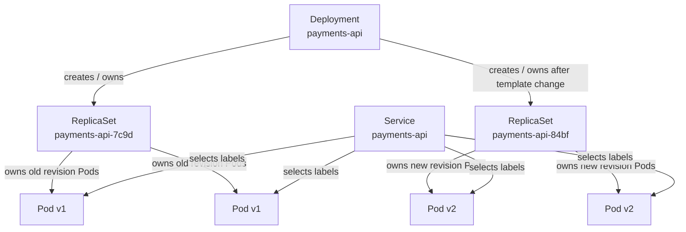
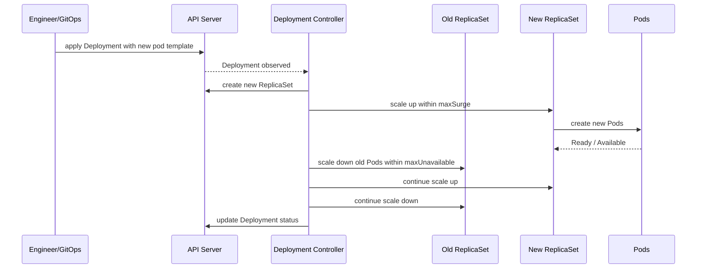
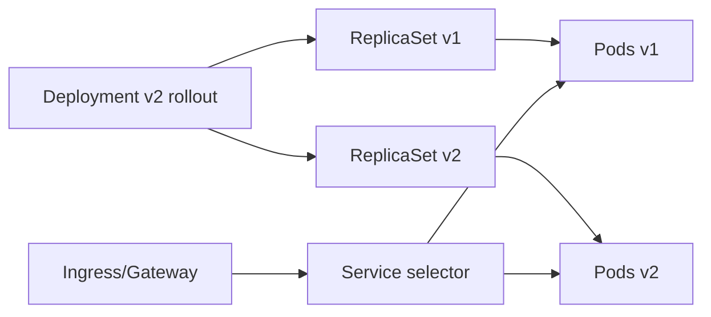
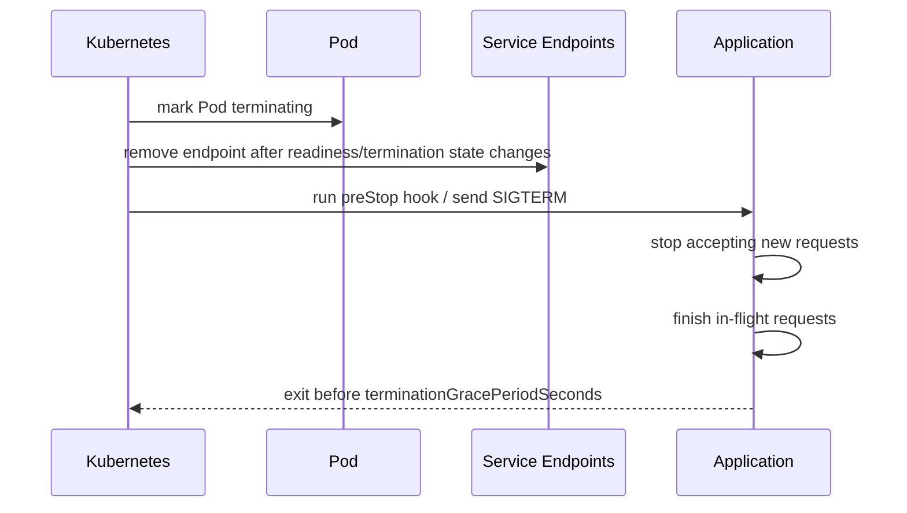

------
title: Learn Kubernetes, Deployment Model, and Cloud Native Platform Engineering - Part 009
description: Deep dive Deployment controller, ReplicaSet relationship, rollout lifecycle, rolling update math, status conditions, rollback, pause/resume, production failure modes, dan debugging.
series: learn-kubernetes-deployment-model
seriesTitle: Learn Kubernetes, Deployment Model, and Cloud Native Platform Engineering
order: 9
partTitle: Deployment Controller Deep Dive
tags:
- kubernetes
- deployment
- replicaset
- rollout
- rollback
- reliability
- sre
- platform-engineering
- series
date: 2026-07-01
---

# Part 009 — Deployment Controller Deep Dive

> Tujuan part ini adalah membuat kita memahami Deployment bukan sebagai “YAML untuk menjalankan app”, tetapi sebagai **controller-driven release mechanism**: ia menciptakan ReplicaSet, mengelola transisi versi Pod, menjaga availability constraint, mencatat revision, dan memberi kita primitive untuk rollout, pause, resume, serta rollback.

Di Kubernetes, Deployment adalah resource tingkat tinggi untuk mengelola aplikasi stateless yang direpresentasikan sebagai sekumpulan Pod identik. Deployment tidak langsung “menjalankan container”. Deployment menyatakan desired state. Deployment controller lalu membuat dan mengelola ReplicaSet. ReplicaSet membuat dan menjaga Pod. Kubelet menjalankan Pod di Node.

Mental model paling penting:

```text
Deployment is a versioned desired-state transition controller.
ReplicaSet is the replica-count enforcer for one Pod template revision.
Pod is the runtime execution cell.
```

Kalau kita salah memahami relasi ini, kita akan salah saat debugging rollout, salah membaca status, salah membuat rollback plan, dan salah mendesain release safety.

---

## 1. Kaufman Deconstruction: Skill yang Harus Dikuasai

Deployment tampak sederhana, tetapi skill produksinya terdiri dari beberapa sub-skill kecil:

| Sub-skill | Pertanyaan yang Harus Bisa Dijawab |
|---|---|
| Controller relationship | Deployment membuat apa? ReplicaSet membuat apa? Pod dimiliki siapa? |
| Pod template revision | Perubahan apa yang menghasilkan revision baru? Perubahan apa yang tidak? |
| Selector safety | Kenapa selector Deployment berbahaya jika salah? |
| Rolling update math | Bagaimana `maxSurge` dan `maxUnavailable` membatasi transisi? |
| Availability semantics | Apa beda desired replicas, updated replicas, ready replicas, dan available replicas? |
| Rollout monitoring | Bagaimana tahu rollout sedang sehat, lambat, stuck, atau gagal? |
| Rollback semantics | Apa yang benar-benar terjadi saat rollback? |
| Pause/resume | Kapan rollout perlu dipause dan apa konsekuensinya? |
| Production failure modes | Bagaimana mendeteksi bad image, failing readiness, quota issue, slow start, PDB conflict, node pressure, dan selector collision? |
| Operational contract | Field apa yang wajib distandarkan oleh platform team? |

Target akhirnya bukan “bisa membuat Deployment”. Targetnya adalah bisa menjawab:

```text
Apakah release ini aman, observable, reversible, dan bounded blast radius-nya?
```

---

## 2. Deployment Object Graph

Deployment adalah root controller untuk pola stateless replicated application.



Object graph ini menghasilkan beberapa konsekuensi:

1. Deployment mengelola **ReplicaSet**, bukan Pod secara langsung.
2. ReplicaSet mengelola Pod yang cocok dengan selector dan template revision-nya.
3. Service biasanya memilih Pod lewat label, bukan memilih Deployment.
4. Saat rollout, Service bisa mengirim traffic ke Pod lama dan baru secara bersamaan jika label selector-nya cocok.
5. Rollback bukan “menghidupkan container lama”; rollback membuat Deployment kembali menggunakan Pod template revision sebelumnya.

Ketika production incident terjadi, jangan mulai dari YAML saja. Mulai dari graph:

```text
Deployment -> ReplicaSet -> Pod -> Container -> Node -> Event -> Log -> Metric
```

---

## 3. Kenapa Jangan Mengelola ReplicaSet Langsung?

ReplicaSet memastikan jumlah Pod yang cocok dengan selector tersedia. Secara teknis kita bisa membuat ReplicaSet manual. Namun untuk aplikasi umum, Deployment lebih tepat karena memberikan layer rollout.

| Kemampuan | ReplicaSet | Deployment |
|---|---:|---:|
| Menjaga jumlah Pod | Ya | Ya, via ReplicaSet |
| Pod template | Ya | Ya |
| Rolling update | Tidak sebagai primitive utama | Ya |
| Revision history | Tidak sebagai interface release utama | Ya |
| Rollback | Manual | Native via rollout history |
| Pause/resume rollout | Tidak | Ya |
| Declarative update strategy | Terbatas | Ya |
| Status rollout | Terbatas | Ya |

Rule of thumb:

```text
Gunakan Deployment untuk aplikasi stateless long-running.
Biarkan Deployment mengelola ReplicaSet.
Jangan patch ReplicaSet manual kecuali untuk debugging terbatas dan sadar konsekuensi.
```

Patch manual pada ReplicaSet yang dimiliki Deployment mudah dioverwrite oleh controller. Dalam sistem reconciliation, perubahan manual pada child object sering bukan sumber kebenaran.

---

## 4. Anatomy of a Production Deployment

Contoh manifest minimal yang lebih dekat ke production baseline:

```yaml
apiVersion: apps/v1
kind: Deployment
metadata:
  name: payments-api
  namespace: payments
  labels:
    app.kubernetes.io/name: payments-api
    app.kubernetes.io/part-of: payment-platform
    app.kubernetes.io/component: api
    app.kubernetes.io/managed-by: gitops
spec:
  replicas: 6
  revisionHistoryLimit: 5
  progressDeadlineSeconds: 600
  minReadySeconds: 20
  strategy:
    type: RollingUpdate
    rollingUpdate:
      maxSurge: 25%
      maxUnavailable: 0
  selector:
    matchLabels:
      app.kubernetes.io/name: payments-api
      app.kubernetes.io/component: api
  template:
    metadata:
      labels:
        app.kubernetes.io/name: payments-api
        app.kubernetes.io/part-of: payment-platform
        app.kubernetes.io/component: api
        app.kubernetes.io/version: "2026.07.01-1"
    spec:
      serviceAccountName: payments-api
      terminationGracePeriodSeconds: 45
      containers:
      - name: app
        image: registry.example.com/payments-api:2026.07.01-1
        imagePullPolicy: IfNotPresent
        ports:
        - name: http
          containerPort: 8080
        resources:
          requests:
            cpu: "500m"
            memory: "512Mi"
          limits:
            memory: "1Gi"
        startupProbe:
          httpGet:
            path: /health/startup
            port: http
          failureThreshold: 30
          periodSeconds: 2
        readinessProbe:
          httpGet:
            path: /health/ready
            port: http
          periodSeconds: 5
          timeoutSeconds: 1
          failureThreshold: 2
        livenessProbe:
          httpGet:
            path: /health/live
            port: http
          periodSeconds: 10
          timeoutSeconds: 1
          failureThreshold: 3
        lifecycle:
          preStop:
            httpGet:
              path: /shutdown/drain
              port: http
```

Beberapa hal yang sengaja ada:

| Field | Fungsi Production |
|---|---|
| `replicas` | Desired replica count untuk steady state. |
| `revisionHistoryLimit` | Membatasi jumlah ReplicaSet lama yang disimpan untuk rollback. |
| `progressDeadlineSeconds` | Batas waktu Deployment dianggap gagal progress. |
| `minReadySeconds` | Pod harus ready selama durasi tertentu sebelum dianggap available. |
| `strategy.rollingUpdate.maxSurge` | Kapasitas ekstra selama rollout. |
| `strategy.rollingUpdate.maxUnavailable` | Berapa banyak replica boleh unavailable selama rollout. |
| `selector` | Binding permanen Deployment ke Pod set. |
| `template.metadata.labels` | Label Pod yang harus match selector dan Service. |
| `startupProbe` | Melindungi aplikasi slow-start dari liveness kill terlalu cepat. |
| `readinessProbe` | Mengontrol apakah Pod boleh menerima traffic. |
| `livenessProbe` | Mengontrol restart saat proses benar-benar stuck. |
| `preStop` + graceful shutdown | Mengurangi dropped requests saat Pod dihapus. |

Deployment yang aman bukan hanya memiliki image dan replica. Deployment yang aman punya **traffic readiness**, **bounded rollout**, **rollback history**, dan **shutdown semantics**.

---

## 5. Field yang Tidak Boleh Diremehkan

### 5.1 `selector`

Selector menentukan Pod mana yang dikelola Deployment. Pada `apps/v1`, selector wajib dan harus match label template.

```yaml
spec:
  selector:
    matchLabels:
      app.kubernetes.io/name: payments-api
  template:
    metadata:
      labels:
        app.kubernetes.io/name: payments-api
```

Selector adalah kontrak berbahaya karena:

1. Selector yang terlalu luas dapat “mengadopsi” Pod yang tidak seharusnya.
2. Selector yang tidak match template membuat Deployment tidak bisa mengelola Pod yang dibuatnya.
3. Selector Deployment tidak boleh diperlakukan seperti label biasa yang bebas berubah.

Anti-pattern:

```yaml
selector:
  matchLabels:
    app: api
```

Label terlalu generik. Dalam namespace besar, `app: api` mudah bertabrakan.

Lebih aman:

```yaml
selector:
  matchLabels:
    app.kubernetes.io/name: payments-api
    app.kubernetes.io/component: api
```

Jangan masukkan label yang berubah per version ke selector, misalnya:

```yaml
# Buruk untuk selector Deployment
app.kubernetes.io/version: "v2"
```

Kalau version masuk selector, rollout akan berubah menjadi relasi ownership yang rapuh.

---

### 5.2 `template`

`spec.template` adalah Pod template. Perubahan pada Pod template menghasilkan revision baru dan biasanya memicu rollout.

Contoh perubahan yang memicu rollout:

- image tag/digest berubah
- env var berubah
- ConfigMap/Secret name berubah
- resource request/limit berubah
- probe berubah
- label/annotation pada Pod template berubah
- command/args berubah
- volume mount berubah

Contoh perubahan yang tidak menghasilkan Pod revision baru:

- perubahan `spec.replicas`
- perubahan field metadata Deployment di luar Pod template
- perubahan beberapa field strategy tanpa mengubah template

Inilah alasan annotation seperti ini sering dipakai untuk memaksa rollout saat ConfigMap berubah:

```yaml
spec:
  template:
    metadata:
      annotations:
        checksum/config: "sha256:abc123..."
```

Jika ConfigMap dipasang sebagai volume, kubelet dapat memperbarui file eventually. Tetapi banyak aplikasi tidak reload otomatis. Dengan checksum annotation di Pod template, perubahan konfigurasi menghasilkan Pod baru secara eksplisit.

---

### 5.3 `replicas`

`replicas` adalah desired count. Namun jumlah aktual selama rollout bisa melebihi `replicas` karena `maxSurge`, atau kurang dari `replicas` karena `maxUnavailable`.

```text
replicas = steady-state target
current pods during rollout = replicas +/- strategy allowance
```

Jangan membaca “ada lebih banyak Pod dari replicas” sebagai bug sebelum mengecek rollout strategy.

---

### 5.4 `minReadySeconds`

`minReadySeconds` menyatakan durasi minimal Pod harus Ready tanpa crash sebelum dianggap Available.

Tanpa `minReadySeconds`, Pod yang sebentar Ready lalu crash bisa membuat rollout tampak terlalu optimistis.

Gunakan ini saat:

- aplikasi butuh warm-up cache
- readiness cepat hijau tetapi error rate baru tampak setelah traffic masuk
- dependency connection pool butuh stabil
- startup selesai tetapi runtime belum benar-benar steady

Namun jangan terlalu besar tanpa alasan. Nilai terlalu besar memperlambat rollout dan bisa memicu progress deadline.

---

### 5.5 `progressDeadlineSeconds`

`progressDeadlineSeconds` adalah batas waktu Deployment dianggap tidak membuat progress. Jika rollout tidak bergerak dalam batas ini, Deployment dapat menandai kondisi `Progressing=False` dengan reason seperti `ProgressDeadlineExceeded`.

Ini bukan rollback otomatis. Ini sinyal bahwa automation atau operator harus bereaksi.

```text
Progress deadline is a failure detector, not a magic recovery system.
```

Nilainya harus disesuaikan dengan:

- waktu image pull
- waktu scheduling
- startup time
- readiness stabilization
- minReadySeconds
- dependency warm-up
- cluster capacity

---

### 5.6 `revisionHistoryLimit`

`revisionHistoryLimit` menentukan berapa banyak ReplicaSet lama yang disimpan untuk rollback.

Terlalu kecil:

- rollback ke versi lebih lama tidak tersedia
- forensic comparison lebih sulit

Terlalu besar:

- object lama menumpuk
- kebisingan saat debugging

Baseline umum: 3–10, bergantung frekuensi deploy dan compliance/audit model. Untuk sistem regulated, revision history di Kubernetes tidak boleh menjadi satu-satunya audit trail. Tetap butuh Git commit, artifact digest, deployment event, approval, dan change record.

---

## 6. Rolling Update Math

Deployment mendukung strategi `RollingUpdate` dan `Recreate`. Untuk `RollingUpdate`, dua field utama adalah:

```yaml
strategy:
  type: RollingUpdate
  rollingUpdate:
    maxSurge: 25%
    maxUnavailable: 25%
```

### 6.1 `maxSurge`

`maxSurge` adalah jumlah Pod tambahan di atas desired replicas yang boleh dibuat selama rollout.

Jika:

```text
replicas = 10
maxSurge = 30%
```

Maka new ReplicaSet dapat naik sehingga total Pod tidak melebihi:

```text
10 + ceil(30% of 10) = 13
```

`maxSurge` membantu menjaga availability karena Pod baru dibuat sebelum Pod lama dikurangi.

---

### 6.2 `maxUnavailable`

`maxUnavailable` adalah jumlah Pod desired yang boleh unavailable selama rollout.

Jika:

```text
replicas = 10
maxUnavailable = 20%
```

Maka minimal available selama rollout adalah:

```text
10 - floor(20% of 10) = 8
```

Untuk workload critical, sering dipakai:

```yaml
maxSurge: 25%
maxUnavailable: 0
```

Konsekuensinya: rollout butuh kapasitas ekstra. Jika cluster tidak punya kapasitas, rollout bisa stuck karena tidak bisa membuat Pod baru.

---

### 6.3 Availability vs Capacity Trade-off

| Strategy | Availability | Capacity Need | Rollout Speed | Risiko |
|---|---:|---:|---:|---|
| `maxSurge: 0`, `maxUnavailable: 25%` | Lebih rendah | Tidak perlu ekstra besar | Sedang | Ada penurunan kapasitas serving |
| `maxSurge: 25%`, `maxUnavailable: 25%` | Sedang | Butuh ekstra | Cepat | Campuran availability/capacity |
| `maxSurge: 25%`, `maxUnavailable: 0` | Tinggi | Butuh ekstra | Sedang | Stuck jika cluster penuh |
| `maxSurge: 100%`, `maxUnavailable: 0` | Sangat tinggi | Butuh kapasitas 2x | Cepat | Mahal, bisa overload dependency |

Deployment strategy bukan keputusan Kubernetes saja. Ini keputusan reliability dan capacity planning.

---

## 7. Rollout Lifecycle

Saat Pod template berubah, Deployment melakukan transisi dari ReplicaSet lama ke ReplicaSet baru.



Rollout selesai ketika:

1. updated replicas mencapai desired replicas
2. old replicas turun ke 0
3. available replicas memenuhi expectation
4. Deployment observed generation sudah menyusul generation terbaru

Operationally:

```bash
kubectl rollout status deployment/payments-api -n payments --timeout=10m
kubectl get deployment payments-api -n payments
kubectl describe deployment payments-api -n payments
kubectl get rs -n payments -l app.kubernetes.io/name=payments-api
kubectl get pods -n payments -l app.kubernetes.io/name=payments-api -o wide
```

---

## 8. Status Fields yang Harus Bisa Dibaca

`kubectl get deployment` sering menampilkan kolom seperti:

```text
NAME           READY   UP-TO-DATE   AVAILABLE   AGE
payments-api   5/6     6            5           3d
```

Maknanya:

| Field | Makna |
|---|---|
| `READY` | Pod yang Ready dibanding desired replicas. |
| `UP-TO-DATE` | Pod yang dibuat dari template terbaru. |
| `AVAILABLE` | Pod yang available, memperhitungkan readiness dan `minReadySeconds`. |
| `AGE` | Umur Deployment object. |

Di status object:

| Field | Makna |
|---|---|
| `observedGeneration` | Generation terakhir yang sudah diproses controller. |
| `replicas` | Total replicas yang dikelola. |
| `updatedReplicas` | Replicas dari template terbaru. |
| `readyReplicas` | Replicas yang Ready. |
| `availableReplicas` | Replicas yang Available. |
| `unavailableReplicas` | Replicas yang belum available. |
| `conditions` | Sinyal tingkat tinggi: progressing, available, replica failure. |

Jika `metadata.generation` lebih besar dari `status.observedGeneration`, controller belum memproses perubahan terbaru. Jangan langsung menyimpulkan rollout gagal.

---

## 9. Deployment Conditions

Deployment conditions adalah ringkasan controller terhadap state.

Contoh:

```bash
kubectl describe deployment payments-api -n payments
```

Output dapat mencakup:

```text
Conditions:
  Type           Status  Reason
  ----           ------  ------
  Available      True    MinimumReplicasAvailable
  Progressing    True    NewReplicaSetAvailable
```

Tiga condition penting:

| Condition | Arti |
|---|---|
| `Progressing` | Deployment sedang atau sudah membuat progress terhadap revision baru. |
| `Available` | Deployment memenuhi minimum availability. |
| `ReplicaFailure` | Ada kegagalan membuat atau menghapus Pod. |

Reason yang sering muncul:

| Reason | Interpretasi |
|---|---|
| `NewReplicaSetCreated` | ReplicaSet baru dibuat. |
| `ReplicaSetUpdated` | ReplicaSet diskalakan. |
| `NewReplicaSetAvailable` | ReplicaSet baru tersedia. |
| `ProgressDeadlineExceeded` | Rollout tidak progress dalam deadline. |
| `MinimumReplicasAvailable` | Minimum availability terpenuhi. |
| `FailedCreate` | ReplicaSet gagal membuat Pod. |

Condition bukan pengganti investigasi. Condition memberi entry point.

---

## 10. Revision Semantics

Deployment mencatat revision melalui annotation pada ReplicaSet, misalnya:

```text
deployment.kubernetes.io/revision: "7"
```

Melihat history:

```bash
kubectl rollout history deployment/payments-api -n payments
```

Melihat detail revision:

```bash
kubectl rollout history deployment/payments-api -n payments --revision=7
```

Rollback ke revision sebelumnya:

```bash
kubectl rollout undo deployment/payments-api -n payments
```

Rollback ke revision tertentu:

```bash
kubectl rollout undo deployment/payments-api -n payments --to-revision=6
```

Yang perlu dipahami:

1. Revision terkait Pod template.
2. Rollback membuat template Deployment kembali ke revision sebelumnya.
3. Rollback juga merupakan rollout baru secara operasional.
4. Rollback tidak otomatis mengembalikan state eksternal seperti database schema, Kafka message format, cache content, atau third-party dependency behavior.

Karena itu, rollback aplikasi harus dibedakan dari rollback sistem secara keseluruhan.

---

## 11. Pause dan Resume

Deployment bisa dipause:

```bash
kubectl rollout pause deployment/payments-api -n payments
```

Saat paused, perubahan pada Deployment dapat dikumpulkan tanpa langsung memicu rollout. Setelah siap:

```bash
kubectl rollout resume deployment/payments-api -n payments
```

Use case:

- menggabungkan beberapa perubahan template menjadi satu rollout
- investigasi saat rollout menunjukkan sinyal buruk
- manual gate sebelum exposure lebih lanjut

Anti-pattern:

```text
Membiarkan Deployment paused tanpa alert atau ownership jelas.
```

Deployment paused terlalu lama menciptakan state ambigu: desired YAML bisa sudah berubah, tetapi runtime belum bergerak.

Governance yang sehat:

- semua paused Deployment harus punya owner
- harus ada annotation alasan pause
- harus ada alert untuk pause terlalu lama
- GitOps controller harus sadar atau dikonfigurasi agar tidak melawan manual pause

---

## 12. Scaling During Rollout

Jika Deployment diskalakan saat rollout berlangsung, controller akan menyesuaikan ReplicaSet lama dan baru agar proporsi rollout tetap masuk akal.

Contoh:

```bash
kubectl scale deployment/payments-api -n payments --replicas=12
```

Hal yang harus diperhatikan:

1. HPA dapat mengubah replicas saat rollout.
2. Autoscaling saat rollout dapat memperbesar blast radius jika versi baru bermasalah.
3. Metric HPA yang memburuk karena versi baru dapat menyebabkan scale-up versi baru juga.
4. Capacity planning harus memperhitungkan `replicas + maxSurge + HPA maxReplicas`.

Rule of thumb:

```text
Untuk workload critical, uji interaksi rollout strategy, HPA, PDB, dan cluster autoscaler secara eksplisit.
```

---

## 13. Deployment vs Service: Jangan Campur Release dan Routing

Deployment mengelola Pod. Service mengarahkan traffic ke Pod yang match selector.



Rolling update dengan satu Deployment biasanya membuat Service melihat Pod lama dan baru secara bersamaan. Traffic split-nya tidak selalu presisi 50/50 atau berdasarkan version; traffic diarahkan ke endpoint yang ready.

Jika butuh kontrol traffic versi secara presisi, Deployment saja tidak cukup. Kita butuh layer routing tambahan seperti:

- Service selector switch
- Ingress/Gateway routing
- service mesh
- progressive delivery controller
- feature flag
- external load balancer

Ini akan dibahas lebih jauh di Part 010 dan Part 011.

---

## 14. Failure Mode: Bad Image

Gejala:

```text
ImagePullBackOff
ErrImagePull
```

Diagnosis:

```bash
kubectl get pods -n payments -l app.kubernetes.io/name=payments-api
kubectl describe pod <pod> -n payments
kubectl get events -n payments --sort-by=.lastTimestamp
```

Penyebab umum:

- image tag salah
- image belum dipush
- registry credential salah
- imagePullSecret tidak tersedia
- registry rate limit
- node tidak bisa reach registry
- policy admission menolak image

Mitigasi desain:

- deploy by digest untuk immutability
- validasi image exists sebelum apply
- admission policy untuk registry allowlist
- image signing/provenance di supply chain
- canary kecil sebelum rollout luas

---

## 15. Failure Mode: Failing Readiness

Gejala:

```text
READY 0/1
Deployment updatedReplicas naik tetapi availableReplicas tidak naik
```

Diagnosis:

```bash
kubectl describe pod <pod> -n payments
kubectl logs <pod> -n payments -c app
kubectl exec -n payments <pod> -- curl -s localhost:8080/health/ready
```

Penyebab umum:

- dependency database tidak reachable
- migration belum kompatibel
- config salah
- secret missing
- app binding ke port yang salah
- readiness endpoint terlalu strict
- NetworkPolicy memblokir dependency
- DNS issue

Prinsip:

```text
Readiness should answer: can this Pod receive real traffic now?
```

Readiness tidak boleh hanya `process is alive`. Itu tugas liveness.

---

## 16. Failure Mode: Liveness Membunuh Pod yang Sebenarnya Sedang Start

Gejala:

```text
CrashLoopBackOff
Last State: Terminated
Reason: Error
Events: Liveness probe failed
```

Penyebab:

- startup lambat
- liveness probe terlalu cepat aktif
- threshold terlalu agresif
- endpoint health bergantung dependency eksternal

Mitigasi:

- gunakan `startupProbe`
- jangan membuat liveness bergantung pada dependency eksternal yang flappy
- gunakan readiness untuk traffic gating
- gunakan liveness hanya untuk deadlock/hang yang tidak recoverable

Model sehat:

```text
startupProbe: apakah app sudah selesai bootstrap?
readinessProbe: apakah app boleh menerima traffic?
livenessProbe: apakah process perlu direstart karena stuck?
```

---

## 17. Failure Mode: Stuck Karena Tidak Ada Capacity

Gejala:

```text
Pod Pending
0/10 nodes are available: insufficient cpu, insufficient memory
```

Khususnya sering terjadi dengan:

```yaml
maxUnavailable: 0
maxSurge: 25%
```

Strategi ini butuh kapasitas ekstra. Jika cluster penuh, Pod baru tidak bisa dijadwalkan, Pod lama tidak boleh diturunkan karena `maxUnavailable: 0`, maka rollout stuck.

Pilihan mitigasi:

1. Sediakan headroom cluster.
2. Aktifkan cluster autoscaler dengan limit yang cukup.
3. Turunkan request jika memang overestimated.
4. Pakai `maxUnavailable` kecil jika availability masih bisa diterima.
5. Gunakan maintenance window untuk workload besar.
6. Pakai rollout batch lebih kecil.

Trade-off:

```text
Availability tinggi sering dibayar dengan capacity headroom.
```

---

## 18. Failure Mode: Quota dan LimitRange

Gejala:

```text
Error creating: pods "..." is forbidden: exceeded quota
```

Penyebab:

- namespace ResourceQuota sudah penuh
- request/limit tidak memenuhi LimitRange
- jumlah object melebihi quota
- ephemeral storage request/limit tidak sesuai

Diagnosis:

```bash
kubectl describe quota -n payments
kubectl describe limitrange -n payments
kubectl describe rs <new-rs> -n payments
```

Design implication:

- quota harus memperhitungkan surge rollout
- environment production butuh quota headroom
- platform harus menguji deployment under quota, bukan hanya steady state

Jika replicas = 20 dan `maxSurge = 25%`, quota harus mampu menampung 25 Pod, bukan hanya 20.

---

## 19. Failure Mode: Selector Collision

Gejala:

- Deployment mengelola Pod yang tidak seharusnya
- ReplicaSet count aneh
- Service mengirim traffic ke Pod dari aplikasi lain
- rollout tampak berhasil tetapi traffic error campur

Diagnosis:

```bash
kubectl get pods -n payments --show-labels
kubectl get rs -n payments --show-labels
kubectl describe deployment payments-api -n payments
kubectl get endpointslice -n payments -l kubernetes.io/service-name=payments-api
```

Penyebab:

- label terlalu generik
- selector Service terlalu luas
- copy-paste manifest
- environment label masuk selector secara tidak konsisten

Mitigasi:

- gunakan label taxonomy standar
- selector hanya memakai identity stabil
- validasi dengan admission policy
- review object graph pada CI

---

## 20. Failure Mode: Slow Termination dan Dropped Requests

Saat rollout menurunkan Pod lama, Pod menerima termination signal. Jika app tidak drain dengan benar, request bisa terputus.

Urutan ideal:



Mitigasi:

- app handle SIGTERM
- readiness menjadi false saat draining
- `terminationGracePeriodSeconds` cukup
- `preStop` hanya membantu, bukan pengganti graceful shutdown app
- load balancer drain delay dipahami
- long-running request punya timeout dan idempotency

Anti-pattern:

```text
kill -9 mindset in distributed traffic systems.
```

---

## 21. Rollout Debugging Workflow

Gunakan workflow tetap agar tidak lompat-lompat.

### Step 1 — Lihat status Deployment

```bash
kubectl get deployment payments-api -n payments
kubectl describe deployment payments-api -n payments
```

Cari:

- desired vs ready
- updated vs available
- conditions
- events
- old/new ReplicaSet

### Step 2 — Lihat ReplicaSet

```bash
kubectl get rs -n payments -l app.kubernetes.io/name=payments-api
kubectl describe rs <new-rs> -n payments
```

Cari:

- ReplicaSet mana revision terbaru
- apakah Pod dibuat
- apakah ada `FailedCreate`
- apakah selector match

### Step 3 — Lihat Pod

```bash
kubectl get pods -n payments -l app.kubernetes.io/name=payments-api -o wide
kubectl describe pod <pod> -n payments
```

Cari:

- Pending
- ImagePullBackOff
- CrashLoopBackOff
- readiness failure
- OOMKilled
- node placement
- events

### Step 4 — Lihat log dan previous log

```bash
kubectl logs <pod> -n payments -c app
kubectl logs <pod> -n payments -c app --previous
```

`--previous` penting untuk container yang restart.

### Step 5 — Lihat dependency dan traffic

```bash
kubectl get svc,endpointslice -n payments
kubectl get networkpolicy -n payments
kubectl top pod -n payments
kubectl top node
```

Masalah rollout sering bukan Deployment object, tetapi dependency, network, resource, atau policy.

---

## 22. Production Rollout Guardrails

Deployment raw memberi primitive. Production safety butuh guardrail tambahan.

| Guardrail | Tujuan |
|---|---|
| readinessProbe wajib | Mencegah Pod menerima traffic sebelum siap. |
| startupProbe untuk slow-start | Mencegah liveness kill saat bootstrap. |
| resource requests wajib | Membantu scheduler dan capacity planning. |
| PDB untuk critical workload | Mengontrol voluntary disruption. |
| `maxUnavailable` sesuai SLO | Menjaga minimum capacity. |
| `progressDeadlineSeconds` | Mendeteksi rollout stuck. |
| immutable image digest | Menghindari tag drift. |
| audit deployment event | Traceability. |
| alert pada rollout stuck | Mengurangi MTTR. |
| rollback runbook | Recovery cepat. |

Deployment tanpa guardrail akan tampak bekerja di dev, tetapi rapuh di production.

---

## 23. Deployment dan PodDisruptionBudget

PodDisruptionBudget atau PDB membatasi voluntary disruption. Ia tidak secara langsung mengatur Deployment rolling update dengan cara yang sama seperti drain node, tetapi dalam praktik, PDB, rollout strategy, dan availability target harus konsisten.

Contoh konflik desain:

```text
replicas = 3
maxUnavailable = 1
PDB minAvailable = 3
```

PDB meminta semua 3 tersedia untuk voluntary disruption. Rollout strategy mengizinkan 1 unavailable. Keduanya dapat menciptakan ekspektasi operasional yang membingungkan dalam maintenance/drain scenario.

Desain yang lebih jelas:

```text
replicas = 6
Deployment maxUnavailable = 0 or 1
PDB minAvailable = 5
```

Prinsip:

```text
Deployment strategy, PDB, HPA, and cluster capacity must be designed together.
```

---

## 24. Deployment dengan HPA

Jika HPA mengelola Deployment, jangan terus-menerus mengubah `spec.replicas` via GitOps tanpa policy jelas. HPA akan update replicas, GitOps bisa mengembalikan, lalu terjadi control loop conflict.

Anti-pattern:

```text
GitOps continuously enforces replicas=3 while HPA tries to scale to 10.
```

Pilihan desain:

1. Hilangkan `replicas` dari manifest untuk workload yang dikelola HPA jika tooling mendukung.
2. Abaikan diff `spec.replicas` pada GitOps controller.
3. Tetapkan min/max di HPA sebagai source of truth scaling.
4. Dokumentasikan ownership field.

Field ownership adalah konsep penting dalam Kubernetes production:

```text
Not every field should be owned by Git.
Some fields are owned by controllers.
Some fields are observed-only status.
```

---

## 25. Deployment Anti-Patterns

| Anti-pattern | Kenapa Berbahaya | Alternatif |
|---|---|---|
| `latest` tag | Tidak immutable, rollback ambigu | digest atau version tag immutable |
| Tidak ada readinessProbe | Traffic masuk ke Pod belum siap | readiness endpoint nyata |
| Liveness terlalu agresif | Restart storm | startupProbe + liveness konservatif |
| Selector generik | Collision/adoption risk | label taxonomy stabil |
| `maxUnavailable` tinggi untuk workload critical | Capacity serving turun | gunakan maxUnavailable kecil/0 |
| Tidak ada resource requests | Scheduling tidak akurat | request berbasis profiling |
| Manual edit child ReplicaSet | Controller overwrite | ubah Deployment source |
| Rollback tanpa cek schema compatibility | Data corruption / runtime mismatch | backward-compatible migration |
| ConfigMap berubah tanpa rollout/reload | Pod masih pakai config lama | checksum annotation atau reload mechanism |
| Menganggap rollout sukses = release sukses | Error bisnis bisa muncul setelah ready | metric gate, SLO, canary |

---

## 26. Deployment Review Checklist

Sebelum approve Deployment production, jawab:

### Identity dan Ownership

- Apakah name dan namespace benar?
- Apakah label taxonomy konsisten?
- Apakah selector stabil dan tidak terlalu luas?
- Apakah Service selector match Pod label yang benar?

### Runtime Safety

- Apakah readinessProbe valid?
- Apakah startupProbe diperlukan?
- Apakah livenessProbe tidak terlalu agresif?
- Apakah termination graceful?
- Apakah resource requests realistis?

### Rollout Safety

- Apakah `maxSurge` dan `maxUnavailable` sesuai SLO?
- Apakah cluster punya headroom untuk surge?
- Apakah `progressDeadlineSeconds` realistis?
- Apakah `minReadySeconds` diperlukan?
- Apakah rollback bisa dilakukan?

### Dependency Safety

- Apakah perubahan kompatibel dengan DB schema?
- Apakah event/message contract backward-compatible?
- Apakah cache dan dependency eksternal siap?
- Apakah NetworkPolicy mengizinkan dependency baru?

### Observability

- Apakah metrics per version tersedia?
- Apakah logs punya release/build metadata?
- Apakah alert rollout stuck ada?
- Apakah dashboard membedakan old/new revision?

---

## 27. Lab: Membaca Rollout Seperti Engineer Production

Buat Deployment kecil:

```yaml
apiVersion: apps/v1
kind: Deployment
metadata:
  name: rollout-demo
spec:
  replicas: 4
  strategy:
    type: RollingUpdate
    rollingUpdate:
      maxSurge: 1
      maxUnavailable: 0
  selector:
    matchLabels:
      app: rollout-demo
  template:
    metadata:
      labels:
        app: rollout-demo
    spec:
      containers:
      - name: nginx
        image: nginx:1.27
        ports:
        - containerPort: 80
        readinessProbe:
          httpGet:
            path: /
            port: 80
          periodSeconds: 5
```

Apply:

```bash
kubectl apply -f rollout-demo.yaml
kubectl rollout status deployment/rollout-demo
```

Update image:

```bash
kubectl set image deployment/rollout-demo nginx=nginx:1.28
kubectl get deploy,rs,pod -l app=rollout-demo -w
```

Simulasikan bad image:

```bash
kubectl set image deployment/rollout-demo nginx=nginx:does-not-exist
kubectl rollout status deployment/rollout-demo --timeout=90s
kubectl describe deployment rollout-demo
kubectl get pods -l app=rollout-demo
```

Rollback:

```bash
kubectl rollout undo deployment/rollout-demo
kubectl rollout status deployment/rollout-demo
```

Yang harus diamati:

- ReplicaSet lama tidak langsung hilang.
- New ReplicaSet dibuat saat template berubah.
- Bad image membuat Pod gagal, bukan Deployment object hilang.
- Rollback mengubah template kembali.
- Service tetap bisa mengarah ke Pod lama jika availability masih dijaga.

---

## 28. Mental Model Final

Deployment adalah salah satu resource paling sering dipakai di Kubernetes, tetapi juga salah satu yang paling sering diremehkan.

Jangan pikirkan Deployment sebagai:

```text
run this container
```

Pikirkan sebagai:

```text
maintain N available replicas of this Pod template, transition safely between revisions, and expose enough status for operators to know whether the transition is progressing.
```

Invariants yang harus selalu diingat:

1. Deployment mengelola ReplicaSet.
2. ReplicaSet mengelola Pod.
3. Pod template change menghasilkan revision baru.
4. Rollout safety ditentukan oleh readiness, strategy, capacity, dan dependency compatibility.
5. Rollback Kubernetes tidak sama dengan rollback data atau contract eksternal.
6. Service traffic mengikuti selector dan endpoint readiness, bukan Deployment revision secara eksplisit.
7. Deployment controller melakukan reconciliation, bukan menjalankan imperative script.

Jika kita memahami ini, debugging production Deployment menjadi lebih struktural: kita membaca object graph, status, events, dan invariants; bukan sekadar mencoba command acak.

---

## 29. Referensi Resmi

- Kubernetes Documentation — Deployments: `https://kubernetes.io/docs/concepts/workloads/controllers/deployment/`
- Kubernetes Documentation — ReplicaSet: `https://kubernetes.io/docs/concepts/workloads/controllers/replicaset/`
- Kubernetes Documentation — Managing Workloads / Rollouts: `https://kubernetes.io/docs/concepts/workloads/management/`
- Kubernetes Task — Update a Deployment Without Downtime: `https://kubernetes.io/docs/tasks/run-application/update-deployment-rolling/`
- Kubernetes API Reference — Deployment v1: `https://kubernetes.io/docs/reference/kubernetes-api/apps/deployment-v1/`
- kubectl Reference — rollout: `https://kubernetes.io/docs/reference/kubectl/generated/kubectl_rollout/`

---

## 30. Ringkasan Part 009

Di part ini kita membangun pemahaman bahwa Deployment adalah release controller untuk aplikasi replicated stateless. Fokusnya bukan YAML, tetapi relasi Deployment → ReplicaSet → Pod, revision semantics, rolling update math, status conditions, rollback, pause/resume, dan failure modelling.

Setelah part ini, kita harus bisa:

- membaca object graph Deployment secara benar
- menjelaskan kapan revision baru dibuat
- menghitung efek `maxSurge` dan `maxUnavailable`
- membedakan ready, available, updated, dan desired replicas
- mendiagnosis rollout stuck secara sistematis
- mendesain Deployment baseline yang lebih aman untuk production
- memahami batas rollback Kubernetes terhadap dependency eksternal

Part berikutnya akan membahas **release deployment models**: rolling, recreate, blue-green, canary, shadow, dan A/B testing. Deployment controller adalah primitive. Release model adalah strategi exposure dan risk management di atas primitive tersebut.
