------
title: Learn Kubernetes, Deployment Model, and Cloud Native Platform Engineering - Part 010
description: Deep dive release deployment models di Kubernetes: rolling, recreate, blue-green, canary, shadow, A/B, traffic switching, blast radius, rollback, dan decision framework production.
series: learn-kubernetes-deployment-model
seriesTitle: Learn Kubernetes, Deployment Model, and Cloud Native Platform Engineering
order: 10
partTitle: Deployment Models: Rolling, Recreate, Blue-Green, Canary, Shadow, A/B
tags:
- kubernetes
- deployment-model
- release-engineering
- canary
- blue-green
- rolling-update
- sre
- platform-engineering
- series
date: 2026-07-01
---

# Part 010 — Deployment Models: Rolling, Recreate, Blue-Green, Canary, Shadow, A/B

> Tujuan part ini adalah memisahkan tiga hal yang sering dicampur: **deployment**, **release**, dan **traffic exposure**. Kubernetes Deployment memberi primitive rollout. Tetapi strategi release production seperti blue-green, canary, shadow traffic, dan A/B membutuhkan desain routing, observability, rollback, data compatibility, dan governance yang lebih luas.

Banyak engineer berkata “kita deploy pakai Kubernetes rolling update” seolah itu menjawab seluruh strategi release. Padahal rolling update hanya salah satu cara mengganti Pod lama dengan Pod baru. Ia tidak otomatis menjawab:

- siapa user pertama yang terkena versi baru?
- berapa persen traffic yang masuk versi baru?
- metric apa yang menentukan lanjut atau stop?
- bagaimana rollback jika database migration sudah berjalan?
- bagaimana membandingkan error rate antar version?
- apakah event/message contract masih kompatibel?
- apakah dependency downstream sanggup menerima traffic dari dua versi sekaligus?

Mental model utama:

```text
Deployment changes what runs.
Release controls who is exposed.
Delivery strategy controls risk over time.
```

---

## 1. Kaufman Deconstruction: Skill yang Harus Dikuasai

Release deployment model bukan hafalan nama strategi. Skill-nya adalah memilih dan mengoperasikan strategi berdasarkan risiko.

| Sub-skill | Pertanyaan yang Harus Bisa Dijawab |
|---|---|
| Strategy selection | Kapan rolling cukup, kapan perlu canary/blue-green/shadow? |
| Blast radius design | Berapa user/request/pod/region yang boleh terkena versi baru lebih dulu? |
| Traffic control | Layer mana yang mengalihkan traffic: Service, Ingress, Gateway, mesh, LB, atau feature flag? |
| State compatibility | Apakah dua versi bisa hidup bersamaan terhadap DB, cache, queue, dan API contract? |
| Rollback design | Apa yang bisa dirollback cepat, dan apa yang tidak? |
| Observability | Metric apa yang menentukan release sehat? |
| Automation boundary | Mana yang native Kubernetes, mana butuh tool tambahan? |
| Human governance | Siapa approve, siapa monitor, kapan stop, kapan promote? |

Tujuan akhirnya:

```text
Kita tidak memilih strategi release karena populer.
Kita memilih strategi release karena cocok dengan failure mode dan risk budget workload.
```

---

## 2. Deployment vs Release vs Exposure

Definisi yang perlu dipisahkan:

| Konsep | Arti | Contoh |
|---|---|---|
| Deployment | Membuat versi software tersedia di runtime environment. | Pod v2 berjalan di cluster. |
| Release | Membuat versi tersebut digunakan oleh user/sistem. | 5% traffic diarahkan ke v2. |
| Exposure | Scope dampak versi baru. | internal users, 1 region, 1 tenant, 1% traffic. |
| Promotion | Meningkatkan exposure setelah sinyal sehat. | 5% → 25% → 50% → 100%. |
| Rollback | Mengurangi/menghapus exposure atau kembali ke versi sebelumnya. | traffic balik ke v1, Deployment undo. |

Kubernetes Deployment native mengelola deployment rollout. Release exposure sering membutuhkan resource lain.

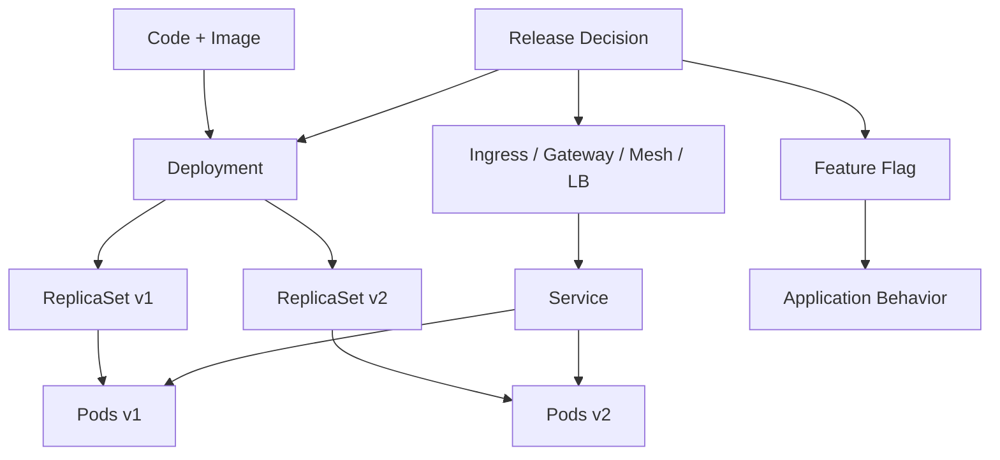

Kita bisa deploy v2 tanpa release ke user. Kita juga bisa release fitur baru tanpa deploy binary baru jika fitur dikontrol feature flag. Di platform mature, dua hal ini sengaja dipisahkan.

---

## 3. Native Kubernetes Deployment Strategies

Pada resource Deployment, strategi native utama adalah:

```yaml
strategy:
  type: RollingUpdate
```

atau:

```yaml
strategy:
  type: Recreate
```

Kubernetes Deployment tidak secara native memberi full canary traffic percentage, blue-green switch dengan health gate, shadow mirroring, atau A/B segmentation. Itu bisa dibangun menggunakan kombinasi resource Kubernetes dan tool tambahan, tetapi bukan semata field `strategy.type` Deployment.

Pemisahan ini penting agar kita tidak meng-overclaim kemampuan Deployment controller.

---

## 4. Strategy Comparison Matrix

| Strategy | Native Deployment? | Downtime Risk | Capacity Need | Traffic Control | Rollback Speed | Cocok Untuk |
|---|---:|---:|---:|---:|---:|---|
| Recreate | Ya | Tinggi | Rendah | Kasar | Sedang | dev, batch-ish app, single-writer app tertentu |
| Rolling Update | Ya | Rendah jika readiness benar | Sedang | Tidak presisi per user | Sedang-cepat | stateless service umum |
| Blue-Green | Tidak sebagai Deployment strategy tunggal | Rendah saat switch, tinggi jika switch salah | Tinggi | Jelas | Cepat untuk traffic | critical release dengan full environment validation |
| Canary | Butuh routing/progressive tooling | Rendah jika bertahap | Sedang | Presisi jika routing mendukung | Cepat jika traffic-level rollback | high-risk service, user-facing API |
| Shadow | Butuh traffic mirroring | Tidak berdampak langsung ke user response | Tinggi | Mirrored request | Stop mirror cepat | validate behavior/perf tanpa user impact |
| A/B | Butuh segmentation/flag/routing | Tergantung implementasi | Sedang | Berdasarkan user cohort | Feature-level rollback | eksperimen produk, personalized behavior |

Tidak ada strategi terbaik universal. Yang ada adalah strategi yang cocok dengan invariant sistem.

---

## 5. Recreate Strategy

Recreate berarti semua Pod lama dihentikan sebelum Pod baru dibuat.

```yaml
apiVersion: apps/v1
kind: Deployment
metadata:
  name: admin-tool
spec:
  replicas: 1
  strategy:
    type: Recreate
  selector:
    matchLabels:
      app: admin-tool
  template:
    metadata:
      labels:
        app: admin-tool
    spec:
      containers:
      - name: app
        image: registry.example.com/admin-tool:2.0.0
```

Flow:

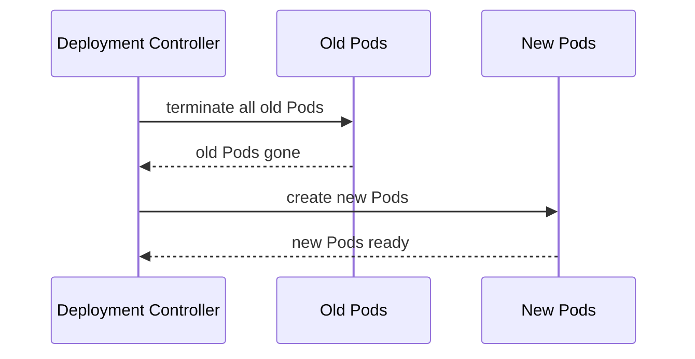

### 5.1 Kelebihan

- sederhana
- tidak ada dua versi berjalan bersamaan
- tidak butuh kapasitas ekstra besar
- cocok untuk aplikasi yang tidak aman jika dua versi hidup bersamaan

### 5.2 Kekurangan

- downtime hampir pasti untuk request-serving workload
- rollback juga butuh recreate lagi
- tidak cocok untuk service critical
- user impact besar jika startup lambat

### 5.3 Kapan Masuk Akal

Recreate bisa diterima untuk:

- tool internal non-critical
- workload singleton yang tidak boleh double-run
- aplikasi dengan lock eksternal yang tidak mendukung dual version
- environment development
- sistem dengan maintenance window eksplisit

Namun untuk production API dengan SLO availability, Recreate biasanya pilihan terakhir.

### 5.4 Failure Modes

| Failure | Dampak |
|---|---|
| image baru gagal pull | semua old Pod sudah mati, service down |
| app baru gagal readiness | downtime terus berlanjut |
| migration gagal | downtime + state ambiguity |
| startup lambat | downtime selama warm-up |

Mitigasi jika harus pakai Recreate:

- preflight image availability
- run smoke test di environment identik
- maintenance window
- backup/restore plan
- startupProbe dan readinessProbe jelas
- communication plan

---

## 6. Rolling Update Strategy

Rolling update mengganti Pod lama dengan Pod baru secara bertahap.

```yaml
strategy:
  type: RollingUpdate
  rollingUpdate:
    maxSurge: 25%
    maxUnavailable: 0
```

Flow:

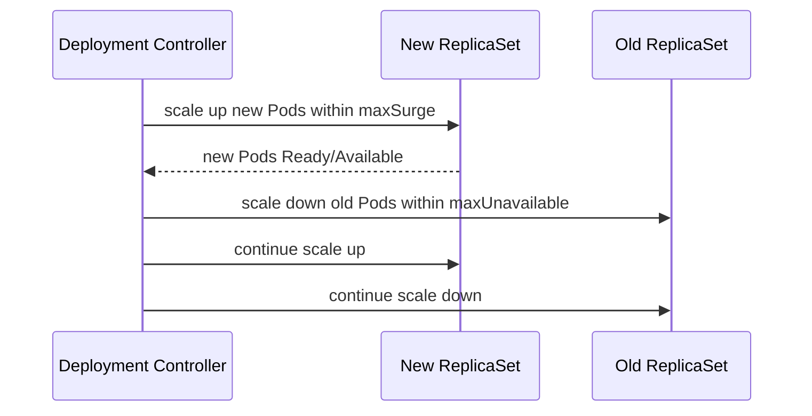

### 6.1 Kelebihan

- native Kubernetes
- cocok untuk stateless app umum
- bisa zero-downtime jika readiness/shutdown benar
- sederhana untuk platform baseline
- tidak butuh routing layer tambahan

### 6.2 Kekurangan

- versi lama dan baru menerima traffic secara bersamaan
- traffic split tidak presisi sebagai release gate
- sulit membatasi exposure ke cohort tertentu
- rollback masih berupa rollout balik
- tidak otomatis mengevaluasi metric bisnis/SLO

### 6.3 Kapan Cocok

Rolling update cocok jika:

- aplikasi stateless
- dua versi bisa berjalan bersamaan
- DB schema backward/forward compatible
- API/event contract kompatibel
- readiness mewakili kesiapan traffic
- perubahan risiko rendah sampai sedang
- tidak butuh user cohort routing

### 6.4 Kapan Tidak Cukup

Rolling update tidak cukup jika:

- perubahan sangat high-risk
- perlu expose ke 1% user dahulu
- perlu metric gate otomatis
- perlu compare v1/v2 secara eksplisit
- perubahan menyentuh critical payment/identity/authorization path
- perubahan dependency sulit dirollback

---

## 7. Rolling Update Design Patterns

### 7.1 Conservative High-Availability Rolling

```yaml
replicas: 12
strategy:
  type: RollingUpdate
  rollingUpdate:
    maxSurge: 2
    maxUnavailable: 0
minReadySeconds: 30
progressDeadlineSeconds: 900
```

Cocok untuk service critical yang butuh availability tinggi. Butuh capacity headroom.

### 7.2 Fast Internal Rolling

```yaml
replicas: 4
strategy:
  type: RollingUpdate
  rollingUpdate:
    maxSurge: 50%
    maxUnavailable: 25%
```

Cocok untuk service internal low-risk. Lebih cepat tetapi ada capacity fluctuation.

### 7.3 No-Extra-Capacity Rolling

```yaml
replicas: 8
strategy:
  type: RollingUpdate
  rollingUpdate:
    maxSurge: 0
    maxUnavailable: 1
```

Cocok jika cluster sangat ketat dan service dapat menerima sedikit penurunan capacity.

Trade-off-nya jelas:

```text
Tanpa extra capacity, rollout harus mengorbankan sebagian availability.
```

---

## 8. Blue-Green Deployment

Blue-green berarti ada dua environment atau dua set workload: satu aktif melayani traffic, satu standby untuk versi baru. Setelah green siap, traffic dipindahkan dari blue ke green.

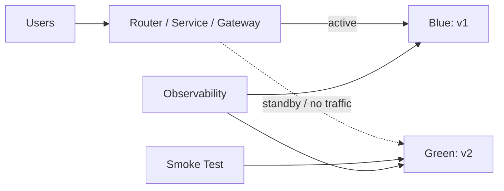

Di Kubernetes, blue-green bisa diimplementasikan dengan beberapa cara:

1. Dua Deployment dan satu Service selector yang diswitch.
2. Dua Service dan Ingress/Gateway switch.
3. Dua namespace/environment.
4. Dua cluster penuh.
5. External load balancer switch.

### 8.1 Service Selector Switch

Blue Deployment:

```yaml
apiVersion: apps/v1
kind: Deployment
metadata:
  name: payments-api-blue
spec:
  replicas: 6
  selector:
    matchLabels:
      app: payments-api
      color: blue
  template:
    metadata:
      labels:
        app: payments-api
        color: blue
        version: v1
    spec:
      containers:
      - name: app
        image: registry.example.com/payments-api:v1
```

Green Deployment:

```yaml
apiVersion: apps/v1
kind: Deployment
metadata:
  name: payments-api-green
spec:
  replicas: 6
  selector:
    matchLabels:
      app: payments-api
      color: green
  template:
    metadata:
      labels:
        app: payments-api
        color: green
        version: v2
    spec:
      containers:
      - name: app
        image: registry.example.com/payments-api:v2
```

Service active ke blue:

```yaml
apiVersion: v1
kind: Service
metadata:
  name: payments-api
spec:
  selector:
    app: payments-api
    color: blue
  ports:
  - name: http
    port: 80
    targetPort: 8080
```

Switch ke green:

```bash
kubectl patch service payments-api -p '{"spec":{"selector":{"app":"payments-api","color":"green"}}}'
```

### 8.2 Kelebihan

- versi baru bisa dites sebelum menerima traffic produksi
- switch traffic cepat
- rollback traffic cepat jika blue masih hidup
- tidak mencampur Pod v1/v2 dalam satu Deployment rollout
- mental model mudah untuk stakeholder

### 8.3 Kekurangan

- butuh kapasitas hampir dua kali lipat
- switch bisa menyebabkan connection disruption jika tidak ada draining
- schema/database tetap shared kecuali environment juga dipisah
- stateful dependency bisa membuat rollback tidak aman
- Service selector switch terlalu kasar untuk gradual exposure

### 8.4 Kapan Cocok

Blue-green cocok untuk:

- release critical dengan smoke test kuat
- aplikasi yang bisa menjalankan dua versi paralel
- sistem yang butuh rollback traffic sangat cepat
- migration app yang tidak butuh traffic percentage bertahap
- environment dengan capacity headroom

### 8.5 Enterprise Variant: Cluster Blue-Green

Untuk sistem critical, blue-green kadang dilakukan di level cluster:

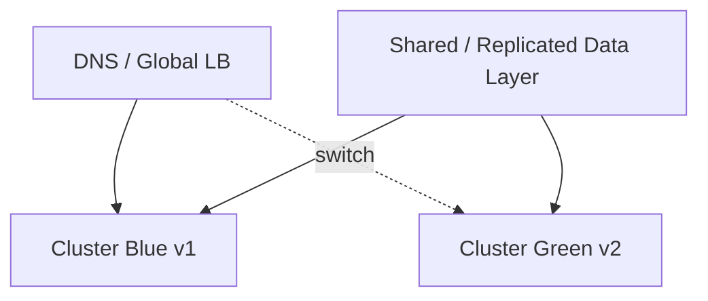

Kelebihan:

- cluster upgrade dan app release bisa divalidasi penuh
- isolasi failure lebih besar
- rollback via global traffic manager

Kekurangan:

- mahal
- data consistency kompleks
- observability lintas cluster wajib matang
- DNS/cache propagation harus dipahami

---

## 9. Canary Deployment

Canary berarti versi baru menerima sebagian kecil traffic atau sebagian kecil user terlebih dahulu. Jika sinyal sehat, exposure dinaikkan bertahap.

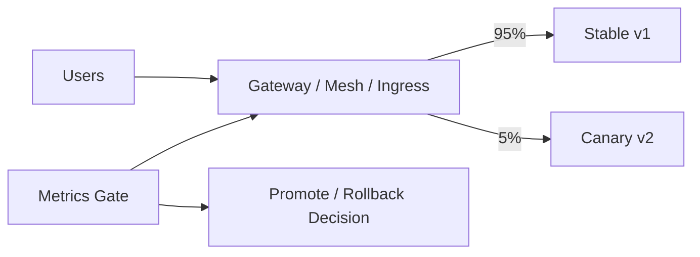

### 9.1 Canary Berbasis Replica Count Saja

Cara sederhana: satu Deployment rolling update dengan replicas bertahap. Namun ini bukan traffic canary presisi.

Contoh manual dengan dua Deployment:

```yaml
apiVersion: apps/v1
kind: Deployment
metadata:
  name: payments-api-stable
spec:
  replicas: 19
  selector:
    matchLabels:
      app: payments-api
      track: stable
  template:
    metadata:
      labels:
        app: payments-api
        track: stable
    spec:
      containers:
      - name: app
        image: registry.example.com/payments-api:v1
---
apiVersion: apps/v1
kind: Deployment
metadata:
  name: payments-api-canary
spec:
  replicas: 1
  selector:
    matchLabels:
      app: payments-api
      track: canary
  template:
    metadata:
      labels:
        app: payments-api
        track: canary
    spec:
      containers:
      - name: app
        image: registry.example.com/payments-api:v2
```

Service memilih keduanya:

```yaml
apiVersion: v1
kind: Service
metadata:
  name: payments-api
spec:
  selector:
    app: payments-api
  ports:
  - name: http
    port: 80
    targetPort: 8080
```

Jika ada 19 Pod stable dan 1 Pod canary, traffic mungkin kira-kira kecil ke canary, tetapi tidak presisi. Per-request distribution bergantung endpoint balancing dan connection behavior.

### 9.2 Canary Berbasis Traffic Routing

Untuk canary presisi, gunakan routing layer:

- Ingress controller yang mendukung canary annotation
- Gateway API dengan weighted backend jika implementation mendukung
- service mesh seperti Istio/Linkerd/Consul
- progressive delivery controller seperti Argo Rollouts atau Flagger
- external traffic manager

Model weighted routing:

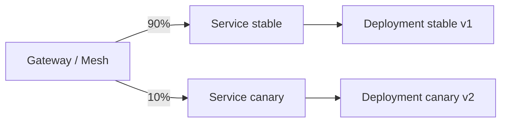

### 9.3 Canary Promotion Ladder

Contoh ladder:

```text
0%  -> deploy canary, no public traffic
1%  -> synthetic + internal traffic
5%  -> low-risk users
10% -> one region / one tenant class
25% -> broader traffic
50% -> half traffic
100% -> promote stable
```

Setiap step harus punya metric gate.

### 9.4 Metric Gate

Canary tanpa metric gate hanyalah rollout manual lambat.

Metric gate minimal:

| Signal | Contoh |
|---|---|
| Availability | success rate, 5xx rate |
| Latency | p50, p95, p99 |
| Saturation | CPU, memory, thread pool, connection pool |
| Error semantics | business error code, validation failure |
| Dependency impact | DB latency, queue lag, downstream error |
| User impact | checkout failure, login failure, payment decline anomaly |

Rule:

```text
Canary should compare canary against baseline, not against a static threshold only.
```

Jika seluruh sistem sedang incident, canary v2 bisa tampak buruk padahal v1 juga buruk. Butuh per-version metric.

### 9.5 Kelebihan

- blast radius kecil
- cocok untuk high-risk change
- rollback exposure cepat
- bisa berbasis data/SLO
- bisa otomatis jika tool matang

### 9.6 Kekurangan

- routing lebih kompleks
- observability harus per version
- low traffic canary bisa kurang signifikan secara statistik
- stateful side effect tetap bisa terjadi
- butuh policy promosi/rollback jelas

---

## 10. Shadow Deployment

Shadow deployment atau traffic mirroring berarti request produksi dikopi ke versi baru, tetapi response versi baru tidak dikirim ke user.

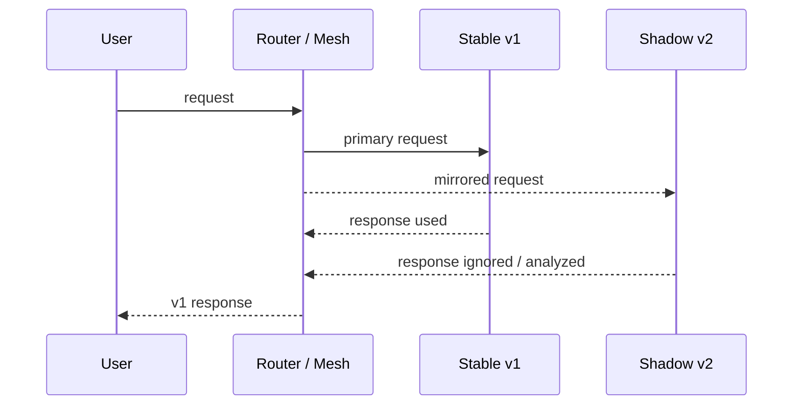

### 10.1 Kapan Cocok

Shadow cocok untuk:

- performance validation
- parser/serializer rewrite
- recommendation model comparison
- new fraud/risk engine dry-run
- read-only API behavior comparison
- migration ke runtime/framework baru

### 10.2 Bahaya Shadow Traffic

Shadow traffic terlihat aman, tetapi bisa berbahaya jika request punya side effect.

Contoh risiko:

- double charge payment
- double send email/SMS
- duplicate order creation
- duplicate audit event
- idempotency key conflict
- downstream quota habis
- fraud engine menerima event palsu

Shadow target harus dibuat **side-effect safe**.

Strategi:

- disable write path
- route dependency ke sandbox
- gunakan dry-run mode
- strip credentials yang bisa menghasilkan side effect
- gunakan idempotency guard
- jangan mirror request sensitif tanpa privacy review

### 10.3 Observability Shadow

Shadow bukan cuma “jalankan v2”. Kita harus membandingkan output.

| Perbandingan | Contoh |
|---|---|
| Status code | v1 200 vs v2 500 |
| Response schema | field missing/extra |
| Business decision | approve vs reject |
| Latency | v2 p95 lebih buruk 40% |
| Resource cost | CPU/request naik 2x |
| Dependency call | query count naik 10x |

Shadow sangat kuat untuk migrasi besar, tetapi hanya jika comparison pipeline disiapkan.

---

## 11. A/B Deployment

A/B deployment mengekspos user ke varian berbeda untuk eksperimen, bukan hanya mitigasi risiko teknis.

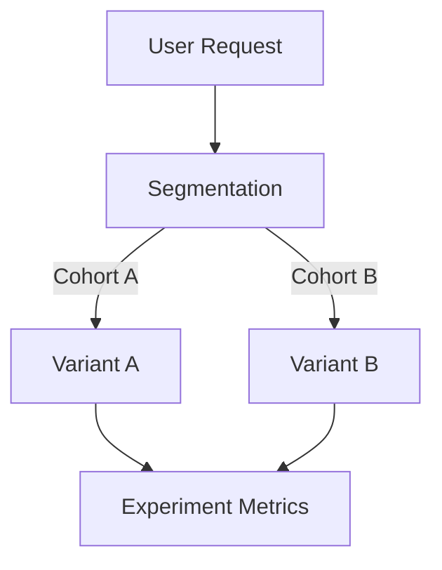

A/B sering lebih cocok dikendalikan oleh feature flag atau experimentation platform daripada Kubernetes routing murni.

### 11.1 A/B vs Canary

| Aspek | Canary | A/B |
|---|---|---|
| Tujuan | Reduce technical release risk | Measure product/business outcome |
| Durasi | Pendek | Bisa lebih panjang |
| Assignment | Traffic percentage atau cohort teknis | User cohort stabil |
| Success metric | Error, latency, SLO | Conversion, retention, engagement |
| Rollback | Stop exposure | End experiment / disable flag |

Canary bertanya:

```text
Apakah versi ini aman dirilis lebih luas?
```

A/B bertanya:

```text
Varian mana yang menghasilkan outcome lebih baik?
```

Jangan gunakan A/B sebagai pengganti canary untuk perubahan teknis berisiko tinggi. Keduanya bisa dipakai bersama, tetapi layer tujuannya berbeda.

---

## 12. Feature Flags sebagai Release Control

Feature flag memisahkan deployment binary dari release behavior.

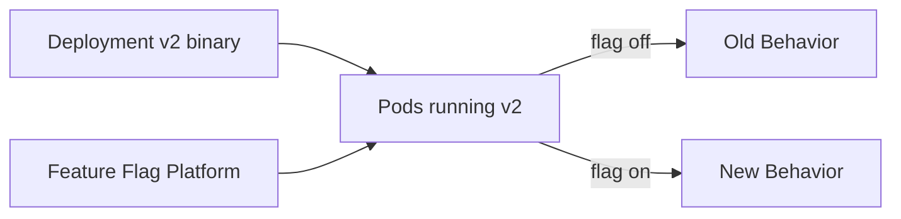

Kelebihan:

- rollback fitur sangat cepat
- exposure per tenant/user/region
- tidak selalu butuh Pod version split
- cocok untuk A/B dan gradual rollout

Kekurangan:

- code path bertambah kompleks
- flag debt bisa menumpuk
- testing matrix lebih besar
- flag service menjadi dependency critical

Rule:

```text
Gunakan feature flag untuk behavior exposure.
Gunakan Kubernetes rollout untuk runtime artifact exposure.
Jangan biarkan flag lama menjadi permanent hidden architecture.
```

---

## 13. Data Compatibility: Bagian yang Sering Merusak Rollback

Release model sehebat apa pun gagal jika data model tidak kompatibel.

Masalah umum:

1. v2 menulis kolom baru yang v1 tidak pahami.
2. v2 mengubah semantic field lama.
3. v2 mengirim event schema baru yang consumer lama gagal parse.
4. v2 menjalankan migration destructive.
5. v2 mengubah cache key format.
6. v2 membuat background job yang memodifikasi state global.

Prinsip database migration untuk release aman:

```text
Expand -> Deploy -> Migrate/Backfill -> Switch -> Contract
```

Contoh:

1. Tambah kolom nullable baru.
2. Deploy app yang bisa membaca field lama dan baru.
3. Backfill data.
4. Aktifkan penggunaan field baru.
5. Setelah semua versi lama hilang, hapus field lama.

Jangan lakukan:

```text
DROP COLUMN + deploy app baru dalam satu release yang harus bisa rollback.
```

Rollback aplikasi tidak bisa mengembalikan data yang sudah dihapus.

---

## 14. Event and API Contract Compatibility

Dalam sistem microservices/event-driven, deployment model harus mempertimbangkan contract.

### 14.1 API Compatibility

Jika v2 mengubah response field:

- apakah client lama toleran terhadap field baru?
- apakah field lama masih ada?
- apakah enum value baru bisa ditangani?
- apakah error code berubah?

### 14.2 Event Compatibility

Jika v2 memproduksi event baru:

- apakah schema backward-compatible?
- apakah consumer lama ignore unknown fields?
- apakah required field berubah?
- apakah semantic event ordering berubah?

Canary bisa mendeteksi error rate producer, tetapi consumer impact mungkin muncul asinkron setelah lag tertentu. Jadi metric gate harus mencakup downstream.

---

## 15. Routing Layers for Release Control

| Layer | Bisa Apa | Keterbatasan |
|---|---|---|
| Kubernetes Service | Select Pod set berdasarkan label | Tidak weighted per version secara native |
| Ingress Controller | HTTP routing, beberapa mendukung canary | Capability tergantung implementation |
| Gateway API | Routing lebih ekspresif dan role-oriented | Weighted/mirroring support tergantung controller |
| Service Mesh | Traffic split, mTLS, retry, mirroring | Kompleksitas operasional tinggi |
| External LB / DNS | Region/cluster switch | Propagation dan granularity terbatas |
| Feature Flag | User/tenant behavior control | Tidak mengontrol runtime traffic antar Pod secara langsung |

Tidak semua organisasi butuh service mesh. Jangan memasang mesh hanya karena ingin canary jika ingress/gateway sudah cukup. Tetapi untuk traffic policy kompleks lintas service, mesh bisa menjadi boundary yang masuk akal.

---

## 16. Choosing the Right Model

Decision tree sederhana:

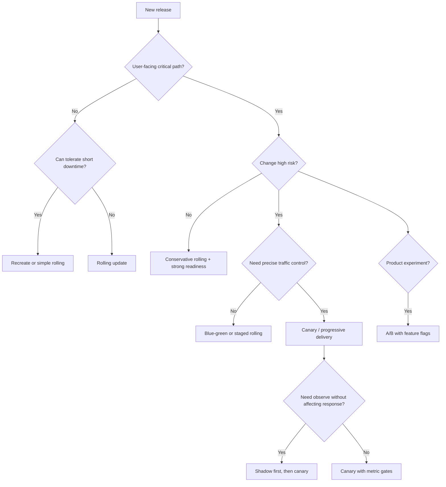

Pertanyaan praktis:

1. Apakah downtime boleh?
2. Apakah dua versi bisa jalan bersamaan?
3. Apakah database migration reversible?
4. Apakah traffic harus dibagi presisi?
5. Apakah kita punya metric per version?
6. Apakah rollback traffic cukup, atau artifact juga harus rollback?
7. Apakah side effect aman?
8. Apakah ada compliance approval?

---

## 17. Release Model by Workload Type

| Workload | Default Strategy | Catatan |
|---|---|---|
| Stateless internal API | Rolling update | Cukup jika contract kompatibel. |
| Public critical API | Canary/progressive | Butuh per-version metrics dan rollback cepat. |
| Payment/authorization | Canary + feature flag + strict gates | Blast radius sangat kecil. |
| Admin internal tool | Recreate/rolling | Tergantung downtime tolerance. |
| Batch worker | Rolling atau partitioned rollout | Perhatikan queue semantics dan idempotency. |
| Consumer event service | Canary by consumer group/partition | Perhatikan lag dan duplicate processing. |
| Stateful DB | Bukan Deployment biasa | Butuh operator/prosedur stateful khusus. |
| ML inference | Shadow → canary → full | Bandingkan latency, cost, accuracy. |
| Edge/gateway service | Blue-green/canary | Routing dan connection draining critical. |

---

## 18. Blast Radius Design

Blast radius adalah batas dampak jika versi baru buruk.

Dimensi blast radius:

| Dimensi | Contoh Pembatasan |
|---|---|
| Replica | 1 Pod canary dari 20 Pod |
| Traffic | 1%, 5%, 10% request |
| User | internal users only |
| Tenant | tenant low-risk |
| Region | satu region kecil |
| Endpoint | hanya endpoint tertentu |
| Feature | hanya fitur tertentu via flag |
| Time | expose 15 menit lalu evaluate |

Maturity tinggi berarti bisa membatasi lebih dari satu dimensi sekaligus.

Contoh:

```text
Expose v2 only to 1% internal-region traffic for read-only endpoints for 30 minutes.
```

Ini jauh lebih aman daripada:

```text
Deploy v2 to all Pods and hope dashboards stay green.
```

---

## 19. Rollback Types

Rollback bukan satu hal.

| Rollback Type | Apa yang Dikembalikan | Kecepatan | Batasan |
|---|---|---:|---|
| Traffic rollback | Routing kembali ke v1 | Sangat cepat | v1 harus masih hidup/sehat |
| Deployment rollback | Pod template kembali ke revision lama | Cepat-sedang | Butuh rollout ulang |
| Feature rollback | Flag off | Sangat cepat | Hanya jika perubahan diflag |
| Config rollback | ConfigMap/Secret/config service balik | Cepat | App harus reload/restart |
| Data rollback | Restore/compensating migration | Lambat/berisiko | Bisa kehilangan data |
| Contract rollback | Kembalikan API/event behavior | Sulit | Client/consumer mungkin sudah adaptasi |

Desain release yang baik berusaha memindahkan rollback dari “data rollback” ke “traffic/feature rollback”.

---

## 20. Example: Safe API Release Plan

Scenario:

```text
payments-api v2 mengubah fraud scoring path.
High-risk, user-facing, payment critical.
```

Rencana aman:

1. Deploy v2 dengan feature flag off.
2. Shadow traffic untuk score computation tanpa mempengaruhi decision.
3. Bandingkan output v1 dan v2.
4. Aktifkan flag untuk internal users.
5. Canary 1% low-risk traffic.
6. Monitor payment success, fraud false positive, latency, downstream error.
7. Naik ke 5%, 10%, 25%, 50%, 100% jika gate sehat.
8. Simpan v1 stable sampai confidence cukup.
9. Bersihkan flag setelah release stabil.

Diagram:

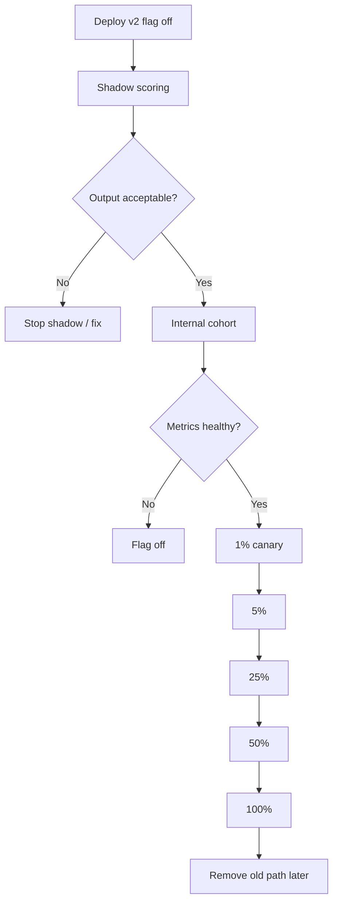

Ini bukan berlebihan untuk domain payment. Untuk blog service internal, mungkin terlalu berat. Maturity adalah memilih process sesuai risiko.

---

## 21. Example: Blue-Green with Smoke Test

Scenario:

```text
public-web v2 upgrade framework, mostly read-only, rollback traffic should be instant.
```

Plan:

1. Blue v1 melayani traffic.
2. Green v2 deploy full replicas tanpa public traffic.
3. Synthetic smoke test ke Green Service.
4. Internal QA traffic ke Green via header atau temporary host.
5. Switch Gateway route ke Green.
6. Monitor 15–30 menit.
7. Jika buruk, route balik ke Blue.
8. Jika sehat, scale down Blue setelah retention window.

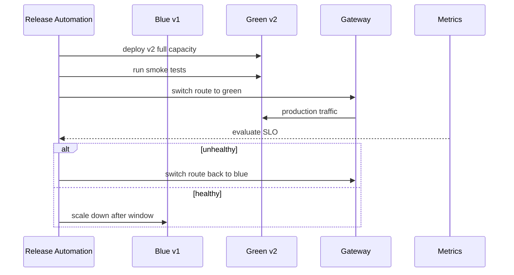

---

## 22. Example: Worker Rollout

Worker release berbeda dari API release karena traffic adalah queue/event, bukan HTTP request.

Risiko:

- duplicate processing
- poison message
- offset commit salah
- message schema tidak kompatibel
- queue lag naik
- downstream write meledak

Strategy:

1. Deploy canary worker dengan consumer group atau partition subset jika memungkinkan.
2. Batasi concurrency.
3. Monitor lag, error, retry, dead-letter queue.
4. Pastikan idempotency.
5. Promote bertahap dengan menaikkan replicas/concurrency.

Kubernetes rolling update hanya mengganti Pod. Ia tidak tahu message semantics. Release safety worker harus dibangun di application dan queue layer.

---

## 23. Observability Requirements by Strategy

| Strategy | Minimal Observability |
|---|---|
| Recreate | uptime, startup success, smoke test |
| Rolling | per-version error/latency if possible, rollout status, readiness failures |
| Blue-Green | blue vs green health, switch event, LB/Gateway metrics |
| Canary | stable vs canary comparison, traffic %, promotion history |
| Shadow | output diff, resource cost, side-effect guard, ignored response error |
| A/B | experiment assignment, conversion metric, guardrail metric |

Without observability, advanced release models become theatre.

```text
A canary that no one measures is just a partial outage waiting to be promoted.
```

---

## 24. Governance: Who Can Promote?

Dalam platform enterprise, release model juga policy problem.

Pertanyaan governance:

- Apakah developer boleh promote ke 100% tanpa approval?
- Apakah high-risk service butuh SRE approval?
- Apakah release freeze berlaku?
- Apakah rollback bisa dilakukan siapa pun saat incident?
- Apakah metric gate bisa dioverride?
- Apakah override harus audited?
- Apakah tenant regulated butuh deployment evidence?

Governance yang baik tidak harus memperlambat semua release. Ia harus membedakan risiko.

Contoh policy:

| Risk Tier | Strategy | Approval | Automation |
|---|---|---|---|
| Low | Rolling | team-owned | auto deploy |
| Medium | Rolling + smoke | team-owned | auto with rollback alert |
| High | Canary | service owner + SRE | metric gate required |
| Critical | Shadow + canary + manual gate | change approval | audited promotion |

---

## 25. Common Anti-Patterns

| Anti-pattern | Dampak |
|---|---|
| Menyebut rolling update sebagai canary | False sense of traffic control |
| Canary tanpa metric per version | Tidak bisa membandingkan stable vs canary |
| Blue-green dengan shared destructive migration | Rollback traffic tidak menyelamatkan data |
| Shadow traffic dengan side effect aktif | Duplicate writes/charges/events |
| A/B untuk perubahan teknis unstable | User experiment berubah jadi incident |
| Feature flag tanpa cleanup | Flag debt dan complexity meningkat |
| Service selector switch tanpa drain | Connection/request drop |
| Semua service dipaksa pakai strategi sama | Overengineering untuk low-risk, underengineering untuk high-risk |
| Rollback plan hanya “kubectl rollout undo” | Mengabaikan data, contract, cache, queue |

---

## 26. Release Readiness Checklist

Sebelum production release, jawab:

### Strategy Fit

- Apakah strategi sesuai risk tier?
- Apakah downtime boleh?
- Apakah dua versi bisa hidup bersamaan?
- Apakah routing layer mendukung strategi yang dipilih?

### State and Contract

- Apakah DB migration backward-compatible?
- Apakah event schema kompatibel?
- Apakah API client lama aman?
- Apakah cache key/versioning aman?

### Traffic and Blast Radius

- Berapa exposure awal?
- Bagaimana promotion step?
- Siapa/apa yang memutuskan promote?
- Bagaimana stop exposure?

### Observability

- Apakah metrics per version ada?
- Apakah dashboard stable vs candidate tersedia?
- Apakah alert gate jelas?
- Apakah logs mengandung version/build metadata?

### Rollback

- Apakah rollback traffic bisa cepat?
- Apakah v1 tetap running?
- Apakah feature bisa dimatikan?
- Apakah data rollback diperlukan?
- Apakah runbook sudah diuji?

---

## 27. Practice Drill: Pilih Strategi

### Case 1 — Internal Report UI

```text
Low traffic, internal, read-only, downtime 2 menit bisa diterima.
```

Strategi masuk akal:

- Recreate atau rolling sederhana
- smoke test setelah deploy
- rollback via Deployment undo

Jangan overengineer canary jika cost lebih tinggi daripada risiko.

### Case 2 — Public Login API

```text
High traffic, user-facing, latency sensitive, downtime tidak boleh.
```

Strategi masuk akal:

- conservative rolling untuk low-risk patch
- canary untuk high-risk auth logic
- metrics: login success, 4xx/5xx anomaly, p99 latency
- rollback traffic/feature flag

### Case 3 — Payment Scoring Engine

```text
Critical decision service, perubahan model risiko, false decline mahal.
```

Strategi masuk akal:

- shadow mode dulu
- compare decisions
- canary by low-risk cohort
- feature flag for decision activation
- audit every promotion

### Case 4 — Kafka Consumer Migrasi Schema

```text
Event consumer membaca schema baru dan menulis aggregate state.
```

Strategi masuk akal:

- deploy consumer yang backward-compatible
- canary by partition/group jika memungkinkan
- monitor lag, DLQ, processing error
- idempotency wajib
- jangan hanya mengandalkan rolling Deployment

---

## 28. Mental Model Final

Release model adalah cara mengontrol risiko perubahan software. Kubernetes Deployment memberi primitive penting, tetapi tidak otomatis memberi strategi release matang.

Invariants:

1. Recreate memprioritaskan simplicity, mengorbankan availability.
2. Rolling update memprioritaskan continuity, tetapi tidak memberi traffic percentage presisi.
3. Blue-green memprioritaskan fast switch/rollback, mengorbankan capacity.
4. Canary memprioritaskan blast-radius reduction, membutuhkan observability dan routing.
5. Shadow memprioritaskan learning without response impact, tetapi harus side-effect safe.
6. A/B memprioritaskan product learning, bukan terutama technical risk mitigation.
7. Feature flag memisahkan deploy dan release behavior.
8. Data compatibility menentukan apakah rollback benar-benar aman.

Kalimat paling penting:

```text
A release strategy is not safe because it has a name.
It is safe only when its failure modes are bounded, observable, and reversible.
```

---

## 29. Referensi Resmi

- Kubernetes Documentation — Deployments: `https://kubernetes.io/docs/concepts/workloads/controllers/deployment/`
- Kubernetes Documentation — Managing Workloads / Rollouts: `https://kubernetes.io/docs/concepts/workloads/management/`
- Kubernetes Task — Update a Deployment Without Downtime: `https://kubernetes.io/docs/tasks/run-application/update-deployment-rolling/`
- Kubernetes API Reference — Deployment v1: `https://kubernetes.io/docs/reference/kubernetes-api/apps/deployment-v1/`
- Kubernetes Documentation — Services: `https://kubernetes.io/docs/concepts/services-networking/service/`
- Kubernetes Documentation — Gateway API: `https://kubernetes.io/docs/concepts/services-networking/gateway/`

---

## 30. Ringkasan Part 010

Di part ini kita memisahkan deployment, release, dan exposure. Kubernetes Deployment native mendukung `RollingUpdate` dan `Recreate`, tetapi strategi production seperti blue-green, canary, shadow, dan A/B membutuhkan routing, observability, feature flag, compatibility design, dan governance tambahan.

Setelah part ini, kita harus bisa:

- memilih deployment model berdasarkan risiko, bukan tren
- menjelaskan batas native Deployment strategy
- mendesain rolling update yang sadar capacity/availability
- merancang blue-green dengan switch dan rollback yang jelas
- merancang canary dengan metric gate
- memahami risiko shadow traffic
- membedakan canary dan A/B
- menilai apakah rollback benar-benar aman dari sisi data dan contract

Part berikutnya akan masuk lebih dalam ke **progressive delivery**: automated canary, metric gates, traffic shifting, promotion policy, dan blast-radius control sebagai sistem operasional.
