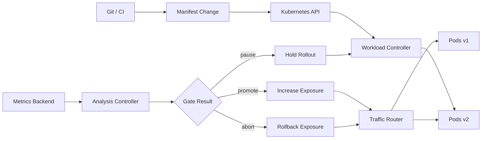
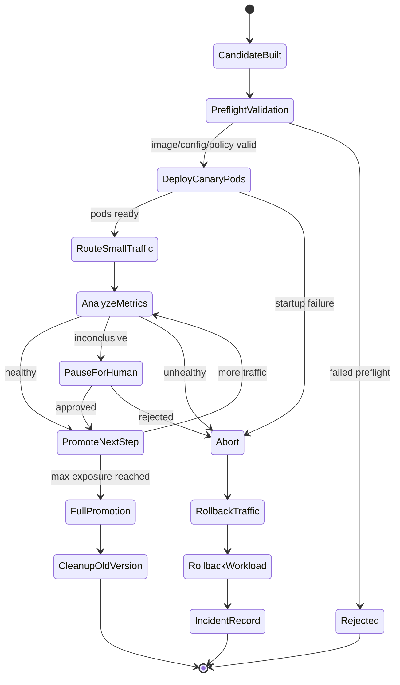
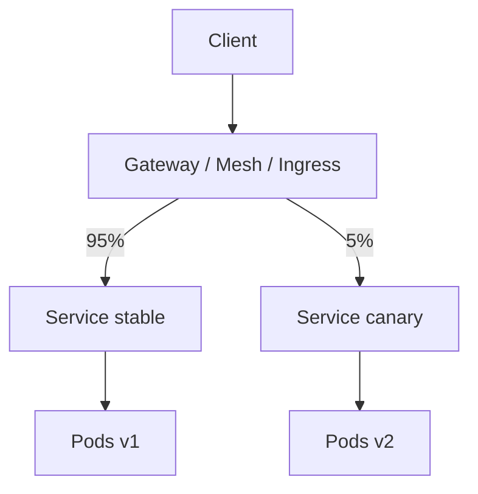
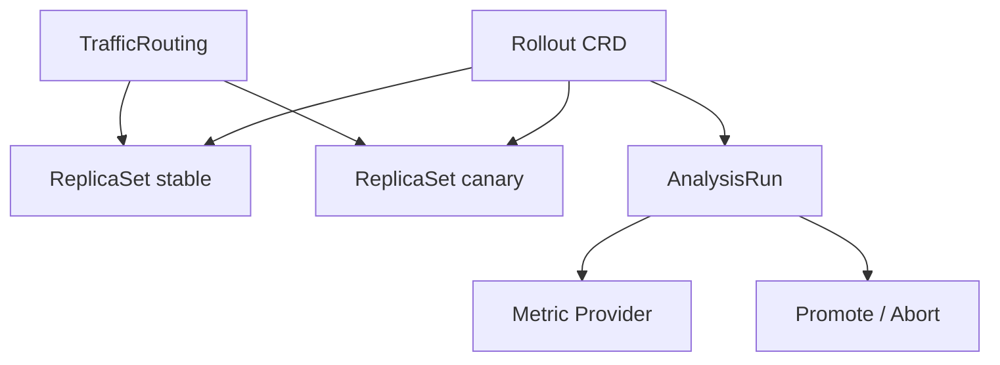
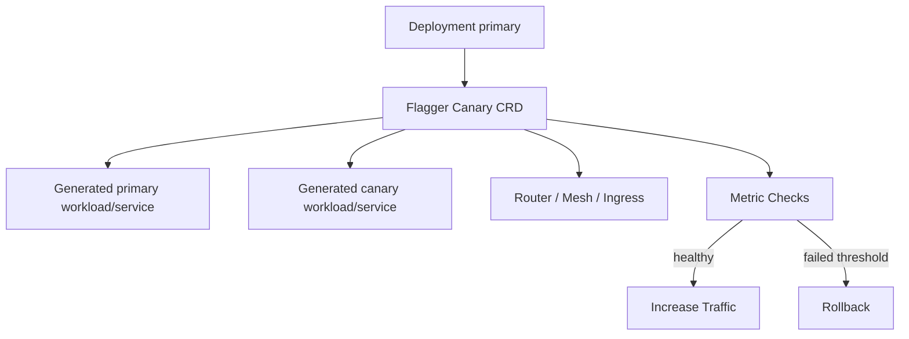
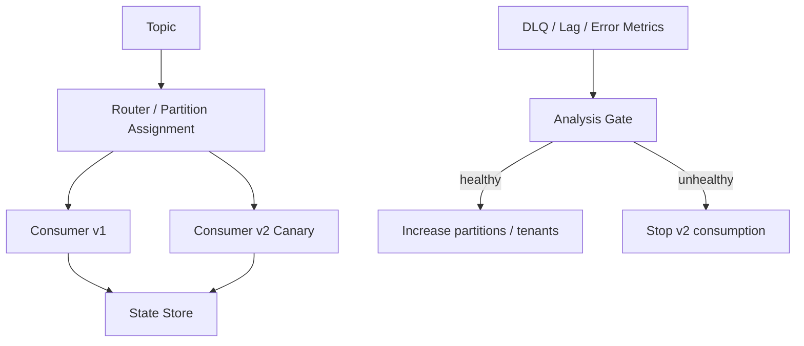
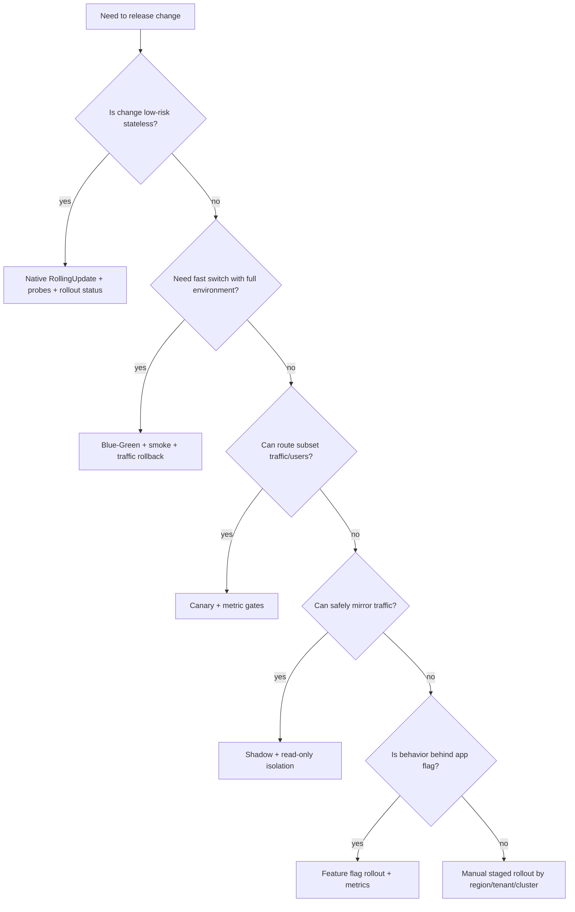

------
title: Learn Kubernetes, Deployment Model, and Cloud Native Platform Engineering - Part 011
description: Progressive delivery dan rollout safety di Kubernetes: canary automation, metric gates, traffic shifting, rollback policy, blast radius, dan failure modelling production.
series: learn-kubernetes-deployment-model
seriesTitle: Learn Kubernetes, Deployment Model, and Cloud Native Platform Engineering
order: 11
partTitle: Progressive Delivery and Rollout Safety
tags:
- kubernetes
- progressive-delivery
- canary
- rollout-safety
- release-engineering
- sre
- platform-engineering
- series
date: 2026-07-01
---

# Part 011 — Progressive Delivery and Rollout Safety

> Tujuan part ini adalah membuat kita mampu merancang deployment yang **bergerak bertahap berdasarkan bukti**, bukan berdasarkan keberanian. Kubernetes memberi primitive rollout. Progressive delivery memberi sistem kontrol risiko di atas rollout.

Progressive delivery adalah praktik mengekspos perubahan ke production secara bertahap, mengukur sinyal kesehatan, lalu memutuskan apakah perubahan dipromosikan, dipause, atau dibatalkan. Di Kubernetes, progressive delivery biasanya melibatkan kombinasi beberapa lapisan:

- workload controller: `Deployment`, `ReplicaSet`, atau CRD seperti `Rollout`;
- traffic router: `Service`, `Ingress`, Gateway API, service mesh, atau load balancer;
- metric source: Prometheus, Datadog, CloudWatch, New Relic, OpenTelemetry backend;
- policy engine: analysis template, automated gate, manual approval, change window;
- rollback mechanism: traffic rollback, object rollback, feature flag disable, atau compensating action.

Mental model sederhana:

```text
Rolling update replaces pods gradually.
Progressive delivery exposes risk gradually.
```

Rolling update menjawab “berapa Pod lama diganti Pod baru”. Progressive delivery menjawab “siapa atau apa yang terkena perubahan, kapan, seberapa besar, berdasarkan bukti apa, dan bagaimana berhenti dengan aman”.

---

## 1. Kaufman Deconstruction: Skill yang Harus Dipraktikkan

Untuk menguasai progressive delivery, jangan mulai dari tool. Mulai dari sub-skill.

| Sub-skill | Pertanyaan Operasional |
|---|---|
| Risk decomposition | Apa risiko perubahan ini: availability, correctness, latency, security, data, cost, compliance? |
| Exposure modelling | Unit exposure apa yang aman: request, user, tenant, region, shard, feature, queue consumer? |
| Traffic control | Layer mana yang bisa membagi traffic secara presisi? |
| Metric design | Sinyal apa yang membuktikan versi baru sehat dalam window pendek? |
| Analysis gate | Apa threshold promosi, pause, atau abort? |
| Rollback semantics | Apa yang dirollback: traffic, Pod, config, feature flag, migration, data? |
| Failure isolation | Bagaimana mencegah canary merusak shared state? |
| Automation boundary | Mana yang otomatis, mana butuh human approval? |
| Auditability | Bukti apa yang tersimpan untuk post-incident dan compliance? |

Kaufman-style target skill:

```text
Dalam 20 jam pertama praktik serius, kita harus bisa:
1. memilih strategi progressive delivery yang cocok untuk workload tertentu;
2. menulis rollout plan dengan metric gate dan rollback rule;
3. membaca status rollout dan membedakan kegagalan aplikasi vs kegagalan routing;
4. mendesain blast radius yang eksplisit;
5. menjelaskan kenapa sebuah deployment aman atau tidak aman untuk auto-promotion.
```

---

## 2. Progressive Delivery Bukan Sekadar Canary

Canary adalah salah satu strategi. Progressive delivery adalah discipline yang lebih luas.

| Pola | Inti | Cocok Untuk | Risiko Utama |
|---|---|---|---|
| Rolling update with gates | Replace Pod bertahap, pause jika buruk | service stateless low-risk | traffic tidak benar-benar weighted |
| Canary | expose sebagian traffic/user ke versi baru | high-change API, UI, backend service | metric noise, small sample bias |
| Blue-green with smoke gate | switch environment aktif setelah validasi | release besar, upgrade platform | double capacity, state divergence |
| Shadow traffic | kirim copy request ke versi baru tanpa response user | behavior comparison, perf test | side effect harus dinonaktifkan |
| A/B | expose cohort untuk eksperimen produk | product experiment | bukan safety mechanism murni |
| Feature-flag rollout | expose behavior secara gradual dalam app | fitur business logic | config drift, stale flags |
| Regional rollout | deploy per region/cluster | global systems | regional dependency mismatch |
| Tenant rollout | deploy per tenant/group | SaaS enterprise | schema/data compatibility antar tenant |

Rule praktis:

```text
Canary is about safe exposure.
A/B is about product learning.
Shadow is about observation without serving.
Blue-green is about fast switch.
Rolling update is about replacement mechanics.
```

Jangan memakai A/B testing sebagai safety gate kecuali metric operasional tetap menjadi gate utama. Product conversion naik tidak berarti error handling, latency, data integrity, atau cost aman.

---

## 3. Native Kubernetes Boundary

Kubernetes `Deployment` native mendukung `RollingUpdate`, `Recreate`, rollout status, pause/resume, dan rollback revision. Tetapi Kubernetes native tidak secara otomatis menyediakan:

- weighted HTTP traffic split;
- per-user cohort routing;
- automated metric analysis;
- baseline-vs-canary comparison;
- analysis template;
- traffic mirroring;
- request-level rollback;
- business metric gates;
- automatic promotion berdasarkan Prometheus query.

Karena itu progressive delivery biasanya butuh tool tambahan atau arsitektur routing tambahan.



Dalam platform engineering, boundary ini penting karena menentukan ownership:

| Layer | Owner Bias | Contoh Keputusan |
|---|---|---|
| Application team | release intent, metric semantics, business correctness | error budget, validation query, feature flag |
| Platform team | router, controller, policy, observability substrate | Argo Rollouts, Flagger, Gateway, Prometheus |
| SRE | SLO, incident rule, safe automation | abort threshold, burn rate, alert coupling |
| Security/compliance | approval, audit, policy guardrail | prod promotion policy, signed image gate |

---

## 4. The Rollout Safety State Machine

Rollout safety harus dipikirkan sebagai state machine, bukan script linear.



Minimal state yang harus disimpan untuk audit:

- artifact version: image digest, SBOM/provenance reference;
- config version: ConfigMap/Secret revision or Git commit;
- rollout strategy: canary/blue-green/etc;
- exposure steps: 1%, 5%, 25%, 50%, 100% atau equivalent;
- gate metrics and thresholds;
- gate result per step;
- manual override decision;
- rollback reason jika terjadi abort;
- incident/change record ID.

---

## 5. Blast Radius: Dimensi yang Harus Didesain

Banyak engineer mendesain canary hanya sebagai persen traffic. Itu terlalu sempit. Blast radius bisa dibatasi di banyak dimensi.

| Dimensi | Contoh | Kapan Dipakai |
|---|---|---|
| Request percentage | 1% HTTP traffic | service stateless high-QPS |
| User cohort | internal users, beta users | UI/API behavior visible |
| Tenant | tenant non-critical dulu | SaaS B2B |
| Region | ap-southeast-1 dulu | multi-region service |
| Cluster | staging-prod-edge cluster dulu | multi-cluster fleet |
| AZ/node pool | subset node pool | infra/runtime upgrade |
| API route | `/v2/search` saja | route-specific logic |
| Message topic | one topic/partition/shard | event-driven systems |
| Feature surface | satu feature flag | application-level rollout |
| Data shard | shard 01 only | stateful/data-heavy systems |

Prinsip:

```text
Persentase traffic hanya aman jika traffic cukup homogen.
Jika risiko tersembunyi di tenant, data shape, region, route, atau dependency, maka canary by percentage dapat memberikan false confidence.
```

Contoh buruk:

```text
1% traffic global terlihat sehat,
tetapi 1% itu hampir tidak pernah menyentuh tenant enterprise terbesar,
route paling berat,
atau data shape yang memicu bug.
```

Contoh lebih kuat:

```text
Canary step 1: internal users only.
Canary step 2: low-risk tenants on non-critical routes.
Canary step 3: representative high-volume route with strict metric gates.
Canary step 4: one region.
Canary step 5: global promotion.
```

---

## 6. Traffic Shifting Models

Traffic shifting harus disesuaikan dengan layer yang punya informasi routing.

### 6.1 Kubernetes Service Selector

Native `Service` memilih Pod berdasarkan selector. Ini cocok untuk stable endpoint, tetapi tidak memberi weighted split yang presisi.

```yaml
apiVersion: v1
kind: Service
metadata:
  name: payment-api
spec:
  selector:
    app.kubernetes.io/name: payment-api
  ports:
    - name: http
      port: 80
      targetPort: 8080
```

Jika selector match Pod v1 dan v2 sekaligus, traffic akan tersebar di endpoint yang tersedia, tetapi bukan canary policy yang kaya. Ia tidak tahu user cohort, route, header, SLO, atau weighted percentage berbasis policy.

### 6.2 Ingress / Gateway / Mesh Weighted Routing

Weighted routing biasanya terjadi di:

- ingress controller;
- Gateway API implementation;
- service mesh seperti Istio/Linkerd/Kuma;
- cloud load balancer;
- API gateway;
- progressive delivery controller yang mengubah route object.

Konsepnya:



Design invariant:

```text
Traffic split harus berada di layer yang bisa mengamati dan mengontrol exposure unit yang kita butuhkan.
```

Jika butuh routing berdasarkan header, Service selector tidak cukup. Jika butuh mTLS policy, mesh mungkin relevan. Jika hanya butuh pod replacement rendah risiko, Deployment rolling update cukup.

---

## 7. Metric Gates: Apa yang Layak Jadi Bukti?

Metric gate adalah jantung progressive delivery. Tanpa gate, canary hanya “deploy pelan-pelan sambil berharap”.

### 7.1 Golden Signals

Minimum metric operasional:

| Signal | Contoh Query/Indikator | Catatan |
|---|---|---|
| Availability | success rate, 5xx rate, non-2xx by route | pisahkan client error vs server error |
| Latency | p50/p95/p99 histogram | p99 sering lebih sensitif untuk regression |
| Traffic | request rate, active connections | sample size harus cukup |
| Saturation | CPU, memory, queue depth, thread pool, DB pool | masalah sering muncul sebagai saturation dulu |

### 7.2 Correctness Signals

Metric availability tidak cukup. Banyak bug menghasilkan response 200 tetapi salah secara bisnis.

Tambahkan:

- validation failure rate;
- business rule rejection abnormal;
- payment authorization mismatch;
- order state transition invalid;
- duplicate event emission;
- reconciliation backlog;
- data consistency violation;
- consumer lag;
- dead-letter queue growth;
- cache miss explosion;
- downstream contract error.

Untuk sistem regulatory/case management, correctness gate lebih penting daripada sekadar HTTP 5xx:

```text
Apakah state transition tetap legal?
Apakah audit trail lengkap?
Apakah escalation SLA tidak rusak?
Apakah evidence lifecycle tidak kehilangan causal chain?
Apakah action idempotency tetap benar?
```

### 7.3 Short-Window vs Long-Window Metrics

Progressive delivery butuh metric yang bisa memberi sinyal dalam waktu pendek. Namun terlalu pendek membuat noise tinggi.

| Window | Kegunaan | Risiko |
|---|---|---|
| 1–2 menit | fast abort untuk crash/error besar | noisy, sample kecil |
| 5–15 menit | canary step umum | masih bisa miss low-frequency bug |
| 30–60 menit | higher confidence | release lambat |
| multi-day | behavior/product validation | bukan cocok untuk automated rollout controller singkat |

Rule praktis:

```text
Gunakan short-window metrics untuk safety.
Gunakan long-window metrics untuk learning.
Jangan mencampur keduanya dalam satu gate otomatis tanpa desain jelas.
```

---

## 8. Canary Analysis Design

Canary analysis membandingkan sinyal dari versi baru terhadap threshold absolut atau baseline.

### 8.1 Absolute Threshold

Contoh:

```text
abort if 5xx_rate > 1%
abort if p99_latency > 750ms
abort if cpu_throttling > 10%
abort if dlq_events > 0
```

Kelebihan:

- mudah dipahami;
- cocok untuk invariant keras;
- baik untuk compliance dan safety.

Kelemahan:

- tidak adaptif terhadap kondisi traffic normal yang memang buruk;
- bisa gagal saat baseline juga sedang terdegradasi.

### 8.2 Baseline Comparison

Contoh:

```text
abort if canary_5xx_rate > stable_5xx_rate + 0.5%
abort if canary_p99 > stable_p99 * 1.25
```

Kelebihan:

- membandingkan versi dalam kondisi production yang sama;
- lebih adil saat environment noisy.

Kelemahan:

- butuh label metrics yang konsisten;
- baseline juga bisa buruk;
- sample size canary sering kecil.

### 8.3 Composite Gate

Di production mature, gate biasanya composite:

```text
Promote only if:
- canary pods Ready and Available;
- request volume >= minimum sample;
- 5xx rate <= threshold;
- p95/p99 latency within budget;
- saturation not increasing abnormally;
- business correctness metric healthy;
- no critical logs/events matched;
- no active high-severity alert for dependency.
```

Composite gate harus hati-hati: semakin banyak metric, semakin besar kemungkinan false negative. Gunakan metric yang memang decision-relevant.

---

## 9. Sample Size Problem

Canary 1% dari traffic hanya berguna jika 1% itu cukup besar.

Contoh:

| Traffic Service | 1% Canary | Interpretasi |
|---|---:|---|
| 100,000 req/min | 1,000 req/min | sinyal cepat cukup kuat |
| 1,000 req/min | 10 req/min | banyak bug bisa lolos |
| 100 req/hour | 1 req/hour | canary percentage hampir tidak berarti |

Untuk low-traffic service, gunakan strategi lain:

- synthetic traffic;
- internal cohort;
- contract test against production-like data;
- shadow traffic;
- longer analysis window;
- manual validation;
- route-specific replay;
- staged tenant rollout.

Invariant:

```text
No sample, no signal.
No signal, no safe automation.
```

---

## 10. Rollback: Traffic Rollback vs Workload Rollback

Rollback bukan satu hal.

| Rollback Type | Apa yang Diubah | Kecepatan | Kapan Cocok |
|---|---|---:|---|
| Traffic rollback | route traffic kembali ke stable | sangat cepat | canary/blue-green dengan router control |
| Workload rollback | Deployment/Rollout kembali ke revision lama | sedang | rolling update native |
| Feature rollback | flag disable | sangat cepat | behavior behind flag |
| Config rollback | ConfigMap/Secret revision revert | sedang | runtime config issue |
| Data rollback | revert/repair data | lambat/berisiko | migration/data corruption |
| Compensating action | forward fix | variatif | irreversible operation |

Prinsip production:

```text
Prefer rollback yang mengurangi exposure tanpa mengubah state lebih banyak.
```

Jika versi baru sudah menjalankan irreversible database migration atau menulis event incompatible, rollback Pod saja mungkin membuat sistem lebih rusak. Karena itu progressive delivery harus didahului compatibility design.

---

## 11. Data and Schema Compatibility Gate

Deployment baru jarang hanya mengganti compute. Ia sering menyentuh data.

Checklist sebelum canary:

| Area | Pertanyaan |
|---|---|
| Database schema | Apakah v1 dan v2 bisa berjalan bersamaan? |
| Migration | Apakah migration backward-compatible? |
| Event schema | Apakah consumer lama bisa membaca event baru? |
| API contract | Apakah client lama masih valid? |
| Cache | Apakah key format berubah? |
| Idempotency | Apakah retry dari dua versi tetap aman? |
| Audit | Apakah audit format tetap lengkap? |
| Authorization | Apakah permission model berubah? |
| State machine | Apakah state transition baru kompatibel dengan old worker? |

Safe deployment pattern:

```text
Expand -> Deploy -> Migrate/Backfill -> Switch -> Contract -> Cleanup
```

Contoh database:

1. Tambahkan kolom nullable baru.
2. Deploy kode yang bisa membaca old/new format.
3. Backfill data.
4. Aktifkan write path baru.
5. Pastikan semua consumer kompatibel.
6. Setelah aman, hapus field lama pada release terpisah.

Jangan campur perubahan destructive dengan canary compute dalam satu langkah.

---

## 12. Progressive Delivery with Argo Rollouts

Argo Rollouts adalah controller Kubernetes dan sekumpulan CRD yang menyediakan kemampuan deployment lanjutan seperti blue-green, canary, canary analysis, experiment, dan progressive delivery.

Model konseptual:



Resource inti:

| Resource | Fungsi |
|---|---|
| `Rollout` | pengganti/alternatif Deployment untuk strategy advanced |
| `AnalysisTemplate` | template metric gate |
| `AnalysisRun` | eksekusi analysis aktual |
| `Experiment` | menjalankan beberapa ReplicaSet untuk eksperimen terkontrol |
| traffic routing integration | mengubah router/mesh/ingress untuk weight traffic |

Contoh struktur canary konseptual:

```yaml
apiVersion: argoproj.io/v1alpha1
kind: Rollout
metadata:
  name: payment-api
spec:
  replicas: 10
  selector:
    matchLabels:
      app.kubernetes.io/name: payment-api
  template:
    metadata:
      labels:
        app.kubernetes.io/name: payment-api
    spec:
      containers:
        - name: app
          image: registry.example.com/payment-api:2.4.0
          ports:
            - containerPort: 8080
  strategy:
    canary:
      steps:
        - setWeight: 5
        - pause:
            duration: 5m
        - analysis:
            templates:
              - templateName: payment-api-slo-check
        - setWeight: 25
        - pause:
            duration: 10m
        - setWeight: 50
        - pause:
            duration: 10m
```

Contoh `AnalysisTemplate` konseptual:

```yaml
apiVersion: argoproj.io/v1alpha1
kind: AnalysisTemplate
metadata:
  name: payment-api-slo-check
spec:
  metrics:
    - name: success-rate
      interval: 1m
      count: 5
      successCondition: result[0] >= 0.995
      failureLimit: 1
      provider:
        prometheus:
          address: http://prometheus.monitoring.svc.cluster.local:9090
          query: |
            sum(rate(http_requests_total{app="payment-api",status!~"5.."}[2m]))
            /
            sum(rate(http_requests_total{app="payment-api"}[2m]))
```

Important design note:

```text
Argo Rollouts can automate promotion, but it cannot invent correct metrics.
The hard engineering work is metric semantics, compatibility, and blast-radius design.
```

---

## 13. Progressive Delivery with Flagger

Flagger adalah progressive delivery tool dalam ekosistem Flux yang dapat melakukan canary, A/B testing, blue-green, traffic mirroring, automated analysis, promotion, dan rollback menggunakan ingress controller atau service mesh serta metric backend.

Model konseptual:



Contoh konseptual:

```yaml
apiVersion: flagger.app/v1beta1
kind: Canary
metadata:
  name: payment-api
spec:
  targetRef:
    apiVersion: apps/v1
    kind: Deployment
    name: payment-api
  progressDeadlineSeconds: 600
  service:
    port: 80
    targetPort: 8080
  analysis:
    interval: 1m
    threshold: 5
    maxWeight: 50
    stepWeight: 10
    metrics:
      - name: request-success-rate
        thresholdRange:
          min: 99
        interval: 1m
      - name: request-duration
        thresholdRange:
          max: 500
        interval: 1m
```

Flagger-style thinking cocok jika organisasi sudah memakai GitOps dan ingin release automation yang mengikat workload, router, metrics, dan alerting.

---

## 14. Manual Gate vs Automated Gate

Tidak semua gate harus otomatis. Tidak semua approval harus manual.

| Gate Type | Cocok Untuk | Anti-pattern |
|---|---|---|
| Automated preflight | lint, policy, image signature, unit/contract test | human approval untuk hal deterministic |
| Automated canary metrics | clear SLO, high traffic, stable metric | metric tidak reliable tapi tetap auto-promote |
| Manual approval | high-risk change, compliance, migration | approval tanpa evidence |
| Time window gate | market hours, regulatory freeze, low-support hours | freeze permanen tanpa risk model |
| Incident-aware gate | block deploy saat SEV active | ignore degraded dependency |

Pattern yang baik:

```text
Machine checks what machines can verify.
Humans decide trade-offs when evidence is incomplete or risk is socio-technical.
```

---

## 15. Readiness, Liveness, Startup Probe as Rollout Gates

Probe bukan progressive delivery, tetapi menjadi input penting.

| Probe | Fungsi | Rollout Implication |
|---|---|---|
| `startupProbe` | memberi waktu aplikasi start tanpa dianggap dead | mencegah restart prematur saat cold start |
| `readinessProbe` | menentukan apakah Pod menerima traffic | gate minimum sebelum exposure |
| `livenessProbe` | restart container yang stuck | bisa memperburuk incident jika terlalu agresif |

Readiness harus merepresentasikan kemampuan melayani request, bukan sekadar process hidup.

Contoh readiness yang terlalu dangkal:

```text
GET /healthz returns 200 if process alive.
```

Lebih baik:

```text
GET /readyz returns 200 if:
- HTTP server ready;
- required config loaded;
- database pool initialized;
- critical dependency mode known;
- migration compatibility confirmed;
- app can accept traffic without corrupting state.
```

Namun jangan membuat readiness terlalu dependent pada semua downstream sehingga Pod sering keluar-masuk endpoint saat dependency minor flapping. Pisahkan:

- readiness untuk menerima traffic;
- health endpoint untuk diagnostics;
- dependency metrics untuk alerting;
- circuit breaker untuk degradation.

---

## 16. Rollout Safety and HPA Interaction

HPA dapat berinteraksi aneh dengan canary.

Problem umum:

| Problem | Penyebab | Dampak |
|---|---|---|
| canary under-sampled | HPA scale kecil, traffic kecil | metric tidak signifikan |
| canary overloaded | weight naik lebih cepat daripada scale | false negative latency/error |
| stable/canary imbalance | traffic split dan replica split tidak aligned | unfair comparison |
| metric contamination | metrics tidak label by version | analysis salah |
| cold start penalty | canary baru belum warm | latency lebih buruk sementara |

Mitigasi:

- label metrics dengan `version`, `pod-template-hash`, atau release label yang stabil;
- pastikan canary replica cukup untuk traffic step;
- pakai warm-up pause sebelum analysis;
- monitor CPU throttling dan memory pressure;
- hindari auto-promotion saat HPA belum stabil;
- desain minReplicas untuk canary high-QPS.

---

## 17. Progressive Delivery for Async/Event-Driven Workloads

HTTP canary lebih mudah karena traffic bisa diarahkan. Worker/consumer lebih sulit karena exposure terjadi melalui queue/topic/partition.

Exposure model untuk async:

| Unit | Contoh |
|---|---|
| consumer group | v2 consumer group terpisah |
| partition | hanya partition subset dikonsumsi v2 |
| topic | topic canary/sandbox |
| message type | event tertentu saja |
| tenant key | tenant tertentu diarahkan ke worker v2 |
| feature flag | handler baru aktif untuk subset |

Failure mode async:

- duplicate processing;
- poison message;
- reordering;
- idempotency break;
- offset commit terlalu cepat;
- dead-letter meningkat;
- consumer lag meningkat;
- event schema incompatible;
- rollback sulit karena message sudah diproses.

Canary gate untuk worker:

```text
Promote worker v2 only if:
- consumer lag does not increase abnormally;
- processing error rate below threshold;
- DLQ count remains zero or within budget;
- duplicate detection remains normal;
- processing latency stays within SLA;
- downstream write failure rate normal;
- idempotency violation metric zero.
```

Pattern:



---

## 18. Shadow Traffic Safety

Shadow traffic mengirim copy request ke versi baru tanpa menggunakan response-nya untuk user.

Cocok untuk:

- performance comparison;
- parser/validator behavior comparison;
- ML inference comparison;
- dependency compatibility;
- observability before release.

Bahaya utama: side effect.

Shadow target harus mencegah:

- write ke production database;
- external call yang mengubah state;
- payment/auth/email/SMS real action;
- event emission ke topic production;
- audit log yang terlihat sebagai action nyata;
- rate limit terhadap downstream;
- duplicate transaction.

Safety pattern:

```text
Shadow mode must be read-only or side-effect isolated.
```

Jika tidak bisa dijamin, shadow traffic berbahaya.

---

## 19. Blue-Green Safety

Blue-green sering dianggap lebih aman karena switch cepat. Tetapi blue-green punya risiko berbeda:

| Risiko | Penjelasan |
|---|---|
| double capacity | green environment butuh resource ekstra |
| state divergence | blue dan green mungkin melihat state berbeda |
| DNS/LB cache | switch tidak selalu instant di client |
| migration coupling | green butuh schema baru, blue belum kompatibel |
| session stickiness | user session bisa lompat version |
| background jobs | dua environment bisa menjalankan job ganda |

Checklist sebelum switch:

- green smoke test lulus;
- green receives synthetic or shadow traffic;
- DB schema backward compatible;
- cron/job duplicate guard aktif;
- queue consumer only one active side jika tidak idempotent;
- rollback route jelas;
- old environment dipertahankan sampai confidence cukup;
- monitoring label membedakan blue dan green.

---

## 20. Deployment Guardrails for Platform Teams

Platform tidak boleh hanya menyediakan tool; platform harus menyediakan guardrail.

Contoh guardrail:

| Guardrail | Tujuan |
|---|---|
| default rollout steps | standardisasi exposure |
| required metric templates | mencegah rollout tanpa gate |
| max traffic jump | mencegah 5% langsung 100% untuk service kritikal |
| image digest required | reproducibility |
| signed image policy | supply chain control |
| PDB requirement | protect availability during disruption |
| readiness probe required | prevent blind exposure |
| rollback window | define minimum observe time |
| owner label required | incident routing |
| change record annotation | auditability |

Contoh annotation policy:

```yaml
metadata:
  annotations:
    platform.example.com/change-id: CHG-2026-10422
    platform.example.com/risk-tier: high
    platform.example.com/rollback-plan: traffic-rollback
    platform.example.com/slo-template: payment-api-critical
```

---

## 21. Rollout Observability Dashboard

Dashboard progressive delivery harus menjawab:

1. versi apa yang sedang dirilis;
2. berapa exposure saat ini;
3. berapa stable vs canary replica;
4. berapa stable vs canary traffic;
5. metric gate apa yang lulus/gagal;
6. apakah traffic benar-benar sampai ke canary;
7. apakah canary punya enough sample;
8. apakah ada alert dependency;
9. apakah rollback sudah terjadi;
10. siapa yang approve/pause/promote.

Panel minimum:

| Panel | Breakdown |
|---|---|
| Request rate | by version, route, status |
| Error rate | by version, route, error class |
| Latency | p50/p95/p99 by version |
| Saturation | CPU, memory, throttling, connection pool |
| Rollout state | step, weight, pause, analysis result |
| Kubernetes health | Pod readiness, restarts, events |
| Business correctness | domain-specific invariants |
| Dependency health | downstream error/latency |

---

## 22. Failure Modes and Debugging

### 22.1 Canary Healthy But Full Rollout Fails

Possible causes:

- canary sample not representative;
- scale-dependent bug;
- cache behavior changes at higher load;
- downstream rate limit only hit at 100%;
- rare tenant/data shape not in canary;
- canary ran too briefly;
- metric lacked route/tenant breakdown.

Debug:

```bash
kubectl get rollout -n prod
kubectl describe rollout payment-api -n prod
kubectl get rs -n prod -l app.kubernetes.io/name=payment-api
kubectl get pods -n prod -l app.kubernetes.io/name=payment-api --show-labels
kubectl get events -n prod --sort-by=.lastTimestamp
```

Then correlate:

- router config;
- traffic weights;
- version labels in metrics;
- HPA scaling events;
- downstream incidents;
- release timeline.

### 22.2 Rollout Stuck at Analysis

Possible causes:

- metric query returns empty result;
- Prometheus label mismatch;
- canary has no traffic;
- metric provider unreachable;
- success condition syntax wrong;
- analysis window too short;
- threshold too strict.

Troubleshooting questions:

```text
Is canary receiving traffic?
Is the metric query returning data?
Does the metric distinguish canary from stable?
Is the condition evaluating the expected numeric type?
Is the analysis interval aligned with scrape interval?
```

### 22.3 Rollout Aborts Too Often

Possible causes:

- threshold unrealistic;
- metric noisy;
- dependency baseline bad;
- canary cold start;
- insufficient replicas;
- false correlation with unrelated incident.

Fix pattern:

- add minimum sample requirement;
- compare against baseline;
- add warm-up pause;
- separate critical abort metric from warning metric;
- add incident-aware gate;
- improve labels.

---

## 23. Progressive Delivery Readiness Rubric

| Level | Capability | Description |
|---:|---|---|
| 0 | Manual deploy | `kubectl apply`, no consistent rollout safety |
| 1 | Native rolling | Deployment rolling update, probes, rollout status |
| 2 | Manual canary | separate canary/stable service, manual traffic switch |
| 3 | Automated canary | controller-managed steps, metric gates, rollback |
| 4 | Risk-aware rollout | blast radius by tenant/region/route, domain metrics |
| 5 | Platform-grade delivery | policy, audit, SLO integration, GitOps, standard templates |
| 6 | Adaptive delivery | dynamic rollout based on risk, dependency status, error budget |

Target top-tier engineer:

```text
Not merely “can deploy with Argo Rollouts”.
Able to design when automation is safe, when manual judgment is required, and where rollback is impossible.
```

---

## 24. Hands-on Practice Plan

### Exercise 1 — Native Deployment Safety

Create a Deployment with:

- readiness probe;
- liveness probe;
- `maxSurge` and `maxUnavailable`;
- `progressDeadlineSeconds`;
- `minReadySeconds`;
- rollout pause/resume.

Observe:

```bash
kubectl rollout status deployment/payment-api
kubectl rollout history deployment/payment-api
kubectl describe deployment payment-api
kubectl get events --sort-by=.lastTimestamp
```

### Exercise 2 — Manual Canary

Run stable and canary Deployments:

```text
payment-api-stable
payment-api-canary
```

Expose through separate Services:

```text
payment-api-stable
payment-api-canary
```

Use ingress/router/gateway to direct small traffic to canary. Measure by version label.

### Exercise 3 — Metric Gate Design

Write a gate spec:

```yaml
rolloutGate:
  minSampleRequests: 1000
  window: 10m
  abortIf:
    http5xxRate: "> 0.5%"
    p99Latency: "> 750ms"
    dlqEvents: "> 0"
    stateTransitionInvalid: "> 0"
  promoteIf:
    successRate: ">= 99.5%"
    canaryTrafficReceived: true
```

Then ask:

- can this be measured today?
- are metrics labeled correctly?
- what is the false positive risk?
- what is the false negative risk?

### Exercise 4 — Irreversible Change Review

Given this change:

```text
v2 writes a new non-null column and emits a new required event field.
```

Design safe sequence:

- expand schema;
- deploy compatibility layer;
- backfill;
- enable write path gradually;
- validate consumers;
- contract cleanup later.

---

## 25. Anti-Patterns

| Anti-pattern | Why It Fails |
|---|---|
| Canary without traffic | metrics look healthy because nobody used it |
| Canary without version labels | cannot compare stable vs canary |
| Error rate only | correctness bug returns 200 |
| 1% canary for low traffic service | no meaningful sample |
| Auto-promote during dependency incident | false attribution |
| Rollback plan equals “kubectl rollout undo” | data/config/traffic may not rollback |
| Shadow traffic with side effects | duplicates writes/actions |
| Blue-green with active jobs on both sides | duplicate processing |
| Changing schema destructively with rollout | old version breaks |
| Long-running canary as experiment | operational complexity grows |
| Manual approval without evidence | bureaucracy, not safety |
| Tool-first rollout design | ignores domain-specific risk |

---

## 26. Production Checklist

Before progressive rollout:

- [ ] image digest pinned;
- [ ] deployment manifest reviewed;
- [ ] readiness probe meaningful;
- [ ] rollback method defined;
- [ ] traffic route controllable;
- [ ] metrics labeled by version;
- [ ] minimum sample size defined;
- [ ] abort thresholds defined;
- [ ] business correctness metric included;
- [ ] data/schema compatibility reviewed;
- [ ] downstream dependency risk reviewed;
- [ ] alerts connected to rollout timeline;
- [ ] owner and change ID annotated;
- [ ] manual override path clear;
- [ ] post-rollout cleanup defined.

---

## 27. Decision Framework

Gunakan decision tree ini:



Default recommendation:

```text
Start with simple rolling update for low-risk services.
Add progressive delivery only when risk, traffic, or compliance justifies the extra control plane.
```

Complexity is not free. Argo Rollouts, Flagger, service mesh, and Gateway integrations add operational surface. Use them because you need controlled exposure, not because they look mature.

---

## 28. Summary

Progressive delivery is a risk control system. The core question is not “can we deploy automatically?” but:

```text
Can we expose change gradually, observe meaningful evidence, and reverse exposure before damage exceeds the risk budget?
```

Key conclusions:

- Kubernetes Deployment rolling update is necessary but not sufficient for advanced release safety.
- Progressive delivery requires traffic control, metric gates, rollback semantics, and blast radius design.
- Canary is only meaningful when traffic is representative and measurable.
- Rollback must account for traffic, workload, config, data, and external side effects.
- Business correctness metrics matter as much as HTTP metrics in enterprise systems.
- Platform teams should provide guardrails, not just tools.

Top 1% Kubernetes engineers think in **state, risk, evidence, and reversibility**.

---

## References

- Kubernetes Documentation — Update a Deployment Without Downtime: https://kubernetes.io/docs/tasks/run-application/update-deployment-rolling/
- Kubernetes Documentation — Deployment: https://kubernetes.io/docs/concepts/workloads/controllers/deployment/
- Kubernetes API Reference — Deployment `progressDeadlineSeconds`: https://kubernetes.io/docs/reference/kubernetes-api/apps/deployment-v1/
- Argo Rollouts Documentation: https://argo-rollouts.readthedocs.io/
- Argo Rollouts Concepts: https://argo-rollouts.readthedocs.io/en/stable/concepts/
- Argo Rollouts Canary Strategy: https://argo-rollouts.readthedocs.io/en/stable/features/canary/
- Argo Rollouts Blue-Green Strategy: https://argo-rollouts.readthedocs.io/en/stable/features/bluegreen/
- Flagger Documentation: https://fluxcd.io/flagger/
- Flagger Deployment Strategies: https://fluxcd.io/flagger/usage/deployment-strategies/
- Flagger How It Works: https://fluxcd.io/flagger/usage/how-it-works/
