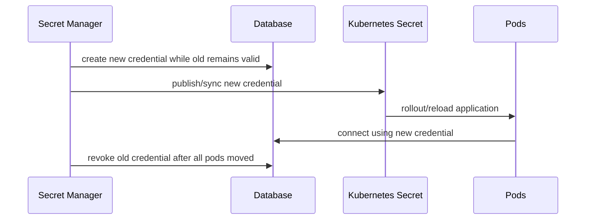
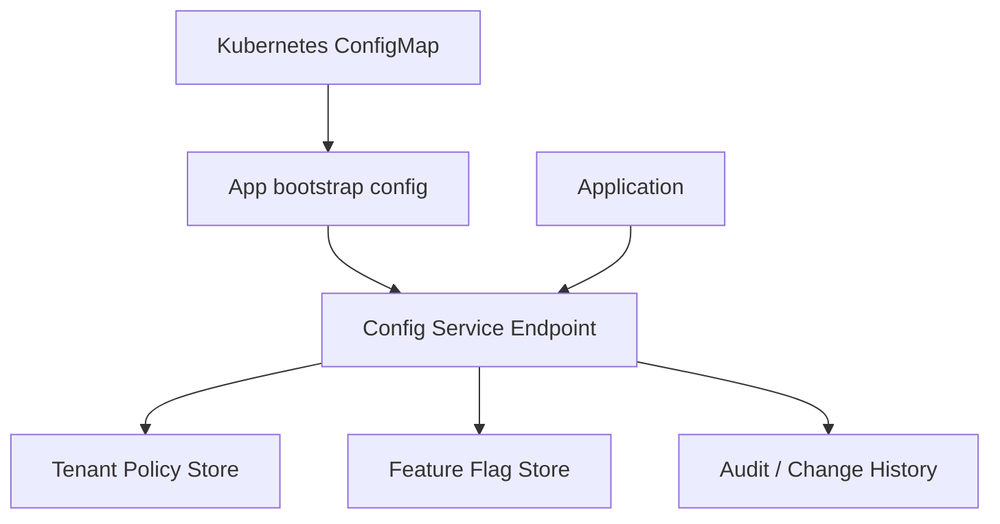

------
title: Learn Kubernetes, Deployment Model, and Cloud Native Platform Engineering - Part 012
description: Kubernetes configuration dan secrets secara production-grade: ConfigMap, Secret, environment variables, mounted files, projected volumes, reload strategy, versioning, rotation, dan runtime configuration governance.
series: learn-kubernetes-deployment-model
seriesTitle: Learn Kubernetes, Deployment Model, and Cloud Native Platform Engineering
order: 12
partTitle: Configuration, Secrets, and Runtime Environment Design
tags:
- kubernetes
- configmap
- secrets
- configuration-management
- runtime-configuration
- secret-rotation
- platform-engineering
- series
date: 2026-07-01
---

# Part 012 — Configuration, Secrets, and Runtime Environment Design

> Tujuan part ini adalah membuat kita memperlakukan configuration dan secret sebagai **runtime contract**, bukan sekadar key-value yang ditempel ke Pod. Banyak incident Kubernetes berasal dari config salah, secret salah, reload salah, atau asumsi salah tentang kapan perubahan config terlihat oleh aplikasi.

Dalam Kubernetes, `ConfigMap` digunakan untuk data konfigurasi non-rahasia, sedangkan `Secret` digunakan untuk data sensitif seperti password, token, dan key. Keduanya bisa dikonsumsi Pod melalui environment variable, mounted file, projected volume, atau API. Namun setiap cara konsumsi punya konsekuensi lifecycle, security, observability, dan rollout yang berbeda.

Mental model utama:

```text
Image defines what can run.
Configuration defines how it runs.
Secret defines what it can access.
Policy defines what it is allowed to do.
```

Jika image sama tetapi config berbeda, behavior aplikasi bisa sangat berbeda. Karena itu config harus diperlakukan seperti bagian dari release artifact.

---

## 1. Kaufman Deconstruction: Skill yang Harus Dikuasai

Sub-skill configuration engineering:

| Sub-skill | Pertanyaan Operasional |
|---|---|
| Config classification | Apakah ini build-time, deploy-time, runtime, tenant, feature, policy, atau secret? |
| Injection method selection | Env var, file mount, projected volume, external secret, atau API fetch? |
| Reload semantics | Apakah aplikasi harus restart, hot reload, atau polling? |
| Versioning | Bagaimana config dikaitkan dengan release version? |
| Validation | Bagaimana mencegah config invalid masuk production? |
| Secret handling | Bagaimana secret disimpan, dipakai, dirotasi, dan diaudit? |
| Blast radius | Siapa yang terkena perubahan config? service, namespace, tenant, region? |
| Rollback | Bagaimana revert config dengan aman? |
| Observability | Bagaimana tahu config version yang sedang aktif? |
| Governance | Siapa boleh mengubah config/secret apa? |

Target skill:

```text
Kita harus bisa mendesain config/secret model yang reproducible, auditable, reload-safe, secure, dan kompatibel dengan deployment strategy.
```

---

## 2. Configuration Taxonomy

Jangan semua nilai disebut “env var”. Klasifikasikan dulu.

| Jenis | Contoh | Lifecycle | Storage Ideal |
|---|---|---|---|
| Build-time config | compile flags, dependency bundle | sebelum image dibuat | CI/build system |
| Image metadata | app version, commit SHA | immutable | image label/annotation |
| Deploy-time config | replica count, resource request | per environment | manifest/Helm/Kustomize/GitOps |
| Runtime app config | log level, endpoint URL, timeout | per release/env | ConfigMap or config service |
| Dynamic config | feature flag, experiment cohort | sering berubah | feature flag/config service |
| Secret | password, API token, private key | rotasi/expiry | Secret/external secret manager |
| Identity | service account token, workload identity | managed by platform | ServiceAccount/projected token |
| Tenant config | plan limits, workflow policy | per tenant | database/config service |
| Policy config | admission rule, RBAC, network policy | controlled governance | Kubernetes policy resources |

Rule:

```text
Semakin sering berubah dan semakin business-specific nilainya,
semakin buruk jika dikunci ke Pod environment variable.
```

---

## 3. ConfigMap: Non-Secret Runtime Configuration

`ConfigMap` menyimpan data non-confidential sebagai key-value. Ia cocok untuk:

- application config file;
- log level;
- non-sensitive endpoint URL;
- feature default;
- timeout/retry policy;
- template config;
- routing hint;
- sidecar config.

Contoh:

```yaml
apiVersion: v1
kind: ConfigMap
metadata:
  name: payment-api-config-v20260701-01
  labels:
    app.kubernetes.io/name: payment-api
    app.kubernetes.io/component: api
    platform.example.com/config-scope: runtime
    platform.example.com/config-version: "20260701-01"
data:
  application.yaml: |
    server:
      port: 8080
    payment:
      authorizationTimeoutMs: 1200
      retry:
        maxAttempts: 2
        backoffMs: 100
    audit:
      mode: strict
  LOG_LEVEL: "INFO"
```

Design choice: pakai versioned name.

```text
payment-api-config-v20260701-01
```

Bukan hanya:

```text
payment-api-config
```

Kenapa? Karena immutable rollout lebih mudah diaudit dan dirollback.

---

## 4. Secret: Sensitive Configuration, Not Magic Encryption

`Secret` digunakan untuk data sensitif. Namun jangan salah paham: Kubernetes Secret bukan otomatis vault enterprise. Data Secret di manifest biasanya base64 encoded, bukan encrypted representation yang aman untuk Git. Kubernetes dapat dikonfigurasi untuk encryption at rest, RBAC harus ketat, dan konsumsi secret harus dibatasi.

Contoh:

```yaml
apiVersion: v1
kind: Secret
metadata:
  name: payment-api-db-credentials-v20260701-01
type: Opaque
stringData:
  username: payment_app
  password: replace-with-real-secret-from-secure-pipeline
```

Dalam GitOps production, jangan commit secret plaintext. Opsi yang lebih aman:

- external secret manager;
- sealed/encrypted secret mechanism;
- CSI-mounted external secrets;
- cloud workload identity;
- short-lived credentials;
- secret synchronization controlled by platform;
- RBAC + encryption at rest + audit logging.

Rule:

```text
Secret object reduces accidental exposure compared to plain config,
but it does not eliminate the need for secret management architecture.
```

---

## 5. Injection Methods

### 5.1 Environment Variable

Contoh:

```yaml
apiVersion: apps/v1
kind: Deployment
metadata:
  name: payment-api
spec:
  template:
    spec:
      containers:
        - name: app
          image: registry.example.com/payment-api@sha256:...
          env:
            - name: LOG_LEVEL
              valueFrom:
                configMapKeyRef:
                  name: payment-api-config-v20260701-01
                  key: LOG_LEVEL
            - name: DB_USERNAME
              valueFrom:
                secretKeyRef:
                  name: payment-api-db-credentials-v20260701-01
                  key: username
```

Kelebihan:

- sederhana;
- cocok untuk 12-factor style apps;
- mudah dilihat oleh process;
- tidak butuh file parser.

Kelemahan:

- nilainya dibaca saat process start;
- perubahan ConfigMap/Secret tidak otomatis mengubah env var process yang sudah berjalan;
- bisa terekspos melalui debug dump, crash dump, process inspection, atau log salah;
- tidak cocok untuk config kompleks atau secret besar;
- sulit melakukan hot reload.

Gunakan env var untuk:

- nilai kecil;
- config yang hanya berubah lewat rollout;
- non-sensitive setting sederhana;
- bootstrap pointer ke config service.

Hindari env var untuk:

- private key besar;
- dynamic feature flags;
- frequently rotated credentials jika aplikasi tidak restart;
- structured config kompleks.

---

### 5.2 Mounted File

ConfigMap sebagai file:

```yaml
apiVersion: apps/v1
kind: Deployment
metadata:
  name: payment-api
spec:
  template:
    spec:
      containers:
        - name: app
          image: registry.example.com/payment-api@sha256:...
          volumeMounts:
            - name: app-config
              mountPath: /etc/payment-api
              readOnly: true
      volumes:
        - name: app-config
          configMap:
            name: payment-api-config-v20260701-01
            items:
              - key: application.yaml
                path: application.yaml
```

Secret sebagai file:

```yaml
apiVersion: apps/v1
kind: Deployment
metadata:
  name: payment-api
spec:
  template:
    spec:
      containers:
        - name: app
          volumeMounts:
            - name: db-credentials
              mountPath: /var/run/secrets/payment-db
              readOnly: true
      volumes:
        - name: db-credentials
          secret:
            secretName: payment-api-db-credentials-v20260701-01
```

Kelebihan:

- cocok untuk structured config;
- cocok untuk certificate/key file;
- beberapa perubahan bisa terpropagasi ke mounted volume;
- bisa dibaca ulang oleh aplikasi atau reloader.

Kelemahan:

- aplikasi harus mendukung reload;
- propagation tidak instant;
- `subPath` punya behavior khusus dan tidak menerima update otomatis untuk ConfigMap/Secret mount;
- file permission dan mount path harus dirancang.

---

### 5.3 Projected Volume

Projected volume menggabungkan beberapa sumber ke satu directory, misalnya Secret, ConfigMap, Downward API, service account token, cluster trust bundle, atau pod certificate.

Contoh:

```yaml
apiVersion: apps/v1
kind: Deployment
metadata:
  name: payment-api
spec:
  template:
    spec:
      containers:
        - name: app
          image: registry.example.com/payment-api@sha256:...
          volumeMounts:
            - name: runtime-context
              mountPath: /var/run/payment-api/context
              readOnly: true
      volumes:
        - name: runtime-context
          projected:
            sources:
              - configMap:
                  name: payment-api-config-v20260701-01
                  items:
                    - key: application.yaml
                      path: config/application.yaml
              - secret:
                  name: payment-api-db-credentials-v20260701-01
                  items:
                    - key: username
                      path: secrets/db-username
                    - key: password
                      path: secrets/db-password
              - downwardAPI:
                  items:
                    - path: pod/name
                      fieldRef:
                        fieldPath: metadata.name
                    - path: pod/namespace
                      fieldRef:
                        fieldPath: metadata.namespace
```

Projected volume cocok untuk membuat runtime context directory yang konsisten.

---

## 6. Update Semantics: Hal yang Sering Menyebabkan Incident

Injection method menentukan update behavior.

| Method | Apakah Pod lama melihat update? | Catatan |
|---|---|---|
| env var from ConfigMap | tidak | butuh restart/recreate Pod |
| env var from Secret | tidak | butuh restart/recreate Pod |
| mounted ConfigMap volume | bisa terupdate eventually | app harus reload file |
| mounted Secret volume | bisa terupdate eventually | app harus reload file/credential |
| `subPath` ConfigMap/Secret mount | tidak menerima update otomatis | umum jadi surprise |
| external config service | tergantung client/cache | perlu fallback dan circuit breaker |
| feature flag service | biasanya dynamic | butuh consistency/latency model |

Prinsip:

```text
Kubernetes can update mounted data.
It cannot force your application to understand new config safely.
```

Jika aplikasi membaca config sekali saat startup, mounted file update tidak berguna tanpa restart.

---

## 7. Immutable Config Pattern

Kubernetes mendukung immutable ConfigMap/Secret. Pattern production yang sering lebih aman:

1. Buat ConfigMap/Secret baru dengan nama versi baru.
2. Update Deployment agar referensi ke nama baru.
3. Biarkan rollout membuat Pod baru.
4. Hapus ConfigMap/Secret lama setelah tidak dipakai.

Contoh:

```yaml
apiVersion: v1
kind: ConfigMap
metadata:
  name: payment-api-config-v20260701-02
immutable: true
data:
  application.yaml: |
    payment:
      authorizationTimeoutMs: 1500
```

Kemudian update Deployment:

```yaml
volumes:
  - name: app-config
    configMap:
      name: payment-api-config-v20260701-02
```

Kelebihan:

- reproducible;
- audit-friendly;
- rollback jelas;
- menghindari silent mutation;
- kompatibel dengan GitOps;
- memicu rollout secara eksplisit.

Kekurangan:

- butuh lifecycle cleanup;
- banyak object jika tidak dikelola;
- secret rotation perlu orchestration.

---

## 8. Hash Annotation Rollout Pattern

Jika nama ConfigMap tetap sama, perubahan ConfigMap tidak selalu otomatis memicu Deployment rollout karena Pod template tidak berubah.

Pattern umum: tambahkan checksum config ke annotation Pod template.

```yaml
apiVersion: apps/v1
kind: Deployment
metadata:
  name: payment-api
spec:
  template:
    metadata:
      annotations:
        checksum/config: "sha256:6b6f1f..."
        checksum/secret: "sha256:04e9aa..."
    spec:
      containers:
        - name: app
          image: registry.example.com/payment-api@sha256:...
```

Jika config berubah, checksum berubah, Pod template berubah, Deployment membuat ReplicaSet baru.

Trade-off:

| Approach | Pros | Cons |
|---|---|---|
| versioned ConfigMap name | eksplisit, immutable-friendly | butuh naming/cleanup |
| checksum annotation | works with stable name | harus tooling benar |
| manual rollout restart | sederhana | tidak reproducible jika tidak tercatat |
| hot reload | downtime rendah | app complexity dan safety concern |

---

## 9. Config Reload Strategy

Ada tiga model utama.

### 9.1 Restart-on-Change

Setiap config change memicu Pod restart/rollout.

Cocok untuk:

- config kritikal;
- config jarang berubah;
- aplikasi tidak mendukung reload;
- secret rotation yang butuh reconnect;
- compliance/audit kuat.

Kelebihan:

- state jelas;
- mudah dirollback;
- config version konsisten dengan Pod version.

Kelemahan:

- rollout overhead;
- mungkin ada disruption;
- tidak cocok untuk high-frequency toggles.

### 9.2 Hot Reload from File

Aplikasi watch file mounted dari ConfigMap/Secret dan reload saat berubah.

Cocok untuk:

- log level;
- routing rules ringan;
- trust bundle/cert reload;
- timeout yang aman berubah.

Risiko:

- partial reload;
- invalid config membuat app error;
- reload race;
- observability buruk jika tidak expose active config version;
- rollback config perlu mekanisme jelas.

### 9.3 Dynamic Config Service

Aplikasi fetch config dari service eksternal.

Cocok untuk:

- feature flags;
- tenant policy;
- high-frequency business config;
- experiments;
- centralized governance.

Risiko:

- dependency startup;
- cache consistency;
- config service outage;
- latency;
- authorization;
- audit.

Design rule:

```text
Use Kubernetes ConfigMap/Secret for deployment-scoped configuration.
Use application config service for high-frequency business configuration.
Do not overload Kubernetes API as a business configuration database.
```

---

## 10. Secret Rotation Models

Secret rotation harus dirancang sebelum incident.

| Model | Cara Kerja | Cocok Untuk |
|---|---|---|
| restart rotation | secret baru -> rollout Pod | app tidak hot-reload credential |
| dual credential | old/new valid sementara | database/API key rotation aman |
| mounted cert reload | cert file update -> app reload TLS context | mTLS/cert rotation |
| external secret fetch | app/sidecar fetch short-lived credential | high-security environments |
| workload identity | tidak menyimpan static secret | cloud-native access |

Safe dual credential pattern:



Checklist:

- old and new credentials overlap safely;
- app can reconnect;
- connection pool refresh behavior known;
- rollout completion checked;
- old credential revoked after verification;
- failed rotation rollback path exists;
- audit event recorded.

---

## 11. External Secrets and CSI Mounts

For enterprise-grade secret management, Kubernetes Secret may be only the consumption interface, not the source of truth.

Common patterns:

| Pattern | Description |
|---|---|
| External Secrets Operator | syncs secrets from external providers into Kubernetes Secret objects |
| Secrets Store CSI Driver | mounts secrets/keys/certs from external secret stores as CSI volumes |
| cloud workload identity | workload obtains cloud identity without static long-lived secret |
| Vault agent/sidecar | sidecar authenticates and renders secret files |
| sealed/encrypted manifests | encrypted secret safe to store in Git, decrypted in cluster |

Secrets Store CSI Driver pattern:

```text
External Secret Store -> CSI Driver -> Pod volume -> application reads file
```

Kelebihan:

- source of truth di secret manager;
- central audit;
- provider-native rotation;
- less secret material in Git;
- can avoid Kubernetes Secret object for some use cases.

Trade-off:

- CSI provider complexity;
- startup dependency;
- mount failure mode;
- rotation semantics vary;
- application still must reload/reconnect.

---

## 12. Security Boundaries

### 12.1 RBAC

Secret access harus minimum.

Bad pattern:

```text
service account can list all secrets in namespace.
```

Better:

```text
workload can only mount or read specific secret it needs.
platform automation has narrow secret sync permission.
humans do not casually read production secret values.
```

Dalam RBAC, permission `get`, `list`, dan `watch` pada Secret sangat sensitif. `list` bisa mengekspos semua Secret dalam scope.

### 12.2 Namespace Boundary

ConfigMap/Secret bersifat namespaced. Pod hanya dapat mereferensikan Secret/ConfigMap dalam namespace yang sama untuk volume/env reference.

Ini membantu isolation tetapi bukan security lengkap. Namespace harus dipasangkan dengan:

- RBAC;
- NetworkPolicy;
- admission policy;
- resource quota;
- service account discipline;
- secret encryption at rest;
- audit logging.

### 12.3 Avoid Secret Sprawl

Secret sprawl terjadi saat secret disalin ke banyak namespace, cluster, CI variables, Helm values, local dev files, dan logs.

Control:

- central source of truth;
- automated sync;
- clear owner;
- expiry;
- rotation policy;
- no plaintext in Git;
- detect unused secrets;
- restrict `kubectl describe`/debug workflows that expose env.

---

## 13. Configuration Validation

Config invalid bisa membuat Pod CrashLoop, lebih buruk: aplikasi jalan tetapi salah behavior.

Validation layers:

| Layer | Contoh |
|---|---|
| schema validation | JSON Schema/OpenAPI for config file |
| CI validation | parse config before merge |
| admission policy | required keys/labels, deny plaintext secrets |
| startup validation | fail fast if critical config invalid |
| readiness validation | do not receive traffic until config loaded |
| runtime validation | reject dynamic config update if invalid |
| canary validation | release config to subset first |

Example config schema thinking:

```yaml
payment:
  authorizationTimeoutMs: 1200 # must be 100..5000
  retry:
    maxAttempts: 2             # must be 0..5
    backoffMs: 100             # must be 10..2000
audit:
  mode: strict                 # enum: strict, relaxed-readonly
```

Bad config values are code defects in disguise.

---

## 14. Config Observability

A production service should expose enough metadata to answer:

```text
What image version is running?
What config version is active?
What secret version or credential generation is active?
What feature flag snapshot is active?
Which Git commit produced this manifest?
```

Options:

- `/info` endpoint exposing non-sensitive version metadata;
- metrics labels for config version;
- Pod annotations;
- structured startup log;
- audit event on config reload;
- rollout dashboard.

Example startup log:

```json
{
  "event": "application_started",
  "app": "payment-api",
  "imageDigest": "sha256:...",
  "configVersion": "20260701-02",
  "secretGeneration": "db-credentials-20260701-01",
  "gitCommit": "abc1234",
  "namespace": "prod-payments"
}
```

Never log secret value. Log generation/version metadata only.

---

## 15. Config and Deployment Coupling

Config can be coupled to image version in different ways.

| Coupling | Description | When Useful |
|---|---|---|
| strict | image v2 requires config v2 | complex behavior changes |
| loose | image can run with config v1/v2 | compatibility period |
| independent | config changes anytime | dynamic operational tuning |
| centralized | config resolved by service | tenant/feature management |

Safe release sequence for strict config:

```text
1. Apply new ConfigMap version.
2. Update Deployment to reference new config and image together.
3. Roll out canary.
4. Validate metrics.
5. Promote.
6. Cleanup old config after rollback window.
```

For loose compatibility:

```text
1. Deploy image that understands both old and new config.
2. Change config gradually.
3. Observe behavior.
4. Remove old config support in later release.
```

---

## 16. Multi-Environment Config Strategy

Environment config must not become copy-paste chaos.

Common layers:

```text
base
  ├── dev overlay
  ├── test overlay
  ├── staging overlay
  └── prod overlay
```

Config differences should be intentional:

| Value | Should Differ by Env? | Notes |
|---|---|---|
| replica count | yes | capacity differs |
| resource requests | often | prod realistic, dev smaller |
| endpoint hostnames | yes | environment-specific |
| log level | maybe | debug only outside prod |
| timeout/retry | usually no | prod-like behavior in staging |
| feature behavior | controlled | avoid hidden drift |
| security mode | no, or stricter in prod | don't test insecure assumptions |
| schema validation | no | same rules everywhere |

Anti-pattern:

```text
staging has relaxed config, prod has strict config,
so staging never tested prod behavior.
```

---

## 17. Multi-Tenant Runtime Configuration

For SaaS/regulatory systems, tenant config often includes:

- workflow policy;
- escalation SLA;
- notification rule;
- permission matrix;
- jurisdiction/regulation mapping;
- retention period;
- evidence requirement;
- case assignment rule.

Do not put high-cardinality tenant config into thousands of Kubernetes ConfigMaps unless platform explicitly supports it. Kubernetes is control plane, not business config database.

Better pattern:



Kubernetes config should point to/configure the config system, not replace the entire business config system.

---

## 18. Application Design for Config Safety

Application should implement:

- fail-fast startup validation;
- clear config precedence;
- safe defaults only where appropriate;
- no silent fallback for critical secret;
- config version logging;
- hot reload transactionality if supported;
- reject invalid runtime config;
- expose active config metadata;
- test config parsing in CI;
- integration test with production-like config.

Config precedence example:

```text
1. command-line arguments
2. environment variables
3. mounted config file
4. default application config
```

But precedence should be documented. Hidden precedence causes incidents.

Bad behavior:

```text
Config file says strict audit=true.
Env var left from old deployment overrides it to false.
Nobody knows because app does not expose effective config.
```

---

## 19. Configuration Failure Modes

| Failure | Symptom | Root Cause | Prevention |
|---|---|---|---|
| missing key | CrashLoopBackOff | required config absent | schema validation, startup fail-fast |
| wrong type | app crash or default fallback | string/int/bool mismatch | config parser validation |
| stale env var | change not applied | env var requires restart | rollout restart/checksum |
| subPath stale file | config file did not update | subPath mount behavior | avoid subPath for dynamic config |
| secret expired | auth failures | no rotation/reload | dual credential rotation |
| secret wrong namespace | Pod start failure | namespace boundary misunderstood | policy + preflight |
| excessive reload | instability | config changes too frequent | rate limit/config governance |
| silent default | wrong business behavior | app default hides missing config | fail for critical config |
| config drift | envs behave differently | copy-paste overrides | GitOps overlays + diff |
| plaintext leak | secret in logs/Git | poor secret hygiene | scanning + policy |

---

## 20. Debugging Config and Secret Issues

Useful commands:

```bash
kubectl get configmap -n prod
kubectl describe configmap payment-api-config-v20260701-02 -n prod
kubectl get secret -n prod
kubectl describe secret payment-api-db-credentials-v20260701-01 -n prod
kubectl get pod payment-api-abc123 -n prod -o yaml
kubectl describe pod payment-api-abc123 -n prod
kubectl logs payment-api-abc123 -n prod
kubectl get events -n prod --sort-by=.lastTimestamp
```

Do not casually print Secret values in shared terminals or logs.

For env debugging:

```bash
kubectl exec -n prod deployment/payment-api -- printenv | sort
```

Be careful: this may expose sensitive values. Prefer application `/info` endpoint that redacts secret content and only shows version metadata.

For mounted file debugging:

```bash
kubectl exec -n prod deployment/payment-api -- ls -lah /etc/payment-api
kubectl exec -n prod deployment/payment-api -- cat /etc/payment-api/application.yaml
```

Again, avoid `cat` on secret files unless necessary and authorized.

---

## 21. Example Production Pattern

### ConfigMap

```yaml
apiVersion: v1
kind: ConfigMap
metadata:
  name: case-api-config-v20260701-01
  namespace: prod-regulatory
  labels:
    app.kubernetes.io/name: case-api
    app.kubernetes.io/part-of: enforcement-platform
    platform.example.com/config-version: "20260701-01"
    platform.example.com/owner: case-platform
data:
  application.yaml: |
    caseWorkflow:
      defaultEscalationSlaHours: 48
      strictTransitionValidation: true
      auditRequired: true
    outbound:
      notificationTimeoutMs: 1000
      retryMaxAttempts: 2
```

### Secret

```yaml
apiVersion: v1
kind: Secret
metadata:
  name: case-api-db-credentials-v20260701-01
  namespace: prod-regulatory
  labels:
    app.kubernetes.io/name: case-api
    platform.example.com/secret-generation: "20260701-01"
type: Opaque
stringData:
  username: case_api
  password: replace-from-secret-pipeline
```

### Deployment

```yaml
apiVersion: apps/v1
kind: Deployment
metadata:
  name: case-api
  namespace: prod-regulatory
spec:
  replicas: 6
  selector:
    matchLabels:
      app.kubernetes.io/name: case-api
  template:
    metadata:
      labels:
        app.kubernetes.io/name: case-api
        app.kubernetes.io/version: "2.8.0"
      annotations:
        platform.example.com/config-version: "20260701-01"
        platform.example.com/secret-generation: "20260701-01"
    spec:
      serviceAccountName: case-api
      containers:
        - name: app
          image: registry.example.com/case-api@sha256:...
          ports:
            - containerPort: 8080
          env:
            - name: APP_CONFIG_PATH
              value: /etc/case-api/application.yaml
            - name: DB_USERNAME_FILE
              value: /var/run/secrets/case-api-db/username
            - name: DB_PASSWORD_FILE
              value: /var/run/secrets/case-api-db/password
          volumeMounts:
            - name: app-config
              mountPath: /etc/case-api
              readOnly: true
            - name: db-credentials
              mountPath: /var/run/secrets/case-api-db
              readOnly: true
          readinessProbe:
            httpGet:
              path: /readyz
              port: 8080
            periodSeconds: 10
            failureThreshold: 3
      volumes:
        - name: app-config
          configMap:
            name: case-api-config-v20260701-01
        - name: db-credentials
          secret:
            secretName: case-api-db-credentials-v20260701-01
```

Design notes:

- app reads structured config from file;
- secret values are file-mounted, not env vars;
- version metadata appears in Pod annotations;
- rollout recreates Pods when config/secret generation changes;
- readiness should validate config load and essential access.

---

## 22. Policy Guardrails

Enterprise platforms should enforce:

| Policy | Rationale |
|---|---|
| no plaintext secrets in ConfigMap | prevent accidental leakage |
| required owner labels | incident routing |
| required config version annotation | auditability |
| deny default service account for prod | identity hygiene |
| require immutable config for prod critical apps | reproducibility |
| require secret encryption at rest | baseline security |
| deny broad secret list permission | reduce exfiltration risk |
| require Secret sourced from approved mechanism | governance |
| require rollout trigger for config changes | avoid silent drift |
| require readiness probe when config mounted | prevent bad config exposure |

Policy-as-code will be covered deeper in Part 024, but config/secret governance should be designed from now.

---

## 23. Config Change Review Checklist

Before merging config change:

- [ ] Is this value non-sensitive? If not, use Secret/external secret.
- [ ] Is the change compatible with current image version?
- [ ] Does app validate this config?
- [ ] Does change require Pod restart?
- [ ] Does rollout happen automatically?
- [ ] Is rollback path clear?
- [ ] Is blast radius understood?
- [ ] Are prod and staging differences intentional?
- [ ] Is active config version observable?
- [ ] Could default fallback hide a bad config?
- [ ] Could this change affect state transition, audit, SLA, or authorization?
- [ ] Is change recorded with owner/change ID?

For secret change:

- [ ] Is old credential still valid during rollout?
- [ ] Can app reconnect or reload?
- [ ] Is credential expiry known?
- [ ] Are all Pods using new generation?
- [ ] Is old credential revoked after verification?
- [ ] Is no secret value logged or committed?

---

## 24. Anti-Patterns

| Anti-pattern | Why It Fails |
|---|---|
| Putting secrets in ConfigMap | non-sensitive object used for sensitive data |
| Committing plaintext Secret YAML | Git history becomes secret leak |
| Assuming base64 means encrypted | base64 is encoding, not protection |
| Changing ConfigMap and expecting env vars to update | env var fixed at process start |
| Using `subPath` for dynamic config | updates do not propagate automatically |
| One giant ConfigMap for many apps | poor ownership and blast radius |
| Mutable prod config without versioning | impossible audit/rollback |
| Silent default for required value | app runs with wrong behavior |
| Dynamic business config in Kubernetes objects | abuses control plane as app database |
| Secret rotation without dual validity | downtime/auth failure |
| Logging effective config with secrets | accidental exfiltration |
| Same secret shared by many services | broad blast radius |
| App reads config only once but platform expects hot reload | false safety assumption |

---

## 25. Hands-on Practice Plan

### Exercise 1 — Env Var Update Semantics

1. Create ConfigMap with `LOG_LEVEL=INFO`.
2. Mount as env var into Pod.
3. Change ConfigMap to `DEBUG`.
4. Observe running Pod env var stays unchanged.
5. Restart Pod and observe new value.

Learning:

```text
Env var config is startup-scoped.
```

### Exercise 2 — Mounted Config File

1. Mount ConfigMap as file.
2. Change ConfigMap.
3. Observe file eventually updates.
4. Confirm app does or does not reload.

Learning:

```text
File update does not equal application reload.
```

### Exercise 3 — Immutable Config Version

1. Create immutable ConfigMap v1.
2. Deploy app referencing v1.
3. Create immutable ConfigMap v2.
4. Update Deployment to reference v2.
5. Rollback to v1.

Learning:

```text
Versioned config makes rollback explicit.
```

### Exercise 4 — Secret Rotation Simulation

1. Create Secret generation v1.
2. Deploy app.
3. Create Secret generation v2.
4. Update Deployment.
5. Verify all Pods use v2.
6. Mark v1 for deletion/revocation.

Learning:

```text
Secret rotation is a deployment workflow, not a single kubectl command.
```

---

## 26. Summary

Configuration and secrets are runtime contracts. Kubernetes gives primitives, but production safety depends on engineering choices:

- classify config before choosing storage;
- use ConfigMap for non-secret deployment-scoped config;
- use Secret/external secret systems for sensitive data;
- understand env var vs mounted file update semantics;
- prefer immutable/versioned config for critical workloads;
- design reload or restart strategy explicitly;
- make config version observable;
- validate config before and during rollout;
- design secret rotation with overlap, verification, and revocation;
- avoid using Kubernetes as a high-frequency business config database.

Top-tier Kubernetes engineers know that many outages are not caused by broken containers, but by **valid YAML carrying invalid operational intent**.

---

## References

- Kubernetes Documentation — ConfigMaps: https://kubernetes.io/docs/concepts/configuration/configmap/
- Kubernetes Documentation — Configure a Pod to Use a ConfigMap: https://kubernetes.io/docs/tasks/configure-pod-container/configure-pod-configmap/
- Kubernetes Documentation — Updating Configuration via a ConfigMap: https://kubernetes.io/docs/tutorials/configuration/updating-configuration-via-a-configmap/
- Kubernetes Documentation — Secrets: https://kubernetes.io/docs/concepts/configuration/secret/
- Kubernetes Documentation — Good Practices for Kubernetes Secrets: https://kubernetes.io/docs/concepts/security/secrets-good-practices/
- Kubernetes Documentation — Managing Secrets Using Configuration File: https://kubernetes.io/docs/tasks/configmap-secret/managing-secret-using-config-file/
- Kubernetes Documentation — Define Environment Variables for a Container: https://kubernetes.io/docs/tasks/inject-data-application/define-environment-variable-container/
- Kubernetes Documentation — Distribute Credentials Securely Using Secrets: https://kubernetes.io/docs/tasks/inject-data-application/distribute-credentials-secure/
- Kubernetes Documentation — Projected Volumes: https://kubernetes.io/docs/concepts/storage/projected-volumes/
- Kubernetes Documentation — Volumes: https://kubernetes.io/docs/concepts/storage/volumes/
- Kubernetes Secrets Store CSI Driver: https://secrets-store-csi-driver.sigs.k8s.io/
