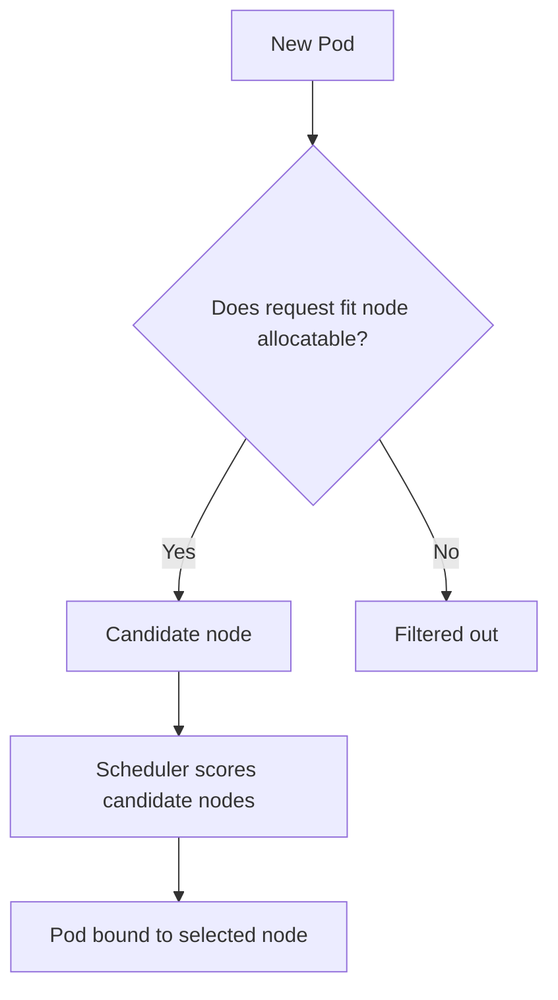
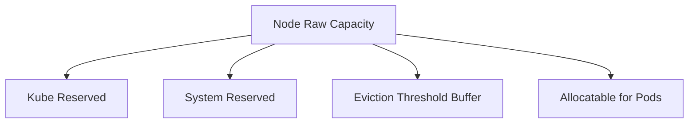
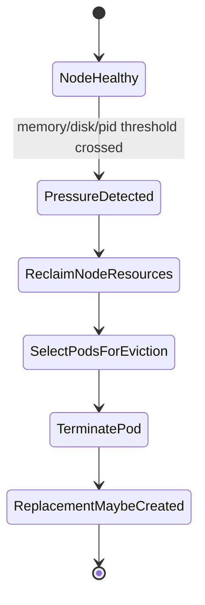
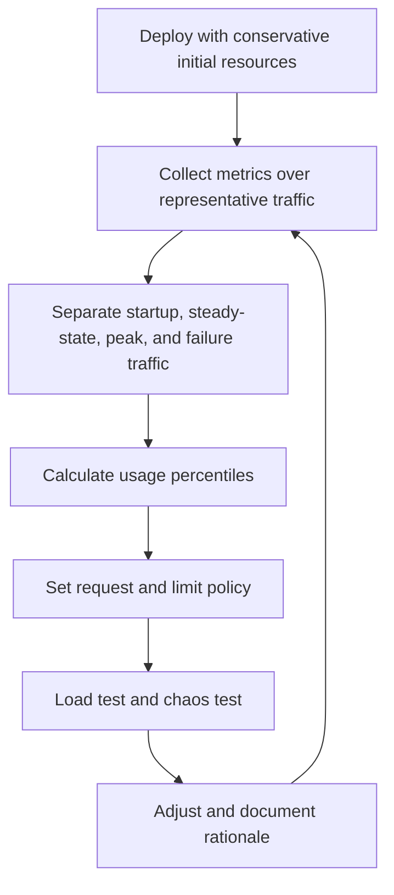
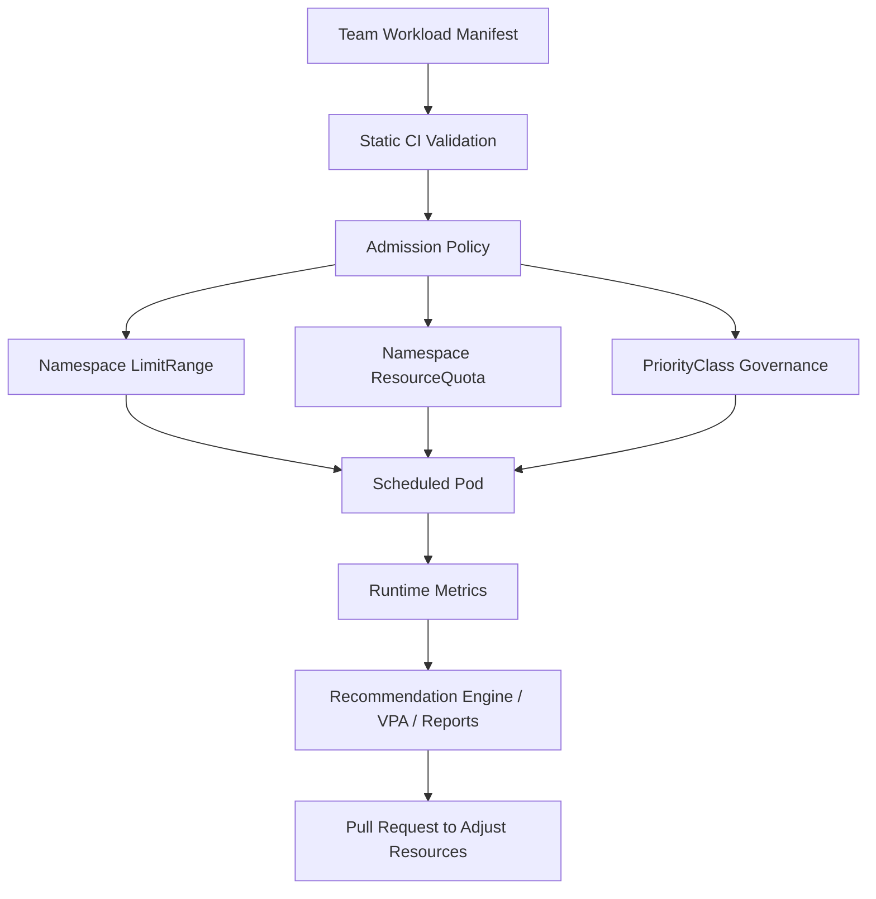

------
title: Learn Kubernetes, Deployment Model, and Cloud Native Platform Engineering - Part 013
description: Deep dive into Kubernetes CPU, memory, requests, limits, QoS classes, eviction, overcommit, noisy-neighbor control, and production-grade resource governance.
series: learn-kubernetes-deployment-model
seriesTitle: Learn Kubernetes, Deployment Model, and Cloud Native Platform Engineering
order: 13
partTitle: CPU, Memory, Requests, Limits, QoS, and Resource Governance
tags:
- kubernetes
- deployment
- resource-management
- qos
- production-engineering
- platform-engineering
date: 2026-07-01
---

# Part 013 — CPU, Memory, Requests, Limits, QoS, and Resource Governance

> Goal: understand Kubernetes resource management deeply enough to design safe workload defaults, diagnose resource-related incidents, prevent noisy-neighbor failure, and build defensible production governance.

This part is not about memorizing `resources.requests` and `resources.limits`.

It is about answering harder production questions:

- Why did the Pod get scheduled, then die later?
- Why is the app slow even though CPU is below 100%?
- Why did a memory limit make latency worse?
- Why did a low-priority batch workload evict a business-critical service?
- Why did Cluster Autoscaler not help even though the application was overloaded?
- Why did a node have available CPU on paper but still behave badly?
- Why does one team’s deployment degrade another team’s workload?

Kubernetes resource management is a contract between four systems:

1. the application,
2. the kube-scheduler,
3. the kubelet,
4. the underlying Linux/kernel/container runtime isolation layer.

A top engineer understands all four.

---

## 1. Kaufman Deconstruction

Using Josh Kaufman’s skill acquisition framing, we deconstruct resource management into smaller sub-skills.

| Sub-skill | What You Must Be Able To Do |
|---|---|
| Resource vocabulary | Explain CPU, memory, ephemeral storage, huge pages, extended resources, requests, limits, QoS, eviction. |
| Scheduling model | Predict whether a Pod can be scheduled based on requests and node allocatable capacity. |
| Runtime model | Explain what happens when a container exceeds CPU or memory limits. |
| QoS model | Predict Pod eviction priority under node pressure. |
| Overcommit model | Decide when CPU/memory overcommit is acceptable. |
| Sizing model | Derive requests/limits from real usage distributions, not guesses. |
| Failure model | Diagnose OOMKilled, CPU throttling, Pending Pods, Evicted Pods, node pressure, and noisy neighbors. |
| Governance model | Design namespace quotas, LimitRanges, policy defaults, and platform guardrails. |

The most valuable sub-skill is **resource reasoning under failure**.

Anyone can copy this:

```yaml
resources:
  requests:
    cpu: "500m"
    memory: "512Mi"
  limits:
    cpu: "1"
    memory: "1Gi"
```

A stronger engineer can explain exactly what trade-off that contract creates.

---

## 2. Resource Management Mental Model

Kubernetes does not magically know how much capacity your application needs.

It only knows what you declare.


Important distinction:

| Field | Primary Consumer | Main Purpose |
|---|---|---|
| CPU request | Scheduler, HPA, kubelet | Reserve scheduling capacity and calculate utilization baseline. |
| CPU limit | Runtime/kernel | Cap CPU usage through throttling. |
| Memory request | Scheduler, QoS, eviction | Reserve scheduling capacity and classify eviction risk. |
| Memory limit | Runtime/kernel | Kill container if memory exceeds limit. |
| Ephemeral storage request | Scheduler/kubelet | Reserve local scratch/log/image writable storage. |
| Ephemeral storage limit | Kubelet/runtime | Evict/fail if local storage usage exceeds contract. |

Kubernetes scheduling is request-driven.

Runtime enforcement is limit-driven.

This means a Pod can be:

- schedulable but later unstable,
- unschedulable despite low actual usage,
- apparently healthy but throttled,
- low memory at request time but killed at peak,
- safe alone but unsafe during multi-tenant contention.

---

## 3. The Core Resource Types

### 3.1 CPU

Kubernetes CPU is measured in cores.

Common representations:

```yaml
cpu: "1"      # one CPU core
cpu: "500m"   # half a CPU core
cpu: "100m"   # one tenth of a CPU core
```

`m` means millicpu.

So:

| Value | Meaning |
|---|---:|
| `1000m` | 1 CPU |
| `500m` | 0.5 CPU |
| `250m` | 0.25 CPU |
| `100m` | 0.1 CPU |
| `10m` | 0.01 CPU |

CPU is compressible.

If a container wants more CPU than it can get, it usually becomes slower, not dead.

That makes CPU failure subtle:

- latency increases,
- queue depth grows,
- request timeout rises,
- GC pauses can get worse,
- health probes may start failing,
- autoscaling may lag behind demand.

### 3.2 Memory

Memory is measured in bytes using suffixes such as `Mi`, `Gi`, `M`, `G`.

Prefer binary units for Kubernetes memory sizing:

```yaml
memory: "256Mi"
memory: "1Gi"
```

Memory is non-compressible.

If a container exceeds its memory limit, it can be killed.

That kill commonly appears as:

```text
Reason: OOMKilled
Exit Code: 137
```

Memory pressure is therefore sharper than CPU pressure.

CPU overuse slows things down.

Memory overuse kills things.

### 3.3 Ephemeral Storage

Ephemeral storage includes local writable storage associated with a Pod/container, such as:

- container writable layer,
- logs,
- `emptyDir`,
- temporary files,
- unpacked runtime data.

This is frequently ignored until production fails.

Typical failure cases:

- verbose logs fill node storage,
- batch job writes temporary files without cleanup,
- image layers consume excessive disk,
- sidecar proxy logs grow unexpectedly,
- `emptyDir` becomes an unbounded local database by accident.

Example:

```yaml
resources:
  requests:
    ephemeral-storage: "1Gi"
  limits:
    ephemeral-storage: "4Gi"
```

### 3.4 Extended Resources

Extended resources are custom node-level resources such as:

- GPUs,
- FPGAs,
- smart NICs,
- specialized accelerators,
- device-plugin resources.

Example:

```yaml
resources:
  limits:
    nvidia.com/gpu: 1
```

Extended resources are usually integer and non-overcommittable.

You generally request them by using limits, and Kubernetes schedules Pods only onto nodes that advertise the resource.

---

## 4. Requests vs Limits

### 4.1 Requests

A request says:

> “This workload needs at least this much resource capacity to be scheduled safely.”

The scheduler uses requests to decide whether a node can fit a Pod.

Example:

```yaml
apiVersion: v1
kind: Pod
metadata:
  name: api
spec:
  containers:
    - name: api
      image: example.com/api:1.0.0
      resources:
        requests:
          cpu: "500m"
          memory: "512Mi"
```

If a node has insufficient unallocated requested capacity, the Pod remains `Pending`.

This is why incorrect requests produce two opposite failures:

| Mistake | Failure |
|---|---|
| Request too high | Pod cannot schedule or cluster becomes underutilized. |
| Request too low | Pod schedules onto crowded node and becomes unstable under contention. |

### 4.2 Limits

A limit says:

> “This container must not exceed this runtime boundary.”

Example:

```yaml
resources:
  limits:
    cpu: "1"
    memory: "1Gi"
```

CPU and memory limits behave differently.

| Resource | If Exceeded |
|---|---|
| CPU limit | Container is throttled. |
| Memory limit | Container can be killed. |

The difference is fundamental.

Do not reason about CPU and memory limits as if they are symmetric.

---

## 5. Scheduling Capacity vs Actual Utilization

Kubernetes scheduling is based on declared requests, not live usage.

Suppose a node has:

```text
Allocatable CPU:    4 cores
Allocatable Memory: 8Gi
```

Existing Pods request:

```text
CPU requested:    3.5 cores
Memory requested: 7Gi
```

A new Pod requests:

```text
CPU:    700m
Memory: 512Mi
```

Even if actual CPU usage is only 20%, the new Pod cannot fit because CPU requests exceed allocatable capacity.



This is often misunderstood.

The scheduler is not a live load balancer.

It is a placement decision engine based primarily on declared constraints and available allocatable capacity.

---

## 6. Node Capacity, Allocatable, and Reserved Resources

A node’s total capacity is not the same as capacity available for Pods.

```text
Node Capacity
  - kube reserved
  - system reserved
  - eviction reserved
  = Node Allocatable
```

Kubernetes schedules Pods against node allocatable capacity.



Production implication:

You cannot safely pack Pods based on cloud VM advertised size alone.

A `4 vCPU / 16Gi` node is not a `4 CPU / 16Gi` Pod bin.

Some capacity is intentionally reserved for:

- kubelet,
- container runtime,
- OS processes,
- logging agent,
- monitoring agent,
- CNI agent,
- CSI driver,
- node-local DNS,
- eviction safety margin.

---

## 7. QoS Classes

Kubernetes assigns Pods one of three QoS classes:

1. `Guaranteed`,
2. `Burstable`,
3. `BestEffort`.

QoS affects eviction ordering under resource pressure.

### 7.1 Guaranteed

A Pod is `Guaranteed` when every container has CPU and memory request equal to limit.

Example:

```yaml
resources:
  requests:
    cpu: "500m"
    memory: "512Mi"
  limits:
    cpu: "500m"
    memory: "512Mi"
```

Use for:

- hard real-time-ish platform components,
- latency-sensitive services with predictable resource envelope,
- critical infrastructure workloads,
- workloads where eviction is more dangerous than underutilization.

Trade-off:

Guaranteed QoS can reduce cluster efficiency if limits are set too conservatively.

### 7.2 Burstable

A Pod is `Burstable` when at least one request is set, but not all requests equal all limits.

Example:

```yaml
resources:
  requests:
    cpu: "250m"
    memory: "512Mi"
  limits:
    cpu: "1"
    memory: "1Gi"
```

This is the most common production QoS class.

Use for:

- normal microservices,
- APIs with variable demand,
- workers,
- non-critical but important services.

Trade-off:

Burstable Pods can be evicted before Guaranteed Pods when nodes face pressure.

### 7.3 BestEffort

A Pod is `BestEffort` when no CPU or memory request/limit is specified.

Example:

```yaml
resources: {}
```

Use for:

- throwaway experiments,
- local dev clusters,
- intentionally low-priority opportunistic work.

Avoid for production services.

BestEffort Pods are first-class Kubernetes objects but last-class citizens under pressure.

---

## 8. QoS Decision Table

| Requests Set? | Limits Set? | Request = Limit? | QoS |
|---|---|---|---|
| No | No | N/A | BestEffort |
| Some | No or partial | No | Burstable |
| CPU + memory for all containers | CPU + memory for all containers | Yes | Guaranteed |
| CPU + memory for all containers | Limits higher than requests | No | Burstable |

QoS is Pod-level, not container-level.

A single sidecar without proper resources can accidentally change the Pod’s QoS class.

That matters for service mesh sidecars, log shippers, and agents injected by admission controllers.

---

## 9. Eviction Mental Model

Eviction means kubelet terminates Pods to reclaim node resources.

Common pressure signals:

- memory pressure,
- disk pressure,
- PID pressure,
- inode pressure.



Eviction is not random.

Kubelet considers factors such as:

- QoS class,
- whether usage exceeds requests,
- Pod priority,
- resource pressure type,
- local node conditions.

Production lesson:

If your service is business-critical but has low requests and no priority class, Kubernetes has little evidence that it should protect it.

---

## 10. OOMKilled vs Evicted

These are different failures.

| Failure | Trigger | Actor | Common Cause |
|---|---|---|---|
| `OOMKilled` | Container exceeds memory limit | Kernel/runtime | Memory limit too low, memory leak, traffic spike, GC mis-sizing. |
| `Evicted` | Node pressure threshold crossed | Kubelet | Node memory/disk/PID pressure, low requests, BestEffort/Burstable pressure. |
| `Pending` | No schedulable node | Scheduler | Requests too high, constraints too strict, insufficient node capacity. |

### 10.1 OOMKilled Example

```text
Last State: Terminated
Reason: OOMKilled
Exit Code: 137
```

Interpretation:

The container exceeded its memory limit or was killed under cgroup memory enforcement.

### 10.2 Evicted Example

```text
Status: Failed
Reason: Evicted
Message: The node was low on resource: memory.
```

Interpretation:

The kubelet terminated the Pod to protect the node.

---

## 11. CPU Throttling

CPU throttling happens when a container wants more CPU than its configured CPU quota allows.

Symptoms:

- latency spikes,
- timeouts,
- low apparent CPU usage at service level,
- increased request queueing,
- longer GC cycles,
- slow startup,
- liveness probe failures,
- HPA not scaling as expected.

A dangerous configuration:

```yaml
resources:
  requests:
    cpu: "100m"
    memory: "512Mi"
  limits:
    cpu: "200m"
    memory: "512Mi"
```

This looks safe but can create artificial latency ceilings.

For CPU-bound services, a low CPU limit can make the service slower than the hardware actually allows.

### 11.1 CPU Request Without CPU Limit

Many production teams prefer:

```yaml
resources:
  requests:
    cpu: "500m"
    memory: "512Mi"
  limits:
    memory: "1Gi"
```

Rationale:

- CPU request helps scheduling and HPA math.
- No CPU limit avoids unnecessary throttling.
- Memory limit prevents one process from consuming the node.

This is not universal, but it is a common production pattern.

Use it intentionally, not blindly.

---

## 12. Memory Limit Sizing

Memory limit is a kill boundary.

Set it too low and the app restarts.

Set it too high and the node becomes vulnerable to pressure.

A good memory limit considers:

- steady-state heap,
- native memory,
- off-heap buffers,
- thread stacks,
- JIT/compiler memory,
- sidecar memory,
- TLS buffers,
- request burst buffers,
- cache behavior,
- GC behavior,
- memory fragmentation,
- startup peak,
- migration/reindexing peak.

For JVM services, do not set container memory equal to JVM heap.

Example bad pattern:

```yaml
resources:
  limits:
    memory: "1Gi"
```

```bash
-Xmx1g
```

This ignores non-heap memory.

Safer mental model:

```text
container memory limit
  > heap
  + metaspace
  + thread stacks
  + direct buffers
  + code cache
  + GC overhead
  + native libraries
  + sidecar/proxy overhead if in same Pod
  + safety margin
```

---

## 13. Requests and HPA Interaction

Horizontal Pod Autoscaler commonly uses CPU utilization relative to CPU requests.

Simplified:

```text
CPU utilization = current CPU usage / requested CPU
```

If the CPU request is too low, the HPA may scale too aggressively.

If the CPU request is too high, the HPA may scale too slowly.

Example:

| Pod CPU Usage | CPU Request | Observed Utilization |
|---:|---:|---:|
| 200m | 100m | 200% |
| 200m | 500m | 40% |
| 200m | 1000m | 20% |

Same actual usage.

Different autoscaling signal.

This is why resource requests are not only scheduling hints.

They are also control-loop calibration inputs.

---

## 14. Overcommit Strategy

Overcommit means scheduling more requested/possible workload than physical capacity can fully satisfy at peak.

There are two forms:

| Type | Meaning |
|---|---|
| CPU overcommit | Sum of CPU limits or potential demand exceeds physical CPU. Common and often acceptable. |
| Memory overcommit | Sum of potential memory usage exceeds physical memory. Riskier because memory pressure kills Pods. |

### 14.1 CPU Overcommit

CPU is compressible, so moderate overcommit is common.

Example:

```text
Node allocatable CPU: 8 cores
Total CPU requests: 6 cores
Total CPU limits: 20 cores
```

This can be acceptable if workloads do not peak simultaneously.

Risk:

- contention,
- throttling,
- latency degradation,
- noisy-neighbor effects.

### 14.2 Memory Overcommit

Memory overcommit is more dangerous.

Example:

```text
Node allocatable memory: 32Gi
Total memory requests: 20Gi
Total memory limits: 80Gi
```

If workloads burst together, the node can enter memory pressure and evict Pods.

Memory overcommit must be governed by workload class.

---

## 15. Workload Classes and Resource Policy

A production platform should not use one resource policy for all workloads.

| Workload Class | CPU Strategy | Memory Strategy | QoS Target |
|---|---|---|---|
| Critical control-plane add-on | Request = realistic baseline; limit careful or absent for CPU | Tight but safe limit | Guaranteed or high-priority Burstable |
| Latency-sensitive API | Request based on p50-p70 steady usage; avoid low CPU limit | Limit based on p99 + safety margin | Burstable or Guaranteed |
| Worker service | Request based on concurrency model | Limit based on max in-flight workload | Burstable |
| Batch job | Lower priority; explicit request | Explicit limit | Burstable |
| Opportunistic analytics | Low request; quota controlled | Strict limit | BestEffort/Burstable depending risk |
| Stateful database | Conservative request; avoid CPU starvation | Carefully tested memory limit | Guaranteed/Burstable depending engine |

No single resource template is correct for every workload.

Resource policy must reflect business criticality and failure mode.

---

## 16. Namespace ResourceQuota

`ResourceQuota` limits aggregate resource consumption in a namespace.

Example:

```yaml
apiVersion: v1
kind: ResourceQuota
metadata:
  name: team-a-quota
  namespace: team-a
spec:
  hard:
    requests.cpu: "20"
    requests.memory: "80Gi"
    limits.cpu: "40"
    limits.memory: "160Gi"
    pods: "100"
    persistentvolumeclaims: "20"
```

Use quotas to prevent:

- one team consuming all cluster capacity,
- runaway deployments,
- unbounded test environments,
- accidental infinite job creation,
- namespace-level denial of service.

But quotas can also create friction:

- deployments fail unexpectedly,
- teams ask platform teams for quota increases,
- stale workloads consume quota,
- bad requests waste namespace capacity.

A good quota system needs visibility.

---

## 17. LimitRange

`LimitRange` can define default and min/max resource constraints for objects in a namespace.

Example:

```yaml
apiVersion: v1
kind: LimitRange
metadata:
  name: default-container-resources
  namespace: team-a
spec:
  limits:
    - type: Container
      defaultRequest:
        cpu: "100m"
        memory: "128Mi"
      default:
        memory: "512Mi"
      min:
        cpu: "50m"
        memory: "64Mi"
      max:
        cpu: "2"
        memory: "4Gi"
```

Use `LimitRange` for:

- safe defaults,
- preventing missing requests,
- preventing absurd limits,
- normalizing team behavior.

But be careful:

Defaulting can hide bad engineering.

If every app silently gets the same default, capacity planning becomes fictional.

---

## 18. Policy-as-Code Guardrails

At scale, ResourceQuota and LimitRange are not enough.

You may need admission policies such as:

- every production container must set CPU request,
- every production container must set memory request and memory limit,
- no BestEffort Pods in production namespaces,
- max CPU limit/request ratio must be bounded,
- privileged namespaces require explicit exception,
- sidecars must have resource constraints,
- Pods must include ownership labels,
- batch namespaces must use lower PriorityClass.

Example policy intent:

```text
Deny production Pods where:
  container.resources.requests.memory is missing
  OR container.resources.requests.cpu is missing
  OR container.resources.limits.memory is missing
```

Governance should enforce invariants, not personal preferences.

---

## 19. Practical Sizing Method

Do not start with random requests.

Use measurement.

### 19.1 Minimum Viable Sizing Loop



### 19.2 CPU Sizing

For a stateless API:

```text
CPU request = enough CPU for normal steady traffic without excessive queueing
CPU limit   = optional; if used, high enough to avoid artificial p99 latency collapse
```

Suggested signal set:

- CPU usage p50/p90/p99,
- request rate,
- latency p95/p99,
- queue depth,
- GC pause,
- thread pool saturation,
- CPU throttling metric,
- HPA replica count.

### 19.3 Memory Sizing

For a stateless API:

```text
memory request = stable working set under normal traffic
memory limit   = p99 memory + burst + startup + safety margin
```

Suggested signal set:

- RSS / working set,
- heap usage,
- non-heap usage,
- direct buffer usage,
- OOM events,
- restart count,
- GC frequency,
- memory growth slope.

---

## 20. Resource Anti-Patterns

### 20.1 No Requests in Production

```yaml
resources: {}
```

Why it is bad:

- scheduler cannot place accurately,
- QoS becomes BestEffort,
- HPA CPU utilization cannot be calibrated correctly,
- eviction risk increases,
- capacity planning becomes impossible.

### 20.2 Request Equals Limit Everywhere

```yaml
requests:
  cpu: "1"
  memory: "1Gi"
limits:
  cpu: "1"
  memory: "1Gi"
```

This gives Guaranteed QoS, but if applied blindly:

- CPU burst is blocked,
- cluster utilization drops,
- teams over-request to avoid throttling,
- cost increases,
- capacity becomes stranded.

Good for some workloads.

Bad as universal policy.

### 20.3 Tiny CPU Limit on JVM/API Services

```yaml
limits:
  cpu: "200m"
```

Risk:

- GC slows,
- startup slows,
- TLS handshakes slow,
- request latency spikes,
- probes fail,
- HPA reacts late or oddly.

### 20.4 Memory Limit Too Close to Heap

```yaml
limits:
  memory: "1Gi"
```

```bash
-Xmx1g
```

Risk:

- off-heap memory causes OOM,
- native memory not accounted for,
- thread stacks exceed margin,
- container restarts during traffic spike.

### 20.5 Missing Sidecar Resources

Injected sidecars consume real resources.

If you size only the main container, you understate Pod cost.

Common examples:

- service mesh proxy,
- log collector,
- metrics exporter,
- secret agent,
- security scanner.

### 20.6 Unbounded `emptyDir`

```yaml
volumes:
  - name: tmp
    emptyDir: {}
```

Risk:

- local disk pressure,
- Pod eviction,
- node instability.

Prefer explicit size limits when appropriate:

```yaml
volumes:
  - name: tmp
    emptyDir:
      sizeLimit: "2Gi"
```

---

## 21. Debugging Resource Failures

### 21.1 Pending Pod

Command path:

```bash
kubectl describe pod <pod>
kubectl get events --sort-by=.lastTimestamp
kubectl describe node <node>
kubectl top nodes
```

Look for:

```text
0/10 nodes are available: Insufficient cpu.
0/10 nodes are available: Insufficient memory.
node(s) had untolerated taint.
node(s) didn't match Pod's node affinity/selector.
```

Root causes:

- requests too high,
- quota exhausted,
- node selector too strict,
- affinity impossible,
- taint not tolerated,
- cluster autoscaler unable to provision matching node,
- PV zone constraints.

### 21.2 OOMKilled

Command path:

```bash
kubectl describe pod <pod>
kubectl logs <pod> --previous
kubectl get pod <pod> -o jsonpath='{.status.containerStatuses[*].lastState}'
```

Look for:

```text
Reason: OOMKilled
Exit Code: 137
Restart Count: increasing
```

Questions:

- Did memory usage grow gradually?
- Did startup spike exceed limit?
- Did traffic spike increase in-flight objects?
- Did a new release change heap/cache behavior?
- Did sidecar memory increase?
- Did request body size increase?

### 21.3 CPU Throttling

Look for metrics such as:

```text
container_cpu_cfs_throttled_periods_total
container_cpu_cfs_periods_total
container_cpu_cfs_throttled_seconds_total
```

Questions:

- Is CPU limit too low?
- Is latency correlated with throttling?
- Is HPA target based on request too high/low?
- Are startup probes failing during cold start?
- Is the service CPU-bound or I/O-bound?

### 21.4 Evicted Pod

Command path:

```bash
kubectl describe pod <pod>
kubectl describe node <node>
kubectl get events --field-selector involvedObject.kind=Pod
```

Look for:

```text
The node was low on resource: memory.
The node was low on resource: ephemeral-storage.
```

Questions:

- What QoS class was the Pod?
- Was usage above request?
- Were logs or temp files growing?
- Did a batch job land on the same node?
- Did node allocatable leave enough eviction margin?

---

## 22. Production Resource Design Patterns

### 22.1 API Service Default Pattern

```yaml
resources:
  requests:
    cpu: "500m"
    memory: "512Mi"
  limits:
    memory: "1Gi"
```

Characteristics:

- CPU request supports scheduling and HPA.
- No CPU limit avoids throttling.
- Memory limit protects the node.
- Burstable QoS.

Use when:

- service is latency-sensitive,
- CPU burst is beneficial,
- cluster has quota/governance controls,
- platform monitors CPU noisy-neighbor behavior.

### 22.2 Critical Add-On Pattern

```yaml
resources:
  requests:
    cpu: "200m"
    memory: "256Mi"
  limits:
    cpu: "200m"
    memory: "256Mi"
```

Characteristics:

- Guaranteed QoS.
- Predictable resource envelope.
- Less likely to be evicted.

Use when:

- workload is platform-critical,
- resource profile is predictable,
- losing the component causes cluster-wide impact.

### 22.3 Worker Pattern

```yaml
resources:
  requests:
    cpu: "250m"
    memory: "512Mi"
  limits:
    memory: "2Gi"
```

Characteristics:

- Allows CPU burst.
- Memory limit reflects max in-flight processing.
- Concurrency should be tuned to resource budget.

Worker sizing must connect resource limits to queue concurrency.

```text
max concurrency <= memory limit / worst-case memory per item
```

### 22.4 Batch Job Pattern

```yaml
resources:
  requests:
    cpu: "1"
    memory: "2Gi"
  limits:
    cpu: "2"
    memory: "4Gi"
```

Characteristics:

- Explicit bounded execution.
- Can tolerate throttling more than APIs.
- Should use PriorityClass and quotas.

---

## 23. PriorityClass and Business Criticality

Resource management is not only technical.

It encodes business priority.

`PriorityClass` helps Kubernetes decide which Pods matter more during scheduling/preemption pressure.

Example:

```yaml
apiVersion: scheduling.k8s.io/v1
kind: PriorityClass
metadata:
  name: production-critical
value: 100000
preemptionPolicy: PreemptLowerPriority
globalDefault: false
description: "Critical production workloads."
```

Pod usage:

```yaml
spec:
  priorityClassName: production-critical
```

Use carefully.

Too many “critical” workloads means none are critical.

---

## 24. Resource Governance Architecture

A mature platform uses multiple layers.



Layers:

| Layer | Purpose |
|---|---|
| CI validation | Catch obvious bad manifests before cluster admission. |
| Admission policy | Enforce hard platform invariants. |
| LimitRange | Provide namespace-level defaults and bounds. |
| ResourceQuota | Prevent aggregate overuse. |
| PriorityClass | Encode relative importance. |
| Metrics | Reveal real behavior. |
| VPA/recommendation | Improve resource requests over time. |
| FinOps reports | Connect resources to cost ownership. |

---

## 25. Capacity Planning

Cluster capacity planning starts with requests, not usage.

Simplified model:

```text
required nodes = total requested resources / allocatable resources per node
```

But production planning must include:

- zone failure tolerance,
- node upgrade surge,
- PodDisruptionBudget constraints,
- DaemonSet overhead,
- system reserved resources,
- bin-packing inefficiency,
- topology spread constraints,
- anti-affinity constraints,
- buffer for autoscaler latency,
- peak traffic expansion,
- deployment surge capacity.

### 25.1 Deployment Surge Capacity

Rolling updates can temporarily increase Pod count.

If a Deployment uses:

```yaml
strategy:
  rollingUpdate:
    maxSurge: 25%
    maxUnavailable: 0
```

The cluster may need extra capacity during rollout.

A service that fits at steady state may fail to roll out if there is no surge headroom.

---

## 26. Failure Scenario: The Safe-Looking Deployment That Fails

Assume this service:

```yaml
replicas: 20
resources:
  requests:
    cpu: "100m"
    memory: "256Mi"
  limits:
    cpu: "200m"
    memory: "512Mi"
```

Symptoms after traffic growth:

- p99 latency increases,
- CPU usage never appears high,
- HPA scales slowly,
- liveness probes occasionally fail,
- restart count rises,
- users see timeouts.

Likely issues:

1. CPU limit throttles the app before it can use available node capacity.
2. CPU request is too low to represent actual per-Pod capacity.
3. HPA utilization math is distorted by incorrect request.
4. Probe configuration may treat slow response as dead process.
5. Memory limit may be too close to burst allocation.

Better investigation:

```bash
kubectl top pod
kubectl describe pod <pod>
kubectl get hpa
kubectl describe hpa <hpa>
kubectl logs <pod> --previous
```

Metrics to inspect:

- CPU throttling,
- request rate per Pod,
- latency per Pod,
- GC pause,
- memory working set,
- HPA desired replicas,
- probe failure events.

---

## 27. Resource Review Checklist

Before promoting a service to production, ask:

### Scheduling

- Are CPU and memory requests set for every container?
- Do requests represent measured behavior?
- Can the workload schedule during rolling update surge?
- Do topology constraints reduce effective capacity?

### Runtime

- Is memory limit safe under peak and startup?
- Is CPU limit intentionally set or accidentally copied?
- Are sidecars included in total Pod sizing?
- Are `emptyDir` and ephemeral storage bounded?

### Reliability

- What happens under node memory pressure?
- What QoS class is assigned?
- Does PriorityClass match business criticality?
- Are PodDisruptionBudgets aligned with capacity?

### Autoscaling

- Does HPA target use calibrated requests?
- Does scaling react before SLO burn?
- Does node autoscaler have headroom and compatible node groups?
- Is startup time included in autoscaling math?

### Governance

- Does the namespace have quota?
- Are defaults explicit and documented?
- Are exceptions tracked?
- Are reports available for cost and resource drift?

---

## 28. Top 1% Mental Models

### 28.1 Requests Are Scheduling Truth, Not Runtime Truth

Requests shape placement and autoscaling math.

They do not cap usage.

### 28.2 Limits Are Runtime Boundaries, Not Capacity Reservations

Limits protect nodes and enforce boundaries.

They can also create artificial failure.

### 28.3 CPU Is Delay; Memory Is Death

CPU pressure usually becomes latency.

Memory pressure often becomes restart or eviction.

### 28.4 QoS Is an Eviction Contract

QoS tells Kubernetes how expendable your Pod appears under pressure.

### 28.5 Resource Policy Is Product Policy

Criticality, quotas, priority, and capacity allocation encode business decisions.

### 28.6 Autoscaling Cannot Fix Bad Sizing

HPA, VPA, and node autoscaling are control loops.

Bad inputs create bad control behavior.

---

## 29. Practice Lab

### Lab 1 — Observe QoS

Create three Pods:

1. no requests/limits,
2. requests lower than limits,
3. requests equal limits.

Run:

```bash
kubectl get pod <pod> -o jsonpath='{.status.qosClass}'
```

Expected:

- BestEffort,
- Burstable,
- Guaranteed.

### Lab 2 — Create a Pending Pod

Request impossible capacity:

```yaml
resources:
  requests:
    cpu: "999"
    memory: "999Gi"
```

Observe:

```bash
kubectl describe pod <pod>
```

Learn how scheduling failure is reported.

### Lab 3 — Trigger Memory OOM

Run a container with a low memory limit and allocate more memory.

Observe:

```bash
kubectl describe pod <pod>
kubectl logs <pod> --previous
```

### Lab 4 — Observe CPU Throttling

Run CPU-bound work under a low CPU limit.

Observe latency and throttling metrics.

### Lab 5 — Quota Failure

Create a namespace quota and deploy more replicas than allowed.

Observe admission failure.

---

## 30. Summary

Resource management is one of the deepest Kubernetes production skills because it sits between application behavior, scheduler placement, runtime enforcement, and business governance.

Key takeaways:

- Requests drive scheduling and autoscaling calibration.
- Limits drive runtime enforcement.
- CPU pressure usually creates latency.
- Memory pressure creates kills and evictions.
- QoS influences eviction priority.
- Quotas and LimitRanges govern namespace-level behavior.
- CPU limits can damage latency-sensitive services when set too low.
- Memory limits must include heap, off-heap, native, thread, and burst overhead.
- Sidecars must be included in Pod-level resource design.
- A mature platform treats resource policy as an explicit contract, not YAML decoration.

In the next part, we connect this foundation to autoscaling: HPA, VPA, Cluster Autoscaler, KEDA, metric selection, scaling lag, control-loop instability, and SLO-aware capacity design.

---

## References

- Kubernetes Documentation — Resource Management for Pods and Containers: https://kubernetes.io/docs/concepts/configuration/manage-resources-containers/
- Kubernetes Documentation — Pod Quality of Service Classes: https://kubernetes.io/docs/concepts/workloads/pods/pod-qos/
- Kubernetes Documentation — Node-pressure Eviction: https://kubernetes.io/docs/concepts/scheduling-eviction/node-pressure-eviction/
- Kubernetes Documentation — Resource Quotas: https://kubernetes.io/docs/concepts/policy/resource-quotas/
- Kubernetes Documentation — Limit Ranges: https://kubernetes.io/docs/concepts/policy/limit-range/
- Kubernetes Documentation — Assign CPU Resources to Containers and Pods: https://kubernetes.io/docs/tasks/configure-pod-container/assign-cpu-resource/
- Kubernetes Documentation — Assign Memory Resources to Containers and Pods: https://kubernetes.io/docs/tasks/configure-pod-container/assign-memory-resource/
