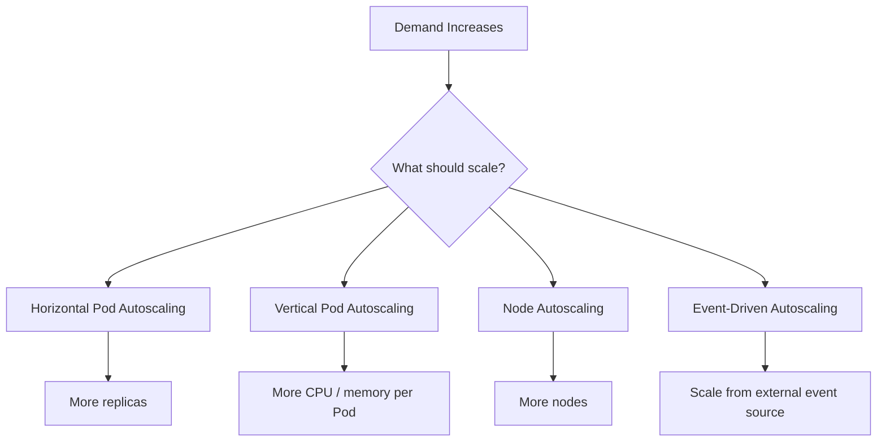
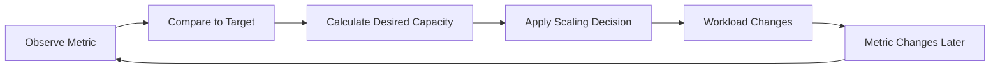
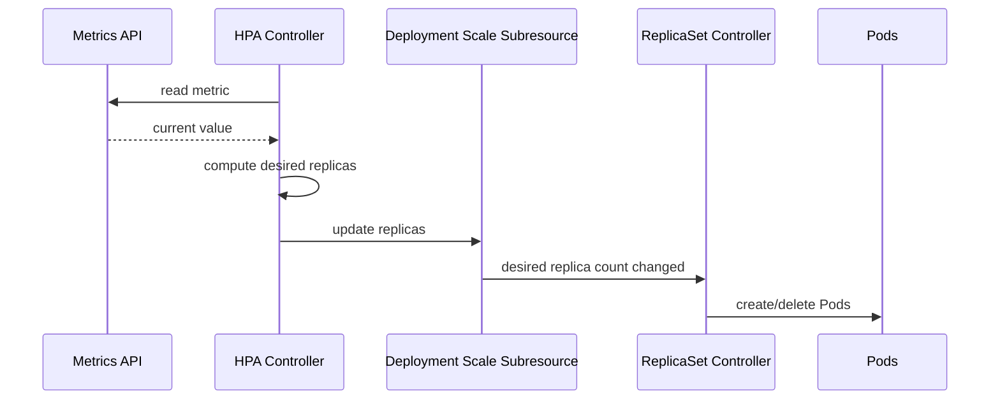
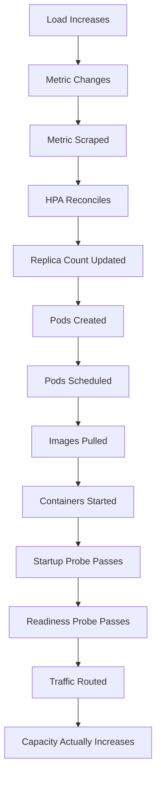
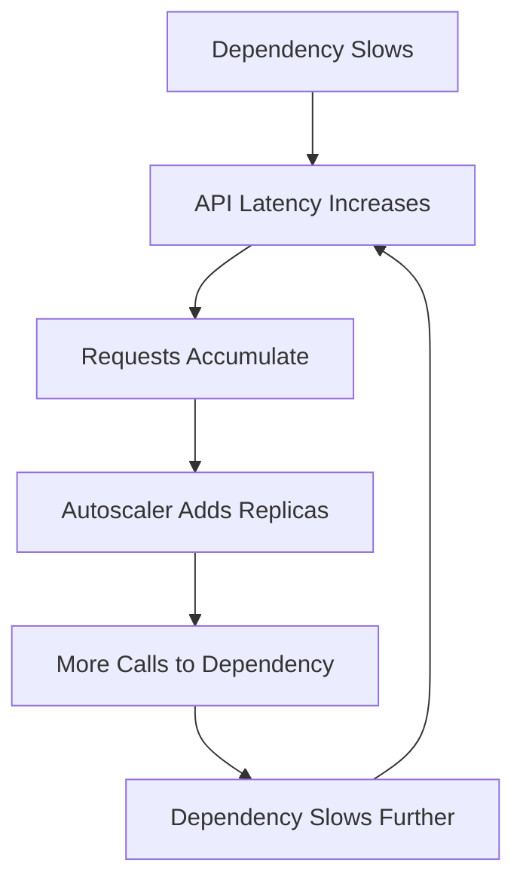
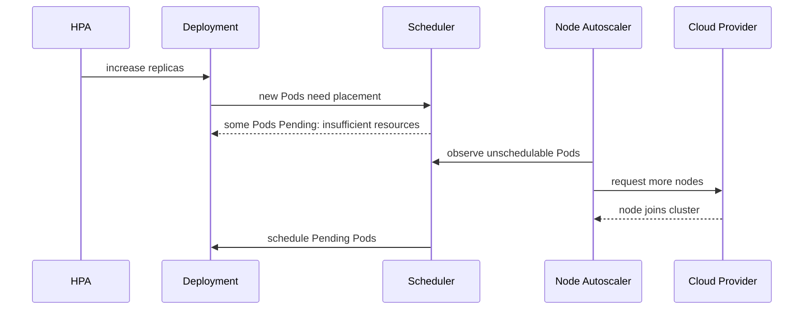
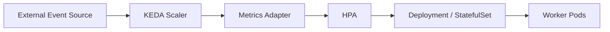
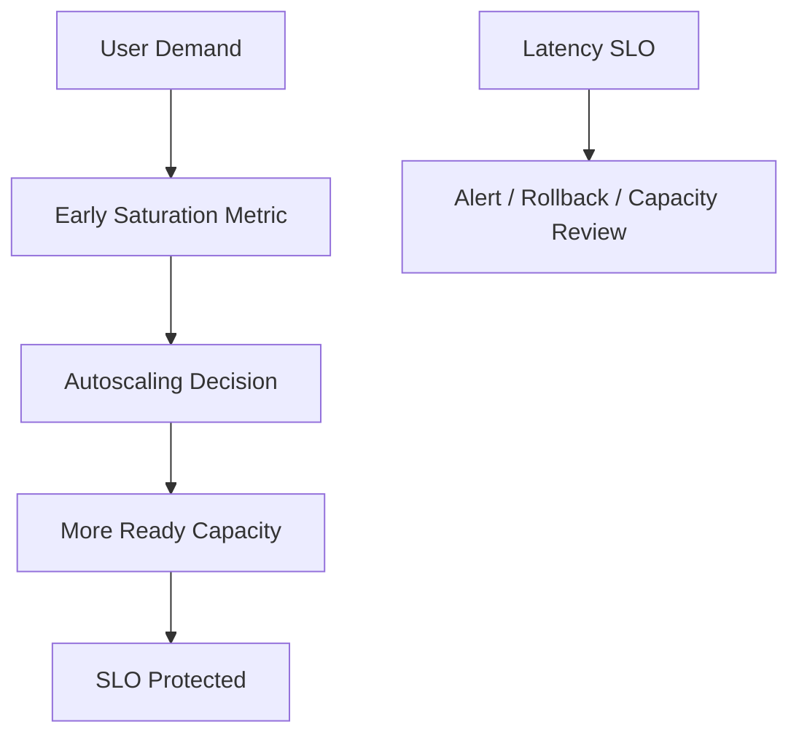
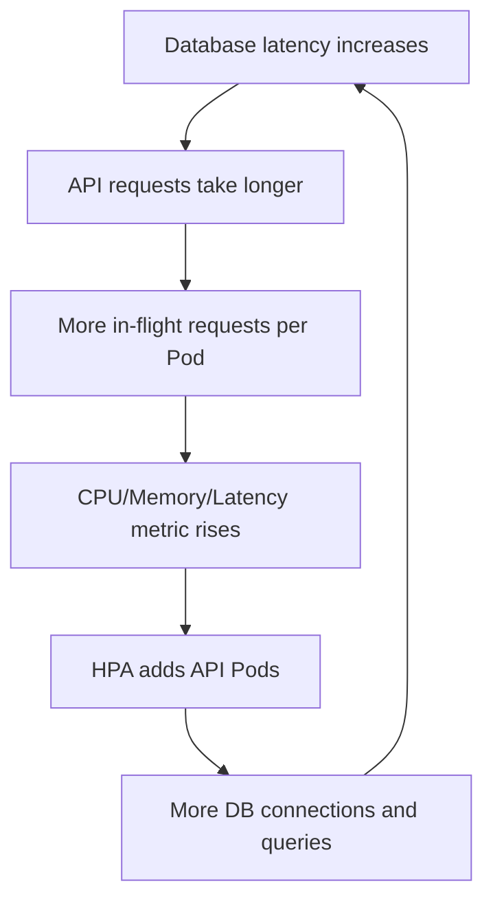

------
title: Learn Kubernetes, Deployment Model, and Cloud Native Platform Engineering - Part 014
description: Deep dive into Kubernetes autoscaling with HPA, VPA, node autoscaling, KEDA, metric selection, scaling lag, stability, SLO-aware scaling, and production failure modes.
series: learn-kubernetes-deployment-model
seriesTitle: Learn Kubernetes, Deployment Model, and Cloud Native Platform Engineering
order: 14
partTitle: Autoscaling: HPA, VPA, Cluster Autoscaler, and KEDA Patterns
tags:
- kubernetes
- deployment
- autoscaling
- hpa
- vpa
- keda
- reliability
- platform-engineering
date: 2026-07-01
---

# Part 014 — Autoscaling: HPA, VPA, Cluster Autoscaler, and KEDA Patterns

> Goal: understand Kubernetes autoscaling as a set of interacting control loops so you can design scaling policies that are stable, observable, cost-aware, and aligned with service-level objectives.

Autoscaling is not “add more Pods when CPU is high.”

That is the beginner version.

The production version is harder:

- Which signal predicts saturation early enough?
- How long does a new Pod take to become useful?
- Can nodes appear quickly enough?
- Will scaling one service overload a downstream dependency?
- Does HPA fight VPA?
- Does scale-down break connection draining or cache warmup?
- Does scaling to zero break latency SLOs?
- Does a queue scaler preserve ordering and idempotency?
- Does autoscaling reduce cost or create instability?

Autoscaling is a feedback system.

Bad feedback systems oscillate.

Good feedback systems preserve reliability while controlling cost.

---

## 1. Kaufman Deconstruction

Autoscaling can be decomposed into practical sub-skills.

| Sub-skill | What You Must Be Able To Do |
|---|---|
| Scaling taxonomy | Distinguish horizontal Pod scaling, vertical Pod scaling, and node scaling. |
| Metric reasoning | Select CPU, memory, custom, external, queue, or SLO metrics correctly. |
| Control-loop reasoning | Explain target, measurement interval, stabilization, tolerance, and lag. |
| HPA design | Configure safe HPA behavior for stateless workloads. |
| VPA design | Use VPA for recommendations or vertical adjustment without fighting HPA. |
| Node autoscaling | Understand how unschedulable Pods trigger node provisioning. |
| Event-driven scaling | Use KEDA-like patterns for queue/event workloads. |
| Failure modelling | Diagnose scaling lag, oscillation, under-scaling, over-scaling, and cascading failure. |
| Governance | Define platform-safe scaling defaults, max replicas, quotas, and cost boundaries. |

The highest-value skill is **choosing the correct scaling signal**.

Wrong metric, wrong system.

---

## 2. Autoscaling Taxonomy

Kubernetes autoscaling exists at multiple layers.



| Scaling Type | What Changes | Common Tool | Best For |
|---|---|---|---|
| Horizontal workload scaling | Number of Pods | HPA | Stateless APIs, workers, horizontally partitionable services. |
| Vertical workload scaling | Requests/limits per Pod | VPA | Right-sizing, memory-heavy workloads, workloads that cannot scale horizontally well. |
| Node scaling | Number/shape of nodes | Cluster Autoscaler, Karpenter, cloud autoscaler | Cluster capacity elasticity. |
| Event-driven scaling | Replicas based on external event source | KEDA | Queue consumers, stream workers, scheduled/event workloads. |

These systems interact.

That interaction is where many production problems happen.

---

## 3. The Control Loop Model

Autoscaling is a control loop:



Every autoscaler has these concepts:

| Concept | Meaning |
|---|---|
| Signal | What metric is observed. |
| Target | Desired value or threshold. |
| Actuator | What the autoscaler changes. |
| Delay | Time between scaling decision and useful capacity. |
| Stabilization | Logic to avoid rapid oscillation. |
| Bounds | Minimum and maximum allowed capacity. |
| Cooldown | Delay before another scaling action. |
| Ownership | Which controller owns which field. |

Top engineers think about autoscaling like this:

```text
scaling decision must happen early enough that new capacity becomes ready before SLO damage occurs
```

That means startup time matters.

Image pull time matters.

Readiness probe matters.

Node provisioning time matters.

Cache warmup matters.

Connection draining matters.

---

## 4. Horizontal Pod Autoscaler Mental Model

Horizontal Pod Autoscaler changes replica count for scalable workload resources such as Deployment or StatefulSet.

Simplified HPA equation:

```text
desiredReplicas = ceil(currentReplicas * currentMetricValue / desiredMetricValue)
```

Example:

```text
currentReplicas: 4
current CPU utilization: 80%
target CPU utilization: 40%

desiredReplicas = ceil(4 * 80 / 40) = 8
```

HPA does not directly create Pods.

It updates the `scale` subresource of the target workload.

Then the target controller creates or removes Pods.



---

## 5. HPA Metric Types

HPA can use several metric categories depending on available metrics APIs.

| Metric Type | Example | Use Case |
|---|---|---|
| Resource metric | CPU, memory | Basic workload scaling. |
| Container resource metric | CPU for a specific container | Sidecar-heavy Pods where app container matters more than proxy. |
| Pods metric | requests per second per Pod | Application-level scaling. |
| Object metric | queue length on a Kubernetes object | Workload tied to object-level metric. |
| External metric | cloud queue depth, Kafka lag, SaaS metric | Event/external demand scaling. |

CPU is common.

CPU is not always correct.

---

## 6. CPU-Based HPA

Example:

```yaml
apiVersion: autoscaling/v2
kind: HorizontalPodAutoscaler
metadata:
  name: api
spec:
  scaleTargetRef:
    apiVersion: apps/v1
    kind: Deployment
    name: api
  minReplicas: 3
  maxReplicas: 30
  metrics:
    - type: Resource
      resource:
        name: cpu
        target:
          type: Utilization
          averageUtilization: 60
```

This means:

> Keep average CPU utilization near 60% of requested CPU across Pods.

Important implication:

CPU utilization is relative to CPU requests.

If CPU request is wrong, HPA behavior is wrong.

### 6.1 Example: Request Calibration Problem

Actual CPU usage per Pod:

```text
300m
```

Case A:

```text
request: 100m
observed utilization: 300%
```

Case B:

```text
request: 1000m
observed utilization: 30%
```

Same workload.

Different autoscaling decision.

Resource requests are HPA calibration constants.

---

## 7. Memory-Based HPA

Memory-based HPA is usually less reliable for request/latency-driven APIs.

Why?

Memory often does not fall immediately when load falls.

Common memory behavior:

- JVM heap retains allocation,
- caches keep memory intentionally,
- Go runtime may hold heap pages,
- buffers are reused,
- memory fragmentation persists,
- GC timing is independent of request demand.

Memory is useful for scaling when memory correlates with work volume, such as:

- per-tenant cache shards,
- data processing workers,
- batch processors,
- in-memory computation.

But for many APIs:

```text
high memory != immediate need for more replicas
low memory != safe from latency saturation
```

Use memory HPA only when the resource is a causal demand signal.

---

## 8. Application-Level Metrics

For production APIs, better signals often include:

- requests per second per Pod,
- concurrent requests,
- queue depth,
- worker pool utilization,
- event loop lag,
- p95/p99 latency,
- saturation score,
- in-flight jobs,
- Kafka consumer lag,
- RabbitMQ queue depth,
- SQS visible messages,
- database connection pool saturation.

But application metrics must be designed carefully.

A good scaling metric should be:

| Property | Explanation |
|---|---|
| Causal | It should represent actual demand or saturation. |
| Timely | It should change before user impact is severe. |
| Stable | It should not fluctuate wildly with noise. |
| Partitionable | It should improve when replicas increase. |
| Observable | It should be available to autoscaling infrastructure. |
| Safe | It should not hide downstream bottlenecks. |

A bad metric causes scaling illusions.

Example:

```text
Scale API replicas based on database CPU.
```

This may increase API traffic into an already overloaded database.

---

## 9. Scaling APIs with RPS per Pod

A common pattern:

```text
scale out when average requests per ready Pod exceeds safe throughput
```

If one Pod can safely handle 100 RPS at p95 latency target, and incoming traffic is 800 RPS:

```text
required replicas = ceil(800 / 100) = 8
```

Add headroom:

```text
replicas = ceil(required * 1.2)
```

This is often more meaningful than CPU if:

- service is I/O-bound,
- CPU usage is not saturation signal,
- latency fails before CPU is high,
- external calls dominate request time.

But RPS alone can be misleading if request cost varies.

For heterogeneous APIs, consider weighted request cost.

---

## 10. Scaling Workers with Queue Depth

For queue workers, scaling is usually based on backlog.

Simplified model:

```text
required workers = ceil(queue_depth / target_messages_per_worker)
```

Better model:

```text
required workers = arrival_rate / processing_rate_per_worker
```

With drain-time SLO:

```text
required workers = ceil(queue_depth / desired_drain_time / processing_rate_per_worker)
```

Example:

```text
queue depth: 12,000 messages
desired drain time: 10 minutes
worker processing rate: 10 messages/sec

required workers = ceil(12000 / 600 / 10) = 2
```

But if messages are heterogeneous, use percentiles and partitions.

Queue scaling must consider:

- message ordering,
- partition count,
- max consumers per partition,
- duplicate delivery,
- idempotency,
- dead-letter queues,
- retry storms,
- downstream rate limits,
- poison messages.

---

## 11. HPA Behavior Configuration

Autoscaling/v2 supports behavior controls.

Example:

```yaml
apiVersion: autoscaling/v2
kind: HorizontalPodAutoscaler
metadata:
  name: api
spec:
  scaleTargetRef:
    apiVersion: apps/v1
    kind: Deployment
    name: api
  minReplicas: 3
  maxReplicas: 50
  metrics:
    - type: Resource
      resource:
        name: cpu
        target:
          type: Utilization
          averageUtilization: 60
  behavior:
    scaleUp:
      stabilizationWindowSeconds: 60
      policies:
        - type: Percent
          value: 100
          periodSeconds: 60
        - type: Pods
          value: 10
          periodSeconds: 60
      selectPolicy: Max
    scaleDown:
      stabilizationWindowSeconds: 300
      policies:
        - type: Percent
          value: 25
          periodSeconds: 60
      selectPolicy: Min
```

Intent:

- scale up aggressively enough to protect SLO,
- scale down slowly enough to avoid oscillation,
- limit destructive changes,
- maintain cost control.

Scale-up and scale-down should not be symmetric.

Reliability usually values fast scale-up and conservative scale-down.

---

## 12. Scaling Lag

Autoscaling is delayed by multiple steps.



Total scaling lag can include:

- scrape interval,
- HPA sync interval,
- scheduler latency,
- image pull time,
- node provisioning time,
- application startup,
- cache warmup,
- readiness delay,
- load balancer propagation,
- connection pool warmup.

If load spikes faster than capacity becomes ready, autoscaling will be late.

This is why min replicas matter.

---

## 13. Min Replicas Are Reliability Budget

`minReplicas` is not waste by default.

It is pre-warmed capacity.

Example:

```yaml
minReplicas: 6
maxReplicas: 60
```

Reasons to keep non-trivial minimum replicas:

- absorb sudden spikes,
- tolerate one node/zone failure,
- maintain connection pool capacity,
- keep caches warm,
- avoid cold-start latency,
- survive rolling update surge constraints,
- maintain HA under PodDisruptionBudget.

Scaling to zero is useful for some workloads, but dangerous for latency-sensitive services.

---

## 14. Max Replicas Are Blast-Radius Control

`maxReplicas` prevents runaway scale.

Example:

```yaml
maxReplicas: 100
```

Without upper bounds, failure can amplify:



This is a common cascading failure pattern.

Autoscaling must respect downstream limits.

Max replicas should be derived from:

- downstream capacity,
- database connection limits,
- queue partition count,
- API rate limits,
- cost limit,
- cluster capacity,
- business priority.

---

## 15. HPA and Readiness

HPA calculates metrics for Pods, but traffic only flows to ready Pods.

A new Pod is not useful until it is ready.

Readiness design affects autoscaling.

Bad pattern:

```yaml
readinessProbe:
  httpGet:
    path: /health
    port: 8080
  initialDelaySeconds: 0
```

If `/health` returns ready before caches, connections, or migrations are complete, traffic reaches an underprepared Pod.

Better readiness checks should represent serving capacity.

A Pod should become ready only when it can safely receive production traffic.

---

## 16. HPA and Rolling Deployment Interaction

During rolling updates:

- Deployment changes Pod template.
- ReplicaSet creates new Pods.
- HPA may change replica count at the same time.
- Readiness controls traffic admission.
- PodDisruptionBudget may constrain voluntary disruption.

Failure case:

```text
rollout starts during traffic spike
HPA scales up old/new ReplicaSets
cluster lacks surge capacity
new Pods remain Pending
old Pods overloaded
latency SLO burns
```

Production safeguards:

- maintain surge capacity,
- use conservative `maxUnavailable`,
- monitor rollout and HPA together,
- avoid major releases during known peaks,
- use progressive delivery gates,
- keep images small and pre-pull where useful,
- tune startup/readiness probes.

---

## 17. Vertical Pod Autoscaler

Vertical Pod Autoscaler adjusts or recommends CPU/memory requests for Pods.

VPA is useful because most teams guess requests poorly.

Common modes:

| Mode | Behavior | Use Case |
|---|---|---|
| `Off` | Only provides recommendations. | Safe analysis, reporting, PR suggestions. |
| `Initial` | Applies recommendation only at Pod creation. | Improve new Pods without live eviction. |
| `Recreate` / `Auto` | Can evict Pods to apply new resources. | Workloads that tolerate restart. |

Example:

```yaml
apiVersion: autoscaling.k8s.io/v1
kind: VerticalPodAutoscaler
metadata:
  name: api-vpa
spec:
  targetRef:
    apiVersion: apps/v1
    kind: Deployment
    name: api
  updatePolicy:
    updateMode: "Off"
```

In production, start with recommendation mode.

Use VPA as a measurement tool before using it as an actuator.

---

## 18. HPA vs VPA Interaction

HPA and VPA can conflict.

Why?

- HPA may use CPU utilization relative to requests.
- VPA changes CPU requests.
- Changing requests changes HPA utilization math.

Example:

```text
Current CPU usage: 500m
Old request: 500m -> utilization 100%
New VPA request: 1000m -> utilization 50%
```

Same actual usage.

Different HPA decision.

Avoid unsafe combinations.

Safer combinations:

| HPA Metric | VPA Mode | Risk |
|---|---|---|
| CPU utilization | VPA Auto | High interaction risk. |
| External metric | VPA Auto | Lower interaction risk. |
| CPU utilization | VPA Off | Safe recommendation mode. |
| Custom saturation metric | VPA Initial | Often workable. |

Rule of thumb:

Use HPA to scale replicas.

Use VPA to right-size requests.

Be explicit about ownership of capacity decisions.

---

## 19. Node Autoscaling

Node autoscaling adds or removes cluster nodes.

It usually reacts to Pods that cannot schedule due to insufficient capacity.



Node autoscaling does not respond directly to application latency.

It responds to scheduling pressure.

If Pods are overloaded but HPA does not create more Pods, node autoscaling may do nothing.

If HPA creates more Pods but their requests are too small, node autoscaling may also do nothing because the scheduler thinks they fit existing nodes.

This is another reason requests matter.

---

## 20. Cluster Autoscaler Mental Model

Cluster Autoscaler generally asks:

1. Are there unschedulable Pods?
2. Would adding a node group/node shape make them schedulable?
3. Can cloud provider provision such a node?
4. Are there underutilized nodes that can be removed safely?

Failure cases:

| Symptom | Possible Cause |
|---|---|
| Pods Pending, no scale-up | Node group max reached, quota limit, unsupported constraints, wrong taints/labels, PV zone conflict. |
| Scale-up slow | Cloud provisioning latency, image pull, node bootstrap, CNI readiness. |
| Scale-down blocked | PDB, local storage, system Pods, DaemonSet overhead, unsafe eviction. |
| New nodes created but Pods still Pending | Node labels/taints do not match, resource shape too small, topology constraints impossible. |

---

## 21. Karpenter-Style Node Provisioning

Many modern Kubernetes platforms use dynamic node provisioning systems that choose node shapes based on pending Pods.

The mental model is similar but more flexible than fixed node groups:

```text
Pending Pod constraints -> provision suitable node -> schedule Pod -> consolidate later
```

Benefits:

- better bin-packing,
- faster capacity matching,
- fewer predefined node groups,
- workload-aware node shape selection,
- consolidation for cost control.

Risks:

- policy complexity,
- cloud quota surprises,
- instance availability constraints,
- interruption handling,
- cost unpredictability if limits are weak.

Even with smarter node provisioning, bad Pod requests still cause bad infrastructure decisions.

---

## 22. KEDA and Event-Driven Autoscaling

KEDA is commonly used to scale Kubernetes workloads based on external event sources.

Examples:

- Kafka lag,
- RabbitMQ queue length,
- AWS SQS messages,
- Azure Queue,
- Prometheus query,
- Redis stream length,
- cron schedule,
- custom external scaler.

KEDA often creates/manages HPA resources behind the scenes.



Example ScaledObject:

```yaml
apiVersion: keda.sh/v1alpha1
kind: ScaledObject
metadata:
  name: invoice-worker
spec:
  scaleTargetRef:
    name: invoice-worker
  minReplicaCount: 0
  maxReplicaCount: 50
  pollingInterval: 30
  cooldownPeriod: 300
  triggers:
    - type: prometheus
      metadata:
        serverAddress: http://prometheus.monitoring.svc:9090
        metricName: invoice_queue_depth
        query: sum(invoice_queue_depth)
        threshold: "100"
```

Scaling to zero is one of KEDA’s attractive features.

But scale-to-zero requires careful cold-start design.

---

## 23. Event-Driven Scaling Failure Modes

Queue/event scaling looks easy but has deep failure modes.

### 23.1 Poison Message Amplification

A bad message keeps failing.

Autoscaler sees backlog.

It creates more workers.

More workers retry the same poison class.

Downstream systems degrade.

Mitigation:

- dead-letter queues,
- retry budget,
- message validation,
- idempotency keys,
- backoff,
- per-error-class metrics.

### 23.2 Downstream Rate Limit Violation

More workers consume faster than downstream API/database can handle.

Mitigation:

- global concurrency limit,
- token bucket,
- rate limiter,
- max replicas based on downstream capacity,
- circuit breaker.

### 23.3 Partition Ceiling

Kafka-like systems have partition limits.

If topic has 12 partitions, 100 consumers may not improve throughput.

Mitigation:

```text
max useful replicas <= partition count
```

Unless each Pod handles multiple consumer groups or workload is structured differently.

### 23.4 Scale-to-Zero Cold Start

Backlog appears.

KEDA scales from zero.

Pods start slowly.

Messages wait.

Latency SLO fails.

Mitigation:

- nonzero minimum replica count,
- pre-warmed pool,
- smaller images,
- faster startup,
- predictive schedule-based scaling,
- separate urgent queue from batch queue.

---

## 24. Metric Selection Framework

Choose metrics based on workload type.

| Workload | Good Scaling Signal | Weak Signal |
|---|---|---|
| CPU-bound compute | CPU utilization, queue depth | RPS alone |
| I/O-bound API | RPS per Pod, latency, concurrency | CPU alone |
| JVM API | RPS/concurrency + GC + latency | memory alone |
| Queue worker | queue depth, lag, drain time | CPU alone |
| Kafka consumer | consumer lag per partition | total replicas only |
| WebSocket service | active connections, session count | request rate |
| Batch processor | pending jobs, estimated work units | memory alone |
| ML inference | GPU utilization, queue latency, model load time | CPU alone |
| Cron burst workload | schedule + backlog | reactive CPU |

A scaling signal should represent the bottleneck you can relieve by scaling replicas.

If adding replicas does not improve the signal, do not use that signal for HPA.

---

## 25. SLO-Aware Autoscaling

Autoscaling should protect service-level objectives.

A naive CPU HPA may scale only after latency is already bad.

SLO-aware thinking asks:

```text
What early saturation signal predicts SLO burn?
```

Potential signals:

- queueing delay,
- request concurrency,
- event loop lag,
- thread pool saturation,
- p95 latency derivative,
- error budget burn rate,
- admission rejection rate,
- worker backlog age,
- time-to-drain.

A practical SLO-aware pattern:



Do not wait for p99 latency to be broken before scaling.

Latency is often a late symptom.

---

## 26. Scale-Up vs Scale-Down Strategy

Scale-up and scale-down have different risk profiles.

| Direction | Reliability Risk | Cost Risk | Recommended Behavior |
|---|---|---|---|
| Scale up too slow | High | Low | Prefer faster but bounded scale-up. |
| Scale up too fast | Medium | High | Bound with max replicas and downstream capacity. |
| Scale down too slow | Low | Medium | Often acceptable for critical services. |
| Scale down too fast | High | Low | Avoid; causes oscillation and cold-start churn. |

General principle:

```text
scale up fast enough to protect users; scale down slowly enough to protect stability
```

---

## 27. Oscillation

Oscillation happens when replicas repeatedly scale up and down.

Symptoms:

- replica count flaps,
- latency unstable,
- caches constantly cold,
- connection pools churn,
- cost spikes,
- logs show frequent Pod creation/deletion,
- HPA events alternate scale-up/scale-down.

Causes:

- noisy metric,
- target too aggressive,
- scale-down too fast,
- startup time ignored,
- short stabilization window,
- metric delayed relative to action,
- load balancer distribution uneven,
- readiness too early,
- low min replicas.

Mitigation:

- longer scale-down stabilization,
- higher min replicas,
- smoother metric aggregation,
- workload-specific scaling metric,
- startup/readiness tuning,
- conservative scale-down policy,
- separate batch and interactive traffic.

---

## 28. Cascading Failure Through Autoscaling

Autoscaling can amplify failure.

Scenario:



Autoscaler thinks demand increased.

Actually, dependency capacity decreased.

Mitigations:

- downstream-aware max replicas,
- connection pool limits,
- circuit breakers,
- bulkheads,
- backpressure,
- load shedding,
- queue admission control,
- dependency saturation alerts,
- scale on ingress demand rather than blocked in-flight requests when appropriate.

Autoscaling is not a replacement for resilience patterns.

---

## 29. Autoscaling and Cost

Autoscaling can reduce waste.

It can also increase cost unpredictably.

Cost controls:

- max replicas,
- namespace ResourceQuota,
- cluster/node pool limits,
- PriorityClass,
- scheduled scaling windows,
- per-team cost reports,
- idle replica detection,
- VPA recommendation reports,
- scale-down stabilization policy,
- reserved baseline for predictable workloads.

Cost should not be optimized independently of reliability.

A service that saves 20% compute but violates SLO is not optimized.

---

## 30. Platform Defaults

A platform team should provide safe autoscaling templates.

### 30.1 Stateless API Default

```yaml
apiVersion: autoscaling/v2
kind: HorizontalPodAutoscaler
metadata:
  name: api
spec:
  scaleTargetRef:
    apiVersion: apps/v1
    kind: Deployment
    name: api
  minReplicas: 3
  maxReplicas: 30
  metrics:
    - type: Resource
      resource:
        name: cpu
        target:
          type: Utilization
          averageUtilization: 60
  behavior:
    scaleUp:
      stabilizationWindowSeconds: 60
      policies:
        - type: Percent
          value: 100
          periodSeconds: 60
      selectPolicy: Max
    scaleDown:
      stabilizationWindowSeconds: 300
      policies:
        - type: Percent
          value: 25
          periodSeconds: 60
      selectPolicy: Min
```

Use as starting point, not universal truth.

### 30.2 Queue Worker Default

```yaml
apiVersion: keda.sh/v1alpha1
kind: ScaledObject
metadata:
  name: worker
spec:
  scaleTargetRef:
    name: worker
  minReplicaCount: 1
  maxReplicaCount: 50
  pollingInterval: 30
  cooldownPeriod: 300
  triggers:
    - type: prometheus
      metadata:
        serverAddress: http://prometheus.monitoring.svc:9090
        metricName: queue_depth
        query: sum(queue_depth)
        threshold: "100"
```

Require teams to document:

- processing rate per worker,
- downstream capacity,
- retry behavior,
- idempotency model,
- max useful replicas,
- drain-time objective.

### 30.3 VPA Recommendation Default

```yaml
apiVersion: autoscaling.k8s.io/v1
kind: VerticalPodAutoscaler
metadata:
  name: api-vpa
spec:
  targetRef:
    apiVersion: apps/v1
    kind: Deployment
    name: api
  updatePolicy:
    updateMode: "Off"
```

Use recommendations to improve sizing through pull requests.

---

## 31. Autoscaling Review Checklist

### Workload Suitability

- Is the service horizontally scalable?
- Is state externalized or partitioned safely?
- Can new replicas become useful quickly?
- Does adding replicas increase downstream pressure?

### Metrics

- Is the metric causal?
- Does adding replicas reduce the metric?
- Is the metric available with low enough latency?
- Is the metric stable enough for control?
- Is the target derived from load tests or guesses?

### HPA Configuration

- Are `minReplicas` and `maxReplicas` justified?
- Is scale-up fast enough?
- Is scale-down conservative enough?
- Is CPU request calibrated?
- Are startup and readiness probes correct?

### Node Capacity

- Can new Pods schedule immediately?
- Does cluster autoscaler have matching node groups?
- Are quotas and cloud limits sufficient?
- Does rollout surge require extra capacity?

### Reliability

- Are downstream systems protected?
- Are circuit breakers and backpressure in place?
- Are PDBs compatible with scaling and rollout?
- Are scale events monitored and alerted?

### Cost

- Are max replicas bounded?
- Is namespace quota set?
- Are idle replicas reported?
- Are scale-to-zero workloads safe?

---

## 32. Debugging Autoscaling

### 32.1 HPA Not Scaling Up

Commands:

```bash
kubectl get hpa
kubectl describe hpa <name>
kubectl top pods
kubectl top nodes
kubectl describe deployment <name>
```

Look for:

- missing metrics,
- unknown metric values,
- CPU requests missing,
- max replicas reached,
- target metric not exceeded,
- stabilization behavior,
- scale target not found,
- Pods not ready,
- resource metrics server issue.

### 32.2 HPA Scales But Pods Pending

Commands:

```bash
kubectl get pods
kubectl describe pod <pending-pod>
kubectl get events --sort-by=.lastTimestamp
kubectl describe nodes
```

Look for:

- insufficient CPU/memory,
- taints not tolerated,
- node affinity mismatch,
- topology constraints,
- quota exhaustion,
- node autoscaler max reached,
- cloud provider quota.

### 32.3 HPA Oscillates

Commands:

```bash
kubectl describe hpa <name>
kubectl get events --sort-by=.lastTimestamp
```

Investigate:

- metric noise,
- target too low,
- scale-down stabilization too short,
- readiness too early,
- workload cold-start,
- uneven traffic distribution.

### 32.4 KEDA Not Scaling

Commands:

```bash
kubectl get scaledobject
kubectl describe scaledobject <name>
kubectl get hpa
kubectl logs -n keda deploy/keda-operator
```

Investigate:

- trigger authentication,
- metric query validity,
- external source connectivity,
- polling interval,
- cooldown period,
- max replicas,
- generated HPA behavior.

---

## 33. Design Scenario: API Service

Service profile:

```text
service: payment-api
traffic: spiky during checkout campaigns
bottleneck: CPU + downstream payment gateway latency
startup time: 45 seconds
safe per-pod RPS: 80
criticality: high
```

Bad autoscaling design:

```yaml
minReplicas: 1
maxReplicas: 200
cpu target: 90%
```

Why bad:

- min replicas too low for spike absorption,
- CPU target too high for latency-sensitive workload,
- max replicas may overwhelm payment gateway,
- startup time ignored,
- downstream capacity ignored.

Better design:

```text
minReplicas: enough to absorb normal spike while new Pods start
maxReplicas: bounded by gateway connection/rate limit
metric: RPS per ready Pod + CPU saturation
scale-up: aggressive but bounded
scale-down: conservative
readiness: only true after gateway pool and cache warmup
```

Potential HPA:

```yaml
minReplicas: 8
maxReplicas: 40
metrics:
  - type: Resource
    resource:
      name: cpu
      target:
        type: Utilization
        averageUtilization: 60
```

And possibly custom metric:

```text
requests_per_second_per_ready_pod <= 70
```

---

## 34. Design Scenario: Queue Worker

Service profile:

```text
service: invoice-worker
source: queue
SLO: process 95% of invoices within 10 minutes
processing rate: 5 invoices/sec/Pod
max downstream DB writes: 300 writes/sec
idempotency: yes
poison message handling: DLQ
```

Derived max replicas:

```text
max by DB = 300 / 5 = 60 Pods
```

But include safety margin:

```text
maxReplicas = 40 or 50
```

Derived queue threshold:

```text
one Pod can process 5 msg/sec
in 10 minutes = 3000 messages
```

But scale earlier to protect p95, perhaps threshold:

```text
500-1000 messages per Pod
```

Design:

- KEDA ScaledObject based on queue depth or queue age,
- max replicas capped by downstream writes,
- retry budget,
- DLQ,
- worker concurrency bounded,
- idempotency key enforced,
- alert on oldest message age.

---

## 35. Autoscaling Maturity Model

| Level | Behavior |
|---|---|
| 0 | Manual replica changes. |
| 1 | Basic CPU HPA with guessed requests. |
| 2 | Calibrated HPA with good min/max and behavior policies. |
| 3 | Custom metrics for workload-specific saturation. |
| 4 | Integrated node autoscaling and quota governance. |
| 5 | Event-driven autoscaling with KEDA-like triggers and safe queue semantics. |
| 6 | SLO-aware scaling with downstream protection and progressive delivery integration. |
| 7 | Predictive or scheduled capacity for known demand patterns, with auditability and cost controls. |

Most organizations are between Level 1 and Level 3.

Top platforms move toward Level 5+ but avoid opaque automation that operators cannot debug.

---

## 36. Top 1% Mental Models

### 36.1 Autoscaling Is a Control System

Treat every scaler as observe-decide-act loop with delay and feedback.

### 36.2 Metric Choice Is Architecture

Your scaling metric encodes what you believe the bottleneck is.

### 36.3 Min Replicas Are Pre-Warmed Reliability

Zero or one replica is often a false economy for production APIs.

### 36.4 Max Replicas Are Failure Containment

Unbounded scale can amplify downstream failure.

### 36.5 HPA Needs Correct Requests

CPU-based HPA depends on request calibration.

Bad requests create bad scaling behavior.

### 36.6 VPA Is First a Recommendation Engine

Use VPA to learn before allowing it to mutate production capacity.

### 36.7 Node Autoscaling Follows Scheduling Pressure

If Pods do not become unschedulable, node autoscaling may not add capacity.

### 36.8 Scaling Does Not Replace Backpressure

Autoscaling adds capacity.

Backpressure preserves the system when capacity is not enough.

---

## 37. Practice Lab

### Lab 1 — CPU HPA

Deploy a CPU-bound app with requests.

Create HPA:

```bash
kubectl autoscale deployment cpu-demo --cpu-percent=50 --min=1 --max=10
```

Generate load and observe:

```bash
kubectl get hpa -w
kubectl get pods -w
```

### Lab 2 — Request Calibration

Run the same workload with different CPU requests:

- `100m`,
- `500m`,
- `1000m`.

Observe HPA utilization changes.

### Lab 3 — Pending Pods and Node Autoscaling

Set HPA max replicas high and requests large enough to exceed current cluster.

Observe:

- Pending Pods,
- scheduler events,
- node autoscaler behavior,
- time to useful capacity.

### Lab 4 — Scale-Down Oscillation

Use aggressive scale-down policy and bursty load.

Observe replica flapping.

Then add longer stabilization window.

### Lab 5 — Queue-Based Scaling

Use KEDA or external metrics to scale a worker from queue depth.

Verify:

- idempotency,
- DLQ behavior,
- max replica cap,
- drain-time objective.

---

## 38. Summary

Autoscaling is not a checkbox.

It is production control theory applied to workloads, metrics, nodes, cost, and reliability.

Key takeaways:

- HPA changes replica count based on metrics.
- CPU HPA depends heavily on accurate CPU requests.
- Memory HPA is useful only when memory causally represents demand.
- Application and external metrics are often better for real production scaling.
- Scaling lag includes metrics, scheduling, image pull, startup, readiness, and node provisioning.
- Min replicas protect availability and cold-start risk.
- Max replicas control blast radius and cost.
- VPA is valuable for right-sizing, but it can conflict with HPA if both affect the same control signal.
- Node autoscaling reacts to unschedulable Pods, not directly to user latency.
- KEDA enables event-driven scaling but requires queue semantics, idempotency, retry control, and downstream protection.
- Autoscaling can amplify cascading failure if not bounded.
- SLO-aware autoscaling requires early saturation signals, not only late symptoms.

In the next part, we move into Kubernetes networking: Service discovery, Service types, EndpointSlice, DNS, kube-proxy, load balancing, and the mental model of east-west traffic inside the cluster.

---

## References

- Kubernetes Documentation — Horizontal Pod Autoscaling: https://kubernetes.io/docs/concepts/workloads/autoscaling/horizontal-pod-autoscale/
- Kubernetes Documentation — Autoscaling Workloads: https://kubernetes.io/docs/concepts/workloads/autoscaling/
- Kubernetes Documentation — HorizontalPodAutoscaler Walkthrough: https://kubernetes.io/docs/tasks/run-application/horizontal-pod-autoscale-walkthrough/
- Kubernetes Documentation — Vertical Pod Autoscaling: https://kubernetes.io/docs/concepts/workloads/autoscaling/vertical-pod-autoscale/
- Kubernetes Documentation — Node Autoscaling: https://kubernetes.io/docs/concepts/cluster-administration/node-autoscaling/
- Kubernetes Documentation — Resource Metrics Pipeline: https://kubernetes.io/docs/tasks/debug/debug-cluster/resource-metrics-pipeline/
- KEDA Documentation — Kubernetes Event-driven Autoscaling: https://keda.sh/
- KEDA Documentation — Scaling Deployments, StatefulSets, and Custom Resources: https://keda.sh/docs/2.20/concepts/scaling-deployments/
