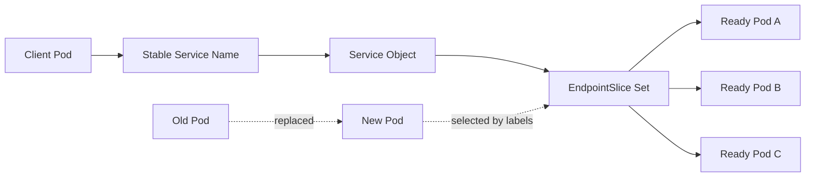
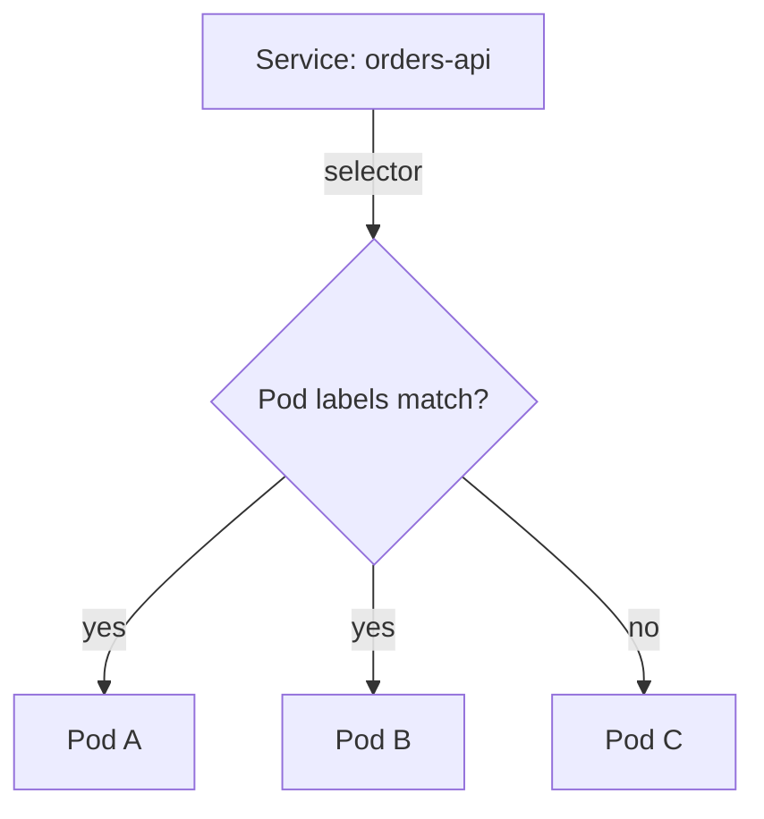
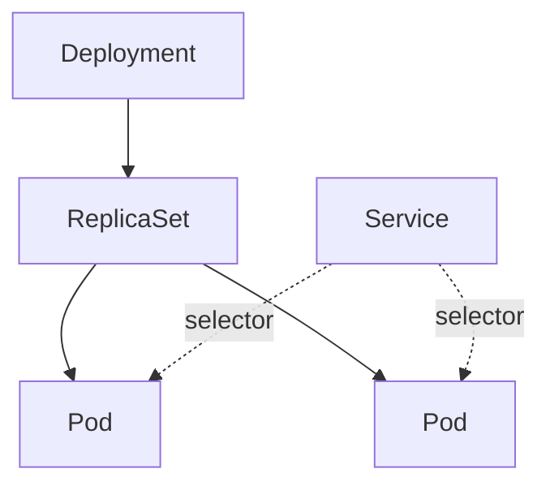
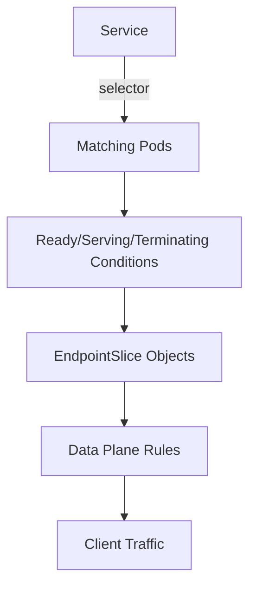
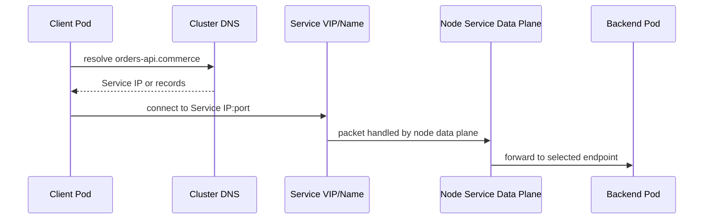
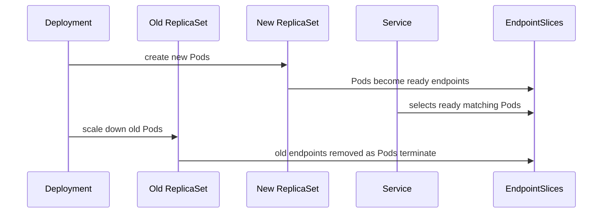

------
title: Learn Kubernetes, Deployment Model, and Cloud Native Platform Engineering - Part 015
description: Deep dive into Kubernetes Service discovery, Services, EndpointSlices, DNS, kube-proxy, service types, traffic semantics, and production networking failure modes.
series: learn-kubernetes-deployment-model
seriesTitle: Learn Kubernetes, Deployment Model, and Cloud Native Platform Engineering
order: 15
partTitle: Service Discovery and Kubernetes Networking Model
tags:
- kubernetes
- deployment
- networking
- service-discovery
- service
- endpointslice
- dns
- platform-engineering
date: 2026-07-01
---

# Part 015 — Service Discovery and Kubernetes Networking Model

> Goal: understand how Kubernetes gives unstable Pods a stable network identity through Services, EndpointSlices, DNS, and data-plane programming, so you can design service-to-service communication that is resilient, debuggable, scalable, and safe under rollout.

A Pod is not a stable server.

A Pod is an ephemeral execution unit.

It can be replaced, rescheduled, restarted, evicted, or scaled away. Its IP can disappear. Its process can be healthy, unhealthy, terminating, or not yet ready. If other workloads connect directly to Pod IPs, they couple themselves to the least stable object in the workload model.

Kubernetes solves this with a service discovery layer.

At minimum, that layer provides:

- a stable name;
- a stable virtual endpoint;
- backend selection by label;
- readiness-aware endpoint membership;
- load distribution across matching backends;
- integration with DNS;
- a decoupling point between clients and Pods.

The beginner thinks a Service is “a load balancer.”

The production engineer thinks a Service is **a stable contract over a dynamic set of endpoints**.

That distinction matters.

---

## 1. Kaufman Deconstruction

Service discovery can be decomposed into a small set of sub-skills.

| Sub-skill | What You Must Be Able To Do |
|---|---|
| Service mental model | Explain why clients should depend on Services, not Pods. |
| Selector reasoning | Predict which Pods become backends for a Service. |
| EndpointSlice reasoning | Inspect the real backend set behind a Service. |
| DNS reasoning | Resolve service names across namespaces and understand DNS search paths. |
| Service type selection | Choose ClusterIP, Headless, NodePort, LoadBalancer, or ExternalName intentionally. |
| Data-plane reasoning | Understand what kube-proxy or an alternative data plane does with Service traffic. |
| Readiness routing | Explain why a Pod can exist but not receive Service traffic. |
| Debugging | Diagnose DNS failure, empty endpoints, blackholed traffic, cross-namespace mistakes, and port mismatch. |
| Governance | Define naming, labels, ports, and exposure rules for teams. |

The highest-value skill is this:

> Given a client request to a service name, trace the request from DNS name to Service to EndpointSlice to Pod to container port.

If you can do that, Kubernetes networking becomes much less mysterious.

---

## 2. The Core Problem: Stable Clients, Unstable Backends

Applications need stable dependencies.

But Kubernetes backends are unstable by design.



A Deployment may create new Pods during rollout. Old Pods terminate. New Pods become ready. The Service remains stable.

The stable part is not the Pod.

The stable part is the **Service contract**:

```text
name + namespace + port + selector + traffic policy
```

This is why Service design is part of deployment design.

A rollout is not safe just because the new Pods start.

A rollout is safe only if:

- new Pods become ready at the right time;
- old Pods stop receiving traffic at the right time;
- DNS names remain stable;
- clients tolerate backend changes;
- connections drain correctly;
- traffic does not route to wrong versions;
- endpoints reflect readiness accurately.

---

## 3. Kubernetes Networking Invariants

Before Services make sense, we need a few cluster networking invariants.

Kubernetes expects a cluster networking implementation where:

- Pods receive IP addresses;
- Pods can communicate with other Pods, subject to network policy and implementation details;
- nodes can communicate with Pods;
- Services provide stable access to a dynamic backend set;
- DNS can provide stable names for Services and selected Pod records;
- the actual packet forwarding is implemented by cluster components and networking plugins.

Kubernetes does not prescribe one universal network implementation.

A cluster may use Calico, Cilium, Flannel, Antrea, cloud-provider networking, or another CNI implementation. It may use kube-proxy with iptables or nftables, or an eBPF-based replacement. The API objects are portable; the packet path is implementation-specific.

The production implication:

> Kubernetes networking should be understood at two layers: API contract and data-plane implementation.

| Layer | Example | Portability |
|---|---|---|
| API contract | Service, EndpointSlice, DNS, NetworkPolicy, Gateway | Mostly portable, subject to feature support. |
| Data plane | iptables, nftables, eBPF, cloud load balancer, CNI routing | Implementation-specific. |

Do not debug only the YAML.

Debug the object graph and the data plane.

---

## 4. Service Object Mental Model

A Service is an API object that defines a stable way to access a group of backend endpoints.

The common case is selector-based:

```yaml
apiVersion: v1
kind: Service
metadata:
  name: orders-api
  namespace: commerce
spec:
  type: ClusterIP
  selector:
    app.kubernetes.io/name: orders-api
    app.kubernetes.io/component: api
  ports:
    - name: http
      port: 80
      targetPort: http
      protocol: TCP
```

This Service says:

- create a stable internal service named `orders-api`;
- in namespace `commerce`;
- expose Service port `80`;
- route to selected backend Pods' named container port `http`;
- select Pods with the matching labels.

This means the Service is not tied to a Deployment directly.

It is tied to Pods through labels.



That selector relationship is powerful, but dangerous.

If labels are wrong, traffic is wrong.

---

## 5. Service Is Not the Same as Deployment

A Deployment owns ReplicaSets.

ReplicaSets own Pods.

A Service selects Pods.

It does not own them.



This difference creates several production failure modes.

| Failure | Cause | Symptom |
|---|---|---|
| Empty Service | Selector does not match Pods | DNS resolves, connection fails or times out. |
| Wrong backend | Selector too broad | Traffic goes to unrelated Pods. |
| Version leakage | Stable and canary Pods share selector accidentally | Clients see mixed versions unexpectedly. |
| No traffic after rollout | New Pods labels differ from Service selector | Deployment healthy, Service has no endpoints. |
| Old Pods still targeted | Old Pods still match and remain ready during drain | Requests hit terminating or incompatible backend. |

A Service selector is a production routing rule.

Treat it with the same seriousness as an API gateway rule.

---

## 6. Anatomy of Service Ports

Service ports are a common source of confusion.

```yaml
ports:
  - name: http
    port: 80
    targetPort: 8080
    protocol: TCP
```

| Field | Meaning |
|---|---|
| `port` | Port exposed by the Service. Clients connect to this. |
| `targetPort` | Port on the backend Pod/container. Traffic is forwarded here. |
| `name` | Logical port name. Useful for readability and named target ports. |
| `protocol` | Usually TCP or UDP. |

The Service port and container port do not need to be the same.

A common production convention:

```yaml
ports:
  - name: http
    port: 80
    targetPort: http
```

And in the container:

```yaml
ports:
  - name: http
    containerPort: 8080
```

This makes the Service resilient to container port changes if the name remains stable.

However, named ports are not magic. If the Pod does not define the named port correctly, endpoint resolution can fail or route incorrectly depending on configuration.

---

## 7. Service Types

Kubernetes supports multiple Service types. Each type answers a different exposure question.

| Type | Purpose | Typical Use |
|---|---|---|
| `ClusterIP` | Internal virtual IP reachable inside the cluster. | Service-to-service communication. |
| `Headless` | No cluster virtual IP; DNS returns backend records. | Stateful discovery, direct Pod addressing, client-side load balancing. |
| `NodePort` | Exposes a port on every node. | Low-level external exposure, often behind external LB. |
| `LoadBalancer` | Requests an external load balancer from cloud/provider integration. | Public/private external service exposure. |
| `ExternalName` | DNS CNAME-style alias to an external name. | Integrating external dependencies with Kubernetes naming. |

The default should usually be `ClusterIP`.

Use more exposed types only when the boundary is intentional.

---

## 8. ClusterIP Service

A `ClusterIP` Service gives a stable virtual IP inside the cluster.

```yaml
apiVersion: v1
kind: Service
metadata:
  name: payment-api
spec:
  type: ClusterIP
  selector:
    app.kubernetes.io/name: payment-api
  ports:
    - name: http
      port: 80
      targetPort: http
```

Clients should normally call:

```text
http://payment-api
```

or cross-namespace:

```text
http://payment-api.payments.svc.cluster.local
```

The `ClusterIP` is not a process listening on a machine. It is a virtual service address programmed into the cluster data plane.

That is why debugging with only `netstat` on a node can mislead you.

For a Service, inspect:

```bash
kubectl get svc payment-api -n payments
kubectl get endpointslice -n payments -l kubernetes.io/service-name=payment-api
kubectl describe svc payment-api -n payments
```

The real question is not “is the Service running?”

A Service does not run.

The real question is:

> Does the Service resolve to ready backend endpoints, and does the data plane route to them?

---

## 9. Headless Service

A headless Service sets `clusterIP: None`.

```yaml
apiVersion: v1
kind: Service
metadata:
  name: postgres
spec:
  clusterIP: None
  selector:
    app.kubernetes.io/name: postgres
  ports:
    - name: postgres
      port: 5432
      targetPort: postgres
```

Headless Services are common for stateful systems because clients may need to know individual backend identities.

For a StatefulSet named `postgres` with a headless Service named `postgres`, Pods can have stable DNS names such as:

```text
postgres-0.postgres.database.svc.cluster.local
postgres-1.postgres.database.svc.cluster.local
postgres-2.postgres.database.svc.cluster.local
```

This matters for:

- database replication;
- quorum systems;
- broker clusters;
- sharded systems;
- systems where identity is part of the protocol.

Headless Service means Kubernetes is not providing the same virtual-IP load balancing abstraction. Clients may receive backend records and make their own selection.

Use it intentionally.

---

## 10. NodePort Service

A `NodePort` exposes a port on each node.

```yaml
apiVersion: v1
kind: Service
metadata:
  name: legacy-web
spec:
  type: NodePort
  selector:
    app.kubernetes.io/name: legacy-web
  ports:
    - name: http
      port: 80
      targetPort: http
      nodePort: 30080
```

Clients outside the cluster can connect to:

```text
NODE_IP:30080
```

This is rarely the best high-level deployment model for modern production traffic.

It can be useful when:

- building simple lab environments;
- integrating with external load balancers;
- exposing traffic in bare-metal clusters;
- debugging specific network paths.

But direct NodePort exposure creates operational issues:

- every node becomes part of the exposure surface;
- firewall policy must be managed carefully;
- node lifecycle affects external routing;
- TLS and host/path routing are not handled by NodePort itself;
- cloud-provider load balancer integration is usually more appropriate.

Treat NodePort as a low-level primitive, not a complete ingress strategy.

---

## 11. LoadBalancer Service

A `LoadBalancer` Service asks the infrastructure integration to provision an external or internal load balancer.

```yaml
apiVersion: v1
kind: Service
metadata:
  name: public-api
spec:
  type: LoadBalancer
  selector:
    app.kubernetes.io/name: public-api
  ports:
    - name: http
      port: 80
      targetPort: http
```

This is simple and useful, but has trade-offs.

| Benefit | Cost |
|---|---|
| Easy external exposure | Can create one load balancer per Service. |
| Cloud-provider integration | Provider behavior differs. |
| Works for TCP/UDP | HTTP routing, TLS, auth, rate limits may require extra layers. |
| Good for dedicated service endpoints | Not ideal for many host/path routes. |

For HTTP applications, Ingress or Gateway API usually provides better routing abstraction.

For non-HTTP protocols, `LoadBalancer` Service may be appropriate, or Gateway API TCP/UDP routes may be better depending on implementation support.

---

## 12. ExternalName Service

An `ExternalName` Service maps a Kubernetes service name to an external DNS name.

```yaml
apiVersion: v1
kind: Service
metadata:
  name: fraud-provider
  namespace: payments
spec:
  type: ExternalName
  externalName: api.fraud-provider.example.com
```

This allows applications to use a cluster-local name such as:

```text
fraud-provider.payments.svc.cluster.local
```

while resolving to an external DNS target.

Use cases:

- stable internal naming for external dependencies;
- migrating an external service into the cluster later;
- abstracting third-party endpoints.

Cautions:

- no Kubernetes readiness semantics for external backend health;
- no Pod endpoint membership;
- DNS behavior may surprise HTTP clients if host headers, TLS SNI, or certificates expect the external name;
- observability and policy may be less direct than with in-cluster Services.

ExternalName is a naming convenience, not a traffic-management system.

---

## 13. EndpointSlice Mental Model

A Service is the contract.

EndpointSlices are the backend inventory.

When a selector-based Service matches Pods, Kubernetes creates and updates EndpointSlices that describe the backend endpoints.



EndpointSlices exist because a single Endpoints object does not scale well for large backend sets. EndpointSlices partition endpoint information into multiple smaller API objects.

Inspect them directly:

```bash
kubectl get endpointslice -n commerce -l kubernetes.io/service-name=orders-api
kubectl describe endpointslice -n commerce -l kubernetes.io/service-name=orders-api
```

Useful fields include:

- endpoint addresses;
- endpoint conditions;
- target references;
- ports;
- address type;
- topology hints, depending on configuration and version;
- service ownership labels.

When debugging, do not stop at `kubectl get svc`.

A Service can exist and still have no usable endpoints.

---

## 14. Readiness and Endpoint Membership

A Pod can be running but not ready.

A running-but-not-ready Pod should not normally receive Service traffic.

This is why readiness probes are part of networking design.

```yaml
readinessProbe:
  httpGet:
    path: /ready
    port: http
  initialDelaySeconds: 5
  periodSeconds: 5
  timeoutSeconds: 2
  failureThreshold: 3
```

The readiness signal influences whether the Pod appears as a ready backend endpoint.

This creates an important invariant:

> A Service routes to readiness-qualified backends, not merely existing Pods.

Bad readiness probes create bad traffic decisions.

| Probe Mistake | Consequence |
|---|---|
| Readiness always returns success | Broken Pods receive traffic. |
| Readiness checks only process liveness | App receives traffic before dependencies are usable. |
| Readiness depends on fragile downstream | Temporary downstream issue removes all Pods from Service. |
| Readiness has high latency | Endpoint state flaps under load. |
| Readiness ignores schema/cache warmup | New Pods get traffic too early. |

Readiness is not a health-check checkbox.

It is the contract between workload state and traffic routing.

---

## 15. DNS for Services

Kubernetes clusters normally run a cluster-aware DNS service such as CoreDNS. It watches Services and creates DNS records for service discovery.

Common forms:

```text
service-name
service-name.namespace
service-name.namespace.svc
service-name.namespace.svc.cluster.local
```

Example:

```text
orders-api.commerce.svc.cluster.local
```

Inside the same namespace, a client can often use just:

```text
orders-api
```

Across namespaces, use at least:

```text
orders-api.commerce
```

or the fully qualified name:

```text
orders-api.commerce.svc.cluster.local
```

Production recommendation:

- use short names only for same-namespace calls;
- use namespace-qualified names for cross-namespace calls;
- use fully qualified names in platform-level configuration where ambiguity is unacceptable.

DNS ambiguity is a real failure mode in multi-team clusters.

---

## 16. DNS Search Path and Namespace Coupling

A Pod's DNS configuration includes search domains. This allows short names to resolve relative to the Pod's namespace.

Suppose a Pod runs in namespace `checkout` and calls:

```text
orders-api
```

The resolver may try names like:

```text
orders-api.checkout.svc.cluster.local
orders-api.svc.cluster.local
orders-api.cluster.local
```

The exact behavior depends on resolver configuration, but the lesson is stable:

> Short service names couple clients to their own namespace.

This is fine for same-namespace components. It is risky for shared services.

For shared services, prefer explicit names:

```text
orders-api.commerce.svc.cluster.local
```

This makes ownership and dependency clearer.

---

## 17. Service Environment Variables

Kubernetes can inject environment variables for Services into Pods.

Example pattern:

```text
PAYMENT_API_SERVICE_HOST
PAYMENT_API_SERVICE_PORT
```

However, DNS is usually preferred for application-level service discovery.

Service environment variables have drawbacks:

- they are generated only for Services existing before the Pod starts;
- they can create many environment variables in large namespaces;
- names can collide with application expectations;
- they are less flexible than DNS.

For most modern workloads, use DNS and consider setting:

```yaml
enableServiceLinks: false
```

when environment-variable injection is unwanted.

---

## 18. kube-proxy and Service Data Plane

The Kubernetes API defines Services.

The data plane makes them work.

Historically, kube-proxy programs node-level packet forwarding rules using modes such as iptables or IPVS. Modern clusters may use nftables or CNI/eBPF-based service handling depending on distribution and configuration.

The key concept:



A Service IP is not usually owned by a single process. It is a virtual IP implemented through network rules or equivalent data-plane logic.

This means traffic bugs can occur at several layers:

- DNS returns no record;
- Service exists but has no endpoints;
- endpoint is not ready;
- target port is wrong;
- kube-proxy or replacement data plane is unhealthy;
- CNI routing is broken;
- NetworkPolicy denies the connection;
- application accepts TCP but fails HTTP;
- TLS/SNI/Host mismatch occurs above Kubernetes Service.

Production debugging must isolate the layer.

---

## 19. Packet Path: Pod to Service

A simplified internal request path:


Useful diagnostic questions:

1. Can the client resolve the service name?
2. Does the Service exist in the expected namespace?
3. Does the Service select the expected Pods?
4. Do EndpointSlices contain ready endpoints?
5. Does the target port match the application listener?
6. Is NetworkPolicy blocking traffic?
7. Does traffic fail only across nodes or also same-node?
8. Does traffic fail only by DNS name or also by ClusterIP?
9. Does traffic fail only at HTTP/TLS layer or also at TCP connect?

This order prevents random debugging.

---

## 20. Service Selector Design

Selector design is deployment design.

Good selectors are stable and intentional.

A typical selector:

```yaml
selector:
  app.kubernetes.io/name: orders-api
  app.kubernetes.io/component: api
```

Avoid selectors that include volatile labels:

```yaml
selector:
  app.kubernetes.io/version: v1.7.3
```

Version labels are useful for observability and progressive delivery, but they can accidentally break stable routing if used as the main Service selector.

Better pattern:

```yaml
metadata:
  labels:
    app.kubernetes.io/name: orders-api
    app.kubernetes.io/component: api
    app.kubernetes.io/version: v1.7.3
    platform.example.com/release-track: stable
```

Stable Service:

```yaml
selector:
  app.kubernetes.io/name: orders-api
  app.kubernetes.io/component: api
  platform.example.com/release-track: stable
```

Canary Service:

```yaml
selector:
  app.kubernetes.io/name: orders-api
  app.kubernetes.io/component: api
  platform.example.com/release-track: canary
```

This makes release routing explicit.

---

## 21. Port Naming Governance

Port names become part of the operational contract.

Bad:

```yaml
ports:
  - name: port1
    containerPort: 8080
```

Better:

```yaml
ports:
  - name: http
    containerPort: 8080
```

For multi-port services:

```yaml
ports:
  - name: http
    port: 80
    targetPort: http
  - name: metrics
    port: 9090
    targetPort: metrics
```

Do not expose metrics through the same Service used by application clients unless intentional.

Create separate Services when traffic classes have different consumers, security posture, or policies.

```text
orders-api            -> application traffic
orders-api-metrics    -> observability scraping
orders-api-headless   -> direct backend discovery, if needed
```

Separate Services create clearer policy and fewer accidental exposures.

---

## 22. Internal Service Design Patterns

### 22.1 One Service per application API

Use when a workload exposes one stable application interface.

```text
orders-api.commerce.svc.cluster.local
```

Good for stateless HTTP/gRPC services.

### 22.2 Separate public and private Services

Use when the same Pods expose different traffic classes.

```text
orders-api-public
orders-api-internal
orders-api-admin
orders-api-metrics
```

This allows different policies, routes, and observability.

### 22.3 Headless plus normal Service

Use for stateful workloads.

```text
postgres          -> stable client entrypoint
postgres-headless -> individual Pod identity
```

### 22.4 Service per release track

Use for manual or controller-driven canary.

```text
orders-api-stable
orders-api-canary
```

Ingress, Gateway, or service mesh can split traffic between them.

### 22.5 ExternalName for migration bridge

Use to preserve service naming while dependency remains external.

```text
legacy-fraud-provider.payments.svc.cluster.local
```

---

## 23. Service Topology and Traffic Locality

In large clusters, cross-zone traffic can add latency and cost.

Kubernetes and cloud providers offer mechanisms to influence traffic locality, but behavior depends on feature state, provider implementation, and data plane.

The design question is not “can traffic stay local?”

The better question:

> What happens when local endpoints are unavailable?

Possible strategies:

| Strategy | Benefit | Risk |
|---|---|---|
| Prefer local endpoints | Lower latency and cross-zone cost | Uneven load if zones differ. |
| Require local endpoints | Strong locality | Outage if zone has no healthy endpoints. |
| Global balancing | Better availability | More cross-zone traffic. |
| Client-aware routing | More control | More application complexity. |

For most services, availability beats strict locality.

For high-throughput data-plane services, locality can matter enough to justify complexity.

---

## 24. Session Affinity

Services can support client IP-based session affinity.

```yaml
spec:
  sessionAffinity: ClientIP
```

This attempts to send traffic from the same client IP to the same backend for a period.

Use cautiously.

It can help legacy stateful applications, but it can also:

- create uneven backend load;
- hide session state problems;
- complicate rollout behavior;
- break when client IP is shared by many clients;
- interact poorly with proxies and NAT.

Modern applications should prefer stateless request handling or explicit state stores.

Session affinity is a compatibility tool, not a primary scalability strategy.

---

## 25. `externalTrafficPolicy` and Source IP Preservation

For externally exposed Services, `externalTrafficPolicy` can affect routing and source IP behavior.

Common values:

```yaml
externalTrafficPolicy: Cluster
```

or:

```yaml
externalTrafficPolicy: Local
```

High-level trade-off:

| Policy | Effect |
|---|---|
| `Cluster` | Traffic can be distributed to endpoints across the cluster, but source IP may be obscured depending on path. |
| `Local` | Preserves client source IP in common scenarios, but only nodes with local endpoints should receive traffic. |

This matters for:

- audit logs;
- rate limiting;
- geo/security decisions;
- external load balancer health checks;
- uneven traffic when endpoints are not present on all nodes.

Do not set this casually.

It is a traffic semantics decision.

---

## 26. Service Discovery and Rollouts

During a Deployment rollout, the Service selector usually stays constant.

The backend set changes.



For safe rollout:

- readiness must only pass when the Pod can serve real traffic;
- preStop and termination grace must allow connection drain;
- PodDisruptionBudget should prevent too many backends disappearing;
- Service selector should not change accidentally;
- clients should retry safely;
- backend APIs should be compatible during mixed-version windows.

A rolling update almost always creates a mixed-version backend set.

Your API and data contracts must tolerate that.

---

## 27. NetworkPolicy Interaction

A Service being reachable by name does not mean traffic is allowed.

NetworkPolicy can restrict traffic between Pods and namespaces.

Important distinction:

- Service discovery answers “where is the service?”
- NetworkPolicy answers “is this traffic allowed?”

A common failure:

```text
DNS works.
Service has endpoints.
TCP connection times out.
```

Possible cause: NetworkPolicy denies the traffic.

Debug separately:

```bash
kubectl get networkpolicy -A
kubectl describe networkpolicy -n target-namespace
```

In zero-trust clusters, default-deny policies are expected.

Service creation should not automatically imply reachability.

---

## 28. Observability for Service Discovery

A production platform should observe the service discovery layer.

Useful signals:

| Signal | Meaning |
|---|---|
| DNS latency/error rate | Cluster DNS health and resolver behavior. |
| Service endpoint count | Whether Services have usable backends. |
| Endpoint readiness churn | Flapping readiness or unstable rollout. |
| Connection failure rate | Network or app-level failure. |
| Cross-zone traffic volume | Cost and locality behavior. |
| kube-proxy or data-plane errors | Node-level service routing health. |
| NetworkPolicy deny metrics | Policy-driven connectivity failures. |

Basic alert examples:

- critical Service has zero ready endpoints for more than N minutes;
- CoreDNS error rate spikes;
- DNS p95 latency exceeds threshold;
- EndpointSlice churn increases sharply during rollout;
- service-level 5xx increases after backend endpoint change.

Services are part of the reliability surface.

Observe them accordingly.

---

## 29. Debugging Playbook: Service Does Not Work

Use layered debugging.

### Step 1: Confirm the Service exists

```bash
kubectl get svc -n commerce orders-api
kubectl describe svc -n commerce orders-api
```

Check:

- namespace;
- type;
- ClusterIP;
- ports;
- selector;
- annotations from controllers or cloud provider.

### Step 2: Confirm selected Pods

```bash
kubectl get pods -n commerce -l app.kubernetes.io/name=orders-api,app.kubernetes.io/component=api --show-labels
```

If no Pods match, the Service cannot route.

### Step 3: Inspect EndpointSlices

```bash
kubectl get endpointslice -n commerce -l kubernetes.io/service-name=orders-api -o wide
kubectl describe endpointslice -n commerce -l kubernetes.io/service-name=orders-api
```

Check endpoint readiness and ports.

### Step 4: Test DNS from a Pod

```bash
kubectl exec -n checkout deploy/checkout-api -- nslookup orders-api.commerce.svc.cluster.local
```

or with a debug Pod:

```bash
kubectl run netshoot -n checkout --rm -it --image=nicolaka/netshoot -- /bin/bash
```

### Step 5: Test TCP connectivity

```bash
curl -v http://orders-api.commerce.svc.cluster.local/health
```

or:

```bash
nc -vz orders-api.commerce.svc.cluster.local 80
```

### Step 6: Test direct endpoint

If allowed, test a specific Pod IP and target port.

This isolates Service routing from application behavior.

### Step 7: Check policies

```bash
kubectl get networkpolicy -n commerce
kubectl get networkpolicy -n checkout
```

### Step 8: Check node-level data plane

Depending on cluster:

```bash
kubectl get pods -n kube-system -l k8s-app=kube-proxy
kubectl logs -n kube-system daemonset/kube-proxy
```

If using Cilium, Calico, or another implementation, use that implementation's tooling.

The point is not to memorize one command set.

The point is to isolate the layer.

---

## 30. Failure Mode Catalogue

| Symptom | Likely Layer | Check |
|---|---|---|
| `NXDOMAIN` | DNS or wrong name | Fully qualified service name. |
| DNS resolves but connection refused | App not listening or wrong target port | Pod container ports and app listener. |
| DNS resolves but timeout | NetworkPolicy, routing, data plane, backend hang | NetworkPolicy, EndpointSlice, CNI. |
| Service has no endpoints | Selector or readiness | Labels, readiness probes, EndpointSlices. |
| Some requests fail | Mixed backend health | Endpoint readiness, rollout, app logs. |
| Only cross-node traffic fails | CNI routing | CNI health, node routes. |
| Only external traffic fails | LB/NodePort/Ingress path | Service type, health checks, firewall. |
| Wrong app responds | Selector collision | Label taxonomy and Service selector. |
| Canary receives too much traffic | Selector or routing layer | Stable/canary labels and Gateway/Ingress rules. |
| Metrics scraping fails | Wrong Service/port/policy | Separate metrics Service and NetworkPolicy. |

Debugging skill is largely classification skill.

Classify the failure before changing YAML.

---

## 31. Anti-Patterns

### 31.1 Calling Pod IPs directly

Bad:

```text
http://10.42.3.17:8080
```

Why bad:

- Pod IP is ephemeral;
- rollout breaks clients;
- readiness is bypassed;
- observability and policy become harder;
- client stores stale backend state.

Use Service names.

### 31.2 Selector too broad

Bad:

```yaml
selector:
  app: api
```

In a large namespace, this may match more than intended.

Prefer namespaced, standardized labels.

### 31.3 One Service for everything

Bad:

```text
same Service for user traffic, admin traffic, metrics, debug port
```

This creates policy ambiguity.

Separate traffic classes.

### 31.4 No readiness probe

Without readiness, Kubernetes may route traffic to Pods before they are useful.

This is a rollout safety bug.

### 31.5 Hiding all routing in annotations

For north-south traffic, excessive Service annotations can create provider lock-in and unclear ownership.

Prefer Gateway API or explicit ingress resources when appropriate.

---

## 32. Enterprise Naming and Label Standards

A platform should define standard labels for service discovery.

Example:

```yaml
app.kubernetes.io/name: orders-api
app.kubernetes.io/instance: orders-api-prod
app.kubernetes.io/component: api
app.kubernetes.io/part-of: commerce-platform
app.kubernetes.io/version: 1.7.3
platform.example.com/tier: backend
platform.example.com/exposure: internal
platform.example.com/release-track: stable
```

Service selector:

```yaml
selector:
  app.kubernetes.io/name: orders-api
  app.kubernetes.io/component: api
  platform.example.com/release-track: stable
```

Policy selectors:

```yaml
podSelector:
  matchLabels:
    app.kubernetes.io/name: orders-api
```

Observability grouping:

```text
service=orders-api
namespace=commerce
tier=backend
release_track=stable
```

The same taxonomy should support:

- selection;
- routing;
- policy;
- observability;
- ownership;
- cost allocation;
- incident response.

Do not let every team invent their own labels.

---

## 33. Designing Service Boundaries

A Service should represent a stable interface, not just a deployment artifact.

Ask these questions:

1. Who owns this Service?
2. Which clients are allowed to call it?
3. Is it namespace-local, cluster-shared, or externally exposed?
4. Is the API stable across rolling updates?
5. Does it expose user traffic, admin traffic, metrics, or replication traffic?
6. Should it have a ClusterIP or be headless?
7. Does it require source IP preservation?
8. Does it require session affinity?
9. How is it observed?
10. What happens if it has zero endpoints?

This turns service design from YAML creation into interface design.

---

## 34. Java Service-to-Service Considerations

For Java workloads, Kubernetes Service discovery interacts with runtime behavior.

### 34.1 DNS caching

The JVM and libraries may cache DNS results. Long DNS caching can cause clients to hold stale information, especially when using headless Services or external DNS names.

For normal ClusterIP Services, DNS returns the Service IP, which is stable. For headless Services, DNS can return individual endpoints, so caching behavior matters more.

### 34.2 Connection pooling

HTTP/gRPC clients often maintain long-lived connections.

During rollout:

- old Pods may be terminating;
- new Pods may enter endpoint sets;
- existing pooled connections may continue until closed;
- load distribution may be skewed.

Use:

- graceful shutdown;
- readiness fail-before-terminate pattern;
- connection draining;
- sensible client timeouts;
- retry budgets;
- circuit breakers where appropriate.

### 34.3 Timeout discipline

Kubernetes Service does not magically create application timeouts.

Every client call should have:

- connection timeout;
- request timeout;
- retry limit;
- retry backoff;
- idempotency rules;
- observability tags.

Service discovery finds backends.

It does not make dependency calls safe.

---

## 35. Service Discovery Design Review Checklist

Use this before approving a production Service.

### API Contract

- [ ] Service name is stable and meaningful.
- [ ] Namespace ownership is clear.
- [ ] Service type is justified.
- [ ] Ports are named consistently.
- [ ] Service selector is precise and stable.
- [ ] Metrics/admin ports are separated if needed.

### Runtime Safety

- [ ] Pods have readiness probes.
- [ ] Shutdown and connection draining are designed.
- [ ] Rolling updates tolerate mixed backend versions.
- [ ] Clients have timeouts and retry limits.
- [ ] Session affinity is avoided unless justified.

### Security

- [ ] NetworkPolicy allows only intended callers.
- [ ] External exposure is intentional.
- [ ] Source IP behavior is understood if externally exposed.
- [ ] Sensitive ports are not reachable by broad clients.

### Operations

- [ ] Endpoint count is observable.
- [ ] Zero-ready-endpoint alerts exist for critical Services.
- [ ] DNS health is monitored.
- [ ] Service ownership labels exist.
- [ ] Runbook includes DNS, EndpointSlice, and policy checks.

---

## 36. Practice Lab

### Lab 1: Build a stable internal Service

1. Deploy a simple HTTP app.
2. Create a ClusterIP Service.
3. Call it from another Pod using short name, namespace-qualified name, and FQDN.
4. Scale the Deployment.
5. Observe EndpointSlices change.

Commands:

```bash
kubectl get svc
kubectl get endpointslice -l kubernetes.io/service-name=<service-name>
kubectl exec <client-pod> -- nslookup <service-name>
kubectl exec <client-pod> -- curl -v http://<service-name>
```

### Lab 2: Break the selector

1. Change Service selector to a non-matching label.
2. Observe Service still exists.
3. Observe EndpointSlices become empty.
4. Restore the selector.

Learning objective:

> A Service object can be healthy as an API object while useless as a routing object.

### Lab 3: Readiness and routing

1. Add a readiness probe.
2. Make the readiness endpoint fail.
3. Observe endpoint removal.
4. Restore readiness.
5. Observe endpoint return.

Learning objective:

> Readiness controls Service membership.

### Lab 4: Cross-namespace DNS

1. Create `orders-api` in namespace `commerce`.
2. Call `orders-api` from namespace `checkout`.
3. Observe failure or wrong lookup.
4. Call `orders-api.commerce.svc.cluster.local`.

Learning objective:

> Short names are namespace-relative.

---

## 37. Mental Model Summary

Kubernetes service discovery is a chain:

```text
Client -> DNS name -> Service -> EndpointSlice -> ready Pod IP -> targetPort -> application
```

A failure at any link breaks communication.

The key invariants:

- Pods are unstable; Services are stable contracts.
- Services select Pods through labels, not ownership.
- EndpointSlices show the real backend set.
- DNS gives stable names, but namespace context matters.
- Readiness controls whether Pods receive Service traffic.
- The Service API and the packet data plane are different layers.
- Service design is interface design, not just infrastructure YAML.

If you master this chain, you can reason about Kubernetes traffic without guessing.

---

## 38. References

- Kubernetes Documentation — Services: `https://kubernetes.io/docs/concepts/services-networking/service/`
- Kubernetes Documentation — EndpointSlices: `https://kubernetes.io/docs/concepts/services-networking/endpoint-slices/`
- Kubernetes Documentation — DNS for Services and Pods: `https://kubernetes.io/docs/concepts/services-networking/dns-pod-service/`
- Kubernetes Documentation — Virtual IPs and Service Proxies: `https://kubernetes.io/docs/reference/networking/virtual-ips/`
- Kubernetes Documentation — Connecting Applications with Services: `https://kubernetes.io/docs/tutorials/services/connect-applications-service/`
- Kubernetes Documentation — Network Policies: `https://kubernetes.io/docs/concepts/services-networking/network-policies/`
