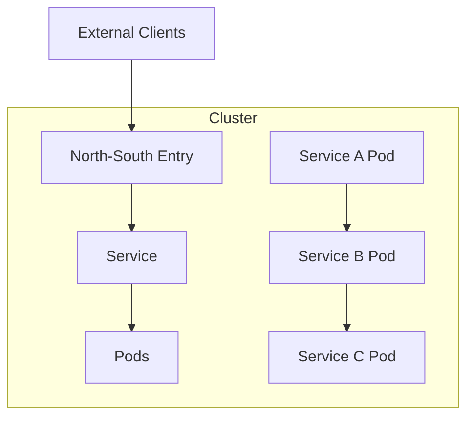
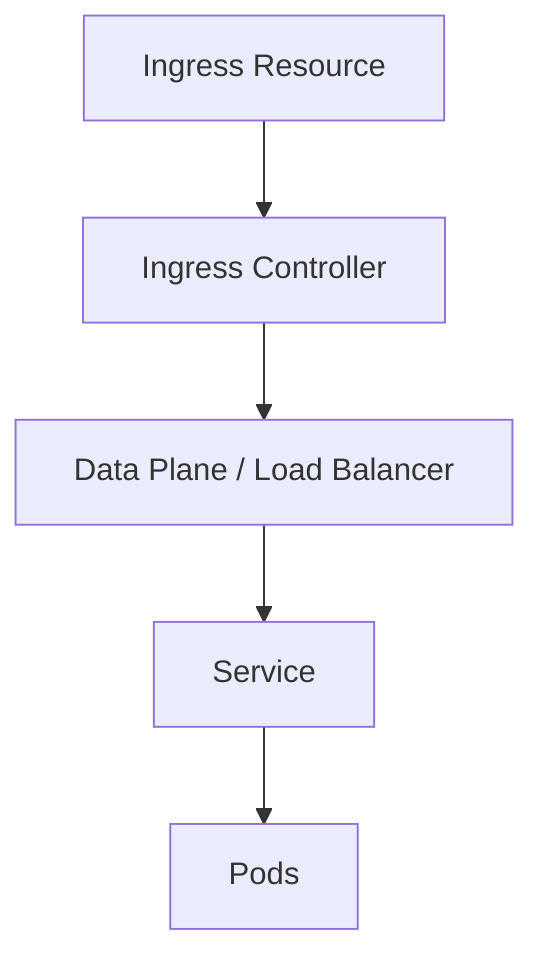
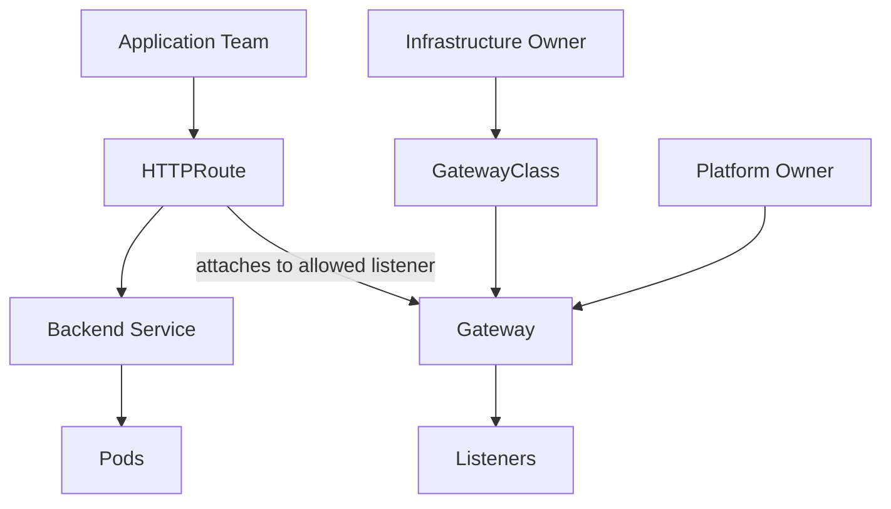
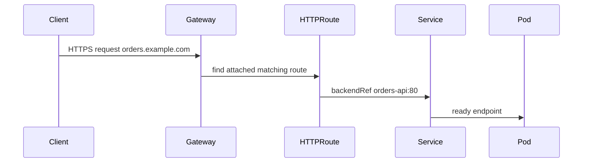
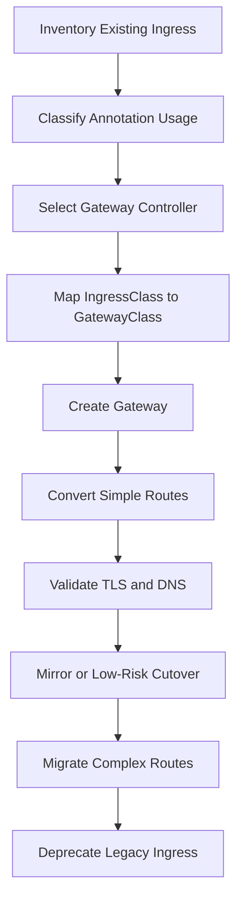
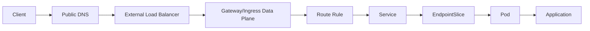
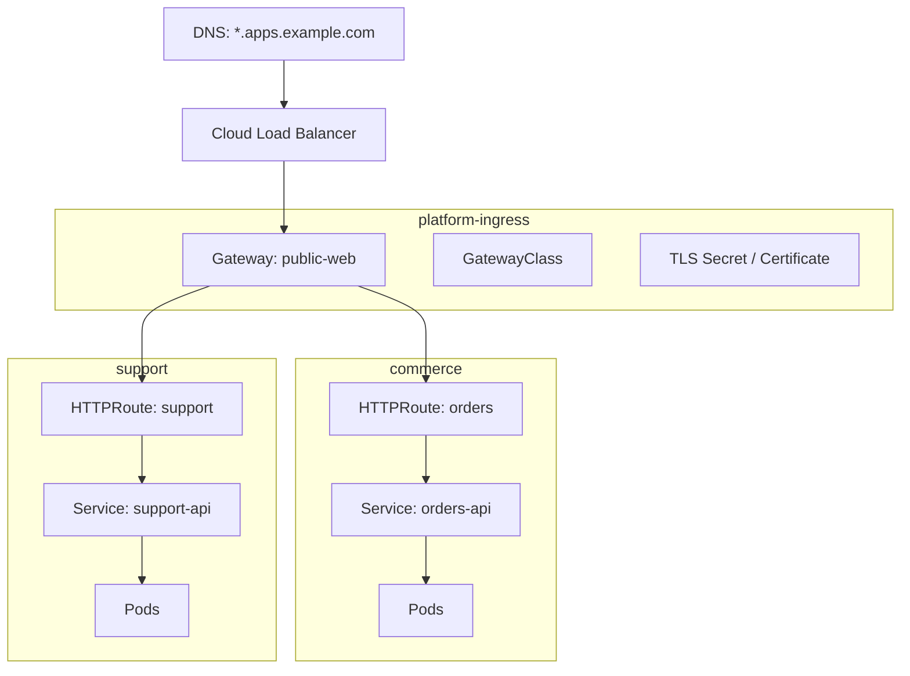

------
title: Learn Kubernetes, Deployment Model, and Cloud Native Platform Engineering - Part 016
description: Deep dive into Kubernetes Ingress, Gateway API, north-south traffic, TLS termination, routing ownership, GatewayClass, Gateway, HTTPRoute, migration, and production traffic governance.
series: learn-kubernetes-deployment-model
seriesTitle: Learn Kubernetes, Deployment Model, and Cloud Native Platform Engineering
order: 16
partTitle: Ingress, Gateway API, and North-South Traffic
tags:
- kubernetes
- deployment
- networking
- ingress
- gateway-api
- tls
- routing
- platform-engineering
date: 2026-07-01
---

# Part 016 — Ingress, Gateway API, and North-South Traffic

> Goal: understand how Kubernetes exposes applications to traffic outside the cluster using Ingress and Gateway API, and how to design HTTP routing, TLS, ownership boundaries, migration paths, and production governance without turning routing into annotation chaos.

In the previous part, we studied internal service discovery.

This part studies the edge.

The edge is where external clients, load balancers, TLS, DNS, certificates, routing rules, security policy, application ownership, platform ownership, and rollout strategy meet.

That makes north-south traffic one of the highest-risk areas in Kubernetes platform design.

The beginner asks:

> How do I expose my Service?

The senior engineer asks:

> Which team owns the external entry point, which team owns the route, which policy applies, how is TLS managed, how do we migrate safely, and what is the blast radius of a bad routing rule?

Ingress and Gateway API are not just YAML resources.

They are organizational boundary objects.

---

## 1. North-South vs East-West Traffic

Traffic direction matters.



| Traffic Type | Meaning | Common Primitives |
|---|---|---|
| North-south | Traffic entering or leaving the cluster boundary. | LoadBalancer Service, Ingress, Gateway API, cloud LB, WAF, API gateway. |
| East-west | Traffic between workloads inside the cluster. | Service, DNS, NetworkPolicy, service mesh. |

This part focuses primarily on incoming north-south HTTP/HTTPS traffic, while also explaining where Gateway API extends beyond HTTP.

---

## 2. Kaufman Deconstruction

North-south traffic can be decomposed into practical sub-skills.

| Sub-skill | What You Must Be Able To Do |
|---|---|
| Exposure taxonomy | Choose LoadBalancer Service, Ingress, or Gateway API intentionally. |
| Ingress reasoning | Understand Ingress resources, IngressClass, and controller dependence. |
| Gateway reasoning | Understand GatewayClass, Gateway, HTTPRoute, listeners, and route attachment. |
| Ownership design | Separate infrastructure owner, platform owner, and application team responsibilities. |
| TLS design | Decide where TLS terminates and how certificates are managed. |
| Routing design | Model host, path, header, weight, and backend routing. |
| Migration | Move from Ingress to Gateway API safely. |
| Failure modelling | Diagnose 404, 503, certificate, route attachment, backend, and policy failures. |
| Governance | Create platform rules that enable self-service without unsafe exposure. |

The highest-value skill is:

> Separate entry-point infrastructure from application routing ownership.

Gateway API exists largely because the older Ingress model did not express this separation well enough.

---

## 3. Exposure Taxonomy

There are several ways to expose workloads.

| Option | Layer | Best For | Limitations |
|---|---|---|---|
| `LoadBalancer` Service | L4-ish service exposure | One service, TCP/UDP, simple external endpoint | Expensive/noisy for many HTTP routes; limited HTTP routing. |
| Ingress | HTTP/HTTPS routing | Established HTTP host/path routing | Frozen API, limited feature model, annotation-heavy extensions. |
| Gateway API | L4/L7 routing model | Multi-team, portable, expressive, role-oriented routing | Requires Gateway API controller support and maturity review. |
| Service Mesh ingress gateway | L7 traffic through mesh | Mesh-integrated policy, mTLS, traffic control | More moving parts and mesh coupling. |
| External API gateway | Enterprise API management | Auth, developer portal, monetization, global routing | May be outside Kubernetes-native ownership model. |

Do not standardize on one primitive blindly.

A platform can support multiple exposure classes:

```text
internal-only service      -> ClusterIP
simple external TCP        -> LoadBalancer Service
standard web application   -> Gateway API HTTPRoute
legacy web application     -> Ingress during migration
mesh-managed service       -> mesh gateway
enterprise public API      -> external API gateway + Kubernetes backend
```

The important thing is to define decision rules.

---

## 4. Ingress Mental Model

Ingress is a Kubernetes API object for managing external HTTP/HTTPS access to Services.

An Ingress typically defines:

- host rules;
- path rules;
- backend Services;
- TLS references;
- optional class selection;
- implementation-specific annotations.

Example:

```yaml
apiVersion: networking.k8s.io/v1
kind: Ingress
metadata:
  name: orders-api
  namespace: commerce
spec:
  ingressClassName: nginx
  tls:
    - hosts:
        - orders.example.com
      secretName: orders-example-com-tls
  rules:
    - host: orders.example.com
      http:
        paths:
          - path: /
            pathType: Prefix
            backend:
              service:
                name: orders-api
                port:
                  name: http
```

The Ingress object alone does not route traffic.

An Ingress controller must watch Ingress resources and configure an actual data plane such as NGINX, HAProxy, Envoy, cloud load balancer, or another implementation.



Important invariant:

> Ingress is a desired routing configuration; the controller implements it.

If the controller is missing, misconfigured, or does not support an annotation, the Ingress object may exist but traffic will not behave as expected.

---

## 5. IngressClass

`IngressClass` identifies which controller should handle an Ingress.

```yaml
apiVersion: networking.k8s.io/v1
kind: IngressClass
metadata:
  name: public
spec:
  controller: example.com/public-ingress-controller
```

Ingress uses it through:

```yaml
spec:
  ingressClassName: public
```

This matters in clusters with multiple ingress implementations:

```text
public internet ingress
private internal ingress
regulated workload ingress
legacy ingress
experimental ingress
```

Without explicit class governance, routes can land on the wrong edge.

That is a serious security and reliability risk.

---

## 6. Ingress API Reality: Stable but Frozen

Ingress is generally available and widely supported.

But the API is frozen. New features are directed toward Gateway API.

This does not mean existing Ingress resources immediately stop working.

It means:

- Ingress remains supported as a GA API;
- the core API is not where new routing features are being added;
- advanced behavior often depends on implementation-specific annotations;
- portability between controllers is limited;
- multi-team ownership boundaries are weak compared with Gateway API.

A pragmatic platform stance:

```text
Do not panic-migrate every Ingress immediately.
Do not build new strategic platform features around Ingress annotations.
Prefer Gateway API for new standardized north-south routing where controller support is mature.
```

This is architectural migration, not YAML fashion.

---

## 7. Ingress Strengths and Weaknesses

### Strengths

- simple mental model for HTTP host/path routing;
- mature ecosystem;
- broad controller support;
- integration with tools like cert-manager and ExternalDNS;
- easy for small clusters and many existing workloads.

### Weaknesses

- single resource mixes several concerns;
- limited standard feature set;
- advanced features rely on annotations;
- annotations are stringly typed and implementation-specific;
- weak role separation between platform and application teams;
- not a general L4/L7 traffic API.

Annotation-heavy Ingress is a common enterprise smell.

Example:

```yaml
metadata:
  annotations:
    nginx.ingress.kubernetes.io/proxy-read-timeout: "60"
    nginx.ingress.kubernetes.io/proxy-body-size: "10m"
    nginx.ingress.kubernetes.io/rewrite-target: /
    nginx.ingress.kubernetes.io/canary: "true"
    nginx.ingress.kubernetes.io/canary-weight: "10"
```

Annotations are not inherently bad.

But once routing policy, security, timeout, retries, body size, traffic splits, auth, and implementation-specific behavior live in unstructured annotations, platform governance becomes harder.

---

## 8. Gateway API Mental Model

Gateway API is a Kubernetes-native set of APIs for service networking.

It separates infrastructure entry points from application routing.

Core resources include:

- `GatewayClass`;
- `Gateway`;
- `HTTPRoute`;
- `GRPCRoute`;
- other route types depending on support;
- `ReferenceGrant` for cross-namespace references;
- policy resources depending on implementation and standardization level.

Simplified model:



This model is more explicit about ownership.

| Object | Typical Owner | Responsibility |
|---|---|---|
| `GatewayClass` | Infrastructure/platform team | Defines class of gateway implementation. |
| `Gateway` | Platform/network team | Defines listener entry points and shared infrastructure. |
| `HTTPRoute` | Application team | Defines application-specific routing to Services. |
| `ReferenceGrant` | Resource owner | Allows safe cross-namespace references. |

The key improvement is not only feature richness.

The key improvement is **role-oriented API design**.

---

## 9. GatewayClass

A `GatewayClass` describes a class of gateways managed by a specific controller.

```yaml
apiVersion: gateway.networking.k8s.io/v1
kind: GatewayClass
metadata:
  name: public-gateway
spec:
  controllerName: example.com/gateway-controller
```

Think of it as an infrastructure capability class.

Examples:

```text
public-internet
private-internal
pci-regulated
global-edge
regional-edge
mesh-ingress
```

A platform team can expose only approved classes.

Application teams do not need to know every cloud load balancer detail.

---

## 10. Gateway

A `Gateway` represents an instance of traffic handling infrastructure.

Example:

```yaml
apiVersion: gateway.networking.k8s.io/v1
kind: Gateway
metadata:
  name: public-web
  namespace: platform-ingress
spec:
  gatewayClassName: public-gateway
  listeners:
    - name: https
      protocol: HTTPS
      port: 443
      hostname: "*.example.com"
      tls:
        mode: Terminate
        certificateRefs:
          - kind: Secret
            name: wildcard-example-com
      allowedRoutes:
        namespaces:
          from: Selector
          selector:
            matchLabels:
              platform.example.com/allow-public-routes: "true"
```

This Gateway says:

- use the `public-gateway` implementation;
- expose HTTPS on port 443;
- accept hosts under `*.example.com`;
- terminate TLS using a referenced certificate;
- allow routes only from selected namespaces.

That last part is crucial.

Gateway API makes route attachment an explicit trust boundary.

---

## 11. HTTPRoute

An `HTTPRoute` defines HTTP routing rules.

```yaml
apiVersion: gateway.networking.k8s.io/v1
kind: HTTPRoute
metadata:
  name: orders-api
  namespace: commerce
spec:
  parentRefs:
    - name: public-web
      namespace: platform-ingress
  hostnames:
    - orders.example.com
  rules:
    - matches:
        - path:
            type: PathPrefix
            value: /
      backendRefs:
        - name: orders-api
          port: 80
```

This route attaches to a Gateway and forwards traffic to a Service.

The Gateway controls which routes may attach.

The route controls application-specific mapping.



This is cleaner than putting everything into one Ingress resource plus annotations.

---

## 12. Listener and Route Attachment

Gateway listeners define protocol, port, hostname, TLS, and route attachment rules.

Attachment is not automatic in all cases.

Both sides matter:

- the route must reference the Gateway through `parentRefs`;
- the Gateway listener must allow that route;
- hostname constraints must be compatible;
- namespace constraints must be satisfied;
- cross-namespace references may require grants depending on reference type.

This creates a bidirectional trust model.

Debugging Gateway API often means checking status conditions:

```bash
kubectl describe gateway -n platform-ingress public-web
kubectl describe httproute -n commerce orders-api
```

Look for conditions such as:

- accepted;
- programmed;
- resolved refs;
- attached routes;
- listener conflicts;
- invalid certificate references;
- backend reference errors.

Do not assume the route is active because the object exists.

Read status.

---

## 13. Gateway API Route Matching

HTTPRoute supports richer matching than traditional Ingress.

Common dimensions:

- hostname;
- path;
- method;
- headers;
- query parameters;
- weighted backend references;
- filters, depending on support.

Example header-based routing:

```yaml
rules:
  - matches:
      - headers:
          - name: x-release-track
            value: canary
    backendRefs:
      - name: orders-api-canary
        port: 80
  - backendRefs:
      - name: orders-api-stable
        port: 80
```

Example weighted routing:

```yaml
rules:
  - backendRefs:
      - name: orders-api-stable
        port: 80
        weight: 90
      - name: orders-api-canary
        port: 80
        weight: 10
```

This makes progressive delivery easier to express, although mature automation still often requires a rollout controller or service mesh.

Gateway API gives better primitives.

It does not automatically give safe release governance.

---

## 14. TLS Termination Models

TLS design is one of the most important north-south decisions.

Common models:

| Model | Description | Use Case |
|---|---|---|
| Edge termination | TLS terminates at external/cloud load balancer. | Simple public web apps. |
| Gateway termination | TLS terminates at Gateway/Ingress controller. | Kubernetes-managed cert/routing. |
| Re-encrypt to backend | TLS terminates and new TLS connection to backend. | Higher internal security requirements. |
| Passthrough | Gateway forwards TLS without termination. | Backend owns certificate or protocol. |
| mTLS | Mutual TLS between client/gateway or gateway/backend. | Strong identity and regulated environments. |

Questions to ask:

1. Where is the certificate stored?
2. Who can read or update it?
3. Who rotates it?
4. Where does HTTP routing need decrypted traffic?
5. Is backend TLS required?
6. How are redirects from HTTP to HTTPS handled?
7. How is certificate expiry monitored?
8. Is SNI required?

TLS is not only crypto.

It is ownership and operational lifecycle.

---

## 15. Certificate Management

A common Kubernetes pattern is:

```text
cert-manager + Certificate resource + Secret + Ingress/Gateway reference
```

But details depend on controller support.

Important design choices:

- namespace where certificate Secret lives;
- whether routes can reference cross-namespace certificates;
- wildcard vs per-host certificates;
- ACME HTTP-01 vs DNS-01 challenge;
- internal CA vs public CA;
- certificate renewal alerting;
- RBAC over Secret access.

For Gateway API, certificate references are attached to listeners, usually owned by the Gateway/platform team.

This is often better for shared gateways:

```text
Platform owns wildcard certificate and Gateway.
Application teams own HTTPRoutes under allowed hostnames.
```

This avoids every app team managing edge TLS independently.

---

## 16. Hostname Governance

Hostnames are production resources.

Bad platform:

```text
Any namespace can claim any hostname.
```

Good platform:

```text
Namespace/team must be authorized to attach routes for approved hostnames.
```

Governance dimensions:

- domain ownership;
- environment suffixes;
- public vs private domains;
- wildcard rules;
- route attachment permissions;
- DNS automation;
- certificate issuance;
- conflict resolution.

Example domain model:

```text
prod public:    *.apps.example.com
prod internal:  *.internal.example.com
staging:        *.staging.example.com
team preview:   pr-*.preview.example.com
```

Route creation should not automatically create public exposure unless policy allows it.

---

## 17. Ingress vs Gateway API

| Concern | Ingress | Gateway API |
|---|---|---|
| API maturity | GA and widely used | Modern API with stable core resources and active development. |
| Scope | HTTP/HTTPS ingress | L4/L7 service networking depending on route types and implementation. |
| Ownership model | Mostly one resource plus class | Explicit GatewayClass/Gateway/Route separation. |
| Extensibility | Often annotations | Structured fields, route types, filters, policies, extensions. |
| Portability | Limited by annotations | Better, but still depends on conformance and implementation. |
| Multi-team clusters | Awkward | Designed for role-oriented ownership. |
| Strategic direction | Stable but frozen | Recommended direction for new features. |

Do not think of Gateway API as “Ingress v2 YAML.”

Think of it as a more complete traffic API with better organizational modelling.

---

## 18. Migration from Ingress to Gateway API

A safe migration is staged.



### Step 1: Inventory

Collect:

- hostnames;
- paths;
- TLS Secrets;
- annotations;
- backend Services;
- controllers/classes;
- external DNS records;
- certificate ownership;
- WAF/auth/rate-limit behavior.

### Step 2: Classify annotations

Group annotations into:

| Category | Example |
|---|---|
| Routing | rewrite, redirect, canary. |
| Transport | timeouts, body size, keepalive. |
| Security | auth, WAF, allowlist, mTLS. |
| Observability | access logs, tracing headers. |
| Provider-specific | cloud load balancer settings. |

Some map cleanly to Gateway API. Some require implementation-specific policy resources. Some require architecture changes.

### Step 3: Start with simple routes

Do not begin with the most complex Ingress.

Start with:

- one hostname;
- one path;
- one backend;
- standard TLS;
- no exotic annotations.

### Step 4: Run both models temporarily

Depending on DNS and load balancer model, use:

- separate hostname;
- staging domain;
- weighted DNS;
- header-based test route;
- internal-only gateway;
- synthetic tests.

### Step 5: Cut over with rollback

Rollback must be defined before cutover.

Do not discover rollback during an outage.

---

## 19. Common Ingress-to-Gateway Mapping

| Ingress Concept | Gateway API Concept |
|---|---|
| Ingress controller | Gateway controller implementation. |
| IngressClass | GatewayClass. |
| Ingress resource | Usually HTTPRoute plus Gateway. |
| Host rule | HTTPRoute `hostnames` and Gateway listener hostname. |
| Path rule | HTTPRoute path match. |
| Backend Service | HTTPRoute `backendRefs`. |
| TLS Secret | Gateway listener certificate reference or implementation-specific model. |
| Annotation-based feature | Structured field, filter, or implementation-specific policy. |

Example Ingress:

```yaml
apiVersion: networking.k8s.io/v1
kind: Ingress
metadata:
  name: orders-api
spec:
  ingressClassName: public
  rules:
    - host: orders.example.com
      http:
        paths:
          - path: /
            pathType: Prefix
            backend:
              service:
                name: orders-api
                port:
                  number: 80
```

Equivalent basic HTTPRoute:

```yaml
apiVersion: gateway.networking.k8s.io/v1
kind: HTTPRoute
metadata:
  name: orders-api
spec:
  parentRefs:
    - name: public-web
      namespace: platform-ingress
  hostnames:
    - orders.example.com
  rules:
    - matches:
        - path:
            type: PathPrefix
            value: /
      backendRefs:
        - name: orders-api
          port: 80
```

The Gateway object is separate and should usually be platform-owned.

---

## 20. Gateway API and Cross-Namespace Boundaries

Gateway API is designed for multi-namespace use, but it does not mean cross-namespace references should be unrestricted.

Important cases:

- Route in app namespace attaches to Gateway in platform namespace.
- Gateway references TLS Secret.
- Route references Service in another namespace.
- Backend policy references backend Service.

Gateway API uses explicit mechanisms such as allowed routes and reference grants to prevent unsafe cross-namespace references.

Mental model:

```text
A namespace owns its resources.
Other namespaces should not be able to use them unless explicitly allowed.
```

This is essential for multi-tenant clusters.

Without it, one team could accidentally or maliciously route traffic to another team's Service or certificate.

---

## 21. Route Conflict and Precedence

North-south routing creates conflict risk.

Examples:

- two routes claim the same hostname and path;
- wildcard hostname overlaps exact hostname;
- one route has broader path prefix;
- multiple teams attach routes to shared Gateway;
- TLS certificate does not match hostname;
- route is accepted by one listener but rejected by another.

Gateway API exposes status conditions to help diagnose these cases.

Governance should define:

- route ownership by hostname;
- path prefix ownership;
- exact vs prefix route rules;
- wildcard hostname policy;
- who can attach to public gateways;
- admission rules for conflicts;
- escalation process for shared domains.

Route conflict is not a rare edge case in enterprise clusters.

It is expected unless governed.

---

## 22. Routing and Release Strategies

Ingress and Gateway API can participate in release strategies, but they are not the whole progressive delivery system.

### Basic stable route

```text
orders.example.com -> orders-api-stable
```

### Canary route by weight

```text
90% -> orders-api-stable
10% -> orders-api-canary
```

### Canary route by header

```text
x-release-track: canary -> orders-api-canary
otherwise -> orders-api-stable
```

### Preview environment route

```text
pr-123.preview.example.com -> orders-api-pr-123
```

### Blue-green switch

```text
orders.example.com -> orders-api-blue
cutover
orders.example.com -> orders-api-green
```

Risks:

- route update is faster than backend readiness;
- cached DNS still points to old edge;
- connections persist to old backends;
- canary receives user traffic without metric gates;
- session affinity hides failure distribution;
- rollback changes traffic but not database compatibility.

Traffic routing must be coordinated with deployment state, metrics, and rollback plan.

---

## 23. Edge Reliability Model

A north-south request path may look like this:



A failure can occur at any layer.

| Layer | Example Failure |
|---|---|
| DNS | Wrong record, stale cache, bad TTL. |
| External LB | Health check failure, firewall, wrong target group. |
| Gateway/Ingress | Controller down, bad config, certificate error. |
| Route | Host/path mismatch, rejected route, wrong backendRef. |
| Service | Empty endpoints, wrong port, wrong selector. |
| Pod | Not ready, crashing, overloaded. |
| Application | 500, timeout, TLS mismatch, auth failure. |

Good runbooks trace this path in order.

---

## 24. Debugging Playbook: HTTP Route Fails

### Step 1: Resolve DNS

From outside:

```bash
dig orders.example.com
```

Confirm it points to the expected load balancer.

### Step 2: Test TLS and HTTP

```bash
curl -v https://orders.example.com/health
```

Check:

- certificate CN/SAN;
- TLS handshake;
- HTTP status;
- redirect loops;
- response headers.

### Step 3: Check route object

For Ingress:

```bash
kubectl describe ingress -n commerce orders-api
kubectl get ingressclass
```

For Gateway API:

```bash
kubectl describe gateway -n platform-ingress public-web
kubectl describe httproute -n commerce orders-api
```

Look at status conditions.

### Step 4: Check controller

```bash
kubectl get pods -n <controller-namespace>
kubectl logs -n <controller-namespace> deploy/<controller>
```

Controller logs often reveal invalid references, rejected routes, or unsupported fields.

### Step 5: Check backend Service

```bash
kubectl get svc -n commerce orders-api
kubectl get endpointslice -n commerce -l kubernetes.io/service-name=orders-api
```

A route can be valid while the backend Service has zero endpoints.

### Step 6: Check application

```bash
kubectl logs -n commerce deploy/orders-api
kubectl describe pod -n commerce -l app.kubernetes.io/name=orders-api
```

Determine whether this is routing failure or application failure.

---

## 25. Status Conditions Matter

Kubernetes networking resources often report status.

Do not ignore it.

For Gateway API, status can tell you whether:

- the Gateway was accepted;
- listeners are programmed;
- routes are attached;
- backend references resolved;
- certificate references are valid;
- conflicts exist.

This is a major advantage over annotation-heavy systems where behavior may be hidden in controller logs.

A good platform should surface route status in developer portals and CI checks.

Example CI gate:

```text
HTTPRoute must reach Accepted=True and ResolvedRefs=True before promotion.
```

Deployment should not be considered complete if edge routing is rejected.

---

## 26. Security Model

North-south exposure is a security boundary.

Review these controls:

| Control | Purpose |
|---|---|
| RBAC | Who can create Gateways, Routes, Ingresses, Secrets. |
| Admission policy | Prevent unsafe hostnames, wildcard abuse, invalid classes. |
| Namespace labels | Control which namespaces may attach to public Gateways. |
| TLS policy | Enforce HTTPS, approved cert issuers, minimum TLS versions if supported. |
| NetworkPolicy | Restrict gateway-to-backend traffic. |
| WAF/API gateway | Protect public APIs where needed. |
| Secret governance | Limit certificate key access. |
| Audit logs | Track route and certificate changes. |

A dangerous anti-pattern:

```text
Every namespace can create public Ingress for any hostname.
```

A safer pattern:

```text
Only approved namespaces can attach HTTPRoutes to public Gateway.
Hostnames must match approved domain ownership.
TLS is platform-managed.
Admission rejects unsafe patterns.
```

---

## 27. Policy-as-Code for Routes

Admission policy can enforce route governance.

Examples:

- Ingress must set `ingressClassName`.
- Public hostnames must end with approved suffix.
- No wildcard hostnames outside platform namespace.
- HTTP must redirect to HTTPS.
- Routes cannot reference Services in another namespace unless approved.
- Only namespaces with label `allow-public-routes=true` may attach to public Gateway.
- Backend port must use approved named port.
- Public routes require owner/contact labels.

Example label requirement:

```yaml
metadata:
  labels:
    platform.example.com/owner: commerce-team
    platform.example.com/data-classification: public
    platform.example.com/exposure: internet
```

Routing without ownership metadata should be rejected.

During incidents, “who owns this public route?” must be answerable immediately.

---

## 28. Multi-Tenant Gateway Design

In a multi-team cluster, do not let every team create its own public load balancer unless that is a deliberate cost and isolation model.

Common platform model:

```text
platform-ingress namespace:
  GatewayClass: public-gateway
  Gateway: public-web
  TLS certificates
  DNS integration

application namespaces:
  HTTPRoutes
  Services
  Deployments
```

Benefits:

- shared edge infrastructure;
- centralized TLS;
- controlled public exposure;
- team self-service for routes;
- route-level ownership;
- lower cost than one LB per app;
- easier global policy.

Risks:

- shared gateway becomes high-blast-radius component;
- noisy route changes can affect others;
- controller bugs have wider impact;
- route conflict governance is mandatory.

Design shared gateways as critical platform infrastructure.

---

## 29. When to Use Ingress vs Gateway API

Use Ingress when:

- the organization already has mature Ingress operations;
- routes are simple host/path HTTP routes;
- controller-specific annotations are minimal and accepted;
- Gateway API controller support is not yet mature in your environment;
- migration risk exceeds near-term benefit.

Use Gateway API when:

- building a new strategic platform;
- multiple teams share ingress infrastructure;
- role separation matters;
- annotation portability is a problem;
- richer route matching is needed;
- cross-namespace route attachment must be governed;
- L4/L7 traffic APIs need a common model.

Do not migrate for novelty.

Migrate because Gateway API solves a concrete governance, portability, or feature problem.

---

## 30. Controller Selection Criteria

Gateway API and Ingress are specifications. Implementations differ.

Evaluate controllers by:

| Criterion | Questions |
|---|---|
| API conformance | Which Gateway API resources and features are supported? |
| Production maturity | Is it widely used? How are upgrades handled? |
| Data plane | NGINX, Envoy, HAProxy, cloud LB, eBPF, managed service? |
| TLS integration | cert-manager, cloud certs, Secret refs, rotation. |
| Observability | Metrics, logs, traces, status, config dumps. |
| Security | mTLS, auth, WAF, policy integrations. |
| Multi-tenancy | Namespace isolation, allowed routes, reference grants. |
| Performance | Connection handling, reload behavior, latency, scale. |
| Failure behavior | What happens when controller is down? Existing routes continue? |
| Operational model | Who owns upgrades, config, incident response? |

A weak controller behind a strong API is still a weak production system.

---

## 31. Observability at the Edge

Minimum edge signals:

| Signal | Why It Matters |
|---|---|
| Request rate by route | Detect traffic shifts and abuse. |
| Error rate by route/backend | Separate route vs backend failures. |
| Latency by route/backend | SLO and saturation signal. |
| TLS handshake failures | Certificate or client compatibility issues. |
| 4xx/5xx breakdown | Route mismatch, auth, backend errors. |
| Active connections | Capacity and drain behavior. |
| Route accepted/programmed status | Control-plane health. |
| Certificate expiry | Prevent public outage. |
| Config reload errors | Controller/data-plane health. |

Dashboards should answer:

- Which route is failing?
- Which backend is failing?
- Did a route change happen recently?
- Did the Gateway accept and program the route?
- Is TLS failing before HTTP reaches the app?
- Is the backend Service empty?

The edge needs both L7 metrics and Kubernetes object status.

---

## 32. Common Failure Modes

| Symptom | Likely Cause | Check |
|---|---|---|
| 404 from gateway | Host/path route mismatch | Route rules, hostname, path type. |
| 503 from gateway | Backend unavailable | Service endpoints, route backendRef. |
| TLS certificate mismatch | Wrong cert or SNI | Gateway listener TLS config, Secret. |
| Route object exists but no traffic | Not accepted or not programmed | Gateway/HTTPRoute status. |
| Works internally, fails externally | Edge/LB/TLS/DNS issue | DNS, LB, controller, Gateway. |
| Works by IP, fails by hostname | DNS/TLS/host routing issue | DNS record, Host header, cert. |
| Some paths work, others fail | Path precedence or rewrite issue | Route rules and controller behavior. |
| Canary receives all traffic | Weight or route priority error | HTTPRoute backendRefs and matches. |
| One team breaks another | Shared hostname/path conflict | Governance, admission, route status. |
| Cert renewal outage | Secret/cert-manager/controller issue | Certificate status, Secret, Gateway listener. |

Classify before changing configuration.

---

## 33. Anti-Patterns

### 33.1 Public exposure by default

Bad:

```text
Any Service can become public by setting type=LoadBalancer.
```

This creates cost, security, and governance risk.

### 33.2 Annotation sprawl

Bad:

```text
All traffic policy hidden in vendor-specific annotations.
```

This makes migration and audit difficult.

### 33.3 App teams own shared TLS private keys

Bad in multi-team clusters unless explicitly justified.

Centralize certificate ownership where appropriate.

### 33.4 No route ownership metadata

Every public route should declare owner, service, environment, and escalation contact.

### 33.5 Gateway per app without reason

This can be acceptable for strong isolation, but bad if it creates unnecessary load balancers, cost, and operational overhead.

### 33.6 No rollback plan for DNS cutover

DNS, LB, and route changes need rollback design before migration.

---

## 34. Reference Architecture: Shared Public Gateway



Ownership:

| Component | Owner |
|---|---|
| DNS zone | Platform/network team |
| Load balancer | Platform/network team |
| GatewayClass | Platform team |
| Gateway | Platform team |
| TLS wildcard certificate | Platform/security team |
| HTTPRoute | Application team |
| Service/Deployment | Application team |
| Admission policy | Platform/security team |

This gives self-service without giving every team uncontrolled edge infrastructure.

---

## 35. Design Review Checklist

### Exposure Decision

- [ ] Is this service supposed to be public, private, or internal-only?
- [ ] Is `LoadBalancer`, Ingress, or Gateway API the right abstraction?
- [ ] Is the exposure class approved for the namespace/team?

### Routing

- [ ] Hostname ownership is verified.
- [ ] Path ownership is clear.
- [ ] Backend Service exists and has ready endpoints.
- [ ] Route status is accepted/programmed.
- [ ] Conflict behavior is understood.

### TLS

- [ ] TLS termination point is defined.
- [ ] Certificate owner is defined.
- [ ] Certificate renewal is monitored.
- [ ] Secret access is restricted.
- [ ] HTTP-to-HTTPS behavior is defined.

### Security

- [ ] Public route requires owner metadata.
- [ ] Admission policy enforces hostname and class rules.
- [ ] NetworkPolicy allows only gateway-to-backend traffic where appropriate.
- [ ] Sensitive admin/metrics endpoints are not exposed.

### Reliability

- [ ] Edge metrics exist by route and backend.
- [ ] Route changes are auditable.
- [ ] Rollback is documented.
- [ ] Backend readiness is correct.
- [ ] Load testing includes gateway and backend path.

---

## 36. Practice Lab

### Lab 1: Create a simple Ingress

1. Deploy an HTTP app.
2. Create a ClusterIP Service.
3. Create an Ingress with host/path routing.
4. Confirm controller picks it up.
5. Test using `curl -H 'Host: ...'` if DNS is not configured.

Learning objective:

> Ingress is a route spec consumed by an Ingress controller.

### Lab 2: Create a Gateway and HTTPRoute

1. Install or use a Gateway API-capable controller.
2. Create a GatewayClass.
3. Create a Gateway with HTTP listener.
4. Create an HTTPRoute in an app namespace.
5. Verify status conditions.
6. Test traffic.

Learning objective:

> Gateway owns entry point; HTTPRoute owns app route.

### Lab 3: Break route attachment

1. Configure Gateway to allow routes only from selected namespaces.
2. Create HTTPRoute from unapproved namespace.
3. Observe route rejection or non-attachment.
4. Add namespace label.
5. Observe route accepted.

Learning objective:

> Route attachment is an authorization boundary.

### Lab 4: Weighted routing

1. Create stable and canary Services.
2. Create HTTPRoute with 90/10 backend weights.
3. Generate traffic.
4. Observe distribution.
5. Change to 50/50.
6. Roll back to 100/0.

Learning objective:

> Traffic splitting is a routing primitive, but safe canary still needs metrics and rollback.

---

## 37. Mental Model Summary

North-south traffic is a chain:

```text
DNS -> external load balancer -> Gateway/Ingress controller -> route -> Service -> EndpointSlice -> Pod -> application
```

Ingress and Gateway API both configure parts of this chain.

The key invariants:

- Ingress is stable and widely used, but the API is frozen.
- Gateway API is the strategic direction for richer, role-oriented service networking.
- A routing object does not route traffic unless a controller implements it.
- Gateway API separates infrastructure entry points from application routes.
- TLS is an ownership and lifecycle problem, not just a Secret reference.
- Public route creation must be governed.
- Route status and backend endpoint status are part of deployment health.
- Traffic routing must align with rollout, observability, and rollback.

A production platform should not merely allow teams to expose Services.

It should provide safe, observable, policy-governed traffic entry points.

---

## 38. References

- Kubernetes Documentation — Ingress: `https://kubernetes.io/docs/concepts/services-networking/ingress/`
- Kubernetes Documentation — Gateway API: `https://kubernetes.io/docs/concepts/services-networking/gateway/`
- Kubernetes Gateway API Project — Overview: `https://gateway-api.sigs.k8s.io/`
- Kubernetes Gateway API Project — API Overview: `https://gateway-api.sigs.k8s.io/docs/concepts/api-overview/`
- Kubernetes Gateway API Project — Migrating from Ingress: `https://gateway-api.sigs.k8s.io/guides/getting-started/migrating-from-ingress/`
- Kubernetes Documentation — Services: `https://kubernetes.io/docs/concepts/services-networking/service/`
- Kubernetes Documentation — TLS Secrets: `https://kubernetes.io/docs/concepts/configuration/secret/#tls-secrets`
