------
title: Learn Kubernetes, Deployment Model, and Cloud Native Platform Engineering - Part 017
description: Deep dive into Kubernetes NetworkPolicy, zero-trust cluster networking, ingress and egress isolation, namespace boundaries, CNI enforcement, policy design, debugging, and governance.
series: learn-kubernetes-deployment-model
seriesTitle: Learn Kubernetes, Deployment Model, and Cloud Native Platform Engineering
order: 17
partTitle: NetworkPolicy and Zero-Trust Cluster Networking
tags:
- kubernetes
- deployment
- networking
- networkpolicy
- zero-trust
- security
- cni
- platform-engineering
date: 2026-07-01
---

# Part 017 — NetworkPolicy and Zero-Trust Cluster Networking

> Goal: understand Kubernetes NetworkPolicy as a declarative allow-list model for pod connectivity, and learn how to design, validate, debug, and govern cluster network isolation without confusing it with authentication, authorization, service mesh, or firewalling everything by hope.

In the previous parts, we studied Services, DNS, EndpointSlice, Ingress, and Gateway API.

Those primitives answer:

> How does traffic find a workload?

NetworkPolicy answers a different question:

> Which traffic is allowed to reach or leave this workload?

That distinction matters.

A Service makes a workload reachable.

NetworkPolicy makes reachability intentional.

Without NetworkPolicy, many Kubernetes clusters behave like a flat internal network: any Pod can often attempt to reach any other Pod, constrained only by application-level checks, cloud firewall rules, or whatever the CNI happens to enforce.

That may be acceptable in a toy cluster.

It is not acceptable in a serious multi-service, multi-team, regulated, or internet-facing platform.

NetworkPolicy is the first Kubernetes-native step toward zero-trust networking.

Not the final step.

But the first one that forces every team to encode the connectivity contract instead of relying on tribal knowledge.

---

## 1. Kaufman Deconstruction

To become effective with NetworkPolicy, do not start by memorizing YAML.

Deconstruct the skill into the following sub-skills.

| Sub-skill | What You Must Be Able To Do |
|---|---|
| Isolation model | Explain when a Pod is isolated or non-isolated for ingress and egress. |
| Selector design | Use `podSelector` and `namespaceSelector` safely without accidental broad matches. |
| Ingress policy | Allow only required callers into a workload. |
| Egress policy | Allow only required outbound dependencies. |
| DNS handling | Avoid breaking DNS when enabling default-deny egress. |
| CNI awareness | Know that policies require a CNI/plugin that actually implements NetworkPolicy. |
| Debugging | Diagnose whether a failure is DNS, Service routing, policy denial, application refusal, or CNI behavior. |
| Governance | Define namespace baseline policy, naming conventions, exception process, and audit model. |
| Threat modelling | Distinguish network reachability from identity, authentication, authorization, and data protection. |

The practical objective is not:

> I can write a NetworkPolicy manifest.

The objective is:

> I can look at a system, derive its required communication graph, encode that graph as policy, and prove that unexpected paths are blocked without breaking legitimate flows.

---

## 2. Mental Model: NetworkPolicy Is an Allow-List Overlay

A useful mental model:

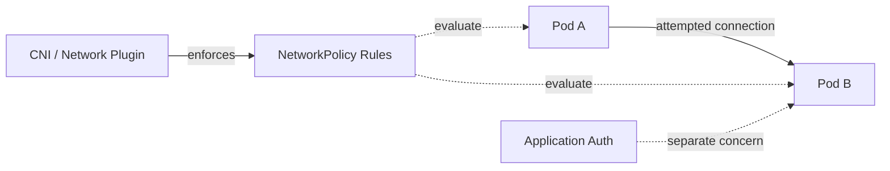

NetworkPolicy does not create Services.

It does not route traffic.

It does not encrypt traffic.

It does not authenticate users.

It does not know your business permissions.

It only declares which network connections are allowed to be established to or from selected Pods.

A senior engineer treats NetworkPolicy as a layer in a broader defense model.

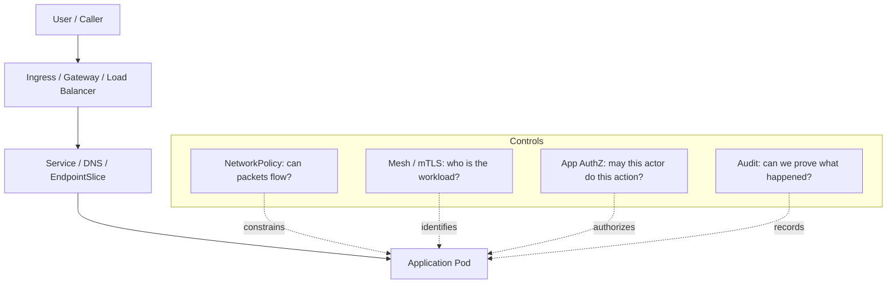

Do not overload NetworkPolicy with expectations it cannot satisfy.

It is necessary.

It is not sufficient.

---

## 3. The Default Trap

The most important NetworkPolicy fact:

> By default, Pods are non-isolated for ingress and egress.

That means absence of policy generally means traffic is allowed.

A Pod becomes isolated in a direction only when a NetworkPolicy selects that Pod for that direction.

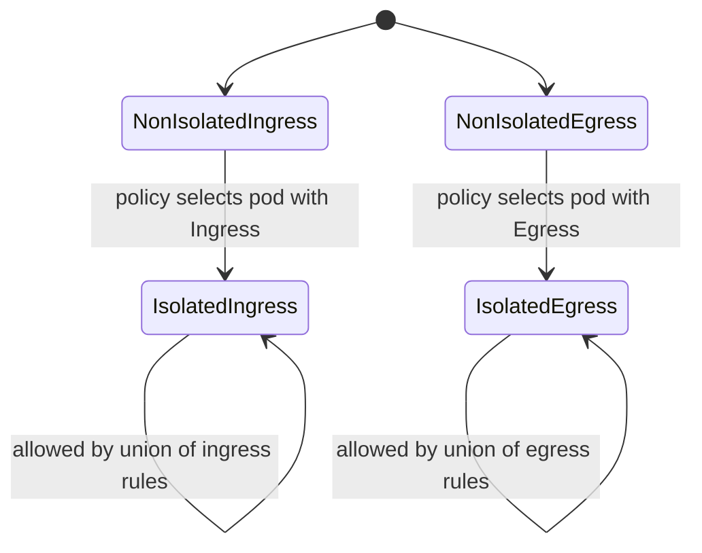

This produces two design implications.

First, adding one policy can change the isolation state of a Pod.

Second, policies are additive, not ordered deny rules.

There is no first-match rule list like a traditional firewall.

If multiple policies select a Pod, the allowed traffic is the union of what those policies permit.

---

## 4. CNI Enforcement Is Not Optional

A NetworkPolicy object is only a declaration.

The actual enforcement is done by the network plugin.

If the cluster's CNI does not implement Kubernetes NetworkPolicy, creating a NetworkPolicy object can have no practical effect.

This is one of the most dangerous false-confidence states in Kubernetes security.

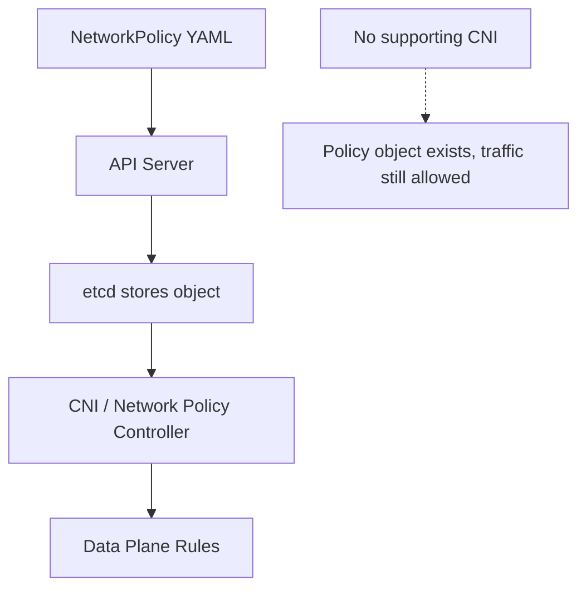

Before relying on NetworkPolicy, verify:

| Question | Why It Matters |
|---|---|
| Does the CNI support Kubernetes NetworkPolicy? | Otherwise policies may not be enforced. |
| Does it support both ingress and egress? | Some legacy or constrained implementations vary. |
| Does it support `ipBlock` and `endPort` as expected? | Feature support can differ across plugins and versions. |
| How quickly are policy changes applied? | There can be propagation delay. |
| How are `hostNetwork` Pods treated? | Some implementations cannot apply normal pod policy to host-network traffic. |
| Can we observe policy drops? | Production debugging requires visibility. |

A platform rule:

> Never claim a namespace is isolated until policy enforcement has been tested from inside the cluster.

---

## 5. Anatomy of a NetworkPolicy

A NetworkPolicy has four conceptual parts.

```yaml
apiVersion: networking.k8s.io/v1
kind: NetworkPolicy
metadata:
  name: allow-api-from-frontend
  namespace: payments
spec:
  podSelector:
    matchLabels:
      app.kubernetes.io/name: payments-api
  policyTypes:
    - Ingress
  ingress:
    - from:
        - namespaceSelector:
            matchLabels:
              platform.example.com/name: web
          podSelector:
            matchLabels:
              app.kubernetes.io/name: checkout-frontend
      ports:
        - protocol: TCP
          port: 8080
```

| Field | Meaning |
|---|---|
| `metadata.namespace` | Namespace where the policy applies. |
| `spec.podSelector` | Which Pods in that namespace are selected by the policy. |
| `policyTypes` | Whether the policy applies to ingress, egress, or both. |
| `ingress` / `egress` | Allowed peers and ports for the selected Pods. |

The most important field is `podSelector`.

It selects the protected Pods.

It does not select the callers.

Callers are selected inside `ingress.from` or `egress.to`.

---

## 6. Directionality: Ingress and Egress Are Independent

Ingress and egress are separate isolation dimensions.

A Pod can be:

| Ingress | Egress | Meaning |
|---|---|---|
| Non-isolated | Non-isolated | Default open behavior. |
| Isolated | Non-isolated | Callers are restricted, but Pod can call out freely. |
| Non-isolated | Isolated | Anyone may call it, but outbound calls are restricted. |
| Isolated | Isolated | Both inbound and outbound traffic require explicit allows. |

Example: default deny ingress for a namespace.

```yaml
apiVersion: networking.k8s.io/v1
kind: NetworkPolicy
metadata:
  name: default-deny-ingress
  namespace: payments
spec:
  podSelector: {}
  policyTypes:
    - Ingress
```

This selects all Pods in the namespace for ingress isolation and allows no inbound traffic except implementation-defined always-allowed traffic such as node-local cases.

Example: default deny egress.

```yaml
apiVersion: networking.k8s.io/v1
kind: NetworkPolicy
metadata:
  name: default-deny-egress
  namespace: payments
spec:
  podSelector: {}
  policyTypes:
    - Egress
```

This selects all Pods for egress isolation and allows no outbound traffic.

That includes DNS unless separately allowed.

Many teams break their applications by enabling default-deny egress without allowing DNS.

---

## 7. The DNS Rule Everyone Forgets

Most Kubernetes workloads depend on DNS.

When you enable egress isolation, Pods often need to reach the cluster DNS service.

A common pattern:

```yaml
apiVersion: networking.k8s.io/v1
kind: NetworkPolicy
metadata:
  name: allow-dns-egress
  namespace: payments
spec:
  podSelector: {}
  policyTypes:
    - Egress
  egress:
    - to:
        - namespaceSelector:
            matchLabels:
              kubernetes.io/metadata.name: kube-system
          podSelector:
            matchLabels:
              k8s-app: kube-dns
      ports:
        - protocol: UDP
          port: 53
        - protocol: TCP
          port: 53
```

This example assumes CoreDNS Pods carry the `k8s-app: kube-dns` label in `kube-system`.

Do not blindly paste it.

Verify your cluster's DNS labels first:

```bash
kubectl -n kube-system get pods --show-labels | grep -E 'coredns|kube-dns'
kubectl -n kube-system get svc kube-dns -o wide
```

Production rule:

> Default-deny egress without a tested DNS exception is not security hardening. It is an outage generator.

---

## 8. Selector Semantics: AND vs OR

NetworkPolicy selector shape matters.

This is a common source of subtle mistakes.

### 8.1 Same List Item: AND

```yaml
from:
  - namespaceSelector:
      matchLabels:
        environment: prod
    podSelector:
      matchLabels:
        app: frontend
```

This means:

> Allow Pods with `app=frontend` inside namespaces with `environment=prod`.

The namespace and pod constraints apply together.

### 8.2 Separate List Items: OR

```yaml
from:
  - namespaceSelector:
      matchLabels:
        environment: prod
  - podSelector:
      matchLabels:
        app: frontend
```

This means:

> Allow all Pods in namespaces with `environment=prod`, OR allow Pods with `app=frontend` in the same namespace as the policy.

That is a much broader rule.

Diagram:

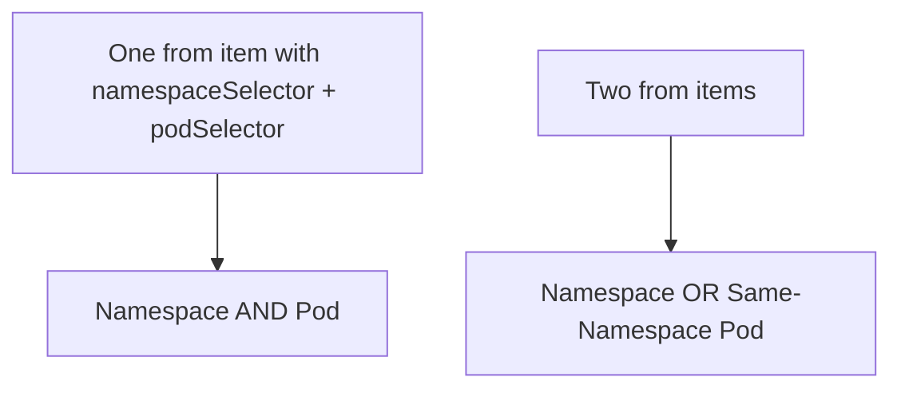

Senior review checklist:

| Pattern | Review Question |
|---|---|
| `podSelector: {}` | Are you intentionally selecting every Pod? |
| Empty `from` or `to` list | Are you intentionally allowing nothing? |
| Missing `namespaceSelector` | Is same-namespace-only intended? |
| Separate namespace/pod selectors | Are you accidentally writing OR instead of AND? |
| Broad namespace label | Who controls that namespace label? |
| `ipBlock` with private CIDRs | Are you accidentally allowing cluster/node ranges? |

---

## 9. Namespace Labels Are Security-Critical

NetworkPolicy often uses namespace labels.

That means namespace labels become part of the security boundary.

Example:

```yaml
namespaceSelector:
  matchLabels:
    platform.example.com/zone: trusted
```

If any team can label their namespace `trusted`, the policy is not trustworthy.

Platform invariant:

> Any label used for security selection must be controlled by the platform, not by arbitrary application teams.

Use protected label prefixes.

Example taxonomy:

| Label | Owner | Purpose |
|---|---|---|
| `platform.example.com/tenant` | Platform | Tenant boundary. |
| `platform.example.com/environment` | Platform | Environment boundary such as dev, staging, prod. |
| `platform.example.com/network-zone` | Platform | Network trust zone. |
| `app.kubernetes.io/name` | App team | Application identity. |
| `app.kubernetes.io/component` | App team | Component role. |
| `security.example.com/egress-profile` | Platform/security | Egress policy grouping. |

Application teams can own app labels.

Platform/security should own labels that grant trust.

---

## 10. A Practical Zero-Trust Namespace Baseline

A sane namespace baseline usually has several layers.

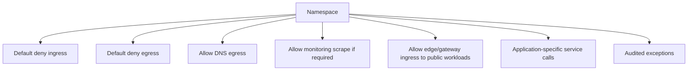

A baseline might include:

1. Default-deny ingress.
2. Default-deny egress.
3. Allow DNS egress.
4. Allow namespace-local service calls where justified.
5. Allow ingress only from approved gateway/controller namespaces.
6. Allow monitoring traffic from observability namespace.
7. Allow explicit external egress through controlled egress gateway or NAT path.
8. Deny-by-default for database namespaces, payment namespaces, and admin workloads.

But apply this in phases.

Do not slam default-deny onto a production namespace without traffic discovery.

---

## 11. Designing Policy from the Communication Graph

Start with the communication graph, not YAML.

Example payment service graph:

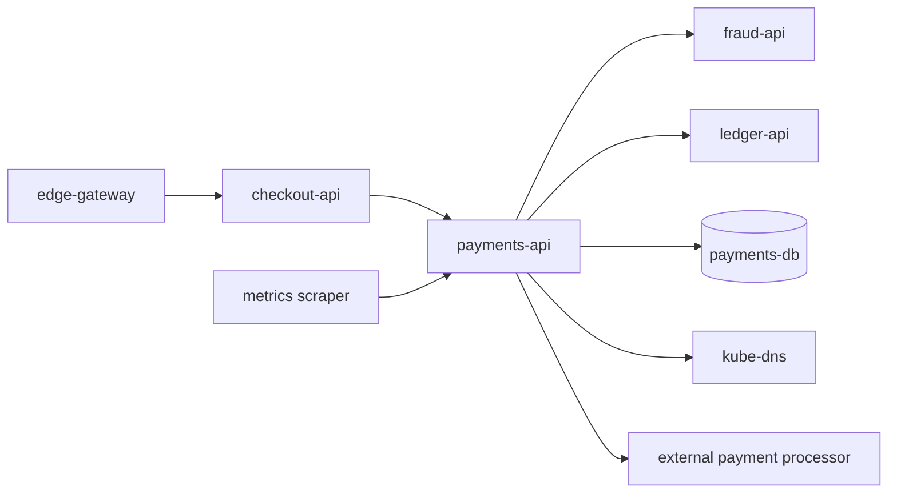

Translate each edge into a policy rule.

| Edge | Policy Direction | Selected Pod | Allowed Peer |
|---|---|---|---|
| `edge-gateway -> checkout-api` | Ingress | `checkout-api` | gateway namespace / gateway Pods |
| `checkout-api -> payments-api` | Ingress | `payments-api` | checkout Pods |
| `payments-api -> fraud-api` | Egress or ingress | depends on ownership | fraud Service backend Pods |
| `payments-api -> payments-db` | Egress | payments API Pods | DB Pods or DB CIDR |
| `payments-api -> DNS` | Egress | payments API Pods | CoreDNS Pods |
| `metrics scraper -> payments-api` | Ingress | payments API Pods | observability namespace |

A reviewable policy should be explainable in business terms:

> Checkout may call Payments on port 8080 because checkout submits payment authorization requests.

Not:

> We opened port 8080 because it made the timeout go away.

---

## 12. Common Policy Patterns

### 12.1 Default Deny All Ingress in a Namespace

```yaml
apiVersion: networking.k8s.io/v1
kind: NetworkPolicy
metadata:
  name: default-deny-ingress
  namespace: payments
spec:
  podSelector: {}
  policyTypes:
    - Ingress
```

Use this as a baseline once you know how workloads should be reached.

### 12.2 Default Deny All Egress in a Namespace

```yaml
apiVersion: networking.k8s.io/v1
kind: NetworkPolicy
metadata:
  name: default-deny-egress
  namespace: payments
spec:
  podSelector: {}
  policyTypes:
    - Egress
```

Use this carefully.

Egress is harder than ingress because applications often have hidden dependencies: DNS, metadata APIs, telemetry endpoints, license servers, external APIs, object storage, package registries, or time services.

### 12.3 Allow Same-Namespace Traffic

```yaml
apiVersion: networking.k8s.io/v1
kind: NetworkPolicy
metadata:
  name: allow-same-namespace
  namespace: payments
spec:
  podSelector: {}
  policyTypes:
    - Ingress
  ingress:
    - from:
        - podSelector: {}
```

This allows all Pods in the same namespace to call selected Pods.

It is useful as a transitional baseline.

It is not strong isolation.

### 12.4 Allow Gateway to Public API

```yaml
apiVersion: networking.k8s.io/v1
kind: NetworkPolicy
metadata:
  name: allow-edge-gateway-to-payments-api
  namespace: payments
spec:
  podSelector:
    matchLabels:
      app.kubernetes.io/name: payments-api
  policyTypes:
    - Ingress
  ingress:
    - from:
        - namespaceSelector:
            matchLabels:
              platform.example.com/network-zone: edge
          podSelector:
            matchLabels:
              app.kubernetes.io/component: gateway
      ports:
        - protocol: TCP
          port: 8080
```

This encodes:

> Only gateway Pods in edge namespaces can reach `payments-api` on port 8080.

### 12.5 Allow Observability Scraping

```yaml
apiVersion: networking.k8s.io/v1
kind: NetworkPolicy
metadata:
  name: allow-observability-scrape
  namespace: payments
spec:
  podSelector:
    matchLabels:
      app.kubernetes.io/name: payments-api
  policyTypes:
    - Ingress
  ingress:
    - from:
        - namespaceSelector:
            matchLabels:
              platform.example.com/system: observability
      ports:
        - protocol: TCP
          port: 9090
```

This keeps monitoring explicit.

A platform should avoid using monitoring as an excuse to keep all workload ports open.

### 12.6 Allow External Egress by CIDR

```yaml
apiVersion: networking.k8s.io/v1
kind: NetworkPolicy
metadata:
  name: allow-payment-processor-egress
  namespace: payments
spec:
  podSelector:
    matchLabels:
      app.kubernetes.io/name: payments-api
  policyTypes:
    - Egress
  egress:
    - to:
        - ipBlock:
            cidr: 203.0.113.0/24
      ports:
        - protocol: TCP
          port: 443
```

This is often fragile because SaaS providers change IP ranges.

Prefer an egress gateway or controlled proxy when the organization requires auditable external access.

---

## 13. What NetworkPolicy Does Not Handle Well

NetworkPolicy is useful, but it has limits.

| Need | NetworkPolicy Fit | Better Companion |
|---|---:|---|
| Allow traffic by HTTP path | Poor | Ingress/Gateway/service mesh/API gateway |
| Allow traffic by user identity | Poor | Application auth / identity-aware proxy |
| Mutual workload identity | Poor | Service mesh mTLS / SPIFFE-style identity |
| External domain allow-list | Weak in vanilla policy | Egress proxy / CNI-specific FQDN policy |
| Layer 7 authorization | Poor | Service mesh / API gateway / app policy |
| Encryption in transit | Not provided | mTLS / TLS / service mesh |
| Audit of request details | Not provided | App logs / mesh telemetry / gateway logs |
| Cross-cluster policy | Not native | Multi-cluster network/security platform |

This is where many teams overestimate NetworkPolicy.

A realistic zero-trust model combines:

1. NetworkPolicy for reachability.
2. mTLS/workload identity for peer identity.
3. Application authorization for business permissions.
4. Gateway/API controls for external entry.
5. Observability and audit for proof.
6. Admission policy to prevent unsafe workloads and labels.

---

## 14. `ipBlock` and the External Dependency Problem

`ipBlock` allows CIDR-based peers.

Example:

```yaml
ipBlock:
  cidr: 10.0.0.0/8
  except:
    - 10.1.0.0/16
```

Use it carefully.

Problems:

| Problem | Why It Hurts |
|---|---|
| Cloud provider ranges change | Static allow-lists decay. |
| SaaS endpoints use dynamic IPs | IP-based rules become operationally brittle. |
| NAT obscures original source | Source IP may not be what you expect. |
| Pod IPs are not stable | Do not model application identity using Pod IPs. |
| Node traffic exceptions exist | Traffic to/from node may not behave like Pod-to-Pod policy. |

A better enterprise pattern:

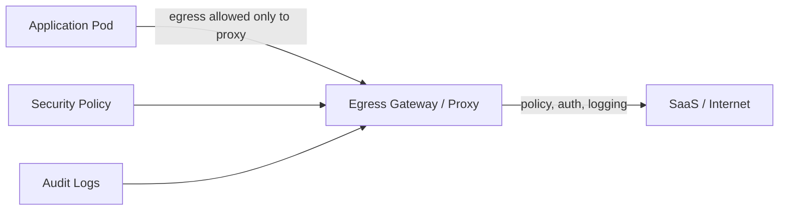

The NetworkPolicy only allows application Pods to reach the egress proxy.

The proxy handles domain policy, TLS inspection if allowed by policy, authentication, logging, and rate control.

---

## 15. Debugging NetworkPolicy Failures

When a request fails, do not jump straight to policy.

Use a layered diagnostic path.

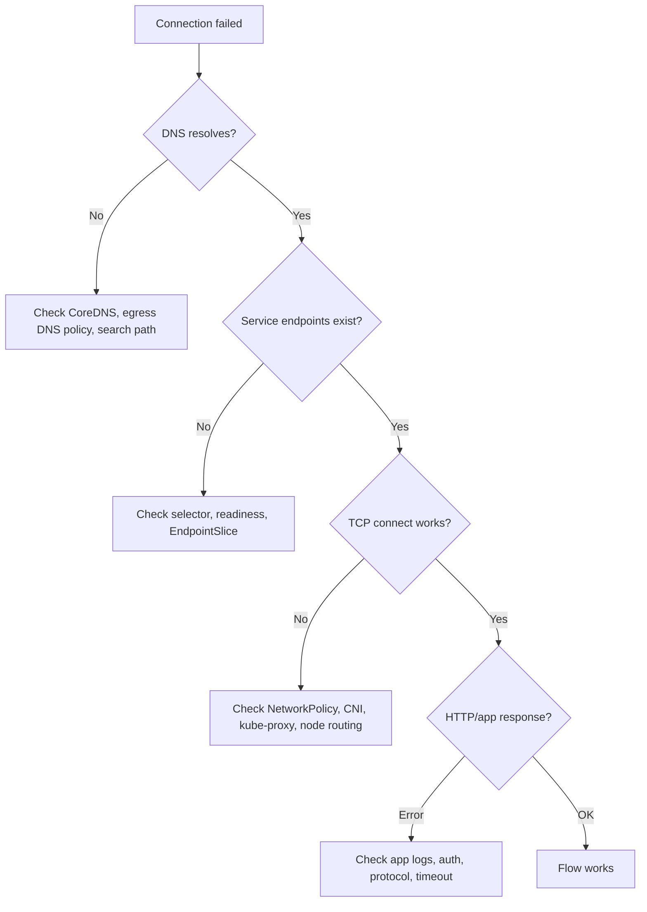

Useful commands:

```bash
# Show policies in namespace
kubectl -n payments get networkpolicy

# Inspect a policy
kubectl -n payments describe networkpolicy allow-api-from-frontend

# Show labels on namespaces
kubectl get namespaces --show-labels

# Show labels on pods
kubectl -n payments get pods --show-labels

# Check service endpoints
kubectl -n payments get svc,endpointslice

# Run temporary debug pod in a namespace
kubectl -n payments run net-debug --rm -it --image=curlimages/curl -- sh

# Test DNS and connectivity from inside the namespace
nslookup payments-api.payments.svc.cluster.local
curl -v http://payments-api.payments.svc.cluster.local:8080/health
```

If your platform permits ephemeral containers:

```bash
kubectl -n payments debug pod/payments-api-abc123 -it --image=nicolaka/netshoot --target=app
```

Be careful with debug images in production.

They are useful.

They are also privileged operational tools that should be governed.

---

## 16. Testing Policy as a Contract

Network policy should be tested like API compatibility.

Example connectivity test matrix:

| Source | Destination | Port | Expected |
|---|---|---:|---|
| checkout-api | payments-api | 8080 | allow |
| random pod in same namespace | payments-api | 8080 | deny |
| payments-api | kube-dns | 53 | allow |
| payments-api | ledger-api | 8080 | allow |
| payments-api | internet | 443 | deny except via proxy |
| observability scraper | payments-api | 9090 | allow |
| dev namespace pod | prod payments-api | 8080 | deny |

A GitOps workflow can run these as policy conformance checks before promotion.

Pseudo-flow:

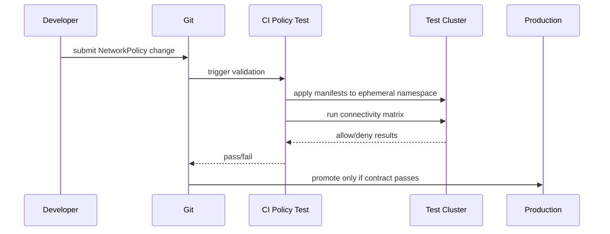

For regulated environments, keep the test matrix as evidence.

The question is not just:

> Did we configure a policy?

The stronger question is:

> Can we prove the expected communication graph is enforced?

---

## 17. Progressive Adoption Strategy

NetworkPolicy adoption fails when teams try to implement perfect zero trust in one sprint.

A safer adoption model:

### Phase 1: Inventory

Collect observed traffic:

- Service-to-Service calls.
- DNS usage.
- Database access.
- External API calls.
- Metrics scraping.
- Admin/debug paths.
- Batch and CronJob dependencies.

### Phase 2: Namespace Baseline for New Services

Apply default-deny to new namespaces first.

Do not start with legacy critical services unless you have observability.

### Phase 3: Ingress Isolation

Ingress is usually easier than egress.

Start by restricting who can call sensitive workloads.

### Phase 4: Egress Isolation

Move outbound dependencies behind explicit policies.

Treat DNS and telemetry as first-class dependencies.

### Phase 5: External Egress Governance

Route internet/SaaS traffic through controlled egress paths.

### Phase 6: Continuous Verification

Run connectivity tests and policy drift detection.

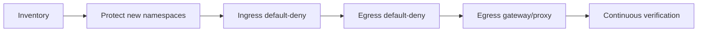

---

## 18. Multi-Tenant Design Considerations

In a multi-tenant cluster, NetworkPolicy becomes part of tenant isolation.

But it should not be the only boundary.

| Risk | NetworkPolicy Role | Additional Control |
|---|---|---|
| Tenant A calls Tenant B | Block cross-tenant traffic by default. | Namespace/RBAC isolation, admission policy. |
| Tenant changes labels to gain access | No native protection by itself. | Admission policy controls security labels. |
| Privileged workload bypasses assumptions | Limited. | Pod Security, runtime policy, node isolation. |
| HostNetwork workload reaches Pods | CNI-dependent behavior. | Restrict `hostNetwork`, dedicated nodes. |
| Shared system namespaces exposed | Allow only necessary paths. | Separate platform namespaces and RBAC. |
| Data exfiltration via internet | Egress restriction. | Egress proxy, DLP, logging, identity. |

Strong invariant:

> NetworkPolicy helps with tenant isolation, but tenant isolation also requires RBAC, admission control, Pod Security, resource quotas, namespace ownership, and sometimes dedicated clusters.

---

## 19. Policy Naming and Ownership

Policy names should communicate intent.

Bad names:

```text
np-1
allow-port
fix-timeout
backend-policy
```

Better names:

```text
default-deny-ingress
allow-dns-egress
allow-edge-gateway-to-payments-api
allow-checkout-to-payments-api
allow-observability-to-payments-metrics
allow-payments-to-egress-proxy
```

Use a naming template:

```text
<action>-<source>-to-<destination>[-<port-or-purpose>]
```

For namespace baseline:

```text
default-deny-ingress
default-deny-egress
allow-dns-egress
allow-observability-scrape
```

Ownership model:

| Policy Type | Owner |
|---|---|
| Namespace default deny | Platform/security |
| DNS/system exceptions | Platform |
| Application service-to-service rules | Application owner with platform review |
| External egress | Security/platform |
| Monitoring access | Observability/platform |
| Emergency exceptions | Platform/security with expiry |

Every exception should have:

- Reason.
- Owner.
- Expiry or review date.
- Ticket/change reference.
- Expected source and destination.
- Test proving it works and does not over-allow.

---

## 20. Anti-Patterns

### 20.1 Writing Allow-All and Calling It Security

```yaml
spec:
  podSelector: {}
  ingress:
    - {}
```

This allows all ingress to selected Pods.

Sometimes this is intentional.

Often it is accidental.

### 20.2 Trusting App Labels for Security Zones

If a team can set `zone=trusted`, `zone=trusted` is not a security control.

### 20.3 Ignoring Egress

Ingress-only isolation still allows compromised workloads to call outbound services or exfiltrate data if network paths exist.

### 20.4 Breaking DNS

Default-deny egress without DNS allowance is a classic outage.

### 20.5 Using IPs as Application Identity

Pod IPs are ephemeral.

Services abstract Pod identity.

Use selectors for workloads and controlled egress patterns for external dependencies.

### 20.6 No Policy Tests

A policy that is not tested is a wish.

### 20.7 Assuming NetworkPolicy Equals Zero Trust

Zero trust also needs identity, authentication, authorization, encryption, telemetry, audit, and governance.

---

## 21. Production Review Checklist

Before merging a NetworkPolicy change, review:

| Check | Pass Criteria |
|---|---|
| CNI support | Cluster plugin enforces NetworkPolicy. |
| Direction | `Ingress`, `Egress`, or both are intentional. |
| Selected Pods | `podSelector` matches exactly intended Pods. |
| Peer selectors | Namespace and Pod selectors are not accidentally broad. |
| DNS | Egress policy preserves DNS where required. |
| Ports | Only required ports are open. |
| Namespace labels | Security labels are platform-controlled. |
| External access | External egress is explicit and auditable. |
| Observability | Logs/metrics/debug path exist for policy drops. |
| Tests | Connectivity matrix passes. |
| Rollback | Revert path is known. |
| Documentation | Reason and owner are recorded. |

---

## 22. Failure Modes and Remedies

| Symptom | Likely Cause | Check | Remedy |
|---|---|---|---|
| DNS lookup fails after policy rollout | DNS egress denied | Test UDP/TCP 53 to CoreDNS | Add explicit DNS egress rule. |
| Service resolves but connection times out | Ingress or egress policy blocks TCP | Test from source Pod, inspect policies | Add precise allow rule. |
| Works from one namespace but not another | Namespace selector mismatch | Check namespace labels | Fix labels or selector. |
| Policy exists but traffic still allowed | CNI does not enforce policy | Verify CNI support | Use enforcing CNI or enable policy engine. |
| Some Pods allowed, some denied | Label mismatch or propagation delay | Show Pod labels and endpoints | Fix labels, wait/retry, inspect CNI. |
| HostNetwork Pod bypasses policy assumptions | CNI limitation | Inspect Pod spec and CNI docs | Restrict hostNetwork or isolate nodes. |
| External SaaS intermittently fails | IP ranges changed | Trace destination IPs | Use egress proxy or provider-managed ranges. |
| Metrics scrape stops | Observability ingress blocked | Check scraper source namespace | Add explicit monitoring allow. |

---

## 23. Minimal Hands-On Lab

Create a namespace and two workloads.

```bash
kubectl create namespace netpol-lab
kubectl label namespace netpol-lab platform.example.com/environment=dev

kubectl -n netpol-lab create deployment api --image=nginx --port=80
kubectl -n netpol-lab expose deployment api --port=80

kubectl -n netpol-lab run client --image=curlimages/curl -- sleep 3600
kubectl -n netpol-lab run stranger --image=curlimages/curl -- sleep 3600
kubectl -n netpol-lab label pod client role=client
```

Verify access before policy:

```bash
kubectl -n netpol-lab exec client -- curl -sS http://api
kubectl -n netpol-lab exec stranger -- curl -sS http://api
```

Apply default-deny ingress:

```yaml
apiVersion: networking.k8s.io/v1
kind: NetworkPolicy
metadata:
  name: default-deny-ingress
  namespace: netpol-lab
spec:
  podSelector: {}
  policyTypes:
    - Ingress
```

Allow only `role=client` to call `api`:

```yaml
apiVersion: networking.k8s.io/v1
kind: NetworkPolicy
metadata:
  name: allow-client-to-api
  namespace: netpol-lab
spec:
  podSelector:
    matchLabels:
      app: api
  policyTypes:
    - Ingress
  ingress:
    - from:
        - podSelector:
            matchLabels:
              role: client
      ports:
        - protocol: TCP
          port: 80
```

Expected result:

```bash
kubectl -n netpol-lab exec client -- curl -sS --connect-timeout 3 http://api
# should work

kubectl -n netpol-lab exec stranger -- curl -sS --connect-timeout 3 http://api
# should fail or time out depending on implementation
```

Then clean up:

```bash
kubectl delete namespace netpol-lab
```

If both clients can still access the API after applying policy, your cluster likely does not enforce NetworkPolicy or your labels do not match what you think.

---

## 24. Mental Compression

Remember this compact model:

```text
Service = stable name and load-balancing target.
NetworkPolicy = allowed connectivity graph.
CNI = enforcement mechanism.
Labels = security-critical selectors.
Default-deny = baseline posture.
Allow rules = explicit business communication contracts.
Tests = evidence that the graph is enforced.
```

NetworkPolicy mastery is less about YAML and more about graph discipline.

You should be able to draw the expected communication graph, encode it, test it, and explain its risk boundaries.

---

## 25. References

- Kubernetes Documentation — Network Policies: `https://kubernetes.io/docs/concepts/services-networking/network-policies/`
- Kubernetes Documentation — Declare Network Policy: `https://kubernetes.io/docs/tasks/administer-cluster/declare-network-policy/`
- Kubernetes Documentation — Services, Load Balancing, and Networking: `https://kubernetes.io/docs/concepts/services-networking/`
- Kubernetes Documentation — Labels and Selectors: `https://kubernetes.io/docs/concepts/overview/working-with-objects/labels/`
- Kubernetes Documentation — DNS for Services and Pods: `https://kubernetes.io/docs/concepts/services-networking/dns-pod-service/`
- Kubernetes Documentation — Pod Security Standards: `https://kubernetes.io/docs/concepts/security/pod-security-standards/`

---

## 26. What Comes Next

NetworkPolicy gives us reachability control.

But modern distributed systems often need more:

- workload identity,
- mutual TLS,
- request-aware routing,
- retries and timeouts,
- circuit breaking,
- traffic mirroring,
- L7 authorization,
- and service-to-service telemetry.

Those needs lead to the next part:

```text
learn-kubernetes-deployment-model-part-018-service-mesh.mdx
```
