------
title: Learn Kubernetes, Deployment Model, and Cloud Native Platform Engineering - Part 018
description: Deep dive into service mesh in Kubernetes, including when mesh is useful, sidecar and ambient models, mTLS, traffic policy, retries, circuit breaking, observability, Gateway API GAMMA, operational cost, and adoption strategy.
series: learn-kubernetes-deployment-model
seriesTitle: Learn Kubernetes, Deployment Model, and Cloud Native Platform Engineering
order: 18
partTitle: Service Mesh: When Kubernetes Networking Is Not Enough
tags:
- kubernetes
- deployment
- service-mesh
- istio
- linkerd
- envoy
- mtls
- traffic-management
- observability
- platform-engineering
date: 2026-07-01
---

# Part 018 — Service Mesh: When Kubernetes Networking Is Not Enough

> Goal: understand service mesh as an infrastructure layer for service-to-service traffic management, workload identity, mTLS, policy, and telemetry; learn when it is worth the operational cost, when it is overkill, and how to adopt it without turning the platform into a proxy debugging exercise.

Kubernetes gives us Pods, Services, DNS, EndpointSlice, NetworkPolicy, Ingress, and Gateway API.

That is already a strong networking foundation.

So the first serious service mesh question is not:

> Which service mesh should we install?

The first question is:

> What capability do we need that Kubernetes networking does not already provide well enough?

Service mesh is powerful.

It is also expensive in complexity, latency, resource overhead, ownership, failure modes, and operational learning curve.

A top engineer does not add mesh because the architecture diagram looks modern.

A top engineer adds mesh when the organization has a concrete need for consistent service-to-service policy that cannot be handled cleanly inside application libraries, gateways, or basic Kubernetes networking.

---

## 1. Service Mesh in One Mental Model

A service mesh is an infrastructure layer that intercepts service-to-service communication and applies traffic, security, and observability policy without requiring every application to implement those features itself.

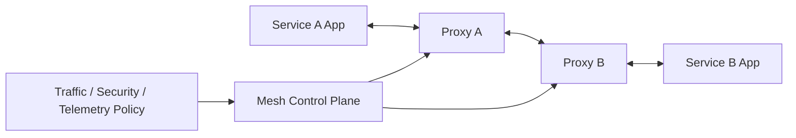

The application sends a normal request.

The local proxy intercepts it.

The proxy applies mesh configuration.

The remote proxy receives it.

The application receives the request.

Depending on implementation and mode, that proxy may be a sidecar, a node-level component, a waypoint proxy, or another data-plane form.

The key idea is not the sidecar.

The key idea is policy-driven communication outside application code.

---

## 2. What Kubernetes Networking Already Gives You

Before adding mesh, respect what Kubernetes already provides.

| Capability | Kubernetes Primitive |
|---|---|
| Stable service discovery | Service + DNS |
| Load balancing across ready endpoints | Service + EndpointSlice + kube-proxy/CNI data plane |
| Basic ingress routing | Ingress / Gateway API |
| Basic pod reachability control | NetworkPolicy |
| Workload deployment and rollout | Deployment / StatefulSet / DaemonSet |
| Metrics/logs/events foundation | Kubernetes Events + app/platform observability stack |

For many systems, these are enough.

A mesh is justified when you need consistent cross-cutting capabilities that are difficult to standardize across many services and languages.

---

## 3. What Service Mesh Adds

A service mesh usually adds five categories of capability.

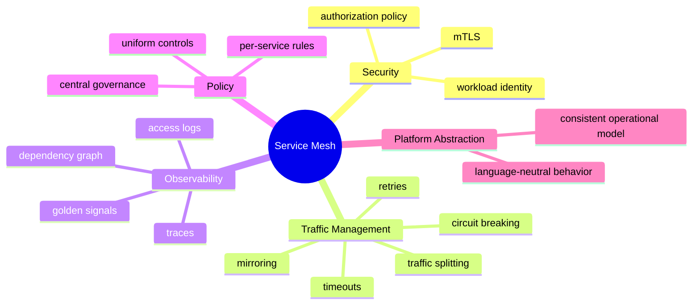

The most common reasons to adopt mesh:

| Need | Why Basic Kubernetes May Not Be Enough |
|---|---|
| Mutual TLS between services | Services do not provide encryption or workload identity by themselves. |
| Workload identity | NetworkPolicy uses selectors and reachability, not cryptographic identity. |
| Request-aware routing | NetworkPolicy is L3/L4; Services do not route by header/path/version. |
| Fine-grained canary traffic | Deployment can roll Pods, but it does not do percentage-based L7 traffic splits. |
| Consistent retries/timeouts | Application teams may implement them inconsistently. |
| Service dependency telemetry | App metrics may not expose every inter-service edge consistently. |
| Authorization policy at service layer | Kubernetes RBAC governs API access, not app-to-app requests. |

---

## 4. When Not to Use a Service Mesh

Service mesh is often over-applied.

Do not adopt a mesh when:

| Situation | Better First Move |
|---|---|
| You only need north-south routing | Use Gateway API / Ingress / API gateway. |
| You only need namespace isolation | Use NetworkPolicy. |
| You only need app metrics | Instrument the application with OpenTelemetry/Prometheus. |
| You have five services and one language | Shared libraries and gateway controls may be enough. |
| Your team cannot operate Kubernetes basics yet | Fix platform maturity first. |
| Latency budget is extremely tight | Measure mesh overhead before committing. |
| Ownership model is unclear | Define platform/app/security responsibilities first. |
| You expect mesh to fix bad service design | Fix timeouts, contracts, idempotency, and dependency design first. |

A mesh amplifies platform maturity.

It does not create it.

---

## 5. Sidecar Model

The classic service mesh deployment model injects a proxy sidecar into every workload Pod.

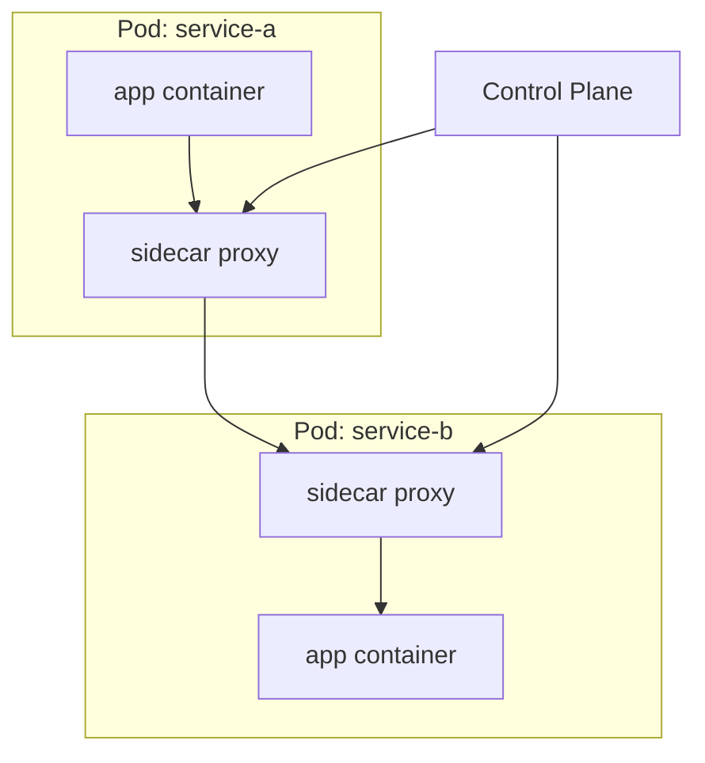

Benefits:

- Strong per-workload traffic interception.
- Mature model in systems like Istio sidecar mode and Linkerd.
- Fine-grained telemetry and policy.
- Works naturally with Pod identity.

Costs:

- More containers per Pod.
- More CPU and memory consumption.
- More startup and shutdown complexity.
- More moving parts during debugging.
- Possible sidecar injection and version skew problems.
- Application lifecycle can be affected by proxy readiness.

Sidecar model changes the meaning of a Pod.

A Pod is no longer only the application container and its helpers.

It includes a network enforcement and telemetry component on the hot path.

---

## 6. Ambient / Sidecarless Direction

Some modern mesh implementations have moved toward reducing or avoiding per-Pod sidecars.

Istio, for example, supports ambient mode, which separates secure L4 overlay concerns from optional L7 processing through waypoint proxies.

The broad idea:

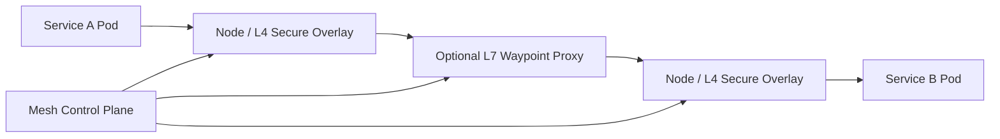

The architectural motivation:

- Reduce sidecar overhead.
- Simplify application Pod lifecycle.
- Apply mTLS and identity without injecting every Pod.
- Apply L7 policy only where required.

The trade-off:

- Different debugging model.
- Different operational maturity profile.
- Different feature coverage depending on implementation and version.
- More need to understand data-plane placement.

Do not treat sidecarless mesh as magic.

It simply moves the proxying and policy enforcement boundary.

You still need to understand where traffic is intercepted, where policy applies, and how failures propagate.

---

## 7. Control Plane vs Data Plane

Service mesh architecture has two major parts.

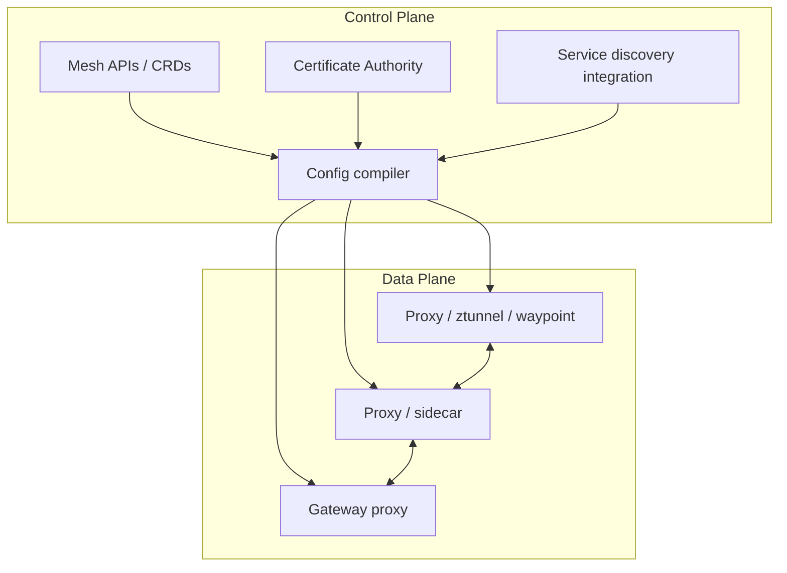

| Plane | Responsibility |
|---|---|
| Control plane | Watches platform state, processes mesh configuration, distributes proxy config, manages identities/certificates. |
| Data plane | Intercepts traffic, enforces mTLS, applies routing/policy, emits telemetry. |

Debugging mesh requires knowing which plane failed.

A request can fail because:

- Kubernetes Service has no endpoints.
- NetworkPolicy blocks traffic.
- Proxy has stale config.
- mTLS identity is invalid.
- AuthorizationPolicy denies request.
- DestinationRule causes bad load balancing or TLS mode.
- VirtualService/HTTPRoute misroutes traffic.
- The app returns an error.

A mesh adds power because it adds decision points.

It adds failure modes for the same reason.

---

## 8. Mesh Security: Identity, mTLS, and Authorization

NetworkPolicy usually asks:

> Is this network path allowed?

Mesh security asks:

> Which workload is calling, is the connection encrypted, and is this caller allowed to access this service?

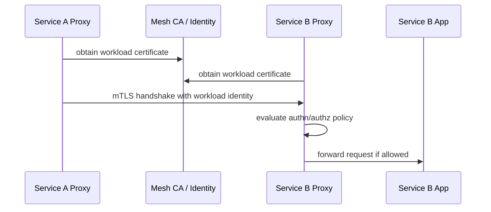

Typical mesh security primitives:

| Primitive | Purpose |
|---|---|
| Workload identity | Assign cryptographic identity to a service/workload. |
| mTLS | Encrypt service-to-service traffic and authenticate peers. |
| Authentication policy | Define accepted peer/user authentication modes. |
| Authorization policy | Define which identities may call which workloads/actions. |
| Certificate rotation | Keep workload credentials short-lived and managed. |

Strong invariant:

> NetworkPolicy limits possible paths; mesh identity proves who is on the path.

Use both where risk justifies it.

---

## 9. Mesh Traffic Management

Service mesh traffic management commonly includes:

- retries,
- timeouts,
- circuit breaking,
- outlier detection,
- traffic splitting,
- mirroring,
- fault injection,
- request matching by headers/path,
- per-subset routing,
- and service-level load balancing policy.

Example: canary split at traffic layer.

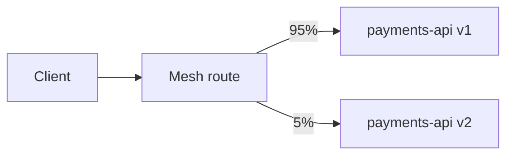

This is different from Kubernetes Deployment rolling update.

Deployment changes the number of Pods.

Mesh routing changes which requests go to which version.

That separation gives more control.

It also creates a new consistency challenge:

| Layer | State |
|---|---|
| Deployment | Which Pods exist? |
| Service | Which Pods are endpoints? |
| Mesh route | Which endpoints receive which traffic share? |
| Metrics gate | Is the candidate healthy? |
| GitOps state | Which version is intended? |

A senior engineer checks all layers during release debugging.

---

## 10. Retries: Useful and Dangerous

Retries are one of the most dangerous mesh features.

They can improve resilience for transient failures.

They can also multiply load during partial outages.

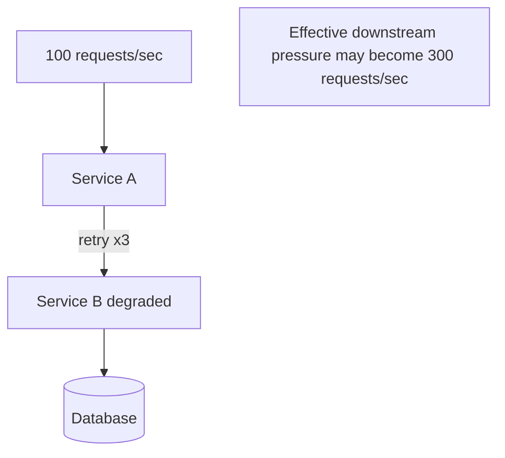

Retry rules:

| Rule | Reason |
|---|---|
| Retry only idempotent or safely retryable operations. | Avoid duplicate side effects. |
| Bound retry count and total timeout. | Prevent request amplification. |
| Use jitter and backoff where possible. | Avoid synchronized storms. |
| Coordinate app and mesh retries. | Avoid retry stacking. |
| Monitor retry rate separately. | Retries can hide user-facing risk until saturation. |

Bad pattern:

```text
App retries 3 times.
Mesh retries 3 times.
Client retries 3 times.
Total possible attempts = 27.
```

A mesh does not know your business semantics.

It cannot infer whether charging a card is safe to retry.

---

## 11. Timeouts and Circuit Breaking

Timeouts define how long a caller waits.

Circuit breaking defines when to stop sending traffic to an unhealthy or overloaded destination.

Without explicit timeouts, callers can wait too long and consume threads, connections, memory, or event-loop capacity.

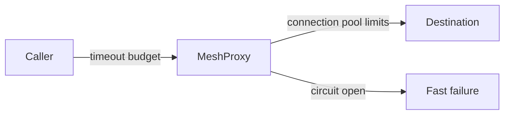

Design principles:

| Principle | Explanation |
|---|---|
| Timeout budgets should shrink downstream. | Avoid downstream calls outliving upstream user request. |
| Circuit breakers protect the dependency and the caller. | Prevent cascading saturation. |
| Fast failure must be paired with graceful degradation. | Otherwise users only see faster errors. |
| Mesh policy must align with app behavior. | Proxy cannot understand all domain recovery paths. |

Example budget:

```text
User-facing request budget: 1000 ms
API gateway budget: 900 ms
Service A to B: 300 ms
Service B to database: 150 ms
Fallback path: 50 ms
Response assembly: 100 ms
Buffer: 400 ms
```

The numbers are not universal.

The point is budget discipline.

---

## 12. Observability from Mesh

A mesh can emit telemetry for service-to-service communication without requiring each application team to implement the same instrumentation.

Common signals:

| Signal | Value |
|---|---|
| Request volume | Which services talk and how much. |
| Latency | Where time is spent across service edges. |
| Error rate | Which dependencies are failing. |
| Saturation/proxy stats | Whether proxy or upstream is overloaded. |
| Access logs | Per-request source/destination metadata. |
| Traces | Call graph and request propagation. |

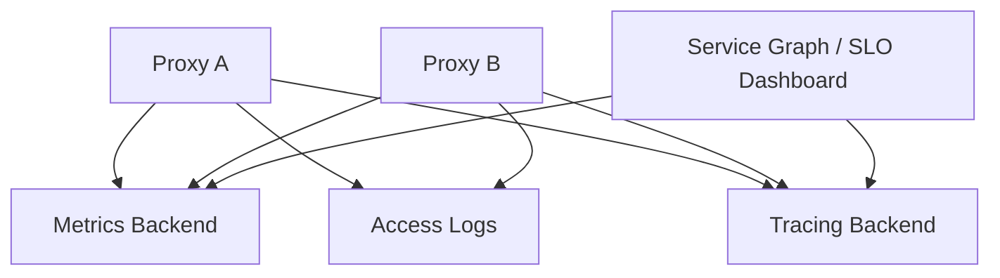

But mesh telemetry is not a replacement for application observability.

Mesh can tell you:

> Service A called Service B and got HTTP 500 after 120 ms.

It may not tell you:

> The business rule failed because account status was suspended and the ledger event was rejected.

Use mesh telemetry for infrastructure-level service communication.

Use application telemetry for domain behavior.

---

## 13. Mesh and Gateway API GAMMA

Gateway API originally focused heavily on north-south traffic.

The GAMMA initiative extends Gateway API concepts into service mesh use cases.

The key idea is that routes such as `HTTPRoute` can attach directly to a Kubernetes `Service` for mesh traffic.

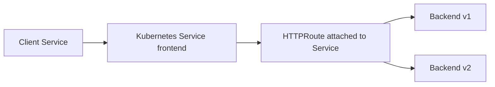

This matters because it points toward a more Kubernetes-native, implementation-neutral API model for east-west traffic policy.

Instead of every mesh requiring entirely different routing APIs, Gateway API can provide common abstractions where implementations conform.

Important distinction:

| Use Case | Traditional Primitive | Gateway API / GAMMA Direction |
|---|---|---|
| External HTTP routing | Ingress / Gateway / HTTPRoute | Gateway + HTTPRoute |
| Internal service-to-service routing | Mesh-specific CRDs | HTTPRoute attached to Service |
| Ownership boundary | Platform owns Gateway; app owns Route | Route ownership can map to service ownership |

This does not mean every mesh feature is portable.

Advanced behavior still varies by implementation.

But the standardization direction is important for platform design.

---

## 14. Service Mesh vs API Gateway vs Ingress vs NetworkPolicy

These tools overlap in diagrams but solve different problems.

| Tool | Primary Scope | Best For | Not Best For |
|---|---|---|---|
| NetworkPolicy | L3/L4 Pod reachability | Namespace/workload network isolation | HTTP path/header rules, mTLS identity |
| Ingress | Basic north-south HTTP entry | Simple HTTP exposure | Rich role model, east-west traffic |
| Gateway API | North-south and emerging mesh routing | Role-oriented routing, extensible traffic APIs | Workload identity by itself |
| API Gateway | External API management | Auth, rate limit, monetization, developer portal, external API governance | Transparent internal service-to-service control |
| Service Mesh | East-west service communication | mTLS, L7 traffic policy, service telemetry | Simple apps with low complexity |

A common mature architecture:

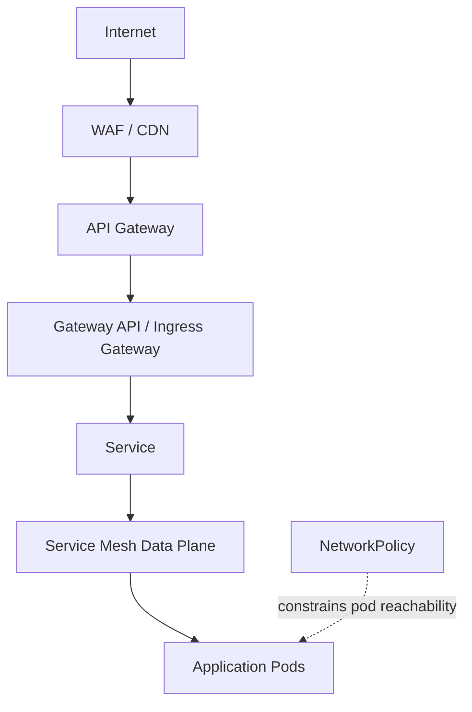

Each layer has a job.

Do not ask one layer to do all jobs.

---

## 15. Mesh Failure Modes

A service mesh adds a second distributed system inside your distributed system.

Common failure modes:

| Failure Mode | Symptom | Root Cause |
|---|---|---|
| Sidecar injection missing | Some workloads bypass mesh policy | Namespace label, webhook failure, exclusion annotation. |
| Proxy not ready | App appears started but traffic fails | Readiness ordering or proxy bootstrap issue. |
| mTLS mismatch | Connection reset / 503 / handshake failure | Peer policy mismatch, cert issue, excluded workload. |
| Bad route rule | Traffic goes to wrong version | Incorrect match, subset, route precedence. |
| Retry storm | Downstream overload worsens | Excess retries during partial failure. |
| Telemetry cost spike | Metrics backend overloaded | High-cardinality labels or verbose access logs. |
| Control plane outage | New config/certs fail to propagate | Mesh control plane unavailable. |
| Proxy resource starvation | Latency and 5xx increase | Sidecar CPU/memory too low. |
| Version skew | Unexpected behavior after upgrade | Control plane/data plane incompatibility. |
| Hidden dependency blocked | Traffic fails after strict policy | Missing ServiceEntry/egress/authorization rule. |

Debugging mesh requires a layered flow.

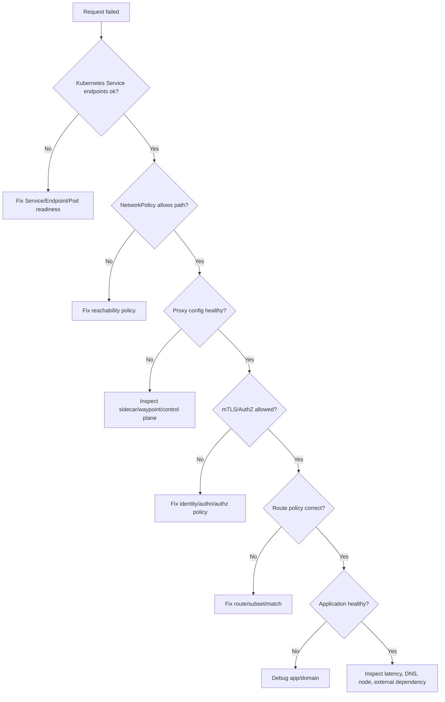

---

## 16. Resource and Latency Cost

Service mesh data planes sit on the hot path.

They consume CPU and memory.

They can add latency.

They can increase connection count.

They can increase telemetry volume.

They can increase operational toil.

That does not mean mesh is bad.

It means mesh must be justified and measured.

Cost checklist:

| Cost | Measurement |
|---|---|
| Sidecar CPU | Proxy CPU usage per RPS and per connection count. |
| Sidecar memory | Baseline memory per workload and under load. |
| Tail latency | p95/p99 before and after mesh. |
| Startup latency | Pod readiness with injection. |
| Telemetry volume | Metrics cardinality, log volume, trace sampling. |
| Operational complexity | Number of new alerts, dashboards, runbooks. |
| Upgrade cost | Control plane and data plane rollout process. |

Performance rule:

> Never adopt mesh without a before/after benchmark on representative traffic.

Representative means:

- realistic payload sizes,
- realistic concurrency,
- realistic TLS settings,
- realistic telemetry configuration,
- realistic retry/timeout policies,
- realistic node sizes,
- and representative service call depth.

---

## 17. Adoption Strategy

Do not mesh the whole cluster on day one.

A safer adoption path:

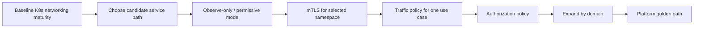

### Phase 0: Baseline Readiness

Before mesh:

- Services and readiness are correct.
- NetworkPolicy posture is understood.
- Workload labels are disciplined.
- Observability stack is stable.
- GitOps or equivalent change control exists.
- Teams know how to debug Kubernetes traffic without mesh.

### Phase 1: Pick a Narrow Use Case

Good candidates:

- mTLS between two sensitive services.
- Canary traffic split for one high-value service.
- Service dependency telemetry for one domain.
- Authorization policy for one internal API.

Bad candidates:

- “All services, immediately.”
- “Install mesh because platform modernization.”
- “Maybe it will fix outages.”

### Phase 2: Run Permissive First

Many meshes allow a permissive mode before strict enforcement.

Use it to discover plaintext traffic, missing identities, and unexpected dependencies.

### Phase 3: Enforce Gradually

Move to strict mTLS or authorization one namespace/service at a time.

Use dashboards and rollback plans.

### Phase 4: Standardize Golden Paths

Create templates and platform APIs.

Application teams should not handcraft complex mesh policy from scratch every time.

---

## 18. Ownership Model

Mesh adoption fails when ownership is vague.

| Area | Typical Owner |
|---|---|
| Mesh control plane installation | Platform team |
| Mesh upgrades | Platform team with app coordination |
| Global defaults | Platform/security |
| mTLS posture | Platform/security |
| Service route ownership | App team within guardrails |
| Authorization policy | App team + security review |
| Observability dashboards | Platform + service owner |
| Incident response | Joint: service owner + platform |
| Exception handling | Security/platform |

Define RACI before production enforcement.

Example:

| Decision | Responsible | Accountable | Consulted | Informed |
|---|---|---|---|---|
| Enable mesh in namespace | Platform | Platform lead | App owner, security | SRE |
| Enforce strict mTLS | Security/platform | Security lead | App owner | Engineering |
| Add route split | App owner | App owner | Platform | SRE |
| Change global retry policy | Platform | SRE lead | App teams | Engineering |
| Upgrade data plane | Platform | Platform lead | App owners | Security |

---

## 19. Policy Design Guidelines

### 19.1 Prefer Explicit Service Ownership

Every mesh policy should answer:

- Which service owns this policy?
- Which clients are allowed?
- Which traffic behavior is intended?
- Which SLO does this policy protect?
- What is the rollback?

### 19.2 Avoid Global Magic

Global retries, global timeouts, and global mTLS changes can have huge blast radius.

Prefer safe defaults plus service-specific policy.

### 19.3 Keep Request Semantics in Mind

Mesh can route by header.

It cannot understand your domain rules unless you encode them safely.

Do not route payment capture, user deletion, or irreversible commands using casual A/B rules.

### 19.4 Limit High Cardinality Telemetry

Labels like user ID, request ID, email, account number, or arbitrary path values can explode metrics cardinality.

Mesh observability should be useful, not bankrupt your metrics backend.

### 19.5 Treat Mesh Config as Production Code

Mesh config should have:

- code review,
- schema validation,
- policy checks,
- staged rollout,
- tests,
- owner metadata,
- rollback path,
- and audit trail.

---

## 20. Mesh and Progressive Delivery

Mesh is often used with progressive delivery controllers.

Example flow:

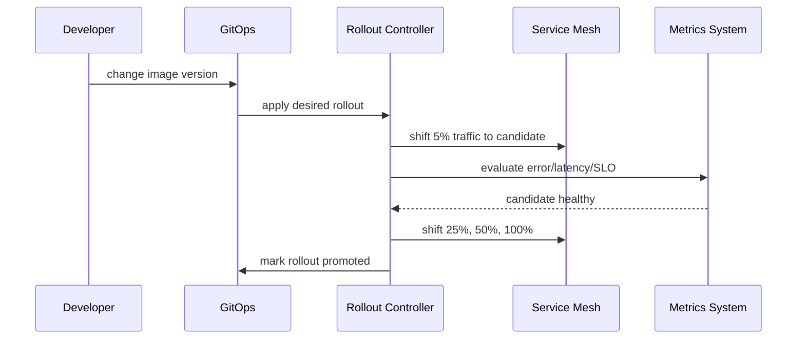

Mesh gives traffic control.

The rollout controller gives decision automation.

Metrics provide feedback.

The application still needs compatibility discipline.

Progressive delivery does not save you from:

- incompatible database migrations,
- non-idempotent event consumers,
- breaking API contracts,
- bad feature flags,
- or shared dependency overload.

---

## 21. Example: mTLS and Authorization Rollout

Imagine `checkout-api` calls `payments-api`.

Target posture:

- Only `checkout-api` may call `payments-api` on its application port.
- Traffic must use mTLS.
- The caller identity must be verified.
- Unauthorized callers should be denied.
- NetworkPolicy also restricts reachability.

Layered model:

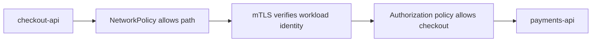

This layered model is stronger than any single control.

| Layer | Failure If Missing |
|---|---|
| NetworkPolicy | Any Pod may attempt to connect. |
| mTLS | Caller identity may be spoofed or traffic may be plaintext. |
| AuthorizationPolicy | Any valid mesh workload may call. |
| App authorization | Business action may still be unauthorized. |

The final layer is still the application.

Do not delegate business authorization entirely to mesh.

---

## 22. Mesh Runbook Questions

Before production adoption, every platform should have answers to these questions.

| Question | Why It Matters |
|---|---|
| How do we know a workload is in the mesh? | Avoid partial policy enforcement. |
| How do we debug proxy config? | Misconfiguration is common. |
| How do we inspect certificates? | mTLS failures require identity visibility. |
| How do we bypass mesh during emergency? | Break-glass may be needed. |
| How do we rotate control plane certificates? | Trust chain management is critical. |
| How do we upgrade proxies safely? | Data plane rollout can affect every request. |
| How do we detect retry storms? | Retries can amplify outages. |
| How do we control telemetry cardinality? | Observability can become a cost incident. |
| How do we handle non-HTTP protocols? | L7 policy depends on protocol support. |
| Who owns authorization policy? | Security and app semantics overlap. |

No runbook, no strict mesh enforcement.

---

## 23. Common Anti-Patterns

### 23.1 Mesh Before Kubernetes Maturity

If the team cannot debug Services, EndpointSlices, DNS, readiness, and NetworkPolicy, mesh will multiply confusion.

### 23.2 Global Retry Defaults

Retries everywhere can turn partial failure into cascading failure.

### 23.3 Treating mTLS as Authorization

mTLS proves identity and encrypts traffic.

It does not automatically mean the caller is allowed to perform an action.

### 23.4 Handcrafted Policy Everywhere

If every team writes bespoke mesh policy without guardrails, the platform becomes inconsistent and unsafe.

### 23.5 Ignoring Proxy Resource Limits

Under-provisioned proxies cause latency and 5xx that look like application failure.

### 23.6 Too Much Telemetry

Full access logs and high-cardinality metrics for every service can overwhelm storage and query systems.

### 23.7 No Version Skew Plan

Control plane and data plane upgrades require compatibility planning.

### 23.8 Confusing API Gateway with Mesh

External API management and internal service communication overlap, but they are not the same problem.

---

## 24. Production Readiness Checklist

| Area | Requirement |
|---|---|
| Business case | Clear reason mesh is needed. |
| Baseline benchmark | Latency, CPU, memory, telemetry cost measured before mesh. |
| Candidate scope | First adoption path is narrow and reversible. |
| Ownership | Platform, app, and security responsibilities defined. |
| Identity | Workload identity model documented. |
| mTLS | Permissive-to-strict migration plan exists. |
| Policy | Authorization policy reviewed and tested. |
| Traffic | Retry, timeout, circuit breaking rules are explicit. |
| Observability | Dashboards distinguish app, proxy, and control plane failures. |
| Runbooks | Debugging and rollback instructions exist. |
| GitOps | Mesh config is reviewed and promoted like code. |
| Upgrade plan | Control plane and data plane upgrade strategy exists. |
| Exception process | Break-glass and expiry rules exist. |

---

## 25. Decision Framework

Use this practical decision tree.

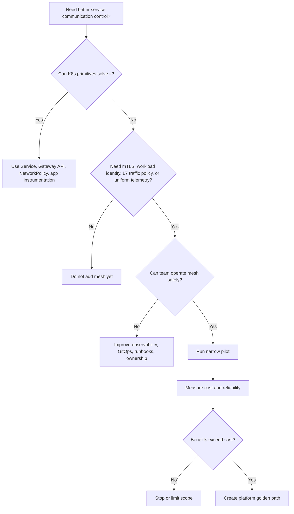

Mesh adoption should be evidence-driven.

Not trend-driven.

---

## 26. Minimal Hands-On Exploration

This is not a vendor-specific tutorial, but a good lab should answer these questions:

1. Can you identify which workloads are in the mesh?
2. Can you observe service-to-service traffic?
3. Can you enforce mTLS between two services?
4. Can you deny one caller and allow another?
5. Can you split traffic between two versions?
6. Can you observe proxy CPU/memory and added latency?
7. Can you roll back the mesh policy without redeploying the app?

Lab structure:

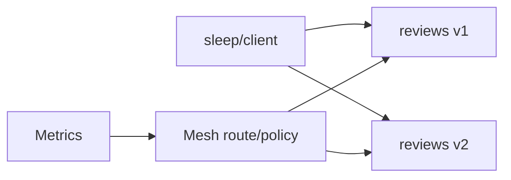

Expected exercises:

- Baseline call without mesh.
- Enable mesh for one namespace.
- Observe telemetry.
- Enable mTLS permissive.
- Move to strict mTLS.
- Add authorization policy.
- Add 90/10 traffic split.
- Introduce fault injection or failure.
- Remove policy and confirm rollback.

The lesson is not the commands.

The lesson is the control loop:

```text
Define policy -> apply policy -> observe behavior -> validate contract -> measure cost -> decide next scope.
```

---

## 27. Mental Compression

Remember this compact model:

```text
Kubernetes Service = stable discovery and load balancing.
NetworkPolicy = coarse reachability control.
Gateway API = role-oriented routing API.
Service mesh = service-to-service policy, identity, traffic management, and telemetry layer.
Application code = domain semantics and business authorization.
```

A service mesh is valuable when it centralizes repeated infrastructure concerns that would otherwise be inconsistently implemented in every service.

It is harmful when it hides basic networking confusion behind more abstractions.

---

## 28. References

- Istio Documentation — The Istio Service Mesh: `https://istio.io/latest/about/service-mesh/`
- Istio Documentation — Traffic Management: `https://istio.io/latest/docs/concepts/traffic-management/`
- Istio Documentation — Security: `https://istio.io/latest/docs/concepts/security/`
- Istio Documentation — Observability: `https://istio.io/latest/docs/concepts/observability/`
- Gateway API Documentation — Gateway API for Service Mesh: `https://gateway-api.sigs.k8s.io/docs/mesh/mesh-overview/`
- Kubernetes Documentation — Network Policies: `https://kubernetes.io/docs/concepts/services-networking/network-policies/`
- Kubernetes Documentation — Gateway API: `https://gateway-api.sigs.k8s.io/`
- CNCF — Istio Project: `https://www.cncf.io/projects/istio/`

---

## 29. What Comes Next

At this point, we understand Kubernetes traffic from several angles:

- Service discovery,
- north-south routing,
- network isolation,
- and service mesh.

Next we move into persistence:

```text
learn-kubernetes-deployment-model-part-019-storage-model.mdx
learn-kubernetes-deployment-model-part-020-stateful-workloads.mdx
```

Storage is where Kubernetes stops feeling stateless and starts forcing us to reason about identity, attachment, lifecycle, failure domain, and data durability.
